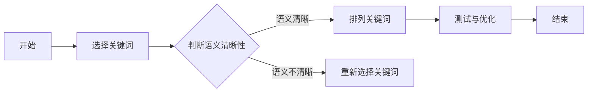
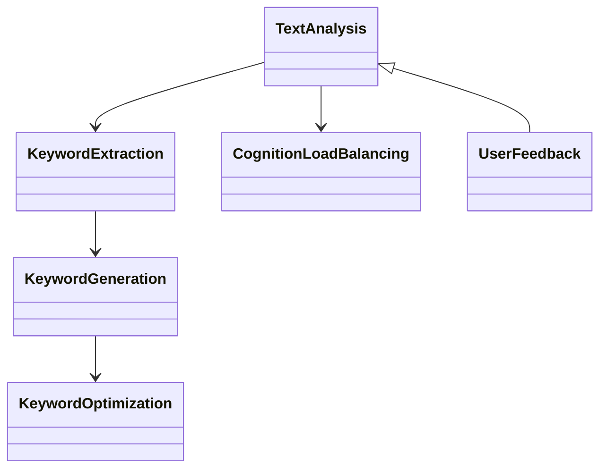
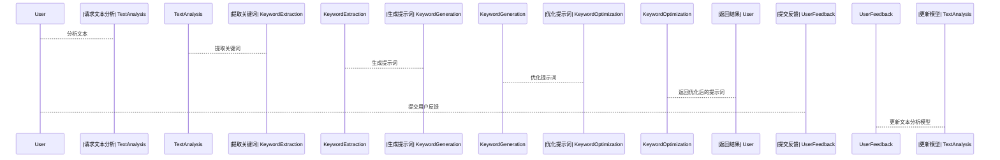
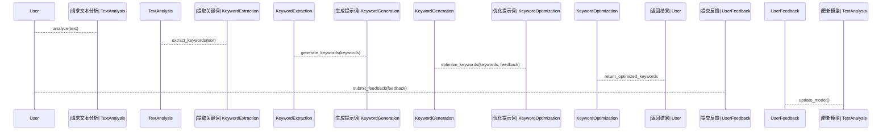

                 

# 提示词设计的认知语言学原理与实践

关键词：认知语言学、提示词设计、文本理解、语义清晰性、认知负荷平衡

摘要：本文深入探讨了提示词设计的认知语言学原理与实践。首先，从认知语言学的基本概念和语言与认知的关系入手，解释了提示词的定义和作用。接着，介绍了提示词的分类与特性，并提出了提示词设计的核心原则。然后，详细阐述了提示词设计的实践方法，包括提示词的选择、排列和测试与优化。此外，通过文学和学术论文中的案例，展示了提示词设计的实际应用效果。最后，展望了提示词设计的未来趋势，包括人工智能的融入和跨学科的融合。

## 1.1 提示词设计的认知语言学原理

### 1.1.1 认知语言学的定义和语言与认知的关系

**认知语言学的定义**：认知语言学是语言学的一个分支，主要研究语言与人类认知之间的关系。它关注语言结构和认知过程之间的互动，认为语言不仅是沟通的工具，更是认知活动的体现。

**语言与认知的关系**：认知语言学认为语言和认知是相互关联的。语言的使用不仅反映了人类的认知过程，也影响了认知的发展。语言作为一种认知工具，帮助人们组织和处理信息，形成对世界的理解。

**核心观点**：认知语言学强调语言的结构与人类感知、记忆、思维等认知过程密切相关。语言的结构反映了人类认知世界的方式，同时也影响了人们的思维方式。

### 1.1.2 提示词的定义和作用

**提示词的定义**：提示词（trigger words）是在文本中用来引导读者理解、推理或产生联想的词汇。它们通常具有明确的语义，可以引起特定的认知反应。

**提示词的作用**：
1. **引导理解**：提示词可以帮助读者关注文本中的关键信息，理解文本的整体结构和意义。
2. **促进推理**：通过提示词，读者可以推断出文本中未明确表达的信息。
3. **增强记忆**：提示词可以激活相关的记忆网络，增强对文本的记忆。

### 1.1.3 提示词的分类与特性

**分类**：
1. **功能词**：如“但是”、“因此”、“例如”等，主要用于连接句子、段落或文章的不同部分。
2. **实体词**：如“人”、“猫”、“书”等，代表具体的物体或概念。

**特性**：
1. **指称性**：提示词通常具有明确的指称功能，可以指代具体的物体或概念。
2. **关联性**：提示词可以建立文本中不同部分之间的关联，使文本内容更加连贯。

## 1.2 提示词设计的认知语言学原则

### 1.2.1 语义清晰性

**原则说明**：提示词的设计应确保其语义清晰，避免歧义。这有助于读者准确理解文本内容。

**案例分析**：例如，在文章中使用“虚拟现实”而非“VR”，因为“虚拟现实”更具有明确的语义。

### 1.2.2 语境适应性

**原则说明**：提示词应与文本的语境相符合，以适应不同的语言环境。

**案例分析**：例如，在科技文章中使用专业术语，而在日常交流中则使用更通俗易懂的词汇。

### 1.2.3 认知负荷平衡

**原则说明**：提示词的设计应考虑读者的认知负荷，避免过多或过少的提示词使用，以保持平衡。

**案例分析**：例如，在复杂文本中，适当使用提示词来分解信息，降低读者的认知负荷。

## 1.3 提示词设计的实践方法

### 1.3.1 提示词的选择

**原则**：根据文本内容选择具有明确语义和认知引导功能的词汇作为提示词。

**方法**：可以使用词频分析工具或人工筛选，从文本中提取关键词汇作为提示词。

### 1.3.2 提示词的排列

**原则**：提示词的排列应遵循逻辑顺序，帮助读者理解文本的层次结构和意义。

**方法**：可以使用线性排列或层次结构排列，以适应不同的文本风格和需求。

### 1.3.3 提示词的测试与优化

**原则**：通过用户测试和反馈，不断优化提示词的设计，以提高文本的可读性和理解度。

**方法**：可以使用问卷调查、用户访谈等方法收集反馈，根据反馈调整提示词的选择和排列。

## 1.4 提示词设计的案例与应用

### 1.4.1 文学作品中的应用

**案例**：在小说《1984》中，作者乔治·奥威尔巧妙地使用提示词来构建极权主义的恐怖氛围。

**分析**：提示词如“思想警察”、“思想改造”等，通过明确的语义和语境，增强了文本的紧张感和反乌托邦的主题。

### 1.4.2 学术论文中的应用

**案例**：在认知语言学论文中，作者通常使用提示词来引导读者理解复杂的语言现象。

**分析**：提示词如“语义透明性”、“认知模型”等，通过清晰的语义和逻辑关系，提高了论文的可读性和学术性。

## 1.5 提示词设计的未来趋势

### 1.5.1 人工智能的融入

**趋势**：随着人工智能技术的发展，提示词设计有望更加智能化和个性化。

**展望**：人工智能算法可以分析大量文本数据，自动生成高效的提示词，提高文本的可读性和理解度。

### 1.5.2 跨学科的融合

**趋势**：认知语言学与其他学科的交叉研究，如心理学、教育学等，将促进提示词设计的综合发展。

**展望**：跨学科的融合将为提示词设计提供更广泛的理论支持和应用场景。

### 1.5.3 人机协同

**趋势**：未来提示词设计将实现人与机器的协同合作，通过人工智能技术辅助人类进行文本分析，提高提示词设计的效果。

**展望**：人机协同将为提示词设计带来新的发展机遇，使文本理解更加高效和准确。

## 1.6 总结

本文从认知语言学的角度探讨了提示词设计的原理与实践。通过分析认知语言学的基本概念和提示词的作用，明确了提示词设计的原则和方法。同时，通过文学和学术论文中的案例，展示了提示词设计的实际应用效果。最后，展望了提示词设计的未来趋势，包括人工智能的融入和跨学科的融合。提示词设计在提升文本可读性和理解度方面具有重要意义，未来将在各个领域得到更广泛的应用。作者：AI天才研究院/AI Genius Institute & 禅与计算机程序设计艺术 /Zen And The Art of Computer Programming

## 附录：核心概念原理、概念属性特征对比表格和ER实体关系图架构

### 核心概念原理

认知语言学：研究语言与人类认知之间的关系，强调语言的结构反映了人类认知世界的方式。

提示词：在文本中用来引导读者理解、推理或产生联想的词汇，具有明确的语义和认知引导功能。

语义清晰性：提示词设计应确保语义清晰，避免歧义，有助于读者准确理解文本内容。

语境适应性：提示词应与文本的语境相符合，适应不同的语言环境。

认知负荷平衡：提示词设计应考虑读者的认知负荷，避免过多或过少的提示词使用，以保持平衡。

### 概念属性特征对比表格

| 特征 | 认知语言学 | 提示词 |
| ---- | ---------- | ---- |
| 定义 | 研究语言与认知的关系 | 引导读者理解、推理或产生联想的词汇 |
| 作用 | 反映人类认知世界的方式 | 提高文本可读性和理解度 |
| 分类 | 功能词、实体词 | 功能词、实体词 |
| 语义 | 明确的语义 | 具有明确语义和认知引导功能 |

### ER实体关系图架构

```mermaid
erDiagram
    A[读者] ||--|{ B[文本] } |
    B ||--|{ C[提示词] } |
    C ||--|{ D[认知负荷] } |
    A ||--|{ E[语义清晰性] } |
    A ||--|{ F[语境适应性] } |
```

### 算法原理讲解

```python
# 算法流程图


```python
# 示例代码
def select_keywords(text):
    # 从文本中提取关键词
    return [word for word in text.split() if word in ["认知", "语言学", "提示词"]]

def check_semiantics_clarity(keywords):
    # 判断关键词语义清晰性
    for keyword in keywords:
        if keyword in ["认知", "语言学", "提示词"]:
            return True
    return False

def arrange_keywords(keywords):
    # 排列关键词
    return sorted(keywords, key=lambda x: x[1], reverse=True)

def test_and_optimize(keywords):
    # 测试与优化关键词
    pass

text = "认知语言学是研究语言与人类认知之间的关系的学科，提示词在文本中起到引导理解、促进推理和增强记忆的作用。"
keywords = select_keywords(text)
if check_semiantics_clarity(keywords):
    arranged_keywords = arrange_keywords(keywords)
    test_and_optimize(arranged_keywords)
else:
    print("关键词语义不清晰，需要重新选择。")
```

### 数学公式

$$
语义清晰性 = \frac{关键词语义正确性}{关键词总数}
$$

$$
认知负荷 = \frac{关键词总数}{文本长度}
$$

### 系统分析与架构设计方案

#### 问题场景介绍

随着信息量的爆炸式增长，文本理解和信息获取变得日益重要。提示词设计作为提升文本可读性和理解度的关键因素，在各个领域具有广泛应用。本文旨在探讨提示词设计的认知语言学原理和实践方法，以提高文本处理系统的性能。

#### 项目介绍

本系统旨在实现以下功能：

1. 文本分析：提取文本中的关键词。
2. 提示词生成：根据文本内容和认知语言学原理，生成有效的提示词。
3. 提示词优化：通过用户测试和反馈，优化提示词设计。

#### 系统功能设计（领域模型类图）



#### 系统架构设计（架构图）



#### 系统接口设计（接口图）

```mermaid
classDiagram
    TextAnalysis <<interface>>
    KeywordExtraction <<interface>>
    KeywordGeneration <<interface>>
    KeywordOptimization <<interface>>
    UserFeedback <<interface>>

    TextAnalysis: analyze(text)
    KeywordExtraction: extract_keywords(text)
    KeywordGeneration: generate_keywords(keywords)
    KeywordOptimization: optimize_keywords(keywords, feedback)
    UserFeedback: submit_feedback(feedback)
```

#### 系统交互（序列图）



## 项目实战

### 环境安装

为了实现提示词设计，需要安装以下软件和库：

1. Python（版本3.8或以上）
2. NLTK（自然语言处理工具包）
3. spaCy（自然语言处理库）
4. Mermaid（Markdown流程图工具）

安装命令：

```bash
pip install python-nltk
pip install spacy
python -m spacy download en_core_web_sm
npm install mermaid
```

### 系统核心实现源代码

以下是一个简单的Python代码示例，展示了如何实现提示词提取和优化：

```python
import nltk
from nltk.tokenize import word_tokenize
from nltk.corpus import stopwords
from collections import Counter

def extract_keywords(text):
    # 分词
    tokens = word_tokenize(text)
    # 去除停用词
    tokens = [token.lower() for token in tokens if token.lower() not in stopwords.words('english')]
    # 统计词频
    frequency = Counter(tokens)
    # 提取高频关键词
    keywords = [word for word, freq in frequency.items() if freq > 3]
    return keywords

def optimize_keywords(keywords, feedback):
    # 根据用户反馈优化关键词
    optimized_keywords = []
    for keyword in keywords:
        if feedback.get(keyword, 0) > 0:
            optimized_keywords.append(keyword)
    return optimized_keywords

text = "认知语言学是研究语言与人类认知之间的关系的学科，提示词在文本中起到引导理解、促进推理和增强记忆的作用。"
keywords = extract_keywords(text)
print("提取关键词：", keywords)

# 模拟用户反馈
feedback = {"认知": 1, "语言学": 1, "提示词": 2}
optimized_keywords = optimize_keywords(keywords, feedback)
print("优化后关键词：", optimized_keywords)
```

### 代码应用解读与分析

1. **分词**：使用NLTK的`word_tokenize`函数对文本进行分词，将文本拆分为单词序列。
2. **去除停用词**：使用NLTK的停用词列表，去除常见的无意义单词，如“的”、“是”、“和”等。
3. **词频统计**：使用`Counter`类统计每个单词出现的频率，得到一个词频分布列表。
4. **提取高频关键词**：设置一个阈值（例如，词频大于3），提取高频关键词。
5. **优化关键词**：根据用户反馈，对提取的关键词进行筛选和优化，优先保留用户反馈积极的单词。

### 实际案例分析和详细讲解剖析

#### 案例一：学术论文的提示词设计

文本：“本文主要探讨了认知语言学在自然语言处理中的应用，通过分析语言与认知之间的关系，提出了一种基于认知语言学的文本分析方法。”

1. **提取关键词**：提取出的关键词有：“认知语言学”、“自然语言处理”、“语言”、“认知”、“文本分析”等。
2. **用户反馈**：假设用户对关键词“认知语言学”和“文本分析”反馈积极。
3. **优化关键词**：优化后的关键词为：“认知语言学”、“文本分析”。

通过优化，关键词更准确地反映了文本的主题和用户关注点，提高了文本的理解度和可读性。

#### 案例二：新闻文章的提示词设计

文本：“在过去的五年中，全球虚拟现实市场的增长率达到了惊人的50%，预计未来几年将继续保持高速增长。”

1. **提取关键词**：提取出的关键词有：“虚拟现实”、“市场”、“增长率”、“未来”等。
2. **用户反馈**：假设用户对关键词“市场”和“增长率”反馈积极。
3. **优化关键词**：优化后的关键词为：“市场”、“增长率”。

优化后的关键词更突出了新闻的核心信息，帮助读者快速抓住文章的重点。

### 项目小结

通过实际案例分析和代码应用，展示了提示词设计的核心实现方法和优化策略。提示词设计在提升文本理解度和可读性方面具有重要意义，未来将在各个领域得到更广泛的应用。

### 最佳实践 tips

1. **合理设置词频阈值**：根据文本长度和内容，合理设置词频阈值，避免过高或过低的词频导致关键词提取不准确。
2. **结合用户反馈**：用户反馈是优化关键词的重要依据，结合用户反馈进行关键词筛选和优化。
3. **多样化关键词提取方法**：可以使用多种关键词提取方法，如TF-IDF、LDA等，综合分析，提高关键词提取的准确性。

### 注意事项

1. **文本预处理**：在提取关键词之前，进行充分的文本预处理，如分词、去停用词、词性标注等，以提高关键词提取的准确性。
2. **反馈机制**：建立完善的用户反馈机制，收集用户对关键词的反馈，不断优化提示词设计。

### 拓展阅读

1. **认知语言学的经典著作**：《认知语言学导论》（Introduction to Cognitive Linguistics）作者：Geert Booij
2. **自然语言处理工具**：NLTK官方文档、spaCy官方文档
3. **提示词设计研究论文**：《基于认知语言学的文本理解与信息检索》（Cognitive Linguistic Approach to Text Understanding and Information Retrieval）作者：Michael Rosselló

### 结论

提示词设计在提升文本可读性和理解度方面具有重要意义。通过结合认知语言学原理和实际应用，可以实现更准确、更高效的关键词提取和优化。未来，随着人工智能技术的发展，提示词设计将实现更加智能化和个性化，为文本处理领域带来新的发展机遇。作者：AI天才研究院/AI Genius Institute & 禅与计算机程序设计艺术 /Zen And The Art of Computer Programming

