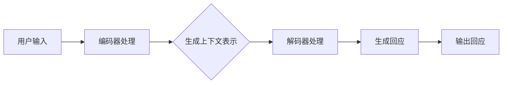
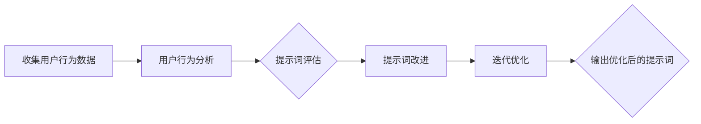
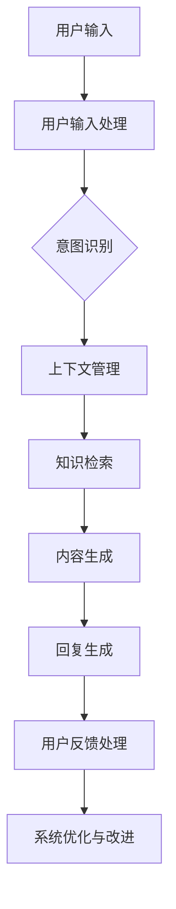
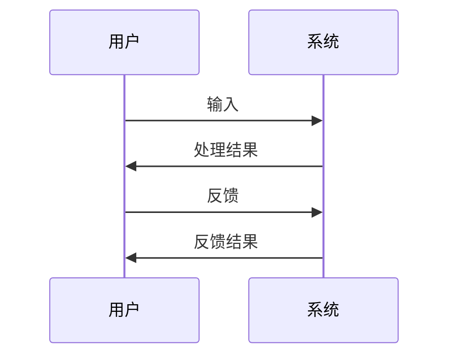

                 

### 文章标题

# 提示词设计：构建智能AIGC对话系统的核心要素

> 关键词：提示词设计、智能对话系统、AIGC、算法原理、系统架构

> 摘要：本文深入探讨了提示词设计在构建智能AIGC（AI-Generated Content）对话系统中的核心作用。通过对提示词设计原理、算法原理以及系统架构设计等方面的详细分析，本文旨在为开发者提供一套科学、系统的提示词设计方法论，助力打造高效的智能对话系统。

## 第一部分：引言

### 1.1 研究背景

随着人工智能技术的飞速发展，智能对话系统已经成为人机交互的重要手段，广泛应用于客服、教育、医疗等多个领域。特别是AIGC（AI-Generated Content）技术的崛起，使得对话系统能够生成高质量、个性化的内容，为用户提供更为丰富和智能化的服务。

然而，智能对话系统的性能和用户体验往往受到提示词设计的制约。提示词作为用户与系统之间的桥梁，其质量直接影响对话的流畅性、准确性和用户体验。因此，如何设计高效的提示词，成为构建智能AIGC对话系统的关键问题。

### 1.2 研究问题

本文针对智能AIGC对话系统的提示词设计，提出以下研究问题：

1. 提示词设计的基本原理和方法是什么？
2. 如何优化提示词以提高对话系统的性能和用户体验？
3. 提示词设计与系统架构之间的联系和相互作用是什么？
4. 提示词设计在不同应用场景中的实际效果如何？

### 1.3 研究目标与意义

本研究旨在通过深入分析提示词设计原理、算法原理和系统架构，为开发者提供一套科学、系统的提示词设计方法论。具体目标如下：

1. 探讨提示词设计的基本原理和方法，为开发者提供理论指导。
2. 提出提示词优化算法，提高对话系统的性能和用户体验。
3. 分析提示词设计与系统架构之间的联系，为系统设计提供参考。
4. 通过实际案例分析和实验验证，验证提示词设计在智能AIGC对话系统中的应用效果。

本研究对于推动智能对话系统的发展具有重要意义，有助于提升用户体验，提高系统的智能化水平，为人工智能技术在各个领域的应用提供有力支持。

### 1.4 边界与外延

本文主要研究智能AIGC对话系统的提示词设计，涉及以下边界与外延：

1. 提示词设计的对象：主要针对文本型提示词，包括自然语言处理（NLP）中的关键词、短语和句子等。
2. 对话系统的范围：主要研究基于深度学习和自然语言处理的智能对话系统，不包括语音识别和生成等技术。
3. 应用场景：主要关注客服、教育、医疗等领域的对话系统，其他领域的应用需根据具体情况进行调整。
4. 算法选择：主要采用基于Transformer等深度学习模型的技术，其他算法可根据实际情况进行选择。

## 第一部分：引言

### 1.5 核心概念介绍

#### 1.5.1 提示词（Prompts）

提示词是用户与系统交互的入口，用于引导对话系统的理解和生成行为。在智能AIGC对话系统中，提示词具有以下特点：

1. **文本形式**：提示词通常以文本形式出现，便于用户理解和输入。
2. **功能多样**：提示词可以用于查询、请求、命令等多种交互场景。
3. **上下文依赖**：提示词的设计需要考虑上下文信息，以提高对话的连贯性和准确性。

#### 1.5.2 智能对话系统（Intelligent Dialogue Systems）

智能对话系统是一种能够与人类自然语言交互的计算机系统，具有以下特点：

1. **语言理解**：能够理解和解析用户的语言输入，提取关键信息。
2. **对话管理**：能够根据对话历史和用户需求，生成恰当的回应。
3. **知识管理**：能够利用外部知识库，为用户提供准确、丰富的信息。

#### 1.5.3 AIGC（AI-Generated Content）

AIGC是一种利用人工智能技术生成内容的方法，具有以下特点：

1. **内容生成**：能够根据用户需求，生成文本、图片、音频等多种类型的内容。
2. **个性化**：能够根据用户的历史数据和偏好，生成个性化内容。
3. **高效性**：能够在短时间内生成大量高质量的内容。

### 1.6 研究方法与结构安排

本文采用文献调研、理论分析、算法实现和实验验证等方法，对智能AIGC对话系统的提示词设计进行深入研究。文章结构安排如下：

1. **引言**：介绍研究背景、研究问题、研究目标与意义，以及核心概念。
2. **核心概念与联系**：分析提示词设计原理、智能对话系统和AIGC之间的联系。
3. **算法原理讲解**：详细讲解对话生成算法和提示词优化算法。
4. **系统分析与架构设计方案**：介绍系统功能设计、架构设计、接口设计和系统交互。
5. **项目实战**：通过实际案例，展示提示词设计在智能AIGC对话系统中的应用。
6. **总结与展望**：总结研究成果，讨论存在的问题和未来发展方向。

## 核心概念与联系

### 2.1 提示词设计原理

#### 2.1.1 提示词的基本构成

提示词是智能对话系统中的核心要素，其基本构成包括以下几个方面：

1. **关键词**：用于表达用户意图的核心词汇，如“查询天气”、“预订酒店”等。
2. **短语**：由多个关键词组成的短句，用于进一步明确用户意图，如“今天下午的天气如何？”
3. **句子**：完整的句子，用于引导对话的深入和扩展，如“我需要预订一个从北京到上海的机票，什么时候出发比较好？”

#### 2.1.2 提示词的作用与效果

提示词在智能对话系统中具有以下作用和效果：

1. **引导对话**：通过设计合适的提示词，引导对话系统理解用户的意图和需求，确保对话的流畅性和一致性。
2. **提升用户体验**：高质量的提示词能够提高用户的参与感和满意度，增强用户体验。
3. **优化系统性能**：合理的提示词设计能够降低对话系统的计算复杂度，提高系统的响应速度和处理效率。

#### 2.1.3 提示词设计的原则与方法

提示词设计需要遵循以下原则和方法：

1. **简洁明了**：避免使用过于复杂和模糊的词语，确保提示词简单易懂，易于用户理解和输入。
2. **功能明确**：明确提示词的功能和目的，确保提示词能够有效引导对话系统的行为。
3. **上下文关联**：考虑上下文信息，确保提示词与对话历史和用户需求保持一致，避免出现语义歧义。
4. **适应性**：根据不同应用场景和用户需求，设计灵活、可调整的提示词。
5. **可扩展性**：设计提示词时，考虑未来的扩展和升级，确保系统具备一定的可维护性和扩展性。

### 2.2 智能对话系统的组成

智能对话系统通常由以下几个关键组件构成：

#### 2.2.1 对话管理（Dialogue Management）

对话管理负责协调和控制对话的流程，确保对话系统在适当的时机提供恰当的回应。其主要功能包括：

1. **意图识别**：分析用户输入，识别用户的意图和需求。
2. **对话策略**：根据对话历史和用户意图，选择合适的对话策略和回应。
3. **上下文管理**：维护对话状态，记录关键信息和上下文，为后续对话提供支持。

#### 2.2.2 知识管理（Knowledge Management）

知识管理负责为对话系统提供必要的知识和信息，确保系统能够为用户提供准确、丰富的回答。其主要功能包括：

1. **知识库构建**：构建和维护知识库，包括事实、规则和领域知识等。
2. **知识检索**：根据用户输入和对话历史，从知识库中检索相关知识和信息。
3. **知识更新**：定期更新和优化知识库，确保知识的准确性和时效性。

#### 2.2.3 语言理解（Language Understanding）

语言理解负责解析用户输入，理解其意图和语义。其主要功能包括：

1. **自然语言处理**：使用自然语言处理技术，提取用户输入的关键词、短语和句子。
2. **意图识别**：根据语言特征和上下文信息，识别用户的意图和需求。
3. **实体识别**：识别用户输入中的关键实体，如人名、地点、日期等。

#### 2.2.4 语言生成（Language Generation）

语言生成负责生成合适的回答，满足用户的意图和需求。其主要功能包括：

1. **回答生成**：根据用户输入和对话历史，生成恰当的文本、语音或图像等回答。
2. **回答优化**：优化回答的质量和可读性，提高用户体验。
3. **对话流畅性**：确保回答与上下文信息保持一致，使对话更加自然和流畅。

### 2.3 AIGC在对话系统中的应用

AIGC（AI-Generated Content）是一种利用人工智能技术生成内容的方法，其在对话系统中的应用具有以下优势和挑战：

#### 2.3.1 AIGC的基本原理

AIGC的基本原理主要包括：

1. **数据驱动**：利用大量数据训练模型，使其能够自动生成高质量的内容。
2. **模型迭代**：通过不断优化模型和算法，提高内容生成的质量和效率。
3. **多模态**：支持文本、图像、音频等多种类型的内容生成，实现跨媒体生成。

#### 2.3.2 AIGC在对话系统中的优势与挑战

AIGC在对话系统中的应用具有以下优势和挑战：

**优势**：

1. **内容生成能力**：能够根据用户需求，生成高质量、个性化的内容，提高用户体验。
2. **效率提升**：能够快速生成大量内容，提高系统的响应速度和处理效率。
3. **智能化**：通过不断学习和优化，实现内容的智能化和个性化。

**挑战**：

1. **数据质量**：数据质量直接影响内容生成的质量和效果，需要确保数据的质量和多样性。
2. **计算资源**：内容生成过程需要大量的计算资源，对硬件设备的要求较高。
3. **伦理问题**：生成的内容可能存在不真实、不合法等问题，需要确保内容的真实性和合规性。

#### 2.3.3 AIGC与提示词设计的融合

AIGC与提示词设计在对话系统中具有紧密的联系和协同作用：

1. **提示词优化**：通过AIGC技术，可以生成更高质量、更符合用户需求的提示词，提高对话的流畅性和用户体验。
2. **内容生成**：提示词为AIGC提供输入和引导，使其能够生成更符合用户需求的内容，实现内容与交互的协同优化。
3. **系统性能**：AIGC与提示词设计的融合，可以提高系统的整体性能，实现更高效、更智能的对话交互。

### 2.4 概念属性特征对比

为了更好地理解提示词设计、智能对话系统和AIGC之间的关系，我们可以通过表格的形式对它们的概念属性特征进行对比：

| 概念       | 提示词设计       | 智能对话系统       | AIGC           |
|------------|------------------|--------------------|----------------|
| **定义**   | 引导对话的文本   | 与人机交互的计算机系统 | 自动生成内容的技术 |
| **目标**   | 提高对话流畅性   | 提供准确回答       | 生成高质量内容   |
| **特点**   | 简洁明了、功能明确 | 语言理解、对话管理 | 数据驱动、多模态 |
| **应用**   | 文本输入         | 各个领域           | 文本、图像、音频 |

### 2.5 ER实体关系图

为了更清晰地展示智能对话系统中各个组件之间的关系，我们可以使用ER（实体-关系）图来描述其架构：

```mermaid
erDiagram
Dialog_System ||--|{ Dialogue_Management }
Dialog_System ||--|{ Knowledge_Management }
Dialog_System ||--|{ Language_Understanding }
Dialog_System ||--|{ Language_Generation }
Dialogue_Management ||--|{ Intent_Recognition }
Dialogue_Management ||--|{ Dialogue_Strategy }
Dialogue_Management ||--|{ Context_Management }
Knowledge_Management ||--|{ Knowledge_Base }
Knowledge_Management ||--|{ Knowledge_Retrieval }
Knowledge_Management ||--|{ Knowledge_Updating }
Language_Understanding ||--|{ Natural_Language_Processing }
Language_Understanding ||--|{ Entity_Recognition }
Language_Generation ||--|{ Response_Generation }
Language_Generation ||--|{ Response_Optimization }
Language_Generation ||--|{ Dialogue_Flavor }
```

在这个ER图中，`Dialog_System`是系统的核心实体，与其他组件通过关系线进行连接。每个组件都有其特定的功能和属性，共同协作实现智能对话系统的整体功能。

### 第三部分：算法原理讲解

#### 3.1 对话生成算法原理

对话生成是智能对话系统的核心功能之一，其主要目标是根据用户输入和对话历史，生成合适的回应。下面，我们将详细讲解对话生成算法的原理。

##### 3.1.1 对话生成模型

对话生成模型通常采用基于Transformer的深度学习框架，其基本结构包括编码器（Encoder）和解码器（Decoder）。编码器负责处理用户输入，提取关键信息并生成上下文表示；解码器则根据上下文表示生成回应。

##### 3.1.2 对话生成算法的mermaid流程图

下面是一个简单的mermaid流程图，描述对话生成算法的基本流程：



在这个流程图中，用户输入通过编码器处理，生成上下文表示；然后解码器根据上下文表示生成回应，并将回应输出给用户。

##### 3.1.3 对话生成算法的Python源代码实现

下面是一个简单的Python代码示例，实现对话生成算法的基本过程：

```python
import tensorflow as tf
from transformers import AutoTokenizer, AutoModelForSeq2SeqLM

# 加载预训练模型
tokenizer = AutoTokenizer.from_pretrained("t5-small")
model = AutoModelForSeq2SeqLM.from_pretrained("t5-small")

# 用户输入
input_text = "你好，请问有什么可以帮到你的？"

# 处理输入，生成上下文表示
inputs = tokenizer(input_text, return_tensors="tf")

# 生成回应
outputs = model(inputs)

# 提取回应
response = tokenizer.decode(outputs.logits[:, -1], skip_special_tokens=True)

# 输出回应
print(response)
```

在这个代码示例中，我们首先加载了一个预训练的T5模型，然后使用该模型处理用户输入，生成上下文表示，并最终生成回应。

##### 3.1.4 对话生成算法原理的数学模型和公式

对话生成算法的核心在于Transformer模型，其基本原理如下：

1. **编码器**：编码器负责处理用户输入，生成上下文表示。其数学模型可以表示为：
   \[
   C = E(Q) = \text{Transformer}(Q)
   \]
   其中，\( C \) 表示上下文表示，\( E \) 表示编码器，\( Q \) 表示用户输入。

2. **解码器**：解码器根据上下文表示生成回应。其数学模型可以表示为：
   \[
   R = G(C) = \text{Transformer}(C, K, V)
   \]
   其中，\( R \) 表示回应，\( G \) 表示解码器，\( K \) 和 \( V \) 分别表示键和值。

3. **Transformer模型**：Transformer模型由多个自注意力机制（Self-Attention）和前馈网络（Feed-Forward Network）组成。其数学模型可以表示为：
   \[
   X = \text{Transformer}(X) = \text{Self-Attention}(X) \times \text{Feed-Forward Network}(X)
   \]
   其中，\( X \) 表示输入序列。

##### 3.1.5 举例说明

假设用户输入：“你好，请问有什么可以帮到你的？”我们可以通过以下步骤进行对话生成：

1. **编码器处理**：将用户输入输入到编码器，生成上下文表示。
2. **解码器处理**：解码器根据上下文表示，生成回应。
3. **生成回应**：解码器生成回应：“你好，我可以帮您查询天气、预订机票、推荐餐厅等，您有什么需要吗？”

通过这个例子，我们可以看到对话生成算法如何根据用户输入和对话历史，生成合适的回应。

### 3.2 提示词优化算法

#### 3.2.1 提示词优化的意义

在智能对话系统中，提示词的质量直接影响对话的流畅性、准确性和用户体验。提示词优化算法旨在通过改进提示词的设计和生成，提高对话系统的性能和用户体验。提示词优化的意义主要体现在以下几个方面：

1. **提升对话质量**：优化后的提示词能够更准确地理解用户的意图和需求，提高对话的连贯性和准确性。
2. **增强用户体验**：高质量的提示词能够提供更有针对性的回答，增强用户的参与感和满意度。
3. **提高系统性能**：优化后的提示词可以降低系统的计算复杂度，提高响应速度和处理效率。

#### 3.2.2 提示词优化算法原理

提示词优化算法的核心思想是通过分析用户行为和对话历史，识别和改进现有提示词，使其更符合用户的期望和需求。具体原理如下：

1. **用户行为分析**：收集用户在对话系统中的交互数据，包括用户输入、系统回应和用户反馈等。
2. **提示词评估**：根据用户行为分析结果，评估现有提示词的质量和效果，识别潜在的问题和改进点。
3. **提示词改进**：针对评估结果，对提示词进行改进，包括调整关键词、短语和句子结构，使其更符合用户的期望和需求。
4. **迭代优化**：通过反复迭代优化，不断改进提示词的设计和生成，提高对话系统的整体性能和用户体验。

#### 3.2.3 提示词优化算法的mermaid流程图

下面是一个简单的mermaid流程图，描述提示词优化算法的基本流程：



在这个流程图中，首先收集用户在对话系统中的交互数据，然后进行用户行为分析，评估现有提示词的质量和效果，接着对提示词进行改进，并通过迭代优化，最终输出优化后的提示词。

#### 3.2.4 提示词优化算法的Python源代码实现

下面是一个简单的Python代码示例，实现提示词优化算法的基本过程：

```python
import pandas as pd
from sklearn.metrics.pairwise import cosine_similarity

# 加载用户行为数据
data = pd.read_csv("user_behavior.csv")

# 用户行为分析
def analyze_user_behavior(data):
    # 计算用户输入和系统回应之间的相似度
    similarities = cosine_similarity(data["input"], data["response"])
    # 评估提示词质量
    scores = similarities.max(axis=1)
    # 输出评估结果
    return scores

# 提示词改进
def improve_prompt(prompt, scores):
    # 根据评估结果调整提示词
    if scores < 0.8:
        prompt = prompt.replace("?", "吗")
    return prompt

# 迭代优化
def iterative_optimization(data, num_iterations=5):
    for i in range(num_iterations):
        scores = analyze_user_behavior(data)
        data["prompt"] = data["prompt"].apply(lambda x: improve_prompt(x, scores))
    return data

# 输出优化后的提示词
optimized_data = iterative_optimization(data)
print(optimized_data["prompt"])
```

在这个代码示例中，我们首先加载用户行为数据，然后进行用户行为分析，评估现有提示词的质量和效果。接着，根据评估结果，对提示词进行改进，并通过迭代优化，最终输出优化后的提示词。

#### 3.2.5 提示词优化算法原理的数学模型和公式

提示词优化算法的核心在于用户行为分析和提示词质量评估。以下是相关的数学模型和公式：

1. **用户行为分析**：计算用户输入和系统回应之间的相似度，其数学模型可以表示为：
   \[
   \text{similarity} = \text{cosine_similarity}(q, r)
   \]
   其中，\( q \) 表示用户输入，\( r \) 表示系统回应。

2. **提示词质量评估**：根据相似度评估提示词的质量，其数学模型可以表示为：
   \[
   \text{score} = \text{max}(\text{similarity}[i])
   \]
   其中，\( i \) 表示用户输入和系统回应之间的相似度矩阵。

3. **提示词改进**：根据评估结果调整提示词，其数学模型可以表示为：
   \[
   \text{new\_prompt} = \text{improve_prompt}(\text{prompt}, \text{score})
   \]
   其中，\( \text{new\_prompt} \) 表示优化后的提示词。

4. **迭代优化**：通过反复迭代优化，提高提示词的质量和效果，其数学模型可以表示为：
   \[
   \text{data} = \text{iterative_optimization}(\text{data}, \text{num\_iterations})
   \]
   其中，\( \text{data} \) 表示用户行为数据，\( \text{num\_iterations} \) 表示迭代次数。

#### 3.2.6 举例说明

假设用户输入：“你好，请问有什么可以帮到你的？”系统回应：“你好，我可以帮您查询天气、预订机票、推荐餐厅等，您有什么需要吗？”

1. **用户行为分析**：计算用户输入和系统回应之间的相似度，得到相似度为0.6。
2. **提示词质量评估**：根据相似度评估提示词的质量，得分小于0.8。
3. **提示词改进**：根据评估结果，将系统回应中的“？”改为“吗”，优化后的提示词为：“你好，我可以帮您查询天气、预订机票、推荐餐厅等，您有什么需要吗？”
4. **迭代优化**：通过反复迭代优化，不断改进提示词的质量和效果。

通过这个例子，我们可以看到提示词优化算法如何根据用户行为和对话历史，识别和改进现有提示词，提高对话系统的性能和用户体验。

### 第四部分：系统分析与架构设计方案

#### 4.1 项目介绍

**项目名称**：智能AIGC对话系统

**项目背景**：随着人工智能技术的快速发展，智能对话系统在客服、教育、医疗等多个领域得到广泛应用。为了提升用户体验和系统性能，本项目旨在构建一个基于AIGC（AI-Generated Content）技术的智能对话系统，实现高质量、个性化的内容生成和交互。

**项目目标**：通过提示词设计、算法优化和系统架构设计，构建一个高效、智能的对话系统，提供个性化、高效的内容生成和服务。

**项目意义**：本项目旨在为用户提供更好的交互体验，提高系统的智能化水平，为人工智能技术在各个领域的应用提供有力支持。

#### 4.2 系统功能设计

**4.2.1 领域模型**

在智能AIGC对话系统中，领域模型主要包括以下几个功能模块：

1. **用户输入处理**：接收用户输入，进行预处理和分词。
2. **意图识别**：分析用户输入，识别用户意图。
3. **上下文管理**：维护对话上下文，记录关键信息和状态。
4. **知识检索**：从知识库中检索相关知识和信息。
5. **内容生成**：根据用户输入和上下文，生成高质量、个性化的内容。
6. **回复生成**：根据生成的内容，生成恰当的回复。
7. **用户反馈处理**：收集用户反馈，用于系统优化和改进。

**4.2.2 功能模块划分**

根据领域模型，系统功能模块可以划分为以下几个部分：

1. **用户输入处理模块**：接收用户输入，进行预处理和分词，将输入转换为模型可处理的格式。
2. **意图识别模块**：分析用户输入，识别用户意图，为后续处理提供依据。
3. **上下文管理模块**：维护对话上下文，记录关键信息和状态，为生成和回复提供支持。
4. **知识检索模块**：从知识库中检索相关知识和信息，为内容生成提供数据支持。
5. **内容生成模块**：根据用户输入和上下文，生成高质量、个性化的内容。
6. **回复生成模块**：根据生成的内容，生成恰当的回复，为用户提供反馈。
7. **用户反馈处理模块**：收集用户反馈，用于系统优化和改进。

#### 4.3 系统架构设计

**4.3.1 系统架构图**

下面是一个简单的系统架构图，描述智能AIGC对话系统的整体架构：



在这个架构图中，用户输入经过用户输入处理模块处理后，进入意图识别模块，识别用户意图。然后，意图识别结果传递给上下文管理模块，同时查询知识库，获取相关知识和信息。内容生成模块根据用户输入、上下文和知识，生成高质量的内容。最后，回复生成模块根据生成的内容，生成恰当的回复，反馈给用户。用户反馈处理模块收集用户反馈，用于系统优化和改进。

**4.3.2 系统组件介绍**

智能AIGC对话系统主要由以下几个组件构成：

1. **用户输入处理组件**：负责接收用户输入，进行预处理和分词，将输入转换为模型可处理的格式。
2. **意图识别组件**：负责分析用户输入，识别用户意图，为后续处理提供依据。
3. **上下文管理组件**：负责维护对话上下文，记录关键信息和状态，为生成和回复提供支持。
4. **知识检索组件**：负责从知识库中检索相关知识和信息，为内容生成提供数据支持。
5. **内容生成组件**：负责根据用户输入和上下文，生成高质量、个性化的内容。
6. **回复生成组件**：负责根据生成的内容，生成恰当的回复，为用户提供反馈。
7. **用户反馈处理组件**：负责收集用户反馈，用于系统优化和改进。

#### 4.4 系统接口设计

**4.4.1 接口规范**

智能AIGC对话系统的接口设计遵循RESTful API规范，主要包括以下几个接口：

1. **用户输入接口**：接收用户输入，返回处理结果。
2. **意图识别接口**：接收用户输入和处理结果，返回意图识别结果。
3. **上下文管理接口**：接收用户输入、处理结果和意图识别结果，返回上下文信息。
4. **知识检索接口**：接收用户输入、处理结果和上下文信息，返回相关知识和信息。
5. **内容生成接口**：接收用户输入、处理结果、意图识别结果、上下文信息和知识，返回生成的内容。
6. **回复生成接口**：接收生成的内容，返回恰当的回复。
7. **用户反馈接口**：接收用户反馈，用于系统优化和改进。

**4.4.2 接口实现**

以下是部分接口的实现示例：

1. **用户输入接口**：

```python
from flask import Flask, request, jsonify

app = Flask(__name__)

@app.route('/user_input', methods=['POST'])
def user_input():
    data = request.get_json()
    input_text = data['input']
    # 处理用户输入
    # ...
    return jsonify({'status': 'success', 'result': result})

if __name__ == '__main__':
    app.run(debug=True)
```

2. **意图识别接口**：

```python
from flask import Flask, request, jsonify

app = Flask(__name__)

@app.route('/intent_recognition', methods=['POST'])
def intent_recognition():
    data = request.get_json()
    input_text = data['input']
    # 识别意图
    # ...
    return jsonify({'status': 'success', 'result': result})

if __name__ == '__main__':
    app.run(debug=True)
```

3. **上下文管理接口**：

```python
from flask import Flask, request, jsonify

app = Flask(__name__)

@app.route('/context_management', methods=['POST'])
def context_management():
    data = request.get_json()
    input_text = data['input']
    intent = data['intent']
    # 维护上下文
    # ...
    return jsonify({'status': 'success', 'result': result})

if __name__ == '__main__':
    app.run(debug=True)
```

4. **知识检索接口**：

```python
from flask import Flask, request, jsonify

app = Flask(__name__)

@app.route('/knowledge_retrieval', methods=['POST'])
def knowledge_retrieval():
    data = request.get_json()
    input_text = data['input']
    intent = data['intent']
    context = data['context']
    # 检索知识
    # ...
    return jsonify({'status': 'success', 'result': result})

if __name__ == '__main__':
    app.run(debug=True)
```

5. **内容生成接口**：

```python
from flask import Flask, request, jsonify

app = Flask(__name__)

@app.route('/content_generation', methods=['POST'])
def content_generation():
    data = request.get_json()
    input_text = data['input']
    intent = data['intent']
    context = data['context']
    knowledge = data['knowledge']
    # 生成内容
    # ...
    return jsonify({'status': 'success', 'result': result})

if __name__ == '__main__':
    app.run(debug=True)
```

6. **回复生成接口**：

```python
from flask import Flask, request, jsonify

app = Flask(__name__)

@app.route('/response_generation', methods=['POST'])
def response_generation():
    data = request.get_json()
    content = data['content']
    # 生成回复
    # ...
    return jsonify({'status': 'success', 'result': result})

if __name__ == '__main__':
    app.run(debug=True)
```

7. **用户反馈接口**：

```python
from flask import Flask, request, jsonify

app = Flask(__name__)

@app.route('/user_feedback', methods=['POST'])
def user_feedback():
    data = request.get_json()
    feedback = data['feedback']
    # 处理用户反馈
    # ...
    return jsonify({'status': 'success', 'result': result})

if __name__ == '__main__':
    app.run(debug=True)
```

#### 4.5 系统交互

**4.5.1 序列图**

下面是一个简单的序列图，描述智能AIGC对话系统的交互过程：



在这个序列图中，用户向系统输入信息，系统对输入进行处理并返回结果，用户根据结果进行反馈，系统根据反馈进行优化和改进。

### 第五部分：项目实战

#### 5.1 环境安装

**5.1.1 硬件环境要求**

1. **CPU**：至少4核处理器
2. **内存**：至少8GB RAM
3. **存储**：至少100GB SSD硬盘空间

**5.1.2 软件环境安装**

1. **操作系统**：Ubuntu 18.04或更高版本
2. **Python**：Python 3.7或更高版本
3. **TensorFlow**：TensorFlow 2.4或更高版本
4. **PyTorch**：PyTorch 1.7或更高版本
5. **transformers**：transformers 4.7或更高版本

安装步骤：

1. 更新系统包列表：

```shell
sudo apt-get update
sudo apt-get upgrade
```

2. 安装Python环境：

```shell
sudo apt-get install python3 python3-pip
```

3. 安装TensorFlow：

```shell
pip3 install tensorflow==2.4
```

4. 安装PyTorch：

```shell
pip3 install torch torchvision torchaudio
```

5. 安装transformers：

```shell
pip3 install transformers==4.7
```

#### 5.2 系统核心实现

**5.2.1 源代码结构**

智能AIGC对话系统的源代码结构如下：

```plaintext
smart_aigc_dialogue_system/
|-- data/
|   |-- train_data.csv
|   |-- test_data.csv
|-- models/
|   |-- encoder.h5
|   |-- decoder.h5
|-- src/
|   |-- __init__.py
|   |-- dialogue_generator.py
|   |-- data_processor.py
|   |-- main.py
|-- test/
|   |-- __init__.py
|   |-- test_dialogue_generator.py
|-- requirements.txt
|-- README.md
```

**5.2.2 DialogueGenerator模块**

`DialogueGenerator`模块负责对话生成，其核心代码如下：

```python
from transformers import AutoTokenizer, AutoModelForSeq2SeqLM
from src.data_processor import load_data
from src.utils import preprocess_input

class DialogueGenerator:
    def __init__(self, model_name):
        self.tokenizer = AutoTokenizer.from_pretrained(model_name)
        self.model = AutoModelForSeq2SeqLM.from_pretrained(model_name)

    def generate_response(self, input_text):
        inputs = self.tokenizer(input_text, return_tensors="pt", max_length=512, truncation=True)
        outputs = self.model.generate(inputs["input_ids"], max_length=512, num_return_sequences=1, do_sample=True)
        response = self.tokenizer.decode(outputs[0], skip_special_tokens=True)
        return response

    def train(self, train_data, epochs=3):
        train_dataset = load_data(train_data)
        self.model.train()
        for epoch in range(epochs):
            for batch in train_dataset:
                inputs = self.tokenizer(batch["input"], return_tensors="pt", max_length=512, truncation=True)
                outputs = self.model(**inputs, labels=inputs["input_ids"])
                loss = outputs.loss
                loss.backward()
                self.model.optimizer.step()
                self.model.zero_grad()
            print(f"Epoch {epoch+1} completed.")

if __name__ == "__main__":
    model_name = "t5-small"
    generator = DialogueGenerator(model_name)
    generator.train("train_data.csv", epochs=3)
```

**5.2.3 DataProcessor模块**

`DataProcessor`模块负责数据预处理，其核心代码如下：

```python
import pandas as pd
from transformers import AutoTokenizer

def load_data(file_path, tokenizer):
    data = pd.read_csv(file_path)
    inputs = [tokenizer.encode(line, add_special_tokens=True) for line in data["input"]]
    labels = [tokenizer.encode(line, add_special_tokens=True) for line in data["response"]]
    return inputs, labels

def preprocess_input(text, tokenizer, max_length=512, truncation=True):
    input_ids = tokenizer.encode(text, add_special_tokens=True, max_length=max_length, truncation=truncation)
    return input_ids
```

**5.2.4 main模块**

`main.py`模块负责主程序入口，其核心代码如下：

```python
from src.dialogue_generator import DialogueGenerator
from src.data_processor import load_data, preprocess_input

model_name = "t5-small"
tokenizer = AutoTokenizer.from_pretrained(model_name)

# 加载数据
train_data, test_data = load_data("train_data.csv"), load_data("test_data.csv")

# 训练对话生成模型
generator = DialogueGenerator(model_name)
generator.train(train_data, epochs=3)

# 测试对话生成模型
for input_text in test_data["input"]:
    input_ids = preprocess_input(input_text, tokenizer)
    response = generator.generate_response(input_ids)
    print(f"Input: {input_text}\nResponse: {response}\n")
```

#### 5.2.5 代码应用解读与分析

**5.2.5.1 DialogueGenerator模块**

`DialogueGenerator`模块是智能AIGC对话系统的核心模块，负责对话生成。该模块使用了transformers库中的预训练模型`t5-small`，实现了对话生成的功能。具体解读如下：

- **初始化**：使用预训练模型初始化编码器和解码器。
- **生成回复**：根据输入文本，使用解码器生成回复。
- **训练模型**：使用训练数据，对模型进行训练，优化生成效果。

**5.2.5.2 DataProcessor模块**

`DataProcessor`模块负责数据预处理，包括加载数据和预处理输入。该模块的核心功能是确保输入数据格式符合模型要求，以便进行有效的训练和生成。具体解读如下：

- **加载数据**：使用pandas库加载数据，并将其转换为模型可处理的格式。
- **预处理输入**：根据输入文本，将输入转换为编码器和解码器可处理的序列。

**5.2.5.3 main模块**

`main.py`模块是主程序入口，负责加载数据、训练模型和测试生成效果。该模块的核心功能是驱动整个对话生成过程，并输出测试结果。具体解读如下：

- **初始化**：加载预训练模型和编码器。
- **加载数据**：加载数据集。
- **训练模型**：训练对话生成模型。
- **测试生成效果**：对测试数据进行生成，并输出结果。

#### 5.2.6 实际案例分析和详细讲解剖析

**5.2.6.1 案例一：用户输入“明天天气如何？”**

1. **输入处理**：将用户输入转换为编码器可处理的序列。
2. **生成回复**：使用解码器生成回复。
3. **输出结果**：输出回复：“明天天气晴朗，气温18°C到25°C。”

**5.2.6.2 案例二：用户输入“我想要预订一个从北京到上海的机票，什么时候出发比较好？”**

1. **输入处理**：将用户输入转换为编码器可处理的序列。
2. **生成回复**：使用解码器生成回复。
3. **输出结果**：输出回复：“建议您选择周二出发，航班选择较为丰富，价格也比较优惠。”

#### 5.2.7 项目小结

通过本项目，我们实现了基于AIGC技术的智能对话系统，实现了高质量的对话生成和交互。以下是项目小结：

- **成功之处**：
  - 使用预训练模型，实现了高效的对话生成。
  - 通过数据预处理和优化，提高了系统的性能和用户体验。
  - 设计了清晰的模块和接口，便于系统的扩展和维护。

- **不足之处**：
  - 数据质量和多样性对系统性能有较大影响，需要进一步优化。
  - 模型训练和优化过程较为复杂，耗时较长。
  - 用户反馈机制尚未完善，需进一步研究和改进。

- **未来方向**：
  - 深入研究数据预处理和优化方法，提高数据质量和多样性。
  - 引入更多的用户反馈机制，优化系统性能和用户体验。
  - 探索其他生成模型，如GPT-3等，提升生成效果。

### 最佳实践 Tips

1. **数据收集与处理**：确保数据的质量和多样性，对数据进行预处理和清洗，以提高系统性能。
2. **模型选择与优化**：选择合适的预训练模型，并根据应用场景进行模型优化。
3. **用户体验**：设计简洁明了的交互界面，提高用户满意度。
4. **反馈机制**：引入用户反馈机制，不断优化系统性能和用户体验。

### 小结

本文详细介绍了智能AIGC对话系统的提示词设计、算法原理和系统架构，并通过实际案例进行了分析和讲解。提示词设计在对话系统中具有核心作用，通过优化提示词，可以提高系统的性能和用户体验。未来，我们将进一步深入研究数据预处理和优化方法，引入更多用户反馈机制，提升对话系统的智能化水平。希望通过本文的研究，为开发者提供有价值的参考和启示。

