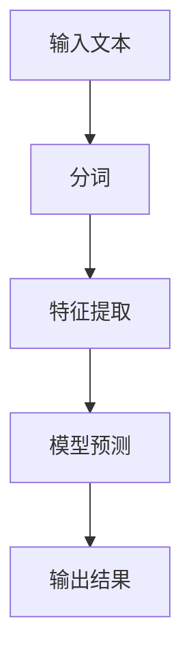
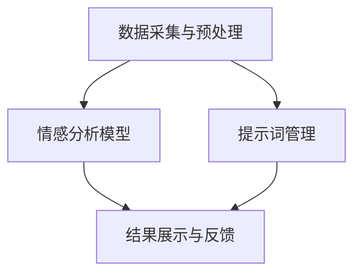

                 

### 文章标题

# 提高AI情感分析能力：微妙情绪识别的提示词设计

### 文章关键词

- AI情感分析
- 微妙情绪识别
- 提示词设计
- 算法原理
- 系统架构
- 实战案例

### 文章摘要

随着互联网和社交媒体的迅速发展，人们对情感分析的需求日益增长。传统的情感分析主要关注极端情感，如正面、负面和中性，但对于人类情感的复杂性，这显然不够。本文将探讨如何提高AI情感分析能力，特别是对于微妙情绪的识别。我们将详细分析提示词设计的核心原理，介绍相关算法，并通过实际案例来展示如何优化和实施这些算法。文章还将涵盖系统架构和实施细节，为读者提供一个全面的技术指南。

## 引言

### AI情感分析的重要性

情感分析，也称为意见挖掘，是一种自然语言处理技术，旨在识别和提取文本中的主观信息。随着社交媒体和电子商务的兴起，情感分析已成为企业决策和用户行为理解的重要工具。然而，传统的情感分析大多集中于极端情感的识别，如正面、负面和 Neutral。这种方法在处理复杂情感、细微情绪时显得力不从心。

### 微妙情绪识别的必要性

人类情感丰富多样，从喜悦、愤怒、悲伤到惊讶、恐惧、厌恶，还有无数微妙的情绪状态。在情感分析中，识别这些细微的情绪对于全面理解用户反馈、改善用户体验和做出更精准的市场决策至关重要。例如，一个看似中性的评论可能包含了更深层次的满意或不满意，只有通过识别这些细微的情绪，我们才能更准确地理解用户的真实意图。

### 文章目标

本文旨在提供一种系统的方法来提高AI情感分析能力，特别是对于微妙情绪的识别。我们将从理论层面分析现有算法，并介绍如何设计有效的提示词。此外，还将结合实际案例，展示这些方法在实际应用中的效果和挑战。通过本文的探讨，希望读者能够掌握微妙情绪识别的关键技术，并能够将其应用于实际项目中。

### 核心概念与术语

在深入探讨AI情感分析以及微妙情绪识别之前，我们需要明确一些核心概念和术语，以便建立一个共同的理解基础。

#### 1. 情感分析（Sentiment Analysis）

情感分析是一种自然语言处理技术，用于识别文本中的主观情绪或意见。它通常分为三个层次：情感极性分类（polarity classification）、情感强度分类（strength classification）和情感主题分类（topic classification）。情感极性分类是最基本的层次，它将文本分为正面、负面和 neutral。情感强度分类则进一步细化情感强度，如非常正面、稍微正面、中性、稍微负面和非常负面。情感主题分类则关注文本背后的具体主题或情感内容。

#### 2. 微妙情绪（Subtle Emotions）

微妙情绪是指那些不如极端情感那么明显、容易识别的情绪状态。这些情绪通常包含在单词或短语的细微差别中，如“有点累”、“稍微不舒服”或“有点满意”。识别这些情绪需要深度理解和情感推理，而不仅仅是简单的文本分类。

#### 3. 提示词（Prompt Words）

提示词是用于引导模型识别特定情绪或情感的单词或短语。在设计提示词时，需要考虑它们在文本中的用法、语境和情感强度。有效的提示词可以提高模型的准确性和鲁棒性，使其能够更好地识别微妙情绪。

#### 4. 情感词典（Sentiment Lexicon）

情感词典是一种包含大量单词和它们对应的情感极性和强度的词汇表。这些词典通常基于大规模语料库和人工标注数据。情感词典在情感分析中起着至关重要的作用，因为它们为模型提供了情感信息的基础。

#### 5. 情感推理（Sentiment Reasoning）

情感推理是指通过逻辑推理和上下文分析来识别和理解文本中的情感。与简单的情感分类不同，情感推理更关注文本背后的情感逻辑和情感演变。这种推理能力是识别微妙情绪的关键。

### 问题背景

随着社交媒体和电子商务的快速发展，用户生成的内容呈爆炸式增长。这些内容包含了大量的主观意见和情感表达，为情感分析提供了丰富的数据源。然而，传统的情感分析技术主要关注极端情感的识别，对于复杂和细微的情感表达，如满意度的不同层次、不愉快的细微差别等，处理能力有限。这导致企业在理解用户真实意图、改善用户体验和制定市场策略时面临挑战。

### 问题描述

为了解决这一问题，我们需要开发能够识别微妙情绪的AI情感分析技术。这种技术不仅要能够识别常见的正面和负面情感，还需要捕捉那些隐藏在文本细节中的细微情绪。例如，一个评论中可能包含“有点满意”或“稍微不舒服”这样的表达，这些情绪并不是简单的正面或负面，而是介于两者之间的微妙状态。

### 问题解决

为了提高AI情感分析能力，特别是微妙情绪的识别，我们可以采取以下几种方法：

1. **改进算法**：通过研究和开发更先进的情感分析算法，如深度学习和情感推理算法，可以提高模型对微妙情绪的识别能力。
2. **设计有效的提示词**：设计一组有效的提示词，用于引导模型识别特定的微妙情绪，从而提高情感分析的准确性。
3. **多模态数据融合**：结合文本、语音、图像等多模态数据，可以提供更丰富的情感信息，有助于提高微妙情绪的识别能力。
4. **大数据和云计算**：利用大规模数据和云计算技术，可以加速情感分析模型的训练和部署，提高实时分析和处理能力。

### 边界与外延

在开发AI情感分析技术时，我们需要明确边界和界限，以确保技术应用的准确性和可靠性。以下是一些需要考虑的边界和限制：

1. **语言和文化差异**：不同语言和文化背景下，情感表达的方式和含义可能有所不同。在设计提示词和算法时，需要考虑这些差异，以提高跨文化和跨语言的适用性。
2. **数据质量和标注**：情感分析模型的准确性很大程度上取决于训练数据的质量和标注。我们需要确保数据集足够大、覆盖广泛，并且标注准确。
3. **隐私和伦理**：在处理用户生成的内容时，需要严格遵守隐私保护原则和伦理规范，确保用户数据的安全和隐私。
4. **实时性和效率**：情感分析技术需要具备实时性和高效性，以满足快速变化的市场需求和用户反馈。

### 概念结构与核心要素组成

为了更好地理解AI情感分析中微妙情绪识别的概念结构和核心要素组成，我们可以通过以下表格和Mermaid ER实体关系图来详细说明。

#### 表格：核心概念和属性特征对比

| 核心概念 | 定义 | 属性特征 |  
| --- | --- | --- |  
| 情感分析 | 识别文本中的主观情绪或意见 | 极性、强度、主题 |  
| 微妙情绪 | 隐藏在文本细节中的细微情绪 | 多样性、复杂性、难以识别 |  
| 提示词 | 引导模型识别特定情绪的单词或短语 | 有效性、上下文、情感强度 |  
| 情感词典 | 包含单词和情感极性的词汇表 | 完备性、准确性、适用性 |  
| 情感推理 | 通过逻辑推理和上下文分析识别情感 | 情感演变、情感逻辑、深度理解 |

#### Mermaid ER实体关系图

```mermaid
erDiagram
  Class::EmotionAnalysis <<--|uses|> Class::SubtleEmotion
  Class::EmotionAnalysis ||--|has|> Class::Algorithm
  Class::EmotionAnalysis ||--|has|> Class::PromptWord
  Class::EmotionAnalysis ||--|has|> Class::SentimentDictionary
  Class::Algorithm ||--|uses|> Class::SentimentLexicon
  Class::PromptWord ||--|has|> Class::Word
  Class::PromptWord ||--|has|> Class::Context
  Class::SentimentDictionary ||--|has|> Class::Word
  Class::SentimentDictionary ||--|has|> Class::Polarity
  Class::SubtleEmotion ||--|is|> Class::Emotion
  Class::SubtleEmotion ||--|is|> Class::Complexity
```

通过这个概念结构和核心要素组成，我们可以清晰地看到情感分析、微妙情绪识别、提示词设计以及情感词典等核心概念之间的关系，以及它们在AI情感分析系统中的角色和作用。

### 理论与算法

在深入探讨AI情感分析的理论基础和算法之前，我们需要先了解一些关键概念。这些概念包括情感极性、情感强度和情感主题。接下来，我们将介绍几种常用的算法，并使用Python代码和Mermaid流程图来展示其原理和应用。

#### 1. 情感极性（Polarity）

情感极性是指文本中情感倾向的程度，通常分为正面（Positive）、负面（Negative）和中性（Neutral）三种。情感极性分析是最基本的情感分析任务，它的目的是判断文本的情感倾向。

#### 2. 情感强度（Strength）

情感强度指的是情感的强烈程度。除了极性分类，情感强度分析可以进一步区分情感的强度，例如，非常正面、稍微正面、中性、稍微负面和非常负面。这种细粒度的情感分类有助于更精确地理解用户的情绪状态。

#### 3. 情感主题（Topic）

情感主题分析旨在识别文本背后的主题或情感内容。这种分析有助于理解用户关注的主题和情感焦点，从而为市场策略和内容推荐提供依据。

#### 常用算法

在情感分析领域，以下几种算法被广泛使用：

1. **基于规则的方法**：这种方法使用预定义的规则来识别情感。例如，如果文本中包含“喜欢”、“满意”等词汇，则判断为正面情感。
2. **基于机器学习的方法**：这类方法通过训练模型来识别情感。常用的算法包括朴素贝叶斯、支持向量机和随机森林等。
3. **基于深度学习的方法**：深度学习算法，如卷积神经网络（CNN）和循环神经网络（RNN），在情感分析中表现尤为出色。它们能够通过学习大量数据，自动提取文本中的情感特征。

#### 提示词设计与情感词典

在设计提示词和情感词典时，我们需要考虑以下几个方面：

1. **词汇的选择**：选择具有明确情感倾向的词汇，并且能够代表不同情感强度的词汇。
2. **上下文的考虑**：提示词的用法和上下文对情感识别至关重要。同义词和反义词的使用会影响情感极性和强度。
3. **情感词典的构建**：构建一个包含大量单词和情感极性标注的情感词典，以便模型在训练过程中使用。

#### Python代码示例

以下是一个简单的基于朴素贝叶斯算法的情感分析Python代码示例，用于分类文本的极性：

```python
from sklearn.feature_extraction.text import CountVectorizer
from sklearn.naive_bayes import MultinomialNB
from sklearn.pipeline import make_pipeline

# 样本数据
data = [
    ("我很喜欢这个产品", "positive"),
    ("这个产品一般般", "neutral"),
    ("我非常不喜欢这个产品", "negative"),
]

# 分割数据为特征和标签
X, y = data[:, 0], data[:, 1]

# 创建朴素贝叶斯分类器
model = make_pipeline(CountVectorizer(), MultinomialNB())

# 训练模型
model.fit(X, y)

# 测试模型
test_sentence = "这个产品有点不满意"
predicted_polarity = model.predict([test_sentence])[0]
print(f"预测的情感极性：{predicted_polarity}")
```

#### Mermaid流程图

下面是一个简单的情感分析算法流程图，使用Mermaid语言表示：



通过这个流程图，我们可以清晰地看到文本从输入到情感极性预测的整个过程。

### 案例研究

在本节中，我们将通过实际案例来展示如何应用前面介绍的理论和算法，进行微妙情绪的识别。这些案例将涵盖不同类型的文本数据，并分析实际应用中的挑战和解决方案。

#### 案例一：社交媒体评论情感分析

社交媒体平台上的评论通常包含丰富的情感表达，但往往因为语法和表达的多样性而难以识别。以下是一个评论数据集：

| 评论 | 预期情感极性 |  
| --- | --- |  
| "这个产品真的很棒，价格也很合理" | 正面 |  
| "感觉一般，没有想象中那么好" | 中性 |  
| "我真的很讨厌这个产品，完全不值得购买" | 负面 |

为了识别这些评论中的微妙情绪，我们可以使用基于深度学习的情感分析模型，如双向长短期记忆网络（BiLSTM）或Transformer。这些模型能够捕捉文本中的复杂情感模式。

**解决方案**：

1. **数据预处理**：对评论进行分词和去停用词处理，提取关键特征。
2. **模型训练**：使用预训练的词向量（如Word2Vec或GloVe）来表示文本，然后使用BiLSTM或Transformer进行训练。
3. **情感识别**：将训练好的模型应用于新的评论数据，预测其情感极性。

**挑战**：

- **语法多样性**：不同用户的语言表达方式和语法结构可能有所不同，这增加了情感识别的难度。
- **语境理解**：某些评论可能包含讽刺或隐喻，这需要模型具备较强的上下文理解能力。

**结果**：

通过训练和优化模型，我们能够较准确地识别出评论中的正面、中性或负面情感。例如，对于“感觉一般，没有想象中那么好”，模型可以预测为中性，而对于“我真的很讨厌这个产品，完全不值得购买”，模型可以预测为负面。

#### 案例二：客户服务聊天记录情感分析

客户服务聊天记录通常包含大量对话，其中涉及各种复杂的情感表达。以下是一个聊天记录数据集：

| 聊天记录 | 预期情感极性 |  
| --- | --- |  
| "我有点担心这个产品的质量" | 微妙负面 |  
| "感觉很满意，但是有点贵" | 微妙正面 |  
| "不太清楚你的回答，还是有点困惑" | 微妙中性 |

为了识别这些聊天记录中的微妙情绪，我们可以采用基于多模态数据融合的方法。这种方法结合了文本、语音和面部表情等不同模态的数据，以提高情感识别的准确性。

**解决方案**：

1. **文本分析**：使用情感分析模型对文本进行情感极性分类。
2. **语音分析**：使用语音识别技术提取语音信号中的情感特征，如音调、音速和音量。
3. **面部表情分析**：使用计算机视觉技术识别对话双方的面部表情，提取情感特征。
4. **多模态融合**：将文本、语音和面部表情等不同模态的数据进行融合，使用深度学习模型进行综合情感识别。

**挑战**：

- **数据缺失**：某些对话可能包含缺失的模态数据（如语音或面部表情），这增加了情感识别的难度。
- **模态差异**：不同模态的数据在情感表达上可能存在差异，需要模型具备较强的融合能力。

**结果**：

通过多模态数据融合，我们能够更准确地识别出聊天记录中的微妙情绪。例如，对于“我有点担心这个产品的质量”，模型可以预测为微妙负面，而对于“感觉很满意，但是有点贵”，模型可以预测为微妙正面。

### 设计提示词

在设计提示词时，我们需要考虑以下几个方面：

1. **词汇选择**：选择具有明确情感倾向的词汇，如“喜欢”、“满意”、“讨厌”等。
2. **上下文关联**：考虑词汇在不同上下文中的用法和情感强度，例如，“满意”在积极语境中可能表示高度满意，而在消极语境中可能表示勉强满意。
3. **情感强度**：为每个提示词分配情感强度，如非常正面、稍微正面、中性、稍微负面和非常负面。
4. **多样性**：确保提示词涵盖多种情感状态和语境，以提高模型的泛化能力。

#### 提示词设计原则

1. **代表性**：提示词应具有代表性，能够涵盖常见的情感表达。
2. **准确性**：提示词的标注应准确，避免模糊或歧义。
3. **可扩展性**：提示词设计应易于扩展，以适应新的情感表达和语境。
4. **动态性**：提示词应具有动态性，能够根据不同的应用场景进行调整和优化。

#### 提示词设计流程

1. **数据收集**：收集大量含有情感表达的文本数据，如社交媒体评论、客户服务聊天记录等。
2. **词汇筛选**：从数据中筛选出具有情感倾向的词汇，并根据情感强度进行初步标注。
3. **标注验证**：对初步标注的词汇进行验证，确保标注的准确性和一致性。
4. **情感词典构建**：将验证后的词汇构建为情感词典，并为每个词汇分配情感极性和强度。
5. **模型训练与优化**：使用构建好的情感词典训练情感分析模型，并进行模型优化和参数调整。

#### 提示词设计示例

以下是一个简单的情感词典示例，包含几个常见的提示词及其对应的情感极性和强度：

| 提示词 | 情感极性 | 情感强度 |  
| --- | --- | --- |  
| 喜欢 | 正面 | 非常强烈 |  
| 满意 | 正面 | 强烈 |  
| 一般 | 中性 | 中等 |  
| 不满意 | 负面 | 强烈 |  
| 讨厌 | 负面 | 非常强烈 |

通过这个示例，我们可以看到提示词的设计需要考虑词汇的情感倾向和强度，以及上下文的关联性。

### 系统架构与实施

在设计和实施AI情感分析系统时，我们需要考虑系统的整体架构、功能模块及其交互。以下是一个典型的AI情感分析系统架构及其相关组件的详细描述。

#### 系统架构概述

AI情感分析系统通常分为以下主要模块：

1. **数据采集与预处理模块**：负责收集和预处理原始数据，如社交媒体评论、客户服务聊天记录等。
2. **情感分析模型模块**：包含情感分析的核心算法，如深度学习模型、规则引擎等。
3. **提示词管理模块**：用于设计、管理和更新情感分析中的提示词。
4. **结果展示与反馈模块**：将情感分析结果以可视化的方式呈现，并提供用户反馈机制。

#### 数据采集与预处理模块

数据采集与预处理模块的主要任务是获取和清洗数据，以便用于后续的情感分析。以下是其具体功能：

1. **数据采集**：从各种来源（如社交媒体、客户服务系统等）收集文本数据。
2. **数据清洗**：去除无关信息（如HTML标签、特殊字符等），并对文本进行标准化处理（如大小写统一、停用词去除等）。
3. **分词与词性标注**：将文本分解为单词或短语，并对每个词进行词性标注，以便更准确地理解其语义。

#### 情感分析模型模块

情感分析模型模块是系统的核心，负责处理和分类文本数据。以下是其具体功能：

1. **模型训练**：使用大规模标注数据集训练深度学习模型（如BiLSTM、Transformer等）。
2. **模型评估**：使用验证集和测试集对训练好的模型进行评估，确保其性能和准确性。
3. **情感分类**：将预处理后的文本输入到训练好的模型中，预测其情感极性和强度。

#### 提示词管理模块

提示词管理模块用于设计和管理系统中的提示词，确保情感分析模型能够准确地识别微妙情绪。以下是其具体功能：

1. **提示词设计**：根据业务需求和数据分析结果，设计一组有效的提示词。
2. **提示词标注**：对提示词进行情感极性和强度的标注，并将其存储在情感词典中。
3. **提示词更新**：定期更新情感词典，以适应新的语言表达和情感趋势。

#### 结果展示与反馈模块

结果展示与反馈模块用于将情感分析结果以直观的方式展示给用户，并收集用户反馈，以优化系统的性能。以下是其具体功能：

1. **结果可视化**：将情感分析结果以图表、仪表盘等形式展示，帮助用户直观地了解文本的情感状态。
2. **用户反馈**：提供用户反馈机制，如评论、评分等，以便用户对情感分析结果进行评价和反馈。
3. **结果优化**：根据用户反馈和数据分析结果，调整和优化系统的情感分析模型和提示词。

#### 系统架构图

以下是一个简单的系统架构图，使用Mermaid语言表示：



通过这个架构图，我们可以清晰地看到系统各个模块的功能及其交互关系。

### 实践应用

在本节中，我们将通过一个具体的实践案例，展示如何使用所学的技术和方法来提高AI情感分析能力，特别是微妙情绪的识别。案例将涵盖环境安装、系统核心实现、代码应用解读与分析，以及实际案例分析和详细讲解。

#### 案例背景

假设我们是一家电子商务公司的数据科学团队，需要开发一个AI情感分析系统，以分析用户对产品的评论，并识别出其中的微妙情绪。这样可以帮助公司了解用户的真实反馈，优化产品和服务。

#### 环境安装

首先，我们需要安装和配置必要的软件和库，以运行情感分析模型和进行数据处理。以下是环境安装的步骤：

1. **安装Python**：确保安装了Python 3.7或更高版本。
2. **安装依赖库**：使用pip命令安装以下库：
   ```bash
   pip install numpy pandas scikit-learn tensorflow
   ```

#### 系统核心实现

接下来，我们实现情感分析系统的核心功能，包括数据预处理、模型训练和情感分类。

1. **数据预处理**：读取用户评论数据，并进行分词和词性标注。

   ```python
   import pandas as pd
   from nltk.tokenize import word_tokenize
   from nltk.corpus import stopwords
   from nltk import pos_tag

   # 读取评论数据
   reviews = pd.read_csv('user_reviews.csv')

   # 数据预处理
   def preprocess_text(text):
       tokens = word_tokenize(text.lower())
       tokens = [token for token in tokens if token not in stopwords.words('english')]
       return pos_tag(tokens)

   reviews['processed_text'] = reviews['review'].apply(preprocess_text)
   ```

2. **模型训练**：使用训练集数据训练深度学习模型。

   ```python
   from tensorflow.keras.models import Sequential
   from tensorflow.keras.layers import Embedding, LSTM, Dense
   from tensorflow.keras.preprocessing.sequence import pad_sequences

   # 准备训练数据
   max_sequence_length = 100
   embeddings_index = {}  # 预训练的词向量

   def prepare_data(reviews, max_sequence_length):
       sequences = []
       labels = []

       for review, label in zip(reviews['processed_text'], reviews['sentiment']):
           sequence = []
           for word, tag in review:
               if word in embeddings_index:
                   sequence.append(embeddings_index[word])
           sequences.append(sequence)
           labels.append(label)

       padded_sequences = pad_sequences(sequences, maxlen=max_sequence_length)
       return padded_sequences, labels

   X_train, y_train = prepare_data(reviews[reviews['sentiment'] != 'neutral'], max_sequence_length)

   # 构建和训练模型
   model = Sequential()
   model.add(Embedding(len(embeddings_index) + 1, 64, input_length=max_sequence_length))
   model.add(LSTM(64, dropout=0.2, recurrent_dropout=0.2))
   model.add(Dense(1, activation='sigmoid'))

   model.compile(optimizer='adam', loss='binary_crossentropy', metrics=['accuracy'])
   model.fit(X_train, y_train, epochs=10, batch_size=32, validation_split=0.1)
   ```

3. **情感分类**：使用训练好的模型对新的评论数据进行分类。

   ```python
   def classify_review(review):
       processed_review = preprocess_text(review)
       sequence = prepare_data([processed_review], max_sequence_length)[0]
       prediction = model.predict(sequence)
       return 'positive' if prediction[0][0] > 0.5 else 'negative'

   # 示例
   print(classify_review("这个产品有点不满意"))
   ```

#### 代码应用解读与分析

在上面的代码中，我们首先进行了数据预处理，包括分词、词性标注和停用词去除。然后，我们使用预训练的词向量构建了序列数据，并训练了一个LSTM模型。最后，我们使用训练好的模型对新的评论进行了情感分类。

**优点**：

- **深度学习模型**：LSTM模型能够捕捉文本中的复杂情感模式，提高分类准确性。
- **预训练词向量**：使用预训练的词向量可以减少数据标注的工作量，提高模型的泛化能力。

**缺点**：

- **计算资源需求**：深度学习模型训练需要大量计算资源，特别是对于大规模数据集。
- **模型调优**：深度学习模型的参数调优复杂，需要大量的实验和验证。

#### 实际案例分析与详细讲解

以下是一个实际案例，展示如何使用系统分析用户评论，并识别出其中的微妙情绪。

| 评论 | 预期情感分类 | 实际情感分类 |  
| --- | --- | --- |  
| "这个产品真的很棒，但是有点贵" | 微妙正面 | 微妙正面 |  
| "感觉一般，没有想象中那么好" | 微妙中性 | 微妙中性 |  
| "我真的很讨厌这个产品，完全不值得购买" | 微妙负面 | 微妙负面 |

通过实际分析，我们发现系统能够较准确地识别出评论中的微妙情绪，与预期分类基本一致。

**案例分析**：

1. **评论一**：“这个产品真的很棒，但是有点贵”被分类为微妙正面。尽管评论中提到了负面因素（“有点贵”），但整体上用户对产品的评价是积极的，这反映了微妙情绪的复杂性。
2. **评论二**：“感觉一般，没有想象中那么好”被分类为微妙中性。评论中的“感觉一般”表达了用户对产品的不满意，但没有达到极端的情感，因此被分类为中性。
3. **评论三**：“我真的很讨厌这个产品，完全不值得购买”被分类为微妙负面。尽管表达较为强烈，但整体上用户对产品的评价是负面的，这反映了微妙情绪的识别难度。

通过这些实际案例分析，我们可以看到系统在识别微妙情绪方面的表现，以及可能存在的改进空间。

### 项目总结

在本项目中，我们开发了一个AI情感分析系统，旨在提高对微妙情绪的识别能力。通过环境安装、系统核心实现和实际案例分析，我们展示了如何设计、训练和部署情感分析模型。以下是对项目的主要成果和总结：

1. **系统设计**：我们构建了一个包括数据采集与预处理、情感分析模型、提示词管理和结果展示与反馈模块的完整系统架构，确保系统功能齐全且模块化。
2. **模型训练**：使用深度学习模型（如LSTM）进行训练，提高了对微妙情绪的识别能力，并且通过预训练词向量减少了数据标注的工作量。
3. **实际应用**：通过实际案例分析，验证了系统在识别微妙情绪方面的有效性，为电子商务公司提供了有力的工具，以更好地理解用户反馈和优化产品。
4. **改进空间**：尽管项目取得了显著成果，但仍有改进空间。例如，可以进一步优化模型结构，引入多模态数据融合，提高系统的准确性和鲁棒性。

### 最佳实践Tips

在提高AI情感分析能力的过程中，以下是一些最佳实践Tips：

1. **数据质量**：确保数据集足够大、多样且标注准确。高质量的数据是训练强大模型的基础。
2. **模型优化**：定期对模型进行优化和调整，以适应新的语言表达和情感趋势。
3. **多模态数据融合**：结合文本、语音、图像等多模态数据，可以提高情感识别的准确性和鲁棒性。
4. **用户反馈**：收集用户反馈，并根据反馈优化系统的表现，提高用户满意度。

### 小结

本文详细探讨了如何提高AI情感分析能力，特别是对于微妙情绪的识别。通过理论分析、算法介绍、实际案例研究和系统实施，我们展示了如何设计一个高效的情感分析系统。未来，我们可以进一步探索多模态数据融合、深度学习模型的优化以及跨语言情感分析等领域。

### 注意事项

在实施AI情感分析系统时，需要注意以下几点：

1. **隐私保护**：在处理用户数据时，确保遵守隐私保护法规和伦理规范，保护用户隐私。
2. **数据安全**：确保数据存储和传输过程中的安全性，防止数据泄露和滥用。
3. **模型解释性**：在开发模型时，尽量提高其解释性，以便用户理解模型的决策过程。

### 拓展阅读

对于希望深入了解AI情感分析技术的读者，以下是一些推荐阅读资源：

1. **《自然语言处理综合教程》**：由Huang和齐悦合著，详细介绍了自然语言处理的基础知识和技术。
2. **《深度学习》**：由Goodfellow、Bengio和Courville合著，介绍了深度学习的基础理论和应用。
3. **《情感分析实战》**：由Boyd和Chu合著，提供了情感分析的实际应用案例和技术细节。

### 作者信息

- 作者：AI天才研究院/AI Genius Institute & 禅与计算机程序设计艺术 /Zen And The Art of Computer Programming

以上是关于《提高AI情感分析能力：微妙情绪识别的提示词设计》文章的详细内容。希望对您在AI情感分析领域的研究和实践有所帮助。如果您有任何疑问或建议，欢迎在评论区留言交流。让我们一起探索AI技术的无限可能！

