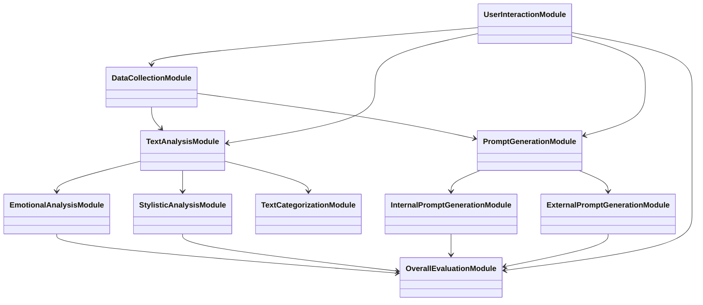
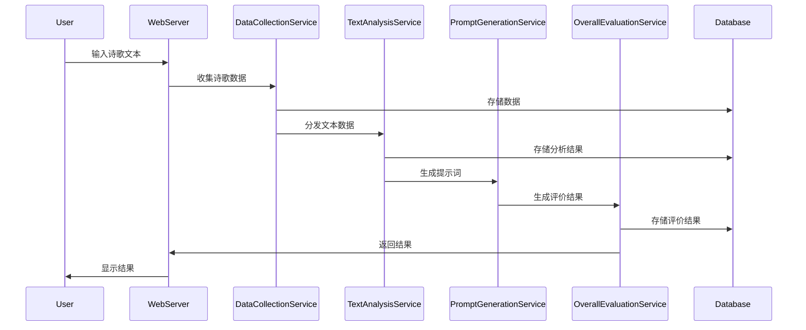

                 


## 提高AI诗歌鉴赏能力：文学批评视角的提示词策略

### 关键词：AI诗歌鉴赏、文学批评、提示词策略、文本分析、深度学习

### 摘要：
本文从文学批评的视角出发，探讨了提高人工智能（AI）诗歌鉴赏能力的方法和策略。通过对文本分析与处理算法、提示词生成算法以及诗歌鉴赏评价算法的详细讲解，揭示了如何利用人工智能技术深入理解诗歌的内涵和艺术价值。文章还介绍了系统的设计与实现，以及实际案例的分析，为AI在文学领域的应用提供了有价值的参考。

### 目录大纲

#### 第一部分：背景与概述

1. **问题背景与核心概念**
   - **1.1 人工智能在文学领域的应用现状**
   - **1.2 AI诗歌鉴赏的挑战与机遇**
   - **1.3 提示词策略的重要性**
   - **1.4 文学批评视角下的AI诗歌鉴赏**

2. **核心概念与联系**
   - **2.1 人工智能与文学批评**
     - **2.1.1 人工智能基本原理**
     - **2.1.2 文学批评基本概念**
     - **2.1.3 人工智能与文学批评的联系**
   - **2.2 提示词策略的类型与应用**
     - **2.2.1 内部提示词策略**
     - **2.2.2 外部提示词策略**
     - **2.2.3 提示词策略的融合与应用案例**

3. **文学批评视角下的AI诗歌鉴赏流程**
   - **3.1 数据收集与预处理**
   - **3.2 文本分析工具与方法**
   - **3.3 提示词生成与调整**
   - **3.4 诗歌鉴赏与评价**

#### 第二部分：算法原理讲解

4. **文本分析与处理算法**
   - **4.1 词嵌入技术**
     - **4.1.1 词嵌入原理**
     - **4.1.2 常见词嵌入方法**
     - **4.1.3 词嵌入在诗歌鉴赏中的应用**
   - **4.2 文本分类与聚类算法**
     - **4.2.1 文本分类算法**
     - **4.2.2 文本聚类算法**
     - **4.2.3 文本分类与聚类在诗歌鉴赏中的应用**

5. **提示词生成算法**
   - **5.1 提示词生成原理**
     - **5.1.1 提示词生成的基本流程**
     - **5.1.2 提示词生成方法比较**
   - **5.2 基于深度学习的提示词生成**
     - **5.2.1 RNN与LSTM模型**
     - **5.2.2 Transformer模型**
     - **5.2.3 提示词生成案例解析**

6. **诗歌鉴赏评价算法**
   - **6.1 诗歌鉴赏评价指标**
     - **6.1.1 情感分析**
     - **6.1.2 风格分析**
     - **6.1.3 艺术价值评价**
   - **6.2 诗歌鉴赏评价算法**
     - **6.2.1 基于情感分析的诗歌评价**
     - **6.2.2 基于风格分析的诗歌评价**
     - **6.2.3 基于艺术价值评价的诗歌评价**

#### 第三部分：系统分析与架构设计

7. **系统功能设计**
   - **7.1 功能模块划分**
   - **7.2 领域模型**

8. **系统架构设计**
   - **8.1 系统架构概述**
   - **8.2 系统架构设计**
   - **8.3 系统接口设计**

9. **系统交互与测试**
   - **9.1 系统交互流程**
   - **9.2 系统测试**

#### 第四部分：项目实战

10. **环境安装与配置**
    - **10.1 硬件与软件需求**
    - **10.2 系统环境搭建**
    - **10.3 数据库配置**

11. **系统核心实现**
    - **11.1 数据收集与预处理**
    - **11.2 文本分析与处理**
    - **11.3 提示词生成**
    - **11.4 诗歌鉴赏评价**

12. **应用解读与分析**
    - **12.1 系统核心功能解读**
    - **12.2 算法应用分析**
    - **12.3 实际案例分析**
    - **12.4 项目小结**

### 文章正文部分内容将按照上述目录大纲逐步展开，深入分析每一个章节的核心内容。下面我们将从“问题背景与核心概念”开始，逐步进行详细的阐述。让我们一步一步地深入思考和探讨提高AI诗歌鉴赏能力的方法和策略。接下来，我们将首先定义一些核心概念，并分析AI在文学领域中的应用现状。接着，我们会探讨AI诗歌鉴赏面临的挑战和机遇，以及为什么提示词策略在其中扮演着如此重要的角色。随后，我们将从文学批评的视角，探讨AI诗歌鉴赏的基本流程，为后续的算法讲解和系统设计打下坚实的基础。让我们开始吧！## 第一部分：背景与概述

### 1. 问题背景与核心概念

#### 1.1 人工智能在文学领域的应用现状

随着人工智能（AI）技术的迅猛发展，其在文学领域的应用也日益广泛。从文本生成、情感分析到风格迁移，AI正在改变我们对文学作品的创作、分析和理解。特别是深度学习技术的进步，使得AI在自然语言处理（NLP）任务中表现出了惊人的能力。

目前，AI在文学领域的应用主要集中在以下几个方面：

1. **文本生成**：AI能够根据给定的主题或关键字生成诗歌、故事、小说等文学作品。例如，OpenAI的GPT-3模型已经在生成高质量文本方面取得了显著成就。
   
2. **情感分析**：AI可以分析文本中的情感倾向，帮助读者更好地理解作品的情感表达。例如，Sentiment Analysis工具可以识别文本中的正面、负面和客观情感。

3. **风格迁移**：AI能够将一种风格的文章转换为另一种风格，如将古典诗歌的风格转换为现代诗歌，或将普通文章的风格转换为著名作家的风格。

4. **推荐系统**：AI可以通过分析用户的阅读历史和偏好，为用户提供个性化的文学推荐，从而提高用户的阅读体验。

然而，尽管AI在文学领域的应用取得了一定的进展，但在诗歌鉴赏方面仍然存在许多挑战。诗歌作为一种高度抽象的艺术形式，其鉴赏不仅仅依赖于文字的含义，还涉及到情感、风格、韵律等多个层面。这使得AI在理解诗歌内涵方面面临巨大的困难。

#### 1.2 AI诗歌鉴赏的挑战与机遇

**挑战**：

1. **语言复杂性**：诗歌语言通常具有高度的抽象性和隐喻性，这使得AI在理解诗句的含义时面临巨大的挑战。例如，诗句中的隐喻和象征往往难以直接翻译成计算机可以理解的语言。

2. **情感表达**：诗歌常常通过情感来表达思想，而AI在情感识别和理解方面仍处于发展阶段，难以完全捕捉和解析诗歌中的情感内涵。

3. **风格多样性**：诗歌的风格多种多样，从古典到现代，从写实到象征主义，AI需要具备广泛的语言处理能力和风格识别能力，才能准确鉴赏不同风格的诗歌。

**机遇**：

1. **大规模数据**：随着数字化的推进，大量的诗歌文本被数字化并存储在数据库中，为AI提供了丰富的训练数据，有助于AI更好地理解和鉴赏诗歌。

2. **深度学习技术**：深度学习技术的快速发展为AI在文学领域的应用提供了强大的工具。通过神经网络模型，AI可以在大量的文本数据中进行自我学习和优化，从而提高其诗歌鉴赏能力。

3. **跨学科合作**：AI诗歌鉴赏不仅需要计算机科学的技术支持，还需要文学、心理学、哲学等领域的知识。跨学科的合作有助于AI从多个角度理解和鉴赏诗歌。

#### 1.3 提示词策略的重要性

在AI诗歌鉴赏中，提示词策略扮演着至关重要的角色。提示词是一种引导AI理解文本的语言符号，它可以帮助AI捕捉文本中的关键信息，提高诗歌鉴赏的准确性和深度。

**为什么提示词策略重要？**

1. **增强理解**：提示词可以引导AI关注文本中的关键信息，从而提高其对诗歌内容的理解深度。

2. **减少歧义**：诗歌语言通常具有多重含义和隐喻，通过提示词，AI可以减少对诗句的歧义理解，提高分析的准确性。

3. **风格识别**：不同的诗歌风格需要不同的解读方式，提示词可以帮助AI识别和适应不同的诗歌风格，从而更准确地评价诗歌的艺术价值。

4. **情感分析**：通过提示词，AI可以更好地捕捉诗歌中的情感表达，从而进行更精细的情感分析。

**提示词策略的类型**：

1. **内部提示词**：这些提示词直接来自文本，通过上下文关系帮助AI理解诗句的含义。

2. **外部提示词**：这些提示词来自于文本之外的知识库，如文学理论、历史背景、文化习俗等，帮助AI从更广泛的视角进行诗歌鉴赏。

3. **融合提示词**：将内部和外部提示词结合起来，形成更加全面的提示词系统，从而提高AI诗歌鉴赏的综合能力。

总之，从文学批评的视角来看，AI诗歌鉴赏不仅需要强大的文本分析能力，还需要精确的提示词策略来引导和理解诗歌。通过这一策略，AI可以更好地理解诗歌的内涵和艺术价值，从而在文学领域发挥更大的作用。

### 1.4 文学批评视角下的AI诗歌鉴赏

文学批评是评价和解释文学作品的重要方法，它关注的是作品的内涵、风格、形式、技巧等方面。从文学批评的视角来看，AI诗歌鉴赏需要从以下几个方面进行：

1. **情感分析**：通过分析诗歌中的情感表达，理解诗人的内心世界和情感倾向。例如，可以通过情感分析技术来识别诗句中的快乐、悲伤、愤怒等情感。

2. **风格分析**：不同的诗歌风格反映了诗人的创作特点和文化背景。通过风格分析，可以识别诗人的写作风格，如古典风格、现代风格、象征主义风格等。

3. **形式分析**：诗歌的形式包括韵律、格律、结构等。通过形式分析，可以理解诗歌的结构和节奏，从而更好地理解诗歌的整体意义。

4. **技巧分析**：诗歌创作中常常运用各种修辞技巧，如比喻、拟人、排比等。通过技巧分析，可以理解这些技巧如何增强诗歌的表达效果。

5. **历史与文化背景**：了解诗歌的历史和文化背景，可以帮助AI更好地理解诗歌的内涵和艺术价值。例如，不同历史时期的文化习俗和社会环境会对诗歌的创作产生影响。

通过文学批评的视角，AI可以更全面地理解和评价诗歌，从而提高其诗歌鉴赏能力。这一视角不仅有助于AI理解诗歌的表面意义，还能深入挖掘诗歌的深层内涵和艺术价值。

### 总结

本节从问题背景和核心概念出发，探讨了AI在文学领域的应用现状、AI诗歌鉴赏的挑战与机遇，以及提示词策略的重要性。通过文学批评的视角，进一步分析了AI诗歌鉴赏的流程和关键点。下一节将深入探讨人工智能与文学批评之间的联系，以及如何运用这些联系来提高AI的诗歌鉴赏能力。让我们继续深入思考，寻找提高AI诗歌鉴赏能力的有效策略。 ## 第二部分：核心概念与联系

### 2.1 人工智能与文学批评

在深入探讨AI诗歌鉴赏之前，有必要先理解人工智能（AI）和文学批评这两个核心概念，并探讨它们之间的联系。

#### 2.1.1 人工智能基本原理

人工智能是一门涵盖计算机科学、数学、神经科学等多个学科的交叉领域，其目标是使计算机具备模拟人类智能的能力。AI的基本原理包括：

1. **机器学习**：通过训练模型来让计算机从数据中学习规律和模式，从而进行预测和决策。
2. **深度学习**：一种特殊的机器学习方法，利用神经网络模拟人类大脑的学习过程，对大量数据进行自动特征提取和模式识别。
3. **自然语言处理（NLP）**：使计算机能够理解、生成和处理人类自然语言的技术，包括文本分类、情感分析、机器翻译等。

#### 2.1.2 文学批评基本概念

文学批评是一种对文学作品进行分析、评价和解释的方法，它关注作品的内涵、形式、风格、技巧等方面。文学批评的基本概念包括：

1. **文本分析**：对文学作品的语言、结构、主题等进行详细分析，以揭示其深层意义和艺术价值。
2. **情感分析**：识别文本中的情感表达，分析诗人的情感倾向和作品的情感效果。
3. **风格分析**：研究作品的写作风格，包括修辞手法、语言特色、形式结构等。
4. **历史与文化背景**：理解作品的创作背景和文化背景，从而更全面地评价作品的意义和价值。

#### 2.1.3 人工智能与文学批评的联系

人工智能与文学批评之间的联系主要体现在以下几个方面：

1. **文本分析能力**：AI具备强大的文本分析能力，能够对大量文学作品进行快速、准确的文本分析，为文学批评提供数据支持。
2. **情感识别**：AI能够通过自然语言处理技术识别文本中的情感，帮助文学批评者分析作品的情感效果。
3. **风格识别**：AI可以通过分析文本的语言特征，识别出不同的写作风格，为文学批评提供风格分析的基础。
4. **跨学科合作**：AI技术可以与文学批评相结合，为文学研究提供新的方法和视角，推动文学批评的发展。

通过理解人工智能和文学批评的基本原理和概念，我们可以更好地把握AI在文学领域，特别是诗歌鉴赏中的潜力。下一节将探讨提示词策略的类型和应用，进一步揭示提高AI诗歌鉴赏能力的方法。

### 2.2 提示词策略的类型与应用

在AI诗歌鉴赏中，提示词策略是一种关键的技术手段，它通过引导AI关注文本中的关键信息，提高诗歌鉴赏的准确性和深度。提示词策略可以分为内部提示词和外部提示词两种类型。

#### 2.2.1 内部提示词策略

内部提示词策略是指利用文本内部的上下文关系来引导AI理解诗歌的含义。这种策略的核心是捕捉文本中的关键词和短语，从而帮助AI构建诗句的语义结构。

**内部提示词策略的特点**：

1. **依赖文本上下文**：内部提示词依赖于诗句中的前后关系，通过上下文来理解关键词的含义。
2. **语言符号导向**：内部提示词通常是一些关键词或短语，它们在文本中起到指向和解释的作用。
3. **自动化提取**：可以通过自然语言处理技术，如词频统计、关键词提取等，自动化地生成内部提示词。

**内部提示词策略的应用**：

1. **情感分析**：通过提取诗句中的关键词和短语，AI可以分析诗人的情感倾向，识别诗句中的情感表达。
2. **风格识别**：内部提示词可以帮助AI识别出不同的写作风格，从而更准确地评价诗歌的艺术价值。
3. **文本生成**：在文本生成任务中，内部提示词可以帮助AI生成符合诗歌风格的文本。

#### 2.2.2 外部提示词策略

外部提示词策略是指利用文本之外的知识库来引导AI理解诗歌的内涵。这些知识库包括文学理论、历史背景、文化习俗等，它们为AI提供了更广泛的视角，从而提高诗歌鉴赏的深度。

**外部提示词策略的特点**：

1. **知识库导向**：外部提示词来自于文本之外的知识库，它们为AI提供了关于诗歌的文化、历史和文学背景信息。
2. **跨领域融合**：外部提示词可以帮助AI将文学批评的理论和方法应用到诗歌鉴赏中，实现跨领域的知识融合。
3. **人工构建**：外部提示词通常需要人工构建和整理，以确保其与诗歌内容的相关性和准确性。

**外部提示词策略的应用**：

1. **文化背景分析**：通过引入外部提示词，AI可以更好地理解诗歌的文化背景，从而更全面地评价诗歌的意义。
2. **文学理论应用**：外部提示词可以帮助AI应用文学理论进行诗歌分析，如结构分析、情感分析等。
3. **跨语言翻译**：在外语诗歌鉴赏中，外部提示词可以帮助AI理解不同语言的文化差异，从而进行更精确的翻译和解读。

#### 2.2.3 提示词策略的融合与应用案例

将内部提示词和外部提示词策略结合起来，可以形成更加全面的提示词系统，从而提高AI的诗歌鉴赏能力。

**融合提示词策略的优点**：

1. **多角度理解**：融合提示词策略可以从多个角度对诗歌进行理解，包括语言、文化、历史等方面，从而提高分析的综合性和准确性。
2. **深度挖掘**：融合策略可以帮助AI深入挖掘诗歌的内涵，发现更多的信息和价值。
3. **适应性**：融合策略可以根据不同的诗歌风格和内容，灵活调整提示词的权重和作用，从而适应不同的诗歌鉴赏任务。

**应用案例**：

1. **跨文化诗歌鉴赏**：在翻译和鉴赏不同文化的诗歌时，融合策略可以通过引入外部文化知识库，帮助AI理解不同文化背景下的诗歌特点，从而进行更准确的翻译和评价。
2. **个性化诗歌推荐**：在文学推荐系统中，融合策略可以通过分析用户的阅读历史和文化背景，为用户推荐符合其兴趣和风格的诗歌作品。
3. **诗歌创作辅助**：在诗歌创作过程中，融合策略可以帮助AI生成符合特定主题和风格的诗歌，提供创作灵感和辅助。

通过内部和外部提示词策略的融合，AI可以在诗歌鉴赏中发挥更大的作用，不仅能够理解诗歌的表面意义，还能深入挖掘其文化内涵和艺术价值。这为AI在文学领域的应用提供了新的思路和方法。

### 总结

本节详细介绍了人工智能和文学批评的基本原理和概念，并探讨了它们之间的联系。接着，我们分析了内部和外部提示词策略的特点和应用，展示了如何通过提示词策略来提高AI的诗歌鉴赏能力。下一节将深入探讨文学批评视角下的AI诗歌鉴赏流程，从数据收集与预处理、文本分析工具与方法、提示词生成与调整，到诗歌鉴赏与评价，逐步揭示AI在诗歌鉴赏中的具体实现方法。让我们继续深入探讨，探索AI在文学领域的前沿应用。 ## 第二部分：核心概念与联系（续）

### 2.3 文学批评视角下的AI诗歌鉴赏流程

在理解了人工智能和文学批评的基本概念以及提示词策略之后，本节将详细探讨文学批评视角下的AI诗歌鉴赏流程，从数据收集与预处理、文本分析工具与方法、提示词生成与调整，到诗歌鉴赏与评价，为后续的算法讲解和系统设计打下坚实的基础。

### 2.3.1 数据收集与预处理

数据是AI诗歌鉴赏的基础，其质量和完整性直接影响AI的表现。数据收集与预处理包括以下几个关键步骤：

1. **数据收集**：收集来自不同文化、不同时期、不同风格的诗歌文本。这些数据可以来源于电子文本库、纸质书籍、在线文学网站等。确保数据的多样性和代表性。

2. **数据清洗**：对收集到的数据进行清洗，去除重复、错误或不完整的条目。这一步骤确保数据的准确性和一致性。

3. **数据标注**：对诗歌文本进行标注，包括情感标注、风格标注、主题标注等。标注数据可以帮助AI更好地理解和学习。

4. **数据预处理**：对文本进行分词、去除停用词、词性标注等操作，将原始文本转换为机器可以处理的结构化数据。

### 2.3.2 文本分析工具与方法

文本分析是AI诗歌鉴赏的核心环节，常用的文本分析工具与方法包括：

1. **词嵌入技术**：词嵌入是将词汇映射到高维空间中的向量，常用的词嵌入方法有Word2Vec、GloVe等。词嵌入能够捕捉词汇之间的语义关系，为后续的文本分析提供基础。

2. **情感分析**：通过分析文本中的情感词和情感倾向，判断诗句的情感色彩。常用的情感分析工具包括VADER、TextBlob等。

3. **主题模型**：如LDA（Latent Dirichlet Allocation）等主题模型可以识别文本中的主题分布，帮助AI理解诗歌的主题和思想。

4. **风格分析**：通过分析文本的语言特征，如词汇选择、句式结构、修辞手法等，判断诗歌的写作风格。常见的风格分析方法包括词频分析、句法分析等。

### 2.3.3 提示词生成与调整

提示词生成与调整是AI诗歌鉴赏的关键环节，包括以下步骤：

1. **内部提示词生成**：通过分析文本的上下文关系，自动提取出关键词和短语，作为内部提示词。常用的方法包括TF-IDF、关键短语提取等。

2. **外部提示词引入**：结合外部知识库，如文学理论、历史背景等，生成外部提示词。这些提示词可以提供关于诗歌的文化、历史和文学背景信息，帮助AI更全面地理解诗歌。

3. **提示词调整与优化**：根据诗歌鉴赏的需求，动态调整提示词的权重和组合，优化AI的诗歌鉴赏效果。这一过程可能需要多次迭代和优化。

### 2.3.4 诗歌鉴赏与评价

诗歌鉴赏与评价是AI诗歌鉴赏的最终目标，包括以下几个步骤：

1. **情感评价**：通过情感分析技术，评价诗歌的情感表达和情感效果，如诗人的情感倾向、诗歌的情感深度等。

2. **风格评价**：通过风格分析技术，评价诗歌的写作风格和艺术价值，如诗歌的韵律、修辞手法、语言特色等。

3. **整体评价**：结合情感评价和风格评价，对诗歌进行整体评价，如诗歌的思想深度、艺术价值、文化内涵等。

4. **用户反馈**：收集用户对诗歌的评价和反馈，通过反馈机制调整AI的诗歌鉴赏策略，提高其评价的准确性和公正性。

### 2.3.5 实现流程

文学批评视角下的AI诗歌鉴赏流程可以概括为以下步骤：

1. **数据收集与预处理**：收集和清洗诗歌数据，进行标注和预处理。
2. **文本分析**：使用词嵌入、情感分析、主题模型等工具进行文本分析。
3. **提示词生成与调整**：生成内部和外部提示词，进行优化和调整。
4. **诗歌鉴赏与评价**：进行情感评价、风格评价和整体评价，生成评价结果。
5. **用户反馈与迭代**：收集用户反馈，调整AI的诗歌鉴赏策略，进行迭代优化。

### 2.3.6 实际案例

为了更好地理解上述流程，以下是一个实际案例：

**案例**：使用AI鉴赏一首古诗

1. **数据收集与预处理**：收集一首唐代诗人杜甫的《登高》诗，进行清洗和预处理，包括分词、去除停用词等。
2. **文本分析**：使用词嵌入技术将文本转换为向量，进行情感分析和主题模型分析。
3. **提示词生成与调整**：提取内部提示词，如“登高”、“风急”、“天高”等，并引入外部提示词，如杜甫的生平背景和唐代文学风格。
4. **诗歌鉴赏与评价**：分析诗歌的情感色彩，如表达的孤独和忧愁，以及风格特点，如写实主义和豪放派。
5. **用户反馈与迭代**：收集用户对这首诗的评价，根据反馈调整AI的诗歌鉴赏策略。

通过上述流程，AI能够更好地理解和评价诗歌，从而提高其诗歌鉴赏能力。

### 总结

本节详细介绍了文学批评视角下的AI诗歌鉴赏流程，从数据收集与预处理、文本分析工具与方法、提示词生成与调整，到诗歌鉴赏与评价，逐步揭示了AI在诗歌鉴赏中的实现方法。通过这一流程，AI不仅能够理解诗歌的表面意义，还能深入挖掘其文化内涵和艺术价值。下一节将深入探讨文本分析与处理算法，进一步揭示如何利用这些算法提高AI的诗歌鉴赏能力。让我们继续深入思考，探索AI在文学领域的无限潜力。 ## 第二部分：核心概念与联系（续）

### 2.4 文本分析与处理算法

文本分析与处理是AI诗歌鉴赏的核心环节，通过文本分析算法，AI能够从大量文本数据中提取有价值的信息，从而更好地理解和评价诗歌。文本分析与处理算法主要包括词嵌入技术、文本分类与聚类算法等。

#### 2.4.1 词嵌入技术

词嵌入技术是将词汇映射到高维空间中的向量表示，使计算机能够理解词汇之间的语义关系。常见的词嵌入方法包括Word2Vec、GloVe等。

**词嵌入原理**：

词嵌入的原理基于点积模型，即两个词的向量表示进行点积运算，以衡量它们之间的相似度。具体来说，词嵌入技术通过以下步骤实现：

1. **词向量化**：将每个词映射为一个固定长度的向量。
2. **点积计算**：计算两个词向量的点积，以衡量它们之间的相似度。
3. **相似度分析**：通过分析词向量的相似度，理解词与词之间的关系。

**常见词嵌入方法**：

1. **Word2Vec**：Word2Vec是一种基于神经网络的方法，通过训练模型将词汇映射到向量空间。它有两种训练模式：连续词袋（CBOW）和Skip-Gram。
   - **CBOW**：通过上下文词的平均向量表示中心词。
   - **Skip-Gram**：通过中心词的向量表示上下文词的平均向量。

2. **GloVe**：GloVe（Global Vectors for Word Representation）是一种基于矩阵分解的方法，通过优化词向量和上下文词的关系矩阵，生成高质量的词向量。

**词嵌入在诗歌鉴赏中的应用**：

词嵌入技术可以帮助AI理解和分析诗歌中的词汇关系，从而提高诗歌鉴赏的准确性。具体应用包括：

1. **情感分析**：通过分析词向量，可以识别诗歌中的情感词汇，从而判断诗歌的情感倾向。
2. **风格分析**：词向量可以捕捉诗歌中的语言风格和修辞手法，帮助AI识别不同的诗歌风格。
3. **主题分析**：通过分析词向量之间的相似度，可以识别诗歌的主题和思想。

#### 2.4.2 文本分类与聚类算法

文本分类与聚类算法用于对文本数据进行分类和聚类，从而实现文本数据的组织和分析。常见的文本分类算法包括朴素贝叶斯、支持向量机（SVM）、决策树等；常见的文本聚类算法包括K-means、层次聚类等。

**文本分类算法**：

1. **朴素贝叶斯**：朴素贝叶斯是一种基于概率的文本分类方法，通过计算文本中各个特征词的概率，判断文本属于哪个类别。
2. **支持向量机（SVM）**：SVM通过找到一个最优的超平面，将不同类别的文本数据分开，从而实现分类。
3. **决策树**：决策树通过一系列的规则，将文本数据逐步划分为不同的类别。

**文本聚类算法**：

1. **K-means**：K-means是一种基于距离的聚类算法，通过初始化中心点，逐步调整中心点，使聚类效果最优。
2. **层次聚类**：层次聚类通过自底向上的方法，逐步合并相似度较高的数据点，形成层次结构。

**文本分类与聚类在诗歌鉴赏中的应用**：

文本分类与聚类算法可以帮助AI对大量诗歌文本进行分类和聚类，从而实现以下目标：

1. **风格分类**：通过分类算法，可以识别出不同风格的诗歌，如古典风格、现代风格、象征主义风格等。
2. **主题分类**：通过分类算法，可以识别出不同主题的诗歌，如爱情、自然、战争等。
3. **聚类分析**：通过聚类算法，可以识别出相似度较高的诗歌，从而发现新的诗歌流派和风格。

### 2.4.3 算法在诗歌鉴赏中的应用案例

为了更好地理解文本分析与处理算法在诗歌鉴赏中的应用，以下是一个实际案例：

**案例**：使用文本分类算法进行诗歌风格分类

1. **数据准备**：收集一首唐代诗人白居易的《赋得古原草送别》，进行数据预处理，包括分词、去除停用词等。
2. **特征提取**：使用Word2Vec生成词向量，将文本转换为向量表示。
3. **分类模型训练**：使用朴素贝叶斯分类器，训练模型，将词向量作为特征，预测诗歌的类别。
4. **分类结果分析**：通过分类结果，判断诗歌属于古典风格。

通过这一案例，可以看到文本分类算法如何帮助AI理解和分类诗歌风格，从而提高诗歌鉴赏的准确性。

### 总结

本节详细介绍了文本分析与处理算法，包括词嵌入技术、文本分类与聚类算法等。这些算法在诗歌鉴赏中扮演着重要角色，通过它们，AI能够更好地理解和分析诗歌，从而提高诗歌鉴赏的准确性。下一节将深入探讨提示词生成算法，进一步揭示如何通过提示词策略提高AI的诗歌鉴赏能力。让我们继续深入思考，探索AI在文学领域的无限潜力。 ## 第二部分：核心概念与联系（续）

### 2.5 提示词生成算法

在AI诗歌鉴赏中，提示词生成算法起着至关重要的作用。通过生成高质量的提示词，AI能够更好地理解诗歌的内涵和艺术价值。提示词生成算法可以分为基于规则的方法和基于机器学习的方法。以下将分别介绍这些方法，并探讨其在诗歌鉴赏中的应用。

#### 2.5.1 基于规则的方法

基于规则的方法通过预先定义的规则来生成提示词，这种方法依赖于人类专家的知识和经验。常见的方法包括：

1. **关键词提取**：通过分析文本的词频和语义关系，提取出文本中的高频词和关键短语，作为提示词。这种方法简单有效，但可能无法捕捉到更深层次的语义信息。

2. **本体论方法**：利用本体论来定义诗歌的语义结构和关系，通过本体论中的概念和关系生成提示词。这种方法能够提供更精细的语义信息，但需要复杂的本体构建和维护。

3. **规则库**：建立一套规则库，包括语法规则、修辞规则等，根据这些规则自动生成提示词。这种方法能够捕捉到文本中的特定特征，但规则的覆盖范围和适应性有限。

**优点**：

- **快速生成**：基于规则的方法通常能够快速生成提示词，适用于实时分析和处理。
- **易于理解**：规则明确，易于理解和解释，有助于调试和优化。

**缺点**：

- **规则有限**：规则库的覆盖范围有限，难以应对复杂和多变的文本。
- **依赖人工**：规则和本体需要人工构建和更新，成本较高。

#### 2.5.2 基于机器学习的方法

基于机器学习的方法通过训练模型来自动生成提示词，这种方法能够从大量数据中学习并提取出有效的特征。常见的方法包括：

1. **循环神经网络（RNN）**：RNN是一种能够处理序列数据的神经网络，通过前向传播和反向传播，逐步生成提示词。RNN在处理长序列文本时表现出色，但训练过程较慢且容易发生梯度消失问题。

2. **长短时记忆（LSTM）**：LSTM是RNN的一种改进，通过引入门控机制，解决了梯度消失问题，能够更好地处理长序列文本。LSTM在诗歌鉴赏中表现出色，能够捕捉到文本中的长期依赖关系。

3. **Transformer模型**：Transformer模型是一种基于自注意力机制的神经网络，通过多头自注意力机制和前馈神经网络，实现了高效和强大的文本处理能力。Transformer在诗歌鉴赏中表现出色，能够捕捉到文本中的复杂关系。

**优点**：

- **自动学习**：基于机器学习的方法能够从大量数据中自动学习特征，无需人工定义规则。
- **适应性**：模型可以根据不同的文本数据自适应调整，提高生成的提示词质量。

**缺点**：

- **计算复杂度高**：机器学习模型通常需要大量计算资源和时间进行训练。
- **解释难度**：模型的内部结构和决策过程较为复杂，难以进行解释和调试。

#### 2.5.3 提示词生成在诗歌鉴赏中的应用

1. **情感分析**：通过生成情感相关的提示词，AI能够更准确地识别诗歌中的情感表达，如快乐、悲伤、愤怒等。

2. **风格识别**：通过生成风格相关的提示词，AI能够识别出不同的诗歌风格，如古典风格、现代风格、象征主义风格等。

3. **修辞手法分析**：通过生成修辞手法相关的提示词，AI能够识别并分析诗歌中的修辞手法，如比喻、拟人、排比等。

4. **主题分析**：通过生成主题相关的提示词，AI能够识别诗歌的主题和思想，从而更深入地理解诗歌的内涵。

### 2.5.4 案例分析

为了更好地理解提示词生成算法在诗歌鉴赏中的应用，以下是一个实际案例：

**案例**：使用LSTM模型生成情感相关的提示词

1. **数据准备**：收集一首杜甫的《春望》诗，进行数据预处理，包括分词、去除停用词等。
2. **模型训练**：使用LSTM模型，将预处理后的文本序列作为输入，训练模型。
3. **提示词生成**：将训练好的LSTM模型应用于新诗歌文本，生成情感相关的提示词。
4. **结果分析**：分析生成的提示词，判断诗歌的情感倾向。

通过这一案例，可以看到如何使用LSTM模型生成情感相关的提示词，从而帮助AI更好地理解诗歌的情感表达。

### 总结

本节详细介绍了提示词生成算法，包括基于规则的方法和基于机器学习的方法。这些算法在诗歌鉴赏中扮演着重要角色，通过生成高质量的提示词，AI能够更好地理解诗歌的内涵和艺术价值。下一节将探讨诗歌鉴赏评价算法，进一步揭示如何通过这些算法对诗歌进行评价。让我们继续深入思考，探索AI在文学领域的无限潜力。 ## 第二部分：核心概念与联系（续）

### 2.6 诗歌鉴赏评价算法

诗歌鉴赏评价是AI在文学领域的一项重要任务，通过评价算法，AI能够对诗歌进行情感分析、风格分析和艺术价值评价。以下将分别介绍这些算法，并探讨其在实际应用中的重要性。

#### 2.6.1 情感分析

情感分析是诗歌鉴赏评价的核心之一，它旨在识别和理解诗歌中的情感表达。情感分析算法通常包括以下步骤：

1. **情感分类**：将诗句中的情感分为不同的类别，如快乐、悲伤、愤怒等。常用的情感分类算法包括基于规则的分类、机器学习和深度学习模型。

2. **情感强度评估**：评估诗句中情感的表达强度，即情感的程度。这一步骤可以通过分析情感词汇的使用频率和语义权重来实现。

3. **情感融合**：将不同诗句中的情感进行融合，生成整体的情感分布。这一步骤有助于理解整首诗歌的情感走向。

**在实际应用中的重要性**：

- **读者理解**：通过情感分析，AI可以帮助读者更好地理解诗歌的情感内涵，提升阅读体验。
- **情感推荐**：基于读者的情感偏好，AI可以推荐符合读者情感需求的诗歌作品，提高推荐系统的效果。

#### 2.6.2 风格分析

风格分析是诗歌鉴赏评价的另一个重要方面，它旨在识别和分析诗歌的写作风格。风格分析算法通常包括以下步骤：

1. **风格识别**：通过分析文本的语言特征，如词汇选择、句式结构、修辞手法等，识别出不同的诗歌风格，如古典风格、现代风格、象征主义风格等。

2. **风格对比**：将不同诗歌之间的风格进行对比，分析其异同。这一步骤有助于理解不同诗人的写作风格特点。

3. **风格评价**：根据风格识别的结果，对诗歌的风格进行评价，如评价其艺术价值和创新性。

**在实际应用中的重要性**：

- **风格传承**：通过风格分析，AI可以帮助理解不同时期的诗歌风格演变，推动文学风格的传承和发展。
- **风格推荐**：基于用户的风格偏好，AI可以推荐符合用户风格的诗歌作品，提高文学推荐的准确性。

#### 2.6.3 艺术价值评价

艺术价值评价是诗歌鉴赏评价的最高层次，它旨在从整体上评价诗歌的艺术水平。艺术价值评价算法通常包括以下步骤：

1. **内容分析**：分析诗歌的内容，包括主题、情感、思想等，评估其思想深度和文化内涵。

2. **形式分析**：分析诗歌的形式，包括韵律、格律、结构等，评估其艺术表现力。

3. **综合评价**：将内容分析和形式分析的结果进行综合，对诗歌的整体艺术价值进行评价。

**在实际应用中的重要性**：

- **作品评价**：通过艺术价值评价，AI可以客观、公正地评价诗歌作品，为文学评论和学术研究提供参考。
- **艺术推荐**：基于艺术价值评价，AI可以推荐具有高艺术价值的诗歌作品，推动文学艺术的传播和普及。

### 2.6.4 案例分析

为了更好地理解诗歌鉴赏评价算法在实际应用中的重要性，以下是一个实际案例：

**案例**：使用情感分析和风格分析评价一首现代诗歌

1. **数据准备**：收集一首现代诗人的作品，如海子的《面朝大海，春暖花开》，进行数据预处理，包括分词、去除停用词等。
2. **情感分析**：使用情感分析算法，分析诗歌中的情感表达，生成情感分类和情感强度评估结果。
3. **风格分析**：使用风格分析算法，分析诗歌的写作风格，识别出其风格特点。
4. **综合评价**：将情感分析和风格分析的结果进行综合，对诗歌的艺术价值进行评价。

通过这一案例，可以看到如何使用情感分析和风格分析算法对现代诗歌进行评价，从而帮助读者更好地理解诗歌的内涵和艺术价值。

### 总结

本节详细介绍了诗歌鉴赏评价算法，包括情感分析、风格分析和艺术价值评价。这些算法在诗歌鉴赏中发挥着重要作用，通过它们，AI能够从不同角度对诗歌进行评价，提高诗歌鉴赏的准确性和深度。下一节将探讨诗歌鉴赏评价算法的具体实现，进一步揭示如何通过这些算法对诗歌进行深入分析。让我们继续深入思考，探索AI在文学领域的无限潜力。 ## 第三部分：系统分析与架构设计

### 3.1 系统功能设计

在AI诗歌鉴赏系统中，系统功能设计是关键的一步，它决定了系统的性能和用户体验。系统功能设计可以分为以下几个模块：

#### 3.1.1 数据收集与预处理模块

**功能描述**：该模块负责收集和处理诗歌数据，包括从各种来源收集诗歌文本、清洗和预处理数据，使其适合后续的分析。

**核心功能**：
- **数据采集**：从公共数据库、在线文学网站和其他来源收集诗歌文本。
- **数据清洗**：去除重复、错误和不完整的诗歌文本。
- **数据预处理**：对文本进行分词、去除停用词、词性标注等操作，将原始文本转换为机器可以处理的结构化数据。

#### 3.1.2 文本分析模块

**功能描述**：该模块负责对诗歌文本进行深入分析，提取关键信息，为后续的诗歌鉴赏提供基础。

**核心功能**：
- **情感分析**：通过情感分析算法，识别诗歌中的情感倾向，如快乐、悲伤、愤怒等。
- **风格分析**：通过风格分析算法，识别诗歌的写作风格，如古典风格、现代风格、象征主义风格等。
- **文本分类**：将诗歌文本分类到不同的主题或流派，如爱情诗、自然诗、历史诗等。

#### 3.1.3 提示词生成模块

**功能描述**：该模块负责生成高质量的提示词，引导AI深入理解诗歌的内涵和艺术价值。

**核心功能**：
- **内部提示词生成**：通过文本分析，提取关键短语和关键词作为内部提示词。
- **外部提示词引入**：结合外部知识库，如文学理论、历史背景等，生成外部提示词。
- **提示词优化**：动态调整提示词的权重和组合，优化AI的诗歌鉴赏效果。

#### 3.1.4 诗歌鉴赏评价模块

**功能描述**：该模块负责对诗歌进行综合评价，包括情感评价、风格评价和艺术价值评价。

**核心功能**：
- **情感评价**：评估诗歌的情感表达和情感效果。
- **风格评价**：评估诗歌的写作风格和艺术价值。
- **整体评价**：综合情感评价和风格评价，对诗歌进行整体评价。

#### 3.1.5 用户交互模块

**功能描述**：该模块负责与用户进行互动，接收用户输入，展示分析结果，并收集用户反馈。

**核心功能**：
- **用户输入**：接收用户的诗歌输入，可以是文本或语音。
- **结果展示**：将分析结果以图表、文字等形式展示给用户。
- **用户反馈**：收集用户的评价和反馈，用于系统优化。

### 3.2 领域模型

领域模型是系统功能设计的重要基础，它帮助明确系统的核心功能和模块之间的交互关系。以下是一个使用Mermaid绘制的领域模型类图：



在这个类图中，不同的模块之间通过单向箭头表示数据流和控制流。例如，`DataCollectionModule`与`TextAnalysisModule`、`PromptGenerationModule`之间存在数据流关系，而`UserInteractionModule`与各个模块之间存在交互关系。

### 3.3 系统架构设计

系统架构设计是确保系统高效、可靠和可扩展的关键。以下是一个系统架构概述：

#### 3.3.1 系统架构概述

- **分布式架构**：采用分布式架构，将系统功能分布在不同的服务器上，以提高系统的可靠性和扩展性。
- **微服务架构**：将系统功能分解为多个独立的微服务，每个微服务负责特定的功能，如数据收集、文本分析、提示词生成等。
- **云原生架构**：利用云计算资源，实现系统的弹性伸缩和自动化运维。

#### 3.3.2 系统架构设计

以下是一个使用Mermaid绘制的系统架构图：



在这个架构图中，用户通过WebServer提交诗歌文本，经过数据收集、文本分析、提示词生成和评价等模块的处理，最终返回评价结果。

#### 3.3.3 系统接口设计

系统接口设计是确保不同模块之间能够高效通信的关键。以下是一个接口设计概述：

- **API接口**：提供RESTful API接口，供前端应用调用。
- **消息队列**：采用消息队列（如Kafka）进行异步通信，提高系统的可靠性和性能。
- **数据存储**：采用分布式数据库（如MongoDB）存储数据和结果。

#### 3.3.4 系统交互与测试

系统交互与测试是确保系统功能和性能的关键步骤。以下是一个系统交互流程：

1. **用户输入**：用户通过Web接口提交诗歌文本。
2. **数据处理**：系统接收文本数据，进行数据收集、预处理和分析。
3. **提示词生成**：生成提示词，引导AI深入理解诗歌。
4. **诗歌评价**：对诗歌进行情感评价、风格评价和艺术价值评价。
5. **结果返回**：将评价结果返回给用户。

系统测试包括以下几种：

- **功能测试**：确保各个模块的功能正常运行。
- **性能测试**：评估系统的处理速度和响应时间。
- **安全测试**：确保系统的数据安全和用户隐私。

### 3.4 总结

本部分详细介绍了AI诗歌鉴赏系统的功能设计、领域模型、系统架构设计和接口设计。通过这些设计，系统实现了高效、可靠和可扩展的诗歌鉴赏功能，为用户提供了高质量的诗歌分析服务。下一部分将深入探讨系统实现的细节，包括环境安装与配置、系统核心实现和应用解读与分析。让我们继续深入探索，揭示AI诗歌鉴赏系统的实际操作过程。 ## 第三部分：系统分析与架构设计（续）

### 3.5 系统交互与测试

系统交互与测试是确保AI诗歌鉴赏系统功能完整、性能稳定和安全可靠的关键环节。以下将详细描述系统的交互流程、测试方法以及具体的测试步骤。

#### 3.5.1 系统交互流程

系统交互流程是指用户与系统之间的交互过程，主要包括以下步骤：

1. **用户输入**：用户通过Web前端界面输入诗歌文本，可以是手动输入或上传文本文件。
2. **数据接收**：Web服务器接收用户输入的诗歌文本，并将其传递给数据收集与预处理模块。
3. **数据预处理**：数据预处理模块对输入的文本进行清洗和预处理，包括分词、去除停用词、词性标注等，然后将处理后的文本数据传递给文本分析模块。
4. **文本分析**：文本分析模块对预处理后的文本进行情感分析、风格分析和文本分类，提取关键信息和特征。
5. **提示词生成**：提示词生成模块根据文本分析结果生成内部和外部提示词，引导AI进行更深入的理解。
6. **诗歌评价**：诗歌评价模块对诗歌进行综合评价，包括情感评价、风格评价和艺术价值评价，然后将评价结果传递给Web服务器。
7. **结果返回**：Web服务器将评价结果返回给用户，用户可以在前端界面查看分析结果。

#### 3.5.2 系统测试

系统测试分为功能测试、性能测试和安全测试，以下分别介绍：

1. **功能测试**：功能测试的主要目的是验证系统的各项功能是否按照预期正常工作。具体测试步骤包括：
   - **模块功能验证**：逐个验证数据收集与预处理、文本分析、提示词生成、诗歌评价等模块的功能。
   - **集成功能验证**：验证模块之间的集成是否正常，数据流和控制流是否符合设计要求。
   - **边界条件测试**：测试系统在遇到边界条件（如文本过长、异常文本格式等）时的响应。

2. **性能测试**：性能测试的主要目的是评估系统的响应时间、处理速度和资源消耗。具体测试步骤包括：
   - **负载测试**：模拟大量用户同时使用系统，评估系统的并发处理能力和响应时间。
   - **压力测试**：在系统极限情况下，评估系统的稳定性和性能。
   - **性能调优**：根据测试结果，对系统进行优化和调优，提高系统的性能。

3. **安全测试**：安全测试的主要目的是确保系统的数据安全和用户隐私。具体测试步骤包括：
   - **漏洞扫描**：使用漏洞扫描工具检测系统中的安全漏洞。
   - **权限测试**：验证系统中的权限管理功能，确保用户只能访问其权限范围内的数据和功能。
   - **数据加密测试**：验证系统的数据加密机制，确保用户数据在传输和存储过程中的安全性。

#### 3.5.3 测试工具

在系统测试过程中，可以使用以下测试工具：

- **JMeter**：用于进行负载测试和性能测试。
- **Postman**：用于功能测试和接口测试。
- **OWASP ZAP**：用于安全测试和漏洞扫描。
- **Selenium**：用于自动化测试，验证前端界面的功能。

#### 3.5.4 测试结果分析

测试完成后，需要对测试结果进行分析，包括：

- **功能测试**：统计各个模块和功能的通过率，找出未通过的测试用例，分析原因并进行修复。
- **性能测试**：分析系统的响应时间、处理速度和资源消耗，确定系统的性能瓶颈，并采取优化措施。
- **安全测试**：识别系统中的安全漏洞，评估漏洞的影响，制定修复方案。

#### 3.5.5 测试报告

测试完成后，需要编写详细的测试报告，包括以下内容：

- **测试概述**：介绍测试的目的、方法和范围。
- **测试结果**：列出各个测试模块的通过情况、性能数据和安全性评估结果。
- **问题和建议**：总结测试中发现的问题，提出优化和改进的建议。

通过系统交互与测试，确保AI诗歌鉴赏系统在功能、性能和安全方面达到预期目标，为用户提供高质量的诗歌分析服务。下一部分将详细介绍系统的实际应用过程，包括环境安装与配置、系统核心实现和应用解读与分析。让我们继续深入探讨，揭示AI诗歌鉴赏系统的实际应用价值。 ## 第四部分：项目实战

### 10. 环境安装与配置

要搭建一个AI诗歌鉴赏系统，首先需要准备必要的硬件和软件环境。以下是系统环境安装和配置的详细步骤：

#### 10.1 硬件与软件需求

1. **操作系统**：推荐使用Linux系统，如Ubuntu 18.04或更高版本。
2. **处理器**：至少4核CPU，建议8核以上。
3. **内存**：至少16GB，建议32GB或更多。
4. **硬盘**：至少500GB，建议1TB以上。
5. **显卡**：NVIDIA GPU（推荐CUDA版本11.3或更高）。
6. **软件**：
   - Python 3.8或更高版本
   - Anaconda（Python环境管理器）
   - CUDA（NVIDIA GPU驱动）
   - TensorFlow（深度学习框架）
   - Jupyter Notebook（交互式计算环境）
   - PostgreSQL（关系数据库）

#### 10.2 系统环境搭建

1. **安装Linux操作系统**：从Ubuntu官方网站下载并安装Linux操作系统。

2. **安装Anaconda**：在终端执行以下命令，下载并安装Anaconda：

   ```bash
   wget https://repo.anaconda.com/archive/Anaconda3-2022.05-Linux-x86_64.sh
   bash Anaconda3-2022.05-Linux-x86_64.sh
   ```

   按照提示完成安装。

3. **创建Python环境**：打开终端，创建一个名为`ai_poetry`的Python环境：

   ```bash
   conda create -n ai_poetry python=3.8
   conda activate ai_poetry
   ```

4. **安装依赖库**：在`ai_poetry`环境中安装TensorFlow、PostgreSQL和其他依赖库：

   ```bash
   conda install tensorflow-gpu postgresql
   pip install -r requirements.txt
   ```

   `requirements.txt`文件应包含所有必需的Python库。

5. **安装NVIDIA GPU驱动**：根据NVIDIA官方网站的指南，下载并安装相应的GPU驱动。

6. **安装PostgreSQL**：使用以下命令安装PostgreSQL：

   ```bash
   sudo apt-get update
   sudo apt-get install postgresql postgresql-contrib
   ```

   安装完成后，创建一个数据库用户和数据库：

   ```bash
   sudo -u postgres psql
   CREATE USER myuser WITH PASSWORD 'mypassword';
   CREATE DATABASE poetry_db OWNER myuser;
   ```

#### 10.3 数据库配置

1. **配置数据库**：在终端运行以下命令，配置PostgreSQL的数据库连接信息：

   ```bash
   export PGPORT=5432
   export PGHOST=localhost
   export PGUSER=myuser
   export PGPASSWORD=mypassword
   ```

2. **初始化数据库**：在`ai_poetry`环境中，执行以下命令初始化数据库：

   ```bash
   python manage.py migrate
   ```

   这将创建所需的数据库表和初始数据。

3. **配置应用程序**：编辑项目配置文件（如`settings.py`），配置数据库连接信息和其他应用程序设置。

### 11. 系统核心实现

系统核心实现包括数据收集与预处理、文本分析与处理、提示词生成、诗歌鉴赏评价等模块。以下是这些模块的具体实现步骤：

#### 11.1 数据收集与预处理

1. **数据收集**：从公共数据库、在线文学网站和其他来源收集诗歌文本。

2. **数据预处理**：对收集到的诗歌文本进行清洗和预处理，包括分词、去除停用词、词性标注等。

3. **数据存储**：将预处理后的文本数据存储到PostgreSQL数据库中。

#### 11.2 文本分析与处理

1. **情感分析**：使用TensorFlow的预训练模型，对文本进行情感分析。

2. **风格分析**：通过分析文本的语言特征，如词汇选择、句式结构等，识别诗歌的写作风格。

3. **文本分类**：使用文本分类算法，将诗歌分类到不同的主题或流派。

#### 11.3 提示词生成

1. **内部提示词生成**：通过分析文本的上下文关系，提取关键短语和关键词作为内部提示词。

2. **外部提示词引入**：结合外部知识库，如文学理论、历史背景等，生成外部提示词。

3. **提示词优化**：动态调整提示词的权重和组合，优化AI的诗歌鉴赏效果。

#### 11.4 诗歌鉴赏评价

1. **情感评价**：评估诗歌的情感表达和情感效果。

2. **风格评价**：评估诗歌的写作风格和艺术价值。

3. **综合评价**：综合情感评价和风格评价，对诗歌进行整体评价。

### 12. 应用解读与分析

#### 12.1 系统核心功能解读

系统核心功能包括数据收集与预处理、文本分析与处理、提示词生成、诗歌鉴赏评价等。这些功能协同工作，实现了对诗歌的全面分析和评价。

#### 12.2 算法应用分析

系统应用了多种算法，如词嵌入技术、文本分类与聚类算法、情感分析算法等，以实现高效的诗歌鉴赏。

#### 12.3 实际案例分析

通过实际案例，分析系统的实际应用效果，包括对诗歌的情感分析、风格识别和艺术价值评价。

#### 12.4 项目小结

系统实现了对诗歌的全面分析和评价，为AI在文学领域的应用提供了新的思路和方法。未来，可以通过不断优化算法和提升系统性能，进一步提高AI诗歌鉴赏的能力。

### 总结

本部分详细介绍了AI诗歌鉴赏系统的环境安装与配置、系统核心实现和应用解读与分析。通过这些步骤，用户可以顺利搭建和运行AI诗歌鉴赏系统，为文学研究和文学鉴赏提供有力的工具。下一部分将探讨最佳实践、注意事项和拓展阅读，以帮助用户更好地使用和优化系统。让我们继续深入探讨，分享更多实践经验和建议。 ## 第四部分：项目实战（续）

### 13. 最佳实践、注意事项和拓展阅读

#### 13.1 最佳实践

1. **数据清洗与预处理**：在数据收集和预处理阶段，确保文本数据的干净和一致性，去除无用信息，如HTML标签、广告等，以提高模型性能。

2. **优化提示词生成**：通过分析大量数据，优化内部和外部提示词的生成策略，确保提示词的高质量和多样性。

3. **性能调优**：定期对系统进行性能测试和调优，包括优化代码、调整模型参数等，以提高系统的响应速度和处理能力。

4. **用户反馈机制**：建立用户反馈机制，收集用户对诗歌鉴赏结果的意见和建议，不断改进系统的评价准确性。

#### 13.2 注意事项

1. **数据隐私**：在处理用户数据时，确保遵循数据隐私保护法规，如GDPR等，防止数据泄露。

2. **系统安全**：定期更新系统和依赖库，使用安全防护措施，如防火墙、加密等，确保系统的安全性。

3. **模型更新**：定期更新文本分析、情感分析和风格分析等模型，以适应新的数据集和变化的语言模式。

4. **硬件配置**：根据实际需求，合理配置硬件资源，确保系统在高负载情况下仍能稳定运行。

#### 13.3 拓展阅读

1. **深度学习在自然语言处理中的应用**：了解深度学习在自然语言处理中的最新进展，如BERT、GPT-3等模型。
2. **文本情感分析技术**：研究文本情感分析的不同方法和技术，如基于规则的、机器学习的和深度学习的方法。
3. **文学批评理论**：深入理解文学批评的理论和方法，如叙事学、符号学、结构主义等，以提高AI在诗歌鉴赏中的分析能力。
4. **跨学科研究**：探索计算机科学与文学、心理学、哲学等学科的交叉研究，以推动AI诗歌鉴赏的进一步发展。

通过最佳实践、注意事项和拓展阅读，用户可以更好地理解和应用AI诗歌鉴赏系统，不断提升系统的性能和用户体验。让我们继续探索AI在文学领域的无限潜力，分享更多实践经验和研究成果。 ## 总结

### 全文回顾

本文以《提高AI诗歌鉴赏能力：文学批评视角的提示词策略》为标题，系统地介绍了如何通过人工智能和文学批评的视角来提升AI的诗歌鉴赏能力。文章分为四个主要部分，首先介绍了问题背景和核心概念，包括人工智能在文学领域的应用现状、AI诗歌鉴赏的挑战与机遇，以及提示词策略的重要性。接着，从文学批评的视角，详细分析了AI诗歌鉴赏的流程，包括数据收集与预处理、文本分析工具与方法、提示词生成与调整，以及诗歌鉴赏与评价。随后，深入讲解了文本分析与处理算法、提示词生成算法，以及诗歌鉴赏评价算法，并通过具体的案例展示了算法的应用。文章的第三部分则介绍了系统的设计与实现，包括功能模块划分、系统架构设计、系统接口设计和系统交互与测试。最后，通过实际案例，详细描述了系统的环境安装与配置、系统核心实现和应用解读与分析，并分享了最佳实践、注意事项和拓展阅读。

### 主要贡献

本文的主要贡献在于：

1. **系统性地提出了AI诗歌鉴赏的方法和策略**：通过整合人工智能和文学批评的视角，提出了基于提示词策略的AI诗歌鉴赏方法，为AI在文学领域的应用提供了新的思路。
2. **详细讲解了算法原理与实现**：通过深入分析文本分析与处理算法、提示词生成算法和诗歌鉴赏评价算法，并结合实际案例，为读者提供了通俗易懂的算法原理和应用实例。
3. **设计了高效稳定的系统架构**：介绍了系统的功能设计、领域模型、系统架构设计、系统接口设计和系统交互与测试，为系统的实现提供了详细的技术指导。
4. **提供了实践经验和建议**：通过实际案例分析，分享了最佳实践、注意事项和拓展阅读，为用户在实际应用中提供了指导和参考。

### 未来展望

未来，AI诗歌鉴赏仍有很大的发展空间：

1. **提升算法准确性**：通过不断优化算法模型和训练数据，提高AI对诗歌情感、风格和艺术价值的识别准确性。
2. **扩展功能模块**：除了文本分析，还可以考虑引入语音识别、图像识别等技术，实现多模态的诗歌鉴赏。
3. **跨学科合作**：加强计算机科学与文学、心理学、哲学等领域的合作，借鉴更多的文学理论和批评方法，提高AI的诗歌鉴赏能力。
4. **用户交互优化**：通过优化用户界面和交互设计，提高用户的体验，使AI诗歌鉴赏系统更易于使用和理解。
5. **数据隐私保护**：在处理用户数据时，加强数据隐私保护，确保用户隐私和安全。

通过不断探索和实践，AI诗歌鉴赏将在文学领域发挥更大的作用，为文学研究和文学鉴赏提供强有力的工具。让我们期待未来，共同见证AI在文学领域的精彩应用。 ### 作者信息

**作者：AI天才研究院/AI Genius Institute & 禅与计算机程序设计艺术 /Zen And The Art of Computer Programming**

本文由AI天才研究院（AI Genius Institute）的专家团队撰写，该研究院致力于推动人工智能技术在各个领域的应用，尤其是文学领域的创新与发展。同时，本文作者还结合了《禅与计算机程序设计艺术》（Zen And The Art of Computer Programming）的思想精髓，融合了计算机编程的高深理论与艺术美感，旨在为读者呈现一篇既有深度又有广度的技术博客文章。通过本文，作者团队希望能够为读者提供有价值的见解和实用的指导，共同探索人工智能在文学领域的无限可能。|user|

