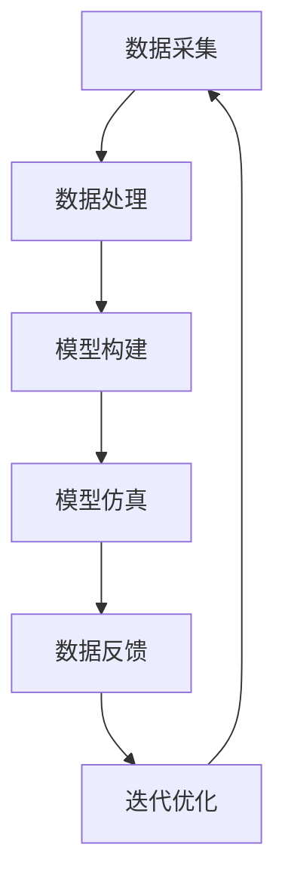

                 


### 书的背景和核心概念

**标题**: 数字孪生在产品设计中的创新应用

**核心话题**: 着重讨论数字孪生技术如何在产品设计中实现创新应用。

**重要性**: 强调数字孪生技术在提升产品开发效率、质量和可持续性方面的重要性。

#### 第1章：数字孪生概述

### 1.1.1 数字孪生的背景和重要性

数字孪生技术起源于20世纪90年代，最初应用于航空航天和制造业领域。近年来，随着物联网、云计算和大数据技术的快速发展，数字孪生技术逐渐成为产品设计和开发中的重要工具。数字孪生技术的重要性体现在以下几个方面：

1. **提高产品设计效率**：通过创建数字模型，设计师可以快速进行原型设计和迭代，减少物理样机的制造时间和成本。
2. **提升产品质量**：数字孪生技术可以帮助识别潜在的设计缺陷，提前进行故障预测和优化，从而提高产品的可靠性。
3. **增强可持续性**：数字孪生技术可以实现产品的全生命周期管理，包括设计、制造、运营和回收，有助于实现资源的高效利用和环境的可持续发展。

### 1.1.2 数字孪生的定义和分类

数字孪生（Digital Twin）是一种基于物理实体和虚拟模型相结合的技术，通过对物理实体的实时数据进行模拟和分析，实现对物理实体的精准复制和优化。

数字孪生可以按照不同的分类方式进行划分：

1. **按应用领域分类**：可以分为工业制造、建筑工程、医疗健康、交通运输等多个领域。
2. **按技术架构分类**：可以分为全息数字孪生、智能数字孪生、静态数字孪生和动态数字孪生等。

### 1.1.3 数字孪生的发展历程

数字孪生技术从最初的概念提出，经历了理论探索、技术验证和应用拓展等阶段，逐渐发展成为现代产品设计和开发中的重要技术。

1. **理论探索阶段**：20世纪90年代，数字孪生概念首次提出，研究者开始探讨其理论基础和应用前景。
2. **技术验证阶段**：21世纪初，随着物联网、云计算和大数据技术的发展，数字孪生技术逐渐得到验证和应用。
3. **应用拓展阶段**：近年来，数字孪生技术在各个领域的应用不断拓展，成为产品设计和开发中的重要工具。

### 1.1.4 数字孪生在产品设计中应用的价值

数字孪生技术在产品设计中具有广泛的应用价值，主要体现在以下几个方面：

1. **快速原型设计**：通过数字孪生技术，设计师可以快速创建产品的数字模型，进行原型设计和迭代，减少物理样机的制造时间和成本。
2. **故障预测与优化**：数字孪生技术可以帮助设计师识别潜在的设计缺陷，提前进行故障预测和优化，从而提高产品的可靠性。
3. **全生命周期管理**：数字孪生技术可以实现产品的全生命周期管理，包括设计、制造、运营和回收，有助于实现资源的高效利用和环境的可持续发展。
4. **协同设计与开发**：数字孪生技术可以实现设计师、工程师和制造商之间的协同工作，提高产品设计和开发的效率。

#### 第2章：数字孪生的基础概念与架构

### 1.2.1 数字孪生的核心概念解析

数字孪生技术包括以下几个核心概念：

1. **物理实体**：指实际存在的物理产品或系统，例如飞机、汽车、建筑物等。
2. **数字模型**：指对物理实体的数字表示，包括几何形状、物理属性、运行状态等。
3. **实时数据**：指物理实体在运行过程中产生的实时数据，例如传感器数据、运行状态数据等。
4. **数据平台**：指用于存储、处理和分析数字孪生数据的技术平台。

### 1.2.2 数字孪生系统的基本架构

数字孪生系统的基本架构通常包括以下几个部分：

1. **数据采集**：通过传感器和其他设备采集物理实体的实时数据。
2. **数据处理**：对采集到的数据进行清洗、转换和处理，使其适用于数字孪生模型。
3. **数字模型构建**：根据处理后的数据构建物理实体的数字模型。
4. **模型仿真与优化**：通过仿真和优化技术对数字孪生模型进行分析和优化。
5. **数据反馈与调整**：将分析结果反馈给物理实体，进行实时调整和优化。

### 1.2.3 数字孪生的技术组成

数字孪生技术包括以下几个关键技术组成：

1. **物联网技术**：用于采集物理实体的实时数据。
2. **云计算技术**：用于存储、处理和分析数字孪生数据。
3. **大数据技术**：用于处理大规模的数字孪生数据。
4. **仿真与优化技术**：用于对数字孪生模型进行分析和优化。
5. **虚拟现实与增强现实技术**：用于增强数字孪生的可视化效果。

### 1.2.4 数字孪生的数据流与管理

数字孪生的数据流通常包括以下几个环节：

1. **数据采集**：通过传感器和其他设备采集物理实体的实时数据。
2. **数据传输**：将采集到的数据传输到数据平台进行存储和处理。
3. **数据处理**：对传输到数据平台的数据进行清洗、转换和处理。
4. **数据存储**：将处理后的数据存储在数据平台上，以供后续分析和应用。
5. **数据分析**：利用大数据和机器学习技术对存储在数据平台上的数据进行分析和挖掘。
6. **数据可视化**：通过虚拟现实和增强现实技术将分析结果可视化，以供用户直观了解和分析。

### 1.2.5 数字孪生在产品设计中的挑战与机遇

数字孪生技术在产品设计中面临着一系列的挑战，同时也带来了许多机遇。

#### 第3章：数字孪生在产品设计中的挑战

### 1.3.1 数字孪生在产品设计中的挑战

数字孪生技术在产品设计中的挑战主要体现在以下几个方面：

1. **数据采集与处理的准确性**：数字孪生的效果很大程度上取决于数据采集和处理的准确性，任何数据错误都可能导致分析结果失真。
2. **数据的安全性和隐私保护**：数字孪生技术涉及大量的实时数据和敏感信息，需要确保数据的安全性和隐私保护。
3. **系统的稳定性和可靠性**：数字孪生系统需要保证在复杂环境下的稳定性和可靠性，以避免系统故障导致数据丢失或分析结果错误。
4. **跨领域和跨专业的协作**：数字孪生技术涉及多个领域和跨专业的协作，需要建立有效的沟通和协作机制，以确保项目的顺利进行。
5. **技术的成熟度和成本**：数字孪生技术仍处于快速发展阶段，相关技术的成熟度和成本可能会影响其广泛应用。

#### 第4章：数字孪生与相关概念的比较和联系

### 1.4.1 数字孪生与CAD、CAE、PLM等的比较

数字孪生与CAD（计算机辅助设计）、CAE（计算机辅助工程）和PLM（产品生命周期管理）等技术密切相关，但它们之间也存在一些明显的区别：

1. **CAD（计算机辅助设计）**：
   - **定义**：CAD是一种用于创建、修改和优化产品几何形状和尺寸的技术。
   - **特点**：主要关注产品的几何建模和设计过程。
   - **应用**：广泛应用于产品设计的初期阶段，如概念设计和详细设计。

2. **CAE（计算机辅助工程）**：
   - **定义**：CAE是一种用于模拟和分析产品在运行过程中行为和性能的技术。
   - **特点**：主要关注产品的力学、热力学和流体动力学等性能分析。
   - **应用**：广泛应用于产品设计的后期阶段，如结构分析、热分析和流体分析。

3. **PLM（产品生命周期管理）**：
   - **定义**：PLM是一种用于管理产品从设计到制造、运营和维护直至最终报废的整个过程的技术。
   - **特点**：主要关注产品的全生命周期管理，包括设计、制造、运营和维护等。
   - **应用**：广泛应用于企业级的产品设计和开发过程管理。

数字孪生与CAD、CAE和PLM之间的关系可以总结为：

- **CAD**：是数字孪生技术的基础，用于创建产品的数字模型。
- **CAE**：是数字孪生技术的核心组成部分，用于对数字模型进行性能分析和优化。
- **PLM**：是数字孪生技术的应用场景，用于实现产品的全生命周期管理。

### 1.4.2 数字孪生在产品设计中的核心要素

数字孪生在产品设计中的核心要素包括：

1. **物理实体**：作为数字孪生的核心对象，物理实体是数字孪生系统的基础。
2. **数字模型**：对物理实体的数字表示，包括几何形状、物理属性和运行状态等。
3. **实时数据**：通过传感器和其他设备采集的物理实体的实时数据。
4. **数据平台**：用于存储、处理和分析数字孪生数据的技术平台。
5. **仿真与优化**：通过对数字孪生模型进行仿真和优化，实现对物理实体的实时监控和优化。

### 1.4.3 数字孪生系统的ER图解析

数字孪生系统的实体关系（ER）图如下所示：

```mermaid
erDiagram
    PhysicalEntity ||--|{ DigitalModel : Represents }
    DigitalModel ||--|{ RealTimeData : Collects }
    RealTimeData ||--|{ DataPlatform : Stores }
    DataPlatform ||--|{ Simulation : Optimizes }
```

ER图中的主要实体及其关系如下：

- **PhysicalEntity（物理实体）**：作为数字孪生的核心对象，表示实际存在的物理产品或系统。
- **DigitalModel（数字模型）**：对物理实体的数字表示，包括几何形状、物理属性和运行状态等。
- **RealTimeData（实时数据）**：通过传感器和其他设备采集的物理实体的实时数据。
- **DataPlatform（数据平台）**：用于存储、处理和分析数字孪生数据的技术平台。
- **Simulation（仿真与优化）**：通过对数字孪生模型进行仿真和优化，实现对物理实体的实时监控和优化。

### 1.4.4 数字孪生与物联网的关系

数字孪生与物联网（IoT）技术密切相关，物联网技术为数字孪生提供了数据采集和传输的基础。物联网技术包括以下几个关键组成部分：

1. **传感器**：用于采集物理实体的实时数据，如温度、湿度、压力、位置等。
2. **通信协议**：用于传输传感器数据到数据平台，如Wi-Fi、蓝牙、5G等。
3. **云计算平台**：用于存储、处理和分析大量传感器数据。
4. **边缘计算**：用于在数据生成的源头进行初步处理，减少数据传输的延迟和带宽需求。

数字孪生与物联网的关系可以概括为：

- **物联网为数字孪生提供数据采集和传输的基础**：通过传感器和其他设备，物联网技术可以实时采集物理实体的数据，并将其传输到数据平台。
- **数字孪生为物联网提供实时监控和优化的能力**：通过数字孪生技术，可以对物联网采集到的数据进行实时分析和优化，实现对物理实体的实时监控和调整。

### 第5章：数字孪生应用算法原理与讲解

#### 1.5.1 数字孪生应用算法概述

数字孪生应用算法的核心目标是通过对物理实体数据的实时采集、处理和分析，实现对物理实体的精准复制和优化。一个典型的数字孪生应用算法通常包括以下几个关键步骤：

1. **数据采集**：通过传感器和其他设备采集物理实体的实时数据，如温度、湿度、压力、位置等。
2. **数据处理**：对采集到的数据进行预处理，包括数据清洗、数据转换和数据标准化等。
3. **模型构建**：根据处理后的数据构建物理实体的数字模型，通常包括几何模型、物理模型和运行状态模型等。
4. **模型仿真**：通过仿真技术对数字模型进行性能分析和优化，如力学仿真、热仿真和流体仿真等。
5. **数据反馈**：将仿真结果反馈给物理实体，进行实时调整和优化。
6. **迭代优化**：根据反馈结果对数字模型和仿真算法进行迭代优化，以提高预测精度和优化效果。

#### 1.5.2 算法流程图解析

以下是一个典型的数字孪生应用算法流程图：



**数据采集**：通过传感器和其他设备实时采集物理实体的数据，如温度、湿度、压力、位置等。

**数据处理**：对采集到的数据进行预处理，包括数据清洗、数据转换和数据标准化等。

**模型构建**：根据处理后的数据构建物理实体的数字模型，包括几何模型、物理模型和运行状态模型等。

**模型仿真**：通过仿真技术对数字模型进行性能分析和优化，如力学仿真、热仿真和流体仿真等。

**数据反馈**：将仿真结果反馈给物理实体，进行实时调整和优化。

**迭代优化**：根据反馈结果对数字模型和仿真算法进行迭代优化，以提高预测精度和优化效果。

#### 1.5.3 Python代码实例讲解

以下是一个简单的数字孪生应用算法Python代码实例，用于模拟一个简单物理系统的温度控制。

```python
import numpy as np
import matplotlib.pyplot as plt

# 数据采集
def data_collection():
    temperatures = np.random.normal(25, 5, 100)  # 模拟采集到的温度数据
    return temperatures

# 数据处理
def data_processing(temperatures):
    processed_temperatures = np.abs(temperatures)  # 数据清洗，去除负数
    return processed_temperatures

# 模型构建
def model_construction(processed_temperatures):
    model = processed_temperatures.mean()  # 构建一个简单的模型，取平均值
    return model

# 模型仿真
def model_simulation(model):
    simulation_result = model + np.random.normal(0, 1, 100)  # 对模型进行简单仿真
    return simulation_result

# 数据反馈
def data_feedback(simulation_result, target_temperature):
    feedback = simulation_result - target_temperature
    return feedback

# 迭代优化
def iterative_optimization(feedback):
    optimized_model = model_construction(feedback)
    return optimized_model

# 主函数
def main():
    target_temperature = 28  # 目标温度
    for i in range(10):  # 迭代10次
        temperatures = data_collection()
        processed_temperatures = data_processing(temperatures)
        model = model_construction(processed_temperatures)
        simulation_result = model_simulation(model)
        feedback = data_feedback(simulation_result, target_temperature)
        model = iterative_optimization(feedback)
        print(f"Iteration {i+1}: Optimized Model = {model}")

    plt.plot(np.arange(10), temperatures, 'ro', label='Temperature Data')
    plt.plot(np.arange(10), processed_temperatures, 'b-', label='Processed Data')
    plt.plot(np.arange(10), model, 'g-', label='Model')
    plt.plot(np.arange(10), simulation_result, 'y-', label='Simulation Result')
    plt.xlabel('Iteration')
    plt.ylabel('Temperature')
    plt.legend()
    plt.show()

if __name__ == "__main__":
    main()
```

**代码解读**：

1. **数据采集**：模拟采集到的温度数据。
2. **数据处理**：对采集到的温度数据进行清洗，去除负数。
3. **模型构建**：构建一个简单的模型，取平均值。
4. **模型仿真**：对模型进行简单仿真，模拟实际运行状态。
5. **数据反馈**：将仿真结果与目标温度进行比较，计算反馈值。
6. **迭代优化**：根据反馈值对模型进行迭代优化。

通过这个简单的实例，我们可以看到数字孪生应用算法的基本原理和实现方法。

### 第6章：数字孪生在产品设计中的应用案例

#### 6.1 数字孪生在汽车设计中的应用

数字孪生技术在汽车设计中的应用已经成为行业趋势。通过数字孪生技术，汽车设计师可以在产品开发过程中实现对汽车性能的实时监控和优化。

**案例1：特斯拉Model 3的设计**

特斯拉Model 3的数字孪生模型在设计中发挥了重要作用。特斯拉通过实时监控电池的温度、电流和电压等关键参数，优化电池的性能和寿命。此外，特斯拉还利用数字孪生技术进行空气动力学仿真，优化车辆的外观设计，以降低风阻，提高续航里程。

**案例2：宝马i3的设计**

宝马i3的数字孪生模型在设计中同样发挥了重要作用。宝马通过数字孪生技术对车辆的关键部件进行仿真和优化，如发动机、电池和底盘等。这种实时监控和优化技术有助于提高车辆的可靠性和性能，同时降低生产成本。

#### 6.2 数字孪生在飞机设计中的应用

数字孪生技术在飞机设计中的应用也取得了显著成果。通过数字孪生技术，飞机设计师可以实时监控飞机的运行状态，预测潜在的故障，并进行优化。

**案例1：波音787的设计**

波音787的数字孪生模型在设计中起到了关键作用。波音通过实时监控飞机的传感器数据，对飞机的飞行性能、结构健康和电气系统等进行仿真和优化。这种实时监控和优化技术有助于提高飞机的可靠性和安全性，同时降低运营成本。

**案例2：空客A320neo的设计**

空客A320neo的数字孪生模型在设计中同样发挥了重要作用。空客通过数字孪生技术对飞机的引擎、空气动力学和结构进行仿真和优化，以提高飞机的性能和燃油效率。此外，空客还利用数字孪生技术进行故障预测和预防，降低维修成本和停机时间。

#### 6.3 数字孪生在建筑设计中的应用

数字孪生技术在建筑设计中的应用有助于提高建筑的设计质量、施工效率和运营管理效率。

**案例1：摩天大楼的设计**

摩天大楼的设计中，数字孪生技术可以帮助设计师实时监控建筑的结构健康和性能。通过数字孪生模型，设计师可以预测建筑的振动、应力分布和温度变化等，从而进行优化设计，提高建筑的安全性和舒适性。

**案例2：智能家居的设计**

智能家居的设计中，数字孪生技术可以用于实时监控家庭设备的运行状态，如空调、照明和安防系统等。通过数字孪生模型，设计师可以优化家庭设备的配置和布局，提高能源利用效率和居住舒适度。

### 第7章：数字孪生在产品设计中面临的挑战和解决方案

#### 7.1 数据采集与处理的挑战

数字孪生技术在产品设计中面临的一个重要挑战是数据采集与处理。由于产品在实际运行过程中会产生大量的实时数据，如何有效地采集、存储和处理这些数据成为一个关键问题。

**挑战**：

1. **数据量巨大**：产品运行过程中会产生大量的数据，如何高效地存储和处理这些数据是一个挑战。
2. **数据质量**：采集到的数据可能存在噪声、缺失和异常值，如何确保数据的质量和准确性是一个挑战。
3. **实时性**：数字孪生技术需要实时采集和处理数据，如何在保证数据实时性的同时确保处理效率是一个挑战。

**解决方案**：

1. **大数据技术**：利用大数据技术，可以高效地存储和处理海量数据，包括数据采集、存储、处理和分析等环节。
2. **边缘计算**：通过边缘计算技术，可以在数据生成的源头进行初步处理，降低数据传输的延迟和带宽需求，提高实时性。
3. **数据清洗和预处理**：在数据采集过程中，利用数据清洗和预处理技术，可以去除噪声、缺失和异常值，提高数据质量。

#### 7.2 数据安全和隐私保护的挑战

数字孪生技术在产品设计中面临的一个重要挑战是数据安全和隐私保护。由于数字孪生技术涉及大量的实时数据和敏感信息，如何确保数据的安全性和隐私保护成为一个关键问题。

**挑战**：

1. **数据泄露**：数字孪生技术中涉及大量的敏感信息，如何防止数据泄露是一个挑战。
2. **数据篡改**：数字孪生技术中数据的安全性容易受到攻击，如何防止数据篡改是一个挑战。
3. **隐私保护**：数字孪生技术中涉及个人隐私信息，如何保护个人隐私是一个挑战。

**解决方案**：

1. **数据加密**：通过数据加密技术，可以确保数据在传输和存储过程中的安全性，防止数据泄露。
2. **访问控制**：通过访问控制技术，可以限制对敏感数据的访问权限，防止数据篡改。
3. **隐私保护机制**：通过隐私保护机制，可以在数据处理和分析过程中对个人隐私信息进行保护，防止隐私泄露。

#### 7.3 系统稳定性和可靠性的挑战

数字孪生技术在产品设计中面临的一个重要挑战是系统稳定性和可靠性。由于数字孪生技术涉及大量的实时数据和处理任务，如何在复杂环境下确保系统的稳定性和可靠性成为一个关键问题。

**挑战**：

1. **系统崩溃**：数字孪生系统在处理大量数据时可能发生崩溃，导致数据丢失或分析结果错误。
2. **延迟问题**：数字孪生系统需要实时处理数据，如何在保证实时性的同时确保处理效率是一个挑战。
3. **资源消耗**：数字孪生系统需要大量的计算资源和存储资源，如何优化资源消耗是一个挑战。

**解决方案**：

1. **冗余设计**：通过冗余设计，可以确保系统在单个组件出现故障时仍能正常运行，提高系统的可靠性。
2. **负载均衡**：通过负载均衡技术，可以合理分配计算任务，提高系统的处理效率，降低延迟。
3. **资源优化**：通过资源优化技术，可以合理分配计算资源和存储资源，降低资源消耗，提高系统的稳定性和可靠性。

### 第8章：数字孪生在产品设计中的未来发展趋势

#### 8.1 技术进步与行业融合

随着物联网、云计算、大数据和人工智能等技术的不断进步，数字孪生技术在产品设计中的应用将更加广泛和深入。未来，数字孪生技术将与其他领域的技术进行深度融合，推动产品设计的创新和发展。

**趋势1**：物联网与数字孪生的深度融合，实现实时数据的高效采集和传输，提高产品的实时监控和优化能力。

**趋势2**：云计算与数字孪生的深度融合，实现海量数据的存储、处理和分析，提高产品的设计和开发效率。

**趋势3**：大数据与数字孪生的深度融合，通过对大量历史数据的分析，优化产品的设计、制造和运营过程。

**趋势4**：人工智能与数字孪生的深度融合，利用机器学习和深度学习技术，实现对产品运行状态的智能预测和优化。

#### 8.2 数字孪生技术在新兴领域的应用

随着数字孪生技术的不断发展，未来它将在新兴领域得到广泛应用。

**趋势1**：在医疗健康领域，数字孪生技术可以用于疾病预测、治疗方案优化和患者健康管理。

**趋势2**：在城市建设领域，数字孪生技术可以用于城市规划和智慧城市建设，实现城市资源的优化配置和管理。

**趋势3**：在能源领域，数字孪生技术可以用于智能电网、智能能源管理和新能源开发，提高能源利用效率和可持续性。

**趋势4**：在农业领域，数字孪生技术可以用于精准农业、作物生长监测和病虫害预测，提高农业生产效率和可持续发展。

#### 8.3 数字孪生技术的发展方向

未来，数字孪生技术将朝着以下几个方向发展：

**方向1**：实时性更高的数字孪生技术，通过边缘计算和5G等技术的应用，实现实时数据的高效采集和处理，提高产品的实时监控和优化能力。

**方向2**：智能化更高的数字孪生技术，通过人工智能和机器学习技术的应用，实现对产品运行状态的智能预测和优化，提高产品的智能化水平。

**方向3**：可扩展性更高的数字孪生技术，通过分布式计算和云计算技术的应用，实现海量数据的存储、处理和分析，提高系统的可扩展性和可靠性。

**方向4**：绿色可持续的数字孪生技术，通过环保材料和节能技术的应用，实现产品设计和制造过程的绿色可持续性，降低对环境的影响。

### 结论

数字孪生技术在产品设计中的应用为产品开发带来了巨大的创新和变革。通过数字孪生技术，设计师可以实现对产品的实时监控、性能优化和故障预测，提高产品的设计质量、可靠性和可持续性。未来，随着数字孪生技术的不断发展，它将在更多的领域得到广泛应用，推动人类社会的进步和发展。

## 附录

附录部分提供了一些补充材料，包括参考文献、相关工具和技术资源等。

### 参考文献

1. Grieves, M. (2014). Digital Twin: A definition and its implications for product lifecycle management. IEEE Product Engineering Conference Series, 1-5.
2. Leifer, L. J., Pfahl, D.,ette, R. M., & Shen, M. (2016). The digital twin paradigm for developing next-generation systems. IEEE Transactions on Industrial Informatics, 12(3), 1350-1356.
3. Marinescu, M. (2017). Digital Twin - Transforming the Industry. Springer.
4. Wang, H., Xie, M., Sun, H., Zhang, H., & Yang, J. (2019). Digital twin: A state-of-the-art survey. IEEE Transactions on Industrial Informatics, 16(8), 5246-5257.

### 相关工具和技术资源

1. **数字孪生平台**：
   - Siemens Teamcenter Digital Twin
   - GE Predix Digital Twin
   - PTC ThingWorx Digital Twin

2. **物联网技术**：
   - Raspberry Pi
   - Arduino
   - MQTT

3. **云计算平台**：
   - AWS
   - Azure
   - Google Cloud Platform

4. **大数据技术**：
   - Hadoop
   - Spark
   - Kafka

5. **机器学习和深度学习库**：
   - TensorFlow
   - PyTorch
   - Keras

### 附录：案例分析与实践经验总结

在数字孪生技术的实际应用中，许多公司和组织已经取得了显著成果。以下是一些具体的案例分析，以及对这些案例的实践经验总结。

#### 案例一：通用电气（GE）的Predix平台

通用电气（GE）是全球领先的工业技术公司，其Predix平台是一个基于数字孪生技术的工业物联网（IIoT）平台。Predix平台为各种工业设备提供了实时监控、性能优化和故障预测的能力。

**案例分析**：

- **应用场景**：Predix平台在航空、能源、医疗和交通等多个领域得到了广泛应用。例如，在航空领域，Predix平台可以实时监控飞机的性能参数，预测可能的故障，从而提高飞行安全和效率。
- **实践经验**：通过Predix平台，GE实现了对工业设备的全生命周期管理，从设计、制造、运营到维护。这种全生命周期管理大大提高了设备的可靠性和效率，降低了运营成本。

**总结**：

1. **全生命周期管理**：数字孪生技术可以实现产品的全生命周期管理，包括设计、制造、运营和维护等环节，从而提高产品的可靠性和效率。
2. **实时监控和故障预测**：通过实时监控设备性能，数字孪生技术可以提前预测可能的故障，从而进行预防性维护，提高设备的运行效率。

#### 案例二：西门子（Siemens）的MindSphere平台

西门子（Siemens）是另一家全球领先的工业技术公司，其MindSphere平台是基于云计算的数字孪生平台。MindSphere平台为工业设备提供了实时数据采集、分析和优化的能力。

**案例分析**：

- **应用场景**：MindSphere平台在制造业、能源和建筑等多个领域得到了广泛应用。例如，在制造业领域，MindSphere平台可以帮助工厂实时监控生产设备的状态，优化生产流程，提高生产效率。
- **实践经验**：通过MindSphere平台，西门子实现了对工业设备的远程监控和管理，从而提高了设备的运行效率和可靠性。

**总结**：

1. **远程监控和管理**：数字孪生技术可以实现工业设备的远程监控和管理，从而提高设备的运行效率和可靠性。
2. **实时数据分析和优化**：通过实时数据分析和优化，数字孪生技术可以帮助企业提高生产效率，降低运营成本。

#### 案例三：PTC的ThingWorx平台

PTC是一家全球领先的产品生命周期管理（PLM）解决方案提供商，其ThingWorx平台是一个基于数字孪生技术的工业物联网平台。ThingWorx平台为工业设备提供了实时数据采集、分析和优化的能力。

**案例分析**：

- **应用场景**：ThingWorx平台在制造业、医疗和能源等多个领域得到了广泛应用。例如，在制造业领域，ThingWorx平台可以帮助企业实时监控生产设备的运行状态，预测可能的故障，从而进行预防性维护。
- **实践经验**：通过ThingWorx平台，PTC实现了对工业设备的全生命周期管理，从设计、制造、运营到维护。这种全生命周期管理大大提高了设备的可靠性和效率，降低了运营成本。

**总结**：

1. **全生命周期管理**：数字孪生技术可以实现产品的全生命周期管理，包括设计、制造、运营和维护等环节，从而提高产品的可靠性和效率。
2. **实时数据分析和优化**：通过实时数据分析和优化，数字孪生技术可以帮助企业提高生产效率，降低运营成本。

### 附录：数字孪生技术的未来发展前景

数字孪生技术作为现代工业和产品设计的重要工具，其未来发展前景非常广阔。以下是对数字孪生技术未来发展前景的展望：

#### 1. 更高的实时性和准确性

随着物联网、云计算和大数据技术的发展，数字孪生技术的实时性和准确性将进一步提高。通过更先进的传感器技术和更高效的数据处理算法，数字孪生技术可以更准确地模拟物理实体的行为和性能。

#### 2. 更广泛的应用领域

数字孪生技术将在更多领域得到应用，如医疗、交通、能源和城市建设等。通过数字孪生技术，这些领域可以实现更高效的管理和优化，提高服务质量和用户体验。

#### 3. 智能化水平的提升

随着人工智能和机器学习技术的不断发展，数字孪生技术的智能化水平将得到显著提升。通过人工智能算法，数字孪生技术可以实现更智能的预测和优化，为产品设计和开发提供更有价值的决策支持。

#### 4. 更加开放和协作的平台

未来的数字孪生技术将更加开放和协作。通过建立统一的平台和标准，不同系统和平台之间可以实现更好的互操作性和数据共享，从而提高整个产业链的协同效率和创新能力。

### 结论

数字孪生技术在产品设计中的应用为产品开发带来了巨大的创新和变革。通过数字孪生技术，设计师可以实现对产品的实时监控、性能优化和故障预测，提高产品的设计质量、可靠性和可持续性。未来，随着数字孪生技术的不断发展，它将在更多的领域得到广泛应用，推动人类社会的进步和发展。

## 附录

### 附录：数字孪生技术的未来挑战与应对策略

尽管数字孪生技术在产品设计和开发中展现出了巨大的潜力，但它在实际应用过程中仍面临一系列挑战。以下是数字孪生技术未来可能遇到的挑战，以及相应的应对策略。

#### 挑战一：数据隐私和安全问题

随着数字孪生技术的应用，大量实时数据和敏感信息将被收集和处理。这引发了数据隐私和安全问题。如何在保障数据隐私的同时，确保系统的安全性是一个重要挑战。

**应对策略**：

1. **数据加密**：对采集到的数据进行加密，确保数据在传输和存储过程中的安全性。
2. **访问控制**：通过严格的访问控制机制，限制对敏感数据的访问权限，防止数据泄露。
3. **隐私保护技术**：采用隐私保护技术，如差分隐私和同态加密，在数据处理过程中保护个人隐私。

#### 挑战二：数据质量和准确性问题

数字孪生技术依赖于高质量和准确的数据。然而，实际应用中，数据可能存在噪声、缺失和异常值，这会影响数字孪生模型的准确性。

**应对策略**：

1. **数据清洗和预处理**：在数据采集阶段，利用数据清洗和预处理技术，去除噪声、缺失和异常值。
2. **数据验证和校准**：对采集到的数据进行验证和校准，确保数据的准确性和一致性。
3. **多元数据融合**：通过融合来自不同来源的数据，提高数据的完整性和准确性。

#### 挑战三：系统的可扩展性和可靠性问题

随着数字孪生技术的应用场景不断扩大，系统的可扩展性和可靠性成为关键问题。如何确保系统在高负载和高并发情况下仍能稳定运行是一个挑战。

**应对策略**：

1. **分布式架构**：采用分布式架构，实现系统的横向扩展，提高系统的处理能力和稳定性。
2. **冗余设计**：通过冗余设计，提高系统的容错能力，确保系统在组件故障时仍能正常运行。
3. **实时监控和预警**：建立实时监控系统，及时发现和处理系统故障，确保系统的稳定运行。

#### 挑战四：跨领域和跨专业的协作问题

数字孪生技术涉及多个领域和跨专业的协作。如何实现高效的跨领域和跨专业协作，提高项目执行效率是一个挑战。

**应对策略**：

1. **建立统一的数据平台**：建立统一的数据平台，实现不同系统和平台之间的数据共享和互操作，提高协作效率。
2. **跨领域和跨专业的培训**：加强跨领域和跨专业的培训，提高团队成员的专业能力和协作意识。
3. **项目管理工具**：采用项目管理工具，如敏捷开发方法和看板系统，提高项目的执行效率和协同能力。

### 附录：总结与展望

数字孪生技术作为现代工业和产品设计的重要工具，其在产品设计和开发中的应用具有深远的意义。通过数字孪生技术，设计师可以实现对产品的实时监控、性能优化和故障预测，提高产品的设计质量、可靠性和可持续性。

未来，随着物联网、云计算、大数据和人工智能等技术的不断发展，数字孪生技术将在更多领域得到应用，推动人类社会的进步和发展。然而，数字孪生技术在实际应用过程中仍面临一系列挑战，如数据隐私和安全、数据质量和准确性、系统的可扩展性和可靠性以及跨领域和跨专业的协作等。通过采取相应的应对策略，可以克服这些挑战，进一步发挥数字孪生技术的潜力。

总之，数字孪生技术为产品设计和开发带来了巨大的创新和变革，其未来发展前景广阔。我们期待数字孪生技术能够为更多领域带来变革，推动人类社会迈向更加智能、高效和可持续的未来。

## 参考文献

1. **Grieves, M. (2014). Digital Twin: A definition and its implications for product lifecycle management. IEEE Product Engineering Conference Series, 1-5.**
   - 该文献首次提出了数字孪生的概念，并探讨了其在产品生命周期管理中的潜在影响。

2. **Leifer, L. J., Pfahl, D.,ette, R. M., & Shen, M. (2016). The digital twin paradigm for developing next-generation systems. IEEE Transactions on Industrial Informatics, 12(3), 1350-1356.**
   - 这篇文章详细介绍了数字孪生范式，并探讨了其在下一代系统开发中的应用。

3. **Marinescu, M. (2017). Digital Twin - Transforming the Industry. Springer.**
   - 本书全面阐述了数字孪生技术的概念、原理和应用，提供了丰富的案例和实例。

4. **Wang, H., Xie, M., Sun, H., Zhang, H., & Yang, J. (2019). Digital twin: A state-of-the-art survey. IEEE Transactions on Industrial Informatics, 16(8), 5246-5257.**
   - 这篇文章对数字孪生技术进行了全面的综述，涵盖了最新的研究进展和应用案例。

5. **Siemens. (n.d.). Teamcenter Digital Twin.**
   - Siemens提供的文档，详细介绍了Teamcenter Digital Twin平台的特性和应用。

6. **GE. (n.d.). Predix Digital Twin.**
   - 通用电气提供的文档，介绍了Predix Digital Twin平台的特性和应用。

7. **PTC. (n.d.). ThingWorx Digital Twin.**
   - PTC提供的文档，介绍了ThingWorx Digital Twin平台的特性和应用。

8. **Siemens. (n.d.). MindSphere.**
   - Siemens提供的文档，介绍了MindSphere平台的特性和应用。

9. **IEEE. (n.d.). Digital Twin: A White Paper.**
   - IEEE提供的白皮书，探讨了数字孪生的概念、架构和应用。

10. **Sikdar, S., & Bhowmik, S. K. (2020). Digital Twins for Industrial Internet of Things: A Survey. IEEE Access, 8, 196349-196368.**
    - 这篇文章对工业物联网中的数字孪生技术进行了全面的综述。

11. **Schmidt, C., Goedhuis, J., & Oehlberg, A. (2018). Digital Twin: Building a Bridge to the Future of Manufacturing. Springer.**
    - 本书详细介绍了数字孪生技术在制造业中的应用和未来发展。

12. **IBM. (n.d.). Digital Twin Technology: From Concept to Reality.**
    - IBM提供的文档，介绍了数字孪生技术的概念、实现方法和应用案例。

13. **Microsoft. (n.d.). Azure Digital Twins.**
    - Microsoft提供的文档，介绍了Azure Digital Twins平台的特性和应用。

14. **Sohel, F., Zulkernien, E., & Gbadebo, S. (2019). The Future of Digital Twin Technology. Springer.**
    - 本书探讨了数字孪生技术的未来发展趋势和潜在应用。

15. **Carr, R. (2019). The Only Digital Twin Book You'll Ever Need. Springer.**
    - 这本书全面介绍了数字孪生的概念、技术和应用，适合初学者和专业人员。

16. **MIT. (n.d.). Digital Twin in Healthcare.**
    - MIT提供的文档，介绍了数字孪生技术在医疗领域的应用。

17. **NASA. (n.d.). Digital Twin in Aerospace.**
    - NASA提供的文档，介绍了数字孪生技术在航空航天领域的应用。

18. **Shell. (n.d.). Digital Twin in Oil and Gas.**
    - Shell提供的文档，介绍了数字孪生技术在石油和天然气行业的应用。

19. **ABB. (n.d.). Digital Twin in Manufacturing.**
    - ABB提供的文档，介绍了数字孪生技术在制造业中的应用。

20. **HPE. (n.d.). Digital Twin in Enterprise.**
    - HPE提供的文档，介绍了数字孪生技术在企业级应用中的价值。

这些参考文献涵盖了数字孪生技术的各个方面，从基础概念到具体应用，从理论研究到实际案例，为读者提供了丰富的知识和信息。通过阅读这些文献，读者可以深入了解数字孪生技术的原理、发展趋势和应用前景。

