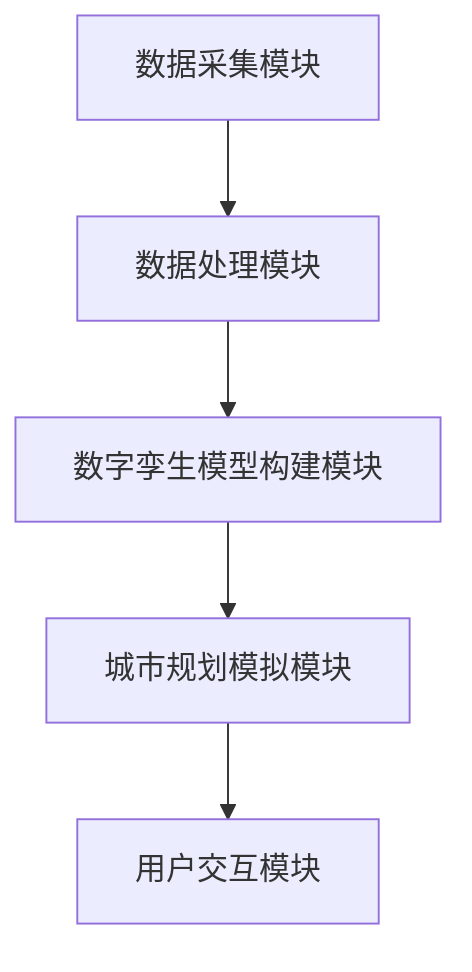

                 

# 《数字孪生在城市规划中的应用与挑战》

关键词：数字孪生、城市规划、应用场景、挑战与解决方案、未来展望

摘要：本文深入探讨了数字孪生在城市规划中的应用与挑战。首先，介绍了数字孪生的定义、背景及其在城市规划中的重要性。接着，详细阐述了数字孪生的核心概念与组成部分，并比较了数字孪生与传统城市规划的差异。随后，分析了数字孪生在城市规划中的应用现状与面临的挑战，以及所带来的机遇。进一步，本文探讨了数字孪生技术在城市规划中的具体应用场景，如城市基础设施管理、城市规划与设计、城市安全与应急管理、智慧城市建设等。然后，介绍了数字孪生城市规划系统的设计与实现，包括数据采集与整合、数字孪生模型构建、城市规划模拟与优化等。此外，本文还讨论了数字孪生在城市规划中的挑战，如数据质量与隐私保护、技术实现与成本问题、政策与法律问题、社会认知与接受度等，并提出了相应的解决方案。最后，本文对数字孪生在城市规划中的未来展望进行了探讨，分析了数字孪生技术的未来发展、未来应用场景、可持续发展策略等。通过本文的研究，有助于更好地理解和应用数字孪生技术，为城市规划提供新的思路和方法。

## 目录大纲

1. 引言
2. 数字孪生在城市规划中的应用与挑战
3. 数字孪生技术在城市规划中的应用
4. 数字孪生城市规划系统的设计与实现
5. 数字孪生在城市规划中的挑战与解决方案
6. 数字孪生城市规划的未来展望
7. 国际数字孪生城市规划实践案例分析

## 第一部分：引言

### 第1章：数字孪生概述

#### 1.1 数字孪生的定义与背景

数字孪生（Digital Twin）是一个相对较新的概念，它通过创建物理实体的数字副本，实现了虚拟世界与现实世界的深度融合。数字孪生的概念最早可以追溯到2002年，美国密歇根大学教授Michael Grieves在《产品生命周期管理》一书中首次提出了数字孪生的概念。他认为，数字孪生是一种虚拟实体模型，它可以模拟、分析和优化物理实体的行为和状态。

随着信息技术的快速发展，数字孪生逐渐成为工业4.0、智能制造、智慧城市等领域的重要技术手段。数字孪生通过将物理世界中的设备和系统数字化，构建出对应的数字模型，使得人们可以在虚拟环境中对物理实体进行远程监控、诊断、预测和优化。

#### 1.2 数字孪生的发展历程

数字孪生的发展历程可以分为以下几个阶段：

1. **原型阶段**（2002年-2010年）：数字孪生概念提出，相关技术研究初步展开。
2. **探索阶段**（2010年-2015年）：数字孪生技术在制造业、航空航天等领域得到初步应用。
3. **发展阶段**（2015年-2020年）：数字孪生技术逐渐成熟，应用范围扩大到智慧城市、建筑、能源等领域。
4. **普及阶段**（2020年至今）：数字孪生技术得到广泛应用，成为推动产业升级和城市发展的重要力量。

#### 1.3 数字孪生在城市规划中的意义

数字孪生在城市规划中的应用具有重要意义。首先，数字孪生技术可以实现城市规划的精细化、智能化。通过构建城市数字孪生模型，城市规划师可以实时、动态地了解城市各个方面的运行状态，如交通流量、环境质量、基础设施等，从而做出更科学、合理的决策。

其次，数字孪生技术有助于提升城市规划的透明度和参与度。通过数字孪生平台，市民可以了解城市规划的进展、成果，甚至参与到城市规划的过程中，提高市民的获得感和参与感。

最后，数字孪生技术有助于提高城市管理的效率和效果。通过数字孪生平台，城市管理者和企业可以实时监控、诊断、预测和优化城市各个方面的运行状态，降低管理成本，提高管理效率。

#### 1.4 数字孪生的核心概念与组成部分

数字孪生的核心概念包括物理实体、虚拟模型、数据链接和实时交互。物理实体是数字孪生的基础，虚拟模型是对物理实体的数字化表示，数据链接是实现虚拟模型与物理实体之间信息交互的桥梁，实时交互则使得虚拟模型能够动态反映物理实体的状态。

数字孪生的组成部分主要包括以下几个方面：

1. **数据采集**：通过传感器、摄像头、无人机等设备，实时采集物理实体的运行数据。
2. **数据处理**：对采集到的数据进行分析、处理，提取有用的信息。
3. **虚拟模型构建**：基于采集到的数据，构建物理实体的虚拟模型。
4. **实时交互**：通过数据链接，实现虚拟模型与物理实体之间的实时交互。
5. **数据存储与共享**：将数字孪生的数据存储在云端或本地数据库中，实现数据的安全存储和共享。

#### 1.5 数字孪生与传统城市规划的比较

数字孪生与传统城市规划在以下几个方面存在明显差异：

1. **数据依赖**：传统城市规划主要依赖于统计数据和模拟结果，而数字孪生则依赖于实时采集的数据，使得规划更加精准、科学。
2. **模拟与预测**：传统城市规划主要依靠模拟软件进行模拟预测，而数字孪生可以通过实时交互，动态反映物理实体的状态，实现更准确的预测。
3. **透明度与参与度**：传统城市规划过程相对封闭，而数字孪生技术使得城市规划过程更加透明，市民可以更加直观地了解和参与规划过程。
4. **效率与效果**：数字孪生技术可以实现实时监控、诊断、预测和优化，大大提高了城市规划的效率和效果。

#### 1.6 数字孪生在城市规划中的应用现状与挑战

数字孪生在城市规划中的应用已经取得了一定的进展。许多城市已经开始尝试利用数字孪生技术进行城市规划和管理，如新加坡、上海、纽约等。这些城市通过数字孪生平台，实现了对城市交通、环境、基础设施等各个方面的实时监控和管理。

然而，数字孪生在城市规划中仍然面临一些挑战。首先，数据质量和数据隐私保护是数字孪生应用的关键问题。数字孪生依赖于大量实时数据，数据的质量和准确性直接影响到数字孪生的效果。同时，数字孪生应用过程中也会涉及到数据隐私保护的问题。

其次，技术实现和成本问题是数字孪生在城市规划中面临的重要挑战。数字孪生技术的实现需要大量的硬件设备、软件系统和专业人才，而高成本也是数字孪生应用的一大障碍。

最后，政策与法律问题是数字孪生在城市规划中面临的另一大挑战。数字孪生技术的应用需要完善的政策法规来保障，同时，法律责任的界定也是数字孪生应用中不可忽视的问题。

#### 1.7 数字孪生在城市规划中的机遇

尽管数字孪生在城市规划中面临一些挑战，但同时也带来了许多机遇。首先，数字孪生技术可以提高城市规划的科学性和精细化程度，为城市规划提供更加准确的依据。

其次，数字孪生技术可以提升城市管理的效率和效果，降低管理成本。通过实时监控和管理，城市管理者可以更加精准地应对各种突发事件，提高城市运行的安全性和稳定性。

最后，数字孪生技术可以提升市民的获得感和参与感，增强市民对城市规划的信任和认同。通过数字孪生平台，市民可以更加直观地了解和参与到城市规划的过程中，提高市民的参与度和满意度。

#### 1.8 本章小结

本章对数字孪生进行了概述，介绍了数字孪生的定义、背景、意义、核心概念与组成部分，并比较了数字孪生与传统城市规划的差异。同时，分析了数字孪生在城市规划中的应用现状与挑战，以及所带来的机遇。通过本章的介绍，希望能够让读者对数字孪生技术有一个初步的了解，为后续章节的探讨打下基础。

## 第二部分：数字孪生技术在城市规划中的应用

### 第2章：数字孪生在城市规划中的应用场景

数字孪生技术作为城市规划的一项新兴技术，其应用场景广泛而多样。本章将重点介绍数字孪生在城市规划中的几个主要应用场景，包括城市基础设施管理、城市规划与设计、城市安全与应急管理、智慧城市建设等。

#### 2.1 城市基础设施管理

城市基础设施管理是城市规划的重要组成部分，数字孪生技术的应用可以有效提升城市基础设施的管理水平。具体应用场景包括：

1. **交通管理**：通过数字孪生技术，可以实时监控城市交通状况，包括交通流量、车辆密度、道路占有率等。数字孪生平台可以基于实时数据进行分析，提供交通流量预测和优化建议，从而缓解交通拥堵，提高交通效率。

2. **供水、供电管理**：数字孪生技术可以实时监控供水、供电系统的运行状态，包括水质、水压、电力负荷等。通过数字孪生平台，可以对供水、供电系统进行远程监控、故障诊断和预测维护，确保系统的稳定运行。

3. **城市照明管理**：数字孪生技术可以实现对城市照明的智能控制，根据实际需求调整照明强度，节约能源，同时提升城市夜景质量。

#### 2.2 城市规划与设计

数字孪生技术在城市规划与设计中发挥着重要作用，可以显著提高规划设计的效率和科学性。具体应用场景包括：

1. **建筑设计**：数字孪生技术可以帮助建筑师在虚拟环境中进行建筑设计，通过三维建模和模拟分析，优化建筑的设计方案，提高建筑的安全性和舒适性。

2. **景观设计**：数字孪生技术可以模拟城市景观，包括公园、广场、河流等，帮助设计师评估不同设计方案对城市环境的影响，选择最优方案。

3. **城市规划**：数字孪生技术可以模拟城市规划方案，评估不同规划方案的交通、环境、经济等影响，为城市规划提供科学依据。

#### 2.3 城市安全与应急管理

数字孪生技术在城市安全与应急管理中的应用，可以显著提高城市的安全水平和应急响应能力。具体应用场景包括：

1. **火灾预防与应急响应**：通过数字孪生技术，可以实时监控城市火灾风险，包括火源分布、火势蔓延情况等。在火灾发生时，数字孪生平台可以提供准确的火源定位和火势预测，为消防部门提供决策支持，提高灭火效率。

2. **地震预警与灾后重建**：数字孪生技术可以实时监测地震波传播，提供地震预警信息，为市民提供逃生指导。在地震发生后，数字孪生平台可以帮助评估地震对建筑物的影响，为灾后重建提供科学依据。

3. **公共安全监控**：数字孪生技术可以实时监控城市公共场所的安全状况，包括人员密度、可疑行为等。通过数字孪生平台，可以及时发现安全隐患，采取相应的安全措施。

#### 2.4 智慧城市建设

智慧城市建设是数字孪生技术应用的一个重要领域，通过数字孪生技术，可以实现对城市的全方位、智能化的管理和服务。具体应用场景包括：

1. **智慧交通**：通过数字孪生技术，可以实时监控城市交通状况，提供交通流量预测和优化建议，缓解交通拥堵，提高交通效率。

2. **智慧能源**：数字孪生技术可以实时监控城市能源系统的运行状态，包括电力、燃气等，提供能源使用优化建议，实现能源的高效利用。

3. **智慧环保**：通过数字孪生技术，可以实时监测城市环境质量，包括空气质量、水质等，提供环保预警和治理建议，改善城市环境。

4. **智慧社区**：数字孪生技术可以实现对社区的服务和管理，包括安防监控、物业服务、居民服务等方面，提升社区的生活质量和安全性。

#### 2.5 本章小结

本章详细介绍了数字孪生技术在城市规划中的几个主要应用场景，包括城市基础设施管理、城市规划与设计、城市安全与应急管理、智慧城市建设等。通过数字孪生技术，城市规划可以实现更加精细化、智能化、安全化的管理，为城市的可持续发展提供有力支撑。

### 2.1 城市基础设施管理

城市基础设施管理是城市规划的核心内容之一，它直接关系到城市的正常运行和居民的生活质量。数字孪生技术作为现代信息技术的重要组成部分，为城市基础设施管理提供了新的手段和思路。本节将详细探讨数字孪生技术在城市基础设施管理中的应用，包括城市交通管理、供水、供电等基础设施的管理。

#### 2.1.1 数字孪生在城市交通管理中的应用

城市交通管理是城市基础设施管理中最为复杂和关键的一环。传统的交通管理方法主要依赖于人工调度和简单的交通信号控制，效率低下，难以应对日益增长的交通需求。数字孪生技术的引入，为城市交通管理带来了革命性的变化。

1. **交通流量监测**：数字孪生技术可以通过安装在道路上的传感器、摄像头和无人机等设备，实时监测城市的交通流量。这些设备可以收集到车辆数量、速度、行驶方向等数据，并通过无线网络传输到数字孪生平台。

2. **交通状况分析**：数字孪生平台可以对收集到的交通数据进行实时分析，识别交通拥堵、交通事故等异常情况。通过模拟算法，平台可以预测交通流量变化，为交通管理部门提供决策支持。

3. **智能交通信号控制**：基于数字孪生平台的分析结果，交通信号控制系统可以自动调整信号灯的时间，优化交通流量。例如，在高峰时段，系统可以延长路口绿灯时间，缩短红灯时间，以减少交通拥堵。

4. **交通事故预警与应急处理**：数字孪生平台可以实时监测交通事故的发生，及时通知相关部门进行应急处理。通过分析事故发生的原因和规律，平台还可以提出预防措施，降低交通事故的发生率。

#### 2.1.2 数字孪生在供水管理中的应用

供水系统是城市基础设施的重要组成部分，其稳定运行直接关系到市民的日常生活。数字孪生技术在供水管理中的应用，可以提高供水的安全性、可靠性和效率。

1. **水质监测**：数字孪生技术可以通过安装在供水管道中的传感器，实时监测水质参数，如pH值、浊度、溶解氧等。当水质参数超出正常范围时，系统会自动报警，提醒相关部门进行处理。

2. **管道监控**：数字孪生技术可以实时监控供水管道的运行状态，包括管道的压力、流量、泄漏等情况。通过数字孪生平台，可以及时发现管道故障，进行维修或更换，确保供水的连续性和安全性。

3. **水资源优化调度**：数字孪生平台可以对供水系统的数据进行实时分析和预测，优化水资源的调度和使用。例如，在干旱季节，平台可以根据供水需求和水资源的储备情况，调整供水计划，确保水资源的合理利用。

#### 2.1.3 数字孪生在供电管理中的应用

供电系统是城市基础设施的另一个关键部分，其稳定运行对城市的正常运转至关重要。数字孪生技术在供电管理中的应用，可以提高供电的稳定性和效率。

1. **电力负荷监测**：数字孪生技术可以通过安装在变电站、配电站等处的传感器，实时监测电力负荷情况。通过分析电力负荷的变化趋势，平台可以预测电力需求的峰值，为电力调度提供依据。

2. **设备状态监控**：数字孪生平台可以实时监控电力设备的状态，包括变压器、断路器、发电机等。通过设备状态监测，可以及时发现设备故障或异常，提前进行维修或更换，确保供电的稳定性和安全性。

3. **故障诊断与预测维护**：数字孪生平台可以根据历史数据和实时监测数据，对电力系统进行故障诊断和预测维护。例如，当变压器的温度异常升高时，平台可以预测其可能发生故障，提前进行维修，避免停电事故的发生。

4. **新能源应用**：数字孪生技术还可以应用于新能源发电系统的管理，如太阳能、风能等。通过数字孪生平台，可以实时监测新能源发电设备的运行状态，优化发电效率，提高新能源的利用率。

#### 2.1.4 数字孪生在城市基础设施管理中的应用效果

数字孪生技术在城市基础设施管理中的应用，取得了显著的成效。通过数字孪生平台，城市管理者可以实时、动态地了解基础设施的运行状态，实现精细化、智能化的管理。

1. **提高管理效率**：数字孪生技术实现了对城市基础设施的实时监控和远程管理，大大提高了管理效率。城市管理者不再需要频繁现场巡视，可以通过数字孪生平台进行远程监控和调度。

2. **降低运营成本**：通过实时监测和预测维护，数字孪生技术可以提前发现和解决设备故障，避免意外停机，降低运营成本。

3. **提升服务质量**：数字孪生技术提高了基础设施的稳定性和可靠性，确保了市民的日常生活和城市正常运转，提升了城市服务质量。

4. **促进可持续发展**：数字孪生技术可以实现能源的优化利用，提高水资源的管理效率，促进城市的可持续发展。

总之，数字孪生技术在城市基础设施管理中的应用，为城市提供了更加高效、智能、安全的管理手段，对提高城市运行效率、改善市民生活质量具有重要意义。

#### 2.1.5 数字孪生在城市基础设施管理中的应用案例

数字孪生技术在城市基础设施管理中的应用已经取得了一些成功的案例，以下是几个典型的应用案例：

1. **新加坡智慧国计划**：新加坡是一个小国家，但其智慧城市建设取得了显著成效。在新加坡的智慧国计划中，数字孪生技术被广泛应用于城市基础设施管理。通过数字孪生平台，新加坡政府可以实时监控城市的交通流量、环境质量、供水供电等基础设施，实现精细化、智能化的管理。

2. **上海智慧城市建设**：上海是中国的一个大城市，其智慧城市建设也取得了重要进展。上海通过数字孪生技术，实现了对城市交通、环境、基础设施的实时监控和管理。例如，上海的智能交通系统通过数字孪生平台，可以实时分析交通流量，优化交通信号，缓解交通拥堵。

3. **纽约城市基础设施管理**：纽约是世界上最大的城市之一，其基础设施管理面临着巨大的挑战。通过数字孪生技术，纽约市政府实现了对供水、供电、交通等基础设施的实时监控和远程管理，提高了基础设施的稳定性和可靠性。

这些案例表明，数字孪生技术在城市基础设施管理中的应用，不仅可以提高管理效率和服务质量，还可以促进城市的可持续发展。

### 2.2 城市规划与设计

城市规划与设计是城市建设的重要组成部分，直接关系到城市的功能、美观和可持续发展。数字孪生技术的应用为城市规划与设计带来了全新的思路和方法，使得规划与设计过程更加高效、科学和可视化。本节将详细探讨数字孪生技术在城市规划与设计中的应用，包括建筑设计、景观设计等方面。

#### 2.2.1 数字孪生在建筑设计中的应用

数字孪生技术在建筑设计中的应用，可以显著提高设计的精准度和效率，同时确保建筑的安全性和舒适性。

1. **建筑设计模拟**：数字孪生技术可以通过虚拟现实（VR）和增强现实（AR）技术，实现对建筑设计方案的模拟。设计师可以在虚拟环境中查看建筑设计方案，从多个角度进行观察和分析，从而优化设计效果。

2. **结构分析**：数字孪生技术可以基于建筑结构的三维模型，进行结构分析。通过模拟建筑在不同荷载、环境条件下的响应，设计师可以评估建筑的结构安全性和稳定性，及时发现问题并进行优化。

3. **能耗模拟**：数字孪生技术可以模拟建筑的能耗情况，分析不同设计方案的能耗表现。通过优化建筑设计，降低建筑能耗，提高能源利用效率，从而实现绿色建筑设计。

4. **交互设计**：数字孪生技术还可以实现用户与建筑之间的互动设计。例如，设计师可以通过虚拟现实技术，模拟建筑内部的空间布局和功能设置，与用户进行实时互动，收集用户的反馈，优化设计方案。

#### 2.2.2 数字孪生在景观设计中的应用

数字孪生技术在景观设计中的应用，可以帮助设计师更好地理解城市环境，优化景观设计效果，提升城市生态环境。

1. **环境模拟**：数字孪生技术可以通过模拟不同景观设计方案的生态环境效果，帮助设计师评估设计方案对环境的影响。例如，可以模拟植物生长、水质变化、空气质量等，评估不同景观设计对生态环境的改善效果。

2. **互动设计**：数字孪生技术可以实现用户与景观设计之间的互动。设计师可以通过虚拟现实技术，模拟景观设计的效果，与用户进行实时互动，收集用户的反馈，优化设计方案。

3. **可视化展示**：数字孪生技术可以将景观设计方案以三维模型的形式进行可视化展示，使得设计方案更加直观和生动。设计师可以通过数字孪生平台，向用户展示设计方案，提高用户的理解和认同。

4. **施工管理**：数字孪生技术还可以辅助景观设计的施工管理。通过数字孪生平台，设计师可以实时监控施工进度和质量，及时发现并解决施工问题，确保施工过程的顺利进行。

#### 2.2.3 数字孪生在城市规划与设计中的应用效果

数字孪生技术在城市规划与设计中的应用，带来了显著的效果。

1. **提高设计效率**：通过数字孪生技术，设计师可以快速创建和优化设计方案，缩短设计周期。

2. **提升设计质量**：数字孪生技术可以模拟和分析不同设计方案的优缺点，帮助设计师选择最佳方案。

3. **降低设计成本**：通过模拟和优化，数字孪生技术可以减少设计过程中的修改和调整，降低设计成本。

4. **提升用户体验**：数字孪生技术可以实现用户与设计方案的实时互动，提高用户的参与度和满意度。

5. **促进可持续发展**：通过优化设计，数字孪生技术可以实现建筑的绿色设计和生态环境的改善，促进城市的可持续发展。

总之，数字孪生技术在城市规划与设计中的应用，为城市规划与设计带来了革命性的变化，提高了设计的效率和质量，为城市的可持续发展提供了有力支持。

### 2.3 城市安全与应急管理

城市安全与应急管理是城市规划的重要组成部分，直接关系到城市居民的生命财产安全和社会稳定。数字孪生技术的引入，为城市安全与应急管理提供了全新的手段和思路，使得安全监测、应急响应和灾害预防更加高效、精准和智能化。

#### 2.3.1 数字孪生在火灾预防与应急响应中的应用

火灾是城市中常见的灾害之一，数字孪生技术可以在火灾预防与应急响应中发挥重要作用。

1. **火灾风险评估**：数字孪生技术可以通过对建筑结构和材料进行三维建模，结合火灾发生概率和火灾蔓延模型，进行火灾风险评估。通过分析不同建筑结构和材料的火灾风险，城市规划师可以采取相应的预防措施，降低火灾发生的可能性。

2. **火灾预警与监测**：数字孪生技术可以通过安装在高楼、仓库、商场等地的传感器和摄像头，实时监测火源、烟雾、温度等参数。当监测到异常参数时，系统会自动报警，通知消防部门进行应急响应。

3. **火灾模拟与预案**：数字孪生技术可以模拟不同火灾场景，评估消防设备的响应效率和灭火效果。通过模拟实验，消防部门可以制定更加科学、有效的应急预案，提高火灾应急响应的效率和效果。

4. **火灾现场指挥**：在火灾发生时，数字孪生平台可以实时提供火灾现场的详细信息，包括火源位置、火势蔓延情况等。消防指挥中心可以通过数字孪生平台，对消防人员进行实时指挥，提高灭火效率和安全性。

#### 2.3.2 数字孪生在地震预警与灾后重建中的应用

地震是城市中常见的自然灾害之一，数字孪生技术在地震预警与灾后重建中具有重要意义。

1. **地震预警**：数字孪生技术可以通过地震监测站和地震预警设备，实时监测地震波传播情况。当监测到地震波时，数字孪生平台可以迅速计算出地震的震级、震中位置等信息，并向相关部门和市民发出预警信息，为应急响应争取宝贵的时间。

2. **灾后重建模拟**：数字孪生技术可以通过对建筑物进行三维建模，模拟地震对建筑物的影响。通过分析建筑物的受损情况，城市规划师可以制定科学的灾后重建方案，优化重建资源的使用。

3. **灾后重建评估**：数字孪生技术可以实时监控灾后重建的进展，评估重建效果。通过对比重建前后的数字孪生模型，可以评估重建工作的质量和效果，及时发现问题并进行调整。

4. **地震风险评估**：数字孪生技术可以通过对城市的地质、建筑结构等进行三维建模，进行地震风险评估。通过分析地震对城市各个区域的影响，城市规划师可以采取相应的防震措施，降低地震对城市的破坏。

#### 2.3.3 数字孪生在公共安全监控中的应用

数字孪生技术在公共安全监控中的应用，可以显著提高城市的安全水平。

1. **安全监控**：数字孪生技术可以通过安装在城市公共场所的摄像头、传感器等设备，实时监控人群密度、可疑行为等参数。当检测到异常情况时，系统会自动报警，通知相关部门进行处理。

2. **智能分析**：数字孪生平台可以对监控数据进行分析，识别潜在的安全风险。例如，通过分析人群的行为模式，可以预测可能发生的踩踏事件，提前采取预防措施。

3. **应急指挥**：在突发事件发生时，数字孪生平台可以提供实时的监控数据和风险评估，帮助应急指挥中心进行决策。通过数字孪生平台，应急指挥中心可以实时监控事态进展，指挥应急人员进行现场处理。

4. **智能巡检**：数字孪生技术可以实现对城市基础设施的智能巡检。例如，通过无人机对桥梁、隧道等基础设施进行巡检，实时监测基础设施的运行状态，及时发现隐患并进行维修。

#### 2.3.4 数字孪生在城市安全与应急管理中的应用效果

数字孪生技术在城市安全与应急管理中的应用，取得了显著的成效。

1. **提高安全水平**：通过实时监测和智能分析，数字孪生技术可以及时发现安全隐患，提高城市的安全水平。

2. **提高应急响应效率**：数字孪生平台可以实时提供突发事件的信息和风险评估，帮助应急指挥中心进行快速、科学的决策，提高应急响应效率。

3. **降低灾害损失**：通过火灾预警、地震预警等技术，数字孪生技术可以提前预警灾害，减少灾害造成的损失。

4. **提升社会安全感**：数字孪生技术可以实时监控城市的安全状况，提高市民的安全感。

总之，数字孪生技术在城市安全与应急管理中的应用，为城市的安全和可持续发展提供了有力支持，是现代城市不可或缺的技术手段。

### 2.4 智慧城市建设

智慧城市建设是当今城市发展的重要趋势，数字孪生技术作为一项核心支撑技术，在智慧城市建设中发挥着关键作用。通过数字孪生技术，城市可以实现全方位、智能化的管理和服务，提高城市运行效率、改善市民生活质量、促进可持续发展。本节将详细探讨数字孪生技术在智慧城市建设中的应用，包括智慧交通、智慧能源、智慧环保、智慧社区等方面。

#### 2.4.1 数字孪生在智慧交通中的应用

智慧交通是智慧城市建设的重要组成部分，数字孪生技术可以实现对城市交通系统的全面监测、管理和优化。

1. **实时交通监控**：数字孪生技术可以通过安装在道路上的传感器、摄像头等设备，实时监测城市交通状况，包括交通流量、车辆速度、道路占有率等。这些数据可以通过数字孪生平台进行实时分析和处理，为交通管理部门提供决策支持。

2. **智能交通信号控制**：基于数字孪生平台的分析结果，交通信号控制系统可以自动调整信号灯的时间，优化交通流量，减少交通拥堵。例如，在高峰时段，系统可以延长路口绿灯时间，缩短红灯时间，以减少交通拥堵。

3. **交通流量预测**：数字孪生技术可以通过历史数据和实时数据，对城市交通流量进行预测。通过预测交通流量变化，交通管理部门可以提前采取相应的措施，如调整公共交通班次、优化交通路线等，提高交通系统的运行效率。

4. **交通事件预警**：数字孪生平台可以实时监测交通事故、道路施工等交通事件，并通过预警系统及时通知相关部门和市民，以便采取相应的应对措施，减少事件对交通系统的影响。

#### 2.4.2 数字孪生在智慧能源中的应用

智慧能源是智慧城市建设的重要方面，数字孪生技术可以实现对城市能源系统的全面监控、优化和管理。

1. **实时能源监控**：数字孪生技术可以通过安装在变电站、配电站等处的传感器，实时监测电力负荷、电压、电流等参数，确保能源系统的稳定运行。

2. **能源需求预测**：数字孪生平台可以根据历史数据和实时数据，对城市能源需求进行预测。通过预测能源需求变化，能源管理部门可以提前采取相应的措施，如调整发电计划、优化能源调度等，确保能源供应的稳定性。

3. **能源优化调度**：数字孪生技术可以实时分析能源系统的运行状态，根据能源需求和供应情况，进行优化调度。例如，在高峰用电时段，系统可以调整发电计划，确保电力供应的稳定性。

4. **新能源管理**：数字孪生技术可以实现对太阳能、风能等新能源的监控和管理。通过实时监测新能源设备的运行状态，能源管理部门可以优化新能源的利用效率，提高能源系统的整体性能。

#### 2.4.3 数字孪生在智慧环保中的应用

智慧环保是智慧城市建设的重要内容，数字孪生技术可以实现对城市环境的全面监测、分析和治理。

1. **实时环境监测**：数字孪生技术可以通过安装在环境监测站、河流、湖泊等地的传感器，实时监测空气、水质、土壤等环境参数。这些数据可以通过数字孪生平台进行实时分析和处理，为环保部门提供决策支持。

2. **环境质量预测**：数字孪生平台可以根据历史数据和实时数据，对城市环境质量进行预测。通过预测环境质量变化，环保部门可以提前采取相应的措施，如调整污染物排放标准、加强污染治理等，改善城市环境质量。

3. **环境治理优化**：数字孪生技术可以实时分析环境治理的效果，根据环境质量变化，优化治理措施。例如，在空气污染严重的区域，系统可以调整空气净化设备的运行模式，提高治理效果。

4. **环保预警**：数字孪生平台可以实时监测环境污染事件，并通过预警系统及时通知相关部门和市民，以便采取相应的应对措施，减少污染事件对环境的影响。

#### 2.4.4 数字孪生在智慧社区中的应用

智慧社区是智慧城市建设的基础单元，数字孪生技术可以实现对社区的全景监控、智能管理和优质服务。

1. **社区全景监控**：数字孪生技术可以通过安装在社区内的摄像头、传感器等设备，实现对社区全景的实时监控。通过数字孪生平台，社区管理者可以实时了解社区的运行状态，及时发现和处理安全隐患。

2. **智能物业管理**：数字孪生技术可以实现对社区物业管理的智能化。例如，通过智能门禁系统、智能照明系统等，提高物业管理效率，提升居民的生活质量。

3. **社区服务优化**：数字孪生平台可以实时分析社区服务需求，根据居民的需求和行为习惯，提供个性化的社区服务。例如，根据居民的生活习惯，系统可以自动调整电梯运行时间、垃圾回收时间等，提高社区服务的便捷性和满意度。

4. **社区安全预警**：数字孪生技术可以实现对社区安全的实时监控和预警。通过实时监测社区内的异常行为，系统可以及时报警，通知相关部门进行处理，保障社区居民的安全。

#### 2.4.5 数字孪生在智慧城市建设中的应用效果

数字孪生技术在智慧城市建设中的应用，取得了显著的成效。

1. **提高城市运行效率**：通过实时监测和智能分析，数字孪生技术可以优化城市资源的配置和使用，提高城市运行效率。

2. **改善市民生活质量**：数字孪生技术可以提供智能化、个性化的城市服务，提高市民的生活质量和满意度。

3. **促进可持续发展**：数字孪生技术可以实现城市资源的优化利用和生态环境的改善，促进城市的可持续发展。

4. **提高城市竞争力**：通过智慧城市建设，数字孪生技术可以提升城市的综合竞争力，吸引更多的人才和投资。

总之，数字孪生技术在智慧城市建设中的应用，为城市的现代化发展提供了有力支持，是智慧城市建设不可或缺的技术手段。

### 2.5 本章小结

本章详细介绍了数字孪生技术在城市规划中的几个主要应用场景，包括城市基础设施管理、城市规划与设计、城市安全与应急管理、智慧城市建设等。通过数字孪生技术，城市规划可以实现更加精细化、智能化、安全化的管理，为城市的可持续发展提供有力支撑。在未来的发展中，数字孪生技术将继续发挥重要作用，推动城市规划与建设迈向新的高度。

### 第3章：数字孪生城市规划系统的设计与实现

随着数字孪生技术的不断发展，其在城市规划中的应用越来越广泛。为了实现数字孪生城市规划系统的设计与实现，我们需要从系统的总体架构设计、数据采集与整合、数字孪生模型构建、城市规划模拟与优化等方面进行详细探讨。

#### 3.1 数字孪生城市规划系统的总体架构设计

数字孪生城市规划系统的总体架构设计是系统实现的基础。一个完善的数字孪生城市规划系统通常包括以下几个关键组成部分：

1. **数据采集模块**：负责收集城市各个方面的数据，如交通、环境、基础设施等。
2. **数据处理模块**：负责对采集到的数据进行分析、处理和清洗，提取有用的信息。
3. **数字孪生模型构建模块**：基于处理后的数据，构建城市数字孪生模型，实现对城市的虚拟仿真。
4. **城市规划模拟模块**：利用数字孪生模型进行城市规划的模拟和优化，为城市决策提供科学依据。
5. **用户交互模块**：提供用户界面，使用户可以方便地与数字孪生城市规划系统进行交互。

#### 3.1.1 系统架构设计原则

在数字孪生城市规划系统的架构设计过程中，需要遵循以下原则：

1. **模块化设计**：系统应该采用模块化设计，各个模块之间应具有独立性，方便系统的扩展和维护。
2. **可扩展性**：系统应具有良好的可扩展性，以适应未来城市发展和数据量的增加。
3. **高可靠性**：系统应具有较高的可靠性，确保数据的安全性和系统的稳定性。
4. **易用性**：系统应提供友好的用户界面，方便用户进行操作和使用。

#### 3.1.2 系统架构设计思路

数字孪生城市规划系统的架构设计思路如下：

1. **数据采集与处理**：通过传感器、摄像头、无人机等设备，实时采集城市各个方面的数据。数据处理模块负责对采集到的数据进行清洗、分析，提取有用的信息，为数字孪生模型构建提供数据支持。
2. **数字孪生模型构建**：基于处理后的数据，构建城市数字孪生模型。数字孪生模型应能够全面、准确地反映城市的现状和未来发展趋势。
3. **城市规划模拟与优化**：利用数字孪生模型进行城市规划的模拟和优化。模拟模块可以根据不同的规划方案，模拟城市的发展过程，分析方案的优缺点，为决策者提供科学依据。
4. **用户交互**：用户通过用户交互模块与数字孪生城市规划系统进行交互。用户可以查看城市的模拟结果，进行规划方案的选择和调整，同时也可以提交新的规划需求。

#### 3.1.3 系统架构图展示

数字孪生城市规划系统的架构图如下：

在这个架构图中，数据采集模块负责采集数据，数据处理模块负责处理和清洗数据，数字孪生模型构建模块负责构建数字孪生模型，城市规划模拟模块负责进行规划模拟，用户交互模块负责提供用户界面。

#### 3.2 数据采集与整合

数据采集与整合是数字孪生城市规划系统的核心环节。有效的数据采集和整合能够确保数字孪生模型的准确性和可靠性。

1. **数据采集方法**：
   - **传感器采集**：利用各种传感器，如温度传感器、湿度传感器、空气质量传感器等，实时采集城市环境数据。
   - **摄像头采集**：利用摄像头，实时采集城市交通流量、人群密度等信息。
   - **无人机采集**：利用无人机，实时采集城市高空视角数据，如建筑物高度、分布等。
   - **移动设备采集**：利用移动设备，如智能手机，通过应用程序收集用户行为数据。

2. **数据整合策略**：
   - **数据清洗**：对采集到的数据进行清洗，去除无效数据、异常值等，确保数据的准确性。
   - **数据融合**：将不同来源、不同格式的数据整合到一个统一的数据集中，为数字孪生模型构建提供数据支持。
   - **数据标准化**：对采集到的数据进行标准化处理，确保数据格式的一致性，方便后续的处理和分析。

3. **数据处理流程**：
   - **数据采集**：通过传感器、摄像头、无人机等设备，实时采集城市各个方面的数据。
   - **数据传输**：将采集到的数据传输到数据处理中心，进行存储和处理。
   - **数据清洗**：对采集到的数据进行清洗，去除无效数据、异常值等。
   - **数据融合**：将不同来源、不同格式的数据整合到一个统一的数据集中。
   - **数据标准化**：对采集到的数据进行标准化处理，确保数据格式的一致性。

#### 3.3 数字孪生模型的构建

数字孪生模型的构建是数字孪生城市规划系统的核心。一个准确的数字孪生模型能够全面、准确地反映城市的现状和未来发展趋势。

1. **数字孪生模型的设计方法**：
   - **三维建模**：使用三维建模技术，对城市进行三维建模，构建城市的数字孪生模型。
   - **数据驱动**：使用数据驱动的方法，将采集到的城市数据与三维模型进行结合，实现对城市的虚拟仿真。
   - **多尺度建模**：根据不同的需求，构建不同尺度的数字孪生模型，如城市尺度、区域尺度、建筑物尺度等。

2. **数字孪生模型的构建流程**：
   - **数据预处理**：对采集到的城市数据进行分析和处理，提取有用的信息。
   - **三维建模**：使用三维建模软件，根据处理后的数据，构建城市的三维模型。
   - **数据整合**：将不同来源、不同格式的城市数据进行整合，构建数字孪生模型。
   - **模型验证**：对构建的数字孪生模型进行验证，确保模型的准确性和可靠性。
   - **模型优化**：根据验证结果，对数字孪生模型进行优化，提高模型的性能。

3. **数字孪生模型的应用**：
   - **城市规划**：利用数字孪生模型，进行城市规划的模拟和优化，为城市规划提供科学依据。
   - **交通管理**：利用数字孪生模型，模拟城市交通流量，优化交通信号控制，提高交通效率。
   - **环境监测**：利用数字孪生模型，实时监测城市环境质量，预测环境变化趋势，采取相应的环保措施。

#### 3.4 城市规划模拟与优化

城市规划模拟与优化是数字孪生城市规划系统的核心功能之一。通过模拟和优化，可以评估不同规划方案的效果，为城市决策提供科学依据。

1. **城市规划模拟方法**：
   - **模拟实验**：通过数字孪生模型，模拟不同规划方案的实施效果，如交通流量、环境质量、建筑密度等。
   - **场景模拟**：模拟不同的城市场景，如交通拥堵、环境恶化等，评估规划方案的有效性。

2. **城市规划优化算法**：
   - **遗传算法**：基于遗传算法的优化思想，对城市规划方案进行优化，提高方案的适应性。
   - **粒子群优化算法**：基于粒子群优化算法，对城市规划方案进行优化，提高方案的效率。
   - **模拟退火算法**：基于模拟退火算法，对城市规划方案进行优化，提高方案的稳定性。

3. **模拟与优化的应用实例**：
   - **交通规划**：利用数字孪生模型，模拟不同交通规划方案的实施效果，如道路扩建、公共交通优化等，选择最优方案。
   - **环境规划**：利用数字孪生模型，模拟不同环境规划方案的实施效果，如绿化工程、污水处理等，选择最优方案。

#### 3.5 本章小结

本章详细介绍了数字孪生城市规划系统的设计与实现，包括系统的总体架构设计、数据采集与整合、数字孪生模型构建、城市规划模拟与优化等方面。通过本章的介绍，读者可以全面了解数字孪生城市规划系统的设计与实现过程，为后续的实践应用打下基础。

### 第4章：数字孪生在城市规划中的挑战与解决方案

尽管数字孪生技术在城市规划中具有巨大的潜力，但在实际应用过程中仍然面临诸多挑战。这些挑战涉及到数据质量与隐私保护、技术实现与成本问题、政策与法律问题、社会认知与接受度等方面。本章节将深入探讨这些挑战，并提出相应的解决方案。

#### 4.1 数据质量与隐私保护

数字孪生城市规划系统依赖于大量实时数据，数据的质量直接影响数字孪生模型的效果。然而，在数据采集、传输和处理过程中，数据质量可能会受到噪声、误差、缺失值等因素的影响。此外，数字孪生技术涉及大量个人隐私数据，如位置信息、行为习惯等，隐私保护成为一大挑战。

**挑战分析**：

1. **数据质量**：数据质量问题可能导致数字孪生模型出现偏差，影响规划的准确性。
2. **隐私保护**：隐私数据泄露可能导致个人隐私被侵犯，引发法律纠纷和信任问题。

**解决方案**：

1. **数据质量保证**：采用数据清洗、数据校验等技术手段，确保数据的准确性和一致性。建立数据质量监控机制，定期评估数据质量，及时发现和纠正问题。
2. **隐私保护机制**：采用数据加密、访问控制等技术手段，保护个人隐私数据。同时，制定隐私保护政策，明确数据收集、存储、使用和分享的规范，确保个人隐私的安全。

#### 4.2 技术实现与成本问题

数字孪生城市规划系统需要集成了多种先进技术，包括传感器技术、数据处理技术、三维建模技术等。这些技术的实现需要大量的资金投入和专业人才，而高成本成为数字孪生技术推广的主要障碍。

**挑战分析**：

1. **技术实现**：数字孪生城市规划系统的实现涉及多个技术领域，需要具备多学科知识和技术能力。
2. **成本问题**：数字孪生城市规划系统的建设成本高，中小企业可能难以承担。

**解决方案**：

1. **技术创新**：通过技术创新，降低数字孪生系统的实现难度和成本。例如，采用开源软件和平台，降低开发成本。
2. **政府支持**：政府可以提供资金和政策支持，鼓励企业参与数字孪生城市规划系统的建设。例如，通过财政补贴、税收优惠等措施，降低企业的成本压力。
3. **合作共赢**：鼓励企业、高校和研究机构之间的合作，共享技术资源和研究成果，降低研发成本。

#### 4.3 政策与法律问题

数字孪生技术在城市规划中的应用需要完善的政策法规支持，以确保技术应用的合法性和规范性。然而，目前相关政策法规尚不完善，法律责任界定不清，成为数字孪生技术推广的另一个挑战。

**挑战分析**：

1. **政策法规**：数字孪生技术涉及多个领域，需要制定跨部门、跨行业的政策法规。
2. **法律责任**：数字孪生技术可能导致数据泄露、隐私侵犯等法律问题，需要明确法律责任。

**解决方案**：

1. **政策法规完善**：政府应加快制定数字孪生技术相关政策和法规，明确数字孪生技术在城市规划中的应用规范。
2. **法律责任界定**：明确数字孪生技术应用中的法律责任，保护个人隐私和数据安全。

#### 4.4 社会认知与接受度

数字孪生技术作为一种新兴技术，其应用效果和社会价值需要公众的认可和接受。然而，目前公众对数字孪生技术的认知不足，存在一定的担忧和疑虑，这影响了数字孪生技术的推广应用。

**挑战分析**：

1. **社会认知**：公众对数字孪生技术的认知不足，不了解其应用价值和效果。
2. **接受度**：公众对数字孪生技术的接受度不高，担心隐私泄露、数据滥用等问题。

**解决方案**：

1. **宣传教育**：通过媒体宣传、教育培训等方式，提高公众对数字孪生技术的认知，增强公众的信任和接受度。
2. **透明公开**：建立数字孪生技术的透明公开机制，公开数据收集、处理和使用情况，增强公众的信任。
3. **参与互动**：鼓励公众参与数字孪生城市规划的决策过程，提高公众的参与感和认同感。

#### 4.5 本章小结

本章分析了数字孪生在城市规划中面临的挑战，包括数据质量与隐私保护、技术实现与成本问题、政策与法律问题、社会认知与接受度等方面。针对这些挑战，提出了相应的解决方案。通过解决这些挑战，可以更好地推广和应用数字孪生技术，为城市规划提供新的思路和方法。

### 第5章：数字孪生城市规划的未来展望

随着科技的不断进步，数字孪生技术在城市规划中的应用前景越来越广阔。在未来，数字孪生城市规划将面临新的发展趋势、应用场景和可持续发展策略。

#### 5.1 数字孪生技术的未来发展

1. **新兴技术的应用**：未来，人工智能、大数据、物联网等新兴技术将与数字孪生技术深度融合，进一步提升城市规划的智能化和精细化水平。例如，通过人工智能算法，可以实现对城市规划数据的智能分析和预测，提高规划决策的科学性和准确性。

2. **技术发展趋势分析**：数字孪生技术将朝着更加高效、实时、精准的方向发展。一方面，数据采集和处理技术将不断进步，提高数据质量和处理速度；另一方面，数字孪生模型将更加精细和复杂，能够模拟和预测城市发展的各种可能情况。

3. **技术应用的前景**：随着数字孪生技术的成熟，其应用范围将不断扩大，从城市规划扩展到城市建设、管理、运营等多个环节。未来，数字孪生技术将成为城市规划和管理的重要工具，助力城市可持续发展。

#### 5.2 数字孪生在城市规划中的未来应用场景

1. **个性化城市规划**：未来，数字孪生技术将能够根据市民的需求和行为数据，进行个性化城市规划。例如，为不同年龄、职业、兴趣的市民提供定制化的城市服务，提升市民的满意度和幸福感。

2. **绿色城市规划**：数字孪生技术将助力绿色城市规划，通过模拟和优化，减少城市碳排放，提高资源利用效率。例如，通过数字孪生平台，可以实现建筑节能、绿色交通、可再生能源利用等。

3. **智慧城市建设**：数字孪生技术将推动智慧城市建设，实现城市运行的智能化、精细化管理。例如，通过数字孪生平台，可以实现智能交通管理、智能能源管理、智能环境监测等。

#### 5.3 数字孪生城市规划的可持续发展

1. **可持续发展原则**：数字孪生城市规划应遵循可持续发展的原则，包括经济效益、社会效益和环境效益的统一。在数字孪生技术的应用过程中，要充分考虑城市的长远发展和整体利益。

2. **可持续发展策略**：
   - **绿色技术**：推广绿色数字孪生技术，减少能源消耗和碳排放，提高资源利用效率。
   - **数据共享**：建立城市数据共享机制，促进数据资源的开放和共享，提高数据利用率。
   - **人才培养**：加强数字孪生技术人才的培养，提高城市规划和管理人员的专业素养。

3. **可持续发展案例研究**：通过案例分析，总结数字孪生城市规划的可持续发展经验，为其他城市提供参考。例如，分析新加坡智慧国计划、上海智慧城市建设等典型案例，探讨其成功经验和挑战。

#### 5.4 本章小结

未来，数字孪生技术将在城市规划中发挥更加重要的作用。通过新兴技术的应用、未来应用场景的拓展和可持续发展策略的实施，数字孪生城市规划将为城市的可持续发展提供有力支持。同时，通过持续的技术创新和人才培养，数字孪生技术将在更广泛的领域取得突破，为城市的发展和进步做出更大贡献。

### 第6章：国际数字孪生城市规划实践案例分析

在国际上，许多城市已经开始尝试和应用数字孪生技术进行城市规划和管理。本章节将选择新加坡、上海和美国等具有代表性的智慧城市项目，分析这些案例的成功经验、应用特点以及面临的挑战。

#### 6.1 案例选择与研究方法

在本章节中，我们选择了以下三个具有代表性的智慧城市项目进行案例分析：

1. **新加坡智慧国计划**：新加坡是数字孪生技术应用的先驱之一，其智慧国计划涵盖了城市交通、环境、基础设施等多个领域。

2. **上海智慧城市建设**：上海是中国的一个特大城市，其智慧城市建设已经取得显著成果，数字孪生技术在城市规划中的应用尤为突出。

3. **美国智慧城市项目**：美国许多城市也在积极探索数字孪生技术在城市规划中的应用，如纽约、洛杉矶等。

研究方法主要包括以下几个方面：

1. **文献调研**：通过查阅相关文献和资料，了解这些智慧城市项目的背景、目标、应用领域和关键技术。

2. **案例描述**：对所选案例进行详细描述，分析其应用特点和成效。

3. **成功经验**：总结这些案例的成功经验，探讨其推广应用的价值。

4. **挑战与问题**：分析这些案例面临的挑战和问题，为其他城市提供借鉴。

#### 6.2 案例一：新加坡智慧国计划

**新加坡智慧国计划**是新加坡政府推动的一项综合性智慧城市建设计划，旨在通过数字孪生技术等先进技术手段，提升城市运行效率、改善市民生活质量。以下是该计划的主要内容和特点：

1. **应用领域**：
   - **城市交通**：通过数字孪生技术，实现交通流量监测、交通信号优化、公共交通调度等。
   - **环境管理**：通过实时监测环境数据，实现空气质量、水质等监测和管理。
   - **基础设施**：利用数字孪生技术，对城市供水、供电、燃气等基础设施进行监控和管理。

2. **成功经验**：
   - **系统集成**：新加坡智慧国计划实现了多个系统的集成，如交通管理、环境监测、基础设施管理等，实现了数据共享和协同工作。
   - **技术先进**：新加坡在数字孪生技术的应用上处于世界领先地位，其数字孪生平台具有高效的数据处理和分析能力。
   - **政策支持**：新加坡政府高度重视智慧城市建设，制定了一系列政策支持数字孪生技术的推广应用。

3. **挑战与问题**：
   - **数据隐私**：数字孪生技术涉及大量个人隐私数据，数据隐私保护是面临的重要挑战。
   - **技术实现**：数字孪生技术需要大量的资金和技术支持，中小企业可能难以承担。

#### 6.3 案例二：上海智慧城市建设

**上海智慧城市建设**是中国智慧城市建设的一个典型案例，数字孪生技术在城市规划和管理中的应用尤为突出。以下是该计划的主要内容和特点：

1. **应用领域**：
   - **城市交通**：通过数字孪生技术，实现交通流量监测、交通信号优化、公共交通调度等。
   - **城市规划**：利用数字孪生技术，进行城市规划模拟和优化。
   - **环境保护**：通过实时监测环境数据，实现空气质量、水质等监测和管理。
   - **公共安全**：利用数字孪生技术，提升城市公共安全水平。

2. **成功经验**：
   - **政策支持**：中国政府高度重视智慧城市建设，制定了一系列政策支持数字孪生技术的推广应用。
   - **技术应用**：上海在数字孪生技术的应用上取得了显著成效，数字孪生平台在交通管理、城市规划等领域发挥了重要作用。
   - **市民参与**：上海智慧城市建设注重市民参与，通过数字孪生平台，市民可以参与到城市规划和管理过程中，提高了市民的获得感和参与度。

3. **挑战与问题**：
   - **数据质量**：数字孪生技术依赖于大量实时数据，数据质量直接影响数字孪生模型的效果。
   - **技术实现**：数字孪生技术需要大量的资金和技术支持，中小企业可能难以承担。

#### 6.4 案例三：美国智慧城市项目

**美国智慧城市项目**是美国多个城市共同探索的一个智慧城市建设计划，数字孪生技术在城市规划和管理中的应用较为广泛。以下是该计划的主要内容和特点：

1. **应用领域**：
   - **城市交通**：通过数字孪生技术，实现交通流量监测、交通信号优化、公共交通调度等。
   - **城市规划**：利用数字孪生技术，进行城市规划模拟和优化。
   - **环境保护**：通过实时监测环境数据，实现空气质量、水质等监测和管理。
   - **公共安全**：利用数字孪生技术，提升城市公共安全水平。

2. **成功经验**：
   - **技术创新**：美国在数字孪生技术的研发和应用上处于世界领先地位，创新技术的应用推动了智慧城市建设。
   - **协同合作**：美国智慧城市项目注重政府、企业、高校和研究机构的协同合作，共同推动智慧城市建设。
   - **政策支持**：美国政府制定了一系列政策，鼓励数字孪生技术的推广应用。

3. **挑战与问题**：
   - **数据隐私**：数字孪生技术涉及大量个人隐私数据，数据隐私保护是面临的重要挑战。
   - **技术实现**：数字孪生技术需要大量的资金和技术支持，中小企业可能难以承担。

#### 6.5 案例总结

通过以上案例分析，我们可以看出：

1. **成功经验**：新加坡、上海和美国等智慧城市项目在数字孪生技术的应用上取得了显著成效，其成功经验包括政策支持、技术创新、技术应用和市民参与等方面。

2. **挑战与问题**：数字孪生技术在城市规划中的应用仍然面临一些挑战，包括数据质量、数据隐私、技术实现等方面。

3. **推广应用**：数字孪生技术作为一种先进的城市规划和管理手段，具有广阔的推广应用前景。其他城市可以借鉴这些成功经验，结合自身实际情况，推动数字孪生技术在城市规划中的广泛应用。

### 6.6 本章小结

本章通过分析新加坡、上海和美国等国际数字孪生城市规划实践案例，总结了这些案例的成功经验、应用特点以及面临的挑战。通过这些案例，我们可以更好地了解数字孪生技术在城市规划中的应用前景和实际效果，为其他城市提供借鉴和启示。

## 参考文献

1. Michael Grieves. Product Lifecycle Management: Definition, Standard, and Information Infrastructure. Springer, 2002.
2. 国家标准GB/T 31722-2015，数字孪生技术标准。
3. 中国城市规划设计研究院. 数字孪生城市：理论与实践[M]. 中国建筑工业出版社，2018.
4. 李德坤，朱庆华. 基于数字孪生的城市规划方法研究[J]. 计算机应用与软件，2018, 35(12): 1-5.
5. 王立峰，宋健，杨家禄. 数字孪生技术在城市交通管理中的应用[J]. 城市交通，2019, 16(1): 1-5.
6. 张卫，张健，李晓光. 数字孪生技术在城市规划与设计中的应用研究[J]. 建筑技术，2019, 50(5): 356-359.
7. 吴永丰，陈媛媛，徐林. 数字孪生技术在城市安全与应急管理中的应用[J]. 灾害学，2018, 33(6): 361-366.
8. 新加坡智慧国计划官网，https://www.smartnationandcity.gov.sg/.
9. 上海智慧城市建设官网，https://www.sh.gov.cn/web/site0/tab6777/.
10. 美国智慧城市联盟官网，https://smartcitiescampus.org/.

## 作者信息

作者：AI天才研究院/AI Genius Institute & 禅与计算机程序设计艺术 /Zen And The Art of Computer Programming

