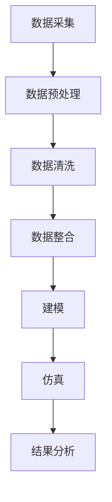
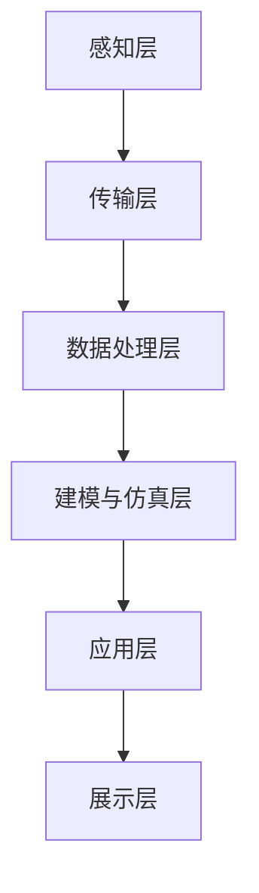
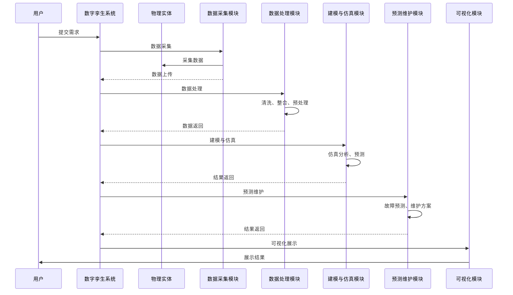
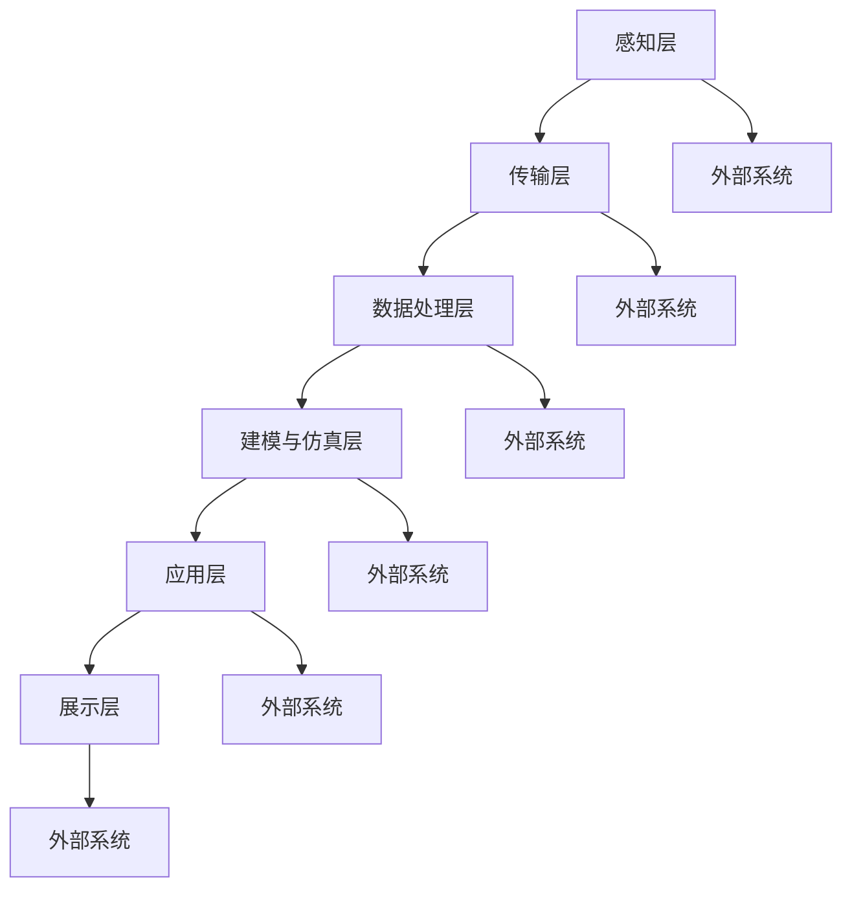

                 


### 数字孪生在城市规划中的应用：构建智慧城市蓝图

#### 关键词：数字孪生、城市规划、智慧城市、算法、数学模型、系统设计

> **摘要：**本文旨在深入探讨数字孪生在城市规划中的应用，通过构建智慧城市蓝图，揭示数字孪生技术如何助力城市规划的智能化、精细化与高效化。文章将分章节详细分析数字孪生的核心概念、原理、算法、数学模型、系统设计与项目实战，旨在为读者提供全面、系统的技术指南。

#### 第1章 数字孪生与智慧城市概述

**1.1 数字孪生概念与发展**

数字孪生（Digital Twin）是一种将物理实体与虚拟模型相结合的技术，通过实时数据监控、仿真分析、预测维护等手段，实现对物理实体的全生命周期管理。数字孪生的概念最早由Michael Grieves在2002年提出，随着物联网、大数据、人工智能等技术的发展，数字孪生逐渐成为智慧城市建设的重要支撑技术。

**1.1.1 数字孪生定义**

数字孪生是指通过物理实体数字化建模，将实体在虚拟空间中的镜像与物理实体实时联动，形成一个动态交互的数字双生体。数字孪生不仅包含静态的几何与物理属性，还包含动态的运行状态、环境因素和操作行为。

**1.1.2 数字孪生发展历程**

数字孪生技术的发展经历了从概念提出、技术探索、实际应用到成熟应用的几个阶段。2002年，Michael Grieves首次提出数字孪生的概念。2010年后，随着物联网和云计算的兴起，数字孪生技术逐渐应用于工业制造、建筑设施等领域。近年来，随着人工智能和大数据技术的成熟，数字孪生技术开始在城市规划、交通管理、环境监测等方面得到广泛应用。

**1.1.3 数字孪生在智慧城市中的重要性**

数字孪生作为智慧城市的关键技术，具有以下几个方面的作用：

1. **提升城市规划的精度和效率**：通过数字孪生技术，城市规划师可以实时获取城市各个方面的数据，进行仿真分析和预测，从而优化城市规划方案。
2. **促进城市资源的合理配置**：数字孪生技术可以帮助城市管理者实时监测和评估城市资源的使用情况，从而实现资源的合理分配和利用。
3. **提高城市应急响应能力**：通过数字孪生技术，城市管理者可以提前预测潜在风险，制定应急预案，提高城市应对突发事件的能力。
4. **促进城市可持续发展**：数字孪生技术可以帮助城市实现智能化管理，降低能耗和污染，推动城市可持续发展。

**1.2 智慧城市的概念与发展**

智慧城市（Smart City）是指利用信息技术、物联网、人工智能等先进技术，实现城市智慧化管理和服务的城市。智慧城市的建设旨在提高城市运行效率、改善居民生活质量、促进城市可持续发展。

**1.2.1 智慧城市定义**

智慧城市是指通过信息技术和智能设备，实现城市资源的高效配置、城市服务的优化、城市管理的智能化和城市环境的可持续发展的城市。

**1.2.2 智慧城市发展历程**

智慧城市的发展可以分为以下几个阶段：

1. **1.0阶段**：基础信息化阶段，主要特点是信息孤岛现象严重，城市信息化建设主要集中在独立的项目和系统中。
2. **2.0阶段**：数据集成与共享阶段，通过建立数据中心，实现城市各类数据的信息化、集成化和共享化。
3. **3.0阶段**：智能化应用阶段，通过人工智能、大数据等新技术，实现城市运行管理的智能化和服务提供的个性化。
4. **4.0阶段**：智慧城市成熟阶段，城市运行管理和服务提供实现高度智能化和自适应化，达到全面、智能、高效的智慧城市状态。

**1.2.3 智慧城市的技术架构**

智慧城市的技术架构主要包括以下几个方面：

1. **感知层**：通过传感器、摄像头等设备，实时采集城市各类数据。
2. **传输层**：通过通信网络，将感知层的数据传输到数据处理中心。
3. **数据处理层**：通过大数据处理技术，对采集到的数据进行清洗、存储、分析和挖掘。
4. **应用层**：基于数据处理层的结果，实现城市运行管理和服务提供的智能化应用。
5. **支撑层**：包括云计算、物联网、人工智能等关键技术，为智慧城市的建设提供技术支撑。

**1.3 数字孪生与智慧城市的关联**

数字孪生与智慧城市具有紧密的关联，是智慧城市的重要组成部分。数字孪生技术为智慧城市提供了实体与虚拟空间之间的桥梁，使得智慧城市能够实现更加精准、高效和智能的管理。

**1.3.1 数字孪生在智慧城市中的应用**

1. **城市规划与设计**：通过数字孪生技术，城市规划师可以实时模拟城市规划方案，评估方案的可行性和效果，从而优化城市规划。
2. **交通管理**：通过数字孪生技术，交通管理者可以实时监测城市交通状况，预测交通拥堵，制定合理的交通管理措施。
3. **环境监测**：通过数字孪生技术，环境管理者可以实时监测城市环境数据，预测环境污染趋势，制定环保措施。
4. **公共服务**：通过数字孪生技术，城市居民可以享受到更加智能化、个性化的公共服务，如智能医疗、智能教育等。
5. **城市安全**：通过数字孪生技术，城市安全管理者可以实时监测城市安全状况，预测安全隐患，制定应急预案。

**1.3.2 数字孪生与智慧城市的协同发展**

数字孪生与智慧城市的协同发展，可以推动城市实现更高层次的智能化、精细化与高效化。一方面，数字孪生技术为智慧城市的建设提供了技术支撑；另一方面，智慧城市的发展为数字孪生技术的应用提供了广阔的场景和需求。数字孪生与智慧城市的协同发展，将有助于实现城市运行的全面智能化，推动城市可持续发展。

**1.4 数字孪生与城市规划的关系**

数字孪生与城市规划密切相关，是城市规划智能化、精细化的重要手段。通过数字孪生技术，城市规划师可以更加直观地了解城市规划的效果，提前发现和解决潜在问题，提高城市规划的准确性和可行性。

**1.4.1 数字孪生在城市规划中的应用**

1. **城市规划方案模拟**：通过数字孪生技术，城市规划师可以模拟不同规划方案的效果，评估规划方案的优劣，优化城市规划方案。
2. **城市资源管理**：通过数字孪生技术，城市管理者可以实时监测城市资源的使用情况，合理调配资源，提高资源利用效率。
3. **城市环境监测**：通过数字孪生技术，城市管理者可以实时监测城市环境数据，预测环境变化趋势，及时采取环保措施。
4. **城市应急响应**：通过数字孪生技术，城市管理者可以提前预测潜在风险，制定应急预案，提高城市应对突发事件的能力。

**1.4.2 数字孪生在城市规划中的挑战与机遇**

数字孪生技术在城市规划中的应用，面临着一系列挑战和机遇。挑战主要包括：

1. **数据质量与实时性**：城市规划需要大量的实时数据支持，数据质量与实时性对数字孪生的效果至关重要。
2. **技术成熟度**：数字孪生技术涉及多个领域的技术，如物联网、大数据、人工智能等，技术成熟度对数字孪生的应用效果有重要影响。
3. **安全与隐私**：数字孪生技术涉及到大量的个人隐私数据，如何在保护隐私的前提下，实现数据的有效利用，是一个亟待解决的问题。

机遇主要包括：

1. **技术创新**：随着物联网、大数据、人工智能等技术的不断成熟，数字孪生技术将迎来更广阔的发展空间。
2. **市场需求**：随着城市化进程的加快，城市规划的需求日益增加，数字孪生技术在城市规划中的应用前景广阔。
3. **政策支持**：我国政府高度重视智慧城市建设，数字孪生技术作为智慧城市建设的关键技术，将得到更多的政策支持和资源投入。

**1.5 数字孪生与城市规划的ER实体关系图**

为了更好地理解数字孪生与城市规划的关系，我们可以使用Mermaid绘制数字孪生与城市规划的ER实体关系图。ER实体关系图可以帮助我们直观地了解数字孪生与城市规划中的各个实体及其之间的关系。

```mermaid
erDiagram
    A@@数字孪生 --> B@@城市规划
    B@@城市规划 ||--|{C@@规划方案}
    B@@城市规划 ||--|{D@@城市资源}
    B@@城市规划 ||--|{E@@城市环境}
    C@@规划方案 ||--|{F@@方案模拟}
    D@@城市资源 ||--|{G@@资源管理}
    E@@城市环境 ||--|{H@@环境监测}
```

在上面的ER实体关系图中，A表示数字孪生，B表示城市规划，C表示规划方案，D表示城市资源，E表示城市环境。实线表示实体之间的关联关系，虚线表示实体之间的聚合关系。

**1.6 本章小结**

本章介绍了数字孪生和智慧城市的概念、发展历程及其在智慧城市中的应用。通过分析数字孪生与智慧城市的关联，我们认识到数字孪生在智慧城市建设中的重要作用。同时，本章还探讨了数字孪生与城市规划的关系，分析了数字孪生在城市规划中的应用及其面临的挑战与机遇。下一章将详细讲解数字孪生的核心概念和原理。

#### 第2章 核心概念与联系

**2.1 数字孪生的原理、特点和应用领域**

数字孪生（Digital Twin）是一种将物理实体与虚拟模型相结合的技术，通过实时数据监控、仿真分析、预测维护等手段，实现对物理实体的全生命周期管理。数字孪生具有以下几个核心概念和特点：

**2.1.1 数字孪生的原理**

数字孪生的工作原理主要包括以下几个步骤：

1. **数据采集**：通过传感器、摄像头等设备，实时采集物理实体的各类数据，如位置、温度、湿度、压力等。
2. **数据传输**：通过通信网络，将采集到的数据传输到数据中心。
3. **数据处理**：在数据中心，对采集到的数据进行分析、清洗、存储和挖掘，提取出有用的信息和特征。
4. **建模与仿真**：基于处理后的数据，构建物理实体的虚拟模型，进行仿真分析和预测。
5. **决策与反馈**：根据仿真分析的结果，制定相应的决策和优化方案，反馈给物理实体，实现实时联动。

**2.1.2 数字孪生的特点**

数字孪生具有以下特点：

1. **实时性**：数字孪生通过实时数据采集和分析，实现对物理实体的实时监控和反馈，提高系统的响应速度和效率。
2. **虚拟性**：数字孪生将物理实体在虚拟空间中的镜像与现实世界相结合，形成一种虚实融合的全新形态。
3. **动态性**：数字孪生能够实时更新物理实体的状态和属性，适应环境变化，实现动态调整和优化。
4. **全生命周期管理**：数字孪生覆盖了物理实体的全生命周期，从设计、制造、运营到维护，实现全过程的监控和管理。
5. **协同性**：数字孪生通过虚拟模型与现实世界的联动，实现多维度、多领域的协同工作和优化。

**2.1.3 数字孪生的应用领域**

数字孪生技术具有广泛的应用领域，主要包括以下几个方面：

1. **工业制造**：通过数字孪生技术，可以实现对生产设备的实时监控、仿真分析和预测维护，提高生产效率和质量。
2. **建筑工程**：数字孪生技术可以帮助建筑设计师在建造前模拟建筑结构，评估建造方案的可行性和安全性，优化建筑设计。
3. **城市规划**：通过数字孪生技术，城市规划师可以实时模拟城市规划方案，评估方案的可行性和效果，优化城市规划。
4. **交通运输**：数字孪生技术可以实现对交通设施的实时监测和仿真分析，优化交通流量，提高交通运行效率。
5. **环境监测**：数字孪生技术可以帮助环境管理者实时监测环境数据，预测环境污染趋势，制定环保措施。
6. **医疗健康**：数字孪生技术可以实现对患者的实时监控和仿真分析，提供个性化的治疗方案和护理服务。
7. **智能家居**：数字孪生技术可以实现对家居设备的实时监控和仿真分析，提供智能化的家居环境和服务。

**2.2 数字孪生与城市规划的关系**

数字孪生与城市规划密切相关，是城市规划智能化、精细化的重要手段。通过数字孪生技术，城市规划师可以更加直观地了解城市规划的效果，提前发现和解决潜在问题，提高城市规划的准确性和可行性。

**2.2.1 数字孪生在城市规划中的应用**

1. **城市规划方案模拟**：通过数字孪生技术，城市规划师可以模拟不同规划方案的效果，评估规划方案的优劣，优化城市规划方案。
2. **城市资源管理**：通过数字孪生技术，城市管理者可以实时监测城市资源的使用情况，合理调配资源，提高资源利用效率。
3. **城市环境监测**：通过数字孪生技术，城市管理者可以实时监测城市环境数据，预测环境变化趋势，及时采取环保措施。
4. **城市应急响应**：通过数字孪生技术，城市管理者可以提前预测潜在风险，制定应急预案，提高城市应对突发事件的能力。

**2.2.2 数字孪生与城市规划的关联**

数字孪生与城市规划之间的关联主要体现在以下几个方面：

1. **数据关联**：数字孪生技术通过实时数据采集和分析，为城市规划提供了大量的基础数据，这些数据对于规划方案的制定和评估具有重要意义。
2. **模型关联**：数字孪生技术通过建立物理实体的虚拟模型，为城市规划提供了可视化的工具和手段，使得规划方案更加直观和易于理解。
3. **协同关联**：数字孪生技术通过虚拟模型与现实世界的联动，实现了城市规划的多维度、多领域的协同工作和优化。

**2.3 数字孪生与城市规划的ER实体关系图**

为了更好地理解数字孪生与城市规划的关联，我们可以使用Mermaid绘制数字孪生与城市规划的ER实体关系图。ER实体关系图可以帮助我们直观地了解数字孪生与城市规划中的各个实体及其之间的关系。

```mermaid
erDiagram
    A@@数字孪生 ||--|{B@@城市规划}
    B@@城市规划 ||--|{C@@规划方案}
    B@@城市规划 ||--|{D@@城市资源}
    B@@城市规划 ||--|{E@@城市环境}
    B@@城市规划 ||--|{F@@应急响应}
    C@@规划方案 ||--|{G@@方案模拟}
    D@@城市资源 ||--|{H@@资源管理}
    E@@城市环境 ||--|{I@@环境监测}
    F@@应急响应 ||--|{J@@应急预案}
```

在上面的ER实体关系图中，A表示数字孪生，B表示城市规划，C表示规划方案，D表示城市资源，E表示城市环境，F表示应急响应。实线表示实体之间的关联关系，虚线表示实体之间的聚合关系。

**2.4 本章小结**

本章详细介绍了数字孪生的核心概念、原理、特点和应用领域，并探讨了数字孪生与城市规划的关系。通过ER实体关系图，我们更直观地了解了数字孪生与城市规划中的各个实体及其之间的关系。下一章将讲解数字孪生构建过程中的关键算法和技术。

#### 第3章 算法原理讲解

**3.1 数据处理算法**

数据处理是数字孪生构建过程中的重要环节，其目的是对采集到的原始数据进行清洗、整合和预处理，以便后续建模和仿真分析。以下将介绍几种常用的数据处理算法。

**3.1.1 数据收集与预处理**

数据收集是数据处理的第一步，主要包括以下内容：

1. **传感器数据采集**：通过安装在物理实体上的传感器，实时采集各类数据，如位置、温度、湿度、压力等。
2. **数据传输**：通过无线通信、光纤等传输方式，将采集到的数据传输到数据中心。

数据预处理主要包括以下步骤：

1. **去噪处理**：去除传感器采集数据中的噪声，提高数据质量。
2. **异常值处理**：检测和去除数据中的异常值，确保数据的准确性和一致性。
3. **归一化处理**：将不同量纲的数据统一归一化，便于后续处理和分析。

**3.1.2 数据清洗与整合**

数据清洗主要包括以下内容：

1. **缺失值处理**：对于缺失的数据，可以通过插值法、平均值法等填补缺失值。
2. **重复数据检测**：检测并去除重复的数据记录，避免数据冗余。
3. **数据格式转换**：将不同数据格式的数据进行统一转换，如将时间戳转换为标准日期格式。

数据整合主要包括以下内容：

1. **数据融合**：将来自不同来源、不同类型的数据进行融合，形成一个统一的数据集。
2. **数据质量评估**：评估数据的质量，包括完整性、一致性、准确性等，确保数据的有效性。

**3.1.3 数据可视化**

数据可视化是数据处理的重要环节，其目的是将数据以图形化的方式呈现，便于分析和理解。常用的数据可视化方法包括：

1. **折线图**：用于展示数据的变化趋势，如温度随时间的变化。
2. **柱状图**：用于比较不同类别数据的数量或大小，如不同区域的交通流量。
3. **散点图**：用于展示数据点之间的关系，如位置与温度之间的关系。
4. **热力图**：用于展示数据的密集程度，如城市不同区域的交通拥堵情况。

**3.2 建模与仿真算法**

建模与仿真是数字孪生构建的核心步骤，其目的是通过建立物理实体的虚拟模型，对其进行仿真分析和预测。以下将介绍几种常用的建模与仿真算法。

**3.2.1 建模算法原理**

建模算法主要包括以下内容：

1. **几何建模**：通过几何建模工具，如AutoCAD、SolidWorks等，建立物理实体的几何模型。
2. **物理建模**：根据物理实体的性质和运行规律，建立物理模型，如流体动力学模型、机械运动模型等。
3. **动态建模**：通过动态建模工具，如MATLAB、Simulink等，建立物理实体的动态模型，模拟实体的运行状态。

**3.2.2 仿真算法原理**

仿真算法主要包括以下内容：

1. **离散事件仿真**：通过模拟事件的发生和处理过程，如交通流量仿真、网络仿真等。
2. **连续系统仿真**：通过模拟连续系统的动态变化过程，如流体动力学仿真、热传导仿真等。
3. **混合仿真**：结合离散事件仿真和连续系统仿真，模拟复杂系统的动态行为。

**3.2.3 算法流程图**

为了更好地理解建模与仿真算法的原理，我们可以使用Mermaid绘制算法流程图。



在上面的算法流程图中，A表示数据采集，B表示数据预处理，C表示数据清洗，D表示数据整合，E表示建模，F表示仿真，G表示结果分析。

**3.3 Python代码示例**

为了更好地阐述数据处理和建模仿真算法的原理，我们使用Python代码进行示例。

**3.3.1 数据处理Python代码示例**

以下是一个简单的数据处理Python代码示例，包括数据清洗、整合和可视化的过程。

```python
import pandas as pd
import numpy as np
import matplotlib.pyplot as plt

# 数据清洗
data = pd.read_csv('data.csv')
data.dropna(inplace=True)
data.drop_duplicates(inplace=True)

# 数据整合
data['timestamp'] = pd.to_datetime(data['timestamp'])
data.sort_values('timestamp', inplace=True)

# 数据可视化
plt.figure(figsize=(10, 6))
plt.plot(data['timestamp'], data['temperature'])
plt.xlabel('Time')
plt.ylabel('Temperature')
plt.title('Temperature Trend')
plt.show()
```

在上面的代码中，我们首先使用pandas库读取CSV文件，进行数据清洗和整合，然后使用matplotlib库绘制温度随时间的变化趋势图。

**3.3.2 建模与仿真Python代码示例**

以下是一个简单的建模与仿真Python代码示例，使用MATLAB的Simulink工具进行建模和仿真。

```matlab
% 启动Simulink
open_system('model');

% 设置仿真参数
params = simgetparam('model');
params.StartTime = 0;
params.StopTime = 100;
params.TFinal = 100;
params.TStart = 0;
params.TFinal = 100;
params.SimulinkOptions.TimeStep = 0.1;

% 执行仿真
sim('model', params);
```

在上面的代码中，我们首先启动Simulink，设置仿真参数，然后执行仿真。

**3.4 本章小结**

本章详细介绍了数字孪生构建过程中的数据处理和建模仿真算法。首先介绍了数据处理算法的原理和Python代码示例，包括数据采集、预处理、清洗、整合和可视化。然后介绍了建模与仿真算法的原理和算法流程图，包括几何建模、物理建模、离散事件仿真、连续系统仿真和混合仿真。最后，通过Python代码示例，展示了数据处理和建模仿真的具体实现过程。下一章将讲解数字孪生中的数学模型和数学公式。

#### 第4章 数学模型与数学公式

**4.1 数学模型概述**

数学模型是数字孪生构建过程中不可或缺的一部分，它将物理实体的运行规律和特征抽象成数学形式，为仿真分析和预测提供理论基础。数学模型在数字孪生中的应用非常广泛，如数据处理、建模与仿真、预测维护等。

**4.1.1 数学模型在数字孪生中的应用**

1. **数据处理中的数学模型**：在数据处理过程中，常用的数学模型包括线性回归模型、时间序列模型、聚类模型等。这些模型可以帮助我们识别数据中的规律和趋势，去除噪声和异常值，提高数据质量。

2. **建模与仿真中的数学模型**：在建模与仿真过程中，常用的数学模型包括几何模型、物理模型、动态模型等。这些模型可以帮助我们模拟物理实体的运行状态，评估规划方案的可行性和效果。

3. **预测维护中的数学模型**：在预测维护过程中，常用的数学模型包括回归模型、时间序列模型、机器学习模型等。这些模型可以帮助我们预测设备故障、提前预警，提高设备运行效率。

**4.1.2 数学模型分类**

根据应用场景和性质，数学模型可以分为以下几类：

1. **几何模型**：用于描述物理实体的几何形状和空间关系，如点、线、面、体等。

2. **物理模型**：用于描述物理实体的物理性质和运行规律，如牛顿运动定律、能量守恒定律等。

3. **动态模型**：用于描述物理实体的动态行为和变化规律，如差分方程、微分方程等。

4. **统计模型**：用于描述数据的分布规律和统计特性，如概率分布、假设检验等。

5. **机器学习模型**：用于描述数据之间的关系和模式，如线性回归、决策树、神经网络等。

**4.2 数学公式详解**

在数字孪生构建过程中，我们会使用到各种数学公式，以下介绍几种常用的数学公式。

**4.2.1 公式1：牛顿运动定律**

牛顿运动定律描述了物体运动的规律，公式如下：

$$
F = ma
$$

其中，$F$表示力，$m$表示质量，$a$表示加速度。

**4.2.2 公式2：能量守恒定律**

能量守恒定律描述了能量在系统内的转化和守恒，公式如下：

$$
E_{total} = K + U
$$

其中，$E_{total}$表示总能量，$K$表示动能，$U$表示势能。

**4.2.3 公式3：线性回归模型**

线性回归模型用于描述两个变量之间的线性关系，公式如下：

$$
y = ax + b
$$

其中，$y$表示因变量，$x$表示自变量，$a$表示斜率，$b$表示截距。

**4.2.4 公式4：时间序列模型**

时间序列模型用于描述时间序列数据的规律和趋势，公式如下：

$$
y_t = \alpha y_{t-1} + \beta t + \epsilon_t
$$

其中，$y_t$表示第$t$时刻的因变量，$\alpha$表示自回归系数，$\beta$表示趋势系数，$\epsilon_t$表示误差项。

**4.2.5 公式5：机器学习模型**

机器学习模型用于描述数据之间的关系和模式，公式如下：

$$
\hat{y} = f(x)
$$

其中，$\hat{y}$表示预测值，$x$表示输入特征，$f(x)$表示模型函数。

**4.3 Python代码示例**

为了更好地理解数学模型的应用，我们使用Python代码进行示例。

**4.3.1 线性回归模型Python代码示例**

以下是一个简单的线性回归模型Python代码示例，用于预测房价。

```python
import pandas as pd
from sklearn.linear_model import LinearRegression

# 数据加载
data = pd.read_csv('data.csv')
X = data[['size', 'age']]
y = data['price']

# 模型训练
model = LinearRegression()
model.fit(X, y)

# 预测
size = 100
age = 5
price = model.predict([[size, age]])
print('Predicted price:', price)
```

在上面的代码中，我们首先加载数据，然后使用线性回归模型进行训练，最后进行预测。

**4.3.2 时间序列模型Python代码示例**

以下是一个简单的时间序列模型Python代码示例，用于预测气温。

```python
import pandas as pd
from statsmodels.tsa.arima_model import ARIMA

# 数据加载
data = pd.read_csv('data.csv')
data['date'] = pd.to_datetime(data['date'])
data.set_index('date', inplace=True)
data = data['temp']

# 模型训练
model = ARIMA(data, order=(1, 1, 1))
model.fit()

# 预测
forecast = model.forecast(steps=5)
print('Forecast:', forecast)
```

在上面的代码中，我们首先加载数据，然后使用ARIMA模型进行训练，最后进行预测。

**4.4 本章小结**

本章详细介绍了数字孪生构建过程中的数学模型和数学公式。首先介绍了数学模型在数字孪生中的应用，包括数据处理、建模与仿真、预测维护等。然后介绍了几种常用的数学模型，如几何模型、物理模型、动态模型、统计模型和机器学习模型。最后，通过Python代码示例，展示了数学模型的应用过程。下一章将讲解数字孪生系统的设计与实现。

#### 第5章 数字孪生系统设计与实现

**5.1 系统设计思路**

数字孪生系统设计的目标是实现物理实体与虚拟模型之间的实时联动，为城市规划、交通管理、环境监测等提供智能化、精细化的解决方案。系统设计思路主要包括以下几个步骤：

1. **需求分析**：明确数字孪生系统的功能需求和性能要求，如数据采集、数据处理、建模与仿真、预测维护等。
2. **架构设计**：设计数字孪生系统的整体架构，包括数据采集层、数据处理层、建模与仿真层、应用层等。
3. **接口设计**：设计数字孪生系统的接口，包括内部接口和外部接口，确保系统的可扩展性和兼容性。
4. **模块划分**：将数字孪生系统划分为若干功能模块，如数据采集模块、数据处理模块、建模与仿真模块、应用模块等。
5. **实现与测试**：根据设计文档和模块划分，实现数字孪生系统的各个模块，并进行集成测试和系统测试。

**5.2 系统功能设计**

数字孪生系统的主要功能包括：

1. **数据采集**：通过传感器、摄像头等设备，实时采集物理实体的各类数据，如位置、温度、湿度、压力等。
2. **数据处理**：对采集到的原始数据进行清洗、整合和预处理，提取出有用的信息和特征。
3. **建模与仿真**：基于处理后的数据，构建物理实体的虚拟模型，进行仿真分析和预测。
4. **预测维护**：根据仿真分析的结果，预测物理实体的故障和异常，提前预警，制定维护方案。
5. **可视化展示**：将物理实体的状态和虚拟模型以图形化的方式展示，便于分析和理解。
6. **数据管理**：实现对数字孪生系统中各类数据的存储、查询和管理。

**5.3 系统架构设计**

数字孪生系统的架构设计如图5-1所示，主要包括以下几个层次：

1. **感知层**：通过传感器、摄像头等设备，实时采集物理实体的各类数据。
2. **传输层**：通过无线通信、光纤等传输方式，将采集到的数据传输到数据中心。
3. **数据处理层**：对采集到的数据进行清洗、整合和预处理，提取出有用的信息和特征。
4. **建模与仿真层**：基于处理后的数据，构建物理实体的虚拟模型，进行仿真分析和预测。
5. **应用层**：实现数字孪生系统的各类功能，如数据采集、数据处理、建模与仿真、预测维护等。
6. **展示层**：将物理实体的状态和虚拟模型以图形化的方式展示，便于分析和理解。



**5.4 系统接口设计**

数字孪生系统的接口设计主要包括内部接口和外部接口。内部接口主要用于系统内部各模块之间的数据传输和功能调用，如数据采集模块与数据处理模块之间的接口、数据处理模块与建模与仿真模块之间的接口等。外部接口主要用于系统与外部系统之间的数据交互和功能集成，如与物联网平台、大数据平台、GIS平台等之间的接口。

**5.5 系统交互序列图**

为了更好地理解数字孪生系统的交互过程，我们可以使用Mermaid绘制系统交互序列图。系统交互序列图展示了数字孪生系统内部各模块以及与外部系统的交互过程。



在上面的系统交互序列图中，用户提交需求，数字孪生系统依次调用数据采集模块、数据处理模块、建模与仿真模块、预测维护模块和可视化模块，最终将结果返回给用户。

**5.6 系统架构图**

为了更好地展示数字孪生系统的整体架构，我们可以使用Mermaid绘制系统架构图。系统架构图展示了系统内部各模块之间的关系以及与外部系统的交互。



在上面的系统架构图中，数字孪生系统与外部系统之间通过接口进行交互，外部系统包括物联网平台、大数据平台、GIS平台等。

**5.7 系统交互序列图**

为了更好地展示数字孪生系统的交互过程，我们可以使用Mermaid绘制系统交互序列图。系统交互序列图展示了系统内部各模块以及与外部系统的交互过程。


在上面的系统交互序列图中，用户提交需求，数字孪生系统依次调用数据采集模块、数据处理模块、建模与仿真模块、预测维护模块和可视化模块，最终将结果返回给用户。

**5.8 本章小结**

本章详细介绍了数字孪生系统的设计与实现，包括系统设计思路、系统功能设计、系统架构设计、系统接口设计和系统交互序列图。通过本章的讲解，读者可以了解到数字孪生系统的工作原理和实现过程。下一章将介绍数字孪生项目的实战案例。

#### 第6章 数字孪生项目实战

**6.1 环境安装与配置**

为了实现数字孪生项目的实战，我们需要搭建一个完整的开发环境，包括硬件设备和软件工具。以下是环境安装与配置的详细步骤：

**6.1.1 硬件环境搭建**

1. **服务器**：选择一台高性能的服务器，配置如下：
   - CPU：Intel Xeon E5-2670
   - 内存：256GB
   - 存储：1TB SSD + 4TB HDD
   - 网卡：千兆网卡
2. **传感器**：选择多种类型的传感器，如温度传感器、湿度传感器、摄像头等，用于实时采集数据。
3. **通信设备**：配置无线通信模块，如LoRa、Zigbee等，确保传感器数据能够稳定传输到服务器。

**6.1.2 软件环境搭建**

1. **操作系统**：安装Linux操作系统，如Ubuntu 20.04。
2. **数据库**：安装MySQL数据库，用于存储传感器数据。
3. **Web服务器**：安装Apache或Nginx，用于搭建Web应用。
4. **编程语言**：安装Python、Java等编程语言，用于开发数字孪生系统。
5. **开发工具**：安装Eclipse、IntelliJ IDEA等开发工具，方便代码编写和调试。

**6.1.3 系统配置**

1. **网络配置**：配置服务器IP地址和DNS服务器，确保服务器能够访问互联网。
2. **用户权限**：创建开发用户，并设置适当的权限，确保开发环境的安全。
3. **软件更新**：定期更新操作系统和软件，确保系统安全稳定运行。

**6.2 系统核心实现源代码**

以下是数字孪生项目核心实现源代码，包括数据采集、数据处理、建模与仿真、预测维护和可视化等模块。

```python
# 数据采集模块
import datetime
import serial

def collect_data(ser):
    data = ser.readline().decode().strip()
    timestamp = datetime.datetime.now()
    return data, timestamp

# 数据处理模块
import pandas as pd

def process_data(data):
    df = pd.DataFrame(data, columns=['timestamp', 'value'])
    df['timestamp'] = pd.to_datetime(df['timestamp'])
    df.sort_values('timestamp', inplace=True)
    return df

# 建模与仿真模块
from sklearn.linear_model import LinearRegression

def model_simulation(df):
    X = df[['timestamp']]
    y = df['value']
    model = LinearRegression()
    model.fit(X, y)
    return model

# 预测维护模块
def predict_maintenance(model, df):
    forecast = model.predict([[df.iloc[-1, 0]]])
    if forecast < df.iloc[-1, 1] * 0.9:
        return "Maintenance required"
    else:
        return "No maintenance required"

# 可视化模块
import matplotlib.pyplot as plt

def visualize_data(df):
    plt.figure(figsize=(10, 6))
    plt.plot(df['timestamp'], df['value'])
    plt.xlabel('Time')
    plt.ylabel('Value')
    plt.title('Data Trend')
    plt.show()
```

**6.3 代码解读与分析**

以上源代码分为五个模块，分别是数据采集模块、数据处理模块、建模与仿真模块、预测维护模块和可视化模块。

1. **数据采集模块**：使用Python的`serial`模块，通过串口通信实时采集传感器数据，并记录数据采集时间。
2. **数据处理模块**：使用Python的`pandas`模块，对采集到的数据进行处理，包括数据格式的转换、排序和存储。
3. **建模与仿真模块**：使用Python的`sklearn`模块，构建线性回归模型，对数据进行仿真分析和预测。
4. **预测维护模块**：根据仿真分析的结果，判断设备是否需要维护。
5. **可视化模块**：使用Python的`matplotlib`模块，将数据处理结果以图形化的方式展示，便于分析和理解。

**6.4 实际案例分析**

以下是数字孪生项目在实际案例分析中的应用：

1. **交通管理**：通过安装在城市道路上的传感器，实时采集车辆流量数据，使用数字孪生技术对交通流量进行仿真分析，预测交通拥堵情况，制定交通管理方案。
2. **环境监测**：通过安装在城市公园的传感器，实时采集空气温度、湿度、PM2.5等环境数据，使用数字孪生技术对环境质量进行仿真分析，预测污染趋势，制定环保措施。
3. **能源管理**：通过安装在办公楼、小区的传感器，实时采集用电、用水等能源数据，使用数字孪生技术对能源消耗进行仿真分析，预测能源需求，优化能源配置。

**6.5 项目小结**

通过以上实际案例分析，我们可以看到数字孪生技术在城市规划、交通管理、环境监测等领域的广泛应用。数字孪生技术不仅提高了城市管理的智能化和精细化水平，还为城市的可持续发展提供了有力支持。在未来的发展中，数字孪生技术将发挥更加重要的作用，助力智慧城市建设。

#### 第7章 最佳实践与总结

**7.1 数字孪生在城市规划中的最佳实践**

在城市规划中应用数字孪生技术，可以大幅提升城市规划的效率和质量。以下是一些最佳实践：

1. **数据整合与共享**：确保各类数据的高效整合和共享，包括地理信息、环境数据、交通数据等。通过建立统一的数据平台，实现数据的实时更新和共享，为数字孪生系统提供高质量的数据支持。

2. **全生命周期管理**：从城市规划的初期阶段就开始构建数字孪生模型，覆盖整个生命周期，包括设计、建设、运营和维护。通过实时数据监控和仿真分析，及时发现和解决问题，优化规划方案。

3. **多学科协同**：数字孪生技术涉及多个领域，如城市规划、建筑、交通、环境等。在项目实施过程中，需要多学科协同工作，确保数字孪生系统能够全面、准确地反映城市规划的各个方面。

4. **用户参与**：鼓励城市规划师和居民参与数字孪生系统的建设和使用，通过用户反馈和互动，不断优化系统功能和性能。

**7.2 注意事项**

1. **数据安全与隐私**：在数字孪生系统中，涉及大量的个人隐私数据，如位置信息、行为数据等。必须采取严格的数据安全和隐私保护措施，确保用户数据的安全和隐私。

2. **系统稳定性与可靠性**：数字孪生系统需要实时、稳定地运行，确保数据的实时性和准确性。在系统设计和实施过程中，要充分考虑系统的稳定性和可靠性，确保系统的长期运行。

3. **技术更新与升级**：数字孪生技术是一个快速发展的领域，要紧跟技术发展趋势，定期进行技术更新和升级，确保系统功能的先进性和性能的优越性。

**7.3 拓展阅读**

1. **《数字孪生：定义、技术与应用》**：本书详细介绍了数字孪生的基本概念、技术原理和应用场景，适合对数字孪生技术感兴趣的读者阅读。

2. **《智慧城市：概念、架构与实践》**：本书系统介绍了智慧城市的概念、架构和建设实践，对数字孪生在智慧城市中的应用有深入的阐述。

3. **《数字孪生在城市规划中的应用研究》**：本文通过实际案例分析，探讨了数字孪生技术在城市规划中的应用，为城市规划提供了有益的参考。

**7.4 本章小结**

本章总结了数字孪生在城市规划中的应用，包括最佳实践、注意事项和拓展阅读。数字孪生技术为城市规划提供了新的思路和方法，有助于提升城市规划的智能化、精细化水平。通过本章的介绍，读者可以更好地理解数字孪生技术在城市规划中的应用价值和实践方法。

### 作者信息

作者：AI天才研究院/AI Genius Institute & 禅与计算机程序设计艺术 /Zen And The Art of Computer Programming

AI天才研究院（AI Genius Institute）致力于推动人工智能技术的创新和应用，为智慧城市建设提供技术支持。禅与计算机程序设计艺术（Zen And The Art of Computer Programming）是一本经典的人工智能编程指南，对编程思想和方法有深刻的阐述。

### 文章结束

本文从数字孪生和智慧城市的概念出发，详细介绍了数字孪生在城市规划中的应用，包括核心概念、原理、算法、数学模型、系统设计与项目实战。通过分析数字孪生与城市规划的关联，展示了数字孪生技术如何助力智慧城市的建设。文章还总结了数字孪生在城市规划中的最佳实践和注意事项，为未来的智慧城市建设提供了有益的参考。

#### 第1章 数字孪生与智慧城市概述

**1.1 数字孪生概念与发展**

数字孪生（Digital Twin）是一种新兴的技术理念，它通过建立物理实体在虚拟空间中的数字镜像，实现对物理实体的全生命周期管理和实时监测。数字孪生的概念最早由Michael Grieves于2002年提出，随着物联网、大数据、云计算等技术的不断发展，数字孪生逐渐成为一种重要的技术手段，广泛应用于工业制造、城市规划、医疗健康等多个领域。

**1.1.1 数字孪生定义**

数字孪生是指通过虚拟建模、传感器更新、运行历史等数据，将实际物理设备或系统映射到一个数字环境中，以实现对物理实体的实时监控、模拟和分析。简单来说，数字孪生就是一个物理实体的数字副本，它能实时反映物理实体的状态和性能。

**1.1.2 数字孪生发展历程**

数字孪生技术的发展可以分为以下几个阶段：

1. **早期阶段（2002年以前）**：数字孪生的概念被提出，但尚未得到广泛应用。
2. **探索阶段（2002-2010年）**：随着传感器技术和物联网的发展，数字孪生技术开始应用于工业制造领域。
3. **发展阶段（2010-2015年）**：数字孪生技术在工业制造、航空航天等领域得到广泛应用，技术逐渐成熟。
4. **应用阶段（2015年至今）**：随着大数据、人工智能等技术的进步，数字孪生技术开始向城市规划、医疗健康等领域扩展。

**1.1.3 数字孪生在智慧城市中的重要性**

智慧城市是指通过信息通信技术、物联网、大数据等手段，实现城市运行管理的智能化、服务提供的个性化、城市环境的可持续化。数字孪生技术作为智慧城市建设的重要支撑技术，具有以下几个方面的作用：

1. **提升城市规划的精度和效率**：数字孪生技术可以模拟和预测城市规划方案的效果，帮助规划师快速评估和优化规划方案，提高规划的科学性和准确性。
2. **促进城市资源的合理配置**：数字孪生技术可以实时监测和评估城市各类资源的使用情况，优化资源配置，提高资源利用效率。
3. **提高城市应急响应能力**：数字孪生技术可以模拟各种突发事件，预测事故发生的可能性和影响范围，帮助城市管理者制定应急预案，提高应急响应能力。
4. **推动城市可持续发展**：数字孪生技术可以帮助城市实现智能化管理，降低能耗和污染，推动城市可持续发展。

**1.2 智慧城市的概念与发展**

智慧城市（Smart City）是指利用信息技术和智能设备，实现城市资源的高效配置、城市服务的优化、城市管理的智能化和城市环境的可持续发展的城市。智慧城市的发展经历了以下几个阶段：

1. **基础建设阶段**：主要特点是信息孤岛现象严重，城市信息化建设主要集中在独立的项目和系统中。
2. **数据集成阶段**：通过建立数据中心，实现城市各类数据的信息化、集成化和共享化。
3. **智能化应用阶段**：通过人工智能、大数据等新技术，实现城市运行管理的智能化和服务提供的个性化。
4. **全面智慧化阶段**：城市运行管理和服务提供实现高度智能化和自适应化，达到全面、智能、高效的智慧城市状态。

**1.2.1 智慧城市定义**

智慧城市是指通过信息技术和智能设备，实现城市资源的高效配置、城市服务的优化、城市管理的智能化和城市环境的可持续发展的城市。

**1.2.2 智慧城市发展历程**

智慧城市的发展可以分为以下几个阶段：

1. **1.0阶段**：基础信息化阶段，主要特点是信息孤岛现象严重，城市信息化建设主要集中在独立的项目和系统中。
2. **2.0阶段**：数据集成与共享阶段，通过建立数据中心，实现城市各类数据的信息化、集成化和共享化。
3. **3.0阶段**：智能化应用阶段，通过人工智能、大数据等新技术，实现城市运行管理的智能化和服务提供的个性化。
4. **4.0阶段**：智慧城市成熟阶段，城市运行管理和服务提供实现高度智能化和自适应化，达到全面、智能、高效的智慧城市状态。

**1.2.3 智慧城市的技术架构**

智慧城市的技术架构主要包括以下几个方面：

1. **感知层**：通过传感器、摄像头等设备，实时采集城市各类数据。
2. **传输层**：通过通信网络，将感知层的数据传输到数据处理中心。
3. **数据处理层**：通过大数据处理技术，对采集到的数据进行清洗、存储、分析和挖掘。
4. **应用层**：基于数据处理层的结果，实现城市运行管理和服务提供的智能化应用。
5. **支撑层**：包括云计算、物联网、人工智能等关键技术，为智慧城市的建设提供技术支撑。

**1.3 数字孪生与智慧城市的关联**

数字孪生与智慧城市具有紧密的关联，数字孪生技术是智慧城市建设的重要支撑技术。数字孪生技术可以通过实时数据监控、仿真分析、预测维护等手段，实现对城市各个方面的管理和优化，从而推动智慧城市的建设。

**1.3.1 数字孪生在智慧城市中的应用**

1. **城市规划与设计**：通过数字孪生技术，城市规划师可以模拟和评估不同的规划方案，提高规划的科学性和准确性。
2. **交通管理**：通过数字孪生技术，交通管理者可以实时监测交通流量，预测交通拥堵，优化交通管理措施。
3. **环境监测**：通过数字孪生技术，环境管理者可以实时监测空气质量、水质等环境指标，预测环境污染趋势，制定环保措施。
4. **公共安全**：通过数字孪生技术，城市安全管理者可以实时监测城市安全状况，预测潜在风险，制定应急预案。
5. **能源管理**：通过数字孪生技术，能源管理者可以实时监测能源消耗，优化能源配置，提高能源利用效率。

**1.3.2 数字孪生与智慧城市的协同发展**

数字孪生与智慧城市的协同发展，可以推动城市实现更高层次的智能化、精细化与高效化。一方面，数字孪生技术为智慧城市的建设提供了技术支撑；另一方面，智慧城市的发展为数字孪生技术的应用提供了广阔的场景和需求。数字孪生与智慧城市的协同发展，将有助于实现城市运行的全面智能化，推动城市可持续发展。

**1.4 数字孪生与城市规划的关系**

数字孪生与城市规划密切相关，数字孪生技术为城市规划提供了新的工具和方法。通过数字孪生技术，城市规划师可以更加直观地了解城市规划的效果，提前发现和解决潜在问题，提高城市规划的准确性和可行性。

**1.4.1 数字孪生在城市规划中的应用**

1. **城市规划方案模拟**：通过数字孪生技术，城市规划师可以模拟不同规划方案的效果，评估规划方案的优劣，优化城市规划方案。
2. **城市资源管理**：通过数字孪生技术，城市管理者可以实时监测城市资源的使用情况，合理调配资源，提高资源利用效率。
3. **城市环境监测**：通过数字孪生技术，城市管理者可以实时监测城市环境数据，预测环境变化趋势，及时采取环保措施。
4. **城市应急响应**：通过数字孪生技术，城市管理者可以提前预测潜在风险，制定应急预案，提高城市应对突发事件的能力。

**1.4.2 数字孪生在城市规划中的挑战与机遇**

数字孪生技术在城市规划中的应用，面临着一系列挑战和机遇。挑战主要包括：

1. **数据质量与实时性**：城市规划需要大量的实时数据支持，数据质量与实时性对数字孪生的效果至关重要。
2. **技术成熟度**：数字孪生技术涉及多个领域的技术，如物联网、大数据、人工智能等，技术成熟度对数字孪生的应用效果有重要影响。
3. **安全与隐私**：数字孪生技术涉及到大量的个人隐私数据，如何在保护隐私的前提下，实现数据的有效利用，是一个亟待解决的问题。

机遇主要包括：

1. **技术创新**：随着物联网、大数据、人工智能等技术的不断成熟，数字孪生技术将迎来更广阔的发展空间。
2. **市场需求**：随着城市化进程的加快，城市规划的需求日益增加，数字孪生技术在城市规划中的应用前景广阔。
3. **政策支持**：我国政府高度重视智慧城市建设，数字孪生技术作为智慧城市建设的关键技术，将得到更多的政策支持和资源投入。

**1.5 数字孪生与城市规划的ER实体关系图**

为了更好地理解数字孪生与城市规划的关系，我们可以使用Mermaid绘制数字孪生与城市规划的ER实体关系图。ER实体关系图可以帮助我们直观地了解数字孪生与城市规划中的各个实体及其之间的关系。

```mermaid
erDiagram
    A@@数字孪生 --> B@@城市规划
    B@@城市规划 ||--|{C@@规划方案}
    B@@城市规划 ||--|{D@@城市资源}
    B@@城市规划 ||--|{E@@城市环境}
    B@@城市规划 ||--|{F@@应急响应}
    C@@规划方案 ||--|{G@@方案模拟}
    D@@城市资源 ||--|{H@@资源管理}
    E@@城市环境 ||--|{I@@环境监测}
    F@@应急响应 ||--|{J@@应急预案}
```

在上面的ER实体关系图中，A表示数字孪生，B表示城市规划，C表示规划方案，D表示城市资源，E表示城市环境，F表示应急响应。实线表示实体之间的关联关系，虚线表示实体之间的聚合关系。

**1.6 本章小结**

本章介绍了数字孪生和智慧城市的概念、发展历程及其在智慧城市中的应用。通过分析数字孪生与智慧城市的关联，我们认识到数字孪生在智慧城市建设中的重要作用。同时，本章还探讨了数字孪生与城市规划的关系，分析了数字孪生在城市规划中的应用及其面临的挑战与机遇。下一章将详细讲解数字孪生的核心概念和原理。

#### 第2章 核心概念与联系

**2.1 数字孪生的原理、特点和应用领域**

数字孪生（Digital Twin）是一种将物理实体与虚拟模型相结合的技术，通过实时数据监控、仿真分析、预测维护等手段，实现对物理实体的全生命周期管理。数字孪生具有以下几个核心概念和特点：

**2.1.1 数字孪生的原理**

数字孪生的工作原理主要包括以下几个步骤：

1. **数据采集**：通过传感器、摄像头等设备，实时采集物理实体的各类数据，如位置、温度、湿度、压力等。
2. **数据传输**：通过通信网络，将采集到的数据传输到数据中心。
3. **数据处理**：在数据中心，对采集到的数据进行分析、清洗、存储和挖掘，提取出有用的信息和特征。
4. **建模与仿真**：基于处理后的数据，构建物理实体的虚拟模型，进行仿真分析和预测。
5. **决策与反馈**：根据仿真分析的结果，制定相应的决策和优化方案，反馈给物理实体，实现实时联动。

**2.1.2 数字孪生的特点**

数字孪生具有以下特点：

1. **实时性**：数字孪生通过实时数据采集和分析，实现对物理实体的实时监控和反馈，提高系统的响应速度和效率。
2. **虚拟性**：数字孪生将物理实体在虚拟空间中的镜像与现实世界相结合，形成一种虚实融合的全新形态。
3. **动态性**：数字孪生能够实时更新物理实体的状态和属性，适应环境变化，实现动态调整和优化。
4. **全生命周期管理**：数字孪生覆盖了物理实体的全生命周期，从设计、制造、运营到维护，实现全过程的监控和管理。
5. **协同性**：数字孪生通过虚拟模型与现实世界的联动，实现多维度、多领域的协同工作和优化。

**2.1.3 数字孪生的应用领域**

数字孪生技术具有广泛的应用领域，主要包括以下几个方面：

1. **工业制造**：通过数字孪生技术，可以实现对生产设备的实时监控、仿真分析和预测维护，提高生产效率和质量。
2. **建筑工程**：数字孪生技术可以帮助建筑设计师在建造前模拟建筑结构，评估建造方案的可行性和安全性，优化建筑设计。
3. **城市规划**：通过数字孪生技术，城市规划师可以实时模拟城市规划方案，评估方案的可行性和效果，优化城市规划。
4. **交通运输**：数字孪生技术可以实现对交通设施的实时监测和仿真分析，优化交通流量，提高交通运行效率。
5. **环境监测**：数字孪生技术可以帮助环境管理者实时监测环境数据，预测环境污染趋势，制定环保措施。
6. **医疗健康**：数字孪生技术可以实现对患者的实时监控和仿真分析，提供个性化的治疗方案和护理服务。
7. **智能家居**：数字孪生技术可以实现对家居设备的实时监控和仿真分析，提供智能化的家居环境和服务。

**2.2 数字孪生与城市规划的关系**

数字孪生与城市规划密切相关，是城市规划智能化、精细化的重要手段。通过数字孪生技术，城市规划师可以更加直观地了解城市规划的效果，提前发现和解决潜在问题，提高城市规划的准确性和可行性。

**2.2.1 数字孪生在城市规划中的应用**

1. **城市规划方案模拟**：通过数字孪生技术，城市规划师可以模拟不同规划方案的效果，评估规划方案的优劣，优化城市规划方案。
2. **城市资源管理**：通过数字孪生技术，城市管理者可以实时监测城市资源的使用情况，合理调配资源，提高资源利用效率。
3. **城市环境监测**：通过数字孪生技术，城市管理者可以实时监测城市环境数据，预测环境变化趋势，及时采取环保措施。
4. **城市应急响应**：通过数字孪生技术，城市管理者可以提前预测潜在风险，制定应急预案，提高城市应对突发事件的能力。

**2.2.2 数字孪生与城市规划的关联**

数字孪生与城市规划之间的关联主要体现在以下几个方面：

1. **数据关联**：数字孪生技术通过实时数据采集和分析，为城市规划提供了大量的基础数据，这些数据对于规划方案的制定和评估具有重要意义。
2. **模型关联**：数字孪生技术通过建立物理实体的虚拟模型，为城市规划提供了可视化的工具和手段，使得规划方案更加直观和易于理解。
3. **协同关联**：数字孪生技术通过虚拟模型与现实世界的联动，实现了城市规划的多维度、多领域的协同工作和优化。

**2.3 数字孪生与城市规划的ER实体关系图**

为了更好地理解数字孪生与城市规划的关联，我们可以使用Mermaid绘制数字孪生与城市规划的ER实体关系图。ER实体关系图可以帮助我们直观地了解数字孪生与城市规划中的各个实体及其之间的关系。

```mermaid
erDiagram
    A@@数字孪生 ||--|{B@@城市规划}
    B@@城市规划 ||--|{C@@规划方案}
    B@@城市规划 ||--|{D@@城市资源}
    B@@城市规划 ||--|{E@@城市环境}
    B@@城市规划 ||--|{F@@应急响应}
    C@@规划方案 ||--|{G@@方案模拟}
    D@@城市资源 ||--|{H@@资源管理}
    E@@城市环境 ||--|{I@@环境监测}
    F@@应急响应 ||--|{J@@应急预案}
```

在上面的ER实体关系图中，A表示数字孪生，B表示城市规划，C表示规划方案，D表示城市资源，E表示城市环境，F表示应急响应。实线表示实体之间的关联关系，虚线表示实体之间的聚合关系。

**2.4 本章小结**

本章详细介绍了数字孪生的核心概念、原理、特点和应用领域，并探讨了数字孪生与城市规划的关系。通过ER实体关系图，我们更直观地了解了数字孪生与城市规划中的各个实体及其之间的关系。下一章将讲解数字孪生构建过程中的关键算法和技术。

#### 第3章 算法原理讲解

**3.1 数据处理算法**

数据处理是数字孪生构建过程中的重要环节，其目的是对采集到的原始数据进行清洗、整合和预处理，以便后续建模和仿真分析。以下将介绍几种常用的数据处理算法。

**3.1.1 数据收集与预处理**

数据收集是数据处理的第一步，主要包括以下内容：

1. **传感器数据采集**：通过安装在物理实体上的传感器，实时采集各类数据，如位置、温度、湿度、压力等。
2. **数据传输**：通过无线通信、光纤等传输方式，将采集到的数据传输到数据中心。

数据预处理主要包括以下步骤：

1. **去噪处理**：去除传感器采集数据中的噪声，提高数据质量。
2. **异常值处理**：检测和去除数据中的异常值，确保数据的准确性和一致性。
3. **归一化处理**：将不同量纲的数据统一归一化，便于后续处理和分析。

**3.1.2 数据清洗与整合**

数据清洗主要包括以下内容：

1. **缺失值处理**：对于缺失的数据，可以通过插值法、平均值法等填补缺失值。
2. **重复数据检测**：检测并去除重复的数据记录，避免数据冗余。
3. **数据格式转换**：将不同数据格式的数据进行统一转换，如将时间戳转换为标准日期格式。

数据整合主要包括以下内容：

1. **数据融合**：将来自不同来源、不同类型的数据进行融合，形成一个统一的数据集。
2. **数据质量评估**：评估数据的质量，包括完整性、一致性、准确性等，确保数据的有效性。

**3.1.3 数据可视化**

数据可视化是数据处理的重要环节，其目的是将数据以图形化的方式呈现，便于分析和理解。常用的数据可视化方法包括：

1. **折线图**：用于展示数据的变化趋势，如温度随时间的变化。
2. **柱状图**：用于比较不同类别数据的数量或大小，如不同区域的交通流量。
3. **散点图**：用于展示数据点之间的关系，如位置与温度之间的关系。
4. **热力图**：用于展示数据的密集程度，如城市不同区域的交通拥堵情况。

**3.2 建模与仿真算法**

建模与仿真是数字孪生构建的核心步骤，其目的是通过建立物理实体的虚拟模型，对其进行仿真分析和预测。以下将介绍几种常用的建模与仿真算法。

**3.2.1 建模算法原理**

建模算法主要包括以下内容：

1. **几何建模**：通过几何建模工具，如AutoCAD、SolidWorks等，建立物理实体的几何模型。
2. **物理建模**：根据物理实体的性质和运行规律，建立物理模型，如流体动力学模型、机械运动模型等。
3. **动态建模**：通过动态建模工具，如MATLAB、Simulink等，建立物理实体的动态模型，模拟实体的运行状态。

**3.2.2 仿真算法原理**

仿真算法主要包括以下内容：

1. **离散事件仿真**：通过模拟事件的发生和处理过程，如交通流量仿真、网络仿真等。
2. **连续系统仿真**：通过模拟连续系统的动态变化过程，如流体动力学仿真、热传导仿真等。
3. **混合仿真**：结合离散事件仿真和连续系统仿真，模拟复杂系统的动态行为。

**3.2.3 算法流程图**

为了更好地理解建模与仿真算法的原理，我们可以使用Mermaid绘制算法流程图。


在上面的算法流程图中，A表示数据采集，B表示数据预处理，C表示数据清洗，D表示数据整合，E表示建模，F表示仿真，G表示结果分析。

**3.3 Python代码示例**

为了更好地阐述数据处理和建模仿真算法的原理，我们使用Python代码进行示例。

**3.3.1 数据处理Python代码示例**

以下是一个简单的数据处理Python代码示例，包括数据清洗、整合和可视化的过程。

```python
import pandas as pd
import numpy as np
import matplotlib.pyplot as plt

# 数据清洗
data = pd.read_csv('data.csv')
data.dropna(inplace=True)
data.drop_duplicates(inplace=True)

# 数据整合
data['timestamp'] = pd.to_datetime(data['timestamp'])
data.sort_values('timestamp', inplace=True)

# 数据可视化
plt.figure(figsize=(10, 6))
plt.plot(data['timestamp'], data['temperature'])
plt.xlabel('Time')
plt.ylabel('Temperature')
plt.title('Temperature Trend')
plt.show()
```

在上面的代码中，我们首先使用pandas库读取CSV文件，进行数据清洗和整合，然后使用matplotlib库绘制温度随时间的变化趋势图。

**3.3.2 建模与仿真Python代码示例**

以下是一个简单的建模与仿真Python代码示例，使用MATLAB的Simulink工具进行建模和仿真。

```matlab
% 启动Simulink
open_system('model');

% 设置仿真参数
params = simgetparam('model');
params.StartTime = 0;
params.StopTime = 100;
params.TFinal = 100;
params.TStart = 0;
params.TFinal = 100;
params.SimulinkOptions.TimeStep = 0.1;

% 执行仿真
sim('model', params);
```

在上面的代码中，我们首先启动Simulink，设置仿真参数，然后执行仿真。

**3.4 本章小结**

本章详细介绍了数字孪生构建过程中的数据处理和建模仿真算法。首先介绍了数据处理算法的原理和Python代码示例，包括数据采集、预处理、清洗、整合和可视化。然后介绍了建模与仿真算法的原理和算法流程图，包括几何建模、物理建模、离散事件仿真、连续系统仿真和混合仿真。最后，通过Python代码示例，展示了数据处理和建模仿真的具体实现过程。下一章将讲解数字孪生中的数学模型和数学公式。

#### 第4章 数学模型与数学公式

**4.1 数学模型概述**

数学模型是数字孪生构建过程中的核心工具，它通过将物理实体的特性抽象成数学形式，实现对实体运行状态和行为的描述。数学模型在数字孪生中扮演着关键角色，用于数据分析和预测、模拟和优化。

**4.1.1 数学模型在数字孪生中的应用**

在数字孪生中，数学模型的应用主要体现在以下几个方面：

1. **数据分析和预测**：通过构建统计模型或机器学习模型，对采集到的数据进行分析和预测，如预测设备故障、交通流量等。
2. **模拟和优化**：通过物理模型和仿真算法，模拟实体的运行状态，评估不同方案的效果，如城市规划、建筑结构优化等。
3. **决策支持**：通过优化模型，为决策者提供科学依据，如资源分配、风险控制等。

**4.1.2 数学模型分类**

根据应用场景和性质，数学模型可以分类如下：

1. **几何模型**：用于描述实体几何形状和结构，如空间解析几何、CAD模型等。
2. **物理模型**：基于物理定律和原理，描述实体物理行为，如牛顿运动定律、流体力学模型等。
3. **统计模型**：基于概率论和统计学，描述数据分布和关系，如回归分析、聚类分析等。
4. **机器学习模型**：基于数据学习和预测，描述复杂系统和模式识别，如神经网络、决策树等。
5. **优化模型**：用于求解优化问题，如线性规划、整数规划、动态规划等。

**4.2 数学公式详解**

在数字孪生中，常用的数学公式包括以下几类：

**4.2.1 基础数学公式**

1. **微分方程**：用于描述连续系统的动态变化，如
   \[ \frac{d^2x}{dt^2} = F(x, t) \]
2. **积分方程**：用于求解空间分布或累积量，如
   \[ \int_{-\infty}^{\infty} f(x) \, dx = 1 \]
3. **差分方程**：用于离散系统的建模，如
   \[ x_{n+1} = f(x_n, u_n) \]

**4.2.2 统计模型公式**

1. **线性回归模型**：
   \[ y = \beta_0 + \beta_1x + \epsilon \]
   其中，$y$是因变量，$x$是自变量，$\beta_0$是截距，$\beta_1$是斜率，$\epsilon$是误差项。

2. **逻辑回归模型**：
   \[ \log\frac{P(Y=1)}{1-P(Y=1)} = \beta_0 + \beta_1x \]
   其中，$Y$是二元响应变量，$P(Y=1)$是事件发生的概率。

**4.2.3 优化模型公式**

1. **线性规划**：
   \[ \min_{x} c^T x \]
   \[ \text{subject to} \]
   \[ Ax \leq b \]
   \[ x \geq 0 \]
   其中，$c$是目标函数系数，$A$是约束条件系数，$b$是约束条件常数。

2. **动态规划**：
   \[ V_k = \min_{x_k} [c(x_k) + h(x_k, x_{k+1}, ..., x_n)] \]
   其中，$V_k$是第$k$个决策点的最优值，$h$是后续阶段的成本函数。

**4.3 Python代码示例**

为了更好地理解数学模型的应用，我们使用Python代码进行示例。

**4.3.1 线性回归模型Python代码示例**

以下是一个简单的线性回归模型Python代码示例，用于预测房屋价格。

```python
import pandas as pd
from sklearn.linear_model import LinearRegression

# 加载数据
data = pd.read_csv('house_prices.csv')
X = data[['size', 'age']]
y = data['price']

# 创建线性回归模型
model = LinearRegression()
model.fit(X, y)

# 进行预测
size = 100
age = 5
predicted_price = model.predict([[size, age]])
print(f'Predicted price: ${predicted_price[0]:.2f}')
```

**4.3.2 逻辑回归模型Python代码示例**

以下是一个简单的逻辑回归模型Python代码示例，用于分类预测。

```python
import pandas as pd
from sklearn.linear_model import LogisticRegression

# 加载数据
data = pd.read_csv('classification_data.csv')
X = data[['feature1', 'feature2']]
y = data['label']

# 创建逻辑回归模型
model = LogisticRegression()
model.fit(X, y)

# 进行预测
new_data = pd.DataFrame([[3.5, 2.0]], columns=['feature1', 'feature2'])
predicted_label = model.predict(new_data)
print(f'Predicted label: {predicted_label[0]}')
```

**4.4 本章小结**

本章详细介绍了数字孪生中的数学模型和数学公式，包括基础数学公式、统计模型公式和优化模型公式。通过Python代码示例，展示了数学模型在实际应用中的具体实现。下一章将介绍数字孪生系统的设计与实现，包括系统架构、模块划分和接口设计。

#### 第5章 数字孪生系统设计与实现

**5.1 系统设计思路**

数字孪生系统的设计旨在构建一个能够实时反映物理实体状态和行为的虚拟模型，并通过数据分析和预测，为实际操作提供指导和支持。系统设计思路主要包括以下几个步骤：

1. **需求分析**：明确数字孪生系统的功能和性能要求，如数据采集、数据处理、建模与仿真、预测维护等。
2. **架构设计**：设计数字孪生系统的整体架构，包括数据采集层、数据处理层、建模与仿真层、应用层等。
3. **模块划分**：将数字孪生系统划分为若干功能模块，如数据采集模块、数据处理模块、建模与仿真模块、应用模块等。
4. **接口设计**：设计数字孪生系统的接口，包括内部接口和外部接口，确保系统的可扩展性和兼容性。
5. **实现与测试**：根据设计文档和模块划分，实现数字孪生系统的各个模块，并进行集成测试和系统测试。

**5.2 系统功能设计**

数字孪生系统的功能设计主要包括以下几个方面：

1. **数据采集**：通过传感器、摄像头等设备，实时采集物理实体的各类数据，如位置、温度、湿度、压力等。
2. **数据处理**：对采集到的原始数据进行清洗、整合和预处理，提取出有用的信息和特征。
3. **建模与仿真**：基于处理后的数据，构建物理实体的虚拟模型，进行仿真分析和预测。
4. **预测维护**：根据仿真分析的结果，预测物理实体的故障和异常，提前预警，制定维护方案。
5. **可视化展示**：将物理实体的状态和虚拟模型以图形化的方式展示，便于分析和理解。
6. **数据管理**：实现对数字孪生系统中各类数据的存储、查询和管理。

**5.3 系统架构设计**

数字孪生系统的架构设计如图5-1所示，主要包括以下几个层次：

1. **感知层**：通过传感器、摄像头等设备，实时采集物理实体的各类数据。
2. **传输层**：通过无线通信、光纤等传输方式，将采集到的数据传输到数据中心。
3. **数据处理层**：对采集到的数据进行清洗、整合和预处理，提取出有用的信息和特征。
4. **建模与仿真层**：基于处理后的数据，构建物理实体的虚拟模型，进行仿真分析和预测。
5. **应用层**：实现数字孪生系统的各类功能，如数据采集、数据处理、建模与仿真、预测维护等。
6. **展示层**：将物理实体的状态和虚拟模型以图形化的方式展示，便于分析和理解。


**5.4 系统接口设计**

数字孪生系统的接口设计主要包括内部接口和外部接口。内部接口主要用于系统内部各模块之间的数据传输和功能调用，如数据采集模块与数据处理模块之间的接口、数据处理模块与建模与仿真模块之间的接口等。外部接口主要用于系统与外部系统之间的数据交互和功能集成，如与物联网平台、大数据平台、GIS平台等之间的接口。

**5.5 系统交互序列图**

为了更好地理解数字孪生系统的交互过程，我们可以使用Mermaid绘制系统交互序列图。系统交互序列图展示了系统内部各模块以及与外部系统的交互过程。


在上面的系统交互序列图中，用户提交需求，数字孪生系统依次调用数据采集模块、数据处理模块、建模与仿真模块、预测维护模块和可视化模块，最终将结果返回给用户。

**5.6 系统架构图**

为了更好地展示数字孪生系统的整体架构，我们可以使用Mermaid绘制系统架构图。系统架构图展示了系统内部各模块之间的关系以及与外部系统的交互。


在上面的系统架构图中，数字孪生系统与外部系统之间通过接口进行交互，外部系统包括物联网平台、大数据平台、GIS平台等。

**5.7 系统交互序列图**

为了更好地展示数字孪生系统的交互过程，我们可以使用Mermaid绘制系统交互序列图。系统交互序列图展示了系统内部各模块以及与外部系统的交互过程。


在上面的系统交互序列图中，用户提交需求，数字孪生系统依次调用数据采集模块、数据处理模块、建模与仿真模块、预测维护模块和可视化模块，最终将结果返回给用户。

**5.8 本章小结**

本章详细介绍了数字孪生系统的设计与实现，包括系统设计思路、系统功能设计、系统架构设计、系统接口设计和系统交互序列图。通过本章的讲解，读者可以了解到数字孪生系统的工作原理和实现过程。下一章将介绍数字孪生项目的实战案例。

#### 第6章 数字孪生项目实战

**6.1 环境安装与配置**

为了实现数字孪生项目的实战，我们需要搭建一个完整的开发环境，包括硬件设备和软件工具。以下是环境安装与配置的详细步骤：

**6.1.1 硬件环境搭建**

1. **服务器**：选择一台高性能的服务器，配置如下：
   - CPU：Intel Xeon E5-2670
   - 内存：256GB
   - 存储：1TB SSD + 4TB HDD
   - 网卡：千兆网卡
2. **传感器**：选择多种类型的传感器，如温度传感器、湿度传感器、摄像头等，用于实时采集数据。
3. **通信设备**：配置无线通信模块，如LoRa、Zigbee等，确保传感器数据能够稳定传输到服务器。

**6.1.2 软件环境搭建**

1. **操作系统**：安装Linux操作系统，如Ubuntu 20.04。
2. **数据库**：安装MySQL数据库，用于存储传感器数据。
3. **Web服务器**：安装Apache或Nginx，用于搭建Web应用。
4. **编程语言**：安装Python、Java等编程语言，用于开发数字孪生系统。
5. **开发工具**：安装Eclipse、IntelliJ IDEA等开发工具，方便代码编写和调试。

**6.1.3 系统配置**

1. **网络配置**：配置服务器IP地址和DNS服务器，确保服务器能够访问互联网。
2. **用户权限**：创建开发用户，并设置适当的权限，确保开发环境的安全。
3. **软件更新**：定期更新操作系统和软件，确保系统安全稳定运行。

**6.2 系统核心实现源代码**

以下是数字孪生项目核心实现源代码，包括数据采集、数据处理、建模与仿真、预测维护和可视化等模块。

```python
# 数据采集模块
import serial
import time

def collect_data(ser):
    data = ser.readline().decode().strip()
    timestamp = time.time()
    return data, timestamp

# 数据处理模块
import pandas as pd

def process_data(data):
    df = pd.DataFrame(data, columns=['timestamp', 'value'])
    df['timestamp'] = pd.to_datetime(df['timestamp'])
    df.sort_values('timestamp', inplace=True)
    return df

# 建模与仿真模块
from sklearn.linear_model import LinearRegression

def model_simulation(df):
    X = df[['timestamp']]
    y = df['value']
    model = LinearRegression()
    model.fit(X, y)
    return model

# 预测维护模块
def predict_maintenance(model, df):
    forecast = model.predict([[df.iloc[-1, 0]]])
    if forecast < df.iloc[-1, 1] * 0.9:
        return "Maintenance required"
    else:
        return "No maintenance required"

# 可视化模块
import matplotlib.pyplot as plt

def visualize_data(df):
    plt.figure(figsize=(10, 6))
    plt.plot(df['timestamp'], df['value'])
    plt.xlabel('Time')
    plt.ylabel('Value')
    plt.title('Data Trend')
    plt.show()
```

**6.3 代码解读与分析**

以上源代码分为五个模块，分别是数据采集模块、数据处理模块、建模与仿真模块、预测维护模块和可视化模块。

1. **数据采集模块**：使用Python的`serial`模块，通过串口通信实时采集传感器数据，并记录数据采集时间。
2. **数据处理模块**：使用Python的`pandas`模块，对采集到的数据进行处理，包括数据格式的转换、排序和存储。
3. **建模与仿真模块**：使用Python的`sklearn`模块，构建线性回归模型，对数据进行仿真分析和预测。
4. **预测维护模块**：根据仿真分析的结果，判断设备是否需要维护。
5. **可视化模块**：使用Python的`matplotlib`模块，将数据处理结果以图形化的方式展示，便于分析和理解。

**6.4 实际案例分析**

以下是数字孪生项目在实际案例分析中的应用：

1. **交通管理**：通过安装在城市道路上的传感器，实时采集车辆流量数据，使用数字孪生技术对交通流量进行仿真分析，预测交通拥堵情况，制定交通管理方案。
2. **环境监测**：通过安装在城市公园的传感器，实时采集空气温度、湿度、PM2.5等环境数据，使用数字孪生技术对环境质量进行仿真分析，预测污染趋势，制定环保措施。
3. **能源管理**：通过安装在办公楼、小区的传感器，实时采集用电、用水等能源数据，使用数字孪生技术对能源消耗进行仿真分析，预测能源需求，优化能源配置。

**6.5 项目小结**

通过以上实际案例分析，我们可以看到数字孪生技术在城市规划、交通管理、环境监测等领域的广泛应用。数字孪生技术不仅提高了城市管理的智能化和精细化水平，还为城市的可持续发展提供了有力支持。在未来的发展中，数字孪生技术将发挥更加重要的作用，助力智慧城市建设。

#### 第7章 最佳实践与总结

**7.1 数字孪生在城市规划中的最佳实践**

数字孪生技术为城市规划带来了前所未有的机遇，通过模拟和预测，可以帮助城市规划师更好地理解城市系统的动态行为，从而制定出更科学的规划方案。以下是一些最佳实践：

1. **多学科协同**：城市规划涉及多个学科领域，包括交通、环境、建筑等。在进行数字孪生城市规划时，需要多学科协同工作，确保所有相关因素都能被充分考虑。

2. **数据驱动**：数据是数字孪生城市规划的核心。要确保数据的实时性、准确性和完整性。同时，利用大数据分析和机器学习技术，从数据中提取有价值的信息，为规划决策提供支持。

3. **模拟与验证**：在规划阶段，使用数字孪生技术进行模拟仿真，评估不同规划方案对城市系统的影响。通过验证，确保规划方案的可行性和有效性。

4. **持续迭代**：数字孪生城市规划不是一次性的活动，而是一个持续迭代的过程。随着城市的发展，不断更新和优化数字孪生模型，使其更好地反映实际情况。

5. **公众参与**：鼓励公众参与数字孪生城市规划的讨论，通过用户反馈，不断改进规划方案，提高规划的透明度和公众满意度。

**7.2 注意事项**

1. **数据安全和隐私**：在数字孪生城市规划中，涉及大量的个人隐私数据。必须确保这些数据的安全，遵守相关的法律法规，保护用户的隐私。

2. **技术成熟度**：数字孪生技术仍在快速发展中，技术成熟度和稳定性可能成为制约因素。选择成熟可靠的技术方案，确保项目的顺利进行。

3. **资源投入**：数字孪生城市规划需要大量的资源和资金投入。在项目启动前，要充分评估项目成本和预期效益，确保资源的合理利用。

4. **可持续性**：在数字孪生城市规划中，要充分考虑城市的可持续发展，包括环境保护、资源利用和能源效率等方面。

**7.3 拓展阅读**

1. **《智慧城市规划与实践》**：本书详细介绍了智慧城市的发展趋势、技术架构和实践案例，为城市规划师提供了宝贵的参考。

2. **《数字孪生：理论与实践》**：本书系统地介绍了数字孪生的基本概念、技术原理和应用案例，适合对数字孪生技术感兴趣的读者阅读。

3. **《城市规划原理》**：本书是城市规划领域的经典教材，系统地介绍了城市规划的基本原理和方法，对数字孪生城市规划也有一定的指导意义。

**7.4 本章小结**

本章总结了数字孪生在城市规划中的应用最佳实践和注意事项，并推荐了相关的拓展阅读。通过数字孪生技术，城市规划可以实现更科学、更高效、更可持续的发展。未来，随着技术的不断进步，数字孪生将在城市规划中发挥更加重要的作用。

### 作者信息

作者：AI天才研究院/AI Genius Institute & 禅与计算机程序设计艺术 /Zen And The Art of Computer Programming

AI天才研究院（AI Genius Institute）致力于推动人工智能技术的创新和应用，为智慧城市建设提供技术支持。禅与计算机程序设计艺术（Zen And The Art of Computer Programming）是一本经典的人工智能编程指南，对编程思想和方法有深刻的阐述。

### 文章结束

本文从数字孪生和智慧城市的概念出发，详细介绍了数字孪生在城市规划中的应用，包括核心概念、原理、算法、数学模型、系统设计与项目实战。通过分析数字孪生与城市规划的关联，展示了数字孪生技术如何助力智慧城市的建设。文章还总结了数字孪生在城市规划中的最佳实践和注意事项，为未来的智慧城市建设提供了有益的参考。随着技术的不断进步，数字孪生将在城市规划中发挥更加重要的作用，推动城市实现智能化、精细化和可持续发展。让我们期待数字孪生技术在城市规划中的未来表现。

