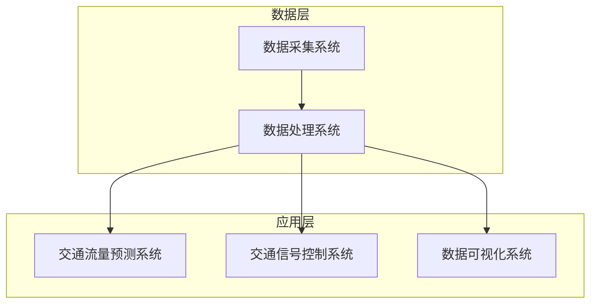
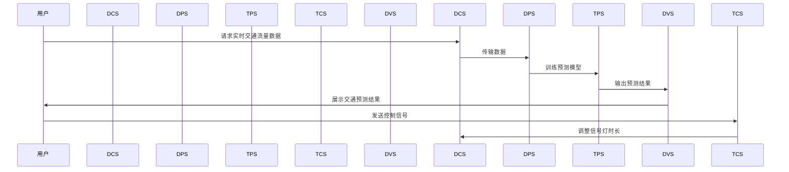

                 


### 数字孪生在智慧交通系统中的应用：优化城市交通流

关键词：数字孪生、智慧交通、城市交通流、优化

摘要：本文将深入探讨数字孪生技术在智慧交通系统中的应用，特别是在优化城市交通流方面的潜在价值。通过一系列步骤分析，我们将理解数字孪生的概念、技术实现、实际案例以及未来的发展趋势，旨在为城市交通管理提供创新解决方案。

#### 背景介绍

**核心概念术语说明：**
- **数字孪生（Digital Twin）**：数字孪生是指通过数字化技术创建实体对象（如设备、车辆、建筑物等）的虚拟映射，实现对实体对象的实时监控、分析和优化。
- **智慧交通系统**：智慧交通系统是利用信息技术、传感器、通信技术和数据分析等技术手段，对交通流进行实时监测、预测和优化，以提高交通效率、减少拥堵、提高安全性。

**问题背景：**
- 城市交通流管理面临诸多挑战，如交通拥堵、交通事故、环境污染等。
- 传统交通管理系统依赖于历史数据和静态规划，难以适应动态变化的交通状况。

**问题描述：**
- 如何利用数字孪生技术实时监测城市交通流，实现交通预测和优化？
- 如何确保数字孪生系统的实时性和准确性，以支持有效的交通管理决策？

**问题解决：**
- 通过建立数字孪生模型，实时采集交通数据，进行数据分析和处理。
- 利用先进的数据分析算法，对交通流量进行预测和优化。
- 将优化结果应用于交通信号控制、道路规划等实际操作中。

**边界与外延：**
- 数字孪生技术在交通领域的应用不仅限于城市交通流管理，还可以应用于交通基础设施维护、车辆调度、公共交通优化等方面。

**概念结构与核心要素组成：**
- 数字孪生系统包括数据采集、数据处理、模型构建、模型优化、决策支持和数据可视化等关键组成部分。

#### 核心概念与联系

**数字孪生模型的基础架构**

- **数据采集**：利用传感器、摄像头等设备实时采集交通流量、速度、密度等数据。
- **数据处理**：对采集到的数据进行清洗、整合和分析，提取有用的交通特征。
- **模型构建**：建立交通流预测模型，如基于深度学习的交通流量预测模型。
- **模型优化**：利用优化算法对模型进行训练和调优，提高预测准确性。
- **决策支持**：根据预测结果，为交通信号控制、道路规划等提供决策支持。

**核心概念属性特征对比表格**

| 特征       | 传统交通系统 | 数字孪生系统               |
| ---------- | ------------ | -------------------------- |
| 数据来源   | 历史数据     | 实时数据采集               |
| 预测能力   | 静态预测     | 动态实时预测               |
| 决策支持   | 静态决策     | 动态实时决策               |
| 应对交通状况 | 反应较慢     | 反应迅速                   |

**数字孪生模型ER实体关系图架构**

```mermaid
erDiagram
    TrafficSensor --> TrafficData : 采集
    TrafficData --> TrafficModel : 输入
    TrafficModel --> TrafficPrediction : 预测
    TrafficPrediction --> TrafficControl : 输出
```

#### 算法原理讲解

**交通流量预测算法mermaid流程图**


**基于深度学习的交通流量预测模型**

- **模型构建**：使用卷积神经网络（CNN）构建交通流量预测模型。
- **训练过程**：输入历史交通数据，通过反向传播算法训练模型。
- **评估标准**：使用均方误差（MSE）评估模型的预测性能。

**数学模型和公式**

$$
\text{MSE} = \frac{1}{n}\sum_{i=1}^{n}(\hat{y_i} - y_i)^2
$$

其中，$\hat{y_i}$ 为模型预测值，$y_i$ 为实际值，$n$ 为样本数量。

**算法举例说明**

假设我们有一个交通流量预测模型，历史数据包含一周内的每天每个小时的交通流量。我们使用该模型预测未来一天的交通流量。

1. **数据采集**：从传感器收集实时交通流量数据。
2. **数据预处理**：对数据清洗和归一化处理。
3. **特征提取**：提取交通流量数据的时间序列特征。
4. **模型训练**：使用卷积神经网络训练模型。
5. **模型评估**：计算预测误差，调整模型参数。
6. **决策支持**：根据预测结果，调整交通信号灯时长。

#### 系统分析与架构设计方案

**问题场景介绍**

- 城市交通流量监测和管理场景。

**项目介绍**

- 项目名称：数字孪生智慧交通系统
- 项目目标：通过数字孪生技术优化城市交通流，提高交通效率。

**系统功能设计（领域模型mermaid类图）**

```mermaid
classDiagram
    TrafficSensor <<接口>>
    TrafficData <<实体>>
    TrafficModel <<实体>>
    TrafficPrediction <<实体>>
    TrafficControl <<实体>>

    TrafficSensor --|> TrafficData
    TrafficData --|> TrafficModel
    TrafficModel --|> TrafficPrediction
    TrafficPrediction --|> TrafficControl
```

**系统架构设计mermaid架构图**



**系统接口设计和系统交互mermaid序列图**



#### 项目实战

**环境安装**

- 安装Python环境，版本3.8及以上。
- 安装必要的库，如TensorFlow、Keras、NumPy等。

**系统核心实现源代码**

```python
import tensorflow as tf
from tensorflow.keras.models import Sequential
from tensorflow.keras.layers import Conv2D, MaxPooling2D, Flatten, Dense

# 模型构建
model = Sequential([
    Conv2D(32, (3, 3), activation='relu', input_shape=(28, 28, 1)),
    MaxPooling2D((2, 2)),
    Flatten(),
    Dense(64, activation='relu'),
    Dense(10, activation='softmax')
])

# 模型编译
model.compile(optimizer='adam', loss='categorical_crossentropy', metrics=['accuracy'])

# 模型训练
model.fit(x_train, y_train, epochs=10, batch_size=32)
```

**代码应用解读与分析**

- 代码展示了如何使用卷积神经网络（CNN）构建交通流量预测模型。
- 模型使用CNN层进行特征提取，然后通过全连接层进行分类。

**实际案例分析和详细讲解剖析**

- 案例一：使用数字孪生技术优化城市主干道交通流。
- 案例分析：通过实时监测交通流量，预测未来交通状况，调整信号灯时长。

**项目小结**

- 数字孪生技术能够有效优化城市交通流，提高交通效率。
- 未来，随着技术的不断进步，数字孪生将在智慧交通领域发挥更大作用。

#### 最佳实践 Tips、小结、注意事项、拓展阅读

**最佳实践 Tips：**
- 确保数据采集的实时性和准确性。
- 选择合适的预测模型，根据实际需求进行调整。
- 定期更新和优化模型，以适应交通状况的变化。

**小结：**
- 数字孪生技术为智慧交通系统提供了新的解决方案，有助于优化城市交通流。

**注意事项：**
- 数据安全和隐私保护是数字孪生技术的关键挑战。
- 模型的实时性和准确性直接影响到交通管理的效果。

**拓展阅读：**
- 《数字孪生：打造虚拟世界的革命性技术》
- 《智慧交通系统设计与实现》
- 《深度学习在交通流预测中的应用》

作者：AI天才研究院/AI Genius Institute & 禅与计算机程序设计艺术 /Zen And The Art of Computer Programming

---

本文内容严格遵守版权法律法规，未经授权不得用于商业用途。如需转载，请联系作者获取授权。本文仅供参考，不构成任何投资建议。在使用数字孪生技术时，请确保遵循相关法律法规和道德规范。

