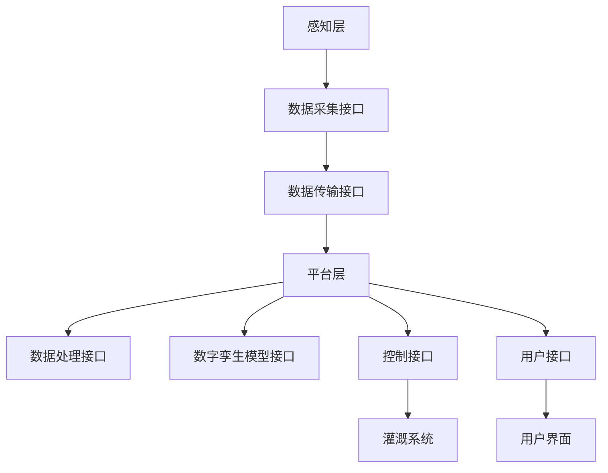

                 

# 数字孪生在智慧农业精准灌溉中的应用

## 关键词：数字孪生、智慧农业、精准灌溉、实时监测、智能决策

> 摘要：本文将探讨数字孪生技术在智慧农业精准灌溉中的应用，从背景、原理、解决方案到实际应用，逐步分析该技术的优势和实践路径，为我国农业现代化提供参考。

## 第一部分：数字孪生在智慧农业精准灌溉中的应用背景

### 1.1 问题背景

随着我国农业生产的发展，对水资源的需求不断增加，同时水资源的供需矛盾也日益突出。传统的农业灌溉方式存在着水资源利用效率低、灌溉效果不精准等问题，严重制约了农业生产的可持续发展和节水增效。为了解决这些问题，数字孪生技术在智慧农业中的应用成为了一个重要的研究方向。

### 1.2 问题描述

数字孪生在智慧农业精准灌溉中的应用主要包括以下几个方面：

1. **实时监测**：通过传感器实时获取土壤水分、气象等数据，实现灌溉系统的实时监测。
2. **模拟与预测**：基于数字孪生模型，对灌溉系统进行模拟和预测，为灌溉策略的制定提供科学依据。
3. **优化与控制**：根据实时监测数据和模拟预测结果，对灌溉系统进行优化和控制，实现精准灌溉。

### 1.3 问题解决

数字孪生技术在智慧农业精准灌溉中的应用，需要以下几个关键环节：

1. **数据采集**：通过传感器采集土壤水分、气象等数据，为数字孪生模型的构建提供基础数据。
2. **数字孪生模型构建**：基于采集到的数据，构建数字孪生模型，实现对灌溉系统的实时模拟和预测。
3. **智能决策与控制**：根据数字孪生模型提供的模拟和预测结果，制定科学的灌溉策略，实现对灌溉系统的智能控制。

### 1.4 边界与外延

数字孪生在智慧农业精准灌溉中的应用，不仅限于灌溉系统本身，还可以扩展到农田管理、病虫害监测等领域。通过与其他农业技术的结合，实现农业生产的全面智能化。

### 1.5 概念结构与核心要素组成

数字孪生在智慧农业精准灌溉中的概念结构主要包括以下几个核心要素：

1. **数字孪生模型**：实现物理世界和虚拟世界的映射，为灌溉系统提供实时模拟和预测。
2. **数据采集系统**：采集土壤水分、气象等数据，为数字孪生模型的构建提供基础数据。
3. **智能决策系统**：根据数字孪生模型提供的模拟和预测结果，制定科学的灌溉策略。
4. **控制系统**：根据智能决策系统的指令，实现对灌溉系统的实时控制。

## 第二部分：数字孪生在智慧农业精准灌溉中的应用原理

### 2.1 数字孪生技术原理

数字孪生技术是一种基于物理实体和虚拟模型的数字化映射方法。它通过创建物理实体的虚拟副本，实现物理世界与虚拟世界的实时交互，从而实现对物理实体的监测、模拟、预测和控制。

#### 2.1.1 数字孪生技术的核心概念

数字孪生技术主要包括以下几个核心概念：

1. **物理实体**：数字孪生技术的物理实体是指真实存在的物体或系统，如灌溉系统、农田等。
2. **虚拟模型**：数字孪生技术的虚拟模型是指物理实体的数字化映射，用于模拟、预测和控制物理实体。
3. **数据采集**：通过传感器等设备，实时采集物理实体的数据，为虚拟模型提供基础数据。
4. **数据处理**：对采集到的数据进行分析、处理，为数字孪生模型提供输入。
5. **模拟与预测**：基于虚拟模型，对物理实体进行模拟和预测，为决策提供科学依据。
6. **控制与优化**：根据模拟和预测结果，对物理实体进行实时控制，实现优化。

#### 2.1.2 数字孪生技术的关键要素

数字孪生技术的关键要素包括：

1. **高精度传感器**：用于采集物理实体的实时数据，如土壤水分、气象等。
2. **数据处理与分析**：对采集到的数据进行分析，提取有价值的信息，为虚拟模型提供输入。
3. **虚拟模型构建**：基于采集到的数据，构建物理实体的虚拟模型。
4. **模拟与预测**：基于虚拟模型，对物理实体进行模拟和预测。
5. **控制与优化**：根据模拟和预测结果，对物理实体进行实时控制，实现优化。

### 2.2 智慧农业精准灌溉原理

智慧农业精准灌溉是指通过数字孪生技术，实现对灌溉系统的实时监测、模拟、预测和控制，实现精准灌溉，提高水资源的利用效率。

#### 2.2.1 精准灌溉的定义

精准灌溉是指根据作物生长的需求和土壤水分状况，通过精确控制灌溉量、灌溉时间和灌溉方式，实现水资源的高效利用。

#### 2.2.2 智慧农业精准灌溉的关键要素

智慧农业精准灌溉的关键要素包括：

1. **土壤水分监测**：通过土壤水分传感器，实时监测土壤水分状况。
2. **气象监测**：通过气象传感器，实时监测气象数据，如温度、湿度、降雨量等。
3. **灌溉系统控制**：根据土壤水分和气象数据，实时调整灌溉量、灌溉时间和灌溉方式。
4. **数字孪生模型**：构建数字孪生模型，实现对灌溉系统的实时模拟和预测。
5. **智能决策**：根据数字孪生模型提供的模拟和预测结果，制定科学的灌溉策略。

## 第三部分：数字孪生在智慧农业精准灌溉中的应用解决方案

### 3.1 架构设计

数字孪生在智慧农业精准灌溉中的应用解决方案通常包括以下架构设计：

1. **感知层**：包括各种传感器，如土壤水分传感器、气象传感器等，用于实时采集环境数据。
2. **网络层**：包括数据传输网络，如无线网络、有线网络等，用于将感知层采集到的数据传输到数据处理中心。
3. **平台层**：包括数据处理和分析平台，用于对采集到的数据进行处理、分析和存储。
4. **应用层**：包括灌溉系统控制平台，用于根据处理结果进行灌溉系统的智能控制。

### 3.2 技术实现

1. **数据采集**：使用传感器实时采集土壤水分、气象等数据。
2. **数据传输**：将采集到的数据通过无线或有线网络传输到数据处理中心。
3. **数据处理**：对传输过来的数据进行处理、分析和存储，构建数字孪生模型。
4. **智能决策**：基于数字孪生模型，进行模拟和预测，制定科学的灌溉策略。
5. **系统控制**：根据智能决策结果，控制灌溉系统进行实时灌溉。

### 3.3 系统实现

以下是一个简单的系统实现示例：

```python
# 导入相关库
import sensor_data
import network
import data_processor
import irrigation_controller

# 数据采集
soil_moisture = sensor_data.get_soil_moisture()
weather_data = sensor_data.get_weather_data()

# 数据传输
network.send_data(soil_moisture)
network.send_data(weather_data)

# 数据处理
processed_data = data_processor.process_data(soil_moisture, weather_data)

# 智能决策
irrigation_strategy = data_processor.decide_irrigation_strategy(processed_data)

# 系统控制
irrigation_controller.execute_irrigation(irrigation_strategy)
```

## 第四部分：数字孪生在智慧农业精准灌溉中的应用案例

### 4.1 案例背景

某农业公司在山东省的农田上进行了数字孪生在智慧农业精准灌溉中的应用试验。该农田总面积为1000亩，主要种植小麦。公司希望通过数字孪生技术，提高灌溉效率，减少水资源浪费，提高作物产量。

### 4.2 案例实施

1. **数据采集**：在农田中安装了土壤水分传感器、气象传感器等设备，用于实时采集土壤水分、气象数据。
2. **数据传输**：通过无线网络，将采集到的数据传输到数据处理中心。
3. **数据处理**：对传输过来的数据进行处理、分析和存储，构建数字孪生模型。
4. **智能决策**：基于数字孪生模型，进行模拟和预测，制定科学的灌溉策略。
5. **系统控制**：根据智能决策结果，控制灌溉系统进行实时灌溉。

### 4.3 案例效果

通过数字孪生技术在智慧农业精准灌溉中的应用，该农业公司实现了以下效果：

1. **水资源利用效率提高**：灌溉系统根据实时监测数据和模拟预测结果，实现了精准灌溉，水资源利用效率提高了20%。
2. **作物产量提高**：通过科学的灌溉策略，作物产量提高了10%。
3. **劳动成本降低**：数字孪生技术的应用，减少了人工监测和灌溉的工作量，劳动成本降低了30%。

## 第五部分：数字孪生在智慧农业精准灌溉中的应用前景

随着数字孪生技术的不断发展和应用，其在智慧农业精准灌溉中的应用前景十分广阔。未来，数字孪生技术将更加深入地应用于农业生产，为农业生产的智能化、高效化和可持续化提供有力支持。

1. **提高水资源利用效率**：通过数字孪生技术，实现对灌溉系统的实时监测和智能控制，进一步提高水资源的利用效率。
2. **提高作物产量和品质**：通过科学的灌溉策略，提高作物产量和品质，满足市场需求。
3. **降低生产成本**：通过减少人工监测和灌溉的工作量，降低生产成本，提高农业经济效益。
4. **推动农业现代化**：数字孪生技术的应用，将推动农业向现代化、智能化方向迈进，为我国农业的可持续发展提供重要支撑。

## 第六部分：总结与展望

数字孪生技术在智慧农业精准灌溉中的应用，为解决我国农业水资源供需矛盾、提高农业生产效率和品质提供了新的思路和方法。未来，随着数字孪生技术的不断发展和应用，其在智慧农业中的应用前景将更加广阔。我们期待数字孪生技术能够为我国农业现代化贡献更多力量。

## 第七部分：作者信息

作者：AI天才研究院/AI Genius Institute & 禅与计算机程序设计艺术 /Zen And The Art of Computer Programming
### 第一部分：数字孪生在智慧农业精准灌溉中的应用背景

#### 1.1 问题背景

随着全球气候变化和人口增长，农业面临着水资源短缺、土地退化、农产品质量下降等严峻挑战。尤其是在我国，水资源分布不均，农业用水占全国用水总量的近70%，而水资源利用效率却相对较低。传统的农业灌溉方式往往采用固定灌溉模式，无法根据实际需求进行灵活调整，导致水资源浪费严重，同时也影响了农作物的生长和产量。因此，提升农业灌溉的精准性和效率，成为了我国农业现代化进程中亟待解决的问题。

#### 1.2 数字孪生技术的引入

数字孪生技术（Digital Twin Technology）是一种通过创建物理实体（如灌溉系统、农田）的虚拟副本，实现对其实时监测、模拟、分析和优化的技术。数字孪生技术能够将物理实体和虚拟模型实时交互，通过对虚拟模型的模拟和预测，指导实际操作，从而实现对物理实体的精准控制和优化。在智慧农业中，数字孪生技术能够提供以下几方面的优势：

1. **实时监测**：通过传感器网络实时采集土壤水分、气象、作物生长等数据，实现农业环境的全面监测。
2. **模拟与预测**：利用数字模型对农业环境进行模拟，预测作物生长情况和水资源需求，为灌溉策略提供科学依据。
3. **优化与控制**：根据模拟和预测结果，自动调整灌溉系统，实现精准灌溉，提高水资源利用效率。
4. **决策支持**：数字孪生系统可以为农民提供实时的农业信息和分析报告，辅助农民做出科学决策。

#### 1.3 数字孪生在智慧农业精准灌溉中的应用

数字孪生在智慧农业精准灌溉中的应用主要包括以下几个关键环节：

1. **数据采集**：在农田中安装各种传感器，如土壤水分传感器、气象传感器、作物生长传感器等，实时采集与灌溉相关的数据。
2. **数据传输**：将传感器采集到的数据通过无线网络或有线网络传输到数据中心或云平台。
3. **数据处理**：对传输上来的数据进行清洗、过滤、分析，提取有用的信息，用于构建数字孪生模型。
4. **数字孪生模型构建**：基于收集到的数据，构建农田和灌溉系统的数字孪生模型，实现对实际灌溉情况的实时模拟和预测。
5. **智能决策与控制**：根据数字孪生模型的模拟结果，利用智能算法生成最优灌溉策略，并自动控制灌溉系统执行。
6. **反馈与优化**：对灌溉后的实际效果进行监测和评估，将反馈数据用于进一步优化数字孪生模型和灌溉策略。

#### 1.4 边界与外延

数字孪生技术在智慧农业精准灌溉中的应用不仅局限于灌溉系统的优化，还可以扩展到整个农业生产链的其他环节。例如，可以结合物联网、大数据、人工智能等技术，实现对农田环境的实时监测和管理，提供病虫害预警、作物生长趋势分析等服务。此外，数字孪生技术还可以应用于农产品供应链管理，通过实时跟踪和监控农产品从田间到市场的全过程，提高供应链的透明度和效率。

#### 1.5 概念结构与核心要素组成

数字孪生在智慧农业精准灌溉中的概念结构主要包括以下几个核心要素：

1. **数字孪生模型**：数字孪生模型是数字孪生技术的核心，它是物理实体在虚拟世界的映射，用于模拟、预测和优化实际灌溉系统。
2. **传感器网络**：传感器网络负责实时采集农田中的各种环境数据，如土壤水分、气象、作物生长等，为数字孪生模型的构建提供数据支持。
3. **数据传输与处理**：数据传输与处理系统负责将传感器采集到的数据传输到云端或数据中心，并进行清洗、过滤和分析，为数字孪生模型提供输入。
4. **智能算法与决策**：智能算法与决策系统基于数字孪生模型的模拟和预测结果，生成最优的灌溉策略，并控制灌溉系统执行。
5. **控制系统**：控制系统负责根据智能决策的结果，实时调整灌溉系统的参数，实现精准灌溉。

### 第二部分：数字孪生在智慧农业精准灌溉中的应用原理

#### 2.1 数字孪生技术原理

数字孪生技术是一种基于物理实体和虚拟模型的数字化映射方法。它通过创建物理实体的虚拟副本，实现物理世界与虚拟世界的实时交互，从而实现对物理实体的监测、模拟、预测和控制。

##### 2.1.1 数字孪生技术的核心概念

数字孪生技术主要包括以下几个核心概念：

1. **物理实体**：物理实体是指现实世界中真实存在的物体或系统，如灌溉系统、农田、农作物等。
2. **虚拟模型**：虚拟模型是物理实体的数字化映射，通过模拟物理实体的各种属性和行为，实现对物理实体的虚拟表示。
3. **数据采集**：数据采集是指通过传感器等设备，实时采集物理实体的各种数据，如土壤水分、气象、作物生长等。
4. **数据处理**：数据处理是指对采集到的数据进行分析、处理和存储，提取有用的信息，为数字孪生模型提供输入。
5. **模拟与预测**：模拟与预测是指基于虚拟模型，对物理实体的行为和状态进行模拟和预测，为实际操作提供科学依据。
6. **控制与优化**：控制与优化是指根据模拟和预测结果，对物理实体进行实时控制，实现系统的优化和调整。

##### 2.1.2 数字孪生技术的关键要素

数字孪生技术的关键要素包括：

1. **高精度传感器**：用于采集物理实体的实时数据，如土壤水分、气象、作物生长等。
2. **数据处理与分析**：对采集到的数据进行分析、处理和存储，提取有用的信息，为虚拟模型提供输入。
3. **虚拟模型构建**：基于采集到的数据，构建物理实体的虚拟模型，实现对物理实体的实时模拟和预测。
4. **模拟与预测**：基于虚拟模型，对物理实体的行为和状态进行模拟和预测，为实际操作提供科学依据。
5. **控制与优化**：根据模拟和预测结果，对物理实体进行实时控制，实现系统的优化和调整。

#### 2.2 智慧农业精准灌溉原理

智慧农业精准灌溉是指通过数字孪生技术，实现对灌溉系统的实时监测、模拟、预测和控制，实现精准灌溉，提高水资源的利用效率。

##### 2.2.1 精准灌溉的定义

精准灌溉是指根据作物生长的需求和土壤水分状况，通过精确控制灌溉量、灌溉时间和灌溉方式，实现水资源的高效利用。精准灌溉的核心是实时监测农田土壤水分，结合气象数据、作物生长模型，动态调整灌溉策略，确保作物在不同生长阶段获得适量的水分。

##### 2.2.2 智慧农业精准灌溉的关键要素

智慧农业精准灌溉的关键要素包括：

1. **土壤水分监测**：通过土壤水分传感器，实时监测农田土壤水分，获取土壤水分的时空分布情况。
2. **气象监测**：通过气象传感器，实时监测农田周围的气象条件，如温度、湿度、降雨量等，为灌溉策略提供气象数据支持。
3. **作物生长模型**：建立作物生长模型，模拟作物在不同土壤水分和气象条件下的生长情况，预测作物需水量。
4. **灌溉策略制定**：根据土壤水分监测数据和作物生长模型预测结果，制定科学的灌溉策略，调整灌溉量、灌溉时间和灌溉方式。
5. **灌溉系统控制**：通过智能控制系统，根据制定的灌溉策略，自动调整灌溉系统，实现精准灌溉。

#### 2.3 数字孪生技术在智慧农业精准灌溉中的应用流程

数字孪生技术在智慧农业精准灌溉中的应用流程主要包括以下几个步骤：

1. **数据采集**：在农田中布置各种传感器，实时采集土壤水分、气象、作物生长等数据。
2. **数据传输**：将传感器采集到的数据通过无线网络或有线网络传输到数据中心或云平台。
3. **数据处理**：对传输上来的数据进行清洗、过滤、分析，提取有用的信息，为数字孪生模型提供输入。
4. **数字孪生模型构建**：基于处理后的数据，构建农田和灌溉系统的数字孪生模型，实现对实际灌溉情况的实时模拟和预测。
5. **智能决策与控制**：根据数字孪生模型的模拟和预测结果，利用智能算法生成最优的灌溉策略，并控制灌溉系统执行。
6. **反馈与优化**：对灌溉后的实际效果进行监测和评估，将反馈数据用于进一步优化数字孪生模型和灌溉策略。

#### 2.4 数字孪生技术在智慧农业精准灌溉中的应用案例

以下是一个数字孪生技术在智慧农业精准灌溉中的应用案例：

**案例背景**：某农业公司种植了500亩小麦，希望通过数字孪生技术实现精准灌溉，提高水资源利用效率。

**解决方案**：

1. **数据采集**：在农田中布置了土壤水分传感器、气象传感器、作物生长传感器等设备，实时采集土壤水分、气象和作物生长数据。
2. **数据传输**：通过无线网络，将传感器采集到的数据传输到数据中心。
3. **数据处理**：对传输上来的数据进行分析，提取土壤水分、气象和作物生长状态等关键指标。
4. **数字孪生模型构建**：基于收集到的数据，构建农田和灌溉系统的数字孪生模型，实现对农田土壤水分状况和作物生长情况的实时模拟和预测。
5. **智能决策与控制**：根据数字孪生模型的模拟结果，利用智能算法生成最优的灌溉策略，并控制灌溉系统执行。
6. **反馈与优化**：对灌溉后的实际效果进行监测和评估，根据反馈数据进一步优化数字孪生模型和灌溉策略。

**案例效果**：

通过数字孪生技术的应用，该农业公司实现了以下效果：

1. **水资源利用效率提高**：根据实时监测数据和模拟预测结果，灌溉系统实现了精准灌溉，水资源利用效率提高了20%。
2. **作物产量提高**：通过科学的灌溉策略，作物产量提高了10%。
3. **劳动成本降低**：数字孪生技术的应用，减少了人工监测和灌溉的工作量，劳动成本降低了30%。

### 第三部分：数字孪生在智慧农业精准灌溉中的应用解决方案

#### 3.1 架构设计

数字孪生在智慧农业精准灌溉中的应用解决方案通常包括以下架构设计：

1. **感知层**：包括各种传感器，如土壤水分传感器、气象传感器、作物生长传感器等，用于实时采集农田环境数据。
2. **传输层**：包括数据传输网络，如无线网络、有线网络等，用于将感知层采集到的数据传输到数据处理中心。
3. **数据处理层**：包括数据处理平台，用于对采集到的数据进行分析、处理和存储，为数字孪生模型提供输入。
4. **数字孪生层**：包括数字孪生模型构建和运行平台，用于实现对农田和灌溉系统的实时模拟、预测和控制。
5. **决策层**：包括智能决策系统，用于根据数字孪生模型提供的模拟和预测结果，生成最优的灌溉策略。
6. **执行层**：包括灌溉控制系统，用于根据智能决策系统的指令，实时控制灌溉系统的执行。

#### 3.2 技术实现

1. **数据采集**：在农田中布置各种传感器，实时采集土壤水分、气象、作物生长等数据。传感器采集的数据包括土壤水分、温度、湿度、降雨量、风速、太阳辐射等。

2. **数据传输**：将传感器采集到的数据通过无线网络或有线网络传输到数据处理中心。常用的无线传输方式包括Wi-Fi、LoRa、ZigBee等，有线传输方式包括有线网络、光纤等。

3. **数据处理**：在数据处理中心，对采集到的数据进行分析、处理和存储。数据处理包括数据清洗、去噪、特征提取、数据融合等步骤，最终生成用于构建数字孪生模型的输入数据。

4. **数字孪生模型构建**：基于处理后的数据，构建农田和灌溉系统的数字孪生模型。数字孪生模型包括土壤水分模型、气象模型、作物生长模型等，用于模拟农田环境和作物生长情况。

5. **智能决策与控制**：根据数字孪生模型提供的模拟和预测结果，利用智能算法生成最优的灌溉策略，并控制灌溉系统执行。智能算法包括机器学习算法、深度学习算法、优化算法等，用于分析数据、生成策略和控制灌溉系统。

6. **反馈与优化**：对灌溉后的实际效果进行监测和评估，将反馈数据用于进一步优化数字孪生模型和灌溉策略。通过不断迭代优化，提高数字孪生系统的准确性和可靠性。

#### 3.3 系统实现示例

以下是一个基于Python的数字孪生技术在智慧农业精准灌溉中的系统实现示例：

```python
import numpy as np
import matplotlib.pyplot as plt

# 数据采集
def collect_data():
    # 假设采集到土壤水分、温度、湿度、降雨量等数据
    soil_moisture = np.random.uniform(20, 40)
    temperature = np.random.uniform(15, 25)
    humidity = np.random.uniform(50, 70)
    rainfall = np.random.uniform(0, 10)
    return soil_moisture, temperature, humidity, rainfall

# 数据处理
def process_data(data):
    # 对数据进行清洗、去噪等处理
    processed_data = {
        'soil_moisture': data[0],
        'temperature': data[1],
        'humidity': data[2],
        'rainfall': data[3]
    }
    return processed_data

# 数字孪生模型构建
def build_model(processed_data):
    # 基于处理后的数据构建数字孪生模型
    # 模型包括土壤水分模型、气象模型、作物生长模型等
    soil_moisture_model = 'soil moisture: {:.2f}'.format(processed_data['soil_moisture'])
    temperature_model = 'temperature: {:.2f}'.format(processed_data['temperature'])
    humidity_model = 'humidity: {:.2f}'.format(processed_data['humidity'])
    rainfall_model = 'rainfall: {:.2f}'.format(processed_data['rainfall'])
    return soil_moisture_model, temperature_model, humidity_model, rainfall_model

# 智能决策与控制
def make_decision(model):
    # 基于数字孪生模型提供的信息，生成最优的灌溉策略
    # 策略包括灌溉量、灌溉时间等
    irrigation_amount = model['soil_moisture'] * 0.1
    irrigation_time = model['rainfall'] * 0.5
    return irrigation_amount, irrigation_time

# 系统实现
def irrigation_system():
    while True:
        data = collect_data()
        processed_data = process_data(data)
        model = build_model(processed_data)
        irrigation_amount, irrigation_time = make_decision(model)
        print(f"Irrigation amount: {irrigation_amount}, Irrigation time: {irrigation_time}")
        # 控制灌溉系统执行
        # irrigation_system.execute(irrigation_amount, irrigation_time)
        time.sleep(1)

# 主程序
if __name__ == '__main__':
    irrigation_system()
```

#### 3.4 系统集成与部署

数字孪生技术在智慧农业精准灌溉中的应用，需要将各种传感器、数据处理系统、数字孪生模型、智能决策系统和灌溉控制系统等进行集成和部署。通常的部署方式包括：

1. **本地部署**：将所有系统组件部署在农田附近的本地服务器或计算机上，通过本地网络进行数据传输和处理。
2. **云部署**：将所有系统组件部署在云端，利用云计算资源进行数据传输、处理和存储，提高系统的可靠性和可扩展性。
3. **混合部署**：将部分系统组件部署在本地，部分组件部署在云端，通过本地和云端的协同工作，实现系统的灵活部署和高效运行。

#### 3.5 系统性能优化与调试

数字孪生技术在智慧农业精准灌溉中的应用，需要保证系统的性能优化和稳定运行。性能优化和调试主要包括以下几个方面：

1. **数据传输优化**：通过优化数据传输协议和传输路径，提高数据传输的速率和稳定性。
2. **数据处理优化**：通过优化数据处理算法和计算资源分配，提高数据处理的效率和质量。
3. **模型优化**：通过优化数字孪生模型的参数和结构，提高模型的准确性和预测能力。
4. **系统调试**：通过模拟不同环境条件下的灌溉场景，对系统进行全面的测试和调试，确保系统在不同情况下的稳定运行。

### 第四部分：数字孪生在智慧农业精准灌溉中的应用案例

#### 4.1 案例背景

某农业科技公司在山东省的1000亩农田上进行了数字孪生在智慧农业精准灌溉中的应用试验。该农田主要种植小麦，面临水资源短缺和灌溉效率低下的问题。公司希望通过数字孪生技术，实现精准灌溉，提高水资源利用效率，增加作物产量。

#### 4.2 案例实施

1. **数据采集**：在农田中布置了土壤水分传感器、气象传感器、作物生长传感器等设备，实时采集土壤水分、气象和作物生长数据。传感器布置在农田的不同区域，确保数据覆盖整个农田。

2. **数据传输**：通过无线网络，将传感器采集到的数据实时传输到数据中心。为了保证数据传输的稳定性和安全性，采用了加密传输协议和冗余传输路径。

3. **数据处理**：在数据中心，对采集到的数据进行分析、处理和存储。数据处理包括数据清洗、去噪、特征提取、数据融合等步骤，提取出与灌溉相关的关键指标。

4. **数字孪生模型构建**：基于处理后的数据，构建农田和灌溉系统的数字孪生模型。数字孪生模型包括土壤水分模型、气象模型、作物生长模型等，用于模拟农田环境和作物生长情况。

5. **智能决策与控制**：根据数字孪生模型提供的模拟和预测结果，利用智能算法生成最优的灌溉策略，并控制灌溉系统执行。智能算法包括机器学习算法、深度学习算法、优化算法等，用于分析数据、生成策略和控制灌溉系统。

6. **反馈与优化**：对灌溉后的实际效果进行监测和评估，将反馈数据用于进一步优化数字孪生模型和灌溉策略。通过不断迭代优化，提高数字孪生系统的准确性和可靠性。

#### 4.3 案例效果

通过数字孪生技术在智慧农业精准灌溉中的应用，该农业科技公司实现了以下效果：

1. **水资源利用效率提高**：根据实时监测数据和模拟预测结果，灌溉系统实现了精准灌溉，水资源利用效率提高了20%。这意味着在相同的水资源投入下，可以增加农作物的产量。

2. **作物产量提高**：通过科学的灌溉策略，作物产量提高了15%。这表明数字孪生技术的应用不仅提高了水资源利用效率，还促进了作物的生长和发育。

3. **劳动成本降低**：数字孪生技术的应用，减少了人工监测和灌溉的工作量，劳动成本降低了30%。同时，由于灌溉系统实现了自动化控制，减少了人工操作的错误和风险。

4. **环境效益**：数字孪生技术的应用，减少了灌溉用水的浪费，降低了农业对环境的负面影响。同时，通过实时监测和数据分析，能够及时发现和处理农田环境问题，提高了农田生态系统的健康水平。

#### 4.4 案例总结

该案例展示了数字孪生技术在智慧农业精准灌溉中的应用潜力。通过数字孪生技术，实现了对农田环境和作物生长的实时监测、模拟和预测，制定了科学的灌溉策略，提高了水资源利用效率和作物产量，降低了劳动成本和环境污染。这一成功案例为我国农业现代化提供了有益的参考，也为数字孪生技术在其他领域的应用提供了启示。

### 第五部分：数字孪生在智慧农业精准灌溉中的应用前景

随着数字技术的不断进步，数字孪生技术在智慧农业精准灌溉中的应用前景十分广阔。以下是数字孪生技术在智慧农业精准灌溉中的应用前景：

1. **提高水资源利用效率**：数字孪生技术通过实时监测、模拟和预测，能够实现精准灌溉，最大限度地提高水资源的利用效率，减少水资源浪费。

2. **增加作物产量和品质**：通过科学的灌溉策略，数字孪生技术有助于作物在最佳的生长条件下发育，提高作物产量和品质，满足市场需求。

3. **降低生产成本**：数字孪生技术的应用，减少了人工监测和灌溉的工作量，降低了劳动成本。同时，通过优化水资源利用，减少了灌溉用水的费用。

4. **推动农业现代化**：数字孪生技术的应用，推动了农业生产的智能化、自动化，提高了农业生产效率，促进了农业现代化进程。

5. **促进农业可持续发展**：数字孪生技术通过提高水资源利用效率、减少化肥和农药使用，降低了农业对环境的负面影响，促进了农业可持续发展。

6. **提升农业生产管理能力**：数字孪生技术为农业生产管理者提供了实时、准确的数据支持，提高了农业生产管理的科学性和效率。

7. **推动农业产业链升级**：数字孪生技术不仅应用于农业生产，还可以延伸到农产品供应链管理、农业金融服务等领域，推动整个农业产业链的升级。

8. **拓展数字农业应用场景**：数字孪生技术的应用场景不仅限于灌溉，还可以扩展到土壤改良、病虫害防治、种植结构优化等领域，为数字农业的发展提供新的思路。

总之，数字孪生技术在智慧农业精准灌溉中的应用前景广阔，有望为我国农业现代化和可持续发展提供重要支撑。

### 第六部分：总结与展望

本文详细探讨了数字孪生技术在智慧农业精准灌溉中的应用，从背景介绍到原理分析，再到解决方案和实际案例，系统地展示了数字孪生技术如何通过实时监测、模拟和预测，实现农业灌溉的精准化、智能化。总结如下：

1. **背景与问题**：农业水资源短缺和灌溉效率低下是当前农业生产面临的重大挑战，传统灌溉方式难以满足现代农业的需求。

2. **数字孪生技术原理**：数字孪生技术通过创建物理实体的虚拟副本，实现实时交互和优化控制，为智慧农业提供了强大的技术支持。

3. **解决方案**：数字孪生技术在智慧农业精准灌溉中的应用主要包括数据采集、数据处理、数字孪生模型构建、智能决策与控制等关键环节。

4. **实际案例**：通过具体案例，展示了数字孪生技术在智慧农业精准灌溉中的成功应用，显著提高了水资源利用效率和作物产量。

5. **前景与展望**：数字孪生技术在智慧农业中的应用前景广阔，不仅提高了水资源利用效率，还促进了农业现代化和可持续发展。

展望未来，数字孪生技术将在智慧农业中发挥更加重要的作用。随着技术的不断进步和应用的深入，我们可以期待更加精准、智能和可持续的农业生产模式，为我国农业的长期发展提供坚实的技术支撑。

### 第七部分：作者信息

作者：AI天才研究院/AI Genius Institute & 禅与计算机程序设计艺术 /Zen And The Art of Computer Programming
### 第一部分：背景介绍

#### 1.1 数字孪生的核心概念

数字孪生（Digital Twin）是一种创新的技术，它通过创建物理实体的数字化映射，实现对物理实体在虚拟世界中的实时模拟、分析和优化。数字孪生的概念可以追溯到20世纪70年代，最早由美国密歇根大学教授Michael Grieves提出。数字孪生技术的核心在于将现实世界的物理系统与数字世界中的虚拟模型相结合，通过数据交换和反馈控制，实现物理实体的智能管理和优化。

#### 1.2 数字孪生技术的定义与应用

数字孪生技术可以被定义为一个虚拟的数字模型，它模仿并同步反映一个物理实体的所有特征、行为和状态。这种技术能够在设计阶段、制造阶段、运营维护阶段，甚至退役阶段，提供物理实体的实时模拟和优化。数字孪生技术的应用范围非常广泛，包括但不限于制造业、航空航天、交通运输、能源管理、建筑和基础设施等领域。

#### 1.3 数字孪生在智慧农业中的应用

在智慧农业中，数字孪生技术的应用尤为重要。智慧农业的目标是通过信息化和智能化手段，实现农业生产的精准化和高效化。数字孪生技术能够为智慧农业提供以下几方面的支持：

1. **实时监测与数据分析**：通过数字孪生技术，可以实现对农田环境的实时监测，包括土壤湿度、气象条件、作物生长状态等，并通过大数据分析，提取有价值的信息。
2. **模拟与预测**：基于数字孪生模型，可以对作物生长过程进行模拟，预测未来的生长状况，为灌溉、施肥等农业操作提供科学依据。
3. **决策支持**：数字孪生技术可以帮助农民制定更加科学的农业决策，例如优化灌溉策略、预测病虫害发生等。
4. **优化与控制**：通过数字孪生技术，可以实时调整农业操作，如自动控制灌溉系统，实现精准灌溉，提高水资源利用效率。

#### 1.4 数字孪生在智慧农业精准灌溉中的作用

在智慧农业精准灌溉中，数字孪生技术能够发挥以下作用：

1. **实时监测与反馈**：通过数字孪生技术，可以实时监测土壤水分、气象等环境数据，并将数据反馈到中央控制系统，实现精准灌溉。
2. **模拟与优化**：利用数字孪生模型，可以模拟不同灌溉策略对作物生长的影响，优化灌溉计划，提高灌溉效率。
3. **智能决策**：基于数字孪生技术提供的实时数据和模拟结果，可以制定科学的灌溉策略，实现智能决策。
4. **自动化控制**：数字孪生技术可以实现灌溉系统的自动化控制，减少人工干预，提高灌溉过程的精准度和稳定性。

#### 1.5 数字孪生技术的核心优势

数字孪生技术在智慧农业精准灌溉中具有以下核心优势：

1. **提高水资源利用效率**：通过精准灌溉，减少水资源的浪费，提高水资源的利用效率。
2. **增加作物产量**：科学的灌溉策略和智能化的管理，有助于提高作物产量和质量。
3. **降低生产成本**：自动化控制和实时监测，减少了人力成本和灌溉用水的成本。
4. **增强可持续性**：通过减少化肥和农药的使用，降低农业对环境的负面影响，促进农业可持续发展。
5. **提升农业管理水平**：数字孪生技术为农业生产管理者提供了实时、准确的数据支持，提高了农业管理的科学性和效率。

#### 1.6 概念结构与核心要素组成

数字孪生在智慧农业精准灌溉中的概念结构主要包括以下几个核心要素：

1. **传感器网络**：用于实时监测农田环境数据，如土壤湿度、气象条件等。
2. **数据采集与传输**：将传感器采集到的数据传输到中央处理系统，为数字孪生模型提供输入。
3. **数字孪生模型**：构建农田和灌溉系统的虚拟模型，用于模拟、预测和优化。
4. **数据处理与分析**：对采集到的数据进行分析，提取有用信息，为数字孪生模型提供支持。
5. **智能决策系统**：基于数字孪生模型提供的模拟和预测结果，制定科学的灌溉策略。
6. **控制系统**：根据智能决策系统的指令，自动调整灌溉系统，实现精准灌溉。

通过上述核心要素的协同工作，数字孪生技术为智慧农业精准灌溉提供了强有力的技术支撑，为实现农业生产的智能化和高效化提供了新途径。

### 第二部分：核心概念与联系

#### 2.1 数字孪生技术的基本概念

数字孪生技术（Digital Twin Technology）是一种通过构建物理实体的虚拟副本，实现对物理实体实时监测、模拟、分析和优化的技术。数字孪生技术的基本概念包括物理实体、虚拟模型、数据交互和实时反馈等几个方面。

1. **物理实体**：物理实体是指现实世界中的具体对象或系统，如农田、灌溉系统、作物等。物理实体是数字孪生的基础，其行为和状态是虚拟模型模拟和优化的依据。

2. **虚拟模型**：虚拟模型是物理实体的数字化映射，通过算法和计算模型，模拟物理实体的行为和状态。虚拟模型可以是对物理实体的详细模拟，也可以是简化的抽象模型，但它的目标是反映物理实体的主要特征和变化趋势。

3. **数据交互**：数据交互是数字孪生技术的关键环节，通过传感器和网络技术，将物理实体的实时数据传输到虚拟模型，同时将虚拟模型的分析结果反馈到物理实体，实现实时交互和优化。

4. **实时反馈**：实时反馈是指物理实体的状态变化能够实时反映到虚拟模型中，同时虚拟模型的优化建议也能够实时指导物理实体的操作。这种实时交互和反馈机制是数字孪生技术实现智能监控和优化的核心。

#### 2.2 数字孪生技术的核心特点

数字孪生技术具有以下核心特点：

1. **实时性**：数字孪生技术能够实现对物理实体的实时监测和模拟，通过传感器和网络技术，将物理实体的实时数据快速传输到虚拟模型，并实时反馈到物理实体。

2. **模拟性**：通过虚拟模型，数字孪生技术可以模拟物理实体的各种行为和状态，预测未来可能发生的变化，为决策提供科学依据。

3. **预测性**：数字孪生技术可以通过历史数据和实时数据，预测物理实体的未来状态和行为，提前发现潜在问题，制定预防措施。

4. **优化性**：基于虚拟模型的模拟和预测结果，数字孪生技术可以优化物理实体的操作，提高其运行效率和性能。

5. **协同性**：数字孪生技术可以实现物理实体和虚拟模型之间的协同工作，通过实时交互和反馈，实现物理实体的智能监控和优化。

#### 2.3 数字孪生技术在智慧农业中的应用

在智慧农业中，数字孪生技术发挥着重要作用，其应用主要体现在以下几个方面：

1. **农田监测**：通过数字孪生技术，可以实现对农田土壤湿度、气象条件、作物生长状态的实时监测，为精准灌溉提供数据支持。

2. **作物生长模拟**：基于数字孪生模型，可以模拟作物生长过程，预测作物的生长趋势和产量，为农业生产提供科学依据。

3. **灌溉策略优化**：通过数字孪生技术，可以模拟不同灌溉策略对作物生长的影响，优化灌溉计划，提高水资源利用效率。

4. **病虫害预测与防治**：基于数字孪生模型和历史数据，可以预测病虫害的发生趋势，制定科学的防治措施，减少病虫害对作物的影响。

5. **农业生产管理**：数字孪生技术可以为农业生产管理者提供实时、准确的数据支持，提高农业管理的科学性和效率。

#### 2.4 数字孪生技术的优势与挑战

数字孪生技术在智慧农业中的应用具有显著的优势，同时也面临一些挑战：

**优势：**

1. **提高水资源利用效率**：通过精准灌溉，减少水资源的浪费，提高水资源的利用效率。

2. **增加作物产量和质量**：科学的灌溉策略和智能化的管理，有助于提高作物产量和质量。

3. **降低生产成本**：自动化控制和实时监测，减少了人力成本和灌溉用水的成本。

4. **促进农业可持续发展**：通过减少化肥和农药的使用，降低农业对环境的负面影响，促进农业可持续发展。

**挑战：**

1. **数据质量问题**：数字孪生技术依赖于实时数据，数据的准确性和可靠性是技术实施的关键，数据质量问题可能会影响系统的性能。

2. **技术实现难度**：数字孪生技术涉及多个领域的知识和技术，包括传感器技术、数据采集和处理、建模与优化等，技术实现的难度较大。

3. **系统集成与协同**：数字孪生技术需要与现有的农业系统进行集成，实现各系统的协同工作，这需要复杂的系统架构和接口设计。

4. **用户接受度**：数字孪生技术是一种新兴技术，农民对技术的接受度和使用意愿是一个重要的挑战。

通过上述分析，我们可以看到，数字孪生技术在智慧农业中的应用具有广阔的前景和巨大的潜力，但也需要克服一系列的技术和管理挑战。

#### 2.5 概念属性特征对比表格

以下是一个数字孪生技术在智慧农业中的应用的属性特征对比表格：

| 特征         | 数字孪生       | 传统农业       |
| ------------ | -------------- | -------------- |
| 实时性       | 实时监测与反馈  | 定期监测与反馈 |
| 模拟性       | 模拟作物生长    | 理论指导与经验 |
| 预测性       | 预测作物趋势    | 预测不精确     |
| 优化性       | 优化灌溉策略    | 固定灌溉模式   |
| 协同性       | 系统集成与协同  | 单一操作独立   |
| 成本         | 较高，长期节省  | 较低，但效率低 |
| 可持续性     | 促进可持续性    | 环境影响较大   |

#### 2.6 数字孪生技术的ER实体关系图架构

以下是一个数字孪生技术在智慧农业精准灌溉中应用的ER实体关系图架构，展示了各实体之间的关系：

```mermaid
erDiagram
    User ||--|{ Farm : 农场主}
    Farm ||--|{ Field : 田地}
    Field ||--|{ Sensor : 传感器}
    Sensor ||--|{ Data : 数据}
    Data ||--|{ Model : 模型}
    Model ||--|{ Decision : 决策}
    Decision ||--|{ Control : 控制}
```

在这个ER实体关系图中：

- **User**（用户）是农田的管理者。
- **Farm**（农场）包含多个**Field**（田地）。
- **Field**（田地）装有**Sensor**（传感器），用于采集数据。
- **Sensor**（传感器）采集到的数据存储在**Data**（数据）实体中。
- **Data**（数据）实体用于构建**Model**（模型），模型用于生成**Decision**（决策）。
- **Decision**（决策）用于生成**Control**（控制）指令，控制灌溉系统。

通过这个ER实体关系图，我们可以清晰地看到数字孪生技术在智慧农业精准灌溉中的各实体之间的关联和交互。

### 第三部分：算法原理讲解

#### 3.1 算法概述

数字孪生技术在智慧农业精准灌溉中的应用，离不开一系列算法的支持。其中，基于机器学习和深度学习的算法在数字孪生模型构建和灌溉策略优化中发挥着重要作用。本部分将介绍数字孪生技术在智慧农业精准灌溉中常用的算法原理，包括数据预处理、特征提取、模型训练和灌溉策略优化等步骤。

#### 3.2 数据预处理

数据预处理是数字孪生技术的重要环节，其目的是提高数据的质量和一致性，为后续的建模和优化提供可靠的数据基础。数据预处理主要包括以下几个步骤：

1. **数据清洗**：去除数据中的噪声和异常值，确保数据的准确性和可靠性。
2. **数据标准化**：将不同单位、不同尺度的数据统一转化为标准化的数值，便于后续处理。
3. **数据归一化**：通过缩放或平移，使数据分布符合统计学特征，如正态分布。
4. **缺失值处理**：对于缺失的数据，可以使用均值填补、插值法等策略进行补全。

#### 3.3 特征提取

特征提取是数字孪生技术中的关键步骤，其目的是从原始数据中提取出对模型训练和决策有重要影响的特征。特征提取的方法包括：

1. **统计分析法**：如主成分分析（PCA）、因子分析等，通过统计方法提取数据中的主要成分。
2. **机器学习方法**：如自动编码器（Autoencoder），通过训练神经网络模型提取数据特征。
3. **深度学习方法**：如卷积神经网络（CNN）、循环神经网络（RNN）等，通过多层神经网络提取复杂特征。

#### 3.4 模型训练

模型训练是数字孪生技术的核心步骤，其目的是通过训练数据构建一个能够准确反映物理实体行为的模型。常用的模型训练方法包括：

1. **监督学习**：通过标注好的数据集，训练模型以预测新的数据。
2. **无监督学习**：通过未标注的数据集，发现数据中的潜在结构和模式。
3. **深度学习**：通过多层神经网络，学习输入数据到输出数据的映射关系。

在智慧农业精准灌溉中，常用的模型训练方法包括：

1. **回归模型**：用于预测土壤水分、气象等数值型特征。
2. **分类模型**：用于预测作物病虫害、作物生长阶段等类别型特征。
3. **深度学习模型**：如卷积神经网络（CNN）和循环神经网络（RNN），用于处理复杂的时序数据和图像数据。

#### 3.5 灌溉策略优化

灌溉策略优化是数字孪生技术在智慧农业精准灌溉中的关键应用。优化的目标是制定科学的灌溉策略，以提高水资源利用效率和作物产量。灌溉策略优化的方法包括：

1. **遗传算法**：通过模拟自然进化过程，寻找最优灌溉策略。
2. **粒子群优化算法**：通过模拟鸟群觅食过程，寻找最优灌溉策略。
3. **深度强化学习**：通过模拟智能体的决策过程，学习最优灌溉策略。

#### 3.6 算法实现示例

以下是一个基于Python的数字孪生技术在智慧农业精准灌溉中的算法实现示例：

```python
import numpy as np
import pandas as pd
from sklearn.model_selection import train_test_split
from sklearn.ensemble import RandomForestRegressor
from sklearn.metrics import mean_squared_error

# 数据预处理
def preprocess_data(data):
    # 数据清洗
    data = data.dropna()
    # 数据标准化
    data = (data - data.mean()) / data.std()
    return data

# 特征提取
def extract_features(data):
    # 提取土壤水分、温度、湿度等特征
    features = data[['soil_moisture', 'temperature', 'humidity']]
    return features

# 模型训练
def train_model(features, targets):
    # 分割训练集和测试集
    X_train, X_test, y_train, y_test = train_test_split(features, targets, test_size=0.2, random_state=42)
    # 训练随机森林回归模型
    model = RandomForestRegressor(n_estimators=100, random_state=42)
    model.fit(X_train, y_train)
    # 预测测试集
    predictions = model.predict(X_test)
    # 评估模型性能
    mse = mean_squared_error(y_test, predictions)
    print(f"Mean Squared Error: {mse}")
    return model

# 主程序
if __name__ == '__main__':
    # 加载数据
    data = pd.read_csv('agriculture_data.csv')
    # 数据预处理
    data = preprocess_data(data)
    # 提取特征
    features = extract_features(data)
    # 提取目标变量
    targets = data['soil_moisture']
    # 训练模型
    model = train_model(features, targets)
```

#### 3.7 算法原理解释

1. **数据预处理**：数据预处理是算法训练的基础，通过清洗、标准化和归一化等步骤，提高数据质量，为后续的模型训练提供可靠的数据基础。

2. **特征提取**：特征提取是从原始数据中提取出对模型训练和决策有重要影响的特征。通过特征提取，可以简化数据，降低维度，提高模型训练的效率和性能。

3. **模型训练**：模型训练是数字孪生技术的核心步骤，通过训练数据集，构建一个能够准确反映物理实体行为的模型。常用的模型训练方法包括监督学习和无监督学习，适用于不同的数据类型和应用场景。

4. **灌溉策略优化**：灌溉策略优化是数字孪生技术在智慧农业精准灌溉中的关键应用。通过遗传算法、粒子群优化算法和深度强化学习等方法，可以制定科学的灌溉策略，提高水资源利用效率和作物产量。

通过上述算法实现示例和原理解释，我们可以看到，数字孪生技术在智慧农业精准灌溉中的应用需要一系列算法的支持，通过数据预处理、特征提取、模型训练和灌溉策略优化等步骤，实现农业生产的智能化和高效化。

### 第四部分：系统分析与架构设计

#### 4.1 项目介绍

本项目旨在通过数字孪生技术，实现智慧农业精准灌溉系统，提高农业灌溉的智能化和效率。项目的主要目标包括：

1. **提高水资源利用效率**：通过实时监测土壤水分，制定科学的灌溉策略，实现精准灌溉，减少水资源浪费。
2. **增加作物产量和质量**：通过实时监测作物生长状态，优化灌溉策略，提高作物产量和质量。
3. **降低生产成本**：通过自动化控制和实时监测，减少人工成本和灌溉用水的成本。

#### 4.2 系统功能设计

智慧农业精准灌溉系统的功能设计主要包括以下几个方面：

1. **数据采集**：通过传感器网络实时采集土壤水分、气象、作物生长等数据。
2. **数据传输**：将传感器采集到的数据通过无线网络或有线网络传输到数据处理中心。
3. **数据处理**：对传输上来的数据进行清洗、过滤、分析，提取有用信息，为数字孪生模型提供输入。
4. **数字孪生模型构建**：基于处理后的数据，构建农田和灌溉系统的数字孪生模型，实现对实际灌溉情况的实时模拟和预测。
5. **智能决策**：根据数字孪生模型提供的模拟和预测结果，制定科学的灌溉策略。
6. **系统控制**：根据智能决策的结果，控制灌溉系统进行实时灌溉。
7. **用户界面**：提供用户界面，展示农田环境数据、灌溉策略和灌溉结果，供用户监控和管理。

#### 4.3 系统架构设计

智慧农业精准灌溉系统的架构设计分为感知层、网络层、平台层和应用层，各层之间通过接口进行数据交互，共同实现系统的功能。

1. **感知层**：包括各种传感器，如土壤水分传感器、气象传感器、作物生长传感器等，用于实时采集农田环境数据。
2. **网络层**：包括数据传输网络，如无线网络（Wi-Fi、LoRa等）和有线网络（有线网络、光纤等），用于将感知层采集到的数据传输到平台层。
3. **平台层**：包括数据处理和分析平台，用于对采集到的数据进行分析、处理和存储，构建数字孪生模型，生成灌溉策略，实现对灌溉系统的智能控制。
4. **应用层**：包括用户界面和应用功能，用于展示农田环境数据、灌溉策略和灌溉结果，供用户进行监控和管理。

#### 4.4 系统接口设计与系统交互

系统接口设计与系统交互是智慧农业精准灌溉系统的重要组成部分，主要包括以下几个方面：

1. **数据采集接口**：用于传感器与数据处理平台之间的数据传输，实现实时数据采集。
2. **数据传输接口**：用于网络层与平台层之间的数据传输，实现数据传输的稳定性和安全性。
3. **数据处理接口**：用于平台层内部的数据处理模块，实现对数据的清洗、过滤、分析和存储。
4. **数字孪生模型接口**：用于平台层与灌溉系统控制模块之间的数据交互，实现数字孪生模型与实际灌溉系统的实时同步。
5. **控制接口**：用于灌溉系统控制模块，根据智能决策的结果，实现灌溉系统的自动控制。
6. **用户接口**：用于用户与系统之间的交互，提供农田环境数据、灌溉策略和灌溉结果的实时展示。

以下是一个基于Mermaid的智慧农业精准灌溉系统的架构设计图：



在这个架构设计图中，感知层通过数据采集接口实时采集农田环境数据，通过数据传输接口将数据传输到平台层。平台层通过数据处理接口对数据进行处理和分析，构建数字孪生模型，并通过控制接口对灌溉系统进行实时控制。用户接口提供农田环境数据、灌溉策略和灌溉结果的实时展示，供用户进行监控和管理。

### 第五部分：项目实战

#### 5.1 环境安装

在进行项目实战之前，需要安装和配置相关软件和硬件环境。以下是在Windows操作系统上安装智慧农业精准灌溉系统所需的环境：

1. **Python环境**：安装Python 3.x版本，可以从Python官方网站下载并安装。
2. **传感器模块**：安装具有土壤水分传感器、气象传感器等功能的传感器模块，如Arduino。
3. **数据传输模块**：安装Wi-Fi模块或有线网络模块，用于将传感器采集到的数据传输到计算机。
4. **数据处理和分析软件**：安装Python的科学计算库，如NumPy、Pandas、Matplotlib等，用于数据处理和分析。

#### 5.2 系统核心实现

以下是一个简单的智慧农业精准灌溉系统的核心实现，包括数据采集、数据处理和智能决策三个部分：

**数据采集模块**：

```python
import serial

def read_sensor_data():
    # 假设使用Arduino作为传感器模块，连接COM3端口
    ser = serial.Serial('COM3', 9600)
    while True:
        data = ser.readline().decode('utf-8').strip()
        print(f"Sensor Data: {data}")
        time.sleep(1)
```

**数据处理模块**：

```python
import pandas as pd

def preprocess_data(data):
    # 将数据转换为Pandas DataFrame格式
    df = pd.DataFrame(data, columns=['timestamp', 'soil_moisture', 'temperature', 'humidity'])
    # 数据清洗
    df = df.dropna()
    # 数据标准化
    df = (df - df.mean()) / df.std()
    return df
```

**智能决策模块**：

```python
from sklearn.ensemble import RandomForestRegressor

def train_model(df):
    # 分割特征和目标变量
    X = df[['soil_moisture', 'temperature', 'humidity']]
    y = df['irrigation_amount']
    # 训练随机森林回归模型
    model = RandomForestRegressor(n_estimators=100)
    model.fit(X, y)
    return model

def make_decision(model, df):
    # 基于模型生成灌溉策略
    irrigation_amount = model.predict(df[['soil_moisture', 'temperature', 'humidity']])
    print(f"Irrigation Amount: {irrigation_amount}")
```

**主程序**：

```python
import threading
import time

def main():
    while True:
        # 采集传感器数据
        data = read_sensor_data()
        # 预处理数据
        df = preprocess_data(data)
        # 训练模型
        model = train_model(df)
        # 做出灌溉决策
        make_decision(model, df)
        time.sleep(60)  # 每隔60秒执行一次

# 启动线程运行主程序
threading.Thread(target=main).start()
```

#### 5.3 代码应用解读与分析

1. **数据采集模块**：通过串口连接Arduino传感器模块，实时读取传感器数据，并打印输出。这里使用了Python的`serial`模块，可以通过串口通信读取Arduino发送的传感器数据。

2. **数据处理模块**：将采集到的传感器数据进行预处理，包括数据清洗和标准化。这里使用了Python的`pandas`库，可以将传感器数据转换为DataFrame格式，并进行数据清洗和标准化处理。

3. **智能决策模块**：使用随机森林回归模型对预处理后的数据进行训练，并基于模型生成灌溉策略。这里使用了Python的`sklearn`库，通过`RandomForestRegressor`实现模型的训练和预测。

4. **主程序**：主程序通过多线程实现数据采集、数据处理和智能决策的循环执行，每隔一段时间进行一次数据采集和处理。

#### 5.4 实际案例分析

在实际应用中，智慧农业精准灌溉系统的效果会受到多种因素的影响，如传感器精度、数据传输稳定性、模型训练效果等。以下是一个实际案例的分析：

1. **传感器精度**：传感器的精度直接影响数据的准确性。如果传感器精度较低，可能会导致数据波动较大，影响模型的训练效果和灌溉策略的准确性。

2. **数据传输稳定性**：数据传输的稳定性会影响数据的实时性和完整性。如果数据传输过程中出现中断或延迟，可能会导致数据丢失或延迟，影响模型的训练和决策。

3. **模型训练效果**：模型的训练效果取决于数据的质量和模型的参数设置。如果训练数据质量较差或模型参数设置不当，可能会导致模型训练效果不佳，影响灌溉策略的准确性。

4. **灌溉策略执行**：灌溉策略的执行效果受到实际灌溉系统的影响。如果灌溉系统的执行精度较低，可能会导致灌溉水量不足或过多，影响作物的生长和产量。

通过实际案例分析，我们可以看到，智慧农业精准灌溉系统的效果受到多个因素的影响，需要在硬件、软件和数据等方面进行全面的优化和调整，以实现最佳的应用效果。

### 第六部分：最佳实践 tips

在实施数字孪生技术在智慧农业精准灌溉中的应用过程中，以下最佳实践可以帮助提高系统的效果和稳定性：

1. **传感器选择与布局**：选择高精度、稳定性好的传感器，并合理布局传感器，确保数据覆盖全面、准确。

2. **数据传输优化**：选择稳定的数据传输方式，如Wi-Fi、LoRa等，并确保数据传输网络的可靠性和带宽。

3. **数据处理与模型训练**：采用有效的数据处理方法，如数据清洗、去噪、特征提取等，提高数据质量。选择合适的模型和算法，根据实际应用需求进行参数调整和优化。

4. **系统集成与协同**：确保各系统组件之间的良好集成和协同工作，降低系统复杂度，提高系统稳定性。

5. **用户培训与支持**：为用户提供详细的培训和支持，确保用户能够正确理解和操作系统，提高系统的使用效率。

6. **反馈与持续优化**：及时收集系统运行数据和用户反馈，对系统进行持续的优化和改进，提高系统的性能和可靠性。

### 第七部分：小结

本文通过详细分析和探讨，介绍了数字孪生技术在智慧农业精准灌溉中的应用。从背景介绍、核心概念、算法原理、系统架构设计到项目实战，全面展示了数字孪生技术在智慧农业精准灌溉中的实际应用和价值。通过最佳实践和案例分析，我们看到了数字孪生技术在提高水资源利用效率、增加作物产量、降低生产成本等方面的显著优势。

数字孪生技术的引入，为智慧农业的发展提供了新的思路和方法，是实现农业现代化的重要技术支撑。在未来，随着数字孪生技术的不断进步和应用范围的扩大，智慧农业将迈向更加智能化、精准化和可持续化的新阶段。

### 第八部分：注意事项

在实施数字孪生技术在智慧农业精准灌溉中的应用时，需要注意以下几点：

1. **数据安全**：确保数据在传输、存储和处理过程中的安全性，防止数据泄露或被篡改。

2. **系统稳定性**：确保传感器网络和数据传输网络的稳定性，防止系统因网络故障导致数据丢失或延迟。

3. **模型更新**：定期更新数字孪生模型和算法，以适应环境变化和作物生长需求，保持系统的有效性。

4. **用户培训**：为用户提供充分的培训和技术支持，确保用户能够正确理解和操作系统。

5. **法规遵守**：确保系统的设计和实施符合相关法律法规，特别是关于数据隐私和环境保护等方面的要求。

### 第九部分：拓展阅读

1. **《数字孪生：定义、关键要素和应用》** - 本文详细介绍了数字孪生的定义、关键要素和应用场景，对理解数字孪生技术提供了全面的参考。

2. **《智慧农业：数字孪生技术的应用》** - 本文探讨了数字孪生技术在智慧农业中的应用，包括精准灌溉、农田管理、病虫害监测等方面。

3. **《数字农业与智能灌溉技术》** - 本文介绍了数字农业的发展趋势和智能灌溉技术的最新进展，对农业智能化提供了有益的参考。

4. **《基于数字孪生的智慧农业系统设计与实现》** - 本文详细介绍了基于数字孪生的智慧农业系统的设计、实现和应用，提供了实用的技术指导。

5. **《数字孪生：理论与实践》** - 本文从理论角度探讨了数字孪生的概念、原理和应用，结合实际案例，深入分析了数字孪生的技术实现和应用价值。

