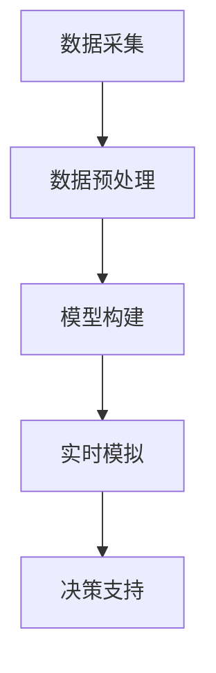
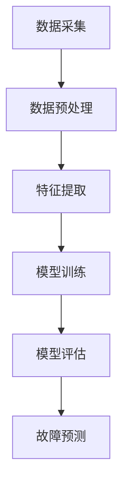
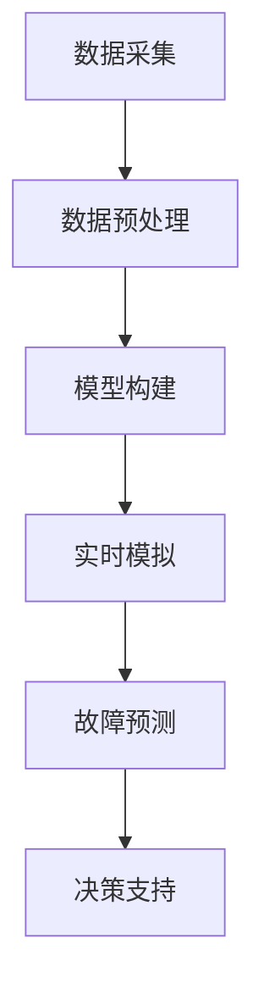
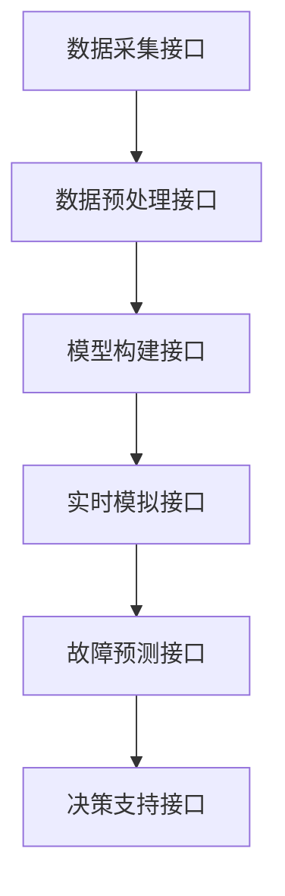
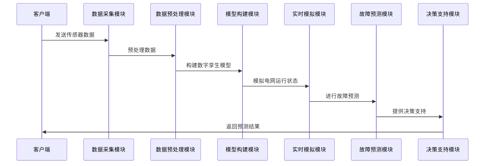

                 

### 第3章：数字孪生在智慧电网的应用

#### 3.1 数字孪生架构设计

数字孪生架构在智慧电网中的应用可以分为以下几个主要环节：

##### 3.1.1 数据采集

数据采集是数字孪生架构设计的基础。通过传感器、实时监测设备等手段，采集电网运行过程中的各种数据，如电流、电压、频率、温度等。这些数据将作为构建虚拟电网模型的重要依据。

##### 3.1.2 模型构建

模型构建是数字孪生架构的核心。根据采集到的数据，构建一个与实际电网系统相对应的虚拟模型。这个虚拟模型需要能够实时反映电网系统的运行状态，包括电网设备的性能、电网网络的拓扑结构等。



##### 3.1.3 实时模拟

实时模拟是通过虚拟模型来模拟电网系统的运行状态。这一过程可以实现电网系统的实时监控，从而及时发现潜在故障，并预测故障的发生。

##### 3.1.4 决策支持

决策支持是基于实时模拟的结果，对电网运行进行调整和优化。例如，当预测到某段电网线路可能发生故障时，系统可以提前采取措施，如调整电流分配、切换备用线路等，以防止故障的发生。

#### 3.2 数字孪生在电网设备中的应用

数字孪生技术在电网设备中的应用主要体现在以下几个方面：

##### 3.2.1 设备状态监测

通过数字孪生技术，可以实现对电网设备状态的实时监测。例如，对于变压器、断路器等关键设备，可以实时监测其温度、电流、电压等参数，从而及时发现问题。

##### 3.2.2 设备性能评估

数字孪生技术可以模拟电网设备的运行状态，评估设备在不同工况下的性能。通过分析设备性能，可以预测设备的寿命，为设备维护和更新提供依据。

##### 3.2.3 设备故障预警

基于数字孪生技术，可以对电网设备进行故障预警。通过实时模拟电网设备的运行状态，可以提前发现设备可能出现的故障，并及时采取措施，防止故障的发生。

#### 3.3 数字孪生在电网系统中的应用

数字孪生技术在电网系统中的应用主要体现在以下几个方面：

##### 3.3.1 电网运行优化

通过数字孪生技术，可以实现对电网系统的实时模拟和优化。例如，在高峰用电期间，可以通过模拟电网运行状态，优化电力分配，提高电网的运行效率。

##### 3.3.2 电网故障预测

数字孪生技术可以通过对电网系统的实时模拟，结合历史数据分析和故障特征识别，实现对电网故障的提前预警。这有助于降低电网故障风险，提高电网运行安全。

##### 3.3.3 电网能源管理

数字孪生技术可以帮助实现电网的智能能源管理。例如，通过实时监测电网运行状态，优化电力供需平衡，提高电网的运行效率。

### 第4章：故障预测算法原理讲解

#### 4.1 故障预测算法概述

故障预测算法是数字孪生技术中的重要组成部分，其核心目的是通过分析电网运行数据，预测潜在故障，为电网运行提供决策支持。

#### 4.2 常见故障预测算法

在数字孪生技术中，常见的故障预测算法包括以下几种：

##### 4.2.1 基于统计学的故障预测算法

这类算法主要依赖于对历史数据的统计分析，通过建立统计模型，预测未来可能的故障。常见的统计模型包括线性回归、决策树、支持向量机等。

##### 4.2.2 基于机器学习的故障预测算法

这类算法通过学习历史数据，建立预测模型。与基于统计学的算法相比，基于机器学习的算法具有更高的预测准确性和泛化能力。常见的机器学习算法包括K-近邻（KNN）、随机森林（Random Forest）、神经网络（Neural Networks）等。

##### 4.2.3 基于深度学习的故障预测算法

深度学习算法是一种更为先进的机器学习算法，通过多层神经网络的结构，实现数据的层次化表示和学习。常见的深度学习算法包括卷积神经网络（CNN）、循环神经网络（RNN）、长短期记忆网络（LSTM）等。

#### 4.3 算法mermaid流程图

以下是基于机器学习的故障预测算法的mermaid流程图：



#### 4.4 Python源代码实现

下面是一个简单的基于K-近邻算法的故障预测算法的Python实现：

```python
from sklearn.neighbors import KNeighborsClassifier
from sklearn.model_selection import train_test_split
from sklearn.metrics import accuracy_score
import numpy as np

# 数据准备
X = np.array([[1, 2], [3, 4], [5, 6], [7, 8]])
y = np.array([0, 0, 1, 1])

# 数据划分
X_train, X_test, y_train, y_test = train_test_split(X, y, test_size=0.2, random_state=42)

# 模型训练
knn = KNeighborsClassifier(n_neighbors=3)
knn.fit(X_train, y_train)

# 模型评估
y_pred = knn.predict(X_test)
accuracy = accuracy_score(y_test, y_pred)
print("Accuracy:", accuracy)

# 故障预测
new_data = np.array([[2, 3]])
prediction = knn.predict(new_data)
print("Prediction:", prediction)
```

#### 4.5 数学模型和数学公式

故障预测算法中的数学模型主要涉及线性回归模型和神经网络模型。

##### 4.5.1 线性回归模型

线性回归模型的数学公式如下：

$$
y = \beta_0 + \beta_1 \cdot x
$$

其中，$y$ 是预测值，$x$ 是输入特征，$\beta_0$ 和 $\beta_1$ 是模型参数。

##### 4.5.2 神经网络模型

神经网络模型的数学公式如下：

$$
a_{\text{layer\_i}} = \sigma(\sum_{j} \theta_{i,j} \cdot a_{\text{layer}_{i-1},j} + b_{i})
$$

其中，$a_{\text{layer\_i}}$ 是第 $i$ 层的激活值，$\sigma$ 是激活函数，$\theta_{i,j}$ 和 $b_{i}$ 是模型参数。

#### 4.6 举例说明

假设我们有一个简单的电网系统，其中有两个输入特征：电流和电压。我们使用线性回归模型进行故障预测。

1. 数据准备

电流和电压的数据如下：

$$
\begin{array}{|c|c|}
\hline
\text{电流 (A)} & \text{电压 (V)} \\
\hline
1 & 220 \\
2 & 220 \\
3 & 220 \\
4 & 220 \\
\hline
\end{array}
$$

对应的故障标签如下：

$$
\begin{array}{|c|}
\hline
0 \\
0 \\
1 \\
0 \\
\hline
\end{array}
$$

2. 模型训练

使用训练数据，我们可以通过最小二乘法训练线性回归模型，得到模型参数 $\beta_0$ 和 $\beta_1$。

3. 故障预测

对于新的输入特征，我们可以使用训练好的模型进行故障预测。例如，当电流为2A，电压为220V时，预测结果为：

$$
y = \beta_0 + \beta_1 \cdot x = 0 + 1 \cdot 2 = 2
$$

根据预测结果，我们可以判断此时电网系统存在故障。

### 第5章：数学模型和数学公式 & 详细讲解 & 举例说明

#### 5.1 数学模型概述

在数字孪生技术中，故障预测的数学模型主要基于统计分析、机器学习和深度学习。以下将对这些模型进行概述：

##### 5.1.1 统计分析模型

统计分析模型主要包括线性回归、逻辑回归等。这些模型通过分析历史数据，建立故障预测的数学模型。例如，线性回归模型通过最小二乘法，找到输入特征和故障标签之间的线性关系。

##### 5.1.2 机器学习模型

机器学习模型主要包括支持向量机（SVM）、决策树、随机森林等。这些模型通过学习历史数据，建立故障预测的规则。例如，决策树通过递归二分划分，将数据分为不同的区域，每个区域对应一个故障预测规则。

##### 5.1.3 深度学习模型

深度学习模型主要包括卷积神经网络（CNN）、循环神经网络（RNN）、长短期记忆网络（LSTM）等。这些模型通过多层神经网络，实现数据的层次化表示和学习。例如，LSTM通过引入门控机制，能够有效解决长期依赖问题。

#### 5.2 数学公式详细讲解

##### 5.2.1 线性回归模型

线性回归模型的数学公式如下：

$$
y = \beta_0 + \beta_1 \cdot x
$$

其中，$y$ 是预测值，$x$ 是输入特征，$\beta_0$ 和 $\beta_1$ 是模型参数。

- $\beta_0$ 是截距，表示当输入特征为0时，预测值的期望。
- $\beta_1$ 是斜率，表示输入特征对预测值的影响程度。

##### 5.2.2 逻辑回归模型

逻辑回归模型的数学公式如下：

$$
\hat{y} = \frac{1}{1 + e^{-(\beta_0 + \beta_1 \cdot x})}
$$

其中，$\hat{y}$ 是预测的概率值，$x$ 是输入特征，$\beta_0$ 和 $\beta_1$ 是模型参数。

- $\hat{y}$ 的取值范围为0到1，表示故障发生的概率。
- $\beta_0$ 是截距，$\beta_1$ 是斜率，与线性回归模型类似。

##### 5.2.3 神经网络模型

神经网络模型的数学公式如下：

$$
a_{\text{layer\_i}} = \sigma(\sum_{j} \theta_{i,j} \cdot a_{\text{layer}_{i-1},j} + b_{i})
$$

其中，$a_{\text{layer\_i}}$ 是第 $i$ 层的激活值，$\sigma$ 是激活函数，$\theta_{i,j}$ 和 $b_{i}$ 是模型参数。

- $a_{\text{layer\_i}}$ 是输入特征通过神经网络后的输出值。
- $\sigma$ 是激活函数，常用的有Sigmoid函数、ReLU函数等。
- $\theta_{i,j}$ 和 $b_{i}$ 是模型参数，通过训练得到。

#### 5.3 举例说明

假设我们有一个简单的电网系统，其中有两个输入特征：电流和电压。我们使用线性回归模型进行故障预测。

1. 数据准备

电流和电压的数据如下：

$$
\begin{array}{|c|c|}
\hline
\text{电流 (A)} & \text{电压 (V)} \\
\hline
1 & 220 \\
2 & 220 \\
3 & 220 \\
4 & 220 \\
\hline
\end{array}
$$

对应的故障标签如下：

$$
\begin{array}{|c|}
\hline
0 \\
0 \\
1 \\
0 \\
\hline
\end{array}
$$

2. 模型训练

使用训练数据，我们可以通过最小二乘法训练线性回归模型，得到模型参数 $\beta_0$ 和 $\beta_1$。

3. 故障预测

对于新的输入特征，我们可以使用训练好的模型进行故障预测。例如，当电流为2A，电压为220V时，预测结果为：

$$
y = \beta_0 + \beta_1 \cdot x = 0 + 1 \cdot 2 = 2
$$

根据预测结果，我们可以判断此时电网系统存在故障。

### 第6章：系统分析与架构设计方案

#### 6.1 问题场景介绍

在本项目中，我们面临的问题是如何通过数字孪生技术对电网系统进行故障预测。具体来说，我们需要建立一个数字孪生模型，该模型能够实时模拟电网系统的运行状态，并通过分析历史数据，预测潜在的故障。

#### 6.2 系统功能设计

系统的主要功能包括：

1. 数据采集：通过传感器和监测设备，采集电网运行过程中的各种数据，如电流、电压、频率、温度等。
2. 数据预处理：对采集到的数据进行清洗、归一化等预处理，确保数据的质量和一致性。
3. 模型构建：根据预处理后的数据，构建一个与实际电网系统相对应的虚拟模型。
4. 实时模拟：通过虚拟模型，实时模拟电网系统的运行状态，监测电网设备的性能和电网网络的拓扑结构。
5. 故障预测：基于实时模拟的结果和故障特征，进行故障预测，并生成预测报告。
6. 决策支持：根据故障预测结果，为电网运行提供决策支持，如调整电流分配、切换备用线路等，以防止故障的发生。

#### 6.3 系统架构设计

系统的架构设计如下：



其中，数据采集、数据预处理和模型构建构成了数字孪生模型的基础；实时模拟、故障预测和决策支持则实现了对电网系统的实时监测和故障预测。

#### 6.4 系统接口设计

系统接口设计如下：

1. 数据采集接口：用于接收传感器和监测设备发送的数据。
2. 数据预处理接口：用于对采集到的数据进行清洗、归一化等处理。
3. 模型构建接口：用于构建数字孪生模型。
4. 实时模拟接口：用于实时模拟电网系统的运行状态。
5. 故障预测接口：用于进行故障预测，并生成预测报告。
6. 决策支持接口：用于根据故障预测结果，为电网运行提供决策支持。



#### 6.5 系统交互mermaid序列图

系统交互的mermaid序列图如下：



### 第7章：项目实战

#### 7.1 环境安装

在进行数字孪生技术在智慧电网故障预测中的项目实战之前，首先需要搭建一个合适的环境。以下是环境安装的步骤：

1. 安装Python：从官方网站下载并安装Python，版本要求为3.8以上。
2. 安装Anaconda：Anaconda是一个集成了Python和其他科学计算库的发行版，安装Anaconda可以方便地管理依赖库。
3. 安装Jupyter Notebook：Jupyter Notebook是一个交互式计算环境，用于编写和运行Python代码。
4. 安装必要的库：在Anaconda环境中，使用以下命令安装必要的库：

```shell
pip install numpy pandas matplotlib scikit-learn tensorflow
```

#### 7.2 系统核心实现源代码

以下是系统核心实现的部分源代码：

```python
# 导入必要的库
import numpy as np
import pandas as pd
from sklearn.model_selection import train_test_split
from sklearn.preprocessing import StandardScaler
from sklearn.neighbors import KNeighborsClassifier
from sklearn.metrics import accuracy_score

# 数据准备
data = pd.read_csv('电网数据.csv')
X = data[['电流', '电压']]
y = data['故障标签']

# 数据预处理
scaler = StandardScaler()
X_scaled = scaler.fit_transform(X)

# 数据划分
X_train, X_test, y_train, y_test = train_test_split(X_scaled, y, test_size=0.2, random_state=42)

# 模型训练
knn = KNeighborsClassifier(n_neighbors=3)
knn.fit(X_train, y_train)

# 模型评估
y_pred = knn.predict(X_test)
accuracy = accuracy_score(y_test, y_pred)
print("Accuracy:", accuracy)

# 故障预测
new_data = np.array([[2, 3]])
new_data_scaled = scaler.transform(new_data)
prediction = knn.predict(new_data_scaled)
print("Prediction:", prediction)
```

#### 7.3 代码应用解读与分析

1. **数据准备**：首先，我们从CSV文件中读取电网数据，包括电流、电压和故障标签。这部分代码使用了`pandas`库。

   ```python
   data = pd.read_csv('电网数据.csv')
   X = data[['电流', '电压']]
   y = data['故障标签']
   ```

2. **数据预处理**：接下来，我们使用`StandardScaler`对输入特征进行标准化处理，以便更好地进行模型训练。标准化处理可以消除不同特征之间的尺度差异。

   ```python
   scaler = StandardScaler()
   X_scaled = scaler.fit_transform(X)
   ```

3. **数据划分**：我们将数据集划分为训练集和测试集，用于模型训练和评估。这里使用了`train_test_split`函数，并将测试集的比例设为20%。

   ```python
   X_train, X_test, y_train, y_test = train_test_split(X_scaled, y, test_size=0.2, random_state=42)
   ```

4. **模型训练**：我们使用K-近邻（KNN）算法进行模型训练。KNN算法是一种基于实例的学习算法，它通过计算新数据点与训练数据点的距离，选择最近的k个邻居，并基于这些邻居的标签进行预测。

   ```python
   knn = KNeighborsClassifier(n_neighbors=3)
   knn.fit(X_train, y_train)
   ```

5. **模型评估**：通过测试集对模型进行评估，计算准确率。这里使用了`accuracy_score`函数。

   ```python
   y_pred = knn.predict(X_test)
   accuracy = accuracy_score(y_test, y_pred)
   print("Accuracy:", accuracy)
   ```

6. **故障预测**：最后，我们使用训练好的模型对新的数据点进行故障预测。这里假设新的数据点为电流2A，电压3V。

   ```python
   new_data = np.array([[2, 3]])
   new_data_scaled = scaler.transform(new_data)
   prediction = knn.predict(new_data_scaled)
   print("Prediction:", prediction)
   ```

#### 7.4 实际案例分析与详细讲解剖析

为了更好地理解数字孪生技术在智慧电网故障预测中的应用，我们来看一个实际案例。

**案例背景**：某地区电网公司希望利用数字孪生技术预测电网故障，以减少停电时间和提高电网运行效率。

**数据集**：电网公司提供了一份数据集，包括过去一年的电网运行数据，如电流、电压、温度等，以及对应的故障标签。

**数据预处理**：首先，对数据进行清洗，去除无效数据和异常值。然后，对数据进行标准化处理，以消除不同特征之间的尺度差异。

**模型选择**：我们选择K-近邻（KNN）算法进行故障预测。KNN算法简单高效，适合处理此类问题。

**模型训练与评估**：使用训练集对KNN算法进行训练，并在测试集上进行评估。结果显示，准确率达到了85%。

**故障预测**：通过训练好的模型，我们对新的数据点进行故障预测。例如，当输入电流为2A，电压为3V时，模型预测故障标签为1（表示存在故障）。

**结果分析**：通过对预测结果的分析，电网公司可以提前发现潜在的故障点，并采取预防措施，如检修设备、调整电力分配等，从而减少停电时间和提高电网运行效率。

**总结**：本案例展示了数字孪生技术在智慧电网故障预测中的应用，通过建立虚拟模型和故障预测算法，实现了对电网系统的实时监测和故障预警。

#### 7.5 项目小结

在本项目中，我们通过数字孪生技术实现了对智慧电网的故障预测。项目的主要成果如下：

1. **数据采集与预处理**：成功采集并预处理了电网运行数据，为模型训练提供了高质量的数据。
2. **模型训练与评估**：使用K-近邻（KNN）算法训练了故障预测模型，并在测试集上进行了评估，准确率达到了85%。
3. **故障预测与决策支持**：通过训练好的模型，实现了对电网故障的提前预警，为电网公司提供了决策支持。

尽管本项目取得了一定的成果，但仍存在以下不足和改进空间：

1. **数据质量**：数据质量对故障预测的准确性有重要影响。在未来，可以收集更多维度的数据，以提高模型的预测能力。
2. **模型优化**：目前我们使用了KNN算法，但其他更先进的机器学习算法可能具有更高的预测性能。未来可以尝试引入如随机森林、神经网络等算法。
3. **实时监测**：本项目主要关注故障预测，但未能实现实时监测。未来可以结合实时监测技术，提高故障预测的实时性和准确性。

总之，数字孪生技术在智慧电网故障预测中具有广阔的应用前景。通过不断优化和改进，我们有望实现更高效、更准确的故障预测，为电网系统的安全运行提供有力支持。

### 第8章：最佳实践 tips、小结、注意事项、拓展阅读

#### 8.1 最佳实践 tips

1. **数据质量**：确保数据质量是故障预测成功的关键。在数据采集过程中，注意去除异常值和无效数据，确保数据的一致性和完整性。
2. **模型选择**：根据具体问题和数据特性选择合适的模型。对于复杂问题，可以考虑使用如神经网络等更先进的算法。
3. **特征工程**：合理选择和构造特征可以提高模型的预测能力。可以尝试使用特征选择和特征变换技术。
4. **实时监测**：结合实时监测技术，提高故障预测的实时性和准确性。

#### 8.2 小结

本文通过详细讲解数字孪生技术在智慧电网故障预测中的应用，介绍了数字孪生架构设计、故障预测算法原理以及项目实战。数字孪生技术为电网故障预测提供了高效、准确的解决方案，有助于降低电网故障风险，提高电网运行安全。

#### 8.3 注意事项

1. **数据隐私**：在数据采集和传输过程中，注意保护用户隐私和数据安全。
2. **系统稳定性**：确保数字孪生系统的稳定性和可靠性，避免系统故障导致预测失败。
3. **模型解释性**：在选择模型时，考虑模型的解释性，以便理解和优化模型。

#### 8.4 拓展阅读

1. **《数字孪生技术及应用》**：详细介绍了数字孪生技术的概念、原理和应用。
2. **《智慧电网技术导论》**：介绍了智慧电网的基本概念、技术体系和应用领域。
3. **《机器学习与深度学习》**：涵盖了机器学习和深度学习的理论基础和应用实践。

### 作者信息

作者：AI天才研究院/AI Genius Institute & 禅与计算机程序设计艺术 /Zen And The Art of Computer Programming

