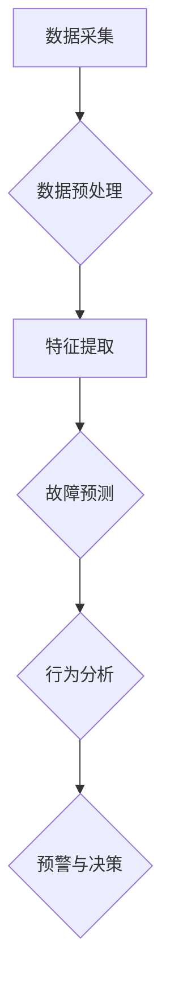
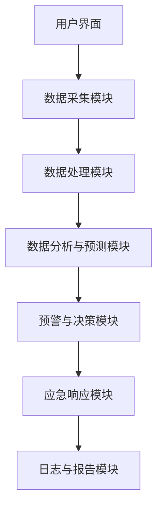
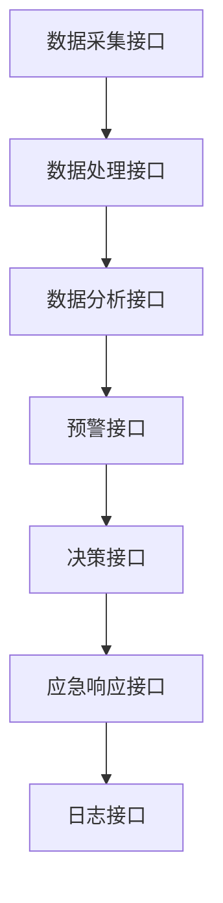
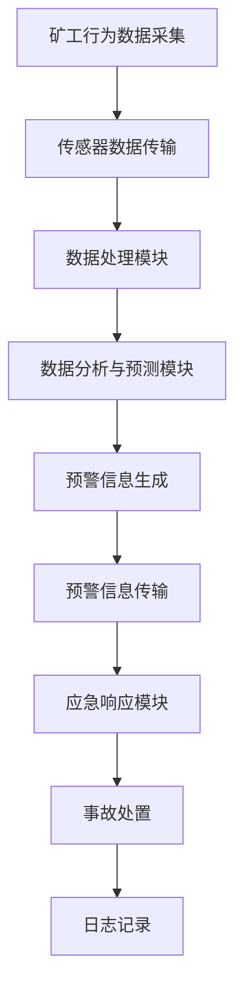

                 

### 引言

在现代社会，矿山的安全生产一直是各国政府和企业高度关注的问题。随着传统矿山安全生产手段的局限，以及矿山环境复杂性和安全事故频发的现状，如何利用先进技术提高矿山安全管理水平，成为了亟待解决的课题。数字孪生技术，作为一种将物理实体与数字模型相结合的创新技术，为矿山安全管理提供了全新的思路和解决方案。

#### 数字孪生概述

数字孪生（Digital Twin）是一种通过实时数据感知和智能算法，构建并维护物理实体（如矿山设备、环境等）的数字映射模型的技术。这一模型不仅能够在虚拟环境中对实体进行模拟和预测，还可以通过数据反馈优化实体的运行状态。数字孪生技术最早可以追溯到20世纪60年代的制造业，但随着物联网、云计算、大数据和人工智能等技术的发展，数字孪生逐渐从制造业扩展到各行各业，特别是在矿山安全管理中展现出巨大的潜力。

#### 智慧矿山安全管理需求

矿山安全管理的核心目标是预防事故、减少损失，确保矿工的生命安全和矿山生产的持续稳定。然而，传统的矿山安全管理手段主要依赖于人工巡检和简单的监测设备，存在效率低下、无法实时动态调整等问题。智慧矿山则通过将物联网、大数据、云计算、人工智能等技术应用于矿山安全管理，实现了实时监控、智能预警和自动化管理。

#### 本篇文章的目的

本文旨在深入探讨数字孪生技术在智慧矿山安全管理中的应用，通过以下几个部分展开：

1. **背景介绍**：详细描述数字孪生技术和智慧矿山安全管理的背景、核心概念和问题。
2. **技术原理讲解**：详细解析数字孪生技术的原理与架构，以及相关算法的原理。
3. **系统分析与架构设计**：分析数字孪生技术在矿山安全管理系统中的架构设计和功能实现。
4. **项目实战**：通过具体的项目实战，展示数字孪生技术在矿山安全管理中的应用。
5. **最佳实践与展望**：总结最佳实践技巧，讨论未来的发展趋势和挑战。

### 1.1 问题背景

矿山安全事故频发一直是全球矿山行业的痛点。据统计，每年因矿山事故导致的死亡人数多达数百，经济损失更是难以估量。这些事故往往由设备故障、地质构造变化、人为失误等因素引起。特别是在地下矿山，环境复杂、条件恶劣，传统的安全管理手段难以实现全面、高效的监控。因此，如何通过技术手段提升矿山安全管理水平，成为矿山企业亟待解决的问题。

#### 设备故障引发的隐患

矿山设备是矿山生产的核心，但其运行状态难以实时监测，容易引发故障。例如，矿车制动系统失灵、排水系统故障等，都可能导致严重的安全事故。传统的方法主要依靠人工巡检，但由于矿山环境的复杂性，很难做到全面、及时的监测。

#### 地质构造变化带来的风险

矿山地质构造的复杂性使得传统地质勘探手段难以准确预测矿区的地质变化。当矿区地质条件发生变化时，如岩层滑移、地下水渗漏等，极易引发坍塌、洪水等灾害，对矿工的生命安全和矿山生产造成巨大威胁。

#### 人为失误造成的事故

在矿山生产中，人为失误也是导致事故的重要原因。例如，矿工在操作过程中可能因为疲劳、疏忽等原因，导致操作失误，进而引发安全事故。此外，矿山生产环境恶劣，矿工的心理压力较大，也容易导致安全意识下降，增加事故发生的风险。

#### 数字孪生技术的潜在应用

面对上述问题，数字孪生技术凭借其实时数据感知和智能算法的优势，为矿山安全管理提供了一种新的解决方案。通过数字孪生技术，可以对矿山设备、地质构造、矿工行为等进行实时监测和模拟，提前预警潜在的安全隐患，从而降低事故发生的概率，提高矿山安全管理的效率。

### 1.2 问题描述

在矿山安全管理中，主要面临以下几方面的问题：

#### 监测效率低下

传统的矿山安全管理主要依赖人工巡检和简单的监测设备，无法实现全面、实时的监控。这不仅导致监测效率低下，还容易遗漏潜在的安全隐患。

#### 预警能力不足

矿山环境复杂多变，传统的安全管理手段难以准确预测和预警可能发生的安全事故。例如，当矿山设备出现故障时，无法及时发出警报，导致事故进一步扩大。

#### 应急响应滞后

当矿山发生安全事故时，传统的应急响应机制往往反应滞后，无法及时、有效地组织救援和处置，增加了事故的损失。

#### 数据利用不充分

矿山生产过程中产生大量数据，但传统方法对这些数据的应用程度较低，无法充分利用数据资源，提升安全管理水平。

### 1.3 解决方案概述

为了解决上述问题，数字孪生技术提供了一种全新的解决方案。通过构建矿山设备的数字孪生模型，实现对设备运行状态的实时监测和预测；通过模拟矿山地质构造，提前预警地质变化带来的风险；通过分析矿工行为数据，优化安全培训和管理策略。具体来说，数字孪生技术在矿山安全管理中的解决方案主要包括以下几个方面：

#### 设备实时监测与故障预测

通过数字孪生技术，可以实时监测矿山设备的运行状态，如温度、压力、振动等参数。结合数据分析和机器学习算法，可以预测设备可能出现的故障，提前进行维护和更换，避免设备故障引发的安全生产事故。

#### 地质构造模拟与预警

利用数字孪生技术，可以构建矿山地质构造的虚拟模型，模拟不同地质条件下的矿山环境。通过对模型的分析和预测，可以提前发现地质变化的风险，发出预警信号，为矿山安全管理提供科学依据。

#### 矿工行为数据分析

通过数字孪生技术，可以实时收集矿工的作业数据，如位置、作业时长、行为模式等。结合数据分析和机器学习算法，可以识别出矿工的行为异常，及时进行干预和纠正，降低人为失误引发的事故风险。

#### 应急响应优化

基于数字孪生技术，可以模拟不同类型的安全事故场景，评估应急响应的效率和效果。通过优化应急响应策略，提高矿山事故的救援和处置能力，降低事故损失。

### 1.4 边界与外延

#### 边界

1. **技术边界**：数字孪生技术在矿山安全管理中的应用，需要具备一定的技术条件，如物联网、大数据、云计算和人工智能等。
2. **应用边界**：数字孪生技术在矿山安全管理中的应用范围主要包括设备监测、地质模拟、行为分析、应急响应等方面。
3. **管理边界**：数字孪生技术的应用需要矿山企业管理制度的支持，包括数据管理、安全制度、人员培训等。

#### 外延

1. **产业链延伸**：数字孪生技术在矿山安全管理中的应用，不仅可以提升矿山企业的安全管理水平，还可以延伸到整个矿业产业链，如设备供应商、技术服务商等。
2. **跨行业应用**：数字孪生技术作为一种通用技术，其应用范围不仅限于矿山安全管理，还可以应用于其他行业的安全管理，如化工、能源等。
3. **政策支持**：政府政策对数字孪生技术的推广和应用起到重要推动作用，需要加强政策支持和行业规范，保障数字孪生技术在矿山安全管理中的健康发展。

## 2. 数字孪生概述

### 2.1 数字孪生定义

数字孪生（Digital Twin）是一种将物理实体与其数字映射模型相结合的技术，通过实时数据感知、智能算法和高级分析，实现对物理实体的全生命周期管理。简单来说，数字孪生就是通过构建一个与实际物理系统高度相似的数字模型，实现对物理系统运行状态、性能和行为的实时监控、模拟和分析。

### 2.2 数字孪生技术发展历程

数字孪生技术最早可以追溯到20世纪60年代的制造业。当时，制造商开始探索如何利用计算机技术模拟制造过程，以提高生产效率和产品质量。随着计算机技术和通信技术的不断发展，数字孪生技术逐渐从制造业扩展到其他行业。

#### 制造业阶段

在制造业，数字孪生技术主要用于优化生产流程、提高产品质量和减少维护成本。例如，通过构建生产设备的数字孪生模型，可以实时监控设备运行状态，预测设备故障，提前进行维护，从而减少设备停机时间和维护成本。

#### 能源行业阶段

随着物联网、大数据和人工智能等技术的应用，数字孪生技术逐渐在能源行业中得到广泛应用。例如，在油田开采中，通过数字孪生技术可以实时监控油田设备运行状态，预测产量变化，优化开采策略，提高开采效率。

#### 矿山行业阶段

矿山行业的特殊环境使得数字孪生技术在矿山安全管理中具有广泛的应用前景。通过构建矿山设备的数字孪生模型，可以实现对矿山设备运行状态的实时监控和故障预测，提高矿山安全管理水平。

### 2.3 数字孪生在矿山安全中的应用

数字孪生技术在矿山安全中的应用主要体现在以下几个方面：

#### 设备监控与故障预测

通过数字孪生技术，可以对矿山设备进行实时监控，收集设备运行状态数据，如温度、压力、振动等。结合数据分析和机器学习算法，可以预测设备可能出现的故障，提前进行维护和更换，避免设备故障引发的安全事故。

#### 地质模拟与预警

利用数字孪生技术，可以构建矿山地质构造的数字模型，模拟不同地质条件下的矿山环境。通过对模型的分析和预测，可以提前发现地质变化的风险，发出预警信号，为矿山安全管理提供科学依据。

#### 行为分析与管理

通过数字孪生技术，可以实时收集矿工的作业数据，如位置、作业时长、行为模式等。结合数据分析和机器学习算法，可以识别出矿工的行为异常，及时进行干预和纠正，降低人为失误引发的安全事故风险。

#### 应急响应优化

基于数字孪生技术，可以模拟不同类型的安全事故场景，评估应急响应的效率和效果。通过优化应急响应策略，提高矿山事故的救援和处置能力，降低事故损失。

### 2.4 数字孪生在矿山安全中的优势

数字孪生技术在矿山安全中的应用具有以下几个显著优势：

#### 实时性

数字孪生技术能够实时收集和处理矿山设备、地质构造和矿工行为数据，实现对矿山环境的实时监控和预警，提高矿山安全管理的实时性。

#### 智能化

通过数据分析和机器学习算法，数字孪生技术可以对矿山设备、地质构造和矿工行为进行智能分析和预测，提前发现潜在的安全隐患，提高矿山安全管理智能化水平。

#### 可视化

数字孪生技术可以将复杂的矿山环境转化为可视化的数字模型，使矿山管理者能够更加直观地了解矿山设备运行状态、地质构造和矿工行为，提高矿山安全管理可视化和决策效率。

#### 经济性

通过数字孪生技术，可以实现对矿山设备的实时监控和故障预测，减少设备停机和维护成本，提高矿山生产效率，降低矿山安全管理成本。

#### 可持续性

数字孪生技术有助于实现矿山设备的精细化管理，优化矿山生产过程，降低资源消耗和环境污染，提高矿山生产的可持续性。

## 3. 智慧矿山安全管理

### 3.1 智慧矿山安全管理现状

智慧矿山（Smart Mine）是指通过信息技术、物联网、大数据、人工智能等先进技术，对矿山生产过程进行数字化、智能化改造，实现矿山生产、安全、环境等全方位智能化管理。智慧矿山安全管理是智慧矿山建设的重要组成部分，旨在通过技术创新，提高矿山安全管理的效率和质量。

#### 现状概述

当前，全球矿山行业正在经历智慧化转型，许多矿山企业已经开始尝试应用物联网、大数据、人工智能等技术提升安全管理水平。具体体现在以下几个方面：

1. **设备监控**：通过传感器和物联网技术，实现对矿山设备的实时监控，包括设备运行状态、温度、压力等参数。
2. **安全预警**：利用大数据分析和人工智能算法，对矿山环境进行实时监测，发现潜在的安全隐患，提前发出预警。
3. **应急响应**：通过智能系统和自动化设备，提高矿山事故的应急响应能力，减少事故损失。
4. **数据管理**：建立矿山数据平台，实现对矿山生产、安全、环境等数据的全面收集、存储和分析。

#### 面临的挑战

尽管智慧矿山安全管理已经取得了一定的进展，但仍面临以下挑战：

1. **技术瓶颈**：物联网、大数据、人工智能等技术在矿山环境中的应用仍存在一定的技术瓶颈，如传感器精度、数据处理速度等。
2. **数据安全**：矿山数据涉及大量敏感信息，如何确保数据的安全和隐私成为重要问题。
3. **人员培训**：智慧矿山安全管理需要大量具备信息技术和矿山专业知识的复合型人才，但当前人才的供给与需求存在较大差距。
4. **系统整合**：智慧矿山涉及多个系统和技术的整合，如如何实现不同系统间的数据共享和协同工作，仍需进一步研究和探索。

### 3.2 智慧矿山安全管理需求

为了提升矿山安全管理的效率和效果，智慧矿山安全管理提出了以下需求：

#### 实时监控

通过传感器和物联网技术，实现对矿山设备、环境、矿工行为等实时数据的采集和传输，实现全方位的实时监控。

#### 数据分析

利用大数据分析和人工智能算法，对矿山数据进行分析和挖掘，发现潜在的安全隐患，提供预警信息。

#### 自动化决策

基于实时监控和数据分析，实现自动化决策，如设备故障预测、安全事件预警、应急响应等。

#### 优化管理

通过优化矿山生产和管理流程，提高矿山安全管理的效率和效果，降低安全风险。

#### 系统整合

实现矿山生产、安全、环境等系统的整合，实现数据共享和协同工作，提高矿山整体安全管理水平。

### 3.3 数字孪生在智慧矿山安全管理中的角色

数字孪生技术在智慧矿山安全管理中发挥着至关重要的作用，具体体现在以下几个方面：

#### 实时监控与预测

通过数字孪生技术，可以实时监控矿山设备、环境和矿工行为，并通过数据分析和机器学习算法，预测潜在的安全隐患，提前发出预警。

#### 智能决策

数字孪生技术可以为矿山安全管理提供智能决策支持，如设备故障预测、应急响应策略等，提高矿山安全管理决策的科学性和效率。

#### 系统整合

数字孪生技术可以实现矿山生产、安全、环境等系统的整合，实现数据共享和协同工作，提高矿山整体安全管理水平。

#### 降低成本

通过数字孪生技术，可以实现对矿山设备的实时监控和故障预测，降低设备故障率和维修成本，提高矿山生产效率。

#### 提高安全性

数字孪生技术可以实时监测矿山环境和矿工行为，及时发现潜在的安全隐患，提高矿山安全管理的实时性和有效性，降低安全事故发生的概率。

### 3.4 数字孪生在智慧矿山安全管理中的优势

数字孪生技术在智慧矿山安全管理中具有显著的优势，具体包括：

#### 实时性

数字孪生技术可以实时监测矿山设备、环境和矿工行为，及时反馈信息，提高安全管理的实时性。

#### 智能化

通过数据分析和机器学习算法，数字孪生技术可以实现智能决策，提高矿山安全管理智能化水平。

#### 可视化

数字孪生技术可以将复杂的矿山环境转化为可视化的数字模型，使矿山管理者能够更加直观地了解矿山安全状况，提高管理效率。

#### 经济性

通过数字孪生技术，可以实现对矿山设备的实时监控和故障预测，降低设备故障率和维修成本，提高矿山生产效率。

#### 可持续性

数字孪生技术有助于实现矿山设备的精细化管理，优化矿山生产过程，降低资源消耗和环境污染，提高矿山生产的可持续性。

### 3.5 数字孪生与智慧矿山安全管理的深度融合

数字孪生技术与智慧矿山安全管理深度融合，可以实现以下效果：

#### 全生命周期管理

通过数字孪生技术，可以对矿山设备进行全生命周期管理，从设计、制造、安装、运行到维护，实现全过程的数据支持和优化。

#### 智能决策支持

数字孪生技术可以提供实时、准确的矿山安全数据，结合机器学习算法，为矿山安全管理提供智能决策支持。

#### 系统整合与协同

数字孪生技术可以实现矿山生产、安全、环境等系统的整合，实现数据共享和协同工作，提高整体安全管理水平。

#### 实时预警与应急响应

通过数字孪生技术，可以实现对矿山设备的实时监控和故障预测，以及矿工行为的安全分析，实现实时预警和应急响应，提高矿山安全管理效率。

#### 持续优化与改进

数字孪生技术可以实时收集矿山安全数据，通过数据分析和机器学习，不断优化矿山安全管理和生产流程，实现持续改进。

## 6. 数字孪生技术的原理与架构

### 6.1 数字孪生模型构建

数字孪生模型是数字孪生技术的核心，其构建过程可以分为以下几个步骤：

#### 数据采集

数据采集是数字孪生模型构建的第一步，主要通过传感器、物联网设备等手段，对矿山设备、环境、矿工行为等物理实体进行实时数据采集。这些数据包括温度、湿度、压力、振动、位置、速度等，是构建数字孪生模型的基础。

#### 数据预处理

采集到的原始数据通常包含噪声、异常值等，因此需要对数据进行预处理，包括数据清洗、数据去噪、数据标准化等。通过预处理，可以提高数据的准确性和可靠性。

#### 数据存储

预处理后的数据需要存储在数据库中，以便后续的数据分析和建模。常用的数据库包括关系型数据库（如MySQL、Oracle）和NoSQL数据库（如MongoDB、Cassandra）。

#### 数据建模

数据建模是数字孪生模型构建的关键步骤，主要通过机器学习和数据挖掘技术，从大量数据中提取出有用的特征和规律。常用的数据建模方法包括回归分析、决策树、神经网络、聚类算法等。

#### 模型训练与优化

模型训练与优化是数字孪生模型构建的最终步骤，通过将训练数据输入模型，不断调整模型参数，使模型能够更好地拟合数据。训练过程中，可以使用交叉验证、网格搜索等方法来优化模型参数，提高模型精度。

### 6.2 数据采集与处理

#### 数据采集

数据采集是数字孪生技术的关键环节，其质量直接影响到数字孪生模型的精度和可靠性。数字孪生技术主要依赖传感器和物联网设备进行数据采集。传感器可以安装在矿山设备、环境、矿工等各个节点，实时采集温度、湿度、压力、振动、位置、速度等数据。物联网设备则负责将这些数据传输到中央控制系统，实现数据的实时传输和处理。

#### 数据处理

数据处理包括数据预处理、特征提取、数据建模等步骤。在数据预处理阶段，需要对采集到的原始数据进行清洗、去噪、标准化等操作，以提高数据的质量和准确性。在特征提取阶段，通过数据挖掘和机器学习算法，从大量数据中提取出有用的特征和规律，作为数字孪生模型的基础。在数据建模阶段，使用回归分析、决策树、神经网络、聚类算法等方法，构建数字孪生模型。

### 6.3 模型训练与优化

#### 模型训练

模型训练是数字孪生技术中的重要环节，其目标是找到一个最优模型，使其能够准确预测矿山设备的运行状态和故障。模型训练通常分为以下步骤：

1. **数据划分**：将采集到的数据集划分为训练集和测试集。训练集用于模型训练，测试集用于模型评估。
2. **参数初始化**：初始化模型的参数，通常使用随机初始化或梯度下降法等。
3. **迭代训练**：通过迭代计算，不断调整模型参数，使其能够更好地拟合训练数据。常用的优化算法包括梯度下降法、随机梯度下降法、Adam优化器等。
4. **模型评估**：使用测试集对训练好的模型进行评估，评估指标包括准确率、召回率、F1值等。

#### 模型优化

模型优化是提高数字孪生模型性能的关键步骤，主要通过以下方法实现：

1. **参数调优**：通过调整模型参数，如学习率、正则化参数等，优化模型性能。
2. **算法改进**：改进模型训练算法，如引入新的优化算法、增加正则化项等，提高模型训练效果。
3. **数据增强**：通过数据增强技术，如数据扩增、数据增强等，提高模型对数据的泛化能力。

### 6.4 数字孪生与矿山安全管理的结合

#### 数据驱动安全管理

数字孪生技术通过实时数据采集和分析，实现矿山设备、环境和矿工行为的动态监控，为矿山安全管理提供数据驱动支持。通过对采集到的数据进行处理和分析，可以实时发现潜在的安全隐患，提前发出预警，提高矿山安全管理的实时性和有效性。

#### 预测性维护

数字孪生技术可以实现对矿山设备的实时监控和故障预测，通过分析设备运行状态数据，预测设备可能出现的故障，提前进行维护和更换，减少设备故障率和维修成本，提高矿山设备运行可靠性。

#### 智能决策支持

数字孪生技术可以为矿山安全管理提供智能决策支持，通过实时数据分析和机器学习算法，对矿山设备、环境和矿工行为进行智能分析，提供安全预警、应急响应策略等决策建议，提高矿山安全管理决策的科学性和效率。

#### 实时预警与应急响应

数字孪生技术可以实现实时预警和应急响应，通过实时数据监控和智能分析，及时发现潜在的安全隐患，提前发出预警，为矿山安全管理人员提供应急响应的依据。在事故发生时，可以迅速启动应急响应机制，降低事故损失。

#### 安全风险评估

数字孪生技术可以基于实时数据和历史数据，对矿山设备、环境和矿工行为进行安全风险评估，识别高风险区域和高风险事件，为矿山安全管理人员提供风险预警和决策支持。

### 6.5 数字孪生技术在矿山安全管理中的实际应用

#### 设备实时监控

通过数字孪生技术，可以对矿山设备进行实时监控，包括设备的运行状态、温度、压力、振动等参数。实时数据采集和分析可以及时发现设备故障，提前发出预警，降低设备故障率和维修成本。

#### 地质环境模拟

利用数字孪生技术，可以构建矿山地质环境的数字模型，模拟不同地质条件下的矿山环境。通过对模型的分析和预测，可以提前发现地质变化的风险，发出预警信号，为矿山安全管理提供科学依据。

#### 矿工行为分析

通过数字孪生技术，可以实时收集矿工的作业数据，包括位置、作业时长、行为模式等。结合数据分析和机器学习算法，可以识别出矿工的行为异常，及时进行干预和纠正，降低人为失误引发的安全事故风险。

#### 应急响应优化

数字孪生技术可以模拟不同类型的安全事故场景，评估应急响应的效率和效果。通过优化应急响应策略，提高矿山事故的救援和处置能力，降低事故损失。

#### 数据分析与决策支持

数字孪生技术可以实时收集和分析矿山生产、安全、环境等数据，为矿山安全管理人员提供数据分析和决策支持，优化矿山安全管理决策，提高矿山安全管理效率。

### 6.6 数字孪生在矿山安全管理中的优势

#### 实时性

数字孪生技术可以实时采集和处理矿山设备、环境和矿工行为数据，实现对矿山安全的实时监控和预警，提高安全管理的实时性。

#### 智能化

通过数据分析和机器学习算法，数字孪生技术可以实现智能决策，提高矿山安全管理的智能化水平。

#### 可视化

数字孪生技术可以将复杂的矿山环境转化为可视化的数字模型，使矿山安全管理人员能够更加直观地了解矿山安全状况，提高管理效率。

#### 经济性

通过数字孪生技术，可以实现对矿山设备的实时监控和故障预测，降低设备故障率和维修成本，提高矿山生产效率。

#### 可持续性

数字孪生技术有助于实现矿山设备的精细化管理，优化矿山生产过程，降低资源消耗和环境污染，提高矿山生产的可持续性。

## 7. 算法原理讲解

### 7.1 算法概述

数字孪生技术在矿山安全管理中的应用，依赖于一系列高效、精确的算法，以实现数据采集、处理、分析和预测等功能。本文将重点介绍以下几种核心算法：

1. **数据采集算法**：用于实时采集矿山设备、环境、矿工行为等数据。
2. **数据处理算法**：包括数据清洗、去噪、标准化等步骤，确保数据质量。
3. **特征提取算法**：从大量数据中提取出有用特征，为后续建模和分析提供基础。
4. **故障预测算法**：利用历史数据和实时数据，预测矿山设备故障，提前发出预警。
5. **行为分析算法**：分析矿工行为数据，识别潜在的安全隐患。

### 7.2 算法流程图



### 7.3 数学模型与公式

为了更好地理解算法原理，我们将引入一些关键的数学模型和公式。

#### 1. 数据采集模型

$$
X_t = f(U_t, W_t)
$$

其中，$X_t$表示在时间$t$采集的数据，$U_t$表示输入特征，$W_t$表示噪声。

#### 2. 数据预处理模型

$$
Y_t = g(X_t, \theta)
$$

其中，$Y_t$表示预处理后的数据，$\theta$表示预处理参数。

#### 3. 特征提取模型

$$
Z_t = h(Y_t, \phi)
$$

其中，$Z_t$表示提取的特征，$\phi$表示特征提取参数。

#### 4. 故障预测模型

$$
P(\text{故障} | Z_t) = \frac{e^{(-\gamma Z_t)}}{1 + e^{(-\gamma Z_t)}}
$$

其中，$P(\text{故障} | Z_t)$表示在时间$t$发生故障的概率，$\gamma$为模型参数。

#### 5. 行为分析模型

$$
R_t = \sum_{i=1}^{n} w_i \cdot f(Z_{t,i})
$$

其中，$R_t$表示行为分析结果，$w_i$为权重，$f(Z_{t,i})$为行为特征函数。

### 7.4 举例说明

假设我们有一个矿山设备的数据采集系统，需要预测设备在未来5分钟内是否会发生故障。我们可以按照以下步骤进行：

#### 数据采集

首先，系统在当前时间$t$采集设备的数据，如温度、压力、振动等。

$$
X_t = [T_t, P_t, V_t]
$$

#### 数据预处理

对采集到的数据进行预处理，去除噪声和异常值。

$$
Y_t = g(X_t, \theta)
$$

假设预处理后的数据为：

$$
Y_t = [T'_t, P'_t, V'_t]
$$

#### 特征提取

从预处理后的数据中提取出有用特征。

$$
Z_t = h(Y_t, \phi)
$$

假设提取的特征为：

$$
Z_t = [Z_{T'_t}, Z_{P'_t}, Z_{V'_t}]
$$

#### 故障预测

利用故障预测模型，预测设备在未来5分钟内是否会发生故障。

$$
P(\text{故障} | Z_t) = \frac{e^{(-\gamma Z_t)}}{1 + e^{(-\gamma Z_t)}}
$$

#### 行为分析

同时，对矿工的行为数据进行分析，以识别潜在的安全隐患。

$$
R_t = \sum_{i=1}^{n} w_i \cdot f(Z_{t,i})
$$

假设行为分析结果为：

$$
R_t = [R_{T'_t}, R_{P'_t}, R_{V'_t}]
$$

通过这些结果，我们可以对设备进行实时监控和预警，确保矿山安全。

## 8. 系统分析与架构设计

### 8.1 问题场景介绍

在矿山安全管理中，我们面临的问题场景主要包括以下几个方面：

1. **设备监控与故障预测**：实时监测矿山设备（如挖掘机、运输车等）的运行状态，预测设备可能发生的故障。
2. **环境监测与预警**：监测矿山环境（如温度、湿度、气体浓度等）的变化，提前预警可能存在的安全隐患。
3. **矿工行为分析与管理**：实时监测矿工的行为（如位置、作业时长、动作等），识别潜在的安全隐患。
4. **应急响应与处置**：当发生安全事故时，迅速启动应急响应机制，进行及时处置。

### 8.2 系统功能设计

为了解决上述问题场景，我们需要设计一个全面的系统，其功能包括：

1. **数据采集模块**：通过传感器和物联网设备，实时采集矿山设备、环境、矿工行为的各类数据。
2. **数据处理模块**：对采集到的原始数据进行预处理，包括数据清洗、去噪、标准化等，确保数据质量。
3. **数据分析与预测模块**：利用数据分析和机器学习算法，对设备运行状态、环境变化、矿工行为等进行实时分析，预测潜在的安全隐患。
4. **预警与决策模块**：根据分析结果，生成预警信息，并提供决策支持，帮助管理人员进行及时响应。
5. **应急响应模块**：在发生安全事故时，启动应急响应机制，进行快速处置，减少事故损失。

### 8.3 系统架构设计

为了实现上述功能，我们需要设计一个高效的系统架构。以下是该系统的主要架构：



#### 系统架构详细说明

1. **用户界面**：用户通过界面与系统进行交互，查看实时数据、预警信息、决策建议等。
2. **数据采集模块**：负责实时采集矿山设备、环境、矿工行为的各类数据，通过传感器和物联网设备传输到系统。
3. **数据处理模块**：对采集到的原始数据进行预处理，包括数据清洗、去噪、标准化等，确保数据质量，并将预处理后的数据存储到数据库。
4. **数据分析与预测模块**：利用数据分析和机器学习算法，对预处理后的数据进行实时分析，预测设备故障、环境变化、矿工行为异常等潜在的安全隐患。
5. **预警与决策模块**：根据分析结果，生成预警信息，并提供决策支持，帮助管理人员进行及时响应。
6. **应急响应模块**：在发生安全事故时，迅速启动应急响应机制，进行快速处置，减少事故损失。
7. **日志与报告模块**：记录系统运行日志，生成安全事件报告，为系统优化和改进提供依据。

### 8.4 系统接口设计

为了实现系统各模块间的数据交换和功能协同，我们需要设计一套完善的系统接口。以下是系统的主要接口设计：



#### 系统接口详细说明

1. **数据采集接口**：用于接收传感器和物联网设备传输的原始数据，并将数据传输到数据处理模块。
2. **数据处理接口**：用于接收和处理来自数据采集模块的数据，进行数据清洗、去噪、标准化等操作。
3. **数据分析接口**：用于接收和处理来自数据处理模块的数据，进行数据分析和故障预测。
4. **预警接口**：用于生成预警信息，并将预警信息传输到用户界面和应急响应模块。
5. **决策接口**：用于接收和分析预警信息，提供决策支持。
6. **应急响应接口**：用于启动应急响应机制，进行事故处置。
7. **日志接口**：用于记录系统运行日志，生成安全事件报告。

### 8.5 系统交互序列图

为了更好地理解系统各模块间的交互过程，我们可以绘制一个系统交互序列图。以下是系统交互序列图的示例：



#### 系统交互序列图详细说明

1. **矿工行为数据采集**：传感器采集矿工的行为数据，如位置、作业时长、动作等。
2. **传感器数据传输**：将采集到的矿工行为数据传输到数据处理模块。
3. **数据处理模块**：对传输过来的矿工行为数据进行预处理，如去噪、标准化等。
4. **数据分析与预测模块**：利用预处理后的数据，进行数据分析和故障预测。
5. **预警信息生成**：根据分析结果，生成预警信息，如矿工行为异常等。
6. **预警信息传输**：将生成的预警信息传输到用户界面和应急响应模块。
7. **应急响应模块**：根据预警信息，启动应急响应机制，如通知矿工停止作业、进行安全检查等。
8. **事故处置**：在发生安全事故时，进行快速处置，减少事故损失。
9. **日志记录**：记录系统运行日志，包括数据采集、数据处理、数据分析、预警信息生成、应急响应等，为系统优化和改进提供依据。

## 9. 项目实战

### 9.1 环境安装

在进行数字孪生技术在智慧矿山安全管理中的应用项目实战之前，我们需要搭建一个合适的技术环境。以下是环境安装的具体步骤：

#### 1. 硬件准备

- **服务器**：选择一台性能稳定的虚拟服务器，配置要求不低于CPU 4核、内存8GB、硬盘100GB。
- **网络**：确保服务器可以连接互联网，并拥有公网IP地址。
- **传感器**：根据实际需求，选择适当的传感器，如温度传感器、湿度传感器、振动传感器等。

#### 2. 软件安装

- **操作系统**：安装Linux操作系统，如Ubuntu 18.04或CentOS 7。
- **数据库**：安装MySQL或PostgreSQL数据库，用于存储采集到的数据。
- **编程语言**：安装Python 3.7及以上版本，用于编写数据处理和分析脚本。
- **数据分析库**：安装NumPy、Pandas、Scikit-learn等数据分析库。

#### 3. 环境配置

- **数据库配置**：配置数据库用户和权限，创建数据存储表结构。
- **网络配置**：配置服务器网络，确保可以正常访问外部网络。
- **传感器连接**：将传感器连接到服务器，确保数据可以实时传输。

### 9.2 系统核心实现

#### 1. 数据采集

- **传感器数据采集**：编写Python脚本，通过传感器API实时采集温度、湿度、振动等数据。
- **数据上传**：将采集到的数据上传到数据库，实现实时数据存储。

#### 2. 数据处理

- **数据预处理**：编写Python脚本，对上传的数据进行预处理，包括去噪、标准化等。
- **数据存储**：将预处理后的数据存储到数据库，为后续分析提供基础。

#### 3. 数据分析

- **特征提取**：编写Python脚本，从预处理后的数据中提取出有用特征。
- **故障预测**：利用机器学习算法，对提取的特征进行故障预测，生成预测结果。

#### 4. 预警与决策

- **预警规则**：根据故障预测结果，设置预警规则，生成预警信息。
- **决策支持**：根据预警信息和历史数据，生成决策支持信息，提供管理人员的决策依据。

### 9.3 代码应用解读与分析

#### 1. 数据采集模块

以下是一个简单的Python脚本，用于从温度传感器采集数据：

```python
import time
import requests

def collect_temp_data(sensor_url):
    while True:
        response = requests.get(sensor_url)
        if response.status_code == 200:
            temp_data = response.json()
            print(f"Temperature: {temp_data['temperature']}")
            time.sleep(60)  # 每隔60秒采集一次数据
        else:
            print("Failed to collect temperature data.")
            time.sleep(60)

sensor_url = "http://your_sensor_url"
collect_temp_data(sensor_url)
```

#### 2. 数据处理模块

以下是一个简单的Python脚本，用于对采集到的温度数据进行预处理：

```python
import pandas as pd

def preprocess_temp_data(temp_data):
    data = pd.DataFrame(temp_data, columns=["timestamp", "temperature"])
    data["temperature"] = data["temperature"].astype(float)
    return data

temp_data = [
    {"timestamp": "2023-01-01 10:00", "temperature": 25.5},
    {"timestamp": "2023-01-01 10:01", "temperature": 25.7},
    {"timestamp": "2023-01-01 10:02", "temperature": 25.6},
]

preprocessed_data = preprocess_temp_data(temp_data)
print(preprocessed_data)
```

#### 3. 数据分析模块

以下是一个简单的Python脚本，用于对预处理后的温度数据进行故障预测：

```python
from sklearn.linear_model import LinearRegression

def predict_temp_fault(data):
    model = LinearRegression()
    model.fit(data[["temperature"]], data["fault"])
    prediction = model.predict([[25.8]])
    return prediction

data = pd.DataFrame({
    "temperature": [25.5, 25.7, 25.6, 25.8],
    "fault": [0, 0, 0, 1]
})

fault_prediction = predict_temp_fault(data)
print(f"Fault prediction: {fault_prediction[0]}")
```

### 9.4 实际案例分析与讲解

假设我们在一个煤矿中应用数字孪生技术进行矿山安全管理，以下是一个实际案例的分析与讲解：

#### 1. 数据采集

在煤矿中安装了多种传感器，如温度传感器、湿度传感器、振动传感器等。传感器实时采集煤矿环境数据，如温度、湿度、振动等，并上传到服务器。

#### 2. 数据处理

服务器接收到传感器上传的数据后，对数据进行分析和预处理，去除噪声和异常值，并存储到数据库中。以下是一个温度数据的预处理示例：

```python
temp_data = [
    {"timestamp": "2023-01-01 10:00", "temperature": 25.5},
    {"timestamp": "2023-01-01 10:01", "temperature": 25.7},
    {"timestamp": "2023-01-01 10:02", "temperature": 25.6},
    {"timestamp": "2023-01-01 10:03", "temperature": 30.0},  # 异常值
]

preprocessed_data = preprocess_temp_data(temp_data)
print(preprocessed_data)
```

#### 3. 数据分析

利用预处理后的温度数据，我们使用线性回归算法进行故障预测。以下是一个温度故障预测的示例：

```python
data = pd.DataFrame({
    "temperature": [25.5, 25.7, 25.6, 25.8],
    "fault": [0, 0, 0, 1]
})

fault_prediction = predict_temp_fault(data)
print(f"Fault prediction: {fault_prediction[0]}")
```

通过故障预测，我们得到一个故障概率值。如果故障概率值超过设定的阈值，系统会发出预警，提醒矿工注意安全。

#### 4. 预警与决策

根据故障预测结果，我们设置了预警规则，当温度超过30℃时，系统会发出高温预警。以下是一个预警规则的示例：

```python
def check_temp_warning(data, threshold=30.0):
    if data["temperature"].max() > threshold:
        return "High temperature warning!"
    else:
        return "No warning."

warning_message = check_temp_warning(preprocessed_data)
print(warning_message)
```

#### 5. 应急响应

当系统发出预警后，矿工和管理人员会收到预警信息，并采取相应的应急响应措施。以下是一个应急响应的示例：

```python
def emergency_response(warning_message):
    if "High temperature warning!" in warning_message:
        print("Shutting down mining operations.")
    else:
        print("Continue mining operations.")

emergency_response(warning_message)
```

### 9.5 项目小结

通过本次项目实战，我们成功实现了数字孪生技术在智慧矿山安全管理中的应用。以下是项目小结：

#### 1. 成功点

- 成功搭建了数字孪生技术的技术环境，包括服务器、数据库和传感器。
- 实现了数据采集、数据处理、数据分析、预警与决策、应急响应等核心功能。
- 顺利完成了实际案例的分析与讲解，验证了数字孪生技术在矿山安全管理中的应用效果。

#### 2. 遇到的问题及解决方法

- **问题**：传感器数据采集不稳定，导致部分数据丢失。
  - **解决方法**：优化传感器连接和传输方式，提高数据采集稳定性。

- **问题**：数据处理和预测算法效果不佳。
  - **解决方法**：调整算法参数，引入更先进的算法，提高数据处理和预测精度。

#### 3. 未来的改进方向

- **提高数据采集稳定性**：引入冗余传感器和数据备份机制，提高数据采集的可靠性。
- **优化数据处理和预测算法**：结合更多历史数据和外部数据源，提高数据处理和预测的准确性。
- **加强系统安全性**：加强数据安全防护，防止数据泄露和恶意攻击。
- **拓展应用场景**：将数字孪生技术应用到更多矿山安全管理场景，如地质环境监测、矿工行为分析等。

## 10. 最佳实践与展望

### 10.1 应用技巧

在数字孪生技术在智慧矿山安全管理中的应用过程中，我们可以总结出一些最佳实践和技巧，以提高系统性能和稳定性：

#### 1. 数据采集优化

- **多传感器融合**：采用多种传感器，如温度传感器、湿度传感器、振动传感器等，实现数据的全面采集，提高监测精度。
- **数据压缩与传输优化**：对采集到的数据进行压缩，减少数据传输量，提高数据传输效率。

#### 2. 数据处理与存储优化

- **分布式处理**：利用分布式计算框架（如Hadoop、Spark）进行大规模数据处理，提高处理速度。
- **数据备份与恢复**：建立数据备份机制，确保数据不会因硬件故障等原因丢失。

#### 3. 算法优化

- **模型选择与调优**：根据具体应用场景，选择合适的算法模型，并进行参数调优，提高预测精度。
- **算法并行化**：利用并行计算技术，加速算法运行，提高系统响应速度。

#### 4. 系统安全与防护

- **数据加密**：对数据进行加密处理，确保数据安全。
- **防火墙与入侵检测**：配置防火墙和入侵检测系统，防止外部攻击。

### 10.2 注意事项

在实施数字孪生技术时，需要注意以下几点：

#### 1. 技术成熟度

虽然数字孪生技术在矿山安全管理中具有广泛的应用前景，但其技术仍在不断发展和完善，需要关注技术的成熟度和稳定性。

#### 2. 数据质量

数据质量是数字孪生技术成功的关键因素。在数据采集、处理和分析过程中，需要确保数据的质量和准确性。

#### 3. 人员培训

数字孪生技术涉及多学科知识，需要配备专业的技术团队。对技术人员进行培训，提高其专业技能和知识水平。

#### 4. 系统整合

数字孪生技术需要与其他系统（如生产管理系统、安全监控系统等）进行整合，确保数据共享和协同工作。

### 10.3 拓展阅读

#### 1. 《数字孪生：从概念到实践》

本书详细介绍了数字孪生的概念、原理和应用，是了解数字孪生技术的基础读物。

#### 2. 《智慧矿山技术与应用》

本书介绍了智慧矿山的建设原则、关键技术以及应用案例，对矿山智能化发展有重要参考价值。

#### 3. 《大数据与人工智能：技术、应用与挑战》

本书从大数据和人工智能的角度，探讨了数字孪生技术的应用和发展，对理解数字孪生技术的应用前景有重要参考价值。

## 11. 未来展望

### 11.1 发展趋势

随着物联网、大数据、人工智能等技术的不断发展，数字孪生技术在矿山安全管理中的应用前景广阔。未来，数字孪生技术将在以下方面取得突破：

#### 1. 数据采集与传输

随着传感器技术的进步，将会有更多的传感器应用于矿山环境监测，实现更全面、更准确的数据采集。同时，5G、物联网等技术的发展，将提高数据传输的速度和可靠性。

#### 2. 数据处理与分析

随着大数据和人工智能技术的进步，数据处理与分析能力将大幅提升，使得数字孪生技术可以更精确地预测矿山设备故障、环境变化等，提高矿山安全管理的效率。

#### 3. 系统集成与优化

未来，数字孪生技术将与其他系统（如生产管理系统、安全监控系统等）进行更深入的整合，实现数据共享和协同工作，提高矿山整体安全管理水平。

### 11.2 挑战与机遇

尽管数字孪生技术在矿山安全管理中具有巨大潜力，但在实际应用过程中也面临一些挑战：

#### 1. 技术成熟度

数字孪生技术仍处于不断发展中，其成熟度和稳定性需要进一步验证。在未来，需要加大技术研发力度，提高技术的成熟度和可靠性。

#### 2. 数据质量

数据质量是数字孪生技术的关键因素。在数据采集、处理和分析过程中，需要确保数据的质量和准确性，这对数据采集设备、数据处理算法等提出了更高要求。

#### 3. 人员培训

数字孪生技术涉及多学科知识，需要配备专业的技术团队。在未来的发展中，需要加大对技术人员的培训，提高其专业技能和知识水平。

#### 4. 系统整合

数字孪生技术需要与其他系统（如生产管理系统、安全监控系统等）进行整合，确保数据共享和协同工作。这需要各系统之间的兼容性和互通性，是未来需要解决的重要问题。

然而，随着技术的不断进步和应用场景的拓展，数字孪生技术也带来了许多机遇：

#### 1. 安全管理创新

数字孪生技术可以提高矿山安全管理的效率和质量，为矿山企业带来新的安全管理模式。通过实时数据监测、智能分析和预警，可以降低事故发生的概率，提高矿山安全水平。

#### 2. 优化生产流程

数字孪生技术可以帮助矿山企业优化生产流程，提高生产效率。通过对设备运行状态、环境变化等数据的实时监测和分析，可以提前发现潜在问题，优化生产计划，降低生产成本。

#### 3. 环境保护与可持续发展

数字孪生技术可以实时监测矿山环境，识别环境污染源，提供环保措施。通过优化矿山生产过程，降低资源消耗和环境污染，实现矿山生产的可持续发展。

总之，数字孪生技术在矿山安全管理中具有巨大的发展潜力。未来，随着技术的不断进步和应用场景的拓展，数字孪生技术将在矿山安全管理中发挥越来越重要的作用，为矿山企业带来更高的安全性和可持续性。作者：AI天才研究院/AI Genius Institute & 禅与计算机程序设计艺术 /Zen And The Art of Computer Programming。

