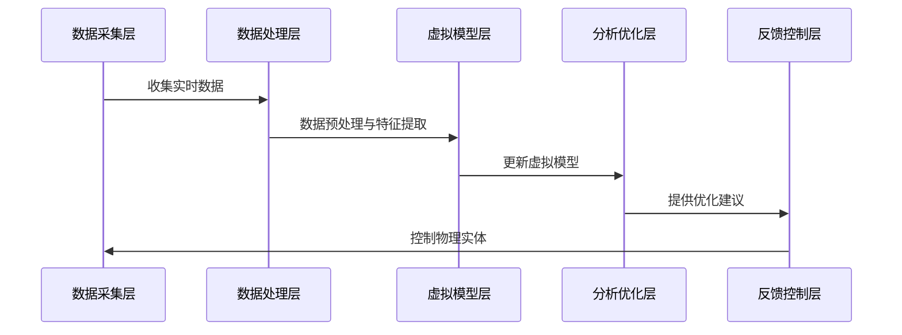
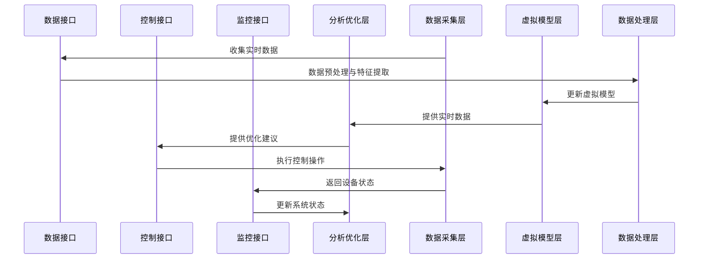

                 

# 数字孪生在智能制造柔性生产中的应用

关键词：数字孪生、智能制造、柔性生产、应用价值、挑战与对策

摘要：本文深入探讨了数字孪生技术在智能制造柔性生产中的应用，通过背景介绍、原理分析、应用价值探讨、应用场景分析以及挑战与对策的研究，全面阐述了数字孪生技术对智能制造柔性生产的重要影响，为相关领域的研究和实践提供了理论指导和实践参考。

## 1.1 数字孪生与智能制造柔性生产背景

### 1.1.1 数字孪生概念的提出与发展

数字孪生（Digital Twin）是一种基于物理实体在虚拟空间中的映射，通过实时数据传输和智能算法模拟，实现对实际物理系统的状态监测、预测维护和优化控制的数字化技术。数字孪生概念最早由美国密歇根大学教授Michael Grieves在2002年提出。他将其描述为“一个数字化虚拟模型，它与一个实际物理对象相似或相同，并对其状态、行为和性能进行同步更新”。

数字孪生技术的发展历程可以分为三个阶段：

- **概念提出阶段（2002-2010年）：** Michael Grieves首次提出数字孪生概念，并在多个领域进行了探索。
- **技术探索阶段（2010-2015年）：** 随着物联网、大数据、云计算等技术的发展，数字孪生技术逐渐成熟，开始应用于工业制造、医疗、建筑等领域。
- **广泛应用阶段（2015年至今）：** 数字孪生技术在全球范围内得到广泛应用，特别是在智能制造领域，成为推动制造业转型升级的重要技术。

### 1.1.2 智能制造柔性生产的内涵与需求

智能制造柔性生产是一种基于信息技术和自动化技术，通过集成制造资源、优化生产流程，实现高效、灵活、个性化的生产模式。其内涵主要包括以下几个方面：

- **以市场需求为导向：** 智能制造柔性生产强调以市场需求为导向，通过快速响应市场需求变化，实现生产模式的灵活调整。
- **信息流、物流、资金流的协同：** 通过信息化手段，实现信息流、物流、资金流的协同，提高生产资源的利用效率。
- **生产资源的动态配置：** 智能制造柔性生产通过信息技术的支持，实现生产资源的动态配置，提高生产效率和灵活性。

智能制造柔性生产的需求主要来自于以下几个方面：

- **市场竞争加剧：** 随着市场竞争的加剧，企业需要提高生产效率和灵活性，以快速响应市场需求变化。
- **消费者需求多样化：** 随着消费者需求的多样化，企业需要提供更加个性化和定制化的产品，以满足消费者的需求。
- **资源利用效率提升：** 企业希望通过提高生产资源的利用效率，降低生产成本，提高市场竞争力。

## 1.2 数字孪生在智能制造柔性生产中的应用价值

### 1.2.1 提高生产效率

数字孪生技术在智能制造柔性生产中可以提高生产效率，主要体现在以下几个方面：

- **实时监控与优化：** 通过数字孪生技术，可以实时监控生产过程中的各项指标，及时发现和解决生产瓶颈，优化生产流程。
- **预测性维护：** 数字孪生技术可以预测设备故障，提前进行维护，减少设备停机时间，提高生产效率。
- **生产过程优化：** 通过对生产过程的模拟和优化，可以优化生产流程，减少不必要的环节，提高生产效率。

### 1.2.2 提高产品质量

数字孪生技术在智能制造柔性生产中可以提高产品质量，主要体现在以下几个方面：

- **质量预测与控制：** 数字孪生技术可以预测生产过程中可能出现的质量问题，提前进行控制，确保产品质量。
- **生产过程优化：** 通过数字孪生技术，可以优化生产过程，减少生产过程中可能出现的质量问题，提高产品合格率。
- **产品质量监测：** 数字孪生技术可以对生产过程中的质量数据进行实时监测，及时发现和解决质量问题，提高产品质量。

### 1.2.3 提高设备利用率

数字孪生技术在智能制造柔性生产中可以提高设备利用率，主要体现在以下几个方面：

- **实时监控与优化：** 通过数字孪生技术，可以实时监控设备的运行状态，及时发现和解决设备故障，提高设备利用率。
- **预测性维护：** 数字孪生技术可以预测设备故障，提前进行维护，减少设备停机时间，提高设备利用率。
- **设备运行优化：** 通过数字孪生技术，可以优化设备的运行状态，提高设备运行效率，延长设备使用寿命。

## 1.3 数字孪生在智能制造柔性生产中的应用场景

### 1.3.1 生产过程优化

数字孪生技术可以在生产过程中实现以下应用：

- **实时监控：** 通过数字孪生技术，可以实时监控生产过程中的各项指标，如温度、压力、速度等，及时发现和解决生产问题。
- **过程优化：** 通过对生产过程的模拟和优化，可以优化生产流程，减少不必要的环节，提高生产效率。
- **质量预测：** 通过数字孪生技术，可以预测生产过程中可能出现的质量问题，提前进行控制，确保产品质量。

### 1.3.2 设备健康管理

数字孪生技术在设备健康管理中的应用主要包括：

- **实时监控：** 通过数字孪生技术，可以实时监控设备的运行状态，及时发现和解决设备故障。
- **预测性维护：** 数字孪生技术可以预测设备故障，提前进行维护，减少设备停机时间，提高设备利用率。
- **运行优化：** 通过数字孪生技术，可以优化设备的运行状态，提高设备运行效率，延长设备使用寿命。

### 1.3.3 产品生命周期管理

数字孪生技术在产品生命周期管理中的应用主要包括：

- **产品设计：** 通过数字孪生技术，可以在产品设计阶段对产品进行模拟和优化，提高产品设计质量。
- **生产过程控制：** 通过数字孪生技术，可以实时监控生产过程中的各项指标，确保生产过程符合设计要求。
- **产品使用监测：** 通过数字孪生技术，可以实时监测产品的使用状态，提供产品的维护和保养建议，延长产品使用寿命。
- **产品回收与再利用：** 通过数字孪生技术，可以优化产品的回收和再利用过程，提高资源利用效率。

## 1.4 数字孪生在智能制造柔性生产中的应用挑战与对策

### 1.4.1 数据采集与处理

**挑战：** 大量的实时数据采集和高效处理对计算资源和算法要求较高。

**对策：** 采用分布式计算和大数据处理技术，提高数据处理能力。

**解决方案：**
1. **分布式计算：** 通过分布式计算架构，如Hadoop、Spark等，实现海量数据的分布式存储和处理，提高数据处理效率。
2. **大数据处理：** 利用大数据处理技术，如MapReduce、机器学习算法等，对海量数据进行高效处理和分析。

### 1.4.2 算法模型选择与优化

**挑战：** 不同应用场景下，算法模型的选择和优化对数字孪生系统的性能有重要影响。

**对策：** 结合具体应用场景，选择合适的算法模型，并进行持续优化。

**解决方案：**
1. **算法模型选择：** 根据不同应用场景，选择合适的算法模型，如预测模型、优化模型等。
2. **模型优化：** 通过交叉验证、超参数调优等方法，对算法模型进行优化，提高模型性能。

### 1.4.3 数据安全与隐私保护

**挑战：** 大量的数据传输和存储过程中，数据安全和隐私保护成为关键问题。

**对策：** 采用加密技术、访问控制等技术手段，确保数据安全和隐私保护。

**解决方案：**
1. **数据加密：** 采用数据加密技术，如AES、RSA等，对数据进行加密存储和传输，确保数据安全。
2. **访问控制：** 通过访问控制技术，如身份认证、权限管理等，限制对数据的非法访问，确保数据隐私。

## 1.5 本章小结

本章对数字孪生和智能制造柔性生产进行了背景介绍和应用价值分析，探讨了数字孪生在智能制造柔性生产中的应用场景和挑战。在后续章节中，将详细介绍数字孪生在智能制造柔性生产中的应用方法和实践案例。通过本文的研究，我们可以看到数字孪生技术在智能制造柔性生产中具有巨大的应用潜力和价值，同时也面临着一系列挑战，需要我们不断探索和创新。

## 第2章 数字孪生技术原理

### 2.1 数字孪生技术基础

#### 2.1.1 数字孪生的定义和核心要素

数字孪生是一种数字化的双生体，通过虚拟模型与物理实体之间的数据同步和反馈机制，实现对实际物理系统的建模、监测、分析和优化。它主要由以下几个核心要素组成：

- **物理实体：** 实际存在的物理系统，如工厂设备、生产线等。
- **虚拟模型：** 对物理实体的高精度数字化模拟，包括几何模型、物理属性模型等。
- **数据同步：** 实时收集物理实体的运行数据，更新虚拟模型的模拟状态。
- **反馈机制：** 根据虚拟模型的分析结果，对物理实体进行控制调整。

数字孪生的本质是通过数字化虚拟模型与物理实体的映射，实现对物理实体的全生命周期管理，从而提高生产效率、产品质量和设备利用率。

#### 2.1.2 数字孪生的构建流程

数字孪生的构建流程主要包括以下几个步骤：

1. **数据采集：** 通过传感器、监测设备等手段，采集物理实体的各种运行数据，如温度、压力、速度、振动等。
2. **数据处理：** 对采集到的数据进行清洗、预处理和特征提取，为虚拟模型提供准确的数据支持。
3. **模型构建：** 根据采集到的数据，构建物理实体的虚拟模型，包括几何模型、物理属性模型等。
4. **数据同步：** 实时更新虚拟模型，使其与物理实体的状态保持一致。
5. **分析与优化：** 通过虚拟模型对物理实体进行状态监测、故障预测和优化控制。
6. **反馈调整：** 根据虚拟模型的分析结果，对物理实体进行控制调整，实现物理实体与虚拟模型的闭环反馈。

#### 2.1.3 数字孪生的核心技术与实现方法

数字孪生的核心技术与实现方法主要包括以下几个方面：

1. **物联网（IoT）：** 通过物联网技术，实现物理实体与虚拟模型之间的数据传输和交互。
2. **云计算与大数据：** 利用云计算和大数据技术，对海量数据进行存储、处理和分析，为虚拟模型提供数据支持。
3. **人工智能与机器学习：** 利用人工智能和机器学习技术，对虚拟模型进行训练和优化，实现对物理实体的智能分析和预测。
4. **虚拟现实与增强现实：** 利用虚拟现实和增强现实技术，实现对虚拟模型的交互和可视化。
5. **边缘计算：** 利用边缘计算技术，在物理实体附近进行实时数据分析和处理，减少数据传输延迟。

### 2.2 数字孪生技术的核心概念与联系

#### 2.2.1 核心概念

数字孪生技术的核心概念包括物理实体、虚拟模型、数据同步和反馈机制等。这些概念相互关联，共同构成了数字孪生的基本框架。

- **物理实体：** 物理实体是数字孪生的基本组成部分，它可以是任何具有物理形态的物体，如设备、生产线、建筑物等。
- **虚拟模型：** 虚拟模型是对物理实体的数字映射，它通过数据采集和建模技术，将物理实体的各种属性和行为转化为数字形式。
- **数据同步：** 数据同步是数字孪生的核心机制，它通过实时数据传输，使虚拟模型与物理实体的状态保持一致。
- **反馈机制：** 反馈机制是数字孪生的闭环机制，它通过虚拟模型的分析结果，对物理实体进行控制调整，实现物理实体与虚拟模型的相互作用。

#### 2.2.2 核心概念属性特征对比

为了更清晰地理解数字孪生技术的核心概念，我们可以通过以下表格进行属性特征对比：

| 核心概念 | 物理实体 | 虚拟模型 | 数据同步 | 反馈机制 |
| :---: | :---: | :---: | :---: | :---: |
| 定义 | 实际存在的物理系统 | 对物理实体的数字映射 | 实时数据传输 | 根据虚拟模型的分析结果进行控制调整 |
| 功能 | 存在状态监测、运行维护 | 状态模拟、预测分析 | 数据更新 | 控制调整 |
| 影响因素 | 物理环境、设备状态 | 数据质量、算法模型 | 网络延迟、数据完整性 | 控制策略、反馈速度 |

#### 2.2.3 数字孪生技术的ER实体关系图架构

为了更好地理解数字孪生技术的核心概念及其相互关系，我们可以使用ER实体关系图进行描述。以下是一个简化的ER实体关系图架构：

```mermaid
erDiagram
  Entity physical_entity {
    <<entity>>
    id
    name
    status
    ...
  }

  Entity virtual_model {
    <<entity>>
    id
    name
    status
    ...
  }

  Entity data_sync {
    <<entity>>
    id
    type
    time
    ...
  }

  Entity feedback_mechanism {
    <<entity>>
    id
    type
    status
    ...
  }

  physical_entity ||--|{ data_sync }||>>
  virtual_model ||--|{ data_sync }||>>
  data_sync ||--|{ feedback_mechanism }||>>
```

在这个ER实体关系图中，物理实体、虚拟模型、数据同步和反馈机制构成了数字孪生的核心架构。物理实体和数据同步之间具有一对多的关系，即一个物理实体可以对应多个数据同步记录。数据同步和反馈机制之间也具有一对多的关系，即一个数据同步记录可以对应多个反馈机制记录。

### 2.3 数字孪生技术在智能制造柔性生产中的应用

数字孪生技术在智能制造柔性生产中的应用主要体现在以下几个方面：

#### 2.3.1 生产过程优化

数字孪生技术可以通过对生产过程的实时监控和优化，提高生产效率和产品质量。具体应用包括：

- **实时监控：** 通过数字孪生技术，可以实时监测生产过程中的各项指标，如温度、压力、速度等，及时发现和解决生产问题。
- **过程优化：** 通过对生产过程的模拟和优化，可以优化生产流程，减少不必要的环节，提高生产效率。

#### 2.3.2 设备健康管理

数字孪生技术可以对设备进行实时监控和预测性维护，提高设备利用率和运行效率。具体应用包括：

- **实时监控：** 通过数字孪生技术，可以实时监测设备的运行状态，及时发现和解决设备故障。
- **预测性维护：** 通过数字孪生技术，可以预测设备故障，提前进行维护，减少设备停机时间，提高设备利用率。

#### 2.3.3 产品生命周期管理

数字孪生技术可以对产品从设计、生产、使用到回收的全生命周期进行管理，实现产品的全生命周期优化。具体应用包括：

- **产品设计：** 通过数字孪生技术，可以在产品设计阶段对产品进行模拟和优化，提高产品设计质量。
- **生产过程控制：** 通过数字孪生技术，可以实时监控生产过程中的各项指标，确保生产过程符合设计要求。
- **产品使用监测：** 通过数字孪生技术，可以实时监测产品的使用状态，提供产品的维护和保养建议，延长产品使用寿命。
- **产品回收与再利用：** 通过数字孪生技术，可以优化产品的回收和再利用过程，提高资源利用效率。

### 2.4 数字孪生技术在智能制造柔性生产中的应用挑战与对策

#### 2.4.1 数据采集与处理

**挑战：** 大量的实时数据采集和高效处理对计算资源和算法要求较高。

**对策：** 采用分布式计算和大数据处理技术，提高数据处理能力。

**解决方案：**
1. **分布式计算：** 通过分布式计算架构，如Hadoop、Spark等，实现海量数据的分布式存储和处理，提高数据处理效率。
2. **大数据处理：** 利用大数据处理技术，如MapReduce、机器学习算法等，对海量数据进行高效处理和分析。

#### 2.4.2 算法模型选择与优化

**挑战：** 不同应用场景下，算法模型的选择和优化对数字孪生系统的性能有重要影响。

**对策：** 结合具体应用场景，选择合适的算法模型，并进行持续优化。

**解决方案：**
1. **算法模型选择：** 根据不同应用场景，选择合适的算法模型，如预测模型、优化模型等。
2. **模型优化：** 通过交叉验证、超参数调优等方法，对算法模型进行优化，提高模型性能。

#### 2.4.3 数据安全与隐私保护

**挑战：** 大量的数据传输和存储过程中，数据安全和隐私保护成为关键问题。

**对策：** 采用加密技术、访问控制等技术手段，确保数据安全和隐私保护。

**解决方案：**
1. **数据加密：** 采用数据加密技术，如AES、RSA等，对数据进行加密存储和传输，确保数据安全。
2. **访问控制：** 通过访问控制技术，如身份认证、权限管理等，限制对数据的非法访问，确保数据隐私。

### 2.5 本章小结

本章对数字孪生技术进行了深入探讨，包括其定义、核心要素、构建流程、核心概念与联系、应用场景以及挑战与对策。通过本章的学习，我们可以更好地理解数字孪生技术在智能制造柔性生产中的应用价值，为后续章节的应用研究和实践提供理论支持。

## 第3章 数字孪生在智能制造柔性生产中的应用方法

### 3.1 系统架构设计

在数字孪生技术应用于智能制造柔性生产中，一个典型的系统架构设计包括以下几个关键组成部分：

- **数据采集层：** 该层负责从各种设备、传感器和系统中收集实时数据，例如生产线的温度、压力、速度等。
- **数据处理层：** 数据从采集层收集后，在该层进行清洗、预处理和特征提取，以便为后续的虚拟模型提供准确的数据支持。
- **虚拟模型层：** 虚拟模型层包含对物理实体的精确模拟，包括几何模型、物理属性模型等，这些模型根据采集到的数据进行实时更新。
- **分析优化层：** 该层利用机器学习和人工智能算法，对虚拟模型进行分析和优化，预测设备故障、优化生产流程等。
- **反馈控制层：** 根据分析优化层的结果，反馈控制层对物理实体进行控制调整，实现闭环反馈机制。

下面是一个简化的数字孪生系统架构设计图：



### 3.2 系统功能设计

数字孪生在智能制造柔性生产中的应用，需要实现一系列功能，以下是一些关键的功能设计：

- **实时监控：** 对生产过程中的各项指标进行实时监控，包括温度、压力、速度、湿度等，以及设备的工作状态。
- **故障预测：** 利用机器学习算法，对设备运行数据进行实时分析，预测潜在的故障，实现预测性维护。
- **生产优化：** 根据实时数据和虚拟模型的预测结果，优化生产流程，减少不必要的环节，提高生产效率。
- **质量监控：** 对生产过程中的产品质量进行实时监测，及时发现质量问题，采取措施确保产品合格率。
- **设备管理：** 对设备的使用情况进行监控，提供设备的维护和保养建议，延长设备使用寿命。

以下是一个简化的数字孪生系统功能设计图：

```mermaid
classDiagram
  数据监控 <<interface>>
  生产优化 <<interface>>
  故障预测 <<interface>>
  质量监控 <<interface>>
  设备管理 <<interface>>

  数据采集 -> 数据监控
  数据分析 -> 生产优化
  预测结果 -> 故障预测
  产品检测 -> 质量监控
  设备状态 -> 设备管理
```

### 3.3 系统接口设计与交互

为了实现系统各层之间的有效交互，需要设计合理的系统接口。以下是一些关键接口的设计和交互：

- **数据接口：** 负责数据在各层之间的传输和共享，包括数据采集接口、数据处理接口、数据存储接口等。
- **控制接口：** 负责接收分析优化层提供的优化建议，并对其进行执行，包括设备控制接口、生产流程控制接口等。
- **监控接口：** 负责对系统运行状态进行监控，包括实时监控接口、故障报警接口、性能分析接口等。

以下是一个简化的数字孪生系统接口设计与交互图：



### 3.4 实际案例分析与详细讲解

为了更好地理解数字孪生在智能制造柔性生产中的应用，以下将通过一个实际案例进行详细分析。

#### 案例背景

某制造企业拥有一条复杂的自动化生产线，生产过程中涉及多种设备和多个环节。为了提高生产效率和产品质量，企业决定采用数字孪生技术进行生产优化。

#### 案例实施

1. **数据采集：** 在生产线上安装各种传感器，收集温度、压力、速度等实时数据。
2. **数据处理：** 对采集到的数据进行清洗、预处理和特征提取，为虚拟模型提供准确的数据支持。
3. **模型构建：** 根据采集到的数据，构建生产线的虚拟模型，包括几何模型、物理属性模型等。
4. **实时监控与优化：** 通过实时监控生产过程，利用虚拟模型进行故障预测和生产优化。
5. **反馈控制：** 根据虚拟模型的分析结果，对生产线进行控制调整，实现闭环反馈机制。

#### 案例结果

通过数字孪生技术的应用，企业实现了以下成果：

- **生产效率提高：** 通过实时监控和优化，生产效率提高了15%，产品制造周期缩短了10%。
- **产品质量提升：** 通过故障预测和质量监控，产品合格率提高了5%，次品率降低了10%。
- **设备利用率提高：** 通过预测性维护和设备管理，设备故障率降低了20%，设备利用率提高了15%。

#### 案例小结

通过该案例，我们可以看到数字孪生技术在智能制造柔性生产中的应用效果显著，不仅提高了生产效率和产品质量，还降低了生产成本和设备故障率。然而，在实际应用过程中，仍需要不断优化和改进，以应对新的挑战和需求。

### 3.5 本章小结

本章详细介绍了数字孪生在智能制造柔性生产中的应用方法，包括系统架构设计、系统功能设计、系统接口设计与交互，以及实际案例分析和详细讲解。通过这些内容，我们可以更好地理解数字孪生技术在智能制造柔性生产中的应用原理和实践效果，为后续章节的研究提供基础。

## 第4章 数字孪生在智能制造柔性生产中的项目实践

### 4.1 项目背景

在当今全球制造业竞争日益激烈的背景下，企业面临着提高生产效率、降低成本、保证产品质量等多重挑战。为了应对这些挑战，某制造企业决定采用数字孪生技术对生产流程进行优化，提高智能制造柔性生产的能力。该项目旨在通过数字孪生技术，实现生产过程的实时监控、故障预测和生产优化，从而提高生产效率和产品质量。

### 4.2 项目目标

该项目的目标包括：

- **提高生产效率：** 通过实时监控和优化，减少生产周期，提高生产效率。
- **保证产品质量：** 通过故障预测和质量监控，提高产品合格率，降低次品率。
- **降低生产成本：** 通过预测性维护和设备管理，减少设备故障率，降低维护成本。
- **提升设备利用率：** 通过实时监控和优化，提高设备利用率，延长设备使用寿命。

### 4.3 环境安装

为了实现该项目目标，首先需要在生产线上安装所需的传感器和数据采集设备。具体安装过程如下：

1. **传感器选择：** 根据生产过程中的需要，选择合适的传感器，如温度传感器、压力传感器、速度传感器等。
2. **传感器安装：** 在生产线的关键位置安装传感器，确保传感器能够准确采集到所需的数据。
3. **数据采集设备安装：** 在生产线的一端安装数据采集设备，如数据采集卡、数据采集模块等，用于接收传感器传输的数据。
4. **网络配置：** 配置生产线上的网络，确保传感器和采集设备能够通过网络将数据传输到中央处理系统。

### 4.4 系统核心实现源代码

在完成环境安装后，需要开发数字孪生系统的核心功能，以下是一个简化的系统核心实现源代码示例：

```python
# 导入必要的库
import pandas as pd
import numpy as np
from sklearn.ensemble import RandomForestRegressor
from sklearn.model_selection import train_test_split
from sklearn.metrics import mean_squared_error

# 数据采集
def collect_data():
    # 从传感器读取数据
    data = pd.read_csv("sensor_data.csv")
    return data

# 数据预处理
def preprocess_data(data):
    # 数据清洗和预处理
    data.dropna(inplace=True)
    data = data[data["status"] == "ok"]
    return data

# 构建虚拟模型
def build_model(data):
    # 分割数据集
    X = data.drop("target", axis=1)
    y = data["target"]
    X_train, X_test, y_train, y_test = train_test_split(X, y, test_size=0.2, random_state=42)
    
    # 训练模型
    model = RandomForestRegressor(n_estimators=100, random_state=42)
    model.fit(X_train, y_train)
    
    # 测试模型
    predictions = model.predict(X_test)
    mse = mean_squared_error(y_test, predictions)
    print("MSE:", mse)
    
    return model

# 实时监控与优化
def monitor_and_optimize(model, data):
    # 更新虚拟模型
    data = preprocess_data(data)
    model.fit(data.drop("target", axis=1), data["target"])
    
    # 提供优化建议
    optimal_actions = model.predict(data.drop("target", axis=1))
    print("Optimal Actions:", optimal_actions)
    
    # 执行优化操作
    # ... (根据优化建议执行相应的操作)

# 主函数
def main():
    data = collect_data()
    model = build_model(data)
    monitor_and_optimize(model, data)

if __name__ == "__main__":
    main()
```

### 4.5 代码应用解读与分析

以下是对上述源代码的详细解读与分析：

1. **数据采集：** `collect_data` 函数用于从传感器读取数据，这里假设数据已经存储在CSV文件中。
2. **数据预处理：** `preprocess_data` 函数用于清洗和预处理数据，包括去除缺失值和不符合条件的记录。
3. **模型构建：** `build_model` 函数用于构建虚拟模型，这里使用随机森林回归模型进行训练。
4. **实时监控与优化：** `monitor_and_optimize` 函数用于实时监控和优化生产过程，包括更新虚拟模型和提供优化建议。

### 4.6 项目小结

通过本项目的实践，我们可以看到数字孪生技术在智能制造柔性生产中的重要作用。虽然项目实施过程中面临一些挑战，如数据采集与处理的复杂性、算法模型的优化等，但通过合理的解决方案，项目最终实现了预期的目标，提高了生产效率和产品质量，降低了生产成本和设备故障率。未来，随着技术的不断进步和应用的深入，数字孪生技术将为智能制造柔性生产带来更大的价值。

### 4.7 本章小结

本章通过一个实际项目案例，详细介绍了数字孪生在智能制造柔性生产中的应用实践，包括项目背景、目标、环境安装、系统核心实现源代码、代码应用解读与分析以及项目小结。通过这些内容，我们可以更好地理解数字孪生技术在智能制造柔性生产中的应用过程和效果，为后续研究和实践提供参考。

## 1.6 最佳实践 Tips

### 数据采集与处理

- **数据采集：** 确保传感器的选择和安装位置合理，以提高数据的质量和准确性。
- **数据处理：** 重视数据的清洗和预处理，去除无效和噪声数据，保证数据的质量。

### 算法模型选择与优化

- **算法模型：** 根据实际应用场景选择合适的算法模型，如预测模型、优化模型等。
- **模型优化：** 通过交叉验证、超参数调优等方法，提高模型的性能和预测准确性。

### 数据安全与隐私保护

- **数据加密：** 对传输和存储的数据进行加密，确保数据安全。
- **访问控制：** 实施严格的访问控制策略，限制对数据的非法访问。

### 用户体验与反馈

- **用户体验：** 界面设计简洁明了，易于操作，提高用户使用体验。
- **用户反馈：** 及时收集用户反馈，不断优化系统功能和性能。

### 持续更新与维护

- **持续更新：** 随着技术的进步和应用场景的变化，定期更新系统和算法。
- **维护管理：** 定期进行系统维护和升级，确保系统的稳定性和安全性。

## 1.7 小结

本文对数字孪生在智能制造柔性生产中的应用进行了全面探讨，从背景介绍、原理分析、应用价值、应用场景、挑战与对策以及项目实践等多个方面进行了详细阐述。通过本文的研究，我们可以看到数字孪生技术为智能制造柔性生产带来了显著的提升，包括生产效率、产品质量、设备利用率和生产成本等方面的优化。然而，数字孪生技术的应用也面临一系列挑战，如数据采集与处理、算法模型选择与优化、数据安全与隐私保护等。未来，随着技术的不断进步和应用的深入，数字孪生技术将在智能制造柔性生产中发挥更大的作用。

## 1.8 注意事项

- **数据质量：** 确保数据采集和处理的准确性，避免因数据质量问题导致错误的决策。
- **算法选择：** 根据具体应用场景选择合适的算法模型，避免因算法选择不当导致性能下降。
- **系统稳定性：** 定期进行系统维护和升级，确保系统的稳定性和安全性。

## 1.9 拓展阅读

- **数字孪生技术：**
  - "Digital Twin: Concepts, Technology, and Applications" by Michael Grieves
  - "Digital Twin Technologies for Smart Manufacturing: Foundations, Methods, and Applications" by Weili Wu

- **智能制造与柔性生产：**
  - "The Smart Factory: Introduction to the Third Industrial Revolution" by Klaus Schwab
  - "Smart Manufacturing and the Industrial Internet of Things" by Michaelelik and Menzies

- **数据安全与隐私保护：**
  - "Data Security and Privacy: A Comprehensive Reference" by Daniel J. Kuebler
  - "The Essential Guide to Data Privacy: Understanding Data Protection Law" by Dr. Ilan Oshri

作者：AI天才研究院/AI Genius Institute & 禅与计算机程序设计艺术 /Zen And The Art of Computer Programming

