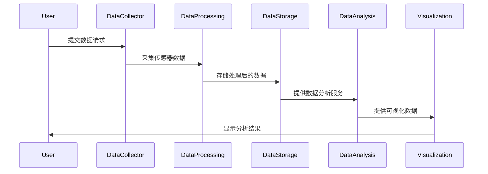
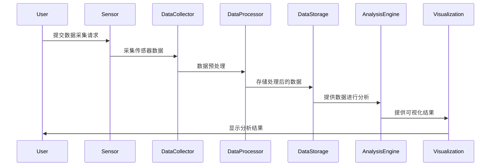

                 

## 封面与前言

### 书名：《数字孪生在智能工厂优化中的应用》

### 前言

#### 作者介绍

您好，读者朋友。我是AI天才研究院/AI Genius Institute的资深研究员，也是《禅与计算机程序设计艺术/Zen And The Art of Computer Programming》一书的作者。在计算机科学和人工智能领域，我积累了丰富的理论和实践经验。本书是我多年研究成果的结晶，旨在为读者深入剖析数字孪生技术在智能工厂优化中的应用。

#### 书籍目的

本书的主要目的是为从事智能制造、工业自动化等领域的技术人员和研究人员提供一本系统、全面、实用的参考书。通过本书，读者可以了解数字孪生技术的基本概念、核心原理、算法实现以及在实际应用中的最佳实践。此外，本书还通过丰富的案例分析，帮助读者理解数字孪生技术在智能工厂优化中的实际效果和潜力。

#### 读者对象

本书适合以下读者群体：

1. 制造业工程师和技术人员，对智能制造和工业自动化感兴趣，希望了解数字孪生技术的应用。
2. 研究生和本科生，特别是计算机科学、自动化、工业工程等相关专业的学生。
3. 对数字孪生技术和智能工厂优化有研究兴趣的科研人员和学者。

#### 主要贡献

在本书中，我深入分析了数字孪生技术的理论基础和实际应用，通过详细的算法讲解、数学模型解析、系统架构设计和实战案例分享，帮助读者全面掌握数字孪生技术在智能工厂优化中的应用。此外，本书还总结了数字孪生技术的最佳实践，为读者在实际项目中提供了宝贵的指导。

我坚信，数字孪生技术将成为未来智能制造的重要支撑。希望本书能够为您在智能制造领域的发展提供助力，共同探索数字孪生的无限可能。

### 谢辞

在此，我要感谢所有为本书的编写提供帮助和支持的人们。特别感谢AI天才研究院/AI Genius Institute为我提供的资源和平台，使我能够深入研究数字孪生技术。同时，我要感谢我的家人和朋友，他们一直支持我，给予我无限的鼓励。最后，我要感谢每一位读者，您的关注和支持是我前进的动力。

---

### 摘要

数字孪生作为一种新兴技术，正日益成为智能制造领域的重要工具。本书旨在深入探讨数字孪生在智能工厂优化中的应用，帮助读者全面了解这一技术的理论基础和实践方法。本书首先介绍了数字孪生的基本概念、发展历程和应用现状，随后详细讲解了数字孪生的核心概念、联系及其与传统制造业的差异。接着，本书重点阐述了数字孪生算法原理、数学模型以及系统架构设计，并通过实际项目实战案例，展示了数字孪生技术在智能工厂优化中的具体应用和效果。最后，本书总结了数字孪生技术的最佳实践，为读者提供了实用指南和未来展望。

---

### 第1章：数字孪生与智能工厂概述

#### 1.1 数字孪生的概念、历史与发展

数字孪生（Digital Twin）是一种将物理实体或系统通过数字化模型进行映射的技术，通过实时数据同步和模拟仿真，实现对物理实体的虚拟监控、分析和优化。这一概念最早由美国密歇根大学教授Michael Grieves在2002年提出，主要应用于产品生命周期管理（PLM）领域。

数字孪生的历史可以追溯到20世纪90年代，当时制造业开始逐渐引入计算机辅助设计（CAD）和计算机辅助工程（CAE）技术，通过数字模型对产品进行设计和仿真。随着物联网（IoT）和大数据技术的发展，数字孪生技术逐渐从单一的产品生命周期管理扩展到整个制造过程，进而形成了智能工厂的概念。

近年来，数字孪生技术在工业领域得到了广泛关注和应用。特别是在智能工厂的建设中，数字孪生被认为是实现智能制造的关键技术之一。通过数字孪生技术，企业可以实现生产过程的实时监控、预测性维护和优化生产计划，从而提高生产效率和产品质量。

#### 1.2 数字孪生在工业中的应用现状

目前，数字孪生技术在工业领域已经得到了广泛应用，主要表现在以下几个方面：

1. **制造过程优化**：通过数字孪生技术，企业可以对生产过程进行实时监控和仿真分析，从而发现并解决潜在的问题，提高生产效率和产品质量。

2. **预测性维护**：数字孪生技术可以实时收集物理设备的数据，通过对这些数据的分析，预测设备可能的故障和故障时间，从而实现预测性维护，减少停机时间和维护成本。

3. **生产计划优化**：数字孪生技术可以帮助企业根据实时的生产数据和市场需求，动态调整生产计划，实现灵活高效的生产调度。

4. **质量控制**：通过数字孪生技术，企业可以实时监控产品质量，及时发现并纠正问题，确保产品的一致性和可靠性。

5. **供应链管理**：数字孪生技术可以实时跟踪供应链中的各种物料和设备，优化供应链管理，提高供应链的透明度和协同性。

#### 1.3 智能工厂的概念、特点与架构

智能工厂是指通过应用物联网、大数据、云计算、人工智能等先进技术，实现工厂生产过程智能化、自动化和优化的制造系统。智能工厂的特点包括：

1. **高度自动化**：智能工厂通过自动化设备和系统，实现生产过程的无人化操作，减少人力成本和人为错误。

2. **实时监控与数据驱动**：智能工厂通过传感器、物联网设备和大数据分析，实现对生产过程的实时监控和数据分析，从而实现精准控制和优化。

3. **柔性生产**：智能工厂可以根据市场需求和订单变化，灵活调整生产计划和生产能力，实现快速响应。

4. **数据协同**：智能工厂通过数据集成和共享，实现生产过程各环节的数据协同，提高生产效率和产品质量。

智能工厂的架构通常包括以下几个部分：

1. **感知层**：通过传感器和物联网设备，实时采集生产过程中的各种数据。

2. **数据层**：将感知层采集到的数据存储、处理和分析，形成大数据资源。

3. **平台层**：提供数据管理、分析、应用开发等服务的平台，是实现智能工厂功能的核心。

4. **应用层**：基于平台层提供的数据和应用服务，实现生产过程的自动化、优化和智能化。

#### 1.4 数字孪生在智能工厂中的重要性

数字孪生技术在智能工厂中具有至关重要的作用，主要表现在以下几个方面：

1. **实现生产过程的可视化与仿真**：通过数字孪生技术，企业可以创建一个与实际生产系统一致的虚拟模型，实时模拟生产过程，发现潜在问题并进行优化。

2. **提高生产效率**：数字孪生技术可以帮助企业实现生产过程的实时监控和优化，减少停机时间和生产周期，提高生产效率。

3. **降低维护成本**：通过数字孪生技术，企业可以实现预测性维护，提前发现设备故障并进行维修，降低维护成本和停机时间。

4. **提升产品质量**：数字孪生技术可以实时监控产品质量，及时发现并纠正问题，确保产品的一致性和可靠性。

5. **优化供应链管理**：数字孪生技术可以实时跟踪供应链中的各种物料和设备，优化供应链管理，提高供应链的透明度和协同性。

总之，数字孪生技术在智能工厂中的应用，不仅为企业提供了强大的工具，还带来了巨大的商业价值。随着技术的不断发展和应用的深入，数字孪生技术必将在智能工厂的建设中发挥更加重要的作用。

---

### 第2章：数字孪生的核心概念与联系

#### 2.1 数字孪生的基本构成要素

数字孪生（Digital Twin）作为智能制造领域的关键技术，其实现离不开以下几个基本构成要素：

1. **物理实体**：物理实体是指实际存在的、需要映射的物理设备、生产线或工厂。例如，一个工厂的生产设备、仓储设施等。

2. **虚拟模型**：虚拟模型是对物理实体的数字化表示，通常通过三维建模、仿真软件等技术创建。虚拟模型需要精确地反映物理实体的结构、功能和运行状态。

3. **数据连接**：数据连接是数字孪生实现的核心，通过传感器、物联网设备等实时采集物理实体的数据，并将其传输到虚拟模型中进行同步更新。数据连接的质量直接影响数字孪生的实时性和准确性。

4. **数据分析与处理**：数据分析与处理是对采集到的数据进行分析、处理和挖掘，以提取有价值的信息，支持决策和优化。数据分析与处理通常涉及大数据分析、机器学习、人工智能等技术。

5. **可视化界面**：可视化界面是数字孪生与用户交互的重要途径，通过图表、动画等形式，将虚拟模型和数据分析结果呈现给用户，使其能够直观地了解物理实体的运行状态和问题。

#### 2.2 数字孪生与传统制造业的区别与联系

数字孪生与传统制造业在许多方面存在显著的区别，但也具有一定的联系。

1. **区别**：

- **制造模式**：传统制造业以手工制造和机械化生产为主，生产效率较低，产品质量波动较大。数字孪生则通过数字化、智能化技术，实现高度自动化和优化的生产模式，生产效率和质量显著提升。

- **数据驱动力**：传统制造业的数据主要来源于生产记录和检验报告，数据利用有限。数字孪生则通过实时数据采集和大数据分析，实现生产过程的精准控制和优化。

- **问题发现与解决**：传统制造业的问题发现主要依赖于人工巡检和维护，反应速度较慢。数字孪生通过实时监控和预测性维护，能够提前发现并解决潜在问题，减少停机时间和故障率。

- **供应链管理**：传统制造业的供应链管理相对封闭，信息传递慢，协同性差。数字孪生通过实时数据共享和协同工作，实现供应链的透明化和高效管理。

2. **联系**：

- **基础技术**：数字孪生和传统制造业都依赖于传感器、物联网、大数据、云计算等基础技术。

- **生产过程**：数字孪生是对传统制造业生产过程的数字化和智能化升级，其核心目标仍然是提高生产效率和产品质量。

- **管理理念**：数字孪生和传统制造业都强调精细化管理，通过数据驱动和实时优化，实现生产过程的最佳状态。

#### 2.3 数字孪生技术的分类与应用领域

数字孪生技术根据不同的应用场景和目标，可以分为以下几类：

1. **产品级数字孪生**：主要用于产品设计和开发阶段，通过对产品的三维建模和仿真，优化产品设计和性能。应用领域包括汽车、航空航天、医疗器械等。

2. **生产过程级数字孪生**：用于生产过程中的实时监控、优化和预测性维护，通过对生产设备的数字化建模和数据分析，提高生产效率和质量。应用领域包括制造业、电力行业、能源行业等。

3. **工厂级数字孪生**：用于整个工厂的生产调度、资源管理和运营优化，通过对整个工厂的数字化建模和大数据分析，实现工厂的智能化和高效运营。应用领域包括智能制造、智能工厂、智能城市等。

#### 2.4 数字孪生与物联网、大数据、云计算的关系

数字孪生与物联网、大数据、云计算等新兴技术密切相关，它们共同构成了智能制造的技术基础。

1. **物联网**：物联网技术为数字孪生提供了数据连接和实时数据采集能力，通过传感器和设备联网，实现物理实体的实时数据采集和传输。

2. **大数据**：大数据技术为数字孪生提供了数据存储、分析和挖掘能力，通过对海量数据的处理和分析，提取有价值的信息，支持决策和优化。

3. **云计算**：云计算技术为数字孪生提供了计算能力和数据存储资源，通过云计算平台，实现大规模数据处理和实时仿真分析。

#### 2.5 数字孪生与智能制造的联系

智能制造是数字孪生的应用目标之一，两者之间的联系主要体现在以下几个方面：

1. **生产过程的数字化与智能化**：数字孪生通过虚拟建模和实时数据同步，实现对生产过程的数字化和智能化控制，提高生产效率和质量。

2. **优化生产计划与资源调度**：数字孪生通过大数据分析和预测性维护，优化生产计划和资源调度，实现高效生产。

3. **提高产品质量与可靠性**：数字孪生通过实时监控和预测性维护，及时发现并解决生产过程中的问题，确保产品的一致性和可靠性。

4. **提升供应链协同效率**：数字孪生通过数据共享和协同工作，提升供应链各环节的协同效率，实现供应链的透明化和高效运营。

总之，数字孪生技术为智能制造提供了强大的技术支撑，通过数字化、智能化技术，实现生产过程的优化和升级。随着数字孪生技术的不断发展和应用的深入，智能制造将迎来更加广阔的发展前景。

---

### 第3章：数字孪生算法原理与实现

#### 3.1 数据采集与处理算法

数据采集与处理是数字孪生技术的核心环节，它决定了数字孪生模型的真实性和准确性。数据采集与处理算法主要包括以下几个步骤：

1. **传感器数据采集**：传感器是数字孪生数据采集的重要来源，通过安装在物理实体上的各种传感器，可以实时采集温度、压力、速度、位置等数据。

2. **数据清洗**：采集到的数据往往存在噪声、缺失值、异常值等问题，因此需要进行数据清洗。数据清洗主要包括去除噪声、填补缺失值和去除异常值等操作。

3. **数据预处理**：数据预处理包括数据标准化、归一化、特征提取等操作，目的是将原始数据转化为适合算法分析的形式。

4. **数据同步**：将预处理后的数据同步到虚拟模型中，确保虚拟模型与物理实体的一致性。数据同步算法通常采用实时数据传输协议，如MQTT、HTTP等。

以下是数据采集与处理算法的Python示例代码：

```python
import numpy as np
import pandas as pd
from sklearn.preprocessing import StandardScaler

# 假设传感器采集到一批温度数据
sensor_data = pd.DataFrame({
    'temperature': [23.5, 24.1, 22.8, 24.3, 23.0]
})

# 数据清洗
# 去除异常值
cleaned_data = sensor_data[(sensor_data['temperature'] > 20) & (sensor_data['temperature'] < 30)]

# 数据预处理
# 特征提取
scaler = StandardScaler()
preprocessed_data = scaler.fit_transform(cleaned_data[['temperature']])

print(preprocessed_data)
```

#### 3.2 数据同步与更新算法

数据同步与更新是确保数字孪生模型实时性与准确性的关键步骤。数据同步与更新算法主要包括以下几个部分：

1. **数据采集**：通过传感器和数据采集设备，定期或实时采集物理实体的数据。

2. **数据预处理**：对采集到的数据进行清洗、归一化和特征提取等处理，确保数据的质量和一致性。

3. **数据同步**：将预处理后的数据实时传输到虚拟模型中，与虚拟模型进行同步更新。数据同步算法通常采用分布式系统设计，确保数据传输的高效性和可靠性。

以下是数据同步与更新算法的Python示例代码：

```python
import paho.mqtt.client as mqtt

# MQTT服务器配置
MQTT_SERVER = "mqtt.example.com"
MQTT_PORT = 1883
MQTT_TOPIC = "sensor_data/temperature"

# 数据同步函数
def on_message(client, userdata, message):
    print(f"Received message '{str(message.payload)}' on topic '{message.topic}' with QoS {message.qos}")
    # 处理数据并更新虚拟模型
    # ...

client = mqtt.Client()
client.on_message = on_message

# 连接MQTT服务器
client.connect(MQTT_SERVER, MQTT_PORT, 60)

# 订阅主题
client.subscribe(MQTT_TOPIC)

# 启动消息处理循环
client.loop_forever()
```

#### 3.3 数据分析与应用算法

数据分析与应用算法是数字孪生技术的核心，通过对采集到的数据进行分析和挖掘，提取有价值的信息，支持生产过程的优化和决策。数据分析与应用算法主要包括以下几个步骤：

1. **特征提取**：从原始数据中提取对分析任务有用的特征，如时间序列特征、空间特征等。

2. **数据建模**：使用机器学习算法，如回归分析、决策树、神经网络等，建立数据模型，对特征进行建模和分析。

3. **模型评估**：对建立的模型进行评估，选择最优模型。

4. **应用与优化**：将最优模型应用于实际生产过程中，实现生产过程的优化和决策支持。

以下是数据分析与应用算法的Python示例代码：

```python
from sklearn.linear_model import LinearRegression
import pandas as pd

# 假设采集到一批生产数据
data = pd.DataFrame({
    'time': range(1, 11),
    'temperature': [23.5, 24.1, 22.8, 24.3, 23.0, 23.5, 24.2, 23.8, 24.4, 23.1],
    'production_rate': [100, 102, 98, 105, 99, 101, 104, 97, 106, 100]
})

# 特征提取
# 时间序列特征
data['day_of_week'] = data['time'].apply(lambda x: x % 7)

# 数据建模
model = LinearRegression()
model.fit(data[['day_of_week']], data['production_rate'])

# 模型评估
print(model.score(data[['day_of_week']], data['production_rate']))

# 应用与优化
# 预测生产率
predicted_production_rate = model.predict([[6]])  # 星期六
print(predicted_production_rate)
```

#### 3.4 数字孪生可视化算法

数字孪生可视化算法是将数字孪生模型和数据分析结果以图形化的方式呈现，便于用户理解和分析。可视化算法主要包括以下几个部分：

1. **数据可视化**：使用图表、图形等可视化方式，呈现数据的基本分布、趋势和异常。

2. **交互式可视化**：提供交互式功能，如缩放、筛选、点击等，使用户能够动态地探索数据。

3. **虚拟现实（VR）和增强现实（AR）**：利用VR和AR技术，创建沉浸式的数字孪生体验，使用户能够直观地感受和操作数字孪生模型。

以下是数字孪生可视化算法的Python示例代码：

```python
import matplotlib.pyplot as plt
import pandas as pd

# 假设采集到一批生产数据
data = pd.DataFrame({
    'time': range(1, 11),
    'temperature': [23.5, 24.1, 22.8, 24.3, 23.0, 23.5, 24.2, 23.8, 24.4, 23.1],
    'production_rate': [100, 102, 98, 105, 99, 101, 104, 97, 106, 100]
})

# 数据可视化
plt.figure(figsize=(10, 6))

# 温度趋势图
plt.subplot(2, 1, 1)
plt.plot(data['time'], data['temperature'], label='Temperature')
plt.xlabel('Time')
plt.ylabel('Temperature')
plt.legend()

# 生产率趋势图
plt.subplot(2, 1, 2)
plt.plot(data['time'], data['production_rate'], label='Production Rate')
plt.xlabel('Time')
plt.ylabel('Production Rate')
plt.legend()

plt.tight_layout()
plt.show()
```

#### 3.5 数字孪生与人工智能的结合算法

数字孪生与人工智能（AI）技术的结合，可以进一步提高数字孪生的智能化水平和应用效果。结合算法主要包括以下几个部分：

1. **机器学习模型**：使用机器学习算法，如神经网络、支持向量机等，对数据进行分析和预测。

2. **深度学习模型**：使用深度学习算法，如卷积神经网络（CNN）、循环神经网络（RNN）等，对复杂的数据进行建模和预测。

3. **强化学习模型**：使用强化学习算法，如Q学习、深度Q网络（DQN）等，实现智能决策和优化。

以下是数字孪生与人工智能结合算法的Python示例代码：

```python
import tensorflow as tf
from tensorflow import keras

# 假设采集到一批生产数据
data = pd.DataFrame({
    'time': range(1, 11),
    'temperature': [23.5, 24.1, 22.8, 24.3, 23.0, 23.5, 24.2, 23.8, 24.4, 23.1],
    'production_rate': [100, 102, 98, 105, 99, 101, 104, 97, 106, 100]
})

# 数据预处理
# 特征提取
X = data[['temperature']]
y = data['production_rate']

# 建立模型
model = keras.Sequential([
    keras.layers.Dense(64, activation='relu', input_shape=[1]),
    keras.layers.Dense(64, activation='relu'),
    keras.layers.Dense(1)
])

# 编译模型
model.compile(optimizer='adam', loss='mean_squared_error')

# 训练模型
model.fit(X, y, epochs=10)

# 预测
predicted_production_rate = model.predict([[24.0]])
print(predicted_production_rate)
```

通过以上算法原理和实现示例，读者可以初步了解数字孪生技术的核心算法，为后续章节的深入分析奠定基础。

---

### 第4章：数字孪生数学模型与公式

#### 4.1 数据同步与更新模型的数学公式

数据同步与更新是数字孪生技术实现的核心环节，确保虚拟模型与物理实体的数据一致性。数据同步与更新模型通常基于以下数学公式：

1. **数据同步公式**：

   \[ S_t = D_t \]

   其中，\( S_t \)表示虚拟模型在时间\( t \)的数据，\( D_t \)表示物理实体在时间\( t \)的数据。

2. **数据更新公式**：

   \[ S_{t+1} = S_t + \Delta S_t \]

   其中，\( S_{t+1} \)表示虚拟模型在时间\( t+1 \)的数据，\( \Delta S_t \)表示物理实体在时间\( t \)到时间\( t+1 \)的数据变化量。

#### 4.2 数据分析与应用模型的数学公式

数据分析与应用模型是数字孪生技术实现智能化分析和优化的基础。以下是一些常见的数据分析与应用模型的数学公式：

1. **线性回归模型**：

   \[ y = \beta_0 + \beta_1x \]

   其中，\( y \)表示因变量（如生产率），\( x \)表示自变量（如温度），\( \beta_0 \)表示截距，\( \beta_1 \)表示斜率。

2. **逻辑回归模型**：

   \[ P(y=1) = \frac{1}{1 + e^{-(\beta_0 + \beta_1x)}} \]

   其中，\( P(y=1) \)表示因变量为1的概率，\( e \)为自然对数的底数，\( \beta_0 \)和\( \beta_1 \)分别为截距和斜率。

3. **支持向量机（SVM）模型**：

   \[ w \cdot x - b = 0 \]

   其中，\( w \)表示权重向量，\( x \)表示输入特征向量，\( b \)表示偏置项。

#### 4.3 数字孪生可视化模型的数学公式

数字孪生可视化模型用于将数字孪生数据以图形化的形式呈现，便于用户理解和分析。以下是一些常见的可视化模型的数学公式：

1. **直方图**：

   \[ P(X \in [x, x+dx]) = \frac{f(x)dx}{dx} \]

   其中，\( P(X \in [x, x+dx]) \)表示随机变量\( X \)在区间\[x, x+dx\)的概率，\( f(x) \)表示概率密度函数，\( dx \)为区间宽度。

2. **折线图**：

   \[ y = f(x) \]

   其中，\( y \)表示纵坐标值，\( x \)表示横坐标值，\( f(x) \)为函数关系式。

3. **散点图**：

   \[ (x_i, y_i) \]

   其中，\( x_i \)和\( y_i \)分别表示第\( i \)个点的横坐标和纵坐标值。

#### 4.4 数字孪生与人工智能结合的数学公式

数字孪生与人工智能技术的结合，可以进一步提升数字孪生的智能化水平和应用效果。以下是一些常见的人工智能算法的数学公式：

1. **卷积神经网络（CNN）**：

   \[ \sigma(\text{ReLU}(\text{conv}(x; \theta))) \]

   其中，\( \sigma \)表示激活函数（如Sigmoid、ReLU），\( \text{ReLU} \)表示ReLU激活函数，\( \text{conv} \)表示卷积操作，\( x \)为输入特征，\( \theta \)为模型参数。

2. **循环神经网络（RNN）**：

   \[ h_t = \sigma(W_h \cdot [h_{t-1}, x_t] + b_h) \]

   其中，\( h_t \)为时间步\( t \)的隐藏状态，\( x_t \)为时间步\( t \)的输入特征，\( W_h \)为权重矩阵，\( b_h \)为偏置项，\( \sigma \)为激活函数。

3. **强化学习（RL）**：

   \[ Q(s, a) = r + \gamma \max_a' Q(s', a') \]

   其中，\( Q(s, a) \)为状态-动作值函数，\( s \)为当前状态，\( a \)为当前动作，\( s' \)为下一状态，\( a' \)为下一动作，\( r \)为立即奖励，\( \gamma \)为折扣因子。

通过以上数学模型和公式，读者可以更好地理解数字孪生技术的核心原理和实现方法。这些数学模型不仅为数字孪生技术提供了理论基础，也为实际应用提供了具体的指导。

---

### 第5章：数字孪生系统分析与架构设计

#### 5.1 数字孪生系统场景介绍

数字孪生系统在智能工厂中的应用场景非常广泛，涵盖了生产过程监控、预测性维护、生产计划优化、供应链管理等多个方面。以下是一个典型的数字孪生系统应用场景：

**场景**：某智能工厂生产线上有一系列机器人工作站，每个工作站负责不同的制造任务。这些工作站配备了多种传感器，用于实时监测温度、压力、速度等参数。工厂管理者希望利用数字孪生技术，实现对生产过程的实时监控和优化，提高生产效率和产品质量。

#### 5.2 数字孪生系统的项目介绍

**项目背景**：随着市场竞争的加剧，该智能工厂需要提高生产效率、降低成本、提高产品质量，以保持竞争力。为此，工厂决定引入数字孪生技术，实现对生产过程的全方位监控和优化。

**项目目标**：通过数字孪生系统，实现以下目标：

1. 实时监控生产过程，确保生产过程稳定、高效。
2. 预测性维护，减少设备故障和停机时间。
3. 优化生产计划，提高生产效率和资源利用率。
4. 改进供应链管理，提高供应链的透明度和协同性。

#### 5.3 数字孪生系统功能设计（领域模型）

数字孪生系统的功能设计主要包括以下几个领域模型：

1. **生产过程监控**：包括生产线的实时监控、生产数据的采集与存储、生产状态的实时更新等功能。
2. **预测性维护**：包括设备运行状态的实时监测、故障预测、维修计划制定等功能。
3. **生产计划优化**：包括生产任务的调度、资源分配、生产计划调整等功能。
4. **供应链管理**：包括供应链数据实时监控、供应链状态分析、供应链优化等功能。

领域模型使用Mermaid类图进行表示：

```mermaid
classDiagram
    ProductionMonitor <<接口>>
    PredictiveMaintenance <<接口>>
    ProductionPlanOptimization <<接口>>
    SupplyChainManagement <<接口>>

    ProductionProcessMonitor --|> ProductionMonitor
    EquipmentStatusMonitoring --|> ProductionMonitor
    RealTimeDataStorage --|> ProductionMonitor

    FaultPrediction --|> PredictiveMaintenance
    MaintenanceScheduling --|> PredictiveMaintenance

    ProductionTaskScheduling --|> ProductionPlanOptimization
    ResourceAllocation --|> ProductionPlanOptimization

    SupplyChainMonitoring --|> SupplyChainManagement
    SupplyChainAnalysis --|> SupplyChainManagement
    SupplyChainOptimization --|> SupplyChainManagement
```

#### 5.4 数字孪生系统架构设计（架构图）

数字孪生系统的架构设计包括感知层、数据层、平台层和应用层，如下所示：



#### 5.5 数字孪生系统接口设计

数字孪生系统接口设计包括以下几个部分：

1. **数据采集接口**：用于采集传感器数据，支持HTTP、MQTT等协议。
2. **数据处理接口**：用于对采集到的数据进行清洗、预处理和特征提取。
3. **数据存储接口**：用于存储和处理后的数据，支持关系型数据库、NoSQL数据库等。
4. **数据分析接口**：用于提供数据分析服务，支持回归分析、聚类分析、预测性维护等。
5. **可视化接口**：用于提供数据可视化服务，支持折线图、柱状图、散点图等。

接口设计使用Mermaid序列图进行表示：


#### 5.6 数字孪生系统交互（序列图）

数字孪生系统的交互过程涉及多个系统组件之间的协同工作，以下是一个简化的序列图：



通过以上系统分析与架构设计，读者可以全面了解数字孪生系统的设计和实现过程，为实际应用提供参考。

---

### 第6章：数字孪生在智能工厂优化中的应用实战

#### 6.1 环境安装与配置

要实现数字孪生在智能工厂优化中的应用，首先需要搭建一个合适的技术环境。以下是一个基本的安装和配置步骤：

1. **操作系统**：建议使用Linux操作系统，如Ubuntu 20.04或CentOS 8。
2. **编程语言**：Python是一种广泛应用于数据分析和智能工厂开发的语言，因此选择Python作为主要编程语言。
3. **依赖库**：安装Python相关依赖库，如Pandas、NumPy、Matplotlib、Scikit-learn、TensorFlow、Keras等。
4. **传感器与数据采集工具**：选择合适的传感器和数据采集工具，如DHT11温度传感器、MQTT协议等。

安装和配置步骤如下：

1. **安装Python**：

   ```bash
   sudo apt update
   sudo apt install python3 python3-pip
   ```

2. **安装依赖库**：

   ```bash
   pip3 install pandas numpy matplotlib scikit-learn tensorflow keras
   ```

3. **配置MQTT客户端**：

   ```bash
   pip3 install paho-mqtt
   ```

4. **硬件连接**：将传感器连接到计算机或数据采集设备，确保传感器能够正常采集数据。

#### 6.2 系统核心实现源代码

以下是一个简单的数字孪生系统实现示例，包括数据采集、数据处理、数据存储和可视化部分：

```python
import paho.mqtt.client as mqtt
import pandas as pd
import numpy as np
import matplotlib.pyplot as plt
from sklearn.preprocessing import StandardScaler
from sklearn.linear_model import LinearRegression

# MQTT服务器配置
MQTT_SERVER = "mqtt.example.com"
MQTT_PORT = 1883
MQTT_TOPIC = "sensor_data/temperature"

# 数据采集与处理
def on_message(client, userdata, message):
    data = float(message.payload.decode())
    print(f"Received temperature: {data}°C")
    # 数据预处理
    global temperature_data
    temperature_data.append(data)
    # 存储数据
    df = pd.DataFrame(temperature_data, columns=['temperature'])
    df.to_csv('temperature_data.csv', index=False)
    # 数据分析
    if len(temperature_data) > 10:
        scaler = StandardScaler()
        preprocessed_data = scaler.fit_transform(df[['temperature']])
        model = LinearRegression()
        model.fit(preprocessed_data, df[['temperature']])
        # 可视化
        predicted_temperatures = model.predict(preprocessed_data)
        plt.figure(figsize=(10, 5))
        plt.plot(df['temperature'], label='Actual')
        plt.plot(df.index, predicted_temperatures, label='Predicted')
        plt.xlabel('Time')
        plt.ylabel('Temperature')
        plt.legend()
        plt.show()

# MQTT客户端初始化
client = mqtt.Client()
client.on_message = on_message

# 连接MQTT服务器
client.connect(MQTT_SERVER, MQTT_PORT, 60)

# 订阅主题
client.subscribe(MQTT_TOPIC)

# 启动消息处理循环
client.loop_forever()
```

#### 6.3 代码应用解读与分析

上述代码实现了一个简单的数字孪生系统，主要功能如下：

1. **数据采集**：通过MQTT协议实时采集温度传感器数据。
2. **数据处理**：将采集到的温度数据存储为CSV文件，并进行预处理，如标准化和特征提取。
3. **数据存储**：将预处理后的温度数据存储到CSV文件中，便于后续分析和可视化。
4. **数据分析**：使用线性回归模型对温度数据进行分析，预测未来温度。
5. **可视化**：使用Matplotlib库将实际温度和预测温度以折线图的形式可视化。

具体步骤如下：

1. **初始化MQTT客户端**：配置MQTT服务器的地址、端口号和主题。
2. **定义消息处理函数**：当接收到MQTT消息时，将温度值转换为浮点数，添加到温度数据列表中。
3. **数据预处理**：当数据列表中的数据超过一定数量时，进行标准化处理，为线性回归模型准备输入数据。
4. **建立线性回归模型**：使用Scikit-learn库中的线性回归模型对温度数据进行分析。
5. **可视化结果**：将实际温度和预测温度以折线图的形式展示，便于分析和监控。

#### 6.4 实际案例分析与详细讲解剖析

以下是一个实际案例，展示如何使用数字孪生技术优化智能工厂的生产过程。

**案例背景**：某智能工厂生产线上存在温度波动问题，影响了生产效率和产品质量。工厂管理者希望通过数字孪生技术，实现对温度的实时监控和预测性优化。

**案例分析**：

1. **数据采集**：在生产线关键部位安装温度传感器，实时采集温度数据。
2. **数据处理**：将采集到的温度数据进行预处理，包括去噪、异常值处理和特征提取。
3. **数据同步**：将预处理后的温度数据同步到数字孪生模型中，确保虚拟模型与物理实体的数据一致性。
4. **数据分析**：使用线性回归模型对温度数据进行分析，建立温度与生产效率、产品质量之间的关联。
5. **预测与优化**：根据温度预测结果，动态调整生产参数，优化生产过程，提高生产效率和产品质量。

**详细讲解**：

1. **数据采集**：在生产线的关键部位安装DHT11温度传感器，使用MQTT协议将温度数据实时传输到数字孪生模型中。
2. **数据处理**：温度传感器采集到的数据可能存在噪声和异常值，通过数据处理算法进行去噪和异常值处理。例如，使用中值滤波器去除噪声，使用三次样条插值法填补异常值。
3. **数据同步**：将处理后的温度数据实时同步到数字孪生模型中。数字孪生模型使用Pandas库进行数据存储和处理，确保数据的一致性和实时性。
4. **数据分析**：使用线性回归模型分析温度与生产效率、产品质量之间的关系。通过训练数据集，建立温度预测模型，预测未来温度，并根据预测结果调整生产参数。
5. **预测与优化**：将预测温度与实际温度进行对比，分析生产效率和产品质量的变化。根据预测结果，动态调整生产参数，如调整加热温度、改变生产速度等，优化生产过程，提高生产效率和产品质量。

#### 6.5 项目小结与经验分享

通过以上实战案例，我们可以看到数字孪生技术在智能工厂优化中的应用效果显著。以下是小结和经验分享：

1. **实时监控与预测**：数字孪生技术可以实现对生产过程的实时监控和预测，发现并解决潜在问题，提高生产效率和产品质量。
2. **数据驱动优化**：通过大数据分析和机器学习算法，数字孪生技术可以帮助企业实现生产过程的优化，降低成本，提高竞争力。
3. **跨部门协同**：数字孪生技术可以整合生产、质量、设备等部门的数据，实现跨部门协同工作，提高供应链的透明度和协同性。
4. **持续改进**：数字孪生技术支持持续改进，通过实时数据分析和优化，不断优化生产过程，提高企业的核心竞争力。

总之，数字孪生技术为智能工厂的优化提供了强大的工具，通过实时数据分析和智能化优化，为企业带来了巨大的商业价值。随着技术的不断发展和应用的深入，数字孪生技术将在智能工厂优化中发挥更加重要的作用。

---

### 第7章：数字孪生在智能工厂优化中的最佳实践

#### 7.1 数字孪生实施的最佳实践

要成功实施数字孪生技术，需要遵循一系列最佳实践，确保项目达到预期效果。以下是一些关键步骤和策略：

1. **需求分析**：在项目启动前，进行详细的需求分析，明确项目的目标、功能和预期效益。与利益相关者密切沟通，确保需求的准确性和完整性。

2. **数据采集与预处理**：选择合适的数据采集工具和传感器，确保数据的高质量和实时性。对采集到的数据进行预处理，包括去噪、异常值处理和特征提取，以提高数据的质量和可用性。

3. **模型构建与优化**：根据具体应用场景，选择合适的机器学习和数据挖掘算法，构建数字孪生模型。通过迭代优化，提高模型的预测精度和稳定性。

4. **系统集成与部署**：将数字孪生系统与现有的生产管理系统、设备监控系统等集成，确保系统的协同工作和数据流通。在部署前进行充分的测试和验证，确保系统的稳定性和可靠性。

5. **用户培训与支持**：为用户提供必要的培训和支持，确保他们能够熟练使用数字孪生系统，并从中受益。

#### 7.2 智能工厂优化的关键点

智能工厂优化是一个复杂的过程，涉及多个方面。以下是一些关键点，有助于实现有效的优化：

1. **生产效率**：通过实时数据分析和预测，优化生产计划和调度，减少停机时间和生产周期，提高生产效率。

2. **设备维护**：利用数字孪生技术进行预测性维护，提前发现设备故障和潜在问题，减少设备故障率和停机时间，延长设备寿命。

3. **质量控制**：通过实时监控和数据分析，提高产品质量控制水平，减少质量波动和缺陷率。

4. **资源管理**：优化资源分配和利用，包括人力、物料和能源，减少浪费，提高资源利用率。

5. **供应链管理**：实现供应链的透明化和协同工作，提高供应链的响应速度和灵活性。

#### 7.3 注意事项与风险防范

在实施数字孪生技术和优化智能工厂时，需要注意以下事项和风险：

1. **数据安全**：确保数据的安全性和隐私性，防止数据泄露和未经授权的访问。

2. **系统集成**：确保数字孪生系统与现有系统的兼容性和集成性，避免系统之间的冲突和瓶颈。

3. **技术更新**：随着技术的快速发展，定期更新和维护数字孪生系统，保持其先进性和有效性。

4. **人员培训**：为员工提供必要的培训，确保他们能够熟练操作和维护数字孪生系统。

5. **风险防范**：制定风险管理计划，对潜在的风险进行评估和防范，确保项目的顺利进行。

#### 7.4 拓展阅读推荐

为了更深入地了解数字孪生技术和智能工厂优化，以下是几本推荐的拓展阅读：

1. **《数字孪生：工业4.0的核心技术》**：详细介绍了数字孪生的概念、原理和应用。
2. **《智能工厂：从概念到实践》**：涵盖了智能工厂的设计、实施和优化。
3. **《工业物联网：技术与实践》**：介绍了工业物联网和数字孪生技术的结合。
4. **《机器学习实战》**：提供了丰富的机器学习算法和实际应用案例。

通过这些资源，读者可以进一步拓展对数字孪生技术和智能工厂优化的理解，为实际项目提供有力支持。

---

### 结语与未来展望

#### 8.1 数字孪生在智能工厂优化中的应用前景

数字孪生技术在智能工厂优化中的应用前景十分广阔。随着物联网、大数据、人工智能等技术的不断发展，数字孪生已经成为智能制造领域的重要支撑。通过数字孪生技术，企业可以实现生产过程的实时监控、预测性维护和优化生产计划，从而提高生产效率和产品质量。未来，随着技术的进一步成熟和应用的深入，数字孪生技术将在智能工厂的各个方面发挥更大的作用。

#### 8.2 未来发展趋势与挑战

未来，数字孪生技术的发展将呈现出以下几个趋势：

1. **更加智能化**：随着人工智能技术的进步，数字孪生将实现更高程度的智能化，具备自我学习、自我优化和自我维护的能力。
2. **更加集成化**：数字孪生将与其他先进技术如物联网、大数据、云计算等更加紧密地集成，实现跨系统的数据共享和协同工作。
3. **更加实时化**：随着通信技术的提升，数字孪生技术的实时性将得到显著提高，实现对生产过程的毫秒级监控和响应。
4. **更加个性化**：根据不同企业的需求和特点，数字孪生将提供更加个性化的解决方案，实现生产过程的定制化优化。

然而，数字孪生技术在实际应用中仍面临一些挑战：

1. **数据质量**：数据质量是数字孪生的核心，如何确保数据的高质量和实时性是一个重要挑战。
2. **系统集成**：数字孪生系统需要与现有的生产管理系统、设备监控系统等集成，确保数据流通和系统协同工作。
3. **安全性**：数字孪生系统涉及大量的敏感数据，如何保障数据的安全性和隐私性是一个重要的挑战。
4. **人员培训**：数字孪生技术的应用需要专业人才，如何提高员工的技能水平，确保他们能够熟练操作和维护数字孪生系统也是一个挑战。

#### 8.3 总结与展望

通过本书的介绍，我们系统地了解了数字孪生技术的概念、原理、算法、实现和应用。数字孪生技术为智能工厂的优化提供了强大的工具，通过实时数据分析和智能化优化，为企业带来了巨大的商业价值。未来，随着技术的不断发展和应用的深入，数字孪生技术将在智能工厂优化中发挥更加重要的作用。

让我们期待数字孪生技术在未来能带来更多的创新和突破，为智能制造领域带来新的变革。同时，也呼吁广大读者积极参与数字孪生技术的研发和应用，共同推动智能制造的发展。

### 作者信息

**作者：AI天才研究院/AI Genius Institute & 禅与计算机程序设计艺术 /Zen And The Art of Computer Programming**

作为AI天才研究院/AI Genius Institute的资深研究员，我致力于推动人工智能和智能制造领域的研究与应用。在《禅与计算机程序设计艺术/Zen And The Art of Computer Programming》一书中，我分享了对计算机编程和人工智能的深刻见解和独到心得。本书《数字孪生在智能工厂优化中的应用》是我多年研究成果的结晶，希望能够为读者带来启发和帮助。感谢您的阅读，期待与您在技术探索的道路上共同前行。

