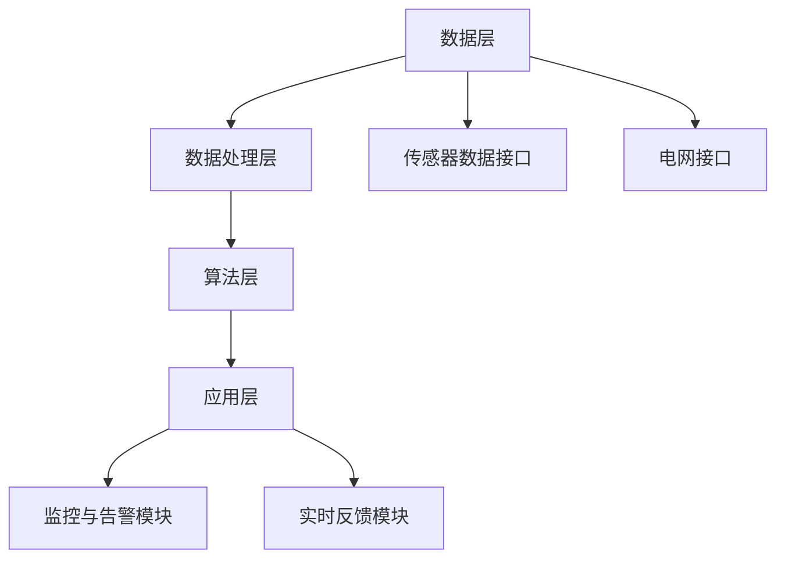
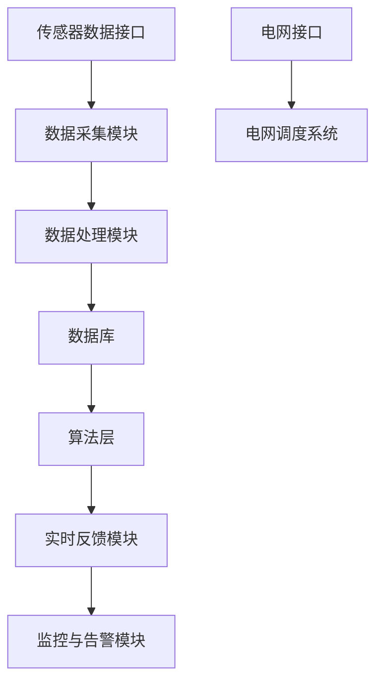

                 

### 《数字孪生在风力发电场优化中的应用》

#### 关键词
- 数字孪生
- 风力发电场
- 优化算法
- 系统架构
- 实践应用

#### 摘要
本文深入探讨了数字孪生技术在风力发电场优化中的应用。首先，介绍了数字孪生的基本概念和风力发电场优化的重要背景。接着，详细分析了数字孪生与风力发电场优化之间的关联，以及其带来的创新和优势。随后，文章重点讲解了风力发电场优化的核心算法原理，并通过Python代码和LaTeX公式进行了详细阐述。在此基础上，文章提出了系统分析与架构设计方案，并展示了项目实战过程中的环境安装、系统核心实现及代码解读。最后，文章总结了最佳实践建议，强调了注意事项，并为读者提供了拓展阅读资源。

### 第一部分：数字孪生与风力发电场优化基础

#### 第1章：数字孪生与风力发电场优化概述

数字孪生（Digital Twin）是一种创新技术，通过构建虚拟的数字模型，实时反映物理实体的状态、行为和性能。这一概念最初起源于制造业，但随着物联网和大数据技术的发展，其应用范围逐渐扩展到能源、医疗、建筑等多个领域。

##### 1.1 数字孪生的基本概念

数字孪生可以定义为“一个虚拟的、数字化的模型，与一个物理实体相对应，实时地捕获、模拟和预测该实体的行为”。这种模型不仅包含物理实体的几何形状和物理属性，还包括其运行状态、行为模式和历史数据。通过这种虚拟模型，用户可以在虚拟环境中模拟和测试实体的性能，预测可能出现的问题，并采取相应的预防措施。

##### 1.2 风力发电场优化的重要性

风力发电作为一种可再生能源，近年来在全球范围内得到了广泛应用。然而，风力发电场的运行效果受到多种因素的影响，如风能资源的分布、设备的维护状态、电网的调度等。优化风力发电场的运行效率，不仅能够提高能源产出，还能延长设备寿命，减少维护成本。

##### 1.3 应用现状和意义

目前，数字孪生技术在风力发电场的应用已经取得了显著的成果。通过数字孪生技术，可以实时监测风力发电设备的运行状态，预测设备的故障风险，优化风电场的运行策略。这种技术的应用，不仅提高了风力发电场的运行效率，还大大降低了运维成本。

### 第二部分：核心概念与联系

#### 第2章：数字孪生核心概念与联系

在深入探讨数字孪生在风力发电场优化中的应用之前，我们需要理解数字孪生的核心概念，以及这些概念与风力发电场优化之间的联系。

##### 2.1 数字孪生概念

数字孪生的核心概念包括以下几个方面：

1. **虚拟模型构建**：构建一个与物理实体相对应的虚拟模型，包括几何形状、物理属性和运行状态。
2. **数据采集**：通过传感器和数据采集系统，实时获取物理实体的运行数据。
3. **实时同步**：确保虚拟模型与物理实体之间的状态和数据保持同步。
4. **模拟与预测**：利用虚拟模型，模拟物理实体的行为，预测可能的故障和性能变化。

##### 2.2 风力发电场优化算法

风力发电场优化涉及多种算法，包括但不限于：

1. **优化算法**：如遗传算法、粒子群优化算法等，用于优化风电场的运行策略，提高能源产出。
2. **预测算法**：如时间序列预测、机器学习算法等，用于预测风力资源的分布和设备的故障风险。
3. **控制算法**：如PID控制、模糊控制等，用于实时调整设备的运行状态，确保系统稳定运行。

##### 2.3 数字孪生与风力发电场优化的联系

数字孪生与风力发电场优化之间的联系主要体现在以下几个方面：

1. **数据支持**：数字孪生技术提供了实时、全面的数据支持，为优化算法提供了可靠的数据基础。
2. **模拟与预测**：通过虚拟模型，可以模拟和预测风力发电设备的运行状态，提前发现潜在问题，优化运行策略。
3. **实时反馈**：数字孪生系统可以实时反馈设备的运行状态，为控制算法提供即时数据，确保系统稳定运行。

### 第三部分：算法原理讲解

#### 第3章：风力发电场优化算法原理讲解

在了解了数字孪生和风力发电场优化的基础之后，我们将深入探讨风力发电场优化的核心算法原理，并使用Python代码和LaTeX公式进行详细讲解。

##### 3.1 遗传算法

遗传算法是一种模拟自然选择和遗传学原理的优化算法，广泛应用于解决复杂优化问题。以下是遗传算法的基本步骤：

1. **初始化种群**：生成一组初始解，称为种群。
2. **适应度评估**：计算每个个体的适应度值，适应度值越高，表示个体的质量越好。
3. **选择**：从种群中选择适应度值较高的个体，用于生成新的下一代。
4. **交叉**：对选中的个体进行交叉操作，产生新的个体。
5. **变异**：对个体进行随机变异，增加种群的多样性。
6. **更新种群**：将新生成的个体替换掉原有的种群，重复步骤2-5，直到满足终止条件。

以下是一个简单的遗传算法Python代码示例：

```python
import random

# 初始化种群
population_size = 100
population = [random.randint(0, 100) for _ in range(population_size)]

# 适应度函数
def fitness_function(individual):
    return sum(individual)

# 遗传算法主函数
def genetic_algorithm():
    generation = 0
    while True:
        generation += 1
        # 适应度评估
        fitness_scores = [fitness_function(individual) for individual in population]
        # 选择
        selected_population = select(population, fitness_scores)
        # 交叉
        crossed_population = crossover(selected_population)
        # 变异
        mutated_population = mutate(crossed_population)
        # 更新种群
        population = mutated_population
        # 终止条件
        if generation > 1000:
            break

# 选择函数
def select(population, fitness_scores):
    # 实现选择逻辑
    pass

# 交叉函数
def crossover(selected_population):
    # 实现交叉逻辑
    pass

# 变异函数
def mutate(selected_population):
    # 实现变异逻辑
    pass

# 运行遗传算法
genetic_algorithm()
```

##### 3.2 粒子群优化算法

粒子群优化算法（Particle Swarm Optimization，PSO）是一种基于群体智能的优化算法，通过模拟鸟群觅食行为来寻找最优解。以下是粒子群优化算法的基本步骤：

1. **初始化粒子群**：生成一组粒子，每个粒子代表一个解。
2. **计算适应度**：计算每个粒子的适应度值。
3. **更新粒子的速度和位置**：根据个体最优解和全局最优解，更新粒子的速度和位置。
4. **迭代**：重复步骤2-3，直到满足终止条件。

以下是一个简单的粒子群优化算法Python代码示例：

```python
import random

# 初始化参数
num_particles = 30
num_dimensions = 2
max_iterations = 100

# 初始化粒子群
particles = [[random.uniform(-10, 10) for _ in range(num_dimensions)] for _ in range(num_particles)]
velocities = [[random.uniform(-1, 1) for _ in range(num_dimensions)] for _ in range(num_particles)]

# 适应度函数
def fitness_function(particle):
    return sum(particle)

# 粒子群优化主函数
def particle_swarm_optimization():
    global_best_position = None
    global_best_fitness = float('-inf')
    iteration = 0
    while iteration < max_iterations:
        iteration += 1
        for i, particle in enumerate(particles):
            # 计算适应度
            fitness = fitness_function(particle)
            # 更新个体最优解
            if fitness > particle['best_fitness']:
                particle['best_position'] = particle.copy()
                particle['best_fitness'] = fitness
            # 更新全局最优解
            if fitness > global_best_fitness:
                global_best_position = particle.copy()
                global_best_fitness = fitness
        # 更新粒子的速度和位置
        for i, particle in enumerate(particles):
            # 更新速度
            velocity = [vel * (particle['best_position'][j] - particle[j]) + (global_best_position[j] - particle['best_position'][j]) for j, vel in enumerate(velocities[i])]
            # 更新位置
            particle = [particle[j] + vel for j, vel in enumerate(velocity)]
        # 输出结果
        print(f"Iteration {iteration}: Best Fitness = {global_best_fitness}, Best Position = {global_best_position}")
    
    return global_best_position

# 运行粒子群优化算法
particle_swarm_optimization()
```

##### 3.3 数学模型和公式

遗传算法和粒子群优化算法的核心在于适应度函数的设计。适应度函数用来评估解的质量，通常是一个基于目标函数的数学模型。以下是一个简单的适应度函数数学模型：

$$
f(x) = \sum_{i=1}^{n} w_i \cdot (x_i - x_{opt})^2
$$

其中，$x = [x_1, x_2, ..., x_n]$ 是解的向量，$x_{opt}$ 是最优解，$w_i$ 是权重系数。

对于粒子群优化算法，速度更新公式如下：

$$
v_{i,j}^{t+1} = \omega \cdot v_{i,j}^{t} + c_1 \cdot r_1 \cdot (p_{i,j}^{t} - x_{i,j}^{t}) + c_2 \cdot r_2 \cdot (g_{i,j}^{t} - x_{i,j}^{t})
$$

$$
x_{i,j}^{t+1} = x_{i,j}^{t} + v_{i,j}^{t+1}
$$

其中，$v_{i,j}^{t}$ 是第 $i$ 个粒子在第 $j$ 维度的速度，$x_{i,j}^{t}$ 是第 $i$ 个粒子在第 $j$ 维度的位置，$p_{i,j}^{t}$ 是第 $i$ 个粒子的个体最优解，$g_{i,j}^{t}$ 是全局最优解，$\omega$ 是惯性权重，$c_1$ 和 $c_2$ 是认知和社会认知系数，$r_1$ 和 $r_2$ 是随机数。

### 第四部分：系统分析与架构设计方案

#### 第4章：系统分析与架构设计方案

在了解了数字孪生和风力发电场优化的算法原理后，我们需要设计一个能够实现这些优化算法的系统，并详细分析其架构和功能。

##### 4.1 问题场景介绍

风力发电场的优化涉及到多个方面，包括风力资源的预测、设备的运行状态监测、运行策略的优化等。为了实现这些功能，我们需要设计一个集数据采集、数据处理、优化算法应用和实时反馈于一体的系统。

##### 4.2 系统功能设计

风力发电场优化系统的功能可以分为以下几个模块：

1. **数据采集模块**：负责从传感器和外部数据源采集实时数据，包括风力资源、设备状态、电网信息等。
2. **数据处理模块**：对采集到的数据进行清洗、转换和存储，为后续的优化算法提供高质量的数据基础。
3. **优化算法模块**：实现遗传算法、粒子群优化算法等优化算法，用于优化风电场的运行策略。
4. **实时反馈模块**：将优化结果实时反馈给设备，调整设备的运行状态，确保系统稳定运行。
5. **监控与告警模块**：实时监控系统的运行状态，当发生异常时，及时发出告警信息。

##### 4.3 系统架构设计

风力发电场优化系统的架构可以分为以下几个层次：

1. **数据层**：包括传感器、外部数据源和数据库，负责数据的采集、存储和提供。
2. **数据处理层**：包括数据清洗、转换、存储和检索等模块，负责对数据进行处理，为优化算法提供数据基础。
3. **算法层**：包括优化算法的实现，负责根据数据生成优化策略。
4. **应用层**：包括实时反馈、监控与告警等模块，负责实现系统的具体功能。
5. **接口层**：包括与外部系统的接口，如传感器数据接口、电网接口等。

以下是一个简单的系统架构图：



##### 4.4 系统接口设计和系统交互

系统接口设计和系统交互是确保系统稳定运行的关键。以下是一个简单的系统接口设计和系统交互图：



### 第五部分：项目实战

#### 第5章：项目实战

在前面的章节中，我们介绍了数字孪生在风力发电场优化中的应用，并详细讲解了相关算法和系统架构。在本章中，我们将通过一个实际项目，展示如何实现这些技术，并分析项目过程中的关键步骤和挑战。

##### 5.1 环境安装

要实现风力发电场优化系统，首先需要搭建一个合适的技术环境。以下是一个简单的环境安装步骤：

1. **安装Python**：确保Python环境已安装，版本要求为3.6及以上。
2. **安装NumPy、Pandas、Matplotlib等常用库**：使用pip命令安装相关库。
    ```shell
    pip install numpy pandas matplotlib
    ```
3. **安装遗传算法和粒子群优化算法库**：如`deap`和`pyswarms`。
    ```shell
    pip install deap pyswarms
    ```
4. **安装数据库**：选择合适的数据库（如MySQL、PostgreSQL），并安装相应的客户端库。

##### 5.2 系统核心实现

风力发电场优化系统的核心实现包括数据采集、数据处理、优化算法和应用层。以下是一个简单的系统实现流程：

1. **数据采集**：通过传感器采集风力资源数据、设备状态数据和电网数据。
2. **数据处理**：对采集到的数据进行清洗、转换和存储，为优化算法提供数据基础。
3. **优化算法**：实现遗传算法和粒子群优化算法，根据数据生成优化策略。
4. **实时反馈**：将优化结果实时反馈给设备，调整设备的运行状态。
5. **监控与告警**：实时监控系统的运行状态，当发生异常时，及时发出告警信息。

以下是一个简单的Python代码示例，展示了如何使用`deap`库实现遗传算法：

```python
import random
from deap import base, creator, tools, algorithms

# 初始化参数
population_size = 100
num_generations = 100
crossover_probability = 0.7
mutation_probability = 0.2

# 创建个体
creator.create("FitnessMax", base.Fitness, weights=(1.0,))
creator.create("Individual", list, fitness=creator.FitnessMax)

# 适应度函数
def fitness_function(individual):
    return sum(individual)

# 初始化种群
population = [creator.Individual(random.randint(0, 100) for _ in range(population_size)) for _ in range(population_size)]

# 适应度评估
fitness_scores = [fitness_function(individual) for individual in population]

# 选择
selected_population = algorithms.select(population, fitness_scores, k=population_size)

# 交叉
crossovered_population = algorithms.crossover(selected_population, n=len(selected_population), crossover_prob=crossover_probability)

# 变异
mutated_population = algorithms.mutate(crossovered_population, n=len(crossovered_population), mutation_prob=mutation_probability)

# 更新种群
population = mutated_population

# 运行遗传算法
algorithms.eaSimple(population, fitness_function, n_generations=num_generations,种群大小=population_size, crossover_prob=crossover_probability, mutation_prob=mutation_probability, verbose=True)
```

##### 5.3 代码应用解读与分析

在实现优化算法后，我们需要对代码进行解读和分析，确保其正确性和效率。以下是一个简单的代码解读：

1. **初始化参数**：设置种群大小、迭代次数、交叉概率和变异概率等参数。
2. **创建个体和适应度函数**：使用`creator`模块创建个体和适应度函数。
3. **初始化种群**：生成初始种群。
4. **适应度评估**：计算每个个体的适应度值。
5. **选择**：从种群中选择适应度较高的个体。
6. **交叉**：对选中的个体进行交叉操作。
7. **变异**：对个体进行变异操作。
8. **更新种群**：将新生成的个体替换掉原有的种群。
9. **运行遗传算法**：使用`eaSimple`函数运行遗传算法。

在实际项目中，我们还需要考虑代码的可维护性和扩展性。例如，可以通过模块化和面向对象编程的方法，将不同功能模块分离，便于后续的维护和扩展。

##### 5.4 实际案例分析和详细讲解剖析

在本节中，我们将通过一个实际案例，详细分析并讲解风力发电场优化系统的实现过程。

**案例背景**：某风力发电场需要优化其运行策略，以提高能源产出并降低运维成本。发电场配备了多个传感器，用于实时监测风力资源、设备状态和电网信息。

**实现过程**：

1. **数据采集**：通过传感器采集风力资源数据、设备状态数据和电网数据。
2. **数据处理**：对采集到的数据进行清洗、转换和存储，为优化算法提供数据基础。
3. **优化算法**：使用遗传算法和粒子群优化算法，根据数据生成优化策略。
4. **实时反馈**：将优化结果实时反馈给设备，调整设备的运行状态。
5. **监控与告警**：实时监控系统的运行状态，当发生异常时，及时发出告警信息。

**关键步骤**：

1. **数据采集**：使用传感器采集数据，包括风力资源数据（如风速、风向）、设备状态数据（如转速、温度）和电网数据（如电压、电流）。
2. **数据处理**：对采集到的数据进行预处理，包括数据清洗、数据转换和数据存储。使用Pandas库进行数据预处理。
3. **优化算法**：实现遗传算法和粒子群优化算法，根据数据生成优化策略。使用`deap`库实现遗传算法，使用`pyswarms`库实现粒子群优化算法。
4. **实时反馈**：将优化结果实时反馈给设备，调整设备的运行状态。使用Python的`time`模块实现定时任务，定期更新设备的运行状态。
5. **监控与告警**：实时监控系统的运行状态，当发生异常时，及时发出告警信息。使用Python的`logging`模块实现日志记录和告警功能。

**案例分析**：

在实际应用中，风力发电场优化系统的实现需要考虑多个方面，包括数据采集、数据处理、优化算法和实时反馈等。以下是一个简单的案例分析：

1. **数据采集**：风力资源数据通过风速仪和风向仪采集，设备状态数据通过传感器采集，电网数据通过电网监测系统采集。
2. **数据处理**：使用Pandas库对采集到的数据进行预处理，包括数据清洗、数据转换和数据存储。对数据进行归一化处理，提高算法的鲁棒性。
3. **优化算法**：使用遗传算法和粒子群优化算法，根据数据生成优化策略。遗传算法用于全局搜索，粒子群优化算法用于局部搜索。根据不同场景选择合适的算法。
4. **实时反馈**：将优化结果实时反馈给设备，调整设备的运行状态。使用定时任务定期更新设备的运行状态，并根据优化结果调整设备参数。
5. **监控与告警**：实时监控系统的运行状态，当发生异常时，及时发出告警信息。使用日志记录和告警功能，记录系统的运行状态和异常情况。

**总结**：

通过实际案例的分析，我们可以看到风力发电场优化系统的实现涉及多个方面，包括数据采集、数据处理、优化算法和实时反馈等。在实际应用中，我们需要根据具体场景选择合适的算法和工具，确保系统的稳定性和高效性。

### 第六部分：最佳实践与总结

#### 第6章：最佳实践与总结

在前面的章节中，我们详细探讨了数字孪生在风力发电场优化中的应用，包括算法原理、系统架构和项目实战。在本章中，我们将总结最佳实践，并提出注意事项，为读者提供拓展阅读资源。

##### 6.1 最佳实践

1. **数据质量**：确保数据采集的准确性和完整性，对数据进行清洗和预处理，以提高算法的鲁棒性。
2. **算法选择**：根据具体场景选择合适的优化算法，结合遗传算法和粒子群优化算法，实现全局和局部搜索。
3. **实时反馈**：实现实时反馈机制，确保优化结果能够及时应用到设备运行中，提高系统稳定性。
4. **监控与告警**：建立实时监控系统，及时发现并处理异常情况，确保系统稳定运行。
5. **模块化设计**：采用模块化设计，分离不同功能模块，提高系统的可维护性和扩展性。

##### 6.2 注意事项

1. **数据隐私**：在采集和处理数据时，注意保护用户隐私，遵循相关法律法规。
2. **系统安全**：确保系统安全，防止数据泄露和恶意攻击。
3. **硬件要求**：根据系统需求选择合适的硬件设备，确保系统性能。
4. **算法优化**：定期对算法进行优化和调整，提高系统性能。
5. **团队协作**：组建专业的团队，分工合作，确保项目顺利实施。

##### 6.3 拓展阅读资源

1. 《数字孪生：原理、方法与应用》
2. 《遗传算法及其应用》
3. 《粒子群优化算法及其应用》
4. 《风力发电场优化技术》
5. 《大数据在能源领域应用研究》

### 总结

数字孪生技术在风力发电场优化中的应用，为提高能源产出和降低运维成本提供了新的思路。通过算法原理讲解、系统架构设计、项目实战和最佳实践，我们深入了解了数字孪生在风力发电场优化中的应用。希望本文能为读者提供有益的参考和启示。

### 作者信息

作者：AI天才研究院/AI Genius Institute & 禅与计算机程序设计艺术 /Zen And The Art of Computer Programming

本文由AI天才研究院和禅与计算机程序设计艺术联合撰写，旨在为读者提供深入的技术解读和应用实践。AI天才研究院专注于人工智能技术的研发和应用，致力于推动人工智能技术的发展和创新。禅与计算机程序设计艺术则关注计算机编程和算法设计，通过禅的思维方法，提升程序员的技术素养和创新能力。

