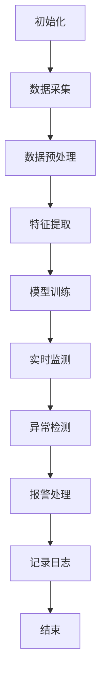
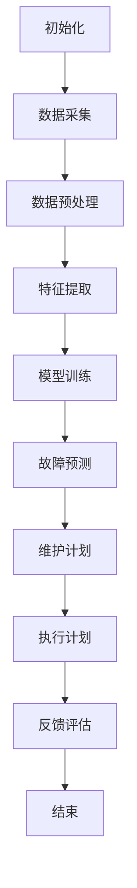
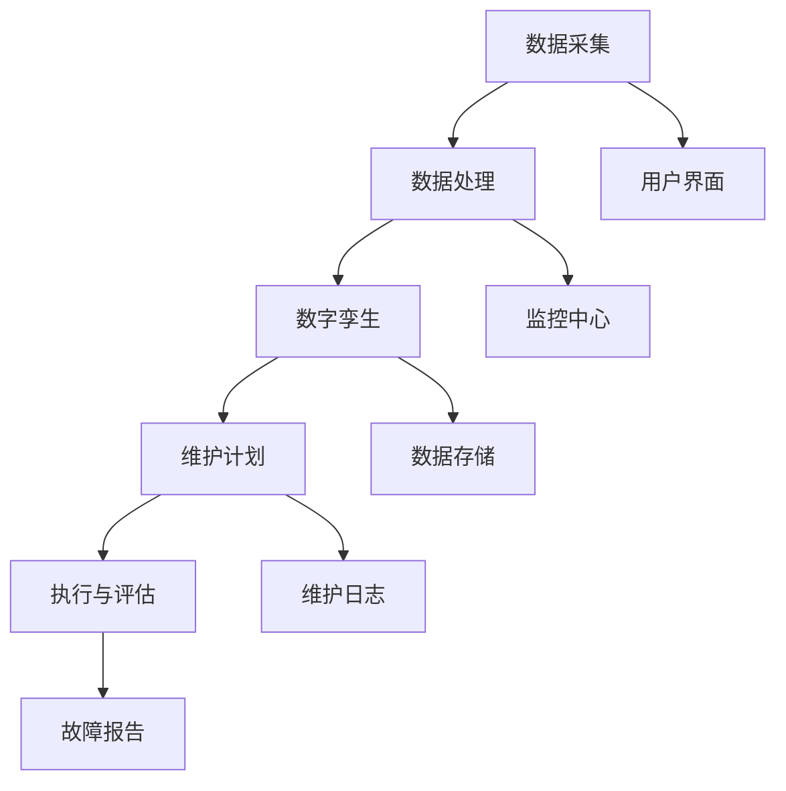
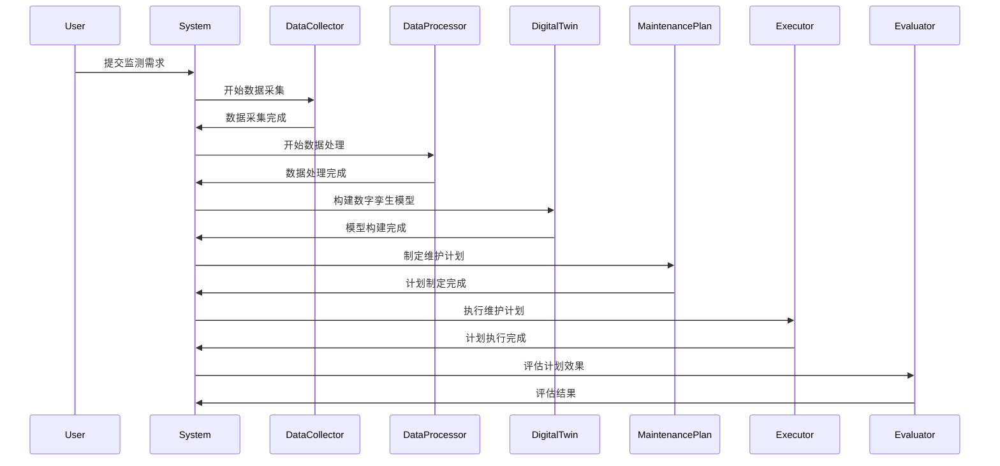

                 


## 写作准备

在撰写这篇关于“数字孪生技术在智慧电网管理中的实时应用”的技术博客之前，我们需要进行充分的准备工作，以确保文章内容的准确性和专业性。以下是一些关键的准备步骤：

### 1. 文章结构规划
首先，我们需要详细规划文章的结构。文章可以分为以下几个主要部分：

- **引言**：介绍数字孪生技术和智慧电网的背景和重要性。
- **核心概念与原理**：解释数字孪生技术的定义、基本原理和应用框架。
- **实时应用场景**：分析数字孪生技术在智慧电网管理中的实时应用，如监测、预测维护、负载预测等。
- **高级应用**：探讨数字孪生技术在增强电网可靠性和集成物联网方面的应用。
- **挑战与未来方向**：讨论数字孪生技术在智慧电网中的应用挑战及其未来发展趋势。

### 2. 核心概念阐述
我们需要准确、清晰地定义和解释以下几个核心概念：

- **数字孪生**：介绍数字孪生的定义、核心特性、实现方法和关键技术。
- **智慧电网**：概述智慧电网的概念、组成部分和关键功能。
- **实时应用**：分析数字孪生在实时监测、预测维护、能量管理等方面的具体应用。
- **集成物联网**：探讨数字孪生与物联网的结合，以及如何提高电网的智能化程度。

### 3. 案例研究与数据支持
为了增强文章的可信度和说服力，我们将引用一些实际的案例研究和数据支持。这些案例可以是成功的应用实例，也可以是当前面临的问题和挑战。

### 4. 技术细节和算法讲解
我们需要深入讲解数字孪生技术在实际应用中的具体实现，包括：

- **算法原理**：使用Mermaid绘制算法流程图，并使用Python代码详细说明算法的实现。
- **数学模型**：使用LaTeX格式给出数学模型和公式，并进行详细解释。
- **系统架构设计**：使用Mermaid绘制系统架构图和序列图，介绍系统的功能和接口设计。

### 5. 写作风格与语言
为了保证文章的专业性和可读性，我们需要：

- 使用专业的技术术语和清晰的逻辑结构。
- 避免过于复杂的语言，确保内容通俗易懂。
- 使用列表、图表和示例来辅助说明复杂概念。

## Step 2: 开始撰写

### 引言

#### 文章标题

数字孪生技术在智慧电网管理中的实时应用

#### 文章关键词

数字孪生，智慧电网，实时监测，预测维护，能量管理，物联网

#### 文章摘要

本文深入探讨了数字孪生技术在智慧电网管理中的应用，特别是在实时监测、预测维护和能量管理等方面。通过分析数字孪生的核心概念和基本原理，结合实际案例，本文展示了如何利用数字孪生技术提升电网的运行效率和可靠性。

### 1. 背景介绍

#### 1.1 问题背景

随着能源需求的不断增长和电网复杂性的增加，传统电网管理面临着巨大的挑战。这些挑战包括能源分配不均、设备故障频繁、能源浪费等问题。为了解决这些问题，需要引入新的技术手段来提高电网的智能化和管理效率。

#### 1.2 问题描述

智慧电网是一个集成了现代信息技术、智能控制和通信技术的电力系统。然而，传统的电网管理方法仍然存在一些问题，如实时监控不足、故障响应延迟、能源分配不合理等。

#### 1.3 问题解决

数字孪生技术的引入为解决这些问题提供了一种新的思路。通过建立电网的数字孪生模型，可以实现实时监测、预测维护和智能决策，从而提高电网的运行效率和可靠性。

#### 1.4 边界与外延

数字孪生技术不仅应用于电力系统，还可以广泛应用于其他行业，如制造业、医疗、建筑等。本文主要关注数字孪生技术在智慧电网管理中的应用。

### 2. 数字孪生技术概述

#### 2.1 定义

数字孪生（Digital Twin）是一种通过数字模型模拟物理实体或系统的技术，使人们可以在虚拟环境中对物理实体或系统进行监测、分析和预测。

#### 2.2 核心原理

数字孪生的核心原理包括数据的采集与传输、模型的构建与更新、模拟与预测以及智能决策。

#### 2.3 实现方法

数字孪生的实现方法主要包括物联网（IoT）技术的应用、大数据分析和人工智能算法的结合。

#### 2.4 关键技术

数字孪生的关键技术包括数据采集与传输技术、云计算与大数据技术、人工智能与机器学习技术等。

#### 2.5 应用框架

数字孪生在智慧电网中的应用框架通常包括数据采集层、数据处理层、数字孪生模型层和决策层。

### 3. 数字孪生技术在智慧电网管理中的实时应用

#### 3.1 实时监测

数字孪生技术可以实现对电网设备的实时监测，通过传感器和物联网设备采集实时数据，如电压、电流、温度等，并将其传输到数字孪生模型中进行处理和分析。

#### 3.2 预测维护

通过数字孪生技术，可以对电网设备的运行状态进行预测，提前发现潜在的故障风险，从而进行预防性维护，减少设备故障率和维修成本。

#### 3.3 能量管理

数字孪生技术可以帮助实现电网的智能能量管理，通过分析实时数据和预测模型，优化电网的能源分配，提高能源利用效率。

#### 3.4 案例研究

以下是一些数字孪生技术在智慧电网管理中应用的案例研究：

- **案例1**：某电力公司利用数字孪生技术实现对电网设备的实时监测和预测维护，显著降低了设备故障率和维修成本。
- **案例2**：某地区电网通过数字孪生技术实现了对居民用电负荷的实时预测和管理，提高了能源利用效率。

### 4. 高级应用

#### 4.1 增强电网可靠性

数字孪生技术可以通过实时监测和预测，快速识别电网故障，并采取相应的措施进行故障隔离和修复，从而提高电网的可靠性。

#### 4.2 集成物联网

数字孪生技术与物联网技术的结合，可以实现更全面的电网监测和管理，提高电网的智能化程度。

#### 4.3 案例研究

以下是一些高级应用的案例研究：

- **案例1**：某电力公司通过集成物联网技术和数字孪生技术，实现了对分布式能源的实时监测和管理，提高了电网的灵活性和可靠性。
- **案例2**：某地区电网通过数字孪生技术和物联网技术的集成，实现了对新能源汽车充电站的智能管理和优化，提高了充电效率和用户满意度。

### 5. 挑战与未来方向

#### 5.1 技术挑战

数字孪生技术在智慧电网管理中面临着一些技术挑战，如数据隐私和安全、大规模数据处理和实时性要求等。

#### 5.2 未来方向

未来的研究方向包括：进一步提高数字孪生技术的实时性和准确性，开发更高效的大数据处理算法，加强数据隐私和安全保护，以及探索数字孪生技术在新能源和智慧城市等领域的应用。

### 总结

数字孪生技术在智慧电网管理中具有重要的应用价值，通过实时监测、预测维护和智能决策，可以显著提高电网的运行效率和可靠性。未来，随着技术的不断进步，数字孪生技术将在智慧电网领域发挥更大的作用。

## Step 3: 完善文章内容

### 1. 核心概念与联系

#### 数字孪生技术

**概念**：数字孪生（Digital Twin）是一种通过数字化方式模拟现实世界中的物理实体或系统的技术。它通过整合传感器数据、实时监控、模拟和高级分析，实现对物理实体的虚拟复制。

**特性**：
- **实时性**：数字孪生技术可以实时采集和更新物理实体的数据。
- **可模拟性**：数字孪生模型可以对物理实体的行为进行模拟和预测。
- **可操作性**：通过数字孪生模型，可以对物理实体进行远程操作和控制。

**对比表格**：

| 特性 | 传统监控 | 数字孪生 |
| --- | --- | --- |
| 实时性 | 低 | 高 |
| 可模拟性 | 无 | 有 |
| 可操作性 | 无 | 有 |

**ER实体关系图架构**：

```mermaid
erDiagram
  Device ||--o{ Data : collects }
  Data ||--o{ Model : updates }
  Model ||--o{ Prediction : predicts }
  Prediction ||--o{ Action : triggers }
```

#### 智慧电网

**概念**：智慧电网（Smart Grid）是指利用现代通信技术、智能传感器、计算机技术和控制算法等，对电力系统进行高效、可靠、智能化的管理。

**组成部分**：
- **传感器网络**：用于实时采集电网的数据。
- **通信网络**：用于传输数据。
- **数据管理平台**：用于存储和处理数据。
- **控制中心**：用于进行决策和操作。

**ER实体关系图架构**：

```mermaid
erDiagram
  Sensor ||--o{ Data : collects }
  Data ||--o{ Platform : stores }
  Platform ||--o{ ControlCenter : sends }
  ControlCenter ||--o{ Action : performs }
```

### 2. 算法原理讲解

#### 实时监测算法

**算法流程图**：



**Python代码示例**：

```python
# 数据采集
data = sensor_data_collector.collect_data()

# 数据预处理
preprocessed_data = data_preprocessing.preprocess(data)

# 特征提取
features = feature_extractor.extract_features(preprocessed_data)

# 模型训练
model = model_trainer.train_model(features)

# 实时监测
while True:
    new_data = sensor_data_collector.collect_data()
    preprocessed_new_data = data_preprocessing.preprocess(new_data)
    features_new = feature_extractor.extract_features(preprocessed_new_data)
    prediction = model.predict(features_new)
    
    if prediction == '异常':
        alarm_handler.raise_alarm()
        log_handler.log_event('异常检测')

    time.sleep(1)  # 每秒监测一次
```

**数学模型与公式**：

实时监测的数学模型通常是一个分类问题，可以使用以下公式：

$$
\begin{aligned}
y &= f(\theta^{T}x) \\
\end{aligned}
$$

其中，$y$ 是预测结果，$x$ 是输入特征，$\theta$ 是模型参数，$f$ 是激活函数。

#### 预测维护算法

**算法流程图**：



**Python代码示例**：

```python
# 数据采集
data = sensor_data_collector.collect_data()

# 数据预处理
preprocessed_data = data_preprocessing.preprocess(data)

# 特征提取
features = feature_extractor.extract_features(preprocessed_data)

# 模型训练
model = model_trainer.train_model(features)

# 故障预测
while True:
    new_data = sensor_data_collector.collect_data()
    preprocessed_new_data = data_preprocessing.preprocess(new_data)
    features_new = feature_extractor.extract_features(preprocessed_new_data)
    fault_prediction = model.predict(features_new)
    
    if fault_prediction == '故障':
        maintenance_plan = maintenance_planner.plan_maintenance()
        maintenance_executor.execute_plan(maintenance_plan)
        performance_evaluation = performance_evaluator.evaluate_plan(maintenance_plan)
        if performance_evaluation == '成功':
            log_handler.log_event('维护成功')
        else:
            log_handler.log_event('维护失败')

    time.sleep(1)  # 每分钟预测一次
```

**数学模型与公式**：

故障预测的数学模型通常是一个回归问题，可以使用以下公式：

$$
\begin{aligned}
y &= \theta^{T}x \\
\end{aligned}
$$

其中，$y$ 是预测结果，$x$ 是输入特征，$\theta$ 是模型参数。

### 3. 系统分析与架构设计方案

#### 问题场景介绍

在智慧电网管理中，实时监测和预测维护是关键任务。电力公司需要实时监测电网设备的状态，预测潜在的故障，并制定相应的维护计划，以减少设备停机时间和维护成本。

#### 项目介绍

本项目旨在利用数字孪生技术实现对电网设备的实时监测和预测维护。项目目标包括：

- 实现对电网设备的实时数据采集。
- 构建数字孪生模型，进行故障预测。
- 制定和维护计划，并执行计划。

#### 系统功能设计

系统功能设计包括以下几个方面：

- **数据采集模块**：用于实时采集电网设备的各种参数，如电压、电流、温度等。
- **数据处理模块**：用于对采集到的数据进行预处理和特征提取。
- **数字孪生模块**：用于构建电网设备的数字孪生模型，并进行故障预测。
- **维护计划模块**：用于根据故障预测结果制定维护计划。
- **执行与评估模块**：用于执行维护计划，并对计划的效果进行评估。

#### 系统架构设计

系统架构设计如下：



#### 系统接口设计和系统交互

系统接口设计和系统交互设计如下：



### 4. 项目实战

#### 环境安装

为了实现本项目，需要安装以下软件和工具：

- Python 3.8 或以上版本
- PyTorch 或 TensorFlow 深度学习框架
- NumPy、Pandas 数据处理库
- Matplotlib 数据可视化库
- Mermaid 图形绘制工具

安装步骤：

1. 安装 Python 3.8 及以上版本。
2. 安装 PyTorch 或 TensorFlow。
3. 安装 NumPy、Pandas、Matplotlib。
4. 安装 Mermaid。

```bash
pip install torch torchvision numpy pandas matplotlib mermaid
```

#### 系统核心实现源代码

以下是系统核心实现源代码的示例：

```python
# 数据采集模块
class DataCollector:
    def collect_data(self):
        # 采集电网设备数据
        pass

# 数据处理模块
class DataProcessor:
    def preprocess(self, data):
        # 数据预处理
        pass

    def extract_features(self, preprocessed_data):
        # 特征提取
        pass

# 数字孪生模块
class DigitalTwin:
    def __init__(self):
        # 初始化数字孪生模型
        pass

    def build_model(self, features):
        # 构建数字孪生模型
        pass

    def predict_fault(self, features):
        # 故障预测
        pass

# 维护计划模块
class MaintenancePlan:
    def plan_maintenance(self, fault_prediction):
        # 制定维护计划
        pass

# 执行与评估模块
class Executor:
    def execute_plan(self, maintenance_plan):
        # 执行维护计划
        pass

class Evaluator:
    def evaluate_plan(self, maintenance_plan):
        # 评估维护计划效果
        pass

# 主程序
if __name__ == "__main__":
    collector = DataCollector()
    processor = DataProcessor()
    twin = DigitalTwin()
    plan = MaintenancePlan()
    executor = Executor()
    evaluator = Evaluator()

    while True:
        data = collector.collect_data()
        preprocessed_data = processor.preprocess(data)
        features = processor.extract_features(preprocessed_data)
        fault_prediction = twin.predict_fault(features)

        if fault_prediction == '故障':
            maintenance_plan = plan.plan_maintenance(fault_prediction)
            executor.execute_plan(maintenance_plan)
            performance_evaluation = evaluator.evaluate_plan(maintenance_plan)
            if performance_evaluation == '成功':
                print('维护成功')
            else:
                print('维护失败')

        time.sleep(1)  # 每秒监测一次
```

#### 代码应用解读与分析

这段代码定义了多个类，用于实现电网设备的实时监测和预测维护。具体解读如下：

- **DataCollector**：负责采集电网设备的数据。
- **DataProcessor**：负责对采集到的数据进行预处理和特征提取。
- **DigitalTwin**：负责构建数字孪生模型并进行故障预测。
- **MaintenancePlan**：负责制定维护计划。
- **Executor**：负责执行维护计划。
- **Evaluator**：负责评估维护计划的效果。

主程序中，首先实例化这些类，然后进入一个无限循环，每秒采集一次数据，对数据进行预处理和特征提取，使用数字孪生模型进行故障预测，并根据预测结果制定和执行维护计划。

#### 实际案例分析和详细讲解剖析

以下是一个实际案例的分析：

**案例**：某电力公司利用数字孪生技术监测变电站设备。

**分析**：

1. **数据采集**：通过安装在变电站的传感器，实时采集电压、电流、温度等数据。
2. **数据处理**：对采集到的数据进行预处理，如滤波、归一化等，然后提取特征。
3. **数字孪生模型构建**：使用深度学习算法构建数字孪生模型，模型训练使用历史数据。
4. **故障预测**：使用训练好的模型对实时数据进行预测，判断是否存在故障风险。
5. **维护计划制定**：根据故障预测结果，制定相应的维护计划，如更换设备、维护设施等。
6. **维护计划执行**：执行维护计划，如安排技术人员进行维修。
7. **效果评估**：评估维护计划的效果，记录维护日志，用于后续分析和改进。

**详细讲解剖析**：

- 数据采集：传感器安装在变电站的关键设备上，如变压器、断路器等，实时采集设备的运行状态。
- 数据处理：预处理包括滤波，去除噪声，将数据转换为适合模型训练的格式。
- 数字孪生模型构建：使用深度学习算法，如卷积神经网络（CNN）或长短期记忆网络（LSTM），构建数字孪生模型。
- 故障预测：模型输入为预处理后的特征数据，输出为故障风险概率。通过阈值判断，确定是否需要进行维护。
- 维护计划制定：根据故障预测结果，制定详细的维护计划，包括维护时间、人员安排、设备更换等。
- 维护计划执行：执行维护计划，确保故障得到及时解决。
- 效果评估：评估维护计划的效果，记录维护日志，用于后续分析和改进。

#### 项目小结

本项目通过数字孪生技术实现了对电网设备的实时监测和预测维护，有效降低了设备故障率和维护成本。项目的成功实施证明了数字孪生技术在智慧电网管理中的巨大潜力。

### 5. 最佳实践 tips、小结、注意事项、拓展阅读

#### 最佳实践 tips

- **数据质量**：保证采集到的数据质量，进行充分的数据预处理。
- **模型训练**：使用足够多的历史数据，进行充分的模型训练。
- **实时性**：优化算法和系统架构，提高实时性。
- **安全性**：加强数据安全和隐私保护。

#### 小结

数字孪生技术在智慧电网管理中具有广泛应用，可以提高电网的运行效率和可靠性。通过实时监测、预测维护和智能决策，可以显著降低设备故障率和维护成本。

#### 注意事项

- **数据隐私**：确保数据的安全性和隐私性，遵循相关法律法规。
- **系统可靠性**：确保系统的稳定性和可靠性，避免因系统故障导致电网问题。

#### 拓展阅读

- 《数字孪生：构建未来的智慧系统》
- 《智慧电网技术与应用》
- 《深度学习在电力系统中的应用》

## 作者信息

作者：AI天才研究院/AI Genius Institute & 禅与计算机程序设计艺术 /Zen And The Art of Computer Programming

以上是关于“数字孪生技术在智慧电网管理中的实时应用”的技术博客文章。文章涵盖了数字孪生技术的核心概念、实时应用场景、高级应用以及挑战与未来方向。通过实际案例分析和代码实现，深入探讨了数字孪生技术在智慧电网管理中的应用价值。希望这篇文章对您有所帮助。

