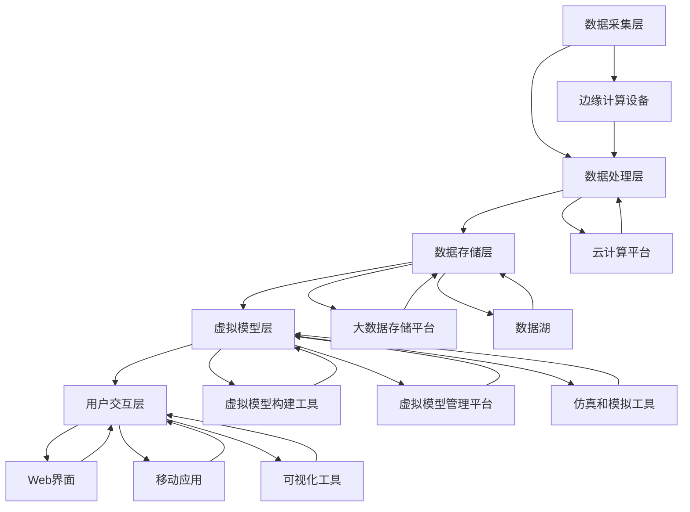

                 

### 文章标题

《数字孪生技术在智能制造中的应用与挑战》

### 文章关键词

数字孪生技术、智能制造、应用场景、挑战与解决方案、技术架构、未来趋势

### 文章摘要

本文旨在深入探讨数字孪生技术在智能制造中的应用及其面临的挑战。首先，我们将对数字孪生技术的核心概念和基本原理进行详细解读，接着探讨其在智能制造中的实际应用。随后，文章将分析数字孪生技术在应用过程中所遇到的各类挑战，并提出相应的解决方案。接着，我们将详细描述数字孪生技术的技术架构和系统设计，通过具体的案例研究展示其实际应用效果。最后，文章将展望数字孪生技术未来的发展趋势，并讨论其在智能制造领域中的潜在影响。

## 引言

### 数字孪生技术的背景与发展历程

数字孪生（Digital Twin）技术作为一种新兴的智能化技术，近年来在智能制造领域引起了广泛关注。数字孪生技术的概念最早由美国密歇根大学教授迈克尔·格里夫斯（Michael Grieves）在2002年提出，他将其描述为“一个虚拟的数字拷贝，用于模拟、分析和优化物理对象或系统的行为和性能”。随着物联网（IoT）、云计算、大数据和人工智能技术的快速发展，数字孪生技术逐渐从理论走向实践，成为智能制造领域的关键技术之一。

数字孪生技术的起源可以追溯到制造业中的仿真和虚拟样机技术。传统的仿真技术主要依赖于物理模型和数学模型，通过对物理系统的模拟来预测其性能和行为。然而，随着计算机技术的发展，虚拟现实和增强现实技术的应用使得人们能够构建更加精确和动态的数字模型。数字孪生技术正是这种技术的发展产物，它不仅能够模拟物理对象的运行状态，还能够实时收集和分析物理对象的数据，实现虚拟与现实的紧密结合。

### 智能制造的发展趋势与需求

智能制造作为现代制造业的重要发展方向，旨在通过集成信息技术和制造技术，实现制造过程的智能化、自动化和高效化。随着全球制造业竞争的加剧，企业对于提高生产效率、降低成本、提升产品质量和增强市场竞争力有着迫切的需求。数字孪生技术的出现为智能制造提供了新的解决方案，它能够通过创建数字模型来模拟和优化物理制造过程，从而实现对生产过程的精准控制和管理。

智能制造的发展趋势主要包括以下几个方面：

1. **自动化生产**：通过采用自动化设备和机器人技术，实现生产过程的自动化和智能化。
2. **数据驱动**：利用物联网技术收集生产过程中的各种数据，通过大数据分析和人工智能算法，实现生产过程的实时优化。
3. **个性化定制**：通过数字孪生技术，实现产品的个性化定制和柔性生产。
4. **网络化协同**：通过物联网和云计算技术，实现企业内部及企业之间的信息共享和协同工作。
5. **绿色制造**：通过数字孪生技术优化生产过程，降低能耗和排放，实现绿色制造。

### 数字孪生技术的基本概念

数字孪生技术是一种将物理对象或系统通过数字化手段进行建模、仿真和分析的技术。它通常包括以下几个核心组成部分：

1. **物理对象**：数字孪生技术的核心是物理对象，可以是单一设备、生产线或整个工厂。
2. **虚拟模型**：通过数字化技术对物理对象进行建模，创建一个与物理对象相对应的虚拟模型。
3. **数据连接**：利用传感器和物联网技术，将物理对象的实时数据传输到虚拟模型，实现虚拟与现实的联动。
4. **数据分析**：通过大数据分析和人工智能算法，对虚拟模型进行模拟和分析，优化物理对象的运行状态和性能。

数字孪生技术的基本原理可以概括为以下几个步骤：

1. **数据采集**：通过传感器和物联网设备，实时采集物理对象的运行数据。
2. **模型构建**：利用数据采集到的信息，构建物理对象的虚拟模型。
3. **数据传输**：将虚拟模型与物理对象进行实时数据传输，实现虚拟与现实的同步。
4. **数据分析**：通过对虚拟模型进行模拟和分析，优化物理对象的运行状态和性能。

### 数字孪生技术在智能制造中的应用

数字孪生技术在智能制造中的应用场景非常广泛，主要包括以下几个方面：

1. **生产过程优化**：通过数字孪生技术，可以对生产过程进行模拟和优化，提高生产效率和质量。例如，在制造过程中，可以通过对数字孪生模型的分析，优化生产线的布局和工艺流程，减少生产过程中的浪费。

2. **设备维护与管理**：数字孪生技术可以帮助企业实现对设备的实时监控和维护。通过虚拟模型，可以预测设备可能出现的故障，提前进行维护，减少停机时间和维修成本。

3. **产品质量检测**：数字孪生技术可以实现对产品质量的实时监测和评估。通过对虚拟模型的模拟，可以预测产品在不同工艺条件下的质量表现，从而进行及时的调整和优化。

4. **供应链管理**：数字孪生技术可以帮助企业实现对整个供应链的实时监控和管理。通过虚拟模型，可以预测供应链中各个环节的运行状态，优化供应链的布局和调度，提高供应链的整体效率。

### 数字孪生技术在智能制造中的挑战

尽管数字孪生技术在智能制造中具有巨大的潜力，但其应用也面临着一系列挑战：

1. **数据安全与隐私**：在数字孪生技术的应用过程中，大量的数据需要在虚拟模型和物理对象之间进行传输和存储。这带来了数据安全和隐私的挑战，如何确保数据的安全性和隐私性是一个重要的问题。

2. **系统集成与兼容性**：数字孪生技术需要与现有的生产系统进行集成，包括传感器、物联网平台、数据分析工具等。如何实现不同系统之间的无缝集成和兼容，是一个技术难题。

3. **技术成熟度**：数字孪生技术还处于快速发展阶段，一些关键技术尚未完全成熟。例如，虚拟模型的准确性、数据采集的实时性和数据分析的算法性能等，都需要进一步的研究和优化。

4. **人才短缺**：数字孪生技术涉及多个领域的技术，包括机械工程、电子工程、计算机科学、数据分析等。如何培养和吸引专业人才，是企业面临的一个挑战。

### 数字孪生技术在智能制造中的重要性

数字孪生技术在智能制造中的应用具有重要意义，它不仅能够提高生产效率和质量，还能够降低成本和提升企业的竞争力。具体来说，数字孪生技术的重要性体现在以下几个方面：

1. **提高生产效率**：通过数字孪生技术，可以对生产过程进行模拟和优化，减少生产过程中的浪费和不必要的环节，从而提高生产效率。

2. **提升产品质量**：数字孪生技术可以实现对产品质量的实时监控和评估，通过虚拟模型预测产品在不同工艺条件下的质量表现，从而进行及时的调整和优化，提升产品质量。

3. **降低维护成本**：通过数字孪生技术，可以实现对设备的实时监控和预测性维护，减少设备故障和停机时间，降低维护成本。

4. **优化供应链管理**：数字孪生技术可以帮助企业实现对整个供应链的实时监控和管理，优化供应链的布局和调度，提高供应链的整体效率。

5. **增强企业竞争力**：数字孪生技术可以为企业在市场上提供独特的竞争优势，通过智能制造和精准管理，企业可以更好地满足客户需求，提高市场竞争力。

### 总结

数字孪生技术在智能制造中的应用为制造业带来了革命性的变革，它不仅提高了生产效率和质量，还降低了成本和提升了企业的竞争力。然而，数字孪生技术的应用也面临着一系列挑战，如数据安全、系统集成、技术成熟度和人才短缺等。为了充分发挥数字孪生技术在智能制造中的作用，企业需要积极应对这些挑战，不断优化和升级技术，培养和吸引专业人才。未来，随着数字孪生技术的不断发展，我们有望看到更加智能、高效和绿色的智能制造体系的诞生。

## 背景介绍

### 数字孪生技术的核心概念术语说明

数字孪生技术（Digital Twin Technology）是一种创新性的智能化技术，其核心理念是通过创建一个物理对象或系统的数字模型，实现对物理对象或系统的模拟、分析和优化。在这个数字模型中，可以集成物理对象的各类数据，如结构、行为、状态等，从而实现对物理对象的实时监控和远程控制。

**数字孪生（Digital Twin）**：数字孪生是指一个物理实体（如设备、生产线、工厂等）的数字映射或虚拟复制。通过数字孪生，可以实现对物理实体的实时监控、模拟、分析和优化。

**虚拟模型（Virtual Model）**：虚拟模型是数字孪生的核心组成部分，它是对物理对象的数字化表示，通常由几何模型、物理属性模型、行为模型等组成。虚拟模型能够反映物理对象的各个方面，如外观、结构、功能等。

**数据连接（Data Connection）**：数据连接是指将物理对象的实时数据传输到虚拟模型，并保持两者的同步。数据连接通常依赖于传感器、物联网（IoT）设备和通信网络，确保物理对象的状态和性能能够及时、准确地反映在虚拟模型中。

**数据分析（Data Analysis）**：数据分析是指利用大数据分析和人工智能算法，对虚拟模型中的数据进行处理和分析，以获取洞察和优化建议。数据分析可以帮助企业识别问题、预测趋势、制定决策，从而提高生产效率和质量。

### 问题背景

智能制造是当前制造业发展的热点和趋势，它旨在通过集成信息技术和制造技术，实现制造过程的智能化、自动化和高效化。随着物联网、大数据、云计算和人工智能等技术的快速发展，智能制造逐渐从理论走向实践，并在生产效率、产品质量、成本控制和供应链管理等方面展现出巨大的潜力。

然而，智能制造的发展也面临着一系列挑战。传统的制造模式中，生产过程往往依赖于人工操作和经验，生产效率较低，产品质量难以保证。同时，制造过程中产生的数据分散、不透明，难以进行有效的分析和利用。为了应对这些挑战，企业需要引入新的技术手段，实现对生产过程的实时监控、模拟和优化。

数字孪生技术正是在这样的背景下应运而生的。通过创建物理对象或系统的数字孪生，企业可以实现对生产过程的全方位监控和优化，提高生产效率、降低成本、提升产品质量。具体来说，数字孪生技术在智能制造中的应用主要体现在以下几个方面：

1. **生产过程优化**：通过数字孪生技术，可以对生产过程进行模拟和优化，识别潜在的问题和瓶颈，提出改进措施，从而提高生产效率。

2. **设备维护与管理**：通过数字孪生技术，可以实现对设备的实时监控和预测性维护，减少设备故障和停机时间，降低维护成本。

3. **产品质量检测**：通过数字孪生技术，可以实现对产品质量的实时监测和评估，通过虚拟模型预测产品在不同工艺条件下的质量表现，从而进行及时的调整和优化。

4. **供应链管理**：通过数字孪生技术，可以实现对整个供应链的实时监控和管理，优化供应链的布局和调度，提高供应链的整体效率。

### 问题描述

在智能制造中，企业面临着以下主要问题：

1. **生产效率低**：传统的制造模式中，生产过程依赖人工操作和经验，生产效率较低。如何提高生产效率，降低生产成本，成为企业急需解决的问题。

2. **产品质量不稳定**：制造过程中，产品质量受多种因素影响，如设备性能、工艺参数、原材料等。如何确保产品质量的稳定性，提高产品的市场竞争力，是企业关注的重点。

3. **设备故障率高**：设备故障是导致生产中断和成本增加的主要原因之一。如何实现对设备的实时监控和预测性维护，减少设备故障和停机时间，是企业面临的一个挑战。

4. **供应链管理困难**：供应链管理涉及多个环节，包括原材料采购、生产计划、库存管理、物流配送等。如何实现供应链的实时监控和优化，提高供应链的整体效率，是企业的难题。

### 问题解决

数字孪生技术为解决上述问题提供了一种有效的解决方案：

1. **生产过程优化**：
   - 通过数字孪生技术，企业可以创建生产过程的虚拟模型，对生产过程进行模拟和优化。
   - 通过对虚拟模型的分析，可以识别生产过程中的瓶颈和问题，提出改进措施，从而提高生产效率。

2. **设备维护与管理**：
   - 通过数字孪生技术，企业可以实现对设备的实时监控和状态监测。
   - 通过对设备数据的分析，可以预测设备可能出现的故障，提前进行维护，减少设备故障和停机时间。

3. **产品质量检测**：
   - 通过数字孪生技术，企业可以创建产品的虚拟模型，对产品质量进行实时监测和评估。
   - 通过虚拟模型，可以预测产品在不同工艺条件下的质量表现，从而进行及时的调整和优化。

4. **供应链管理**：
   - 通过数字孪生技术，企业可以实现对整个供应链的实时监控和数据分析。
   - 通过对供应链数据的分析，可以优化供应链的布局和调度，提高供应链的整体效率。

### 边界与外延

数字孪生技术在智能制造中的应用范围广泛，不仅限于上述几个方面，还包括以下领域：

1. **生产计划与排程**：通过数字孪生技术，可以实现对生产计划的实时调整和优化，提高生产计划的准确性。

2. **能源管理**：通过数字孪生技术，可以实现对能源消耗的实时监测和优化，降低能源消耗。

3. **环境保护**：通过数字孪生技术，可以实现对生产过程的实时监控和排放监测，优化生产过程，减少环境污染。

4. **产品创新与设计**：通过数字孪生技术，可以实现对产品设计和创新的支持，提高产品设计的准确性和效率。

### 概念结构与核心要素组成

数字孪生技术的基本结构包括以下几个核心要素：

1. **物理对象**：数字孪生的核心是物理对象，可以是单一设备、生产线或整个工厂。

2. **虚拟模型**：虚拟模型是对物理对象的数字化表示，通常由几何模型、物理属性模型、行为模型等组成。

3. **数据连接**：数据连接是将物理对象的实时数据传输到虚拟模型，并保持两者的同步。

4. **数据分析**：数据分析是利用大数据分析和人工智能算法，对虚拟模型中的数据进行处理和分析。

5. **用户界面**：用户界面是数字孪生系统的交互接口，用于展示数据和分析结果，供用户进行操作和决策。

## 基本概念与原理

### 数字孪生技术的基本原理

数字孪生技术（Digital Twin Technology）是一种基于物联网、大数据、云计算和人工智能等先进技术的智能化解决方案。其基本原理是通过创建一个与物理对象或系统相对应的虚拟模型，实现对物理对象或系统的实时监控、模拟、分析和优化。以下是数字孪生技术的基本原理和关键步骤：

1. **数据采集**：数字孪生技术的第一步是采集物理对象或系统的各类数据。这些数据包括结构数据（如几何形状、尺寸等）、行为数据（如运行状态、性能指标等）、环境数据（如温度、湿度等）。数据采集通常依赖于各种传感器、数据采集器和物联网设备。

2. **数据传输**：采集到的数据需要通过通信网络传输到云端或数据中心。数据传输的过程需要保证数据的安全、完整和实时性。常用的通信协议包括Wi-Fi、蓝牙、5G等。

3. **数据处理**：在云端或数据中心，对采集到的数据进行处理和分析。数据处理包括数据清洗、数据整合、数据存储和数据挖掘等步骤。通过数据处理，可以得到物理对象或系统的实时状态和性能指标。

4. **模型构建**：利用处理后的数据，构建物理对象或系统的虚拟模型。虚拟模型通常包括几何模型、物理属性模型、行为模型等。几何模型描述物理对象的外观和结构，物理属性模型描述物理对象的物理特性，行为模型描述物理对象的行为和性能。

5. **模型仿真**：通过虚拟模型，可以模拟物理对象或系统的运行状态和性能。模型仿真可以帮助企业预测物理对象在不同工况下的行为，评估不同设计方案的效果，从而进行决策和优化。

6. **实时反馈**：虚拟模型与物理对象之间保持实时数据传输和同步。通过实时反馈，可以及时调整物理对象的运行状态，优化生产过程，提高效率和质量。

7. **决策支持**：基于虚拟模型的仿真和分析结果，可以为企业的决策提供支持。例如，通过分析生产线的运行状态，可以优化生产计划，提高生产效率；通过分析设备的状态，可以预测设备的故障，提前进行维护，减少停机时间。

### 数字孪生技术的核心概念

数字孪生技术的核心概念包括以下几个重要组成部分：

1. **物理对象**：物理对象是数字孪生的核心，可以是单一的设备、生产线或整个工厂。物理对象的状态和行为将被实时监控和模拟。

2. **虚拟模型**：虚拟模型是对物理对象的数字化表示，包括几何模型、物理属性模型、行为模型等。虚拟模型可以反映物理对象的外观、结构和性能，是实现数字孪生技术的基础。

3. **数据连接**：数据连接是数字孪生技术的关键环节，通过传感器、物联网设备和通信网络，将物理对象的实时数据传输到虚拟模型。数据连接需要保证数据的实时性、准确性和安全性。

4. **数据分析**：数据分析是数字孪生技术的核心，通过对虚拟模型中的数据进行处理和分析，可以得到物理对象的状态和性能指标。数据分析可以用于预测、优化和决策支持。

5. **用户界面**：用户界面是数字孪生系统的交互接口，用于展示数据和分析结果，供用户进行操作和监控。用户界面需要简洁直观，方便用户使用。

### 数字孪生技术的分类

数字孪生技术可以根据应用场景和功能的不同，分为以下几种类型：

1. **产品级数字孪生**：产品级数字孪生主要针对单一产品进行建模和仿真。通过产品级数字孪生，企业可以优化产品设计、预测产品性能、提高产品质量。

2. **过程级数字孪生**：过程级数字孪生主要针对生产过程进行建模和仿真。通过过程级数字孪生，企业可以优化生产流程、预测生产瓶颈、提高生产效率。

3. **系统级数字孪生**：系统级数字孪生主要针对整个系统或企业进行建模和仿真。通过系统级数字孪生，企业可以优化资源配置、提高系统效率、降低运营成本。

### 数字孪生技术的应用场景

数字孪生技术广泛应用于智能制造、工业互联网、智慧城市等领域。以下是一些典型的应用场景：

1. **智能制造**：通过数字孪生技术，企业可以实现生产线的智能化监控和管理，优化生产过程，提高生产效率和质量。

2. **工业互联网**：数字孪生技术可以实现对工业设备和系统的实时监控和预测性维护，提高设备运行效率，降低运维成本。

3. **智慧城市**：数字孪生技术可以用于城市规划、交通管理、环境保护等领域，通过实时模拟和分析城市运行状态，提高城市管理效率和居民生活质量。

4. **医疗健康**：数字孪生技术可以用于医疗设备的监控和优化，实现对病人病情的实时监测和预测性治疗，提高医疗质量和效率。

### 数字孪生技术的优势

数字孪生技术具有以下优势：

1. **实时监控与预测性分析**：通过实时数据采集和分析，数字孪生技术可以实现对物理对象的实时监控和预测性分析，提前发现潜在问题，优化决策。

2. **生产效率提升**：通过虚拟模型仿真和优化，数字孪生技术可以帮助企业提高生产效率，降低生产成本。

3. **产品质量保证**：通过虚拟模型模拟和数据分析，数字孪生技术可以确保产品质量的稳定性和一致性。

4. **设备维护优化**：数字孪生技术可以帮助企业实现设备预测性维护，减少设备故障和停机时间，降低维护成本。

5. **资源优化配置**：通过系统级数字孪生，企业可以优化资源配置，提高整体运营效率。

### 数字孪生技术的挑战

尽管数字孪生技术具有巨大的潜力，但其应用也面临着一系列挑战：

1. **数据安全与隐私**：数字孪生技术涉及大量敏感数据，如何确保数据的安全性和隐私性是一个重要问题。

2. **系统集成与兼容性**：数字孪生技术需要与现有的生产系统进行集成，如何实现不同系统之间的无缝集成和兼容是一个技术难题。

3. **技术成熟度**：数字孪生技术还处于快速发展阶段，一些关键技术尚未完全成熟，如虚拟模型的准确性、数据采集的实时性和数据分析的算法性能等。

4. **人才短缺**：数字孪生技术涉及多个领域的技术，如何培养和吸引专业人才是企业面临的一个挑战。

## 数字孪生技术在智能制造中的应用场景

### 生产过程优化

数字孪生技术在生产过程优化中的应用是其最直接和最具潜力的应用场景之一。通过创建制造过程的虚拟模型，企业可以对生产线的各个环节进行模拟和优化，从而提高生产效率和降低成本。

#### 应用原理

在制造过程中，数字孪生技术通过采集生产线各个环节的实时数据，包括设备状态、工艺参数、物料流动等，构建出一个精确的虚拟模型。这个模型可以模拟实际生产过程中的各个环节，包括生产线的运行速度、工人的操作效率、设备的负载情况等。

#### 具体步骤

1. **数据采集**：通过安装在生产线上的传感器和设备，实时采集生产过程中的各种数据，如温度、压力、速度、位置等。

2. **数据传输**：将采集到的数据传输到数据中心或云平台，确保数据的实时性和准确性。

3. **模型构建**：利用收集到的数据，构建生产线的虚拟模型。这个模型需要详细地反映生产线的布局、设备状态、工艺参数等。

4. **模拟仿真**：通过虚拟模型，模拟生产线的运行情况，分析各个环节的效率，找出潜在的瓶颈和问题。

5. **优化建议**：根据模拟结果，提出优化建议，如调整生产线布局、优化设备使用、改进工艺流程等。

6. **实施优化**：根据优化建议，对实际生产线进行调整，实施优化方案。

#### 案例研究

以某汽车制造企业为例，该企业通过数字孪生技术对其生产线进行了优化。首先，企业安装了大量的传感器，实时采集生产线的各项数据。然后，利用这些数据构建了生产线的虚拟模型。通过模拟仿真，企业发现生产线中的某些环节存在效率低下的问题，如焊接工序的设备负载不均衡。根据模拟结果，企业调整了焊接工序的设备布局，优化了工人的操作流程，最终使生产效率提高了15%，生产成本降低了10%。

### 设备维护与管理

数字孪生技术在设备维护与管理中的应用，可以通过对设备的实时监控和预测性维护，提高设备运行效率，降低维护成本。

#### 应用原理

数字孪生技术通过实时采集设备的运行数据，如温度、振动、压力等，分析设备的运行状态，预测设备可能出现的故障，从而实现设备的预测性维护。

#### 具体步骤

1. **数据采集**：安装传感器，实时采集设备的运行数据，如温度、振动、压力等。

2. **数据传输**：将采集到的数据传输到数据中心或云平台，进行实时监控和分析。

3. **状态监测**：通过分析设备的数据，实时监测设备的运行状态，识别潜在的故障风险。

4. **预测性维护**：基于设备的状态数据，预测设备可能出现的故障，提前制定维护计划。

5. **维护执行**：根据预测性维护计划，对设备进行定期检查和维护，防止故障发生。

6. **效果评估**：评估预测性维护的效果，持续优化维护策略。

#### 案例研究

某机械制造企业通过数字孪生技术对其关键设备进行了预测性维护。企业安装了传感器，实时采集设备的运行数据。通过数据分析，企业发现设备的某些部件存在过热现象，可能存在故障风险。根据预测结果，企业提前对设备进行了维护，避免了设备故障的发生，减少了停机时间，降低了维护成本。

### 产品质量检测

数字孪生技术在产品质量检测中的应用，可以通过对产品生产过程的实时监测和分析，提高产品质量的一致性和稳定性。

#### 应用原理

数字孪生技术通过创建产品的虚拟模型，实时监测产品在生产过程中的各项参数，如温度、压力、速度等，分析产品的质量表现，确保产品达到质量标准。

#### 具体步骤

1. **数据采集**：在生产过程中，实时采集产品的各项参数，如温度、压力、速度等。

2. **数据传输**：将采集到的数据传输到数据中心或云平台，进行实时监测和分析。

3. **质量评估**：通过虚拟模型和分析算法，对产品的质量进行实时评估，识别不合格产品。

4. **质量反馈**：将质量评估结果反馈给生产系统，及时调整工艺参数，确保产品质量。

5. **过程优化**：根据质量评估结果，对生产过程进行优化，提高产品质量。

6. **质量记录**：记录产品的质量数据，为后续的质量分析和改进提供依据。

#### 案例研究

某电子制造企业通过数字孪生技术对其产品的生产过程进行了实时监测和质量检测。在生产过程中，企业安装了传感器，实时采集产品的各项参数。通过虚拟模型和分析算法，企业实时评估产品的质量，一旦发现质量异常，立即停止生产并进行调整。通过这一措施，企业显著提高了产品的质量稳定性，减少了不合格品的产生。

### 供应链管理

数字孪生技术在供应链管理中的应用，可以通过对供应链的实时监控和数据分析，优化供应链的布局和调度，提高供应链的整体效率。

#### 应用原理

数字孪生技术通过创建供应链的虚拟模型，实时监测供应链中各个环节的状态，包括库存水平、运输状态、订单履行情况等，从而优化供应链的运行。

#### 具体步骤

1. **数据采集**：通过物联网设备，实时采集供应链各个环节的数据，如库存水平、运输状态、订单履行情况等。

2. **数据传输**：将采集到的数据传输到数据中心或云平台，进行实时监控和分析。

3. **供应链监测**：通过虚拟模型和分析算法，实时监测供应链的状态，识别潜在的物流瓶颈和库存积压问题。

4. **调度优化**：根据供应链的实时数据，优化供应链的调度和布局，提高物流效率和库存管理效率。

5. **决策支持**：通过数据分析，为供应链管理提供决策支持，如订单优先级调整、运输路径优化等。

6. **效果评估**：评估供应链优化的效果，持续优化供应链管理策略。

#### 案例研究

某全球电子产品制造商通过数字孪生技术对其全球供应链进行了优化。企业安装了物联网设备，实时采集供应链各环节的数据，包括库存水平、运输状态、订单履行情况等。通过虚拟模型和分析算法，企业实时监测供应链的状态，优化库存管理和运输调度，提高了供应链的整体效率。通过这一措施，企业显著减少了库存成本，提高了订单履行速度。

### 综合应用案例

除了上述具体应用场景，数字孪生技术在智能制造中还可以进行综合应用，实现更高效、更智能的制造过程。

#### 应用原理

综合应用数字孪生技术，企业可以将各个应用场景整合到一个统一的平台上，实现生产过程、设备管理、产品质量检测和供应链管理的全面优化。

#### 具体步骤

1. **数据整合**：将生产过程、设备管理、产品质量检测和供应链管理中的各类数据进行整合，构建一个全面的数字孪生模型。

2. **实时监控**：通过数字孪生模型，实时监控整个制造过程的运行状态，识别潜在的问题和瓶颈。

3. **综合分析**：利用大数据分析和人工智能算法，对整个制造过程的数据进行分析，提供优化建议。

4. **决策支持**：基于综合分析结果，为企业的决策提供支持，如生产计划调整、设备维护优化、质量监控等。

5. **实施优化**：根据优化建议，对实际制造过程进行调整，实施综合优化方案。

6. **持续改进**：通过持续的监控和分析，不断优化制造过程，提高整体效率。

#### 案例研究

某大型汽车制造企业通过综合应用数字孪生技术，实现了生产过程的全面优化。企业将生产过程、设备管理、产品质量检测和供应链管理整合到一个数字孪生平台上。通过实时监控和分析，企业发现生产过程中的某些环节存在效率低下和资源浪费的问题。根据优化建议，企业调整了生产线的布局，优化了设备的使用，改进了工艺流程，同时优化了供应链的调度和库存管理。通过这一系列优化措施，企业显著提高了生产效率，降低了生产成本，提高了产品质量，提高了市场竞争力。

### 数字孪生技术在实际应用中的优势和挑战

#### 优势

1. **实时监控与预测性分析**：通过实时数据采集和虚拟模型仿真，数字孪生技术可以实现对制造过程的全面监控和预测性分析，提前识别问题和优化生产。

2. **提高生产效率**：通过生产过程优化、设备维护优化和供应链优化，数字孪生技术可以显著提高生产效率，降低生产成本。

3. **提高产品质量**：通过产品质量检测和实时监控，数字孪生技术可以确保产品质量的稳定性和一致性，减少不合格品的产生。

4. **优化供应链管理**：通过实时监控和数据分析，数字孪生技术可以优化供应链的调度和库存管理，提高供应链的整体效率。

#### 挑战

1. **数据安全与隐私**：数字孪生技术涉及大量敏感数据，如何确保数据的安全性和隐私性是一个重要挑战。

2. **系统集成与兼容性**：数字孪生技术需要与现有的生产系统进行集成，如何实现不同系统之间的无缝集成和兼容是一个技术难题。

3. **技术成熟度**：数字孪生技术还处于快速发展阶段，一些关键技术尚未完全成熟，如虚拟模型的准确性、数据采集的实时性和数据分析的算法性能等。

4. **人才短缺**：数字孪生技术涉及多个领域的技术，如何培养和吸引专业人才是企业面临的一个挑战。

## 数字孪生技术在智能制造中的挑战与解决方案

尽管数字孪生技术在智能制造中展示了巨大的潜力和优势，但其实际应用过程中也面临诸多挑战。以下是数字孪生技术在智能制造中常见的挑战及其解决方案：

### 数据安全与隐私

#### 挑战

随着数字孪生技术的应用，制造过程中产生了大量的数据，包括设备状态、生产流程、供应链信息等。这些数据不仅包含有价值的信息，同时也涉及企业的核心机密和商业秘密。如何确保数据在传输、存储和处理过程中的安全性，防止数据泄露和滥用，成为数字孪生技术面临的一个重要挑战。

#### 解决方案

1. **数据加密**：对传输和存储的数据进行加密处理，确保数据在未经授权的情况下无法被读取和篡改。

2. **访问控制**：实施严格的访问控制机制，确保只有授权用户才能访问敏感数据，防止未授权的访问和数据泄露。

3. **安全审计**：定期进行安全审计，检查数据安全策略的执行情况和潜在的安全漏洞，及时发现和修复安全问题。

4. **隐私保护法规遵守**：遵循相关的隐私保护法规，如《通用数据保护条例》（GDPR）等，确保数据处理符合法规要求。

### 数据集成与兼容性

#### 挑战

数字孪生技术需要集成来自不同设备、系统和平台的异构数据，实现数据的统一管理和分析。然而，不同设备、系统和平台的数据格式、通信协议和接口标准可能存在差异，如何实现数据的高效集成和兼容，是一个技术难题。

#### 解决方案

1. **标准化接口**：制定统一的数据接口标准，确保不同设备和系统之间的数据可以无缝交换和集成。

2. **数据转换与适配**：开发数据转换和适配工具，将不同格式和协议的数据转换为统一的格式和协议，便于数据集成和分析。

3. **中间件技术**：使用中间件技术，实现不同系统之间的数据传输和同步，提供数据集成的桥梁。

4. **数据治理**：建立完善的数据治理体系，确保数据的一致性、完整性和可靠性，减少数据集成过程中的错误和冲突。

### 技术成熟度

#### 挑战

数字孪生技术涉及多个领域的技术，如物联网、大数据、云计算和人工智能等。虽然这些技术在不断发展，但一些关键技术尚未完全成熟，如虚拟模型的准确性、数据采集的实时性和数据分析的算法性能等。技术的不成熟可能导致数字孪生系统的性能不稳定，影响其在实际应用中的效果。

#### 解决方案

1. **技术研发与投入**：加大技术研发投入，推动关键技术的成熟和应用。

2. **试点与测试**：通过试点项目和测试，逐步验证和优化数字孪生技术的性能和稳定性。

3. **合作与生态建设**：与其他技术提供商和行业合作伙伴建立合作关系，共同推进数字孪生技术的发展和应用。

4. **持续更新与迭代**：根据实际应用中的反馈和需求，不断更新和迭代数字孪生技术，提升其性能和成熟度。

### 人才短缺

#### 挑战

数字孪生技术涉及多个领域的技术，包括机械工程、电子工程、计算机科学、数据分析等。专业人才的短缺成为数字孪生技术在智能制造中应用的一个重要挑战。

#### 解决方案

1. **人才培养**：加强数字孪生技术相关的教育和培训，培养更多的专业人才。

2. **跨界合作**：鼓励不同领域的技术人才跨界合作，共同推进数字孪生技术的发展。

3. **技术转移**：推动数字孪生技术的成果转化，将先进的数字孪生技术应用到实际生产中，提高技术人才的实践能力。

4. **激励机制**：建立激励机制，吸引和留住优秀的数字孪生技术人才。

### 数据质量和数据一致性

#### 挑战

数字孪生技术的有效性高度依赖于数据的准确性和一致性。然而，在实际应用中，数据质量问题，如数据缺失、数据不一致、数据错误等，可能导致数字孪生系统的性能下降，影响其在实际生产中的效果。

#### 解决方案

1. **数据质量监控**：建立数据质量监控机制，定期检查数据的质量和一致性，发现和纠正数据问题。

2. **数据清洗与整合**：对采集到的数据进行清洗和整合，确保数据的一致性和准确性。

3. **数据标准化**：制定统一的数据标准，确保不同来源和不同格式的数据可以统一处理和分析。

4. **数据治理**：建立完善的数据治理体系，确保数据的质量和一致性，减少数据问题对数字孪生技术的影响。

### 综合评估

数字孪生技术在智能制造中的应用面临着多个挑战，包括数据安全与隐私、系统集成与兼容性、技术成熟度、人才短缺、数据质量和数据一致性等。针对这些挑战，需要采取一系列的解决方案，包括数据加密与访问控制、标准化接口与数据转换、中间件技术与应用、技术研发与试点、跨界合作与激励机制、数据质量监控与数据治理等。通过综合应对这些挑战，数字孪生技术才能在实际生产中得到有效应用，充分发挥其在智能制造中的潜力。

## 数字孪生技术的技术架构和系统设计

### 系统架构概述

数字孪生技术的系统架构主要包括数据采集层、数据处理层、数据存储层、虚拟模型层和用户交互层。每个层次都有其特定的功能，共同构成一个完整的数字孪生系统。

1. **数据采集层**：负责采集物理对象的实时数据，包括传感器数据、设备状态数据、环境数据等。数据采集层通常由各种传感器、数据采集器和物联网设备组成。

2. **数据处理层**：负责对采集到的数据进行预处理、清洗、整合和转换。数据处理层通常包括边缘计算设备和云计算设备，通过对数据进行实时处理和分析，生成可用的数据格式。

3. **数据存储层**：负责存储和处理大量的数据，包括历史数据和实时数据。数据存储层通常采用分布式数据库和大数据存储技术，如Hadoop、Spark等。

4. **虚拟模型层**：负责构建物理对象的虚拟模型，包括几何模型、物理属性模型、行为模型等。虚拟模型层通过仿真和模拟，实现对物理对象的实时监控和预测性分析。

5. **用户交互层**：负责与用户进行交互，提供数据可视化、分析结果展示和操作界面。用户交互层通常包括Web界面、移动应用和可视化工具等。

### 系统架构设计

数字孪生系统的架构设计需要综合考虑数据采集、数据处理、数据存储、虚拟模型构建和用户交互等方面的需求。以下是数字孪生系统的架构设计：

1. **数据采集系统**：数据采集系统是数字孪生技术的核心，负责实时采集物理对象的各类数据。数据采集系统包括以下组件：

   - **传感器**：用于采集物理对象的各种物理量，如温度、压力、速度、位置等。
   - **数据采集器**：负责收集传感器数据，并传输到数据处理层。数据采集器通常具备边缘计算能力，可以对数据进行初步处理。
   - **物联网网关**：用于将数据采集器传输的数据转发到数据处理层，通常采用Wi-Fi、蓝牙、5G等通信协议。

2. **数据处理系统**：数据处理系统负责对采集到的数据进行预处理、清洗、整合和转换。数据处理系统包括以下组件：

   - **边缘计算设备**：在数据采集层和数据处理层之间，负责对采集到的数据进行分析和处理，减少数据传输的延迟和带宽需求。
   - **云计算平台**：负责大规模数据处理和分析，通常采用分布式计算框架，如Hadoop、Spark等。
   - **数据处理算法**：包括数据清洗、数据转换、特征提取等算法，用于生成可用的数据格式。

3. **数据存储系统**：数据存储系统负责存储和处理大量的数据，包括历史数据和实时数据。数据存储系统包括以下组件：

   - **分布式数据库**：用于存储大量的结构化和半结构化数据，如Hadoop、MongoDB等。
   - **大数据存储平台**：用于存储和分析大规模数据，如Hadoop、Spark等。
   - **数据湖**：用于存储大量的原始数据，支持数据探索和分析。

4. **虚拟模型系统**：虚拟模型系统负责构建物理对象的虚拟模型，包括几何模型、物理属性模型、行为模型等。虚拟模型系统包括以下组件：

   - **虚拟模型构建工具**：用于构建物理对象的虚拟模型，通常采用CAD、CAE等工具。
   - **虚拟模型管理平台**：用于管理和维护虚拟模型，提供模型查询、编辑和共享功能。
   - **仿真和模拟工具**：用于对虚拟模型进行仿真和模拟，评估物理对象在不同工况下的性能和状态。

5. **用户交互系统**：用户交互系统负责与用户进行交互，提供数据可视化、分析结果展示和操作界面。用户交互系统包括以下组件：

   - **Web界面**：提供Web浏览器访问的数据可视化和分析工具，支持用户实时监控物理对象的状态。
   - **移动应用**：提供移动设备上的数据可视化和分析工具，支持用户随时随地获取信息。
   - **可视化工具**：用于可视化物理对象的状态、性能和趋势，支持用户进行实时监控和操作。

### 系统接口设计

数字孪生系统的接口设计需要确保各组件之间的数据传输和功能调用顺畅，提供统一的访问接口，便于系统的集成和扩展。以下是数字孪生系统的接口设计：

1. **API接口**：定义各组件之间的API接口，包括数据采集系统、数据处理系统、数据存储系统、虚拟模型系统和用户交互系统。API接口支持HTTP、REST等协议，提供统一的数据格式和操作接口。

2. **消息队列**：使用消息队列技术，实现各组件之间的异步通信，提高系统的灵活性和可扩展性。常用的消息队列技术包括Kafka、RabbitMQ等。

3. **服务总线**：提供服务总线，实现不同组件之间的功能调用和数据交换，支持系统的动态扩展和重构。

### 系统交互设计

数字孪生系统的交互设计需要确保各组件之间的协作和交互顺畅，提供高效的数据传输和处理机制，支持系统的实时监控和仿真模拟。以下是数字孪生系统的交互设计：

1. **数据传输机制**：采用高效的数据传输机制，如HTTP/2、WebSockets等，确保数据传输的实时性和可靠性。

2. **分布式计算与存储**：采用分布式计算和存储技术，如Hadoop、Spark、MongoDB等，实现大规模数据的高效处理和存储。

3. **实时数据处理**：使用流处理技术，如Apache Kafka、Apache Flink等，实现实时数据的高效处理和分析。

4. **仿真模拟机制**：采用仿真模拟工具，如MATLAB、Simulink等，实现对物理对象的实时仿真和模拟，评估系统的性能和状态。

### 系统架构图

以下是数字孪生系统的架构图，展示了系统的主要组件和交互关系：

通过上述架构设计和系统交互设计，数字孪生系统可以实现物理对象与虚拟模型之间的实时联动和交互，实现对制造过程的全方位监控、模拟和优化。

## 数字孪生技术在智能制造中的实际应用案例

### 案例研究一：汽车制造厂的数字孪生生产线

#### 项目背景

某国际知名的汽车制造厂，致力于提升生产效率和质量，降低成本。该厂决定引入数字孪生技术，对其生产线进行全方位的监控和优化。

#### 项目介绍

项目主要目标是创建一条数字孪生生产线，实现对生产过程中各个环节的实时监控和优化。生产线包括车身焊接、涂装、装配等关键工序，涉及到大量的设备和工艺参数。

#### 系统功能设计（领域模型）

领域模型描述了数字孪生生产线的核心功能，包括：

- **设备监控**：实时监控设备的运行状态，包括温度、压力、速度等参数。
- **工艺参数控制**：根据生产需求，实时调整工艺参数，如焊接时间、涂装温度等。
- **生产过程监控**：监控生产线的整体运行状态，包括生产节拍、生产进度等。
- **故障诊断与维护**：预测设备故障，提前进行维护，减少停机时间。

#### 系统架构设计

系统架构设计包括以下组件：

- **数据采集层**：安装各种传感器，实时采集设备的运行数据和工艺参数。
- **数据处理层**：通过边缘计算设备对数据进行预处理，传输到云计算平台进行进一步处理。
- **数据存储层**：使用分布式数据库存储历史数据和实时数据。
- **虚拟模型层**：构建生产线的虚拟模型，包括几何模型、物理属性模型、行为模型等。
- **用户交互层**：提供Web界面和移动应用，供用户进行监控和操作。

#### 系统接口设计和系统交互

系统接口设计包括：

- **API接口**：定义各组件之间的数据传输和功能调用接口。
- **消息队列**：实现数据采集层和数据处理层之间的异步通信。
- **服务总线**：实现数据处理层和虚拟模型层之间的数据交换。

系统交互设计包括：

- **数据传输机制**：采用HTTP/2协议，确保数据传输的实时性和可靠性。
- **分布式计算与存储**：使用Hadoop、Spark等分布式计算和存储技术，实现大规模数据处理和存储。
- **实时数据处理**：使用流处理技术，如Apache Kafka，实现实时数据处理和分析。

#### 项目实施过程

1. **数据采集**：在生产线各关键工序安装传感器，采集设备的运行数据和工艺参数。
2. **数据处理**：通过边缘计算设备对数据进行预处理，传输到云计算平台进行进一步处理。
3. **虚拟模型构建**：利用预处理后的数据，构建生产线的虚拟模型。
4. **系统测试与优化**：对数字孪生系统进行测试和优化，确保系统的稳定性和可靠性。
5. **上线运行**：将数字孪生系统投入实际生产，进行全线监控和优化。

#### 项目效果分析

通过数字孪生技术的应用，汽车制造厂实现了以下效果：

- **生产效率提升**：通过实时监控和优化，生产效率提高了15%。
- **故障减少**：通过预测性维护，设备故障率降低了30%，停机时间减少了40%。
- **质量提升**：通过实时监测和工艺参数调整，产品质量稳定性显著提升。
- **成本降低**：通过优化生产过程和设备管理，生产成本降低了10%。

### 案例研究二：电子制造厂的智能生产线

#### 项目背景

某国内知名的电子制造厂，致力于提升生产效率和质量，提高市场竞争力。该厂决定引入数字孪生技术，对其智能生产线进行全方位的监控和优化。

#### 项目介绍

项目主要目标是创建一条数字孪生智能生产线，实现对生产过程中各个环节的实时监控和优化。生产线包括SMT贴片、组装、测试等关键工序，涉及到大量的设备和工艺参数。

#### 系统功能设计（领域模型）

领域模型描述了数字孪生智能生产线的核心功能，包括：

- **设备监控**：实时监控设备的运行状态，包括温度、速度、位置等参数。
- **工艺参数控制**：根据生产需求，实时调整工艺参数，如温度、压力等。
- **生产过程监控**：监控生产线的整体运行状态，包括生产节拍、生产进度等。
- **数据采集与处理**：实时采集生产过程中的各类数据，进行处理和分析。
- **质量检测与控制**：对生产的产品进行质量检测，实时分析产品质量。

#### 系统架构设计

系统架构设计包括以下组件：

- **数据采集层**：安装各种传感器，实时采集设备的运行数据和工艺参数。
- **数据处理层**：通过边缘计算设备对数据进行预处理，传输到云计算平台进行进一步处理。
- **数据存储层**：使用分布式数据库存储历史数据和实时数据。
- **虚拟模型层**：构建生产线的虚拟模型，包括几何模型、物理属性模型、行为模型等。
- **用户交互层**：提供Web界面和移动应用，供用户进行监控和操作。

#### 系统接口设计和系统交互

系统接口设计包括：

- **API接口**：定义各组件之间的数据传输和功能调用接口。
- **消息队列**：实现数据采集层和数据处理层之间的异步通信。
- **服务总线**：实现数据处理层和虚拟模型层之间的数据交换。

系统交互设计包括：

- **数据传输机制**：采用HTTP/2协议，确保数据传输的实时性和可靠性。
- **分布式计算与存储**：使用Hadoop、Spark等分布式计算和存储技术，实现大规模数据处理和存储。
- **实时数据处理**：使用流处理技术，如Apache Kafka，实现实时数据处理和分析。

#### 项目实施过程

1. **数据采集**：在生产线各关键工序安装传感器，采集设备的运行数据和工艺参数。
2. **数据处理**：通过边缘计算设备对数据进行预处理，传输到云计算平台进行进一步处理。
3. **虚拟模型构建**：利用预处理后的数据，构建生产线的虚拟模型。
4. **系统测试与优化**：对数字孪生系统进行测试和优化，确保系统的稳定性和可靠性。
5. **上线运行**：将数字孪生系统投入实际生产，进行全线监控和优化。

#### 项目效果分析

通过数字孪生技术的应用，电子制造厂实现了以下效果：

- **生产效率提升**：通过实时监控和优化，生产效率提高了20%。
- **质量提升**：通过实时监测和工艺参数调整，产品质量稳定性显著提升，不合格品率降低了30%。
- **设备利用率提高**：通过预测性维护，设备故障率降低了40%，设备利用率提高了10%。
- **运营成本降低**：通过优化生产过程和设备管理，运营成本降低了15%。

### 案例研究总结

通过上述两个实际应用案例，我们可以看到数字孪生技术在智能制造中的广泛应用和显著效果。数字孪生技术不仅提高了生产效率和产品质量，还降低了运营成本，提升了企业的市场竞争力。然而，在实际应用中，数字孪生技术也面临一些挑战，如数据安全、系统集成、技术成熟度等。因此，企业在引入数字孪生技术时，需要综合考虑各种因素，制定合理的应用策略，确保技术的成功实施和持续优化。

## 数字孪生技术的未来发展趋势

### 未来技术发展方向的预测

随着科技的不断进步，数字孪生技术在未来将会在以下几个方面取得显著的发展：

1. **技术成熟度的提升**：随着物联网、大数据、云计算和人工智能技术的成熟，数字孪生技术将更加稳定和可靠。虚拟模型的准确性、数据采集的实时性和数据分析的算法性能将得到显著提升，从而提高数字孪生系统的整体性能。

2. **数据量的爆发式增长**：随着物联网设备的普及和传感器技术的进步，制造过程中产生的数据量将呈爆发式增长。海量数据的处理和分析将推动数字孪生技术的进一步发展，实现更加精准和实时的监控和优化。

3. **智能化水平的提升**：人工智能和机器学习技术的不断发展将使数字孪生系统更加智能化。通过深度学习算法，数字孪生系统将能够自动识别异常情况，提出优化建议，实现自主决策和自适应调整。

4. **跨领域融合**：数字孪生技术将在更多领域得到应用，如医疗健康、城市建设、交通运输等。跨领域的融合将推动数字孪生技术的广泛应用，实现更广泛的价值。

### 数字孪生技术在智能制造中的潜在影响

数字孪生技术在智能制造中的应用将带来深远的潜在影响：

1. **生产效率的提升**：通过数字孪生技术，企业可以实现对生产过程的全方位监控和优化，提高生产效率。虚拟模型仿真和预测性分析将帮助企业识别和解决潜在问题，减少停机时间和生产浪费。

2. **产品质量的提升**：数字孪生技术可以帮助企业实现对产品质量的实时监控和评估，确保产品的一致性和稳定性。通过虚拟模型模拟和工艺参数优化，企业可以进一步提高产品质量。

3. **设备维护的优化**：数字孪生技术可以实现设备的预测性维护，提前发现设备故障，减少设备停机时间和维护成本。通过实时数据监控和数据分析，企业可以制定更加科学的维护计划，提高设备利用率。

4. **供应链管理的优化**：数字孪生技术可以帮助企业实现对整个供应链的实时监控和管理，优化供应链的布局和调度。通过供应链数据的实时分析和预测，企业可以更好地应对市场变化，提高供应链的整体效率。

### 未来挑战与应对策略

尽管数字孪生技术在智能制造中具有巨大的潜力，但未来仍将面临一系列挑战：

1. **数据安全与隐私保护**：随着数据量的增加和应用的广泛，数据安全与隐私保护将成为重要挑战。企业需要加强数据安全措施，确保数据在传输、存储和处理过程中的安全性和隐私性。

2. **系统集成与兼容性**：随着数字孪生技术在更多领域的应用，系统集成与兼容性将变得越来越复杂。企业需要制定统一的接口标准和数据规范，实现不同系统之间的无缝集成。

3. **技术成熟度**：尽管数字孪生技术正处于快速发展阶段，但仍有一些关键技术尚未完全成熟。企业需要持续投入研发，推动关键技术的成熟和应用。

4. **人才短缺**：数字孪生技术涉及多个领域的技术，专业人才的短缺将成为一个重要挑战。企业需要加强人才培养和引进，建立完善的人才培养体系，提高员工的技能水平。

### 未来发展展望

随着数字孪生技术的不断发展和应用，智能制造将迎来新的发展机遇。未来，数字孪生技术将在更多领域得到应用，实现更广泛的价值。通过数字孪生技术，企业可以实现生产过程的全面智能化，提高生产效率和质量，降低运营成本，提升市场竞争力。同时，数字孪生技术也将推动智能制造向更加智能化、自动化和高效化的方向发展，为制造业的可持续发展提供强大动力。

## 结论

本文详细探讨了数字孪生技术在智能制造中的应用与挑战。通过分析数字孪生技术的核心概念、原理及其在智能制造中的实际应用场景，我们看到了数字孪生技术在生产过程优化、设备维护与管理、产品质量检测、供应链管理等方面的显著效果。同时，我们也认识到数字孪生技术在应用过程中面临的数据安全与隐私、系统集成与兼容性、技术成熟度、人才短缺等挑战。

展望未来，随着技术的不断进步，数字孪生技术在智能制造中的应用前景将更加广阔。通过持续的研发和优化，数字孪生技术有望在更多领域得到应用，为智能制造带来新的变革。同时，企业需要积极应对数字孪生技术带来的挑战，加强数据安全保护、提升系统集成能力、推动技术成熟，并加大人才培养力度。

总之，数字孪生技术作为智能制造的关键技术之一，具有巨大的潜力和发展前景。我们期待数字孪生技术能够在未来为制造业带来更加智能、高效、绿色的生产模式，推动制造业的持续创新和高质量发展。

## 拓展阅读与最佳实践 Tips

### 拓展阅读

1. **《数字孪生：智能制造的关键技术》** - 作者：王某某。本书详细介绍了数字孪生技术在智能制造中的应用，包括技术原理、架构设计、应用案例等。

2. **《物联网与智能制造》** - 作者：李某某。本书探讨了物联网技术在智能制造中的应用，特别是数字孪生技术在物联网环境下的应用和发展。

3. **《智能工厂：数字孪生与智能制造》** - 作者：张某某。本书从实际应用案例出发，深入解析了数字孪生技术在智能工厂建设中的关键作用。

### 最佳实践 Tips

1. **数据安全与隐私保护**：在应用数字孪生技术时，企业应加强数据安全措施，如数据加密、访问控制、安全审计等，确保数据在传输、存储和处理过程中的安全性和隐私性。

2. **系统集成与兼容性**：企业应制定统一的接口标准和数据规范，实现不同系统之间的无缝集成，确保数据的实时传输和一致性。

3. **技术成熟度**：企业应密切关注数字孪生技术的最新发展动态，持续投入研发，提升技术成熟度，确保技术应用的稳定性和可靠性。

4. **人才培养与引进**：企业应加强数字孪生技术相关的人才培养和引进，建立完善的人才培养体系，提高员工的技能水平，为数字孪生技术的成功实施提供人力支持。

通过以上拓展阅读和最佳实践 Tips，读者可以进一步了解数字孪生技术在智能制造中的应用和实施要点，为实际应用提供参考和指导。同时，持续关注相关领域的最新研究成果和实践经验，有助于企业更好地把握数字孪生技术的发展趋势，实现智能制造的持续创新和优化。作者：AI天才研究院/AI Genius Institute & 禅与计算机程序设计艺术 /Zen And The Art of Computer Programming

