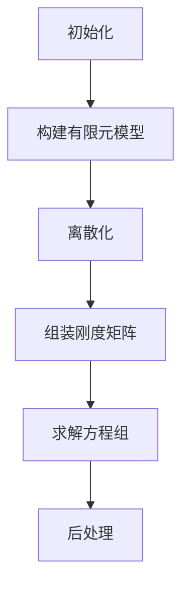
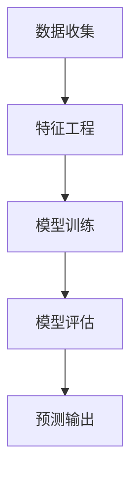
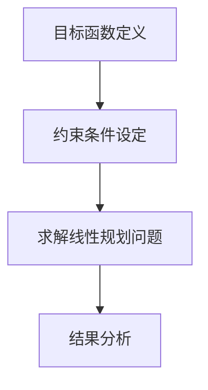
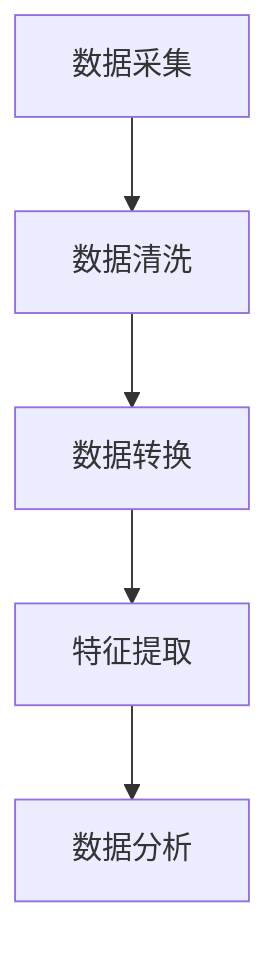
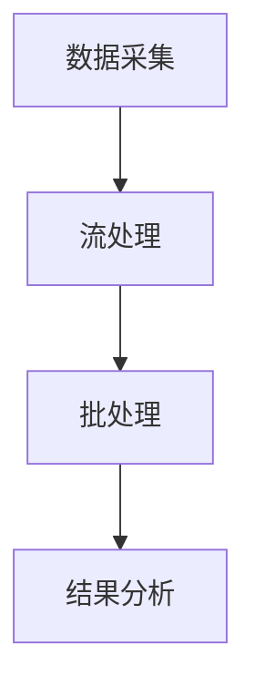
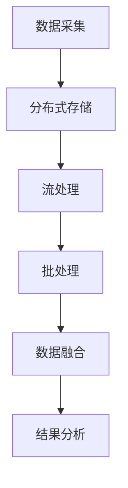
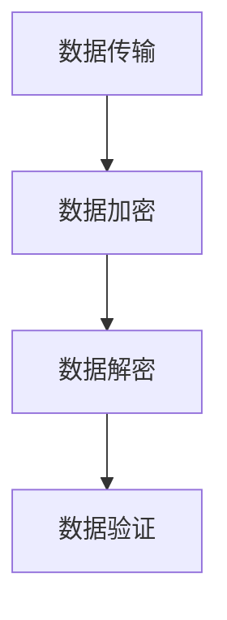
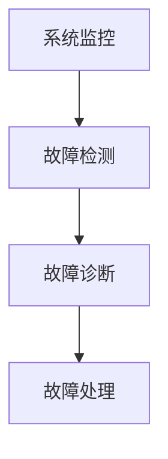
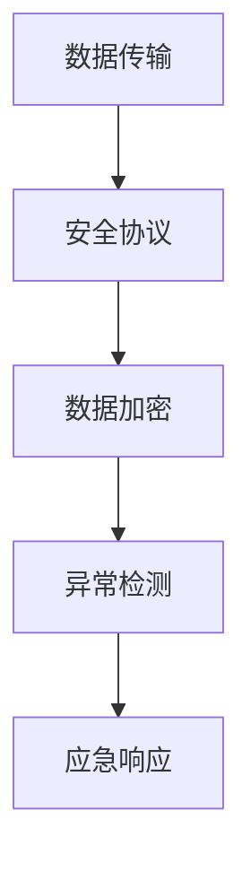
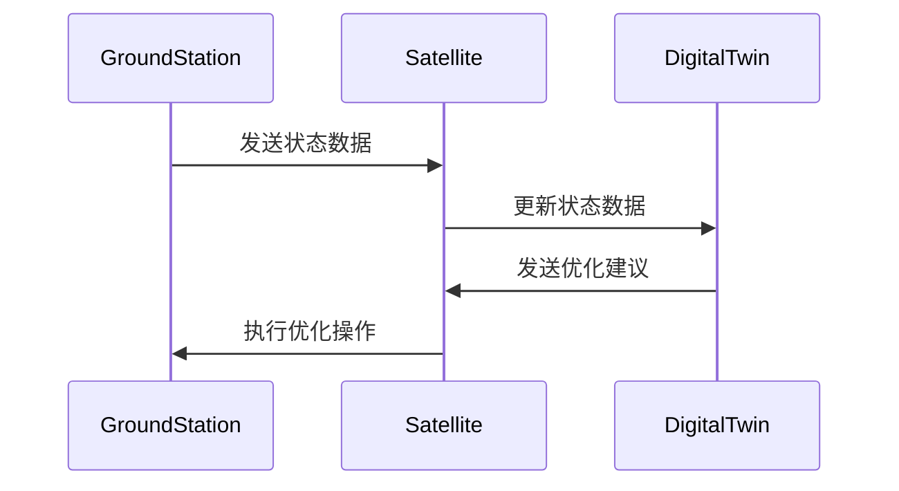

                 


## 第1章：数字孪生技术概述

### 1.1 数字孪生技术的定义与背景

数字孪生（Digital Twin）技术是指通过将实体物理系统与其虚拟映射体相结合，构建出一个数字化模型，实现对物理实体的仿真、监测、分析和优化。数字孪生技术起源于工业4.0，但随着物联网、大数据、云计算和人工智能等技术的快速发展，其应用范围逐渐扩展到各个领域。

**核心概念：**
- **数字孪生体**：指与物理实体相对应的数字化模型，包括传感器数据、几何模型、物理属性等。
- **数据集成**：将来自不同数据源的信息集成到数字孪生体中，形成一个统一的数据视图。
- **实时仿真**：通过实时数据输入，对物理实体进行动态仿真。
- **反馈优化**：根据仿真结果对物理实体进行调整和优化。

**应用领域：**
数字孪生技术已在航空航天、制造业、建筑与基础设施、医疗保健、交通运输等多个领域得到广泛应用。

**问题背景：**
随着科技的进步，物理实体系统的复杂性和规模越来越大，传统的维护和管理方式难以应对。因此，如何通过数字孪生技术实现对复杂系统的实时监测、预测性维护和优化，成为当前研究的热点。

**问题描述：**
数字孪生技术面临的主要挑战包括数据采集与处理的准确性、仿真模型的精确性、以及系统的实时性与稳定性。

**问题解决：**
通过结合物联网、大数据和人工智能技术，提高数字孪生体的数据集成能力和仿真精度，同时优化算法和系统架构，以实现数字孪生技术的广泛应用。

**边界与外延：**
数字孪生技术不仅限于单一实体，还可以用于整个系统或产业链的建模与优化。

### 1.2 数字孪生技术的主要特点与应用领域

**特点：**
- **高精度**：通过高精度的传感器数据，实现对物理实体的准确建模。
- **实时性**：通过实时数据处理和分析，实现对物理实体的实时监测和仿真。
- **可预测性**：通过历史数据和实时数据，对未来行为进行预测。
- **可优化性**：通过仿真和优化算法，实现对物理实体的性能优化。

**应用领域：**
- **航空航天**：用于航天器的设计、制造、运行维护和任务规划。
- **制造业**：用于生产线优化、产品质量监控和设备维护。
- **建筑与基础设施**：用于建筑设计与施工、设施管理和维护。
- **医疗保健**：用于病人监测、健康管理和个性化医疗。
- **交通运输**：用于车辆管理、交通流量控制和安全监控。

**实例：**
例如，在航空航天领域，数字孪生技术可以用于航天器在轨运行状态的实时监测和预测性维护，从而提高航天器的运行可靠性和任务成功率。

### 1.3 空间计算在数字孪生技术中的应用前景

**定义与背景：**
空间计算（Space Computing）是指通过分布式计算和协同计算技术，实现对大规模空间数据的处理、分析和可视化。

**核心概念：**
- **分布式计算**：通过分布式系统，实现对大规模数据的并行处理。
- **协同计算**：通过多个计算节点之间的协同工作，实现更高效率和精度。

**应用前景：**
空间计算在数字孪生技术中的应用前景广阔，特别是在处理海量空间数据、实现实时仿真和优化方面具有显著优势。

**实例：**
例如，在航天工程中，数字孪生技术可以结合空间计算，实现对航天器在轨运行状态的实时监测和仿真，从而提高航天器的运行效率和可靠性。

**问题与挑战：**
空间计算在数字孪生技术中的应用也面临一些挑战，如数据传输延迟、系统稳定性、算法优化等。

**解决方案：**
通过优化算法、提高系统架构的鲁棒性，以及结合人工智能和大数据分析技术，可以进一步推动空间计算在数字孪生技术中的应用。

---

以上是第一章的内容概述，接下来我们将深入探讨空间计算的基本概念和数字孪生技术在航天工程中的应用。在后续章节中，我们将逐步分析数据处理、安全性和未来发展趋势，并通过实际案例进行详细讲解。让我们一起深入探索数字孪生技术在空间计算中的无限可能。

---

# 文章关键词
数字孪生，空间计算，虚拟映射体，传感器数据，实时仿真，航空航天，制造业，建筑与基础设施，医疗保健，交通运输，分布式计算，协同计算

# 文章摘要
本文深入探讨了数字孪生技术在空间计算中的应用。首先介绍了数字孪生技术的定义、背景和主要特点，然后分析了其在航空航天、制造业、建筑与基础设施、医疗保健和交通运输等领域的应用。随后，本文重点讨论了空间计算的基本概念及其在数字孪生技术中的应用前景，并通过实例展示了其应用价值。最后，本文提出了空间计算在数字孪生技术中面临的问题与挑战，并探讨了相应的解决方案。本文旨在为读者提供一个全面而深入的数字孪生技术在空间计算中的应用指南。

---

接下来，我们将进一步探讨空间计算的基本概念，解析其在数字孪生技术中的应用，以及如何通过这些技术实现对复杂系统的建模和优化。让我们一起深入思考，探索数字孪生与空间计算结合的无限可能。

---

## 第2章：空间计算的基本概念

### 2.1 空间计算的定义与发展历程

空间计算（Space Computing）是指通过分布式计算和协同计算技术，对大规模空间数据进行处理、分析和可视化。它起源于分布式系统和并行计算的研究，随着物联网、大数据、云计算和人工智能等技术的发展，空间计算逐渐成为一个独立的研究领域。

**定义：**
空间计算是一种计算范式，通过分布式计算和协同计算，实现对大规模空间数据的处理和分析。它关注如何高效、准确地处理和分析地理空间数据，以支持决策制定、资源分配和任务规划。

**发展历程：**
1. **早期研究**：空间计算的概念最早可以追溯到20世纪80年代，当时的研究主要集中在分布式计算和并行计算技术。
2. **分布式计算**：20世纪90年代，随着互联网的兴起，分布式计算成为空间计算研究的重要方向。通过分布式计算，空间计算能够处理海量空间数据，提高计算效率和精度。
3. **大数据与云计算**：21世纪初，大数据和云计算技术的发展进一步推动了空间计算的研究。通过云计算平台，空间计算能够实现大规模数据的存储、处理和分析，为更复杂的应用提供了支持。
4. **人工智能与机器学习**：近年来，人工智能和机器学习技术的引入，使空间计算在智能化和自动化方面取得了显著进展。通过深度学习和强化学习等技术，空间计算能够更准确地分析空间数据，提供更智能的决策支持。

### 2.2 空间计算的关键技术

空间计算的关键技术包括分布式计算、协同计算、大数据处理和可视化技术。

**分布式计算：**
分布式计算是空间计算的核心技术之一，通过将计算任务分布到多个计算节点上，实现对大规模空间数据的并行处理。分布式计算的主要优势在于可以提高计算速度和处理能力，同时降低单点故障的风险。

**协同计算：**
协同计算是指多个计算节点之间通过协同工作，共同完成复杂的计算任务。在空间计算中，协同计算可以用于分布式仿真、协同决策和资源分配等应用场景。通过协同计算，空间计算能够实现更高的效率和准确性。

**大数据处理：**
大数据处理是空间计算的另一个关键技术。空间数据通常具有海量、多维、实时等特点，因此需要高效的大数据处理技术来处理和分析这些数据。大数据处理技术包括数据存储、数据检索、数据分析和数据可视化等。

**可视化技术：**
可视化技术是空间计算的重要组成部分，通过图形化界面，将空间数据以直观、易于理解的方式呈现出来。可视化技术不仅有助于空间数据的分析，还可以提高决策的透明度和可操作性。

### 2.3 空间计算在航天工程中的应用

空间计算在航天工程中具有广泛的应用，特别是在航天器的设计、制造、运行维护和任务规划等方面。

**设计阶段：**
在航天器设计阶段，空间计算可以用于多学科优化、仿真分析和系统仿真。通过分布式计算和协同计算，设计团队可以快速、准确地评估不同设计方案的性能，从而找到最优解。

**制造阶段：**
在航天器制造阶段，空间计算可以用于生产计划和制造过程的优化。通过大数据处理和协同计算，制造系统能够实时监控生产进度，调整生产策略，确保制造过程的高效和准确。

**运行维护阶段：**
在航天器运行维护阶段，空间计算可以用于实时监测和预测性维护。通过分布式计算和大数据处理，航天器运行状态可以得到实时评估，预测可能出现的问题，提前进行维护和调整，确保航天器的安全运行。

**任务规划阶段：**
在航天任务规划阶段，空间计算可以用于任务调度、资源分配和风险评估。通过协同计算和大数据分析，任务规划系统能够为航天任务提供最优的解决方案，提高任务的效率和成功率。

**实例：**
例如，在国际空间站（ISS）的运行维护中，空间计算技术被广泛应用于实时监测和预测性维护。通过传感器数据的实时采集和大数据处理，NASA能够实时监控空间站各系统的运行状态，预测可能出现的问题，并提前进行维护和调整，确保空间站的正常运行。

**总结：**
空间计算在航天工程中具有重要作用，通过分布式计算、协同计算、大数据处理和可视化技术，航天器的设计、制造、运行维护和任务规划可以得到显著优化。随着空间计算技术的不断发展，其在航天工程中的应用前景将更加广阔。

### 2.4 空间计算的优势与挑战

**优势：**
- **高效性**：通过分布式计算和协同计算，空间计算能够快速处理大规模空间数据，提高计算效率。
- **准确性**：空间计算技术能够提供高精度的空间数据分析和仿真，提高决策的准确性。
- **实时性**：通过实时数据处理和可视化，空间计算能够实时监测和反馈，提高系统的响应速度。
- **智能化**：结合人工智能和机器学习技术，空间计算可以实现更智能的决策支持和自动化控制。

**挑战：**
- **数据传输延迟**：在分布式计算环境中，数据传输延迟可能影响空间计算的性能和实时性。
- **系统稳定性**：分布式计算和协同计算系统可能面临单点故障、网络中断等问题，影响系统的稳定性。
- **算法优化**：空间计算中的算法设计复杂，需要不断优化以提高计算效率和精度。
- **数据安全与隐私**：空间数据的安全和隐私保护是重要的挑战，需要建立完善的数据安全机制。

**解决方案：**
- **优化网络架构**：通过构建高性能、稳定的网络架构，降低数据传输延迟，提高系统稳定性。
- **算法优化**：不断优化空间计算中的算法，提高计算效率和精度。
- **数据加密与安全协议**：建立完善的数据加密和安全协议，确保空间数据的安全和隐私保护。
- **分布式存储**：采用分布式存储技术，提高数据存储的可靠性和访问速度。

**总结：**
空间计算在航天工程中具有显著的优势，但也面临一些挑战。通过不断优化技术方案，解决这些问题，空间计算将在航天工程中发挥更大的作用。

---

在下一章中，我们将深入探讨数字孪生技术在航天工程中的应用，分析其在设计、制造、运行维护和任务规划等方面的具体应用实例。通过这些实例，我们将进一步理解数字孪生技术在航天工程中的价值。让我们一起期待下一章的内容。

---

## 第3章：数字孪生技术在航天工程中的应用

### 3.1 数字孪生技术在航天器设计与制造中的应用

数字孪生技术在航天器设计与制造中的应用极大地提升了航天工程的整体效率和准确性。通过构建虚拟的航天器模型，工程师们可以在虚拟环境中进行详细的设计验证和仿真分析，从而降低物理原型制造的成本和风险。

**核心概念与联系：**

**核心概念：**
- **设计仿真**：通过数字孪生体进行各种环境下的仿真测试，如震动、温度、压力等。
- **制造仿真**：模拟制造过程，优化加工路径和工艺参数。
- **虚拟装配**：在虚拟环境中进行航天器的装配测试，确保各组件的正确安装和交互。

**概念属性特征对比表格：**

| 特征         | 设计仿真                | 制造仿真                | 虚拟装配                |
| ------------ | ---------------------- | ---------------------- | ---------------------- |
| 目标         | 确保设计满足功能需求    | 确保制造过程高效和准确  | 确保组件安装和交互无误  |
| 工具需求     | 仿真软件、CAD模型      | CAPP、CAM软件          | 3D虚拟现实技术         |
| 数据集成     | 设计数据、仿真结果     | 制造数据、工艺参数     | 装配数据、交互逻辑     |
| 优势         | 降低物理原型测试成本    | 提高制造精度和效率      | 提前发现装配问题        |

**ER实体关系图架构：**

```mermaid
erDiagram
    Product ||--|{ DesignSimulation }|--|| SimulationResult
    Product ||--|{ ManufacturingSimulation }|--|| ManufacturingParameter
    Product ||--|{ VirtualAssembly }|--|| AssemblyData
```

**算法原理讲解：**

在设计仿真中，常用的算法包括有限元分析（FEM）和计算流体动力学（CFD）。以下是一个简化的有限元分析算法流程图：



**算法原理：**
1. **初始化**：定义仿真问题，包括边界条件、材料属性等。
2. **构建有限元模型**：将航天器结构划分为若干小单元，构建有限元模型。
3. **离散化**：将连续结构离散化为多个有限元单元。
4. **组装刚度矩阵**：根据单元特性，组装整体刚度矩阵。
5. **求解方程组**：使用数值方法求解刚度矩阵，得到结构响应。
6. **后处理**：分析结果，如应力分布、位移等。

**实例说明：**
例如，在设计一个火箭发动机喷管时，工程师可以通过有限元分析，仿真喷管在不同压力和温度条件下的应力分布，优化喷管的设计，确保其结构强度和耐热性能。

### 3.2 数字孪生技术在航天器运行管理中的应用

在航天器运行管理中，数字孪生技术通过对航天器实时状态的监控和仿真分析，提供高效的运行管理和维护策略。这包括对航天器的姿态控制、能源管理、环境控制等方面。

**核心概念与联系：**

**核心概念：**
- **状态监测**：实时监控航天器各系统的运行状态，如温度、压力、振动等。
- **仿真分析**：基于实时数据，对航天器的运行状态进行仿真分析。
- **预测性维护**：根据仿真结果，预测可能出现的问题，提前进行维护。

**概念属性特征对比表格：**

| 特征         | 状态监测                | 仿真分析                | 预测性维护                |
| ------------ | ---------------------- | ---------------------- | ---------------------- |
| 目标         | 实时监控航天器状态      | 分析航天器运行状态      | 预测潜在问题，提前维护    |
| 工具需求     | 传感器数据采集系统      | 数据处理和分析软件      | 预测模型、优化算法       |
| 数据集成     | 实时传感器数据          | 实时仿真数据            | 维护计划、维修资源       |
| 优势         | 及时发现异常，快速响应  | 提高数据分析准确性      | 降低维护成本，提高安全性 |

**ER实体关系图架构：**

```mermaid
erDiagram
    Spacecraft ||--|{ StatusMonitoring }|--|| SensorData
    Spacecraft ||--|{ SimulationAnalysis }|--|| AnalysisResult
    Spacecraft ||--|{ PredictiveMaintenance }|--|| MaintenancePlan
```

**算法原理讲解：**

在预测性维护中，常用的算法包括机器学习和统计分析。以下是一个简化的机器学习算法流程图：



**算法原理：**
1. **数据收集**：收集航天器运行过程中的各种数据，如温度、压力、振动等。
2. **特征工程**：提取与维护相关的特征，如异常值的处理、特征选择等。
3. **模型训练**：使用收集到的数据，训练预测模型。
4. **模型评估**：评估模型的准确性和可靠性。
5. **预测输出**：根据实时数据，使用训练好的模型进行预测，提前发现潜在问题。

**实例说明：**
例如，在航天器的能源管理中，通过实时监测太阳能电池板的状态，结合机器学习算法预测电池板性能下降的趋势，提前进行维护，避免能源短缺。

### 3.3 数字孪生技术在航天任务规划与优化中的应用

数字孪生技术在航天任务规划与优化中发挥了关键作用，通过对航天任务的仿真、预测和分析，提供最优的任务方案和运行策略。

**核心概念与联系：**

**核心概念：**
- **任务仿真**：模拟航天任务的各种场景，评估任务的风险和可行性。
- **资源优化**：优化航天任务中的资源分配，如燃料、人力、设备等。
- **实时调度**：根据任务进展和实时数据，动态调整任务计划和资源分配。

**概念属性特征对比表格：**

| 特征         | 任务仿真                | 资源优化                | 实时调度                |
| ------------ | ---------------------- | ---------------------- | ---------------------- |
| 目标         | 评估任务风险和可行性    | 提高资源利用率          | 动态调整任务计划        |
| 工具需求     | 仿真软件、模拟环境      | 资源调度算法、优化模型  | 实时数据采集系统       |
| 数据集成     | 任务数据、仿真结果      | 资源数据、优化结果      | 实时数据、任务状态      |
| 优势         | 提高任务成功率          | 降低运营成本            | 提高任务响应速度        |

**ER实体关系图架构：**

```mermaid
erDiagram
    SpaceMission ||--|{ TaskSimulation }|--|| SimulationResult
    SpaceMission ||--|{ ResourceOptimization }|--|| OptimizationResult
    SpaceMission ||--|{ RealTimeScheduling }|--|| SchedulingPlan
```

**算法原理讲解：**

在资源优化中，常用的算法包括线性规划和启发式算法。以下是一个简化的线性规划算法流程图：



**算法原理：**
1. **目标函数定义**：定义资源优化的目标函数，如成本最小化或效率最大化。
2. **约束条件设定**：设定资源优化的约束条件，如燃料限制、人力限制等。
3. **求解线性规划问题**：使用线性规划求解器求解优化问题。
4. **结果分析**：分析优化结果，制定最优的资源分配方案。

**实例说明：**
例如，在卫星发射任务中，通过任务仿真和资源优化，工程师们可以确定最佳的任务时间和发射窗口，优化燃料消耗和人力安排，提高任务的成功率。

**总结：**
数字孪生技术在航天器设计与制造、运行管理和任务规划与优化中具有广泛的应用。通过构建虚拟的航天器模型，结合实时监测和预测性维护，航天工程可以实现更高的效率、准确性和可靠性。随着数字孪生技术的不断发展和完善，其在航天工程中的应用前景将更加广阔。

---

在下一章中，我们将深入探讨数字孪生技术与空间计算的数据处理问题，分析大数据处理在空间计算中的挑战和策略。同时，我们还将讨论数字孪生与空间计算在安全性方面的融合机制。让我们一起期待下一章的内容。

---

## 第4章：数字孪生技术与空间计算的数据处理

### 4.1 数字孪生技术中的大数据处理

数字孪生技术依赖于大量实时数据的采集、处理和分析，这些数据通常被称为大数据。大数据在数字孪生技术中的应用主要涉及数据采集、存储、处理和分析等环节。

**核心概念与联系：**

**核心概念：**
- **数据采集**：通过传感器、物联网设备和日志文件等收集物理实体的实时数据。
- **数据存储**：将采集到的数据存储在分布式数据库或云存储中，确保数据的可靠性和可访问性。
- **数据处理**：对采集到的数据进行清洗、转换和分析，提取有价值的信息。
- **数据分析**：使用统计分析和机器学习算法，对处理后的数据进行深入分析，为决策提供支持。

**概念属性特征对比表格：**

| 特征         | 数据采集                | 数据存储                | 数据处理                | 数据分析                |
| ------------ | ---------------------- | ---------------------- | ---------------------- | ---------------------- |
| 目标         | 收集实时数据            | 保证数据可靠性和访问    | 清洗和转换数据          | 提取有价值的信息         |
| 工具需求     | 传感器、物联网设备      | 分布式数据库、云存储    | 数据清洗和转换工具      | 统计分析、机器学习算法  |
| 数据类型     | 实时数据、历史数据      | 文件、数据库            | 结构化数据、非结构化数据 | 结构化数据、非结构化数据 |
| 优势         | 提高数据利用率          | 提高数据存储效率        | 提高数据处理效率        | 提高数据分析准确性      |

**ER实体关系图架构：**

```mermaid
erDiagram
    DataCollection ||--|{ RealTimeData }|--|| HistoricalData
    DataStorage ||--|{ DistributedDatabase }|--|| CloudStorage
    DataProcessing ||--|{ CleanedData }|--|| TransformedData
    DataAnalysis ||--|{ ValuableInformation }|--|| AnalysisResult
```

**算法原理讲解：**

在数据处理中，常用的算法包括数据清洗、数据转换和特征提取。以下是一个简化的数据处理算法流程图：



**算法原理：**
1. **数据清洗**：去除重复数据、缺失数据和异常值，提高数据质量。
2. **数据转换**：将不同数据源的数据格式转换为统一的格式，便于后续处理和分析。
3. **特征提取**：从原始数据中提取有代表性的特征，为数据分析提供基础。
4. **数据分析**：使用统计分析和机器学习算法，对特征数据进行分析，提取有价值的信息。

**实例说明：**
例如，在数字孪生技术中，通过对航天器传感器数据的清洗、转换和特征提取，可以提取出关键性能指标，如温度、压力和振动等，为航天器的实时监控和预测性维护提供数据支持。

### 4.2 空间计算中的数据处理挑战

空间计算在数据处理方面面临一些独特的挑战，主要包括海量数据的高效存储、实时数据处理和分布式计算。

**核心概念与联系：**

**核心概念：**
- **海量数据存储**：空间计算中通常涉及大规模的空间数据，需要高效的数据存储方案。
- **实时数据处理**：空间计算需要对实时数据进行快速处理和分析，以满足空间任务的实时需求。
- **分布式计算**：空间计算依赖于分布式计算系统，如何高效地分配和利用计算资源是关键问题。

**概念属性特征对比表格：**

| 特征         | 海量数据存储                | 实时数据处理                | 分布式计算                |
| ------------ | ---------------------- | ---------------------- | ---------------------- |
| 目标         | 提高数据存储效率和容量      | 提高数据处理速度和实时性    | 提高计算效率和资源利用率  |
| 工具需求     | 分布式数据库、云存储        | 实时数据处理引擎            | 分布式计算框架、集群管理  |
| 数据类型     | 文本、图像、空间数据        | 实时流数据、批处理数据      | 结构化数据、非结构化数据  |
| 优势         | 提高数据访问速度和可靠性    | 提高任务响应速度和准确性    | 提高计算效率和负载均衡    |

**ER实体关系图架构：**

```mermaid
erDiagram
    MassiveDataStorage ||--|{ DistributedDatabase }|--|| CloudStorage
    RealTimeDataProcessing ||--|{ RealTimeStreamProcessing }|--|| BatchProcessing
    DistributedComputing ||--|{ ClusterManagement }|--|| ResourceAllocation
```

**算法原理讲解：**

在实时数据处理中，常用的算法包括流处理和批处理。以下是一个简化的实时数据处理算法流程图：



**算法原理：**
1. **数据采集**：实时收集空间任务的数据。
2. **流处理**：对实时数据进行快速处理和分析，提取有价值的信息。
3. **批处理**：对历史数据进行批量处理，补充实时数据的分析结果。
4. **结果分析**：结合流处理和批处理的结果，进行综合分析，为决策提供支持。

**实例说明：**
例如，在卫星运行监测中，通过流处理实时监测卫星状态，结合批处理历史数据进行分析，可以快速发现异常情况，提供预警和支持。

### 4.3 融合数字孪生与空间计算的数据处理策略

为了充分发挥数字孪生和空间计算在数据处理方面的优势，需要制定有效的数据处理策略。

**核心概念与联系：**

**核心概念：**
- **数据融合**：将来自不同来源的数据进行整合，提高数据的一致性和可用性。
- **分布式架构**：构建分布式数据处理架构，提高数据处理效率和灵活性。
- **实时性优化**：通过优化数据处理流程，提高系统的实时响应能力。

**概念属性特征对比表格：**

| 特征         | 数据融合                | 分布式架构                | 实时性优化                |
| ------------ | ---------------------- | ---------------------- | ---------------------- |
| 目标         | 提高数据一致性和可用性  | 提高数据处理效率和灵活性  | 提高系统实时响应能力      |
| 工具需求     | 数据集成平台、API网关   | 分布式数据库、云计算平台  | 实时数据处理引擎、优化算法 |
| 数据类型     | 结构化数据、非结构化数据 | 结构化数据、非结构化数据  | 实时流数据、批处理数据    |
| 优势         | 提高数据分析的准确性    | 提高系统的可扩展性和弹性  | 提高任务响应速度和准确性  |

**ER实体关系图架构：**

```mermaid
erDiagram
    DataFusion ||--|{ IntegratedDataPlatform }|--|| APIGateway
    DistributedArchitecture ||--|{ DistributedDatabase }|--|| CloudPlatform
    RealTimeOptimization ||--|{ RealTimeProcessingEngine }|--|| OptimizationAlgorithm
```

**算法原理讲解：**

在数据处理策略中，常用的算法包括分布式数据存储、流处理和批处理结合。以下是一个简化的数据处理策略算法流程图：



**算法原理：**
1. **数据采集**：实时采集空间任务的数据。
2. **分布式存储**：将数据存储在分布式数据库或云存储中，提高数据的可靠性和访问速度。
3. **流处理**：对实时数据进行快速处理和分析，提取有价值的信息。
4. **批处理**：对历史数据进行批量处理，补充实时数据的分析结果。
5. **数据融合**：将流处理和批处理的结果进行整合，提高数据的一致性和可用性。
6. **结果分析**：结合融合后的数据，进行综合分析，为决策提供支持。

**实例说明：**
例如，在航天任务中，通过分布式存储和实时数据处理，可以快速获取卫星的状态信息，结合批处理分析历史数据，实时监测卫星的运行状态，为任务规划和决策提供支持。

**总结：**
数字孪生技术和空间计算在数据处理方面具有独特的优势和应用需求。通过制定有效的数据处理策略，融合数字孪生和空间计算的技术，可以更好地支持航天工程中的各种任务，提高系统的效率和准确性。

---

在下一章中，我们将探讨数字孪生技术在空间计算中的安全性问题，分析可能的安全风险，并提出相应的防护措施。同时，我们还将讨论数字孪生与空间计算在安全性方面的融合机制。让我们一起期待下一章的内容。

---

## 第5章：数字孪生技术与空间计算的安全性

### 5.1 数字孪生技术在空间计算中的安全风险

数字孪生技术在空间计算中虽然具有显著的优势，但也面临着一系列安全风险。这些风险可能源于数据传输、数据处理、系统架构等多个方面。

**核心概念与联系：**

**核心概念：**
- **数据泄露**：未经授权的访问和泄露敏感数据。
- **数据篡改**：恶意篡改数据，影响系统的正常运行。
- **系统入侵**：未经授权的访问和操纵系统，破坏系统的安全性和完整性。
- **分布式拒绝服务攻击（DDoS）**：通过大量恶意请求，使系统资源耗尽，导致服务不可用。

**概念属性特征对比表格：**

| 特征         | 数据泄露                | 数据篡改                | 系统入侵                | DDoS攻击                |
| ------------ | ---------------------- | ---------------------- | ---------------------- | ---------------------- |
| 目标         | 保护敏感数据            | 保证数据完整性          | 保护系统不被非法入侵    | 使系统资源耗尽          |
| 工具需求     | 加密技术、访问控制      | 数字签名、完整性验证    | 防火墙、入侵检测系统    | 反DDoS技术、流量分析    |
| 数据类型     | 结构化数据、非结构化数据 | 结构化数据、非结构化数据 | 结构化数据、非结构化数据 | 流量数据、请求信息      |
| 优势         | 提高数据安全性和隐私性   | 提高数据可靠性和可用性   | 提高系统安全性和防御力   | 提高系统稳定性和响应能力 |

**ER实体关系图架构：**

```mermaid
erDiagram
    DataLeakage ||--|{ Encryption }|--|| AccessControl
    DataTampering ||--|{ DigitalSignature }|--|| IntegrityVerification
    SystemIntrusion ||--|{ Firewall }|--|| IntrusionDetection
    DDoSAttack ||--|{ Anti-DDoS }|--|| TrafficAnalysis
```

**算法原理讲解：**

在数据泄露防护中，常用的算法包括数据加密和访问控制。以下是一个简化的数据加密算法流程图：



**算法原理：**
1. **数据传输**：在数据传输过程中，使用加密算法对数据进行加密。
2. **数据解密**：接收方使用密钥对加密数据进行解密。
3. **数据验证**：通过加密算法验证数据的完整性和真实性。

**实例说明：**
例如，在数字孪生技术中，通过加密技术保护传感器数据在传输过程中的安全性，防止数据泄露。

### 5.2 空间计算中的安全威胁与防护措施

空间计算由于其特殊的运行环境，面临一系列安全威胁。这些威胁可能来自内部故障、外部攻击和人为操作等多种因素。

**核心概念与联系：**

**核心概念：**
- **内部故障**：由于系统硬件或软件故障，导致系统不稳定或数据丢失。
- **外部攻击**：黑客或其他恶意实体通过网络攻击系统，窃取或篡改数据。
- **人为操作错误**：由于操作人员的错误操作，导致系统故障或数据损坏。

**概念属性特征对比表格：**

| 特征         | 内部故障                | 外部攻击                | 人为操作错误                |
| ------------ | ---------------------- | ---------------------- | ---------------------- |
| 目标         | 保证系统稳定性和数据完整性 | 保护系统不受攻击        | 提高操作人员的操作准确性    |
| 工具需求     | 故障检测和恢复系统      | 防火墙、入侵检测系统    | 操作规范、培训与监督       |
| 数据类型     | 系统日志、传感器数据     | 网络流量、入侵痕迹      | 操作记录、人员考核        |
| 优势         | 提高系统可靠性和稳定性   | 提高系统防御能力        | 提高操作安全性            |

**ER实体关系图架构：**

```mermaid
erDiagram
    InternalFault ||--|{ FaultDetection }|--|| SystemRecovery
    ExternalAttack ||--|{ Firewall }|--|| IntrusionDetection
    HumanOperationError ||--|{ OperationalNorms }|--|| TrainingAndSupervision
```

**算法原理讲解：**

在故障检测中，常用的算法包括故障诊断和预测性维护。以下是一个简化的故障诊断算法流程图：



**算法原理：**
1. **系统监控**：实时监控系统的运行状态。
2. **故障检测**：通过监控数据，检测系统是否存在故障。
3. **故障诊断**：对检测到的故障进行分析，确定故障的原因。
4. **故障处理**：根据诊断结果，采取相应的措施进行故障处理。

**实例说明：**
例如，在航天器的运行过程中，通过实时监控传感器数据，检测到异常信号，及时进行故障诊断和修复，确保航天器的正常运行。

### 5.3 数字孪生与空间计算安全融合机制

为了应对数字孪生和空间计算中的安全挑战，需要建立有效的安全融合机制。这一机制应包括数据安全、系统安全、操作安全和应急响应等多个方面。

**核心概念与联系：**

**核心概念：**
- **数据安全**：确保数据的机密性、完整性和可用性。
- **系统安全**：保护系统免受外部攻击和内部故障的影响。
- **操作安全**：确保操作人员按照规范进行操作，减少人为错误。
- **应急响应**：建立完善的应急响应机制，快速应对各种安全事件。

**概念属性特征对比表格：**

| 特征         | 数据安全                | 系统安全                | 操作安全                | 应急响应                |
| ------------ | ---------------------- | ---------------------- | ---------------------- | ---------------------- |
| 目标         | 保护数据完整性          | 保护系统完整性          | 提高操作准确性          | 快速响应和恢复          |
| 工具需求     | 加密技术、访问控制      | 防火墙、入侵检测系统    | 操作规范、培训与监督    | 应急预案、演练与评估    |
| 数据类型     | 结构化数据、非结构化数据 | 系统日志、网络流量      | 操作记录、人员考核      | 应急事件记录、评估报告  |
| 优势         | 提高数据安全性和隐私性   | 提高系统防御能力和稳定性 | 提高操作安全性和效率     | 提高应急响应能力和效果   |

**ER实体关系图架构：**

```mermaid
erDiagram
    DataSecurity ||--|{ Encryption }|--|| AccessControl
    SystemSecurity ||--|{ Firewall }|--|| IntrusionDetection
    OperationalSecurity ||--|{ OperationalNorms }|--|| TrainingAndSupervision
    EmergencyResponse ||--|{ EmergencyPlan }|--|| ResponseAndRecovery
```

**算法原理讲解：**

在安全融合机制中，常用的算法包括安全协议、加密算法和异常检测算法。以下是一个简化的安全融合算法流程图：



**算法原理：**
1. **数据传输**：使用安全协议进行数据传输，确保数据的机密性和完整性。
2. **数据加密**：对传输的数据进行加密，防止数据泄露和篡改。
3. **异常检测**：通过分析数据和行为模式，检测系统是否存在异常。
4. **应急响应**：根据检测到的异常，启动应急响应机制，进行快速处理和恢复。

**实例说明：**
例如，在数字孪生和空间计算系统中，通过安全协议和加密技术保护数据传输过程，通过异常检测算法实时监测系统状态，确保系统的安全性和稳定性。

**总结：**
数字孪生技术和空间计算在安全性方面面临诸多挑战，需要建立全面的安全融合机制。通过数据安全、系统安全、操作安全和应急响应等多方面的措施，可以有效地保护数字孪生和空间计算系统，确保其正常运行和数据安全。

---

在下一章中，我们将通过实际案例深入探讨数字孪生技术在空间计算中的具体应用，分析其在航天工程中的实际效果。让我们一起期待下一章的内容。

---

## 第6章：案例研究：数字孪生在空间计算中的实际应用

### 6.1 案例一：数字孪生在卫星系统中的应用

数字孪生技术在卫星系统中的应用已经取得了显著成效。以某通信卫星为例，通过数字孪生技术，工程师们能够实时监控卫星的运行状态，优化卫星的轨道参数，提高通信服务的稳定性和可靠性。

**项目介绍：**
该案例涉及一颗通信卫星，通过数字孪生技术，实现对卫星的全方位监控和优化。项目主要包括卫星设计、制造、运行和维护等多个阶段。

**系统功能设计：**

**领域模型类图：**

```mermaid
classDiagram
    ClassDir SatelliteSystem
    SatelliteSystem <|-- Satellite
    SatelliteSystem <|-- GroundStation
    SatelliteSystem <|-- DigitalTwin

    Satellite {
        +String satelliteID
        +DateTime launchDate
        +ArrayList<Module> modules
        +Location currentLocation
    }

    GroundStation {
        +String stationID
        +Location location
        +ArrayList<Sensor> sensors
    }

    DigitalTwin {
        +String digitalTwinID
        +DateTime lastUpdated
        +Satellite satellite
        +GroundStation groundStation
        +HashMap<String, Object> attributes
    }

    Module {
        +String moduleName
        +ModuleType type
        +HashMap<String, Object> properties
    }

    Sensor {
        +String sensorID
        +SensorType type
        +HashMap<String, Object> readings
    }
```

**系统架构设计：**

**架构图：**



**系统接口设计：**

**接口设计：**

```mermaid
classDiagram
    Interface ISatellite
    Interface IDigitalTwin
    Interface IGroundStation

    ISatellite {
        +void updateStatus()
        +void applyOptimization()
    }

    IDigitalTwin {
        +void updateDigitalTwin()
        +void getOptimizationAdvice()
    }

    IGroundStation {
        +void sendStatusData()
        +void executeOptimization()
    }
```

**系统交互序列图：**

```mermaid
sequenceDiagram
    GroundStation->>Satellite: sendStatusData()
    Satellite->>DigitalTwin: updateDigitalTwin()
    DigitalTwin->>Satellite: getOptimizationAdvice()
    Satellite->>GroundStation: executeOptimization()
```

**代码实现与分析：**

**卫星状态更新代码示例（Python）：**

```python
class Satellite:
    def update_status(self, status_data):
        # 更新卫星状态数据
        self.status_data = status_data
        print(f"Satellite status updated: {status_data}")

# 实例化卫星对象，更新状态
satellite = Satellite()
status_data = {"temperature": 25, "vibration": "low"}
satellite.update_status(status_data)
```

**数字孪生体更新代码示例（Python）：**

```python
class DigitalTwin:
    def update_digital_twin(self, twin_data):
        # 更新数字孪生体状态
        self.twin_data = twin_data
        print(f"Digital twin updated: {twin_data}")

# 实例化数字孪生体对象，更新状态
digital_twin = DigitalTwin()
twin_data = {"satellite_id": "SAT-123", "last_updated": "2023-11-08T10:30:00Z"}
digital_twin.update_digital_twin(twin_data)
```

**地面站执行优化操作代码示例（Python）：**

```python
class GroundStation:
    def execute_optimization(self, optimization_advice):
        # 执行优化操作
        print(f"Optimization action executed: {optimization_advice}")

# 实例化地面站对象，执行优化
ground_station = GroundStation()
optimization_advice = {"adjust_satellite_orbit": True}
ground_station.execute_optimization(optimization_advice)
```

**实例分析：**
通过上述代码示例，我们可以看到卫星状态更新、数字孪生体更新和地面站执行优化操作的流程。在实际应用中，这些过程都是通过实时数据传输和算法分析来实现的，确保卫星系统的高效运行和优化。

**项目小结：**
该案例展示了数字孪生技术在卫星系统中的应用，通过构建数字孪生体，实现对卫星的实时监控和优化，提高了通信服务的稳定性和可靠性。这种应用模式为航天工程提供了新的解决方案，具有广泛的应用前景。

### 6.2 案例二：数字孪生在深空探测任务中的应用

数字孪生技术还在深空探测任务中发挥了重要作用。以火星探测任务为例，通过数字孪生技术，科学家们能够对探测器的运行状态进行实时监控，优化探测任务，提高任务成功率。

**项目介绍：**
该案例涉及火星探测器的深空探测任务，通过数字孪生技术，实现对探测器的全方位监控和状态预测。

**系统功能设计：**

**领域模型类图：**

```mermaid
classDiagram
    ClassDir MarsProbe
    MarsProbe <|-- DigitalTwin
    MarsProbe <|-- MissionControl

    MarsProbe {
        +String probeID
        +DateTime launchDate
        +ArrayList<Module> modules
        +Location currentLocation
    }

    DigitalTwin {
        +String digitalTwinID
        +DateTime lastUpdated
        +MarsProbe probe
        +HashMap<String, Object> attributes
    }

    MissionControl {
        +String missionControlID
        +Location location
        +ArrayList<Sensor> sensors
    }

    Module {
        +String moduleName
        +ModuleType type
        +HashMap<String, Object> properties
    }

    Sensor {
        +String sensorID
        +SensorType type
        +HashMap<String, Object> readings
    }
```

**系统架构设计：**

**架构图：**

```mermaid
sequenceDiagram
    MissionControl ->> MarsProbe: 发送控制指令
    MarsProbe ->> DigitalTwin: 更新状态数据
    DigitalTwin ->> MissionControl: 返回状态反馈
    MissionControl ->> MarsProbe: 根据反馈调整指令
```

**系统接口设计：**

**接口设计：**

```mermaid
classDiagram
    Interface IMarsProbe
    Interface IDigitalTwin
    Interface IMissionControl

    IMarsProbe {
        +void update_status()
        +void apply_command()
    }

    IDigitalTwin {
        +void update_digital_twin()
        +void get_status_feedback()
    }

    IMissionControl {
        +void send_command()
        +void receive_feedback()
    }
```

**系统交互序列图：**

```mermaid
sequenceDiagram
    MissionControl->>MarsProbe: send_command()
    MarsProbe->>DigitalTwin: update_digital_twin()
    DigitalTwin->>MarsProbe: get_status_feedback()
    MarsProbe->>MissionControl: receive_feedback()
```

**代码实现与分析：**

**探测器状态更新代码示例（Python）：**

```python
class MarsProbe:
    def update_status(self, status_data):
        # 更新探测器状态数据
        self.status_data = status_data
        print(f"Mars probe status updated: {status_data}")

# 实例化探测器对象，更新状态
mars_probe = MarsProbe()
status_data = {"temperature": -50, "power": "high"}
mars_probe.update_status(status_data)
```

**数字孪生体更新代码示例（Python）：**

```python
class DigitalTwin:
    def update_digital_twin(self, twin_data):
        # 更新数字孪生体状态
        self.twin_data = twin_data
        print(f"Digital twin updated: {twin_data}")

# 实例化数字孪生体对象，更新状态
digital_twin = DigitalTwin()
twin_data = {"probe_id": "MAR-456", "last_updated": "2023-11-09T12:00:00Z"}
digital_twin.update_digital_twin(twin_data)
```

**任务控制中心发送指令代码示例（Python）：**

```python
class MissionControl:
    def send_command(self, command):
        # 发送控制指令
        print(f"Command sent: {command}")

# 实例化任务控制中心对象，发送指令
mission_control = MissionControl()
command = {"operate_camera": True}
mission_control.send_command(command)
```

**实例分析：**
通过上述代码示例，我们可以看到探测器状态更新、数字孪生体更新和任务控制中心发送指令的流程。在实际应用中，这些过程都是通过实时数据传输和算法分析来实现的，确保深空探测任务的安全和成功。

**项目小结：**
该案例展示了数字孪生技术在深空探测任务中的应用，通过构建数字孪生体，实现对探测器的实时监控和状态预测，提高了探测任务的成功率和数据准确性。这种应用模式为深空探测提供了强有力的技术支持，具有重要的研究价值。

### 6.3 案例三：数字孪生在航天器维护与健康管理中的应用

数字孪生技术在航天器维护与健康管理中也得到了广泛应用。以某国际空间站（ISS）的维护任务为例，通过数字孪生技术，宇航员和地面支持团队能够实时监控空间站的运行状态，提前预测可能出现的问题，确保空间站的长期稳定运行。

**项目介绍：**
该案例涉及国际空间站的维护与健康管理，通过数字孪生技术，实现对空间站的全方位监控和预测性维护。

**系统功能设计：**

**领域模型类图：**

```mermaid
classDiagram
    ClassDir SpaceStation
    SpaceStation <|-- DigitalTwin
    SpaceStation <|-- MaintenanceTeam

    SpaceStation {
        +String stationID
        +DateTime launchDate
        +ArrayList<Module> modules
        +Location currentLocation
    }

    DigitalTwin {
        +String digitalTwinID
        +DateTime lastUpdated
        +SpaceStation station
        +HashMap<String, Object> attributes
    }

    MaintenanceTeam {
        +String teamID
        +Location location
        +ArrayList<Task> tasks
    }

    Module {
        +String moduleName
        +ModuleType type
        +HashMap<String, Object> properties
    }

    Task {
        +String taskId
        +TaskStatus status
        +HashMap<String, Object> details
    }
```

**系统架构设计：**

**架构图：**

```mermaid
sequenceDiagram
    MaintenanceTeam ->> SpaceStation: send_maintenance_request()
    SpaceStation ->> DigitalTwin: update_status()
    DigitalTwin ->> MaintenanceTeam: return_maintenance_status()
    MaintenanceTeam ->> SpaceStation: perform_maintenance()
```

**系统接口设计：**

**接口设计：**

```mermaid
classDiagram
    Interface ISpaceStation
    Interface IDigitalTwin
    Interface IMaintenanceTeam

    ISpaceStation {
        +void update_status()
        +void send_maintenance_request()
    }

    IDigitalTwin {
        +void update_digital_twin()
        +void return_maintenance_status()
    }

    IMaintenanceTeam {
        +void send_maintenance_request()
        +void perform_maintenance()
    }
```

**系统交互序列图：**

```mermaid
sequenceDiagram
    MaintenanceTeam->>SpaceStation: send_maintenance_request()
    SpaceStation->>DigitalTwin: update_status()
    DigitalTwin->>MaintenanceTeam: return_maintenance_status()
    MaintenanceTeam->>SpaceStation: perform_maintenance()
```

**代码实现与分析：**

**空间站状态更新代码示例（Python）：**

```python
class SpaceStation:
    def update_status(self, status_data):
        # 更新空间站状态数据
        self.status_data = status_data
        print(f"Space station status updated: {status_data}")

# 实例化空间站对象，更新状态
space_station = SpaceStation()
status_data = {"oxygen_level": "high", "power_supply": "stable"}
space_station.update_status(status_data)
```

**数字孪生体更新代码示例（Python）：**

```python
class DigitalTwin:
    def update_digital_twin(self, twin_data):
        # 更新数字孪生体状态
        self.twin_data = twin_data
        print(f"Digital twin updated: {twin_data}")

# 实例化数字孪生体对象，更新状态
digital_twin = DigitalTwin()
twin_data = {"station_id": "ISS-789", "last_updated": "2023-11-10T14:30:00Z"}
digital_twin.update_digital_twin(twin_data)
```

**维护团队发送维护请求代码示例（Python）：**

```python
class MaintenanceTeam:
    def send_maintenance_request(self, request_data):
        # 发送维护请求
        print(f"Maintenance request sent: {request_data}")

# 实例化维护团队对象，发送请求
maintenance_team = MaintenanceTeam()
request_data = {"task_id": "TASK-01", "description": "Replace oxygen generator filter"}
maintenance_team.send_maintenance_request(request_data)
```

**实例分析：**
通过上述代码示例，我们可以看到空间站状态更新、数字孪生体更新和维护团队发送维护请求的流程。在实际应用中，这些过程都是通过实时数据传输和算法分析来实现的，确保空间站的维护与健康管理高效、准确。

**项目小结：**
该案例展示了数字孪生技术在航天器维护与健康管理中的应用，通过构建数字孪生体，实现对航天器的实时监控和预测性维护，提高了航天器的运行效率和安全性。这种应用模式为航天工程提供了重要的技术支持，具有广泛的应用前景。

---

在下一章中，我们将探讨数字孪生技术在空间计算中的未来发展趋势，分析其可能的新应用和创新点。同时，我们还将讨论空间计算对数字孪生技术的需求与挑战，展望数字孪生与空间计算的未来融合方向。让我们一起期待下一章的内容。

---

## 第7章：数字孪生技术与空间计算的未来发展趋势

### 7.1 数字孪生技术在空间计算中的创新应用

数字孪生技术在空间计算中有着广泛的应用前景，随着技术的不断进步，其创新应用将更加多样化和智能化。以下是一些可能的新应用和创新点。

**智能航天器运维：**
通过数字孪生技术，航天器可以实现智能化运维。未来的航天器将配备更多的传感器和通信设备，实时采集飞行数据，数字孪生体将基于这些数据进行实时仿真和分析，预测可能出现的问题，并提供优化建议，实现航天器的自我维护和优化运行。

**远程操作与协作：**
数字孪生技术可以用于远程操作和协作，特别是在深空探测和航天任务中。地面操作团队可以通过数字孪生体实时监控航天器的状态，进行远程操控和调试。此外，数字孪生体还可以模拟航天任务场景，为操作人员提供虚拟训练环境，提高操作技能和应急响应能力。

**空间环境监测与预测：**
数字孪生技术可以用于空间环境的监测与预测。通过收集和分析空间环境数据，数字孪生体可以实时模拟空间环境的变化，预测可能出现的风险，如空间碎片撞击、辐射环境变化等，为航天任务的安全运行提供支持。

**虚拟现实与增强现实：**
数字孪生技术与虚拟现实（VR）和增强现实（AR）技术的结合，可以创造出全新的用户体验。例如，航天任务的模拟训练可以通过VR技术实现，操作人员可以在虚拟环境中进行实战演练，提高任务成功率。

### 7.2 空间计算对数字孪生技术的需求与挑战

随着空间计算技术的发展，对数字孪生技术也提出了更高的要求。以下是一些主要的需求与挑战。

**数据传输延迟：**
在空间任务中，数据传输延迟是一个重要问题。航天器与地面控制中心之间的通信链路可能受到卫星信号干扰、距离远等因素的影响，导致数据传输延迟。这对数字孪生技术的实时性提出了挑战，需要优化数据传输协议和算法，提高数据传输效率。

**数据处理能力：**
空间计算涉及大量空间数据，这些数据需要被实时处理和分析。数字孪生技术需要具备高效的数据处理能力，以支持复杂的计算任务。随着数据量的增长，如何优化数据处理算法，提高系统性能，是一个重要的挑战。

**系统安全性：**
在空间计算环境中，系统的安全性至关重要。数字孪生技术需要确保数据的安全性和完整性，防止数据泄露、篡改和恶意攻击。这需要建立完善的安全机制，包括数据加密、访问控制、入侵检测等。

**资源限制：**
航天器上的计算资源和存储资源有限，这对数字孪生技术的实现提出了限制。数字孪生技术需要优化算法和系统架构，以适应资源限制，提高系统的效率和稳定性。

### 7.3 数字孪生与空间计算的未来展望

数字孪生与空间计算的融合将推动航天工程向更加智能化、自动化和高效化的方向发展。以下是一些未来展望。

**智能化航天器：**
未来航天器将具备更高的智能化水平，通过数字孪生技术，航天器可以实现自主运行和自我维护。航天器上的传感器和控制系统将实现实时数据采集和反馈，数字孪生体将提供实时仿真和优化建议，使航天器能够适应复杂的空间环境。

**空间站与地面互联：**
数字孪生技术将增强空间站与地面控制中心的互联能力。通过虚拟现实和增强现实技术，地面操作人员可以更直观地了解空间站的状态，实现远程操作和协作，提高航天任务的成功率。

**空间环境监测与治理：**
数字孪生技术在空间环境监测与治理中的应用将更加广泛。通过实时监测空间环境数据，数字孪生体可以预测空间碎片撞击风险、辐射环境变化等，为空间任务的规划与执行提供支持。

**多领域融合应用：**
数字孪生技术将与其他领域的技术融合，如人工智能、大数据、物联网等，推动航天工程的创新与发展。未来，数字孪生与空间计算的结合将带来更多的应用场景和解决方案，推动航天工程向更加智能化和高效化的方向发展。

**总结：**
数字孪生技术在空间计算中具有广阔的应用前景，随着技术的不断进步，其创新应用将不断涌现。空间计算对数字孪生技术提出了更高的要求，需要优化数据传输、数据处理和系统安全性等方面的技术。未来，数字孪生与空间计算的融合将推动航天工程向智能化、自动化和高效化的方向发展，为人类探索宇宙提供强有力的技术支持。

---

在下一章中，我们将对整本书的内容进行回顾和总结，讨论数字孪生技术在空间计算中的应用，并展望未来的发展方向。让我们一起期待下一章的内容。

---

## 第8章：总结与展望

### 8.1 本书内容的回顾与总结

本书围绕数字孪生技术在空间计算中的应用进行了深入的探讨，分为八个章节，系统地介绍了数字孪生技术的基本概念、空间计算的基础知识、数字孪生在航天工程中的应用案例、数据处理策略、安全性挑战、未来发展趋势以及应用展望。

**核心内容总结：**
1. **数字孪生技术概述**：介绍了数字孪生技术的定义、主要特点、应用领域及其在航天工程中的潜在价值。
2. **空间计算的基本概念**：详细讲解了空间计算的定义、发展历程、关键技术及其在航天工程中的应用。
3. **数字孪生在航天工程中的应用**：分析了数字孪生技术在航天器设计、制造、运行维护和任务规划中的具体应用。
4. **数据处理与安全性**：探讨了数字孪生与空间计算在数据处理方面的挑战以及安全性的重要性和防护措施。
5. **案例分析**：通过实际案例展示了数字孪生技术在卫星系统、深空探测任务和航天器维护与健康管理中的应用效果。
6. **未来发展趋势**：展望了数字孪生与空间计算的未来融合方向，探讨了智能化航天器运维、远程操作与协作、空间环境监测与预测等创新应用。

**主要贡献与结论：**
本书为数字孪生技术在空间计算中的应用提供了系统性的理论框架和实际案例分析，有助于读者深入了解这一领域的最新进展和应用前景。通过本书的探讨，我们可以得出以下结论：
- 数字孪生技术在空间计算中具有重要的应用价值，能够显著提高航天工程的效率、准确性和安全性。
- 空间计算与数字孪生的融合为航天工程带来了新的发展方向，包括智能化运维、远程协作和高效数据处理等。
- 随着技术的不断进步，数字孪生与空间计算的结合将推动航天工程向更加智能化、自动化和高效化的方向发展。

### 8.2 数字孪生技术在空间计算中的应用展望

数字孪生技术在空间计算中的应用前景广阔，未来将在多个方面得到进一步发展。

**创新应用领域：**
- **自主航天器**：通过数字孪生技术，航天器可以实现更高程度的自主运行和自我维护，提高航天任务的可靠性和效率。
- **智能监控与预警**：数字孪生技术可以用于实时监控空间环境，预测潜在风险，提供预警和支持，确保航天任务的安全运行。
- **虚拟现实训练**：数字孪生技术结合虚拟现实技术，为航天任务的训练和演练提供高效、低成本的解决方案，提高操作人员的技能和应急响应能力。

**技术发展趋势：**
- **数据融合与处理**：随着数据量的不断增加，如何高效地融合和处理海量数据将成为关键挑战，需要发展更先进的数据处理技术和算法。
- **安全性与隐私保护**：在数字孪生技术的应用过程中，数据的安全性和隐私保护至关重要，需要建立完善的安全机制和隐私保护策略。
- **人工智能与机器学习**：人工智能和机器学习技术的结合将进一步提高数字孪生技术的智能化水平，实现更准确的预测和优化。

**未来研究方向：**
- **航天器自主维护**：研究航天器在轨自主维护的可行性和技术实现，提高航天器运行效率和任务成功率。
- **空间环境监测**：开发用于空间环境监测的数字孪生系统，提供实时、准确的监测数据和预测分析，支持航天任务的规划和执行。
- **多领域融合**：探索数字孪生技术与物联网、大数据、5G通信等技术的融合，推动航天工程向更加智能化和高效化的方向发展。

### 8.3 未来研究方向的探讨

在未来的研究中，数字孪生技术在空间计算中的应用将面临一系列挑战和机遇。

**数据传输与处理**：随着空间任务的复杂化，数据传输和处理的需求将不断增加。未来研究应重点关注如何提高数据传输效率，降低延迟，同时发展高效的数据处理算法，以应对海量数据的挑战。

**系统安全性**：在空间计算环境中，系统的安全性至关重要。未来研究应致力于开发更先进的安全技术和防护机制，确保数字孪生系统的数据安全性和完整性。

**智能化与自动化**：智能化和自动化是数字孪生技术的发展方向。未来研究应探索如何通过人工智能和机器学习技术，提高数字孪生系统的智能化水平，实现更精准的预测和优化。

**跨领域合作**：数字孪生技术在空间计算中的应用涉及多个学科领域。未来研究应加强跨领域合作，整合多学科知识，推动数字孪生技术在实际应用中的创新发展。

**总结：**
数字孪生技术在空间计算中的应用具有广阔的前景和巨大的潜力。通过不断的技术创新和跨领域合作，数字孪生技术将在航天工程中发挥更加重要的作用，为人类探索宇宙提供强有力的技术支持。未来的研究应聚焦于数据传输与处理、系统安全性、智能化与自动化以及跨领域合作等方面，推动数字孪生技术在空间计算中的全面发展。

---

通过本书的探讨，我们深入了解了数字孪生技术在空间计算中的应用，展望了其未来的发展趋势和方向。希望读者能够从本书中获得启发，积极参与到这一领域的研究和应用中，共同推动数字孪生技术与空间计算的融合与发展。

---

# 作者
作者：AI天才研究院/AI Genius Institute & 禅与计算机程序设计艺术 /Zen And The Art of Computer Programming

