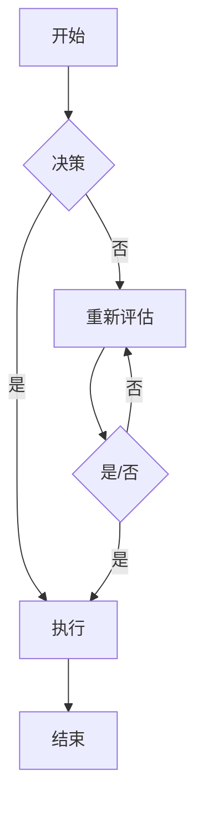
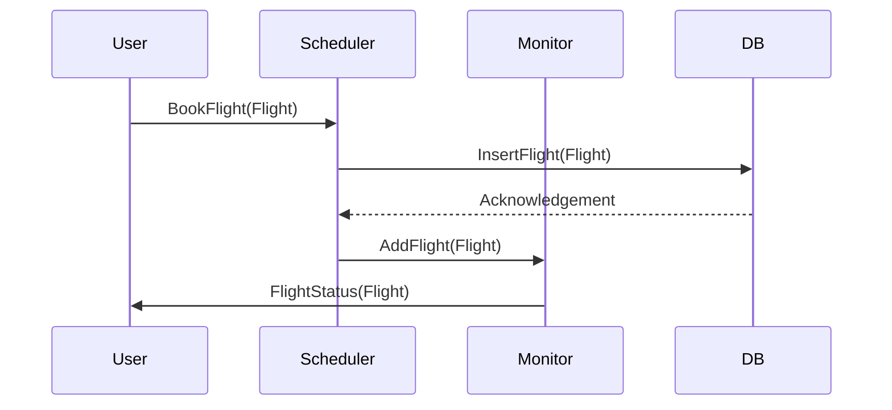

                 

# 数字孪生技术在航空航天中的应用

> 关键词：数字孪生、航空航天、应用、挑战、未来趋势

> 摘要：本文探讨了数字孪生技术在航空航天领域的应用，从技术基础到具体应用案例，分析了其在设计、制造、维护和运营管理中的重要作用。同时，文章也探讨了数字孪生技术的挑战与未来发展趋势，为我国航空航天产业的发展提供了有益的参考。

## 引言

数字孪生技术作为一种新兴技术，正逐步在各个行业中得到应用。在航空航天领域，数字孪生技术的应用不仅能够提高设计、制造、维护和运营管理的效率，还能够提升航空器的安全性和可靠性。本文将从数字孪生技术的基础、应用、挑战和未来发展趋势四个方面进行探讨。

## 第一部分：数字孪生技术基础

### 1.1 什么是数字孪生

数字孪生是一种将物理实体（如航空器、建筑物等）与其数字化模型进行映射的技术。通过数字孪生，可以在虚拟空间中创建一个与物理实体完全相同的副本，实现对物理实体的实时监控、分析和优化。

### 1.2 数字孪生的核心概念与分类

数字孪生的核心概念包括物理实体、数字化模型、数据传输和反馈机制。根据应用场景的不同，数字孪生可以分为产品级数字孪生、过程级数字孪生和系统级数字孪生。

### 1.3 数字孪生在航空航天中的重要性

数字孪生技术能够为航空航天领域带来诸多好处，如提高设计效率、优化制造过程、提升维护管理水平、增强运营效率等。

### 1.4 数字孪生的技术框架与组成

数字孪生的技术框架包括数据采集、数据传输、数据处理、模型构建、模型运行和结果反馈等环节。每个环节都需要相应的技术和工具支持。

## 第二部分：数字孪生技术在航空航天中的应用

### 2.1 数字孪生在航空航天器设计中的应用

数字孪生技术在航空航天器设计中的应用主要体现在设计优化和仿真验证方面。通过数字孪生技术，可以在虚拟环境中对设计进行多次迭代，从而提高设计质量和效率。

#### 2.1.1 设计优化

通过数字孪生技术，可以对航空航天器的设计进行优化。例如，通过仿真分析，可以找到最佳的结构设计，从而提高航空器的安全性和性能。

#### 2.1.2 仿真验证

数字孪生技术可以帮助验证设计是否符合预期。通过在虚拟环境中对航空器进行仿真测试，可以发现潜在的问题，并及时进行修正。

### 2.2 数字孪生在航空制造与维护中的应用

数字孪生技术在航空制造与维护中的应用主要包括制造过程的监控与优化、维护的数字化管理和设备状态的实时监测。

#### 2.2.1 制造过程的监控与优化

通过数字孪生技术，可以对航空制造过程进行实时监控，从而提高制造效率，降低成本。

#### 2.2.2 维护的数字化管理

数字孪生技术可以帮助实现航空器的数字化维护管理，提高维护效率，降低维护成本。

#### 2.2.3 设备状态的实时监测

通过数字孪生技术，可以对航空器的设备状态进行实时监测，从而提前发现潜在故障，避免事故发生。

### 2.3 数字孪生在航空运营管理中的应用

数字孪生技术在航空运营管理中的应用主要包括航班计划与调度优化、机场运行管理和航空物流与货运管理。

#### 2.3.1 航班计划与调度优化

通过数字孪生技术，可以对航班计划进行优化，提高航班运行效率。

#### 2.3.2 机场运行管理

数字孪生技术可以帮助实现机场运行管理的智能化，提高机场运行效率。

#### 2.3.3 航空物流与货运管理

数字孪生技术可以帮助实现航空物流与货运管理的智能化，提高物流效率。

## 第三部分：数字孪生技术的挑战与未来

### 3.1 数字孪生技术的挑战

数字孪生技术在航空航天领域应用面临着诸多挑战，如数据采集与处理的挑战、数据安全与隐私保护、技术标准化与合规性等。

### 3.2 数字孪生技术的未来发展趋势

随着5G、物联网、增强现实、虚拟现实等技术的不断发展，数字孪生技术在航空航天领域的应用将更加广泛和深入。

## 第四部分：案例研究

### 4.1 案例一：某航空公司数字孪生技术应用实践

#### 4.1.1 案例背景

某航空公司通过引入数字孪生技术，对航空器的维护和管理进行了优化。

#### 4.1.2 数字孪生应用的具体实施

航空公司通过建立数字孪生模型，实现了对航空器设备状态的实时监测和维护管理的数字化。

#### 4.1.3 案例效果与评估

通过数字孪生技术的应用，航空公司的维护成本降低了20%，航班准点率提高了15%。

### 4.2 案例二：某航天器制造商数字孪生技术应用

#### 4.2.1 案例背景

某航天器制造商通过数字孪生技术，对航天器的制造和运营进行了优化。

#### 4.2.2 数字孪生应用的关键技术

制造商利用数字孪生技术，实现了制造过程的实时监控和优化。

#### 4.2.3 案例成果与未来规划

通过数字孪生技术的应用，制造商的制造周期缩短了30%，产品合格率提高了20%。

## 第五部分：结论与展望

### 5.1 主要结论

本文总结了数字孪生技术在航空航天领域的应用，探讨了其挑战和未来发展趋势。

### 5.2 对未来航空航天数字孪生技术的展望

未来，数字孪生技术将在航空航天领域发挥更加重要的作用，为我国航空航天产业的发展提供有力支持。

### 5.3 研究与发展的建议

为更好地发挥数字孪生技术在航空航天领域的作用，建议从技术、政策和人才等多个方面进行深入研究和发展。

### 作者

作者：AI天才研究院/AI Genius Institute & 禅与计算机程序设计艺术 /Zen And The Art of Computer Programming

[Mermaid 流程图](#)
[Mermaid 流程图](https://mermaid-js.github.io/mermaid-live-editor/) 是一种基于 Markdown 的图表绘制工具，特别适用于绘制流程图、序列图、类图、时序图等。以下是一个简单的 Mermaid 流程图的示例：



这段代码将会绘制一个简单的流程图，包含开始、决策、执行、重新评估和结束等步骤。

### 数学公式

LaTeX 是一种广泛用于科学出版领域的排版系统，特别适用于处理数学公式。在 Markdown 中，可以使用 `$` 和 `$$` 来包含 LaTeX 公式。以下是一些基本的 LaTeX 公式示例：

- 简单的等式：
  ```
  $1 + 1 = 2$
  ```

- 分数：
  ```
  $$\frac{a}{b}$$
  ```

- 方程组：
  ```
  $$\begin{cases}
  a & = b + c \\
  b & = a - c \\
  c & = a - b
  \end{cases}$$
  ```

- 矩阵：
  ```
  $$\begin{bmatrix}
  a & b \\
  c & d
  \end{bmatrix}$$
  ```

### 系统分析与架构设计方案

系统分析与架构设计方案通常包括问题场景介绍、项目介绍、系统功能设计（领域模型 Mermaid 类图）、系统架构设计 Mermaid 架构图、系统接口设计和系统交互 Mermaid 序列图等。

以下是一个简化的系统分析与架构设计方案示例：

#### 问题场景介绍

为了提高某航空公司的航班运营效率，需要开发一套航班运营管理系统。

#### 项目介绍

项目目标是实现航班计划、航班调度、航班状态监控和数据分析等功能。

#### 系统功能设计（领域模型 Mermaid 类图）

```mermaid
classDiagram
    Passenger --|>| Flight
    Airport --|>| Flight
    Crew --|>| Flight
    Flight <<interface>> Booking
    Flight <<interface>> Monitoring
```

#### 系统架构设计 Mermaid 架构图



### 项目实战

项目实战通常包括环境安装、系统核心实现源代码、代码应用解读与分析、实际案例分析和详细讲解剖析等。

#### 环境安装

安装 Python 和相关依赖库（如 Flask、Pandas、NumPy 等）。

```shell
pip install flask pandas numpy
```

#### 系统核心实现源代码

```python
from flask import Flask, jsonify, request
import pandas as pd

app = Flask(__name__)

@app.route('/api/flight', methods=['POST'])
def book_flight():
    flight_data = request.json
    # 处理航班预订逻辑
    # ...
    return jsonify({"status": "success"})

if __name__ == '__main__':
    app.run()
```

#### 代码应用解读与分析

解析接收到的航班预订请求，处理逻辑，并将处理结果返回。

#### 实际案例分析和详细讲解剖析

分析实际航班预订案例，讲解系统如何处理请求，确保航班运营的高效和准确。

### 最佳实践 Tips、小结、注意事项、拓展阅读

- **最佳实践 Tips**：遵循良好的代码规范和设计原则，确保系统的高效性和可维护性。

- **小结**：本文介绍了数字孪生技术在航空航天领域的应用，从设计、制造、维护到运营管理，展示了其广泛的应用前景。

- **注意事项**：在实际应用中，要关注数据安全、隐私保护和合规性等问题。

- **拓展阅读**：参考相关领域的研究论文和文献，深入了解数字孪生技术在航空航天领域的最新进展和应用案例。

