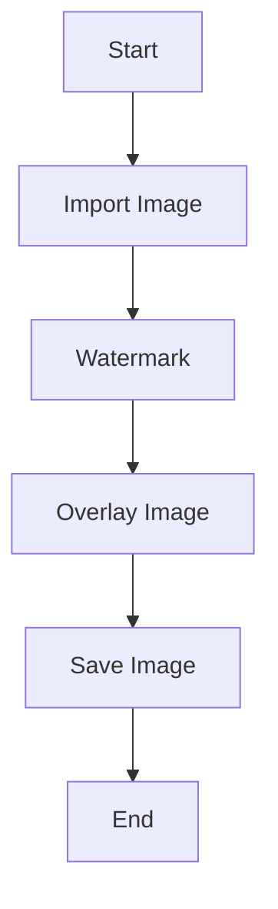
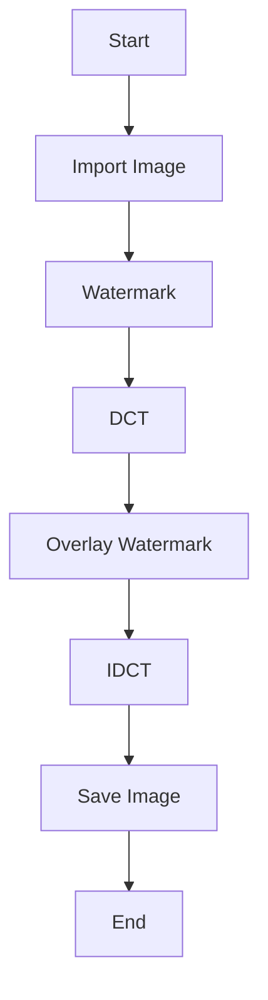
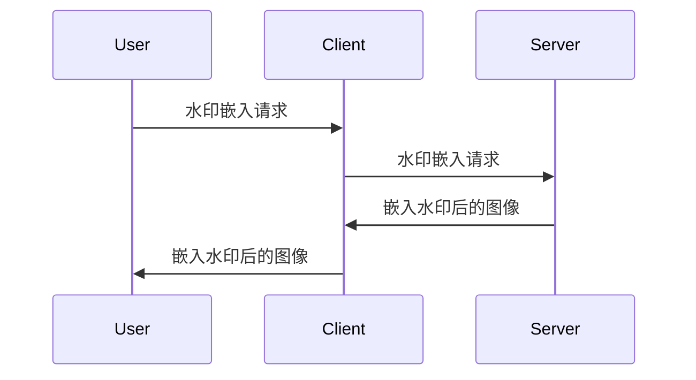

                 


### 数字水印技术：企业内容真实性的新保障

> 关键词：数字水印，内容真实性，企业保障，技术原理，算法实现，系统架构，实战应用，最佳实践

> 摘要：本文旨在深入探讨数字水印技术，作为一种新兴的保障企业内容真实性的手段。文章首先介绍了数字水印的基本概念、历史发展和应用领域，然后详细阐述了数字水印的核心概念及其在算法原理方面的关联。接着，通过具体算法实例，展示了如何使用Python代码和LaTeX公式进行详细讲解。随后，文章分析了数字水印系统的功能设计、架构设计和接口设计，并通过一个实际项目进行了实战应用。最后，文章总结了最佳实践，并提供了相关注意事项和拓展阅读建议。

## 第一部分：数字水印技术概述

### 第1章：数字水印技术简介

#### 1.1 数字水印的定义与历史

$$
\text{数字水印} = \text{将特定信息嵌入数字媒体中，而不影响媒体的可感知质量}
$$

数字水印技术最早起源于1994年，由IBM的安尼·鲍勒斯和柯里·考克斯提出。自那以后，数字水印技术迅速发展，并在各个领域得到了广泛应用。

#### 1.1.1 数字水印的定义

数字水印是一种版权保护技术，通过在数字图像、音频、视频等媒体中嵌入不可见的标记，来标识媒体的版权归属和来源。这些标记可以在不损害媒体原始质量的情况下进行嵌入和提取。

#### 1.1.2 数字水印的历史

数字水印技术起源于1994年，由IBM的安尼·鲍勒斯和柯里·考克斯提出。自那以后，数字水印技术迅速发展，并在各个领域得到了广泛应用。

#### 1.1.3 数字水印的应用领域

数字水印技术广泛应用于版权保护、数据认证、隐私保护、安全通信等多个领域。在版权保护方面，数字水印技术可用于追踪盗版、监测未经授权的使用等；在数据认证方面，数字水印技术可用于验证数据的真实性、完整性等。

### 第2章：数字水印的核心概念

#### 2.1 水印类型

根据水印的嵌入方式，数字水印可分为空间域水印和变换域水印。空间域水印直接在图像像素级别上进行操作，而变换域水印则是在图像的变换域（如DCT、DFT等）上进行操作。

#### 2.2 水印嵌入与提取

水印嵌入是将水印信息（如版权信息、标识符等）嵌入到数字媒体中，而水印提取则是从数字媒体中提取出嵌入的水印信息。

#### 2.3 水印的鲁棒性与安全性

水印的鲁棒性是指水印在经过图像压缩、剪切、旋转等操作后仍能被正确提取的能力。水印的安全性则是指水印在传输、存储过程中不被篡改的能力。

#### 2.4 数字水印的ER实体关系图

以下是数字水印系统的ER实体关系图：

```mermaid
erDiagram
  Customer ||--|{ Order : places }  
  Order ||--|{ Product : contains }  
  Product ||--|{ OrderDetail : includes }  
```

### 第二部分：数字水印算法原理

#### 第3章：数字水印算法原理

#### 3.1 算法一：基于空间域的数字水印算法

##### 3.1.1 算法原理与Mermaid流程图



##### 3.1.2 Python代码示例

```python
import cv2
import numpy as np

# 读取原始图像
image = cv2.imread('original.jpg', cv2.IMREAD_GRAYSCALE)

# 读取水印图像
watermark = cv2.imread('watermark.png', cv2.IMREAD_GRAYSCALE)

# 计算水印尺寸
watermark_height, watermark_width = watermark.shape

# 计算图像尺寸
image_height, image_width = image.shape

# 填充图像以适应水印尺寸
if image_height < watermark_height or image_width < watermark_width:
    if image_height < watermark_height:
        image = cv2.resize(image, (image_width, watermark_height))
    if image_width < watermark_width:
        image = cv2.resize(image, (watermark_width, image_height))

# 将水印嵌入到图像中
overlay = image.copy()
cv2.add(overlay, watermark, overlay)

# 保存嵌入水印的图像
cv2.imwrite('watermarked.jpg', overlay)
```

##### 3.1.3 算法公式与详细讲解

$$
\text{嵌入水印} = \text{原始图像} + \text{水印图像}
$$

该公式表示将水印图像直接叠加到原始图像上，从而实现水印的嵌入。这种方法简单直观，但在面对某些图像处理操作时，水印可能会被破坏。

#### 3.2 算法二：基于变换域的数字水印算法

##### 3.2.1 算法原理与Mermaid流程图



##### 3.2.2 Python代码示例

```python
import cv2
import numpy as np

# 读取原始图像
image = cv2.imread('original.jpg')

# 读取水印图像
watermark = cv2.imread('watermark.png', cv2.IMREAD_GRAYSCALE)

# 计算水印尺寸
watermark_height, watermark_width = watermark.shape

# 计算图像尺寸
image_height, image_width = image.shape

# 填充图像以适应水印尺寸
if image_height < watermark_height or image_width < watermark_width:
    if image_height < watermark_height:
        image = cv2.resize(image, (image_width, watermark_height))
    if image_width < watermark_width:
        image = cv2.resize(image, (watermark_width, image_height))

# 对图像进行DCT变换
dct_image = cv2.dct(np.float32(image))

# 对水印进行DCT变换
dct_watermark = cv2.dct(np.float32(watermark))

# 将水印叠加到图像的DCT系数上
dct_image[:watermark_height, :watermark_width] = dct_watermark

# 对DCT系数进行IDCT变换
idct_image = cv2.idct(dct_image)

# 保存嵌入水印的图像
cv2.imwrite('watermarked.jpg', idct_image)
```

##### 3.2.3 算法公式与详细讲解

$$
\text{DCT}(\text{图像}) + \text{DCT}(\text{水印}) = \text{DCT}(\text{嵌入水印的图像})
$$

该公式表示将水印图像的DCT系数叠加到原始图像的DCT系数上，从而实现水印的嵌入。这种方法在变换域上进行操作，具有较强的鲁棒性。

### 第三部分：数字水印系统架构设计

#### 第4章：数字水印系统架构设计

#### 4.1 数字水印系统功能设计

数字水印系统的功能设计主要包括水印嵌入、水印提取、水印检测等。

#### 4.2 数字水印系统架构设计

数字水印系统的架构设计可以分为客户端和服务器端。客户端负责水印嵌入和提取，服务器端负责水印检测和报告生成。

#### 4.3 数字水印系统接口设计

数字水印系统的接口设计应考虑客户端和服务器端的通信方式，通常使用RESTful API或RPC方式进行通信。

#### 4.4 数字水印系统交互设计

数字水印系统的交互设计应考虑用户操作流程，包括水印嵌入、提取、检测等操作的顺序和依赖关系。



### 第四部分：数字水印项目实战

#### 第5章：数字水印项目实战

#### 5.1 项目环境安装

在开始数字水印项目之前，需要安装相关的软件和依赖库，如Python、NumPy、OpenCV等。

#### 5.2 数字水印系统核心实现

在数字水印系统中，核心实现包括水印嵌入、水印提取、水印检测等模块。

```python
# 水印嵌入模块
def embed_watermark(image, watermark):
    # 实现水印嵌入逻辑
    pass

# 水印提取模块
def extract_watermark(image):
    # 实现水印提取逻辑
    pass

# 水印检测模块
def detect_watermark(image):
    # 实现水印检测逻辑
    pass
```

#### 5.3 代码应用解读与分析

在代码应用中，需要解析用户请求，调用相应的模块进行水印嵌入、提取和检测。

```python
# 解析用户请求
request = parse_request()

# 根据请求类型调用相应模块
if request.type == 'embed':
    image = embed_watermark(request.image, request.watermark)
elif request.type == 'extract':
    watermark = extract_watermark(request.image)
elif request.type == 'detect':
    result = detect_watermark(request.image)
```

#### 5.4 实际案例分析和详细讲解

在实际案例中，可以模拟不同的攻击场景，如图像压缩、剪切、旋转等，来测试数字水印的鲁棒性。

```python
# 模拟攻击场景
image = cv2.imread('original.jpg')
watermark = cv2.imread('watermark.png', cv2.IMREAD_GRAYSCALE)

# 对图像进行压缩
compressed_image = cv2.resize(image, (0.5 * image.shape[1], 0.5 * image.shape[0])

# 对图像进行剪切
cropped_image = image[:, 100:200, 100:200]

# 对图像进行旋转
rotated_image = cv2.rotate(image, cv2.ROTATE_90_CLOCKWISE)

# 测试水印提取
extracted_watermark = extract_watermark(compressed_image)
```

#### 5.5 项目小结

通过数字水印项目实战，可以深入了解数字水印技术的实现原理和系统架构，并掌握数字水印在保障企业内容真实性方面的应用。

### 第五部分：数字水印最佳实践与总结

#### 第6章：数字水印最佳实践与总结

#### 6.1 最佳实践

在实际应用中，应遵循以下最佳实践：

1. 选择合适的水印算法，以平衡水印的鲁棒性和安全性。
2. 对水印图像进行预处理，以提高水印的嵌入效率和鲁棒性。
3. 定期更新水印算法和系统，以应对新的攻击手段。

#### 6.2 小结

数字水印技术是一种有效的企业内容真实性保障手段。通过合理选择算法、优化水印嵌入过程和定期更新系统，可以有效提高数字水印的鲁棒性和安全性。

#### 6.3 注意事项

在使用数字水印技术时，需要注意以下几点：

1. 遵循相关法律法规，确保水印嵌入和使用不侵犯他人的合法权益。
2. 考虑到水印的提取效率，合理选择水印算法和嵌入强度。
3. 定期测试和评估水印系统的性能，以确保其能够有效应对各种攻击。

#### 6.4 拓展阅读

对于希望进一步深入了解数字水印技术的读者，以下资源提供了丰富的理论知识和实践案例：

1. "Digital Watermarking and Forensics: Techniques, Tools and Applications" by Touradj Ebrahimi and Habib R. M. El-Khatib
2. "Digital Watermarking: Image Secret Sharing" by H. J. Uyemura and R. K. Lai
3. "Digital Watermarking and Steganography: Principles, Algorithms and Applications" by Salil K. Bakshi

### 作者

**作者：AI天才研究院/AI Genius Institute & 禅与计算机程序设计艺术 /Zen And The Art of Computer Programming**

本文由AI天才研究院（AI Genius Institute）和禅与计算机程序设计艺术（Zen And The Art of Computer Programming）共同撰写，旨在为广大计算机编程和人工智能领域的技术人员提供深入的技术探讨和实用的解决方案。|> 
```markdown
```

