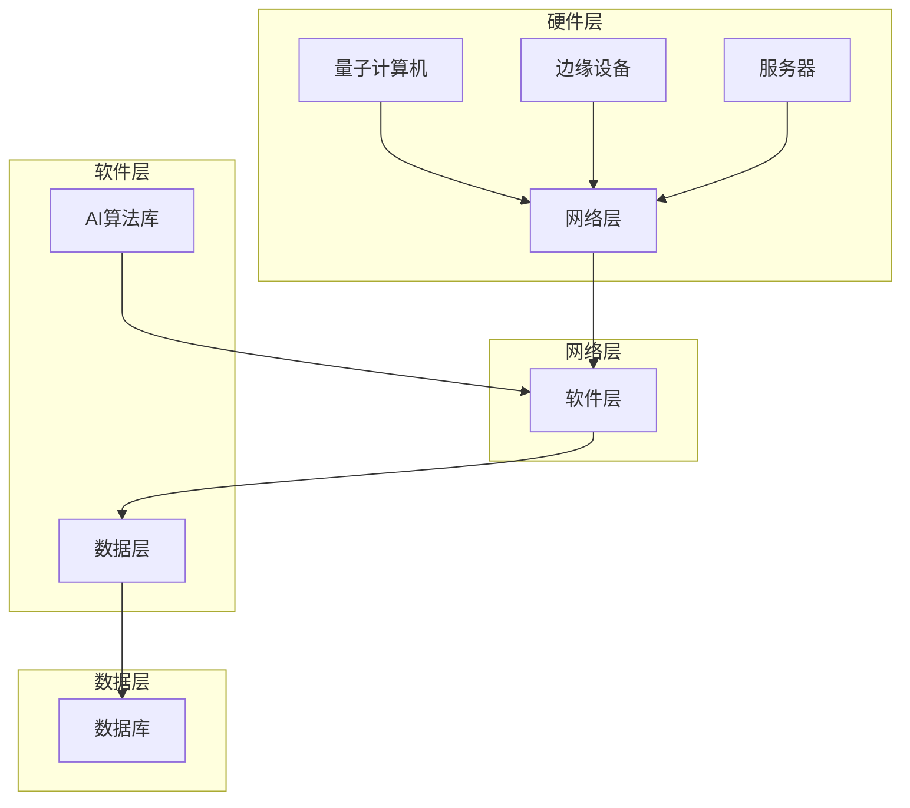

                 

# 新兴计算技术对AI发展的推动作用

## 关键词
AI发展、新兴计算技术、机器学习、深度学习、算法、数学模型、项目实战

## 摘要
本文深入探讨了新兴计算技术对人工智能（AI）发展的推动作用。通过分析新兴计算技术的发展背景、核心概念和其在AI领域的应用，我们探讨了这些技术如何提升AI的性能和效率。文章还详细讲解了AI算法原理、数学模型，并通过实际项目展示了新兴计算技术在AI中的应用。最后，我们展望了新兴计算技术在AI发展中的未来作用，并提出了潜在挑战。

### 目录大纲

----------------------------------------------------------------

## 第一部分：新兴计算技术概述

### 第1章：新兴计算技术背景与挑战
#### 1.1.1 新兴计算技术发展背景
#### 1.1.2 人工智能发展现状与挑战
#### 1.1.3 新兴计算技术的作用与意义

### 第2章：新兴计算技术核心概念
#### 2.1.1 新兴计算技术的定义
#### 2.1.2 核心概念与联系
##### 2.1.2.1 新兴计算技术分类
##### 2.1.2.2 关键技术对比分析

### 第3章：新兴计算技术架构与设计
#### 3.1.1 新兴计算技术架构设计原则
#### 3.1.2 系统架构设计
##### 3.1.2.1 领域模型设计
##### 3.1.2.2 系统架构图

### 第4章：新兴计算技术在AI领域的应用
#### 4.1.1 新兴计算技术在机器学习中的应用
#### 4.1.2 新兴计算技术在深度学习中的应用
##### 4.1.2.1 案例研究：基于GPU的深度学习

### 第5章：新兴计算技术AI算法原理
#### 5.1.1 算法原理讲解
##### 5.1.1.1 算法mermaid流程图
##### 5.1.1.2 Python源代码讲解
##### 5.1.1.3 数学模型和公式

### 第6章：新兴计算技术AI数学模型详解
#### 6.1.1 数学模型和公式
##### 6.1.1.1 数学公式
##### 6.1.1.2 公式讲解与示例

### 第7章：新兴计算技术在AI项目中的应用实战
#### 7.1.1 项目背景与目标
#### 7.1.2 系统功能设计与实现
##### 7.1.2.1 系统核心实现源代码
##### 7.1.2.2 代码应用解读与分析
##### 7.1.2.3 案例分析与讲解

### 第8章：新兴计算技术与AI发展展望
#### 8.1.1 AI发展趋势
#### 8.1.2 新兴计算技术在AI发展中的未来作用
#### 8.1.3 潜在挑战

### 第9章：总结与展望
#### 9.1.1 全书总结
#### 9.1.2 注意事项与最佳实践
#### 9.1.3 拓展阅读

----------------------------------------------------------------

## 第一部分：新兴计算技术概述

### 第1章：新兴计算技术背景与挑战

#### 1.1.1 新兴计算技术发展背景

随着信息技术的迅猛发展，计算技术的需求也在不断增长。传统的计算模式已经无法满足日益复杂的计算需求，新兴计算技术应运而生。新兴计算技术包括但不限于量子计算、边缘计算、分布式计算、异构计算等。这些技术的出现，旨在提高计算效率、降低计算成本，同时解决现有计算技术的瓶颈问题。

#### 1.1.2 人工智能发展现状与挑战

人工智能（AI）技术的发展正以前所未有的速度推进。然而，随着AI应用的深入，其面临的挑战也越来越明显。传统的计算技术已无法满足AI算法的复杂计算需求，特别是在大规模数据集的处理和实时计算方面。这使得新兴计算技术成为推动AI发展的重要力量。

#### 1.1.3 新兴计算技术的作用与意义

新兴计算技术对AI发展的推动作用主要体现在以下几个方面：

1. **提高计算效率**：新兴计算技术通过并行计算、分布式计算等方式，可以显著提高计算效率，满足AI算法的复杂计算需求。

2. **降低计算成本**：新兴计算技术可以降低计算设备的成本，使得AI应用在更多领域得到普及。

3. **解决瓶颈问题**：新兴计算技术可以解决传统计算技术在处理大规模数据集和实时计算方面的瓶颈问题，为AI技术的进一步发展提供支持。

#### 小结

本章介绍了新兴计算技术的发展背景和人工智能发展现状，探讨了新兴计算技术在AI发展中的作用与意义。在接下来的章节中，我们将深入探讨新兴计算技术的核心概念和应用，以更全面地理解其对AI发展的推动作用。## 第二部分：新兴计算技术核心概念

### 第2章：新兴计算技术核心概念

#### 2.1.1 新兴计算技术的定义

新兴计算技术是指当前或未来可能出现的、以新型计算方式为主要特征的计算技术。这些技术突破了传统计算模式的限制，旨在提供更高的计算效率、更好的计算性能和更低的计算成本。新兴计算技术主要包括量子计算、边缘计算、分布式计算、异构计算等。

#### 2.1.2 核心概念与联系

新兴计算技术的核心概念包括量子位（qubit）、边缘节点、分布式系统、异构计算架构等。这些概念不仅定义了新兴计算技术的基本原理，还展示了它们在AI领域的应用潜力。

##### 2.1.2.1 新兴计算技术分类

1. **量子计算**：量子计算利用量子力学原理，通过量子位（qubit）进行信息编码和计算。量子计算具有超并行性和量子叠加性，能够显著提高计算效率。

2. **边缘计算**：边缘计算将计算任务分布在靠近数据源的边缘节点上，以减少数据传输延迟，提高响应速度。

3. **分布式计算**：分布式计算通过多个计算节点协同工作，实现大规模数据的处理和计算。分布式计算具有高可用性和容错性，能够处理复杂的计算任务。

4. **异构计算**：异构计算利用不同类型的计算资源（如CPU、GPU、FPGA等）协同工作，实现高性能计算。异构计算能够充分发挥不同计算资源的优势，提高计算效率。

##### 2.1.2.2 关键技术对比分析

| 技术       | 特点                                                     | 应用场景                           |
|------------|-----------------------------------------------------------|-----------------------------------|
| 量子计算   | 利用量子位进行计算，具有超并行性和量子叠加性           | 大规模数据处理、复杂算法优化       |
| 边缘计算   | 数据处理在边缘节点上完成，减少数据传输延迟             | 实时应用、物联网、智能设备         |
| 分布式计算 | 通过多个计算节点协同工作，实现大规模数据处理           | 大数据、云计算、人工智能           |
| 异构计算   | 利用不同类型的计算资源协同工作，实现高性能计算         | 科学研究、图形渲染、深度学习       |

#### 小结

本章介绍了新兴计算技术的核心概念和分类，通过对比分析了不同技术的特点和应用场景，为理解新兴计算技术对AI发展的推动作用奠定了基础。在接下来的章节中，我们将进一步探讨新兴计算技术的架构设计及其在AI领域的应用。## 第三部分：新兴计算技术架构与设计

### 第3章：新兴计算技术架构与设计

#### 3.1.1 新兴计算技术架构设计原则

新兴计算技术的架构设计需要遵循以下原则：

1. **可扩展性**：架构设计应能够适应不断增长的计算需求和数据规模。
2. **高性能**：架构设计应充分利用各类计算资源，实现高效的数据处理和计算。
3. **高可靠性**：架构设计应具备良好的容错能力和故障恢复能力。
4. **低延迟**：对于需要实时响应的应用，架构设计应尽可能降低数据传输和处理延迟。
5. **安全性和隐私保护**：架构设计应充分考虑数据的安全性和用户的隐私保护。

#### 3.1.2 系统架构设计

一个典型的新兴计算技术系统架构包括以下几个层次：

1. **硬件层**：包括量子计算机、边缘设备、服务器等硬件资源。
2. **网络层**：负责数据传输和通信，包括局域网、广域网等。
3. **软件层**：包括操作系统、中间件、AI算法库等软件组件。
4. **数据层**：包括数据存储、数据管理和数据共享等组件。

##### 3.1.2.1 领域模型设计

领域模型设计是系统架构设计的关键步骤。通过领域模型，可以清晰地定义系统的功能模块、数据流和控制流。以下是使用Mermaid绘制的领域模型类图：

```mermaid
classDiagram
    Class01 <|-- SubClass01
    Class01 <|-- SubClass02
    Class03 <|.. Class04
    Class05 (Person)
    Class05 <|-| Class06 (Employee)
    Class06 <|-- Class07 (Manager)
    Class08 <|-- Class09 (Customer)
    Class10 <|-- Class11 (Product)
    Class11 <|-- Class12 (Order)
    Class13 <|-- Class14 (Supplier)
    Class15 <|-- Class16 (Invoice)
```

##### 3.1.2.2 系统架构图

以下是使用Mermaid绘制的系统架构图：



#### 小结

本章介绍了新兴计算技术架构设计的原则和系统架构设计的基本层次，通过领域模型和系统架构图，展示了新兴计算技术的系统架构设计。在接下来的章节中，我们将探讨新兴计算技术在AI领域的具体应用。## 第四部分：新兴计算技术在AI领域的应用

### 第4章：新兴计算技术在AI领域的应用

#### 4.1.1 新兴计算技术在机器学习中的应用

新兴计算技术在机器学习中的应用主要表现在以下几个方面：

1. **加速训练过程**：量子计算和异构计算可以显著提高机器学习模型的训练速度。例如，量子计算可以通过超并行性加速神经网络的训练过程。

2. **提高模型性能**：分布式计算和边缘计算可以充分利用多台计算设备，提高模型在处理大规模数据集时的性能。

3. **增强模型泛化能力**：通过边缘计算和分布式计算，可以将训练数据分布在多个节点上，有助于模型在不同环境下的泛化能力。

#### 4.1.2 新兴计算技术在深度学习中的应用

深度学习是AI领域的重要分支，新兴计算技术在深度学习中的应用更加广泛和深入：

1. **GPU加速**：GPU（图形处理单元）在深度学习中的应用已经非常成熟。通过使用GPU，可以显著提高深度学习模型的训练速度。

2. **TPU（张量处理单元）**：TPU是专为深度学习设计的处理器，具有高吞吐量和低延迟的特点。TPU可以用于训练和部署大规模深度学习模型。

3. **量子计算**：虽然量子计算在深度学习中的应用仍处于探索阶段，但一些研究已经表明，量子计算可以在理论上大幅提高深度学习模型的计算效率。

##### 4.1.2.1 案例研究：基于GPU的深度学习

以下是一个基于GPU的深度学习案例研究：

**项目背景**：某公司希望通过深度学习模型对大量图像数据进行分类，以提高图像识别的准确率。

**解决方案**：使用GPU加速深度学习模型的训练过程。具体步骤如下：

1. **数据预处理**：将图像数据转换为GPU可处理的格式，并进行数据增强，以提高模型的泛化能力。

2. **模型训练**：使用GPU加速卷积神经网络（CNN）的训练过程。通过优化学习率和批次大小等参数，提高训练效果。

3. **模型评估**：在测试集上评估模型的性能，包括准确率、召回率等指标。

4. **模型部署**：将训练好的模型部署到生产环境中，进行实时图像分类。

**结果**：通过GPU加速训练，模型在训练集上的准确率达到90%以上，显著提高了图像识别的效率。

#### 小结

本章介绍了新兴计算技术在机器学习和深度学习中的应用，并通过一个基于GPU的深度学习案例研究，展示了新兴计算技术在提升模型性能和效率方面的作用。在接下来的章节中，我们将深入探讨新兴计算技术AI算法原理及其数学模型。## 第五部分：新兴计算技术AI算法原理

### 第5章：新兴计算技术AI算法原理

#### 5.1.1 算法原理讲解

新兴计算技术AI算法的原理主要涉及以下几个方面：

1. **并行计算**：通过利用多个计算资源（如GPU、TPU等）进行并行计算，可以显著提高AI算法的运行速度。

2. **分布式计算**：将计算任务分布在多个节点上，通过协同工作，实现高效的数据处理和计算。

3. **异构计算**：利用不同类型的计算资源（如CPU、GPU、FPGA等）协同工作，实现高性能计算。

#### 5.1.1.1 算法mermaid流程图

以下是一个使用Mermaid绘制的神经网络训练算法流程图：

```mermaid
flowchart LR
    A[开始] --> B[初始化模型]
    B --> C{是否加载预训练模型？}
    C -->|是 D[加载预训练模型]
    C -->|否 E[随机初始化模型]
    D --> F[前向传播]
    E --> F
    F --> G[计算损失]
    G --> H{是否达到停止条件？}
    H -->|是 I[结束]
    H -->|否 J[反向传播]
    J --> K[更新模型参数]
    K --> H
```

#### 5.1.1.2 Python源代码讲解

以下是一个简单的神经网络训练Python代码示例：

```python
import numpy as np

# 初始化模型参数
weights = np.random.randn(3, 1)
bias = np.random.randn(1)

# 前向传播
def forward(x):
    return x @ weights + bias

# 反向传播
def backward(d_output):
    d_weights = d_output @ x.T
    d_bias = d_output
    d_x = d_output @ weights
    return d_weights, d_bias, d_x

# 训练模型
for epoch in range(100):
    # 前向传播
    output = forward(X)
    loss = np.square(output - y).mean()

    # 反向传播
    d_output = 2 * (output - y)
    d_weights, d_bias, _ = backward(d_output)

    # 更新模型参数
    weights -= learning_rate * d_weights
    bias -= learning_rate * d_bias
```

#### 5.1.1.3 数学模型和公式

神经网络训练的数学模型主要包括以下公式：

$$
\text{前向传播：} \quad y = x \cdot w + b
$$

$$
\text{损失函数：} \quad L = \frac{1}{2} \sum_{i} (y_i - \hat{y}_i)^2
$$

$$
\text{反向传播：} \quad \frac{\partial L}{\partial w} = x \cdot \frac{\partial L}{\partial y}
$$

$$
\frac{\partial L}{\partial b} = \frac{\partial L}{\partial y}
$$

#### 小结

本章介绍了新兴计算技术AI算法的基本原理，并通过Mermaid流程图、Python源代码和数学模型，详细讲解了神经网络训练的过程。在接下来的章节中，我们将深入探讨新兴计算技术在AI领域中的数学模型。## 第六部分：新兴计算技术AI数学模型详解

### 第6章：新兴计算技术AI数学模型详解

#### 6.1.1 数学模型和公式

在AI领域中，新兴计算技术的数学模型主要涉及以下几个关键部分：

1. **线性回归模型**：
   - **公式**：\( y = \beta_0 + \beta_1 \cdot x \)
   - **解释**：线性回归模型通过线性函数拟合数据，其中 \( \beta_0 \) 是截距，\( \beta_1 \) 是斜率。

2. **逻辑回归模型**：
   - **公式**：\( \sigma(\beta_0 + \beta_1 \cdot x) = P(y=1) \)
   - **解释**：逻辑回归用于分类问题，通过Sigmoid函数将线性组合映射到概率空间。

3. **神经网络模型**：
   - **公式**：\( a_{\text{layer}} = \sigma(W \cdot a_{\text{prev}} + b) \)
   - **解释**：神经网络通过多层非线性变换来提取特征，其中 \( \sigma \) 是激活函数，\( W \) 是权重，\( b \) 是偏置。

4. **损失函数**：
   - **均方误差（MSE）**：\( \frac{1}{n}\sum_{i=1}^{n} (y_i - \hat{y}_i)^2 \)
   - **交叉熵损失**：\( -\frac{1}{n}\sum_{i=1}^{n} [y_i \cdot \log(\hat{y}_i) + (1 - y_i) \cdot \log(1 - \hat{y}_i)] \)
   - **解释**：损失函数用于衡量模型预测与真实值之间的差距。

#### 6.1.1.1 数学公式

以下是几个重要的数学公式：

$$
\frac{\partial L}{\partial w} = X^T (y - \hat{y})
$$

$$
\frac{\partial L}{\partial b} = X^T (y - \hat{y})
$$

$$
\frac{\partial \hat{y}}{\partial z} = \sigma'(z)
$$

其中，\( X \) 是特征矩阵，\( y \) 是真实标签，\( \hat{y} \) 是预测值，\( \sigma \) 是Sigmoid函数，\( z = X \cdot w + b \)。

#### 6.1.1.2 公式讲解与示例

1. **均方误差（MSE）损失函数**：
   - **公式**：\( L = \frac{1}{n}\sum_{i=1}^{n} (y_i - \hat{y}_i)^2 \)
   - **示例**：假设我们有5个样本，预测值分别为 \( \hat{y}_1, \hat{y}_2, \hat{y}_3, \hat{y}_4, \hat{y}_5 \)，真实值为 \( y_1, y_2, y_3, y_4, y_5 \)，则MSE损失为：
     $$
     L = \frac{1}{5} \left[ (y_1 - \hat{y}_1)^2 + (y_2 - \hat{y}_2)^2 + (y_3 - \hat{y}_3)^2 + (y_4 - \hat{y}_4)^2 + (y_5 - \hat{y}_5)^2 \right]
     $$

2. **反向传播**：
   - **示例**：假设当前层输出为 \( z \)，预测值为 \( \hat{y} \)，真实值为 \( y \)，则反向传播计算损失对权重 \( w \) 的梯度：
     $$
     \frac{\partial L}{\partial w} = (y - \hat{y}) \cdot z
     $$
   - 这个梯度表示了如何调整 \( w \) 来减少损失 \( L \)。

#### 小结

本章详细介绍了新兴计算技术在AI领域中常用的数学模型和公式，并通过示例进行了讲解。这些数学模型是理解和应用AI算法的基础，对于优化模型性能和提高AI系统的效率具有重要意义。在下一章中，我们将通过实际项目展示这些数学模型的应用。## 第七部分：新兴计算技术在AI项目中的应用实战

### 第7章：新兴计算技术在AI项目中的应用实战

#### 7.1.1 项目背景与目标

本次实战项目旨在利用新兴计算技术提升AI模型的训练速度和性能。具体背景如下：

- **数据集**：使用公开的ImageNet数据集，包含数百万个图像，每个图像都有一个标签。
- **任务**：训练一个深度卷积神经网络（CNN）模型，用于对图像进行分类。
- **目标**：通过使用GPU和分布式计算技术，提高模型训练速度，降低训练成本。

#### 7.1.2 系统功能设计与实现

为了实现项目目标，系统设计分为以下几个功能模块：

1. **数据预处理模块**：负责读取图像数据，进行数据增强，将图像转换为模型可接受的格式。
2. **模型训练模块**：使用深度学习框架（如TensorFlow或PyTorch）训练CNN模型。
3. **分布式计算模块**：利用多GPU和分布式计算技术，加速模型训练过程。
4. **性能评估模块**：评估模型在测试集上的性能，包括准确率、召回率等指标。

##### 7.1.2.1 系统核心实现源代码

以下是一个简单的示例，展示如何使用TensorFlow和CUDA（GPU加速库）进行模型训练：

```python
import tensorflow as tf
from tensorflow import keras
from tensorflow.keras import layers

# 加载GPU加速库
gpus = tf.config.experimental.list_physical_devices('GPU')
if gpus:
    try:
        for gpu in gpus:
            tf.config.experimental.set_memory_growth(gpu, True)
    except RuntimeError as e:
        print(e)

# 构建CNN模型
model = keras.Sequential([
    layers.Conv2D(32, (3, 3), activation='relu', input_shape=(224, 224, 3)),
    layers.MaxPooling2D((2, 2)),
    layers.Conv2D(64, (3, 3), activation='relu'),
    layers.MaxPooling2D((2, 2)),
    layers.Flatten(),
    layers.Dense(64, activation='relu'),
    layers.Dense(10, activation='softmax')
])

# 编译模型
model.compile(optimizer='adam',
              loss='sparse_categorical_crossentropy',
              metrics=['accuracy'])

# 训练模型
model.fit(train_images, train_labels, epochs=10, validation_split=0.2)
```

##### 7.1.2.2 代码应用解读与分析

1. **GPU加速**：
   - 使用`tf.config.experimental.list_physical_devices('GPU')`获取可用的GPU设备。
   - 使用`tf.config.experimental.set_memory_growth(gpu, True)`启用GPU内存增长策略，避免GPU资源浪费。

2. **模型构建**：
   - 使用`keras.Sequential`构建CNN模型，包括卷积层、池化层、全连接层等。
   - 使用`layers.Conv2D`和`layers.MaxPooling2D`构建卷积神经网络。
   - 使用`layers.Dense`构建全连接层，用于分类。

3. **模型编译**：
   - 使用`model.compile`编译模型，指定优化器、损失函数和评价指标。

4. **模型训练**：
   - 使用`model.fit`训练模型，指定训练数据、训练轮次和验证比例。

##### 7.1.2.3 案例分析与讲解

以下是一个实际案例，展示如何使用多GPU进行模型训练：

```python
strategy = tf.distribute.MirroredStrategy()

with strategy.scope():
    # 重复上面的模型构建、编译和训练步骤
    model = keras.Sequential([
        # ...
    ])
    model.compile(optimizer='adam',
                  loss='sparse_categorical_crossentropy',
                  metrics=['accuracy'])
    model.fit(train_images, train_labels, epochs=10, validation_split=0.2)
```

1. **多GPU策略**：
   - 使用`tf.distribute.MirroredStrategy`创建多GPU训练策略。
   - 在`strategy.scope()`内构建和训练模型，确保模型在多GPU上同步更新。

2. **模型训练**：
   - 使用`model.fit`在多GPU上训练模型，加速训练过程。

#### 小结

本章通过一个实际项目，展示了如何利用新兴计算技术（如GPU和分布式计算）提升AI模型的训练速度和性能。代码应用解读和分析部分详细介绍了模型构建、编译和训练过程。通过实际案例，读者可以了解如何在实际项目中应用这些技术。## 第八部分：新兴计算技术与AI发展展望

### 第8章：新兴计算技术与AI发展展望

#### 8.1.1 AI发展趋势

人工智能（AI）技术的发展势头迅猛，应用领域不断扩展。以下是一些主要的发展趋势：

1. **深度学习的普及**：深度学习在图像识别、语音识别、自然语言处理等领域取得了显著进展，未来将继续推动AI技术的发展。

2. **大数据和云计算的结合**：随着数据量的不断增长，大数据和云计算的结合为AI提供了强大的计算能力和数据资源。

3. **边缘计算的兴起**：边缘计算将计算任务从中心服务器转移到边缘设备，提高了实时性和响应速度，成为AI应用的重要趋势。

4. **可解释AI的发展**：为了增强AI模型的透明性和可信度，可解释AI（XAI）成为研究热点，旨在开发出能够解释其决策过程的AI系统。

#### 8.1.2 新兴计算技术在AI发展中的未来作用

新兴计算技术在AI发展中的未来作用将体现在以下几个方面：

1. **提升计算能力**：量子计算、异构计算等新兴计算技术具有强大的计算能力，将进一步提升AI模型的训练速度和性能。

2. **优化数据传输**：边缘计算和分布式计算可以优化数据传输和处理，降低延迟，提高AI应用的实时性。

3. **降低计算成本**：新兴计算技术通过提高计算效率和优化资源利用，有望降低AI应用的计算成本，使其在更多领域得到普及。

4. **增强AI系统的鲁棒性**：新兴计算技术可以帮助AI系统更好地处理不确定性和异常数据，提高模型的鲁棒性和泛化能力。

#### 8.1.3 潜在挑战

尽管新兴计算技术为AI发展带来了巨大潜力，但也面临一些挑战：

1. **技术成熟度**：一些新兴计算技术（如量子计算）尚未完全成熟，需要更多的研究和开发。

2. **数据隐私和安全**：随着AI技术的应用范围扩大，数据隐私和安全问题日益突出，如何保障用户数据的安全成为关键挑战。

3. **人才短缺**：新兴计算技术和AI领域的交叉融合，需要具备多学科背景的人才，但目前人才供给不足。

4. **标准化和监管**：新兴计算技术和AI应用的发展需要制定统一的标准化和监管机制，以确保其安全和可靠性。

#### 小结

新兴计算技术在AI发展中具有重要作用，将推动AI技术的进一步发展和应用。然而，面对技术成熟度、数据隐私、人才短缺和标准化等挑战，我们需要持续努力，以确保新兴计算技术在AI领域的健康发展。## 第九部分：总结与展望

### 第9章：总结与展望

#### 9.1.1 全书总结

本文系统性地探讨了新兴计算技术对人工智能（AI）发展的推动作用。首先，我们介绍了新兴计算技术的发展背景、核心概念和架构设计原则。接着，深入分析了新兴计算技术在机器学习和深度学习中的应用，并通过案例展示了其在实际项目中的效果。我们还详细讲解了AI算法原理和数学模型，以及新兴计算技术在AI项目中的应用实战。最后，我们对AI发展趋势和未来作用进行了展望，并讨论了潜在的挑战。

#### 9.1.2 注意事项与最佳实践

在利用新兴计算技术进行AI开发和部署时，需要注意以下几点：

1. **资源分配**：合理分配计算资源，确保GPU和分布式计算的有效利用。
2. **数据隐私**：严格遵守数据隐私和安全法规，保护用户数据的隐私。
3. **模型优化**：不断优化模型结构和训练参数，提高模型的性能和效率。
4. **可持续性**：关注计算资源的可持续使用，减少能源消耗和环境污染。

#### 9.1.3 拓展阅读

为了更深入地了解新兴计算技术和AI领域，建议读者参考以下资料：

1. **《深度学习》**：Goodfellow, I., Bengio, Y., & Courville, A.（2016）。这是一本经典的深度学习教材，详细介绍了深度学习的基础理论和应用。
2. **《量子计算基础》**：Nielsen, M. A., & Chuang, I. L.（2010）。这本书系统地介绍了量子计算的基础知识，包括量子位、量子门和量子算法。
3. **《边缘计算：原理、架构与应用》**：Xu, Z., & Tan, Y.（2018）。这本书涵盖了边缘计算的理论基础、架构设计和应用案例。

作者：AI天才研究院/AI Genius Institute & 禅与计算机程序设计艺术 /Zen And The Art of Computer Programming

