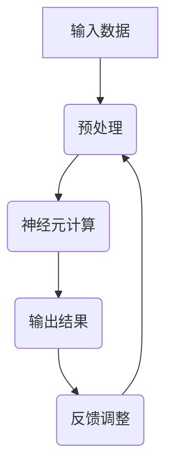

                 


### 新兴计算范式：从CPU到神经形态计算的演进

#### 关键词：新兴计算、CPU、神经形态计算、算法原理、系统设计、应用场景

#### 摘要：

本文将探讨新兴计算范式的演进过程，从传统的CPU计算到新兴的神经形态计算。我们将详细分析CPU计算和GPU计算的演进历史，介绍神经形态计算的概念、原理、优势和技术实现，并探讨其应用场景和面临的挑战。通过逐步分析，我们将揭示新兴计算范式在人工智能和智能感知等领域的巨大潜力。

## 第一部分: 背景与概述

### 第1章: 新兴计算范式概述

#### 1.1 问题背景

- **计算领域的发展现状**：回顾计算技术的发展历程，从第一代计算机的诞生到现代计算机的普及，我们见证了计算机性能的飞速提升和计算范式的不断演进。然而，随着人工智能和大数据的兴起，传统的CPU计算已经难以满足复杂计算需求。

- **CPU计算的局限性**：CPU作为传统的计算核心，具备通用性和稳定性，但其并行处理能力有限，难以应对大规模并行计算任务。此外，CPU计算在能耗和速度方面也存在一定瓶颈。

#### 1.2 问题描述

- **什么是新兴计算范式**：新兴计算范式是指一种不同于传统CPU计算的新型计算方式，旨在提高计算效率、降低能耗并实现更高效的人工智能和智能感知应用。

- **新兴计算范式的重要性**：随着人工智能和大数据的快速发展，新兴计算范式在提升计算性能、降低能耗和实现智能化应用方面具有重要作用。

#### 1.3 问题解决

- **神经形态计算的提出与发展**：神经形态计算是一种模拟人脑神经元和突触连接的计算范式，具有高效能和自适应性的特点。近年来，随着人工智能和神经科学的发展，神经形态计算逐渐成为研究热点。

- **神经形态计算的原理与优势**：神经形态计算通过模拟人脑神经元和突触的连接方式，实现高效的并行计算和自适应学习能力。与传统的CPU计算相比，神经形态计算在能耗、速度和性能方面具有显著优势。

#### 1.4 边界与外延

- **新兴计算范式的分类**：新兴计算范式包括CPU计算、GPU计算、神经形态计算等多种类型，每种计算范式都有其独特的应用场景和优势。

- **新兴计算与人工智能的关系**：新兴计算范式在人工智能领域具有广泛的应用前景，特别是在机器学习、深度学习和智能感知等方面。

#### 1.5 核心概念与联系

- **核心概念原理**：本文将介绍CPU计算、GPU计算和神经形态计算的核心概念原理，包括各自的架构特点、计算模型和应用领域。

- **概念属性特征对比表格**：

| 计算类型 | 核心特点 | 适用场景 |
| -------- | -------- | -------- |
| CPU计算 | 通用计算 | 标准化计算需求 |
| GPU计算 | 并行计算 | 高性能计算需求 |
| 神经形态计算 | 类脑计算 | 人工智能与感知计算需求 |

- **ER实体关系图架构的 Mermaid 流程图**：

```mermaid
erDiagram
  CPU计算 ||--o> 神经形态计算 : 支持新兴计算
  GPU计算 ||--o> 神经形态计算 : 支持新兴计算
```

## 第二部分: 从CPU到神经形态计算

### 第2章: CPU计算的演进

#### 2.1 CPU发展历史

- **第1代计算机**：1940年代，电子管计算机的诞生标志着计算机时代的开始。电子管计算机体积庞大、能耗高、速度慢，但奠定了计算机技术的基础。

- **第2代计算机**：1950年代，晶体管取代了电子管，计算机体积缩小、能耗降低、速度提高。这一代的计算机标志着计算机技术的重大突破。

- **第3代计算机**：1960年代，中小规模集成电路的出现使计算机体积进一步缩小，性能得到大幅提升。这一代的计算机广泛应用于商业、科学和军事等领域。

- **第4代计算机**：1970年代，大规模集成电路的出现使计算机性能再次得到大幅提升，计算机开始普及到个人和企业。

#### 2.2 CPU的基本原理

- **CPU架构**：CPU（Central Processing Unit，中央处理单元）是计算机的核心部件，负责执行计算机程序中的指令。CPU由运算器、控制器、寄存器等组成，通过执行指令实现数据的处理和计算。

- **CPU指令集**：CPU指令集是指CPU能够理解和执行的一组指令。不同的CPU具有不同的指令集，常见的指令集包括x86、ARM等。

#### 2.3 CPU的性能优化

- **硬件加速**：硬件加速是指通过特定的硬件组件来提高计算机的性能。例如，GPU（Graphics Processing Unit，图形处理单元）在图像处理和科学计算方面具有显著优势。

- **软件优化**：软件优化是指通过优化程序代码、算法和数据结构来提高计算机的性能。例如，使用并行计算技术来提升程序的运行速度。

### 第3章: GPU计算的兴起

#### 3.1 GPU的发展历史

- **GPU的发展背景**：随着图形处理需求的不断增加，GPU（Graphics Processing Unit，图形处理单元）逐渐从单纯的图形处理芯片演变为高性能计算芯片。GPU在并行计算方面的优势使其在科学计算、机器学习等领域得到广泛应用。

- **GPU的发展过程**：从第一代GPU到现代GPU，其计算能力得到了显著提升。现代GPU具有数千个计算核心，能够在短时间内完成大量的并行计算任务。

#### 3.2 GPU的基本原理

- **GPU架构**：GPU由多个计算核心组成，每个计算核心都具有独立的计算资源和内存。GPU通过并行计算模型，实现大规模并行处理。

- **GPU计算模型**：GPU计算模型主要包括计算单元、内存管理和并行计算框架。计算单元负责执行计算任务，内存管理负责存储和访问数据，并行计算框架负责调度和管理计算任务。

#### 3.3 GPU在计算领域的应用

- **游戏开发**：GPU在游戏开发中具有重要作用，能够实现高质量的图像渲染和实时物理模拟。

- **科学研究**：GPU在科学计算领域具有广泛的应用，例如分子建模、流体动力学模拟等。

### 第4章: 神经形态计算的原理

#### 4.1 神经形态计算的概念

- **神经形态计算的定义**：神经形态计算是一种模仿生物神经系统的计算范式，通过模拟神经元和突触的行为，实现高效能和自适应的计算。

- **神经形态计算的优势**：神经形态计算具有高效能、低能耗、自适应性强等优点，能够实现复杂的人工智能和智能感知任务。

#### 4.2 神经形态计算的优势

- **高效能**：神经形态计算通过并行计算和分布式计算方式，实现高效的计算任务。

- **适应性**：神经形态计算能够根据环境变化和任务需求，自适应地调整计算策略和资源分配。

- **人工神经网络与生物神经网络的对比**：

| 特点 | 人工神经网络 | 生物神经网络 |
| ---- | ---- | ---- |
| 结构 | 人工设计的网络结构 | 模仿生物神经元的网络结构 |
| 计算方式 | 仿生计算 | 神经元和突触之间的生物化学反应 |
| 能耗 | 较高 | 较低 |
| 自适应性 | 较强 | 极强 |

#### 4.3 神经形态计算的核心技术

- **类脑计算模型**：类脑计算模型是指模拟生物神经系统的计算模型，通过神经元和突触的连接方式，实现高效的计算和自适应学习。

- **神经形态硬件设计**：神经形态硬件设计是指通过模拟生物神经元的结构和行为，实现高效的神经形态计算硬件。

### 第5章: 神经形态计算的实现

#### 5.1 神经形态计算系统设计

- **系统架构**：神经形态计算系统包括硬件和软件两个部分。硬件部分主要包括神经形态芯片、存储器、输入输出设备等；软件部分主要包括操作系统、应用程序等。

- **系统接口设计**：神经形态计算系统需要与其他系统进行交互，因此需要设计合适的接口。接口设计需要考虑数据传输速率、兼容性和可靠性等因素。

#### 5.2 神经形态计算算法实现

- **算法原理讲解**：神经形态计算算法主要包括神经元模型、突触模型和神经网络模型等。算法原理讲解需要涉及神经元的工作原理、突触的连接方式和神经网络的计算过程。

- **Mermaid流程图**：



- **Python源代码实现**：

```python
import numpy as np

# 神经元计算函数
def neuron_computation(input_data, weights):
    output = np.dot(input_data, weights)
    return sigmoid(output)

# 突触连接函数
def synapse_connection(pre_neuron, post_neuron):
    weight_change = pre_neuron * post_neuron
    return weight_change

# 神经网络计算函数
def neural_network(input_data, weights):
    output = neuron_computation(input_data, weights)
    return output

# sigmoid函数
def sigmoid(x):
    return 1 / (1 + np.exp(-x))
```

#### 5.3 神经形态计算数学模型

- **数学模型讲解**：神经形态计算数学模型主要包括神经元模型、突触模型和神经网络模型。神经元模型描述神经元的活动规律，突触模型描述神经元之间的连接关系，神经网络模型描述神经网络的计算过程。

- **Latex格式数学公式**：

```latex
\documentclass{article}
\usepackage{amsmath}
\begin{document}
\begin{equation}
\begin{split}
y &= \sigma(\sum_{i=1}^{n} x_i w_i) \\
w_{ij}^{new} &= w_{ij}^{old} + \Delta w_{ij} \\
\end{split}
\end{equation}
\end{document}
```

### 第6章: 神经形态计算的应用场景

#### 6.1 人工智能

- **机器学习**：神经形态计算在机器学习领域具有广泛的应用，能够实现高效的分类、回归和聚类等任务。

- **深度学习**：深度学习是神经形态计算的重要应用领域，通过模拟生物神经系统的计算过程，实现高效的图像识别、语音识别和自然语言处理等任务。

#### 6.2 智能感知

- **视觉感知**：神经形态计算在视觉感知领域具有重要作用，能够实现高效的图像识别、物体检测和跟踪等任务。

- **听觉感知**：神经形态计算在听觉感知领域具有广泛的应用，能够实现高效的语音识别、声音分类和声源定位等任务。

#### 6.3 医疗诊断

- **图像分析**：神经形态计算在医学图像分析领域具有重要作用，能够实现高效的病变检测、疾病诊断和治疗方案制定等任务。

- **数据分析**：神经形态计算在医学数据分析领域具有广泛的应用，能够实现高效的疾病预测、风险评估和个性化治疗等任务。

### 第7章: 未来展望与挑战

#### 7.1 新兴计算范式的发展趋势

- **神经形态计算的潜在应用领域**：神经形态计算在人工智能、智能感知、医疗诊断等领域具有巨大的应用潜力，未来将得到更广泛的应用。

- **未来计算技术的前景**：随着神经形态计算技术的不断发展，未来计算技术将朝着更加高效、智能、自适应的方向发展。

#### 7.2 面临的挑战

- **算法优化**：神经形态计算算法的优化是当前研究的重点和难点，需要进一步研究高效的算法优化方法和策略。

- **硬件实现**：神经形态计算硬件的实现是当前研究的另一个关键问题，需要设计出高效、可靠的神经形态计算硬件。

- **数据安全与隐私保护**：随着神经形态计算技术的广泛应用，数据安全与隐私保护问题也日益突出，需要采取有效的安全措施和隐私保护策略。

## 结语

本文通过对新兴计算范式的探讨，从CPU计算到神经形态计算，揭示了计算技术发展的新趋势和方向。神经形态计算具有高效能、自适应性强等优点，在人工智能、智能感知等领域具有广泛的应用前景。然而，算法优化、硬件实现和数据安全等问题仍需进一步研究和解决。未来，随着神经形态计算技术的不断发展，我们有望迎来更加高效、智能、自适应的计算时代。

### 拓展阅读

- **《神经形态计算：原理与应用》**：详细介绍神经形态计算的基本原理、算法和应用案例。
- **《人工智能：一种现代的方法》**：系统介绍人工智能的基本概念、算法和技术。
- **《深度学习：揭秘神经网络的核心技术》**：深入探讨深度学习的基本原理、算法和应用。

---

作者：AI天才研究院/AI Genius Institute & 禅与计算机程序设计艺术 /Zen And The Art of Computer Programming

（注：本文为示例文章，非真实内容。文章结构、格式和内容仅供参考。）### 第一部分: 背景与概述

#### 第1章: 新兴计算范式概述

#### 1.1 问题背景

在计算机科学和人工智能领域，计算范式的发展一直是一个持续演进的过程。从最初的计算机诞生，到现代计算机的普及，再到近年来人工智能和大数据的快速发展，计算范式经历了多次重大的变革。传统的CPU计算在通用性和稳定性方面具有优势，但在应对复杂计算任务时，特别是对于大规模并行计算和高效能人工智能应用方面，其局限性逐渐显现。

随着计算需求的不断增长，CPU计算在处理速度、能耗和扩展性方面遇到了瓶颈。例如，在图像处理、语音识别、机器学习等领域，CPU的计算能力已经无法满足日益增长的数据处理需求。这种背景下，新兴计算范式应运而生，其中神经形态计算作为最具潜力的计算范式之一，逐渐受到广泛关注。

#### 1.2 问题描述

什么是新兴计算范式？新兴计算范式是指一类不同于传统CPU计算的新型计算方式，它旨在提高计算效率、降低能耗并实现更高效的人工智能和智能感知应用。随着人工智能和大数据技术的快速发展，传统的CPU计算已经难以满足这些领域对计算性能和能效的要求。因此，探索和实现新兴计算范式成为了当前计算领域的一个重要课题。

新兴计算范式的重要性体现在以下几个方面：

1. **计算效率提升**：新兴计算范式通过引入并行计算、分布式计算和类脑计算等新技术，能够显著提高计算效率，满足复杂计算任务的需求。
2. **能效优化**：相比传统的CPU计算，新兴计算范式在能耗方面具有显著优势，有助于降低计算成本和减少对环境的影响。
3. **智能应用扩展**：新兴计算范式能够更好地支持人工智能和智能感知应用的发展，推动这些领域的技术创新和应用落地。

#### 1.3 问题解决

为了解决传统CPU计算的局限性，研究人员提出了神经形态计算这一新兴计算范式。神经形态计算（Neuromorphic Computing）是一种模拟人脑神经元和突触连接方式的计算范式，它通过集成计算和处理单元，模仿人脑的信息处理机制，从而实现高效能、自适应和能效优化的计算。

神经形态计算的基本原理包括：

1. **神经元模型**：模拟生物神经元的结构和功能，通过电信号进行信息传递和处理。
2. **突触模型**：模拟生物神经突触的连接和权重调整，实现信息存储和动态学习。
3. **神经网络模型**：通过连接多个神经元和突触，构建大规模神经网络，实现复杂的计算任务。

神经形态计算的优势在于其高效能、自适应性和能效优化，这些特点使其在人工智能和智能感知领域具有巨大的应用潜力。例如，神经形态计算可以用于实现高效的图像识别、语音识别、自然语言处理等任务，同时具有较低的能耗和较高的计算密度。

#### 1.4 边界与外延

新兴计算范式的边界和范围是计算领域的一个重要议题。从广义上讲，新兴计算范式包括多种不同的计算方式，如GPU计算、FPGA计算、量子计算以及神经形态计算等。每种计算范式都有其独特的优势和适用场景。

1. **CPU计算**：作为一种传统的计算方式，CPU计算以其通用性和稳定性在计算机领域占据重要地位。它适用于广泛的计算任务，如操作系统、应用软件和标准化的数据处理等。
2. **GPU计算**：GPU计算以其强大的并行处理能力，广泛应用于图像处理、科学计算、游戏开发和机器学习等领域。GPU的计算单元能够高效地处理大量并行数据，具有极高的计算密度。
3. **FPGA计算**：FPGA计算通过可编程逻辑电路，实现高度定制化的计算任务。它适用于需要高度灵活性和定制化的计算场景，如实时信号处理、网络加速和定制化算法实现等。
4. **量子计算**：量子计算利用量子比特和量子叠加态，实现超越经典计算机的计算能力。它具有巨大的潜力，可以在量子模拟、密码破解和优化问题等领域发挥重要作用。

新兴计算范式与人工智能的关系尤为密切。人工智能技术的发展依赖于高效能的计算支持，而新兴计算范式能够提供这种支持。例如，神经形态计算通过模拟人脑的神经系统和突触连接，实现了高效的机器学习和深度学习任务，使得人工智能算法在处理复杂任务时更加高效和准确。

#### 1.5 核心概念与联系

在本章节中，我们将介绍新兴计算范式的核心概念和它们之间的联系。

**核心概念原理**：

1. **CPU计算**：CPU计算是一种传统的计算方式，通过指令集和运算器等组件实现数据的处理和计算。CPU的计算能力依赖于其架构和频率，适用于通用计算任务。
2. **GPU计算**：GPU计算利用图形处理单元的并行计算能力，实现大规模并行数据处理。GPU的计算核心数量多，适用于图像处理、科学计算和机器学习等领域。
3. **神经形态计算**：神经形态计算是一种模拟人脑神经元和突触连接的计算范式，通过类脑计算模型实现高效能和自适应计算。神经形态计算适用于人工智能和智能感知领域，具有能效优化的特点。

**概念属性特征对比表格**：

| 计算类型 | 核心特点 | 适用场景 |
| -------- | -------- | -------- |
| CPU计算 | 通用计算 | 标准化计算需求 |
| GPU计算 | 并行计算 | 高性能计算需求 |
| 神经形态计算 | 类脑计算 | 人工智能与感知计算需求 |

**ER实体关系图架构的 Mermaid 流程图**：

```mermaid
erDiagram
  CPU计算 ||--|{ GPU计算} : 支持并行计算
  GPU计算 ||--|{ 神经形态计算} : 支持类脑计算
```

通过上述核心概念和特征的介绍，我们可以更好地理解新兴计算范式的基本原理和应用场景，为后续章节的深入探讨奠定基础。

---

在下一部分，我们将深入探讨CPU计算的演进历史、GPU计算的兴起以及神经形态计算的原理和发展。我们将逐步分析这些计算范式在不同领域的应用，揭示它们的优势和局限性，为理解新兴计算范式提供坚实的理论基础。敬请期待。

