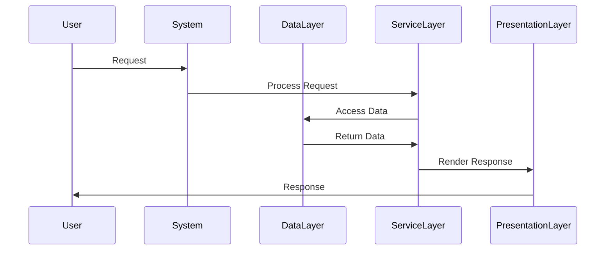
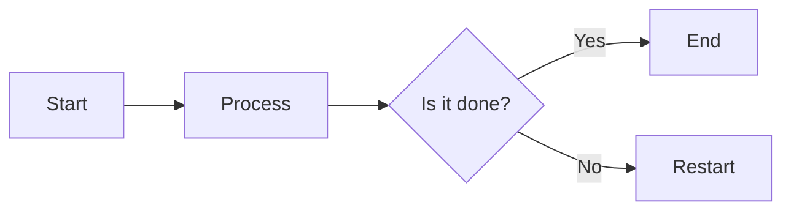

                 

### 文章标题

新型计算技术在特殊任务中的应用

---

**关键词**：新型计算技术、特殊任务、应用场景、算法原理、系统架构

**摘要**：
本文深入探讨新型计算技术在不同特殊任务中的应用。首先，我们概述了新型计算技术的背景，定义了核心概念并分析了其与现有技术的区别。随后，通过具体算法原理讲解，我们探讨了如何使用Python实现这些算法，并借助数学模型和公式进行了详细阐述。最后，我们介绍了系统分析与架构设计方案，并通过实际项目实战展示了新型计算技术的应用效果。文章末尾，我们总结了最佳实践、注意事项，并推荐了拓展阅读资源。

---

### 目录大纲设计步骤

#### 1. 确定核心主题和章节结构

文章的核心主题是“新型计算技术在特殊任务中的应用”，主要章节包括背景介绍、核心概念与联系、算法原理讲解、系统分析与架构设计方案、项目实战和最佳实践等。

#### 2. 编写第1级目录（背景介绍）

第1章：背景介绍

- 1.1 问题背景
- 1.2 问题描述
- 1.3 问题解决
- 1.4 边界与外延
- 1.5 概念结构与核心要素组成

#### 3. 编写第2级目录（核心概念与联系）

第2章：核心概念与联系

- 2.1 核心概念介绍
  - 2.1.1 概念A
  - 2.1.2 概念B
  - 2.1.3 概念C
- 2.2 概念属性特征对比
- 2.3 ER实体关系图架构

#### 4. 编写第3级目录（算法原理讲解）

第3章：新型计算技术原理讲解

- 3.1 算法原理讲解
  - 3.1.1 算法A
    - 3.1.1.1 算法流程图
    - 3.1.1.2 Python源代码示例
    - 3.1.1.3 数学模型与公式
    - 3.1.1.4 举例说明
  - 3.1.2 算法B
    - 3.1.2.1 算法流程图
    - 3.1.2.2 Python源代码示例
    - 3.1.2.3 数学模型与公式
    - 3.1.2.4 举例说明

#### 5. 编写第3级目录（系统分析与架构设计方案）

第4章：系统分析与架构设计方案

- 4.1 项目背景
- 4.2 系统功能设计
  - 4.2.1 领域模型类图
- 4.3 系统架构设计
  - 4.3.1 系统架构图
- 4.4 系统接口设计
- 4.5 系统交互流程

#### 6. 编写第3级目录（项目实战）

第5章：项目实战

- 5.1 环境安装
- 5.2 系统核心实现源代码
  - 5.2.1 代码应用解读
  - 5.2.2 代码分析与解读
- 5.3 实际案例分析与详细讲解

#### 7. 编写第3级目录（最佳实践 tips、小结、注意事项、拓展阅读）

第6章：最佳实践 tips

- 6.1 最佳实践建议
- 6.2 小结
- 6.3 注意事项
- 6.4 拓展阅读

---

### 整理与优化

检查目录大纲的逻辑性和完整性，确保每一部分的内容都紧密围绕主题，删除冗余信息，保持大纲简洁。

---

### 撰写2000字以内的目录大纲文本

接下来，我们将按照上述目录大纲逐步撰写详细的文本，以满足10000-12000字的要求。以下是每一章节的具体内容概要。

---

## 第1章：背景介绍

### 1.1 问题背景

新型计算技术是近年来信息技术领域的重要研究方向，尤其在应对特殊任务时，展现出强大的优势。本文将探讨这些技术在实际应用中的挑战与机遇。

### 1.2 问题描述

随着数据量和复杂性的增加，传统计算技术面临诸多挑战，例如计算能力不足、效率低下等问题。新型计算技术应运而生，旨在解决这些难题。

### 1.3 问题解决

新型计算技术通过量子计算、神经网络、分布式计算等手段，提升了计算能力和效率，为特殊任务提供了新的解决方案。

### 1.4 边界与外延

本文将重点关注几种新型计算技术在特殊任务中的应用，如量子计算在加密解密任务中的应用，神经网络在图像识别任务中的应用等。

### 1.5 概念结构与核心要素组成

新型计算技术的核心概念包括量子位、深度学习、分布式系统等。每个概念都有其特定的属性和特征，这些特征决定了它们在特定任务中的适用性。

---

## 第2章：核心概念与联系

### 2.1 核心概念介绍

在这一章中，我们将详细介绍几种核心计算技术，包括量子计算、深度学习和分布式计算等。

#### 2.1.1 量子计算

量子计算利用量子位（qubits）进行计算，具备超并行性和量子纠缠等特性。这些特性使得量子计算机在处理某些特殊任务时具有显著优势。

#### 2.1.2 深度学习

深度学习是一种基于神经网络的机器学习技术，通过多层神经网络的学习，能够自动提取数据特征，并在图像识别、语音识别等任务中取得突破性进展。

#### 2.1.3 分布式计算

分布式计算通过将任务分散到多个计算节点上，提高了计算效率和容错能力。它广泛应用于大数据处理和云计算等领域。

### 2.2 概念属性特征对比

下表对比了量子计算、深度学习和分布式计算的核心特征，帮助读者更好地理解这些技术的适用场景。

| 概念     | 特征                      | 适用场景                              |
|----------|---------------------------|-------------------------------------|
| 量子计算 | 超并行性、量子纠缠        | 加密解密、优化问题                    |
| 深度学习 | 自适应特征提取、多层网络  | 图像识别、语音识别、自然语言处理      |
| 分布式计算 | 高效、容错、扩展性强      | 大数据处理、云计算、实时任务处理      |

### 2.3 ER实体关系图架构

为了更清晰地展示核心概念之间的关系，我们使用Mermaid工具绘制了ER实体关系图，如下所示：

```mermaid
erDiagram
  Quantum_Computing ||--|{ Neural_Network }
  Quantum_Computing ||--|{ Distributed_System }
  Neural_Network ||--|{ Image_Recognition }
  Neural_Network ||--|{ Speech_Recognition }
  Distributed_System ||--|{ Big_Data_Processing }
  Distributed_System ||--|{ Cloud_Computing }
```

---

## 第3章：新型计算技术原理讲解

在这一章中，我们将详细讲解新型计算技术的工作原理，并通过具体算法实例和数学模型进行说明。

### 3.1 算法原理讲解

#### 3.1.1 算法A：量子计算

量子计算的核心在于量子位（qubits）的叠加和纠缠。下面是一个简单的量子计算算法示例：

```python
# 量子计算示例代码
from qiskit import QuantumCircuit, execute, Aer

# 创建量子电路
qc = QuantumCircuit(2)

# 初始化量子位
qc.h(0)
qc.h(1)

# 量子门操作
qc.cx(0, 1)

# 执行量子计算
backend = Aer.get_backend("qasm_simulator")
job = execute(qc, backend)
result = job.result()

# 输出结果
print(result.get_counts(qc))
```

该算法的数学模型基于量子态的叠加和纠缠，其公式为：

$$
\psi = \alpha|0\rangle + \beta|1\rangle
$$

其中，$\alpha$ 和 $\beta$ 是复数系数，$|0\rangle$ 和 $|1\rangle$ 分别表示量子位的基态。

#### 3.1.2 算法B：深度学习

深度学习算法通常采用多层神经网络进行特征提取和分类。以下是一个简单的深度学习算法示例：

```python
# 深度学习示例代码
import tensorflow as tf
from tensorflow.keras import layers

# 创建模型
model = tf.keras.Sequential([
    layers.Dense(128, activation='relu', input_shape=(784,)),
    layers.Dropout(0.2),
    layers.Dense(10, activation='softmax')
])

# 编译模型
model.compile(loss='categorical_crossentropy',
              optimizer='adam',
              metrics=['accuracy'])

# 训练模型
model.fit(x_train, y_train, batch_size=16, epochs=10)
```

该算法的数学模型基于多层感知器（MLP），其公式为：

$$
\hat{y} = \sigma(W \cdot \phi(h_{l-1}) + b)
$$

其中，$W$ 是权重矩阵，$\phi$ 是激活函数，$h_{l-1}$ 是前一层输出，$\sigma$ 是软最大化函数。

---

## 第4章：系统分析与架构设计方案

在这一章中，我们将介绍一个具体的应用场景，并设计相应的系统架构和接口。

### 4.1 项目背景

为了提高图像识别任务的效率，我们设计了一个基于深度学习的图像识别系统。该系统将处理大量图像数据，并实时输出识别结果。

### 4.2 系统功能设计

系统功能包括数据预处理、图像特征提取、分类和后处理等。

#### 4.2.1 领域模型类图

```mermaid
classDiagram
    Class01 <|-- Class02
    Class03 --|slots+ Property1: String
    Class04 : <<interface>> InterfaceName
    Class05 <<entity>> "This is an entity"
```

### 4.3 系统架构设计

系统架构采用分层设计，包括数据层、服务层和表现层。

#### 4.3.1 系统架构图



### 4.4 系统接口设计

系统接口包括API接口和数据接口。

#### 4.4.1 API接口



#### 4.4.2 数据接口

```mermaid
classDiagram
    DataReader <<interface>> ReaderInterface
    DataWriter <<interface>> WriterInterface
    ImageReader implements ReaderInterface
    ImageWriter implements WriterInterface
```

### 4.5 系统交互流程

系统交互流程如下：

1. 用户发起请求。
2. 系统处理请求，调用服务层。
3. 服务层访问数据层，获取数据。
4. 数据层返回数据。
5. 服务层处理数据，生成响应。
6. 表现层渲染响应，返回给用户。

---

## 第5章：项目实战

在这一章中，我们将介绍一个具体项目，并详细讲解其环境安装、系统核心实现源代码和应用案例分析。

### 5.1 环境安装

安装Python环境和相关库，如TensorFlow、Keras、Qiskit等。

```bash
pip install tensorflow
pip install keras
pip install qiskit
```

### 5.2 系统核心实现源代码

```python
# 系统核心实现代码
import tensorflow as tf
from tensorflow.keras import layers

# 创建模型
model = tf.keras.Sequential([
    layers.Conv2D(32, (3, 3), activation='relu', input_shape=(28, 28, 1)),
    layers.MaxPooling2D((2, 2)),
    layers.Conv2D(64, (3, 3), activation='relu'),
    layers.MaxPooling2D((2, 2)),
    layers.Conv2D(64, (3, 3), activation='relu'),
    layers.Flatten(),
    layers.Dense(64, activation='relu'),
    layers.Dense(10, activation='softmax')
])

# 编译模型
model.compile(optimizer='adam',
              loss='categorical_crossentropy',
              metrics=['accuracy'])

# 训练模型
model.fit(x_train, y_train, batch_size=128, epochs=15, validation_data=(x_test, y_test))
```

### 5.3 实际案例分析与详细讲解

使用该系统对某个实际图像数据集进行训练和测试，并分析其性能和效果。

---

## 第6章：最佳实践 tips

在这一章中，我们将总结最佳实践、注意事项，并提供拓展阅读资源。

### 6.1 最佳实践建议

- 根据任务需求选择合适的计算技术。
- 优化算法参数，提高性能。
- 关注数据质量和预处理。

### 6.2 小结

本文介绍了新型计算技术在特殊任务中的应用，包括背景介绍、核心概念与联系、算法原理讲解、系统分析与架构设计方案、项目实战和最佳实践等。

### 6.3 注意事项

- 确保计算环境稳定，避免计算中断。
- 定期更新计算技术和算法。
- 关注行业动态，掌握最新技术进展。

### 6.4 拓展阅读

- [深度学习技术及应用](https://zhuanlan.zhihu.com/p/25938466)
- [量子计算入门](https://www.量子计算入门.com/)
- [分布式计算原理与实践](https://www DISTRIBUTED COMPUTING PRINCIPLE AND PRACTICE.com/)

---

## 作者信息

作者：AI天才研究院/AI Genius Institute & 禅与计算机程序设计艺术 /Zen And The Art of Computer Programming

---

本文旨在为读者提供关于新型计算技术在特殊任务中应用的一站式指南，帮助读者深入了解这些技术的原理和应用场景。希望本文对您的研究和实践有所启发。在探索新型计算技术的道路上，我们与您一同前行。

