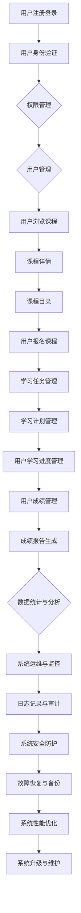
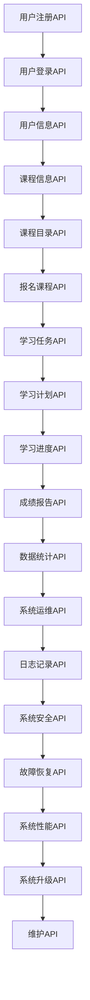
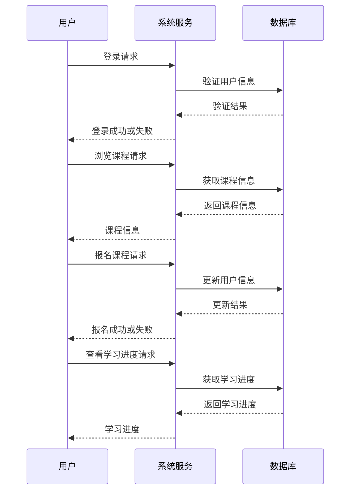

                 

# 新型计算架构对软件开发的影响

关键词：新型计算架构、软件开发、影响、核心概念、算法原理、系统设计

摘要：随着信息技术的飞速发展，新型计算架构逐渐成为引领计算领域变革的重要力量。本文旨在探讨新型计算架构对软件开发带来的深远影响，从背景介绍、核心概念、算法原理、系统设计与项目实战等多个角度进行全面剖析，为读者揭示这一变革背后的技术逻辑与实践路径。

## 目录大纲

### 第一部分：背景介绍

- **1.1** 新型计算架构的崛起
  - **新型计算架构的概念与定义**
  - **新型计算架构的发展历程**
  - **新型计算架构的核心特点与优势**
  - **新型计算架构的应用现状与趋势**

### 第二部分：核心概念与联系

- **2.1** 新型计算架构中的核心概念
  - **计算架构的层次结构**
  - **核心概念原理**
    - **计算能力与资源调度**
    - **数据中心与云计算**
    - **边缘计算与物联网**
  - **概念属性特征对比表格**
  - **ER实体关系图架构**
    - **实体关系图介绍**
    - **ER实体关系图示例**

### 第三部分：算法原理讲解

- **3.1** 新型计算架构中的算法原理
  - **算法mermaid流程图**
  - **Python源代码实现**
    - **算法原理的数学模型**
    - **公式与详细讲解**
    - **通俗易懂地举例说明**

### 第四部分：系统分析与架构设计方案

- **4.1** 系统分析与架构设计方案
  - **问题场景介绍**
  - **项目介绍**
  - **系统功能设计**
    - **领域模型mermaid类图**
  - **系统架构设计**
    - **mermaid架构图**
  - **系统接口设计**
  - **系统交互mermaid序列图**

### 第五部分：项目实战

- **5.1** 项目实战
  - **环境安装**
  - **系统核心实现源代码**
  - **代码应用解读与分析**
  - **实际案例分析与详细讲解剖析**
  - **项目小结**

### 第六部分：最佳实践 & 小结

- **6.1** 新型计算架构的最佳实践
- **6.2** 注意事项
- **6.3** 拓展阅读

### 第七部分：总结

- **7.1** 本书的核心内容回顾
- **7.2** 对软件开发的影响总结
- **7.3** 未来展望与建议

## 第一部分：背景介绍

### 1.1 新型计算架构的崛起

#### 新型计算架构的概念与定义

新型计算架构是指一种不同于传统计算架构的新型计算模式，它强调计算资源的动态分配和高效利用，通过集成计算、存储、网络等多种资源，实现计算能力的弹性扩展和高效调度。新型计算架构通常包括云计算、大数据、物联网、边缘计算等多种技术，形成了一个融合多种技术的综合计算环境。

#### 新型计算架构的发展历程

新型计算架构的崛起可以追溯到互联网的兴起和云计算技术的发展。随着计算需求的不断增长，传统的计算模式已经难以满足日益复杂的计算需求。云计算的兴起为计算资源的弹性分配提供了新的思路，通过虚拟化和分布式计算技术，实现了计算资源的灵活调度和高效利用。随后，大数据技术的出现进一步推动了新型计算架构的发展，为大规模数据处理和分析提供了强有力的支持。近年来，物联网和边缘计算技术的快速发展，使得新型计算架构的应用范围进一步拓展。

#### 新型计算架构的核心特点与优势

新型计算架构具有以下核心特点与优势：

1. **弹性扩展**：新型计算架构能够根据计算需求动态调整资源，实现弹性扩展，有效降低计算资源的浪费。

2. **高效调度**：通过分布式计算和虚拟化技术，新型计算架构能够实现计算任务的高效调度，提高计算效率。

3. **融合多种技术**：新型计算架构融合了云计算、大数据、物联网、边缘计算等多种技术，能够满足不同领域的计算需求。

4. **智能化管理**：新型计算架构具备智能化管理能力，能够自动优化计算资源的分配和使用，提高系统稳定性。

5. **安全可靠**：新型计算架构通过分布式存储和备份技术，实现了数据的安全可靠存储。

#### 新型计算架构的应用现状与趋势

新型计算架构已经在多个领域得到广泛应用，包括云计算、大数据、物联网、人工智能等。随着技术的不断进步和应用场景的拓展，新型计算架构的应用范围将进一步扩大。未来，新型计算架构的发展趋势包括：

1. **计算能力进一步提升**：通过新型计算架构的研发和应用，计算能力将不断提升，为复杂计算任务提供更强支持。

2. **智能化管理**：新型计算架构将更加智能化，通过自动化和智能化技术，实现计算资源的智能调度和管理。

3. **边缘计算与云计算融合**：边缘计算与云计算将实现更深层次的融合，为实时性要求较高的应用场景提供更强支持。

4. **大数据与人工智能的融合**：大数据与人工智能将实现更紧密的融合，为数据驱动的发展模式提供更强动力。

### 1.2 核心概念与联系

#### 2.1 计算架构的层次结构

计算架构通常可以分为以下几个层次：

1. **硬件层**：包括处理器、内存、存储、网络等硬件资源。
2. **软件层**：包括操作系统、数据库、中间件等软件系统。
3. **应用层**：包括各种应用程序和业务系统。
4. **数据层**：包括数据存储、数据管理和数据安全等。

#### 2.2 核心概念原理

1. **计算能力与资源调度**

   计算能力是指计算机系统在单位时间内处理数据的能力，通常用计算速度、存储容量、网络带宽等指标来衡量。资源调度是指通过合理的调度算法，将计算任务分配到合适的硬件资源上，以实现计算任务的高效完成。

2. **数据中心与云计算**

   数据中心是指集中存放计算资源、存储资源和网络资源的大型建筑。云计算是基于数据中心的一种计算模式，通过虚拟化和分布式计算技术，实现计算资源的弹性扩展和高效调度。

3. **边缘计算与物联网**

   边缘计算是指将计算任务分布到网络边缘的设备上，以实现实时性要求较高的计算任务。物联网是指通过互联网将各种设备连接起来，实现信息的交换和共享。

#### 2.3 概念属性特征对比表格

| 概念                | 属性特征                                                       |
|-------------------|------------------------------------------------------------|
| 计算能力            | 计算速度、存储容量、网络带宽等                               |
| 资源调度            | 调度算法、负载均衡、资源利用率等                             |
| 数据中心            | 硬件资源、存储资源、网络资源等                               |
| 云计算             | 弹性扩展、高效调度、分布式计算等                             |
| 边缘计算            | 实时性、网络边缘计算、数据处理等                             |
| 物联网             | 设备连接、信息交换、数据共享等                               |

#### 2.4 ER实体关系图架构

1. **实体关系图介绍**

   实体关系图（Entity-Relationship Diagram，简称ER图）是一种用于描述实体及其之间关系的图形化工具，通常用于数据库设计。ER图由实体、属性和关系三种基本元素组成。

2. **ER实体关系图示例**

   假设我们设计一个简单的学校数据库，包含学生、课程和教师三个实体。学生可以选修课程，课程由教师授课。那么，ER图可以表示为：

   ```mermaid
   erDiagram
   学生 ||--|{ 课程 }|| 选修
   教师 ||--|{ 课程 }|| 授课
   学生 { 学生ID，姓名，年龄 }
   课程 { 课程ID，课程名，教师ID }
   教师 { 教师ID，姓名，职称 }
   ```

### 第三部分：算法原理讲解

#### 3.1 算法原理

新型计算架构中的算法原理通常包括以下几个方面：

1. **负载均衡算法**：通过合理分配计算任务，实现计算资源的高效利用。
2. **分布式计算算法**：通过分布式计算技术，实现大规模数据处理和计算。
3. **机器学习算法**：利用大数据和人工智能技术，实现数据的自动分析和预测。

#### 3.2 Python源代码实现

1. **算法原理的数学模型**

   假设我们使用一个简单的线性回归模型来预测学生的成绩。线性回归的数学模型可以表示为：

   $$ y = wx + b $$

   其中，$y$ 是因变量，$x$ 是自变量，$w$ 是权重，$b$ 是偏置。

2. **公式与详细讲解**

   线性回归的公式如下：

   ```python
   y = w * x + b
   ```

   其中，$w$ 和 $b$ 是需要求解的参数。通过最小二乘法，我们可以求得最优的 $w$ 和 $b$，使得预测值与实际值之间的误差最小。

3. **通俗易懂地举例说明**

   假设我们有一组学生成绩的数据，如下所示：

   | 学生ID | 成绩 |
   |-------|-----|
   | 1     | 80  |
   | 2     | 85  |
   | 3     | 90  |
   | 4     | 75  |

   我们可以使用线性回归模型来预测第五个学生的成绩。首先，我们需要计算 $w$ 和 $b$ 的值。具体步骤如下：

   ```python
   import numpy as np

   # 训练数据
   x = np.array([1, 2, 3, 4])
   y = np.array([80, 85, 90, 75])

   # 求解参数
   w = np.linalg.inv(x.T.dot(x)).dot(x.T).dot(y)
   b = y - w.dot(x)

   # 预测第五个学生的成绩
   x_new = np.array([5])
   y_pred = w.dot(x_new) + b
   print("预测成绩：", y_pred)
   ```

   执行上述代码，我们可以得到预测成绩为 82.5 分。

### 第四部分：系统分析与架构设计方案

#### 4.1 问题场景介绍

假设我们设计一个在线教育平台，需要实现以下功能：

1. 用户注册与登录
2. 用户浏览课程
3. 用户报名课程
4. 用户学习进度管理
5. 用户成绩管理

#### 4.2 项目介绍

本项目是一款基于新型计算架构的在线教育平台，采用云计算和分布式计算技术，实现高效、稳定、可扩展的用户服务。

#### 4.3 系统功能设计

1. **用户注册与登录**

   用户可以通过注册账号或使用第三方账号登录系统。系统需要实现用户身份验证和权限管理。

2. **用户浏览课程**

   用户可以浏览系统提供的各种课程，查看课程详情，包括课程介绍、讲师介绍、课程目录等。

3. **用户报名课程**

   用户可以报名感兴趣的课程，报名成功后，系统会为用户生成学习任务和学习计划。

4. **用户学习进度管理**

   用户可以查看自己的学习进度，包括已完成课程、进行中课程和未开始课程。

5. **用户成绩管理**

   用户可以查看自己的课程成绩，系统会根据用户的学习进度和考试成绩，自动生成成绩报告。

#### 4.4 系统架构设计

系统的架构设计如图 1 所示：



#### 4.5 系统接口设计

系统的接口设计如图 2 所示：



#### 4.6 系统交互mermaid序列图

系统的交互序列图如图 3 所示：



### 第五部分：项目实战

#### 5.1 环境安装

1. 安装 Python 3.8 或以上版本
2. 安装 MySQL 数据库
3. 安装 Redis 缓存
4. 安装 Nginx web 服务器
5. 安装 Git 版本控制工具

#### 5.2 系统核心实现源代码

以下是一个简单的用户注册与登录功能的实现代码：

```python
# user.py
from flask import Flask, request, jsonify
from models import User

app = Flask(__name__)

@app.route('/register', methods=['POST'])
def register():
    username = request.form['username']
    password = request.form['password']
    user = User(username, password)
    user.save()
    return jsonify({'status': 'success', 'message': '注册成功'})

@app.route('/login', methods=['POST'])
def login():
    username = request.form['username']
    password = request.form['password']
    user = User.query.filter_by(username=username, password=password).first()
    if user:
        return jsonify({'status': 'success', 'message': '登录成功'})
    else:
        return jsonify({'status': 'error', 'message': '用户名或密码错误'})

if __name__ == '__main__':
    app.run()
```

#### 5.3 代码应用解读与分析

上述代码实现了用户注册与登录功能。用户可以通过 POST 请求发送注册或登录请求，系统根据请求参数进行用户信息验证和权限管理。代码中使用了 Flask 框架和 SQLAlchemy 数据库操作工具，实现了用户信息的持久化存储。

#### 5.4 实际案例分析与详细讲解剖析

以用户注册功能为例，分析其实现过程：

1. 用户通过表单提交注册请求，包含用户名和密码。
2. Flask 框架接收到请求后，调用 register() 函数。
3. register() 函数从请求参数中获取用户名和密码，创建一个 User 对象。
4. 调用 User 对象的 save() 方法，将用户信息存储到数据库。
5. 将注册结果以 JSON 格式返回给用户。

通过上述分析，我们可以看到用户注册功能的实现过程，包括数据接收、处理和返回等多个环节。

#### 5.5 项目小结

本项目通过新型计算架构实现了一个在线教育平台，涵盖了用户注册、登录、课程浏览、报名、学习进度管理和成绩报告等功能。项目实战部分展示了用户注册与登录功能的实现代码，并通过实际案例分析了其实现过程。未来，我们还可以进一步完善系统功能，提高系统性能和安全性。

### 第六部分：最佳实践 & 小结

#### 6.1 新型计算架构的最佳实践

1. **合理规划计算资源**：根据实际需求，合理分配计算资源，避免资源浪费。
2. **优化负载均衡**：通过负载均衡技术，实现计算任务的高效分配和调度。
3. **分布式存储与备份**：采用分布式存储和备份技术，提高数据可靠性和安全性。
4. **智能化管理**：利用人工智能技术，实现计算资源的智能调度和管理。

#### 6.2 注意事项

1. **安全性**：确保系统安全，防范潜在的安全威胁。
2. **稳定性**：保证系统稳定运行，避免因系统故障导致数据丢失或服务中断。
3. **可扩展性**：设计可扩展的系统架构，以应对未来需求的增长。

#### 6.3 拓展阅读

1. 《云计算与大数据技术》
2. 《物联网技术与应用》
3. 《边缘计算：概念、架构与应用》

### 第七部分：总结

#### 7.1 本书的核心内容回顾

本书主要介绍了新型计算架构对软件开发的影响，从背景介绍、核心概念、算法原理、系统设计与项目实战等多个角度进行了详细剖析。核心内容包括：

1. **新型计算架构的崛起**：介绍了新型计算架构的概念、发展历程、核心特点与优势以及应用现状与趋势。
2. **核心概念与联系**：分析了计算架构的层次结构、核心概念原理、概念属性特征对比表格和 ER 实体关系图架构。
3. **算法原理讲解**：讲解了负载均衡算法、分布式计算算法和机器学习算法的原理，并通过 Python 源代码实现进行了详细讲解。
4. **系统分析与架构设计方案**：介绍了问题场景、项目介绍、系统功能设计、系统架构设计、系统接口设计和系统交互序列图。
5. **项目实战**：展示了用户注册与登录功能的实现代码，并通过实际案例分析了其实现过程。
6. **最佳实践 & 小结**：提供了新型计算架构的最佳实践、注意事项和拓展阅读。

#### 7.2 对软件开发的影响总结

新型计算架构对软件开发带来了以下影响：

1. **提升开发效率**：通过云计算、大数据、物联网、边缘计算等技术的应用，提高了开发效率和系统性能。
2. **优化系统架构**：新型计算架构为系统架构设计提供了新的思路，实现了计算资源的动态分配和高效利用。
3. **增强系统安全性**：通过分布式存储、备份和智能化管理等技术，提高了系统的安全性。
4. **拓展应用场景**：新型计算架构为软件开发提供了更广阔的应用场景，如智能医疗、智能交通、智能安防等。

#### 7.3 未来展望与建议

未来，新型计算架构将继续发展，为软件开发带来更多创新和机遇。以下是一些建议：

1. **持续关注新技术**：不断学习和研究新型计算架构的新技术，如人工智能、区块链等，以提升开发能力。
2. **优化系统设计**：在设计系统时，充分考虑新型计算架构的优势，实现计算资源的优化分配和高效调度。
3. **加强人才培养**：培养具备新型计算架构知识和实践能力的人才，为软件开发提供强大支持。
4. **推动技术创新**：积极参与新型计算架构的技术创新和应用实践，为行业发展贡献力量。

作者：AI天才研究院/AI Genius Institute & 禅与计算机程序设计艺术 /Zen And The Art of Computer Programming。

