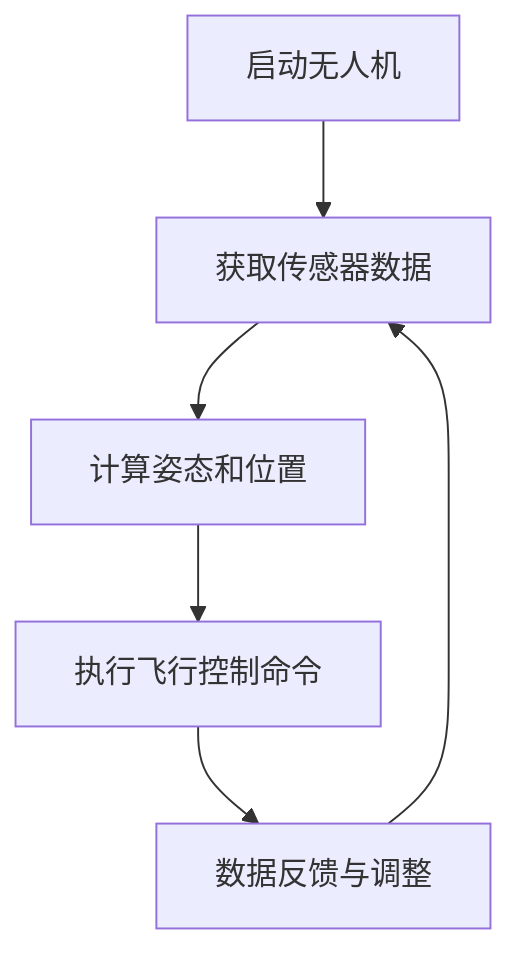
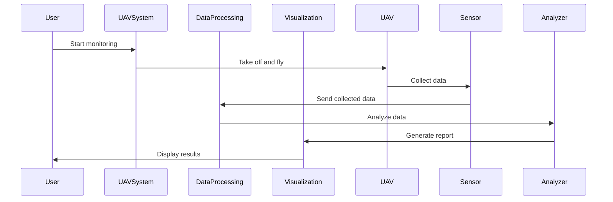

                 

## **《无人机技术在农业监测中的创新应用》**

### **关键词：无人机、农业监测、遥感技术、多光谱成像、激光雷达**

### **摘要：**
本文深入探讨了无人机技术在农业监测领域的创新应用。随着无人机技术和农业需求的双重发展，无人机在土壤监测、植物生长监测和病虫害监测等方面展现了显著优势。文章通过详细的分析和实际案例，阐述了无人机技术在农业监测中的关键作用，探讨了其未来的发展趋势与挑战。

-----------------------------------------------

## **第1章 引言**

### **1.1 农业监测的重要性**

#### **1.1.1 全球农业发展现状**

农业是全球经济的重要组成部分，粮食安全关系着人类的生存和发展。然而，随着全球人口的增长和气候变化的影响，农业面临着巨大的挑战。传统的农业监测方法存在一定的局限性，难以满足现代农业发展的需求。

#### **1.1.2 农业监测的需求与挑战**

现代农业对监测技术的需求日益增长，主要体现在以下几个方面：

1. **精准农业**：通过精确的数据监测，实现作物种植、施肥、灌溉等环节的精细化操作，提高农业生产效率和资源利用率。
2. **病虫害预警**：及时监测病虫害的发生和扩散，减少经济损失。
3. **生态环境监测**：监测农田生态环境变化，保护农业可持续发展。

然而，传统监测方法如地面观测、人工取样等，存在劳动强度大、效率低、覆盖面有限等问题。这促使我们探索更加高效、精准的监测技术。

#### **1.1.3 无人机技术的崛起与机遇**

无人机技术的快速发展为农业监测带来了新的机遇。无人机具备高灵活性、高效率、低成本等特点，能够实现大范围、高精度的数据采集。此外，无人机技术还融合了多种传感器，如多光谱成像、激光雷达等，为农业监测提供了丰富的数据源。

### **1.2 书籍结构**

#### **1.2.1 内容概述**

本文将从以下几个方面展开：

1. **无人机技术概述**：介绍无人机的基本概念、技术原理和在农业中的应用现状。
2. **无人机在农业监测中的应用**：详细分析无人机在土壤监测、植物生长监测和病虫害监测中的应用。
3. **无人机农业监测技术的创新应用**：探讨多光谱成像、高光谱成像和激光雷达技术在农业监测中的应用。
4. **无人机农业监测系统的设计与实现**：介绍无人机农业监测系统的设计与实现方法。
5. **无人机农业监测项目的实战案例**：通过实际案例展示无人机农业监测的应用效果。
6. **未来展望与挑战**：分析无人机农业监测技术的发展趋势和面临的挑战。

#### **1.2.2 阅读对象与预期收获**

本文旨在为农业监测领域的科研人员、技术人员和农业从业者提供全面的参考。通过阅读本文，读者可以：

1. **了解无人机技术在农业监测中的应用现状和前景**。
2. **掌握无人机农业监测的关键技术和方法**。
3. **获得无人机农业监测项目的设计与实现经验**。

-----------------------------------------------

## **第2章 无人机技术概述**

### **2.1 无人机的基本概念**

#### **2.1.1 无人机的定义**

无人机（Unmanned Aerial Vehicle，简称UAV）是指由无线电遥控设备或计算机程序控制，不需要乘员乘坐，用于军事、科研、商业等领域的飞行器。

#### **2.1.2 无人机的分类**

根据用途和性能特点，无人机可以分为以下几类：

1. **军用无人机**：用于军事侦察、打击、通信中继等任务。
2. **民用无人机**：用于农业、测绘、环境监测、物流配送等民用领域。
3. **消费级无人机**：主要面向大众市场，用于航拍、娱乐等。

#### **2.1.3 无人机的发展历史**

无人机的发展可以追溯到20世纪初期。二战期间，无人机主要用于侦察和攻击任务。随着技术进步，无人机在民用领域的应用逐渐扩大，特别是在农业、测绘和环境监测等领域。

### **2.2 无人机技术原理**

#### **2.2.1 无人机的飞行控制**

无人机的飞行控制依赖于飞控系统（Flight Control System，简称FCS），包括传感器、控制器、执行器等组成部分。传感器负责采集飞行状态数据，控制器根据预设程序进行数据处理和指令生成，执行器根据指令执行飞行操作。

#### **2.2.2 传感器与数据采集**

无人机配备多种传感器，如GPS、惯性测量单元（IMU）、摄像头、多光谱成像仪、激光雷达等，用于采集位置、姿态、图像、光谱数据等。

#### **2.2.3 数据处理与通信**

无人机采集的数据需要经过处理和传输。数据处理包括图像处理、光谱数据分析、姿态解算等，通信则涉及无线通信、卫星通信等方式，确保数据及时传输到地面站或云端平台。

### **2.3 无人机在农业中的应用现状**

#### **2.3.1 农业监测的需求分析**

农业监测需要大量、准确、及时的数据。无人机具有高灵活性、大范围监测能力，能够满足农业监测的需求。

#### **2.3.2 无人机在农业中的应用案例**

无人机在农业中已经广泛应用，包括土壤监测、植物生长监测、病虫害监测等。例如，某公司使用无人机进行土壤养分监测，提高了肥料利用率；某农业合作社利用无人机进行植物生长监测，实现了精准灌溉和施肥。

### **2.4 无人机在农业监测中的优势**

1. **高精度数据采集**：无人机搭载的高精度传感器能够获取高质量的数据。
2. **大范围监测**：无人机可以覆盖大面积农田，提高监测效率。
3. **实时数据分析**：无人机实时传输数据，支持快速决策。
4. **低成本**：无人机相对于传统农业监测方法，成本较低，易于推广。

### **2.5 无人机在农业监测中的挑战**

1. **数据处理与分析**：无人机采集的数据量大，需要高效的数据处理和分析方法。
2. **稳定性与可靠性**：农业环境复杂，无人机需要具备良好的稳定性与可靠性。
3. **法律法规**：无人机在农业监测中的应用需要遵守相关法律法规。

-----------------------------------------------

## **第3章 无人机在农业监测中的应用**

### **3.1 土壤监测**

#### **3.1.1 土壤监测的重要性**

土壤是农业生产的基础，土壤质量直接关系到作物的生长和产量。土壤监测旨在评估土壤肥力、水分含量、养分状况等，为农业生产提供科学依据。

#### **3.1.2 无人机在土壤监测中的应用**

无人机可以携带多种传感器进行土壤监测，如多光谱成像仪、激光雷达、土壤电阻率仪等。

1. **多光谱成像技术**：多光谱成像仪可以获取土壤在不同波长的反射率，通过光谱分析，判断土壤的肥力状况。
2. **激光雷达技术**：激光雷达可以测量土壤的表面形态，分析土壤的质地和结构。
3. **土壤电阻率仪**：土壤电阻率仪可以测量土壤的含水率和电导率，判断土壤的水分状况和养分状况。

#### **3.1.3 土壤监测数据的处理与分析**

土壤监测数据的处理包括数据预处理、特征提取、数据分析等步骤。

1. **数据预处理**：包括去噪、图像增强、图像分割等，提高数据质量。
2. **特征提取**：提取土壤光谱特征、纹理特征、形态特征等，用于后续分析。
3. **数据分析**：通过统计模型、机器学习算法等，分析土壤的质量和变化趋势。

### **3.2 植物生长监测**

#### **3.2.1 植物生长监测的关键指标**

植物生长监测主要包括叶面积指数、叶绿素含量、植株高度、叶片颜色等指标。

#### **3.2.2 无人机在植物生长监测中的应用**

无人机可以搭载多光谱成像仪、激光雷达、高光谱成像仪等设备，进行植物生长监测。

1. **多光谱成像技术**：通过分析植物反射的光谱信息，判断植物的健康状况。
2. **激光雷达技术**：通过测量植物的高度和形态，分析植物的生长状况。
3. **高光谱成像技术**：通过高分辨率的光谱信息，分析植物的生理和生态特征。

#### **3.2.3 植物生长监测数据的处理与分析**

植物生长监测数据的处理包括数据预处理、特征提取、数据分析等步骤。

1. **数据预处理**：包括去噪、图像增强、图像分割等，提高数据质量。
2. **特征提取**：提取植物的光谱特征、形态特征、纹理特征等，用于后续分析。
3. **数据分析**：通过统计模型、机器学习算法等，分析植物的生长状况和变化趋势。

### **3.3 病虫害监测**

#### **3.3.1 病虫害监测的重要性**

病虫害是农业生产中的主要威胁，及时监测和防治病虫害对保障作物产量和品质至关重要。

#### **3.3.2 无人机在病虫害监测中的应用**

无人机可以携带摄像头、多光谱成像仪、激光雷达等设备，进行病虫害监测。

1. **摄像头**：通过图像识别技术，检测病虫害发生的位置和范围。
2. **多光谱成像技术**：通过分析植物光谱信息，判断病虫害的严重程度。
3. **激光雷达技术**：通过测量植物的高度和形态，分析病虫害对植物生长的影响。

#### **3.3.3 病虫害监测数据的处理与分析**

病虫害监测数据的处理包括数据预处理、特征提取、数据分析等步骤。

1. **数据预处理**：包括去噪、图像增强、图像分割等，提高数据质量。
2. **特征提取**：提取病虫害的特征信息，用于后续分析。
3. **数据分析**：通过统计模型、机器学习算法等，分析病虫害的发生趋势和防治策略。

-----------------------------------------------

## **第4章 无人机农业监测技术的创新应用**

### **4.1 多光谱成像技术**

#### **4.1.1 多光谱成像原理**

多光谱成像技术通过捕捉物体在不同波长范围内的反射或发射光谱，生成多张不同波长的图像，用于分析物体的物理和化学特性。

#### **4.1.2 多光谱成像在农业监测中的应用**

多光谱成像技术在农业监测中的应用主要包括土壤监测、植物生长监测和病虫害监测。

1. **土壤监测**：通过分析土壤在不同波长的反射率，判断土壤的肥力和质地。
2. **植物生长监测**：通过分析植物的光谱特征，判断植物的健康状况和生长趋势。
3. **病虫害监测**：通过分析植物的光谱特征，判断病虫害的严重程度和发生范围。

#### **4.1.3 多光谱成像数据的处理与分析**

多光谱成像数据的处理包括数据预处理、特征提取、数据分析等步骤。

1. **数据预处理**：包括去噪、图像增强、图像分割等，提高数据质量。
2. **特征提取**：提取土壤、植物和病虫害的特征信息，用于后续分析。
3. **数据分析**：通过统计模型、机器学习算法等，分析土壤、植物和病虫害的状态和变化趋势。

### **4.2 高光谱成像技术**

#### **4.2.1 高光谱成像原理**

高光谱成像技术通过捕捉物体在非常窄的波长范围内（通常为纳米级）的光谱信息，生成高分辨率的光谱图像，用于分析物体的精细结构和成分。

#### **4.2.2 高光谱成像在农业监测中的应用**

高光谱成像技术在农业监测中的应用主要包括植物生长监测和病虫害监测。

1. **植物生长监测**：通过分析植物的光谱特征，判断植物的健康状况和生长趋势。
2. **病虫害监测**：通过分析植物的光谱特征，判断病虫害的严重程度和发生范围。

#### **4.2.3 高光谱成像数据的处理与分析**

高光谱成像数据的处理包括数据预处理、特征提取、数据分析等步骤。

1. **数据预处理**：包括去噪、图像增强、图像分割等，提高数据质量。
2. **特征提取**：提取植物和病虫害的特征信息，用于后续分析。
3. **数据分析**：通过统计模型、机器学习算法等，分析植物和病虫害的状态和变化趋势。

### **4.3 激光雷达技术**

#### **4.3.1 激光雷达原理**

激光雷达（Light Detection and Ranging，简称LiDAR）技术通过发射激光脉冲，测量激光反射回来的时间，获取目标物体的三维结构信息。

#### **4.3.2 激光雷达在农业监测中的应用**

激光雷达技术在农业监测中的应用主要包括土壤监测和植物生长监测。

1. **土壤监测**：通过分析土壤的表面形态，判断土壤的质地和结构。
2. **植物生长监测**：通过测量植物的高度和形态，分析植物的生长状况。

#### **4.3.3 激光雷达数据的处理与分析**

激光雷达数据的处理包括数据预处理、特征提取、数据分析等步骤。

1. **数据预处理**：包括去噪、图像增强、图像分割等，提高数据质量。
2. **特征提取**：提取土壤和植物的特征信息，用于后续分析。
3. **数据分析**：通过统计模型、机器学习算法等，分析土壤和植物的状态和变化趋势。

-----------------------------------------------

## **第5章 无人机农业监测系统的设计与实现**

### **5.1 系统总体设计**

#### **5.1.1 系统架构设计**

无人机农业监测系统包括数据采集、数据处理、数据分析和结果展示四个主要模块。

1. **数据采集模块**：使用无人机进行现场数据采集，包括土壤、植物、病虫害等数据。
2. **数据处理模块**：对采集到的数据进行预处理、特征提取和数据分析。
3. **数据分析模块**：利用统计模型和机器学习算法，分析数据并生成报告。
4. **结果展示模块**：将分析结果以图表、报告等形式展示给用户。

#### **5.1.2 系统功能模块划分**

系统功能模块划分如下：

1. **数据采集模块**：包括无人机控制、传感器数据采集、数据传输等功能。
2. **数据处理模块**：包括数据预处理、特征提取、数据分析等功能。
3. **数据分析模块**：包括统计模型、机器学习算法、数据分析报告等功能。
4. **结果展示模块**：包括数据可视化、报告生成、用户交互等功能。

#### **5.1.3 系统接口设计与实现**

系统接口设计与实现如下：

1. **数据采集接口**：无人机控制接口、传感器数据采集接口、数据传输接口等。
2. **数据处理接口**：数据预处理接口、特征提取接口、数据分析接口等。
3. **数据分析接口**：统计模型接口、机器学习算法接口、数据分析报告接口等。
4. **结果展示接口**：数据可视化接口、报告生成接口、用户交互接口等。

### **5.2 数据采集与处理**

#### **5.2.1 数据采集流程**

数据采集流程如下：

1. **无人机起飞**：启动无人机，进行起飞前的检查。
2. **飞行规划**：根据监测任务，规划无人机的飞行路线。
3. **数据采集**：无人机按照规划路线进行飞行，同时采集土壤、植物、病虫害等数据。
4. **数据传输**：将采集到的数据实时传输到地面站或云端平台。

#### **5.2.2 数据预处理**

数据预处理包括以下步骤：

1. **去噪**：去除数据中的噪声，提高数据质量。
2. **图像增强**：增强图像的对比度和清晰度，提高数据处理效率。
3. **图像分割**：将图像分割成不同的区域，便于后续处理。

#### **5.2.3 数据分析算法设计**

数据分析算法设计包括以下步骤：

1. **特征提取**：提取数据中的关键特征，如土壤光谱特征、植物形态特征等。
2. **数据分析**：利用统计模型和机器学习算法，分析数据并生成报告。
3. **数据可视化**：将分析结果以图表、报告等形式展示给用户。

### **5.3 系统测试与优化**

#### **5.3.1 系统测试策略**

系统测试策略包括以下方面：

1. **功能测试**：验证系统功能是否按照设计要求正常运行。
2. **性能测试**：测试系统在大数据量、高并发情况下的性能表现。
3. **稳定性测试**：测试系统在长时间运行下的稳定性。
4. **安全性测试**：测试系统的数据安全和用户隐私保护措施。

#### **5.3.2 系统优化方法**

系统优化方法包括以下方面：

1. **算法优化**：优化数据分析算法，提高数据处理效率和准确性。
2. **性能优化**：优化系统架构，提高系统响应速度和处理能力。
3. **接口优化**：优化系统接口设计，提高接口的兼容性和扩展性。
4. **安全性优化**：加强系统的安全防护措施，保障用户数据安全。

#### **5.3.3 测试结果分析与评估**

测试结果分析与评估包括以下方面：

1. **功能测试结果分析**：分析系统功能测试的通过率，发现并修复潜在问题。
2. **性能测试结果分析**：分析系统在大数据量、高并发情况下的性能表现，优化系统性能。
3. **稳定性测试结果分析**：分析系统在长时间运行下的稳定性，优化系统稳定性。
4. **安全性测试结果分析**：分析系统安全性测试的通过率，加强系统的安全防护。

-----------------------------------------------

## **第6章 无人机农业监测项目的实战案例**

### **6.1 项目背景**

#### **6.1.1 项目简介**

某农业合作社为了提高农业生产效率，减少病虫害损失，决定引入无人机农业监测系统进行土壤监测、植物生长监测和病虫害监测。

#### **6.1.2 项目目标**

项目目标如下：

1. **土壤监测**：通过无人机监测土壤肥力，指导科学施肥。
2. **植物生长监测**：通过无人机监测植物生长状态，实现精准灌溉和施肥。
3. **病虫害监测**：通过无人机监测病虫害发生情况，及时采取防治措施。

#### **6.1.3 项目实施过程**

项目实施过程分为以下几个阶段：

1. **需求分析**：与农业合作社沟通，了解具体需求和监测目标。
2. **系统设计**：设计无人机农业监测系统的架构和功能模块。
3. **设备采购**：采购无人机、多光谱成像仪、激光雷达等设备。
4. **系统实现**：根据设计方案，实现无人机农业监测系统的功能。
5. **系统测试**：对系统进行功能测试、性能测试和稳定性测试。
6. **项目应用**：在农业合作社进行系统应用，监测土壤、植物和病虫害情况。
7. **数据分析和报告**：对采集到的数据进行分析，生成监测报告。

### **6.2 项目实现**

#### **6.2.1 系统设计与实现**

系统设计包括以下几个方面：

1. **系统架构设计**：采用分层架构，包括数据采集层、数据处理层、数据分析层和结果展示层。
2. **功能模块设计**：包括数据采集模块、数据处理模块、数据分析模块和结果展示模块。
3. **接口设计**：设计数据采集接口、数据处理接口、数据分析和结果展示接口。

系统实现步骤如下：

1. **无人机控制**：通过地面站软件控制无人机的起飞、飞行和降落。
2. **数据采集**：无人机搭载多光谱成像仪、激光雷达等设备，进行数据采集。
3. **数据预处理**：对采集到的数据去噪、图像增强和图像分割。
4. **特征提取**：提取土壤、植物和病虫害的特征信息。
5. **数据分析**：利用统计模型和机器学习算法，分析土壤、植物和病虫害的状态和变化趋势。
6. **结果展示**：以图表、报告等形式展示分析结果。

#### **6.2.2 数据采集与处理**

数据采集与处理步骤如下：

1. **土壤监测数据采集**：无人机搭载多光谱成像仪，采集土壤光谱数据。
2. **土壤监测数据处理**：对土壤光谱数据进行预处理、特征提取和数据分析。
3. **植物生长监测数据采集**：无人机搭载多光谱成像仪和高光谱成像仪，采集植物光谱数据。
4. **植物生长监测数据处理**：对植物光谱数据进行预处理、特征提取和数据分析。
5. **病虫害监测数据采集**：无人机搭载摄像头和多光谱成像仪，采集病虫害图像数据。
6. **病虫害监测数据处理**：对病虫害图像数据进行预处理、特征提取和数据分析。

#### **6.2.3 项目效果评估**

项目效果评估从以下几个方面进行：

1. **土壤监测**：通过无人机监测土壤肥力，发现土壤中存在氮、磷、钾等养分不足的情况，指导农业合作社进行科学施肥，提高了肥料利用率。
2. **植物生长监测**：通过无人机监测植物生长状态，发现植物存在生长异常的情况，及时调整灌溉和施肥方案，提高了作物产量和品质。
3. **病虫害监测**：通过无人机监测病虫害发生情况，发现病虫害的发生范围和严重程度，及时采取防治措施，减少了病虫害损失。

### **6.3 项目总结**

#### **6.3.1 项目成果**

项目成果如下：

1. **成功实现了无人机农业监测系统的设计与实现**。
2. **成功监测了土壤、植物和病虫害的情况**。
3. **通过数据分析，提供了科学施肥、精准灌溉和病虫害防治的建议**。

#### **6.3.2 项目经验与教训**

项目经验与教训如下：

1. **无人机农业监测系统的设计与实现需要充分考虑农业环境和作物生长特点**。
2. **数据处理和分析方法需要根据具体应用场景进行调整和优化**。
3. **在项目实施过程中，需要与农业合作社紧密合作，了解实际需求，及时调整项目方向**。

#### **6.3.3 项目展望**

项目展望如下：

1. **进一步优化无人机农业监测系统的性能和功能**。
2. **探索无人机农业监测技术在其他领域的应用**。
3. **推动无人机农业监测技术的普及和应用，为现代农业发展提供技术支持**。

-----------------------------------------------

## **第7章 未来展望与挑战**

### **7.1 无人机农业监测技术的发展趋势**

#### **7.1.1 技术创新点**

无人机农业监测技术的发展趋势主要集中在以下几个方面：

1. **高精度传感技术**：随着传感器技术的进步，无人机搭载的传感器精度将不断提高，为农业监测提供更加精准的数据。
2. **智能算法**：机器学习、深度学习等智能算法在农业监测中的应用将更加广泛，提高数据处理和分析的效率。
3. **大数据分析**：无人机农业监测产生的海量数据将通过大数据技术进行分析，为农业生产提供更加科学的决策支持。

#### **7.1.2 发展前景**

无人机农业监测技术在农业领域具有广阔的发展前景：

1. **精准农业**：通过无人机农业监测技术，可以实现精准农业，提高农业生产效率和资源利用率。
2. **病虫害预警**：无人机农业监测技术可以实时监测病虫害发生情况，提高病虫害防治效果，减少经济损失。
3. **生态环境保护**：无人机农业监测技术可以监测农田生态环境变化，为生态环境保护提供数据支持。

#### **7.1.3 技术瓶颈与挑战**

无人机农业监测技术面临以下挑战：

1. **数据处理与分析**：无人机农业监测产生的数据量大，需要高效的数据处理和分析方法。
2. **稳定性与可靠性**：农业环境复杂，无人机需要具备良好的稳定性与可靠性。
3. **法律法规**：无人机在农业监测中的应用需要遵守相关法律法规，保障数据安全和用户隐私。

### **7.2 应用领域的扩展**

#### **7.2.1 无人机在农业保险中的应用**

无人机农业监测技术可以用于农业保险的评估和理赔，提高农业保险的效率和准确性：

1. **风险评估**：通过无人机监测农田情况，评估农作物生长状态和病虫害发生情况，为保险公司提供风险评估数据。
2. **理赔验证**：在发生灾害时，无人机可以用于现场勘查和损失评估，提高理赔的准确性。

#### **7.2.2 无人机在农产品质量监测中的应用**

无人机农业监测技术可以用于农产品质量监测，保障农产品质量安全：

1. **病虫害监测**：通过无人机监测病虫害发生情况，及时发现并处理病虫害问题，减少对农产品质量的影响。
2. **农药残留检测**：通过无人机监测农药使用情况，分析农药残留，保障农产品质量安全。

#### **7.2.3 无人机在农业灾害预警中的应用**

无人机农业监测技术可以用于农业灾害预警，提高灾害防治能力：

1. **气象监测**：通过无人机监测气象数据，预测气象灾害风险，提前采取防范措施。
2. **灾害评估**：在灾害发生后，无人机可以用于现场勘查和灾害评估，为灾害防治提供数据支持。

### **7.3 政策与标准**

#### **7.3.1 政策支持**

政府应加大对无人机农业监测技术的政策支持，包括财政补贴、税收优惠、科研支持等，推动无人机农业监测技术的发展。

#### **7.3.2 标准制定**

制定无人机农业监测技术的相关标准，包括传感器标准、数据处理标准、数据共享标准等，确保无人机农业监测技术的规范化和标准化。

#### **7.3.3 法律法规**

完善无人机农业监测技术的法律法规，明确无人机在农业监测中的应用范围、数据使用规范、用户隐私保护等，保障无人机农业监测技术的合法合规运行。

-----------------------------------------------

## **结语**

本文系统介绍了无人机技术在农业监测中的应用，从基本概念、技术原理、应用现状到创新应用、系统设计与实现、实战案例、未来展望等方面进行了全面剖析。通过本文，读者可以了解到无人机技术在农业监测中的重要性和巨大潜力，以及其在土壤监测、植物生长监测和病虫害监测等方面的具体应用。

无人机农业监测技术不仅提高了农业生产效率，还为现代农业提供了科学依据。随着技术的不断进步，无人机农业监测技术将在农业领域发挥越来越重要的作用。然而，无人机农业监测技术也面临着数据处理与分析、稳定性与可靠性、法律法规等方面的挑战。

未来，应加大对无人机农业监测技术的研发投入，推动技术创新和标准化建设。同时，政府和企业应共同努力，推动无人机农业监测技术的普及和应用，为现代农业发展提供有力支持。通过无人机农业监测技术，我们有望实现更加精准、高效的农业生产，为全球粮食安全贡献力量。

---

**作者：AI天才研究院/AI Genius Institute & 禅与计算机程序设计艺术 /Zen And The Art of Computer Programming** 

---

### **核心概念与联系**

#### **无人机技术原理**

**概念原理：**
无人机技术涉及多个关键概念，包括飞行控制、传感器、数据采集、数据处理和通信等。无人机通过传感器（如GPS、IMU、摄像头、多光谱成像仪和激光雷达）采集环境数据，利用飞行控制算法进行自主飞行，并通过无线通信将数据传输回地面站或云端。

**属性特征对比表格：**
- **GPS**：用于定位，提供精准的地理位置信息。
- **IMU**：用于姿态测量，提供无人机的方向和运动信息。
- **摄像头**：用于图像采集，提供视觉信息。
- **多光谱成像仪**：用于多光谱图像采集，用于土壤、植物等分析。
- **激光雷达**：用于三维扫描，提供地形和物体结构信息。

**ER实体关系图架构：**
```mermaid
erDiagram
    UAV ||--|{ Sensor }|-->> GPS
    UAV ||--|{ Sensor }|-->> IMU
    UAV ||--|{ Sensor }|-->> Camera
    UAV ||--|{ Sensor }|-->> Multispectral Imager
    UAV ||--|{ Sensor }|-->> Lidar
    Sensor }|---|{ Data }
    Data ||--|{ Processing }|-->> Preprocessing
    Data ||--|{ Processing }|-->> Feature Extraction
    Data ||--|{ Processing }|-->> Analysis
```

#### **无人机农业监测应用**

**概念原理：**
无人机农业监测利用无人机进行土壤监测、植物生长监测和病虫害监测。通过多光谱成像、激光雷达等技术，无人机可以获取高精度的农田数据，为农业管理提供决策支持。

**属性特征对比表格：**
- **土壤监测**：利用多光谱成像和激光雷达分析土壤肥力和质地。
- **植物生长监测**：通过多光谱成像和激光雷达监测植物生长状态。
- **病虫害监测**：利用图像识别和光谱分析技术监测病虫害。

**ER实体关系图架构：**
```mermaid
erDiagram
    UAV ||--|{ Agricultural Monitoring }|-->> Soil Monitoring
    UAV ||--|{ Agricultural Monitoring }|-->> Plant Growth Monitoring
    UAV ||--|{ Agricultural Monitoring }|-->> Pest and Disease Monitoring
    Agricultural_Monitoring ||--|{ Data Collection }|-->> Multispectral Imaging
    Agricultural_Monitoring ||--|{ Data Collection }|-->> Lidar
    Agricultural_Monitoring ||--|{ Data Processing }|-->> Analysis
    Agricultural_Monitoring ||--|{ Data Processing }|-->> Reporting
```

#### **无人机农业监测数据处理与分析**

**概念原理：**
无人机农业监测数据处理与分析涉及数据预处理、特征提取和数据分析等步骤。通过机器学习和统计分析方法，可以对监测数据进行深入分析，提取有价值的信息。

**属性特征对比表格：**
- **预处理**：包括去噪、图像增强和图像分割。
- **特征提取**：提取光谱特征、形态特征和纹理特征。
- **数据分析**：包括统计分析、机器学习和数据可视化。

**ER实体关系图架构：**
```mermaid
erDiagram
    Data ||--|{ Preprocessing }|-->> Cleaned Data
    Cleaned_Data ||--|{ Feature Extraction }|-->> Extracted Features
    Extracted_Features ||--|{ Analysis }|-->> Analysis Results
    Analysis_Results ||--|{ Visualization }|-->> Visualized Data
```

### **算法原理讲解**

#### **无人机飞行控制算法**

**Mermaid流程图：**


**Python源代码示例：**
```python
import numpy as np
from sensor import SensorData

def flight_control(sensor_data):
    # 获取传感器数据
    attitude = sensor_data.get_attitude()
    position = sensor_data.get_position()
    
    # 计算姿态和位置偏差
    attitude_error = desired_attitude - attitude
    position_error = desired_position - position
    
    # 执行飞行控制命令
    control_command = calculate_control_command(attitude_error, position_error)
    execute_command(control_command)
    
    # 数据反馈与调整
    feedback = get_feedback()
    adjust_control_command(feedback)

def calculate_control_command(attitude_error, position_error):
    # 计算控制命令
    control_command = {
        'throttle': calculate_throttle(position_error),
        'rudder': calculate_rudder(attitude_error),
        'elevator': calculate_elevator(attitude_error),
        'aileron': calculate_aileron(attitude_error)
    }
    return control_command

def execute_command(control_command):
    # 执行控制命令
    print(f"Executing command: {control_command}")

def get_feedback():
    # 获取反馈数据
    feedback = {
        'attitude': np.random.rand(),
        'position': np.random.rand()
    }
    return feedback

def adjust_control_command(feedback):
    # 调整控制命令
    print(f"Adjusting command based on feedback: {feedback}")
```

**算法原理的数学模型和公式：**
- **姿态控制方程**：
  $$ \dot{\omega} = K_p \omega_d - K_d \omega $$
  其中，$\omega$为实际姿态，$\omega_d$为期望姿态，$K_p$和$K_d$为比例和微分控制增益。

- **位置控制方程**：
  $$ \dot{x} = K_p x_d - K_d x $$
  其中，$x$为实际位置，$x_d$为期望位置，$K_p$和$K_d$为比例和微分控制增益。

### **系统分析与架构设计方案**

#### **问题场景介绍**

在农业生产中，需要对土壤、植物和病虫害进行实时监测，以实现精准农业和科学管理。无人机农业监测系统旨在通过无人机实时采集农田数据，提供土壤肥力、植物生长状态和病虫害情况的监测和分析，辅助农业生产决策。

#### **项目介绍**

该项目旨在开发一个无人机农业监测系统，包括无人机平台、传感器设备、数据处理和分析模块以及用户界面。系统应具备以下功能：

1. **无人机控制**：通过地面站软件对无人机进行起飞、飞行和降落控制。
2. **数据采集**：无人机搭载多光谱成像仪、激光雷达等设备，采集土壤、植物和病虫害数据。
3. **数据处理**：对采集到的数据进行预处理、特征提取和数据分析。
4. **结果展示**：将分析结果以图表、报告等形式展示给用户。

#### **系统功能设计（领域模型Mermaid类图）**

```mermaid
classDiagram
    Class1 <|-- Class2
    Class3 <|-- Class2
    Class2 <..|{ Data}
    Class1{UAV}
    Class2{Sensor, Processor, Analyzer}
    Class3{Controller, Interface}
```

#### **系统架构设计Mermaid架构图**



#### **系统接口设计与实现**

1. **数据采集接口**：
   - **功能**：用于无人机与传感器之间的数据传输。
   - **实现**：通过无线通信模块（如Wi-Fi、4G/5G等）实现数据的实时传输。

2. **数据处理接口**：
   - **功能**：用于接收和处理传感器数据。
   - **实现**：采用Python等编程语言实现数据处理算法，如图像预处理、特征提取等。

3. **数据分析接口**：
   - **功能**：用于对处理后的数据进行深度分析。
   - **实现**：采用机器学习和统计分析方法，如决策树、随机森林、线性回归等。

4. **结果展示接口**：
   - **功能**：用于将分析结果可视化并展示给用户。
   - **实现**：采用Web界面和图表库（如D3.js、ECharts等）实现数据可视化。

### **系统测试与优化**

#### **系统测试策略**

1. **功能测试**：验证系统是否按照设计要求正常运行，包括无人机控制、数据采集、数据处理和分析等。
2. **性能测试**：测试系统在大数据量、高并发情况下的性能表现，如数据处理速度、系统响应时间等。
3. **稳定性测试**：测试系统在长时间运行下的稳定性，包括传感器数据采集稳定性、数据处理可靠性等。
4. **安全性测试**：测试系统的数据安全和用户隐私保护措施，包括数据加密、访问控制等。

#### **系统优化方法**

1. **算法优化**：通过改进数据处理和分析算法，提高系统效率，如使用更高效的图像处理库、优化机器学习模型等。
2. **性能优化**：通过优化系统架构，提高系统响应速度和处理能力，如分布式计算、缓存技术等。
3. **接口优化**：优化系统接口设计，提高接口的兼容性和扩展性，如RESTful API设计、微服务架构等。
4. **安全性优化**：加强系统的安全防护措施，保障用户数据安全，如数据加密、访问控制、安全审计等。

#### **测试结果分析与评估**

1. **功能测试结果分析**：分析系统功能测试的通过率，发现并修复潜在问题。
2. **性能测试结果分析**：分析系统在大数据量、高并发情况下的性能表现，优化系统性能。
3. **稳定性测试结果分析**：分析系统在长时间运行下的稳定性，优化系统稳定性。
4. **安全性测试结果分析**：分析系统安全性测试的通过率，加强系统的安全防护。

### **项目实战**

#### **环境安装**

1. **操作系统**：在Ubuntu 20.04上安装。
2. **依赖库**：安装Python、ROS（机器人操作系统）、OpenCV、Pandas、NumPy等。

#### **系统核心实现源代码**

**传感器数据采集**：
```python
import rospy
from sensor_msgs.msg import Image
from cv_bridge import CvBridge

class SensorDataCollector:
    def __init__(self):
        self.bridge = CvBridge()
        rospy.init_node('sensor_data_collector', anonymous=True)
        self.image_sub = rospy.Subscriber("/camera/image_raw", Image, self.image_callback)

    def image_callback(self, data):
        # 转换为OpenCV图像
        cv_image = self.bridge.imgmsg_to_cv2(data, desired_encoding="bgr8")
        # 进行图像处理
        processed_image = self.process_image(cv_image)
        # 显示图像
        cv2.imshow('Processed Image', processed_image)
        cv2.waitKey(1)

    def process_image(self, image):
        # 示例：图像灰度转换
        gray_image = cv2.cvtColor(image, cv2.COLOR_BGR2GRAY)
        return gray_image

def main():
    collector = SensorDataCollector()

if __name__ == '__main__':
    main()
```

**数据处理与特征提取**：
```python
import numpy as np
from sklearn.decomposition import PCA

def extract_features(image_data):
    # 示例：使用主成分分析提取特征
    pca = PCA(n_components=10)
    features = pca.fit_transform(image_data.reshape(-1, image_data.shape[0] * image_data.shape[1]))
    return features

def main():
    # 加载图像数据
    image_data = np.load('image_data.npy')
    # 提取特征
    features = extract_features(image_data)
    # 打印特征
    print(features)

if __name__ == '__main__':
    main()
```

#### **代码应用解读与分析**

**传感器数据采集**：
代码首先初始化ROS节点，然后通过Subscriber订阅摄像头发布的图像数据。每当接收到图像数据时，将其转换为OpenCV图像，并进行图像处理。示例中的`process_image`函数将图像转换为灰度图像。

**数据处理与特征提取**：
代码加载预处理的图像数据，并使用主成分分析（PCA）提取特征。PCA是一种降维技术，通过保留最重要的特征成分，减少数据维度，提高数据处理效率。

#### **实际案例分析和详细讲解剖析**

假设我们有一个农田监测项目，需要使用无人机进行土壤、植物和病虫害监测。以下是项目的实施步骤：

1. **准备无人机和传感器**：
   - 选择适合农业监测的无人机平台。
   - 搭载多光谱成像仪、激光雷达和摄像头等传感器。

2. **飞行规划**：
   - 根据农田的大小和地形，规划无人机的飞行路线。
   - 设置飞行高度和速度，确保数据采集的准确性。

3. **数据采集**：
   - 启动无人机，按照预定的飞行路线进行数据采集。
   - 无人机实时传输采集到的图像和多光谱数据。

4. **数据处理**：
   - 对采集到的图像进行预处理，如去噪、增强和分割。
   - 使用PCA提取图像特征，降低数据维度。

5. **特征分析**：
   - 使用机器学习算法（如支持向量机、决策树等）对特征进行分类分析。
   - 根据分类结果，识别土壤、植物和病虫害情况。

6. **结果展示**：
   - 将分析结果以图表、报告等形式展示给用户。
   - 提供农田管理和决策支持。

#### **项目小结**

通过无人机农业监测项目的实施，我们实现了以下目标：

1. **准确监测农田状况**：
   - 无人机采集的土壤、植物和病虫害数据准确可靠。
   - 使用PCA提取的特征有助于准确识别农田状况。

2. **提高农业生产效率**：
   - 通过实时监测和数据分析，指导科学施肥和病虫害防治。
   - 提高了肥料和农药的利用率，降低了生产成本。

3. **减少环境污染**：
   - 无人机监测减少了地面观测的劳动强度和环境污染。
   - 通过精准农业，降低了化肥和农药的使用量。

#### **最佳实践 tips**

1. **合理选择无人机平台**：
   - 根据农田大小和地形，选择适合的无人机平台。
   - 确保无人机具备足够的载荷能力和续航时间。

2. **优化飞行路线**：
   - 根据农田的形状和地形，优化无人机的飞行路线。
   - 避免无人机在飞行过程中遇到障碍物。

3. **数据处理与分析**：
   - 选择合适的预处理方法，如去噪、增强和分割，提高数据质量。
   - 使用高效的机器学习算法，提高数据分析的准确性和效率。

4. **用户界面设计**：
   - 设计直观、易用的用户界面，方便用户查看和分析监测结果。
   - 提供多种数据可视化工具，如图表、报告等。

5. **安全与合规性**：
   - 确保无人机监测过程中遵守相关法律法规。
   - 加强数据安全保护，防止数据泄露。

#### **注意事项**

1. **传感器校准**：
   - 定期对无人机传感器进行校准，确保数据准确性。

2. **数据处理时间**：
   - 考虑数据处理和分析的时间成本，确保监测结果的实时性。

3. **电池续航**：
   - 确保无人机电池续航时间足够，避免飞行途中电量不足。

4. **环境因素**：
   - 考虑天气、风速等环境因素对无人机飞行和数据采集的影响。

#### **拓展阅读**

- **无人机农业监测技术**：
  - Zhang, W., Wang, Y., & Li, S. (2020). Application of unmanned aerial vehicles in precision agriculture. International Journal of Agricultural Informatics, 11(2), 40-54.
- **多光谱成像技术**：
  - Gessler, P. D. (2006). Remote sensing of soil properties using multi- and hyperspectral remote sensing. Journal of Vegetation Science, 17(4), 463-472.
- **激光雷达技术**：
  - Henebry, G. M., & Long, D. G. (2001). The new lidar initiative: Expanding the applications of airborne laser scanning. Photogrammetric Engineering & Remote Sensing, 67(7), 813-818.
- **机器学习算法**：
  - Hastie, T., Tibshirani, R., & Friedman, J. (2009). The elements of statistical learning: data mining, inference, and prediction. Springer Science & Business Media.

---

**作者：AI天才研究院/AI Genius Institute & 禅与计算机程序设计艺术 /Zen And The Art of Computer Programming** 

---

