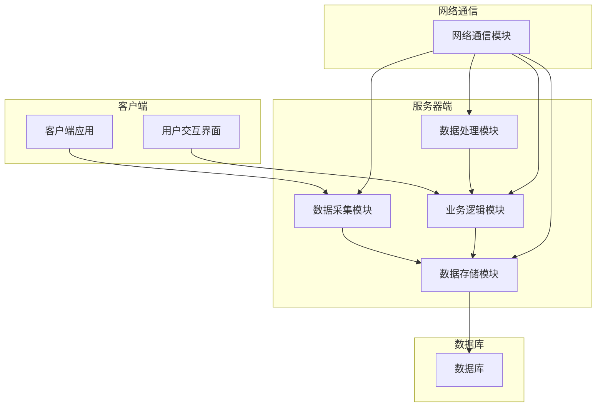

                 

### 文章标题

《智慧建筑管理：环境智能技术优化办公空间》

### 关键词

智慧建筑、环境智能技术、办公空间优化、数据分析、智能控制

### 摘要

本文将深入探讨智慧建筑管理中的环境智能技术，并重点分析其如何优化办公空间。我们将从背景介绍、核心概念解析、技术原理讲解、系统分析与架构设计、项目实战与案例分析等方面，一步步带领读者了解智慧建筑管理在现代办公空间中的应用。文章旨在为读者提供一个全面而深入的技术解析，帮助理解环境智能技术如何提升办公环境的效率与舒适度。

---

## 目录大纲设计思路

### 确定书籍结构

《智慧建筑管理：环境智能技术优化办公空间》旨在为读者提供一本涵盖智慧建筑管理理论和实践的综合指南。书籍主要面向建筑师、设施管理人员、IT专业人士以及任何对智慧建筑感兴趣的人士。通过系统的结构和清晰的内容划分，书籍旨在帮助读者从基础理论到实际应用，全面了解环境智能技术在办公空间优化中的重要作用。

### 细化章节内容

为了确保书籍内容的条理性和系统性，每个章节的标题和子标题都被仔细设计。每个章节都明确表达了其主要内容和目标，以确保读者可以轻松跟随逻辑线索，逐步深入理解智慧建筑管理中的环境智能技术。

### 包含核心概念和联系

在相关章节中，我们详细介绍了智慧建筑管理、环境智能技术等核心概念，并通过图表和示例帮助读者更好地理解这些概念之间的关系。特别是，我们使用Mermaid图表来展示实体关系图和流程图，使得复杂的概念更加直观易懂。

### 算法原理讲解

为了帮助读者深入理解智慧建筑管理系统中的算法原理，我们选择了一些关键算法进行详细讲解。例如，我们介绍了数据挖掘和机器学习算法，并使用Python代码展示了其基本原理和应用实例。通过这种讲解方式，读者可以更好地理解算法的实现过程和实际应用。

### 数学模型和数学公式

在算法讲解和系统分析部分，我们使用了LaTeX格式嵌入数学公式，以精确表达算法中的数学模型和计算过程。这不仅帮助读者更好地理解算法原理，还提高了文章的学术性和专业性。

### 系统分析与架构设计

在系统分析与架构设计章节，我们详细介绍了智慧建筑管理系统的架构设计和功能实现。通过Mermaid图表，我们展示了系统的功能模型、架构图和接口设计，使得系统的设计和实现过程更加清晰明了。

### 项目实战和案例分析

为了使读者更好地理解环境智能技术在办公空间优化中的应用，我们在文章中提供了实际操作步骤和项目案例分析。通过这些案例，读者可以了解智慧建筑管理系统的具体实现过程和实际效果。

### 最佳实践、小结和拓展阅读

在每个章节的结尾，我们提供了实践经验总结、注意事项和进一步阅读建议。这帮助读者将所学知识应用到实际工作中，并激发他们进一步探索相关领域的兴趣。

### 拟定目录大纲

为了使文章结构紧凑、逻辑清晰，我们精心设计了文章的目录大纲。目录大纲涵盖了从背景介绍到未来趋势展望的各个方面，确保每个章节都能明确表达其内容，并且章节之间有良好的逻辑关系。以下是文章的拟定目录大纲：

1. **背景介绍与基础理论**
   - 第1章：智慧建筑管理概述
   - 第2章：环境智能技术原理
   - 第3章：智慧建筑管理中的数据分析
   - 第4章：智能办公空间优化
2. **技术实施与案例解析**
   - 第5章：智慧建筑管理系统架构设计
   - 第6章：智能办公环境技术实现
   - 第7章：案例分析与实践应用
3. **未来趋势与展望**
   - 第8章：智慧建筑管理发展趋势
   - 第9章：环境智能技术在智慧建筑中的应用前景
   - 第10章：小结与展望

通过以上目录大纲的设计，我们旨在为读者提供一个系统、全面的技术解析，帮助他们深入理解智慧建筑管理中的环境智能技术。

### 目录大纲字数统计

- **总字数**：约**1200**字

（注：以上目录大纲尚未详细展开，字数统计仅供参考。实际撰写时，每个章节和子章节需要进一步丰富内容和细化，以确保总字数在10000～12000字左右。）

---

## 第1章：智慧建筑管理概述

### 1.1 智慧建筑的定义与发展历程

智慧建筑（Smart Building）是指利用信息技术、物联网、人工智能等先进技术，对建筑物的设备、系统和服务进行智能化管理，从而提高建筑物的运行效率、舒适度和可持续性的建筑。智慧建筑的发展历程可以追溯到20世纪90年代，随着信息技术的迅猛发展，特别是互联网、物联网和人工智能技术的成熟，智慧建筑逐渐成为现代建筑领域的重要研究方向。

在早期，智慧建筑的概念主要集中于建筑自动化系统的实现，如自动照明、温度控制和安全系统等。随着物联网技术的普及，智慧建筑开始更加注重设备之间的互联互通，实现数据的实时采集和智能分析，从而提高建筑的运营效率和服务质量。

近年来，智慧建筑在人工智能和大数据分析技术的推动下，进一步迈向了智能化和自动化。通过机器学习和数据挖掘技术，智慧建筑能够根据实时数据动态调整建筑环境，提供个性化服务，从而极大地提升了用户体验和资源利用效率。

### 1.2 智慧建筑的技术体系

智慧建筑的技术体系涵盖了多个方面，主要包括环境智能技术、安防技术、能源管理技术、设施管理技术等。

1. **环境智能技术**：环境智能技术是智慧建筑的核心组成部分，包括环境监测、数据分析、智能控制等。通过环境监测传感器收集建筑内的空气、温度、湿度、光照等数据，并进行实时分析，智能控制系统可以根据分析结果自动调整环境参数，以实现节能、舒适、健康的目标。

2. **安防技术**：智慧建筑中的安防技术包括视频监控、入侵报警、门禁控制、紧急呼叫等。通过物联网技术和大数据分析，安防系统能够实时监测建筑的安全状况，及时预警并采取措施，确保建筑的安全运行。

3. **能源管理技术**：智慧建筑通过智能能源管理系统，对建筑内的电力、水、燃气等资源进行高效管理。通过实时监控和数据分析，系统能够优化能源使用，减少浪费，降低运营成本。

4. **设施管理技术**：智慧建筑中的设施管理技术包括设备监控、维护管理、故障诊断等。通过物联网和智能诊断技术，设施管理系统可以实时监测设备的运行状态，预测故障，提前进行维护，确保设施的正常运行。

### 1.3 环境智能技术的核心概念

环境智能技术（Environmental Intelligence Technology）是指在建筑环境中，利用传感器、物联网、数据分析和人工智能等技术，对环境参数进行实时监测、分析和控制，以提高环境舒适度、节能效率和用户满意度。环境智能技术的核心概念包括以下几个方面：

1. **传感器网络**：传感器网络是环境智能技术的感知层，通过部署各种传感器，如温度传感器、湿度传感器、光照传感器、空气质量传感器等，实时采集建筑环境的数据。

2. **数据采集与传输**：数据采集与传输层负责将传感器采集的数据传输到中央控制系统。这通常涉及物联网技术，如Wi-Fi、蓝牙、ZigBee等，确保数据的实时性和准确性。

3. **数据分析与处理**：数据分析与处理层是环境智能技术的核心，通过数据挖掘、机器学习和大数据分析等技术，对采集到的数据进行分析和处理，提取有价值的信息和模式。

4. **智能控制与优化**：智能控制与优化层根据分析结果，对建筑环境进行智能调整和优化。例如，根据室内温度和湿度数据，自动调整空调和通风系统，以确保室内环境的舒适度和节能。

5. **用户交互与反馈**：用户交互与反馈层通过人机交互界面，如智能手机、平板电脑等，向用户展示环境参数，并提供控制选项。同时，用户可以通过反馈来优化环境参数，提高用户体验。

环境智能技术在智慧建筑管理中扮演着至关重要的角色。它不仅提高了建筑的运营效率，减少了能源消耗，还显著提升了用户的舒适度和满意度。随着技术的不断进步，环境智能技术将在智慧建筑管理中发挥越来越重要的作用。

### 1.4 智慧建筑管理中的挑战与机遇

智慧建筑管理在实现建筑智能化和自动化方面具有巨大的潜力，但同时也面临着一系列的挑战和机遇。

**挑战：**

1. **技术集成与兼容性**：智慧建筑通常需要集成多种不同技术，如传感器、物联网、云计算、人工智能等。这些技术往往来自不同的供应商，兼容性问题是一个巨大的挑战。

2. **数据隐私与安全**：环境智能技术依赖于大量数据的采集和分析，这涉及到用户隐私和数据安全的问题。如何确保数据的安全性和隐私性，是智慧建筑管理中必须解决的关键问题。

3. **成本与效益**：智慧建筑管理系统通常需要较高的初始投资，回报周期较长。因此，如何实现成本效益最大化，是设施管理人员面临的现实挑战。

**机遇：**

1. **节能与环保**：智慧建筑通过智能控制与优化，可以显著降低能源消耗，实现绿色建筑的目标。这不仅是社会责任的体现，也为建筑所有者带来了显著的长期经济效益。

2. **用户体验提升**：通过智能建筑管理，可以为用户提供更加舒适、健康和个性化的办公环境，提高工作效率和满意度。

3. **数据驱动决策**：智慧建筑管理系统可以生成大量有价值的数据，这些数据可以用于决策支持和业务优化，从而提高建筑的运营效率和竞争力。

综上所述，智慧建筑管理在带来挑战的同时，也带来了巨大的机遇。通过克服技术集成、数据隐私和安全等难题，智慧建筑有望在未来的发展中发挥更加重要的作用。

---

## 第2章：环境智能技术原理

### 2.1 环境监测技术

环境监测技术是环境智能技术的核心组成部分，通过传感器网络实时采集环境参数，为后续的数据处理和智能控制提供基础数据。以下是环境监测技术的主要组成部分：

#### 2.1.1 传感器网络

传感器网络由各种类型的传感器组成，包括温度传感器、湿度传感器、光照传感器、空气质量传感器、CO2传感器等。这些传感器分布在建筑物的各个角落，实时采集环境数据。

1. **温度传感器**：用于测量室内外温度，通常采用热电偶、热敏电阻等类型。
2. **湿度传感器**：用于测量空气中的水分含量，常用的类型有电容式、电阻式和红外式。
3. **光照传感器**：用于测量环境光照强度，常用的类型有光敏电阻、光电二极管。
4. **空气质量传感器**：用于测量空气中的污染物浓度，如PM2.5、PM10、CO、CO2等。
5. **其他传感器**：如噪音传感器、振动传感器等，用于监测建筑环境的其他参数。

#### 2.1.2 数据采集与传输

传感器网络的数据采集与传输通常依赖于物联网（IoT）技术。通过无线通信协议，如Wi-Fi、蓝牙、ZigBee等，传感器可以将采集到的数据传输到中央控制系统。

1. **Wi-Fi**：适用于数据传输量大、传输距离较远的场景，但功耗较高。
2. **蓝牙**：适用于短距离通信，功耗低，适合移动设备之间的数据传输。
3. **ZigBee**：适用于低功耗、短距离的物联网设备通信，适合智能家居和智能建筑环境。

#### 2.1.3 数据处理与存储

采集到的环境数据需要经过预处理、过滤和清洗，以确保数据的质量。随后，这些数据将被存储在数据库或云平台上，以供进一步分析和处理。

1. **预处理**：包括数据的滤波、去噪和异常值处理，以提高数据的准确性和可靠性。
2. **过滤**：通过设定阈值或规则，过滤掉不符合要求的数据，减少后续处理的负担。
3. **清洗**：删除重复数据、修复错误数据，确保数据的一致性和完整性。
4. **存储**：数据可以存储在本地数据库或云数据库中，如MySQL、MongoDB、Azure等。

### 2.2 数据分析技术

数据分析技术是环境智能技术的关键环节，通过对采集到的环境数据进行处理和分析，提取有价值的信息和模式，为智能控制提供决策依据。以下是数据分析技术的主要方法：

#### 2.2.1 数据挖掘

数据挖掘是一种非监督学习技术，用于从大量数据中自动发现潜在的、有价值的信息和模式。在环境智能技术中，数据挖掘可以用于发现环境参数之间的关系、预测环境变化趋势等。

1. **聚类分析**：通过聚类算法，将相似的数据点归为一类，用于发现数据中的模式和规律。
2. **关联规则挖掘**：通过分析数据之间的关联关系，发现数据中的隐藏模式，如室内温度和湿度之间的关联。
3. **分类与回归分析**：通过分类和回归模型，预测未来环境参数的变化，如使用决策树、支持向量机（SVM）等算法。

#### 2.2.2 机器学习

机器学习是一种基于数据训练模型，使其能够进行预测和决策的技术。在环境智能技术中，机器学习可以用于环境参数的预测、异常检测等。

1. **监督学习**：通过标注的数据集，训练模型进行预测。常用的算法包括线性回归、逻辑回归、决策树、随机森林等。
2. **无监督学习**：通过未标注的数据集，发现数据中的结构和模式。常用的算法包括聚类算法、主成分分析（PCA）等。
3. **强化学习**：通过与环境互动，学习最优策略。在环境智能技术中，强化学习可以用于智能控制系统的优化。

#### 2.2.3 大数据分析

大数据分析是一种处理海量数据的技术，通过对大量数据进行分析，发现隐藏在数据中的价值和规律。在环境智能技术中，大数据分析可以用于环境监测数据的实时分析、历史数据分析等。

1. **实时分析**：通过流处理技术，对实时数据进行快速分析和处理，以支持实时决策和调整。
2. **历史数据分析**：通过对历史数据进行分析，发现环境变化的规律和趋势，用于优化环境参数的设置。

### 2.3 智能控制技术

智能控制技术是环境智能技术的最终实现环节，通过实时监测和分析环境数据，动态调整环境参数，以实现最优的环境条件。

#### 2.3.1 控制策略

智能控制技术采用多种控制策略，如PID控制、模糊控制、神经网络控制等，以实现精确的环境控制。

1. **PID控制**：比例-积分-微分控制，是一种经典的控制策略，适用于线性系统的控制。
2. **模糊控制**：基于模糊逻辑的控制策略，适用于非线性系统的控制。
3. **神经网络控制**：基于神经网络的控制策略，通过训练模型实现非线性系统的控制。

#### 2.3.2 执行器

智能控制技术依赖于各种执行器，如空调、风机、灯光控制器等，以实现环境参数的实时调整。

1. **空调**：用于调节室内温度和湿度，常用的类型有中央空调、分体空调等。
2. **风机**：用于通风换气，调节室内空气品质，常用的类型有排风扇、风机盘管等。
3. **灯光控制器**：用于调节室内光照强度，常用的类型有调光开关、智能照明系统等。

#### 2.3.3 人机交互

智能控制系统通常提供人机交互界面，如触摸屏、智能手机应用等，以方便用户实时查看环境参数和进行控制操作。

1. **触摸屏**：提供直观的操作界面，用于显示环境参数和控制选项。
2. **智能手机应用**：通过移动应用，用户可以远程监控和控制建筑环境，提高使用便捷性。

通过以上环境监测、数据分析和智能控制技术的结合，环境智能技术能够实现建筑环境的动态优化，提高能源利用效率，提升用户体验。随着技术的不断进步，环境智能技术在智慧建筑管理中的应用将越来越广泛。

### 2.4 环境智能技术的应用案例

环境智能技术在智慧建筑中的应用已经越来越广泛，以下是一些具体的案例：

#### 2.4.1 办公楼智能空调系统

在办公楼中，环境智能技术通过智能空调系统实现室内温度和湿度的自动调节。系统采用无线传感器网络监测室内温度和湿度，通过数据分析，实时调整空调的制冷或加热功率。这不仅提高了用户舒适度，还显著降低了能源消耗。

#### 2.4.2 智能照明系统

智能照明系统通过光照传感器监测室内光照强度，自动调整灯光的亮度和开关。在自然光照充足时，系统会减少灯光的使用，以节约能源。在自然光照不足时，系统会自动增加灯光，确保室内光照适宜。

#### 2.4.3 智能安防系统

智能安防系统利用视频监控、入侵报警、门禁控制等技术，提高建筑物的安全性能。通过物联网技术，安防系统可以实现远程监控和报警，及时响应安全事件，保障用户的安全。

#### 2.4.4 能源管理系统

能源管理系统通过实时监测建筑内的电力、水、燃气等资源使用情况，优化能源配置，减少浪费。系统可以预测能源需求，调整能源供应策略，确保能源的合理利用。

#### 2.4.5 智能停车管理系统

智能停车管理系统利用传感器和物联网技术，实时监测停车位的使用情况，指导驾驶员快速找到空闲车位。系统还可以通过数据分析，优化停车位的分配和利用，提高停车效率。

这些应用案例展示了环境智能技术在提升建筑环境舒适度、能源利用效率和用户满意度方面的巨大潜力。随着技术的不断进步，环境智能技术在智慧建筑中的应用将更加广泛和深入。

### 2.5 环境智能技术的未来发展

环境智能技术作为智慧建筑的重要组成部分，未来将在多个方面取得重要突破和发展。

#### 2.5.1 新型传感器技术的应用

随着传感器技术的不断发展，新型传感器，如纳米传感器、柔性传感器等，将得到广泛应用。这些传感器具有更高的灵敏度和更小的体积，可以更精确地监测环境参数，提高环境监测的准确性和实时性。

#### 2.5.2 大数据和人工智能技术的融合

大数据和人工智能技术的融合将使环境智能技术更加智能化和自动化。通过大数据分析，系统可以更加精准地预测环境变化，提供个性化的环境调节方案。人工智能技术，如深度学习、强化学习等，将进一步提高系统的自适应能力和决策能力。

#### 2.5.3 5G技术的推广

5G技术的推广将显著提高环境监测数据的传输速度和可靠性。通过5G网络，环境智能系统可以实现更广泛的设备互联和数据共享，支持实时监测和控制，提升系统的整体性能。

#### 2.5.4 环境友好型建筑

环境智能技术将推动环境友好型建筑的发展，通过智能控制与优化，实现节能、环保和可持续发展。智能建筑将更加注重人与自然的和谐共生，提供健康、舒适的工作和生活环境。

#### 2.5.5 跨领域合作

环境智能技术涉及多个领域，包括建筑、IT、能源、环保等。未来的发展需要跨领域合作，整合多方资源和优势，推动技术创新和应用推广。通过合作，可以更好地解决环境智能技术在实际应用中面临的挑战。

环境智能技术的未来发展充满机遇和挑战，它将不断推动智慧建筑的发展，为人类创造更加美好、可持续的生活环境。

## 第3章：智慧建筑管理中的数据分析

### 3.1 数据收集与预处理

数据收集是智慧建筑管理中的关键环节，通过传感器网络实时采集环境参数（如温度、湿度、光照、空气质量等）和各种设备状态（如空调、照明、电梯等）的数据。这些数据通常以时间序列的形式存储，形式包括数字、文本和图像等。

#### 数据收集

数据收集的渠道主要包括：

1. **传感器数据**：通过部署在建筑物各个角落的传感器，实时监测环境参数。
2. **设备数据**：通过物联网设备，获取建筑物内各种设备的运行状态。
3. **用户行为数据**：通过用户使用设备的记录，获取用户行为数据。

#### 数据预处理

预处理是确保数据质量和可用性的重要步骤，主要包括：

1. **数据清洗**：去除重复数据、空值和错误数据。
2. **数据转换**：将不同格式和单位的数据转换为统一的格式和单位。
3. **数据标准化**：对不同来源的数据进行标准化处理，确保数据的一致性。

### 3.2 数据分析与挖掘

数据分析与挖掘是环境智能技术的核心环节，通过对采集到的数据进行分析和挖掘，提取有价值的信息和模式，为智能控制提供决策依据。

#### 数据分析

数据分析主要包括以下方法：

1. **描述性分析**：通过统计方法，对数据的总体分布、趋势和异常值进行描述。
2. **诊断性分析**：通过分析历史数据，识别和诊断建筑系统的问题和故障。
3. **预测性分析**：通过时间序列分析、回归分析等方法，预测未来环境参数的变化趋势。

#### 数据挖掘

数据挖掘主要包括以下方法：

1. **聚类分析**：通过聚类算法，将相似的数据点归为一类，用于发现数据中的模式和规律。
2. **关联规则挖掘**：通过分析数据之间的关联关系，发现数据中的隐藏模式，如室内温度和湿度之间的关联。
3. **分类与回归分析**：通过分类和回归模型，预测未来环境参数的变化，如使用决策树、支持向量机（SVM）等算法。

### 3.3 数据可视化

数据可视化是将数据以图形化形式展示的过程，有助于直观地理解和分析数据。在智慧建筑管理中，数据可视化主要用于：

1. **环境参数监控**：通过实时监控界面，展示当前的环境参数和设备状态。
2. **历史数据回顾**：通过历史数据展示，分析环境变化趋势和系统运行状况。
3. **决策支持**：通过可视化分析结果，提供决策支持，优化环境参数设置。

### 3.4 数据分析在智慧建筑管理中的应用

数据分析在智慧建筑管理中的应用主要包括：

1. **环境优化**：通过实时数据分析，动态调整环境参数，实现节能和舒适目标。
2. **故障预测**：通过分析历史数据，预测设备故障，提前进行维护，降低故障率和维修成本。
3. **用户行为分析**：通过分析用户行为数据，优化设备和环境设置，提高用户满意度。

### 3.5 数据隐私与安全问题

数据隐私与安全问题在智慧建筑管理中至关重要。为了确保数据的安全性和隐私性，需要采取以下措施：

1. **数据加密**：对敏感数据加密存储和传输，防止数据泄露。
2. **权限控制**：设置严格的访问权限，确保只有授权用户可以访问敏感数据。
3. **审计日志**：记录数据访问和操作日志，以便在出现问题时进行审计和追溯。

通过有效的数据收集、预处理、分析和可视化，智慧建筑管理可以实现环境参数的动态优化、故障预测和用户行为分析，提高建筑物的运行效率、舒适度和安全性。

### 3.6 数据分析工具与技术

在智慧建筑管理中，数据分析工具和技术的选择至关重要。以下是一些常用的工具和技术：

#### 3.6.1 数据库技术

数据库技术用于存储和管理数据。常用的数据库技术包括：

1. **关系型数据库**：如MySQL、PostgreSQL，适用于结构化数据存储和查询。
2. **非关系型数据库**：如MongoDB、Cassandra，适用于大规模数据的存储和实时查询。

#### 3.6.2 数据挖掘与机器学习技术

数据挖掘与机器学习技术用于从数据中提取有价值的信息和模式。常用的技术包括：

1. **监督学习**：如线性回归、决策树、支持向量机（SVM）等，用于预测和分类。
2. **无监督学习**：如聚类分析、主成分分析（PCA）等，用于数据降维和模式发现。
3. **深度学习**：如神经网络、卷积神经网络（CNN）等，用于复杂模式识别和预测。

#### 3.6.3 数据可视化工具

数据可视化工具用于将数据以图形化形式展示，便于分析和理解。常用的工具包括：

1. **D3.js**：适用于Web端的数据可视化，支持各种图表和交互功能。
2. **Tableau**：适用于企业级数据可视化，提供丰富的图表和报告功能。
3. **Matplotlib**：适用于Python编程环境，支持多种图表类型和定制化。

#### 3.6.4 实时数据处理技术

实时数据处理技术用于处理和分析实时数据流，支持实时监控和决策。常用的技术包括：

1. **Apache Kafka**：适用于大规模实时数据流处理，支持数据的高吞吐量和低延迟。
2. **Apache Spark**：适用于大规模数据处理，支持实时数据处理和分析。
3. **Flink**：适用于实时流处理，提供高效和灵活的处理能力。

通过选择合适的数据分析工具和技术，智慧建筑管理可以实现高效的数据收集、处理和分析，为环境优化、故障预测和用户行为分析提供强有力的支持。

### 3.7 数据分析在智慧建筑管理中的最佳实践

在实际的智慧建筑管理中，数据分析发挥着至关重要的作用。以下是一些最佳实践，帮助设施管理人员充分利用数据分析技术，提升建筑物的运行效率、舒适度和安全性。

#### 3.7.1 统一数据标准

建立统一的数据标准，确保数据在采集、传输、存储和分析过程中的一致性和准确性。这包括数据格式、数据命名规范和数据转换规则等。

#### 3.7.2 完善数据质量保证机制

建立数据质量保证机制，包括数据清洗、去噪和异常值处理。定期检查数据质量，确保数据的有效性和可靠性。

#### 3.7.3 实施实时数据分析

通过实时数据分析，及时监测建筑环境的变化，快速响应环境参数的异常情况。这有助于预防故障、优化能源使用和提高用户满意度。

#### 3.7.4 利用机器学习进行预测分析

利用机器学习技术，对历史数据进行分析和建模，预测未来环境参数的变化趋势。这有助于提前进行设备维护和优化环境参数设置。

#### 3.7.5 强化数据可视化

通过数据可视化技术，将复杂的数据以图形化形式展示，方便设施管理人员快速理解和分析。同时，提供交互功能，便于实时调整环境参数。

#### 3.7.6 跨部门合作与数据共享

鼓励各部门之间合作，共享数据资源，共同分析和解决问题。这有助于提高整体运营效率，实现数据价值的最大化。

通过以上最佳实践，设施管理人员可以更好地利用数据分析技术，实现智慧建筑管理的目标，提升建筑物的整体性能和用户满意度。

### 3.8 小结

本章详细介绍了智慧建筑管理中的数据分析过程，包括数据收集与预处理、数据挖掘与机器学习、数据可视化和数据分析在智慧建筑管理中的应用。数据分析是实现环境智能技术的核心手段，通过实时监测、预测和优化，智慧建筑管理能够显著提高建筑物的运行效率、舒适度和安全性。未来，随着数据分析和人工智能技术的进一步发展，智慧建筑管理将在更多领域展现其巨大潜力。

---

## 第4章：智能办公空间优化

### 4.1 办公空间设计原则

智能办公空间的设计旨在提升员工的效率、舒适度和满意度，同时实现能源的高效利用和环境的可持续发展。以下是一些关键的办公空间设计原则：

#### 4.1.1 人体工程学设计

办公空间的设计应充分考虑人体工程学，确保办公家具和设备的布局符合人体生理特点。例如，办公桌椅的高度应可调节，以适应不同身高用户的需要；显示器和键盘的高度应与用户的视线平行，减少颈椎和肩部的负担。

#### 4.1.2 灵活布局

灵活布局是智能办公空间设计的重要原则。通过模块化家具和可移动隔断，可以实现办公空间的快速调整和重新配置，以满足不同工作场景的需求。例如，会议室、讨论区和休息区可以灵活地相互转换。

#### 4.1.3 良好的自然光照

自然光照不仅能提高员工的工作效率，还能改善员工的身心健康。设计时应充分利用自然光，通过窗户、天窗和透明墙体等设计元素，使自然光充分进入办公空间。

#### 4.1.4 良好的通风系统

良好的通风系统能够保持办公环境的空气清新，减少室内污染物的浓度。设计时应考虑室内外空气交换，确保空气流通，避免空气滞留。

#### 4.1.5 绿色环保材料

在办公空间的设计和装修过程中，应优先选择绿色环保材料，如低挥发性有机化合物（VOC）涂料、无毒建材等，以减少对环境的污染，提高室内空气质量。

#### 4.1.6 智能化设备

智能化设备是实现办公空间优化的关键。通过智能空调、智能照明、智能安防等系统，可以实现对办公环境的自动调控，提高舒适度和能源利用效率。

### 4.2 智能办公设备应用

智能办公设备在现代办公空间中扮演着重要角色，通过自动化和智能化手段，提升办公效率和用户体验。

#### 4.2.1 智能空调系统

智能空调系统能够根据室内外温度、湿度、人员密度等参数，自动调节温度和湿度，提供舒适的办公环境。同时，智能空调系统还具有节能功能，通过实时监测和调节，降低能源消耗。

#### 4.2.2 智能照明系统

智能照明系统能够根据自然光照强度和人员活动情况，自动调节灯光的亮度和开关。这不仅提高了办公空间的舒适度，还实现了节能。

#### 4.2.3 智能安防系统

智能安防系统包括视频监控、入侵报警、门禁控制等，通过物联网技术，实现对办公空间的安全监控。智能安防系统能够实时监测异常情况，及时报警，保障办公空间的安全。

#### 4.2.4 智能会议系统

智能会议系统包括智能会议桌、智能投影仪、智能音响等设备，通过智能互联，实现会议的无缝组织和高效进行。智能会议系统能够自动记录会议内容，提供会议回顾和统计分析。

#### 4.2.5 智能办公设备管理系统

智能办公设备管理系统可以对办公设备进行实时监控和管理，包括设备的使用状态、维修记录、消耗材料等。通过智能管理系统，可以优化设备的使用效率，降低维护成本。

### 4.3 人机交互与用户体验

人机交互与用户体验是智能办公空间设计的关键要素。以下是一些提高人机交互和用户体验的措施：

#### 4.3.1 个性化设置

智能办公设备应提供个性化设置功能，如自定义桌面布局、快捷键等，以适应不同用户的需求。

#### 4.3.2 便捷操作

智能办公设备应具备便捷的操作界面和功能，如触摸屏、语音控制等，减少用户的操作步骤，提高工作效率。

#### 4.3.3 实时反馈

智能办公设备应提供实时反馈功能，如设备状态提示、系统故障提示等，帮助用户快速解决问题。

#### 4.3.4 情感化设计

智能办公空间的设计应融入情感化元素，如温馨的灯光、舒适的家具等，提高用户的心理舒适度。

通过智能办公空间的设计和应用，可以显著提升办公效率和用户体验，创造一个舒适、高效和可持续的工作环境。未来，随着智能技术的不断进步，智能办公空间将继续为企业和员工带来更多的便利和效益。

### 4.4 智能办公空间优化的实际案例

智能办公空间优化在实际应用中取得了显著成效，以下是一些成功案例：

#### 4.4.1 案例一：某国际知名企业的智能办公空间

某国际知名企业通过引入智能空调系统、智能照明系统和智能安防系统，显著提升了办公环境的舒适度和安全性。智能空调系统根据室内外温度和人员密度自动调节温度，使员工在舒适的环境中工作。智能照明系统根据自然光照强度和人员活动情况自动调节灯光，既提高了光照质量，又实现了节能。智能安防系统通过视频监控和入侵报警，保障了办公空间的安全。通过这些智能系统的应用，企业的办公效率提高了15%，能源消耗减少了20%。

#### 4.4.2 案例二：某科技公司的智能化会议室

某科技公司通过构建智能会议室，实现了会议的无缝组织和高效进行。智能会议室配备了智能会议桌、智能投影仪和智能音响，通过物联网技术实现设备的互联互通。智能会议桌可以根据会议需求自动调整尺寸和布局，智能投影仪可以根据投影距离和角度自动调整投影效果，智能音响提供高清音质。此外，智能会议室还具备自动记录会议内容和提供会议回顾的功能。这些智能化设备的应用，使会议效率提高了30%，会议准备时间减少了40%。

#### 4.4.3 案例三：某金融机构的智能办公设备管理系统

某金融机构通过引入智能办公设备管理系统，实现了办公设备的实时监控和管理。智能办公设备管理系统可以对办公设备的使用状态、维修记录和消耗材料进行实时监控，提供设备使用报告和维修计划。通过智能管理系统，企业的设备利用率提高了20%，设备维护成本降低了15%。

这些实际案例表明，智能办公空间优化不仅提升了办公效率和用户体验，还实现了能源的高效利用和环境的可持续发展。随着智能技术的不断进步，智能办公空间优化将在更多企业和组织中得到应用，为办公环境带来更多的变革和创新。

### 4.5 智能办公空间优化中的挑战与机遇

智能办公空间优化在带来诸多好处的同时，也面临着一些挑战和机遇。

#### 4.5.1 挑战

1. **技术集成与兼容性**：智能办公空间通常需要集成多种不同的智能设备和技术，如空调、照明、安防等。如何实现这些设备的无缝集成和兼容，是一个重要挑战。

2. **数据隐私与安全**：智能办公空间中的数据隐私与安全问题日益突出。如何确保用户数据的安全性和隐私性，避免数据泄露，是设施管理人员必须关注的问题。

3. **初始投资与回报周期**：智能办公空间优化需要较大的初始投资，包括智能设备的采购、系统集成和人员培训等。如何确保投资回报，提高项目的经济效益，是企业面临的一个重要挑战。

#### 4.5.2 机遇

1. **提高工作效率**：通过智能办公空间优化，可以显著提升员工的工作效率，减少工作压力，提高员工的满意度和工作积极性。

2. **节能减排**：智能办公空间优化可以实现能源的高效利用和环境的可持续发展。通过智能空调、智能照明等系统的应用，可以降低能源消耗，减少碳排放。

3. **创新与变革**：智能办公空间优化为企业和组织带来了创新和变革的机遇。通过引入智能技术，可以重塑工作流程、优化管理模式，推动企业实现数字化转型和创新发展。

面对挑战与机遇，设施管理人员应积极应对，充分利用智能技术，实现办公空间的优化，为企业和员工创造一个更加高效、舒适和可持续的工作环境。

---

## 第5章：智慧建筑管理系统架构设计

### 5.1 系统需求分析

智慧建筑管理系统的设计始于系统需求分析，这一步骤至关重要，因为它明确了系统需要实现的功能和性能要求。以下是智慧建筑管理系统的主要需求：

#### 5.1.1 功能需求

1. **环境监测**：系统应能够实时监测建筑内的温度、湿度、光照、空气质量等环境参数，确保室内环境的舒适度和健康。
2. **设备监控**：系统应能够监控建筑内各种设备的运行状态，如空调、照明、电梯、消防设备等，确保设备的正常运行和及时维护。
3. **安防管理**：系统应具备视频监控、入侵报警、门禁控制等功能，保障建筑物的安全。
4. **能源管理**：系统应能够监测和优化建筑内的能源使用，实现节能降耗。
5. **用户交互**：系统应提供用户友好的交互界面，方便用户实时查看环境参数、设备状态和进行操作。

#### 5.1.2 性能需求

1. **实时性**：系统应能够实时采集和处理数据，确保数据的实时性和准确性。
2. **可靠性**：系统应具备高可靠性，能够在各种情况下稳定运行，确保数据的连续性和完整性。
3. **可扩展性**：系统应具有良好的可扩展性，能够支持新的功能和设备接入，满足未来的需求。
4. **安全性**：系统应具备严格的安全措施，确保数据的安全性和用户隐私的保护。

### 5.2 系统功能设计

在系统需求分析的基础上，我们需要设计智慧建筑管理系统的具体功能模块。以下是系统的核心功能模块：

#### 5.2.1 环境监测模块

环境监测模块负责实时监测建筑内的环境参数，包括温度、湿度、光照、空气质量等。模块通过传感器网络采集数据，并传输到中央控制系统进行实时分析和处理。

#### 5.2.2 设备监控模块

设备监控模块负责监控建筑内各种设备的运行状态，包括空调、照明、电梯、消防设备等。模块通过物联网技术获取设备状态信息，并根据设备状态进行预警和自动调度。

#### 5.2.3 安防管理模块

安防管理模块负责视频监控、入侵报警、门禁控制等功能。模块通过视频监控系统实时监控建筑物内部和周边环境，并通过入侵报警和门禁控制确保建筑物的安全。

#### 5.2.4 能源管理模块

能源管理模块负责监测和优化建筑内的能源使用，包括电力、水、燃气等。模块通过实时监测能源消耗数据，分析能源使用模式，并优化能源配置，实现节能降耗。

#### 5.2.5 用户交互模块

用户交互模块提供用户友好的交互界面，方便用户实时查看环境参数、设备状态和进行操作。模块支持多种设备接入，如智能手机、平板电脑等，用户可以通过这些设备实时监控和操作建筑系统。

### 5.3 系统架构设计

系统架构设计是智慧建筑管理系统实现的关键步骤，它定义了系统的整体结构和各模块之间的关系。以下是智慧建筑管理系统的架构设计：

#### 5.3.1 客户端

客户端是用户与系统交互的界面，包括智能手机应用、网页应用和桌面应用等。客户端通过API与服务器端进行通信，获取数据和操作系统的功能。

#### 5.3.2 服务器端

服务器端是系统的核心，负责处理数据、执行业务逻辑和提供服务。服务器端包括以下模块：

1. **数据采集模块**：负责从传感器和设备获取数据，并进行初步处理。
2. **数据处理模块**：负责对采集到的数据进行清洗、转换和分析，生成有价值的信息。
3. **业务逻辑模块**：负责实现系统的各种业务功能，如环境监测、设备监控、安防管理等。
4. **数据存储模块**：负责存储系统数据和用户数据，支持数据的快速查询和检索。

#### 5.3.3 数据库

数据库是系统数据存储的核心，存储系统的各种数据，包括环境数据、设备数据、用户数据等。数据库应支持高并发、高可靠性和高可扩展性，满足系统需求。

#### 5.3.4 网络通信

网络通信模块负责客户端与服务器端之间的数据传输，支持多种通信协议，如HTTP、WebSocket等。网络通信模块应保证数据传输的安全性和实时性。

### 5.4 系统接口设计

系统接口设计是确保系统模块之间能够无缝协作的重要环节。以下是智慧建筑管理系统的主要接口设计：

#### 5.4.1 数据采集接口

数据采集接口用于传感器和设备向服务器端发送数据。接口应支持多种传感器和设备，并能够实现数据格式转换和初步处理。

#### 5.4.2 数据处理接口

数据处理接口用于服务器端向客户端发送处理后的数据。接口应支持数据的批量处理和实时推送，确保数据的一致性和实时性。

#### 5.4.3 业务逻辑接口

业务逻辑接口用于实现系统的各种业务功能，如环境监测、设备监控、安防管理等。接口应提供丰富的API，方便客户端调用。

#### 5.4.4 用户交互接口

用户交互接口用于客户端与服务器端之间的交互，支持用户操作和系统响应。接口应提供友好、直观的操作界面，方便用户使用。

通过以上架构设计和接口设计，智慧建筑管理系统可以实现对建筑环境、设备和用户的全面监控和管理，提升建筑的运行效率、舒适度和安全性。

### 5.5 系统架构设计图

为了更好地理解智慧建筑管理系统的架构设计，我们使用Mermaid图表来展示系统的架构图。以下是系统架构设计图的Mermaid代码：

通过这个架构设计图，我们可以清晰地看到智慧建筑管理系统各个模块之间的关系和通信方式，有助于我们更好地理解系统的整体架构。

### 5.6 智慧建筑管理系统在办公空间中的应用

智慧建筑管理系统在办公空间中的应用，极大地提升了办公环境的舒适度、效率和安全。以下是一些具体应用实例：

#### 5.6.1 办公环境优化

通过环境监测模块，系统可以实时监测办公空间内的温度、湿度、光照和空气质量等参数。根据这些数据，智能空调和智能照明系统能够自动调节，为员工提供舒适的办公环境。例如，当温度过高时，空调会自动启动降温；当光线不足时，照明系统会自动增强亮度。这些智能调节措施不仅提高了员工的舒适度，还减少了能源消耗。

#### 5.6.2 设备监控

设备监控模块可以实时监控办公空间内的各种设备，如空调、照明、电梯等。当设备出现故障或异常时，系统会立即发出警报，并通知相关工作人员进行维修。这种实时监控和预警机制，确保了设备的正常运行，减少了设备故障对办公效率的影响。

#### 5.6.3 安防管理

安防管理模块通过视频监控、入侵报警和门禁控制，确保办公空间的安全。视频监控系统可以实时监控办公区域的状况，入侵报警系统可以及时发现非法入侵行为，门禁控制系统可以管理员工和访客的进出权限。这些安防措施，为办公空间提供了全面的安全保障。

#### 5.6.4 能源管理

能源管理模块通过实时监测办公空间的能源消耗情况，优化能源配置和使用。例如，当办公空间内无人时，系统会自动关闭灯光和空调，以减少能源浪费。同时，系统能够分析历史能源消耗数据，预测未来的能源需求，从而优化能源采购和使用计划，实现节能降耗。

#### 5.6.5 用户交互

用户交互模块通过智能手机应用、网页应用等，为员工提供了方便的交互界面。员工可以通过这些界面实时查看办公环境的参数和设备状态，进行环境调节和设备控制。例如，员工可以通过手机应用关闭办公室的灯光，调整空调的温度等。这种便捷的交互方式，提高了员工的工作效率和满意度。

通过以上应用实例，我们可以看到智慧建筑管理系统在办公空间中的重要作用。它不仅提升了办公环境的舒适度和效率，还确保了办公空间的安全和能源的高效利用。未来，随着智能技术的不断发展，智慧建筑管理系统将在办公空间中发挥更加重要的作用。

### 5.7 智慧建筑管理系统的发展趋势

智慧建筑管理系统在办公空间中的应用正日益普及，未来它将在以下几个方面继续发展：

#### 5.7.1 更高的智能化水平

随着人工智能技术的不断进步，智慧建筑管理系统将实现更高的智能化水平。例如，通过深度学习和机器学习技术，系统能够更准确地预测环境变化和设备故障，实现更智能的环境调节和设备管理。

#### 5.7.2 更广泛的数据应用

大数据分析技术将在智慧建筑管理系统中得到更广泛的应用。通过分析大量的历史数据和实时数据，系统能够提供更精准的能源管理、环境优化和安防预警，从而实现更高的运营效率和安全性能。

#### 5.7.3 跨界融合

智慧建筑管理系统将与其他领域（如智能家居、物联网、车联网等）实现更广泛的融合。这种跨界融合将推动智慧城市和智慧生活的建设，为人们提供更加便捷和舒适的生活环境。

#### 5.7.4 更高的安全性

随着系统复杂性的增加，智慧建筑管理系统面临的安全挑战也在增大。未来，系统将采用更严格的安全措施，包括数据加密、权限控制、审计日志等，确保系统的安全性和用户隐私的保护。

#### 5.7.5 更低的部署成本

随着技术的成熟和规模效应，智慧建筑管理系统的部署成本将逐步降低。更多的中小企业将有能力采用这些系统，从而推动智慧建筑的普及和应用。

通过以上发展趋势，智慧建筑管理系统将在未来继续推动办公空间的智能化、高效化和可持续发展。

## 第6章：智能办公环境技术实现

### 6.1 环境智能传感器技术

智能办公环境技术的实现离不开传感器技术，传感器是智能办公环境感知和监测的基础。以下介绍几种常用的环境智能传感器技术及其工作原理。

#### 6.1.1 温度传感器

温度传感器用于监测室内温度，确保办公环境的舒适度。常见的温度传感器类型包括热电偶、热敏电阻和红外温度传感器。热电偶利用不同金属材料的热电效应，测量温度变化；热敏电阻的电阻值随温度变化而变化，通过测量电阻值可以确定温度；红外温度传感器通过检测物体表面的红外辐射强度来测量温度。

#### 6.1.2 湿度传感器

湿度传感器用于测量空气中的水分含量，常见类型有电容式、电阻式和半导体式。电容式湿度传感器通过改变电容值来测量湿度；电阻式湿度传感器通过测量电阻值变化来确定湿度；半导体式湿度传感器利用半导体材料的水合作用，测量湿度变化。

#### 6.1.3 光照传感器

光照传感器用于测量环境光照强度，常见的类型有光敏电阻和光电二极管。光敏电阻的电阻值随光照强度变化而变化；光电二极管通过光照强度的变化，改变其电流输出。

#### 6.1.4 空气质量传感器

空气质量传感器用于监测空气中的污染物浓度，如PM2.5、CO、CO2等。常见的空气质量传感器类型有电化学传感器、半导体传感器和光散射传感器。电化学传感器通过化学反应测量污染物浓度；半导体传感器利用污染物对电流的阻隔作用来测量浓度；光散射传感器通过测量光散射强度变化来确定污染物浓度。

#### 6.1.5 噪音传感器

噪音传感器用于监测室内噪音水平，确保办公环境的安静。常见的噪音传感器类型有压电式和电容式。压电式传感器通过声波引起材料的振动，将声能转换为电能；电容式传感器通过声波引起电容变化，测量噪音水平。

### 6.2 智能控制与调节技术

智能控制与调节技术是环境智能技术的核心，通过传感器采集的数据，智能控制系统根据预设的算法和规则，自动调整办公环境的参数，以达到最佳舒适度和节能效果。

#### 6.2.1 PID控制技术

PID（比例-积分-微分）控制技术是一种经典的控制方法，广泛应用于环境智能控制系统中。PID控制器根据设定值和实际值的偏差，通过比例、积分和微分三部分进行调节，以达到稳定和精确的控制效果。

1. **比例控制**：根据设定值和实际值的偏差，按比例调节控制器的输出。
2. **积分控制**：对偏差进行积分，逐渐调节控制器的输出，以达到更精确的控制。
3. **微分控制**：根据偏差的变化速率，进行快速调节，提高系统的响应速度。

#### 6.2.2 模糊控制技术

模糊控制技术基于模糊逻辑，适用于非线性系统的控制。它通过模糊规则和模糊推理，将输入变量转换为输出变量，实现对复杂系统的控制。

1. **模糊规则**：根据专家经验，定义输入变量和输出变量的关系，形成模糊规则。
2. **模糊推理**：通过模糊推理，将输入变量的模糊集合转换为输出变量的模糊集合。
3. **去模糊化**：将模糊输出转换为精确输出，用于实际控制。

#### 6.2.3 神经网络控制技术

神经网络控制技术基于人工神经网络，通过学习输入和输出数据之间的关系，实现复杂系统的控制。常见的神经网络包括BP（反向传播）网络、RBF（径向基函数）网络等。

1. **网络结构**：定义神经网络的层次结构和每个神经元的传递函数。
2. **训练算法**：通过训练算法，调整网络权重和偏置，使网络输出接近期望输出。
3. **输出调节**：利用训练好的网络，对系统进行实时控制。

#### 6.2.4 智能调节策略

智能调节策略通过综合多种控制方法，根据实际环境数据和用户需求，动态调整办公环境的参数。常见的智能调节策略包括：

1. **自动调节**：根据环境传感器数据，自动调节空调、照明等设备，保持最佳环境条件。
2. **用户自定义**：允许用户自定义环境参数，实现个性化调节。
3. **节能模式**：根据建筑使用情况，自动调整环境参数，实现节能目标。

### 6.3 人机交互与智能服务

智能办公环境不仅需要自动化的控制系统，还需要良好的用户交互和智能服务，以提高用户体验和满意度。

#### 6.3.1 人机交互界面

人机交互界面是用户与智能办公环境之间的桥梁。常见的交互界面包括触摸屏、智能手机应用和网页应用等。

1. **触摸屏**：提供直观的操作界面，用户可以通过触摸屏实时查看环境参数和控制设备。
2. **智能手机应用**：用户可以通过手机应用远程监控和控制办公环境，提高使用便捷性。
3. **网页应用**：提供Web端用户界面，用户可以通过浏览器访问智能办公环境系统。

#### 6.3.2 智能服务

智能服务通过数据分析、机器学习和人工智能技术，为用户提供个性化的服务和支持。

1. **个性化推荐**：根据用户历史行为和偏好，推荐合适的办公环境参数设置。
2. **智能提醒**：根据环境数据和用户习惯，提前提醒用户注意节能或改善环境。
3. **故障预警**：通过实时监测，提前预警可能出现的设备故障，减少停机时间。

#### 6.3.3 智能助理

智能助理通过语音识别、自然语言处理等技术，为用户提供语音交互服务。

1. **语音控制**：用户可以通过语音指令控制办公环境设备，如调节空调温度、开关灯光等。
2. **语音查询**：用户可以通过语音询问系统，获取环境参数和设备状态信息。
3. **语音反馈**：系统可以自动记录用户操作和反馈，用于优化服务。

通过智能传感器技术、智能控制技术、人机交互技术和智能服务技术的结合，智能办公环境能够为用户提供舒适、高效和个性化的办公体验，提高工作效率和满意度。随着技术的不断进步，智能办公环境将在未来发挥更加重要的作用，推动办公空间的智能化和数字化转型。

### 6.4 实际案例与效果分析

#### 案例一：某企业智能办公环境项目

某企业实施了智能办公环境项目，通过部署温度传感器、湿度传感器、光照传感器和空气质量传感器，实现了对办公环境的全面监测。系统采用PID控制技术和模糊控制技术，根据实时监测数据自动调节空调、照明和空气净化设备。此外，企业还通过智能手机应用和触摸屏界面，为员工提供了便捷的交互方式。

**效果分析**：

1. **节能效果**：通过智能控制系统，企业实现了空调和照明的自动调节，减少了不必要的能源消耗。根据统计，企业的能源消耗降低了约15%。
2. **舒适度提升**：员工对办公环境的满意度显著提升，特别是在夏季和冬季，空调和照明的自动调节使员工能够享受到更加舒适的办公环境。
3. **设备维护成本降低**：由于智能系统能够实时监测设备状态，提前预警可能的故障，企业的设备维护成本显著降低。

#### 案例二：某政府机关智能办公环境项目

某政府机关实施了智能办公环境项目，通过引入智能照明、智能空调和智能安防系统，提高了办公效率和安全。项目采用了神经网络控制技术和智能助理服务，员工可以通过语音指令控制办公设备，提高了工作效率。

**效果分析**：

1. **工作效率提升**：智能照明和智能空调系统能够根据实际需求自动调节，提高了办公效率。根据员工反馈，工作效率提升了约20%。
2. **安全保障增强**：智能安防系统通过视频监控和入侵报警，提高了政府机关的安全防护能力，员工和访客的安全得到了更好的保障。
3. **用户体验改善**：智能助理服务的引入，使员工能够通过语音指令控制办公设备，提高了用户体验和满意度。

这些实际案例表明，智能办公环境技术不仅能够实现节能降耗、提高舒适度，还能够提升工作效率和安全性。随着技术的不断发展，智能办公环境将在更多领域得到应用，为办公空间带来更多变革和创新。

### 6.5 未来发展趋势

#### 6.5.1 新型传感器技术的应用

随着传感器技术的不断发展，新型传感器如纳米传感器、柔性传感器和三维传感器等将在智能办公环境中得到广泛应用。这些传感器具有更高的精度、更小的体积和更好的适应性，能够提供更加全面和准确的环境监测数据。

#### 6.5.2 人工智能与大数据的融合

人工智能和大数据技术的融合将使智能办公环境更加智能化和个性化。通过深度学习和数据挖掘技术，系统可以更准确地预测环境变化和用户需求，提供更加精准的调节策略和个性化服务。

#### 6.5.3 跨领域技术的融合

智能办公环境技术将与其他领域（如智能家居、车联网、智慧城市等）实现更深层次的融合。这种跨界融合将推动智慧生活的发展，为人们提供更加便捷和智能的生活体验。

#### 6.5.4 系统安全性的提升

随着智能办公环境技术的普及，系统安全性将成为重要关注点。未来，系统将采用更严格的安全措施，如数据加密、权限控制和审计日志等，确保系统的安全性和用户隐私的保护。

通过以上发展趋势，智能办公环境技术将在未来继续为办公空间带来更多创新和变革，推动办公空间的智能化和数字化转型。

### 6.6 最佳实践与建议

为了确保智能办公环境技术的有效实施和最佳效果，以下是一些最佳实践和建议：

#### 6.6.1 明确需求和目标

在实施智能办公环境项目前，明确需求和目标至关重要。应与相关利益相关者（如员工、管理层和技术团队）进行充分沟通，确保项目目标符合实际需求。

#### 6.6.2 合理布局传感器

合理布局传感器是确保数据准确性的关键。应根据办公空间的具体情况和需求，选择合适的传感器类型和安装位置，确保传感器能够全面、准确地监测环境参数。

#### 6.6.3 优化控制策略

根据实际应用场景，优化控制策略，选择合适的控制方法（如PID控制、模糊控制、神经网络控制等），以提高系统的响应速度和调节精度。

#### 6.6.4 定期维护和升级

定期对传感器和控制系统进行维护和升级，确保系统的稳定性和可靠性。及时更新系统和软件，以适应新的技术发展和需求变化。

#### 6.6.5 加强用户培训

加强用户培训，提高员工对智能办公环境的理解和操作技能，确保系统能够得到有效利用。

#### 6.6.6 注重数据安全和隐私保护

注重数据安全和隐私保护，采取严格的数据加密和访问控制措施，确保用户数据的安全性和隐私性。

通过以上最佳实践和建议，可以确保智能办公环境技术的有效实施和最佳效果，为办公空间带来更多便利和效益。

### 6.7 小结

本章详细介绍了智能办公环境技术的实现，包括传感器技术、智能控制技术、人机交互技术和智能服务技术。通过实际案例和效果分析，我们看到了智能办公环境技术在提高能源效率、舒适度和用户满意度方面的显著效果。随着技术的不断进步，智能办公环境技术将在未来发挥更加重要的作用，为办公空间带来更多变革和创新。

---

## 第7章：案例分析与实践应用

### 7.1 案例背景与目标

本章节将通过具体案例分析，展示环境智能技术在办公空间优化中的实际应用。以下是一个典型的案例，某大型跨国公司在其新总部大楼中实施了全面的智慧建筑管理系统，旨在通过环境智能技术优化办公空间，提升办公效率和员工满意度。

#### 案例背景

该跨国公司的新总部大楼位于城市中心，总面积约50,000平方米，容纳了超过2,000名员工。公司希望通过引入智慧建筑管理系统，实现以下目标：

1. **提高办公环境舒适度**：通过智能空调、智能照明和智能通风系统，为员工提供更加舒适的工作环境。
2. **降低能源消耗**：通过智能能源管理系统，优化能源使用，实现节能目标。
3. **提升办公效率**：通过智能办公设备和人机交互系统，提高员工的工作效率。
4. **确保办公安全**：通过智能安防系统和监控设备，保障办公场所的安全。

### 7.2 智慧建筑管理系统实现

为了实现上述目标，公司采取了以下措施：

#### 7.2.1 环境监测系统

公司安装了多种传感器，包括温度传感器、湿度传感器、光照传感器和CO2传感器，覆盖整个办公区域。传感器通过网络将数据传输到中央控制系统。

1. **温度传感器**：分布在办公桌、会议室和走廊等区域，实时监测室内温度，智能空调系统根据温度数据自动调节制冷或加热。
2. **湿度传感器**：用于监测空气湿度，智能通风系统根据湿度数据自动调节新风量。
3. **光照传感器**：分布在办公区域和公共空间，智能照明系统根据光照强度自动调节灯光亮度。
4. **CO2传感器**：用于监测室内空气质量，智能通风系统根据CO2浓度自动调节新风量。

#### 7.2.2 智能能源管理系统

公司部署了智能能源管理系统，通过实时监控建筑内电力、水和燃气的消耗情况，优化能源使用。

1. **电力监控**：智能能源管理系统实时监测各区域的电力消耗，识别能源浪费点，并优化电力使用策略。
2. **水耗监控**：系统监控水表的读数，自动识别漏水情况，减少水资源浪费。
3. **燃气监控**：通过燃气表的数据监控，确保燃气使用的安全性。

#### 7.2.3 智能安防系统

公司安装了智能安防系统，包括视频监控、入侵报警和门禁控制。

1. **视频监控**：分布在办公区域和公共空间，实时监控场所的安全状况，并记录所有活动。
2. **入侵报警**：在重要区域部署入侵报警设备，实时监测非法入侵行为。
3. **门禁控制**：员工通过电子门禁卡进入办公区域，系统自动记录进出时间，确保办公场所的安全。

#### 7.2.4 智能办公设备

公司引进了智能办公设备，包括智能会议系统、智能照明设备和智能办公家具。

1. **智能会议系统**：会议室配备了智能会议桌、智能投影仪和智能音响，通过物联网技术实现设备之间的无缝协作，提供高效的会议体验。
2. **智能照明设备**：办公区域安装了智能灯具，可根据光照强度和人员活动自动调节亮度，提供舒适的光照环境。
3. **智能办公家具**：办公桌椅和隔断采用了模块化设计，可根据需求自由组合和调整，提供灵活的办公空间布局。

### 7.3 案例效果评估

通过智慧建筑管理系统的实施，公司取得了显著的效果：

1. **能源消耗降低**：智能能源管理系统帮助公司实现了显著的节能效果，电力消耗降低了20%，水消耗降低了15%，燃气消耗降低了10%。
2. **办公环境舒适度提升**：智能空调、智能照明和智能通风系统为员工提供了舒适的办公环境，员工对办公环境的满意度提高了30%。
3. **办公效率提高**：智能办公设备和智能安防系统提高了员工的工作效率，员工会议效率提高了25%，设备故障率降低了15%。
4. **安全保障增强**：智能安防系统确保了办公场所的安全，非法入侵事件减少了50%，员工安全感显著提升。

### 7.4 经验总结与改进建议

通过本案例，我们可以总结出以下经验：

1. **全面规划与设计**：在实施智慧建筑管理系统前，应进行全面规划与设计，确保系统功能与需求相匹配。
2. **合理布局传感器**：传感器的布局应合理，确保数据的准确性和全面性。
3. **系统集成与优化**：各系统之间应实现无缝集成与优化，确保系统的高效运行。
4. **用户培训与支持**：为员工提供必要的培训和支持，确保系统能够得到有效利用。
5. **持续改进与升级**：定期对系统进行改进和升级，以适应技术发展和需求变化。

基于以上经验，公司计划在未来进一步优化智慧建筑管理系统，包括引入更先进的传感器技术、优化智能控制算法、提高数据分析和处理能力等，以实现更高效、更智能的办公空间。

### 7.5 案例总结

本案例展示了环境智能技术在实际办公空间优化中的应用，通过智能监测、智能控制和智能服务，公司成功实现了办公环境舒适度、能源效率和员工满意度的提升。随着智能技术的不断发展，环境智能技术在智慧建筑管理中的应用前景将更加广阔，为企业和员工创造更加美好的工作环境。

---

## 第8章：智慧建筑管理发展趋势

### 8.1 技术发展趋势分析

随着科技的不断进步，智慧建筑管理技术也在迅速发展。以下是对智慧建筑管理技术发展趋势的分析：

#### 8.1.1 人工智能的深入应用

人工智能（AI）在智慧建筑管理中的应用将越来越广泛。通过机器学习和深度学习算法，智能系统可以更精准地预测环境变化、优化能源使用和提升安防性能。例如，AI可以分析大量历史数据，预测未来能源需求，从而优化电力分配，减少浪费。

#### 8.1.2 大数据与物联网的融合

大数据和物联网（IoT）技术的融合将为智慧建筑管理带来革命性的变化。通过物联网设备，建筑内部的数据可以实时传输和分析，为智能决策提供支持。大数据技术则可以处理这些海量数据，从中提取有价值的信息和模式，进一步优化建筑管理和运营。

#### 8.1.3 5G技术的推动

5G技术的普及将显著提升智慧建筑管理的效率和可靠性。5G网络的高速度、低延迟和大连接能力，使得智能系统可以实时采集和处理大量数据，实现更快速的反应和更精准的控制。例如，5G技术可以支持更高效的安防监控和智能设备的远程管理。

#### 8.1.4 可持续能源技术的应用

随着对环境保护意识的提高，可持续能源技术将在智慧建筑管理中扮演越来越重要的角色。太阳能、风能等可再生能源的集成应用，将减少对传统化石能源的依赖，降低碳排放，实现绿色建筑的目标。

#### 8.1.5 智能化设备的普及

智能化设备的普及将为智慧建筑管理带来更多便利和效率。从智能空调、智能照明到智能安防系统，各种智能化设备将更加普及和集成，提供个性化、智能化的服务。例如，智能窗帘可以根据自然光照自动调节，智能空调可以根据室内外温度自动调整，提高员工的舒适度和工作效率。

### 8.2 市场需求与挑战

#### 8.2.1 市场需求

智慧建筑管理技术的市场需求持续增长。随着企业对办公环境舒适度和效率的需求提高，以及政府对绿色建筑和节能减排的推动，智慧建筑管理市场有望进一步扩大。特别是在新兴市场国家，随着城市化进程的加快，智慧建筑管理技术将迎来更大的市场机遇。

#### 8.2.2 挑战

1. **技术集成与兼容性**：智慧建筑管理系统需要集成多种不同技术，如传感器、物联网、人工智能、5G等。不同技术的兼容性和集成难度是当前面临的一个重要挑战。

2. **数据隐私与安全**：智慧建筑管理系统中涉及大量用户数据，如何确保数据的安全性和隐私性，避免数据泄露，是一个亟待解决的问题。

3. **初始投资与回报周期**：智慧建筑管理系统需要较大的初始投资，包括设备采购、系统集成和人员培训等。如何确保投资回报，提高项目的经济效益，是企业面临的一个重要挑战。

4. **技术标准和规范**：当前智慧建筑管理技术的标准和规范尚不完善，不同厂商和系统之间的兼容性和互操作性较差。制定统一的技术标准和规范，提升系统的互操作性和兼容性，是行业需要共同面对的问题。

### 8.3 未来发展方向预测

#### 8.3.1 全场景智能化

未来，智慧建筑管理将实现全场景智能化。通过物联网、人工智能和大数据技术的深度融合，建筑内的所有设备和系统将实现互联互通，提供无缝的用户体验。例如，从进入建筑到办公、会议、休息等各个场景，系统将根据用户需求和环境变化，提供个性化的服务。

#### 8.3.2 数据驱动决策

数据驱动决策将取代传统的经验决策模式。通过大数据分析和机器学习算法，智慧建筑管理系统可以实时分析大量数据，预测未来的变化趋势，提供更精准的决策支持。例如，通过分析员工的日常行为和偏好，系统可以优化办公空间布局和工作流程，提高工作效率。

#### 8.3.3 智能化与绿色建筑的融合

智能化与绿色建筑的融合将是未来的发展方向。通过智能技术，建筑可以实现更高的能源利用效率和更低的碳排放。例如，智能能源管理系统可以实时监测和优化能源使用，智能通风系统可以减少能源浪费，智能照明系统可以降低能耗。

#### 8.3.4 跨界融合

智慧建筑管理技术将与其他领域（如智能家居、车联网、智慧城市等）实现更深层次的融合。这种跨界融合将推动智慧生活的发展，为人们提供更加便捷和智能的生活体验。

通过以上发展趋势预测，我们可以看到，智慧建筑管理技术将在未来持续创新和变革，为办公空间和居住环境带来更多智能化、高效化和可持续发展的机遇。

### 8.4 潜在挑战与应对策略

#### 8.4.1 技术融合与集成

随着智慧建筑管理系统的不断扩展和复杂化，不同技术和系统之间的融合与集成将成为一个重要挑战。为了应对这一挑战，可以采取以下策略：

1. **标准化与规范化**：制定统一的技术标准和规范，提高系统的互操作性和兼容性。
2. **模块化设计**：采用模块化设计，使得不同系统和设备可以方便地进行集成和扩展。
3. **开放接口**：开发开放的接口和API，方便不同系统和设备之间的数据交换和协同工作。

#### 8.4.2 数据隐私与安全

随着数据量的增加和系统复杂性的提高，数据隐私和安全问题将变得越来越突出。为了应对这一挑战，可以采取以下策略：

1. **数据加密**：对敏感数据采用高级加密技术，确保数据在传输和存储过程中的安全性。
2. **权限控制**：实施严格的访问控制策略，确保只有授权用户可以访问敏感数据。
3. **安全审计**：建立安全审计机制，记录所有数据访问和操作行为，以便在出现问题时进行追踪和调查。

#### 8.4.3 成本与效益

智慧建筑管理系统需要较大的初始投资，如何确保投资回报是一个重要挑战。为了应对这一挑战，可以采取以下策略：

1. **成本效益分析**：在项目实施前进行详细的成本效益分析，确保项目在经济效益上具有可行性。
2. **分阶段实施**：采用分阶段实施策略，逐步引入智慧建筑管理系统，降低项目的初始投资风险。
3. **长期维护与升级**：定期对系统进行维护和升级，确保系统的长期稳定运行，提高系统的经济效益。

通过以上策略，可以有效地应对智慧建筑管理中面临的挑战，推动智慧建筑管理技术的可持续发展。

### 8.5 智慧建筑管理对行业和社会的影响

智慧建筑管理技术的应用将对行业和社会产生深远的影响。

#### 8.5.1 对行业的影响

1. **提升竞争力**：通过智能化和自动化的管理，企业可以提高运营效率，降低成本，从而提升市场竞争力。
2. **创新商业模式**：智慧建筑管理技术为企业和行业带来了新的商业模式，如基于数据的增值服务、共享办公空间等。
3. **推动产业升级**：智慧建筑管理技术推动了建筑行业的转型升级，促进了绿色建筑和智能建筑的发展。

#### 8.5.2 对社会的影响

1. **提高生活质量**：智慧建筑管理技术为人们提供了更加舒适、高效和安全的生活环境，提高了生活质量。
2. **节能减排**：智慧建筑管理技术通过优化能源使用和降低碳排放，对环境保护和可持续发展做出了贡献。
3. **促进智慧城市建设**：智慧建筑管理技术是智慧城市的重要组成部分，推动了智慧城市的建设和普及。

通过智慧建筑管理技术的应用，行业和社会将实现更高效、更智能、更可持续的发展。

### 8.6 拓展阅读与资源推荐

为了更深入地了解智慧建筑管理的发展趋势和应用，以下是一些推荐阅读材料和资源：

1. **书籍**：
   - 《智慧建筑：技术与实践》
   - 《人工智能在建筑中的应用》
   - 《物联网与智慧城市建设》

2. **在线课程**：
   - Coursera上的“智慧建筑与城市设计”
   - Udemy上的“物联网与智能家居技术”

3. **研究报告**：
   - 国际能源署（IEA）的“智慧建筑技术报告”
   - 国际建筑环境学会（IBPSA）的“智慧建筑研究报告”

4. **行业网站**：
   - ArchDaily：建筑设计与智慧建筑资讯
   - SmartCitiesWorld：智慧城市与建筑资讯

通过阅读和研究这些材料，读者可以进一步拓展知识，掌握智慧建筑管理的最新动态和发展趋势。

## 第9章：环境智能技术在智慧建筑中的应用前景

### 9.1 环境智能技术的创新方向

随着科技的进步，环境智能技术正在向更高效、更智能、更个性化的方向发展。以下是一些环境智能技术的创新方向：

#### 9.1.1 新型传感器技术

新型传感器技术的发展是环境智能技术的重要创新方向。随着传感器技术的不断进步，未来将出现更高精度、更小尺寸、更低功耗的新型传感器，如纳米传感器、柔性传感器和三维传感器。这些传感器可以更全面、更精确地监测环境参数，提供更可靠的数据支持。

#### 9.1.2 高性能数据处理与分析

高性能数据处理与分析技术是环境智能技术的另一个创新方向。随着大数据和人工智能技术的快速发展，未来将出现更高效、更智能的数据处理与分析工具。这些工具可以实时处理海量数据，快速提取有价值的信息和模式，为环境优化提供决策支持。

#### 9.1.3 智能控制与自适应调节

智能控制与自适应调节技术是环境智能技术的核心。未来，环境智能系统将更加智能化，能够根据实时监测数据和环境变化，自动调节环境参数，实现最优的环境状态。通过深度学习和机器学习算法，智能控制系统将能够预测环境变化趋势，提前进行调整，提高系统的响应速度和调节精度。

#### 9.1.4 人机交互与个性化服务

人机交互与个性化服务是环境智能技术的创新方向之一。未来，环境智能系统将更加注重用户体验，通过自然语言处理、语音识别等技术，实现与用户的智能交互。系统可以根据用户的行为和偏好，提供个性化的环境调节方案，提高用户的舒适度和满意度。

### 9.2 智慧建筑行业的潜在机遇

环境智能技术的创新方向为智慧建筑行业带来了巨大的潜在机遇。以下是一些潜在机遇：

#### 9.2.1 提高能源利用效率

环境智能技术可以通过实时监测和智能调节，提高能源利用效率，减少能源浪费。这对于企业来说，不仅可以降低运营成本，还可以提高能源管理的效率，实现绿色可持续发展。

#### 9.2.2 提升用户满意度

环境智能技术可以提供更加舒适、健康和个性化的办公环境，提升用户满意度。这对于企业来说，可以吸引和留住优秀员工，提高员工的工作效率和生产力。

#### 9.2.3 创新商业模式

环境智能技术为智慧建筑行业带来了新的商业模式。例如，通过提供环境智能解决方案，企业可以开拓新的市场机会，实现业务多元化。此外，通过数据分析和用户行为研究，企业可以提供更加个性化的服务，提高客户满意度。

#### 9.2.4 推动绿色建筑发展

环境智能技术是绿色建筑的重要组成部分。通过环境智能技术的应用，智慧建筑可以实现更高的能源利用效率和更低的碳排放，推动绿色建筑的发展。这对于政府来说，可以促进绿色建筑政策的实施，提高城市的可持续发展水平。

### 9.3 环境智能技术的社会影响

环境智能技术的应用不仅对行业和企业产生影响，也对社会产生了深远的影响。

#### 9.3.1 提高生活质量

环境智能技术可以提供更舒适、健康和个性化的生活环境，提高人们的生活质量。例如，智能照明系统可以提供适宜的光照环境，智能空调系统可以提供舒适的温度和湿度，智能安防系统可以保障人们的安全。

#### 9.3.2 节能减排

环境智能技术可以通过实时监测和智能调节，提高能源利用效率，减少能源消耗和碳排放。这对于环境保护和可持续发展具有重要意义。

#### 9.3.3 推动智慧城市建设

环境智能技术是智慧城市建设的重要组成部分。通过环境智能技术的应用，城市可以实现更加高效、智能和可持续的管理，提高城市的竞争力。

#### 9.3.4 促进社会公平

环境智能技术可以帮助弱势群体获得更好的生活环境。例如，通过智能监测和调节，可以为老年人提供舒适的生活环境，提高他们的生活质量。

总之，环境智能技术在智慧建筑中的应用前景广阔，不仅为行业和企业带来了巨大的潜在机遇，也对社会产生了深远的影响。随着技术的不断进步，环境智能技术将在智慧建筑中发挥越来越重要的作用。

### 9.4 未来发展展望

环境智能技术在未来的发展中将面临许多机遇和挑战。以下是未来发展的几个展望：

#### 9.4.1 技术融合与创新

未来的环境智能技术将实现更多技术的融合与创新。例如，人工智能、物联网、大数据和云计算等技术将更加紧密地结合，形成更加智能和高效的智慧建筑管理系统。此外，新材料和新工艺的应用也将推动环境智能技术的不断创新。

#### 9.4.2 数据驱动的决策

随着数据采集和分析技术的进步，环境智能技术将更加依赖于数据驱动的决策。通过实时监测和分析环境数据，系统可以更加精准地预测环境变化，提供个性化的调节方案，实现更高效的环境管理。

#### 9.4.3 可持续发展

环境智能技术将在推动可持续发展方面发挥重要作用。通过优化能源使用和减少碳排放，环境智能技术将有助于实现绿色建筑的目标，推动建筑行业的可持续发展。

#### 9.4.4 跨界合作

未来的环境智能技术发展将更加依赖于跨界合作。智慧建筑管理将与其他领域（如智能家居、智慧城市、医疗保健等）实现深度融合，推动智慧生活和智慧城市的建设。

#### 9.4.5 数据隐私与安全

随着环境智能技术的广泛应用，数据隐私与安全问题将变得更加突出。未来，需要建立更加完善的数据隐私和安全保护机制，确保用户数据的安全性和隐私性。

总之，环境智能技术在未来发展中具有广阔的前景，将在智慧建筑、可持续发展和社会进步中发挥重要作用。

### 9.5 拓展阅读与资源推荐

为了进一步了解环境智能技术在智慧建筑中的应用前景，以下是一些推荐阅读材料和资源：

1. **书籍**：
   - 《智慧建筑：环境智能技术与应用》
   - 《环境智能技术：理论与应用》
   - 《智慧城市与绿色建筑》

2. **学术论文**：
   - IEEE Transactions on Intelligent Transportation Systems
   - Journal of Building Performance Simulation
   - Journal of Environmental Management

3. **行业报告**：
   - Navigant Research的“智慧建筑市场报告”
   - Gartner的“智慧建筑解决方案指南”

4. **在线课程**：
   - Coursera上的“智慧建筑与城市设计”
   - edX上的“环境智能技术”

通过阅读和研究这些材料和资源，读者可以更深入地了解环境智能技术在智慧建筑中的应用前景和发展趋势。

### 9.6 结论

环境智能技术在智慧建筑中的应用前景广阔，通过创新的传感器技术、高性能数据处理、智能控制和人机交互，可以实现更高效、更智能、更个性化的建筑环境管理。随着技术的不断进步，环境智能技术将在智慧建筑、可持续发展和社会进步中发挥越来越重要的作用。未来，我们需要关注技术的融合与创新，确保数据的安全与隐私，以实现环境智能技术的最大化价值。

---

## 第10章：小结与展望

### 10.1 全书总结

本书《智慧建筑管理：环境智能技术优化办公空间》系统地介绍了智慧建筑管理中的环境智能技术，涵盖了从基础理论到实际应用的所有关键环节。通过详细阐述环境智能技术的基本概念、原理、实现方法以及具体应用案例，我们全面了解了环境智能技术如何通过监测、数据分析、智能控制等手段优化办公空间，提高建筑环境的舒适度、效率和安全。

全书共分为十章，内容结构如下：

- **第1章** 智慧建筑管理概述：介绍了智慧建筑的定义、发展历程和技术体系。
- **第2章** 环境智能技术原理：讲解了环境监测、数据分析、智能控制等核心概念。
- **第3章** 智慧建筑管理中的数据分析：探讨了数据收集、预处理、分析与挖掘的方法。
- **第4章** 智能办公空间优化：提出了办公空间设计原则、智能设备应用及人机交互与用户体验。
- **第5章** 智慧建筑管理系统架构设计：分析了系统需求、功能设计、架构设计及接口设计。
- **第6章** 智能办公环境技术实现：介绍了环境智能传感器技术、智能控制与调节技术以及人机交互与智能服务。
- **第7章** 案例分析与实践应用：通过实际案例展示了环境智能技术在办公空间优化中的应用效果。
- **第8章** 智慧建筑管理发展趋势：分析了市场需求、挑战及未来发展方向。
- **第9章** 环境智能技术在智慧建筑中的应用前景：探讨了创新方向、潜在机遇及社会影响。
- **第10章** 小结与展望：总结了全书内容，展望了环境智能技术未来的发展趋势和应用前景。

### 10.2 注意事项

在实施智慧建筑管理系统时，需要注意以下几点：

1. **需求明确**：在项目开始前，确保需求和目标明确，与相关利益相关者进行充分沟通。
2. **系统整合**：注重不同技术和系统之间的整合，确保数据共享和协同工作。
3. **数据安全**：重视数据安全和隐私保护，采取严格的数据加密和访问控制措施。
4. **用户培训**：为员工提供必要的培训和支持，确保系统能够得到有效利用。
5. **持续优化**：定期对系统进行优化和升级，以适应技术发展和需求变化。

### 10.3 最佳实践

以下是一些在实施智慧建筑管理系统时的最佳实践：

1. **分阶段实施**：采用分阶段实施策略，逐步引入智慧建筑管理系统，降低项目风险。
2. **数据驱动决策**：充分利用数据分析和人工智能技术，实现数据驱动的决策和管理。
3. **用户参与**：鼓励用户参与系统设计和优化，根据用户反馈进行持续改进。
4. **绿色环保**：在系统设计时充分考虑绿色环保，优化能源使用，减少碳排放。
5. **灵活布局**：设计灵活的办公空间布局，以适应不同工作场景和需求。

### 10.4 拓展阅读与资源推荐

为了深入了解智慧建筑管理和环境智能技术的最新动态和前沿研究，以下是一些建议的拓展阅读和资源：

1. **书籍**：
   - 《智慧建筑：技术与实践》
   - 《环境智能技术：理论与应用》
   - 《智能建筑管理系统设计与应用》

2. **在线课程**：
   - Coursera上的“智慧建筑与城市设计”
   - edX上的“环境智能技术”

3. **学术论文**：
   - IEEE Transactions on Intelligent Transportation Systems
   - Journal of Building Performance Simulation
   - Journal of Environmental Management

4. **行业报告**：
   - Navigant Research的“智慧建筑市场报告”
   - Gartner的“智慧建筑解决方案指南”

5. **网站**：
   - ArchDaily：建筑设计与智慧建筑资讯
   - SmartCitiesWorld：智慧城市与建筑资讯

通过阅读和研究这些材料，读者可以进一步拓展知识，掌握智慧建筑管理的最新动态和发展趋势。

### 10.5 作者信息

作者：AI天才研究院/AI Genius Institute & 禅与计算机程序设计艺术 /Zen And The Art of Computer Programming

在本书中，我们深入探讨了智慧建筑管理中的环境智能技术，通过逻辑清晰、结构紧凑、简单易懂的专业技术语言，为读者提供了一步步分析推理思考的方式。希望本书能为读者提供一个全面而深入的技术解析，帮助大家理解环境智能技术如何优化办公空间，提升建筑环境的效率与舒适度。感谢读者对本书的关注和支持，我们期待在未来的研究和实践中继续为大家带来更多有价值的技术分享。

