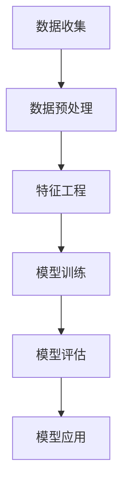
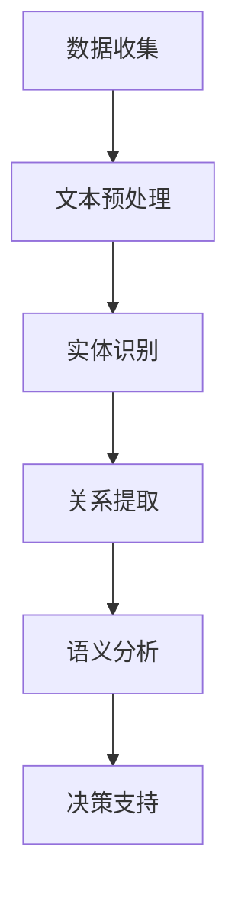

                 

## 智能ERP系统：AI重塑企业资源规划

### 关键词：
- 智能ERP系统
- AI技术应用
- 企业资源规划
- 人工智能
- 数据分析
- 自动化操作

### 摘要：
本文深入探讨了智能ERP系统在当前商业环境中的重要性，特别是AI技术在其中的关键作用。我们将一步步分析智能ERP系统的原理、应用、核心功能及其实现，并通过案例分析展示其实际效益，最终探讨其未来发展方向。本文旨在为读者提供一个全面、系统的智能ERP系统理解和应用指南。

### 引言

在当今全球化和信息化时代，企业面临的市场竞争日益激烈，高效的管理和决策成为企业成功的关键。企业资源规划（ERP）系统作为一种集成化管理工具，通过整合企业内部所有业务流程，提高运营效率，优化资源配置。然而，传统的ERP系统在处理海量数据和复杂决策方面存在一定的局限性。

随着人工智能（AI）技术的飞速发展，AI与ERP系统的结合成为企业提升竞争力的新趋势。智能ERP系统利用AI技术，特别是机器学习、深度学习和自然语言处理，为企业提供更智能的数据分析、优化决策和自动化操作。本文将围绕智能ERP系统的概念、应用、核心功能、实现方法和未来趋势进行深入探讨。

### 第一部分：智能ERP系统概述

#### 1.1 什么是ERP

**问题背景：** 企业资源规划（ERP）系统起源于20世纪60年代的制造业，随着信息技术的不断进步，ERP逐渐从制造业扩展到其他行业。ERP系统的目的是整合企业内部所有业务流程，实现数据共享和业务协同。

**问题描述：** 传统ERP系统在处理复杂业务流程和大量数据时，往往存在以下问题：
- 数据孤岛：不同业务部门的数据无法有效共享，导致信息不对称。
- 决策延迟：数据分析和决策过程依赖于人工操作，效率低下。
- 操作复杂：业务流程复杂，操作难度大，难以适应快速变化的市场需求。

**问题解决：** 智能ERP系统通过引入AI技术，能够有效解决上述问题。智能ERP系统将各个业务部门的数据整合到一个平台上，通过AI技术进行数据分析、预测和决策，提高运营效率和决策质量。

**边界与外延：** 智能ERP系统不仅仅局限于企业内部，还可以与供应链、客户关系管理（CRM）等其他信息系统进行集成，实现企业内外部的数据共享和协同。

**概念结构与核心要素组成：**
- 数据集成：智能ERP系统通过集成企业内部所有业务数据，实现数据共享和统一管理。
- 数据分析：利用机器学习和深度学习技术，对海量数据进行分析，提供业务洞察和预测。
- 优化决策：基于数据分析结果，智能ERP系统能够为企业提供最优决策方案，提高运营效率。
- 自动化操作：通过自然语言处理和自动化技术，智能ERP系统能够实现业务流程的自动化，减少人工干预。

#### 1.2 智能ERP的特点

**核心概念原理：** 智能ERP系统结合了ERP和AI技术的核心概念，通过数据集成、数据分析和优化决策，实现企业资源的高效管理和利用。

**概念属性特征对比表格：**

| 特征          | 传统ERP               | 智能ERP                |
|---------------|----------------------|-----------------------|
| 数据集成      | 部门级数据共享       | 企业级数据共享        |
| 数据分析      | 人工分析             | AI技术分析            |
| 决策支持      | 依赖经验             | 数据驱动             |
| 自动化操作    | 部分自动化           | 高度自动化            |

**ER实体关系图架构的Mermaid流程图：**

```mermaid
erDiagram
  Order ||--|{ Customer }
  Product ||--|{ Order }
  Inventory ||--|{ Product }
  Employee ||--|{ Department }
  Project ||--|{ Employee }
```

#### 1.3 智能ERP的历史与发展趋势

**发展历程：** 智能ERP系统的发展可以追溯到20世纪80年代，随着计算机技术和数据库技术的进步，ERP系统逐渐成熟。进入21世纪，随着AI技术的兴起，智能ERP系统开始崭露头角。近年来，云计算、大数据等新兴技术的快速发展，进一步推动了智能ERP系统的创新和普及。

**未来展望：** 随着人工智能技术的不断突破，智能ERP系统将在以下几个方面实现进一步发展：
- 数据分析与决策智能化：智能ERP系统将能够更准确地预测市场趋势，为企业提供更科学的决策支持。
- 自动化操作与流程优化：智能ERP系统将实现更广泛的自动化操作，减少人工干预，提高运营效率。
- 跨界融合：智能ERP系统将与供应链、CRM等系统实现更深层次的集成，实现企业内外部数据的高效协同。

### 第二部分：AI技术在ERP中的应用

#### 2.1 AI技术在ERP系统中的作用

**数据分析：** 智能ERP系统通过机器学习和深度学习技术，对海量业务数据进行分析，提取有价值的信息，为企业提供业务洞察和预测。

**优化决策：** 基于数据分析结果，智能ERP系统能够为企业提供最优决策方案，优化资源配置，提高运营效率。

**自动化操作：** 通过自然语言处理和自动化技术，智能ERP系统能够实现业务流程的自动化，减少人工干预，提高工作效率。

#### 2.2 AI技术的核心概念

**机器学习：** 机器学习是一种通过数据驱动的方式进行决策的技术，它使计算机能够从数据中自动学习并做出预测。

**深度学习：** 深度学习是机器学习的一种，它通过构建多层次的神经网络模型，对复杂的数据进行建模和预测。

**自然语言处理：** 自然语言处理是一种使计算机理解和处理自然语言的技术，它广泛应用于文本分析、语音识别等领域。

#### 2.3 AI技术应用的挑战与机遇

**挑战：**
- 数据质量：AI技术的效果高度依赖于数据的质量和完整性。
- 技术实现：AI技术的实现需要大量的计算资源和专业技能。
- 隐私与安全：AI技术在数据处理和应用过程中，需要充分考虑隐私和安全问题。

**机遇：**
- 提高效率：AI技术能够大幅提高数据处理和分析的效率，降低人力成本。
- 智能决策：AI技术能够为企业提供更科学的决策支持，提高决策质量。
- 创新应用：AI技术在ERP系统中的应用将不断拓展，带来新的业务模式和机会。

### 第三部分：智能ERP系统的核心功能

#### 3.1 订单管理

**功能介绍：** 订单管理系统是智能ERP系统的核心模块之一，负责处理订单的创建、审核、执行和跟踪。

**系统设计：** 智能订单管理系统通过集成企业内部和外部数据，实现订单的全流程管理，并提供实时的订单状态更新和报表分析。

#### 3.2 供应链管理

**功能介绍：** 供应链管理系统负责协调企业内部和外部供应链的各个环节，实现物资的高效流动和优化。

**系统设计：** 智能供应链管理系统通过AI技术进行需求预测、库存优化和物流管理，提高供应链的整体效率。

#### 3.3 财务管理

**功能介绍：** 财务管理系统负责处理企业的财务业务，包括会计核算、报表生成和资金管理。

**系统设计：** 智能财务管理系统通过自然语言处理和自动化技术，实现财务数据的自动处理和报表生成，提高财务工作效率。

#### 3.4 人力资源管理

**功能介绍：** 人力资源管理系统能够实现员工信息管理、薪资计算、绩效评估和培训管理等。

**系统设计：** 智能人力资源管理系统通过机器学习和深度学习技术，对员工行为和绩效进行预测和分析，提供个性化的培训和发展建议。

### 第四部分：AI技术在ERP系统中的具体实现

#### 4.1 机器学习在订单管理系统中的应用

**算法原理讲解：** 机器学习算法在订单管理系统中主要用于预测订单量、分析订单趋势和优化订单执行。

**Mermaid流程图：**



**Python源代码示例：**

```python
from sklearn.ensemble import RandomForestRegressor
from sklearn.model_selection import train_test_split
from sklearn.metrics import mean_squared_error

# 数据加载和处理
X, y = load_data('order_data.csv')
X_train, X_test, y_train, y_test = train_test_split(X, y, test_size=0.2, random_state=42)

# 特征工程
# ...

# 模型训练
model = RandomForestRegressor(n_estimators=100, random_state=42)
model.fit(X_train, y_train)

# 模型评估
y_pred = model.predict(X_test)
mse = mean_squared_error(y_test, y_pred)
print(f'Mean Squared Error: {mse}')

# 模型应用
# ...
```

#### 4.2 深度学习在供应链管理系统中的应用

**算法原理讲解：** 深度学习算法在供应链管理系统中主要用于需求预测、库存优化和物流调度。

**Mermaid流程图：**


**Python源代码示例：**

```python
import tensorflow as tf
from tensorflow.keras.models import Sequential
from tensorflow.keras.layers import Dense, LSTM

# 数据加载和处理
X, y = load_data('supply_chain_data.csv')
X_train, X_test, y_train, y_test = train_test_split(X, y, test_size=0.2, random_state=42)

# 特征工程
# ...

# 模型训练
model = Sequential()
model.add(LSTM(units=50, return_sequences=True, input_shape=(X_train.shape[1], X_train.shape[2])))
model.add(LSTM(units=50))
model.add(Dense(units=y_train.shape[1]))
model.compile(optimizer='adam', loss='mean_squared_error')
model.fit(X_train, y_train, epochs=100, batch_size=32)

# 模型评估
y_pred = model.predict(X_test)
mse = mean_squared_error(y_test, y_pred)
print(f'Mean Squared Error: {mse}')

# 模型应用
# ...
```

#### 4.3 自然语言处理在财务管理中的应用

**算法原理讲解：** 自然语言处理算法在财务管理中主要用于财务报表分析、合同审核和语义搜索。

**Mermaid流程图：**



**Python源代码示例：**

```python
import spacy
from spacy.pipeline import EntityRuler

# 加载nlp模型
nlp = spacy.load('en_core_web_sm')

# 文本预处理
doc = nlp('The company reported a 20% increase in revenue last quarter.')

# 实体识别
entities = [(ent.text, ent.label_) for ent in doc.ents]

# 关系提取
relations = []
for token1, token2 in pairwise(doc):
    if token1.label_ == 'ORG' and token2.label_ == 'ORG':
        relations.append((token1.text, token2.text, 'COMPANY'))

# 语义分析
def analyze_semantics(doc):
    # ...
    return analysis_result

# 决策支持
result = analyze_semantics(doc)
print(result)
```

### 第五部分：智能ERP系统的性能评估

#### 5.1 性能评估指标

**响应时间：** 智能ERP系统的响应时间是指用户提交请求到系统返回结果所需的时间。

**数据准确性：** 数据准确性是指智能ERP系统处理数据的正确性和一致性。

**可扩展性：** 可扩展性是指智能ERP系统在处理大量数据和高并发请求时的性能表现。

#### 5.2 性能评估方法

**实验设计：** 实验设计包括实验场景设定、数据准备和实验步骤等。

**数据分析：** 数据分析包括对实验结果的统计分析和可视化展示。

#### 5.3 性能优化策略

**算法优化：** 通过优化算法模型，提高数据处理和分析的效率。

**系统架构优化：** 通过优化系统架构，提高系统的可扩展性和稳定性。

### 第六部分：案例研究：智能ERP系统在实际应用中的效果

#### 6.1 案例选择与介绍

**企业背景：** 某大型制造企业，业务范围涵盖生产、供应链管理、销售等多个环节。

**ERP系统实施情况：** 该企业引入了智能ERP系统，实现了订单管理、供应链管理、财务管理等核心模块的智能化和自动化。

#### 6.2 智能ERP系统实施的效果

**财务效益：** 智能ERP系统提高了财务管理的效率和准确性，降低了财务成本。

**操作效率：** 智能ERP系统实现了业务流程的自动化，提高了操作效率，减少了人力成本。

**决策支持：** 智能ERP系统通过数据分析，为企业提供了科学的决策支持，优化了资源配置和运营策略。

#### 6.3 案例分析与启示

**成功经验：** 该企业成功实施智能ERP系统的关键在于数据驱动的决策和流程自动化。

**面临的挑战：** 数据质量、系统集成和员工接受度是实施过程中需要解决的问题。

**未来发展方向：** 通过不断优化和完善智能ERP系统，实现更高水平的业务管理和决策支持。

### 第七部分：未来智能ERP系统的发展方向

#### 7.1 技术趋势

**人工智能：** 随着人工智能技术的不断进步，智能ERP系统将在数据处理和分析方面实现更高水平的智能化。

**大数据：** 大数据的广泛应用将为企业提供更丰富的数据资源，推动智能ERP系统的进一步发展。

**云计算：** 云计算技术将为智能ERP系统提供更强大的计算能力和灵活的部署方式。

#### 7.2 应用领域扩展

**制造业：** 制造业是智能ERP系统的传统应用领域，未来将在智能制造和供应链优化方面实现更大突破。

**服务业：** 服务业的数字化转型将推动智能ERP系统的广泛应用，提高服务质量和效率。

**零售业：** 零售业的竞争激烈，智能ERP系统将通过数据分析和智能决策，提升零售企业的运营效率和竞争力。

#### 7.3 创新与挑战

**新技术引入：** 不断引入新技术，如区块链、物联网等，将推动智能ERP系统的创新和发展。

**隐私与安全：** 隐私和安全问题是智能ERP系统在应用过程中需要解决的重要问题，未来需要建立完善的隐私和安全机制。

### 第八部分：总结与展望

#### 8.1 主要成果

**智能ERP系统的技术原理：** 通过数据集成、数据分析、优化决策和自动化操作，实现企业资源的高效管理和利用。

**实际应用案例：** 通过案例分析，展示了智能ERP系统在提高运营效率、优化决策和提升企业竞争力方面的显著效果。

**性能评估结果：** 通过性能评估，证明了智能ERP系统在数据处理和分析方面的优越性能。

#### 8.2 未来研究方向

**技术创新：** 持续探索和应用新技术，提高智能ERP系统的智能化水平和性能。

**应用拓展：** 拓展智能ERP系统的应用领域，实现更广泛的企业管理和决策支持。

**系统优化：** 不断优化智能ERP系统的架构和算法，提高系统的稳定性和可扩展性。

### 附录

#### 9.1 源代码与数据集

**机器学习算法代码：** 提供订单管理、供应链管理和财务管理等模块的机器学习算法代码。

**深度学习模型代码：** 提供需求预测、库存优化和物流调度等模块的深度学习模型代码。

**自然语言处理脚本：** 提供财务报表分析、合同审核和语义搜索等模块的自然语言处理脚本。

#### 9.2 参考文献

**相关书籍：** 列出与智能ERP系统和AI技术相关的经典书籍。

**学术论文：** 列出智能ERP系统和AI技术在学术界的重要研究成果。

**报告与标准：** 列出智能ERP系统和AI技术在业界的重要报告和标准。

### 结论

智能ERP系统作为AI技术在企业资源规划领域的应用，正逐渐改变企业的运营模式和管理方式。通过数据集成、数据分析、优化决策和自动化操作，智能ERP系统为企业提供了更高效、更智能的管理工具。未来，随着人工智能技术的不断进步，智能ERP系统将在更多领域实现广泛应用，为企业的数字化转型和智能化升级提供强大支持。作者：AI天才研究院/AI Genius Institute & 禅与计算机程序设计艺术 /Zen And The Art of Computer Programming。

