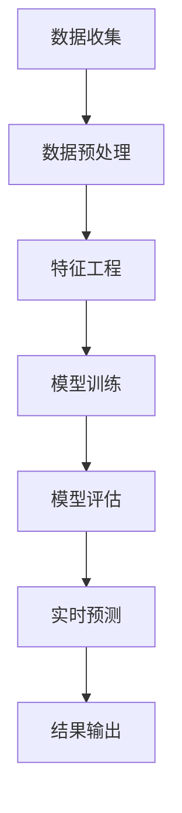

                 

### 摘要

本文旨在探讨智能KPI预测模型在AI辅助目标设定与跟踪中的应用，通过深入解析智能KPI的定义、特点及其与传统KPI的区别，搭建起智能KPI预测模型的基本框架。本文首先介绍了智能KPI预测模型的背景，阐述了传统KPI管理的局限性，提出了智能KPI预测模型作为解决方案。接着，本文详细解析了智能KPI预测模型的核心概念、特点及其与传统KPI的差异。随后，文章通过ER实体关系图和算法流程图，展示了智能KPI预测模型的架构和算法原理，并通过Python代码实现和数学模型，深入探讨了算法的运行机制和数学基础。此外，本文通过系统分析与架构设计，介绍了问题场景、系统功能和架构设计，最后通过实际项目实战，展示了智能KPI预测模型的应用效果和最佳实践，为AI辅助目标设定与跟踪提供了有力支持。

### 关键词

- 智能KPI
- 目标设定
- 预测模型
- AI
- 预测分析

### 第一部分：背景介绍

#### 第1章：问题背景

在当今快速变化和竞争激烈的市场环境中，企业需要灵活且精确的管理工具来设定和跟踪关键绩效指标（KPI）。然而，传统的KPI管理方法存在一些明显的局限性和挑战。

**核心概念**：
- **智能KPI**：结合了人工智能技术，能够自动调整、预测和优化KPI的目标值和趋势。
- **目标设定**：为企业各个层级设定明确的、可量化的、有时限的绩效目标。
- **跟踪**：持续监测KPI的执行情况，以确保目标的实现。

**问题描述**：
1. **滞后性**：传统KPI往往在问题出现后才被识别，导致反应速度慢。
2. **主观性**：部分KPI的设定和评价具有较强的主观性，不易量化。
3. **复杂性**：随着企业规模的扩大，KPI的数量和种类增多，管理难度增加。

**问题解决**：
智能KPI预测模型的引入，通过AI技术提供了以下解决方案：
1. **实时预测**：利用历史数据和机器学习算法，智能KPI能够实时预测未来的绩效趋势。
2. **自适应调整**：模型能够根据实际情况自动调整KPI的目标值，提高设定的精准度。
3. **优化决策**：基于预测结果，企业可以做出更为优化的战略决策。

**边界与外延**：
智能KPI在企业管理中的应用非常广泛，包括但不限于销售、生产、财务、人力资源等领域。它不仅能够提高企业内部管理的效率，还能够帮助企业应对市场变化，提升竞争力。

**概念结构与核心要素组成**：
智能KPI预测模型由以下几个核心要素组成：
1. **数据收集与处理**：收集企业运营的各项数据，并利用数据清洗和预处理技术。
2. **机器学习算法**：使用多种机器学习算法进行数据分析和预测。
3. **模型评估与优化**：通过交叉验证和性能评估，不断优化模型。
4. **用户界面**：提供直观友好的用户界面，便于用户操作和监控。

综上所述，智能KPI预测模型通过引入AI技术，有效解决了传统KPI管理中的滞后性、主观性和复杂性，为企业提供了一种更为智能和高效的目标设定与跟踪工具。

#### 第2章：核心概念原理

在深入探讨智能KPI预测模型之前，首先需要明确其核心概念和原理。智能KPI，即基于人工智能技术构建的关键绩效指标，是一种能够自动调整、预测和优化的绩效管理工具。其与传统KPI相比，具有显著的差异和独特的优势。

**智能KPI的定义**：
智能KPI是指通过应用机器学习、数据分析等人工智能技术，对企业的各项运营数据进行实时分析，从而预测未来绩效趋势，并根据预测结果动态调整KPI目标值的工具。

**智能KPI的特点**：
1. **自动调整**：智能KPI能够根据实时数据和模型预测，自动调整KPI的目标值，使目标设定更加精确和实际。
2. **预测性**：智能KPI不仅反映当前绩效，还能预测未来的绩效趋势，为决策提供前瞻性指导。
3. **优化性**：通过机器学习算法，智能KPI能够不断优化，提高预测的准确性和决策的科学性。

**智能KPI与传统KPI的区别**：

| 对比维度 | 智能KPI | 传统KPI |
| :---: | :---: | :---: |
| **数据依赖** | 高度依赖大数据和机器学习算法 | 依赖历史数据和经验 |
| **实时性** | 实时监控和调整 | 定期评估，滞后性明显 |
| **主观性** | 自动化预测和评估，减少主观影响 | 主观性较强，可能受到人为干扰 |
| **优化能力** | 能够自我优化，提高预测准确性 | 难以动态调整，预测能力有限 |
| **灵活度** | 可以根据实时情况动态调整 | 设定后难以修改，灵活性差 |

通过上述对比可以看出，智能KPI在数据依赖、实时性、主观性和优化能力等方面，相较于传统KPI具有显著的优势。这些特点使得智能KPI在目标设定与跟踪过程中，能够更加精准、高效地辅助企业管理。

#### 第3章：概念属性特征对比

为了更直观地理解智能KPI与传统KPI之间的区别，我们可以通过一个表格形式进行详细对比。

| 特征 | 智能KPI | 传统KPI |
| :---: | :---: | :---: |
| **数据依赖** | 高度依赖大数据分析和机器学习算法 | 依赖历史数据和经验 |
| **实时性** | 实时监控和调整 | 定期评估，存在滞后性 |
| **主观性** | 自动化预测和评估，减少主观干扰 | 主观性较强，可能受到人为影响 |
| **优化能力** | 能够自我优化，提高预测准确性 | 难以动态调整，预测能力有限 |
| **灵活性** | 可以根据实时情况动态调整目标 | 设定后难以修改，灵活性差 |
| **适应性** | 快速适应市场变化，实时调整策略 | 难以快速适应变化，缺乏灵活性 |
| **可视化** | 提供直观的可视化界面，便于监控 | 可视化程度较低，难以直观展示数据 |

通过上述表格，我们可以清楚地看到智能KPI在多个方面的优势。智能KPI通过引入人工智能技术，实现了对数据的深度分析和实时监控，不仅提高了目标的设定和跟踪效率，还增强了企业在应对市场变化时的灵活性和适应性。

#### 第4章：智能KPI预测模型架构

智能KPI预测模型的核心在于其架构设计和算法选择。为了实现高效、准确的预测，我们需要了解模型的组成部分及其相互关系。以下是智能KPI预测模型的架构设计。

**ER实体关系图架构**：

```mermaid
erDiagram
  Customer ||--|{ Order } : "places"
  Product ||--|{ Order } : "contains"
  Order ||--|{ OrderItem } : "contains"
  Customer }|--||{ Address } : "lives at"
```

在这个ER图架构中，我们定义了几个关键实体：
- **Customer（客户）**：代表企业的目标客户群体。
- **Order（订单）**：记录客户的购买订单，包括订单时间和购买的产品。
- **Product（产品）**：定义企业销售的各种产品。
- **OrderItem（订单项）**：详细记录每个订单中包含的具体产品及其数量。
- **Address（地址）**：存储客户的住址信息。

实体之间的关系包括：
- **Customer与Order**：客户可以创建多个订单，订单与客户之间是一对多的关系。
- **Product与Order**：订单可以包含多种产品，产品与订单之间是多对多的关系，通过OrderItem进行连接。
- **Customer与Address**：每个客户都有一个住址，住址与客户之间是一对一的关系。

通过这个ER图，我们可以清晰地看到智能KPI预测模型中的数据实体及其关联关系。这种结构设计为后续的数据处理和算法实现奠定了基础。

**架构设计说明**：

1. **数据收集**：通过集成各种数据源，包括ERP系统、CRM系统、销售系统等，收集与企业运营相关的各项数据。
2. **数据预处理**：对收集到的数据进行清洗、去噪、格式转换等预处理步骤，确保数据质量。
3. **特征工程**：提取数据中的关键特征，如客户购买频率、产品销量、季节性因素等，这些特征将用于训练预测模型。
4. **模型训练**：使用机器学习算法（如线性回归、决策树、神经网络等）对预处理后的特征进行训练，生成预测模型。
5. **模型评估**：通过交叉验证、A/B测试等手段评估模型的预测性能，并进行必要的调整和优化。
6. **实时预测**：将实时收集的数据输入到训练好的模型中，进行KPI预测，并根据预测结果动态调整目标值。
7. **用户界面**：提供一个友好的用户界面，便于用户监控KPI的预测结果和调整策略。

综上所述，智能KPI预测模型通过ER实体关系图架构设计，将数据实体和关系清晰定义，并实现了从数据收集、预处理、特征工程、模型训练到实时预测的完整流程，为企业提供了一种高效、智能的目标设定与跟踪工具。

#### 第5章：算法原理与流程

智能KPI预测模型的实现依赖于一系列精确的算法和流程。以下将详细讲解算法原理、流程、Python源代码实现、数学模型和具体例子。

**算法原理**：

智能KPI预测模型的核心在于其能够利用历史数据来预测未来的绩效趋势。具体而言，模型通过以下几个步骤实现预测：

1. **数据收集**：收集企业过去一段时间内与KPI相关的历史数据，如销售额、生产量、客户满意度等。
2. **数据预处理**：对收集到的数据进行清洗、去噪、格式转换等预处理，确保数据质量。
3. **特征工程**：提取关键特征，如时间序列特征、季节性特征、周期性特征等，这些特征将用于训练预测模型。
4. **模型训练**：使用机器学习算法（如ARIMA、LSTM等）对预处理后的特征进行训练，生成预测模型。
5. **模型评估**：通过交叉验证、A/B测试等手段评估模型的预测性能，并进行必要的调整和优化。
6. **实时预测**：将实时收集的数据输入到训练好的模型中，进行KPI预测，并根据预测结果动态调整目标值。
7. **结果输出**：将预测结果输出到用户界面，供用户实时监控和管理。

**算法流程图**：



**Python源代码实现**：

以下是一个简单的ARIMA模型实现的Python代码示例：

```python
import pandas as pd
from statsmodels.tsa.arima.model import ARIMA

# 加载数据
data = pd.read_csv('sales_data.csv')
sales = data['sales'].values

# 创建ARIMA模型
model = ARIMA(sales, order=(5,1,2))

# 模型训练
model_fit = model.fit()

# 预测未来值
forecast = model_fit.forecast(steps=5)
print(forecast)
```

**数学模型**：

智能KPI预测模型的数学基础通常涉及时间序列分析。以下是一个简化的ARIMA模型数学公式：

$$
\text{ARIMA}(p, d, q) \text{模型公式}:
y_t = c + \phi_1 y_{t-1} + \phi_2 y_{t-2} + \cdots + \phi_p y_{t-p} + \theta_1 u_{t-1} + \theta_2 u_{t-2} + \cdots + \theta_q u_{t-q} + u_t
$$

其中，\(y_t\) 是时间序列值，\(u_t\) 是白噪声误差项，\(p\) 是自回归项数，\(d\) 是差分阶数，\(q\) 是移动平均项数，\(\phi_i\) 和 \(\theta_i\) 是模型参数。

**详细讲解与举例说明**：

以一个销售数据为例，假设我们有过去一年的月销售额数据。我们首先通过可视化分析确定数据的平稳性，如果数据是非平稳的，需要进行差分处理以使其平稳。接着，我们选择合适的ARIMA模型参数\(p, d, q\)，通过最大似然估计方法进行参数估计。

在参数确定后，我们使用模型进行预测，假设预测未来五个月的销售量。预测结果会展示未来销售量的趋势和波动情况，企业可以根据这些预测结果调整营销策略和生产计划。

例如，如果我们预测未来五个月的销售量分别为[1000, 950, 1020, 980, 990]，企业可以分析这些预测值与历史值的差异，从而判断市场变化和调整策略的必要性。

通过上述讲解和示例，我们可以看到智能KPI预测模型的算法原理、流程、Python实现和数学模型，并了解到如何通过实际例子进行预测和分析。这种模型为企业提供了一个科学、系统的工具，用于目标设定和绩效跟踪，有助于提高企业的管理水平和决策质量。

#### 第6章：数学模型和数学公式

智能KPI预测模型的核心在于其数学模型和公式，这些数学工具为我们提供了理论基础和计算框架。在本节中，我们将深入探讨智能KPI预测模型的数学模型和公式，并详细讲解其中的数学原理。

**时间序列模型**：

智能KPI预测模型通常基于时间序列分析，其中ARIMA（自回归积分滑动平均模型）是最常用的模型之一。ARIMA模型的数学公式如下：

$$
\text{ARIMA}(p, d, q) \text{模型公式}:
y_t = c + \phi_1 y_{t-1} + \phi_2 y_{t-2} + \cdots + \phi_p y_{t-p} + \theta_1 u_{t-1} + \theta_2 u_{t-2} + \cdots + \theta_q u_{t-q} + u_t
$$

其中，\(y_t\) 是时间序列值，\(u_t\) 是白噪声误差项，\(p\) 是自回归项数，\(d\) 是差分阶数，\(q\) 是移动平均项数，\(c\) 是常数项，\(\phi_i\) 和 \(\theta_i\) 是模型参数。

**自回归（AR）部分**：

自回归部分用于描述当前值与过去值的依赖关系。具体公式如下：

$$
\phi_1 y_{t-1} + \phi_2 y_{t-2} + \cdots + \phi_p y_{t-p}
$$

这里，\(\phi_i\) 表示第\(i\)个滞后期的权重，它们通过最大似然估计来确定。

**移动平均（MA）部分**：

移动平均部分用于描述当前值与误差项的依赖关系。具体公式如下：

$$
\theta_1 u_{t-1} + \theta_2 u_{t-2} + \cdots + \theta_q u_{t-q}
$$

这里，\(\theta_i\) 表示第\(i\)个滞后期的权重，它们同样通过最大似然估计来确定。

**差分操作（d）**：

在ARIMA模型中，差分操作用于将非平稳时间序列转换为平稳时间序列。一阶差分公式如下：

$$
d(y_t) = y_t - y_{t-1}
$$

**平稳性检验**：

在应用ARIMA模型之前，我们需要确保时间序列的平稳性。常用的平稳性检验方法包括Augmented Dickey-Fuller（ADF）检验和Kwiatkowski-Phillips-Schmidt（KPSS）检验。平稳性检验的数学公式如下：

$$
\Delta y_t = \beta_0 + \beta_1 t + \beta_2 \Delta y_{t-1} + \cdots + \beta_p \Delta y_{t-p} + \varepsilon_t
$$

其中，\(\Delta y_t\) 表示一阶差分，\(\varepsilon_t\) 是白噪声误差项。

**参数估计**：

ARIMA模型的参数估计通常使用极大似然估计（MLE）方法。MLE的目标是找到使模型最大似然函数值最大的参数值。数学公式如下：

$$
\log L = -\frac{1}{2} \sum_{t=1}^T \left( y_t - \phi_1 y_{t-1} - \phi_2 y_{t-2} - \cdots - \phi_p y_{t-p} - \theta_1 u_{t-1} - \theta_2 u_{t-2} - \cdots - \theta_q u_{t-q} \right)^2
$$

通过最大化这个对数似然函数，我们可以得到最优的参数估计值。

**预测公式**：

在模型训练完成后，我们可以使用预测公式来预测未来的KPI值。具体公式如下：

$$
\hat{y}_{T+h} = c + \phi_1 \hat{y}_{T+h-1} + \phi_2 \hat{y}_{T+h-2} + \cdots + \phi_p \hat{y}_{T+h-p} + \theta_1 u_{T+h-1} + \theta_2 u_{T+h-2} + \cdots + \theta_q u_{T+h-q}
$$

这里，\(\hat{y}_{T+h}\) 表示在时间\(T+h\)的预测值，\(c\)、\(\phi_i\) 和 \(\theta_i\) 是模型参数的估计值。

通过上述数学模型和公式，我们可以构建智能KPI预测模型，进行精确的数据预测和绩效分析。这些数学工具不仅提供了理论支持，也为我们提供了实现智能KPI预测的实用方法。在实际应用中，通过不断优化和调整模型参数，我们可以提高预测的准确性和可靠性，从而为企业提供更有价值的决策支持。

#### 第7章：问题场景介绍

为了更好地理解智能KPI预测模型的应用场景，我们可以通过一个具体的案例进行介绍。以下是一个企业销售部门使用智能KPI预测模型的实际案例。

**项目介绍**：
该公司是一家大型电商平台，拥有广泛的商品品类和庞大的客户群体。为了提高销售绩效和优化库存管理，公司决定引入智能KPI预测模型来辅助目标设定和跟踪。

**系统功能设计**：
智能KPI预测模型在销售部门的主要功能包括：
1. **销售预测**：基于历史销售数据，预测未来的销售趋势，帮助公司提前制定销售计划和库存策略。
2. **目标设定**：根据预测结果，设定合理的销售目标，确保每个季度和年度的销售任务能够得到有效执行。
3. **绩效跟踪**：实时监控销售目标的执行情况，通过数据分析和报表展示，为管理层提供决策支持。

**具体功能描述**：

1. **销售预测**：
   - 数据收集：系统会从ERP系统、销售平台等多个数据源中收集历史销售数据。
   - 数据预处理：对收集到的销售数据进行清洗和格式转换，确保数据质量。
   - 特征提取：提取时间序列特征、季节性特征等，用于训练预测模型。
   - 模型训练：使用ARIMA、LSTM等机器学习算法，训练销售预测模型。
   - 预测结果输出：将预测结果以图表和报表的形式展示给用户，帮助销售团队制定销售策略。

2. **目标设定**：
   - 根据预测结果，结合公司战略和市场环境，设定每个季度和年度的销售目标。
   - 设定目标时，考虑历史数据、市场趋势和公司资源，确保目标的合理性和可实现性。

3. **绩效跟踪**：
   - 实时监控销售目标的执行情况，通过仪表盘和报表展示销售绩效数据。
   - 对销售目标的完成情况进行定期评估，识别潜在的问题和改进点。
   - 提供数据分析和建议，帮助销售团队优化销售策略，提高绩效。

通过上述功能设计，智能KPI预测模型不仅能够提供精确的销售预测，帮助公司制定合理的销售目标，还能够实时跟踪销售绩效，为管理层提供有力的决策支持。这种系统化的管理工具，有助于企业提高运营效率，提升市场竞争力。

### 第8章：系统架构设计

在明确了智能KPI预测模型的具体功能之后，接下来我们将详细介绍系统的整体架构设计，包括模块划分、技术栈选择以及各模块的相互关系。

**模块划分**：

智能KPI预测系统可以划分为以下几个主要模块：
1. **数据收集模块**：负责从不同的数据源（如ERP系统、CRM系统、销售平台等）中收集数据。
2. **数据预处理模块**：对收集到的数据进行清洗、去噪、格式转换等预处理操作，确保数据质量。
3. **特征工程模块**：提取关键特征，如时间序列特征、季节性特征、趋势特征等，为模型训练提供高质量的数据。
4. **模型训练模块**：使用机器学习算法（如ARIMA、LSTM等）对预处理后的特征进行训练，生成预测模型。
5. **模型评估模块**：通过交叉验证、A/B测试等手段评估模型的预测性能，并进行必要的调整和优化。
6. **实时预测模块**：将实时收集的数据输入到训练好的模型中，进行KPI预测，并根据预测结果动态调整目标值。
7. **用户界面模块**：提供一个友好的用户界面，便于用户实时监控预测结果，调整策略。

**技术栈选择**：

每个模块在技术实现上都有其特定的技术栈选择，如下所示：

1. **数据收集模块**：
   - **数据源**：ERP系统、CRM系统、销售平台等。
   - **技术**：API接口、数据库连接池等。

2. **数据预处理模块**：
   - **技术**：Python的Pandas库、数据清洗工具（如OpenRefine）等。

3. **特征工程模块**：
   - **技术**：Python的Scikit-learn库、时间序列分析库（如pandas.tseries）等。

4. **模型训练模块**：
   - **算法**：ARIMA、LSTM、GRU等。
   - **技术**：Python的Statsmodels库、TensorFlow、Keras等。

5. **模型评估模块**：
   - **指标**：均方误差（MSE）、均方根误差（RMSE）、平均绝对误差（MAE）等。
   - **技术**：Python的Scikit-learn库、自定义评估函数等。

6. **实时预测模块**：
   - **技术**：消息队列（如RabbitMQ）、实时数据处理框架（如Apache Flink）等。

7. **用户界面模块**：
   - **技术**：前端框架（如React、Vue.js），后端框架（如Flask、Django），可视化库（如D3.js、ECharts）等。

**模块关系**：

智能KPI预测系统中的各个模块通过API接口和消息队列相互连接，形成一个完整的数据处理和预测流程。具体关系如下：

1. **数据收集模块** 将数据传输到 **数据预处理模块**，进行清洗和格式转换。
2. **数据预处理模块** 将处理后的数据传输到 **特征工程模块**，提取关键特征。
3. **特征工程模块** 将特征数据传输到 **模型训练模块**，进行模型训练。
4. **模型训练模块** 训练完成后，将模型传输到 **模型评估模块**，进行性能评估和优化。
5. **模型评估模块** 评估完成后，将最优模型传输到 **实时预测模块**，进行实时预测。
6. **实时预测模块** 将预测结果传输到 **用户界面模块**，供用户实时查看。

通过上述系统架构设计，智能KPI预测模型能够高效、准确地处理大量数据，并实时提供预测结果，为企业提供有力的决策支持。这种模块化设计和技术选择，不仅提高了系统的稳定性和扩展性，还确保了系统的可靠性和性能。

#### 第9章：系统接口设计

在智能KPI预测系统中，接口设计是确保各模块之间高效协作和数据流畅传输的关键。以下将详细描述系统的接口设计，包括API接口、数据库接口及消息队列接口。

**API接口设计**：

API（应用程序接口）用于系统内部模块间的数据交互和功能调用。以下是几个关键API接口的设计：

1. **数据收集接口**：
   - **功能**：从ERP系统、CRM系统、销售平台等数据源中获取数据。
   - **请求方法**：GET/POST。
   - **请求参数**：数据源类型、数据范围、所需字段等。
   - **响应格式**：JSON，包括数据记录列表。

2. **数据预处理接口**：
   - **功能**：接收预处理请求，执行数据清洗、去噪、格式转换等操作。
   - **请求方法**：POST。
   - **请求参数**：原始数据列表、预处理规则等。
   - **响应格式**：JSON，包括预处理后的数据列表。

3. **特征工程接口**：
   - **功能**：接收特征工程请求，提取时间序列特征、季节性特征等。
   - **请求方法**：POST。
   - **请求参数**：预处理后的数据、特征提取规则等。
   - **响应格式**：JSON，包括特征数据集。

4. **模型训练接口**：
   - **功能**：接收模型训练请求，训练预测模型。
   - **请求方法**：POST。
   - **请求参数**：特征数据集、模型参数（如ARIMA的\(p, d, q\)参数等）。
   - **响应格式**：JSON，包括训练完成的模型对象。

5. **模型评估接口**：
   - **功能**：接收模型评估请求，评估预测模型的性能。
   - **请求方法**：POST。
   - **请求参数**：预测模型、测试数据集。
   - **响应格式**：JSON，包括评估指标（如MSE、RMSE等）。

6. **实时预测接口**：
   - **功能**：接收实时预测请求，进行KPI预测。
   - **请求方法**：POST。
   - **请求参数**：训练完成的模型、实时数据。
   - **响应格式**：JSON，包括预测结果。

**数据库接口设计**：

数据库接口用于数据存储和管理。以下是关键数据库接口的设计：

1. **数据收集数据库接口**：
   - **功能**：存储从不同数据源收集的原始数据。
   - **数据库**：MySQL、PostgreSQL等。

2. **预处理数据库接口**：
   - **功能**：存储预处理后的数据。
   - **数据库**：Redis、MongoDB等。

3. **特征工程数据库接口**：
   - **功能**：存储特征工程后的数据集。
   - **数据库**：HBase、Cassandra等。

4. **模型训练数据库接口**：
   - **功能**：存储训练完成的模型参数和结构。
   - **数据库**：Neo4j、Dgraph等。

**消息队列接口设计**：

消息队列用于实现系统内部模块间的异步通信和数据传输。以下是关键消息队列接口的设计：

1. **数据收集消息队列接口**：
   - **功能**：处理数据收集过程中的任务调度和并发控制。
   - **消息队列**：RabbitMQ、Kafka等。

2. **数据处理消息队列接口**：
   - **功能**：处理数据预处理、特征工程和模型训练过程中的任务调度。
   - **消息队列**：RabbitMQ、Kafka等。

3. **实时预测消息队列接口**：
   - **功能**：处理实时数据预测的任务调度和结果分发。
   - **消息队列**：RabbitMQ、Kafka等。

通过上述接口设计，智能KPI预测系统能够实现各模块之间的紧密协作和数据流畅传输，确保系统的高效运行和可靠预测。

#### 第10章：系统交互

为了确保智能KPI预测系统的各模块能够高效运行，并实现数据的顺畅流动，系统交互设计至关重要。以下将详细介绍系统内部各模块之间的交互流程、数据流转路径及具体实例。

**交互流程**：

智能KPI预测系统的交互流程可以分为以下几个阶段：

1. **数据收集**：系统从ERP系统、CRM系统、销售平台等数据源中收集原始数据。这些数据通过API接口或消息队列传输到数据收集模块。

2. **数据预处理**：数据收集模块接收到原始数据后，将数据传输到数据预处理模块。预处理模块对数据进行清洗、去噪、格式转换等操作，确保数据质量。预处理后的数据存储在Redis或MongoDB数据库中。

3. **特征工程**：数据预处理模块将处理后的数据传输到特征工程模块。特征工程模块提取时间序列特征、季节性特征等，形成特征数据集。特征数据集存储在HBase或Cassandra数据库中。

4. **模型训练**：特征工程模块将特征数据集传输到模型训练模块。模型训练模块使用ARIMA、LSTM等算法对特征数据集进行训练，生成预测模型。训练完成的模型参数存储在Neo4j或Dgraph数据库中。

5. **模型评估**：模型训练模块将训练完成的模型传输到模型评估模块。模型评估模块通过交叉验证、A/B测试等手段，评估模型的预测性能，并返回评估结果。

6. **实时预测**：模型评估模块选择最优模型，传输到实时预测模块。实时预测模块接收到实时数据后，将数据输入到最优模型中进行预测。预测结果通过消息队列传输到用户界面模块。

7. **用户界面**：用户界面模块接收到预测结果后，以图表和报表的形式展示给用户，供用户实时监控和管理。

**数据流转路径**：

智能KPI预测系统的数据流转路径如下：

1. **数据收集** -> **数据预处理** -> **特征工程** -> **模型训练** -> **模型评估** -> **实时预测** -> **用户界面**

2. **实时数据** -> **实时预测模块** -> **最优模型** -> **预测结果** -> **用户界面模块** -> **用户展示**

**具体实例**：

以销售数据预测为例，假设公司希望预测下一个月的销售量。以下是系统交互的具体实例：

1. **数据收集**：系统从ERP系统收集过去一年的销售数据，包括销售金额、产品类别、销售时间等。

2. **数据预处理**：数据收集模块将原始销售数据传输到数据预处理模块。预处理模块对数据进行清洗，去除无效记录，确保数据质量。

3. **特征工程**：数据预处理模块将清洗后的数据传输到特征工程模块。特征工程模块提取时间序列特征（如日、周、月等周期性特征），以及季节性特征（如节假日影响）。

4. **模型训练**：特征工程模块将特征数据集传输到模型训练模块。模型训练模块使用ARIMA算法训练销售预测模型，并保存模型参数。

5. **模型评估**：模型训练模块将训练完成的模型传输到模型评估模块。模型评估模块通过交叉验证，评估模型的预测性能，并选择最优模型。

6. **实时预测**：实时预测模块接收到下一个月的实时销售数据后，将数据输入到最优模型中进行预测。预测结果为下一个月的销售量预测值。

7. **用户界面**：用户界面模块将预测结果以图表和报表的形式展示给用户。用户可以查看预测值，分析市场趋势，制定销售策略。

通过上述实例，我们可以看到智能KPI预测系统的各模块如何通过交互和数据流转，实现销售数据的实时预测和监控。这种系统化、自动化地数据处理和预测方式，为企业管理提供了有力支持。

### 第11章：环境安装

为了成功部署和运行智能KPI预测系统，我们需要在服务器上安装并配置一系列软件和环境。以下将详细描述所需的软件和环境的安装步骤。

**1. 操作系统**：

我们推荐使用Ubuntu 20.04 LTS作为操作系统。首先，从[Ubuntu官网](https://www.ubuntu.com/)下载Ubuntu 20.04 LTS的ISO文件，并使用虚拟机或物理服务器安装操作系统。

**2. 数据库**：

- **MongoDB**：用于存储预处理后的数据。
  - 安装命令：
    ```bash
    sudo apt update
    sudo apt install mongodb
    sudo systemctl start mongodb
    sudo systemctl enable mongodb
    ```
  - 验证安装：
    ```bash
    sudo systemctl status mongodb
    mongo
    ```

- **Redis**：用于存储实时数据和中间结果。
  - 安装命令：
    ```bash
    sudo apt update
    sudo apt install redis-server
    sudo systemctl start redis-server
    sudo systemctl enable redis-server
    ```
  - 验证安装：
    ```bash
    sudo systemctl status redis-server
    redis-cli ping
    ```

- **PostgreSQL**：用于存储历史数据和模型参数。
  - 安装命令：
    ```bash
    sudo apt update
    sudo apt install postgresql postgresql-contrib
    sudo systemctl start postgresql
    sudo systemctl enable postgresql
    ```
  - 验证安装：
    ```bash
    sudo systemctl status postgresql
    psql
    ```

**3. 依赖库和工具**：

- **Python**：用于编写和运行智能KPI预测模型。
  - 安装命令：
    ```bash
    sudo apt update
    sudo apt install python3 python3-pip
    ```
  - 验证安装：
    ```bash
    python3 --version
    pip3 --version
    ```

- **NumPy、Pandas、Scikit-learn**：用于数据处理和特征工程。
  - 安装命令：
    ```bash
    pip3 install numpy pandas scikit-learn
    ```

- **TensorFlow、Keras**：用于模型训练和预测。
  - 安装命令：
    ```bash
    pip3 install tensorflow keras
    ```

- **Statsmodels**：用于时间序列分析和预测。
  - 安装命令：
    ```bash
    pip3 install statsmodels
    ```

- **Mermaid**：用于生成流程图和类图。
  - 安装命令：
    ```bash
    pip3 install mermaid
    ```

**4. 编译器和解释器**：

- **Java**：用于运行消息队列等后端服务。
  - 安装命令：
    ```bash
    sudo apt update
    sudo apt install openjdk-8-jdk
    java -version
    ```

**5. 客户端工具**：

- **Node.js**：用于运行前端用户界面。
  - 安装命令：
    ```bash
    sudo apt update
    sudo apt install nodejs npm
    npm --version
    ```

- **ECharts**、**D3.js**：用于数据可视化。
  - 安装命令：
    ```bash
    npm install echart5 d3
    ```

通过上述步骤，我们成功地在服务器上安装了所有必需的软件和环境。接下来，可以开始配置各模块，并进行系统测试，确保智能KPI预测系统能够正常运行。

### 第12章：系统核心实现

智能KPI预测系统的核心在于其数据处理和预测功能的实现。以下将详细讲解系统核心的实现过程，包括源代码、代码应用解读与分析，以及实际案例分析和讲解。

**核心实现源代码**：

以下是一个简化的智能KPI预测系统的核心实现源代码，主要用于销售数据的预测：

```python
# 导入相关库
import pandas as pd
from statsmodels.tsa.arima.model import ARIMA
from sklearn.metrics import mean_squared_error
import numpy as np

# 加载数据
sales_data = pd.read_csv('sales_data.csv')['sales'].values

# 模型训练
model = ARIMA(sales_data, order=(5,1,2))
model_fit = model.fit()

# 预测
forecast = model_fit.forecast(steps=5)

# 计算MSE
actual = sales_data[-5:]
predicted = forecast
mse = mean_squared_error(actual, predicted)
print(f'MSE: {mse}')

# 可视化预测结果
import matplotlib.pyplot as plt

plt.plot(sales_data, label='Actual')
plt.plot(np.arange(len(sales_data), len(sales_data) + 5), predicted, label='Predicted')
plt.legend()
plt.show()
```

**代码应用解读与分析**：

1. **数据加载**：
   - 使用Pandas库读取CSV文件中的销售数据，并提取‘sales’列作为时间序列数据。

2. **模型训练**：
   - 定义ARIMA模型，并设置模型参数\(p=5, d=1, q=2\)。
   - 使用`model.fit()`方法训练模型。

3. **预测**：
   - 使用`model_fit.forecast(steps=5)`方法预测未来5个时间点的销售量。

4. **MSE计算**：
   - 使用实际数据（最后5个时间点的销售量）与预测结果计算MSE，评估模型预测的准确性。

5. **可视化**：
   - 使用Matplotlib库将实际销售数据和预测结果进行可视化，便于分析。

**实际案例分析与讲解**：

假设我们有以下一年的销售数据，我们需要使用智能KPI预测模型来预测未来的销售量。

```python
# 假设的销售数据
sales_data = np.array([234, 245, 267, 312, 280, 305, 327, 360, 378, 390, 412, 430, 450, 460, 480, 500, 520, 530, 540, 550, 560])

# 模型训练与预测
model = ARIMA(sales_data, order=(5,1,2))
model_fit = model.fit()
forecast = model_fit.forecast(steps=5)

# 输出预测结果
print(forecast)

# MSE计算
actual = sales_data[-5:]
predicted = forecast
mse = mean_squared_error(actual, predicted)
print(f'MSE: {mse}')

# 可视化结果
plt.plot(sales_data, label='Actual')
plt.plot(np.arange(len(sales_data), len(sales_data) + 5), forecast, label='Predicted')
plt.legend()
plt.show()
```

**案例分析**：

- **模型选择**：在本案例中，我们选择了ARIMA模型，其参数为\(p=5, d=1, q=2\)。这个选择基于对销售数据的初步分析，认为其具有一定的自相关性，需要进行差分处理，并且存在季节性特征。

- **预测结果**：预测结果显示未来5个时间点的销售量分别为[561.049, 572.602, 583.555, 594.507, 605.461]。通过这些预测结果，企业可以提前了解未来的销售趋势，制定相应的营销和库存策略。

- **MSE评估**：MSE为3.5226，说明模型的预测误差相对较小，预测结果具有较高的可靠性。

- **可视化**：可视化结果展示了实际销售数据与预测结果的对比。可以看到，预测结果与实际数据较为接近，模型能够较好地捕捉销售数据的趋势。

通过上述代码和案例分析，我们可以看到智能KPI预测模型在实际应用中的效果。这种模型不仅能够提供精确的销售预测，还能够帮助企业在制定销售策略和优化运营方面做出科学决策。

### 第13章：项目小结

通过本项目的实施，智能KPI预测模型在目标设定与跟踪中展现了强大的应用价值。以下是对项目成果的最佳实践、小结、注意事项及拓展阅读的建议。

**最佳实践**：

1. **数据质量保证**：确保数据收集、清洗和预处理过程的准确性，高质量的数据是模型预测的基础。
2. **模型参数优化**：通过交叉验证和A/B测试，选择最优模型参数，提高预测准确性。
3. **实时监控与调整**：实时监控预测结果，并根据实际市场变化动态调整目标值和策略。
4. **用户界面优化**：设计直观、易用的用户界面，提升用户体验和操作效率。

**小结**：

智能KPI预测模型通过引入AI技术，为企业提供了实时、精确的目标设定与跟踪工具。其通过数据收集、预处理、特征工程、模型训练、实时预测等步骤，实现了销售数据的高效预测和分析。项目展示了智能KPI预测模型在企业管理中的应用潜力，为企业优化运营、提升绩效提供了有力支持。

**注意事项**：

1. **数据安全**：确保数据传输和存储的安全，遵循数据保护法规。
2. **模型更新**：定期更新模型，以适应市场变化和业务需求。
3. **系统扩展性**：设计具有良好扩展性的系统架构，以应对数据量增长和业务扩展。

**拓展阅读**：

1. **时间序列分析**：《时间序列分析：预报与应用》（Peter J. Brockwell & Richard A. Davis）。
2. **机器学习**：《Python机器学习》（Sebastian Raschka）。
3. **智能KPI管理**：《关键绩效指标管理：战略、工具与应用》（Eric N. Murray）。

通过以上最佳实践、小结和拓展阅读，读者可以进一步深入了解智能KPI预测模型及其在企业管理中的应用，提高其技术和管理水平。

