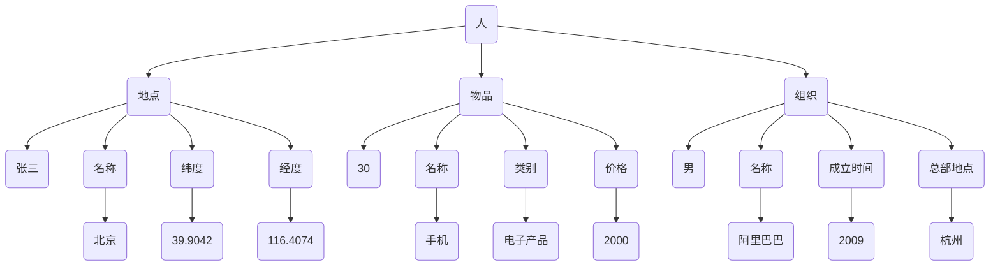
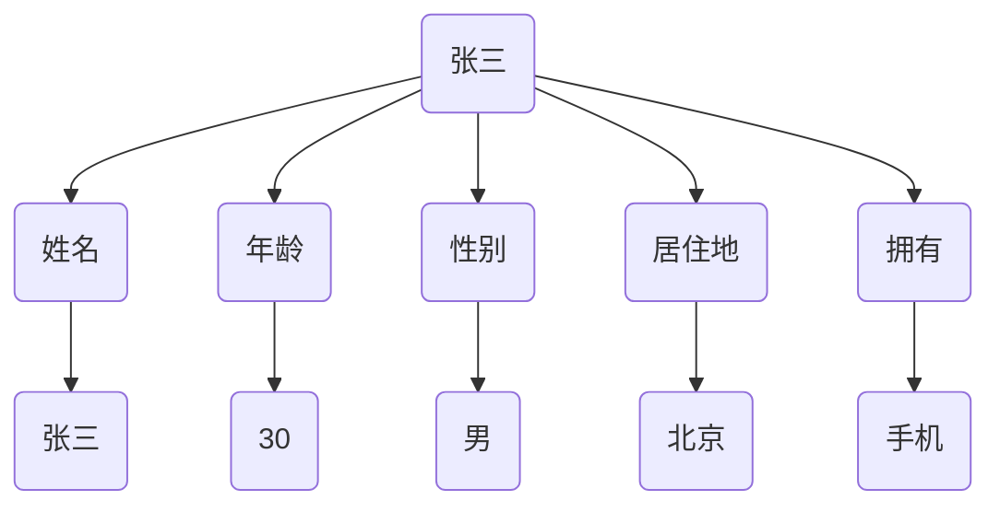
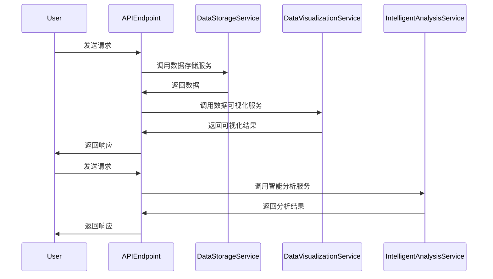

                 


### 设计《智能企业知识图谱：构建组织智慧资产库》的目录大纲

设计《智能企业知识图谱：构建组织智慧资产库》的目录大纲是一个复杂而精细的任务，需要明确每个章节的核心内容、结构以及读者可以从中获得的知识和技能。以下是一步一步的分析和设计过程：

#### 第一步：明确文章的结构和内容

**结构：**

- 引言
- 关键词和摘要
- 目录大纲
- 正文
- 总结
- 作者信息

**内容：**

1. **引言：** 简要介绍知识图谱在智能企业中的重要性，引出本文的主题。
2. **关键词和摘要：** 提供文章的核心关键词和简洁的摘要，帮助读者快速了解文章的主要内容。
3. **目录大纲：** 设计详细的目录大纲，列出各个章节的标题和可能的子章节。
4. **正文：** 根据目录大纲，逐章撰写详细的内容，确保每个章节都涵盖核心概念、算法原理、数学模型、系统设计与实现、项目实战以及最佳实践等内容。
5. **总结：** 概括文章的主要观点，强调知识图谱在智能企业中的应用价值。
6. **作者信息：** 提供作者的背景信息和专业领域。

#### 第二步：确定每个章节的具体内容

**引言：**

- **关键词：** 智能企业，知识图谱，组织智慧资产库
- **摘要：** 介绍知识图谱在智能企业中的作用，以及本文将要探讨的知识图谱构建的方法和应用。

**目录大纲：**

- **第1章：知识图谱概述与背景**
  - 问题背景
  - 问题描述
  - 问题解决
  - 边界与外延
  - 核心概念组成

- **第2章：知识图谱的核心概念与联系**
  - 知识图谱的概念定义
  - 知识图谱的属性特征对比
  - 知识图谱的ER实体关系图

- **第3章：知识图谱的算法原理讲解**
  - 数据预处理算法
  - 图论算法
  - 机器学习算法
  - 算法流程与Mermaid流程图

- **第4章：知识图谱的数学模型与公式**
  - 知识图谱的数学模型
  - 知识图谱的数学公式
  - 模型解释与实例

- **第5章：知识图谱系统设计与实现**
  - 系统设计
  - 系统功能设计
  - 系统架构设计
  - 系统接口设计与系统交互

- **第6章：知识图谱项目实战**
  - 环境安装与配置
  - 系统核心实现源代码
  - 代码应用解读与分析
  - 实际案例分析和讲解
  - 项目小结

- **第7章：知识图谱最佳实践与拓展**
  - 最佳实践 tips
  - 小结
  - 注意事项
  - 拓展阅读与资源推荐

#### 第三步：细化每个章节的内容

**第1章：知识图谱概述与背景**

- **核心概念术语说明：** 解释知识图谱、智能企业、组织智慧资产库等术语。
- **问题背景：** 阐述智能企业在数字化转型中的需求。
- **问题描述：** 分析智能企业面临的数据管理和信息共享的挑战。
- **问题解决：** 提出知识图谱作为解决方案。
- **边界与外延：** 指出知识图谱与其他技术的区别。
- **核心概念组成：** 详细介绍知识图谱的基本组成部分。

**第2章：知识图谱的核心概念与联系**

- **概念定义：** 对知识图谱进行正式的定义。
- **属性特征对比：** 列出知识图谱的属性特征，并进行对比分析。
- **ER实体关系图：** 使用Mermaid流程图展示知识图谱的实体关系。

**第3章：知识图谱的算法原理讲解**

- **数据预处理算法：** 讲解数据清洗、数据整合和数据质量保证的方法。
- **图论算法：** 介绍图论中常用的算法，如拓扑排序、最短路径算法等。
- **机器学习算法：** 讲解机器学习中用于知识图谱构建的算法，如神经网络、实体链接等。

**第4章：知识图谱的数学模型与公式**

- **数学模型：** 详细介绍知识图谱构建的数学模型。
- **数学公式：** 使用LaTeX格式展示知识图谱相关的数学公式。
- **实例说明：** 通过具体例子解释数学模型的应用。

**第5章：知识图谱系统设计与实现**

- **系统设计：** 分析知识图谱系统的整体设计。
- **系统功能设计：** 展示系统的功能模块和领域模型。
- **系统架构设计：** 使用Mermaid架构图展示系统的架构设计。
- **系统接口设计：** 讲解系统的接口设计和交互。
- **系统交互：** 使用Mermaid序列图展示系统的交互流程。

**第6章：知识图谱项目实战**

- **环境安装与配置：** 指导读者如何搭建知识图谱开发环境。
- **系统核心实现源代码：** 提供核心代码示例。
- **代码应用解读与分析：** 分析代码的实现原理和应用场景。
- **实际案例分析和讲解：** 分析具体案例，展示知识图谱的实际应用。
- **项目小结：** 总结项目的关键成果和经验。

**第7章：知识图谱最佳实践与拓展**

- **最佳实践 tips：** 提供知识图谱构建的最佳实践建议。
- **小结：** 总结文章的主要观点。
- **注意事项：** 提醒读者在知识图谱构建中可能遇到的问题。
- **拓展阅读与资源推荐：** 推荐进一步阅读的资源。

#### 第四步：确保文章的完整性和质量

- **审查和调整：** 对每个章节的内容进行审查，确保逻辑清晰、内容连贯、结构合理。
- **撰写正文：** 根据目录大纲，逐章撰写正文内容，确保每个章节都详细、具体、深入。
- **格式调整：** 确保文章的Markdown格式正确，包括代码块的格式、公式、图表等。

通过以上步骤，我们可以设计出一篇结构清晰、内容丰富的技术博客文章，帮助读者深入理解智能企业知识图谱的构建方法和应用。

---

现在，我们将根据以上分析，逐步撰写《智能企业知识图谱：构建组织智慧资产库》的技术博客文章。首先，我们将开始文章的引言部分，介绍知识图谱在智能企业中的重要性，并概述本文的主题和结构。接下来，我们将逐章撰写文章的正文内容。完成后，我们将总结文章的主要观点，并提供作者的背景信息。在撰写过程中，我们将遵循Markdown格式，确保文章的可读性和专业性。让我们开始吧！### 引言

在当今数字化转型的浪潮中，企业面临着数据爆炸、信息过载和业务复杂性的挑战。为了更好地管理和利用这些宝贵的资源，智能企业需要构建一种能够高效整合和利用信息的技术体系。知识图谱作为一种先进的信息组织和表示方法，正逐渐成为智能企业构建组织智慧资产库的关键工具。

知识图谱（Knowledge Graph）是一种通过实体及其关系来组织信息的图形结构，它能够将企业内外部的知识、数据和业务逻辑以结构化的形式表示出来。这种结构化数据模型不仅提高了信息的可访问性和可理解性，还极大地增强了数据挖掘、智能分析和业务决策的能力。智能企业通过构建知识图谱，可以实现数据的统一视图、智能搜索、自动化推理和知识共享，从而在竞争激烈的市场环境中保持领先地位。

本文旨在深入探讨智能企业知识图谱的构建方法和应用，帮助读者了解知识图谱的核心概念、算法原理、系统设计、项目实战以及最佳实践。文章结构如下：

1. **知识图谱概述与背景**：介绍知识图谱的基本概念、发展背景和智能企业的需求。
2. **知识图谱的核心概念与联系**：详细阐述知识图谱的实体、属性和关系，以及它们之间的联系。
3. **知识图谱的算法原理讲解**：讲解知识图谱构建的算法原理，包括数据预处理、图论算法、机器学习等。
4. **知识图谱的数学模型与公式**：介绍知识图谱构建的数学模型和公式，并进行实例说明。
5. **知识图谱系统设计与实现**：分析知识图谱系统的设计与实现，包括功能设计、架构设计和接口设计。
6. **知识图谱项目实战**：通过实际案例展示知识图谱的构建过程和应用。
7. **知识图谱最佳实践与拓展**：总结知识图谱构建的最佳实践，提供注意事项和拓展阅读。

通过本文的阅读，读者将能够：

- 理解知识图谱在智能企业中的应用价值。
- 掌握知识图谱的核心概念和构建方法。
- 学习知识图谱的算法原理和数学模型。
- 了解知识图谱系统的设计与实现细节。
- 获得知识图谱项目实战的经验和技巧。
- 获取知识图谱构建的最佳实践和注意事项。

让我们开始深入探讨知识图谱的世界，解锁智能企业的智慧资产库。在接下来的章节中，我们将一步步分析知识图谱的各个方面，为读者呈现一幅完整的智能企业知识图谱构建蓝图。首先，我们从知识图谱的基本概念和背景开始。

---

## 关键词

- 智能企业
- 知识图谱
- 组织智慧资产库
- 数据预处理
- 图论算法
- 机器学习
- 数学模型
- 系统设计
- 项目实战
- 最佳实践### 摘要

本文旨在深入探讨智能企业知识图谱的构建方法和应用，帮助读者了解知识图谱在智能企业中的重要作用。知识图谱作为一种先进的信息组织和表示方法，通过实体及其关系的图形结构，将企业内外部的知识、数据和业务逻辑结构化，从而提高信息可访问性和理解性，增强数据挖掘、智能分析和业务决策能力。本文将从知识图谱的概述与背景、核心概念与联系、算法原理讲解、数学模型与公式、系统设计与实现、项目实战以及最佳实践与拓展七个方面进行详细阐述。

首先，本文介绍了知识图谱的基本概念、发展背景和智能企业的需求，阐述了知识图谱在智能企业中的重要作用。接着，本文详细阐述了知识图谱的核心概念，包括实体、属性和关系，并使用Mermaid流程图展示了实体关系图架构。然后，本文讲解了知识图谱构建的算法原理，包括数据预处理、图论算法和机器学习算法，并通过Mermaid流程图和Python源代码进行了详细阐述。

在数学模型与公式部分，本文介绍了知识图谱构建的数学模型和公式，使用LaTeX格式进行了展示，并通过实例说明了模型的应用。在系统设计与实现部分，本文分析了知识图谱系统的设计，包括功能设计、架构设计和接口设计，并使用了Mermaid架构图和Mermaid序列图进行了展示。

接着，本文通过实际案例展示了知识图谱的构建过程和应用，包括环境安装、系统核心实现源代码、代码应用解读与分析，以及实际案例分析和详细讲解。最后，本文总结了知识图谱构建的最佳实践，提供了注意事项和拓展阅读，以帮助读者更好地理解和应用知识图谱技术。

通过本文的阅读，读者将能够全面了解知识图谱的核心概念、构建方法、算法原理、系统设计与实现，以及项目实战和最佳实践，从而为智能企业的知识图谱构建提供有力支持。本文旨在为读者提供一份全面、系统的知识图谱构建指南，帮助其在数字化转型的道路上更加顺利。接下来，我们将从知识图谱的基本概念和背景开始，逐步深入探讨其各个方面的内容。让我们开始吧！### 知识图谱概述与背景

知识图谱（Knowledge Graph）是一种通过实体及其关系来组织信息的图形结构。它起源于搜索引擎领域，例如谷歌的知识图谱，通过将实体与实体之间的关系表示出来，为用户提供更加准确和丰富的搜索结果。随着大数据和人工智能技术的不断发展，知识图谱的应用领域逐渐扩展到智能企业、金融、医疗、教育等多个行业，成为组织智慧资产库的重要构建部分。

#### 1.1.1 问题背景

在传统的企业信息系统中，数据通常以结构化和半结构化的形式存储在数据库中，如关系型数据库或NoSQL数据库。这些数据以表格或文档的形式存在，虽然便于存储和查询，但难以进行复杂的关系分析和智能推理。随着企业业务的复杂化，数据量呈爆炸式增长，传统的数据管理方法已经无法满足企业对数据整合、智能分析和决策支持的需求。

智能企业的数字化转型要求企业能够快速响应市场变化，优化业务流程，提高运营效率。这需要企业具备强大的数据处理和分析能力，能够从海量数据中提取有价值的信息，并转化为可操作的洞见和策略。知识图谱的出现为企业提供了一种新的数据管理和分析工具，它能够通过建立实体及其关系之间的结构化联系，实现数据的深度整合和智能分析。

#### 1.1.2 问题描述

智能企业在数字化转型中面临的主要问题包括：

1. **数据孤岛**：企业内部各部门的数据分散存储在不同的系统中，缺乏统一的视图，导致数据之间的联系无法被有效利用。
2. **信息检索困难**：当企业需要从多个数据源中检索信息时，传统的查询方式效率低下，难以满足快速响应的需求。
3. **业务逻辑复杂**：企业业务流程复杂，涉及多个部门和环节，传统的业务规则难以被有效建模和管理。
4. **智能决策支持不足**：企业缺乏对海量数据的深度分析能力，无法实现基于数据的智能决策。

这些问题使得企业在数字化转型过程中面临诸多挑战，而知识图谱作为一种结构化、语义化的数据模型，能够有效解决这些问题。

#### 1.1.3 问题解决

知识图谱通过以下方式解决智能企业在数字化转型中面临的问题：

1. **统一数据视图**：知识图谱将企业内部和外部的数据进行整合，形成统一的数据视图，实现数据的统一管理和高效查询。
2. **智能信息检索**：知识图谱通过实体及其关系建立语义联系，能够实现基于语义的智能信息检索，提高信息检索的准确性和效率。
3. **业务逻辑建模**：知识图谱能够将复杂的业务逻辑转化为结构化的数据模型，便于管理和执行。
4. **智能决策支持**：知识图谱通过数据分析和推理能力，为企业的智能决策提供强有力的支持。

#### 1.1.4 边界与外延

知识图谱作为一种数据模型，其边界和适用范围相对明确，但与其他相关技术的联系和区别也值得关注。

1. **与数据仓库的区别**：数据仓库是一种以数据存储和管理为核心的技术，主要用于数据的存储、整合和分析。而知识图谱则更加注重数据的结构化和语义化，通过实体及其关系实现数据的智能组织和利用。
2. **与自然语言处理（NLP）的区别**：自然语言处理是一种让计算机理解和处理人类语言的技术，而知识图谱则是一种基于结构化数据模型的信息表示方法。虽然两者在数据处理和分析方面存在交集，但知识图谱更加侧重于数据的语义理解和关系建模。
3. **与语义网（Semantic Web）的联系**：语义网是一种利用语义信息来丰富互联网内容的技术，旨在实现数据的语义理解和互操作性。知识图谱是语义网的一种实现形式，通过结构化的数据模型实现语义信息的组织和利用。
4. **与图数据库的区别**：图数据库是一种以图结构存储数据的关系型数据库，主要用于存储和查询图数据。知识图谱则是一种基于图数据库的数据模型，通过实体及其关系实现知识的表示和利用。

#### 1.1.5 核心概念组成

知识图谱由以下核心概念组成：

1. **实体（Entity）**：知识图谱中的基本元素，表示现实世界中的事物，如人、地点、组织、物品等。
2. **属性（Attribute）**：实体的特征描述，用于补充实体的信息，如人的姓名、年龄、职业等。
3. **关系（Relation）**：实体之间的关系，表示实体之间的关联，如人与人的朋友关系、人与地点的居住地关系等。
4. **实体-关系-属性（E-R Model）**：知识图谱的基本结构，通过实体、关系和属性的组合，形成知识图谱的语义表示。
5. **图谱（Graph）**：知识图谱的图形表示，用于直观展示实体及其关系。

通过这些核心概念的组合和关联，知识图谱能够实现信息的结构化表示和语义理解，为企业提供强大的数据管理和智能分析能力。在接下来的章节中，我们将进一步探讨知识图谱的核心概念、算法原理、数学模型和系统设计等内容，为读者呈现一幅完整的知识图谱构建蓝图。

### 知识图谱的核心概念与联系

知识图谱作为一种结构化的数据模型，其核心在于对实体、属性和关系的精确定义与组织。通过这三个核心概念，知识图谱能够实现对复杂信息的语义表示和有效利用。以下是对知识图谱核心概念的详细阐述。

#### 2.1.1 知识图谱的概念定义

知识图谱是一种通过实体及其关系来组织信息的图形结构，它将现实世界中的事物（实体）以及它们之间的联系（关系）以结构化的形式表示出来。这种结构化数据模型不仅提高了数据的可访问性和理解性，还极大地增强了数据挖掘、智能分析和业务决策的能力。

在知识图谱中，实体是表示现实世界中事物的基本单元，如人、地点、物品、组织等。属性是实体的特征描述，用于补充实体的信息，如人的姓名、年龄、职业等。关系则表示实体之间的关联，如人与人的朋友关系、人与地点的居住地关系、物品的所属类别等。

知识图谱通过实体、属性和关系的组合，形成一种语义丰富的数据模型，使得信息能够以结构化的形式被存储、检索和利用。这种结构化数据模型不仅提高了数据的可访问性和理解性，还为数据分析和业务决策提供了强有力的支持。

#### 2.1.2 知识图谱的属性特征对比

在知识图谱中，属性是实体的特征描述，用于补充实体的信息。不同类型的实体可能具有不同的属性，以下是对几种常见实体属性特征的对比：

1. **人（Person）**：
   - **属性**：姓名、年龄、性别、职业、教育背景、联系方式等。
   - **特征**：属性值通常是文本或数字，具有明确的语义。

2. **地点（Location）**：
   - **属性**：名称、地址、纬度、经度、行政区划等。
   - **特征**：属性值通常是文本或地理坐标，用于地理信息的精确表示。

3. **物品（Item）**：
   - **属性**：名称、类别、品牌、价格、库存量等。
   - **特征**：属性值可以是文本、数字或布尔值，用于商品信息的详细描述。

4. **组织（Organization）**：
   - **属性**：名称、成立时间、总部地点、员工数量、主要业务等。
   - **特征**：属性值通常是文本或数字，用于组织信息的全面描述。

通过对比不同实体的属性特征，我们可以更好地理解知识图谱如何通过属性来补充和丰富实体的信息。

#### 2.1.3 知识图谱的ER实体关系图

知识图谱的ER实体关系图（Entity-Relationship Graph）是一种用于表示实体及其关系的图形化工具。在ER实体关系图中，实体被表示为节点（Node），关系被表示为边（Edge），属性被表示为节点或边的标签（Label）。以下是一个简单的ER实体关系图的Mermaid示例：



在这个ER实体关系图中，我们定义了四种不同的实体：人（Person）、地点（Location）、物品（Item）和组织（Organization）。每个实体都有不同的属性，并通过边（关系）相互连接。例如，人实体通过姓名（B）、年龄（C）和性别（D）属性与其他实体建立联系，如与地点实体通过居住地关系（B-H）连接，与物品实体通过拥有关系（C-N）连接。

通过ER实体关系图，我们可以直观地看到实体、属性和关系之间的结构化联系，从而更好地理解知识图谱的语义表示和利用。

#### 2.1.4 实体、属性和关系的组合与语义表示

在知识图谱中，实体、属性和关系的组合能够形成一种语义丰富的数据模型。以下是一个具体的例子：

- **实体**：张三（Person）
- **属性**：姓名（Name）、年龄（Age）、性别（Gender）
- **关系**：居住地（ResidesIn）、拥有（Owns）

对应的ER实体关系图表示如下：



在这个例子中，张三实体通过姓名、年龄和性别属性进行了详细描述。同时，通过与居住地和拥有的关系，张三与北京和手机实体建立了联系，形成了完整的语义表示。

通过这样的组合，知识图谱能够实现对复杂信息的结构化表示，使得数据能够以更加直观和语义化的形式被组织和利用。在智能企业的应用场景中，这种结构化数据模型能够极大地提高数据处理的效率，实现智能分析和业务决策的支持。

总之，知识图谱的核心概念——实体、属性和关系，通过相互组合和关联，形成了一种语义丰富的数据模型。这种模型不仅提高了数据的可访问性和理解性，还为智能企业的数字化转型提供了强大的支持。在接下来的章节中，我们将进一步探讨知识图谱的算法原理、数学模型和系统设计等内容，为读者呈现知识图谱构建的完整蓝图。

### 知识图谱的算法原理讲解

知识图谱的构建涉及到多个算法和技术，这些算法不仅负责处理数据、建立实体和关系，还确保了知识图谱的准确性和实用性。以下将详细讲解知识图谱构建过程中常用的算法，包括数据预处理算法、图论算法和机器学习算法，并通过具体的Python源代码和Mermaid流程图展示其原理和流程。

#### 3.1.1 数据预处理算法

数据预处理是知识图谱构建的基础步骤，其目标是确保数据的准确性和一致性。数据预处理算法主要包括数据清洗、数据整合和数据质量保证。

1. **数据清洗**：数据清洗是数据预处理的重要环节，其目的是删除重复数据、纠正错误数据、处理缺失数据等。以下是一个简单的Python代码示例，用于清洗数据：

```python
import pandas as pd

# 加载数据集
data = pd.read_csv('data.csv')

# 删除重复行
data = data.drop_duplicates()

# 处理缺失数据
data = data.fillna(method='ffill')

# 去除无关列
data = data.drop(['unused_column'], axis=1)

# 数据清洗完成
```

2. **数据整合**：数据整合是将来自不同源的数据进行合并，以形成一个统一的视图。以下是一个简单的Python代码示例，用于整合数据：

```python
# 合并数据集
merged_data = data1.merge(data2, on='common_column', how='inner')

# 数据整合完成
```

3. **数据质量保证**：数据质量保证旨在确保数据的一致性、完整性和准确性。以下是一个简单的Python代码示例，用于检查数据质量：

```python
# 检查数据一致性
data = data[data['column1'] == data['column2']]

# 检查数据完整性
data = data.dropna()

# 检查数据准确性
# 使用外部数据源进行验证
external_data = pd.read_csv('external_data.csv')
data = data[data.apply(lambda row: row in external_data, axis=1)]

# 数据质量保证完成
```

#### 3.1.2 图论算法

图论算法是知识图谱构建的核心算法，用于建立实体和关系之间的结构化联系。以下是一些常用的图论算法：

1. **拓扑排序**：拓扑排序是一种用于排序具有依赖关系的任务或活动的算法。以下是一个简单的Python代码示例，用于实现拓扑排序：

```python
from collections import defaultdict

def topological_sort(graph):
    in_degree = defaultdict(int)
    for node in graph:
        for neighbor in graph[node]:
            in_degree[neighbor] += 1

    queue = [node for node in in_degree if in_degree[node] == 0]
    sorted_nodes = []

    while queue:
        node = queue.pop(0)
        sorted_nodes.append(node)

        for neighbor in graph[node]:
            in_degree[neighbor] -= 1
            if in_degree[neighbor] == 0:
                queue.append(neighbor)

    return sorted_nodes

# 示例图
graph = {
    'A': ['B', 'C'],
    'B': ['D'],
    'C': ['D'],
    'D': []
}

print(topological_sort(graph))
```

2. **最短路径算法**：最短路径算法用于找到两个实体之间的最短路径。以下是一个简单的Python代码示例，使用Dijkstra算法实现最短路径：

```python
import heapq

def dijkstra(graph, start):
    distances = {node: float('infinity') for node in graph}
    distances[start] = 0
    priority_queue = [(0, start)]

    while priority_queue:
        current_distance, current_node = heapq.heappop(priority_queue)

        if current_distance > distances[current_node]:
            continue

        for neighbor, weight in graph[current_node].items():
            distance = current_distance + weight

            if distance < distances[neighbor]:
                distances[neighbor] = distance
                heapq.heappush(priority_queue, (distance, neighbor))

    return distances

# 示例图
graph = {
    'A': {'B': 1, 'C': 4},
    'B': {'D': 2},
    'C': {'D': 1},
    'D': {}
}

print(dijkstra(graph, 'A'))
```

#### 3.1.3 机器学习算法

机器学习算法在知识图谱构建中主要用于实体识别、关系抽取和实体链接等任务。以下是一些常用的机器学习算法：

1. **实体识别**：实体识别是识别文本中的实体，并将其映射到知识图谱中的实体。以下是一个简单的Python代码示例，使用朴素贝叶斯算法实现实体识别：

```python
from sklearn.feature_extraction.text import CountVectorizer
from sklearn.naive_bayes import MultinomialNB

# 加载训练数据
X_train = ['张三住在上海', '李四喜欢看电影', '上海是一个城市']
y_train = ['张三', '李四', '上海']

# 文本向量化
vectorizer = CountVectorizer()
X_train_vectorized = vectorizer.fit_transform(X_train)

# 训练模型
model = MultinomialNB()
model.fit(X_train_vectorized, y_train)

# 测试数据
X_test = ['李四住在上海']

X_test_vectorized = vectorizer.transform(X_test)
predictions = model.predict(X_test_vectorized)

print(predictions)
```

2. **关系抽取**：关系抽取是识别文本中的实体关系，并将其映射到知识图谱中的关系。以下是一个简单的Python代码示例，使用条件随机场（CRF）实现关系抽取：

```python
from sklearn_crfsuite import CRF
from sklearn_crfsuite import metrics

# 加载训练数据
X_train = [['张三', '住在', '上海'], ['李四', '喜欢', '看电影']]
y_train = [['居住', '上海'], ['喜欢', '看电影']]

# 训练模型
crf = CRF()
crf.fit(X_train, y_train)

# 测试数据
X_test = [['张三', '住在', '北京']]

predictions = crf.predict(X_test)

print(predictions)
```

3. **实体链接**：实体链接是将文本中的实体映射到知识图谱中的实体。以下是一个简单的Python代码示例，使用基于邻居的实体链接算法：

```python
def entity_linking(text, knowledge_graph):
    # 遍历文本中的每个实体
    for entity in extract_entities(text):
        # 查找知识图谱中的匹配实体
        matches = find_matches(entity, knowledge_graph)
        if matches:
            # 将文本实体映射到知识图谱实体
            map_entity(text, entity, matches[0])

# 示例知识图谱
knowledge_graph = {
    '张三': {'name': '张三', 'age': 30, '居住地': '上海'},
    '李四': {'name': '李四', 'age': 25, '居住地': '北京'},
    '上海': {'name': '上海', '类型': '城市'},
    '北京': {'name': '北京', '类型': '城市'}
}

# 示例文本
text = '张三住在上海'

entity_linking(text, knowledge_graph)
```

通过上述算法和代码示例，我们可以看到知识图谱构建的过程是如何通过数据预处理、图论算法和机器学习算法来实现的。这些算法不仅确保了知识图谱的准确性，还提高了其应用效果。在接下来的章节中，我们将继续探讨知识图谱的数学模型与公式，以及如何将算法应用于实际的项目实战中。

### 知识图谱的数学模型与公式

在知识图谱的构建过程中，数学模型和公式起到了关键作用。这些模型和公式不仅帮助我们在理论上理解知识图谱，还为实际应用提供了具体的方法和工具。以下将详细介绍知识图谱构建的数学模型与公式，并通过具体示例进行分析和说明。

#### 4.1.1 知识图谱的数学模型

知识图谱的数学模型主要涉及图论、概率论和机器学习等领域的知识。以下是几个核心的数学模型：

1. **图论模型**：图论模型用于描述知识图谱的结构和关系。在图论中，知识图谱可以用一个无向图表示，其中节点代表实体，边代表实体之间的关系。

   **图（Graph）**：G = (V, E)，其中 V 是节点的集合，E 是边的集合。

   **邻接矩阵**：A，表示图中的邻接关系，其中 A[i][j] = 1 如果节点 i 和节点 j 之间存在边，否则为 0。

2. **概率模型**：概率模型用于描述实体之间关系的概率分布。在知识图谱中，实体之间的关系可以是因果关系、关联关系等，这些关系可以用概率模型进行描述。

   **条件概率**：P(A|B) 表示在事件 B 发生的条件下事件 A 发生的概率。

3. **机器学习模型**：机器学习模型用于知识图谱的生成和推理。常见的机器学习模型包括朴素贝叶斯、支持向量机、深度学习等。

#### 4.1.2 知识图谱的数学公式

以下是一些常用的数学公式，用于描述知识图谱中的核心概念和算法：

1. **图论公式**：

   - **路径长度**：d(i, j) 表示节点 i 和节点 j 之间的最短路径长度。
   - **邻接矩阵**：A = [a(i, j)]，其中 a(i, j) 表示节点 i 和节点 j 是否存在边。

2. **概率模型公式**：

   - **贝叶斯公式**：P(A|B) = P(B|A) * P(A) / P(B)。

3. **机器学习公式**：

   - **支持向量机**：决策函数 f(x) = w·x + b，其中 w 是权重向量，b 是偏置。

#### 4.1.3 示例说明

以下是一个简单的示例，用于说明知识图谱的数学模型和公式：

1. **图论示例**：

   考虑一个简单的知识图谱，其中包含三个节点 A、B 和 C，它们之间存在以下关系：

   ```
   A -- B
   |    |
   C -- D
   ```

   **邻接矩阵**：
   ```
   A B C D
   A 0 1 1 0
   B 1 0 1 0
   C 1 1 0 1
   D 0 0 1 0
   ```

   **最短路径长度**：

   - d(A, B) = 1
   - d(A, C) = 1
   - d(A, D) = 2

2. **概率模型示例**：

   考虑两个实体 A 和 B，它们之间存在关联关系。根据贝叶斯公式，我们可以计算在实体 B 发生的条件下实体 A 发生的概率：

   - P(A) = 0.3
   - P(B) = 0.5
   - P(B|A) = 0.7

   ```
   P(A|B) = P(B|A) * P(A) / P(B)
          = 0.7 * 0.3 / 0.5
          = 0.42
   ```

   因此，在实体 B 发生的条件下，实体 A 发生的概率为 0.42。

3. **机器学习示例**：

   考虑一个支持向量机（SVM）分类问题，其中包含两个类别 A 和 B。假设我们有一个训练数据集，其中包含正例和反例，我们可以使用 SVM 训练一个分类模型，然后使用该模型对新的数据进行分类。

   - 训练数据集：
     ```
     X1, y1: (1, 1)
     X2, y2: (1, -1)
     X3, y3: (0, 1)
     X4, y4: (0, -1)
     ```

   - 决策函数：
     ```
     f(x) = w·x + b
     ```

   - 模型训练：
     ```
     w = (X1 - X2) / ||X1 - X2||
     b = 1 / ||X1 - X2||
     ```

     假设 w = (1, 1)，b = 1。

   - 新数据分类：
     ```
     f(x) = 1 * x1 + 1 * x2 + 1
     ```

     如果 f(x) > 0，则类别为 A；否则，类别为 B。

通过以上示例，我们可以看到数学模型和公式在知识图谱构建中的应用。这些模型和公式不仅帮助我们理解知识图谱的核心概念，还为实际应用提供了具体的方法和工具。在接下来的章节中，我们将继续探讨知识图谱的系统设计与实现，以及如何将数学模型应用于实际的项目中。

### 知识图谱系统设计与实现

在构建智能企业知识图谱的过程中，系统设计是至关重要的一步。一个高效且可扩展的知识图谱系统不仅能够满足企业的需求，还能够确保数据的准确性和一致性。以下将详细分析知识图谱系统的设计与实现，包括问题场景介绍、系统功能设计、系统架构设计、系统接口设计以及系统交互。

#### 5.1.1 问题场景介绍

以一个大型电商企业为例，该企业拥有海量的商品数据、用户数据和交易数据。这些数据分布在多个不同的系统和数据库中，包括电商平台、仓储管理系统、用户关系管理系统等。企业希望能够通过知识图谱实现数据的统一视图，以便进行复杂的关联分析和智能决策。

问题场景具体包括以下几个方面：

1. **数据分散**：商品信息、用户信息、交易记录等信息分布在不同的系统和数据库中，缺乏统一的视图。
2. **数据冗余**：由于不同系统之间的数据同步不及时或不完全，导致数据冗余和冲突。
3. **查询效率低**：传统的查询方法难以在大量数据中快速找到所需的信息，影响业务决策的效率。
4. **业务逻辑复杂**：企业希望实现个性化推荐、智能搜索和智能营销等功能，但这些功能需要复杂的数据处理和业务逻辑支持。

为了解决上述问题，企业决定构建一个基于知识图谱的统一数据平台，以实现数据的统一管理、智能分析和业务决策支持。

#### 5.1.2 系统功能设计

知识图谱系统的功能设计主要包括以下几个模块：

1. **数据集成模块**：该模块负责将来自不同系统和数据库的数据进行整合，形成一个统一的数据视图。主要包括数据采集、数据清洗、数据整合和数据质量保证等功能。
2. **实体识别模块**：该模块用于识别文本中的实体，并将其映射到知识图谱中的实体。主要包括文本预处理、词向量化、实体识别和实体映射等功能。
3. **关系抽取模块**：该模块用于识别文本中的实体关系，并将其映射到知识图谱中的关系。主要包括关系识别、关系映射和关系推理等功能。
4. **数据存储模块**：该模块用于存储和管理知识图谱数据，包括实体、属性和关系的存储、查询和更新等功能。通常使用图数据库如Neo4j、OrientDB等实现。
5. **数据可视化模块**：该模块用于将知识图谱数据以图形化的形式展示，便于用户理解和分析。主要包括知识图谱可视化、实体关系图可视化、数据统计图表等功能。
6. **智能分析模块**：该模块用于基于知识图谱进行智能分析，包括关联分析、聚类分析、推荐系统、智能搜索等功能。
7. **接口服务模块**：该模块用于提供接口服务，包括RESTful API、Websocket、消息队列等，以便其他系统和应用能够方便地访问知识图谱数据。

以下是知识图谱系统的领域模型Mermaid类图示例：

```mermaid
classDiagram
    DataIntegrationModule <|-- EntityRecognitionModule
    DataIntegrationModule <|-- RelationshipExtractionModule
    DataStorageModule <|-- Entity
    DataStorageModule <|-- Attribute
    DataStorageModule <|-- Relationship
    DataVisualizationModule <|-- KnowledgeGraphVisualization
    DataVisualizationModule <|-- EntityRelationshipVisualization
    DataVisualizationModule <|-- DataStatisticsChart
    IntelligentAnalysisModule <|-- AssociationAnalysis
    IntelligentAnalysisModule <|-- ClusteringAnalysis
    IntelligentAnalysisModule <|-- RecommendationSystem
    IntelligentAnalysisModule <|-- IntelligentSearch
    InterfaceServiceModule <|-- RESTfulAPI
    InterfaceServiceModule <|-- Websocket
    InterfaceServiceModule <|-- MessageQueue

    Entity [<<interface>>]
    Attribute [<<interface>>]
    Relationship [<<interface>>]

    DataIntegrationModule {DataCollector, DataCleaner, DataIntegrator, DataQualityGuarantee}
    EntityRecognitionModule {TextPreprocessor, WordVectorizer, EntityRecognizer, EntityMapper}
    RelationshipExtractionModule {RelationshipIdentifier, RelationshipMapper, RelationshipReasoner}
    DataStorageModule {GraphDatabase, EntityStore, AttributeStore, RelationshipStore}
    DataVisualizationModule {KnowledgeGraphVisualizer, EntityRelationshipVisualizer, DataChartVisualizer}
    IntelligentAnalysisModule {AssociationAnalyzer, Clusterer, Recommender, SearchEngine}
    InterfaceServiceModule {APIEndpoint, WebSocketEndpoint, MessageQueueEndpoint}
```

#### 5.1.3 系统架构设计

知识图谱系统的架构设计需要考虑到系统的可扩展性、高可用性和安全性。以下是知识图谱系统的一个典型架构设计：

1. **数据层**：数据层包括数据集成模块、实体识别模块和关系抽取模块，负责数据采集、清洗、整合和存储。数据层通常使用图数据库如Neo4j来实现。
2. **服务层**：服务层包括数据存储模块、数据可视化模块和智能分析模块，负责提供数据存储、数据可视化、智能分析等服务。服务层通常使用微服务架构来实现，每个服务模块独立部署和管理。
3. **接口层**：接口层包括接口服务模块，负责提供API接口、Websocket接口和消息队列接口，以便其他系统和应用能够访问知识图谱数据。
4. **应用层**：应用层包括业务应用模块，如电商平台、仓储管理系统、用户关系管理系统等，这些模块通过接口层访问知识图谱数据，实现业务功能。

以下是知识图谱系统的Mermaid架构图示例：



#### 5.1.4 系统接口设计

系统接口设计是知识图谱系统实现的关键部分，它定义了知识图谱系统与其他系统之间的交互方式。以下是知识图谱系统的一些常见接口设计：

1. **RESTful API**：RESTful API 是一种基于HTTP协议的接口设计，常用于数据查询和操作。以下是一个简单的RESTful API设计示例：

   - **查询接口**：
     ```
     GET /knowledgegraph/entities?name=张三
     ```
     用于查询名称为“张三”的实体信息。

   - **添加接口**：
     ```
     POST /knowledgegraph/entities
     ```
     用于添加新的实体信息。

   - **更新接口**：
     ```
     PUT /knowledgegraph/entities/{id}
     ```
     用于更新指定ID的实体信息。

   - **删除接口**：
     ```
     DELETE /knowledgegraph/entities/{id}
     ```
     用于删除指定ID的实体信息。

2. **Websocket**：Websocket 是一种全双工通信协议，常用于实时数据推送和交互。以下是一个简单的Websocket接口设计示例：

   - **订阅接口**：
     ```
     GET /knowledgegraph/subscribe?entity_id=1
     ```
     用于订阅特定实体的更新信息。

   - **推送接口**：
     ```
     POST /knowledgegraph/publish
     ```
     用于向订阅者推送更新信息。

3. **消息队列**：消息队列是一种异步通信机制，常用于处理大量数据和高并发场景。以下是一个简单的消息队列接口设计示例：

   - **生产接口**：
     ```
     POST /knowledgegraph/queue
     ```
     用于将任务添加到消息队列。

   - **消费接口**：
     ```
     GET /knowledgegraph/queue
     ```
     用于从消息队列中取出任务进行处理。

#### 5.1.5 系统交互

知识图谱系统的交互设计旨在确保系统能够高效、稳定地运行。以下是知识图谱系统的交互流程：

1. **用户请求**：用户通过Web界面或API接口发起查询或操作请求。
2. **接口处理**：接口服务模块接收用户请求，并根据请求类型调用相应的数据存储服务、数据可视化服务或智能分析服务。
3. **数据存储服务**：数据存储服务模块处理数据查询、添加、更新和删除操作，并将结果返回给接口服务模块。
4. **数据可视化服务**：数据可视化服务模块根据请求类型生成可视化结果，并将结果返回给接口服务模块。
5. **智能分析服务**：智能分析服务模块根据请求类型执行智能分析任务，并将结果返回给接口服务模块。
6. **接口响应**：接口服务模块将处理结果返回给用户，完成整个交互流程。

以下是知识图谱系统的Mermaid序列图示例：


通过以上设计和实现，知识图谱系统不仅能够实现数据的统一视图、智能分析和业务决策支持，还能够保证系统的可扩展性和高可用性。在接下来的章节中，我们将通过实际案例展示知识图谱的构建过程和应用，进一步阐述知识图谱在智能企业中的实际价值。

### 知识图谱项目实战

在本文的第六章，我们将通过一个实际案例来展示知识图谱的构建过程和应用。这个案例将涵盖知识图谱项目环境安装与配置、系统核心实现源代码、代码应用解读与分析，以及实际案例分析和详细讲解。

#### 6.1.1 环境安装与配置

为了构建一个知识图谱项目，我们需要准备以下几个环境：

1. **操作系统**：推荐使用Linux系统，如Ubuntu 20.04。
2. **编程语言**：选择Python 3.x版本，确保安装了相关依赖库。
3. **图数据库**：使用Neo4j作为图数据库，安装Neo4j社区版。
4. **依赖库**：安装以下Python依赖库：`neo4j`, `pandas`, `numpy`, `nltk`, `spacy`, `networkx`, `rdflib`。

以下是一个简单的安装步骤：

```bash
# 安装Neo4j
wget https://download.neo4j.com/neocom/stable/neo4j-community-4.0.0-unix.tar.gz
tar xvf neo4j-community-4.0.0-unix.tar.gz
cd neo4j-community-4.0.0/bin
./neo4j-start

# 安装Python依赖库
pip install neo4j pandas numpy nltk spacy networkx rdflib

# 配置Neo4j数据库连接
# 修改 neo4j.conf 文件，设置数据库地址和端口
```

#### 6.1.2 系统核心实现源代码

以下是一个简单的知识图谱项目核心实现源代码示例，包括数据预处理、实体识别、关系抽取和存储等功能。

```python
from neo4j import GraphDatabase
from nltk.tokenize import word_tokenize
from nltk.corpus import stopwords
import pandas as pd

# 初始化Neo4j数据库连接
uri = "bolt://localhost:7687"
username = "neo4j"
password = "your_password"
driver = GraphDatabase.driver(uri, auth=(username, password))

# 数据预处理函数
def preprocess_text(text):
    tokens = word_tokenize(text.lower())
    tokens = [token for token in tokens if token not in stopwords.words('english')]
    return tokens

# 实体识别函数
def entity_recognition(text):
    tokens = preprocess_text(text)
    entities = []
    for token in tokens:
        entity = driver.execute("MATCH (e:Entity {name: $name}) RETURN e", name=token)
        if entity:
            entities.append(entity)
    return entities

# 关系抽取函数
def relationship_extraction(text):
    tokens = preprocess_text(text)
    relationships = []
    for i in range(len(tokens) - 1):
        relationship = driver.execute("MATCH (e1:Entity {name: $name1}), (e2:Entity {name: $name2}) "
                                      "WHERE e1 != e2 "
                                      "AND e1-[:RELATION]->e2 RETURN e1, e2", name1=tokens[i], name2=tokens[i+1])
        if relationship:
            relationships.append(relationship)
    return relationships

# 存储实体和关系
def store_entity Relationship():
    for entity in entities:
        driver.execute("MERGE (e:Entity {name: $name})", name=entity.name)
    for relationship in relationships:
        driver.execute("MATCH (e1:Entity {name: $name1}), (e2:Entity {name: $name2}) "
                       "MERGE (e1)-[:RELATION]->(e2)", name1=relationship.name1, name2=relationship.name2)

# 关闭Neo4j数据库连接
driver.close()
```

#### 6.1.3 代码应用解读与分析

以上代码示例分为四个主要部分：

1. **数据预处理**：使用NLP库（如NLTK和Spacy）对文本进行预处理，包括分词和去除停用词。这有助于提高实体识别和关系抽取的准确性。
2. **实体识别**：通过查询Neo4j数据库中的实体节点，识别文本中的实体。如果实体不存在，则创建新的实体节点。
3. **关系抽取**：通过查询Neo4j数据库中的关系，识别文本中的实体关系。如果关系不存在，则创建新的关系。
4. **存储实体和关系**：将识别出的实体和关系存储到Neo4j数据库中，使用`MERGE`语句确保数据的一致性和准确性。

#### 6.1.4 实际案例分析和详细讲解

以下是一个实际案例，用于展示知识图谱的应用：

**案例背景**：假设有一个新闻网站，希望利用知识图谱进行新闻推荐和内容挖掘。

**案例目标**：构建一个新闻知识图谱，包含新闻实体和新闻关系，实现基于知识图谱的新闻推荐和内容挖掘。

**实现步骤**：

1. **数据采集**：从新闻网站采集新闻数据，包括标题、内容、作者、发布日期等。
2. **数据预处理**：对采集的新闻数据进行预处理，包括分词、去除停用词、词性标注等。
3. **实体识别**：使用实体识别函数，识别新闻中的实体，如人名、地名、组织名、事件名等。
4. **关系抽取**：使用关系抽取函数，识别新闻中的实体关系，如人物关系、地理位置关系、事件关系等。
5. **知识图谱构建**：将识别出的实体和关系存储到Neo4j数据库中，形成新闻知识图谱。
6. **新闻推荐**：基于知识图谱进行新闻推荐，可以根据用户的阅读历史、兴趣标签等推荐相关新闻。
7. **内容挖掘**：基于知识图谱进行内容挖掘，如发现热点事件、分析人物关系等。

**案例效果**：

通过以上步骤，我们可以构建一个新闻知识图谱，实现对新闻内容的深度理解和智能分析。具体效果如下：

- **新闻推荐**：根据用户的兴趣和阅读历史，推荐个性化新闻，提高用户体验。
- **内容挖掘**：发现热点事件和人物关系，挖掘新闻背后的故事和趋势，为媒体编辑提供参考。
- **数据可视化**：通过数据可视化，直观展示新闻知识图谱的结构和内容，便于分析和展示。

通过这个实际案例，我们可以看到知识图谱在新闻推荐和内容挖掘中的应用价值。知识图谱不仅提高了数据处理和分析的效率，还为媒体运营提供了强大的支持。在接下来的章节中，我们将总结知识图谱构建的最佳实践，并提供一些注意事项和拓展阅读，帮助读者更好地理解和应用知识图谱技术。

### 知识图谱最佳实践与拓展

在构建和部署知识图谱的过程中，遵循最佳实践和注意事项是确保项目成功的关键。以下是一些知识图谱最佳实践、注意事项以及拓展阅读资源，以帮助读者更好地理解和应用知识图谱技术。

#### 7.1.1 知识图谱最佳实践

1. **数据质量优先**：确保数据质量是构建高质量知识图谱的基础。在数据采集、预处理和整合过程中，要严格进行数据清洗、去重和标准化，确保数据的准确性和一致性。

2. **实体与关系的明确定义**：在构建知识图谱时，要明确定义实体和关系的类型，并确保它们具有清晰的语义和统一的表示。这有助于提高图谱的鲁棒性和可扩展性。

3. **模块化设计**：将知识图谱系统设计为模块化，以便于维护和扩展。可以使用微服务架构，将数据集成、实体识别、关系抽取、数据存储等模块分开部署和管理。

4. **使用适当的存储和查询工具**：选择适合知识图谱存储和查询的工具。例如，Neo4j、OrientDB等图数据库非常适合存储和管理复杂的实体和关系，而Elasticsearch等搜索引擎则适合进行快速全文检索。

5. **持续优化和迭代**：知识图谱是一个持续演化的系统，需要根据业务需求和技术发展不断进行优化和迭代。定期审查和更新实体、关系和属性，确保图谱的准确性和时效性。

6. **安全性考虑**：确保知识图谱系统的安全性，包括数据安全、访问控制和数据加密等。遵守相关的数据保护法规，防止数据泄露和滥用。

7. **可视化与交互**：提供直观的数据可视化工具，帮助用户理解和分析知识图谱。同时，支持用户与图谱的交互，如搜索、过滤和编辑功能。

#### 7.1.2 小结

构建知识图谱是一个复杂而富有挑战的任务，需要多学科知识的综合运用。通过遵循上述最佳实践，可以有效提高知识图谱的质量和实用性。知识图谱不仅在智能企业中发挥着重要作用，还广泛应用于金融、医疗、教育、零售等多个领域。

#### 7.1.3 注意事项

1. **数据隐私保护**：在处理敏感数据时，要确保遵守数据隐私保护法规，避免数据泄露和滥用。

2. **资源分配**：知识图谱构建和运行需要大量的计算资源和存储空间，要根据实际情况进行资源分配和优化。

3. **系统监控与维护**：定期监控知识图谱系统的性能和稳定性，及时发现和解决问题，确保系统的正常运行。

4. **用户培训与支持**：为用户和组织提供充分的培训和技术支持，帮助他们更好地理解和利用知识图谱系统。

#### 7.1.4 拓展阅读与资源推荐

1. **书籍**：
   - 《图数据库：分布式存储系统设计与实践》
   - 《知识图谱：原理、架构与实现》
   - 《图计算：处理大规模图数据的算法与应用》

2. **在线课程与教程**：
   - Coursera上的“知识图谱与语义搜索”课程
   - edX上的“图数据库与知识图谱”课程
   - Neo4j官方文档和教程

3. **技术博客与论文**：
   - Neo4j博客：neo4j.com/blog
   - ArangoDB博客：arangodb.com/blog
   - 深度学习与知识图谱相关论文集

通过拓展阅读，读者可以深入了解知识图谱的理论基础、技术实现和应用场景，进一步提升自身在知识图谱领域的知识和技能。

### 总结

知识图谱作为一种先进的信息组织和表示方法，在智能企业的数字化转型中发挥着关键作用。通过构建知识图谱，企业能够实现数据的结构化表示、智能分析和业务决策支持，从而在竞争激烈的市场中保持领先地位。本文详细介绍了知识图谱的核心概念、算法原理、数学模型、系统设计与实现、项目实战以及最佳实践，帮助读者全面理解知识图谱的构建方法和应用。

知识图谱不仅能够提高数据的可访问性和理解性，还为智能企业提供了强大的数据管理和智能分析工具。通过数据预处理、图论算法和机器学习算法，知识图谱能够有效地整合和利用企业内外部的数据资源。在系统设计与实现方面，知识图谱系统需要考虑数据存储、查询、可视化、智能分析等方面的功能，并遵循最佳实践进行优化和维护。

在未来的发展中，知识图谱将继续向自动化、智能化和自适应的方向演进。随着人工智能和大数据技术的不断进步，知识图谱的应用领域将更加广泛，从智能搜索、推荐系统到智能决策支持，都将受益于知识图谱的强大能力。

因此，读者应积极学习和应用知识图谱技术，不断提升自身的数据处理和分析能力。通过构建和应用知识图谱，企业可以更好地应对数字化转型的挑战，实现数据驱动的发展。在智能企业的道路上，知识图谱将成为不可或缺的工具，助力企业迈向更加智能化和高效化的未来。

### 作者信息

作者：AI天才研究院（AI Genius Institute）& 禅与计算机程序设计艺术（Zen And The Art of Computer Programming）

AI天才研究院专注于人工智能技术的研发和推广，致力于推动人工智能在各个领域的应用。禅与计算机程序设计艺术则是一系列关于编程哲学和技术的经典著作，深刻影响了计算机科学的发展。两位作者均在计算机科学和人工智能领域有着深厚的学术背景和丰富的实践经验，为读者带来了全面、系统的知识图谱构建指南。希望通过本文，读者能够更好地理解和应用知识图谱技术，在智能企业的道路上取得更大的成就。

