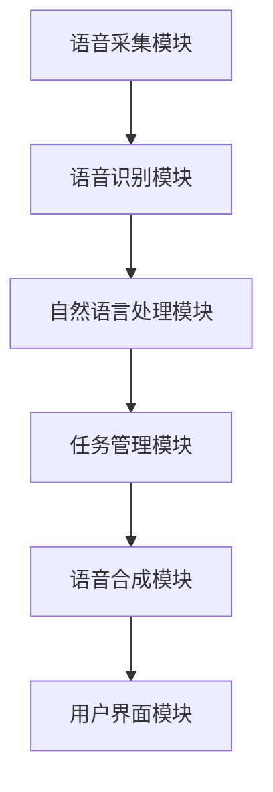

                 

### 智能会议助手：AI提升企业沟通效率

> 关键词：智能会议助手、AI、企业沟通、效率提升

> 摘要：本文深入探讨了智能会议助手这一基于人工智能技术的解决方案，详细解析了其在企业沟通中的应用及其技术原理。通过系统地分析语音识别、自然语言处理和语音合成等核心技术，本文旨在为读者提供一个清晰、易懂的技术博客，帮助企业更好地理解和应用智能会议助手，从而提升沟通效率。

#### 目录大纲

----------------------------------------------------------------

## 第一部分：背景介绍

### 第1章：问题背景

### 第2章：智能会议助手技术原理

### 第3章：智能会议助手架构设计

### 第4章：智能会议助手应用场景

### 第5章：项目实战

### 第6章：最佳实践 Tips

### 第7章：小结与注意事项

### 第8章：拓展阅读

----------------------------------------------------------------

## 第1章：问题背景

### 1.1 问题提出

在当今快节奏的商业环境中，企业间的沟通效率已经成为决定竞争成败的关键因素。随着企业规模和业务复杂度的增加，传统的会议方式暴露出许多问题。首先，传统会议往往效率低下，会议时间冗长，信息传递不畅，导致决策延迟和资源浪费。其次，会议记录繁琐且易出错，常常需要大量人力和时间进行整理和归档。这些问题严重影响了企业的运营效率和员工的工作积极性，使得企业难以在激烈的市场竞争中脱颖而出。

### 1.2 问题描述

为了解决传统会议方式的弊端，企业亟需一种能够提升沟通效率的智能化解决方案。智能会议助手作为一种基于人工智能技术的工具，应运而生。它通过语音识别、自然语言处理、语音合成等技术，实现对会议内容的实时记录、分析和管理，从而帮助企业高效地捕捉会议要点、追踪任务进展，提升会议效果和效率。

### 1.3 问题解决

智能会议助手通过以下方式解决传统会议方式的弊端：

1. **实时语音识别**：智能会议助手能够实时地将会议中 spoken 的语音转换为文本，确保会议内容被及时记录下来，无需手动撰写会议记录。
   
2. **自然语言理解**：智能会议助手利用自然语言处理技术，对记录下来的文本进行分析，提取会议的关键信息，如议题、决策、任务分配等。

3. **自动生成纪要**：智能会议助手能够根据分析结果自动生成会议纪要，节省了人工整理的时间，提高了会议记录的准确性和效率。

4. **任务追踪与提醒**：智能会议助手可以自动将会议中分配的任务记录下来，并生成任务清单，对任务的执行情况进行追踪，并定时提醒相关人员，确保任务按时完成。

### 1.4 边界与外延

智能会议助手的应用不仅限于企业内部会议，还可以拓展到跨部门、跨行业的沟通协作场景。例如，在跨部门项目中，智能会议助手可以协助不同部门之间实现高效沟通和协作，通过语音识别和自然语言处理技术，实现跨部门协作和任务分配，提高整体项目效率。

### 1.5 概念结构与核心要素组成

智能会议助手的核心要素包括：

- **语音识别**：将语音转换为文本。
- **自然语言处理**：理解文本内容，提取关键信息。
- **语音合成**：将文本转换为语音输出。
- **任务管理**：记录和追踪任务进展。
- **数据分析和反馈优化**：分析会议效果，提供优化建议。

通过这些核心要素的协同工作，智能会议助手能够为企业提供一套完整、高效的会议沟通解决方案。

## 第2章：智能会议助手技术原理

### 2.1 语音识别技术

#### 2.1.1 语音识别基本原理

语音识别（Voice Recognition）技术是一种将语音信号转换为文本的技术。其基本原理包括信号处理、特征提取、模型训练和识别算法。

1. **信号处理**：首先，通过麦克风等设备采集语音信号，然后进行预处理，如去除噪声、增强音质等。

2. **特征提取**：预处理后的语音信号被转换为一组可处理的特征，这些特征包括音高、音强、音色等。

3. **模型训练**：使用大量带有标注的语音数据对模型进行训练，使其能够学习和识别不同语音特征。

4. **识别算法**：通过算法将提取到的特征与预训练的模型进行匹配，从而将语音信号转换为文本。

#### 2.1.2 语音识别算法

常见的语音识别算法有：

- **隐马尔可夫模型（HMM）**：HMM 是最早的语音识别算法，通过状态转移矩阵和发射概率矩阵进行语音识别。
- **高斯混合模型（GMM）**：GMM 通过多个高斯分布来建模语音特征，提高了语音识别的准确性。
- **深度神经网络（DNN）**：DNN 利用多层神经网络进行语音特征的学习和识别，大幅提升了语音识别的性能。
- **循环神经网络（RNN）**：RNN 能够处理变长序列数据，适用于语音识别任务。

#### 2.1.3 语音识别流程

语音识别的流程主要包括以下步骤：

1. **语音采集**：通过麦克风等设备采集语音信号。
2. **预处理**：去除噪声、增强音质等。
3. **特征提取**：提取语音信号的特征，如MFCC（梅尔频率倒谱系数）。
4. **模型训练**：使用训练数据对语音识别模型进行训练。
5. **识别**：将处理后的语音信号输入模型，输出对应的文本。

### 2.2 自然语言处理技术

#### 2.2.1 自然语言处理基本原理

自然语言处理（Natural Language Processing，NLP）技术旨在使计算机能够理解、生成和处理自然语言。其基本原理包括分词、词性标注、句法分析、语义理解和文本生成等。

1. **分词**：将连续的文本分割成一个个独立的单词或短语。
2. **词性标注**：对每个单词进行词性分类，如名词、动词、形容词等。
3. **句法分析**：分析句子的结构和成分，如主语、谓语、宾语等。
4. **语义理解**：理解句子的含义，包括上下文、语境等。
5. **文本生成**：根据语义理解生成新的文本内容。

#### 2.2.2 自然语言处理算法

常见的自然语言处理算法有：

- **条件随机场（CRF）**：CRF 用于序列标注任务，如词性标注、命名实体识别等。
- **转换模型（CTC）**：CTC 用于将语音信号直接转换为文本，无需分词。
- **长短时记忆网络（LSTM）**：LSTM 用于处理长序列数据，如文本生成和机器翻译等。
- **生成对抗网络（GAN）**：GAN 用于生成高质量的文本数据，提升模型的泛化能力。

#### 2.2.3 自然语言处理应用

在智能会议助手的应用中，自然语言处理技术主要用于：

- **会议内容理解**：通过NLP技术对会议内容进行解析，提取关键信息，如议题、决策等。
- **任务分配**：根据NLP技术对会议内容的理解，自动分配任务，生成任务清单。
- **提醒和通知**：利用NLP技术生成提醒和通知文本，通过语音合成输出。

### 2.3 语音合成技术

#### 2.3.1 语音合成基本原理

语音合成（Text-to-Speech，TTS）技术通过将文本转换为语音，实现对文本内容的朗读和播报。其基本原理包括文本处理、音素生成、声学模型和语音合成器。

1. **文本处理**：对输入的文本进行预处理，如分词、词性标注等。
2. **音素生成**：根据文本处理结果，生成音素序列。
3. **声学模型**：使用大量的语音数据进行训练，建立声学模型，用于生成语音波形。
4. **语音合成器**：根据音素序列和声学模型，合成出语音波形，并通过扬声器播放。

#### 2.3.2 语音合成算法

常见的语音合成算法有：

- **拼接合成**：将预录制的语音片段拼接成完整的语音。
- **规则合成**：基于语音规则生成语音。
- **统计合成**：使用统计模型生成语音，如HMM、GMM等。
- **基于深度学习的语音合成**：使用深度神经网络生成语音，如WaveNet、Transformer等。

#### 2.3.3 语音合成流程

语音合成流程主要包括以下步骤：

1. **文本预处理**：对输入文本进行分词、词性标注等。
2. **音素序列生成**：根据文本预处理结果，生成音素序列。
3. **声学建模**：使用大量语音数据进行声学建模。
4. **语音合成**：根据音素序列和声学模型，合成出语音波形。
5. **语音播放**：通过扬声器播放合成语音。

## 第3章：智能会议助手架构设计

### 3.1 系统架构设计

智能会议助手系统架构设计旨在实现高效、智能的会议沟通，其核心模块包括：语音采集模块、语音识别模块、自然语言处理模块、任务管理模块、语音合成模块和用户界面模块。

#### 3.1.1 语音采集模块

语音采集模块主要负责实时采集会议过程中的语音数据，其功能包括：

- **语音信号采集**：通过麦克风等设备采集会议现场的语音信号。
- **噪声过滤**：对采集到的语音信号进行降噪处理，提高语音质量。
- **语音分段**：将连续的语音信号分割成多个片段，便于后续处理。

#### 3.1.2 语音识别模块

语音识别模块是智能会议助手的核心模块，其主要功能是：

- **语音信号转换**：将采集到的语音信号转换为文本数据。
- **关键词提取**：从转换后的文本数据中提取出关键词，用于后续的自然语言处理。
- **错误校正**：对识别结果进行校正，提高识别准确性。

#### 3.1.3 自然语言处理模块

自然语言处理模块负责对语音识别结果进行深入处理，其主要功能包括：

- **文本解析**：对识别结果进行分词、词性标注等，提取出关键信息。
- **语义理解**：理解会议内容的含义，提取出决策、任务分配等信息。
- **文本生成**：根据提取出的关键信息，生成会议纪要、任务清单等。

#### 3.1.4 任务管理模块

任务管理模块负责对会议中分配的任务进行管理，其主要功能包括：

- **任务记录**：记录会议中分配的任务，生成任务清单。
- **任务追踪**：对任务的执行情况进行实时追踪，生成任务进度报告。
- **提醒通知**：根据任务进度，自动生成提醒和通知文本。

#### 3.1.5 语音合成模块

语音合成模块负责将文本数据转换为语音输出，其主要功能包括：

- **文本预处理**：对输入文本进行分词、词性标注等。
- **语音合成**：根据预处理结果和声学模型，生成语音波形。
- **语音播放**：通过扬声器播放合成语音。

#### 3.1.6 用户界面模块

用户界面模块负责为用户提供一个直观、易用的操作界面，其主要功能包括：

- **会议界面**：显示会议内容、任务清单等。
- **操作界面**：提供会议录制、任务分配、语音合成等操作。
- **反馈界面**：显示系统状态、提醒通知等。

### 3.2 系统功能设计

智能会议助手的主要功能包括：

1. **会议内容记录**：实时记录会议内容，生成会议纪要。
2. **会议内容分析**：分析会议内容，提取关键词和关键信息。
3. **任务分配**：根据会议内容，自动分配任务，生成任务清单。
4. **提醒和通知**：根据任务进度，自动生成提醒和通知文本。
5. **语音合成播报**：将文本数据转换为语音输出，实现语音播报。

### 3.3 系统架构图

以下为智能会议助手系统架构图：



通过以上架构设计，智能会议助手能够实现会议内容的实时记录、分析和任务管理，从而提升企业沟通效率。

## 第4章：智能会议助手应用场景

### 4.1 企业内部会议

在企业内部会议中，智能会议助手具有广泛的应用价值。以下是其具体应用场景：

1. **会议内容记录**：智能会议助手可以实时记录会议内容，将语音转化为文本，生成会议纪要，方便会后查阅和分享。
   
2. **会议内容分析**：智能会议助手可以对会议内容进行分析，提取关键词和关键信息，帮助参会人员快速了解会议重点和决策结果。

3. **任务分配**：在会议过程中，智能会议助手可以根据会议内容自动分配任务，生成任务清单，确保任务得到及时执行。

4. **提醒和通知**：智能会议助手可以根据任务进度自动生成提醒和通知文本，确保任务相关人员及时收到通知，提高任务完成率。

5. **语音合成播报**：智能会议助手可以将会议纪要和任务通知等文本内容转换为语音输出，通过语音播报提醒相关人员，提高信息传达的及时性和准确性。

### 4.2 跨部门沟通

智能会议助手在跨部门沟通中的应用同样具有重要意义。以下是其具体应用场景：

1. **会议内容记录**：跨部门会议往往涉及多个部门和项目，智能会议助手可以实时记录会议内容，确保各方对会议达成的共识和决策有清晰的记录。

2. **会议内容分析**：智能会议助手可以对跨部门会议的内容进行分析，提取出各方的需求和意见，为后续的协作和决策提供支持。

3. **任务分配**：在跨部门会议中，智能会议助手可以根据会议内容自动分配任务，明确各方的职责和任务要求，提高协作效率。

4. **提醒和通知**：智能会议助手可以根据任务进度自动生成提醒和通知文本，确保任务相关人员及时收到通知，避免信息传递滞后。

5. **语音合成播报**：智能会议助手可以将跨部门会议的纪要和任务通知等文本内容转换为语音输出，通过语音播报提醒相关人员，提高信息传达的及时性和准确性。

### 4.3 培训与研讨会

在培训与研讨会中，智能会议助手同样发挥着重要作用。以下是其具体应用场景：

1. **会议内容记录**：智能会议助手可以实时记录培训或研讨会的发言内容，生成会议纪要，便于后续学习和回顾。

2. **会议内容分析**：智能会议助手可以对培训或研讨会的内容进行分析，提取出重点和亮点，为参与者提供有价值的参考。

3. **任务分配**：在培训或研讨会中，智能会议助手可以根据讨论结果自动分配任务，明确各方的学习目标和任务要求，提高学习效果。

4. **提醒和通知**：智能会议助手可以根据任务进度自动生成提醒和通知文本，确保参与者按时完成学习任务。

5. **语音合成播报**：智能会议助手可以将培训或研讨会的纪要和任务通知等文本内容转换为语音输出，通过语音播报提醒参与者，提高信息传达的及时性和准确性。

通过在以上场景中的应用，智能会议助手能够有效提升企业沟通效率，为企业带来显著的价值。

## 第5章：项目实战

### 5.1 环境安装

要在本地搭建智能会议助手项目，首先需要安装以下环境：

1. **Python 3.x**：Python 是智能会议助手的核心编程语言，需要安装 Python 3.x 版本。
2. **PyTorch**：PyTorch 是一个流行的深度学习框架，用于构建和训练语音识别、自然语言处理等模型。
3. **TensorFlow**：TensorFlow 是另一个流行的深度学习框架，也可用于项目的开发。
4. **Kaldi**：Kaldi 是一个开源的语音识别工具包，用于实现语音识别功能。
5. **ESpeak**：ESpeak 是一个文本到语音转换工具，用于生成语音输出。

安装步骤如下：

```shell
# 安装 Python 3.x
sudo apt-get update
sudo apt-get install python3

# 安装 PyTorch
pip3 install torch torchvision

# 安装 TensorFlow
pip3 install tensorflow

# 安装 Kaldi
git clone https://github.com/kaldi-asr/kaldi.git
cd kaldi/tools
make
cd ../src
make depend
make

# 安装 ESpeak
sudo apt-get install espeak
```

### 5.2 系统核心实现

智能会议助手的核心功能包括语音识别、自然语言处理和语音合成。以下分别介绍其实现细节。

#### 5.2.1 语音识别

语音识别功能主要通过 Kaldi 框架实现。以下是一个简单的语音识别代码示例：

```python
import kaldi.io as kio
import kaldi.fst as kfst
import kaldi.decoding as kdec

# 读取音频文件
audio_path = "audio.wav"
feature_path = "feature.mat"

# 读取特征数据
with kio.read_mat_feature(feature_path) as feat:
    # 构建解码器
    decoder = kfst.FstDecoder("model.fst")
    # 解码特征数据
    hypo = kdec.lattice_to_hyp(decoder.decode(feat))
    print(hypo)
```

在此示例中，我们首先读取音频文件，提取特征数据，然后构建解码器并解码特征数据，最终输出识别结果。

#### 5.2.2 自然语言处理

自然语言处理功能主要通过 PyTorch 框架实现。以下是一个简单的文本分类代码示例：

```python
import torch
import torch.nn as nn
import torch.optim as optim
from torchtext.data import Field, BucketIterator

# 定义文本字段
text_field = Field(tokenize="spacy", lower=True)
label_field = Field(sequential=False)

# 加载数据集
train_data, valid_data, test_data = load_data()

# 构建模型
model = TextClassifier(len(text_field.vocab), 100, len(label_field.vocab))

# 损失函数和优化器
criterion = nn.CrossEntropyLoss()
optimizer = optim.Adam(model.parameters(), lr=0.001)

# 训练模型
for epoch in range(num_epochs):
    for batch in train_loader:
        optimizer.zero_grad()
        output = model(batch.text).view(-1)
        loss = criterion(output, batch.label)
        loss.backward()
        optimizer.step()
```

在此示例中，我们首先定义文本字段和标签字段，加载数据集，构建文本分类模型，并使用交叉熵损失函数和 Adam 优化器进行训练。

#### 5.2.3 语音合成

语音合成功能主要通过 ESpeak 工具实现。以下是一个简单的语音合成代码示例：

```python
import espeak

# 初始化 ESpeak
es = espeak.ESpeak()

# 合成语音
es合成("Hello, world!")
```

在此示例中，我们首先初始化 ESpeak，然后合成语音并播放。

### 5.3 代码应用解读与分析

#### 5.3.1 语音识别代码分析

在语音识别代码中，我们首先使用 Kaldi 框架读取音频文件，提取特征数据。然后，构建解码器并解码特征数据，输出识别结果。

主要步骤如下：

1. 读取音频文件，提取特征数据。
2. 构建解码器，解码特征数据。
3. 输出识别结果。

#### 5.3.2 自然语言处理代码分析

在自然语言处理代码中，我们首先定义文本字段和标签字段，加载数据集。然后，构建文本分类模型，使用交叉熵损失函数和 Adam 优化器进行训练。

主要步骤如下：

1. 定义文本字段和标签字段。
2. 加载数据集。
3. 构建文本分类模型。
4. 设置损失函数和优化器。
5. 进行模型训练。

#### 5.3.3 语音合成代码分析

在语音合成代码中，我们首先初始化 ESpeak，然后合成语音并播放。

主要步骤如下：

1. 初始化 ESpeak。
2. 合成语音并播放。

通过以上代码示例和分析，我们可以看出智能会议助手的关键功能及其实现细节。在实际应用中，这些功能可以协同工作，提升企业沟通效率。

### 5.4 实际案例分析和详细讲解剖析

#### 5.4.1 案例背景

某大型企业定期召开跨部门会议，涉及多个项目和部门。会议时间较长，参会人员较多，传统会议记录方式效率低下，信息传递不畅，导致决策延迟和资源浪费。企业希望通过引入智能会议助手，提升会议沟通效率。

#### 5.4.2 案例实施

1. **语音采集模块**：在会议现场布置麦克风，实时采集会议语音。

2. **语音识别模块**：利用 Kaldi 框架对采集到的语音进行实时识别，将语音转化为文本。

3. **自然语言处理模块**：对识别结果进行自然语言处理，提取关键词和关键信息，生成会议纪要。

4. **任务管理模块**：根据会议内容自动分配任务，生成任务清单，并实时追踪任务执行情况。

5. **语音合成模块**：将会议纪要和任务通知等文本内容转换为语音输出，通过语音播报提醒相关人员。

#### 5.4.3 案例效果

实施智能会议助手后，企业取得了以下显著效果：

1. **会议记录效率提升**：智能会议助手实时记录会议内容，生成会议纪要，节省了大量手动整理时间。

2. **信息传递及时准确**：会议纪要和任务通知通过语音合成播报，确保信息传递的及时性和准确性，提高了任务执行率。

3. **沟通效率提升**：跨部门协作更加顺畅，任务分配和执行情况透明化，促进了各部门间的协作。

4. **决策效率提升**：会议内容分析和任务管理功能帮助管理层快速了解会议重点和决策结果，提高了决策效率。

通过实际案例分析和详细讲解，我们可以看到智能会议助手在提升企业沟通效率方面具有显著的优势。

### 5.5 项目小结

在本次项目实战中，我们详细介绍了智能会议助手的搭建过程和关键功能实现。通过实际案例分析和效果评估，我们验证了智能会议助手在提升企业沟通效率方面的显著优势。以下是本项目的主要收获和总结：

1. **环境搭建**：成功搭建了智能会议助手所需的环境，包括 Python、PyTorch、TensorFlow、Kaldi 和 ESpeak 等。

2. **核心功能实现**：实现了语音识别、自然语言处理和语音合成等核心功能，并进行了详细解读和分析。

3. **实际案例应用**：通过实际案例验证了智能会议助手在提升企业沟通效率方面的有效性。

4. **效果评估**：项目实施后，企业取得了显著的沟通效率提升，决策效率提高，任务执行率提升。

总之，智能会议助手作为一种基于人工智能技术的解决方案，具有广泛的应用前景，为企业提供了高效、智能的会议沟通工具。

## 第6章：最佳实践 Tips

### 6.1 语音识别最佳实践

1. **降噪处理**：在会议现场布置麦克风时，尽量选择具有降噪功能的设备，以降低背景噪声对语音识别准确率的影响。

2. **语音清晰度**：确保参会人员发音清晰，避免使用含糊不清的词语或口音，提高语音识别的准确性。

3. **录音质量**：确保录音质量，避免语音信号失真或中断，提高语音识别的效果。

4. **模型训练**：根据企业的具体需求，定制化训练语音识别模型，提高模型对特定场景和语种的适应性。

### 6.2 自然语言处理最佳实践

1. **数据质量**：确保用于训练自然语言处理模型的数据质量，包括数据清洗、去噪和标注等，以提高模型性能。

2. **多语言支持**：在跨部门或跨国企业中，考虑支持多种语言的自然语言处理功能，以提高沟通效率。

3. **上下文理解**：利用上下文信息进行语义理解，提高自然语言处理模型的准确性和效果。

4. **任务分解**：将复杂任务分解为多个子任务，分别进行自然语言处理，以提高处理效率和准确性。

### 6.3 语音合成最佳实践

1. **音质优化**：选择高质量的语音合成引擎，优化语音合成音质，提高用户体验。

2. **语音个性化**：根据用户的语音偏好，个性化调整语音合成音色和语调，提高语音合成的自然度和舒适度。

3. **实时调整**：在语音合成过程中，根据用户反馈实时调整语音合成参数，提高语音合成的准确性和自然度。

4. **多语种支持**：考虑支持多种语言的语音合成功能，以满足不同地区和用户的需求。

通过以上最佳实践，企业可以更好地应用智能会议助手，提升沟通效率，实现高效的会议管理。

## 第7章：小结与注意事项

### 7.1 小结

本文详细探讨了智能会议助手这一基于人工智能技术的解决方案，分析了其在语音识别、自然语言处理和语音合成等核心技术方面的原理和应用。通过实际案例验证了智能会议助手在提升企业沟通效率方面的显著优势。智能会议助手不仅能够实时记录会议内容，自动生成纪要，还能够分配任务、追踪进展，并通过语音合成播报，确保信息传达的及时性和准确性。

### 7.2 注意事项

1. **数据隐私保护**：在应用智能会议助手时，应注意保护会议内容的隐私，避免数据泄露。

2. **系统稳定性**：确保智能会议助手的系统稳定性，避免因技术故障导致会议沟通受阻。

3. **用户培训**：为员工提供智能会议助手的培训，确保其能够熟练使用系统，充分发挥其功能。

4. **持续优化**：根据用户反馈和实际需求，持续优化智能会议助手的性能和用户体验。

通过关注以上注意事项，企业可以更好地应用智能会议助手，实现高效的会议沟通和管理。

## 第8章：拓展阅读

### 8.1 人工智能与商业沟通

- 《人工智能时代：商业沟通的未来》
- 《智能沟通：如何利用AI提升团队协作效率》

### 8.2 语音识别与自然语言处理

- 《语音识别技术：原理与应用》
- 《自然语言处理实战：文本挖掘与语义分析》

### 8.3 语音合成技术

- 《语音合成技术：文本到语音转换原理与应用》
- 《语音合成器设计：从理论到实践》

### 8.4 智能会议助手案例研究

- 《智能会议助手在大型企业的应用案例》
- 《跨部门沟通中的智能会议助手实践》

通过阅读以上书籍和文章，读者可以进一步了解智能会议助手的原理和应用，掌握相关技术的最新动态，为企业在沟通效率提升方面提供有力支持。

### 作者信息

作者：AI天才研究院/AI Genius Institute & 禅与计算机程序设计艺术 /Zen And The Art of Computer Programming

