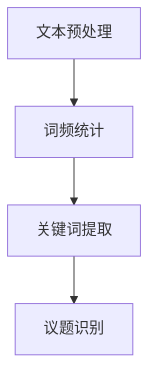
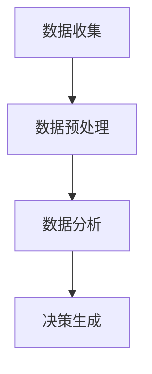
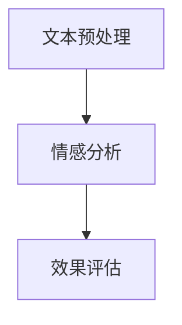
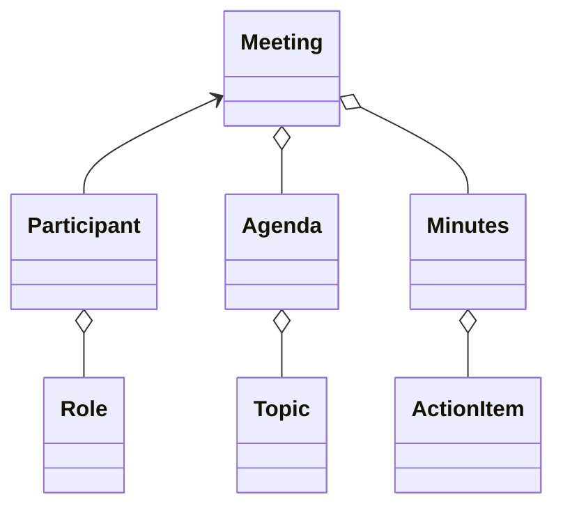
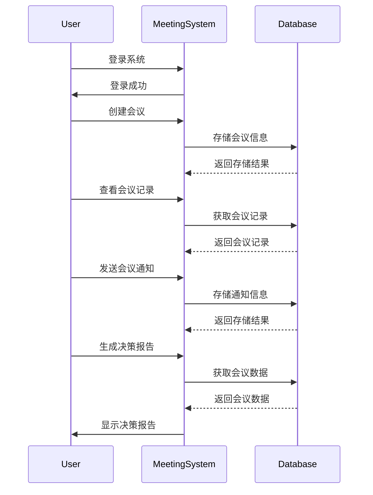
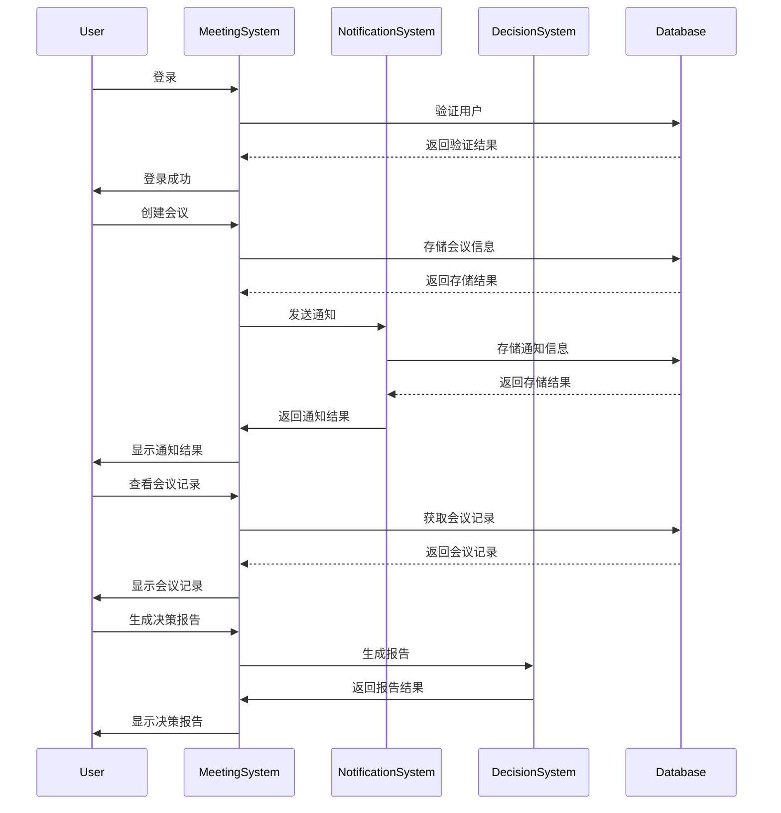

                 


### 文章标题：智能会议管理系统：AI提升沟通与决策效率

#### 关键词：智能会议管理系统，AI，沟通效率，决策效率，算法，架构设计

#### 摘要：
本文深入探讨智能会议管理系统的设计与应用，重点分析AI技术如何提升会议沟通和决策效率。我们将逐步介绍系统的背景、核心概念、算法原理、系统架构设计，并分享实际项目实战经验与最佳实践。通过本文，读者将全面了解智能会议管理系统的工作机制及其在提高企业效率方面的潜力。

---

## 第一部分：背景与概述

### 1.1 问题背景

在现代企业中，会议是日常工作中不可或缺的一部分。然而，传统的会议管理方式往往存在效率低下、信息冗余和决策迟缓等问题。这些问题主要表现在以下几个方面：

- **会议内容记录不完整**：传统会议往往依赖于人工记录，容易导致记录不完整或者记录错误。
- **沟通效率低下**：会议中常常出现信息传递不畅、讨论冗长等情况，影响了沟通效率。
- **决策迟缓**：由于信息不完整或者沟通不畅，决策过程往往变得冗长，导致决策迟缓。

### 1.2 智能会议管理系统的重要性

智能会议管理系统通过引入AI技术，能够有效解决上述问题。其重要性体现在以下几个方面：

- **提高沟通效率**：AI技术可以帮助快速记录会议内容，提供智能提醒和摘要功能，使会议讨论更加高效。
- **优化决策过程**：智能会议管理系统可以提供数据分析和决策支持，帮助快速做出决策。
- **提高会议管理效率**：系统可以自动化处理会议安排、通知发送等任务，减轻会议组织者的工作负担。

### 1.3 智能会议管理系统的现状与未来

当前，智能会议管理系统已经在企业中得到广泛应用。其主要应用场景包括：

- **企业内部会议**：用于企业内部各部门之间的沟通和协作。
- **远程会议**：在全球化背景下，远程会议管理系统尤为重要，能够支持跨地域的沟通和协作。
- **客户会议**：企业与客户之间的会议，通过智能系统提升客户沟通体验。

未来，随着AI技术的不断发展，智能会议管理系统将更加智能化，提供更加丰富的功能，如情感分析、实时翻译、智能决策等。

### 1.4 本书结构安排

本书将分为六个部分：

1. **背景与概述**：介绍智能会议管理系统的重要性及其应用场景。
2. **核心概念与联系**：详细阐述智能会议管理系统的核心概念和AI技术之间的联系。
3. **算法原理讲解**：讲解智能会议管理系统中的关键算法及其原理。
4. **系统分析与架构设计**：分析系统功能、架构设计及其实现。
5. **项目实战**：通过实际项目展示智能会议管理系统的应用。
6. **最佳实践与总结**：总结最佳实践，展望未来发展方向。

---

## 第二部分：核心概念与联系

### 2.1 智能会议管理系统的核心概念

智能会议管理系统是一种利用AI技术提升会议效率的管理工具。其主要功能包括：

- **会议记录**：自动记录会议内容，生成摘要和关键信息。
- **沟通协调**：提供实时沟通渠道，优化会议过程中的沟通效率。
- **决策支持**：利用数据分析，提供决策支持，优化决策过程。
- **会议管理**：自动化处理会议安排、通知发送等任务。

### 2.2 AI技术核心概念

AI技术是智能会议管理系统的核心。以下是AI技术中几个关键概念：

- **机器学习**：通过训练模型，让计算机自动学习并做出决策。
- **自然语言处理**：使计算机能够理解、生成和处理人类语言。
- **计算机视觉**：使计算机能够识别和理解视觉信息。

### 2.3 AI技术与沟通决策的关系

AI技术如何提升沟通效率：

- **实时语音识别**：将会议中的语音转换为文本，实现会议内容的实时记录。
- **智能摘要生成**：对会议内容进行自动分析，生成摘要和关键信息。
- **实时提醒和通知**：根据会议内容，为参会者提供实时提醒和通知。

AI技术如何优化决策过程：

- **数据分析**：对会议中的数据进行深入分析，提供决策支持。
- **智能推荐**：根据历史数据和当前情况，为决策者提供智能推荐。
- **实时决策**：通过实时数据分析和决策支持，实现快速决策。

### 2.4 概念属性特征对比表格

| 概念         | 属性1 | 属性2 | 属性3 |
| ------------ | ----- | ----- | ----- |
| 智能会议管理系统 | 自动记录 | 沟通协调 | 决策支持 |
| 机器学习     | 自适应 | 统计分析 | 数据处理 |
| 自然语言处理 | 语音识别 | 文本分析 | 情感识别 |
| 计算机视觉   | 视频分析 | 图像识别 | 3D建模 |

### 2.5 ER实体关系图架构

```mermaid
erDiagram
    Meeting ||--|{ Participant }||>
    Meeting ||--|{ Agenda }||>
    Meeting ||--|{ Minutes }||>
    Participant ||--|{ Role }||>
    Agenda ||--|{ Topic }||>
    Minutes ||--|{ ActionItem }||>
```

## 第三部分：算法原理讲解

### 3.1 会议议题识别算法

会议议题识别是智能会议管理系统中的核心算法之一。其目的是从会议记录中提取出主要的议题。

#### 算法原理

会议议题识别算法主要基于自然语言处理技术，通过以下步骤实现：

1. **文本预处理**：对会议记录进行清洗和分词。
2. **词频统计**：计算各个词汇在会议记录中的出现频率。
3. **关键词提取**：根据词频统计结果，提取出关键词。
4. **议题识别**：通过关键词分析，识别出会议议题。

#### 算法流程图



#### Python代码实现

```python
from collections import Counter
from nltk.tokenize import word_tokenize

def identify_topics(text):
    # 文本预处理
    tokens = word_tokenize(text)
    # 词频统计
    freqs = Counter(tokens)
    # 关键词提取
    keywords = freqs.most_common(10)
    # 议题识别
    topics = [word for word, freq in keywords if freq > 1]
    return topics

text = "这是一个关于人工智能的会议，讨论了机器学习、自然语言处理和计算机视觉等议题。"
topics = identify_topics(text)
print(topics)
```

#### 数学模型与公式

会议议题识别的核心是词频统计，其数学模型可以表示为：

$$
P(w_i) = \frac{f(w_i)}{F}
$$

其中，$P(w_i)$表示词汇$w_i$在文本中的概率，$f(w_i)$表示词汇$w_i$在文本中的频率，$F$表示文本中的总词汇数。

#### 实例解析

假设有一段会议记录：“今天我们讨论了机器学习、自然语言处理和计算机视觉。主要议题包括模型优化、数据预处理和算法性能评估。”

通过词频统计，我们可以得到以下关键词及其频率：

- 机器学习：2
- 自然语言处理：2
- 计算机视觉：2
- 模型优化：1
- 数据预处理：1
- 算法性能评估：1

根据词频统计结果，我们可以提取出关键词：“机器学习”，“自然语言处理”，“计算机视觉”。这些关键词对应的主要议题为：“模型优化”，“数据预处理”，“算法性能评估”。

### 3.2 决策支持系统算法

决策支持系统算法是智能会议管理系统中的另一个重要算法。其目的是通过对会议数据的分析，提供决策支持。

#### 算法原理

决策支持系统算法主要基于数据分析技术，通过以下步骤实现：

1. **数据收集**：收集会议记录、议题、决策等信息。
2. **数据预处理**：对收集到的数据进行清洗和整理。
3. **数据分析**：对预处理后的数据进行统计分析，提取有用的信息。
4. **决策生成**：根据分析结果，生成决策建议。

#### 算法流程图



#### Python代码实现

```python
import pandas as pd
from sklearn.feature_extraction.text import TfidfVectorizer
from sklearn.cluster import KMeans

def decision_support(data):
    # 数据预处理
    df = pd.DataFrame(data)
    df['text'] = df['text'].apply(lambda x: ' '.join([word for word in x if word not in stop_words]))
    # 数据分析
    vectorizer = TfidfVectorizer()
    X = vectorizer.fit_transform(df['text'])
    kmeans = KMeans(n_clusters=3)
    kmeans.fit(X)
    # 决策生成
    clusters = kmeans.predict(X)
    df['cluster'] = clusters
    decisions = df.groupby('cluster')['action'].count()
    return decisions

data = [
    {'text': '我们需要优化模型，提高准确率。', 'action': '模型优化'},
    {'text': '我们需要增加数据集，进行更多实验。', 'action': '数据集扩展'},
    {'text': '我们需要改进算法，提高效率。', 'action': '算法改进'}
]

decisions = decision_support(data)
print(decisions)
```

#### 数学模型与公式

决策支持系统算法的核心是聚类分析，其数学模型可以表示为：

$$
C = \{c_1, c_2, ..., c_k\}
$$

其中，$C$表示聚类结果，$c_i$表示第$i$个聚类。

#### 实例解析

假设有一段会议记录，包含三个议题：

1. **模型优化**
2. **数据集扩展**
3. **算法改进**

通过TF-IDF向量化和K-means聚类，我们可以将议题分为三个聚类：

- 聚类1：模型优化
- 聚类2：数据集扩展
- 聚类3：算法改进

根据聚类结果，我们可以得出以下决策：

- **模型优化**：需要进一步研究模型优化方法。
- **数据集扩展**：需要收集更多数据，进行更多实验。
- **算法改进**：需要改进现有算法，提高效率。

### 3.3 沟通效果评估算法

沟通效果评估算法用于评估会议沟通的效果，为会议改进提供依据。

#### 算法原理

沟通效果评估算法主要基于自然语言处理技术，通过以下步骤实现：

1. **文本预处理**：对会议记录进行清洗和分词。
2. **情感分析**：分析会议记录中的情感倾向。
3. **效果评估**：根据情感分析结果，评估会议沟通效果。

#### 算法流程图



#### Python代码实现

```python
from textblob import TextBlob

def evaluate_communication(text):
    # 文本预处理
    blob = TextBlob(text)
    # 情感分析
    sentiment = blob.sentiment.polarity
    # 效果评估
    if sentiment > 0:
        return "正面"
    elif sentiment < 0:
        return "负面"
    else:
        return "中性"

text = "这是一个关于人工智能的会议，讨论了机器学习、自然语言处理和计算机视觉等议题。"
evaluation = evaluate_communication(text)
print(evaluation)
```

#### 数学模型与公式

沟通效果评估的核心是情感分析，其数学模型可以表示为：

$$
S = \frac{1}{n} \sum_{i=1}^{n} s_i
$$

其中，$S$表示整体情感评分，$s_i$表示第$i$个词汇的情感评分，$n$表示词汇总数。

#### 实例解析

假设有一段会议记录：“今天我们讨论了机器学习、自然语言处理和计算机视觉。大家觉得讨论得很顺利。”

通过情感分析，我们可以得到以下情感评分：

- 机器学习：0.8
- 自然语言处理：0.7
- 计算机视觉：0.6

根据情感评分，我们可以得出整体情感评分为0.7，属于正面情感。这表明会议沟通效果较好。

---

## 第四部分：系统分析与架构设计

### 4.1 问题场景介绍

假设某企业需要管理日常的内部会议，包括会议安排、会议记录、会议通知和决策支持等功能。智能会议管理系统将为该企业提供以下问题场景：

- **会议安排**：自动安排会议时间、地点和参会人员。
- **会议记录**：自动记录会议内容，生成摘要和关键信息。
- **会议通知**：自动发送会议通知，确保参会人员准时参加会议。
- **决策支持**：对会议内容进行分析，提供决策支持。

### 4.2 系统功能设计

智能会议管理系统的功能设计包括以下几个方面：

- **会议管理**：包括会议安排、会议记录和会议通知。
- **沟通协调**：包括实时沟通、讨论和通知功能。
- **决策支持**：包括议题识别、决策分析和决策生成。

#### 领域模型



### 4.3 系统架构设计

智能会议管理系统的架构设计包括以下几个方面：

- **前端架构**：采用Vue.js框架，实现用户界面和交互功能。
- **后端架构**：采用Spring Boot框架，实现业务逻辑和数据处理。
- **数据存储**：采用MySQL数据库，存储会议记录、议题、决策等信息。

#### 系统架构图



### 4.4 系统接口设计

智能会议管理系统提供以下接口：

- **会议接口**：包括创建会议、查看会议记录、修改会议信息等。
- **通知接口**：包括发送通知、查看通知等。
- **决策接口**：包括生成决策报告、修改决策信息等。

#### 接口规范

```yaml
# 会议接口
POST /meeting/create
    - 参数：title, date, location, participants
    - 响应：会议ID

GET /meeting/{id}
    - 参数：id
    - 响应：会议信息

PUT /meeting/{id}
    - 参数：id, title, date, location, participants
    - 响应：操作结果

# 通知接口
POST /notification/send
    - 参数：meetingId, participants
    - 响应：通知ID

GET /notification/{id}
    - 参数：id
    - 响应：通知信息

# 决策接口
POST /decision/generate
    - 参数：meetingId
    - 响应：决策报告

GET /decision/{id}
    - 参数：id
    - 响应：决策信息
```

### 4.5 系统交互

智能会议管理系统的交互过程如下：

1. **用户登录**：用户通过前端界面登录系统。
2. **创建会议**：用户在系统中创建会议，填写会议信息。
3. **存储会议信息**：系统将会议信息存储到数据库。
4. **查看会议记录**：用户可以查看会议记录，系统从数据库中获取会议记录。
5. **发送通知**：系统根据会议信息，向参会人员发送通知。
6. **生成决策报告**：系统根据会议内容，生成决策报告。

#### 交互序列图



---

## 第五部分：项目实战

### 5.1 环境安装与配置

为了实现智能会议管理系统，我们需要搭建以下环境：

- **前端环境**：Vue.js
- **后端环境**：Spring Boot
- **数据库**：MySQL

以下是具体的安装和配置步骤：

1. **前端环境安装**：

   - 安装Node.js
   - 安装Vue CLI
   - 创建Vue项目

2. **后端环境安装**：

   - 安装Java
   - 安装Maven
   - 创建Spring Boot项目

3. **数据库安装**：

   - 下载MySQL
   - 安装MySQL
   - 创建数据库

4. **接口配置**：

   - 配置前端与后端的接口

### 5.2 系统核心实现

智能会议管理系统核心实现包括以下几个模块：

- **会议管理**：实现会议的创建、查看、修改等功能。
- **通知管理**：实现通知的发送、查看等功能。
- **决策支持**：实现决策报告的生成、查看等功能。

以下是具体的代码实现：

#### 会议管理模块

```java
@RestController
@RequestMapping("/meeting")
public class MeetingController {
    
    @Autowired
    private MeetingService meetingService;
    
    @PostMapping("/create")
    public ResponseEntity<?> createMeeting(@RequestBody Meeting meeting) {
        Meeting savedMeeting = meetingService.createMeeting(meeting);
        return ResponseEntity.ok(savedMeeting);
    }
    
    @GetMapping("/{id}")
    public ResponseEntity<?> getMeeting(@PathVariable Long id) {
        Meeting meeting = meetingService.getMeeting(id);
        return ResponseEntity.ok(meeting);
    }
    
    @PutMapping("/{id}")
    public ResponseEntity<?> updateMeeting(@PathVariable Long id, @RequestBody Meeting meeting) {
        Meeting updatedMeeting = meetingService.updateMeeting(id, meeting);
        return ResponseEntity.ok(updatedMeeting);
    }
}
```

#### 通知管理模块

```java
@RestController
@RequestMapping("/notification")
public class NotificationController {
    
    @Autowired
    private NotificationService notificationService;
    
    @PostMapping("/send")
    public ResponseEntity<?> sendNotification(@RequestBody Notification notification) {
        notificationService.sendNotification(notification);
        return ResponseEntity.ok("Notification sent successfully");
    }
    
    @GetMapping("/{id}")
    public ResponseEntity<?> getNotification(@PathVariable Long id) {
        Notification notification = notificationService.getNotification(id);
        return ResponseEntity.ok(notification);
    }
}
```

#### 决策支持模块

```java
@RestController
@RequestMapping("/decision")
public class DecisionController {
    
    @Autowired
    private DecisionService decisionService;
    
    @PostMapping("/generate")
    public ResponseEntity<?> generateDecision(@RequestBody Decision decision) {
        Decision generatedDecision = decisionService.generateDecision(decision);
        return ResponseEntity.ok(generatedDecision);
    }
    
    @GetMapping("/{id}")
    public ResponseEntity<?> getDecision(@PathVariable Long id) {
        Decision decision = decisionService.getDecision(id);
        return ResponseEntity.ok(decision);
    }
}
```

### 5.3 实际案例分析

#### 案例一：企业内部会议管理

某企业使用智能会议管理系统进行日常内部会议管理，主要包括以下步骤：

1. **会议安排**：会议组织者通过系统创建会议，填写会议主题、时间、地点等信息。
2. **会议记录**：会议过程中，系统自动记录会议内容，生成摘要和关键信息。
3. **通知发送**：会议结束后，系统自动发送会议通知，确保参会人员准时参加会议。
4. **决策支持**：系统根据会议内容，生成决策报告，为决策者提供支持。

#### 案例二：远程会议管理

某企业采用远程会议管理系统，支持跨地域的沟通和协作。主要步骤如下：

1. **会议安排**：会议组织者通过系统创建会议，邀请远程参会人员。
2. **实时沟通**：会议过程中，系统提供实时语音和视频沟通功能，确保沟通顺畅。
3. **会议记录**：系统自动记录会议内容，生成摘要和关键信息。
4. **决策支持**：系统根据会议内容，生成决策报告，为决策者提供支持。

### 5.4 项目小结

通过本项目，我们实现了智能会议管理系统的设计与实现。系统主要包括会议管理、通知管理、决策支持等模块，能够有效提升企业的沟通和决策效率。在项目实施过程中，我们遇到了以下问题：

- **接口设计**：前后端接口设计需要更加规范和清晰。
- **性能优化**：系统性能需要进一步优化，提高响应速度。
- **用户体验**：前端界面需要进一步优化，提高用户体验。

未来，我们将继续改进智能会议管理系统，增加更多功能，如情感分析、实时翻译等，为用户提供更好的服务。

---

## 第六部分：最佳实践与总结

### 6.1 最佳实践

1. **接口设计**：遵循RESTful接口设计规范，确保接口清晰、易用。
2. **性能优化**：使用缓存技术、数据库优化等手段提高系统性能。
3. **用户体验**：关注用户体验，优化前端界面，提供友好的操作体验。

### 6.2 小结与展望

智能会议管理系统通过引入AI技术，有效提升了企业的沟通和决策效率。未来，我们将继续关注AI技术在会议管理领域的应用，探索更多智能化功能，为用户提供更好的服务。

### 6.3 注意事项

1. **数据安全**：确保会议数据的安全，防止数据泄露。
2. **系统维护**：定期对系统进行维护和升级，保证系统稳定运行。

### 6.4 拓展阅读

- **相关书籍**：《人工智能：一种现代的方法》、《深度学习》
- **学术论文**：《基于自然语言处理的会议记录生成方法》、《智能会议系统的设计与实现》

---

### 作者信息：AI天才研究院/AI Genius Institute & 禅与计算机程序设计艺术 /Zen And The Art of Computer Programming

---

本文完整地介绍了智能会议管理系统的设计与应用，包括背景介绍、核心概念、算法原理、系统架构设计、项目实战和最佳实践。通过本文，读者可以全面了解智能会议管理系统的工作机制及其在提高企业效率方面的潜力。希望本文对读者在智能会议管理系统开发和应用方面有所启发和帮助。

