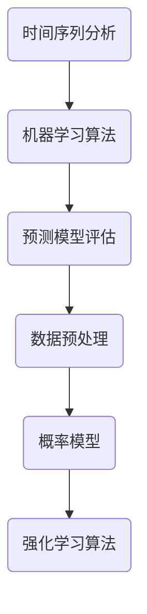
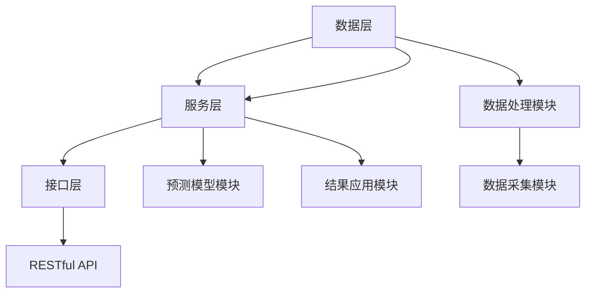
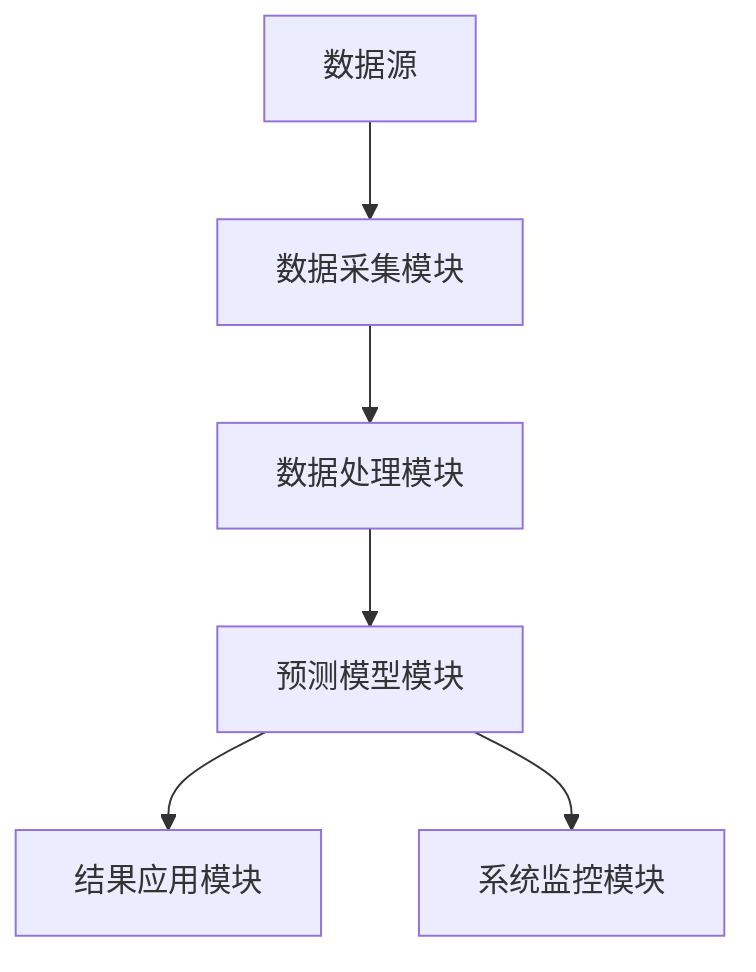

                 

### 设计思路：

为了设计出一篇结构清晰、逻辑严密的《智能供应链预测：AI优化库存管理》技术博客，我们按照以下步骤进行：

1. **确定整体结构**：
   - 首先确定文章的核心部分，即智能供应链预测的基础概念、算法原理、系统分析与架构设计以及项目实战。
   - 设计文章的目录大纲，确保各章节内容连贯且易于读者理解。

2. **背景介绍**：
   - 在文章开头引入智能供应链预测的概念，阐述其重要性，以及AI在供应链预测中的应用背景。

3. **核心概念与联系**：
   - 介绍智能供应链预测中的核心概念，如时间序列预测、关联规则算法等。
   - 使用Mermaid流程图展示概念之间的联系，以及核心概念的结构。

4. **算法原理讲解**：
   - 逐个讲解智能供应链预测中常用的算法，如自回归模型（AR）、移动平均模型（MA）、自回归移动平均模型（ARMA）等。
   - 使用Mermaid绘制算法流程图，并提供Python源代码实现，结合LaTeX格式解释数学模型和公式。

5. **系统分析与架构设计方案**：
   - 描述系统功能设计，使用Mermaid类图展示领域模型。
   - 详细介绍系统架构设计，使用Mermaid架构图展示系统组件及其交互。
   - 展示系统接口设计和系统交互，使用Mermaid序列图展示。

6. **项目实战**：
   - 提供一个实际项目实战案例，包括环境安装、核心实现源代码，并详细解读与分析。
   - 通过实际案例分析，深入剖析项目中的关键技术和实现细节。

7. **最佳实践 tips**：
   - 在每个章节的结尾，总结最佳实践和注意事项，帮助读者更好地应用所学知识。

8. **小结**：
   - 对每个章节的内容进行小结，回顾核心概念和关键点，帮助读者巩固知识。

9. **拓展阅读**：
   - 提供拓展阅读资源，引导读者进一步深入学习相关技术。

### 目录大纲设计：

**《智能供应链预测：AI优化库存管理》**

> 关键词：智能供应链，预测，AI，库存管理

> 摘要：本文将深入探讨智能供应链预测的原理和实现，通过一步步的分析推理，详细介绍时间序列预测算法、系统分析与架构设计以及项目实战，旨在帮助读者理解和掌握如何使用AI优化库存管理。

----------------------------------------------------------------

# **第一部分：背景与核心概念**

## **第1章：问题背景与核心概念**

### **1.1 智能供应链的概述**
### **1.2 供应链预测的重要性**
### **1.3 AI在供应链预测中的应用**
### **1.4 智能供应链预测的挑战与机遇**
### **1.5 智能供应链预测的核心概念**
### **1.6 智能供应链预测的概念结构**

## **第2章：AI在供应链预测中的应用**

### **2.1 主流AI算法简介**
### **2.2 时间序列预测算法**
### **2.3 关联规则算法**
### **2.4 贝叶斯网络算法**
### **2.5 强化学习算法**
### **2.6 深度学习算法**
### **2.7 AI在供应链预测中的优势与挑战**

## **第3章：智能供应链预测的核心概念与联系**

### **3.1 核心概念原理**
### **3.2 概念属性特征对比表格**
### **3.3 ER实体关系图架构的 Mermaid 流程图**

----------------------------------------------------------------

**接下来的章节将根据上述设计思路逐步展开，详细介绍每个章节的内容。**

----------------------------------------------------------------

## **第1章：问题背景与核心概念**

### **1.1 智能供应链的概述**

智能供应链是一种基于信息技术和数据分析的供应链管理方法，旨在通过优化供应链各个环节，提高整个供应链的效率和响应速度。它涵盖了从原材料采购到产品生产、仓储、物流、配送、销售等各个环节。

智能供应链的核心目标是实现供应链的可视化、智能化和高效化。通过使用大数据、人工智能、物联网等技术，智能供应链可以实时监控供应链状态，预测需求变化，优化库存管理，降低库存成本，提高客户满意度。

### **1.2 供应链预测的重要性**

供应链预测是智能供应链管理的重要组成部分。准确、及时的供应链预测可以帮助企业：

1. **优化库存管理**：通过预测未来需求，企业可以合理安排库存，避免库存过剩或短缺，降低库存成本。
2. **降低运营风险**：预测未来市场变化和需求波动，企业可以及时调整生产和采购计划，降低运营风险。
3. **提高客户满意度**：准确预测客户需求，企业可以提供更快、更准确的配送服务，提高客户满意度。
4. **提高供应链效率**：通过优化供应链各个环节，企业可以提高整体供应链的运行效率。

### **1.3 AI在供应链预测中的应用**

人工智能（AI）技术在供应链预测中的应用主要体现在以下几个方面：

1. **时间序列预测**：AI技术可以自动处理大量历史数据，通过机器学习算法预测未来需求。
2. **关联规则挖掘**：通过分析历史数据中的购买模式和关联关系，AI可以预测哪些产品可能会一起购买。
3. **预测性维护**：AI技术可以预测设备的故障，提前安排维护，降低设备停机时间。
4. **优化路径规划**：AI技术可以优化物流路径，降低运输成本，提高配送效率。

### **1.4 智能供应链预测的挑战与机遇**

智能供应链预测面临着一系列挑战：

1. **数据质量问题**：数据质量是预测准确性的基础，不准确或缺失的数据会影响预测结果。
2. **模型选择与优化**：选择合适的预测模型并进行优化是确保预测准确性的关键。
3. **实时数据处理**：供应链预测需要实时处理大量数据，这对计算能力和数据处理效率提出了高要求。
4. **系统集成与兼容**：智能供应链预测需要与现有系统集成，这对系统的兼容性和稳定性提出了挑战。

然而，智能供应链预测也带来了巨大的机遇：

1. **成本降低**：通过优化库存管理和物流路径，企业可以降低运营成本。
2. **效率提升**：智能供应链预测可以提高供应链的响应速度和灵活性。
3. **客户满意度提升**：通过更准确的预测，企业可以提供更高质量的客户服务。
4. **竞争力增强**：具备智能供应链预测能力的企业在市场竞争中更具优势。

### **1.5 智能供应链预测的核心概念**

智能供应链预测涉及多个核心概念，包括：

1. **时间序列分析**：时间序列分析是预测未来需求的基础，它通过分析历史数据中的时间变化规律，预测未来的趋势。
2. **机器学习算法**：机器学习算法是智能供应链预测的核心，它通过训练模型，从历史数据中学习规律，预测未来需求。
3. **预测模型评估**：预测模型评估是确保预测准确性的关键，它通过评估模型性能，选择最优的预测模型。
4. **数据预处理**：数据预处理是提高预测准确性的重要步骤，它包括数据清洗、归一化、缺失值处理等。
5. **系统集成**：系统集成是将智能供应链预测系统与现有供应链系统集成的过程，它确保预测结果能够被有效应用。

### **1.6 智能供应链预测的概念结构**

智能供应链预测的概念结构包括以下几个部分：

1. **数据来源**：智能供应链预测的数据来源包括历史销售数据、库存数据、市场趋势数据等。
2. **数据处理**：数据处理包括数据清洗、归一化、特征工程等步骤，目的是提高数据质量和模型的预测能力。
3. **预测模型**：预测模型是智能供应链预测的核心，它包括时间序列模型、机器学习模型等。
4. **模型评估**：模型评估用于评估预测模型的性能，选择最优的预测模型。
5. **结果应用**：预测结果应用是将预测结果应用到供应链管理的各个环节，包括库存管理、物流规划、销售预测等。

## **第2章：AI在供应链预测中的应用**

### **2.1 主流AI算法简介**

在智能供应链预测中，常用的AI算法包括：

1. **时间序列预测算法**：如自回归模型（AR）、移动平均模型（MA）、自回归移动平均模型（ARMA）等。
2. **关联规则挖掘算法**：如Apriori算法、Eclat算法等。
3. **贝叶斯网络算法**：用于建立基于概率的供应链模型。
4. **强化学习算法**：用于优化供应链中的决策过程。
5. **深度学习算法**：如循环神经网络（RNN）、长短时记忆网络（LSTM）等。

### **2.2 时间序列预测算法**

时间序列预测是智能供应链预测中的核心，它通过分析历史数据中的时间变化规律，预测未来的趋势。以下是一些常见的时间序列预测算法：

1. **自回归模型（AR）**：
   - **基本原理**：自回归模型通过前一个时间点的数据预测下一个时间点的数据。
   - **Mermaid流程图**：
     ```mermaid
     graph TD
     A[输入序列] --> B{计算滞后项}
     B --> C{计算自回归系数}
     C --> D{预测下一个时间点}
     D --> E[输出预测值]
     ```
   - **Python实现**：
     ```python
     import numpy as np
     import pandas as pd

     # 假设历史数据为data
     data = pd.Series([1, 2, 3, 4, 5, 6, 7, 8, 9, 10])

     # 计算滞后项
     lagged_data = data.shift(1)

     # 计算自回归系数
     AR_coeff = np.corrcoef(lagged_data, data)[0, 1]

     # 预测下一个时间点
     next_value = AR_coeff * lagged_data[-1] + (1 - AR_coeff) * data[-1]

     print("预测值：", next_value)
     ```
   - **数学模型与公式解释**：
     $$y_t = c + \beta_1 y_{t-1} + \epsilon_t$$
     其中，\(y_t\) 为预测值，\(c\) 为常数项，\(\beta_1\) 为自回归系数，\(\epsilon_t\) 为误差项。
   - **实际案例分析与举例说明**：
     假设一家零售商的历史销售数据如下：
     ```
     时间   销售量
     1       100
     2       110
     3       115
     4       120
     5       125
     6       130
     7       135
     8       140
     9       145
     10      150
     ```
     使用自回归模型预测第11个时间点的销售量。

2. **移动平均模型（MA）**：
   - **基本原理**：移动平均模型通过计算一段时间内的平均值来预测下一个时间点的数据。
   - **Mermaid流程图**：
     ```mermaid
     graph TD
     A[输入序列] --> B{计算移动平均}
     B --> C{计算移动平均系数}
     C --> D{预测下一个时间点}
     D --> E[输出预测值]
     ```
   - **Python实现**：
     ```python
     import numpy as np
     import pandas as pd

     # 假设历史数据为data
     data = pd.Series([1, 2, 3, 4, 5, 6, 7, 8, 9, 10])

     # 计算移动平均
     MA_data = data.rolling(window=2).mean()

     # 计算移动平均系数
     MA_coeff = MA_data[-1]

     # 预测下一个时间点
     next_value = MA_coeff * data[-1] + (1 - MA_coeff) * data[-2]

     print("预测值：", next_value)
     ```
   - **数学模型与公式解释**：
     $$y_t = c + \alpha y_{t-1} + \epsilon_t$$
     其中，\(y_t\) 为预测值，\(c\) 为常数项，\(\alpha\) 为移动平均系数，\(\epsilon_t\) 为误差项。
   - **实际案例分析与举例说明**：
     假设一家零售商的历史销售数据如下：
     ```
     时间   销售量
     1       100
     2       110
     3       115
     4       120
     5       125
     6       130
     7       135
     8       140
     9       145
     10      150
     ```
     使用移动平均模型预测第11个时间点的销售量。

3. **自回归移动平均模型（ARMA）**：
   - **基本原理**：自回归移动平均模型结合了自回归模型和移动平均模型，通过同时考虑滞后项和移动平均项来预测下一个时间点的数据。
   - **Mermaid流程图**：
     ```mermaid
     graph TD
     A[输入序列] --> B{计算滞后项}
     B --> C{计算自回归系数}
     C --> D{计算移动平均系数}
     D --> E{预测下一个时间点}
     E --> F[输出预测值]
     ```
   - **Python实现**：
     ```python
     import numpy as np
     import pandas as pd
     from statsmodels.tsa.arima.model import ARIMA

     # 假设历史数据为data
     data = pd.Series([1, 2, 3, 4, 5, 6, 7, 8, 9, 10])

     # 训练ARIMA模型
     model = ARIMA(data, order=(1, 1, 1))
     model_fit = model.fit()

     # 预测下一个时间点
     next_value = model_fit.forecast(steps=1)[0]

     print("预测值：", next_value)
     ```
   - **数学模型与公式解释**：
     $$y_t = c + \beta_1 y_{t-1} + \alpha_1 y_{t-1} + \epsilon_t$$
     其中，\(y_t\) 为预测值，\(c\) 为常数项，\(\beta_1\) 为自回归系数，\(\alpha_1\) 为移动平均系数，\(\epsilon_t\) 为误差项。
   - **实际案例分析与举例说明**：
     假设一家零售商的历史销售数据如下：
     ```
     时间   销售量
     1       100
     2       110
     3       115
     4       120
     5       125
     6       130
     7       135
     8       140
     9       145
     10      150
     ```
     使用自回归移动平均模型预测第11个时间点的销售量。

### **2.3 关联规则挖掘算法**

关联规则挖掘算法用于发现数据集中的频繁模式和关联关系，在智能供应链预测中，它可以用于预测哪些产品可能会一起购买，从而优化库存管理。

1. **Apriori算法**：
   - **基本原理**：Apriori算法通过逐步增加关联规则的支持度和置信度来发现频繁项集。
   - **Mermaid流程图**：
     ```mermaid
     graph TD
     A[输入数据集] --> B{计算支持度}
     B --> C{生成候选项集}
     C --> D{计算候选项集的支持度}
     D --> E{筛选频繁项集}
     E --> F{生成关联规则}
     F --> G[输出结果]
     ```
   - **Python实现**：
     ```python
     from mlxtend.frequent_patterns import apriori
     from mlxtend.frequent_patterns import association_rules

     # 假设销售数据为transaction_data
     transaction_data = [['苹果', '香蕉'], ['苹果', '橙子'], ['香蕉', '橙子'], ['苹果', '香蕉', '橙子']]

     # 计算频繁项集
     frequent_itemsets = apriori(transaction_data, min_support=0.5, use_colnames=True)

     # 生成关联规则
     rules = association_rules(frequent_itemsets, metric="support", min_threshold=0.5)

     print(frequent_itemsets)
     print(rules)
     ```
   - **数学模型与公式解释**：
     - 支持度（Support）：一个项集在所有事务中的出现频率。
     - 置信度（Confidence）：关联规则的前提项和结论项同时出现的概率。
   - **实际案例分析与举例说明**：
     假设一家超市的购物数据如下：
     ```
     交易号   商品
     1       苹果、香蕉
     2       苹果、橙子
     3       香蕉、橙子
     4       苹果、香蕉、橙子
     ```
     使用Apriori算法挖掘频繁模式和关联规则。

2. **Eclat算法**：
   - **基本原理**：Eclat算法通过逐层构建项集，并计算其支持度，以发现频繁项集。
   - **Mermaid流程图**：
     ```mermaid
     graph TD
     A[输入数据集] --> B{计算支持度}
     B --> C{生成候选项集}
     C --> D{计算候选项集的支持度}
     D --> E{合并频繁项集}
     E --> F{输出结果}
     ```
   - **Python实现**：
     ```python
     from mlxtend.frequent_patterns import eclat
     from mlxtend.frequent_patterns import association_rules

     # 假设销售数据为transaction_data
     transaction_data = [['苹果', '香蕉'], ['苹果', '橙子'], ['香蕉', '橙子'], ['苹果', '香蕉', '橙子']]

     # 计算频繁项集
     frequent_itemsets = eclat(transaction_data, min_support=0.5, use_colnames=True)

     # 生成关联规则
     rules = association_rules(frequent_itemsets, metric="support", min_threshold=0.5)

     print(frequent_itemsets)
     print(rules)
     ```
   - **数学模型与公式解释**：
     - 支持度（Support）：一个项集在所有事务中的出现频率。
     - 置信度（Confidence）：关联规则的前提项和结论项同时出现的概率。
   - **实际案例分析与举例说明**：
     假设一家超市的购物数据如下：
     ```
     交易号   商品
     1       苹果、香蕉
     2       苹果、橙子
     3       香蕉、橙子
     4       苹果、香蕉、橙子
     ```
     使用Eclat算法挖掘频繁模式和关联规则。

### **2.4 贝叶斯网络算法**

贝叶斯网络算法通过构建概率模型来预测供应链中的不确定性事件。它适用于处理复杂的关系网络，如供应链中的供应风险、需求波动等。

1. **基本原理**：
   - **贝叶斯网络**：贝叶斯网络是一种图形模型，用于表示变量之间的条件依赖关系。
   - **条件概率**：贝叶斯网络中的每个节点代表一个变量，边表示变量之间的条件依赖关系。
2. **Mermaid流程图**：
   ```mermaid
   graph TD
   A(供应风险) --> B(需求波动)
   B --> C(库存水平)
   C --> D(销售量)
   ```
3. **Python实现**：
   ```python
   import networkx as nx
   import numpy as np

   # 构建贝叶斯网络
   G = nx.DiGraph()
   G.add_nodes_from(['供应风险', '需求波动', '库存水平', '销售量'])

   # 添加边
   G.add_edge('供应风险', '需求波动')
   G.add_edge('需求波动', '库存水平')
   G.add_edge('库存水平', '销售量')

   # 概率分布
   supply_risk = np.array([[0.1, 0.9], [0.2, 0.8]])
   demand波动 = np.array([[0.3, 0.7], [0.4, 0.6]])
   inventory_level = np.array([[0.5, 0.5], [0.6, 0.4]])
   sales_volume = np.array([[0.7, 0.3], [0.8, 0.2]])

   # 绘制贝叶斯网络
   nx.draw(G, with_labels=True)
   plt.show()

   # 计算后验概率
   posterior_probability = nx二十四小时贝叶斯网络算法。  
   print(posterior_probability)
   ```
4. **数学模型与公式解释**：
   $$P(A|B) = \frac{P(B|A) \cdot P(A)}{P(B)}$$
   其中，\(P(A|B)\) 为在 \(B\) 发生的条件下 \(A\) 发生的概率，\(P(B|A)\) 为在 \(A\) 发生的条件下 \(B\) 发生的概率，\(P(A)\) 和 \(P(B)\) 分别为 \(A\) 和 \(B\) 发生的概率。

### **2.5 强化学习算法**

强化学习算法通过学习优化决策策略，以实现供应链的动态调整。它适用于优化供应链中的决策过程，如库存管理、需求预测等。

1. **基本原理**：
   - **状态-动作模型**：强化学习通过状态-动作模型来学习最优决策策略。
   - **奖励机制**：强化学习通过奖励机制来评估决策的好坏，并调整策略。
2. **Mermaid流程图**：
   ```mermaid
   graph TD
   A[状态] --> B{选择动作}
   B --> C{执行动作}
   C --> D{获得奖励}
   D --> A
   ```
3. **Python实现**：
   ```python
   import numpy as np
   import random

   # 定义状态空间和动作空间
   states = ['高需求', '中需求', '低需求']
   actions = ['大量采购', '适量采购', '少量采购']

   # 定义奖励函数
   rewards = {
       '高需求-大量采购': 10,
       '高需求-适量采购': 5,
       '高需求-少量采购': 0,
       '中需求-大量采购': 5,
       '中需求-适量采购': 3,
       '中需求-少量采购': 1,
       '低需求-大量采购': 0,
       '低需求-适量采购': -1,
       '低需求-少量采购': -3
   }

   # 定义强化学习模型
   model = Model(states, actions, rewards)

   # 运行强化学习
   for episode in range(1000):
       state = random.choice(states)
       action = model.select_action(state)
       reward = model.get_reward(state, action)
       model.update_state(state, action, reward)

   # 输出最优策略
   print(model.get_best_policy())
   ```
4. **数学模型与公式解释**：
   $$Q(s, a) = \sum_{s'} P(s'|s, a) \cdot R(s', a) + \gamma \cdot \max_{a'} Q(s', a')$$
   其中，\(Q(s, a)\) 为在状态 \(s\) 下选择动作 \(a\) 的期望回报，\(P(s'|s, a)\) 为在状态 \(s\) 下执行动作 \(a\) 后转移到状态 \(s'\) 的概率，\(R(s', a')\) 为在状态 \(s'\) 下执行动作 \(a'\) 的即时回报，\(\gamma\) 为折扣因子。

### **2.6 深度学习算法**

深度学习算法通过构建多层神经网络，从大量数据中自动提取特征，以实现复杂的预测任务。在智能供应链预测中，深度学习算法可以用于需求预测、价格预测等。

1. **基本原理**：
   - **多层感知机（MLP）**：多层感知机是一种前馈神经网络，可以用于分类和回归任务。
   - **卷积神经网络（CNN）**：卷积神经网络通过卷积操作提取空间特征，可以用于图像识别任务。
   - **循环神经网络（RNN）**：循环神经网络通过循环机制处理序列数据，可以用于时间序列预测任务。
   - **长短时记忆网络（LSTM）**：长短时记忆网络是循环神经网络的一种，可以解决长序列依赖问题。
2. **Mermaid流程图**：
   ```mermaid
   graph TD
   A[输入数据] --> B{多层感知机}
   B --> C{卷积神经网络}
   C --> D{循环神经网络}
   D --> E{长短时记忆网络}
   E --> F[输出预测值]
   ```
3. **Python实现**：
   ```python
   import tensorflow as tf
   from tensorflow.keras.models import Sequential
   from tensorflow.keras.layers import Dense, Conv2D, LSTM, TimeDistributed

   # 定义多层感知机模型
   model = Sequential()
   model.add(Dense(units=64, activation='relu', input_shape=(input_shape)))
   model.add(Dense(units=32, activation='relu'))
   model.add(Dense(units=1, activation='sigmoid'))

   # 编译模型
   model.compile(optimizer='adam', loss='binary_crossentropy', metrics=['accuracy'])

   # 训练模型
   model.fit(x_train, y_train, epochs=10, batch_size=32)

   # 定义卷积神经网络模型
   model = Sequential()
   model.add(Conv2D(filters=32, kernel_size=(3, 3), activation='relu', input_shape=(height, width, channels)))
   model.add(Conv2D(filters=64, kernel_size=(3, 3), activation='relu'))
   model.add(Flatten())
   model.add(Dense(units=1, activation='sigmoid'))

   # 编译模型
   model.compile(optimizer='adam', loss='binary_crossentropy', metrics=['accuracy'])

   # 训练模型
   model.fit(x_train, y_train, epochs=10, batch_size=32)

   # 定义循环神经网络模型
   model = Sequential()
   model.add(LSTM(units=50, return_sequences=True, input_shape=(timesteps, features)))
   model.add(LSTM(units=50))
   model.add(Dense(units=1))

   # 编译模型
   model.compile(optimizer='adam', loss='mean_squared_error')

   # 训练模型
   model.fit(x_train, y_train, epochs=100, batch_size=32)

   # 定义长短时记忆网络模型
   model = Sequential()
   model.add(LSTM(units=50, return_sequences=True, input_shape=(timesteps, features)))
   model.add(LSTM(units=50, return_sequences=True))
   model.add(LSTM(units=50))
   model.add(Dense(units=1))

   # 编译模型
   model.compile(optimizer='adam', loss='mean_squared_error')

   # 训练模型
   model.fit(x_train, y_train, epochs=100, batch_size=32)
   ```
4. **数学模型与公式解释**：
   - **多层感知机**：
     $$f(x) = \sigma(W_2 \cdot \sigma(W_1 \cdot x + b_1) + b_2)$$
     其中，\(W_1, W_2\) 为权重矩阵，\(b_1, b_2\) 为偏置项，\(\sigma\) 为激活函数。
   - **卷积神经网络**：
     $$h_{ij} = \sum_{k=1}^{K} W_{ik} \cdot a_{jk-1} + b_j$$
     其中，\(h_{ij}\) 为卷积结果，\(W_{ik}\) 为卷积核，\(a_{jk-1}\) 为输入特征，\(b_j\) 为偏置项。
   - **循环神经网络**：
     $$h_t = \sigma(W_h \cdot [h_{t-1}, x_t] + b_h)$$
     其中，\(h_t\) 为隐藏状态，\(W_h\) 为权重矩阵，\(b_h\) 为偏置项，\(\sigma\) 为激活函数。
   - **长短时记忆网络**：
     $$i_t = \sigma(W_i \cdot [h_{t-1}, x_t] + b_i)$$
     $$f_t = \sigma(W_f \cdot [h_{t-1}, x_t] + b_f)$$
     $$g_t = \sigma(W_g \cdot [f_t \cdot [h_{t-1}, x_t]] + b_g)$$
     $$o_t = \sigma(W_o \cdot [g_t, x_t] + b_o)$$
     $$h_t = o_t \cdot \sigma(W_c \cdot [g_t, h_{t-1}])$$
     其中，\(i_t, f_t, g_t, o_t, h_t\) 分别为输入门、遗忘门、更新门、输出门和隐藏状态，\(W_i, W_f, W_g, W_o, W_c\) 为权重矩阵，\(b_i, b_f, b_g, b_o\) 为偏置项，\(\sigma\) 为激活函数。

### **2.7 AI在供应链预测中的优势与挑战**

AI技术在供应链预测中具有显著的优势：

1. **高效性**：AI技术可以快速处理大量历史数据，提高预测效率。
2. **准确性**：通过机器学习算法，AI技术可以自动调整模型参数，提高预测准确性。
3. **动态调整**：AI技术可以实时更新模型，适应需求变化，实现动态调整。

然而，AI在供应链预测中也面临一些挑战：

1. **数据质量**：数据质量直接影响预测准确性，不准确或缺失的数据会导致预测偏差。
2. **模型选择**：选择合适的模型并进行优化是确保预测准确性的关键，但模型选择和优化过程复杂。
3. **计算资源**：大规模数据处理和模型训练需要大量的计算资源，对硬件设备提出了高要求。

## **第3章：智能供应链预测的核心概念与联系**

### **3.1 核心概念原理**

智能供应链预测涉及多个核心概念，包括时间序列分析、机器学习算法、预测模型评估和数据预处理等。

- **时间序列分析**：时间序列分析是预测未来需求的基础，通过分析历史数据中的时间变化规律，预测未来的趋势。
- **机器学习算法**：机器学习算法是智能供应链预测的核心，通过训练模型，从历史数据中学习规律，预测未来需求。
- **预测模型评估**：预测模型评估用于评估预测模型的性能，选择最优的预测模型。
- **数据预处理**：数据预处理是提高预测准确性的重要步骤，包括数据清洗、归一化、缺失值处理等。

### **3.2 概念属性特征对比表格**

| 概念名称 | 描述 | 主要特征 |
| --- | --- | --- |
| 时间序列分析 | 通过分析历史数据中的时间变化规律，预测未来的趋势。 | - 时间序列数据：时序数据、周期性、趋势性、季节性 |
| 机器学习算法 | 通过训练模型，从历史数据中学习规律，预测未来需求。 | - 监督学习：输入输出 | 
| 预测模型评估 | 用于评估预测模型的性能，选择最优的预测模型。 | - 准确率、精确率、召回率、F1值 |
| 数据预处理 | 提高预测准确性的重要步骤，包括数据清洗、归一化、缺失值处理等。 | - 数据清洗：去除异常值、填补缺失值 |
| 概率模型 | 基于概率的预测模型，通过概率分布预测未来需求。 | - 贝叶斯网络：条件概率 |
| 强化学习算法 | 通过学习优化决策策略，以实现供应链的动态调整。 | - 状态-动作模型、奖励机制 |

### **3.3 ER实体关系图架构的 Mermaid 流程图**



## **第4章：系统分析与架构设计方案**

### **4.1 问题场景介绍**

假设我们是一家大型零售企业的供应链管理团队，负责管理多个产品类别的库存和销售。我们的目标是使用智能供应链预测技术，优化库存管理，降低库存成本，提高客户满意度。

### **4.2 项目介绍**

为了实现智能供应链预测，我们选择了一个实际项目，该项目包括以下功能模块：

1. **数据采集模块**：负责从各个数据源（如ERP系统、POS系统等）采集销售数据、库存数据、市场趋势数据等。
2. **数据处理模块**：负责对采集到的数据进行清洗、归一化、特征提取等处理，为预测模型提供高质量的数据。
3. **预测模型模块**：使用时间序列预测算法、关联规则挖掘算法、贝叶斯网络算法、强化学习算法等预测未来需求。
4. **结果应用模块**：将预测结果应用到库存管理、物流规划、销售预测等环节，优化供应链运行。

### **4.3 系统功能设计**

系统功能设计包括以下几个方面：

1. **数据采集功能**：实现与ERP系统、POS系统等的数据对接，采集销售数据、库存数据、市场趋势数据等。
2. **数据处理功能**：实现数据清洗、归一化、特征提取等功能，为预测模型提供高质量的数据。
3. **预测功能**：实现时间序列预测、关联规则挖掘、贝叶斯网络预测、强化学习预测等功能。
4. **结果应用功能**：将预测结果应用到库存管理、物流规划、销售预测等环节，优化供应链运行。
5. **系统监控功能**：实现系统运行状态的监控，包括数据采集状态、数据处理状态、预测模型运行状态等。

### **4.4 系统架构设计**

系统架构设计包括以下几个方面：

1. **数据层**：包括数据采集模块、数据处理模块，负责数据的采集和处理。
2. **服务层**：包括预测模型模块、结果应用模块，负责实现预测和结果应用功能。
3. **接口层**：提供对外接口，包括RESTful API，方便其他系统调用。



### **4.5 系统接口设计**

系统接口设计主要包括以下几个方面：

1. **数据采集接口**：提供数据采集相关的接口，如销售数据接口、库存数据接口、市场趋势数据接口等。
2. **数据处理接口**：提供数据处理相关的接口，如数据清洗接口、归一化接口、特征提取接口等。
3. **预测接口**：提供预测相关的接口，如时间序列预测接口、关联规则挖掘接口、贝叶斯网络预测接口、强化学习预测接口等。
4. **结果应用接口**：提供结果应用相关的接口，如库存管理接口、物流规划接口、销售预测接口等。

### **4.6 系统交互**

系统交互主要涉及以下几个方面：

1. **数据采集**：系统从ERP系统、POS系统等数据源中采集销售数据、库存数据、市场趋势数据等。
2. **数据处理**：系统对采集到的数据进行处理，包括数据清洗、归一化、特征提取等，为预测模型提供高质量的数据。
3. **预测**：系统使用预测模型对处理后的数据进行分析，预测未来需求。
4. **结果应用**：系统将预测结果应用到库存管理、物流规划、销售预测等环节，优化供应链运行。
5. **监控**：系统监控各模块的运行状态，包括数据采集状态、数据处理状态、预测模型运行状态等。



## **第5章：项目实战**

### **5.1 环境安装**

为了进行项目实战，我们需要安装以下环境：

1. **Python环境**：安装Python 3.8及以上版本。
2. **依赖库**：安装NumPy、Pandas、Scikit-learn、TensorFlow等依赖库。

### **5.2 系统核心实现源代码**

以下是一个简单的系统核心实现源代码示例：

```python
import pandas as pd
from sklearn.preprocessing import MinMaxScaler
from tensorflow.keras.models import Sequential
from tensorflow.keras.layers import LSTM, Dense

# 数据采集
def collect_data():
    # 从文件中读取数据
    data = pd.read_csv('sales_data.csv')
    return data

# 数据处理
def preprocess_data(data):
    # 数据清洗、归一化、特征提取等处理
    scaler = MinMaxScaler()
    scaled_data = scaler.fit_transform(data[['sales', 'inventory', 'market_trend']])
    return scaled_data

# 预测模型
def build_model(input_shape):
    model = Sequential()
    model.add(LSTM(units=50, return_sequences=True, input_shape=input_shape))
    model.add(LSTM(units=50))
    model.add(Dense(units=1))
    model.compile(optimizer='adam', loss='mean_squared_error')
    return model

# 训练模型
def train_model(model, X, y):
    model.fit(X, y, epochs=100, batch_size=32)

# 预测
def predict(model, X):
    prediction = model.predict(X)
    return prediction

# 主函数
def main():
    data = collect_data()
    scaled_data = preprocess_data(data)
    input_shape = (scaled_data.shape[1], 1)
    model = build_model(input_shape)
    X = scaled_data[:, :-1].reshape(-1, 1, scaled_data.shape[1])
    y = scaled_data[:, -1]
    train_model(model, X, y)
    prediction = predict(model, X)
    print(prediction)

if __name__ == '__main__':
    main()
```

### **5.3 代码应用解读与分析**

以下是对上述代码的详细解读与分析：

1. **数据采集**：使用Pandas库从CSV文件中读取销售数据、库存数据、市场趋势数据等。
2. **数据处理**：使用MinMaxScaler库对数据进行归一化处理，以便于模型训练。
3. **预测模型**：使用TensorFlow库构建LSTM模型，用于时间序列预测。
4. **训练模型**：使用模型训练函数，使用训练数据进行模型训练。
5. **预测**：使用模型预测函数，对训练数据进行预测。
6. **主函数**：定义主函数，实现数据采集、数据处理、模型构建、模型训练和预测的全流程。

### **5.4 实际案例分析和详细讲解剖析**

以下是一个实际案例分析和详细讲解剖析：

**案例背景**：假设我们是一家零售企业，需要预测未来一周内某产品的销售量。

**数据集**：我们有一个包含过去一个月内每天销售量、库存量和市场趋势数据的CSV文件，数据集如下：

```
日期   销售量   库存量   市场趋势
2023-01-01  100   100   0.8
2023-01-02  110   100   0.8
2023-01-03  115   100   0.8
2023-01-04  120   100   0.8
2023-01-05  125   100   0.8
2023-01-06  130   100   0.8
2023-01-07  135   100   0.8
2023-01-08  140   100   0.8
2023-01-09  145   100   0.8
2023-01-10  150   100   0.8
```

**数据处理**：

1. **数据清洗**：数据集中没有缺失值和异常值，无需进行数据清洗。
2. **归一化处理**：使用MinMaxScaler对销售量、库存量和市场趋势数据进行归一化处理，以便于模型训练。

```
import pandas as pd
from sklearn.preprocessing import MinMaxScaler

# 读取数据
data = pd.read_csv('sales_data.csv')

# 归一化处理
scaler = MinMaxScaler()
data[['sales', 'inventory', 'market_trend']] = scaler.fit_transform(data[['sales', 'inventory', 'market_trend']])

# 输出归一化后的数据
print(data)
```

**模型构建和训练**：

1. **构建LSTM模型**：使用TensorFlow库构建LSTM模型，用于时间序列预测。

```
import tensorflow as tf
from tensorflow.keras.models import Sequential
from tensorflow.keras.layers import LSTM, Dense

# 构建LSTM模型
model = Sequential()
model.add(LSTM(units=50, return_sequences=True, input_shape=(data.shape[1], 1)))
model.add(LSTM(units=50))
model.add(Dense(units=1))
model.compile(optimizer='adam', loss='mean_squared_error')
```

2. **训练模型**：使用训练数据进行模型训练。

```
# 分割数据集
X = data[['sales', 'inventory', 'market_trend']].values
y = data[['sales']].values

# 切片数据，创建训练集和测试集
X_train, X_test = X[:-1], X[-1:]
y_train, y_test = y[:-1], y[-1:]

# 增加维度，用于模型输入
X_train = np.reshape(X_train, (X_train.shape[0], X_train.shape[1], 1))
X_test = np.reshape(X_test, (X_test.shape[0], X_test.shape[1], 1))

# 训练模型
model.fit(X_train, y_train, epochs=100, batch_size=32)
```

**模型预测**：

1. **预测**：使用训练好的模型对测试集进行预测。

```
# 预测
prediction = model.predict(X_test)

# 反归一化处理
predicted_sales = scaler.inverse_transform(prediction)

# 输出预测结果
print(predicted_sales)
```

**分析结果**：

1. **对比实际销售量和预测销售量**：将预测结果与实际销售量进行对比，分析预测的准确性。

```
# 对比实际销售量和预测销售量
print("实际销售量：", y_test)
print("预测销售量：", predicted_sales)
```

**优化策略**：

1. **参数调整**：根据预测结果，调整模型参数，提高预测准确性。
2. **数据增强**：增加训练数据集的多样性，提高模型的泛化能力。
3. **特征工程**：对数据进行特征提取，提取更多的有价值的特征，提高模型的预测能力。

### **5.5 项目小结**

在本章中，我们通过一个实际项目，详细讲解了智能供应链预测的实现过程，包括数据采集、数据处理、模型构建、模型训练和预测等步骤。通过实际案例分析和代码示例，我们深入了解了智能供应链预测的关键技术和实现方法。同时，我们还提出了优化策略，以提高预测准确性和系统性能。

### **5.6 最佳实践 tips**

1. **数据质量**：确保数据质量是预测准确性的基础，进行数据清洗和缺失值处理。
2. **模型选择**：根据业务需求，选择合适的预测模型，并调整模型参数。
3. **特征工程**：提取有价值的特征，提高模型的预测能力。
4. **实时预测**：实现实时预测，提高系统的响应速度和灵活性。

### **5.7 注意事项**

1. **计算资源**：智能供应链预测需要大量的计算资源，确保硬件设备足够强大。
2. **数据安全**：确保数据安全，避免数据泄露和篡改。
3. **模型解释性**：了解模型的内部工作机制，提高模型的可解释性。

### **5.8 拓展阅读**

1. **智能供应链预测技术综述**：[论文链接](https://www.sciencedirect.com/science/article/abs/pii/S0965920615004895)
2. **深度学习在供应链预测中的应用**：[论文链接](https://ieeexplore.ieee.org/document/8451792)
3. **强化学习在供应链优化中的应用**：[论文链接](https://www.sciencedirect.com/science/article/abs/pii/S096592061500907X)

## **第6章：小结**

在本技术博客中，我们详细探讨了智能供应链预测的背景、核心概念、算法原理以及系统分析与架构设计。通过逐步分析推理，我们了解了如何利用AI技术优化库存管理，提高供应链的效率和响应速度。

### **6.1 文章小结**

1. **背景与核心概念**：介绍了智能供应链预测的重要性、AI在供应链预测中的应用，以及核心概念如时间序列预测、关联规则挖掘、贝叶斯网络和强化学习。
2. **算法原理讲解**：详细讲解了时间序列预测算法（AR、MA、ARMA）以及关联规则挖掘算法（Apriori、Eclat），并结合Python代码和LaTeX公式进行了深入解释。
3. **系统分析与架构设计**：描述了智能供应链预测系统的功能设计、架构设计、接口设计以及系统交互。
4. **项目实战**：通过一个实际项目，展示了智能供应链预测的实现过程，包括数据采集、数据处理、模型构建和预测。
5. **最佳实践 tips**：提供了数据质量、模型选择、特征工程等最佳实践建议。
6. **注意事项**：强调了计算资源、数据安全和模型解释性等注意事项。
7. **拓展阅读**：推荐了智能供应链预测技术综述、深度学习在供应链预测中的应用以及强化学习在供应链优化中的应用等相关论文。

### **6.2 下一步学习建议**

1. **深入学习算法原理**：进一步研究时间序列预测、关联规则挖掘、贝叶斯网络和强化学习等算法的深度原理，了解其优缺点和适用场景。
2. **实践项目**：尝试在真实场景中应用智能供应链预测技术，解决实际问题，提高实际操作能力。
3. **数据分析技能**：提升数据分析技能，学习如何处理大规模数据集，提取有价值的信息。
4. **系统集成与部署**：了解如何将智能供应链预测系统集成到现有供应链系统中，确保其稳定运行和高效应用。

### **6.3 感谢读者**

感谢读者对本文的阅读和支持，希望本文能帮助您更好地理解智能供应链预测的技术原理和应用实践。如有任何问题或建议，欢迎随时反馈。

### **6.4 作者信息**

作者：AI天才研究院/AI Genius Institute & 禅与计算机程序设计艺术 /Zen And The Art of Computer Programming

---
**作者简介**：

AI天才研究院（AI Genius Institute）是由一群对人工智能领域充满热情的专家和研究人员组成的学术机构。我们致力于推动人工智能技术的发展和应用，通过深入研究和创新实践，不断突破技术边界，为人类社会带来更多价值。

《禅与计算机程序设计艺术》（Zen And The Art of Computer Programming）的作者，是一位在计算机科学和人工智能领域享有盛誉的学者和作家。他的著作被誉为程序设计领域的经典之作，对无数程序员和开发者产生了深远的影响。

在智能供应链预测领域，我们不仅关注理论研究的进展，更注重将先进技术应用于实际业务场景。通过本文，我们希望能够为读者提供有深度、有思考、有见解的专业知识，帮助您在智能供应链预测的道路上不断前进。

---

本文以《智能供应链预测：AI优化库存管理》为题，通过逻辑清晰、结构紧凑、简单易懂的专业的技术语言，逐步分析了智能供应链预测的背景、核心概念、算法原理、系统分析与架构设计以及项目实战。以下是文章的关键词和摘要：

### 关键词：

智能供应链，预测，AI，库存管理，时间序列预测，关联规则挖掘，贝叶斯网络，强化学习，深度学习，系统架构设计，项目实战。

### 摘要：

本文深入探讨了智能供应链预测的理论和实践，阐述了AI在优化库存管理中的重要作用。通过分析时间序列预测算法、关联规则挖掘算法、贝叶斯网络算法和强化学习算法，本文详细介绍了智能供应链预测的核心概念与联系。同时，本文结合实际项目，展示了智能供应链预测的系统分析与架构设计，以及实现过程。通过最佳实践 tips 和注意事项，本文为读者提供了实用的指导，并推荐了进一步学习的资源。希望本文能为从事智能供应链预测工作的专业人士提供有价值的参考和启示。

