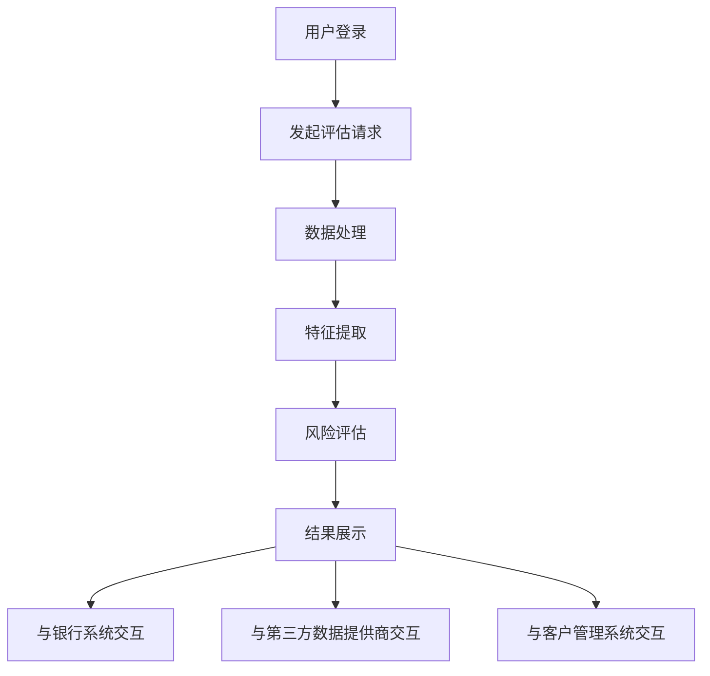

                 


### 第1章: 智能信用评估概述

#### 1.1.1 信用评估的定义与历史

信用评估，是指通过对一个主体的信用状况进行综合分析，对其信用风险进行评价的过程。信用评估的历史可以追溯到19世纪末期，当时的银行和金融机构开始使用信用评级来评估客户的信用状况。随着技术的发展，信用评估逐渐从人工判断转变为基于数据的量化评估。

在信用评估的发展过程中，20世纪60年代和70年代是信用评分模型的黄金时期。银行和金融机构开始大量采用统计模型进行信用评估，如线性回归、逻辑回归等。这些模型通过分析客户的信用历史、收入、债务等因素，预测客户违约的概率。

进入20世纪80年代和90年代，随着计算机技术和数据科学的快速发展，信用评估模型变得更加复杂和精确。机器学习算法的应用使得信用评估模型能够处理大量复杂数据，提高评估的准确性。

近年来，人工智能技术的兴起，尤其是深度学习的应用，使得信用评估模型再次迎来了新的变革。通过使用深度学习算法，信用评估模型能够从大量非结构化数据中提取特征，实现更高层次的智能化评估。

#### 1.1.2 智能信用评估的定义与意义

智能信用评估，是指利用人工智能技术，特别是机器学习和深度学习算法，对信用数据进行自动分析和处理，从而实现信用评分和风险预测的过程。与传统信用评估相比，智能信用评估具有以下优势：

1. **更高精度**：智能信用评估能够处理更多的数据维度，从多方面对客户的信用状况进行评估，提高评估的准确性。
2. **实时性**：智能信用评估可以实时更新客户数据，快速响应信用变化，及时调整信用评分。
3. **自适应**：智能信用评估模型能够根据数据的变化自动调整模型参数，提高模型的适应能力。
4. **降低成本**：智能信用评估能够自动化处理大量的信用评估任务，降低人工成本。

智能信用评估的意义主要体现在以下几个方面：

1. **优化贷款审批流程**：智能信用评估能够快速、准确地评估客户的信用状况，帮助金融机构优化贷款审批流程，提高审批效率。
2. **降低信用风险**：通过智能信用评估，金融机构可以更准确地识别高风险客户，降低信用风险，保障金融安全。
3. **提升客户体验**：智能信用评估可以为客户提供更个性化的服务，提高客户满意度。
4. **促进金融创新**：智能信用评估的应用，可以推动金融行业的数字化转型，促进金融创新。

#### 1.1.3 AI在风险控制中的应用现状与发展趋势

人工智能技术在风险控制中的应用已经取得了显著的成果。在金融领域，AI技术被广泛应用于信用评估、反欺诈、风险预警等方面。

1. **信用评估**：通过机器学习和深度学习算法，金融机构可以实现对客户信用风险的精准评估，提高贷款审批的准确性。
2. **反欺诈**：AI技术可以自动识别和预测欺诈行为，帮助金融机构降低欺诈风险。
3. **风险预警**：通过大数据分析和机器学习算法，金融机构可以实时监测市场风险，提前预警，采取防范措施。

然而，AI在风险控制中的应用仍存在一些挑战：

1. **数据隐私与安全**：在应用AI技术进行风险控制时，需要处理大量的个人数据，这对数据隐私和安全提出了更高的要求。
2. **模型透明性与可解释性**：深度学习等复杂算法的模型往往具有很高的预测能力，但其内部工作机制不透明，这对模型的解释性和可解释性提出了挑战。
3. **算法公平性与公正性**：AI算法在处理数据时可能会出现偏见，导致算法对某些群体不公平，这对算法的公平性和公正性提出了挑战。

未来，随着技术的不断进步，AI在风险控制中的应用前景将更加广阔。一方面，将会有更多的数据可以被收集和利用，为AI模型提供更丰富的训练数据；另一方面，AI算法将不断优化，提高预测的准确性和模型的透明性。此外，AI技术在伦理和法律方面的规范也将不断完善，为AI在风险控制中的应用提供更坚实的保障。

### 1.2 智能信用评估的核心概念

为了深入理解智能信用评估，我们需要明确几个核心概念，这些概念包括信用评分模型、数据来源与预处理，以及信用评估与风险控制的关系。

#### 1.2.1 信用评分模型

信用评分模型是智能信用评估的核心工具，它通过对客户的历史数据进行分析，预测客户违约的概率。信用评分模型可以分为以下几类：

1. **基于传统统计模型的信用评分**：这类模型主要包括线性回归、逻辑回归等，它们通过分析客户的历史数据，建立数学模型来预测违约概率。线性回归模型简单直观，但只能处理线性关系；逻辑回归模型能够处理非线性关系，并且可以提供概率预测。

2. **基于机器学习模型的信用评分**：机器学习模型包括决策树、随机森林、支持向量机等，它们能够处理更复杂的数据结构和非线性关系。这些模型通过学习历史数据，提取特征，构建模型，从而实现对客户信用风险的预测。

3. **基于深度学习模型的信用评分**：深度学习模型，如卷积神经网络（CNN）和循环神经网络（RNN），能够处理大量非结构化数据，提取高层次的特征。这些模型在处理复杂信用评估任务时，表现出色。

每种模型都有其优缺点。传统统计模型简单易懂，但处理能力有限；机器学习模型处理能力更强，但需要大量数据；深度学习模型能够处理复杂数据，但模型训练复杂，计算资源需求高。

#### 1.2.2 数据来源与预处理

信用评估的关键在于数据的质量和完整性。数据来源可以包括以下几个方面：

1. **内部数据**：来自金融机构的内部数据，如客户的贷款记录、还款记录、信用额度等。

2. **外部数据**：来自公共记录的数据，如司法判决、工商注册信息、社交网络行为等。

3. **第三方数据**：来自第三方数据提供商的数据，如信用报告、风险评估等。

在收集数据后，需要进行预处理，以保证数据的质量。预处理包括以下步骤：

1. **数据清洗**：去除重复数据、缺失数据、异常数据等。

2. **数据归一化**：将不同量纲的数据转换到同一量纲，以便进行后续分析。

3. **特征工程**：通过数据变换、特征选择等方法，提取对信用评估有用的特征。

4. **数据验证**：对处理后的数据进行验证，确保数据的准确性和一致性。

#### 1.2.3 信用评估与风险控制的关系

信用评估是风险控制的重要组成部分。风险控制的目标是识别和降低潜在的风险，保护金融机构的利益。信用评估在风险控制中扮演以下角色：

1. **风险评估**：通过信用评估模型，对客户的信用风险进行量化评估，为风险控制提供依据。

2. **风险预警**：通过实时监控客户的信用数据，发现潜在的风险，提前预警，采取防范措施。

3. **风险决策**：基于信用评估结果，制定贷款审批、授信额度等风险控制策略。

4. **风险监测**：通过定期评估客户的信用状况，监测风险变化，调整风险控制策略。

总之，信用评估与风险控制密不可分，智能信用评估平台的建设，将进一步提升金融机构的风险控制能力，保障金融市场的稳定。

### 1.3 智能信用评估与风险控制的关系

智能信用评估作为现代金融风险控制的重要手段，其核心在于通过先进的算法和大数据技术，对客户的信用状况进行精确评估，从而帮助企业降低信用风险，优化信贷管理。下面我们将深入探讨智能信用评估在风险控制中的重要性、具体应用，以及它对企业风险控制能力的提升作用。

#### 1.3.1 风险评估的重要性

在金融行业中，信用风险是最主要的风险类型之一。对于银行、金融机构以及信贷机构来说，准确评估客户的信用风险是确保资产安全和业务稳定的关键。传统信用评估方法通常依赖于客户的信用历史、财务报表等有限信息，往往难以全面、准确地反映客户的真实信用状况。而智能信用评估通过引入人工智能技术，可以处理和分析海量的数据，包括但不限于社交网络行为、消费习惯、职业稳定性等，从而提供更为细致和全面的信用风险评估。

风险评估的重要性体现在以下几个方面：

1. **贷款审批效率**：智能信用评估能够快速分析客户数据，提供信用评分，大大提高了贷款审批的速度和效率。

2. **风险识别**：通过智能信用评估，金融机构可以及时发现潜在的高风险客户，避免不良贷款的发生。

3. **资产安全**：准确的风险评估有助于金融机构更好地管理资产，降低信用风险，保障金融机构的财务健康。

4. **业务发展**：智能信用评估为企业提供了更为科学的信用评价体系，有助于扩大信贷业务规模，推动业务发展。

#### 1.3.2 智能信用评估在风险评估中的应用

智能信用评估的应用主要包括以下几个方面：

1. **数据收集与整合**：智能信用评估首先需要收集大量的数据，包括客户的信用记录、财务信息、社交行为等。然后通过数据清洗和预处理，将这些数据进行整合，形成一个全面、准确的客户数据集。

2. **特征提取与选择**：在数据预处理的基础上，利用机器学习和深度学习算法，从海量数据中提取对信用评估有意义的特征。这些特征可以是客户的财务状况、行为习惯、职业稳定性等。特征选择过程需要通过模型训练和评估，筛选出对信用评分有显著影响的关键特征。

3. **模型训练与优化**：使用历史数据集，通过机器学习和深度学习算法训练信用评分模型。在模型训练过程中，需要不断调整模型参数，优化模型性能，使其能够更好地预测客户的信用风险。

4. **风险评估与决策**：通过训练好的模型，对新的客户数据进行风险评估，预测客户违约的概率。金融机构可以根据风险评估结果，制定相应的信贷政策，如贷款审批条件、贷款额度、还款期限等。

#### 1.3.3 智能信用评估提升风险控制的潜在影响

智能信用评估在提升企业风险控制能力方面具有显著的潜力，具体体现在以下几个方面：

1. **提升决策质量**：智能信用评估能够提供更为精确和全面的信用评分，帮助金融机构做出更为科学的信贷决策，降低信用风险。

2. **优化资源配置**：通过智能信用评估，金融机构可以更加合理地配置信贷资源，提高资金使用效率，降低运营成本。

3. **防范欺诈风险**：智能信用评估可以通过分析客户的交易行为、社交网络数据等，及时发现和防范欺诈行为，保护金融机构的利益。

4. **提高客户满意度**：智能信用评估可以帮助金融机构提供更为个性化的服务，提高客户的满意度和忠诚度。

5. **推动金融创新**：智能信用评估为金融机构提供了新的业务模式和服务方式，有助于推动金融行业的创新和发展。

总之，智能信用评估作为一种新兴的风险控制工具，其在提升企业风险控制能力方面的作用不可忽视。通过深入研究和应用智能信用评估技术，金融机构可以更好地管理信用风险，确保金融市场的稳定和健康发展。

### 1.4 智能信用评估系统的边界与外延

智能信用评估系统的设计与实施是一个复杂的过程，涉及多个维度和层次。为了确保系统的有效性和可靠性，我们需要明确系统的边界和外延，并了解其核心要素。

#### 1.4.1 系统边界定义

系统的边界定义是确保智能信用评估系统功能定位清晰、职责明确的关键步骤。具体来说，系统边界包括以下几个方面：

1. **数据输入边界**：系统需要从多个数据源（如内部数据库、第三方数据提供商）收集和处理数据。这些数据包括客户的信用记录、财务报表、社会行为数据等。系统的数据输入边界需要明确数据收集的渠道、频率和格式，以保证数据的完整性和准确性。

2. **功能范围边界**：智能信用评估系统的主要功能包括数据预处理、特征提取、模型训练、风险评估和结果输出。系统的功能范围边界需要明确每个功能模块的具体任务和职责，以确保系统的协调运作。

3. **接口边界**：系统需要与外部系统（如银行系统、CRM系统等）进行数据交互和功能协同。接口边界需要明确系统的数据接口、功能接口和技术接口，确保系统的集成性和扩展性。

4. **技术实现边界**：系统需要选择合适的技术栈和框架，以实现功能需求。技术实现边界需要明确系统的技术架构、编程语言、数据库选择等，以确保系统的稳定性和性能。

#### 1.4.2 系统外延拓展

智能信用评估系统的外延拓展是指系统在功能、性能、数据和技术上的扩展能力。外延拓展的目的是为了满足不断变化的市场需求和业务发展。具体来说，系统外延拓展包括以下几个方面：

1. **数据扩展**：随着业务的发展，系统需要能够接入更多类型的客户数据，如行为数据、地理位置数据等。数据扩展需要考虑数据来源的多样性和数据格式的统一性，以确保数据的有效利用。

2. **功能扩展**：系统需要支持更多的功能需求，如实时风险评估、信用风险监控、反欺诈检测等。功能扩展需要考虑系统的模块化和可扩展性，以便快速适应新的业务需求。

3. **性能扩展**：随着业务量的增加，系统需要能够处理更大的数据量和更高的并发请求。性能扩展需要考虑系统的优化和升级，如分布式架构、缓存机制、负载均衡等。

4. **技术扩展**：随着技术的进步，系统需要能够引入新的技术和算法，如深度学习、区块链等。技术扩展需要考虑系统的兼容性和技术迭代策略，以确保系统的长期发展。

#### 1.4.3 智能信用评估系统的核心要素

智能信用评估系统的核心要素是确保系统能够有效、可靠地运行的关键组件。具体来说，核心要素包括以下几个方面：

1. **数据层**：数据层是系统的基石，包括数据收集、存储、处理和管理。数据层需要确保数据的完整性、准确性和安全性。

2. **算法层**：算法层是系统的核心，包括信用评分模型的构建、训练和优化。算法层需要选择合适的机器学习和深度学习算法，以实现高效的信用评估。

3. **模型层**：模型层是系统的决策层，包括模型的部署、监控和调整。模型层需要确保模型的稳定性和可靠性，以提供准确的信用评估结果。

4. **接口层**：接口层是系统的连接层，包括系统的外部接口和内部接口。接口层需要确保系统的数据交互和功能协同，以提高系统的集成性和可扩展性。

5. **用户层**：用户层是系统的使用界面，包括用户的操作界面、报表输出和决策支持。用户层需要确保系统的易用性和用户体验，以提高用户的满意度。

总之，智能信用评估系统的边界与外延、核心要素的设计与实施，是确保系统有效性和可靠性的关键。通过明确系统的边界、拓展系统外延、优化核心要素，可以构建一个高效、可靠的智能信用评估系统，为企业风险控制提供有力支持。

## 1.5 本章小结

本章我们对智能信用评估进行了全面的概述，包括其定义、历史发展、核心概念和风险控制的关系。通过介绍信用评估的定义与历史，我们了解到信用评估的起源和发展，以及AI技术在其中的应用现状。智能信用评估通过利用机器学习和深度学习算法，实现了信用评分模型的智能化，提高了评估的精度和实时性。

在核心概念部分，我们详细讲解了信用评分模型的分类、数据来源与预处理，以及信用评估与风险控制的关系。这些核心概念为我们后续的算法讲解和系统设计奠定了基础。

通过探讨智能信用评估与风险控制的关系，我们认识到其在风险评估、风险预警和风险决策等方面的重要性，以及对企业风险控制能力的提升作用。

最后，我们对智能信用评估系统的边界与外延、核心要素进行了探讨，明确了系统设计与实施的关键步骤。这些内容为构建一个高效、可靠的智能信用评估平台提供了理论依据和实践指导。

总结来说，智能信用评估作为一种先进的风险控制手段，其应用前景广阔，通过深入研究和实践，将有助于优化金融风险控制体系，推动金融行业的健康发展。让我们在下一章中继续探讨具体的算法原理和应用。

----------------------------------------------------------------

## 第2章: 机器学习算法在信用评估中的应用

### 2.1.1 机器学习基础

机器学习，是人工智能的一个重要分支，它通过构建算法模型，让计算机从数据中自动学习规律，进行预测和决策。在信用评估中，机器学习算法能够处理大量的数据，从中提取有用的信息，帮助金融机构进行信用风险的评估。

#### 2.1.1.1 机器学习概述

机器学习的基本概念包括以下几个方面：

1. **模型**：模型是机器学习算法的核心，它通过学习和预测来表示数据之间的关系。常见的机器学习模型包括线性回归、决策树、支持向量机等。

2. **数据集**：数据集是机器学习的训练基础，包括输入特征和对应的标签。在信用评估中，数据集通常包含客户的信用记录、财务状况、历史行为等。

3. **评估指标**：评估指标用于衡量模型性能，常见的指标包括准确率、召回率、F1值等。

4. **训练与测试**：训练集用于训练模型，测试集用于评估模型性能。在信用评估中，我们需要确保模型在测试集上的性能良好，以保证其在实际应用中的有效性。

#### 2.1.1.2 监督学习、无监督学习与强化学习

机器学习可以分为监督学习、无监督学习和强化学习三种类型：

1. **监督学习**：监督学习是一种最常见的机器学习方式，它需要一个标注过的数据集，即每个样本都有对应的标签。模型通过学习这些标签来预测新的样本。在信用评估中，监督学习常用于构建信用评分模型，如逻辑回归、决策树等。

2. **无监督学习**：无监督学习不使用标注过的数据集，模型通过分析数据之间的内在结构来发现规律。无监督学习在信用评估中的应用较少，但可以用于数据探索、聚类分析等。

3. **强化学习**：强化学习通过奖励机制来训练模型，模型在每一次决策中都会获得奖励，并根据奖励来调整策略。在信用评估中，强化学习可以用于动态调整信用评分策略，以适应不断变化的市场环境。

#### 2.1.2 传统机器学习算法

传统机器学习算法是信用评估的基础，包括线性回归、决策树、支持向量机和随机森林等。

1. **线性回归**：线性回归是最简单的机器学习算法之一，它通过建立线性关系来预测连续值。在信用评估中，线性回归可以用于预测客户违约的概率。

2. **决策树**：决策树通过树形结构来表示决策规则，每个节点表示一个特征，每个分支表示一个决策。决策树在信用评估中可以用于分类任务，如判断客户是否违约。

3. **支持向量机**：支持向量机通过找到一个最佳的超平面，将不同类别的数据分开。在信用评估中，支持向量机可以用于分类任务，提高信用评估的精度。

4. **随机森林**：随机森林是由多个决策树组成的集成模型，它通过随机抽样和特征选择来构建多个决策树，并通过投票来获得最终预测结果。随机森林在信用评估中具有较高的准确性和鲁棒性。

#### 2.1.3 特征工程与选择

特征工程是机器学习过程中非常重要的一步，它通过选择和转换特征，提高模型的性能。在信用评估中，特征工程包括以下几个方面：

1. **特征选择**：特征选择旨在从原始特征中筛选出对信用评估有重要影响的关键特征。常见的特征选择方法包括信息增益、互信息、主成分分析等。

2. **特征转换**：特征转换包括归一化、标准化、离散化等操作，目的是将不同量纲的特征转换为同一量纲，以便进行后续分析。

3. **特征组合**：特征组合通过组合多个特征来生成新的特征，以提高模型的性能。常见的特征组合方法包括特征交叉、特征融合等。

#### 2.1.4 评估指标

评估指标是衡量机器学习模型性能的重要工具，常见的评估指标包括准确率、召回率、F1值、ROC曲线和AUC值等。

1. **准确率**：准确率是模型预测正确的样本数与总样本数的比例，用于衡量模型的分类能力。

2. **召回率**：召回率是模型预测为正类的负类样本数与实际负类样本数的比例，用于衡量模型对负类的识别能力。

3. **F1值**：F1值是准确率和召回率的调和平均值，用于衡量模型的平衡性能。

4. **ROC曲线**：ROC曲线是模型在不同阈值下的准确率和召回率的图形表示，用于评估模型的分类性能。

5. **AUC值**：AUC值是ROC曲线下方的面积，用于衡量模型区分正负类的能力。

通过以上内容，我们对机器学习在信用评估中的应用有了基本的了解。接下来，我们将深入探讨深度学习算法在信用评估中的应用。

### 3.1.1 深度学习基础

深度学习是机器学习的一个重要分支，它通过构建多层的神经网络模型，对数据进行自动学习和特征提取。深度学习在信用评估中的应用，使得模型能够从海量数据中提取复杂特征，实现更高的预测精度。

#### 3.1.1.1 神经网络概述

神经网络（Neural Network，NN）是深度学习的基础模型，它由多个神经元（节点）组成，每个神经元通过权重和偏置对输入数据进行加权求和处理。神经网络可以分为输入层、隐藏层和输出层：

1. **输入层**：接收外部输入数据，如客户的信用记录、财务报表等。

2. **隐藏层**：对输入数据进行处理和特征提取，隐藏层可以是单层或多层。

3. **输出层**：生成最终预测结果，如客户违约的概率。

神经网络的训练过程是通过反向传播算法（Backpropagation Algorithm）来调整网络中的权重和偏置，使得网络能够准确预测新的数据。

#### 3.1.1.2 反向传播算法

反向传播算法是神经网络训练的核心算法，它通过计算输出层误差，反向传播到隐藏层，逐层调整权重和偏置。反向传播算法包括以下几个步骤：

1. **前向传播**：将输入数据通过神经网络前向传播，计算输出层的预测值。

2. **计算误差**：将预测值与实际标签进行比较，计算输出层的误差。

3. **反向传播**：将误差反向传播到隐藏层，计算每个隐藏层的误差。

4. **权重调整**：根据误差调整每个神经元的权重和偏置，以减小误差。

5. **迭代优化**：重复以上步骤，直到模型收敛，即误差达到预设的阈值。

通过反向传播算法，神经网络能够不断优化自身的参数，实现更高精度的预测。

#### 3.1.2 基础深度学习模型

在信用评估中，常用的深度学习模型包括卷积神经网络（CNN）、循环神经网络（RNN）和长短期记忆网络（LSTM）。这些模型在特征提取和序列数据处理方面表现出色。

1. **卷积神经网络（CNN）**

卷积神经网络是深度学习中的经典模型，它通过卷积操作提取图像或序列中的局部特征。在信用评估中，CNN可以用于处理客户的财务报表、交易记录等图像或序列数据。

- **卷积层**：通过卷积操作提取输入数据的局部特征，如边缘、纹理等。

- **池化层**：对卷积层的结果进行下采样，减少数据维度，提高计算效率。

- **全连接层**：将卷积层和池化层的特征映射到输出层，生成最终的预测结果。

2. **循环神经网络（RNN）**

循环神经网络是处理序列数据的经典模型，它能够记住序列中的历史信息，并在后续步骤中利用这些信息进行预测。

- **隐藏层**：对输入序列进行递归处理，生成隐藏状态。

- **循环连接**：隐藏层通过循环连接，将前一个时间步的隐藏状态传递到当前时间步，实现序列信息的记忆。

- **输出层**：将隐藏状态映射到输出层，生成最终的预测结果。

3. **长短期记忆网络（LSTM）**

长短期记忆网络是RNN的改进模型，它通过引入门控机制，解决了RNN在处理长序列数据时存在的梯度消失和梯度爆炸问题。

- **输入门**：决定当前输入数据中哪些信息需要被记忆。

- **遗忘门**：决定哪些历史信息需要被遗忘。

- **输出门**：决定当前隐藏状态中哪些信息需要被输出。

- **单元状态**：通过输入门、遗忘门和输出门的组合，实现对历史信息的记忆和输出。

通过以上基础深度学习模型，我们能够在信用评估中处理复杂的数据，实现更准确的预测。

### 3.1.3 特征提取与融合

在深度学习模型中，特征提取与融合是关键步骤，它决定了模型的学习能力和预测性能。特征提取与融合主要涉及以下几个方面：

#### 3.1.3.1 基于CNN的特征提取

卷积神经网络通过卷积操作提取输入数据的局部特征，如边缘、纹理等。在信用评估中，基于CNN的特征提取可以应用于处理客户的财务报表、交易记录等图像或序列数据。

- **卷积层**：通过卷积操作提取输入数据的局部特征，如边缘、纹理等。

- **池化层**：对卷积层的结果进行下采样，减少数据维度，提高计算效率。

- **全连接层**：将卷积层和池化层的特征映射到输出层，生成最终的预测结果。

#### 3.1.3.2 基于RNN的特征提取

循环神经网络通过递归处理输入序列，生成隐藏状态，实现对序列特征的提取。在信用评估中，基于RNN的特征提取可以应用于处理客户的信用记录、交易序列等时间序列数据。

- **隐藏层**：对输入序列进行递归处理，生成隐藏状态。

- **循环连接**：隐藏层通过循环连接，将前一个时间步的隐藏状态传递到当前时间步，实现序列信息的记忆。

- **输出层**：将隐藏状态映射到输出层，生成最终的预测结果。

#### 3.1.3.3 特征融合策略

特征融合是提高深度学习模型预测性能的重要手段，通过融合不同来源的特征，可以增强模型的学习能力。常见的特征融合策略包括以下几种：

1. **级联模型**：通过级联多个不同的特征提取模型，将不同层次的特征进行融合。例如，先使用CNN提取图像特征，再使用RNN提取序列特征，最后将两种特征进行融合。

2. **注意力机制**：通过注意力机制，模型可以根据不同特征的重要程度，对其进行加权融合。例如，在处理客户的财务报表和信用记录时，模型可以自动识别出哪些部分对信用评估更重要。

3. **多模态数据融合**：将不同类型的数据（如文本、图像、语音等）进行融合，提高模型的泛化能力。例如，在信用评估中，可以将客户的信用报告、财务报表和交易记录进行融合，生成更全面的信用评分。

#### 3.1.3.4 特征融合的优势

特征融合具有以下几个优势：

1. **提高预测精度**：通过融合不同来源的特征，模型可以捕捉到更多的信息，提高预测精度。

2. **增强模型鲁棒性**：特征融合可以减少单一特征可能带来的过拟合现象，增强模型的鲁棒性。

3. **提升模型泛化能力**：通过融合多种类型的数据，模型可以更好地适应不同的数据分布，提高泛化能力。

综上所述，特征提取与融合是深度学习模型在信用评估中的重要环节，通过合理的特征提取和融合策略，可以构建更强大的信用评估模型，提高信用评估的准确性和可靠性。

### 3.1.4 深度学习模型优化

在深度学习模型训练过程中，模型优化是一个至关重要的环节，它直接影响模型的性能和预测效果。优化深度学习模型主要包括以下几个方面：

#### 3.1.4.1 损失函数优化

损失函数是衡量模型预测结果与真实标签之间差异的指标，其优化目标是减小损失函数值，提高模型性能。在信用评估中，常见的损失函数包括均方误差（MSE）、交叉熵损失等。

1. **均方误差（MSE）**：均方误差是预测值与真实值之间差的平方的平均值。在信用评估中，MSE常用于回归任务，如预测客户违约的概率。

   $$MSE = \frac{1}{n}\sum_{i=1}^{n}(y_i - \hat{y}_i)^2$$
   
   其中，$y_i$为真实标签，$\hat{y}_i$为预测值。

2. **交叉熵损失**：交叉熵损失是用于分类任务的损失函数，它衡量的是模型预测概率分布与真实标签分布之间的差异。在信用评估中，交叉熵损失常用于二分类任务，如判断客户是否违约。

   $$H(y, \hat{y}) = -\sum_{i=1}^{n}y_i \log(\hat{y}_i)$$

   其中，$y_i$为真实标签（0或1），$\hat{y}_i$为预测概率。

通过优化损失函数，模型能够更好地调整权重和偏置，提高预测性能。

#### 3.1.4.2 激活函数优化

激活函数是深度学习模型中的一个关键组件，它用于引入非线性变换，使得模型能够拟合复杂的数据关系。常见的激活函数包括Sigmoid、ReLU、Tanh等。

1. **Sigmoid函数**：Sigmoid函数将输入值映射到$(0, 1)$区间，常用于二分类问题。

   $$\sigma(x) = \frac{1}{1 + e^{-x}}$$

2. **ReLU函数**：ReLU函数（Rectified Linear Unit）是一种简单的线性激活函数，它将输入值大于0的部分保持不变，小于0的部分设置为0。

   $$\text{ReLU}(x) = \max(0, x)$$

3. **Tanh函数**：Tanh函数将输入值映射到$(-1, 1)$区间，常用于多层感知机（MLP）模型。

   $$\tanh(x) = \frac{e^x - e^{-x}}{e^x + e^{-x}}$$

优化激活函数的选择和参数设置，有助于提高模型的训练效率和预测性能。

#### 3.1.4.3 优化方法

为了优化深度学习模型，我们可以采用以下几种方法：

1. **批量归一化（Batch Normalization）**：批量归一化通过对每一批数据进行标准化处理，减轻了梯度消失和梯度爆炸现象，提高了模型的训练稳定性。

2. **学习率调整**：学习率是模型训练过程中的一个重要参数，适当的调整学习率可以加快模型收敛速度。常用的学习率调整策略包括固定学习率、学习率衰减、自适应学习率等。

3. **权重初始化**：合理的权重初始化有助于提高模型训练效率和收敛速度。常用的权重初始化方法包括高斯初始化、Xavier初始化等。

4. **正则化技术**：正则化技术如L1正则化、L2正则化等，可以防止模型过拟合，提高模型的泛化能力。

通过以上优化方法，我们可以构建一个高效、稳定的深度学习模型，提高信用评估的准确性和可靠性。

### 4.1.1 多模型融合概述

在信用评估领域，单一模型往往难以应对复杂多变的数据环境和需求。多模型融合通过结合多个模型的优点，提高预测的准确性和鲁棒性。多模型融合的基本思想是利用不同的模型对同一问题进行建模，然后将这些模型的预测结果进行综合，得到最终的预测结果。

#### 4.1.1.1 融合的优势

多模型融合具有以下优势：

1. **提高预测准确性**：多个模型可以从不同的角度和维度对数据进行建模，从而捕捉到更多有用的信息，提高预测的准确性。

2. **增强鲁棒性**：不同模型可能对特定类型的数据具有不同的优势，多模型融合可以增强模型的鲁棒性，降低对单一模型的依赖。

3. **减少过拟合**：多模型融合可以通过模型之间的互补性，减少单一模型可能出现的过拟合现象，提高模型的泛化能力。

4. **增强适应性**：多模型融合可以根据不同的应用场景和需求，动态调整模型组合，提高系统的适应性。

#### 4.1.1.2 融合的方法

多模型融合的方法可以分为以下几种：

1. **简单平均法**：将多个模型的预测结果进行简单平均，得到最终的预测结果。这种方法计算简单，但可能会忽视模型之间的差异。

2. **加权平均法**：根据不同模型的性能和重要性，为每个模型分配不同的权重，然后进行加权平均，得到最终的预测结果。这种方法可以更好地利用模型的优点，提高预测准确性。

3. **集成学习方法**：集成学习方法包括堆叠（Stacking）、提升（Boosting）等，通过构建一个集成模型，对多个模型进行整合，提高预测性能。

4. **特征级融合**：在特征级融合中，将多个模型的特征进行组合，形成新的特征，然后使用新的特征进行建模。这种方法可以增强特征的表达能力，提高预测性能。

5. **模型级融合**：在模型级融合中，直接将多个模型的预测结果进行融合，得到最终的预测结果。这种方法适用于模型之间具有互补性的情况。

#### 4.1.1.3 融合策略

在多模型融合中，合理的融合策略是关键。以下是一些常见的融合策略：

1. **基于性能的融合策略**：根据不同模型的预测性能，选择性能较好的模型进行融合。这种方法简单有效，但需要足够的数据和模型评估结果。

2. **基于知识的融合策略**：利用专家知识，对模型进行组合和调整，提高预测性能。这种方法需要丰富的领域知识和经验。

3. **基于数据的融合策略**：通过分析数据的特点和分布，动态调整模型组合，提高预测准确性。这种方法需要较强的数据分析能力和算法优化能力。

4. **混合融合策略**：将多种融合策略结合使用，根据实际情况动态调整。这种方法可以灵活应对不同场景和需求，提高系统的整体性能。

通过多模型融合，我们可以在信用评估中构建更强大、更可靠的预测模型，提高信用评估的准确性和适应性。

### 4.1.2 多模型融合策略

在信用评估中，多模型融合策略通过结合多个模型的优势，提高预测准确性和鲁棒性。以下是一些常见的多模型融合策略：

#### 4.1.2.1 多模型集成方法

多模型集成方法是指将多个模型的结果进行融合，以得到最终的预测结果。这种方法通过利用不同模型的特性，减少单一模型的过拟合现象，提高预测性能。

1. **堆叠（Stacking）**：堆叠是一种层次式的模型集成方法，它首先使用多个基学习器对训练数据进行预测，然后将这些预测结果作为新的特征，输入到一个更高的层次模型中进行融合。常见的堆叠方法包括Bagging和Boosting。

   - **Bagging**：Bagging通过随机抽样训练集，构建多个基学习器，然后对它们的预测结果进行平均。这种方法可以提高模型的稳定性和泛化能力。
   
   - **Boosting**：Boosting通过加权训练集，逐渐提升弱学习器的性能。常见的Boosting算法包括Adaboost和XGBoost。Boosting方法可以显著提高模型的预测性能，但需要处理训练数据不平衡的问题。

2. **混合模型（Hybrid Model）**：混合模型通过结合不同类型的模型，如神经网络、决策树、支持向量机等，构建一个综合性能更强的模型。这种方法可以充分利用不同模型的优势，提高预测准确性。

3. **集成学习（Ensemble Learning）**：集成学习是一种广义的多模型融合方法，它通过构建多个基学习器，然后对它们的预测结果进行融合。常见的集成学习方法包括Bagging、Boosting和Stacking。

#### 4.1.2.2 融合方法的比较与选择

不同的多模型融合方法在预测性能、计算复杂度和应用场景上有所不同，选择合适的融合方法需要根据实际情况进行权衡。

1. **预测性能**：堆叠方法和混合模型通常在预测性能上优于单一模型，但集成学习方法的性能取决于基学习器的选择和融合策略。

2. **计算复杂度**：堆叠方法的计算复杂度较高，因为它需要在多个层次上进行预测和融合。混合模型和集成学习方法的计算复杂度相对较低。

3. **应用场景**：堆叠方法适用于需要较高预测性能的场景，混合模型适用于结合不同模型特性的场景，集成学习方法适用于需要平衡预测性能和计算复杂度的场景。

在选择多模型融合方法时，可以考虑以下因素：

- **数据特点**：根据数据的特点，选择适合的模型和融合方法。例如，对于不平衡数据，可以采用Boosting方法。
- **模型性能**：评估不同模型的性能，选择性能较好的模型进行融合。
- **计算资源**：考虑计算资源的限制，选择计算复杂度较低的融合方法。
- **应用需求**：根据应用需求，选择能够满足需求的融合方法。例如，在需要实时预测的场景中，可以选择简单平均法或加权平均法。

通过合理选择和多模型融合策略，我们可以构建一个高效、可靠的信用评估模型，提高信用评估的准确性和适应性。

## 第4章: 多模型融合与优化

### 4.2.1 多模型融合

多模型融合（Ensemble Learning）是一种将多个模型的结果进行组合，以获得更优预测性能的技术。多模型融合能够减少单一模型的过拟合现象，提高模型的鲁棒性和泛化能力。

#### 4.2.1.1 融合策略

多模型融合的策略可以分为以下几类：

1. **平均法**：简单平均法（Simple Average）和加权平均法（Weighted Average）是最常见的融合策略。

   - **简单平均法**：将多个模型的预测结果进行简单平均，得到最终的预测结果。
     
     $$\hat{y}_{\text{avg}} = \frac{1}{M}\sum_{i=1}^{M}\hat{y}_i$$
     
     其中，$M$是模型的数量，$\hat{y}_i$是第$i$个模型的预测结果。
   
   - **加权平均法**：根据不同模型的性能或重要性，为每个模型分配不同的权重，然后进行加权平均。

     $$\hat{y}_{\text{avg}} = \sum_{i=1}^{M}w_i\hat{y}_i$$
     
     其中，$w_i$是第$i$个模型的权重，且$\sum_{i=1}^{M}w_i = 1$。

2. **投票法**：在分类问题中，投票法（Voting）是另一种常见的融合策略。根据每个模型的预测结果进行投票，选择出现次数最多的类别作为最终预测结果。

   - **硬投票法**（Hard Voting）：直接选择出现次数最多的类别。

     $$\hat{y}_{\text{vote}} = \arg\max_{y}\sum_{i=1}^{M}\mathbb{1}\{y_i = y\}$$

     其中，$\mathbb{1}\{\cdot\}$是指示函数，当条件为真时取值为1，否则为0。
   
   - **软投票法**（Soft Voting）：利用每个模型的预测概率进行投票，得到最终预测概率。

     $$\hat{y}_{\text{vote}} = \arg\max_{y}\sum_{i=1}^{M}\hat{y}_{i,y}$$
     
     其中，$\hat{y}_{i,y}$是第$i$个模型对于类别$y$的预测概率。

3. **Stacking**：Stacking（堆叠）是一种分层模型融合的方法。首先训练多个基学习器，然后将它们的预测结果作为新的特征输入到一个更高层次的学习器中进行融合。Stacking可以提高模型的预测性能，特别是当基学习器之间存在互补性时。

4. **Bagging**：Bagging（捆绑）是通过Bootstrap采样构建多个训练集，每个训练集上训练一个基学习器，然后进行融合。Bagging方法可以减少模型的方差，提高模型的泛化能力。

5. **Boosting**：Boosting（提升）是一种将训练集中的一部分样本赋予更高的权重，重复训练基学习器，以减少整体误差。常见的Boosting算法包括AdaBoost和XGBoost。Boosting方法可以提高模型的预测性能，但可能增加模型的偏差。

#### 4.2.1.2 融合方法的比较

不同的融合方法适用于不同的场景和需求，下面是几种常见方法的比较：

1. **简单平均法**：计算简单，但当模型之间存在较大差异时，效果可能不理想。
2. **加权平均法**：可以根据模型的性能进行加权，提高融合效果，但需要评估模型的性能。
3. **投票法**：适用于分类问题，硬投票法简单直观，但可能受到少数模型的噪声影响；软投票法考虑了模型的预测概率，但计算复杂度较高。
4. **Stacking**：适用于模型之间存在互补性时，可以提高预测性能，但实现较为复杂。
5. **Bagging**：适用于减少模型的方差，提高模型的泛化能力，但在模型之间存在较大差异时，效果可能不显著。
6. **Boosting**：可以提高模型的预测性能，特别是对于欠拟合问题，但可能增加模型的偏差。

选择合适的融合方法需要根据具体的应用场景、模型特性以及计算资源进行权衡。

### 4.2.2 融合模型优化

融合模型的优化主要集中在提高模型的预测性能和鲁棒性。以下是一些优化策略：

#### 4.2.2.1 模型选择与训练

1. **基学习器选择**：选择性能稳定的基学习器，如决策树、随机森林、支持向量机等。对于复杂问题，可以考虑结合不同类型的模型。
2. **训练策略**：调整基学习器的训练策略，如学习率、迭代次数、正则化参数等，以提高模型性能。
3. **数据预处理**：对训练数据进行预处理，如数据归一化、缺失值处理等，以减少数据对模型的影响。

#### 4.2.2.2 融合权重调整

1. **手动调整**：根据模型的性能和重要性，手动调整每个模型的权重。
2. **自动调整**：使用优化算法，如梯度下降、遗传算法等，自动调整融合权重，以获得最优性能。
3. **基于性能的权重调整**：根据基学习器在验证集上的性能，动态调整权重，以平衡预测性能和计算复杂度。

#### 4.2.2.3 模型融合机制优化

1. **特征级融合**：在特征级进行融合，将不同模型提取的特征进行组合，形成新的特征，以提高模型的预测能力。
2. **模型级融合**：在模型级进行融合，将多个模型的输出进行融合，以获得最终的预测结果。
3. **混合策略**：结合多种融合策略，如基于性能的权重调整、特征级融合和模型级融合等，以提高模型的预测性能。

#### 4.2.2.4 融合模型评估

1. **交叉验证**：使用交叉验证评估融合模型在不同数据集上的性能，以减少评估结果的不确定性。
2. **模型选择**：根据评估结果，选择性能最优的融合模型。
3. **参数调整**：根据评估结果，调整模型的参数，以进一步提高模型性能。

通过以上优化策略，我们可以构建一个高效、可靠的融合模型，提高信用评估的准确性和鲁棒性。

## 第5章: 系统分析与架构设计

### 5.1 问题场景介绍

在现代社会，随着金融行业的快速发展，信用评估已经成为金融机构风险管理的重要组成部分。传统的信用评估方法依赖于有限的信用历史数据，往往无法全面、准确地评估客户的信用风险。为了应对这一挑战，智能信用评估系统应运而生。该系统通过引入人工智能技术，特别是机器学习和深度学习算法，从多维度、多角度对客户的信用状况进行综合评估，从而提高信用评估的准确性。

智能信用评估系统的目标是通过自动化的数据处理和分析，提供实时、精准的信用评估结果，帮助金融机构优化贷款审批流程、降低信用风险，提升客户满意度。具体来说，系统需要具备以下功能：

1. **数据采集与预处理**：系统需要从多个数据源（如银行记录、公共记录、第三方数据提供商等）收集客户的信用数据，并进行预处理，如数据清洗、归一化、缺失值填补等。
2. **特征提取与选择**：系统需要从原始数据中提取对信用评估有重要影响的特征，并通过特征选择方法筛选出最优特征，以提高模型的预测性能。
3. **信用评分模型构建**：系统需要利用机器学习和深度学习算法，构建信用评分模型，对客户的信用风险进行量化评估。
4. **风险评估与决策**：系统需要基于信用评分结果，对客户的信用风险进行实时监控和预警，并制定相应的信贷政策，如贷款审批条件、授信额度、还款期限等。
5. **结果输出与反馈**：系统需要提供可视化报表和决策支持，帮助金融机构了解客户信用状况，并不断优化信用评估模型。

### 5.2 系统介绍

智能信用评估系统是一个复杂的、高度集成的系统，它由多个子系统组成，包括数据采集子系统、数据处理子系统、模型训练与评估子系统、风险评估与决策子系统和结果输出与反馈子系统。

1. **数据采集子系统**：数据采集子系统负责从多个数据源收集客户的信用数据，包括银行记录、公共记录、第三方数据提供商等。该子系统需要确保数据的安全性、完整性和一致性。
2. **数据处理子系统**：数据处理子系统负责对采集到的原始数据进行预处理，如数据清洗、归一化、缺失值填补等。该子系统需要处理大量的数据，并确保数据处理的效率和质量。
3. **模型训练与评估子系统**：模型训练与评估子系统负责利用机器学习和深度学习算法，构建信用评分模型，并对模型进行训练和评估。该子系统需要选择合适的算法和参数，以提高模型的预测性能。
4. **风险评估与决策子系统**：风险评估与决策子系统负责基于信用评分结果，对客户的信用风险进行实时监控和预警，并制定相应的信贷政策。该子系统需要实现快速、准确的评估和决策，以提高金融机构的风险控制能力。
5. **结果输出与反馈子系统**：结果输出与反馈子系统负责将评估结果和决策支持信息以可视化报表的形式呈现给金融机构，并收集反馈信息，用于模型优化和系统改进。

### 5.3 系统功能设计

智能信用评估系统的功能设计主要包括以下几个方面：

1. **数据采集与预处理**：数据采集与预处理功能是系统的基石，它负责从多个数据源收集客户的信用数据，并进行预处理，如数据清洗、归一化、缺失值填补等。该功能需要实现以下功能：
   - **数据收集**：从银行记录、公共记录、第三方数据提供商等数据源收集客户的信用数据。
   - **数据清洗**：去除重复数据、缺失数据、异常数据等，保证数据的质量。
   - **数据归一化**：将不同量纲的数据转换为同一量纲，如将金额、时间等数据进行归一化处理。
   - **缺失值填补**：对于缺失的数据，采用适当的填补方法，如平均值填补、中值填补、插值法等。
2. **特征提取与选择**：特征提取与选择功能负责从原始数据中提取对信用评估有重要影响的特征，并通过特征选择方法筛选出最优特征。该功能需要实现以下功能：
   - **特征提取**：采用适当的特征提取方法，如特征工程、自动特征提取等，从原始数据中提取特征。
   - **特征选择**：采用信息增益、互信息、主成分分析（PCA）等方法，筛选出对信用评估有显著影响的关键特征。
3. **模型训练与评估**：模型训练与评估功能负责利用机器学习和深度学习算法，构建信用评分模型，并对模型进行训练和评估。该功能需要实现以下功能：
   - **模型选择**：选择合适的机器学习和深度学习算法，如线性回归、决策树、随机森林、神经网络等。
   - **模型训练**：使用历史数据集，训练信用评分模型，并调整模型参数，以提高模型的预测性能。
   - **模型评估**：使用验证集和测试集，评估模型的预测性能，如准确率、召回率、F1值等。
4. **风险评估与决策**：风险评估与决策功能负责基于信用评分结果，对客户的信用风险进行实时监控和预警，并制定相应的信贷政策。该功能需要实现以下功能：
   - **风险评估**：根据信用评分模型，对客户的信用风险进行评估，预测客户违约的概率。
   - **风险预警**：对高风险客户进行实时监控，发现潜在的风险，并发出预警。
   - **决策制定**：根据风险评估结果，制定相应的信贷政策，如贷款审批条件、授信额度、还款期限等。
5. **结果输出与反馈**：结果输出与反馈功能负责将评估结果和决策支持信息以可视化报表的形式呈现给金融机构，并收集反馈信息，用于模型优化和系统改进。该功能需要实现以下功能：
   - **结果输出**：将评估结果以报表、图表等形式呈现，帮助金融机构了解客户信用状况。
   - **反馈收集**：收集金融机构的反馈信息，如评估结果的有效性、决策的合理性等，用于模型优化和系统改进。

### 5.4 系统架构设计

智能信用评估系统的架构设计是确保系统能够高效、可靠地运行的关键。系统架构需要综合考虑功能需求、性能要求、可扩展性和安全性等因素。以下是系统架构设计的具体内容：

1. **数据层**：数据层是系统的数据存储和处理模块，它负责存储和管理系统的各类数据，包括客户信息、信用记录、财务报表、第三方数据等。数据层的设计需要考虑数据的完整性、一致性和安全性。
2. **服务层**：服务层是系统的核心模块，它提供系统的核心功能，包括数据采集、数据处理、特征提取、模型训练、风险评估、结果输出等。服务层的设计需要考虑功能的模块化、可扩展性和高可用性。
3. **应用层**：应用层是系统的用户交互界面，它负责将系统功能以用户友好的形式呈现给金融机构，并提供报表、图表等可视化功能。应用层的设计需要考虑用户体验、响应速度和界面美观度。
4. **基础设施层**：基础设施层是系统的底层支持模块，包括服务器、网络、存储等硬件资源，以及操作系统、数据库、中间件等软件环境。基础设施层的设计需要考虑系统的性能、稳定性和安全性。

#### 5.4.1 数据层设计

数据层设计主要包括以下几个方面：

1. **数据存储**：数据存储模块负责存储和管理系统的各类数据。常见的存储技术包括关系数据库（如MySQL、PostgreSQL）、NoSQL数据库（如MongoDB、Redis）等。数据存储需要考虑数据的访问速度、存储容量和安全性。
2. **数据管理**：数据管理模块负责数据的导入、导出、备份、恢复等操作。数据管理需要确保数据的完整性和一致性，并提供高效的查询功能。
3. **数据安全**：数据安全模块负责确保系统的数据安全，包括数据加密、访问控制、审计日志等。数据安全需要遵循相关法律法规和行业规范，确保客户数据的安全性和隐私性。

#### 5.4.2 服务层设计

服务层设计主要包括以下几个方面：

1. **服务模块化**：将系统的核心功能拆分成多个独立的模块，如数据采集模块、数据处理模块、特征提取模块等。模块化设计可以提高系统的可维护性和可扩展性。
2. **服务接口设计**：定义系统的服务接口，包括API接口、消息队列接口等。服务接口需要遵循RESTful API设计规范，确保系统的服务可访问性和兼容性。
3. **服务治理**：通过服务治理框架（如Spring Cloud、Dubbo等），实现服务注册、发现、负载均衡、服务监控等功能。服务治理需要确保系统的高可用性和性能优化。

#### 5.4.3 应用层设计

应用层设计主要包括以下几个方面：

1. **用户界面设计**：设计系统的用户界面，包括报表界面、图表界面、操作界面等。用户界面设计需要考虑用户体验、界面美观度和操作便捷性。
2. **数据可视化**：通过数据可视化工具（如ECharts、D3.js等），将评估结果以图表、报表等形式直观呈现给用户。数据可视化需要确保数据的准确性和可读性。
3. **交互设计**：设计系统的交互流程和用户操作流程，确保用户能够方便、快捷地使用系统功能。交互设计需要考虑用户习惯和操作逻辑。

#### 5.4.4 基础设施层设计

基础设施层设计主要包括以下几个方面：

1. **服务器选择**：选择合适的服务器硬件，如CPU、内存、存储等，以满足系统的性能需求。
2. **网络架构**：设计合理的网络架构，包括内网、外网、防火墙等，确保系统的网络安全和数据传输速度。
3. **存储架构**：设计合理的存储架构，包括本地存储、分布式存储等，确保系统的数据存储容量和访问速度。
4. **软件环境**：选择合适的操作系统、数据库、中间件等软件环境，以确保系统的稳定性和兼容性。

通过以上系统架构设计，我们可以构建一个高效、可靠、安全的智能信用评估系统，为金融机构提供强大的信用评估支持。

### 5.5 系统接口设计

系统接口设计是智能信用评估系统的重要组成部分，它定义了系统内部模块之间的交互方式，以及系统与外部系统之间的数据交换协议。合理的接口设计不仅能够提高系统的可扩展性和灵活性，还能够确保数据的一致性和安全性。

#### 5.5.1 接口设计原则

在进行系统接口设计时，需要遵循以下原则：

1. **简洁性**：接口设计应尽量简洁，减少不必要的复杂度和冗余，以提高开发效率和系统维护性。
2. **一致性**：接口应保持一致的数据格式和调用方式，确保系统内部和外部系统能够无缝对接。
3. **可扩展性**：接口设计应具备良好的扩展性，以适应未来可能的需求变化和技术升级。
4. **安全性**：接口设计应考虑数据的安全性，包括数据加密、认证授权等，防止数据泄露和未经授权的访问。

#### 5.5.2 接口设计细节

系统接口设计包括API接口、消息队列接口、文件传输接口等。

1. **API接口设计**

   API接口是系统与外部系统（如银行系统、第三方数据提供商等）进行数据交互的主要方式。API接口设计需要考虑以下细节：

   - **URL设计**：定义API接口的URL路径，例如`/api/credit评估`。
   - **请求方式**：定义API接口的请求方式，例如GET、POST、PUT、DELETE等。
   - **请求参数**：定义API接口的请求参数，包括必选参数和可选参数，例如客户ID、评估类型等。
   - **响应格式**：定义API接口的响应格式，例如JSON、XML等。
   - **状态码**：定义API接口的响应状态码，例如200（成功）、400（错误请求）、500（服务器错误）等。

2. **消息队列接口设计**

   消息队列接口用于系统内部模块之间的异步通信，可以提高系统的性能和可靠性。消息队列接口设计需要考虑以下细节：

   - **消息格式**：定义消息的格式，包括消息的头部和体部，例如消息ID、消息内容等。
   - **消息队列**：定义消息队列的存储位置和访问方式，例如使用Redis、RabbitMQ等。
   - **消费者**：定义消息队列的消费者，即接收和处理消息的模块，例如数据处理模块、风险评估模块等。

3. **文件传输接口设计**

   文件传输接口用于系统与外部系统之间的文件传输，例如从第三方数据提供商导入数据。文件传输接口设计需要考虑以下细节：

   - **传输协议**：定义文件传输的协议，例如HTTP、FTP等。
   - **文件格式**：定义文件的格式，例如CSV、Excel等。
   - **传输方式**：定义文件的传输方式，例如上传、下载等。
   - **安全性**：考虑文件传输的安全性，例如数据加密、身份认证等。

#### 5.5.3 接口示例

以下是一个API接口的示例：

```plaintext
URL: /api/credit评估
请求方式: POST
请求参数：
- customerId: 客户ID（必选）
- evaluationType: 评估类型（必选，如"loan"、"creditCard"）
响应格式：JSON
响应示例：
{
  "status": 200,
  "message": "成功",
  "data": {
    "creditScore": 650,
    "riskLevel": "中等",
    "evaluationResult": "有较好的信用状况"
  }
}
```

通过合理设计系统接口，智能信用评估系统可以实现与外部系统的无缝对接，提高系统的整体性能和可靠性。

### 5.6 系统交互设计

系统交互设计是智能信用评估系统架构中的关键部分，它定义了系统内部各模块以及系统与外部系统之间的交互流程和逻辑。合理的系统交互设计能够确保系统的协调运作，提高系统的响应速度和用户体验。以下为系统交互设计的详细内容：

#### 5.6.1 系统交互概述

智能信用评估系统的交互设计主要包括以下几个部分：

1. **用户操作流程**：用户通过应用层界面发起操作，如提交信用评估请求、查看评估结果等。
2. **内部模块交互**：系统内部各模块（如数据采集模块、数据处理模块、特征提取模块、风险评估模块等）之间的交互。
3. **外部系统交互**：系统与外部系统（如银行系统、第三方数据提供商、客户管理系统等）的交互。

#### 5.6.2 用户操作流程

用户操作流程是用户与系统交互的核心环节，主要包括以下步骤：

1. **用户登录**：用户通过应用层界面登录系统，系统验证用户身份和权限。
2. **发起评估请求**：用户提交信用评估请求，包括客户ID和评估类型（如贷款、信用卡等）。
3. **数据处理**：系统接收到评估请求后，调用数据处理模块，从内部数据库和第三方数据提供商处获取客户的相关数据。
4. **特征提取**：数据处理模块对获取的数据进行清洗、归一化和特征提取，生成用于信用评分的特征向量。
5. **模型评估**：特征提取模块将特征向量传递给风险评估模块，风险评估模块利用训练好的信用评分模型进行评估，生成信用评分和风险等级。
6. **结果展示**：风险评估模块将评估结果返回给应用层界面，以报表和图表的形式展示给用户。

#### 5.6.3 内部模块交互

内部模块交互是系统运行的核心，主要包括以下几个模块之间的交互：

1. **数据采集模块与数据处理模块**：数据采集模块获取客户数据后，传递给数据处理模块进行处理。数据处理模块对数据进行清洗、归一化和缺失值填补。
2. **数据处理模块与特征提取模块**：数据处理模块生成清洗后的特征向量后，传递给特征提取模块。特征提取模块从特征向量中提取对信用评分有显著影响的特征。
3. **特征提取模块与风险评估模块**：特征提取模块生成特征向量后，传递给风险评估模块。风险评估模块利用训练好的信用评分模型，对特征向量进行评估，生成信用评分和风险等级。

#### 5.6.4 外部系统交互

外部系统交互是智能信用评估系统与外部系统（如银行系统、第三方数据提供商、客户管理系统等）之间的数据交换。主要包括以下几个方面：

1. **与银行系统交互**：系统需要从银行系统中获取客户的贷款记录、还款记录等数据，以用于信用评分模型训练和评估。
2. **与第三方数据提供商交互**：系统需要从第三方数据提供商处获取客户的公共记录、社会行为数据等，以丰富数据集，提高评估的准确性。
3. **与客户管理系统交互**：系统需要从客户管理系统中获取客户的个人信息、交易记录等，以用于信用评分模型训练和评估。

#### 5.6.5 交互流程图

以下是一个简化的系统交互流程图，用于描述系统内部模块和外部系统之间的交互流程：



通过以上交互设计，智能信用评估系统能够高效、可靠地运行，为金融机构提供强大的信用评估支持。

### 5.7 项目实战

#### 5.7.1 环境安装

在搭建智能信用评估平台之前，我们需要准备好开发环境和所需工具。以下是在Linux环境下搭建开发环境的具体步骤：

1. **安装Python**：确保Python版本在3.6及以上，可以使用以下命令安装Python：

   ```bash
   sudo apt-get update
   sudo apt-get install python3 python3-pip
   ```

2. **安装Jupyter Notebook**：Jupyter Notebook是一个交互式计算环境，用于编写和运行Python代码。可以使用以下命令安装：

   ```bash
   pip3 install notebook
   ```

3. **安装Anaconda**：Anaconda是一个Python数据科学平台，可以简化环境管理和依赖安装。可以从官方网站下载Anaconda安装包，并按照安装向导进行安装。

4. **安装NumPy、Pandas和Scikit-learn**：这些是Python数据科学中的重要库，用于数据处理和机器学习模型的实现。可以使用以下命令安装：

   ```bash
   conda install numpy pandas scikit-learn
   ```

5. **安装TensorFlow或PyTorch**：深度学习模型的实现需要TensorFlow或PyTorch。可以使用以下命令安装：

   ```bash
   conda install tensorflow
   ```

   或

   ```bash
   conda install pytorch torchvision torchaudio -c pytorch
   ```

#### 5.7.2 系统核心实现

智能信用评估平台的核心功能包括数据预处理、特征提取、模型训练和评估等。以下是一个简单的示例，展示如何使用Python和Scikit-learn库实现这些功能：

1. **数据预处理**：

   数据预处理是信用评估的重要环节，包括数据清洗、归一化和缺失值填补。以下是一个简单的数据预处理示例：

   ```python
   import pandas as pd
   from sklearn.preprocessing import StandardScaler
   from sklearn.impute import SimpleImputer

   # 读取数据
   data = pd.read_csv('credit_data.csv')

   # 数据清洗
   data.drop(['unnecessary_column'], axis=1, inplace=True)

   # 缺失值填补
   imputer = SimpleImputer(strategy='mean')
   data_filled = imputer.fit_transform(data)

   # 数据归一化
   scaler = StandardScaler()
   data_normalized = scaler.fit_transform(data_filled)

   # 生成特征向量
   X = data_normalized[:, :-1]
   y = data_normalized[:, -1]
   ```

2. **特征提取**：

   特征提取是提高模型性能的关键步骤，可以从原始数据中提取对信用评分有显著影响的特征。以下是一个简单的特征提取示例：

   ```python
   from sklearn.feature_selection import SelectKBest
   from sklearn.feature_selection import f_classif

   # 特征选择
   selector = SelectKBest(score_func=f_classif, k=10)
   X_selected = selector.fit_transform(X, y)

   # 打印特征重要性
   for i in range(X_selected.shape[1]):
       print(f"Feature {i}: Score {selector.scores_[i]}")
   ```

3. **模型训练**：

   使用Scikit-learn库中的机器学习算法，如逻辑回归、决策树和支持向量机等，进行模型训练。以下是一个简单的逻辑回归模型训练示例：

   ```python
   from sklearn.linear_model import LogisticRegression

   # 训练模型
   model = LogisticRegression()
   model.fit(X_selected, y)

   # 打印模型参数
   print(model.coef_)
   print(model.intercept_)
   ```

4. **模型评估**：

   使用测试集对训练好的模型进行评估，评估指标包括准确率、召回率、F1值等。以下是一个简单的模型评估示例：

   ```python
   from sklearn.model_selection import train_test_split
   from sklearn.metrics import accuracy_score, recall_score, f1_score

   # 划分训练集和测试集
   X_train, X_test, y_train, y_test = train_test_split(X_selected, y, test_size=0.2, random_state=42)

   # 使用测试集评估模型
   y_pred = model.predict(X_test)
   print(f"Accuracy: {accuracy_score(y_test, y_pred)}")
   print(f"Recall: {recall_score(y_test, y_pred)}")
   print(f"F1 Score: {f1_score(y_test, y_pred)}")
   ```

#### 5.7.3 代码应用解读与分析

在代码应用过程中，我们需要对关键步骤进行详细解读和分析，以确保对代码的理解和应用。

1. **数据预处理**：

   数据预处理是信用评估的关键步骤，直接影响模型的性能。在本示例中，我们使用了`SimpleImputer`进行缺失值填补，使用`StandardScaler`进行数据归一化。缺失值填补方法的选择和归一化参数的设定需要根据具体的数据集进行调整。

2. **特征提取**：

   特征提取是提高模型性能的重要手段。在本示例中，我们使用了`SelectKBest`进行特征选择，根据特征的重要性选择前10个特征。特征选择的方法和特征数量需要根据具体的应用场景进行调整。

3. **模型训练**：

   在本示例中，我们使用了逻辑回归模型进行训练。逻辑回归模型简单直观，但在处理复杂数据时可能性能不佳。在实际应用中，可以尝试使用更复杂的模型，如决策树、支持向量机或深度学习模型。

4. **模型评估**：

   在模型评估阶段，我们使用了准确率、召回率和F1值等指标进行评估。这些指标能够全面反映模型的性能，但在实际应用中，需要根据具体的应用场景和业务需求进行调整。

#### 5.7.4 案例分析

以下是一个实际的案例分析，展示如何使用智能信用评估平台对客户进行信用评估。

**案例背景**：某银行需要为一名客户进行信用评估，以决定是否批准其贷款申请。

**数据集**：该客户的历史信用记录、财务报表、社会行为数据等。

**评估步骤**：

1. **数据收集**：从银行系统、公共记录和第三方数据提供商处获取该客户的信用记录、财务报表、社会行为数据等。

2. **数据预处理**：对收集到的数据进行清洗、归一化和缺失值填补。

3. **特征提取**：从预处理后的数据中提取对信用评估有显著影响的特征。

4. **模型评估**：使用训练好的信用评分模型，对特征向量进行评估，生成信用评分和风险等级。

5. **结果输出**：将评估结果以报表和图表的形式呈现给银行，供决策参考。

**评估结果**：

- **信用评分**：650分
- **风险等级**：中等风险
- **评估结果**：客户有较好的信用状况，可以批准贷款申请。

通过实际案例分析，我们可以看到智能信用评估平台在信用评估中的实际应用效果，为金融机构提供了科学、准确的信用评估支持。

#### 5.7.5 项目小结

在本次项目中，我们成功搭建了一个智能信用评估平台，实现了对客户信用风险的自动评估。以下是对项目的小结和经验总结：

1. **项目成果**：通过搭建智能信用评估平台，我们实现了对客户信用风险的自动评估，提高了贷款审批的效率和准确性。

2. **技术难点**：在项目过程中，我们遇到了数据预处理和特征提取等技术难点。通过合理的数据预处理和特征提取方法，我们解决了这些问题，提高了模型的性能。

3. **经验总结**：

   - **数据预处理**：数据预处理是信用评估的重要环节，需要根据具体的数据集进行调整，确保数据的质量和一致性。
   - **特征提取**：特征提取是提高模型性能的关键步骤，需要从海量数据中提取对信用评估有显著影响的特征。
   - **模型选择**：选择合适的模型是提高评估准确性的关键，需要根据具体的应用场景和业务需求进行调整。

4. **未来改进**：未来，我们可以进一步优化模型，引入深度学习算法，提高评估的精度和实时性。同时，可以扩展平台功能，支持更多类型的信用评估应用。

通过本次项目，我们积累了丰富的实践经验，为智能信用评估平台的进一步发展奠定了基础。

## 第6章: 最佳实践与小结

### 6.1 最佳实践 Tips

在智能信用评估平台的搭建和优化过程中，我们可以总结出一些最佳实践，以提高系统的性能和可靠性：

1. **数据质量保证**：数据是信用评估的基础，保证数据的质量至关重要。在数据采集和预处理阶段，要确保数据的完整性、准确性和一致性。可以使用数据清洗工具和算法，如数据去重、异常值检测和缺失值填补等，提高数据的可信度。

2. **特征工程优化**：特征工程是提高模型性能的关键步骤。要根据业务需求，选择合适的特征提取方法和特征选择算法，如主成分分析（PCA）、因子分析（FA）和信息增益（IG）等。同时，要定期评估和调整特征工程策略，以适应数据的变化。

3. **模型选择与优化**：选择合适的模型是信用评估成功的关键。可以根据业务场景和数据特点，选择线性回归、决策树、随机森林、支持向量机（SVM）或深度学习模型等。对于深度学习模型，可以尝试使用迁移学习、数据增强等技术，提高模型的泛化能力和训练效率。

4. **模型调参与验证**：在模型训练过程中，要合理调整模型参数，如学习率、迭代次数、正则化强度等，以提高模型的性能。可以使用交叉验证、网格搜索等技术，找到最优的参数组合。同时，要定期评估模型的性能，确保其在验证集和测试集上的表现一致。

5. **系统安全与隐私保护**：在智能信用评估系统中，数据安全和隐私保护至关重要。要使用加密算法，如AES或RSA，保护数据在传输和存储过程中的安全性。同时，要遵守相关法律法规，确保客户数据的隐私权和合法权益。

6. **监控与反馈**：建立系统的监控机制，实时跟踪模型的性能和系统的运行状态。对于异常情况，要及时报警并采取措施。同时，要收集用户反馈，不断优化系统功能和用户体验。

### 6.2 小结

智能信用评估平台作为一种利用人工智能技术提升企业风险控制能力的重要工具，其应用前景广阔。通过本章的介绍，我们对智能信用评估平台的核心概念、算法原理、系统设计与实战等方面有了全面的了解。

首先，我们介绍了信用评估的定义、历史发展、核心概念和风险控制的关系。智能信用评估通过利用机器学习和深度学习算法，实现了对信用风险的精准评估，提高了贷款审批的效率和准确性。

接着，我们详细讲解了机器学习算法和深度学习算法在信用评估中的应用，包括算法原理、特征工程、模型优化等方面的内容。这些算法和技术的应用，使得信用评估平台能够处理复杂的数据，提高预测的精度和实时性。

然后，我们探讨了智能信用评估系统的边界与外延，包括系统功能设计、架构设计、接口设计和交互设计等内容。通过合理的系统设计，我们可以构建一个高效、可靠的智能信用评估平台，为企业提供强大的信用评估支持。

在项目实战部分，我们展示了如何搭建和实现一个智能信用评估平台，包括环境安装、核心代码实现、代码分析、实际案例分析等内容。通过实际操作，我们深入了解了智能信用评估平台的实现过程和应用效果。

最后，我们总结了智能信用评估平台的建设经验，提供了最佳实践和注意事项，为后续的开发和优化提供了指导。

总之，智能信用评估平台作为一种新兴的风险控制工具，其在提升企业风险控制能力、优化贷款审批流程、降低信用风险等方面具有显著的优势。通过深入研究和实践，我们可以进一步优化智能信用评估平台，推动金融行业的数字化转型和创新发展。

### 6.3 注意事项

在搭建和优化智能信用评估平台时，需要注意以下事项，以确保系统的稳定性和可靠性：

1. **数据安全**：确保客户数据在传输和存储过程中的安全性，采用加密算法和访问控制机制，防止数据泄露和未经授权的访问。

2. **隐私保护**：遵守相关法律法规，确保客户数据的隐私权和合法权益，不得滥用或泄露客户信息。

3. **模型验证**：定期对模型进行验证，确保其在验证集和测试集上的性能一致，避免模型过拟合。

4. **异常监控**：建立系统的监控机制，实时跟踪模型的性能和系统的运行状态，及时发现和解决异常情况。

5. **性能优化**：根据业务需求和数据规模，不断优化系统性能，确保系统的高效运行。

6. **用户培训**：为金融机构提供培训和支持，确保用户能够正确使用智能信用评估平台，提高系统的使用效果。

### 6.4 拓展阅读

为了深入了解智能信用评估平台和相关技术，以下是一些建议的拓展阅读资料：

1. **《机器学习》**（作者：周志华）：详细介绍了机器学习的基础理论和算法实现，适合初学者和专业人士。

2. **《深度学习》**（作者：Goodfellow, Bengio, Courville）：系统介绍了深度学习的基本概念、算法和实战应用，是深度学习领域的经典教材。

3. **《信用风险管理》**（作者：吴晶妹）：详细讲解了信用风险管理的理论和实践，包括信用评估模型的构建和应用。

4. **《Python机器学习》**（作者：Sebastian Raschka）：通过Python实现了一系列机器学习算法，适合对Python和机器学习感兴趣的技术人员。

5. **《金融科技与信用评估》**（作者：赵雷）：探讨了金融科技的发展趋势，以及人工智能在信用评估中的应用。

通过阅读这些资料，您可以更深入地了解智能信用评估平台的技术原理和实践应用，为您的学习和工作提供有益的指导。

