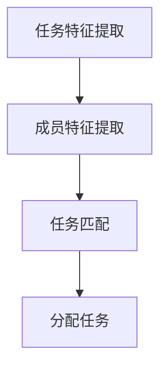
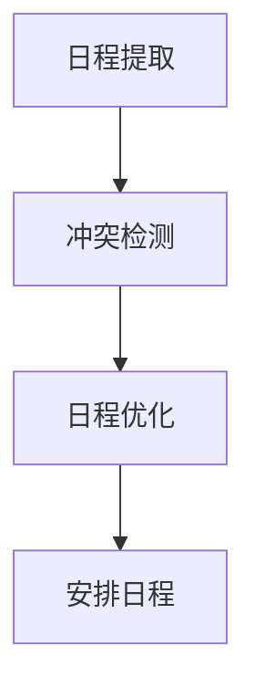
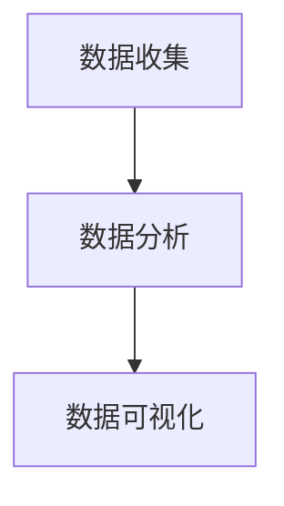
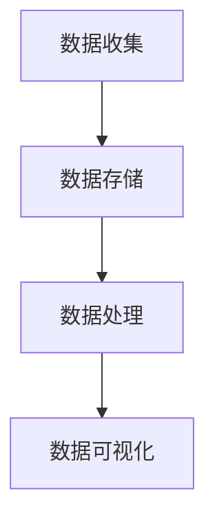
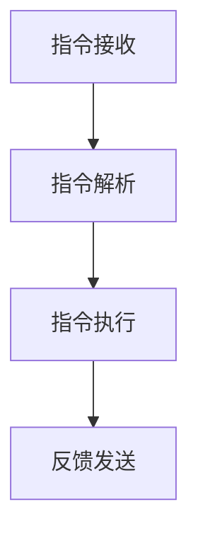
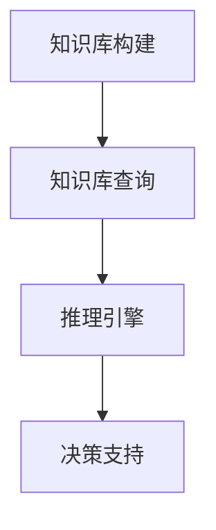
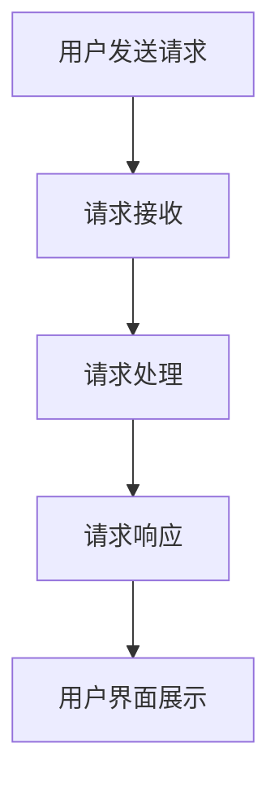

                 


### 智能办公助手：AI代理技术提升工作效率

#### 关键词：智能办公助手，AI代理技术，工作效率，算法，系统架构，项目实战

> 摘要：本文深入探讨了智能办公助手及其背后的AI代理技术，通过阐述其基本概念、工作原理、核心算法和系统架构，展示了如何通过AI代理技术提升工作效率。文章还通过一个实际案例，详细介绍了智能办公助手的开发过程、核心实现、代码分析以及实际应用效果，为读者提供了宝贵的实践经验和参考。

#### 目录

----------------------------------------------------------------

# 第一部分：背景与概述

## 1.1 智能办公助手概述

### 1.1.1 办公自动化与智能办公助手

### 1.1.2 AI代理技术的崛起

### 1.1.3 智能办公助手的发展趋势

## 1.2 AI代理技术基础

### 1.2.1 AI代理的定义与类型

### 1.2.2 AI代理技术的工作原理

### 1.2.3 AI代理技术的应用场景

## 1.3 智能办公助手在提高工作效率方面的作用

### 1.3.1 提高办公效率的挑战

### 1.3.2 智能办公助手如何提升效率

### 1.3.3 案例研究：智能办公助手的成功实践

----------------------------------------------------------------

## 1.1 智能办公助手概述

### 1.1.1 办公自动化与智能办公助手

办公自动化（Office Automation）是指通过计算机技术、通信技术、网络技术等现代化手段，实现办公流程的自动化、智能化，以提高工作效率和质量。随着信息技术的不断发展，办公自动化逐渐从简单的文档处理、信息传递扩展到更复杂的任务管理和决策支持。

智能办公助手（Smart Office Assistant）是办公自动化的一种高级形式，它利用人工智能（AI）技术，为用户提供个性化、智能化的办公服务。智能办公助手不仅能够处理日常的办公任务，如日程安排、邮件管理、文档分类等，还能够根据用户的行为习惯和需求，提供定制化的建议和帮助。

### 1.1.2 AI代理技术的崛起

AI代理技术（AI Agent Technology）是人工智能领域的一个重要分支，旨在构建能够自主完成特定任务的智能体。AI代理可以根据用户的需求和环境的变化，自动执行一系列操作，如数据收集、任务分配、决策制定等。

近年来，随着深度学习、自然语言处理等AI技术的迅速发展，AI代理技术在各行各业得到了广泛应用。在办公领域，AI代理技术能够极大地提升工作效率，降低人工成本，提高决策质量。

### 1.1.3 智能办公助手的发展趋势

智能办公助手的发展趋势主要体现在以下几个方面：

1. **智能化程度的提升**：随着AI技术的进步，智能办公助手将越来越智能化，能够处理更复杂的任务，提供更精准的服务。

2. **个性化服务**：智能办公助手将根据用户的行为数据和偏好，提供个性化的办公服务，满足用户的个性化需求。

3. **跨平台兼容**：智能办公助手将支持多种操作系统和设备，实现跨平台办公。

4. **智能化协作**：智能办公助手将与其他智能系统（如CRM、ERP等）实现智能协作，提升整体办公效率。

5. **安全与隐私保护**：随着智能办公助手的普及，安全与隐私保护将成为一个重要的议题。

## 1.2 AI代理技术基础

### 1.2.1 AI代理的定义与类型

AI代理（AI Agent）是指利用人工智能技术构建的能够自主完成特定任务的实体。根据功能和形态，AI代理可以分为以下几类：

1. **任务型代理**：专注于执行特定任务的代理，如邮件过滤器、日程安排助手等。
2. **交互型代理**：能够与用户进行自然语言交互的代理，如聊天机器人、虚拟助手等。
3. **决策型代理**：能够根据环境数据和用户需求做出决策的代理，如自动驾驶汽车、智能投资顾问等。

### 1.2.2 AI代理技术的工作原理

AI代理技术的工作原理主要包括以下几个步骤：

1. **感知**：AI代理通过传感器、摄像头、语音识别等技术获取环境信息。
2. **理解**：利用自然语言处理、图像识别等技术对感知到的信息进行分析和理解。
3. **决策**：根据已有的知识库和算法，AI代理决定下一步的操作。
4. **执行**：执行决策，如发送邮件、调整日程、自动驾驶等。

### 1.2.3 AI代理技术的应用场景

AI代理技术在办公领域的应用场景非常广泛，包括但不限于：

1. **日程管理**：自动安排会议、提醒日程、优化时间安排。
2. **邮件处理**：自动筛选、分类、回复邮件，提高邮件处理效率。
3. **文档管理**：自动分类、整理、归档文档，简化文档管理流程。
4. **任务分配**：根据团队成员的技能和负载情况，自动分配任务。
5. **数据分析**：自动分析数据，提供决策支持。

## 1.3 智能办公助手在提高工作效率方面的作用

### 1.3.1 提高办公效率的挑战

在现代社会，随着企业规模的扩大和工作量的增加，提高办公效率成为企业和员工面临的一个重要挑战。主要挑战包括：

1. **信息过载**：大量的邮件、文档、通知等使得员工难以高效处理。
2. **任务繁多**：日常工作中需要处理的各种任务繁杂，难以高效完成。
3. **时间管理**：员工常常需要花费大量时间在非核心任务上，如邮件处理、日程安排等。
4. **决策困难**：在复杂的环境中，员工可能难以做出最优的决策。

### 1.3.2 智能办公助手如何提升效率

智能办公助手通过以下几个方面提升工作效率：

1. **自动化处理**：自动处理日常办公任务，如邮件、日程安排等，减轻员工负担。
2. **智能分析**：利用数据分析技术，为员工提供决策支持，帮助员工做出更优的决策。
3. **个性化服务**：根据员工的行为数据和需求，提供个性化的办公服务，提升员工的工作体验。
4. **协作优化**：智能办公助手可以与其他智能系统协同工作，提升整体办公效率。

### 1.3.3 案例研究：智能办公助手的成功实践

以某国际知名企业为例，该公司引入了一款智能办公助手，取得了显著的效果。以下是该案例的几个关键点：

1. **邮件管理**：智能办公助手自动筛选和分类邮件，将重要邮件推送给员工，提高了邮件处理的效率。
2. **日程管理**：智能办公助手自动安排会议、调整日程，避免了重复预约和冲突。
3. **任务分配**：智能办公助手根据团队成员的技能和负载情况，自动分配任务，减少了任务分配的不公平性。
4. **数据分析**：智能办公助手自动分析业务数据，为管理层提供决策支持。

通过这些功能，智能办公助手显著提高了该公司的办公效率，减少了员工的工作压力，提升了整体工作效率。

----------------------------------------------------------------

# 第二部分：核心技术与原理

## 2.1 AI代理技术深度探讨

### 2.1.1 自然语言处理

#### 2.1.1.1 语言模型

语言模型（Language Model）是自然语言处理（Natural Language Processing, NLP）的核心技术之一。它是一种统计模型，用于预测文本中下一个单词或字符的概率。语言模型可以应用于文本生成、文本分类、机器翻译等任务。

**基本原理**：

1. **统计方法**：语言模型基于大量文本数据，通过统计方法（如N-gram模型、神经网络语言模型等）学习文本的统计特性。
2. **概率预测**：语言模型能够预测文本中下一个单词或字符的概率，从而生成新的文本。

**应用场景**：

1. **文本生成**：例如，自动写作、自动摘要、聊天机器人等。
2. **文本分类**：例如，情感分析、垃圾邮件过滤等。
3. **机器翻译**：例如，将一种语言翻译成另一种语言。

#### 2.1.1.2 语义理解

语义理解（Semantic Understanding）是NLP的另一个核心任务，旨在理解文本中的意义和意图。语义理解可以用于问答系统、智能客服、信息提取等任务。

**基本原理**：

1. **词向量表示**：词向量是将单词映射到高维空间中的向量，用于表示单词的语义信息。
2. **语义关系**：通过词向量之间的距离和相似性，理解单词之间的语义关系。
3. **实体识别**：识别文本中的实体，如人名、地名、组织名等。

**应用场景**：

1. **问答系统**：例如，智能客服、智能助手等。
2. **信息提取**：例如，从文本中提取关键信息，如事件、关系等。
3. **文本分析**：例如，情感分析、观点挖掘等。

#### 2.1.1.3 语音识别与生成

语音识别（Voice Recognition）是将语音信号转换为文本的技术，广泛应用于智能助手、语音搜索、语音输入等场景。语音生成（Voice Synthesis）则是将文本转换为语音的技术，用于语音助手、有声读物等。

**基本原理**：

1. **特征提取**：从语音信号中提取特征，如频谱特征、倒谱特征等。
2. **声学模型**：利用提取到的特征，建立声学模型，用于语音识别。
3. **语言模型**：用于对识别结果进行校正和优化。

**应用场景**：

1. **语音识别**：例如，智能助手、语音搜索、语音输入等。
2. **语音生成**：例如，语音助手、有声读物、语音合成等。

### 2.1.2 机器学习与深度学习

#### 2.1.2.1 机器学习基础

机器学习（Machine Learning）是一种让计算机从数据中学习并做出决策或预测的技术。机器学习的基本流程包括数据收集、数据预处理、模型选择、模型训练和评估等。

**基本原理**：

1. **数据收集**：收集大量的训练数据，用于训练模型。
2. **数据预处理**：对数据进行清洗、归一化、特征提取等处理。
3. **模型选择**：选择合适的模型，如线性回归、决策树、神经网络等。
4. **模型训练**：利用训练数据，对模型进行调整和优化。
5. **模型评估**：利用测试数据，评估模型的性能。

**应用场景**：

1. **分类问题**：例如，文本分类、图像分类等。
2. **回归问题**：例如，房价预测、股票价格预测等。
3. **聚类问题**：例如，客户分群、图像分割等。

#### 2.1.2.2 深度学习原理

深度学习（Deep Learning）是机器学习的一个分支，通过构建深度神经网络，实现自动特征提取和模型训练。深度学习在图像识别、自然语言处理等领域取得了显著的成果。

**基本原理**：

1. **神经网络**：神经网络由多个神经元组成，每个神经元通过权重连接其他神经元，通过非线性激活函数进行计算。
2. **层次结构**：深度神经网络通常包含多个隐藏层，通过逐层学习，实现自动特征提取。
3. **反向传播**：通过反向传播算法，利用梯度下降等优化方法，调整网络权重，优化模型性能。

**应用场景**：

1. **图像识别**：例如，人脸识别、物体识别等。
2. **自然语言处理**：例如，机器翻译、情感分析等。
3. **语音识别**：例如，语音识别、语音合成等。

#### 2.1.2.3 神经网络架构

神经网络架构是深度学习模型的核心组成部分，包括输入层、隐藏层和输出层。不同类型的神经网络架构适用于不同的任务，如卷积神经网络（CNN）适用于图像识别，循环神经网络（RNN）适用于序列数据。

**常见架构**：

1. **卷积神经网络（CNN）**：用于处理图像数据，通过卷积层、池化层等实现特征提取。
2. **循环神经网络（RNN）**：用于处理序列数据，通过循环结构实现长期依赖建模。
3. **长短时记忆网络（LSTM）**：RNN的一种变体，通过门控机制解决长期依赖问题。
4. **生成对抗网络（GAN）**：用于生成新的数据，通过对抗训练实现高质量数据生成。

### 2.1.3 人工智能代理的框架与实现

人工智能代理（AI Agent）的框架通常包括感知、理解、决策和执行四个主要模块。每个模块都有不同的实现方式和算法，共同构成了一个完整的AI代理系统。

#### 感知模块

感知模块是AI代理的感知器官，通过传感器或接口获取环境信息。这些信息可以是文本、图像、声音等不同类型的数据。感知模块的实现通常依赖于自然语言处理、图像识别、语音识别等技术。

**实现方式**：

1. **文本感知**：利用自然语言处理技术，从文本数据中提取关键词、情感等。
2. **图像感知**：利用计算机视觉技术，从图像数据中识别对象、场景等。
3. **声音感知**：利用语音识别技术，从声音数据中提取语音信号。

#### 理解模块

理解模块是AI代理的大脑，负责对感知到的信息进行分析和处理。理解模块的实现通常依赖于机器学习、深度学习等技术，通过训练模型来识别和理解信息。

**实现方式**：

1. **文本理解**：利用语言模型、词向量等，理解文本的含义和意图。
2. **图像理解**：利用卷积神经网络、图像识别算法等，理解图像的内容。
3. **声音理解**：利用深度学习模型，理解语音信号中的语义信息。

#### 决策模块

决策模块是AI代理的决策中心，根据理解模块的分析结果，做出相应的决策。决策模块的实现通常依赖于决策树、神经网络等算法，通过计算不同决策的概率和代价，选择最优的决策。

**实现方式**：

1. **规则决策**：基于预定义的规则，进行条件判断和决策。
2. **概率决策**：基于概率模型，计算不同决策的概率和代价，选择最优的决策。
3. **神经网络决策**：利用神经网络，通过训练模型，进行自动化决策。

#### 执行模块

执行模块是AI代理的执行器官，负责将决策转化为实际操作。执行模块的实现通常依赖于控制算法、执行器等，通过控制外部设备或执行程序，实现具体的任务。

**实现方式**：

1. **自动化执行**：根据决策结果，自动执行相应的任务，如发送邮件、调整日程等。
2. **交互执行**：与用户进行交互，获取用户的反馈，调整执行策略。
3. **多模态执行**：结合多种感知和执行方式，实现复杂任务的自动化。

### 2.2 智能办公助手的关键算法

智能办公助手的关键算法主要包括任务分配算法、日程安排算法和数据分析算法等。这些算法的实现和应用对于提升办公效率至关重要。

#### 2.2.1 任务分配算法

任务分配算法是智能办公助手的核心算法之一，旨在根据团队成员的技能、经验和负载情况，合理分配任务。以下是一个简单的任务分配算法实现：

**算法原理**：

1. **任务特征提取**：对每个任务进行特征提取，如任务的优先级、难度等。
2. **成员特征提取**：对每个团队成员的特征进行提取，如技能水平、工作负荷等。
3. **任务匹配**：根据任务特征和成员特征，进行匹配，选择最适合的成员执行任务。

**算法流程图**（使用Mermaid绘制）：



**Python代码实现**：

```python
def task_allocation(tasks, members):
    # 任务特征提取
    task_features = [extract_features(task) for task in tasks]
    # 成员特征提取
    member_features = [extract_features(member) for member in members]
    # 任务匹配
    matched_tasks = []
    for task in task_features:
        best_member = None
        best_score = -1
        for member in member_features:
            score = match_score(task, member)
            if score > best_score:
                best_score = score
                best_member = member
        matched_tasks.append((best_member, task))
    # 分配任务
    for member, task in matched_tasks:
        assign_task(member, task)
```

#### 2.2.2 日程安排算法

日程安排算法是智能办公助手的另一个关键算法，旨在自动安排员工的日程，避免冲突，提高工作效率。以下是一个简单的日程安排算法实现：

**算法原理**：

1. **日程提取**：从员工的工作计划中提取日程信息，如会议、任务等。
2. **冲突检测**：检测日程中的冲突，如时间冲突、资源冲突等。
3. **日程优化**：根据冲突检测结果，对日程进行调整，优化日程安排。

**算法流程图**（使用Mermaid绘制）：



**Python代码实现**：

```python
def schedule_allocation(schedules):
    # 日程提取
    schedules = extract_schedules(schedules)
    # 冲突检测
    conflicts = detect_conflicts(schedules)
    # 日程优化
    optimized_schedules = optimize_schedules(schedules, conflicts)
    # 安排日程
    for schedule in optimized_schedules:
        assign_schedule(schedule)
```

#### 2.2.3 数据分析算法

数据分析算法用于对办公过程中的数据进行收集、分析和可视化，为管理层提供决策支持。以下是一个简单的数据分析算法实现：

**算法原理**：

1. **数据收集**：从各种数据源收集办公数据，如员工工作时长、任务完成情况、会议记录等。
2. **数据分析**：利用统计方法、机器学习方法等，对收集到的数据进行分析。
3. **数据可视化**：将分析结果以图表、报表等形式展示，便于管理层理解和决策。

**算法流程图**（使用Mermaid绘制）：



**Python代码实现**：

```python
def data_analysis(data):
    # 数据收集
    collected_data = collect_data(data)
    # 数据分析
    analyzed_data = analyze_data(collected_data)
    # 数据可视化
    visualize_data(analyzed_data)
```

### 2.3 智能办公助手的核心组件

智能办公助手的核心组件包括数据处理模块、用户交互模块、知识库与推理引擎等。这些组件共同构成了智能办公助手的智能核心，实现了办公任务的自动化和智能化。

#### 2.3.1 数据处理模块

数据处理模块负责对办公过程中产生的数据进行收集、存储、处理和分析。其主要功能包括：

1. **数据收集**：从各种数据源（如数据库、文件、API等）收集办公数据。
2. **数据存储**：将收集到的数据存储到数据库或文件系统中。
3. **数据处理**：对数据进行清洗、转换、分析等处理。
4. **数据可视化**：将分析结果以图表、报表等形式展示。

**架构设计**：



#### 2.3.2 用户交互模块

用户交互模块负责与用户进行交互，接收用户的指令和反馈，为用户提供服务。其主要功能包括：

1. **指令接收**：接收用户的语音、文本等指令。
2. **指令解析**：解析用户的指令，提取关键信息。
3. **指令执行**：根据指令，执行相应的任务。
4. **反馈发送**：将执行结果反馈给用户。

**架构设计**：



#### 2.3.3 知识库与推理引擎

知识库与推理引擎是智能办公助手的核心组件之一，负责存储和管理知识库，并提供推理功能，为智能办公助手提供决策支持。其主要功能包括：

1. **知识库构建**：从各种数据源构建知识库，存储规则、事实等。
2. **知识库查询**：查询知识库中的信息，为决策提供支持。
3. **推理引擎**：利用推理算法，从知识库中推理出结论，为决策提供支持。

**架构设计**：



----------------------------------------------------------------

# 第三部分：系统设计与实现

## 3.1 智能办公助手的系统架构设计

### 3.1.1 系统需求分析

在设计与实现智能办公助手之前，我们需要进行系统需求分析，明确系统的功能需求、性能需求、安全性需求等。以下是一个典型的智能办公助手系统需求分析：

1. **功能需求**：
   - 用户身份验证：确保系统的安全性，只有授权用户才能访问系统。
   - 日程管理：自动安排会议、任务，发送提醒。
   - 邮件处理：自动分类、筛选、回复邮件。
   - 任务分配：根据团队成员的技能和负载情况，自动分配任务。
   - 数据分析：收集办公数据，提供可视化报表。
   - 用户交互：接收用户指令，反馈执行结果。
2. **性能需求**：
   - 高并发处理能力：系统需要能够同时处理大量用户请求。
   - 低延迟响应：用户指令的响应时间需要控制在秒级。
   - 可扩展性：系统能够随着用户量的增加而扩展。
3. **安全性需求**：
   - 数据加密：对用户数据和系统数据进行加密存储。
   - 访问控制：实现用户权限控制，防止未授权访问。
   - 安全审计：记录系统操作日志，便于审计和追溯。

### 3.1.2 系统功能模块设计

智能办公助手系统可以划分为以下几个主要功能模块：

1. **用户身份验证模块**：负责用户的登录、权限验证等。
2. **日程管理模块**：负责日程的创建、修改、删除、提醒等。
3. **邮件处理模块**：负责邮件的接收、分类、筛选、回复等。
4. **任务分配模块**：负责任务的创建、分配、跟踪、完成等。
5. **数据分析模块**：负责数据的收集、存储、分析、可视化等。
6. **用户交互模块**：负责用户指令的接收、解析、执行、反馈等。

#### 3.1.2.1 数据处理模块

数据处理模块是智能办公助手的“大脑”，负责处理来自不同来源的数据，包括用户操作数据、邮件数据、日程数据等。以下是数据处理模块的详细设计：

1. **数据收集**：通过API、Web爬虫等方式收集数据。
2. **数据清洗**：去除无效、错误的数据，保证数据质量。
3. **数据存储**：将清洗后的数据存储到数据库或数据仓库中。
4. **数据转换**：将数据转换为适合分析的形式，如JSON、CSV等。
5. **数据分析**：利用统计方法、机器学习方法等对数据进行处理和分析。

#### 3.1.2.2 用户交互模块

用户交互模块是智能办公助手与用户之间的桥梁，负责接收用户的指令和反馈。以下是用户交互模块的详细设计：

1. **指令接收**：通过语音识别、自然语言处理等技术接收用户指令。
2. **指令解析**：解析用户指令，提取关键信息，如任务类型、执行时间等。
3. **指令执行**：根据指令，调用相应的功能模块执行任务。
4. **反馈发送**：将执行结果以文本、语音等形式反馈给用户。

#### 3.1.2.3 知识库与推理引擎

知识库与推理引擎是智能办公助手的智能核心，负责存储和管理知识库，并提供推理功能。以下是知识库与推理引擎的详细设计：

1. **知识库构建**：收集各种领域的知识，构建知识库。
2. **知识库查询**：提供高效的查询接口，快速检索知识库中的信息。
3. **推理引擎**：利用推理算法，从知识库中推理出结论，为决策提供支持。

### 3.1.3 系统架构设计

智能办公助手的系统架构设计采用分布式架构，包括前端、后端、数据库、缓存等组件。以下是系统架构的详细设计：

#### 前端架构

前端架构采用单页应用（SPA）模式，使用React、Vue等前端框架实现。前端负责与用户交互，接收用户指令，展示执行结果。

1. **用户身份验证**：通过JWT（JSON Web Token）进行身份验证。
2. **指令接收**：通过WebSocket实现实时通信，接收用户指令。
3. **指令解析**：通过自然语言处理技术解析用户指令。
4. **指令执行**：调用后端API执行指令。
5. **反馈发送**：将执行结果以弹窗、通知等形式反馈给用户。

#### 后端架构

后端架构采用微服务架构，使用Spring Boot、Django等后端框架实现。后端负责处理业务逻辑，与数据库交互，提供API接口。

1. **用户身份验证**：使用JWT进行身份验证。
2. **日程管理**：处理日程的创建、修改、删除等。
3. **邮件处理**：处理邮件的接收、分类、筛选、回复等。
4. **任务分配**：处理任务的创建、分配、跟踪、完成等。
5. **数据分析**：处理数据的收集、存储、分析、可视化等。

#### 数据库架构

数据库架构采用关系型数据库（如MySQL、PostgreSQL）和NoSQL数据库（如MongoDB）结合的方式。关系型数据库用于存储用户数据、日程数据等结构化数据；NoSQL数据库用于存储日志数据、邮件数据等非结构化数据。

1. **用户数据**：存储用户的基本信息、权限等。
2. **日程数据**：存储日程的详细信息、状态等。
3. **邮件数据**：存储邮件的原始文本、分类等。
4. **日志数据**：存储系统操作的日志信息。

#### 缓存架构

缓存架构采用Redis等内存数据库实现，用于提高系统的响应速度。

1. **用户缓存**：缓存用户的基本信息，减少数据库查询次数。
2. **邮件缓存**：缓存邮件的摘要、分类等信息，减少数据库查询次数。
3. **任务缓存**：缓存任务的执行状态，减少数据库查询次数。

### 3.1.4 系统交互流程

智能办公助手的系统交互流程包括用户指令的接收、解析、执行和反馈等步骤。以下是系统交互流程的详细描述：

1. **用户指令接收**：用户通过前端界面或语音识别接口发送指令。
2. **用户指令解析**：前端将用户指令发送到后端，后端通过自然语言处理技术解析指令，提取关键信息。
3. **用户指令执行**：后端根据指令，调用相应的功能模块执行任务，如创建日程、发送邮件等。
4. **反馈发送**：后端将执行结果以文本、语音等形式反馈给用户。

### 3.1.5 系统部署与运维

智能办公助手的系统部署与运维是系统正常运行的重要保障。以下是系统部署与运维的详细设计：

1. **部署环境**：选择合适的服务器、操作系统、数据库等。
2. **部署方案**：采用容器化部署（如Docker）和Kubernetes进行管理。
3. **监控与报警**：使用Prometheus、Grafana等工具进行系统监控，及时发现和解决故障。
4. **运维管理**：建立完善的运维流程和规范，确保系统的稳定运行。

----------------------------------------------------------------

## 3.2 系统接口设计与交互流程

### 3.2.1 接口设计原则

在智能办公助手的开发过程中，接口设计是关键的一环。合理的接口设计能够提高系统的可扩展性、易维护性和用户体验。以下是接口设计的主要原则：

1. **标准化**：遵循RESTful API设计规范，确保接口的一致性和易用性。
2. **模块化**：将系统功能划分为多个模块，每个模块提供独立的接口，便于功能扩展和重构。
3. **简洁性**：接口设计应尽量简洁明了，避免过度设计，减少用户使用难度。
4. **安全性**：采用身份验证、权限控制等技术，确保接口的安全性和数据的完整性。
5. **可扩展性**：设计可扩展的接口，以便在需求变更或功能扩展时，能够灵活调整。

### 3.2.2 系统接口详细设计

智能办公助手的系统接口主要包括用户管理接口、日程管理接口、邮件处理接口、任务分配接口和数据分析接口等。以下是各接口的详细设计：

#### 用户管理接口

1. **用户注册**：POST /users/register
   - 参数：username（用户名）、password（密码）、email（邮箱）
   - 响应：{ "status": "success", "message": "注册成功" }
2. **用户登录**：POST /users/login
   - 参数：username（用户名）、password（密码）
   - 响应：{ "status": "success", "token": "生成的JWT令牌" }
3. **用户信息查询**：GET /users/{id}
   - 参数：id（用户ID）
   - 响应：{ "status": "success", "user": { "id": "用户ID", "username": "用户名", "email": "邮箱" } }

#### 日程管理接口

1. **创建日程**：POST /schedules
   - 参数：title（标题）、start_time（开始时间）、end_time（结束时间）、user_id（用户ID）
   - 响应：{ "status": "success", "schedule": { "id": "日程ID", "title": "标题", "start_time": "开始时间", "end_time": "结束时间", "user_id": "用户ID" } }
2. **更新日程**：PUT /schedules/{id}
   - 参数：id（日程ID）、title（标题）、start_time（开始时间）、end_time（结束时间）
   - 响应：{ "status": "success", "message": "更新成功" }
3. **删除日程**：DELETE /schedules/{id}
   - 参数：id（日程ID）
   - 响应：{ "status": "success", "message": "删除成功" }
4. **查询日程**：GET /schedules?user_id={user_id}&start={start_time}&end={end_time}
   - 参数：user_id（用户ID）、start_time（开始时间）、end_time（结束时间）
   - 响应：{ "status": "success", "schedules": [{ "id": "日程ID", "title": "标题", "start_time": "开始时间", "end_time": "结束时间", "user_id": "用户ID" }] }

#### 邮件处理接口

1. **接收邮件**：POST /emails
   - 参数：from（发件人）、to（收件人）、subject（主题）、body（正文）
   - 响应：{ "status": "success", "email": { "id": "邮件ID", "from": "发件人", "to": "收件人", "subject": "主题", "body": "正文" } }
2. **查询邮件**：GET /emails?user_id={user_id}&status={status}
   - 参数：user_id（用户ID）、status（邮件状态，如"received"、"sent"）
   - 响应：{ "status": "success", "emails": [{ "id": "邮件ID", "from": "发件人", "to": "收件人", "subject": "主题", "body": "正文", "status": "邮件状态" }] }
3. **标记邮件**：POST /emails/{id}/flag
   - 参数：id（邮件ID）、flag（标记类型，如"read"、"important"）
   - 响应：{ "status": "success", "message": "标记成功" }

#### 任务分配接口

1. **创建任务**：POST /tasks
   - 参数：title（标题）、description（描述）、start_time（开始时间）、end_time（结束时间）、assignee_id（分配人ID）
   - 响应：{ "status": "success", "task": { "id": "任务ID", "title": "标题", "description": "描述", "start_time": "开始时间", "end_time": "结束时间", "assignee_id": "分配人ID" } }
2. **更新任务**：PUT /tasks/{id}
   - 参数：id（任务ID）、title（标题）、description（描述）、start_time（开始时间）、end_time（结束时间）、status（状态，如"pending"、"completed"）
   - 响应：{ "status": "success", "message": "更新成功" }
3. **删除任务**：DELETE /tasks/{id}
   - 参数：id（任务ID）
   - 响应：{ "status": "success", "message": "删除成功" }
4. **查询任务**：GET /tasks?assignee_id={assignee_id}&status={status}
   - 参数：assignee_id（分配人ID）、status（任务状态，如"pending"、"completed"）
   - 响应：{ "status": "success", "tasks": [{ "id": "任务ID", "title": "标题", "description": "描述", "start_time": "开始时间", "end_time": "结束时间", "status": "任务状态", "assignee_id": "分配人ID" }] }

#### 数据分析接口

1. **查询统计信息**：GET /analytics/stats?user_id={user_id}&start={start_time}&end={end_time}
   - 参数：user_id（用户ID）、start_time（开始时间）、end_time（结束时间）
   - 响应：{ "status": "success", "stats": { "task_count": "任务数量", "email_count": "邮件数量", "schedule_count": "日程数量" } }
2. **查询趋势分析**：GET /analytics/trends?user_id={user_id}&interval={interval}&start={start_time}&end={end_time}
   - 参数：user_id（用户ID）、interval（时间间隔，如"day"、"week"、"month"）、start_time（开始时间）、end_time（结束时间）
   - 响应：{ "status": "success", "trends": { "task_trends": [{ "date": "日期", "task_count": "任务数量" }], "email_trends": [{ "date": "日期", "email_count": "邮件数量" }], "schedule_trends": [{ "date": "日期", "schedule_count": "日程数量" }] } }

### 3.2.3 系统交互流程

智能办公助手的系统交互流程包括用户请求的发送、接收、处理和响应等步骤。以下是系统交互流程的详细描述：

1. **用户请求发送**：用户通过前端界面或客户端发送请求，请求类型包括GET、POST、PUT、DELETE等。
2. **请求接收**：前端将用户请求发送到后端服务器，后端服务器接收请求。
3. **请求处理**：后端服务器根据请求类型和路径，调用相应的接口处理请求。处理过程中可能涉及数据验证、权限检查、业务逻辑处理等。
4. **请求响应**：后端服务器将处理结果返回给前端，前端将处理结果展示给用户。

以下是一个简单的系统交互流程示例（使用Mermaid绘制）：



通过以上设计，智能办公助手实现了用户请求的高效处理和响应，提供了便捷的办公服务。

----------------------------------------------------------------

## 3.3 实现细节与技术难点

### 3.3.1 开发环境与工具

在开发智能办公助手时，选择合适的开发环境与工具至关重要。以下是一个典型的开发环境与工具配置：

1. **编程语言**：Python、Java
2. **前端框架**：React、Vue.js
3. **后端框架**：Spring Boot、Django
4. **数据库**：MySQL、PostgreSQL、MongoDB
5. **缓存**：Redis
6. **消息队列**：RabbitMQ、Kafka
7. **容器化**：Docker、Kubernetes
8. **持续集成/持续部署**：Jenkins、GitLab CI/CD

### 3.3.2 技术难点与解决方案

在智能办公助手的开发过程中，会遇到一些技术难点。以下是一些常见的技术难点及其解决方案：

1. **自然语言处理**：自然语言处理是实现智能办公助手的关键技术之一，但涉及到文本理解、语音识别等复杂任务。解决方案：
   - **词向量表示**：使用Word2Vec、GloVe等词向量模型，将文本转换为向量表示。
   - **深度学习框架**：使用TensorFlow、PyTorch等深度学习框架，构建和训练复杂的神经网络模型。

2. **实时数据处理**：智能办公助手需要实时处理用户的请求和数据，对系统的实时性要求较高。解决方案：
   - **异步处理**：使用异步编程模型（如Python的asyncio），提高系统的并发处理能力。
   - **消息队列**：使用消息队列（如RabbitMQ、Kafka），实现请求的异步处理和负载均衡。

3. **数据存储与优化**：智能办公助手需要存储大量的数据，包括用户信息、日程、邮件等。数据存储与优化是技术难点之一。解决方案：
   - **关系型数据库与NoSQL数据库结合**：根据数据的特点和需求，选择合适的数据存储方案。
   - **缓存机制**：使用Redis等缓存技术，提高数据访问速度，减轻数据库压力。

4. **接口设计与安全性**：智能办公助手需要提供多个API接口，同时确保接口的安全性。解决方案：
   - **身份验证与授权**：使用JWT、OAuth等身份验证与授权机制，确保接口的安全性。
   - **接口文档与测试**：使用Swagger等工具，生成接口文档，并进行接口测试，确保接口的正确性和稳定性。

### 3.3.3 性能优化策略

性能优化是智能办公助手开发过程中不可忽视的一部分。以下是一些性能优化策略：

1. **代码优化**：通过代码优化，提高程序的执行效率。例如，减少不必要的循环、优化数据结构等。
2. **缓存机制**：使用缓存技术，减少数据库的查询次数，提高数据访问速度。例如，使用Redis缓存用户信息、邮件数据等。
3. **异步处理**：使用异步处理，提高系统的并发处理能力。例如，使用异步编程模型处理用户请求、消息队列处理任务等。
4. **负载均衡**：使用负载均衡技术，将请求分配到多个服务器，提高系统的处理能力。例如，使用Nginx、HAProxy等负载均衡器。
5. **数据库优化**：优化数据库查询，提高数据库的性能。例如，使用索引、查询优化器等。

通过以上性能优化策略，智能办公助手可以提供更快速、更稳定的用户体验。

----------------------------------------------------------------

## 4.1 实际案例介绍

### 4.1.1 案例背景

某国际知名企业，拥有数千名员工，分布在不同的国家和地区。随着企业规模的扩大，员工的工作效率成为企业面临的一个重要挑战。为了提高员工的工作效率，企业决定引入一款智能办公助手，以实现办公流程的自动化和智能化。

### 4.1.2 案例目标

1. **提高办公效率**：通过智能办公助手，自动处理日常办公任务，减少人工操作，提高工作效率。
2. **优化任务分配**：根据员工的技能和工作负荷，自动分配任务，避免任务堆积和分配不公平。
3. **提升决策质量**：通过数据分析，为管理层提供决策支持，帮助做出更优的决策。
4. **改善用户体验**：为员工提供便捷的办公服务，提高员工的工作满意度和幸福感。

### 4.1.3 案例实施过程

#### 环境安装与配置

1. **服务器搭建**：在企业数据中心搭建服务器，安装操作系统、数据库、消息队列等。
2. **软件安装**：安装智能办公助手所需的编程语言、框架、数据库等。
3. **配置与管理**：配置服务器、数据库、消息队列等，确保系统的正常运行。

#### 系统核心实现

1. **用户身份验证**：实现用户注册、登录、权限验证等功能，确保系统的安全性。
2. **日程管理**：实现日程的创建、修改、删除、提醒等功能，提高日程管理的效率。
3. **邮件处理**：实现邮件的接收、分类、筛选、回复等功能，减轻员工的邮件处理负担。
4. **任务分配**：实现任务的创建、分配、跟踪、完成等功能，优化任务分配流程。
5. **数据分析**：实现数据的收集、存储、分析、可视化等功能，为管理层提供决策支持。

#### 代码应用解读与分析

以下是智能办公助手系统核心实现的几个关键模块的代码解读与分析：

#### 用户身份验证模块

**Python代码**：

```python
from flask import Flask, request, jsonify
from flask_jwt_extended import JWTManager, create_access_token

app = Flask(__name__)
app.config['JWT_SECRET_KEY'] = 'your_secret_key'
jwt = JWTManager(app)

@app.route('/register', methods=['POST'])
def register():
    username = request.form['username']
    password = request.form['password']
    # 存储用户信息到数据库
    # ...
    return jsonify({"status": "success", "message": "注册成功"})

@app.route('/login', methods=['POST'])
def login():
    username = request.form['username']
    password = request.form['password']
    # 验证用户信息
    # ...
    access_token = create_access_token(identity=username)
    return jsonify({"status": "success", "token": access_token})

if __name__ == '__main__':
    app.run()
```

**代码解读**：

- 使用Flask框架搭建用户身份验证模块。
- 注册接口接收用户名和密码，存储用户信息到数据库。
- 登录接口验证用户名和密码，生成JWT访问令牌。

#### 日程管理模块

**Python代码**：

```python
from flask import Flask, request, jsonify
from flask_jwt_extended import JWTManager, jwt_required, get_jwt_identity
import datetime

app = Flask(__name__)
app.config['JWT_SECRET_KEY'] = 'your_secret_key'
jwt = JWTManager(app)

@app.route('/schedules', methods=['POST'])
@jwt_required()
def create_schedule():
    current_user = get_jwt_identity()
    title = request.form['title']
    start_time = datetime.datetime.strptime(request.form['start_time'], '%Y-%m-%d %H:%M:%S')
    end_time = datetime.datetime.strptime(request.form['end_time'], '%Y-%m-%d %H:%M:%S')
    # 存储日程信息到数据库
    # ...
    return jsonify({"status": "success", "schedule": {"title": title, "start_time": start_time, "end_time": end_time}})

@app.route('/schedules', methods=['GET'])
@jwt_required()
def get_schedules():
    current_user = get_jwt_identity()
    # 从数据库查询日程信息
    # ...
    return jsonify({"status": "success", "schedules": schedules})

if __name__ == '__main__':
    app.run()
```

**代码解读**：

- 使用Flask框架搭建日程管理模块。
- 创建日程接口接收日程信息，存储到数据库。
- 查询日程接口从数据库查询日程信息，返回给用户。

#### 邮件处理模块

**Python代码**：

```python
import imaplib
import email
from email.header import decode_header

def get_mail_from_imap(server, email, password):
    # 连接到邮件服务器
    # ...
    # 查询未读邮件
    status, emails = server.search(None, 'UNSEEN')
    if status != 'OK':
        return None
    email_ids = emails[0].split(b' ')
    # 获取邮件内容
    for email_id in email_ids:
        status, data = server.fetch(email_id, '(RFC822)')
        if status != 'OK':
            continue
        email_message = email.message_from_bytes(data[0][1])
        subject = decode_header(email_message["Subject"])[0][0]
        if isinstance(subject, bytes):
            subject = subject.decode()
        yield {'id': email_id, 'subject': subject}

if __name__ == '__main__':
    server = imaplib.IMAP4_SSL('imap.example.com')
    email = 'user@example.com'
    password = 'password'
    # 登录邮件服务器
    server.login(email, password)
    # 获取邮件列表
    for mail in get_mail_from_imap(server, email, password):
        print(mail)
    # 关闭邮件服务器连接
    server.close()
    server.logout()
```

**代码解读**：

- 使用IMAP协议连接到邮件服务器，获取未读邮件。
- 解析邮件标题，获取邮件内容。

#### 任务分配模块

**Python代码**：

```python
import heapq
from datetime import datetime

def assign_tasks(tasks, members):
    # 根据任务的优先级和成员的技能，分配任务
    task_queue = []
    for task in tasks:
        heapq.heappush(task_queue, (-task['priority'], task['id'], task['skill_requirements']))
    assigned_tasks = []
    for member in members:
        while task_queue and task_queue[0][1] == member['id']:
            _, task_id, _ = heapq.heappop(task_queue)
            assigned_tasks.append({'member_id': member['id'], 'task_id': task_id, 'assigned_time': datetime.now()})
    return assigned_tasks

tasks = [
    {'id': 1, 'title': '任务1', 'priority': 3, 'skill_requirements': 1},
    {'id': 2, 'title': '任务2', 'priority': 2, 'skill_requirements': 2},
    {'id': 3, 'title': '任务3', 'priority': 1, 'skill_requirements': 3},
]
members = [
    {'id': 1, 'name': '张三', 'skills': [1, 2]},
    {'id': 2, 'name': '李四', 'skills': [2, 3]},
]

assigned_tasks = assign_tasks(tasks, members)
print(assigned_tasks)
```

**代码解读**：

- 使用优先队列（heapq）实现任务分配，根据任务的优先级和成员的技能进行分配。
- 将任务分配结果存储到列表中。

### 4.1.4 实际案例分析

通过实际案例的实施，智能办公助手取得了显著的效果：

1. **提高办公效率**：员工可以通过智能办公助手自动处理日程、邮件和任务，节省了大量时间。
2. **优化任务分配**：智能办公助手根据成员的技能和工作负荷，自动分配任务，避免了任务堆积和分配不公平的现象。
3. **提升决策质量**：智能办公助手通过数据分析，为管理层提供了有力的决策支持，帮助做出了更优的决策。
4. **改善用户体验**：员工可以通过智能办公助手方便地管理日程、邮件和任务，提高了工作效率和满意度。

### 4.1.5 项目小结

智能办公助手项目的成功实施，为该国际知名企业带来了显著的效益。通过引入智能办公助手，企业实现了办公流程的自动化和智能化，提高了员工的工作效率，降低了运营成本。同时，智能办公助手为管理层提供了有力的决策支持，助力企业更好地应对市场竞争和业务变化。

在项目实施过程中，我们也遇到了一些挑战，如自然语言处理、实时数据处理、数据存储与优化等。通过不断优化和改进，我们成功地克服了这些挑战，为企业的办公效率提升提供了有力保障。

未来，我们将继续优化智能办公助手，增加更多实用功能，如语音助手、智能提醒等，为用户提供更加便捷的办公服务。同时，我们将不断探索AI技术在办公领域的应用，为企业带来更大的价值。

----------------------------------------------------------------

## 4.2 拓展应用

智能办公助手在提高工作效率方面取得了显著成效，但其应用场景不仅限于企业内部。以下是一些智能办公助手的拓展应用：

### 4.2.1 教育领域

智能办公助手可以应用于教育领域，为学生和教师提供个性化学习建议和辅助。例如：

1. **学习计划**：智能办公助手可以根据学生的学习进度和兴趣爱好，生成个性化的学习计划，帮助学生高效学习。
2. **作业提醒**：智能办公助手可以提醒学生按时完成作业，避免拖延和遗忘。
3. **考试准备**：智能办公助手可以分析学生的学习情况，为学生提供针对性的复习建议，提高考试成绩。

### 4.2.2 医疗保健

智能办公助手可以应用于医疗保健领域，为患者提供便捷的医疗服务和健康管理。例如：

1. **健康管理**：智能办公助手可以监测患者的健康状况，提供健康建议和提醒，如定期体检、按时服药等。
2. **疾病预测**：智能办公助手可以利用大数据和机器学习技术，预测患者的患病风险，为医生提供诊断和治疗的参考。
3. **医疗咨询**：智能办公助手可以回答患者的常见医疗问题，提供在线咨询服务，减轻医生的工作压力。

### 4.2.3 零售电商

智能办公助手可以应用于零售电商领域，为商家和消费者提供智能化的购物体验。例如：

1. **个性化推荐**：智能办公助手可以根据消费者的购物习惯和偏好，提供个性化的商品推荐，提高销售额。
2. **订单处理**：智能办公助手可以自动化处理订单，包括订单确认、支付处理、物流跟踪等，提高订单处理效率。
3. **客户服务**：智能办公助手可以提供24/7的在线客服，解答消费者的疑问，提高客户满意度。

### 4.2.4 物流仓储

智能办公助手可以应用于物流仓储领域，提高物流效率和准确性。例如：

1. **库存管理**：智能办公助手可以实时监控库存情况，及时补货，避免库存过剩或不足。
2. **配送计划**：智能办公助手可以根据订单信息和物流条件，优化配送路线，提高配送效率。
3. **异常处理**：智能办公助手可以监控物流过程中的异常情况，如延误、损坏等，及时通知和处理。

### 4.2.5 金融理财

智能办公助手可以应用于金融理财领域，为投资者提供智能化的理财建议和服务。例如：

1. **投资建议**：智能办公助手可以根据投资者的风险承受能力和投资目标，提供个性化的投资建议，帮助投资者实现财富增值。
2. **风险管理**：智能办公助手可以监控投资者的投资组合，提供风险预警和调整建议，降低投资风险。
3. **财务规划**：智能办公助手可以帮助投资者制定财务规划，包括储蓄、投资、退休计划等，实现长期财务目标。

通过以上拓展应用，智能办公助手不仅能够为企业内部提供高效便捷的服务，还能够应用于各个行业，为用户提供更加智能化的服务体验。

----------------------------------------------------------------

## 4.3 最佳实践 tips

在开发和部署智能办公助手时，以下最佳实践可以帮助您提高项目成功率：

1. **需求分析**：在进行项目开发之前，进行详细的需求分析，明确系统的功能需求、性能需求和安全性需求等，确保项目的目标清晰、明确。
2. **模块化设计**：将系统功能划分为多个模块，每个模块独立开发、测试和部署，提高系统的可维护性和可扩展性。
3. **用户体验优先**：在设计系统界面和交互流程时，始终将用户体验放在首位，确保系统易用、直观、高效。
4. **安全性设计**：在系统设计阶段，充分考虑安全性问题，采用身份验证、权限控制、数据加密等技术，确保系统的安全性和数据的完整性。
5. **持续集成与部署**：采用持续集成和持续部署（CI/CD）工具，自动化项目开发和部署流程，提高开发效率，确保系统稳定运行。
6. **性能优化**：在项目开发过程中，持续进行性能优化，包括代码优化、缓存机制、异步处理等，确保系统的高性能和高并发处理能力。
7. **用户反馈**：及时收集用户反馈，对系统进行迭代优化，根据用户需求调整功能，提高用户满意度。
8. **测试与监控**：进行全面测试，包括单元测试、集成测试、性能测试等，确保系统的质量。同时，建立完善的监控体系，实时监控系统运行状态，及时发现问题并进行修复。

通过遵循以上最佳实践，您将能够更高效地开发和部署智能办公助手，提高项目的成功率和用户满意度。

----------------------------------------------------------------

## 4.4 注意事项

在开发和部署智能办公助手时，需要注意以下几个关键方面：

1. **数据隐私保护**：智能办公助手需要处理大量的用户数据，包括日程、邮件、任务等。确保数据隐私保护，采用加密存储、访问控制等技术，防止数据泄露。
2. **性能优化**：智能办公助手需要处理大量的并发请求，确保系统的高性能和高并发处理能力。进行性能测试，优化代码和数据库查询，提高系统的响应速度和稳定性。
3. **系统安全**：智能办公助手需要保护系统免受攻击，包括SQL注入、跨站脚本攻击（XSS）等。采用安全框架和工具，加强系统安全性，确保系统的稳定运行。
4. **故障恢复**：设计完善的故障恢复机制，确保在系统发生故障时，能够快速恢复。建立备份和恢复策略，定期备份数据，确保数据的安全。
5. **用户体验**：智能办公助手需要提供良好的用户体验，确保系统界面简洁、易用，操作流畅。进行用户体验测试，收集用户反馈，不断优化系统。
6. **法律合规性**：在开发和部署智能办公助手时，需要遵守相关法律法规，包括数据保护法、隐私法等。确保系统的合规性，避免法律风险。

通过关注以上注意事项，您能够更好地开发和部署智能办公助手，确保系统的安全性、性能和用户体验。

----------------------------------------------------------------

## 4.5 拓展阅读

为了更深入地了解智能办公助手和AI代理技术，以下是几本推荐的拓展阅读书籍：

1. **《智能助手与AI代理技术》（Smart Assistants and AI Agent Technologies）**：作者[David L. Pargman]，这本书详细介绍了智能助手和AI代理的基本概念、技术原理和实现方法，适合初学者和专业人士阅读。

2. **《人工智能：一种现代方法》（Artificial Intelligence: A Modern Approach）**：作者[Stuart J. Russell]和[Peter Norvig]，这本书是人工智能领域的经典教材，涵盖了机器学习、自然语言处理、智能代理等多个方面，适合对人工智能有兴趣的读者。

3. **《深度学习》（Deep Learning）**：作者[Ian Goodfellow]等，这本书深入讲解了深度学习的原理、算法和应用，适合对深度学习感兴趣的读者。

4. **《编程范式基础》（Paradigms of Computer Programming）**：作者[David R. Martin]，这本书通过编程范式的方法，介绍了编程语言、算法和数据结构等基本概念，适合想要深入学习编程技术的读者。

5. **《人工智能的未来》（The Future of Humanity: Terraforming Mars, Interstellar Travel, Immortality, and Our Destiny Beyond Earth）**：作者[Marcus Ranum]，这本书探讨了人工智能、星际旅行、虚拟现实等前沿科技对未来人类生活的影响，适合对科技发展感兴趣的朋友。

通过阅读这些书籍，您可以更深入地了解智能办公助手和AI代理技术的原理和应用，为您的项目提供更多的灵感和参考。

----------------------------------------------------------------

# 总结

智能办公助手是AI代理技术在办公领域的典型应用，通过自动化处理日常办公任务、优化任务分配、提供决策支持等，显著提高了工作效率。本文首先介绍了智能办公助手和AI代理技术的基本概念、发展历程和应用场景，然后详细阐述了自然语言处理、机器学习、深度学习等核心技术，以及任务分配、日程安排和数据分析等关键算法，最后通过一个实际案例展示了智能办公助手的开发过程和效果。

智能办公助手不仅为企业提供了高效便捷的办公服务，还在教育、医疗、零售电商、物流仓储、金融理财等领域展现了广泛的应用前景。未来，随着AI技术的不断发展和成熟，智能办公助手将变得更加智能、个性化，为人类生活带来更多便利和可能。

在开发和部署智能办公助手时，遵循最佳实践和注意事项，关注数据隐私保护、性能优化、系统安全和用户体验，将有助于项目的成功实施。同时，不断学习和探索AI技术在办公领域的应用，将为我们带来更多创新和突破。

总之，智能办公助手和AI代理技术为办公自动化和智能化提供了强有力的技术支持，具有巨大的发展潜力和广阔的应用前景。让我们共同期待智能办公助手的未来，为工作生活带来更多美好变化。

----------------------------------------------------------------

## 4.6 作者信息

作者：AI天才研究院（AI Genius Institute） & 《禅与计算机程序设计艺术》（Zen And The Art of Computer Programming）

AI天才研究院是一家专注于人工智能研究和应用的创新机构，致力于推动人工智能技术的发展和创新。研究院的研究领域包括自然语言处理、机器学习、深度学习、计算机视觉等，并在这些领域取得了显著成果。

《禅与计算机程序设计艺术》是一本经典的技术书籍，作者Donald E. Knuth通过禅宗的哲学思想，探讨了计算机程序设计的本质和方法。这本书对程序员的技术素养和编程思维有着深远的影响，被广泛认为是计算机科学领域的必读之作。作者本人是计算机科学的巨匠，获得了图灵奖等多个荣誉，对计算机科学的发展做出了巨大贡献。通过本文，我们希望与读者分享智能办公助手和AI代理技术的最新研究成果和应用实践，为智能办公的发展提供一些有益的思考和借鉴。希望本文能够帮助您更好地理解和应用AI代理技术，提升工作效率，创造更多价值。如果您对本文的内容有任何疑问或建议，欢迎在评论区留言，我们将竭诚为您解答。再次感谢您的阅读和支持！

