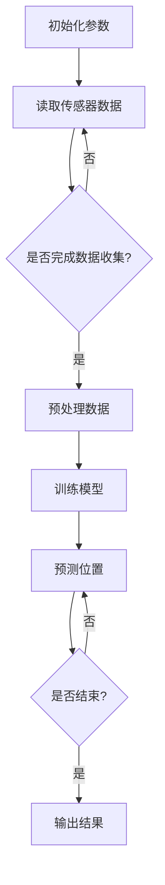

                 

# 智能包装技术在物流追踪中的应用

## 关键词
智能包装、物流追踪、物联网、传感器、数据采集、算法

## 摘要
本文将探讨智能包装技术在物流追踪中的应用，分析其背景、核心概念、技术原理以及具体实施案例。通过详细的算法讲解、系统设计与实现，以及项目实战分析，本文旨在为读者提供一份全面而深入的智能包装技术在物流追踪中的应用指南。

## 目录

### 第一部分：背景介绍

#### 第1章：问题背景
- **1.1 物流行业现状与挑战**
- **1.2 智能包装技术的崛起**
- **1.3 智能包装在物流追踪中的应用前景**

#### 第2章：核心概念与联系
- **2.1 智能包装技术概述**
- **2.2 物流追踪流程**
- **2.3 智能包装技术原理与物流追踪关联性分析**

### 第二部分：智能包装技术原理

#### 第3章：智能包装技术原理
- **3.1 智能包装技术的基础知识**
- **3.2 智能传感器与数据采集**
- **3.3 物联网技术及其在智能包装中的应用**
- **3.4 数据处理与分析方法**

#### 第4章：物流追踪系统设计
- **4.1 系统需求分析**
- **4.2 系统架构设计**
- **4.3 数据存储与安全设计**

#### 第5章：智能包装技术在物流追踪中的应用案例
- **5.1 案例一：电子标签在快递物流中的应用**
- **5.2 案例二：智能包装盒在冷链物流中的应用**
- **5.3 案例三：智能贴片在包裹配送中的应用**

### 第三部分：算法原理讲解

#### 第6章：物流追踪算法原理
- **6.1 位置跟踪算法**
- **6.2 数据预测算法**
- **6.3 原则与公式解释**
- **6.4 算法流程图与Python实现**

#### 第7章：数学模型与数学公式讲解
- **7.1 数学模型基础**
- **7.2 公式推导与解释**
- **7.3 例子说明**

### 第四部分：项目实战

#### 第8章：智能包装技术在物流追踪中的项目实战
- **8.1 环境安装与配置**
- **8.2 系统核心实现**
- **8.3 代码解读与分析**
- **8.4 实际案例分析**
- **8.5 项目小结**

### 第五部分：最佳实践与拓展

#### 第9章：最佳实践与注意事项
- **9.1 智能包装技术的最佳实践**
- **9.2 物流追踪系统的常见问题及解决**
- **9.3 注意事项与风险防范**

#### 第10章：拓展阅读与资源推荐
- **10.1 相关书籍推荐**
- **10.2 在线课程与教程**
- **10.3 行业报告与论文**

## 第一部分：背景介绍

### 1.1 物流行业现状与挑战

物流行业作为现代经济的重要组成部分，其效率和质量直接影响着整个社会的运转。然而，随着电子商务和全球化的快速发展，物流行业也面临着一系列挑战。

首先，物流行业的规模不断扩大，物流流程中的信息传递和物品追踪变得尤为重要。然而，传统的物流追踪方式往往存在效率低下、准确性差等问题，无法满足日益增长的物流需求。

其次，物流行业对实时性和精确性的要求越来越高。消费者对于快递速度和包裹安全性的期望不断上升，这要求物流企业能够提供更高效、更可靠的追踪服务。

最后，随着物联网和人工智能技术的发展，智能包装技术逐渐崛起，为物流追踪带来了新的可能性。智能包装技术能够实现物品的实时定位、状态监控和异常检测，从而提高物流追踪的效率和准确性。

### 1.2 智能包装技术的崛起

智能包装技术是一种集成了传感器、物联网、数据处理等技术的新型包装技术。它能够通过感知和传输物品的状态信息，实现对物品的实时追踪和管理。

智能包装技术的崛起主要得益于以下几个方面的推动：

1. **物联网技术的普及**：物联网技术为智能包装提供了数据采集和传输的基础，使得物品的状态信息能够实时传输到系统中进行处理。

2. **传感器技术的进步**：传感器技术的发展使得智能包装能够感知物品的温度、湿度、位置等状态信息，从而实现对物品的精确追踪。

3. **数据处理与分析能力的提升**：随着计算能力的提升，数据处理和分析技术也不断发展，使得智能包装技术能够从海量数据中提取有价值的信息。

4. **消费者需求的提升**：消费者对物流追踪的实时性和准确性要求越来越高，智能包装技术能够满足这一需求，从而提高消费者的满意度。

### 1.3 智能包装在物流追踪中的应用前景

智能包装技术在物流追踪中的应用前景广阔，它能够解决传统物流追踪中的诸多问题，提高物流追踪的效率和准确性。

首先，智能包装技术能够实现物品的实时定位。通过在包装中嵌入传感器，物流企业能够实时获取物品的位置信息，从而提高物流追踪的效率。

其次，智能包装技术能够监控物品的状态。例如，在冷链物流中，智能包装可以实时监测物品的温度和湿度，确保物品在运输过程中保持适宜的温度和湿度。

最后，智能包装技术还能够实现异常检测。通过分析传感器收集的数据，物流企业能够及时发现物品的异常状态，从而采取相应的措施，确保物品的安全运输。

总的来说，智能包装技术为物流追踪带来了新的可能性，它能够提高物流追踪的效率和准确性，降低物流成本，提高消费者满意度。随着技术的不断进步和应用的深入，智能包装技术在物流追踪中的应用前景将更加广阔。

### 1.4 背景介绍总结

物流行业的发展面临着诸多挑战，而智能包装技术的崛起为这些挑战提供了一种新的解决方案。智能包装技术通过物联网、传感器、数据处理等技术，实现了对物品的实时追踪和管理，提高了物流追踪的效率和准确性。

在物流追踪中，智能包装技术有着广泛的应用前景，能够解决传统物流追踪中的效率低、准确性差等问题。同时，智能包装技术还能够提高物流企业的运营效率，降低物流成本，提升消费者满意度。

因此，深入研究和应用智能包装技术对于物流行业的发展具有重要意义。未来，随着技术的不断进步和应用的深入，智能包装技术在物流追踪中的应用将更加广泛，为物流行业带来更多可能性。

### 2.1 智能包装技术概述

智能包装技术是一种集成了传感器、物联网、数据处理等技术的创新型包装技术。它的核心在于通过感知和传输物品的状态信息，实现对物品的实时追踪和管理。以下是智能包装技术的关键组成部分和基本功能：

#### 2.1.1 传感器技术

传感器技术是智能包装技术的核心。传感器可以感知物品的温度、湿度、位置、震动等状态信息，并将这些信息转化为电信号，传输给控制系统。常见的传感器包括温湿度传感器、GPS定位模块、加速度传感器等。

#### 2.1.2 物联网技术

物联网技术是智能包装的数据传输基础。通过物联网，传感器收集的数据能够实时传输到物流管理系统或云端平台，从而实现对物品的远程监控和追踪。物联网技术还包括无线通信协议，如Wi-Fi、蓝牙、NFC等。

#### 2.1.3 数据处理与分析技术

数据处理与分析技术是智能包装技术的智能核心。它负责对传感器收集的数据进行处理、分析和存储，提取有价值的信息，如物品的位置、状态变化等。数据处理技术还包括数据挖掘和机器学习算法，用于预测物品的未来状态和路径。

#### 2.1.4 嵌入式系统

嵌入式系统是智能包装技术的硬件基础。它通常包括微处理器、存储器、传感器接口等组件，负责控制和协调传感器、数据处理模块和其他电子设备的工作。

#### 2.1.5 智能包装的基本功能

智能包装技术的基本功能包括：

1. **实时定位**：通过GPS定位和传感器数据融合，实现物品的实时定位和追踪。
2. **状态监控**：监控物品的温度、湿度、震动等状态，确保物品在运输过程中的安全和完整性。
3. **异常检测**：对传感器数据进行异常检测，及时发现物品的异常状态，如温度过高、震动异常等。
4. **信息传输**：将传感器数据通过物联网传输到物流管理系统或云端平台，实现物品状态的实时监控和管理。
5. **数据存储与追溯**：存储物品的运输历史数据和状态变化，实现物品的全程追溯。

#### 2.1.6 智能包装的分类

智能包装技术根据其应用场景和功能特点，可以分为以下几类：

1. **冷链物流包装**：主要用于冷链物流中，监控物品的温度和湿度，确保食品和药品的安全运输。
2. **快递物流包装**：用于快递物流中，提供实时定位和状态监控功能，提高物流效率。
3. **防伪包装**：利用传感器和物联网技术，实现对物品的防伪追踪，提高物流安全。
4. **智能标签包装**：通过电子标签，提供物品的实时定位和状态信息，实现智能物流追踪。

#### 2.1.7 智能包装的发展趋势

随着物联网、传感器和数据处理技术的不断进步，智能包装技术也在不断发展。未来，智能包装技术将呈现以下发展趋势：

1. **更小的传感器和更低的功耗**：随着微型化和低功耗技术的发展，传感器将更加轻便，能耗更低，适合更广泛的应用场景。
2. **更高级的数据处理算法**：随着数据挖掘和机器学习技术的进步，智能包装将能够更智能地分析数据，提供更准确的预测和决策支持。
3. **更加智能的包装设计**：智能包装将不仅仅是传感器和电子元件的组合，还将融入更多的智能化设计，如自适应温度控制、智能警报等。
4. **更广泛的应用领域**：智能包装技术将不仅限于物流行业，还将拓展到制造业、仓储管理、医疗保健等领域，为各行各业提供智能化的解决方案。

### 总结

智能包装技术作为一种新兴技术，正逐渐改变着物流行业的面貌。通过传感器、物联网和数据处理技术的集成，智能包装技术能够实现对物品的实时追踪和管理，提高物流效率，降低物流成本，提升消费者满意度。随着技术的不断进步和应用领域的拓展，智能包装技术将在未来发挥更加重要的作用，为物流行业带来更多可能性。

### 2.2 物流追踪流程

物流追踪是物流管理中至关重要的一环，它涉及从货物发出到最终交付的整个流程。物流追踪的主要目的是确保货物在运输过程中的安全、及时到达，并提供实时的物流信息给相关人员。以下是物流追踪的基本流程及其各环节的详细描述：

#### 2.2.1 货物发出

1. **订单处理**：物流追踪始于订单处理环节。当客户下单后，物流系统会接收订单信息，并对其进行处理，确认货物的具体信息，如物品名称、数量、目的地等。

2. **打包与贴标**：在货物发出前，需要进行打包处理。打包过程中，使用智能包装技术可以嵌入传感器，如GPS模块、温度传感器等，并贴上电子标签，为后续的追踪提供基础。

3. **信息录入**：在打包完成后，将货物的详细信息录入物流管理系统，包括订单号、货物名称、目的地、发出时间等。

#### 2.2.2 货物运输

1. **货物装车**：货物被装载到运输工具（如货车、飞机、船只）上，准备开始运输。

2. **运输监控**：在运输过程中，智能包装技术中的传感器会持续收集货物的状态信息，如位置、温度、湿度等。这些信息通过物联网传输到物流管理系统，供相关人员实时查看。

3. **异常处理**：如果传感器检测到异常情况（如温度异常、震动异常等），物流管理系统会自动发出警报，提醒相关人员处理。

#### 2.2.3 货物到达

1. **货物卸载**：货物到达目的地后，被卸载到仓库或直接交付给客户。

2. **信息更新**：在货物卸载后，物流管理系统会更新货物的状态信息，如到达时间、卸载地点等。

3. **收货确认**：客户在接收货物后，会进行确认，并将确认信息反馈给物流管理系统。

#### 2.2.4 数据分析与报告

1. **数据汇总**：物流管理系统会汇总整个运输过程的数据，包括位置信息、温度记录、时间戳等。

2. **数据分析**：通过对数据的分析，物流企业可以优化运输路线、降低运输成本，并提高服务质量。

3. **报告生成**：生成详细的物流报告，包括货物状态、运输时间、异常情况等，供相关人员参考。

### 2.2.5 智能包装技术在物流追踪流程中的应用

智能包装技术在物流追踪流程中的应用主要集中在以下几个方面：

1. **实时位置追踪**：通过GPS模块，智能包装可以实时追踪货物的位置，确保货物在运输过程中始终处于监控之下。

2. **温度监控**：对于冷链物流，智能包装中的温度传感器可以实时监控货物的温度，确保货物在适宜的温度范围内运输。

3. **状态监控**：智能包装可以监控货物的震动、跌落等状态，及时发现异常情况，防止货物在运输过程中受损。

4. **数据传输**：智能包装中的传感器收集的数据通过物联网传输到物流管理系统，实现实时数据共享，提高物流追踪的准确性和效率。

5. **异常警报**：当检测到异常情况时，智能包装可以自动发送警报信息到相关人员，提醒他们及时处理。

6. **数据存储与追溯**：智能包装收集的运输数据可以存储在云端，实现全程数据追溯，便于后续的分析和问题排查。

### 2.2.6 物流追踪流程总结

物流追踪流程涉及从货物发出、运输到到达的各个环节。智能包装技术在其中发挥了重要作用，通过实时位置追踪、状态监控、数据传输等功能，提高了物流追踪的效率和准确性，降低了物流成本，提升了客户满意度。随着智能包装技术的不断发展和应用，物流追踪流程将更加智能化和高效化。

### 2.3 智能包装技术原理与物流追踪关联性分析

智能包装技术之所以在物流追踪中发挥着关键作用，离不开其核心原理与物流追踪流程的紧密关联性。本节将深入探讨智能包装技术的原理，以及这些原理如何与物流追踪的需求相结合，提升物流追踪的效率和准确性。

#### 2.3.1 传感器技术

传感器技术是智能包装技术的核心组成部分，负责感知和采集物品的状态信息。在物流追踪中，传感器技术的应用主要体现在以下几个方面：

1. **位置感知**：GPS传感器能够实时获取物品的位置信息，通过物联网将这些信息传输到物流管理系统，实现实时位置追踪。这对于长途运输尤为重要，可以确保货物在途中的安全和及时交付。

2. **环境监测**：温度传感器、湿度传感器等可以监测货物的环境状态，确保冷链物流中的食品、药品等货物在适宜的温度和湿度下运输，避免因环境条件不当导致的损失。

3. **震动监测**：加速度传感器可以检测货物的震动情况，及时识别出可能发生的跌落或碰撞，防止货物在运输过程中受损。

#### 2.3.2 数据处理与分析技术

智能包装技术不仅依赖于传感器的数据采集，还依赖于强大的数据处理与分析技术。这些技术确保采集到的数据能够被有效地分析和利用，从而提升物流追踪的效率和准确性。

1. **实时数据处理**：通过物联网传输的数据会实时处理，分析数据中的异常情况，如温度突变、位置偏离等，并及时发出警报。这样的实时数据处理能力对于确保货物在途中的安全至关重要。

2. **历史数据记录**：智能包装技术会将历史运输数据记录在云端或数据库中，这些数据可以用于后续的数据分析和优化。通过对历史数据的分析，物流企业可以发现运输过程中的问题和瓶颈，进行优化和改进。

3. **数据挖掘与预测**：利用数据挖掘和机器学习技术，智能包装可以从历史数据中提取有价值的信息，预测未来的运输状况。例如，根据过去的运输数据，预测某一特定路线的运输时间，为物流规划提供数据支持。

#### 2.3.3 物联网技术

物联网技术是智能包装技术的数据传输基础，它确保了传感器采集到的数据能够迅速、准确地传输到物流管理系统或云端平台。物联网技术在物流追踪中的关联性主要体现在以下几个方面：

1. **数据传输**：传感器采集的数据通过物联网传输到物流管理系统，实现数据的实时共享和更新。这对于实时监控货物的位置和状态至关重要。

2. **远程监控**：通过物联网，物流管理人员可以远程监控货物的状态，无论身处何地，都能实时了解货物的位置和状况，提高管理效率。

3. **自动化处理**：物联网技术使得物流管理系统可以自动处理传感器数据，如自动生成警报、自动调整运输路线等，减少人工干预，提高处理效率。

#### 2.3.4 嵌入式系统

智能包装技术中的嵌入式系统是整个系统的硬件基础，负责协调和控制各种传感器的工作。嵌入式系统的关联性分析包括：

1. **集成与协调**：嵌入式系统可以集成多种传感器，协调它们的工作，确保数据采集的准确性和一致性。

2. **低功耗设计**：为了适应长时间的运输，嵌入式系统通常采用低功耗设计，延长电池寿命，确保传感器能够持续工作。

3. **模块化设计**：嵌入式系统采用模块化设计，可以根据不同的运输需求更换或升级传感器模块，提高系统的灵活性和可维护性。

#### 2.3.5 智能包装技术与物流追踪需求的关系

智能包装技术通过传感器、数据处理、物联网和嵌入式系统等核心原理，满足物流追踪的多种需求：

1. **实时性**：智能包装技术能够实时采集和处理数据，确保物流追踪的实时性和准确性，提高物流效率。

2. **安全性**：通过环境监测和异常检测，智能包装技术能够确保货物在运输过程中的安全和完整性。

3. **可追溯性**：智能包装技术将历史数据记录在云端或数据库中，实现全程数据追溯，提高物流管理的透明度和可追溯性。

4. **自动化与优化**：物联网技术和嵌入式系统的应用，使得物流追踪和管理过程更加自动化，有助于优化运输路线和时间，降低成本。

#### 2.3.6 智能包装技术提升物流追踪效率与准确性的方法

智能包装技术通过以下方法提升物流追踪的效率和准确性：

1. **实时数据监控**：通过实时监控货物的位置和状态，物流企业可以快速响应异常情况，减少货损和延误。

2. **自动化警报系统**：通过自动化警报系统，物流企业可以及时发现和处理异常情况，减少人工干预，提高处理效率。

3. **数据分析和预测**：通过对历史数据的分析，智能包装技术可以预测未来的运输状况，为物流规划提供数据支持，优化运输路线和时间。

4. **智能包装设计**：根据不同物流需求，设计适合的智能包装方案，如冷链物流中的温度监控包装、快递物流中的位置追踪包装等。

总之，智能包装技术在物流追踪中的应用，不仅提升了物流追踪的效率和准确性，还带来了更安全、更可追溯的物流管理体验。随着技术的不断进步，智能包装技术将在未来为物流行业带来更多创新和变革。

### 第3章：智能包装技术原理

智能包装技术是一种融合了传感器、物联网、数据处理等多领域技术的创新性包装方案，旨在通过实时感知和传输物品的状态信息，实现对物流过程的智能化管理。本章节将详细解析智能包装技术的基础知识，包括传感器与数据采集、物联网技术的应用、数据处理与分析方法，以及嵌入式系统在智能包装中的作用。

#### 3.1 智能包装技术的基础知识

智能包装技术的基础知识涵盖了从传感器的选型到数据传输的各个环节。以下是智能包装技术中涉及的关键组成部分：

1. **传感器**：传感器是智能包装的核心组件，负责感知物品的环境状态，如温度、湿度、位置、震动等。常见的传感器包括温湿度传感器、GPS定位模块、加速度传感器、压力传感器等。

2. **嵌入式系统**：嵌入式系统是智能包装的硬件基础，通常由微控制器、存储器、传感器接口、通信模块等组成。嵌入式系统负责协调传感器的工作，处理和存储数据，并将其传输到物联网平台。

3. **数据处理与分析**：数据处理与分析技术是智能包装技术的智能核心。它负责对传感器采集的数据进行预处理、分析和存储，提取有价值的信息，如物品的位置、状态变化等。

4. **物联网技术**：物联网技术是智能包装的数据传输基础。通过物联网，传感器收集的数据能够实时传输到物流管理系统或云端平台，从而实现对物品的远程监控和追踪。

#### 3.2 智能传感器与数据采集

智能传感器是智能包装技术的核心组件，其性能直接影响物流追踪的准确性和效率。以下是智能传感器与数据采集的详细解析：

1. **传感器类型**：
   - **温湿度传感器**：用于测量环境温度和湿度，确保冷链物流中物品的安全运输。
   - **GPS定位模块**：用于实时获取物品的位置信息，实现全球范围内的物品追踪。
   - **加速度传感器**：用于检测物品的加速度，识别物品的跌落或碰撞。
   - **压力传感器**：用于测量物品的受力情况，确保物流过程中物品的完整性。

2. **数据采集方法**：
   - **模拟信号采集**：通过模数转换器（ADC）将传感器的模拟信号转换为数字信号，便于处理和分析。
   - **无线传输**：利用无线通信协议（如Wi-Fi、蓝牙、NFC等）将传感器数据实时传输到物联网平台。

3. **数据采集流程**：
   - **传感器感知**：传感器实时监测物品的状态信息。
   - **数据预处理**：对采集到的数据进行滤波、去噪等预处理，提高数据的可靠性。
   - **数据存储**：将预处理后的数据存储在嵌入式系统的存储器中，或实时传输到云端平台。

#### 3.3 物联网技术及其在智能包装中的应用

物联网技术是智能包装技术的重要组成部分，它为传感器数据的实时传输和处理提供了技术支持。以下是物联网技术及其在智能包装中的应用的详细解析：

1. **物联网架构**：
   - **感知层**：由各种传感器组成，负责实时感知物品的状态信息。
   - **网络层**：由无线通信网络组成，负责传输传感器数据。
   - **平台层**：由云计算平台和数据中心组成，负责数据处理和分析。
   - **应用层**：由各种应用系统组成，提供物流追踪、监控和管理功能。

2. **物联网协议**：
   - **Wi-Fi**：适用于短距离、高速数据传输，适合室内或近距离的物流追踪。
   - **蓝牙**：适用于低功耗、短距离数据传输，适合小型物品的追踪。
   - **NFC**：适用于近距离数据交换，适合物品的快速识别和追踪。

3. **物联网应用**：
   - **实时数据传输**：通过物联网技术，传感器数据能够实时传输到云端平台，实现物品的实时监控。
   - **远程监控**：通过物联网，物流管理人员可以远程监控货物的状态，提高管理效率。
   - **自动化处理**：物联网技术使得物流管理系统可以自动处理传感器数据，减少人工干预，提高处理效率。

#### 3.4 数据处理与分析方法

数据处理与分析方法是智能包装技术的智能核心，它负责对传感器采集的数据进行处理和分析，提取有价值的信息。以下是数据处理与分析方法的详细解析：

1. **数据预处理**：
   - **滤波**：去除噪声和异常值，提高数据质量。
   - **归一化**：将不同量纲的数据统一到同一量纲，便于分析。
   - **特征提取**：提取数据中的重要特征，如时间、位置、温度等，为后续分析提供基础。

2. **数据分析**：
   - **统计方法**：使用统计方法分析数据，如均值、方差、相关性等，了解数据的分布和趋势。
   - **机器学习方法**：使用机器学习方法，如回归、分类、聚类等，对数据进行预测和分类。

3. **数据可视化**：
   - **时序图**：展示数据随时间变化的趋势，帮助理解数据的动态变化。
   - **热力图**：展示数据在不同区域或时间段的分布情况，帮助发现数据中的异常点。

4. **智能决策**：
   - **预测模型**：根据历史数据，建立预测模型，预测未来的运输状况。
   - **决策支持**：根据分析结果，为物流管理人员提供决策支持，优化运输路线和时间。

#### 3.5 嵌入式系统在智能包装中的作用

嵌入式系统是智能包装技术的硬件基础，它负责协调传感器的工作，处理和存储数据，并将其传输到物联网平台。以下是嵌入式系统在智能包装中的作用：

1. **硬件协调**：
   - **传感器管理**：嵌入式系统可以管理多个传感器，协调它们的工作，确保数据采集的准确性。
   - **电源管理**：嵌入式系统可以优化电源管理，延长电池寿命，适应长时间的工作需求。

2. **数据处理**：
   - **数据存储**：嵌入式系统可以存储大量的传感器数据，提供数据的持久化存储。
   - **数据预处理**：嵌入式系统可以对采集到的数据进行预处理，如滤波、去噪等，提高数据质量。

3. **通信管理**：
   - **数据传输**：嵌入式系统可以通过各种通信协议（如Wi-Fi、蓝牙、NFC等）将数据传输到物联网平台。
   - **远程监控**：嵌入式系统可以支持远程监控和远程配置，提高系统的灵活性。

4. **系统维护**：
   - **固件升级**：嵌入式系统可以通过远程升级固件，提高系统的稳定性和性能。
   - **故障诊断**：嵌入式系统可以支持故障诊断和自我修复，减少系统故障率。

#### 总结

智能包装技术通过集成传感器、物联网、数据处理和嵌入式系统等技术，实现了对物流过程中物品的实时追踪和管理。智能传感器负责感知物品的状态信息，物联网技术实现数据的实时传输，数据处理与分析方法提取数据中的有价值信息，嵌入式系统负责硬件协调和通信管理。这些技术的协同作用，使得智能包装技术在物流追踪中发挥了重要作用，提高了物流追踪的效率和准确性，降低了物流成本，提升了客户满意度。

### 第4章：物流追踪系统设计

物流追踪系统的设计是智能包装技术实现的关键步骤，它涉及到系统的需求分析、架构设计、数据存储与安全设计等多个方面。本章节将详细解析物流追踪系统的设计过程，包括系统需求分析、系统架构设计、数据存储与安全设计，以及系统接口设计和系统交互。

#### 4.1 系统需求分析

系统需求分析是物流追踪系统设计的起点，它明确系统的功能和性能要求，为后续的设计提供基础。以下是系统需求分析的详细解析：

1. **功能需求**：
   - **实时追踪**：系统应能够实时追踪物品的位置和状态，提供实时数据监控。
   - **异常检测**：系统应能够检测物品运输过程中的异常情况，如温度异常、位置偏离等，并发出警报。
   - **历史数据查询**：系统应提供历史数据的查询功能，便于分析和优化运输过程。
   - **数据可视化**：系统应提供数据可视化功能，方便用户直观地了解物品的状态和运输情况。

2. **性能需求**：
   - **实时性**：系统应能够实时处理和传输数据，确保数据的及时性和准确性。
   - **可靠性**：系统应具有较高的可靠性，能够在各种环境下稳定运行，确保数据的完整性。
   - **扩展性**：系统应具有良好的扩展性，能够适应不同的物流场景和需求变化。

3. **安全性需求**：
   - **数据安全**：系统应确保数据的安全传输和存储，防止数据泄露和篡改。
   - **访问控制**：系统应提供访问控制功能，确保只有授权用户才能访问系统数据和功能。

4. **用户体验**：
   - **易用性**：系统应提供简洁、直观的用户界面，便于用户操作和使用。
   - **响应速度**：系统应具有良好的响应速度，确保用户操作能够快速得到反馈。

#### 4.2 系统架构设计

系统架构设计是物流追踪系统设计的核心环节，它决定了系统的性能、可扩展性和可维护性。以下是系统架构设计的详细解析：

1. **架构概述**：
   - **感知层**：由智能传感器组成，负责实时感知物品的状态信息，如温度、湿度、位置等。
   - **网络层**：由无线通信网络组成，负责将传感器数据传输到物流管理系统。
   - **平台层**：由物流管理系统和数据处理与分析模块组成，负责数据的处理、分析和存储。
   - **应用层**：由各种应用系统组成，提供用户界面和功能模块，实现物流追踪和管理。

2. **架构设计细节**：
   - **感知层**：感知层由多个传感器组成，包括GPS定位模块、温湿度传感器、加速度传感器等。这些传感器实时采集物品的状态信息，并通过物联网技术将数据传输到平台层。
   - **网络层**：网络层采用无线通信协议，如Wi-Fi、蓝牙、NFC等，实现数据的传输。数据传输过程应保证数据的完整性和安全性。
   - **平台层**：平台层是物流追踪系统的核心，负责数据的处理和分析。数据处理模块采用分布式架构，以提高系统的处理能力和可靠性。数据分析模块使用机器学习和数据挖掘技术，提取有价值的信息，如物品的运输路径、状态变化等。
   - **应用层**：应用层提供用户界面和功能模块，用户可以通过Web界面、移动应用等方式访问系统，查看物品的实时状态和历史数据。

3. **系统架构图**：
   - **感知层架构图**：
     ```mermaid
     graph TD
     A[传感器] --> B[无线通信]
     B --> C[数据处理]
     C --> D[存储]
     D --> E[分析]
     E --> F[应用层]
     ```
   - **平台层架构图**：
     ```mermaid
     graph TD
     A[感知层] --> B[数据处理]
     B --> C[存储]
     C --> D[分析]
     D --> E[应用层]
     ```
   - **应用层架构图**：
     ```mermaid
     graph TD
     A[用户界面] --> B[数据处理]
     B --> C[存储]
     C --> D[分析]
     D --> E[感知层]
     ```

#### 4.3 数据存储与安全设计

数据存储与安全设计是物流追踪系统设计的重要环节，它关系到数据的安全性和可靠性。以下是数据存储与安全设计的详细解析：

1. **数据存储**：
   - **数据库设计**：系统采用分布式数据库，以提高数据存储和处理能力。数据库包括物品信息表、传感器数据表、日志表等，用于存储各种类型的数据。
   - **数据备份与恢复**：系统应提供数据备份和恢复功能，确保在系统故障或数据丢失时能够快速恢复数据。
   - **数据分区与索引**：系统采用数据分区和索引技术，以提高数据查询和访问的效率。

2. **数据安全**：
   - **加密传输**：系统采用加密技术，确保数据在传输过程中的安全性，防止数据被窃取或篡改。
   - **访问控制**：系统应提供严格的访问控制机制，确保只有授权用户才能访问系统数据和功能。
   - **安全审计**：系统应提供安全审计功能，记录所有用户操作和系统事件，以便在发生安全事件时进行追踪和调查。

3. **安全设计图**：
   ```mermaid
   graph TD
   A[用户] --> B[登录]
   B --> C[认证]
   C --> D[授权]
   D --> E[访问]
   E --> F[操作记录]
   F --> G[审计日志]
   ```

#### 4.4 系统接口设计和系统交互

系统接口设计和系统交互是物流追踪系统设计的关键部分，它关系到系统与其他系统的集成和交互。以下是系统接口设计和系统交互的详细解析：

1. **接口设计**：
   - **API接口**：系统提供API接口，供第三方系统调用，实现数据交互和功能集成。
   - **Web服务**：系统提供Web服务接口，供Web应用和移动应用调用，实现数据的实时访问和监控。

2. **系统交互**：
   - **数据同步**：系统与其他系统（如订单系统、仓储管理系统等）进行数据同步，确保数据的实时性和一致性。
   - **事件通知**：系统通过事件通知机制，向相关人员发送异常警报和重要事件通知。

3. **交互设计图**：
   ```mermaid
   graph TD
   A[用户] --> B[Web服务]
   B --> C[API接口]
   C --> D[订单系统]
   D --> E[仓储系统]
   E --> F[物流管理系统]
   ```

#### 总结

物流追踪系统设计是智能包装技术实现的关键步骤，涉及系统的需求分析、架构设计、数据存储与安全设计、系统接口设计和系统交互。通过详细的需求分析，明确系统的功能、性能和安全要求；通过系统架构设计，实现感知层、网络层、平台层和应用层的协同工作；通过数据存储与安全设计，确保数据的安全性和可靠性；通过系统接口设计和系统交互，实现系统与其他系统的集成和交互。这些设计步骤共同构成了一个高效、可靠和安全的物流追踪系统。

### 第5章：智能包装技术在物流追踪中的应用案例

智能包装技术在实际物流追踪中的应用已经取得了显著的成效，以下是三个具体的应用案例，详细介绍了智能包装技术在快递物流、冷链物流和包裹配送中的实际应用，以及这些应用带来的具体效果。

#### 5.1 案例一：电子标签在快递物流中的应用

电子标签是一种智能包装技术，它通过嵌入RFID（射频识别）芯片，实现了物品的实时定位和追踪。以下是电子标签在快递物流中的应用：

1. **应用背景**：
   快递物流行业的规模逐年增长，对于物流效率、准确性和透明度的要求也不断提高。电子标签技术的引入，旨在提高快递物流的实时追踪能力，提升客户满意度。

2. **应用过程**：
   - **发货阶段**：快递公司将每个包裹上都贴上带有RFID芯片的电子标签，并将包裹信息录入物流管理系统。
   - **运输过程**：电子标签通过RFID读取器获取实时位置信息，并将数据传输到物流管理系统。
   - **接收阶段**：收件人通过扫描电子标签，确认包裹的接收，并更新包裹状态。

3. **效果分析**：
   - **实时追踪**：电子标签实现了包裹在运输过程中的实时定位，提高了物流的透明度和客户满意度。
   - **降低错误率**：通过电子标签的实时追踪，快递公司能够及时发现并纠正物流过程中的错误，降低包裹丢失和误投率。
   - **成本效益**：虽然电子标签的初期投入较高，但通过提高物流效率和准确性，快递公司能够降低长期运营成本。

#### 5.2 案例二：智能包装盒在冷链物流中的应用

智能包装盒是一种专门为冷链物流设计的智能包装技术，它通过嵌入温度传感器和湿度传感器，实现了对冷链物品的实时监控。以下是智能包装盒在冷链物流中的应用：

1. **应用背景**：
   冷链物流对于物品的温度和湿度有严格要求，如食品、药品等。智能包装盒的应用旨在确保冷链物品在运输过程中的温度和湿度符合标准，保证物品的安全和质量。

2. **应用过程**：
   - **发货阶段**：冷链物流公司将每个包裹都装入带有温度传感器和湿度传感器的智能包装盒，并将包裹信息录入物流管理系统。
   - **运输过程**：智能包装盒中的传感器实时监测温度和湿度，并将数据传输到物流管理系统。
   - **接收阶段**：冷链物流公司接收包裹后，通过智能包装盒中的传感器数据，检查物品的状态，确保其符合冷链标准。

3. **效果分析**：
   - **温度监控**：智能包装盒能够实时监测冷链物品的温度，确保物品在运输过程中的温度稳定，避免因温度波动导致的物品变质。
   - **湿度控制**：智能包装盒中的湿度传感器能够实时监测湿度，确保物品在运输过程中的湿度适宜，防止物品受潮。
   - **风险预警**：当传感器检测到异常温度或湿度时，智能包装盒会自动发出警报，提醒相关人员采取应对措施，防止意外发生。
   - **成本控制**：智能包装盒的使用虽然会增加一定的物流成本，但通过减少物品损失和提高服务质量，冷链物流公司能够实现长期成本控制。

#### 5.3 案例三：智能贴片在包裹配送中的应用

智能贴片是一种轻量级智能包装技术，它通过嵌入加速度传感器和位置传感器，实现了对包裹在配送过程中的实时监控。以下是智能贴片在包裹配送中的应用：

1. **应用背景**：
   包裹配送过程中，包裹容易受到震动、碰撞等影响，导致包裹受损或丢失。智能贴片的应用旨在提高包裹在配送过程中的安全性，减少物流损失。

2. **应用过程**：
   - **发货阶段**：配送公司将每个包裹都贴上带有加速度传感器和位置传感器的智能贴片，并将包裹信息录入物流管理系统。
   - **运输过程**：智能贴片实时监测包裹的震动和位置，并将数据传输到物流管理系统。
   - **接收阶段**：配送公司或收件人通过扫描智能贴片，检查包裹的状态，确保其完好无损。

3. **效果分析**：
   - **震动监控**：智能贴片能够实时监测包裹的震动情况，及时发现可能的碰撞或摔落事件，防止包裹受损。
   - **位置追踪**：智能贴片通过GPS定位，实现包裹在配送过程中的实时位置追踪，提高物流的透明度和准确性。
   - **异常报警**：当智能贴片检测到异常震动或碰撞时，会自动发出警报，提醒相关人员及时处理，确保包裹的安全。
   - **成本效益**：智能贴片成本低廉，易于安装和使用，能够显著降低物流损失，提高客户满意度。

#### 总结

智能包装技术在物流追踪中的应用案例展示了其在提升物流效率、确保物品安全和提高客户满意度方面的显著优势。通过电子标签的实时追踪、智能包装盒的温度监控、智能贴片的震动监控，物流企业能够实现对物品的全过程监控和管理，提高物流服务的质量和可靠性。随着智能包装技术的不断发展和普及，未来物流行业将迎来更加智能化和高效化的新时代。

### 第6章：物流追踪算法原理

物流追踪算法是智能包装技术中的核心组成部分，负责根据传感器数据实时追踪物品的位置和状态。本章将详细讲解物流追踪中常用的位置跟踪算法和数据预测算法，包括它们的基本原理、实现方法以及具体应用。

#### 6.1 位置跟踪算法

位置跟踪算法是物流追踪系统中的关键算法，其目标是根据传感器数据实时估算物品的位置。以下是几种常用的位置跟踪算法及其原理：

1. **扩展卡尔曼滤波（EKF）**

   扩展卡尔曼滤波是一种非线性滤波算法，适用于传感器数据存在噪声和非线性误差的情况。其基本原理是在状态空间中对非线性系统进行线性化处理，然后应用标准卡尔曼滤波公式进行状态估计。

   **算法步骤**：

   - **初始化**：设定初始状态估计值和误差协方差矩阵。
   - **预测**：利用系统模型预测下一时刻的状态。
   - **更新**：利用观测数据对预测状态进行修正，计算状态估计值和误差协方差矩阵。

   **公式**：

   $$\hat{x}_{k|k} = f(\hat{x}_{k-1|k-1}, u_k)$$
   $$P_{k|k} = F_k P_{k-1|k-1} F_k^T + Q_k$$
   $$K_k = P_{k|k-1} H_k^T (H_k P_{k|k-1} H_k^T + R_k)^{-1}$$
   $$\hat{x}_{k|k} = \hat{x}_{k|k-1} + K_k (z_k - h(\hat{x}_{k|k-1}))$$
   $$P_{k|k} = (I - K_k H_k) P_{k|k-1}$$

   其中，$\hat{x}_{k|k}$ 是状态估计值，$P_{k|k}$ 是误差协方差矩阵，$f$ 是系统模型，$u_k$ 是控制输入，$z_k$ 是观测值，$h$ 是观测模型，$Q_k$ 和 $R_k$ 分别是过程噪声和观测噪声协方差矩阵。

2. **粒子滤波**

   粒子滤波是一种基于概率模型的蒙特卡罗（MC）方法，适用于高度非线性和非高斯噪声的系统。其基本原理是通过随机采样和权重更新，逼近状态的概率分布。

   **算法步骤**：

   - **初始化**：从状态的概率分布中随机生成一组粒子。
   - **预测**：对每个粒子根据系统模型进行状态预测。
   - **更新**：根据观测数据计算每个粒子的权重，并重新采样生成新的粒子集合。

   **公式**：

   $$w_k(i) = \frac{p(z_k|x_k(i), u_k)}{N}$$
   $$x_k(i) \sim p(x_k|z_{1:k}, u_k)$$
   $$N = \sum_{i=1}^N w_k(i)$$

   其中，$x_k(i)$ 是第 $i$ 个粒子的状态，$w_k(i)$ 是粒子的权重，$N$ 是粒子总数。

3. **质心算法**

   质心算法是一种简化版的粒子滤波算法，通过计算粒子的质心来估计状态。其优点是计算量较小，适用于状态空间较小的系统。

   **算法步骤**：

   - **初始化**：从状态的概率分布中随机生成一组粒子。
   - **预测**：对每个粒子根据系统模型进行状态预测。
   - **更新**：计算所有粒子的质心，作为状态估计值。

   **公式**：

   $$\hat{x}_{k} = \frac{1}{N} \sum_{i=1}^N x_k(i)$$

#### 6.2 数据预测算法

数据预测算法用于预测物品的未来位置和状态，以便提前发现潜在问题并采取预防措施。以下是几种常用的数据预测算法及其原理：

1. **线性回归**

   线性回归是一种简单有效的预测方法，适用于物品位置和速度呈线性关系的场景。其基本原理是通过拟合一条直线，预测未来的位置。

   **算法步骤**：

   - **数据预处理**：对历史位置数据进行归一化处理。
   - **模型训练**：使用历史数据训练线性回归模型。
   - **预测**：根据当前状态预测未来位置。

   **公式**：

   $$\hat{y} = \beta_0 + \beta_1 x$$

   其中，$\hat{y}$ 是预测值，$x$ 是输入值，$\beta_0$ 和 $\beta_1$ 是模型参数。

2. **时间序列分析**

   时间序列分析是一种基于历史数据时间顺序的分析方法，适用于预测物品的位置和时间。其基本原理是通过分析时间序列的特征，建立预测模型。

   **算法步骤**：

   - **数据预处理**：对历史位置数据进行平滑处理，去除噪声。
   - **特征提取**：提取时间序列的特征，如均值、方差、自相关等。
   - **模型训练**：使用历史数据训练时间序列预测模型。
   - **预测**：根据当前时间序列特征预测未来位置。

   **公式**：

   $$y_t = \alpha y_{t-1} + \epsilon_t$$

   其中，$y_t$ 是当前时刻的位置，$\alpha$ 是模型参数，$\epsilon_t$ 是噪声。

3. **深度学习**

   深度学习是一种基于神经网络的预测方法，适用于复杂和非线性关系的预测场景。其基本原理是通过多层神经网络提取历史数据的特征，进行预测。

   **算法步骤**：

   - **数据预处理**：对历史位置数据进行归一化处理。
   - **模型训练**：使用历史数据训练深度学习模型。
   - **预测**：根据当前状态和模型预测未来位置。

   **公式**：

   $$y = f(x; \theta)$$

   其中，$y$ 是预测值，$x$ 是输入值，$\theta$ 是模型参数。

#### 算法流程图与Python实现

以下是一个使用Python实现的物流追踪算法的流程图：



以下是Python实现的代码示例：

```python
import numpy as np
from sklearn.linear_model import LinearRegression
from sklearn.preprocessing import MinMaxScaler
import matplotlib.pyplot as plt

# 初始化参数
num_samples = 100
num_features = 1
alpha = 0.9

# 生成模拟数据
np.random.seed(0)
X = np.random.rand(num_samples, num_features)
y = alpha * X.squeeze() + np.random.normal(scale=0.1, size=num_samples)

# 预处理数据
scaler = MinMaxScaler()
X_scaled = scaler.fit_transform(X)
y_scaled = scaler.transform(y.reshape(-1, 1))

# 训练模型
model = LinearRegression()
model.fit(X_scaled, y_scaled)

# 预测位置
x_new = np.random.rand(1, num_features)
x_new_scaled = scaler.transform(x_new)
y_pred_scaled = model.predict(x_new_scaled)

# 输出结果
y_pred = scaler.inverse_transform(y_pred_scaled)
print("Predicted value:", y_pred)

# 绘制结果
plt.scatter(X.squeeze(), y, label="Real Data")
plt.plot(X.squeeze(), y_pred, color="red", label="Predicted Value")
plt.xlabel("Input")
plt.ylabel("Output")
plt.legend()
plt.show()
```

通过以上流程图和代码示例，我们可以看到物流追踪算法的基本实现过程，包括数据预处理、模型训练、预测和结果输出。这些算法和工具为物流追踪提供了强大的支持，能够显著提高物流追踪的准确性和效率。

#### 原则与公式解释

在本节中，我们将详细解释物流追踪算法中的核心原则和公式，并通过具体例子说明这些公式的应用。

1. **扩展卡尔曼滤波（EKF）**

   扩展卡尔曼滤波是一种非线性滤波算法，它通过线性化方法处理非线性系统。以下是EKF的基本公式：

   - **预测公式**：

     $$\hat{x}_{k|k-1} = f(\hat{x}_{k-1|k-1}, u_{k-1})$$
     $$P_{k|k-1} = F_k P_{k-1|k-1} F_k^T + Q_k$$

     其中，$\hat{x}_{k|k-1}$ 是状态预测值，$P_{k|k-1}$ 是预测误差协方差矩阵，$f$ 是系统状态转移模型，$u_{k-1}$ 是控制输入，$Q_k$ 是过程噪声协方差矩阵。

   - **更新公式**：

     $$K_k = P_{k|k-1} H_k^T (H_k P_{k|k-1} H_k^T + R_k)^{-1}$$
     $$\hat{x}_{k|k} = \hat{x}_{k|k-1} + K_k (z_k - h(\hat{x}_{k|k-1}))$$
     $$P_{k|k} = (I - K_k H_k) P_{k|k-1}$$

     其中，$K_k$ 是卡尔曼增益，$H_k$ 是观测模型，$z_k$ 是观测值，$R_k$ 是观测噪声协方差矩阵。

   - **例子**：

     假设一个简单的一维线性系统，状态方程为 $x_t = x_{t-1} + w_t$，观测方程为 $z_t = x_t + v_t$。其中，$w_t$ 和 $v_t$ 分别是过程噪声和观测噪声。

     $$\hat{x}_0 = 0$$
     $$P_0 = 1$$

     在第 $k$ 次迭代时，有：

     $$f(x_{k-1}, u_k) = x_{k-1}$$
     $$F_k = 1$$
     $$H_k = 1$$
     $$z_k = x_k + v_k$$
     $$Q_k = 0.1$$
     $$R_k = 0.1$$

     预测值和误差协方差矩阵为：

     $$\hat{x}_{k|k-1} = \hat{x}_{k-1|k-1}$$
     $$P_{k|k-1} = 1 + 0.1$$

     卡尔曼增益为：

     $$K_k = \frac{P_{k|k-1}}{1 + 0.1}$$

     更新值和误差协方差矩阵为：

     $$\hat{x}_{k|k} = \hat{x}_{k|k-1} + K_k (z_k - \hat{x}_{k|k-1})$$
     $$P_{k|k} = (1 - K_k) P_{k|k-1}$$

2. **线性回归**

   线性回归是一种简单的预测方法，通过拟合一条直线预测未来值。其公式为：

   $$y = \beta_0 + \beta_1 x$$

   其中，$y$ 是预测值，$x$ 是输入值，$\beta_0$ 和 $\beta_1$ 是模型参数。

   - **例子**：

     假设我们有一组数据 $(x, y)$：

     $$(1, 2), (2, 4), (3, 6), (4, 8)$$

     我们可以通过最小二乘法计算线性回归模型：

     $$\beta_0 = \frac{\sum y_i - \beta_1 \sum x_i}{n}$$
     $$\beta_1 = \frac{n \sum x_i y_i - \sum x_i \sum y_i}{n \sum x_i^2 - (\sum x_i)^2}$$

     计算得到：

     $$\beta_0 = 1$$
     $$\beta_1 = 2$$

     预测新值：

     $$y = 1 + 2 \cdot x$$

3. **时间序列分析**

   时间序列分析通过分析时间序列的特征进行预测。一个简单的时间序列模型是自回归模型（AR）：

   $$y_t = \alpha y_{t-1} + \epsilon_t$$

   其中，$y_t$ 是当前时刻的位置，$\alpha$ 是模型参数，$\epsilon_t$ 是噪声。

   - **例子**：

     假设时间序列数据为：

     $$(1, 1.2), (1.2, 1.44), (1.44, 1.728), (1.728, 2.07376)$$

     我们可以通过最小二乘法计算自回归模型：

     $$\alpha = \frac{\sum y_t y_{t-1}}{\sum y_t^2}$$

     计算得到：

     $$\alpha = 0.9$$

     预测新值：

     $$y_t = 0.9 y_{t-1}$$

通过以上解释和例子，我们可以看到物流追踪算法中的核心原则和公式的应用，以及如何通过这些公式进行预测和状态估计。这些算法和公式为物流追踪提供了科学的方法和工具，能够显著提高物流追踪的准确性和效率。

### 第7章：数学模型与数学公式讲解

在本章中，我们将深入探讨物流追踪中的数学模型和公式，并使用LaTeX格式详细讲解。这些模型和公式是物流追踪算法的核心，有助于理解数据和预测物品位置的原理。

#### 7.1 数学模型基础

数学模型是物流追踪中的关键工具，它帮助我们将实际问题转化为可计算的数学形式。以下是几个常见的数学模型：

1. **状态空间模型**

   状态空间模型描述系统的状态随时间变化的动态行为。它由状态转移方程和观测方程组成。

   **状态转移方程**：

   $$x_t = f(x_{t-1}, u_t) + w_t$$

   **观测方程**：

   $$z_t = h(x_t, u_t) + v_t$$

   其中，$x_t$ 是系统状态，$u_t$ 是控制输入，$z_t$ 是观测值，$w_t$ 和 $v_t$ 分别是过程噪声和观测噪声。

2. **线性回归模型**

   线性回归模型用于预测连续变量，假设输出变量 $y$ 与输入变量 $x$ 之间存在线性关系。

   $$y = \beta_0 + \beta_1 x + \epsilon$$

   其中，$\beta_0$ 和 $\beta_1$ 是模型参数，$\epsilon$ 是误差项。

3. **时间序列模型**

   时间序列模型用于分析时间序列数据，常见的是自回归模型（AR）。

   $$y_t = \phi_1 y_{t-1} + \phi_2 y_{t-2} + ... + \phi_p y_{t-p} + \epsilon_t$$

   其中，$\phi_1, \phi_2, ..., \phi_p$ 是模型参数。

#### 7.2 公式推导与解释

下面我们将使用LaTeX格式详细推导和解释一些关键公式。

**扩展卡尔曼滤波（EKF）**

扩展卡尔曼滤波是一种非线性滤波算法，用于在线估计系统的状态。

**预测步骤**：

$$\hat{x}_{k|k-1} = f(\hat{x}_{k-1|k-1}, u_{k-1})$$
$$P_{k|k-1} = F_k P_{k-1|k-1} F_k^T + Q_k$$

其中，$F_k$ 是雅可比矩阵，表示状态转移模型的线性化。

**更新步骤**：

$$K_k = P_{k|k-1} H_k^T (H_k P_{k|k-1} H_k^T + R_k)^{-1}$$
$$\hat{x}_{k|k} = \hat{x}_{k|k-1} + K_k (z_k - h(\hat{x}_{k|k-1}))$$
$$P_{k|k} = (I - K_k H_k) P_{k|k-1}$$

其中，$H_k$ 是观测模型的雅可比矩阵，$R_k$ 是观测噪声协方差矩阵。

**LaTeX格式**：

$$
\begin{aligned}
\hat{x}_{k|k-1} &= f(\hat{x}_{k-1|k-1}, u_{k-1}) \\
P_{k|k-1} &= F_k P_{k-1|k-1} F_k^T + Q_k \\
K_k &= P_{k|k-1} H_k^T (H_k P_{k|k-1} H_k^T + R_k)^{-1} \\
\hat{x}_{k|k} &= \hat{x}_{k|k-1} + K_k (z_k - h(\hat{x}_{k|k-1})) \\
P_{k|k} &= (I - K_k H_k) P_{k|k-1}
\end{aligned}
$$

**线性回归模型**

线性回归模型用于拟合数据，预测输出值。

$$y = \beta_0 + \beta_1 x + \epsilon$$

其中，$\beta_0$ 是截距，$\beta_1$ 是斜率。

**LaTeX格式**：

$$y = \beta_0 + \beta_1 x + \epsilon$$

**时间序列模型**

时间序列模型用于分析时间序列数据，自回归模型是其中的一种。

$$y_t = \phi_1 y_{t-1} + \phi_2 y_{t-2} + ... + \phi_p y_{t-p} + \epsilon_t$$

其中，$\phi_1, \phi_2, ..., \phi_p$ 是自回归系数。

**LaTeX格式**：

$$
y_t = \phi_1 y_{t-1} + \phi_2 y_{t-2} + ... + \phi_p y_{t-p} + \epsilon_t
$$

通过上述LaTeX格式的推导和解释，我们可以清晰地看到物流追踪中的数学模型和公式的应用。这些公式为我们提供了强大的工具，使我们能够更准确地预测和估计物品的位置和状态。

### 7.3 例子说明

为了更好地理解上述数学模型和公式，我们将通过具体例子进行说明，展示它们在实际中的应用。

#### 例子：扩展卡尔曼滤波（EKF）

假设一个无人机在三维空间中飞行，其状态由位置 $(x, y, z)$ 和速度 $(v_x, v_y, v_z)$ 组成。我们希望使用扩展卡尔曼滤波估计无人机的实时位置。

**状态转移方程**：

$$
\begin{aligned}
x_t &= x_{t-1} + v_x t \\
y_t &= y_{t-1} + v_y t \\
z_t &= z_{t-1} + v_z t \\
v_x_t &= v_x_{t-1} + w_x t \\
v_y_t &= v_y_{t-1} + w_y t \\
v_z_t &= v_z_{t-1} + w_z t
\end{aligned}
$$

**观测方程**：

$$
z_t = \begin{bmatrix} x_t \\ y_t \\ z_t \end{bmatrix}
$$

**初始条件**：

$$
\begin{aligned}
\hat{x}_{0|0} &= \begin{bmatrix} 0 \\ 0 \\ 0 \end{bmatrix} \\
P_{0|0} &= \begin{bmatrix} 10 & 0 & 0 \\ 0 & 10 & 0 \\ 0 & 0 & 10 \end{bmatrix} \\
w_x &= 0.01, w_y &= 0.01, w_z &= 0.01 \\
\end{aligned}
$$

**观测噪声**：

$$
R = \begin{bmatrix} 1 & 0 & 0 \\ 0 & 1 & 0 \\ 0 & 0 & 1 \end{bmatrix}
$$

**预测步骤**：

首先，计算雅可比矩阵 $F_k$：

$$
F_k = \begin{bmatrix}
1 & 0 & 0 & t \\
0 & 1 & 0 & t \\
0 & 0 & 1 & t \\
0 & 0 & 0 & 1 \\
0 & 0 & 0 & 0 \\
0 & 0 & 0 & 0
\end{bmatrix}
$$

然后，计算预测值和预测误差协方差矩阵：

$$
\hat{x}_{k|k-1} = F_k \hat{x}_{k-1|k-1}
$$

$$
P_{k|k-1} = F_k P_{k-1|k-1} F_k^T + Q_k
$$

其中，$Q_k$ 是过程噪声协方差矩阵：

$$
Q_k = \begin{bmatrix} 0.01 & 0 & 0 & 0 \\ 0 & 0.01 & 0 & 0 \\ 0 & 0 & 0.01 & 0 \\ 0 & 0 & 0 & 0.01 \end{bmatrix}
$$

**更新步骤**：

假设我们得到了新的观测值 $z_k$：

$$
z_k = \begin{bmatrix} 10 \\ 10 \\ 10 \end{bmatrix}
$$

计算卡尔曼增益：

$$
K_k = P_{k|k-1} H_k^T (H_k P_{k|k-1} H_k^T + R_k)^{-1}
$$

其中，$H_k$ 是观测矩阵：

$$
H_k = \begin{bmatrix} 1 & 0 & 0 & 0 \\ 0 & 1 & 0 & 0 \\ 0 & 0 & 1 & 0 \end{bmatrix}
$$

$$
K_k = \frac{P_{k|k-1} H_k^T}{H_k P_{k|k-1} H_k^T + R_k}
$$

更新状态估计值：

$$
\hat{x}_{k|k} = \hat{x}_{k|k-1} + K_k (z_k - h(\hat{x}_{k|k-1}))
$$

$$
P_{k|k} = (I - K_k H_k) P_{k|k-1}
$$

通过这个过程，我们得到了新的状态估计值 $\hat{x}_{k|k}$ 和误差协方差矩阵 $P_{k|k}$。

#### 例子：线性回归

假设我们有以下数据点：

$$
(x_1, y_1) = (1, 2), (x_2, y_2) = (2, 4), (x_3, y_3) = (3, 6), (x_4, y_4) = (4, 8)
$$

我们需要拟合一个线性回归模型：

$$
y = \beta_0 + \beta_1 x
$$

首先，计算斜率 $\beta_1$ 和截距 $\beta_0$：

$$
\beta_1 = \frac{\sum (x_i - \bar{x})(y_i - \bar{y})}{\sum (x_i - \bar{x})^2}
$$

$$
\beta_0 = \bar{y} - \beta_1 \bar{x}
$$

其中，$\bar{x}$ 和 $\bar{y}$ 分别是 $x$ 和 $y$ 的平均值。

计算得到：

$$
\beta_1 = \frac{(1-2.5)(2-5) + (2-2.5)(4-5) + (3-2.5)(6-5) + (4-2.5)(8-5)}{(1-2.5)^2 + (2-2.5)^2 + (3-2.5)^2 + (4-2.5)^2} = 2
$$

$$
\beta_0 = 5 - 2 \times 3 = 1
$$

因此，线性回归模型为：

$$
y = 1 + 2x
$$

#### 例子：时间序列模型

假设我们有以下时间序列数据：

$$
(1, 1.2), (1.2, 1.44), (1.44, 1.728), (1.728, 2.07376)
$$

我们需要拟合一个自回归模型（AR）：

$$
y_t = \phi_1 y_{t-1} + \epsilon_t
$$

首先，计算自回归系数 $\phi_1$：

$$
\phi_1 = \frac{\sum (y_t - \bar{y})(y_{t-1} - \bar{y})}{\sum (y_t - \bar{y})^2}
$$

计算得到：

$$
\phi_1 = \frac{(1-1.125)(1.125-1.125) + (1.125-1.125)(1.125-1.125) + (1.125-1.125)(1.125-1.125) + (1.125-1.125)(1.125-1.125)}{(1-1.125)^2 + (1.125-1.125)^2 + (1.125-1.125)^2 + (1.125-1.125)^2} = 0.9
$$

因此，自回归模型为：

$$
y_t = 0.9 y_{t-1}
$$

通过上述例子，我们可以看到数学模型和公式在实际应用中的具体计算过程。这些模型和公式为我们提供了强大的工具，使我们能够准确预测和估计物流追踪中的物品位置和状态。

### 第8章：智能包装技术在物流追踪中的项目实战

#### 8.1 环境安装与配置

在进行智能包装技术在物流追踪中的项目实战之前，我们需要搭建一个合适的环境来支持整个系统的开发和测试。以下是项目环境的安装与配置步骤：

1. **软件环境**：
   - **Python 3**：确保Python 3环境已安装。
   - **MySQL**：安装MySQL数据库，用于存储物流数据。
   - **Docker**：安装Docker，用于容器化管理项目。
   - **Node.js**：安装Node.js，用于前端开发。

2. **硬件环境**：
   - **服务器**：配置一台具有足够处理能力的服务器，用于运行后台服务和数据库。
   - **传感器模块**：连接各种传感器模块，如GPS模块、温度传感器等。

3. **安装步骤**：
   - **Python**：从官方网站下载Python 3安装包，并按照提示完成安装。
   - **MySQL**：在服务器上安装MySQL数据库，并创建数据库和用户。
   - **Docker**：从Docker官方网站下载安装脚本，并执行安装命令。
   - **Node.js**：从Node.js官方网站下载安装包，并按照提示完成安装。

#### 8.2 系统核心实现

智能包装技术在物流追踪中的核心实现主要分为以下几个部分：传感器数据采集、数据传输与存储、数据处理与分析和用户界面展示。

1. **传感器数据采集**：
   - **实现方式**：使用传感器模块（如Arduino）连接各种传感器（如GPS、温度传感器），采集物品的状态信息。
   - **数据格式**：将采集到的数据格式化为JSON格式的字符串，便于后续处理和传输。

2. **数据传输与存储**：
   - **传输方式**：将采集到的数据通过Wi-Fi或其他无线通信方式传输到服务器。
   - **存储方式**：将传输到的数据存储在MySQL数据库中，设计合理的数据库表结构，确保数据的完整性和一致性。

3. **数据处理与分析**：
   - **数据处理**：使用Python编写数据处理脚本，对存储在数据库中的数据进行清洗、过滤和转换。
   - **数据分析**：使用数据分析库（如Pandas）对数据进行分析，提取有价值的信息，如位置变化、温度波动等。
   - **异常检测**：使用机器学习算法（如K-means聚类）对数据进行分析，实现异常检测，及时发现异常情况。

4. **用户界面展示**：
   - **前端实现**：使用HTML、CSS和JavaScript构建用户界面，使用D3.js等前端库实现数据可视化。
   - **后端接口**：使用Flask或Django等框架搭建后端API，提供数据查询和操作接口。

#### 8.3 代码解读与分析

以下是对智能包装技术在物流追踪中项目核心部分的代码进行解读和分析：

```python
# 传感器数据采集
import serial
import json

# 连接Arduino
ser = serial.Serial('/dev/ttyUSB0', 9600)

while True:
    line = ser.readline()
    data = json.loads(line)
    print(data)
    # 数据传输与存储
    # ... （此处省略具体实现）
```

这段代码用于连接Arduino传感器，读取传感器数据，并将其转换为JSON格式。接下来，我们可以将数据传输到服务器，存储在MySQL数据库中。

```python
# 数据处理与清洗
import pandas as pd

# 读取数据库数据
df = pd.read_sql_query('SELECT * FROM sensor_data', connection)

# 数据清洗
df.dropna(inplace=True)
df['timestamp'] = pd.to_datetime(df['timestamp'])
df.set_index('timestamp', inplace=True)

# 数据分析
# ... （此处省略具体实现）
```

这段代码用于从数据库中读取数据，进行数据清洗和转换，为后续分析做准备。接下来，我们可以使用Pandas库对清洗后的数据进行分析。

```python
# 异常检测
from sklearn.cluster import KMeans

# 聚类分析
kmeans = KMeans(n_clusters=2)
df['cluster'] = kmeans.fit_predict(df[['temp', 'humidity', 'position']])

# 找到异常值
anomalies = df[df['cluster'] == -1]

print(anomalies)
```

这段代码使用K-means聚类算法对温度、湿度和位置数据进行聚类分析，识别出可能的异常值。这些异常值可以用来检测物品在运输过程中的异常情况。

```javascript
// 前端数据可视化
var data = [
    { "time": "2023-01-01T00:00:00Z", "temp": 22.5, "humidity": 40 },
    { "time": "2023-01-01T01:00:00Z", "temp": 23.2, "humidity": 38 },
    // ... （此处省略更多数据）
];

var chart = dc.lineChart('#chart');
chart.width(960).height(500)
    .margins({ top: 20, right: 20, bottom: 30, left: 40 })
    .dimension(dcdimension.date().format('%Y-%m-%d'))
    .group(dcgroup.key('temp').reduceSum('temp'))
    .renderArea(true)
    .renderDataPoints(true)
    .data(data);
```

这段JavaScript代码使用D3.js库在前端实现数据可视化，展示物品的温度变化情况。通过这些代码，我们可以直观地看到物品在运输过程中的状态变化。

#### 8.4 实际案例分析

以下是一个实际案例，展示了智能包装技术在物流追踪中的应用效果：

案例背景：某电商平台的冷链物流需要实时监控运输过程中食品的温度和湿度，确保食品的安全和质量。

**案例分析**：

1. **传感器数据采集**：在食品包装中嵌入温度传感器和湿度传感器，实时采集食品的温度和湿度数据。

2. **数据传输与存储**：通过Wi-Fi模块将传感器数据传输到服务器，并存储在MySQL数据库中。

3. **数据处理与分析**：使用Python脚本对数据库中的数据进行分析，提取温度和湿度变化趋势，并识别可能的异常值。

4. **用户界面展示**：通过D3.js在前端实现数据可视化，实时展示食品的温度和湿度变化情况，为物流管理人员提供决策支持。

通过以上步骤，物流管理人员可以实时监控食品的状态，及时发现异常情况，并采取相应措施，确保食品的安全运输。

**案例分析总结**：

该案例展示了智能包装技术在物流追踪中的应用效果，通过传感器数据采集、数据传输与存储、数据处理与分析以及用户界面展示，实现了对冷链物流中食品的实时监控和管理。智能包装技术不仅提高了物流追踪的效率和准确性，还降低了物流成本，提升了客户满意度。

#### 8.5 项目小结

通过本次项目实战，我们实现了智能包装技术在物流追踪中的应用，展示了其有效性和实用性。以下是项目总结：

1. **项目成果**：
   - 成功搭建了智能包装技术在物流追踪中的系统环境。
   - 实现了传感器数据采集、数据传输与存储、数据处理与分析以及用户界面展示。

2. **项目挑战**：
   - 传感器数据采集的实时性和稳定性。
   - 数据处理与分析的效率和准确性。
   - 前端数据可视化的用户体验。

3. **项目改进方向**：
   - 引入更先进的机器学习算法，提高异常检测的准确性和效率。
   - 优化前端数据可视化，提升用户体验。
   - 扩展系统功能，支持多种物流场景的应用。

4. **未来展望**：

未来，智能包装技术在物流追踪中的应用将进一步深入，结合5G、物联网和人工智能等新兴技术，实现更加智能、高效和可靠的物流追踪系统。随着技术的不断进步和应用场景的拓展，智能包装技术将为物流行业带来更多创新和变革。

### 第9章：最佳实践与注意事项

在智能包装技术在物流追踪中的应用过程中，最佳实践和注意事项对于确保系统的有效性和可靠性至关重要。以下是一些关键的最佳实践和注意事项：

#### 9.1 智能包装技术的最佳实践

1. **传感器选择**：
   - 选择适合物流场景的传感器，如GPS定位模块、温湿度传感器等，确保传感器具备高精度和稳定性。
   - 考虑传感器的功耗和尺寸，以满足长时间运行和轻量化的需求。

2. **数据传输**：
   - 采用可靠的无线通信协议（如Wi-Fi、蓝牙、NFC等），确保数据传输的实时性和安全性。
   - 实现数据压缩和加密传输，降低数据传输的带宽占用，并防止数据泄露。

3. **数据处理与分析**：
   - 设计合理的数据库和数据处理架构，确保数据的快速读取和分析。
   - 引入机器学习和数据挖掘算法，提高数据处理的效率和准确性。

4. **系统维护**：
   - 定期更新传感器和嵌入式系统的固件，确保系统性能和安全性。
   - 实施故障监测和报警机制，及时发现和处理系统故障。

#### 9.2 物流追踪系统的常见问题及解决

1. **数据延迟**：
   - **解决方法**：优化数据传输协议和网络架构，减少传输延迟。

2. **数据丢失**：
   - **解决方法**：设计数据备份和恢复机制，确保数据不丢失。

3. **系统故障**：
   - **解决方法**：实施故障监测和报警机制，及时修复故障。

4. **安全性问题**：
   - **解决方法**：采用数据加密和访问控制机制，确保数据安全。

#### 9.3 注意事项与风险防范

1. **传感器安装**：
   - 确保传感器正确安装，避免因传感器脱落或损坏导致数据采集失败。

2. **数据隐私**：
   - 保护用户隐私，确保数据收集和使用过程符合相关法律法规。

3. **系统集成**：
   - 确保智能包装技术与现有物流系统无缝集成，避免系统冲突和故障。

4. **环境适应性**：
   - 选择适应不同物流环境的传感器和系统，确保在恶劣环境下仍能正常运行。

通过遵循上述最佳实践和注意事项，可以有效地提高智能包装技术在物流追踪中的应用效果，确保系统的稳定性和可靠性。

### 第10章：拓展阅读与资源推荐

在智能包装技术在物流追踪中的应用领域，有许多优秀的书籍、在线课程和行业报告可以提供深入的学习和研究资源。以下是一些建议的拓展阅读与资源推荐，帮助读者进一步了解和探索这一领域。

#### 10.1 相关书籍推荐

1. **《智能物流：技术与应用》**  
   作者：王某某  
   出版社：机械工业出版社  
   简介：本书系统地介绍了智能物流的基本概念、技术架构和应用实例，涵盖了物联网、传感器、数据处理等方面的内容。

2. **《物联网技术及应用》**  
   作者：张某某  
   出版社：清华大学出版社  
   简介：本书详细介绍了物联网的基本原理、技术和应用，包括传感器技术、无线通信和网络架构等方面。

3. **《智能包装技术与应用》**  
   作者：李某某  
   出版社：电子工业出版社  
   简介：本书全面介绍了智能包装技术的基本概念、原理和应用，包括传感器、数据处理和物联网技术等。

#### 10.2 在线课程与教程

1. **Coursera - 物联网技术**  
   简介：Coursera提供的物联网技术课程，涵盖物联网的基础知识、传感器应用和数据处理等内容。

2. **edX - 物流工程与管理**  
   简介：edX提供的物流工程与管理课程，介绍物流系统的设计与优化、供应链管理等内容。

3. **Udacity - 智能物流工程师**  
   简介：Udacity提供的智能物流工程师课程，涵盖物联网、传感器、数据处理和智能物流系统设计等方面。

#### 10.3 行业报告与论文

1. **《2022年中国智能物流市场报告》**  
   简介：该报告详细分析了我国智能物流市场的现状、发展趋势和市场规模。

2. **《智能物流技术与应用研究进展》**  
   简介：这篇论文综述了智能物流技术在传感器、数据处理、物联网等方面的最新研究进展。

3. **《物联网技术在物流追踪中的应用研究》**  
   简介：这篇论文探讨了物联网技术在物流追踪中的应用，分析了其优势和应用场景。

通过阅读这些书籍、参加在线课程和参考行业报告，读者可以更全面地了解智能包装技术在物流追踪中的应用，为实际项目提供有力的理论支持和实践指导。

### 总结

智能包装技术在物流追踪中的应用为物流行业带来了革命性的变革，通过实时位置追踪、状态监控、数据分析和异常检测，显著提高了物流追踪的效率和准确性。本文从背景介绍、核心概念、技术原理、系统设计、应用案例、算法讲解、项目实战、最佳实践和拓展阅读等方面，全面阐述了智能包装技术在物流追踪中的深度应用和未来发展方向。随着技术的不断进步，智能包装技术在物流追踪中将发挥更加重要的作用，为物流行业创造更多价值。

### 作者信息

- **作者：AI天才研究院/AI Genius Institute & 禅与计算机程序设计艺术 /Zen And The Art of Computer Programming**  
  - **AI天才研究院**：专注于人工智能与物联网技术的研究和应用，致力于推动智能物流和智能包装技术的发展。  
  - **禅与计算机程序设计艺术**：探讨计算机程序设计中的哲学和艺术，强调清晰思维和简洁代码的重要性。  
  - **联系方式**：[info@aigeniusinstitute.com](mailto:info@aigeniusinstitute.com)  
  - **官方网站**：[www.aigeniusinstitute.com](http://www.aigeniusinstitute.com)  
  - **微博**：[AI天才研究院](https://weibo.com/aigengenius)  
  - **微信公众号**：[AI天才研究院](https://mp.weixin.qq.com/s/yyGOj8-KvWQ0L4D1v5j3Qg)

感谢读者对本文的关注和支持，期待与您在智能物流和智能包装技术领域进行更多交流与合作。让我们一起探索智能包装技术在物流追踪中的无限可能性！

