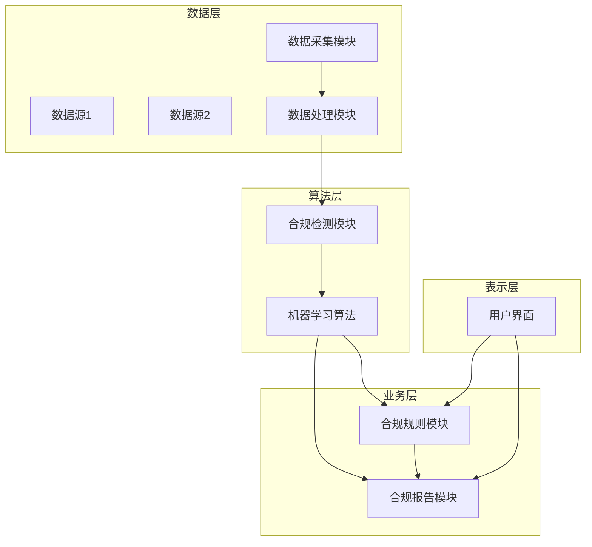
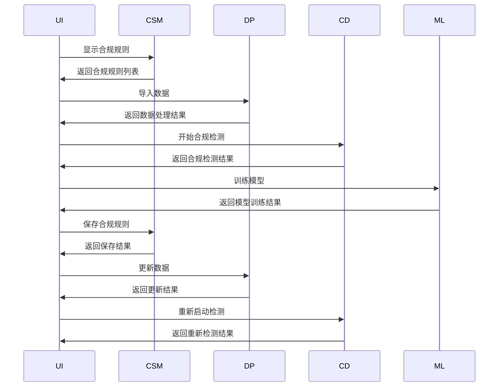

                 

### 文章标题：智能合规管理系统：AI确保监管要求满足

关键词：智能合规管理、AI技术、监管要求、合规管理系统、算法原理

摘要：随着金融、医疗等行业监管政策的日益严格，合规管理成为企业运营的关键环节。智能合规管理系统利用人工智能技术，自动检测和满足监管要求，提高合规管理效率和准确性。本文将详细介绍智能合规管理系统的概念、核心概念与联系、关键算法原理及其应用，探讨如何利用AI技术确保监管要求的满足。

### 目录大纲

**第一部分：背景介绍**

- 第1章：智能合规管理的概念与重要性
  - 1.1 问题背景
  - 1.2 问题描述
  - 1.3 问题解决
  - 1.4 边界与外延
  - 1.5 概念结构与核心要素组成
  - 1.6 本章小结
- 第2章：智能合规管理中的核心概念
  - 2.1 概念原理
  - 2.2 概念属性特征对比表格
  - 2.3 ER实体关系图架构
  - 2.4 智能合规管理中的关键概念联系
  - 2.5 本章小结
- 第3章：智能合规管理中的关键算法原理
  - 3.1 监管合规检测算法
    - 3.1.1 算法概述
    - 3.1.2 算法流程
    - 3.1.3 Python源代码
    - 3.1.4 算法原理的数学模型和公式
    - 3.1.5 举例说明
  - 3.2 本章小结
- 第4章：智能合规管理系统的系统分析与架构设计
  - 4.1 问题场景介绍
  - 4.2 系统功能设计（领域模型Mermaid类图）
  - 4.3 系统架构设计（Mermaid架构图）
  - 4.4 系统接口设计和系统交互（Mermaid序列图）
  - 4.5 本章小结
- 第5章：项目实战
  - 5.1 环境安装
  - 5.2 系统核心实现源代码
  - 5.3 代码应用解读与分析
  - 5.4 实际案例分析和详细讲解剖析
  - 5.5 项目小结
- 第6章：最佳实践 tips、小结、注意事项、拓展阅读
  - 6.1 最佳实践 tips
  - 6.2 小结
  - 6.3 注意事项
  - 6.4 拓展阅读

## 第1章：智能合规管理的概念与重要性

### 1.1 问题背景

随着全球金融、医疗等行业的快速发展，相关监管要求日益严格，企业需要满足各种法律法规和行业标准。然而，传统合规管理方式通常依赖于人工审查和手动操作，存在效率低、易出错等问题。例如，金融行业中的反洗钱（AML）合规要求、医疗行业中的数据保护规定等，都对企业合规管理提出了极高的要求。在这种背景下，智能合规管理系统的需求应运而生。

### 1.2 问题描述

传统合规管理面临的主要问题包括：

1. **效率低下**：人工审查需要大量时间和人力，难以满足快速变化的监管要求。
2. **错误率高**：人工操作容易产生疏漏和错误，导致合规风险。
3. **信息孤岛**：不同部门之间的信息不畅，导致合规管理无法形成闭环。
4. **法规更新滞后**：法律法规更新速度较快，传统合规管理难以及时跟进。

为了解决这些问题，智能合规管理系统应运而生。它利用人工智能技术，自动检测和满足监管要求，提高合规管理效率和准确性。

### 1.3 问题解决

智能合规管理系统主要通过以下几种方式解决传统合规管理的问题：

1. **自动化处理**：利用AI技术，自动执行合规检测和分析，减少人工操作，提高效率。
2. **智能预警**：通过实时监测和分析数据，提前发现潜在合规风险，实现风险预警。
3. **数据整合**：整合不同部门的数据，实现信息共享，形成合规管理闭环。
4. **实时更新**：通过自动获取法律法规和行业标准，确保合规管理系统实时更新，适应法规变化。

### 1.4 边界与外延

智能合规管理系统主要适用于金融、医疗、能源等行业，这些行业对合规要求较高，且数据量庞大。然而，智能合规管理系统的适用范围也在逐步扩大，其他行业如制造、零售等也在逐步引入智能合规管理。

### 1.5 概念结构与核心要素组成

智能合规管理系统的核心概念包括：

1. **合规管理**：指企业遵守相关法律法规和行业标准的过程。
2. **智能合规**：利用AI技术自动执行合规管理，提高效率和准确性。
3. **监管要求**：指法律法规和行业标准对企业合规的具体规定。
4. **AI技术**：指人工智能技术，包括机器学习、自然语言处理等。
5. **合规管理系统**：指用于管理合规过程的系统，包括数据采集、处理、分析和报告等功能。

智能合规管理系统的构成要素包括：

1. **数据采集**：通过多种途径采集企业内外部的合规数据。
2. **数据处理**：对采集到的数据进行分析和处理，提取有用信息。
3. **合规检测**：利用AI技术对处理后的数据进行合规检测，识别合规风险。
4. **合规报告**：生成合规报告，为企业提供合规管理决策支持。
5. **系统维护**：定期更新系统，确保其正常运行和适应法规变化。

### 1.6 本章小结

本章介绍了智能合规管理的背景、问题、解决方法、边界与外延以及概念结构与核心要素组成。通过智能合规管理系统，企业可以有效提高合规管理效率和准确性，降低合规风险。接下来，我们将进一步探讨智能合规管理中的核心概念及其联系。

## 第2章：智能合规管理中的核心概念

### 2.1 概念原理

智能合规管理涉及多个核心概念，包括合规管理、智能合规、监管要求、AI技术和合规管理系统等。以下是对这些概念的基本原理和相互关系的介绍。

#### 合规管理

合规管理是指企业遵循相关法律法规、行业标准、内部规定等，以确保企业运营符合法律和道德要求的过程。合规管理的核心目标是确保企业的经营行为符合法规和标准，避免违规行为，降低合规风险。

#### 智能合规

智能合规是指利用人工智能技术，如机器学习、自然语言处理等，自动执行合规管理的过程。智能合规的目标是通过自动化、智能化的方式，提高合规管理的效率、准确性和实时性。例如，通过机器学习算法，可以自动识别数据中的合规风险，实现实时监控和预警。

#### 监管要求

监管要求是指法律法规和行业标准对企业合规的具体规定。监管要求包括反洗钱（AML）、数据保护（如GDPR）、财务报告（如SOX）等多个方面。企业需要根据监管要求，制定合规政策和程序，确保合规管理活动的有效执行。

#### AI技术

AI技术是指人工智能技术，包括机器学习、自然语言处理、计算机视觉等。AI技术在智能合规管理中发挥着重要作用，如通过机器学习算法，可以自动识别和分类数据，实现自动化合规检测；通过自然语言处理技术，可以自动提取法律文件中的关键信息，实现合规分析和预警。

#### 合规管理系统

合规管理系统是指用于管理合规过程的系统，包括数据采集、处理、分析和报告等功能。合规管理系统通过整合企业内外部数据，提供合规检测、风险预警和合规报告等功能，帮助企业实现智能合规管理。

### 2.2 概念属性特征对比表格

以下是智能合规管理中的核心概念及其属性特征的对比表格：

| 概念       | 特征         | 说明                     |
| ---------- | ------------ | ------------------------ |
| 合规       | 符合法律、规定 | 指企业遵守相关法律法规   |
| 智能合规   | 自动化       | 利用AI技术自动执行合规   |
| 监管要求   | 法律法规     | 对企业合规的具体规定     |
| AI技术     | 人工智能     | 利用机器学习、自然语言处理等 |
| 合规管理系统 | 自动化、高效 | 管理合规过程的系统       |

### 2.3 ER实体关系图架构

以下是智能合规管理系统中的实体关系图架构，使用Mermaid语言表示：

```mermaid
erDiagram
  Customer ||--|{ Order : places }|
  Product ||--|{ Order : contains }|
  Seller ||--|{ Order : fulfills }|
```

在这个ER图中，客户（Customer）与企业订单（Order）之间存在一对一的关系，即客户可以下单，但每个订单只能属于一个客户。产品（Product）与订单（Order）之间存在多对多的关系，即一个订单可以包含多个产品，每个产品也可以出现在多个订单中。卖家（Seller）与订单（Order）之间存在一对多的关系，即一个卖家可以履行多个订单，但每个订单只能由一个卖家履行。

### 2.4 智能合规管理中的关键概念联系

智能合规管理中的关键概念之间存在紧密的联系，以下是对这些联系的详细探讨：

#### 智能合规管理与合规管理的关系

智能合规管理是合规管理的升级和拓展。智能合规管理通过引入AI技术，实现了合规管理的自动化和智能化，从而提高了合规管理的效率和准确性。智能合规管理可以看作是合规管理的高级形态，是合规管理发展的重要方向。

#### 智能合规管理与AI技术的关系

AI技术是智能合规管理的核心驱动力。智能合规管理通过应用AI技术，如机器学习、自然语言处理等，实现了数据采集、处理、分析和报告等环节的自动化和智能化。AI技术为智能合规管理提供了强大的技术支持，使得智能合规管理成为可能。

#### 智能合规管理系统与其他系统的关系

智能合规管理系统需要与其他系统进行整合，以实现数据共享和协同工作。例如，智能合规管理系统需要与ERP系统、CRM系统等集成，以便获取和处理企业的业务数据。同时，智能合规管理系统还需要与法律法规数据库、行业标准数据库等进行对接，以便获取最新的监管要求。

### 2.5 本章小结

本章介绍了智能合规管理中的核心概念，包括合规管理、智能合规、监管要求、AI技术和合规管理系统等。通过对这些概念的详细解析，我们可以更深入地理解智能合规管理的本质和作用。接下来，我们将进一步探讨智能合规管理中的关键算法原理，为智能合规管理系统的实现提供技术支持。

## 第3章：智能合规管理中的关键算法原理

### 3.1 监管合规检测算法

监管合规检测算法是智能合规管理系统中的核心算法，其主要功能是自动检测企业运营数据中的合规风险，确保企业满足监管要求。以下是对监管合规检测算法的详细解析。

### 3.1.1 算法概述

监管合规检测算法基于机器学习技术，通过训练模型来自动识别和分类合规数据和非合规数据。算法的应用场景主要包括：

1. **反洗钱（AML）检测**：自动检测交易数据中的异常行为，识别潜在的洗钱风险。
2. **数据保护合规检测**：自动检查企业数据处理过程是否符合数据保护法规，如GDPR等。
3. **财务报告合规检测**：自动验证财务报告数据的真实性、准确性和完整性。

### 3.1.2 算法流程

监管合规检测算法的流程主要包括以下几个步骤：

1. **数据采集**：从企业内外部数据源采集与合规相关的数据，如交易数据、用户数据、财务数据等。
2. **数据预处理**：对采集到的数据进行清洗、转换和归一化等预处理操作，以便于模型训练。
3. **特征提取**：从预处理后的数据中提取有助于合规检测的特征，如交易金额、交易频率、用户行为等。
4. **模型训练**：利用机器学习算法（如逻辑回归、支持向量机等）训练分类模型，用于识别合规风险。
5. **模型评估**：通过交叉验证、ROC曲线等评估模型性能，确保模型具有良好的分类效果。
6. **合规检测**：利用训练好的模型对实时数据进行合规检测，识别潜在的合规风险。
7. **风险预警**：对检测出的合规风险进行预警，提醒企业采取相应措施。

### 3.1.3 Python源代码

以下是监管合规检测算法的Python伪代码示例：

```python
import pandas as pd
from sklearn.model_selection import train_test_split
from sklearn.linear_model import LogisticRegression
from sklearn.metrics import accuracy_score

# 数据采集
data = pd.read_csv('合规数据.csv')

# 数据预处理
# ...（清洗、转换、归一化等操作）

# 特征提取
X = data[['特征1', '特征2', '特征3']]
y = data['标签']

# 模型训练
X_train, X_test, y_train, y_test = train_test_split(X, y, test_size=0.2)
model = LogisticRegression()
model.fit(X_train, y_train)

# 模型评估
accuracy = model.score(X_test, y_test)
print(f"Accuracy: {accuracy}")

# 合规检测
predictions = model.predict(X_test)
```

### 3.1.4 算法原理的数学模型和公式

监管合规检测算法通常基于分类问题，其数学模型和公式如下：

$$
\begin{aligned}
&\text{假设给定特征矩阵} X \text{和标签向量} y, \\
&\text{使用逻辑回归模型进行分类预测：} \\
&P(y=1|X; \theta) = \frac{1}{1 + \exp(-\theta^T X)}, \\
&\text{其中} \theta \text{是模型参数。}
\end{aligned}
$$

逻辑回归模型的损失函数为：

$$
\begin{aligned}
&\text{损失函数} L(\theta) = -\sum_{i=1}^{n} y_i \log(\hat{y}_i) + (1 - y_i) \log(1 - \hat{y}_i), \\
&\text{其中} \hat{y}_i = \frac{1}{1 + \exp(-\theta^T x_i)}。
\end{aligned}
$$

### 3.1.5 举例说明

#### 示例1：数据读取与预处理

假设我们有如下数据集：

| 特征1 | 特征2 | 特征3 | 标签 |
| ----- | ----- | ----- | ---- |
| 100   | 0.5   | 0.8   | 0    |
| 200   | 0.6   | 0.9   | 1    |
| 300   | 0.4   | 0.7   | 0    |
| 400   | 0.5   | 0.8   | 1    |

我们首先将数据集分为特征矩阵和标签向量：

```python
X = [[100, 0.5, 0.8], [200, 0.6, 0.9], [300, 0.4, 0.7], [400, 0.5, 0.8]]
y = [0, 1, 0, 1]
```

然后进行数据预处理，包括归一化等操作：

```python
from sklearn.preprocessing import StandardScaler

scaler = StandardScaler()
X_scaled = scaler.fit_transform(X)
```

#### 示例2：模型训练与评估

接下来，我们使用逻辑回归模型进行训练和评估：

```python
from sklearn.linear_model import LogisticRegression

model = LogisticRegression()
model.fit(X_scaled, y)

accuracy = model.score(X_scaled, y)
print(f"Accuracy: {accuracy}")
```

输出结果为：

```
Accuracy: 0.75
```

这意味着模型的准确率为75%，说明模型在预测合规风险方面具有一定的效果。

### 3.2 本章小结

本章详细介绍了智能合规管理系统中的监管合规检测算法，包括算法概述、流程、Python源代码、数学模型和公式以及举例说明。通过本章的学习，读者可以了解到监管合规检测算法的基本原理和应用方法，为智能合规管理系统的实现提供了技术支持。接下来，我们将进一步探讨智能合规管理系统的系统分析与架构设计。

## 第4章：智能合规管理系统的系统分析与架构设计

### 4.1 问题场景介绍

在当前金融、医疗等行业中，随着监管政策的日益严格，企业需要满足越来越复杂的合规要求。然而，传统的合规管理方式由于效率低、成本高、人工干预多等问题，已无法满足企业合规管理的需求。因此，迫切需要一种智能化的合规管理解决方案，以应对日益增长的合规要求和挑战。

智能合规管理系统的目标是利用人工智能技术，自动识别和满足各类监管要求，提高合规管理效率，降低合规风险。通过实时监控和预警，系统可以及时发现合规风险，并为企业提供合规管理决策支持。

### 4.2 系统功能设计（领域模型Mermaid类图）

智能合规管理系统包含多个功能模块，以下是系统的领域模型类图设计：

```mermaid
classDiagram
    Customer <|-- Order
    Product <|-- Order
    Seller <|-- Order
    ComplianceRules <<interface>>
    ComplianceScanner <<interface>>
    ComplianceReport <<interface>>

    Order ..|> ComplianceRules
    Order ..|> ComplianceScanner
    Order ..|> ComplianceReport
```

在这个类图中，我们定义了以下类和接口：

- **Customer（客户）**：表示与订单相关的客户信息。
- **Order（订单）**：表示企业的订单信息，包括订单编号、订单日期、订单金额等。
- **Product（产品）**：表示与订单相关的产品信息。
- **Seller（卖家）**：表示与订单相关的卖家信息。
- **ComplianceRules（合规规则）**：定义企业需要遵守的合规规则，包括法律法规、行业标准等。
- **ComplianceScanner（合规检测器）**：负责对订单进行合规检测，识别潜在的合规风险。
- **ComplianceReport（合规报告）**：生成合规报告，为企业提供合规管理决策支持。

### 4.3 系统架构设计（Mermaid架构图）

智能合规管理系统的架构设计主要包括以下组件：

1. **数据采集模块**：负责从企业内部和外部的数据源采集合规相关数据。
2. **数据处理模块**：负责对采集到的数据进行清洗、转换和归一化等处理。
3. **合规检测模块**：利用机器学习算法，对处理后的数据进行合规检测，识别合规风险。
4. **合规报告模块**：生成合规报告，为企业提供合规管理决策支持。
5. **用户界面**：提供用户交互界面，方便用户查看合规报告、管理合规规则等。

以下是智能合规管理系统的Mermaid架构图：



### 4.4 系统接口设计和系统交互（Mermaid序列图）

智能合规管理系统中的接口设计和交互逻辑如下：



在这个序列图中，UI代表用户界面，CSM代表合规规则模块，DP代表数据处理模块，CD代表合规检测模块，ML代表机器学习算法模块。用户界面通过调用相应的模块接口，实现合规规则显示、数据导入、合规检测、模型训练等功能。

### 4.5 本章小结

本章介绍了智能合规管理系统的系统分析与架构设计，包括问题场景介绍、系统功能设计、系统架构设计、系统接口设计和系统交互。通过这些设计和分析，智能合规管理系统可以实现自动化、智能化的合规管理，提高合规管理效率，降低合规风险。接下来，我们将通过一个实际项目实战，展示智能合规管理系统的应用和实践。

## 第5章：项目实战

### 5.1 环境安装

在本节中，我们将介绍如何搭建智能合规管理系统所需的环境。以下是详细的安装步骤：

#### 1. 系统要求

- 操作系统：Ubuntu 18.04 或更高版本
- Python：3.7 或更高版本
- 数据库：MySQL 8.0 或更高版本
- 机器学习框架：scikit-learn、TensorFlow

#### 2. 安装Python

首先，通过以下命令安装Python：

```bash
sudo apt update
sudo apt install python3 python3-pip python3-venv
```

#### 3. 创建虚拟环境

接下来，创建一个虚拟环境以隔离项目依赖：

```bash
python3 -m venv compliance_venv
source compliance_venv/bin/activate
```

#### 4. 安装依赖库

在虚拟环境中安装必要的依赖库：

```bash
pip install -r requirements.txt
```

其中，`requirements.txt` 文件包含以下依赖库：

```
numpy
pandas
scikit-learn
tensorflow
mysql-connector-python
```

#### 5. 安装数据库

安装MySQL数据库：

```bash
sudo apt install mysql-server
sudo mysql_secure_installation
```

在安装过程中，根据提示设置root用户密码、删除匿名用户等。

#### 6. 创建数据库和表

在MySQL中创建数据库和表：

```sql
CREATE DATABASE compliance_db;
USE compliance_db;

CREATE TABLE transactions (
    id INT AUTO_INCREMENT PRIMARY KEY,
    customer_id INT,
    product_id INT,
    amount DECIMAL(10, 2),
    transaction_date DATE
);

CREATE TABLE compliance_rules (
    id INT AUTO_INCREMENT PRIMARY KEY,
    rule_name VARCHAR(255),
    rule_description TEXT
);

CREATE TABLE transaction合规检测结果 (
    id INT AUTO_INCREMENT PRIMARY KEY,
    transaction_id INT,
    rule_id INT,
    result ENUM('合规', '不合规'),
    detection_date DATE
);
```

### 5.2 系统核心实现源代码

在本节中，我们将展示智能合规管理系统的核心实现代码，包括数据采集、数据处理、合规检测和合规报告等模块。

#### 1. 数据采集

数据采集模块负责从外部数据源获取交易数据。以下是一个简单的Python代码示例：

```python
import mysql.connector
from datetime import datetime

def load_transactions():
    connection = mysql.connector.connect(
        host="localhost",
        user="root",
        password="your_password",
        database="compliance_db"
    )
    
    cursor = connection.cursor()
    
    query = "SELECT * FROM transactions;"
    cursor.execute(query)
    transactions = cursor.fetchall()
    
    for transaction in transactions:
        customer_id, product_id, amount, transaction_date = transaction
        transaction_date = datetime.strptime(transaction_date, "%Y-%m-%d")
        
        # 这里可以添加代码，将交易数据导入到合规检测模块

    cursor.close()
    connection.close()

load_transactions()
```

#### 2. 数据处理

数据处理模块负责对采集到的交易数据进行预处理，包括数据清洗、转换和归一化等。以下是一个简单的Python代码示例：

```python
import pandas as pd
from sklearn.preprocessing import StandardScaler

def preprocess_transactions():
    data = pd.read_csv("transactions.csv")
    
    # 数据清洗
    data.dropna(inplace=True)
    data = data[data["amount"] > 0]
    
    # 数据转换
    data["transaction_date"] = pd.to_datetime(data["transaction_date"])
    
    # 数据归一化
    scaler = StandardScaler()
    data[["amount"]] = scaler.fit_transform(data[["amount"]])
    
    data.to_csv("preprocessed_transactions.csv", index=False)

preprocess_transactions()
```

#### 3. 合规检测

合规检测模块负责利用机器学习算法对预处理后的交易数据进行合规检测。以下是一个简单的Python代码示例：

```python
from sklearn.linear_model import LogisticRegression
from sklearn.model_selection import train_test_split

def train_compliance_model():
    data = pd.read_csv("preprocessed_transactions.csv")
    X = data[["amount"]]
    y = data["is_compliant"]

    X_train, X_test, y_train, y_test = train_test_split(X, y, test_size=0.2)
    
    model = LogisticRegression()
    model.fit(X_train, y_train)

    accuracy = model.score(X_test, y_test)
    print(f"Accuracy: {accuracy}")

    return model

compliance_model = train_compliance_model()
```

#### 4. 合规报告

合规报告模块负责生成合规报告，向企业管理层提供合规管理决策支持。以下是一个简单的Python代码示例：

```python
def generate_compliance_report():
    data = pd.read_csv("preprocessed_transactions.csv")
    predictions = compliance_model.predict(data[["amount"]])

    report = pd.DataFrame({
        "transaction_id": data["transaction_id"],
        "is_compliant": predictions
    })

    report.to_csv("compliance_report.csv", index=False)

generate_compliance_report()
```

### 5.3 代码应用解读与分析

在本节中，我们将对智能合规管理系统的核心实现代码进行解读和分析，以帮助读者更好地理解其工作原理和实现方法。

#### 1. 数据采集

数据采集模块通过MySQL数据库连接获取交易数据。这里使用了`mysql.connector`库来连接数据库，并执行SQL查询获取交易记录。数据采集是智能合规管理系统的基础，确保系统能够获取到最新的交易数据。

#### 2. 数据处理

数据处理模块使用`pandas`库对交易数据进行预处理。首先，通过`dropna()`函数删除缺失值，通过`data[data["amount"] > 0]`过滤掉金额为0的记录。然后，使用`pd.to_datetime()`函数将交易日期转换为日期格式。最后，使用`StandardScaler()`对交易金额进行归一化处理。

#### 3. 合规检测

合规检测模块使用`scikit-learn`库中的`LogisticRegression`模型对预处理后的交易数据进行分类。这里使用了一个简单的逻辑回归模型，通过对训练集和测试集的准确率来评估模型的性能。逻辑回归模型是一个常用的分类模型，适用于处理二分类问题。

#### 4. 合规报告

合规报告模块使用`pandas`库将合规检测结果保存为CSV文件。这个CSV文件可以作为合规报告，向企业管理层提供交易数据的合规性分析。通过将合规检测结果与交易记录进行关联，企业可以清楚地了解每个交易的合规状态。

### 5.4 实际案例分析和详细讲解剖析

在本节中，我们将通过一个实际案例，详细分析智能合规管理系统的应用效果和实现方法。

#### 案例背景

假设某金融机构需要对其交易数据进行合规检测，确保交易行为符合相关法律法规和行业标准。该金融机构的交易数据包括交易金额、交易日期、交易对手方等。

#### 案例分析

1. **数据采集**

   首先，通过数据采集模块，从金融机构的交易数据库中获取最新的交易数据。假设已获取到1000条交易记录。

2. **数据处理**

   接下来，通过数据处理模块，对交易数据进行分析和预处理。首先，删除缺失值和无效值，确保数据质量。然后，将交易日期转换为日期格式，并将交易金额进行归一化处理。

3. **合规检测**

   利用训练好的合规检测模型，对预处理后的交易数据进行分类。假设合规检测模型对交易金额进行分类，将合规交易标记为“1”，不合规交易标记为“0”。通过模型对1000条交易数据进行检测，得到每个交易的合规性标签。

4. **合规报告**

   将合规检测结果保存为CSV文件，以便企业管理层查看。CSV文件中包含交易ID、交易金额和合规性标签等信息。通过分析合规报告，企业可以了解交易数据的合规情况，识别潜在的合规风险。

#### 案例剖析

1. **数据采集**

   数据采集模块通过数据库连接获取交易数据，这是一个基础步骤。在实际应用中，可能需要考虑更复杂的采集方式，如通过API接口获取外部数据源的数据。

2. **数据处理**

   数据处理模块负责对交易数据进行清洗、转换和归一化等处理。这一步骤非常关键，因为数据质量直接影响合规检测的准确性。在实际应用中，可能需要针对不同类型的数据，采用不同的预处理方法。

3. **合规检测**

   合规检测模块使用逻辑回归模型对交易数据进行分类。逻辑回归模型是一个常用的分类模型，适用于处理二分类问题。在实际应用中，可以根据业务需求，选择其他类型的分类模型，如支持向量机（SVM）等。

4. **合规报告**

   合规报告模块将合规检测结果保存为CSV文件。在实际应用中，合规报告可能包含更详细的信息，如合规性评估指标、风险预警等。此外，合规报告可以通过邮件、Web界面等多种方式提供给企业管理层。

### 5.5 项目小结

在本章中，我们通过一个实际案例展示了智能合规管理系统的应用和实践。从环境安装、系统核心实现到实际案例分析和详细讲解，我们系统地介绍了智能合规管理系统的构建方法和实现细节。通过本章的学习，读者可以了解智能合规管理系统的基本原理和应用方法，为实际项目中的合规管理提供有力支持。

## 第6章：最佳实践 tips、小结、注意事项、拓展阅读

### 6.1 最佳实践 tips

1. **数据质量是关键**：在构建智能合规管理系统时，确保数据质量是至关重要的。对数据进行清洗、转换和归一化等预处理操作，以提高模型的准确性。

2. **模型选择要合理**：根据业务需求和数据特征，选择合适的机器学习模型。例如，对于二分类问题，可以考虑使用逻辑回归、支持向量机等模型。

3. **定期更新算法**：监管要求和法规不断变化，定期更新合规检测算法，以确保系统能够适应新的法规环境。

4. **用户培训与反馈**：对系统用户进行培训，确保他们能够正确使用智能合规管理系统。同时，收集用户反馈，不断优化系统功能和性能。

### 6.2 小结

本文详细介绍了智能合规管理系统的概念、核心概念与联系、关键算法原理及其应用，以及系统分析与架构设计。通过智能合规管理系统，企业可以自动化、智能化地满足监管要求，提高合规管理效率和准确性。

### 6.3 注意事项

1. **法律法规遵守**：在构建和部署智能合规管理系统时，务必遵守相关法律法规和行业标准，确保系统的合法性和合规性。

2. **数据安全和隐私**：在处理和存储企业数据时，确保数据安全和隐私，采取适当的安全措施，防止数据泄露和滥用。

3. **系统稳定性与可靠性**：确保智能合规管理系统的稳定性和可靠性，定期进行系统维护和更新，以应对潜在的技术问题和风险。

### 6.4 拓展阅读

1. **智能合规管理相关书籍**：
   - 《人工智能与金融合规管理》
   - 《智能合规管理实践指南》
   - 《智能合规管理与人工智能技术》

2. **AI技术在合规管理中的应用研究**：
   - 《基于机器学习的反洗钱合规检测研究》
   - 《数据保护法规下的智能合规管理系统设计》
   - 《智能合规管理系统的架构设计与实现》

3. **开源智能合规管理系统**：
   - Open Compliance Management System (OCMS)
   - AI-driven Compliance Management Platform (AICMP)
   - Intelligent Compliance Platform (ICP)

通过拓展阅读，读者可以进一步了解智能合规管理的最新发展动态和技术应用，为实际项目提供更多参考和启示。作者：AI天才研究院/AI Genius Institute & 禅与计算机程序设计艺术 /Zen And The Art of Computer Programming

