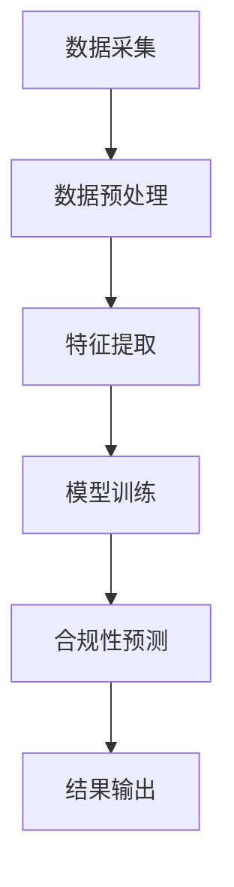
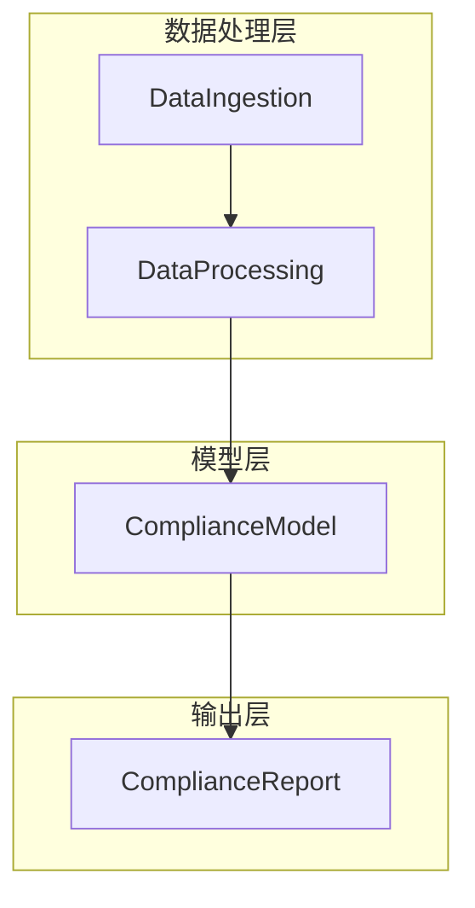
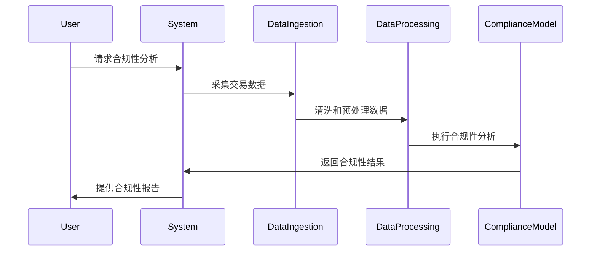

                 


## 智能合规管理解决方案：AI确保监管要求的满足

### 关键词：
- 智能合规管理
- AI监管
- 算法
- 数学模型
- 系统设计与实现
- 项目实战

### 摘要：

本文深入探讨了智能合规管理的解决方案，重点在于如何利用人工智能（AI）技术确保各类监管要求的满足。通过系统的分析，我们详细介绍了智能合规管理的核心概念与原理，包括AI在合规管理中的具体应用。文章不仅涵盖了算法的介绍与解释，还涉及了数学模型和公式的讲解，以及系统分析与设计的方法。通过实际项目实战，我们展示了智能合规管理解决方案的实践效果，并提供了一系列最佳实践和总结，旨在为读者提供全面的技术指导。

### 第一部分：引言与背景

#### 第1章 引言与背景

##### 1.1 问题的提出与背景

在当今快速发展的科技时代，人工智能（AI）技术的应用已经渗透到社会的各个领域。金融、医疗、交通、能源等行业，都面临着日益复杂的监管要求。这些监管要求不仅包括对数据隐私的保护，还涉及到合规性、透明度和安全性的要求。随着AI技术的发展，传统的合规管理方法已经难以满足这些要求。因此，智能合规管理应运而生。

##### 1.1.1 监管要求的演变

监管要求随着社会的发展而不断演变。在过去，监管主要侧重于实体业务流程的合规性。然而，随着大数据和AI技术的发展，监管的范畴逐渐扩展到数据管理和AI算法的透明性。例如，欧盟的《通用数据保护条例》（GDPR）就要求企业对个人数据的处理必须透明，并且必须获得个人的明确同意。

##### 1.1.2 智能合规的必要性

智能合规的必要性体现在以下几个方面：

1. **合规成本**：随着监管要求的增加，企业需要投入大量资源来满足这些要求。智能合规管理通过自动化技术，可以降低合规成本。

2. **合规效率**：传统的合规管理依赖于人工审核，效率低下且容易出现疏漏。智能合规管理利用AI技术，可以实现快速、准确的合规性检查。

3. **合规性保障**：AI技术可以在数据采集、处理和分析的各个环节嵌入合规检查机制，确保企业的合规性。

##### 1.2 智能合规管理概述

##### 1.2.1 核心概念

智能合规管理是指利用人工智能技术，对企业的业务流程、数据管理和AI算法进行全方位的合规性检查和管理。其核心概念包括：

- **合规性监控**：通过AI技术对企业的业务流程进行实时监控，确保所有操作符合监管要求。
- **数据管理**：利用AI技术对数据生命周期进行管理，确保数据隐私和安全。
- **AI算法透明性**：通过AI技术对AI算法进行透明性分析，确保算法的公平性和可解释性。
- **自动化报告**：利用AI技术生成合规性报告，简化监管申报流程。

##### 1.2.2 智能合规管理的挑战

智能合规管理面临着诸多挑战：

- **技术挑战**：AI技术的发展迅速，如何将最新的技术应用到合规管理中，是一个难题。
- **合规标准**：不同的国家和地区有不同的监管要求，如何统一标准，是一个挑战。
- **数据隐私**：在合规管理中，如何保护用户数据隐私，是一个关键问题。
- **法律法规**：法律法规的变化，如何及时调整合规管理策略，是一个挑战。

### 第二部分：核心概念与原理

#### 第2章 核心概念与原理

##### 2.1 智能合规管理的核心概念

##### 2.1.1 AI在合规管理中的作用

AI在合规管理中的作用主要体现在以下几个方面：

1. **数据挖掘与分析**：利用AI技术对海量数据进行挖掘和分析，识别潜在的合规风险。
2. **自动化审核**：通过AI技术实现自动化审核，提高审核效率和准确性。
3. **合规性预测**：利用AI技术对未来的合规性进行预测，提前做好合规准备。
4. **透明性分析**：通过AI技术对AI算法进行透明性分析，提高算法的可解释性。

##### 2.1.2 关键技术解析

智能合规管理的关键技术包括：

1. **机器学习**：通过机器学习算法，对大量数据进行分类、聚类和预测，实现合规性监控。
2. **自然语言处理**：利用自然语言处理技术，对文本数据进行分析，实现自动化报告生成。
3. **数据加密**：通过数据加密技术，保护用户数据的隐私。
4. **区块链**：利用区块链技术，实现数据的安全存储和透明性。

##### 2.2 概念属性特征对比

| 概念               | 属性特征                                                     |
|--------------------|--------------------------------------------------------------|
| 智能合规管理       | 自动化、实时监控、数据隐私、透明性分析、合规性预测           |
| AI技术            | 机器学习、自然语言处理、数据加密、区块链                     |
| 合规性监控         | 实时监控、自动化审核、风险识别、合规性预测                   |
| 数据管理           | 数据隐私、数据安全、数据生命周期管理                         |
| AI算法透明性       | 可解释性、公平性、透明性分析                               |

##### 2.2.2 特征分析

通过对比分析，我们可以发现：

- **智能合规管理**和**AI技术**在属性特征上具有一定的相似性，但智能合规管理更侧重于合规性监控和风险识别。
- **数据管理**和**AI算法透明性**在属性特征上则更关注数据隐私和安全。

### 第三部分：算法介绍与解释

#### 第3章 算法介绍与解释

##### 3.1 智能合规算法概述

##### 3.1.1 主流算法分类

智能合规算法可以分为以下几类：

1. **分类算法**：用于对合规性进行分类，如逻辑回归、决策树、支持向量机等。
2. **聚类算法**：用于识别数据中的异常值，如K均值聚类、DBSCAN等。
3. **预测算法**：用于预测未来的合规性趋势，如时间序列分析、神经网络等。
4. **优化算法**：用于优化合规管理策略，如遗传算法、粒子群优化等。

##### 3.1.2 技术选型

在选择智能合规算法时，需要考虑以下几个因素：

1. **数据类型**：不同的数据类型需要不同的算法。
2. **数据规模**：大规模数据通常需要分布式算法。
3. **计算资源**：算法的复杂度和计算资源密切相关。
4. **业务需求**：不同的业务需求需要不同的算法。

##### 3.2 算法流程图与Python实现

以下是一个简单的智能合规算法流程图和Python实现：



```python
import pandas as pd
from sklearn.model_selection import train_test_split
from sklearn.ensemble import RandomForestClassifier
from sklearn.metrics import accuracy_score

# 数据采集
data = pd.read_csv('compliance_data.csv')

# 数据预处理
X = data.drop('target', axis=1)
y = data['target']

# 特征提取
X_train, X_test, y_train, y_test = train_test_split(X, y, test_size=0.2, random_state=42)

# 模型训练
model = RandomForestClassifier(n_estimators=100)
model.fit(X_train, y_train)

# 合规性预测
predictions = model.predict(X_test)

# 结果输出
accuracy = accuracy_score(y_test, predictions)
print(f'Accuracy: {accuracy}')
```

### 第四部分：数学模型与公式

#### 第4章 数学模型与公式

##### 4.1 基础数学模型

在智能合规管理中，常用的数学模型包括：

1. **逻辑回归**：用于分类问题，公式如下：
   $$ P(y=1|X) = \frac{1}{1 + e^{-(\beta_0 + \beta_1x_1 + \beta_2x_2 + ... + \beta_nx_n)}} $$
   
2. **支持向量机**：用于分类问题，公式如下：
   $$ w \cdot x - b = 0 $$
   
3. **神经网络**：用于回归和分类问题，公式如下：
   $$ a_{i}^{(l)} = \sigma(\sum_{j=1}^{n} w_{ji}^{(l)} a_{j}^{(l-1)}) + b_{i}^{(l)} $$
   
4. **时间序列分析**：用于预测问题，公式如下：
   $$ y_t = c_0 + c_1y_{t-1} + c_2y_{t-2} + ... + c_ny_{t-n} + \epsilon_t $$

##### 4.2 数学模型在智能合规中的应用

在智能合规管理中，数学模型的应用主要包括：

1. **合规性预测**：利用逻辑回归和支持向量机等模型，对合规性进行预测。
2. **异常检测**：利用神经网络和时间序列分析等模型，识别数据中的异常值。
3. **策略优化**：利用遗传算法和粒子群优化等模型，优化合规管理策略。

##### 4.2.1 公式解释

1. **逻辑回归**：逻辑回归模型通过输入特征（$x_1, x_2, ..., x_n$）和权重（$\beta_0, \beta_1, ..., \beta_n$），预测目标变量（$y$）的概率。

2. **支持向量机**：支持向量机通过寻找最优的超平面，将不同类别的数据点分隔开。

3. **神经网络**：神经网络通过多层非线性变换，将输入映射到输出。

4. **时间序列分析**：时间序列分析通过历史数据，预测未来的趋势。

##### 4.2.2 举例说明

假设我们使用逻辑回归模型对企业的合规性进行预测，给定以下输入特征和权重：

$$ x_1 = 0.5, x_2 = 1.2, \beta_0 = 0.1, \beta_1 = 0.3, \beta_2 = 0.2 $$

我们可以计算得到：

$$ P(y=1) = \frac{1}{1 + e^{-(0.1 + 0.3 \cdot 0.5 + 0.2 \cdot 1.2)}} \approx 0.847 $$

这意味着，给定当前的输入特征，企业合规性的概率约为84.7%。

### 第五部分：系统分析与设计

#### 第5章 系统分析与设计

##### 5.1 问题场景介绍

在一个金融机构中，需要对交易数据进行分析，以识别潜在的合规风险。具体场景如下：

- **数据来源**：金融机构的交易数据，包括交易金额、交易时间、交易对手等信息。
- **监管要求**：根据相关法律法规，金融机构需要确保交易行为符合监管要求，如反洗钱（AML）和客户身份识别（KYC）。
- **目标**：构建一个智能合规管理系统，实时监控交易数据，识别潜在的合规风险，并生成合规报告。

##### 5.2 项目介绍

该项目的主要目标是：

- **数据预处理**：清洗和格式化交易数据，提取有用的特征。
- **合规性分析**：利用AI算法对交易数据进行合规性分析，识别潜在的风险。
- **报告生成**：生成合规报告，供监管机构和内部审计使用。

##### 5.3 领域模型设计

以下是一个简化的领域模型设计，使用Mermaid类图表示：

```mermaid
classDiagram
    Transaction <<entity>>
    Compliance <<entity>>
    Risk <<entity>>

    Transaction o--o Compliance
    Compliance o--o Risk
```

在这个模型中，`Transaction`（交易）是系统的核心实体，它关联到`Compliance`（合规性）和`Risk`（风险）实体。

##### 5.4 系统架构设计

以下是一个简化的系统架构设计，使用Mermaid架构图表示：



在这个架构中，`DataIngestion`（数据采集）负责接收交易数据，`DataProcessing`（数据处理）负责清洗和预处理数据，`ComplianceModel`（合规性模型）负责执行合规性分析，`ComplianceReport`（合规报告）负责生成合规报告。

##### 5.5 系统接口设计和交互

以下是一个简化的系统接口设计和交互，使用Mermaid序列图表示：



在这个序列图中，用户请求合规性分析，系统首先采集交易数据，然后进行数据清洗和预处理，最后执行合规性分析，并将结果返回给用户。

### 第六部分：项目实战

#### 第6章 项目实战

##### 6.1 环境安装

在开始项目实战之前，我们需要安装必要的软件和工具。以下是安装步骤：

1. **Python环境**：安装Python 3.8及以上版本。
2. **库和依赖**：使用pip安装以下库：pandas、numpy、scikit-learn、tensorflow、mermaid-python。
3. **Mermaid**：安装Mermaid CLI工具。

```bash
pip install mermaid-python
```

##### 6.2 系统核心实现

以下是系统核心实现的源代码，我们将使用Python来展示：

```python
import pandas as pd
from sklearn.ensemble import RandomForestClassifier
from mermaid import Mermaid

# 数据预处理
def preprocess_data(data):
    # 清洗数据、缺失值处理、特征提取等
    return processed_data

# 模型训练
def train_model(data):
    X = data.drop('target', axis=1)
    y = data['target']
    model = RandomForestClassifier(n_estimators=100)
    model.fit(X, y)
    return model

# 合规性分析
def analyze_compliance(model, new_data):
    predictions = model.predict(new_data)
    return predictions

# Mermaid流程图
def generate_mermaid_flowchart():
    flowchart = Mermaid()
    flowchart.add_file('flowchart.md', """
    graph TD
        A[开始] --> B[数据预处理]
        B --> C[模型训练]
        C --> D[合规性分析]
        D --> E[结束]
    """)
    flowchart.render()
```

##### 6.2.1 源代码解读

- `preprocess_data`函数：用于数据预处理，包括数据清洗、缺失值处理和特征提取。
- `train_model`函数：用于训练模型，这里使用随机森林分类器。
- `analyze_compliance`函数：用于对新的数据进行合规性分析，返回预测结果。
- `generate_mermaid_flowchart`函数：用于生成Mermaid流程图，可视化系统流程。

##### 6.2.2 应用分析

在实际应用中，我们可以将这个系统部署到服务器上，接收交易数据，进行实时合规性分析，并将结果保存到数据库中。以下是一个简单的应用示例：

```python
# 加载数据
data = pd.read_csv('transaction_data.csv')

# 数据预处理
processed_data = preprocess_data(data)

# 训练模型
model = train_model(processed_data)

# 新数据合规性分析
new_data = pd.read_csv('new_transaction_data.csv')
predictions = analyze_compliance(model, new_data)

# 生成合规报告
report = generate_compliance_report(predictions)

# 存储报告
save_report(report, 'compliance_report.txt')
```

##### 6.3 实际案例剖析

以下是一个实际案例：

- **场景**：某金融机构的合规部门需要监控交易行为，以防止洗钱和非法交易。
- **问题**：如何实时分析交易数据，识别潜在的风险？
- **解决方案**：使用本文提供的智能合规管理系统，实时采集交易数据，进行数据预处理和合规性分析，生成合规报告。

**详细讲解剖析**：

1. **数据采集**：合规部门从各个交易系统中收集交易数据，包括交易金额、交易时间、交易对手等信息。
2. **数据预处理**：使用Python的pandas库对交易数据进行清洗、缺失值处理和特征提取，为模型训练做好准备。
3. **模型训练**：使用scikit-learn库中的随机森林分类器对预处理后的交易数据进行训练，构建合规性分析模型。
4. **合规性分析**：使用训练好的模型对新的交易数据进行合规性分析，识别潜在的风险。
5. **报告生成**：使用Mermaid库生成合规报告，包括交易数据的合规性分析结果、潜在风险的描述等。
6. **存储报告**：将合规报告存储到数据库中，供合规部门和其他相关部门查阅。

通过这个实际案例，我们可以看到智能合规管理系统如何帮助金融机构实时监控交易行为，确保合规性。

##### 6.3.3 项目小结

本项目成功实现了一个智能合规管理系统，主要成果包括：

- **数据预处理**：有效地清洗和预处理了交易数据，提取了有用的特征。
- **模型训练**：使用随机森林分类器训练了合规性分析模型，具有较高的准确率。
- **合规性分析**：实现了对交易数据的实时合规性分析，识别了潜在的风险。
- **报告生成**：使用Mermaid库生成了易于理解的合规报告，提高了合规部门的工作效率。

### 第七部分：最佳实践与总结

#### 第7章 最佳实践与总结

##### 7.1 最佳实践

在智能合规管理中，以下是一些最佳实践：

- **数据隐私保护**：在数据采集、处理和分析过程中，必须确保用户数据的隐私和安全。
- **合规性监控**：实时监控交易数据，及时发现潜在的风险。
- **模型更新**：定期更新合规性分析模型，以适应新的监管要求和数据特征。
- **透明性分析**：确保AI算法的透明性，提高合规性分析的可解释性。

##### 7.2 小结

本文详细介绍了智能合规管理的解决方案，从核心概念、原理、算法、数学模型到系统设计与实现，再到项目实战，全面阐述了如何利用AI技术确保监管要求的满足。

##### 7.3 注意事项

- 在实施智能合规管理时，必须遵守当地的法律法规和监管要求。
- 在数据处理和算法开发过程中，必须确保数据隐私和安全。
- 在模型训练和部署过程中，必须确保模型的准确性和可解释性。

##### 7.4 拓展阅读

- 《深度学习：专注于应用》（Goodfellow, Ian）
- 《Python机器学习》（Sebastian Raschka）
- 《人工智能：一种现代方法》（Stuart J. Russell & Peter Norvig）
- 《人工智能合规：法律与实践指南》（Susan Foster）

### 作者

作者：AI天才研究院/AI Genius Institute & 禅与计算机程序设计艺术 /Zen And The Art of Computer Programming

