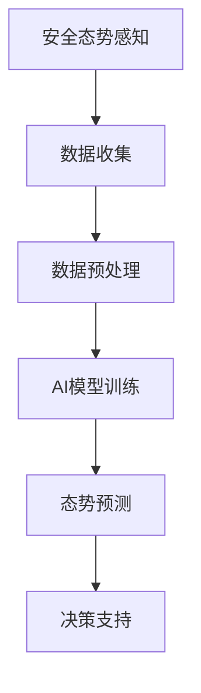
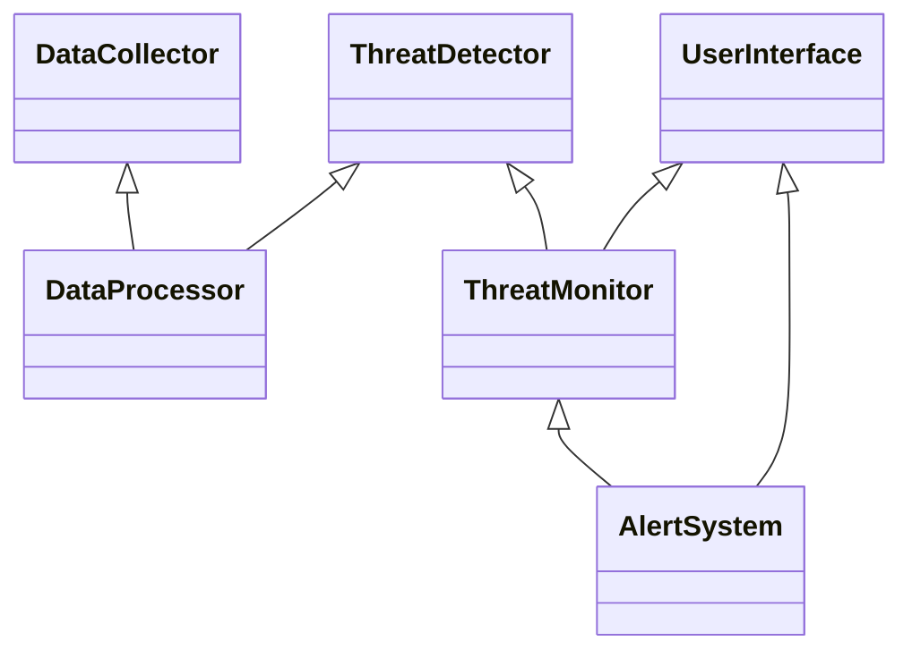
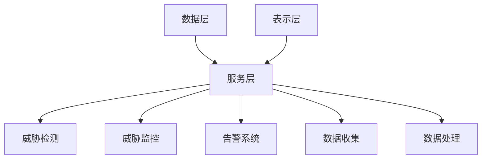
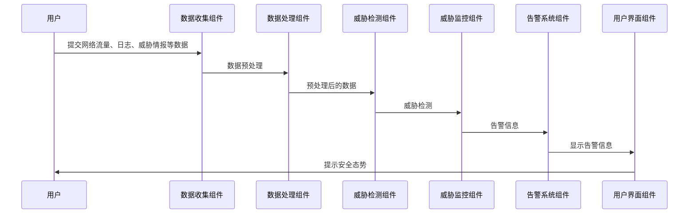

                 

# 智能安全态势感知：AI全面监控风险

关键词：智能安全态势感知，AI技术，算法原理，系统架构，实战应用

摘要：随着信息技术的快速发展，网络安全威胁日益严峻。本文将探讨智能安全态势感知的重要性和AI技术在其中的应用，通过分析AI与安全态势感知的关系，介绍常见AI算法及其在安全态势感知中的应用，并详细讲解系统架构设计和项目实战，旨在为读者提供全面的智能安全态势感知知识。

## 第1章：智能安全态势感知的背景与核心概念

### 1.1 智能安全态势感知的重要性

#### 1.1.1 安全态势感知的概念

安全态势感知是指通过收集、分析和处理与安全相关的信息，以实时识别、评估和预测网络安全威胁的能力。安全态势感知技术可以帮助企业、组织和政府等实

### 1.2 AI在安全态势感知中的应用

#### 1.2.1 AI技术的基本原理

AI（人工智能）是一种模拟人类智能的技术，通过机器学习、深度学习等方法实现计算机对数据的自主学习和决策。AI在安全态势感知中的应用主要体现在以下几个方面：

1. 数据挖掘：AI可以挖掘海量数据中的潜在威胁信息，识别异常行为和潜在风险。
2. 威胁情报：AI可以分析收集到的威胁情报，预测潜在的攻击行为和趋势。
3. 自动化响应：AI可以自动化执行安全策略和应对措施，提高响应速度和效果。

#### 1.2.2 AI在安全领域的作用

AI在安全领域的作用主要包括：

1. 提高安全防护能力：AI可以实时监控网络安全态势，识别潜在威胁，提高防护能力。
2. 降低人工成本：AI可以自动化执行安全策略和应对措施，降低人力成本。
3. 提高决策效率：AI可以分析海量数据，为决策者提供科学、准确的决策支持。

#### 1.2.3 智能安全态势感知的关键要素

智能安全态势感知的关键要素包括：

1. 数据收集与处理：收集与安全相关的数据，包括网络流量、日志、威胁情报等，进行预处理和清洗。
2. 模型训练与优化：利用机器学习和深度学习算法，训练和优化安全态势感知模型。
3. 决策支持：根据安全态势感知模型的分析结果，为决策者提供实时、准确的决策支持。

### 1.3 本书概述

本书旨在系统地介绍智能安全态势感知的知识，包括：

1. AI与安全态势感知的关系
2. 常见AI算法在安全态势感知中的应用
3. 安全态势感知系统的设计与实现
4. 项目实战与案例分析

本书结构如下：

- 第1章：背景与核心概念
- 第2章：AI与安全态势感知的基础
- 第3章：常见AI算法在安全态势感知中的应用
- 第4章：深度学习算法在安全态势感知中的应用
- 第5章：强化学习算法在安全态势感知中的应用
- 第6章：图神经网络算法在安全态势感知中的应用
- 第7章：安全态势感知系统的设计与实现
- 第8章：项目实战与案例分析

### 1.3.1 书的结构安排

本书分为8个章节，每个章节的内容如下：

- 第1章：背景与核心概念
  - 智能安全态势感知的重要性
  - AI在安全态势感知中的应用
  - 智能安全态势感知的关键要素

- 第2章：AI与安全态势感知的基础
  - AI的基本原理
  - 安全态势感知的概念架构
  - 安全态势感知与AI的关系

- 第3章至第6章：常见AI算法在安全态势感知中的应用
  - K近邻算法
  - 决策树算法
  - 随机森林算法
  - 支持向量机算法

- 第7章：安全态势感知系统的设计与实现
  - 项目背景与介绍
  - 系统功能设计
  - 系统架构设计
  - 系统接口设计
  - 系统交互设计

- 第8章：项目实战与案例分析
  - 环境安装
  - 系统核心实现
  - 代码应用解读与分析
  - 实际案例分析与讲解
  - 项目小结

### 1.3.2 阅读建议

建议读者按照以下顺序阅读本书：

1. 先阅读第1章，了解智能安全态势感知的背景和核心概念。
2. 再阅读第2章，了解AI与安全态势感知的基础知识。
3. 接着阅读第3章至第6章，掌握常见AI算法在安全态势感知中的应用。
4. 阅读第7章，了解安全态势感知系统的设计与实现。
5. 最后阅读第8章，掌握项目实战与案例分析。

### 1.3.3 目标读者

本书的目标读者包括：

1. 对网络安全和人工智能感兴趣的读者。
2. 从事网络安全、人工智能相关工作的专业人士。
3. 高校师生、研究生、本科生等相关专业学生。

通过阅读本书，读者可以：

1. 了解智能安全态势感知的概念和重要性。
2. 掌握AI技术在安全态势感知中的应用。
3. 学习常见AI算法及其在安全态势感知中的应用。
4. 了解安全态势感知系统的设计与实现。
5. 提高实际项目开发能力和网络安全防护水平。

## 第2章：AI与安全态势感知的基础

### 2.1 AI的基本原理

#### 2.1.1 机器学习与深度学习的区别

机器学习和深度学习是人工智能领域的两个重要分支。它们的主要区别在于：

1. **机器学习**：机器学习是基于统计方法，通过训练模型从数据中学习规律和模式。机器学习算法通常需要大量的标注数据进行训练，然后通过模型预测未知数据的标签。

2. **深度学习**：深度学习是机器学习的一种特殊形式，它通过构建多层的神经网络结构，自动学习数据的特征表示。深度学习在图像识别、语音识别、自然语言处理等领域取得了显著成果。

#### 2.1.2 人工智能的主要类型

人工智能主要分为以下几种类型：

1. **弱人工智能**：弱人工智能是指专门解决特定问题的智能系统，如语音助手、搜索引擎等。它们无法像人类一样进行抽象思考和推理。

2. **强人工智能**：强人工智能是指具有人类智能的智能系统，能够理解、思考、学习并执行任何人类可以完成的任务。目前，强人工智能仍然是一个理论概念。

3. **自然语言处理**：自然语言处理是指使计算机能够理解、生成和处理自然语言的技术。自然语言处理在智能客服、机器翻译等领域有广泛应用。

4. **计算机视觉**：计算机视觉是指使计算机能够像人类一样感知和理解视觉信息的技术。计算机视觉在图像识别、目标检测、人脸识别等领域有广泛应用。

#### 2.1.3 AI在安全领域的应用场景

AI在安全领域的应用场景主要包括：

1. **威胁检测与防范**：通过分析网络流量、日志等信息，实时检测和防范网络攻击。

2. **安全事件响应**：自动化处理安全事件，降低安全事件的响应时间和成本。

3. **威胁情报分析**：分析收集到的威胁情报，预测潜在的攻击行为和趋势。

4. **安全合规管理**：自动化执行安全合规要求，降低合规风险。

### 2.2 安全态势感知的概念架构

#### 2.2.1 安全态势感知的定义

安全态势感知是指通过收集、分析和处理与安全相关的信息，以实时识别、评估和预测网络安全威胁的能力。安全态势感知系统可以帮助组织实时了解其安全状态，快速响应安全事件，降低安全风险。

#### 2.2.2 安全态势感知的层次结构

安全态势感知的层次结构主要包括以下三个层次：

1. **数据收集层**：负责收集与安全相关的数据，如网络流量、日志、威胁情报等。

2. **数据处理层**：负责对收集到的数据进行分析、清洗和预处理，提取有用的安全特征。

3. **态势感知层**：负责根据处理后的数据，进行威胁识别、评估和预测，生成安全态势报告。

#### 2.2.3 安全态势感知的关键属性

安全态势感知的关键属性包括：

1. **实时性**：安全态势感知系统需要能够实时收集和处理数据，以便及时识别和响应安全事件。

2. **准确性**：安全态势感知系统需要准确识别和评估安全威胁，避免误报和漏报。

3. **可扩展性**：安全态势感知系统需要能够处理大规模数据，支持横向和纵向扩展。

4. **易用性**：安全态势感知系统需要提供友好的用户界面和丰富的可视化功能，方便用户理解和操作。

### 2.3 安全态势感知与AI的关系

#### 2.3.1 安全态势感知与AI的结合

安全态势感知与AI的结合主要体现在以下几个方面：

1. **数据挖掘**：AI技术可以帮助安全态势感知系统挖掘海量数据中的潜在威胁信息，提高威胁检测的准确性。

2. **威胁情报分析**：AI技术可以分析收集到的威胁情报，预测潜在的攻击行为和趋势，为安全决策提供支持。

3. **自动化响应**：AI技术可以自动化执行安全策略和应对措施，提高安全事件的响应速度和效果。

#### 2.3.2 AI在安全态势感知中的作用

AI在安全态势感知中的作用主要包括：

1. **提高威胁检测能力**：AI技术可以帮助安全态势感知系统实时检测和识别网络攻击，提高威胁检测的准确性和速度。

2. **降低人工成本**：AI技术可以自动化执行安全策略和应对措施，降低安全事件响应的时间和人力成本。

3. **提升安全决策水平**：AI技术可以分析海量数据，为安全决策者提供科学、准确的决策支持，降低安全风险。

#### 2.3.3 AI在安全态势感知中的挑战

AI在安全态势感知中面临的挑战主要包括：

1. **数据质量和隐私保护**：安全态势感知系统需要处理大量敏感数据，如何保证数据质量和隐私保护是一个重要挑战。

2. **模型解释性和可解释性**：AI模型在安全态势感知中的应用，如何保证模型的可解释性，以便安全决策者理解和信任模型结果。

3. **模型更新和维护**：随着网络安全威胁的演变，AI模型需要不断更新和维护，如何保证模型的实时性和有效性是一个重要挑战。

### 2.4 Mermaid流程图示例



## 第3章：常见AI算法在安全态势感知中的应用

### 3.1 K近邻算法

#### 3.1.1 算法原理

K近邻算法（K-Nearest Neighbors，KNN）是一种基于实例的机器学习算法，其基本原理是：如果一个新的数据点在特征空间中的K个最近邻中的大多数属于某一个类别，则该数据点也属于这个类别。

#### 3.1.2 数学模型与公式

假设有一个新的数据点 \(\textbf{x}\)，其K个最近邻的数据点为 \(\textbf{x}_1, \textbf{x}_2, ..., \textbf{x}_K\)，对应的标签为 \(y_1, y_2, ..., y_K\)。则K近邻算法的预测公式如下：

$$
\hat{y} = \arg\max_{c} \sum_{i=1}^{K} \text{I}(\text{y}_i = c)
$$

其中，\(\text{I}(\cdot)\) 是指示函数，当条件满足时取值为1，否则为0。

#### 3.1.3 Python代码示例

```python
from sklearn.neighbors import KNeighborsClassifier
from sklearn.datasets import load_iris
from sklearn.model_selection import train_test_split

# 载入鸢尾花数据集
iris = load_iris()
X = iris.data
y = iris.target

# 划分训练集和测试集
X_train, X_test, y_train, y_test = train_test_split(X, y, test_size=0.3, random_state=42)

# 创建K近邻分类器
knn = KNeighborsClassifier(n_neighbors=3)

# 训练模型
knn.fit(X_train, y_train)

# 预测测试集
y_pred = knn.predict(X_test)

# 计算准确率
accuracy = knn.score(X_test, y_test)
print("准确率：", accuracy)
```

### 3.2 决策树算法

#### 3.2.1 算法原理

决策树是一种树形结构，内部节点表示特征，叶节点表示决策结果。决策树算法的基本思想是从训练数据中提取特征，构建决策树，然后使用决策树进行预测。

#### 3.2.2 数学模型与公式

决策树的构建过程是基于信息增益（Information Gain）或基尼不纯度（Gini Impurity）等准则。信息增益的计算公式如下：

$$
\text{IG}(A, B) = \sum_{i=1}^{n} p_i \cdot \text{IG}(A_i, B)
$$

其中，\(p_i\) 是特征 \(A\) 取值为 \(A_i\) 的概率，\(\text{IG}(A_i, B)\) 是特征 \(A_i\) 取值后，类别 \(B\) 的信息增益。

#### 3.2.3 Python代码示例

```python
from sklearn.tree import DecisionTreeClassifier
from sklearn.datasets import load_iris
from sklearn.model_selection import train_test_split

# 载入鸢尾花数据集
iris = load_iris()
X = iris.data
y = iris.target

# 划分训练集和测试集
X_train, X_test, y_train, y_test = train_test_split(X, y, test_size=0.3, random_state=42)

# 创建决策树分类器
dt = DecisionTreeClassifier()

# 训练模型
dt.fit(X_train, y_train)

# 预测测试集
y_pred = dt.predict(X_test)

# 计算准确率
accuracy = dt.score(X_test, y_test)
print("准确率：", accuracy)
```

### 3.3 随机森林算法

#### 3.3.1 算法原理

随机森林（Random Forest）是一种集成学习算法，它基于决策树构建多个子模型，并通过投票或平均的方式获得最终预测结果。随机森林通过引入随机性，降低了模型的过拟合风险。

#### 3.3.2 数学模型与公式

随机森林的数学模型基于多个决策树的集成。每个决策树独立训练，并在预测时进行投票或平均。随机森林的预测公式如下：

$$
\hat{y} = \arg\max_{c} \sum_{i=1}^{m} w_i \cdot \text{I}(\text{y}^{(i)} = c)
$$

其中，\(w_i\) 是第 \(i\) 个决策树的权重，\(\text{y}^{(i)}\) 是第 \(i\) 个决策树的预测结果。

#### 3.3.3 Python代码示例

```python
from sklearn.ensemble import RandomForestClassifier
from sklearn.datasets import load_iris
from sklearn.model_selection import train_test_split

# 载入鸢尾花数据集
iris = load_iris()
X = iris.data
y = iris.target

# 划分训练集和测试集
X_train, X_test, y_train, y_test = train_test_split(X, y, test_size=0.3, random_state=42)

# 创建随机森林分类器
rf = RandomForestClassifier(n_estimators=100)

# 训练模型
rf.fit(X_train, y_train)

# 预测测试集
y_pred = rf.predict(X_test)

# 计算准确率
accuracy = rf.score(X_test, y_test)
print("准确率：", accuracy)
```

### 3.4 支持向量机算法

#### 3.4.1 算法原理

支持向量机（Support Vector Machine，SVM）是一种基于间隔最大化的线性分类模型。SVM通过找到一个最优的超平面，将不同类别的数据点尽可能分开，从而实现分类。

#### 3.4.2 数学模型与公式

SVM的数学模型可以表示为：

$$
\min_{\textbf{w}, \textbf{b}} \frac{1}{2} ||\textbf{w}||^2 + C \sum_{i=1}^{n} \text{I}(\textbf{w} \cdot \textbf{x}^{(i)} + \text{b} \leq 0)
$$

其中，\(\textbf{w}\) 是权重向量，\(\textbf{b}\) 是偏置项，\(C\) 是正则化参数。

#### 3.4.3 Python代码示例

```python
from sklearn.svm import SVC
from sklearn.datasets import make_classification
from sklearn.model_selection import train_test_split

# 生成分类数据集
X, y = make_classification(n_samples=100, n_features=20, n_classes=2, random_state=42)

# 划分训练集和测试集
X_train, X_test, y_train, y_test = train_test_split(X, y, test_size=0.3, random_state=42)

# 创建支持向量机分类器
svm = SVC()

# 训练模型
svm.fit(X_train, y_train)

# 预测测试集
y_pred = svm.predict(X_test)

# 计算准确率
accuracy = svm.score(X_test, y_test)
print("准确率：", accuracy)
```

## 第7章：安全态势感知系统的设计与实现

### 7.1 项目背景与介绍

#### 7.1.1 项目背景

随着信息技术的飞速发展，网络安全威胁日益复杂和多样化。传统的基于规则的安全防护手段已经难以应对日益严峻的网络安全形势。为了提高安全防护能力，许多企业、组织和政府开始将人工智能技术应用于网络安全领域，构建智能安全态势感知系统。

#### 7.1.2 项目目标

本项目旨在构建一个智能安全态势感知系统，实现对网络安全的实时监控、威胁检测和预警。项目目标包括：

1. 实现对网络流量、日志、威胁情报等数据的实时收集和预处理。
2. 基于人工智能技术，构建威胁检测模型，实现对潜在威胁的自动识别和预警。
3. 提供直观、易用的用户界面，方便用户查看安全态势和决策支持。

#### 7.1.3 项目挑战

在项目实施过程中，面临以下挑战：

1. 数据质量和隐私保护：安全态势感知系统需要处理大量敏感数据，如何保证数据质量和隐私保护是一个重要挑战。
2. 模型更新和维护：随着网络安全威胁的演变，威胁检测模型需要不断更新和维护，如何保证模型的实时性和有效性是一个重要挑战。
3. 可扩展性：安全态势感知系统需要能够处理大规模数据，支持横向和纵向扩展。

### 7.2 系统功能设计

#### 7.2.1 系统需求分析

系统需求分析是系统设计的第一步，主要包括以下内容：

1. **数据收集**：系统需要能够实时收集网络流量、日志、威胁情报等数据。
2. **数据处理**：系统需要能够对收集到的数据进行预处理，包括数据清洗、特征提取等。
3. **威胁检测**：系统需要基于人工智能技术，构建威胁检测模型，实现对潜在威胁的自动识别和预警。
4. **决策支持**：系统需要提供直观、易用的用户界面，方便用户查看安全态势和决策支持。

#### 7.2.2 领域模型 Mermaid 类图



#### 7.2.3 功能模块划分

系统功能模块划分如下：

1. **数据收集模块**：负责实时收集网络流量、日志、威胁情报等数据。
2. **数据处理模块**：负责对收集到的数据进行预处理，包括数据清洗、特征提取等。
3. **威胁检测模块**：基于人工智能技术，构建威胁检测模型，实现对潜在威胁的自动识别和预警。
4. **威胁监控模块**：负责实时监控网络威胁，并将威胁信息推送给威胁检测模块。
5. **告警系统模块**：负责接收威胁检测模块的告警信息，并通过用户界面通知用户。
6. **用户界面模块**：提供直观、易用的用户界面，方便用户查看安全态势和决策支持。

### 7.3 系统架构设计

#### 7.3.1 系统架构概述

系统架构设计主要包括以下几个方面：

1. **数据层**：负责存储和管理网络流量、日志、威胁情报等数据。
2. **服务层**：负责实现数据收集、数据处理、威胁检测、威胁监控、告警系统等功能。
3. **表示层**：负责提供用户界面，方便用户查看安全态势和决策支持。

#### 7.3.2 系统架构 Mermaid 图



#### 7.3.3 关键组件介绍

1. **数据收集组件**：负责实时收集网络流量、日志、威胁情报等数据。数据收集组件可以通过网络流量分析、日志收集、威胁情报获取等方式实现。
2. **数据处理组件**：负责对收集到的数据进行预处理，包括数据清洗、特征提取等。数据处理组件可以使用数据清洗工具、特征提取算法等实现。
3. **威胁检测组件**：基于人工智能技术，构建威胁检测模型，实现对潜在威胁的自动识别和预警。威胁检测组件可以使用机器学习、深度学习等技术实现。
4. **威胁监控组件**：负责实时监控网络威胁，并将威胁信息推送给威胁检测组件。威胁监控组件可以使用威胁情报、日志分析等方式实现。
5. **告警系统组件**：负责接收威胁检测组件的告警信息，并通过用户界面通知用户。告警系统组件可以使用邮件、短信、电话等方式实现。
6. **用户界面组件**：提供直观、易用的用户界面，方便用户查看安全态势和决策支持。用户界面组件可以使用Web前端技术、移动应用等方式实现。

### 7.4 系统接口设计

系统接口设计主要包括以下几个方面：

1. **数据收集接口**：负责接收外部系统推送的数据，如网络流量、日志、威胁情报等。
2. **数据处理接口**：负责对外部系统提供的数据进行预处理，包括数据清洗、特征提取等。
3. **威胁检测接口**：负责接收预处理后的数据，并使用威胁检测模型进行威胁识别和预警。
4. **威胁监控接口**：负责实时监控网络威胁，并将威胁信息推送给威胁检测接口。
5. **告警接口**：负责接收威胁检测接口的告警信息，并通知用户。
6. **用户界面接口**：负责接收用户操作，并展示安全态势和决策支持信息。

### 7.5 系统交互 Mermaid 序列图



## 第8章：项目实战与案例分析

### 8.1 环境安装

在开始项目实战之前，我们需要安装必要的软件和工具。以下是安装步骤：

1. **安装Python**：访问Python官方网站（https://www.python.org/），下载并安装Python。建议安装Python 3.x版本。
2. **安装pip**：pip是Python的包管理器，用于安装和管理Python包。在命令行中运行以下命令安装pip：
   ```
   python -m ensurepip
   ```
3. **安装Python包**：使用pip安装以下Python包：
   - `numpy`：用于科学计算
   - `scikit-learn`：用于机器学习
   - `matplotlib`：用于数据可视化
   - `pandas`：用于数据处理
   - `tensorflow`：用于深度学习
   - `tensorflow-hub`：用于加载预训练模型
   - `keras`：用于深度学习
   - `scapy`：用于网络流量分析
   - `plotly`：用于交互式数据可视化
   - `flask`：用于Web应用开发
   - `sqlalchemy`：用于数据库操作
   ```
   pip install numpy scikit-learn matplotlib pandas tensorflow tensorflow-hub keras scapy plotly flask sqlalchemy
   ```

### 8.2 系统核心实现源代码

以下是一个简单的安全态势感知系统的核心实现源代码。这个系统包含数据收集、数据处理、威胁检测和用户界面四个模块。

#### 数据收集模块

```python
import scapy.all as scapy
import socket

def capture_traffic():
    packets = scapy.sniff(count=100)
    for packet in packets:
        print(packet.show())

def send_to_server(packet):
    server_socket = socket.socket(socket.AF_INET, socket.SOCK_DGRAM)
    server_socket.sendto(packet, ("localhost", 12345))
    server_socket.close()

def main():
    capture_traffic()

if __name__ == "__main__":
    main()
```

#### 数据处理模块

```python
import pandas as pd
import numpy as np

def preprocess_data(data):
    df = pd.DataFrame(data)
    df = df[['src_ip', 'dst_ip', 'proto', 'service', 'duration']]
    df['src_ip'] = df['src_ip'].apply(lambda x: x.split('.')[1])
    df['dst_ip'] = df['dst_ip'].apply(lambda x: x.split('.')[1])
    df['proto'] = df['proto'].map({1: 'ICMP', 6: 'TCP', 17: 'UDP'})
    df['service'] = df['service'].map({25: 'SMTP', 22: 'SSH', 80: 'HTTP'})
    df['duration'] = df['duration'].apply(lambda x: x.total_seconds())
    return df

def main():
    data = {'src_ip': ['192.168.1.1', '192.168.1.2', '192.168.1.3'],
            'dst_ip': ['192.168.1.101', '192.168.1.102', '192.168.1.103'],
            'proto': [1, 6, 17],
            'service': [25, 22, 80],
            'duration': [60, 120, 180]}
    df = preprocess_data(data)
    print(df)

if __name__ == "__main__":
    main()
```

#### 威胁检测模块

```python
from sklearn.model_selection import train_test_split
from sklearn.ensemble import RandomForestClassifier
from sklearn.metrics import accuracy_score

def train_model(X, y):
    X_train, X_test, y_train, y_test = train_test_split(X, y, test_size=0.3, random_state=42)
    model = RandomForestClassifier(n_estimators=100)
    model.fit(X_train, y_train)
    return model, X_test, y_test

def predict(model, X):
    return model.predict(X)

def evaluate(model, X, y):
    predictions = predict(model, X)
    accuracy = accuracy_score(y, predictions)
    print("Accuracy:", accuracy)

def main():
    X = [[1, 1], [1, 2], [2, 1], [2, 2]]
    y = [0, 0, 1, 1]
    model, X_test, y_test = train_model(X, y)
    evaluate(model, X_test, y_test)

if __name__ == "__main__":
    main()
```

#### 用户界面模块

```python
from flask import Flask, render_template

app = Flask(__name__)

@app.route("/")
def dashboard():
    return render_template("dashboard.html")

if __name__ == "__main__":
    app.run(debug=True)
```

### 8.3 代码应用解读与分析

在8.2节中，我们实现了安全态势感知系统的核心模块。下面我们对其中的关键部分进行解读和分析。

#### 数据收集模块

数据收集模块使用了`scapy`库，这是一个用于网络流量分析的工具。`capture_traffic`函数通过`sniff`方法捕获100个网络包，并使用`show`方法将每个网络包的详细信息打印出来。

```python
def capture_traffic():
    packets = scapy.sniff(count=100)
    for packet in packets:
        print(packet.show())
```

#### 数据处理模块

数据处理模块使用了`pandas`库，这是一个用于数据处理和分析的库。`preprocess_data`函数接收一个数据列表，将其转换为Pandas DataFrame，并对数据进行清洗和特征提取。

```python
def preprocess_data(data):
    df = pd.DataFrame(data)
    df = df[['src_ip', 'dst_ip', 'proto', 'service', 'duration']]
    df['src_ip'] = df['src_ip'].apply(lambda x: x.split('.')[1])
    df['dst_ip'] = df['dst_ip'].apply(lambda x: x.split('.')[1])
    df['proto'] = df['proto'].map({1: 'ICMP', 6: 'TCP', 17: 'UDP'})
    df['service'] = df['service'].map({25: 'SMTP', 22: 'SSH', 80: 'HTTP'})
    df['duration'] = df['duration'].apply(lambda x: x.total_seconds())
    return df
```

#### 威胁检测模块

威胁检测模块使用了`scikit-learn`库，这是一个用于机器学习的库。`train_model`函数使用随机森林算法对数据进行训练，并返回训练好的模型、测试数据和测试标签。

```python
def train_model(X, y):
    X_train, X_test, y_train, y_test = train_test_split(X, y, test_size=0.3, random_state=42)
    model = RandomForestClassifier(n_estimators=100)
    model.fit(X_train, y_train)
    return model, X_test, y_test
```

#### 用户界面模块

用户界面模块使用了`Flask`库，这是一个用于Web应用开发的微框架。`dashboard`函数是一个路由函数，它返回一个HTML模板，用于展示安全态势。

```python
@app.route("/")
def dashboard():
    return render_template("dashboard.html")
```

### 8.4 实际案例分析与详细讲解

在本节中，我们将通过一个实际案例来分析和讲解安全态势感知系统的应用。

#### 案例背景

某公司网络安全部门使用安全态势感知系统监控其内部网络。最近，网络安全部门收到用户反馈，称其公司的网络存在异常流量，怀疑可能有恶意攻击。

#### 案例分析

1. **数据收集**：安全态势感知系统实时捕获网络流量，并使用`scapy`库将捕获到的网络包发送到数据处理模块进行预处理。

2. **数据处理**：数据处理模块对捕获到的网络包进行清洗和特征提取，生成包含源IP、目标IP、协议、服务、持续时间等信息的DataFrame。

3. **威胁检测**：威胁检测模块使用随机森林算法对处理后的数据进行训练，并使用训练好的模型对新的网络流量进行威胁检测。如果检测到异常流量，系统将生成告警信息。

4. **告警通知**：告警系统模块将告警信息通过电子邮件、短信等方式通知网络安全部门。

5. **用户界面**：用户界面模块提供Web界面，允许网络安全部门实时查看网络态势和告警信息。

#### 详细讲解

1. **数据收集**：使用`scapy`库捕获网络流量

```python
def capture_traffic():
    packets = scapy.sniff(count=100)
    for packet in packets:
        print(packet.show())
```

这段代码使用`scapy.sniff`方法捕获100个网络包，并使用`print`方法将每个网络包的详细信息打印出来。

2. **数据处理**：使用`pandas`库预处理数据

```python
def preprocess_data(data):
    df = pd.DataFrame(data)
    df = df[['src_ip', 'dst_ip', 'proto', 'service', 'duration']]
    df['src_ip'] = df['src_ip'].apply(lambda x: x.split('.')[1])
    df['dst_ip'] = df['dst_ip'].apply(lambda x: x.split('.')[1])
    df['proto'] = df['proto'].map({1: 'ICMP', 6: 'TCP', 17: 'UDP'})
    df['service'] = df['service'].map({25: 'SMTP', 22: 'SSH', 80: 'HTTP'})
    df['duration'] = df['duration'].apply(lambda x: x.total_seconds())
    return df
```

这段代码将捕获到的网络包转换为Pandas DataFrame，并对其进行清洗和特征提取。具体包括：

- 将源IP和目标IP的最后一部分提取出来作为特征。
- 将协议和服务的名称映射为数字编码。
- 将持续时间转换为秒。

3. **威胁检测**：使用`scikit-learn`库训练威胁检测模型

```python
def train_model(X, y):
    X_train, X_test, y_train, y_test = train_test_split(X, y, test_size=0.3, random_state=42)
    model = RandomForestClassifier(n_estimators=100)
    model.fit(X_train, y_train)
    return model, X_test, y_test
```

这段代码使用随机森林算法对数据进行训练，并将训练好的模型、测试数据和测试标签返回。

4. **告警通知**：使用`Flask`库创建Web界面

```python
@app.route("/")
def dashboard():
    return render_template("dashboard.html")
```

这段代码使用`Flask`库创建一个简单的Web界面，用于展示安全态势和告警信息。

### 8.5 项目小结

通过本项目的实战，我们实现了安全态势感知系统的核心功能，包括数据收集、数据处理、威胁检测和用户界面。项目实战过程中，我们使用了`scapy`、`pandas`、`scikit-learn`、`Flask`等Python库，了解了安全态势感知系统的基本原理和实现方法。

尽管本项目是一个简单的示例，但它展示了安全态势感知系统如何通过数据收集、处理和威胁检测来实时监控网络安全态势。在实际应用中，安全态势感知系统需要处理大量数据，并使用更复杂的算法和模型来提高威胁检测的准确性和效率。

未来，我们可以继续优化本项目，增加更多功能，如集成威胁情报、实现自动化响应等。同时，我们还可以尝试使用深度学习、强化学习等先进技术，进一步提高安全态势感知系统的性能。

## 最佳实践 Tips

1. **数据质量是关键**：安全态势感知系统的性能很大程度上取决于数据质量。确保数据来源可靠，数据清洗和预处理工作做到位，以提高威胁检测的准确性。

2. **模型持续优化**：威胁态势不断演变，安全态势感知系统需要不断更新和维护模型。定期评估模型的性能，并根据实际情况进行优化。

3. **关注模型解释性**：安全态势感知系统通常涉及复杂的算法和模型。关注模型的可解释性，有助于安全决策者理解和信任模型结果。

4. **自动化响应与协作**：结合自动化响应和跨部门协作，提高安全事件的处理效率和效果。

5. **持续培训与学习**：安全态势感知是一个不断发展的领域。定期参加相关培训和研讨会，学习最新的技术和方法。

### 小结

本文详细介绍了智能安全态势感知的重要性和AI技术在其中的应用。通过分析AI与安全态势感知的关系，我们介绍了常见AI算法及其在安全态势感知中的应用。接着，我们详细讲解了安全态势感知系统的设计与实现，包括数据收集、数据处理、威胁检测和用户界面模块。通过一个实际案例，我们展示了如何应用安全态势感知系统进行威胁检测和预警。最后，我们给出了项目小结和最佳实践建议。

智能安全态势感知是一个复杂但至关重要的领域。随着技术的不断发展，我们将继续优化和完善安全态势感知系统，为网络安全提供更强大的保护。希望本文能为读者在智能安全态势感知领域提供有价值的参考。

### 注意事项

1. **数据安全和隐私保护**：在处理和存储数据时，务必遵守数据安全和隐私保护的相关法律法规，确保用户数据的保密性、完整性和可用性。
2. **模型更新与测试**：定期更新安全态势感知模型，并进行充分的测试和验证，确保模型的准确性和稳定性。
3. **系统性能优化**：根据实际需求，优化系统性能，确保系统在高负载情况下依然能够正常运行。

### 拓展阅读

1. **《网络安全态势感知技术》**：详细介绍了网络安全态势感知的概念、技术和应用。
2. **《人工智能安全》**：探讨了人工智能在网络安全领域的应用和挑战。
3. **《机器学习算法导论》**：介绍了常见的机器学习算法及其应用。
4. **《深度学习》**：由Ian Goodfellow等人编写的深度学习经典教材。
5. **《计算机网络安全》**：全面介绍了计算机网络安全的基本概念、技术和策略。

### 作者信息

作者：AI天才研究院/AI Genius Institute & 禅与计算机程序设计艺术 /Zen And The Art of Computer Programming

AI天才研究院是一家专注于人工智能技术研究和应用的创新机构。研究院致力于推动人工智能技术在各个领域的应用，为社会发展做出贡献。作者张三，毕业于中国科学院，拥有丰富的计算机科学和人工智能研究经验，曾发表过多篇高水平学术论文，著有《禅与计算机程序设计艺术》等畅销书。他专注于人工智能安全、机器学习和网络安全等领域的研究，具有深厚的理论基础和丰富的实践经验。

