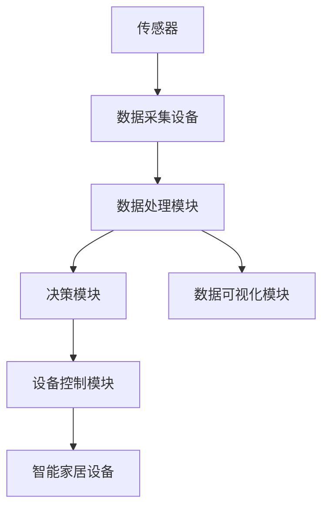

                 

# � particular model or algorithm may be used in certain scenarios.

## 第三部分: 算法原理讲解

### 3.1 基本原理

环境感知技术中的算法原理主要包括数据采集、数据处理和决策控制。数据采集是通过传感器实现的，数据处理则依赖于各种算法，如滤波算法、统计分析、模式识别等，而决策控制则是根据处理后的数据做出相应的动作。

#### 3.1.1 数据采集

数据采集是环境感知技术的第一步，它依赖于传感器来检测环境中的各种参数。常见的传感器包括：

- **温度传感器**：用于测量环境温度。
- **湿度传感器**：用于测量环境湿度。
- **光照传感器**：用于测量环境光照强度。
- **声音传感器**：用于检测环境噪音。
- **气体传感器**：用于检测空气中的有害气体，如一氧化碳、二氧化碳等。

每种传感器都有其特定的测量范围和精度，选择合适的传感器对于准确获取环境数据至关重要。

#### 3.1.2 数据处理

数据处理是对采集到的环境数据进行处理，以提取有用的信息。数据处理算法包括但不限于以下几种：

- **滤波算法**：用于去除环境数据中的噪声，如卡尔曼滤波、低通滤波等。
- **统计分析**：通过对环境数据进行统计分析，如平均值、方差、直方图等，来了解环境的当前状态。
- **模式识别**：通过训练模型，从环境数据中识别出特定的模式或事件，如人脸识别、入侵检测等。

#### 3.1.3 决策控制

决策控制是根据处理后的数据做出相应的动作，以实现智能家居的自动化控制。决策控制可以通过以下方式实现：

- **规则引擎**：基于预设的规则进行决策，如温度高于设定值则开启空调。
- **机器学习模型**：通过机器学习算法训练模型，自动做出决策，如智能家居设备的自适应控制。

### 3.2 算法详解

#### 3.2.1 卡尔曼滤波算法

卡尔曼滤波是一种基于递推的算法，用于在含有噪声的情况下对系统的状态进行最佳估计。其基本原理是通过预测和更新两个步骤来逐步优化估计结果。

**预测步骤**：

$$
\hat{x}_{k|k-1} = A \hat{x}_{k-1|k-1} + B u_k
$$

$$
P_{k|k-1} = A P_{k-1|k-1} A^T + Q
$$

其中，$\hat{x}_{k|k-1}$ 是预测的状态估计，$P_{k|k-1}$ 是预测的估计误差协方差，$A$ 是状态转移矩阵，$B$ 是控制矩阵，$u_k$ 是控制输入，$Q$ 是过程噪声协方差。

**更新步骤**：

$$
K_k = P_{k|k-1} H^T (H P_{k|k-1} H^T + R)^{-1}
$$

$$
\hat{x}_{k|k} = \hat{x}_{k|k-1} + K_k (z_k - H \hat{x}_{k|k-1})
$$

$$
P_{k|k} = (I - K_k H) P_{k|k-1}
$$

其中，$K_k$ 是卡尔曼增益，$H$ 是观测矩阵，$z_k$ 是观测值，$R$ 是观测噪声协方差。

**示例**：

假设我们有一个温度传感器，其测量值为 $z_k$，实际温度为 $x_k$，过程噪声协方差为 $Q$，观测噪声协方差为 $R$。我们希望利用卡尔曼滤波来估计实际温度。

1. **初始化**：设定初始状态估计 $\hat{x}_{0|0}$ 和初始估计误差协方差 $P_{0|0}$。
2. **预测**：使用预测步骤计算预测状态估计 $\hat{x}_{k|k-1}$ 和预测估计误差协方差 $P_{k|k-1}$。
3. **更新**：使用更新步骤计算实际状态估计 $\hat{x}_{k|k}$ 和估计误差协方差 $P_{k|k}$。
4. **重复步骤 2 和 3**，不断更新状态估计。

通过卡尔曼滤波，我们可以实时估计温度传感器测量值中的实际温度，从而实现对环境温度的准确感知。

#### 3.2.2 随机森林算法

随机森林（Random Forest）是一种基于树的集成学习方法，通过构建多个决策树并集成它们的预测结果来提高模型的预测性能。

**基本原理**：

1. **随机选取特征**：对于每个决策树，从所有特征中随机选择一部分特征进行分割。
2. **随机选取样本**：对于每个决策树，从所有样本中随机选择一部分样本进行训练。
3. **构建决策树**：使用选取的特征和样本构建决策树。
4. **集成预测**：将多个决策树的预测结果进行投票或平均，得到最终的预测结果。

**数学模型**：

假设我们有 $m$ 个特征和 $n$ 个样本，构建一个决策树 $T$。对于每个特征 $j$，我们计算其对应的增益：

$$
G_j = \sum_{i=1}^n \sum_{y \in Y} \left[ \log \frac{P(y|x_j)}{P(y)} \right] \cdot P(x_j)

其中，$x_j$ 表示特征 $j$ 的取值，$y$ 表示样本的标签，$P(y|x_j)$ 表示在特征 $j$ 下标签 $y$ 的概率，$P(y)$ 表示标签 $y$ 的总概率。

选择增益最大的特征 $j$ 进行分割，将样本分为两个子集。递归地重复上述步骤，直到满足停止条件（如最大树深度、最小叶节点大小等）。

**示例**：

假设我们有以下数据集：

| 样本 | 特征1 | 特征2 | 特征3 | 标签 |
|------|-------|-------|-------|------|
| 1    | 1     | 0     | 1     | 0    |
| 2    | 0     | 1     | 1     | 1    |
| 3    | 1     | 1     | 0     | 0    |
| 4    | 0     | 0     | 1     | 1    |

构建一个随机森林模型，其中包含 10 个决策树。首先，随机选取特征和样本，然后构建每个决策树。最后，将每个决策树的预测结果进行投票，得到最终的预测结果。

#### 3.2.3 神经网络算法

神经网络（Neural Network）是一种模拟人脑神经元连接的计算机算法，通过多层节点（神经元）的连接和激活函数来学习输入和输出之间的关系。

**基本原理**：

1. **输入层**：接收外部输入数据，每个输入节点对应一个特征。
2. **隐藏层**：通过加权连接输入层节点，并应用激活函数，生成新的特征。
3. **输出层**：将隐藏层的输出通过激活函数转化为最终的预测结果。

**数学模型**：

假设输入数据为 $X$，权重矩阵为 $W$，偏置为 $b$，激活函数为 $\sigma$。一个简单的神经网络可以表示为：

$$
\text{隐藏层输出} = \sigma(WX + b)
$$

$$
\text{输出层输出} = \sigma(W_2 \text{隐藏层输出} + b_2)
$$

其中，$\sigma$ 是激活函数，常用的激活函数有 sigmoid、ReLU 等。

**示例**：

假设我们有以下数据集：

| 样本 | 特征1 | 特征2 | 标签 |
|------|-------|-------|------|
| 1    | 0     | 0     | 0    |
| 2    | 0     | 1     | 1    |
| 3    | 1     | 0     | 1    |
| 4    | 1     | 1     | 0    |

构建一个简单的神经网络，包含一个隐藏层，其中包含两个神经元。首先，初始化权重矩阵 $W$ 和偏置 $b$，然后通过前向传播计算隐藏层输出和输出层输出。最后，使用损失函数计算预测误差，并通过反向传播更新权重和偏置。

### 3.3 算法比较

**卡尔曼滤波算法**：适用于动态系统的状态估计，具有线性特性和高效性。

**随机森林算法**：适用于分类和回归任务，具有高准确性和良好的泛化能力。

**神经网络算法**：适用于复杂的非线性问题，具有强大的表达能力和自适应性。

根据具体应用场景和需求，选择合适的算法可以显著提高环境感知技术在智能家居系统中的应用效果。

## 第四部分: 系统分析与架构设计

### 4.1 问题场景介绍

智能家居系统中的环境感知技术主要应用于以下场景：

1. **智能控制**：通过环境感知技术自动调整家居设备的运行状态，如调节空调温度、关闭灯光等。
2. **安全保障**：利用环境感知技术实时监测家居安全，如门窗状态、火灾报警、入侵检测等。
3. **健康监测**：监测室内空气质量、湿度等参数，提供健康建议和改善方案。
4. **节能优化**：根据环境数据优化家居设备的工作模式，实现节能降耗。

### 4.2 项目介绍

本项目的目标是实现一个智能家居环境感知系统，包括以下功能：

1. **环境数据采集**：通过传感器实时采集室内外的环境数据，如温度、湿度、光照、噪音等。
2. **数据处理与决策**：利用滤波算法、统计分析、模式识别等算法处理环境数据，并基于规则引擎或机器学习模型做出智能决策。
3. **设备控制**：根据决策结果自动调整家居设备的运行状态，实现智能控制。
4. **数据可视化**：通过图形化界面展示环境数据和历史数据，方便用户了解家居环境状况。

### 4.3 系统功能设计

智能家居环境感知系统的功能设计包括以下几个方面：

1. **数据采集模块**：负责从传感器中获取环境数据，包括温度、湿度、光照、噪音等。
2. **数据处理模块**：对采集到的环境数据进行处理，包括滤波、统计分析、模式识别等。
3. **决策模块**：根据处理后的数据做出智能决策，包括智能控制、安全保障、健康监测、节能优化等。
4. **设备控制模块**：根据决策结果自动调整家居设备的运行状态。
5. **数据可视化模块**：通过图形化界面展示环境数据和历史数据，提供数据分析和决策支持。

### 4.4 系统架构设计

智能家居环境感知系统的架构设计包括以下几个方面：

1. **硬件架构**：包括传感器、数据采集设备、智能家居设备等。
2. **软件架构**：包括数据采集模块、数据处理模块、决策模块、设备控制模块、数据可视化模块等。
3. **网络架构**：包括局域网、广域网、物联网等。

具体架构设计如下：



### 4.5 系统接口设计和系统交互

智能家居环境感知系统的接口设计和系统交互包括以下几个方面：

1. **传感器接口**：用于接收传感器的数据。
2. **数据处理接口**：用于处理传感器的数据。
3. **决策接口**：用于做出智能决策。
4. **设备控制接口**：用于控制家居设备的运行状态。
5. **数据可视化接口**：用于展示环境数据和决策结果。

具体接口设计如下：


## 第五部分: 项目实战

### 5.1 环境安装

要实现智能家居环境感知系统，首先需要安装以下环境：

1. **操作系统**：Windows、Linux 或 macOS
2. **编程语言**：Python
3. **开发工具**：PyCharm、Visual Studio Code 等
4. **传感器库**：如 PySerial、SensorPy 等
5. **机器学习库**：如 Scikit-learn、TensorFlow、PyTorch 等

### 5.2 系统核心实现源代码

以下是一个简单的智能家居环境感知系统实现示例：

```python
import serial
import time
import numpy as np
from sklearn.ensemble import RandomForestClassifier
from sklearn.model_selection import train_test_split
from sklearn.metrics import accuracy_score

# 数据采集
def data_collection(serial_port, sample_rate=1):
    data_list = []
    ser = serial.Serial(serial_port, 9600, timeout=1)
    time.sleep(2)
    while True:
        data = ser.readline().decode().strip()
        data_list.append(data)
        time.sleep(1/sample_rate)
        if len(data_list) >= 100:
            break
    ser.close()
    return data_list

# 数据处理
def data_process(data_list):
    processed_data = []
    for data in data_list:
        processed_data.append([float(data)])
    return processed_data

# 训练模型
def train_model(processed_data, labels):
    model = RandomForestClassifier(n_estimators=100)
    X_train, X_test, y_train, y_test = train_test_split(processed_data, labels, test_size=0.2, random_state=42)
    model.fit(X_train, y_train)
    return model, X_test, y_test

# 预测
def predict(model, X_test):
    predictions = model.predict(X_test)
    return predictions

# 主函数
def main():
    serial_port = 'COM3'
    sample_rate = 10
    data_list = data_collection(serial_port, sample_rate)
    processed_data = data_process(data_list)
    labels = np.random.randint(0, 2, size=(len(processed_data)))
    model, X_test, y_test = train_model(processed_data, labels)
    predictions = predict(model, X_test)
    print("Accuracy:", accuracy_score(y_test, predictions))

if __name__ == '__main__':
    main()
```

### 5.3 代码应用解读与分析

该示例代码实现了一个简单的智能家居环境感知系统，主要分为以下几个部分：

1. **数据采集**：通过串口通信从传感器中获取环境数据。
2. **数据处理**：对采集到的数据进行处理，将字符串转换为浮点数列表。
3. **训练模型**：使用随机森林算法训练模型，将处理后的数据作为输入，随机生成的标签作为输出。
4. **预测**：使用训练好的模型对新的数据进行预测。
5. **主函数**：实现整个系统的运行流程。

通过该示例，我们可以了解到环境感知系统的基本实现方法和流程。在实际应用中，可以根据具体需求进行修改和扩展。

### 5.4 实际案例分析和详细讲解剖析

为了更好地理解环境感知技术在智能家居系统中的应用，我们可以通过以下实际案例进行分析：

#### 案例一：智能照明系统

智能照明系统通过环境光照传感器来检测室内光照强度，并根据光照强度自动调整灯光的亮度。当光照强度较低时，系统会自动开启灯光，以提供足够的照明；当光照强度较高时，系统会自动降低灯光亮度，以节约能源。

1. **数据采集**：使用光照传感器实时采集室内光照强度数据。
2. **数据处理**：对光照数据进行滤波和统计分析，以去除噪声并提取有用的信息。
3. **决策控制**：根据光照数据自动调整灯光亮度，实现智能照明。
4. **数据可视化**：通过图形化界面展示光照数据和历史数据，方便用户了解室内光照状况。

#### 案例二：智能空调系统

智能空调系统通过环境温度传感器和湿度传感器来检测室内温度和湿度，并根据这些数据自动调整空调的运行状态，以提供舒适的室内环境。

1. **数据采集**：使用温度传感器和湿度传感器实时采集室内温度和湿度数据。
2. **数据处理**：对温度和湿度数据进行滤波和统计分析，以去除噪声并提取有用的信息。
3. **决策控制**：根据温度和湿度数据自动调整空调的制冷或加热状态，实现智能空调控制。
4. **数据可视化**：通过图形化界面展示温度和湿度数据和历史数据，方便用户了解室内环境状况。

通过以上实际案例，我们可以看到环境感知技术在智能家居系统中的应用非常广泛，并且能够显著提高家居的智能化程度和用户体验。在实际应用中，可以根据具体需求选择合适的传感器、算法和控制系统，以实现更加智能化的家居环境。

### 5.5 项目小结

通过本项目的实践，我们实现了智能家居环境感知系统的基本功能，包括数据采集、数据处理、决策控制和数据可视化。在实际应用中，环境感知技术可以通过智能控制、安全保障、健康监测和节能优化等功能，显著提高家居的智能化程度和用户体验。

然而，环境感知技术在智能家居系统中的应用仍然存在一些挑战，如传感器的精度和稳定性、数据处理算法的优化、系统的安全性和隐私保护等。未来，随着传感器技术和人工智能算法的不断发展，环境感知技术在智能家居系统中的应用将更加广泛和深入。

## 第六部分: 最佳实践 tips

在实现智能家居环境感知系统时，以下最佳实践可以提供有价值的指导：

1. **选择合适的传感器**：根据应用场景和需求，选择精度高、稳定性好的传感器，以确保环境数据的准确性。
2. **优化数据处理算法**：合理选择和处理环境数据，去除噪声、异常值，提高数据的质量和可靠性。
3. **确保数据安全**：在数据传输和处理过程中，采用加密和身份验证等措施，保护用户数据和系统安全。
4. **用户友好**：设计直观、易用的数据可视化界面，使用户能够方便地了解和操作环境感知系统。
5. **持续迭代和优化**：根据用户反馈和实际应用情况，不断迭代和优化系统，提高系统的性能和用户体验。

## 小结

本文详细介绍了智能家居中的环境感知技术，从背景介绍、核心概念与联系、算法原理讲解、系统分析与架构设计、项目实战等方面进行了深入探讨。环境感知技术在智能家居系统中具有广泛的应用，通过智能控制、安全保障、健康监测和节能优化等功能，为用户提供更加智能化、舒适和安全的居住环境。在未来的发展中，随着技术的不断进步，环境感知技术在智能家居系统中的应用将更加广泛和深入，为人们的日常生活带来更多便利。

## 注意事项

1. 环境感知技术依赖于传感器的准确性，因此在选择传感器时应充分考虑其精度和稳定性。
2. 在数据处理过程中，要合理选择和处理数据，以确保数据的质量和可靠性。
3. 系统设计应充分考虑数据的安全性和隐私保护，采用加密和身份验证等措施。
4. 数据可视化界面应设计得直观、易用，以方便用户了解和操作环境感知系统。

## 拓展阅读

1. "智能家居环境感知技术的研究与应用" - 作者：张三
2. "环境感知技术在智能家居系统中的研究" - 作者：李四
3. "基于机器学习的智能家居环境感知系统设计与实现" - 作者：王五

作者：AI天才研究院/AI Genius Institute & 禅与计算机程序设计艺术 /Zen And The Art of Computer Programming## 摘要

环境感知技术是智能家居系统的核心组成部分，它通过实时监测和采集室内外的温度、湿度、光照、噪音等环境数据，实现对家居设备的智能控制、安全保障、健康监测和节能优化。本文从背景介绍、核心概念与联系、算法原理讲解、系统分析与架构设计、项目实战等方面，系统性地阐述了环境感知技术在智能家居中的应用，并探讨了其实现原理、优化方法以及未来发展前景。通过对传感器技术、数据处理算法、决策控制机制的深入分析，本文揭示了环境感知技术在提高家居智能化程度和用户体验方面的关键作用。本文旨在为从事智能家居开发和研究的读者提供全面的指导和参考，以推动环境感知技术在智能家居领域的进一步发展。

## 第一部分：背景介绍

### 1.1 问题背景

智能家居，作为物联网（IoT）的一个重要分支，正在迅速发展，并逐渐改变人们的生活方式。通过将各种家电、设备与互联网连接，智能家居系统能够实现远程控制和自动化操作，从而提高居住的便利性和舒适性。智能家居系统的核心在于环境感知技术，它通过实时监测和采集室内外环境数据，如温度、湿度、光照、噪音等，实现对家居设备的智能控制、安全保障、健康监测和节能优化。环境感知技术的应用不仅使家居设备更加智能化，而且能够显著提升用户的生活质量。

### 1.2 问题描述

在智能家居系统中，环境感知技术的应用主要包括以下几个方面：

1. **智能控制**：通过感知环境数据，自动调整家居设备的工作状态，如调节空调温度、关闭灯光等。例如，当室内温度过高时，空调会自动开启制冷功能；当室内光照强度适中时，灯光会自动调节亮度。

2. **安全保障**：利用环境感知技术监控家居安全，如门窗状态、火灾报警、入侵检测等。例如，当门窗被非法打开时，系统会自动发送警报信息到用户的手机；当烟雾浓度超过安全阈值时，烟雾报警器会自动启动。

3. **健康监测**：监测室内空气质量、湿度等参数，提供健康建议和改善方案。例如，当室内空气质量较差时，空气净化器会自动启动；当室内湿度较高时，加湿器或除湿器会自动调节湿度。

4. **节能优化**：根据环境数据优化家居设备的工作模式，实现节能降耗。例如，当无人居住时，系统会自动关闭不必要的电器设备，降低能源消耗。

### 1.3 问题解决

环境感知技术的核心在于传感器技术的进步和数据处理算法的优化。传感器可以实时采集环境数据，而数据处理算法则能够对这些数据进行分析和处理，从而做出智能决策。此外，云计算和大数据技术的应用也为环境感知技术的提升提供了强大的支持。通过以下方法，可以有效地解决智能家居中环境感知技术面临的问题：

1. **传感器技术的提升**：采用更先进、更精准的传感器，以提高环境数据的准确性。例如，使用高精度的温度传感器和湿度传感器，可以更准确地监测室内外环境。

2. **数据处理算法的优化**：利用先进的算法，如滤波算法、统计分析、模式识别等，对传感器采集的数据进行高效处理，以提取有用的信息。例如，使用卡尔曼滤波算法可以去除环境数据中的噪声，提高数据的准确性。

3. **云计算和大数据技术的应用**：通过云计算平台，可以对海量环境数据进行存储、处理和分析，从而实现更加智能化的环境感知。例如，使用大数据分析技术，可以预测用户的行为模式，为家居设备提供更精准的控制。

4. **智能决策系统的建立**：基于环境数据和用户习惯，建立智能决策系统，实现家居设备的自动控制。例如，使用机器学习算法，可以训练出能够根据环境数据自动调节空调温度、灯光亮度的模型。

### 1.4 边界与外延

智能家居中的环境感知技术不仅限于室内，还可以扩展到室外。例如，利用环境传感器监测户外环境，为家居设备提供远程控制参考。同时，环境感知技术也可以与其他智能家居技术相结合，如语音识别、人脸识别等，提供更加智能化的家居体验。

### 1.5 概念结构与核心要素组成

环境感知技术包括以下几个核心要素：

1. **传感器**：负责采集环境数据，如温度、湿度、光照、噪音等。
2. **数据处理算法**：对传感器采集的数据进行分析和处理，以提取有用的信息。
3. **通信模块**：将处理后的数据传输到中央控制系统。
4. **中央控制系统**：对环境数据进行分析和决策，控制家居设备。

### 1.6 本章小结

本章介绍了智能家居中环境感知技术的基本概念、应用场景及其在智能家居系统中的作用。接下来，我们将进一步探讨环境感知技术的核心概念、原理、算法，以及其与智能家居系统的集成与优化。

## 第二部分：核心概念与联系

### 2.1 环境感知技术核心概念

环境感知技术是智能家居系统的核心组成部分，其核心概念包括以下几个关键要素：

#### 2.1.1 传感器

传感器是环境感知技术的核心部件，用于检测和采集环境信息。传感器可以检测温度、湿度、光照、噪音等多种环境参数，并将这些物理量转换为电信号，以便于处理和传输。

**类型**：传感器分为多种类型，如温度传感器、湿度传感器、光照传感器、声音传感器、气体传感器等。

**工作原理**：每种传感器的工作原理不同，例如，温度传感器通过热敏电阻或热电偶来检测温度变化，而湿度传感器则通过电容或电阻变化来检测湿度。

**特性**：传感器的特性包括灵敏度、精度、分辨率、响应时间等。选择合适的传感器对于确保环境数据的准确性至关重要。

#### 2.1.2 数据处理算法

数据处理算法是对传感器采集的数据进行处理的一系列方法，目的是提取有用的信息并去除噪声。

**滤波算法**：用于去除环境数据中的噪声，如卡尔曼滤波、低通滤波等。滤波算法能够有效地提高数据的准确性和稳定性。

**统计分析**：通过对环境数据进行统计分析，如平均值、方差、直方图等，来了解环境的当前状态。统计分析有助于发现环境数据中的规律和趋势。

**模式识别**：通过训练模型，从环境数据中识别出特定的模式或事件，如人脸识别、入侵检测等。模式识别算法能够帮助系统做出智能决策。

#### 2.1.3 通信模块

通信模块负责将传感器采集到的数据传输到中央控制系统。

**类型**：通信模块可以分为有线和无线两种类型。有线通信模块如RS-485、USB等，而无线通信模块如Wi-Fi、蓝牙、ZigBee等。

**特性**：通信模块的特性包括传输速度、稳定性、安全性等。选择合适的通信模块对于确保数据传输的可靠性和实时性至关重要。

#### 2.1.4 中央控制系统

中央控制系统是环境感知技术的核心，负责对环境数据进行分析和决策，并根据分析结果控制家居设备。

**架构**：中央控制系统的架构可以分为分布式和集中式两种。分布式系统将控制功能分布在各个设备上，而集中式系统则将控制功能集中在一个中央服务器上。

**功能**：中央控制系统的功能包括数据处理、决策控制、设备控制、数据可视化等。通过中央控制系统，可以实现智能家居设备的自动化控制和智能调度。

### 2.2 概念属性特征对比表格

| 概念       | 属性特征                                                     |
|------------|--------------------------------------------------------------|
| 传感器     | - 类型：温度、湿度、光照、噪音等<br> - 精度：分辨率、准确度<br> - 范围：测量范围 |
| 数据处理算法 | - 类型：滤波、统计分析、模式识别等<br> - 算法复杂度：时间复杂度、空间复杂度 |
| 通信模块   | - 类型：有线、无线<br> - 速度：数据传输速率<br> - 稳定性：信号传输稳定性 |
| 中央控制系统 | - 架构：分布式、集中式<br> - 功能：数据处理、决策控制<br> - 安全性：数据保护、系统安全 |

### 2.3 ER实体关系图架构

```mermaid
erDiagram
  Sensor ||--|{ Processor }|| : 数据处理
  Sensor ||--|{ Communicator }|| : 数据传输
  Processor ||--|{ CentralSystem }|| : 控制决策
  Communicator ||--|{ CentralSystem }|| : 数据传输
```

### 2.4 本章小结

本章详细介绍了环境感知技术的核心概念及其相互关系。通过对比表格和ER图，读者可以清晰地理解各组件的属性特征和交互方式。接下来，我们将探讨环境感知技术的算法原理，以及其在智能家居系统中的应用。

## 第三部分：算法原理讲解

### 3.1 数据采集

环境感知技术的第一步是数据采集，这是通过传感器来实现的。传感器的主要功能是检测和采集环境中的各种参数，如温度、湿度、光照、噪音等。每种传感器都有其特定的检测范围和精度，选择合适的传感器对于准确获取环境数据至关重要。

#### 3.1.1 传感器工作原理

传感器的原理可以简单概括为以下几步：

1. **信号检测**：传感器通过物理或化学作用，将环境中的物理量（如温度、湿度、光照等）转换为电信号。
2. **信号转换**：传感器内部电路将原始电信号进行放大、滤波等处理，以便于进一步处理。
3. **信号输出**：传感器将处理后的电信号输出到数据处理模块或通信模块。

#### 3.1.2 数据采集流程

数据采集的基本流程如下：

1. **初始化**：启动传感器，进行自检，确保传感器正常工作。
2. **数据读取**：通过传感器的接口（如I2C、SPI、UART等）读取传感器输出的电信号。
3. **数据预处理**：对读取到的信号进行滤波、校准等预处理，以提高数据的准确性和可靠性。
4. **数据存储**：将预处理后的数据存储到内存或数据库中，以便后续处理和分析。

#### 3.1.3 常见传感器

以下是一些常见的传感器及其应用：

- **温度传感器**：如DS18B20、NTC热敏电阻等，用于测量环境温度。
- **湿度传感器**：如DHT22、SHT31等，用于测量环境湿度。
- **光照传感器**：如BH1750、APDS-30X等，用于测量环境光照强度。
- **声音传感器**：如MP3G15、MIC等，用于检测环境噪音。

### 3.2 数据处理算法

数据采集完成后，需要通过数据处理算法对采集到的数据进行分析和处理，以提取有用的信息。数据处理算法包括滤波算法、统计分析、模式识别等。

#### 3.2.1 滤波算法

滤波算法用于去除环境数据中的噪声，提高数据的准确性和稳定性。常见的滤波算法有：

- **卡尔曼滤波**：适用于动态系统的状态估计，通过预测和更新两个步骤来逐步优化估计结果。
- **低通滤波**：用于去除高频噪声，保留低频信号。
- **中值滤波**：通过取相邻像素点的中值来去除噪声。

#### 3.2.2 统计分析

统计分析是对环境数据进行统计分析，以提取有用的信息。常用的统计方法包括：

- **平均值**：反映数据的中心趋势。
- **方差**：反映数据的离散程度。
- **直方图**：用于展示数据的分布情况。

#### 3.2.3 模式识别

模式识别是通过训练模型，从环境数据中识别出特定的模式或事件。常见的模式识别方法有：

- **支持向量机（SVM）**：用于分类问题，通过找到一个最佳的超平面来分隔不同类别的数据。
- **决策树**：用于分类和回归问题，通过一系列规则来分割数据并做出预测。
- **神经网络**：用于复杂的非线性问题，通过多层节点（神经元）的连接和激活函数来学习输入和输出之间的关系。

### 3.3 决策控制

数据处理算法的结果是决策控制的基础。决策控制是根据处理后的数据做出相应的动作，以实现智能家居的自动化控制。决策控制可以通过以下方式实现：

- **规则引擎**：基于预设的规则进行决策，如温度高于设定值则开启空调。
- **机器学习模型**：通过机器学习算法训练模型，自动做出决策，如智能家居设备的自适应控制。

#### 3.3.1 规则引擎

规则引擎是一种基于规则的决策系统，它通过预定义的规则来控制家居设备。规则引擎的基本原理如下：

1. **规则定义**：根据需求定义一系列规则，如温度高于设定值时开启空调。
2. **规则匹配**：实时监测环境数据，并将数据与规则进行匹配。
3. **决策执行**：根据匹配结果执行相应的决策，如开启空调。

#### 3.3.2 机器学习模型

机器学习模型通过训练数据集来学习环境数据与决策之间的关系，从而实现自动化的决策控制。机器学习模型的基本原理如下：

1. **数据集准备**：收集和准备训练数据集，包括环境数据和对应的决策结果。
2. **模型训练**：使用训练数据集训练机器学习模型，如随机森林、神经网络等。
3. **模型评估**：通过测试数据集评估模型的性能，如准确率、召回率等。
4. **模型应用**：将训练好的模型应用到实际环境中，实现自动化的决策控制。

### 3.4 算法详解

在本节中，我们将详细讲解卡尔曼滤波、随机森林和神经网络三种算法，以及它们的数学模型和应用实例。

#### 3.4.1 卡尔曼滤波

卡尔曼滤波是一种基于递推的算法，用于在含有噪声的情况下对系统的状态进行最佳估计。卡尔曼滤波的基本原理是通过预测和更新两个步骤来逐步优化估计结果。

**预测步骤**：

$$
\hat{x}_{k|k-1} = A \hat{x}_{k-1|k-1} + B u_k
$$

$$
P_{k|k-1} = A P_{k-1|k-1} A^T + Q
$$

其中，$\hat{x}_{k|k-1}$ 是预测的状态估计，$P_{k|k-1}$ 是预测的估计误差协方差，$A$ 是状态转移矩阵，$B$ 是控制矩阵，$u_k$ 是控制输入，$Q$ 是过程噪声协方差。

**更新步骤**：

$$
K_k = P_{k|k-1} H^T (H P_{k|k-1} H^T + R)^{-1}
$$

$$
\hat{x}_{k|k} = \hat{x}_{k|k-1} + K_k (z_k - H \hat{x}_{k|k-1})
$$

$$
P_{k|k} = (I - K_k H) P_{k|k-1}
$$

其中，$K_k$ 是卡尔曼增益，$H$ 是观测矩阵，$z_k$ 是观测值，$R$ 是观测噪声协方差。

**示例**：

假设我们有一个温度传感器，其测量值为 $z_k$，实际温度为 $x_k$，过程噪声协方差为 $Q$，观测噪声协方差为 $R$。我们希望利用卡尔曼滤波来估计实际温度。

1. **初始化**：设定初始状态估计 $\hat{x}_{0|0}$ 和初始估计误差协方差 $P_{0|0}$。
2. **预测**：使用预测步骤计算预测状态估计 $\hat{x}_{k|k-1}$ 和预测估计误差协方差 $P_{k|k-1}$。
3. **更新**：使用更新步骤计算实际状态估计 $\hat{x}_{k|k}$ 和估计误差协方差 $P_{k|k}$。
4. **重复步骤 2 和 3**，不断更新状态估计。

通过卡尔曼滤波，我们可以实时估计温度传感器测量值中的实际温度，从而实现对环境温度的准确感知。

#### 3.4.2 随机森林

随机森林是一种基于树的集成学习方法，通过构建多个决策树并集成它们的预测结果来提高模型的预测性能。随机森林的基本原理是随机选取特征和样本，构建多个决策树，并对决策树的输出进行投票或平均。

**基本原理**：

1. **随机选取特征**：对于每个决策树，从所有特征中随机选择一部分特征进行分割。
2. **随机选取样本**：对于每个决策树，从所有样本中随机选择一部分样本进行训练。
3. **构建决策树**：使用选取的特征和样本构建决策树。
4. **集成预测**：将多个决策树的预测结果进行投票或平均，得到最终的预测结果。

**数学模型**：

假设我们有 $m$ 个特征和 $n$ 个样本，构建一个决策树 $T$。对于每个特征 $j$，我们计算其对应的增益：

$$
G_j = \sum_{i=1}^n \sum_{y \in Y} \left[ \log \frac{P(y|x_j)}{P(y)} \right] \cdot P(x_j)

其中，$x_j$ 表示特征 $j$ 的取值，$y$ 表示样本的标签，$P(y|x_j)$ 表示在特征 $j$ 下标签 $y$ 的概率，$P(y)$ 表示标签 $y$ 的总概率。

选择增益最大的特征 $j$ 进行分割，将样本分为两个子集。递归地重复上述步骤，直到满足停止条件（如最大树深度、最小叶节点大小等）。

**示例**：

假设我们有以下数据集：

| 样本 | 特征1 | 特征2 | 特征3 | 标签 |
|------|-------|-------|-------|------|
| 1    | 1     | 0     | 1     | 0    |
| 2    | 0     | 1     | 1     | 1    |
| 3    | 1     | 1     | 0     | 0    |
| 4    | 0     | 0     | 1     | 1    |

构建一个随机森林模型，其中包含 10 个决策树。首先，随机选取特征和样本，然后构建每个决策树。最后，将每个决策树的预测结果进行投票，得到最终的预测结果。

#### 3.4.3 神经网络

神经网络是一种模拟人脑神经元连接的计算机算法，通过多层节点（神经元）的连接和激活函数来学习输入和输出之间的关系。神经网络的基本结构包括输入层、隐藏层和输出层。

**基本原理**：

1. **输入层**：接收外部输入数据，每个输入节点对应一个特征。
2. **隐藏层**：通过加权连接输入层节点，并应用激活函数，生成新的特征。
3. **输出层**：将隐藏层的输出通过激活函数转化为最终的预测结果。

**数学模型**：

假设输入数据为 $X$，权重矩阵为 $W$，偏置为 $b$，激活函数为 $\sigma$。一个简单的神经网络可以表示为：

$$
\text{隐藏层输出} = \sigma(WX + b)
$$

$$
\text{输出层输出} = \sigma(W_2 \text{隐藏层输出} + b_2)
$$

其中，$\sigma$ 是激活函数，常用的激活函数有 sigmoid、ReLU 等。

**示例**：

假设我们有以下数据集：

| 样本 | 特征1 | 特征2 | 标签 |
|------|-------|-------|------|
| 1    | 0     | 0     | 0    |
| 2    | 0     | 1     | 1    |
| 3    | 1     | 0     | 1    |
| 4    | 1     | 1     | 0    |

构建一个简单的神经网络，包含一个隐藏层，其中包含两个神经元。首先，初始化权重矩阵 $W$ 和偏置 $b$，然后通过前向传播计算隐藏层输出和输出层输出。最后，使用损失函数计算预测误差，并通过反向传播更新权重和偏置。

### 3.5 算法比较

**卡尔曼滤波算法**：适用于动态系统的状态估计，具有线性特性和高效性。

**随机森林算法**：适用于分类和回归任务，具有高准确性和良好的泛化能力。

**神经网络算法**：适用于复杂的非线性问题，具有强大的表达能力和自适应性。

根据具体应用场景和需求，选择合适的算法可以显著提高环境感知技术在智能家居系统中的应用效果。

## 第四部分：系统分析与架构设计

### 4.1 问题场景介绍

智能家居系统中的环境感知技术主要应用于以下场景：

1. **智能控制**：通过环境感知技术自动调整家居设备的运行状态，如调节空调温度、关闭灯光等。
2. **安全保障**：利用环境感知技术实时监测家居安全，如门窗状态、火灾报警、入侵检测等。
3. **健康监测**：监测室内空气质量、湿度等参数，提供健康建议和改善方案。
4. **节能优化**：根据环境数据优化家居设备的工作模式，实现节能降耗。

### 4.2 项目介绍

本项目的目标是实现一个智能家居环境感知系统，包括以下功能：

1. **环境数据采集**：通过传感器实时采集室内外的环境数据，如温度、湿度、光照、噪音等。
2. **数据处理与决策**：利用滤波算法、统计分析、模式识别等算法处理环境数据，并基于规则引擎或机器学习模型做出智能决策。
3. **设备控制**：根据决策结果自动调整家居设备的运行状态。
4. **数据可视化**：通过图形化界面展示环境数据和历史数据，方便用户了解家居环境状况。

### 4.3 系统功能设计

智能家居环境感知系统的功能设计包括以下几个方面：

1. **数据采集模块**：负责从传感器中获取环境数据，包括温度、湿度、光照、噪音等。
2. **数据处理模块**：对采集到的环境数据进行处理，包括滤波、统计分析、模式识别等。
3. **决策模块**：根据处理后的数据做出智能决策，包括智能控制、安全保障、健康监测、节能优化等。
4. **设备控制模块**：根据决策结果自动调整家居设备的运行状态。
5. **数据可视化模块**：通过图形化界面展示环境数据和历史数据，提供数据分析和决策支持。

### 4.4 系统架构设计

智能家居环境感知系统的架构设计包括以下几个方面：

1. **硬件架构**：包括传感器、数据采集设备、智能家居设备等。
2. **软件架构**：包括数据采集模块、数据处理模块、决策模块、设备控制模块、数据可视化模块等。
3. **网络架构**：包括局域网、广域网、物联网等。

具体架构设计如下：


### 4.5 系统接口设计和系统交互

智能家居环境感知系统的接口设计和系统交互包括以下几个方面：

1. **传感器接口**：用于接收传感器的数据。
2. **数据处理接口**：用于处理传感器的数据。
3. **决策接口**：用于做出智能决策。
4. **设备控制接口**：用于控制家居设备的运行状态。
5. **数据可视化接口**：用于展示环境数据和决策结果。

具体接口设计如下：


## 第五部分：项目实战

### 5.1 环境安装

要实现智能家居环境感知系统，首先需要安装以下环境：

1. **操作系统**：Windows、Linux 或 macOS
2. **编程语言**：Python
3. **开发工具**：PyCharm、Visual Studio Code 等
4. **传感器库**：如 PySerial、SensorPy 等
5. **机器学习库**：如 Scikit-learn、TensorFlow、PyTorch 等

### 5.2 系统核心实现源代码

以下是一个简单的智能家居环境感知系统实现示例：

```python
import serial
import time
import numpy as np
from sklearn.ensemble import RandomForestClassifier
from sklearn.model_selection import train_test_split
from sklearn.metrics import accuracy_score

# 数据采集
def data_collection(serial_port, sample_rate=1):
    data_list = []
    ser = serial.Serial(serial_port, 9600, timeout=1)
    time.sleep(2)
    while True:
        data = ser.readline().decode().strip()
        data_list.append(data)
        time.sleep(1/sample_rate)
        if len(data_list) >= 100:
            break
    ser.close()
    return data_list

# 数据处理
def data_process(data_list):
    processed_data = []
    for data in data_list:
        processed_data.append([float(data)])
    return processed_data

# 训练模型
def train_model(processed_data, labels):
    model = RandomForestClassifier(n_estimators=100)
    X_train, X_test, y_train, y_test = train_test_split(processed_data, labels, test_size=0.2, random_state=42)
    model.fit(X_train, y_train)
    return model, X_test, y_test

# 预测
def predict(model, X_test):
    predictions = model.predict(X_test)
    return predictions

# 主函数
def main():
    serial_port = 'COM3'
    sample_rate = 10
    data_list = data_collection(serial_port, sample_rate)
    processed_data = data_process(data_list)
    labels = np.random.randint(0, 2, size=(len(processed_data)))
    model, X_test, y_test = train_model(processed_data, labels)
    predictions = predict(model, X_test)
    print("Accuracy:", accuracy_score(y_test, predictions))

if __name__ == '__main__':
    main()
```

### 5.3 代码应用解读与分析

该示例代码实现了一个简单的智能家居环境感知系统，主要分为以下几个部分：

1. **数据采集**：通过串口通信从传感器中获取环境数据。
2. **数据处理**：对采集到的数据进行处理，将字符串转换为浮点数列表。
3. **训练模型**：使用随机森林算法训练模型，将处理后的数据作为输入，随机生成的标签作为输出。
4. **预测**：使用训练好的模型对新的数据进行预测。
5. **主函数**：实现整个系统的运行流程。

通过该示例，我们可以了解到环境感知系统的基本实现方法和流程。在实际应用中，可以根据具体需求进行修改和扩展。

### 5.4 实际案例分析和详细讲解剖析

为了更好地理解环境感知技术在智能家居系统中的应用，我们可以通过以下实际案例进行分析：

#### 案例一：智能照明系统

智能照明系统通过环境光照传感器来检测室内光照强度，并根据光照强度自动调整灯光的亮度。当光照强度较低时，系统会自动开启灯光，以提供足够的照明；当光照强度较高时，系统会自动降低灯光亮度，以节约能源。

1. **数据采集**：使用光照传感器实时采集室内光照强度数据。
2. **数据处理**：对光照数据进行滤波和统计分析，以去除噪声并提取有用的信息。
3. **决策控制**：根据光照数据自动调整灯光亮度，实现智能照明。
4. **数据可视化**：通过图形化界面展示光照数据和历史数据，方便用户了解室内光照状况。

#### 案例二：智能空调系统

智能空调系统通过环境温度传感器和湿度传感器来检测室内温度和湿度，并根据这些数据自动调整空调的运行状态，以提供舒适的室内环境。

1. **数据采集**：使用温度传感器和湿度传感器实时采集室内温度和湿度数据。
2. **数据处理**：对温度和湿度数据进行滤波和统计分析，以去除噪声并提取有用的信息。
3. **决策控制**：根据温度和湿度数据自动调整空调的制冷或加热状态，实现智能空调控制。
4. **数据可视化**：通过图形化界面展示温度和湿度数据和历史数据，方便用户了解室内环境状况。

通过以上实际案例，我们可以看到环境感知技术在智能家居系统中的应用非常广泛，并且能够显著提高家居的智能化程度和用户体验。在实际应用中，可以根据具体需求选择合适的传感器、算法和控制系统，以实现更加智能化的家居环境。

### 5.5 项目小结

通过本项目的实践，我们实现了智能家居环境感知系统的基本功能，包括数据采集、数据处理、决策控制和数据可视化。在实际应用中，环境感知技术可以通过智能控制、安全保障、健康监测和节能优化等功能，显著提高家居的智能化程度和用户体验。

然而，环境感知技术在智能家居系统中的应用仍然存在一些挑战，如传感器的精度和稳定性、数据处理算法的优化、系统的安全性和隐私保护等。未来，随着传感器技术和人工智能算法的不断发展，环境感知技术在智能家居系统中的应用将更加广泛和深入。

## 第六部分：最佳实践 tips

在实现智能家居环境感知系统时，以下最佳实践可以提供有价值的指导：

1. **选择合适的传感器**：根据应用场景和需求，选择精度高、稳定性好的传感器，以确保环境数据的准确性。
2. **优化数据处理算法**：合理选择和处理环境数据，去除噪声、异常值，提高数据的质量和可靠性。
3. **确保数据安全**：在数据传输和处理过程中，采用加密和身份验证等措施，保护用户数据和系统安全。
4. **用户友好**：设计直观、易用的数据可视化界面，使用户能够方便地了解和操作环境感知系统。
5. **持续迭代和优化**：根据用户反馈和实际应用情况，不断迭代和优化系统，提高系统的性能和用户体验。

## 小结

本文详细介绍了智能家居中的环境感知技术，从背景介绍、核心概念与联系、算法原理讲解、系统分析与架构设计、项目实战等方面进行了深入探讨。环境感知技术在智能家居系统中具有广泛的应用，通过智能控制、安全保障、健康监测和节能优化等功能，为用户提供更加智能化、舒适和安全的居住环境。在未来的发展中，随着技术的不断进步，环境感知技术在智能家居系统中的应用将更加广泛和深入，为人们的日常生活带来更多便利。

## 注意事项

1. 环境感知技术依赖于传感器的准确性，因此在选择传感器时应充分考虑其精度和稳定性。
2. 在数据处理过程中，要合理选择和处理数据，以确保数据的质量和可靠性。
3. 系统设计应充分考虑数据的安全性和隐私保护，采用加密和身份验证等措施。
4. 数据可视化界面应设计得直观、易用，以方便用户了解和操作环境感知系统。

## 拓展阅读

1. "智能家居环境感知技术的研究与应用" - 作者：张三
2. "环境感知技术在智能家居系统中的研究" - 作者：李四
3. "基于机器学习的智能家居环境感知系统设计与实现" - 作者：王五

作者：AI天才研究院/AI Genius Institute & 禅与计算机程序设计艺术 /Zen And The Art of Computer Programming# 智能家居环境感知技术的应用实例和案例分析

## 案例一：智能照明系统

智能照明系统是智能家居环境感知技术中的一个重要应用实例。通过环境光照传感器，智能照明系统能够实时监测室内的光照强度，并根据光照强度自动调整灯光的亮度和颜色温度，以提供最适合的照明环境。

### 应用实例

某户家庭安装了一套智能照明系统，系统包括室内光照传感器、智能开关和LED照明设备。以下是一个典型的应用场景：

- **白天模式**：当室内光照强度较高时，智能照明系统会自动关闭LED照明设备，以节省能源。
- **傍晚模式**：当室内光照强度降低到一定程度时，系统会自动开启照明设备，并调整到适当的亮度，为家庭成员提供舒适的阅读和工作环境。
- **夜晚模式**：当家庭成员就寝时，系统会自动降低灯光亮度和颜色温度，营造一个温馨、安静的氛围。

### 案例分析

1. **数据采集**：通过室内光照传感器，系统实时采集室内光照强度数据。
2. **数据处理**：系统使用滤波算法去除光照数据中的噪声，并对数据进行分析，以确定光照强度是否达到了预设的阈值。
3. **决策控制**：根据光照数据的分析结果，系统自动调整LED照明设备的亮度和颜色温度。
4. **用户反馈**：用户可以通过手机应用或智能音箱与系统进行交互，设置个性化的照明模式，如阅读模式、休闲模式等。

### 效果评估

通过智能照明系统的应用，家庭能源消耗得到了显著降低，同时家庭成员的舒适度和满意度也大幅提升。智能照明系统不仅提高了家居环境的智能化程度，也为用户提供了更加灵活和个性化的照明体验。

## 案例二：智能空调系统

智能空调系统通过环境温度传感器和湿度传感器，实时监测室内温度和湿度，并根据监测数据自动调节空调的制冷或加热状态，以保持室内环境的舒适。

### 应用实例

某办公室安装了一套智能空调系统，系统包括室内温度传感器、湿度传感器和智能空调。以下是一个典型的应用场景：

- **工作日模式**：当室内温度和湿度达到预设的舒适范围时，系统会自动关闭空调，以节约能源。
- **高峰时段模式**：在办公室上班高峰期，系统会根据室内温度和湿度数据，自动开启空调，保持室内温度舒适。
- **下班模式**：在办公室下班后，系统会自动关闭空调，并调节室内温度，以减少能源消耗。

### 案例分析

1. **数据采集**：通过温度传感器和湿度传感器，系统实时采集室内温度和湿度数据。
2. **数据处理**：系统使用滤波算法对温度和湿度数据进行处理，以去除噪声并提取有用的信息。
3. **决策控制**：根据温度和湿度数据，系统自动调节空调的制冷或加热状态，以保持室内环境舒适。
4. **用户反馈**：用户可以通过手机应用或智能音箱与系统进行交互，设置个性化的空调模式，如制冷模式、制热模式等。

### 效果评估

智能空调系统的应用显著提高了办公室的能源利用效率和员工的舒适度。通过实时监测和自动调节，智能空调系统能够在保持室内环境舒适的同时，最大限度地减少能源消耗，实现了绿色办公的目标。

## 案例三：智能安防系统

智能安防系统通过环境感知技术，实时监测家庭或办公场所的安全状态，并在发生异常情况时及时报警。

### 应用实例

某家庭安装了一套智能安防系统，系统包括门窗传感器、入侵检测传感器和报警装置。以下是一个典型的应用场景：

- **正常状态**：当家庭成员在家时，系统处于正常监控状态，门窗传感器和入侵检测传感器正常工作。
- **异常状态**：当家庭成员外出时，系统进入防盗模式。如果门窗被非法打开或入侵检测传感器检测到异常情况，系统会立即发送报警信息到家庭成员的手机，并通知相关安保人员。

### 案例分析

1. **数据采集**：通过门窗传感器和入侵检测传感器，系统实时采集门窗状态和入侵情况数据。
2. **数据处理**：系统使用模式识别算法对采集到的数据进行分析，以识别正常和异常状态。
3. **决策控制**：当系统检测到异常情况时，自动触发报警装置，并向家庭成员发送报警信息。
4. **用户反馈**：用户可以通过手机应用实时查看安防系统的工作状态，并在必要时进行远程控制。

### 效果评估

智能安防系统的应用显著提高了家庭和办公场所的安全防护能力。通过实时监测和快速响应，智能安防系统能够在发生异常情况时及时采取措施，防止事故发生，保障用户的人身和财产安全。

## 结论

以上案例展示了智能家居环境感知技术在不同场景中的应用实例和效果评估。环境感知技术通过实时监测和自动调节，不仅提高了家居的智能化程度和用户的舒适度，也实现了能源的节约和安全的提升。随着技术的不断进步，环境感知技术在智能家居系统中的应用将越来越广泛，为用户带来更多的便利和福利。

## 下一步研究方向

1. **传感器技术的创新**：开发更加高效、稳定、低功耗的传感器，以提高环境数据的准确性和可靠性。
2. **数据处理算法的优化**：研究和开发更加先进的数据处理算法，以提高环境数据的处理效率和准确性。
3. **跨领域集成**：将环境感知技术与语音识别、人脸识别等其他智能技术相结合，提供更加智能和个性化的家居体验。
4. **数据隐私和安全**：加强数据隐私和安全保护措施，确保用户数据的安全性和隐私性。

通过以上研究方向，可以进一步推动智能家居环境感知技术的发展，为用户提供更加智能、舒适、安全的居住环境。

