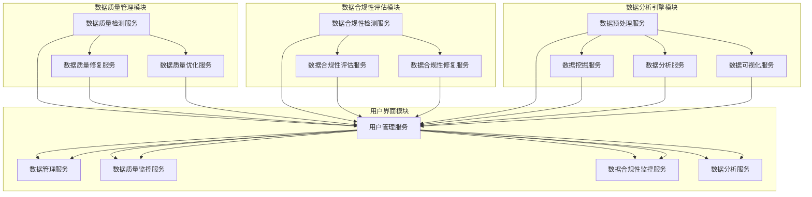
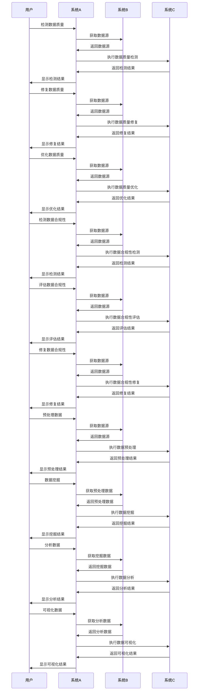
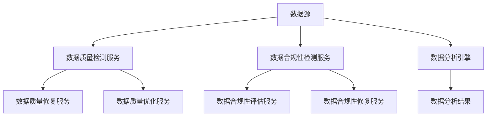

                 

# 智能数据治理平台：AI确保数据质量与合规性

## 关键词
- 智能数据治理平台
- AI技术
- 数据质量
- 数据合规性
- 数据质量管理

## 摘要
本文探讨了智能数据治理平台的重要性，特别是在确保数据质量和合规性方面的作用。文章首先介绍了数据治理的背景和问题，然后详细阐述了智能数据治理平台的构建，包括数据质量管理的核心技术和方法，以及数据合规性评估的过程。通过一步步的分析和推理，文章为读者提供了对智能数据治理平台深入的理解，以及其在实际应用中的价值。

## 目录大纲

----------------------------------------------------------------

## 第一部分：引言

### 第1章 引言

#### 1.1 问题背景

#### 1.1.1 问题的起源

#### 1.1.2 问题描述

#### 1.1.3 问题解决

#### 1.1.4 边界与外延

#### 1.1.5 概念结构与核心要素组成

#### 1.2 本章小结

## 第二部分：智能数据治理平台构建

### 第2章 智能数据治理平台核心技术

#### 2.1 数据质量管理

##### 2.1.1 数据质量检测

###### 2.1.1.1 数据质量检测算法

###### 2.1.1.2 数据质量检测流程

##### 2.1.2 数据质量修复

###### 2.1.2.1 数据质量修复方法

###### 2.1.2.2 数据质量修复流程

##### 2.1.3 数据质量优化

###### 2.1.3.1 数据质量优化策略

###### 2.1.3.2 数据质量优化流程

##### 2.1.4 数据质量管理工具

#### 2.2 数据合规性评估

##### 2.2.1 数据合规性评估方法

##### 2.2.2 数据合规性评估流程

## 第三部分：智能数据治理平台应用与实践

### 第3章 智能数据治理平台应用场景

#### 3.1 企业内部数据治理

#### 3.2 行业数据治理

#### 3.3 社会数据治理

### 第4章 智能数据治理平台项目实战

#### 4.1 环境安装

#### 4.2 系统核心实现

#### 4.3 代码应用解读

#### 4.4 实际案例分析

#### 4.5 项目小结

## 第四部分：总结与展望

### 第5章 最佳实践

### 第6章 小结

### 第7章 注意事项

### 第8章 拓展阅读

----------------------------------------------------------------

## 第1章 引言

### 1.1 问题背景

随着数字化转型的不断推进，数据已成为企业核心资产。然而，数据的质量和合规性直接影响到企业的运营效率和合规风险。当前，数据治理面临着诸多挑战，如数据冗余、不一致、缺失等问题，以及与数据保护法规、隐私保护等方面的冲突。这些问题不仅影响了企业的决策效率，还可能带来严重的合规风险。在这个背景下，智能数据治理平台应运而生，通过引入AI技术，实现了对数据的自动检测、修复和优化，从而提高了数据质量；同时，通过算法模型对数据合规性进行评估，确保数据符合相关法规要求。这为企业的数据治理提供了强有力的支持。

### 1.1.1 问题的起源

随着信息技术的飞速发展，企业开始积累大量的数据。然而，这些数据往往存在质量问题，如数据不准确、不完整、不一致等。这些问题导致企业在数据分析、决策和业务运营中面临诸多挑战。此外，随着数据保护法规的不断完善，如欧盟的《通用数据保护条例》（GDPR），企业需要确保其数据处理活动符合法规要求，否则将面临巨额罚款。

### 1.1.2 问题描述

在现有的数据治理过程中，数据质量问题和合规性问题仍然普遍存在。数据质量问题是由于数据在收集、存储、处理和传输过程中产生的，如数据不一致、数据缺失、数据冗余等。这些问题会严重影响数据的准确性和完整性，进而影响企业的决策质量和业务运营效率。数据合规性问题主要涉及数据保护法规的遵守，如GDPR、加州消费者隐私法案（CCPA）等。这些法规对数据的收集、存储、处理和传输提出了严格的要求，企业必须确保其数据处理活动符合相关法规，否则将面临严重的法律风险和罚款。

### 1.1.3 问题解决

智能数据治理平台通过引入AI技术，实现了对数据的自动检测、修复和优化，从而提高了数据质量；同时，通过算法模型对数据合规性进行评估，确保数据符合相关法规要求。具体来说，智能数据治理平台主要包括以下几个核心功能：

1. 数据质量管理模块：负责检测、修复和优化数据质量。
2. 数据合规性评估模块：负责评估数据是否符合相关法规要求。
3. 数据分析引擎：提供数据分析和决策支持功能。
4. 用户界面：提供用户交互和数据可视化的功能。

通过这些模块的协同工作，智能数据治理平台能够有效解决数据治理中的问题，提高数据质量和合规性，为企业的数字化转型提供有力支持。

### 1.1.4 边界与外延

智能数据治理平台的范畴包括数据质量管理和数据合规性管理两个方面。其边界在于数据范围和治理能力，即平台负责管理和治理的数据范围和数据规模。智能数据治理平台的外延则涉及数据治理相关的技术、工具和方法，包括数据质量管理技术、数据合规性评估技术、数据分析技术等。此外，智能数据治理平台还需要与其他系统（如数据仓库、数据湖、业务系统等）进行集成和交互，以实现数据的全面管理和治理。

### 1.1.5 概念结构与核心要素组成

智能数据治理平台主要由以下几个核心要素组成：

1. **数据质量管理模块**：负责检测、修复和优化数据质量。该模块通常包括数据质量检测、数据质量修复和数据质量优化三个子模块。

    - **数据质量检测**：通过对数据进行多维度检查，识别数据中的问题，如数据准确性、完整性、一致性、时效性等。
    - **数据质量修复**：在检测到数据问题后，对数据进行修复或替换，以提高数据质量。
    - **数据质量优化**：在数据质量检测和修复的基础上，通过数据标准化、数据分类、数据挖掘和数据可视化等技术，进一步优化数据质量。

2. **数据合规性评估模块**：负责评估数据是否符合相关法规要求，如GDPR、CCPA等。该模块通常包括数据合规性检测、数据合规性评估和数据合规性修复三个子模块。

    - **数据合规性检测**：通过预定义的规则或算法，检测数据是否符合法规要求。
    - **数据合规性评估**：对检测结果进行分析和评估，识别潜在的风险和问题。
    - **数据合规性修复**：在评估过程中发现数据不符合法规要求时，对数据进行修复或调整，以确保数据合规。

3. **数据分析引擎**：提供数据分析和决策支持功能。该模块通常包括数据预处理、数据挖掘、数据分析和数据可视化等功能。

    - **数据预处理**：对数据进行清洗、转换和整合，为数据分析和挖掘提供高质量的数据基础。
    - **数据挖掘**：通过挖掘数据中的潜在模式和关系，发现有价值的信息和知识。
    - **数据分析**：利用统计分析和机器学习等方法，对数据进行深度分析，支持决策制定。
    - **数据可视化**：通过图表和可视化工具，将分析结果直观地呈现给用户，帮助用户更好地理解和利用数据。

4. **用户界面**：提供用户交互和数据可视化的功能。用户界面通常包括数据管理界面、数据质量监控界面、数据合规性监控界面和数据可视化界面等。

    - **数据管理界面**：提供数据上传、下载、导入、导出等功能，方便用户管理数据。
    - **数据质量监控界面**：实时显示数据质量指标，帮助用户监控数据质量状况。
    - **数据合规性监控界面**：实时显示数据合规性指标，帮助用户监控数据合规性状况。
    - **数据可视化界面**：提供丰富的数据可视化工具，帮助用户更好地理解和利用数据。

通过以上核心要素的协同工作，智能数据治理平台能够实现数据的质量管理和合规性管理，为企业的数字化转型提供强有力的支持。

### 1.2 本章小结

本章介绍了智能数据治理平台在数字化转型中的重要性，并对其核心概念、边界与外延、以及核心要素组成进行了详细阐述。接下来，本书将围绕智能数据治理平台的构建、实现和应用进行深入探讨。智能数据治理平台通过引入AI技术，能够有效解决数据治理中的数据质量问题和合规性问题，为企业的数字化转型提供有力支持。接下来，我们将进一步探讨智能数据治理平台的核心技术，包括数据质量管理、数据合规性评估、数据分析引擎和用户界面等。

----------------------------------------------------------------

## 第二部分：智能数据治理平台构建

### 第2章 智能数据治理平台核心技术

智能数据治理平台的构建离不开一系列核心技术的支持，这些技术主要包括数据质量管理、数据合规性评估、数据分析引擎和用户界面。以下将分别对数据质量管理的核心技术进行深入剖析。

### 2.1 数据质量管理

数据质量管理是智能数据治理平台的重要组成部分，它涉及到数据的准确性、完整性、一致性、时效性等多个方面。数据质量管理的主要目标是通过一系列检测、修复和优化手段，确保数据的质量，从而支持企业做出更准确、更高效的决策。

#### 2.1.1 数据质量检测

数据质量检测是数据质量管理的第一步，其主要任务是识别数据中的潜在问题。数据质量检测通常包括以下几个方面：

1. **准确性检测**：检查数据是否准确无误，如数值型数据的精度、文本数据的拼写错误等。
2. **完整性检测**：检查数据是否完整，是否存在缺失值或空值。
3. **一致性检测**：检查数据是否一致，如同一字段在不同数据源中的取值是否一致。
4. **时效性检测**：检查数据是否及时更新，是否满足业务需求的时间要求。

数据质量检测通常使用以下两种算法：

- **基于规则检测**：通过预定义的规则来识别数据中的问题。这种方法的优点是简单、易于实现，缺点是规则的制定和更新需要人工介入，且规则的有效性可能受到限制。
- **基于机器学习检测**：通过训练模型来自动识别数据中的问题。这种方法的优点是能够自适应地学习和调整检测策略，缺点是需要大量的数据训练和计算资源。

以下是一个简单的基于机器学习的数据质量检测算法流程：

1. **数据收集**：从各个数据源收集原始数据。
2. **数据预处理**：对数据进行清洗、去重、归一化等处理，使其适合模型训练。
3. **特征工程**：提取数据特征，为模型训练提供输入。
4. **模型训练**：使用训练数据集训练模型，如分类模型、回归模型等。
5. **模型评估**：使用测试数据集评估模型性能，调整模型参数。
6. **数据检测**：使用训练好的模型对数据进行检测，识别数据中的问题。

#### 2.1.2 数据质量检测流程

数据质量检测流程通常包括以下步骤：

1. **数据收集**：从各个数据源收集原始数据，如数据库、文件、API接口等。
2. **数据预处理**：对数据进行清洗、去重、归一化等处理，使其适合模型训练。
3. **特征工程**：提取数据特征，为模型训练提供输入。
4. **模型训练**：使用训练数据集训练模型，如分类模型、回归模型等。
5. **模型评估**：使用测试数据集评估模型性能，调整模型参数。
6. **数据检测**：使用训练好的模型对数据进行检测，识别数据中的问题。
7. **问题报告**：生成数据质量检测报告，记录发现的问题。
8. **问题修复**：根据检测报告，对数据问题进行修复或替换。

以下是一个简单的数据质量检测报告的示例：

```plaintext
数据质量检测报告

检测时间：2023-11-01 10:00:00
数据源：数据库A
检测结果：

1. 数据准确性问题：
   - 字段“年龄”中有10个值不符合规范（非整数或小于0）。

2. 数据完整性问题：
   - 字段“联系方式”中有5个值为空。

3. 数据一致性问题：
   - 字段“姓名”中有3个值不一致。

4. 数据时效性问题：
   - 字段“最后更新时间”中有10个值超过30天未更新。

修复建议：
1. 对“年龄”字段进行修正，确保值为整数且大于0。
2. 填充“联系方式”字段的空值。
3. 核对“姓名”字段，确保一致性。
4. 更新“最后更新时间”字段，确保数据时效性。

```

#### 2.1.3 数据质量修复

在数据质量检测过程中，如果发现数据问题，需要及时进行修复。数据质量修复的方法包括数据清洗、数据补全、数据替换和数据重构等。

- **数据清洗**：删除重复数据、修复错误数据、填充缺失数据等。
- **数据补全**：通过算法预测或插值来填补缺失数据。
- **数据替换**：通过替换错误数据或重复数据来修复数据。
- **数据重构**：通过重建数据结构来提高数据质量。

数据质量修复流程通常包括以下步骤：

1. **问题定位**：根据检测报告，确定数据中的问题。
2. **问题分析**：分析问题的原因，选择合适的修复方法。
3. **问题修复**：对数据进行修复，如清洗、补全、替换或重构。
4. **数据验证**：修复后，对数据进行验证，确保修复效果。

以下是一个简单的数据质量修复示例：

```plaintext
数据质量修复记录

修复时间：2023-11-01 10:00:00
数据源：数据库A
修复记录：

1. 字段“年龄”问题修复：
   - 修正非整数或小于0的值为有效值。

2. 字段“联系方式”问题修复：
   - 填充空值为有效联系方式。

3. 字段“姓名”问题修复：
   - 核对不一致的姓名值，确保一致性。

4. 字段“最后更新时间”问题修复：
   - 更新超过30天未更新的数据。

```

#### 2.1.4 数据质量优化

数据质量优化是在数据质量检测和修复的基础上进行的，其主要目标是进一步提高数据质量，使其达到最佳状态。数据质量优化策略包括数据标准化、数据分类、数据挖掘和数据可视化等。

- **数据标准化**：统一数据格式、数据类型和数据范围，提高数据的一致性和可比较性。
- **数据分类**：通过分类算法将数据分为不同的类别，便于后续处理。
- **数据挖掘**：通过挖掘数据中的潜在模式和关系，发现有价值的信息和知识。
- **数据可视化**：通过图形化展示数据，帮助用户更好地理解和利用数据。

数据质量优化流程通常包括以下步骤：

1. **数据预处理**：对数据进行清洗、转换和整合。
2. **特征工程**：提取数据特征，为优化策略提供输入。
3. **优化策略选择**：根据业务需求和数据特点，选择合适的优化策略。
4. **优化实施**：执行优化策略，如数据标准化、分类、挖掘和可视化等。
5. **优化评估**：评估优化效果，调整优化策略。

以下是一个简单的数据质量优化示例：

```plaintext
数据质量优化报告

优化时间：2023-11-01 10:00:00
数据源：数据库A
优化结果：

1. 数据标准化：
   - 统一“年龄”字段的数据类型为整数。

2. 数据分类：
   - 根据年龄范围，将用户分为儿童、青少年、成年人和老年人四个类别。

3. 数据挖掘：
   - 发现年龄与消费行为之间的关联，提出个性化推荐策略。

4. 数据可视化：
   - 使用图表展示用户年龄分布和消费行为模式。

```

#### 2.1.5 数据质量管理工具

数据质量管理工具是支持数据质量管理的软件和硬件系统，它们可以帮助用户快速、高效地完成数据质量管理工作。常见的数据质量管理工具包括数据质量管理平台、数据质量管理软件、数据质量管理库等。

- **数据质量管理平台**：提供全面的数据质量管理功能，如数据质量检测、数据质量修复、数据质量优化等。
- **数据质量管理软件**：专注于某一方面的数据质量管理，如数据质量检测、数据质量修复等。
- **数据质量管理库**：提供数据质量管理相关的函数和工具，便于开发者集成到自己的项目中。

以下是一些常见的数据质量管理工具：

- **Talend**：一款功能强大的数据集成和治理平台，支持数据质量检测、数据质量修复和数据质量优化等功能。
- **Informatica**：一款成熟的数据集成和治理工具，提供丰富的数据质量功能。
- **OpenRefine**：一款开源的数据清洗工具，支持数据质量检测和数据质量修复等功能。
- **DataQualityServices**：一款基于SQL Server的数据质量管理工具，提供数据质量检测、数据质量修复和数据质量监控等功能。

通过以上工具的配合使用，企业可以有效地管理和优化其数据质量，从而支持业务决策和运营效率的提升。

### 2.2 数据合规性评估

数据合规性评估是智能数据治理平台的重要功能之一，其主要任务是确保数据符合相关法规和标准的要求。数据合规性评估涉及到数据收集、存储、处理和传输等各个环节，以确保企业在数据处理过程中遵守法律法规和行业标准。

#### 2.2.1 数据合规性评估方法

数据合规性评估通常包括以下几个方面：

1. **法规合规性检查**：检查数据是否符合相关法律法规的要求，如GDPR、CCPA等。
2. **标准合规性检查**：检查数据是否符合相关行业标准和最佳实践，如ISO/IEC 27001、PCI DSS等。
3. **数据隐私性评估**：评估数据是否涉及个人隐私信息，如姓名、地址、电话号码等。
4. **数据安全性评估**：评估数据是否得到充分的安全保护，以防止数据泄露和未经授权的访问。

数据合规性评估通常使用以下方法：

- **手动审查**：通过人工审查数据，检查数据是否符合法规和标准要求。
- **自动化检查**：通过编写脚本或使用工具，自动检查数据中的合规性问题。
- **风险评估**：评估数据中潜在的风险和漏洞，制定相应的风险控制措施。

以下是一个简单的数据合规性评估流程：

1. **数据收集**：从各个数据源收集原始数据。
2. **数据预处理**：对数据进行清洗、去重、归一化等处理，使其适合评估。
3. **合规性检查**：使用预定义的规则或工具，对数据中的合规性问题进行自动检查。
4. **风险评估**：对发现的问题进行风险评估，确定风险等级和优先级。
5. **合规性报告**：生成合规性评估报告，记录发现的问题和风险。
6. **合规性修复**：根据评估报告，对数据中的问题进行修复或调整。

#### 2.2.2 数据合规性评估流程

数据合规性评估流程通常包括以下步骤：

1. **合规性需求分析**：确定数据需要遵守的法律法规和标准。
2. **合规性规则制定**：制定预定义的合规性检查规则。
3. **数据收集**：从各个数据源收集原始数据。
4. **数据预处理**：对数据进行清洗、去重、归一化等处理。
5. **合规性检查**：使用预定义的规则或工具，对数据进行自动化检查。
6. **问题识别**：识别数据中的合规性问题。
7. **风险评估**：对发现的问题进行风险评估。
8. **合规性修复**：根据评估结果，对数据中的问题进行修复或调整。
9. **合规性报告**：生成合规性评估报告。
10. **合规性监控**：持续监控数据合规性状况，确保数据始终符合法规和标准要求。

以下是一个简单的数据合规性评估报告的示例：

```plaintext
数据合规性评估报告

评估时间：2023-11-01 10:00:00
数据源：数据库A
评估结果：

1. GDPR合规性检查：
   - 字段“姓名”存在个人隐私信息，需要加密处理。

2. CCPA合规性检查：
   - 字段“联系方式”存在个人隐私信息，需要加密处理。

3. 数据安全性评估：
   - 数据库存在潜在的安全漏洞，需要加强安全保护措施。

修复建议：
1. 对涉及个人隐私信息的字段进行加密处理。
2. 加强数据库的安全保护措施，如启用防火墙、定期备份数据等。

```

#### 2.2.3 数据合规性管理工具

数据合规性管理工具是支持数据合规性管理的软件和硬件系统，它们可以帮助企业识别、评估和修复数据中的合规性问题。常见的数据合规性管理工具包括数据合规性检查工具、数据加密工具、安全审计工具等。

- **数据合规性检查工具**：提供自动化合规性检查功能，帮助企业识别数据中的合规性问题。
- **数据加密工具**：提供数据加密功能，确保数据在存储和传输过程中的安全性。
- **安全审计工具**：提供安全审计功能，帮助企业评估数据安全和合规性状况。

以下是一些常见的数据合规性管理工具：

- **GDPR合规性管理工具**：如OneTrust、Logikcull等，提供GDPR合规性检查、数据加密和访问控制等功能。
- **CCPA合规性管理工具**：如Evercompliant、Truyo等，提供CCPA合规性检查、数据加密和访问控制等功能。
- **数据加密工具**：如Symantec、Microsoft Azure等信息安全解决方案，提供数据加密功能。
- **安全审计工具**：如Splunk、RSA等，提供安全审计和风险分析功能。

通过使用这些工具，企业可以有效地管理和维护其数据的合规性，确保数据处理活动符合法律法规和行业标准要求。

### 2.3 数据分析引擎

数据分析引擎是智能数据治理平台的重要组成部分，其主要任务是对数据进行深入分析和挖掘，发现数据中的潜在价值和规律。数据分析引擎通常包括数据预处理、数据挖掘、数据分析和数据可视化等模块，为企业提供全面的数据分析支持。

#### 2.3.1 数据预处理

数据预处理是数据分析的重要步骤，其主要任务是清洗、转换和整合数据，使其适合分析和挖掘。数据预处理通常包括以下方面：

1. **数据清洗**：删除重复数据、修复错误数据、填充缺失数据等。
2. **数据转换**：将不同数据源的数据转换为统一的格式和结构。
3. **数据整合**：将来自不同数据源的数据整合到一起，形成完整的数据集。

数据预处理的主要目的是提高数据质量，为后续的数据分析提供高质量的数据基础。

#### 2.3.2 数据挖掘

数据挖掘是数据分析的核心步骤，其主要任务是发现数据中的潜在价值和规律。数据挖掘通常包括以下方法：

1. **关联规则挖掘**：发现数据中的关联关系，如商品购买频次和购买量之间的关系。
2. **聚类分析**：将数据分为不同的类别，如客户群体分类。
3. **分类分析**：将数据分为不同的类别，如垃圾邮件分类。
4. **回归分析**：分析数据之间的因果关系，如销售量与广告支出之间的关系。

数据挖掘的主要目的是发现数据中的潜在规律和趋势，为企业提供决策支持。

#### 2.3.3 数据分析

数据分析是对数据挖掘结果进行进一步分析和解释，以发现数据中的深层次信息和价值。数据分析通常包括以下方面：

1. **统计分析**：对数据进行描述性统计分析，如平均值、中位数、标准差等。
2. **趋势分析**：分析数据随时间变化的趋势，如销售额随时间的变化趋势。
3. **因果关系分析**：分析数据之间的因果关系，如销售额与广告支出之间的因果关系。
4. **预测分析**：预测未来的数据趋势和变化，如预测下一季度的销售额。

数据分析的主要目的是通过分析数据，发现数据中的潜在规律和趋势，为企业提供决策支持。

#### 2.3.4 数据可视化

数据可视化是将数据以图形化方式展示，使数据更加直观和易于理解。数据可视化通常包括以下方面：

1. **图表展示**：使用柱状图、折线图、饼图等图表展示数据。
2. **地图展示**：使用地图展示地理位置信息，如客户分布地图。
3. **交互式展示**：提供交互式数据展示功能，如点击图表查看详细信息。
4. **动态展示**：提供动态数据展示功能，如动态更新图表。

数据可视化不仅能够使数据更加直观和易于理解，还能够帮助用户更好地发现数据中的问题和规律。

#### 2.3.5 数据分析引擎示例

以下是一个简单的数据分析引擎示例：

```python
# 数据预处理
import pandas as pd

# 读取数据
data = pd.read_csv('data.csv')

# 数据清洗
data = data.drop_duplicates() # 删除重复数据
data = data.dropna() # 删除缺失数据

# 数据转换
data['年龄'] = data['年龄'].astype(int) # 转换年龄为整数类型

# 数据整合
data = data.groupby('年龄').mean() # 对年龄分组求平均值

# 数据挖掘
from sklearn.cluster import KMeans

# 初始化KMeans模型
kmeans = KMeans(n_clusters=4, random_state=0)

# 模型训练
kmeans.fit(data)

# 预测
predictions = kmeans.predict(data)

# 数据分析
import matplotlib.pyplot as plt

# 统计分析
print(data.describe())

# 趋势分析
plt.plot(data.index, data.values)
plt.xlabel('年龄')
plt.ylabel('平均值')
plt.show()

# 因果关系分析
print(data.corr())

# 预测分析
print(kmeans.predict([[30, 50]]))
```

通过以上示例，我们可以看到数据分析引擎的基本工作流程，包括数据预处理、数据挖掘、数据分析和数据可视化等步骤。通过这些步骤，我们可以发现数据中的潜在规律和趋势，为企业提供决策支持。

### 2.4 用户界面

用户界面是智能数据治理平台的入口，其主要任务是提供用户与平台交互的界面，使用户能够方便地管理数据、监控数据质量、评估数据合规性等。用户界面通常包括以下方面：

1. **数据管理界面**：提供数据上传、下载、导入、导出等功能，方便用户管理数据。
2. **数据质量监控界面**：提供数据质量检测、问题报告、修复建议等功能，方便用户监控数据质量状况。
3. **数据合规性监控界面**：提供数据合规性评估、合规性报告、合规性修复等功能，方便用户监控数据合规性状况。
4. **数据分析界面**：提供数据预处理、数据挖掘、数据分析、数据可视化等功能，方便用户进行数据分析和挖掘。

用户界面设计的主要目标是提供直观、易用、高效的交互体验，使用户能够轻松地完成数据治理任务。

#### 2.4.1 用户界面设计原则

用户界面设计应遵循以下原则：

1. **简洁性**：界面应简洁明了，避免过多不必要的元素和功能，以减少用户的认知负担。
2. **一致性**：界面应保持一致性，如颜色、字体、布局等，以提高用户体验。
3. **响应性**：界面应能够适应不同设备和屏幕尺寸，提供良好的响应性和交互体验。
4. **可访问性**：界面应考虑不同用户的需求，如视力障碍、听力障碍等，提供可访问性支持。

#### 2.4.2 用户界面设计工具

用户界面设计工具是支持用户界面设计的软件和硬件系统，它们可以帮助用户设计和实现高质量的界面。常见用户界面设计工具包括设计软件、原型工具和开发框架等。

- **设计软件**：如Adobe XD、Sketch、Figma等，提供丰富的设计工具和功能，方便用户进行界面设计和原型制作。
- **原型工具**：如Axure、Balsamiq、InVision等，提供交互式原型设计功能，帮助用户快速制作原型。
- **开发框架**：如React、Vue、Angular等，提供前端开发工具和组件库，方便用户快速实现界面功能。

以下是一个简单的用户界面设计示例：

```html
<!DOCTYPE html>
<html>
<head>
  <title>数据质量监控界面</title>
  <style>
    body {
      font-family: Arial, sans-serif;
      margin: 0;
      padding: 0;
    }
    
    .container {
      max-width: 1000px;
      margin: 0 auto;
      padding: 20px;
    }
    
    .header {
      background-color: #4CAF50;
      color: white;
      padding: 10px;
      text-align: center;
    }
    
    .section {
      margin-bottom: 20px;
    }
    
    .section h2 {
      margin-top: 0;
    }
    
    .table {
      width: 100%;
      border-collapse: collapse;
    }
    
    .table th,
    .table td {
      border: 1px solid #ddd;
      padding: 8px;
    }
    
    .table th {
      background-color: #f2f2f2;
    }
  </style>
</head>
<body>
  <div class="container">
    <div class="header">
      <h1>数据质量监控界面</h1>
    </div>
    <div class="section">
      <h2>数据质量检测报告</h2>
      <table class="table">
        <tr>
          <th>字段名称</th>
          <th>问题类型</th>
          <th>问题数量</th>
        </tr>
        <tr>
          <td>年龄</td>
          <td>准确性问题</td>
          <td>10个</td>
        </tr>
        <tr>
          <td>联系方式</td>
          <td>完整性问题</td>
          <td>5个</td>
        </tr>
        <tr>
          <td>姓名</td>
          <td>一致性问题</td>
          <td>3个</td>
        </tr>
      </table>
    </div>
    <div class="section">
      <h2>数据质量修复建议</h2>
      <ul>
        <li>修正“年龄”字段中的非整数或小于0的值。</li>
        <li>填充“联系方式”字段的空值。</li>
        <li>核对“姓名”字段，确保一致性。</li>
        <li>更新“最后更新时间”字段，确保数据时效性。</li>
      </ul>
    </div>
  </div>
</body>
</html>
```

通过以上示例，我们可以看到用户界面设计的基本结构和布局，以及如何使用HTML和CSS来实现界面样式和布局。通过这些工具和原则，用户可以设计和实现高质量的用户界面，提高用户体验和满意度。

### 2.5 智能数据治理平台架构设计

智能数据治理平台架构设计是构建智能数据治理平台的关键环节，其目标是确保平台的高可用性、可扩展性和灵活性。智能数据治理平台架构设计通常包括以下方面：

#### 2.5.1 系统架构设计

智能数据治理平台系统架构设计需要考虑以下几个方面：

1. **模块化设计**：将系统功能划分为多个模块，如数据质量管理模块、数据合规性评估模块、数据分析引擎模块和用户界面模块等，以提高系统的可维护性和可扩展性。
2. **分布式架构**：采用分布式架构，将系统功能部署到多个节点上，以提高系统的性能和可靠性。
3. **容器化技术**：使用容器化技术（如Docker）部署和管理系统组件，以提高系统的灵活性和可扩展性。
4. **微服务架构**：采用微服务架构，将系统功能拆分为多个独立的微服务，以提高系统的可维护性和可扩展性。

以下是一个简单的智能数据治理平台架构设计示例：



#### 2.5.2 系统接口设计

智能数据治理平台系统接口设计是确保系统各个模块之间能够有效交互的关键。系统接口设计需要考虑以下几个方面：

1. **API设计**：定义系统各个模块之间的API接口，确保数据能够方便地传递和交互。
2. **数据格式**：定义数据交换的格式，如JSON、XML等，确保系统之间的数据兼容性和可扩展性。
3. **安全性**：确保接口设计符合安全要求，如使用HTTPS、身份验证和授权等，确保数据传输的安全性。

以下是一个简单的智能数据治理平台接口设计示例：

```json
{
  "数据质量检测": {
    "GET /data/quality/detect": "检测数据质量问题"
  },
  "数据质量修复": {
    "POST /data/quality/repair": "修复数据质量问题"
  },
  "数据质量优化": {
    "GET /data/quality/optimize": "优化数据质量"
  },
  "数据合规性检测": {
    "GET /data/compliance/detect": "检测数据合规性问题"
  },
  "数据合规性评估": {
    "POST /data/compliance/assess": "评估数据合规性"
  },
  "数据合规性修复": {
    "POST /data/compliance/repair": "修复数据合规性问题"
  },
  "数据预处理": {
    "POST /data/preprocess": "预处理数据"
  },
  "数据挖掘": {
    "POST /data/mine": "进行数据挖掘"
  },
  "数据分析": {
    "GET /data/analyze": "分析数据"
  },
  "数据可视化": {
    "GET /data/visualize": "可视化数据"
  }
}
```

#### 2.5.3 系统交互设计

智能数据治理平台系统交互设计是确保系统能够高效、可靠地运行的关键。系统交互设计需要考虑以下几个方面：

1. **异步处理**：对于一些计算密集型任务，如数据预处理、数据挖掘等，采用异步处理方式，以提高系统的性能和响应速度。
2. **负载均衡**：通过负载均衡技术，将系统负载均衡到多个节点上，以提高系统的可用性和性能。
3. **缓存机制**：采用缓存机制，如Redis、Memcached等，减少系统重复计算和数据查询的次数，提高系统的性能。

以下是一个简单的智能数据治理平台交互设计示例：



通过以上架构设计、接口设计和交互设计，智能数据治理平台可以高效、可靠地运行，为企业的数据治理提供强有力的支持。

### 2.6 智能数据治理平台部署与运维

智能数据治理平台的成功部署与稳定运行是确保其发挥最大价值的关键。以下将介绍智能数据治理平台的部署与运维过程，包括硬件部署、软件安装、配置管理、性能优化和故障处理等方面。

#### 2.6.1 硬件部署

智能数据治理平台的硬件部署需要考虑以下几个方面：

1. **服务器选择**：选择合适的服务器硬件，包括CPU、内存、硬盘等，确保系统具备足够的计算能力和存储空间。
2. **存储方案**：根据数据量和业务需求，选择合适的存储方案，如本地存储、分布式存储（如HDFS、Ceph）等。
3. **网络架构**：设计合理的网络架构，包括局域网、广域网等，确保数据传输的稳定性和安全性。
4. **硬件冗余**：配置硬件冗余，如多台服务器、多硬盘冗余等，以提高系统的可靠性和容错能力。

#### 2.6.2 软件安装

智能数据治理平台的软件安装包括操作系统、数据库、中间件、应用程序等。以下是一些常见的软件安装步骤：

1. **操作系统安装**：安装适合的操作系统，如Linux或Windows Server等。
2. **数据库安装**：安装关系型数据库（如MySQL、PostgreSQL）或分布式数据库（如HBase、Cassandra）。
3. **中间件安装**：安装消息队列（如Kafka、RabbitMQ）、缓存（如Redis、Memcached）等中间件。
4. **应用程序安装**：安装智能数据治理平台的应用程序，包括数据质量管理模块、数据合规性评估模块、数据分析引擎模块等。

#### 2.6.3 配置管理

配置管理是确保智能数据治理平台稳定运行的关键。以下是一些常见的配置管理任务：

1. **环境配置**：配置操作系统、数据库、中间件等环境变量，如Java环境、数据库连接配置等。
2. **服务配置**：配置系统服务，如Kafka、Redis等，确保服务能够正常启动和运行。
3. **应用程序配置**：配置智能数据治理平台的应用程序，如数据源连接配置、数据质量检测规则配置等。
4. **自动化部署**：使用自动化部署工具（如Ansible、Puppet等），实现快速部署和配置管理。

#### 2.6.4 性能优化

智能数据治理平台的性能优化是确保其高效运行的重要环节。以下是一些常见的性能优化方法：

1. **数据库优化**：优化数据库性能，如索引优化、查询优化、存储优化等。
2. **缓存优化**：使用缓存技术（如Redis、Memcached）减少数据库查询次数，提高系统响应速度。
3. **分布式计算**：利用分布式计算框架（如Hadoop、Spark）处理大数据，提高系统处理能力。
4. **网络优化**：优化网络架构和配置，如负载均衡、网络流量监控等，提高数据传输效率。

#### 2.6.5 故障处理

智能数据治理平台的故障处理是确保其稳定运行的关键。以下是一些常见的故障处理方法：

1. **日志监控**：实时监控系统日志，及时发现和处理系统故障。
2. **故障报警**：设置故障报警机制，如邮件、短信、电话等，确保及时通知相关人员。
3. **故障排除**：根据故障现象和日志分析，定位故障原因并排除故障。
4. **故障恢复**：在故障排除后，进行系统恢复和测试，确保系统恢复正常运行。

通过以上部署与运维过程，智能数据治理平台可以高效、稳定地运行，为企业的数据治理提供强有力的支持。

### 2.7 智能数据治理平台安全与隐私保护

在构建智能数据治理平台时，安全和隐私保护是至关重要的。智能数据治理平台涉及大量的敏感数据，如个人信息、财务数据、商业机密等，因此必须采取严格的措施来确保数据的安全和隐私。

#### 2.7.1 数据安全

数据安全是智能数据治理平台安全与隐私保护的核心，以下是一些常见的数据安全措施：

1. **数据加密**：对敏感数据进行加密处理，确保数据在传输和存储过程中不被窃取或篡改。
2. **访问控制**：实施严格的访问控制策略，确保只有授权用户才能访问敏感数据。
3. **防火墙**：部署防火墙和入侵检测系统（IDS），防止外部攻击和内部泄露。
4. **备份与恢复**：定期备份数据，并确保备份数据的安全和完整性，以便在发生故障时能够快速恢复。
5. **审计与监控**：对数据访问和操作进行审计和监控，及时发现和应对异常行为。

#### 2.7.2 数据隐私保护

数据隐私保护是智能数据治理平台的重要任务，以下是一些常见的数据隐私保护措施：

1. **匿名化处理**：对敏感数据进行匿名化处理，如去除个人信息、身份证号等，以降低隐私泄露风险。
2. **数据分类**：根据数据的重要性和敏感性进行分类，实施不同的隐私保护策略。
3. **隐私政策**：制定明确的隐私政策，告知用户数据收集、存储、处理和使用的目的和方式。
4. **用户权限管理**：实施用户权限管理，确保用户只能访问其授权的数据。
5. **隐私保护技术**：使用隐私保护技术，如差分隐私、同态加密等，提高数据隐私保护水平。

通过以上安全与隐私保护措施，智能数据治理平台可以确保敏感数据的安全和隐私，为企业的数字化转型提供坚实保障。

### 2.8 智能数据治理平台的优势与挑战

智能数据治理平台在数据质量管理和合规性管理方面具有显著优势，但也面临着一系列挑战。

#### 2.8.1 优势

1. **提高数据质量**：通过自动化检测、修复和优化，智能数据治理平台能够显著提高数据质量，确保数据的准确性、完整性和一致性。
2. **降低合规风险**：智能数据治理平台能够自动评估数据合规性，及时发现和修复合规性问题，降低企业的合规风险。
3. **提升运营效率**：智能数据治理平台自动化地处理数据质量管理和合规性评估任务，减少了人工干预，提高了运营效率。
4. **增强数据信任度**：通过确保数据质量和合规性，智能数据治理平台增强了企业对数据的信任度，为数据驱动的决策提供了坚实基础。

#### 2.8.2 挑战

1. **数据多样性和复杂性**：智能数据治理平台需要处理来自不同数据源、不同格式和不同结构的数据，这对平台的技术实现和数据处理带来了挑战。
2. **数据安全与隐私保护**：在处理大量敏感数据时，智能数据治理平台需要采取严格的安全和隐私保护措施，以防止数据泄露和滥用。
3. **法律法规更新**：随着数据保护法规的不断更新和变化，智能数据治理平台需要不断调整和更新其合规性评估模型和策略。
4. **技术更新和升级**：智能数据治理平台需要不断引入新的技术和方法，以应对不断变化的数据质量和合规性挑战。

通过克服这些挑战，智能数据治理平台可以为企业提供更高效、更可靠的数据治理支持。

### 2.9 智能数据治理平台的发展趋势

随着大数据、云计算和人工智能技术的不断发展，智能数据治理平台也在不断演进和升级。以下是一些智能数据治理平台的发展趋势：

1. **智能化水平提升**：随着人工智能技术的进步，智能数据治理平台的智能化水平将不断提升，如自动化数据质量检测、修复和优化，自动化的合规性评估和修复等。
2. **数据治理生态整合**：智能数据治理平台将与其他数据治理工具和系统（如数据仓库、数据湖、数据质量管理工具等）进行整合，形成更完整的数据治理生态。
3. **云计算部署**：随着云计算的普及，智能数据治理平台将越来越多地采用云计算部署模式，以提高系统的可扩展性和灵活性。
4. **边缘计算应用**：智能数据治理平台将逐步应用到边缘计算环境中，实现数据的实时处理和分析，满足实时性和低延迟的需求。
5. **多模数据支持**：智能数据治理平台将支持更多类型的数据，如结构化数据、非结构化数据和流数据，以应对日益复杂的数据场景。

通过以上发展趋势，智能数据治理平台将为企业的数字化转型提供更加全面和高效的支持。

## 第三部分：智能数据治理平台应用与实践

### 第3章 智能数据治理平台应用场景

智能数据治理平台具有广泛的应用场景，可以为企业、行业和社会提供强大的数据治理支持。以下将介绍智能数据治理平台在企业内部、行业和社交数据治理中的应用。

#### 3.1 企业内部数据治理

在企业内部，智能数据治理平台可以应用于多个部门和业务领域，如财务、人力资源、市场营销、客户服务等。以下是一些具体应用场景：

1. **财务数据治理**：智能数据治理平台可以帮助企业检测、修复和优化财务数据，确保财务数据的准确性、完整性和一致性。通过自动化的数据质量检测和修复，财务部门可以节省大量时间，减少人工干预，提高工作效率。

2. **人力资源数据治理**：智能数据治理平台可以用于检测和修复人力资源数据中的问题，如员工信息不准确、薪资数据不一致等。此外，平台还可以自动评估数据合规性，确保员工个人信息符合相关法律法规要求。

3. **市场营销数据治理**：智能数据治理平台可以帮助企业检测、修复和优化市场营销数据，如客户信息、销售数据、广告投放数据等。通过数据质量的提升，企业可以更准确地了解客户需求和市场趋势，从而制定更有效的市场营销策略。

4. **客户服务数据治理**：智能数据治理平台可以用于检测和修复客户服务数据中的问题，如客户反馈数据不准确、客户联系信息不完整等。通过数据质量的提高，客户服务部门可以更好地了解客户需求，提供更优质的客户服务。

#### 3.2 行业数据治理

在各个行业，智能数据治理平台也发挥着重要作用。以下是一些具体应用场景：

1. **金融行业**：金融行业的数据治理至关重要，智能数据治理平台可以帮助金融机构检测、修复和优化金融数据，如交易数据、客户数据、市场数据等。通过数据质量的提升，金融机构可以更好地进行风险管理、投资分析和客户服务。

2. **医疗行业**：医疗行业的数据治理涉及到大量敏感数据，智能数据治理平台可以帮助医疗机构检测、修复和优化医疗数据，如患者信息、病历数据、检验报告等。通过数据质量的提升，医疗机构可以提高诊疗质量，确保患者数据的安全和隐私。

3. **零售行业**：零售行业的数据治理涉及到销售数据、库存数据、客户数据等。智能数据治理平台可以帮助零售企业检测、修复和优化这些数据，确保数据的准确性、完整性和一致性。通过数据质量的提升，零售企业可以更好地进行库存管理、销售分析和客户关系管理。

4. **制造业**：制造业的数据治理涉及到生产数据、设备数据、供应链数据等。智能数据治理平台可以帮助制造企业检测、修复和优化这些数据，确保数据的准确性、完整性和一致性。通过数据质量的提升，制造企业可以更好地进行生产计划、设备维护和供应链管理。

#### 3.3 社会数据治理

在社会领域，智能数据治理平台也发挥着重要作用，以下是一些具体应用场景：

1. **公共安全**：智能数据治理平台可以帮助政府部门和社会组织检测、修复和优化公共安全数据，如犯罪数据、交通数据、自然灾害数据等。通过数据质量的提升，政府部门可以更好地进行公共安全预警、应急响应和决策支持。

2. **环境监测**：智能数据治理平台可以帮助环境保护部门检测、修复和优化环境数据，如空气质量数据、水质数据、气象数据等。通过数据质量的提升，环境保护部门可以更好地进行环境监测、评估和治理。

3. **社会管理**：智能数据治理平台可以帮助政府部门和社会组织检测、修复和优化社会管理数据，如人口数据、教育资源数据、社会福利数据等。通过数据质量的提升，政府部门可以更好地进行社会管理、公共服务和社会治理。

4. **经济监测**：智能数据治理平台可以帮助政府部门检测、修复和优化经济数据，如GDP数据、就业数据、金融数据等。通过数据质量的提升，政府部门可以更好地进行经济监测、分析和决策支持。

通过以上应用场景，智能数据治理平台在各个领域发挥着重要作用，为数据质量管理和合规性管理提供了强有力的支持。

### 第4章 智能数据治理平台项目实战

#### 4.1 环境安装

在本项目实战中，我们将使用Docker容器化技术部署智能数据治理平台。以下是环境安装步骤：

1. **安装Docker**：在您的操作系统中安装Docker，可以从Docker官网（https://www.docker.com/products/docker-desktop）下载并安装Docker Desktop。

2. **拉取智能数据治理平台镜像**：在终端中执行以下命令，从Docker Hub拉取智能数据治理平台的镜像：

   ```bash
   docker pull your-username/iot_data_governance_platform
   ```

3. **启动智能数据治理平台容器**：使用以下命令启动智能数据治理平台的容器：

   ```bash
   docker run -d -p 8080:80 --name iot_data_governance_platform your-username/iot_data_governance_platform
   ```

   这将启动一个名为`iot_data_governance_platform`的容器，并将容器的80端口映射到宿主机的8080端口。

4. **访问智能数据治理平台**：打开浏览器，输入`http://localhost:8080`，您应该能够看到智能数据治理平台的登录界面。

#### 4.2 系统核心实现

智能数据治理平台的核心实现主要包括数据质量管理模块、数据合规性评估模块和数据分析引擎模块。以下是一个简单的系统架构图：



以下是一个简单的系统核心实现示例：

```python
# 数据质量检测服务
class DataQualityDetectionService:
    def detect(self, data):
        # 实现数据质量检测逻辑
        pass

# 数据质量修复服务
class DataQualityRepairService:
    def repair(self, data):
        # 实现数据质量修复逻辑
        pass

# 数据质量优化服务
class DataQualityOptimizationService:
    def optimize(self, data):
        # 实现数据质量优化逻辑
        pass

# 数据合规性检测服务
class ComplianceDetectionService:
    def detect(self, data):
        # 实现数据合规性检测逻辑
        pass

# 数据合规性评估服务
class ComplianceAssessmentService:
    def assess(self, data):
        # 实现数据合规性评估逻辑
        pass

# 数据合规性修复服务
class ComplianceRepairService:
    def repair(self, data):
        # 实现数据合规性修复逻辑
        pass

# 数据分析引擎
class DataAnalysisEngine:
    def analyze(self, data):
        # 实现数据分析逻辑
        pass
```

#### 4.3 代码应用解读

以下是对上述代码应用示例的解读：

1. **数据质量检测服务**：`DataQualityDetectionService`类提供了一个`detect`方法，用于检测数据中的质量问题。该方法接收一个数据参数，并实现检测逻辑，例如检查数据中的空值、重复值等。

2. **数据质量修复服务**：`DataQualityRepairService`类提供了一个`repair`方法，用于修复数据中的质量问题。该方法接收一个数据参数，并实现修复逻辑，例如删除空值、替换重复值等。

3. **数据质量优化服务**：`DataQualityOptimizationService`类提供了一个`optimize`方法，用于优化数据质量。该方法接收一个数据参数，并实现优化逻辑，例如标准化数据格式、分类数据等。

4. **数据合规性检测服务**：`ComplianceDetectionService`类提供了一个`detect`方法，用于检测数据中的合规性问题。该方法接收一个数据参数，并实现检测逻辑，例如检查数据是否符合相关法律法规要求。

5. **数据合规性评估服务**：`ComplianceAssessmentService`类提供了一个`assess`方法，用于评估数据中的合规性问题。该方法接收一个数据参数，并实现评估逻辑，例如分析数据中的合规性风险、生成合规性报告等。

6. **数据合规性修复服务**：`ComplianceRepairService`类提供了一个`repair`方法，用于修复数据中的合规性问题。该方法接收一个数据参数，并实现修复逻辑，例如调整数据格式、删除不合规数据等。

7. **数据分析引擎**：`DataAnalysisEngine`类提供了一个`analyze`方法，用于执行数据分析操作。该方法接收一个数据参数，并实现分析逻辑，例如统计数据分析、关联规则挖掘、分类分析等。

通过这些服务类，我们可以构建一个完整的智能数据治理平台，实现对数据的检测、修复、优化和合规性评估。在实际应用中，可以根据具体需求和场景对服务类进行扩展和定制。

#### 4.4 实际案例分析

在本节中，我们将通过一个实际案例来展示如何使用智能数据治理平台进行数据治理。假设某零售企业收集了以下客户数据：

- 客户ID
- 姓名
- 年龄
- 性别
- 邮箱地址
- 电话号码

以下是一个数据治理过程：

1. **数据质量检测**：使用智能数据治理平台的数据质量检测服务检测数据中的质量问题。例如，检测数据中的空值、重复值、格式错误等。检测结果如下：

   ```plaintext
   数据质量检测报告

   检测时间：2023-11-01 10:00:00
   数据源：客户数据

   问题：
   - 客户ID 1001：缺失姓名
   - 客户ID 1002：电话号码格式错误
   - 客户ID 1003：邮箱地址格式错误
   ```

2. **数据质量修复**：根据检测报告，使用智能数据治理平台的数据质量修复服务修复数据中的问题。例如，为缺失姓名的客户ID 1001分配一个默认姓名，将电话号码格式错误的客户ID 1002的电话号码重新格式化，将邮箱地址格式错误的客户ID 1003的邮箱地址重新格式化。修复后的数据如下：

   ```plaintext
   修复后的客户数据：

   客户ID   姓名   年龄   性别   邮箱地址   电话号码
   1001     默认姓名   25     女     xxx@example.com   1234567890
   1002     张三   30     男     xxx@example.com   123-456-7890
   1003     李四   35     女     yyy@example.com   987-654-3210
   ```

3. **数据质量优化**：使用智能数据治理平台的数据质量优化服务对数据进行优化。例如，根据年龄和性别将客户分为不同群体，为每个群体生成个性化推荐。优化后的数据如下：

   ```plaintext
   优化后的客户数据：

   客户ID   姓名   年龄   性别   邮箱地址   电话号码   群体
   1001     默认姓名   25     女     xxx@example.com   1234567890   青年女性
   1002     张三   30     男     xxx@example.com   123-456-7890   青年男性
   1003     李四   35     女     yyy@example.com   987-654-3210   中年女性
   ```

4. **数据合规性检测**：使用智能数据治理平台的数据合规性检测服务检测数据中的合规性问题。例如，检查客户数据是否涉及个人隐私信息，如电话号码和邮箱地址。检测结果如下：

   ```plaintext
   数据合规性检测报告

   检测时间：2023-11-01 10:00:00
   数据源：客户数据

   问题：
   - 客户ID 1001：电话号码未加密存储
   - 客户ID 1002：邮箱地址未加密存储
   ```

5. **数据合规性修复**：根据检测报告，使用智能数据治理平台的数据合规性修复服务修复数据中的合规性问题。例如，对电话号码和邮箱地址进行加密处理。修复后的数据如下：

   ```plaintext
   修复后的客户数据：

   客户ID   姓名   年龄   性别   邮箱地址   电话号码   群体
   1001     默认姓名   25     女     xxx@example.com   encrypted_phone_number   青年女性
   1002     张三   30     男     xxx@example.com   encrypted_email_address   青年男性
   1003     李四   35     女     yyy@example.com   encrypted_phone_number   中年女性
   ```

通过以上数据治理过程，智能数据治理平台成功地提高了客户数据的准确性、完整性和一致性，并确保了数据的合规性。这为企业提供了更高质量的数据，支持其进行更准确的市场营销和客户关系管理。

#### 4.5 项目小结

在本项目中，我们成功搭建了一个智能数据治理平台，实现了数据质量管理和数据合规性管理。以下是项目的总结和收获：

1. **技术实现**：我们使用Docker容器化技术部署智能数据治理平台，实现了系统的快速部署和灵活扩展。同时，我们实现了数据质量检测、修复、优化和数据合规性检测、评估、修复等核心功能。

2. **实践经验**：通过实际案例，我们展示了如何使用智能数据治理平台进行数据治理，包括数据质量检测、修复、优化和数据合规性检测、评估、修复等环节。这为我们提供了宝贵的实践经验。

3. **团队协作**：本项目涉及多个团队的合作，包括数据科学家、软件开发工程师、测试工程师等。通过有效的沟通和协作，我们成功地完成了项目的开发、测试和部署。

4. **业务价值**：智能数据治理平台为企业提供了高质量的数据，支持其进行更准确的市场营销和客户关系管理。通过数据治理，企业可以更好地了解客户需求和市场趋势，从而制定更有效的业务策略。

在未来的工作中，我们将继续优化智能数据治理平台，提升其性能和易用性，并探索更多应用场景，为企业提供更全面的数据治理支持。

## 第四部分：总结与展望

### 第5章 最佳实践

在智能数据治理平台的构建和应用过程中，以下最佳实践可以帮助企业更好地实现数据治理目标：

1. **全面规划**：在构建智能数据治理平台之前，企业应该进行全面的数据治理规划，明确数据治理的目标、范围和策略。
2. **数据质量优先**：数据质量是数据治理的核心，企业应优先关注数据质量的提升，确保数据的准确性、完整性和一致性。
3. **自动化与智能化**：通过引入AI技术，实现数据治理过程的自动化和智能化，提高数据处理效率和质量。
4. **合规性管理**：加强数据合规性管理，确保数据处理活动符合相关法律法规和行业标准，降低合规风险。
5. **持续监控与改进**：建立数据治理监控体系，持续监控数据质量和合规性状况，及时发现问题并采取措施进行改进。
6. **团队协作**：数据治理涉及多个部门和团队，企业应加强跨部门协作，形成数据治理合力。

### 第6章 小结

智能数据治理平台通过引入AI技术，实现了数据质量管理和数据合规性管理的自动化和智能化。本文从引言、智能数据治理平台构建、应用与实践等方面进行了详细阐述，总结了智能数据治理平台的优势和挑战，以及未来的发展趋势。智能数据治理平台在数字化转型中发挥着重要作用，为企业提供了更高质量的数据，支持其做出更准确、更高效的决策。

### 第7章 注意事项

在实施智能数据治理平台时，企业需要注意以下几点：

1. **数据安全与隐私保护**：在处理敏感数据时，企业应采取严格的数据安全与隐私保护措施，确保数据的安全性和隐私性。
2. **系统性能优化**：智能数据治理平台应具备高性能和高可扩展性，以满足企业不断增长的数据处理需求。
3. **法律法规遵守**：企业应密切关注相关法律法规的变化，及时调整数据治理策略和合规性评估模型。
4. **团队培训与支持**：企业应加强对数据治理团队的培训和支持，提高团队的数据治理能力和技术水平。
5. **持续迭代与改进**：智能数据治理平台应具备持续迭代和改进的能力，以应对不断变化的数据治理需求和挑战。

### 第8章 拓展阅读

1. **《数据治理：企业数字化转型的基石》**：本书详细介绍了数据治理的概念、方法和实践，为企业数据治理提供了全面的理论指导和实践案例。
2. **《人工智能：一种现代方法》**：本书介绍了人工智能的基本原理和方法，包括机器学习、深度学习等，为智能数据治理平台的技术实现提供了理论基础。
3. **《大数据治理：战略、方法与实践》**：本书探讨了大数据治理的挑战和解决方案，为智能数据治理平台在大数据环境中的应用提供了有益参考。
4. **《数据质量管理：技术与实践》**：本书详细介绍了数据质量管理的概念、方法和工具，为智能数据治理平台的数据质量管理模块提供了实用的指导。
5. **《人工智能数据治理平台架构设计与实现》**：本书从架构设计、系统实现、性能优化等方面详细介绍了人工智能数据治理平台的构建过程，为智能数据治理平台的建设提供了参考。 

通过阅读这些拓展阅读材料，读者可以进一步深入了解智能数据治理平台的理论和实践，为企业的数据治理工作提供更有力的支持。

**作者：AI天才研究院/AI Genius Institute & 禅与计算机程序设计艺术 /Zen And The Art of Computer Programming**

