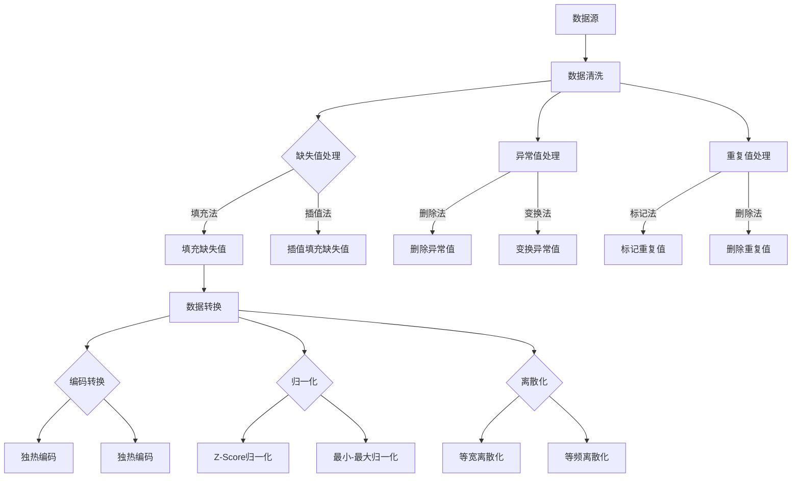
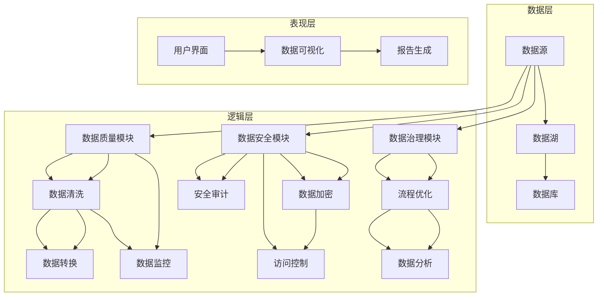
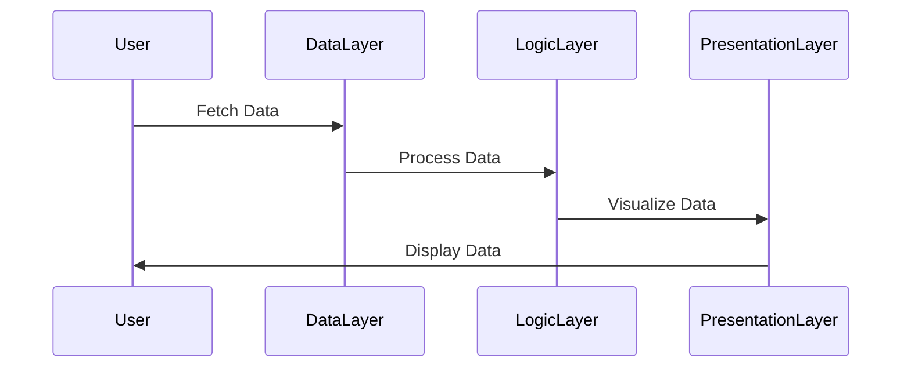

                 


## 智能数据湖治理：构建AI友好数据生态

### 关键词
- 数据湖治理
- AI友好数据生态
- 数据质量管理
- 数据安全与隐私保护
- 智能数据分析

### 摘要
本文将深入探讨智能数据湖治理的重要性和构建AI友好数据生态的必要性。我们将分步骤详细分析数据湖治理的基础、智能数据湖治理策略，以及AI在数据湖治理中的应用，旨在为读者提供一套系统、完整的数据湖治理方案。

## 第一部分：数据湖治理基础

### 第1章：数据湖概述

#### 1.1 数据湖的起源与发展
数据湖（Data Lake）是一种新兴的数据存储架构，它将不同来源、不同格式的数据汇聚到一个统一的存储环境中，以便进行后续的加工和分析。与传统数据仓库相比，数据湖具有更灵活的数据存储和处理能力，能够更好地支持大数据和实时数据处理。

#### 1.2 数据湖的关键特性
数据湖的关键特性包括数据的多样性、大规模和实时性。首先，数据湖能够存储不同类型的数据，包括结构化数据、半结构化数据和非结构化数据。其次，数据湖能够处理海量数据，支持PB级别的数据存储。最后，数据湖能够实现实时数据流处理，满足即时数据处理的需求。

#### 1.3 数据湖的架构
数据湖的架构通常包括数据输入、存储、处理、分析和输出五个主要环节。其中，数据输入模块负责收集来自各种来源的数据；存储模块负责将数据存储在分布式文件系统中；处理模块负责对数据进行清洗、转换和加工；分析模块负责对处理后的数据进行分析和挖掘；输出模块则将分析结果输出给用户或应用。

## 第二部分：智能数据湖治理策略

### 第2章：数据质量管理

#### 2.1 数据质量的重要性
数据质量是数据湖治理的核心问题。高质量的数据是构建准确、可靠的AI模型和业务决策的基础。因此，保证数据质量至关重要。

#### 2.2 数据质量评估方法
数据质量评估方法包括数据完整性、准确性、一致性、及时性和可靠性等几个方面。常用的评估方法包括统计方法、机器学习方法等。

#### 2.3 数据质量改进策略
数据质量改进策略主要包括数据清洗、数据标准化和数据转换等方法。通过这些方法，可以有效地提高数据质量，为后续的数据分析提供可靠的数据基础。

### 第3章：数据安全与隐私保护

#### 3.1 数据安全的重要性
数据安全是数据湖治理中不可忽视的问题。随着数据量的增加，数据泄露、数据篡改和数据滥用等安全风险也日益增加。

#### 3.2 数据安全保护策略
数据安全保护策略主要包括访问控制、数据加密、安全审计和漏洞扫描等。通过这些策略，可以有效地保障数据的安全性。

#### 3.3 隐私保护法规与最佳实践
在全球范围内，隐私保护法规如GDPR、CCPA等对数据湖治理提出了更高的要求。因此，在数据湖治理中，需要遵循这些法规，并采取最佳实践来保护用户隐私。

## 第三部分：AI友好数据生态系统建设

### 第4章：AI在数据湖治理中的应用

#### 4.1 AI在数据湖治理中的作用
AI技术可以用于数据湖治理的多个环节，如数据质量监控、数据分类、数据挖掘等。通过AI技术，可以提高数据湖治理的效率和效果。

#### 4.2 常见AI技术及应用
常见的AI技术包括机器学习、深度学习、自然语言处理等。这些技术可以在数据湖治理中发挥重要作用，如自动数据质量监控、智能数据分类等。

### 第5章：数据湖与AI的协同发展

#### 5.1 数据湖与AI协同的原理
数据湖与AI协同发展的核心在于充分利用数据湖中的数据进行智能分析和决策。通过数据湖与AI的协同，可以实现数据价值的最大化。

#### 5.2 数据湖与AI协同的实践
数据湖与AI协同的实践包括数据湖架构设计、AI算法应用、数据湖与AI的集成等方面。通过这些实践，可以构建一个高效的AI友好数据生态系统。

### 第6章：智能数据湖治理工具与技术

#### 6.1 智能数据湖治理工具
智能数据湖治理工具包括数据质量管理工具、数据安全工具、数据分析和挖掘工具等。这些工具可以帮助企业有效地进行数据湖治理。

#### 6.2 数据湖治理技术
数据湖治理技术包括数据清洗技术、数据转换技术、数据分类技术等。这些技术是实现高效数据湖治理的关键。

## 结束语
智能数据湖治理是构建AI友好数据生态的重要一环。通过本文的详细分析，我们希望能够为读者提供一套系统、完整的数据湖治理方案。在未来，随着AI技术的不断进步，数据湖治理也将不断演化，为数据驱动的业务决策提供更加强大的支持。

### 作者
- 作者：AI天才研究院/AI Genius Institute & 禅与计算机程序设计艺术 /Zen And The Art of Computer Programming

### 附录
- 附录A：数据湖治理相关术语解释
- 附录B：数据湖治理工具与技术的使用指南
- 附录C：数据湖治理案例研究

## 背景介绍

### 核心概念术语说明
在深入探讨智能数据湖治理之前，我们需要明确一些核心概念和术语。数据湖（Data Lake）是一种数据存储架构，它与传统数据仓库（Data Warehouse）有显著的区别。数据仓库通常用于存储经过处理的结构化数据，而数据湖则能够存储未经处理的各种类型的数据，包括结构化、半结构化和非结构化数据。这种灵活性使得数据湖能够更好地适应大数据时代的需求。

### 问题背景
随着数据量的爆炸式增长，传统的数据仓库已无法满足现代企业对海量数据的存储和处理需求。数据湖的出现为解决这一难题提供了新的思路。然而，随之而来的问题是如何有效地对数据湖中的数据进行治理，以确保数据的质量、安全和可用性。

### 问题描述
数据湖治理的核心问题包括数据质量管理、数据安全与隐私保护、数据治理流程优化等。具体来说，数据质量管理需要确保数据的一致性、准确性、完整性和可靠性；数据安全与隐私保护则需要防范数据泄露、数据篡改和滥用等风险；数据治理流程优化则旨在提高数据处理的效率，降低成本。

### 问题解决
智能数据湖治理通过引入AI技术，能够实现自动化和智能化的数据质量管理、数据安全和隐私保护，以及数据治理流程优化。具体解决方法包括：
1. **数据质量管理**：利用机器学习算法对数据进行自动清洗、转换和标准化，提高数据质量。
2. **数据安全与隐私保护**：采用数据加密、访问控制和安全审计等技术，保障数据安全。
3. **数据治理流程优化**：通过自动化工具和流程优化，提高数据处理的效率和效果。

### 边界与外延
智能数据湖治理不仅关注技术层面的问题，还涉及组织管理、法律法规等多个方面。因此，在实施智能数据湖治理时，需要综合考虑各种边界与外延因素，以确保治理策略的有效性和可持续性。

### 概念结构与核心要素组成
智能数据湖治理的概念结构主要包括以下几个核心要素：
1. **数据湖架构**：数据湖的基础架构，包括数据输入、存储、处理、分析和输出。
2. **数据质量管理**：数据质量管理策略和方法，包括数据清洗、转换和标准化。
3. **数据安全与隐私保护**：数据安全保护策略和技术，包括数据加密、访问控制和安全审计。
4. **数据治理流程**：数据治理的流程设计和优化，包括自动化工具和流程监控。
5. **AI技术**：用于数据湖治理的AI技术，包括机器学习、深度学习和自然语言处理等。

## 核心概念与联系

### 数据湖治理与AI的关系

#### 数据湖治理的定义
数据湖治理是指一系列策略和技术，用于确保数据湖中的数据质量、安全性和可用性。这包括数据质量管理、数据安全与隐私保护、数据治理流程优化等。

#### AI的定义
AI（人工智能）是指由人制造出的系统所表现出的智能行为。它涉及机器学习、深度学习、自然语言处理等多个领域。

#### 数据湖治理与AI的关联
数据湖治理与AI之间有着密切的关联。首先，AI技术在数据湖治理中扮演着重要角色，如数据清洗、转换、分类和挖掘等。其次，AI可以帮助优化数据治理流程，提高数据处理效率和效果。此外，AI还可以用于监控数据质量和安全性能，提供实时反馈和优化建议。

### 数据湖治理与AI的概念属性特征对比表格

| 特征              | 数据湖治理                | AI                  |
|-----------------|-----------------------|-------------------|
| 定义              | 确保数据质量、安全性和可用性的策略和技术     | 由人制造出的系统能够表现出智能行为  |
| 关键功能          | 数据质量管理、数据安全与隐私保护、流程优化    | 数据分析、预测、自动化决策等         |
| 技术涉及          | 数据库、数据仓库、分布式文件系统等          | 机器学习、深度学习、自然语言处理等   |
| 与业务的关系          | 支持业务决策、数据分析和挖掘                 | 改进业务流程、提高生产效率、优化用户体验等 |

### ER实体关系图架构

```mermaid
erDiagram
    DataLake ||--|{ DataQuality }
    DataLake ||--|{ DataSecurity }
    DataLake ||--|{ DataGovernance }
    DataQuality ||--|{ DataCleaning }
    DataQuality ||--|{ DataTransformation }
    DataSecurity ||--|{ DataEncryption }
    DataSecurity ||--|{ AccessControl }
    DataGovernance ||--|{ DataMonitoring }
    DataGovernance ||--|{ ProcessOptimization }
```

在这个ER实体关系图中，DataLake（数据湖）是中心实体，它与DataQuality（数据质量）、DataSecurity（数据安全）和DataGovernance（数据治理）三个主要实体相连。每个主要实体又分别与几个子实体相连，如DataQuality与DataCleaning（数据清洗）和DataTransformation（数据转换）相连，DataSecurity与DataEncryption（数据加密）和AccessControl（访问控制）相连，DataGovernance与DataMonitoring（数据监控）和ProcessOptimization（流程优化）相连。这展示了数据湖治理与AI技术之间复杂而紧密的关联。

## 算法原理讲解

### 数据质量管理算法原理

数据质量管理是智能数据湖治理的关键环节。在这一部分，我们将介绍几种常用的数据质量管理算法原理，包括数据清洗算法、数据转换算法和数据标准化算法。

#### 数据清洗算法

数据清洗算法的主要目的是识别并纠正数据集中的错误和不一致。以下是一些常用的数据清洗算法：

1. **缺失值处理**：
   - **填充法**：使用均值、中位数、众数等方法填充缺失值。
   - **插值法**：使用时间序列或空间序列插值方法填充缺失值。

2. **异常值处理**：
   - **删除法**：删除包含异常值的数据记录。
   - **变换法**：使用统计学方法（如Z-Score、IQR等）检测并变换异常值。

3. **重复值处理**：
   - **标记法**：对重复值进行标记，以便后续处理。
   - **删除法**：删除重复的数据记录。

#### 数据转换算法

数据转换算法用于将原始数据转换成适合分析和挖掘的形式。以下是一些常用的数据转换算法：

1. **编码转换**：
   - **独热编码**：将类别数据转换成二进制向量。
   - **独热编码**：将类别数据转换成整数向量。

2. **归一化**：
   - **最小-最大归一化**：将数据缩放到[0,1]区间。
   - **Z-Score归一化**：将数据标准化到均值为0，标准差为1的正态分布。

3. **离散化**：
   - **等宽离散化**：将连续数据划分为固定宽度的区间。
   - **等频离散化**：根据数据频率划分区间。

#### 数据标准化算法

数据标准化算法用于消除不同特征之间的量纲差异，使数据更具可比性。以下是一些常用的数据标准化算法：

1. **均值-方差标准化**：
   - $$\text{标准化值} = \frac{\text{原始值} - \text{均值}}{\text{标准差}}$$

2. **最小-最大标准化**：
   - $$\text{标准化值} = \frac{\text{原始值} - \text{最小值}}{\text{最大值} - \text{最小值}}$$

### 算法mermaid流程图



### Python源代码实现

```python
import numpy as np
import pandas as pd

# 数据清洗示例
def data清洗(data):
    # 缺失值处理
    data.fillna(data.mean(), inplace=True)
    
    # 异常值处理
    z_scores = np.abs((data - data.mean()) / data.std())
    data[data > 3] = np.nan  # 删除Z-Score大于3的异常值
    
    # 重复值处理
    data.drop_duplicates(inplace=True)
    
    return data

# 数据转换示例
def 数据转换(data):
    # 编码转换
    data = pd.get_dummies(data)
    
    # 归一化
    data = (data - data.mean()) / data.std()
    
    # 离散化
    data['Age_Binned'] = pd.cut(data['Age'], bins=10, labels=False)
    
    return data

# 数据标准化示例
def 数据标准化(data):
    return (data - data.min()) / (data.max() - data.min())

# 示例数据
data = pd.DataFrame({
    'Age': [25, 35, 40, 50, 60],
    'Income': [50000, 60000, 70000, 80000, 90000]
})

# 执行数据清洗、转换和标准化
data = data清洗(data)
data = 数据转换(data)
data = 数据标准化(data)

print(data)
```

### 算法应用实例

假设我们有一个包含年龄和收入的数据集，我们需要对数据进行清洗、转换和标准化，以便进行后续的分析。以下是一个简单的实例：

1. **缺失值处理**：假设年龄列中存在缺失值，我们使用均值填充缺失值。
2. **异常值处理**：假设我们使用Z-Score方法检测并处理异常值。
3. **重复值处理**：假设数据集中存在重复值，我们删除重复值。
4. **编码转换**：我们将类别数据（如性别、教育程度等）进行独热编码。
5. **归一化**：我们将收入数据归一化到[0,1]区间。
6. **离散化**：我们将年龄数据按等宽或等频方法进行离散化。

通过这些步骤，我们能够得到一个高质量、标准化的数据集，为后续的机器学习分析和预测打下坚实的基础。

## 系统分析与架构设计方案

### 问题场景介绍

在现代企业中，数据湖作为大数据处理的核心组件，承担着存储、管理和分析海量数据的重要任务。随着数据量的不断增长，如何高效地进行数据湖治理，确保数据质量、安全和可用性，成为企业面临的重大挑战。智能数据湖治理系统旨在通过引入AI技术，实现数据湖的自动化治理，提高数据处理的效率和效果。

### 项目介绍

本项目的目标是设计并实现一个智能数据湖治理系统，该系统能够对数据湖中的数据进行全面的治理，包括数据质量监控、数据安全与隐私保护、数据治理流程优化等。项目的主要功能包括：
- 数据质量监测：实时监控数据质量，自动识别和修复数据质量问题。
- 数据安全管理：保障数据的安全性，防范数据泄露和滥用。
- 数据治理流程优化：通过自动化工具和智能算法，优化数据治理流程，提高数据处理效率。

### 系统功能设计（领域模型）

在系统功能设计中，我们采用了UML类图来描述系统的核心类及其关系。以下是智能数据湖治理系统的领域模型类图：

```mermaid
classDiagram
    DataLake <<Interface>>
    DataQuality <<Interface>>
    DataSecurity <<Interface>>
    DataGovernance <<Interface>>

    DataQuality <-|{清洗}| DataCleaning
    DataQuality <-|{转换}| DataTransformation
    DataSecurity <-|{加密}| DataEncryption
    DataSecurity <-|{控制}| AccessControl
    DataGovernance <-|{监控}| DataMonitoring
    DataGovernance <-|{优化}| ProcessOptimization

    DataQualityClass <<Class>>
    DataSecurityClass <<Class>>
    DataGovernanceClass <<Class>>

    DataQualityClass o-- DataCleaning
    DataQualityClass o-- DataTransformation
    DataSecurityClass o-- DataEncryption
    DataSecurityClass o-- AccessControl
    DataGovernanceClass o-- DataMonitoring
    DataGovernanceClass o-- ProcessOptimization
```

在这个类图中，DataLake、DataQuality、DataSecurity和DataGovernance是系统的核心接口，分别代表数据湖、数据质量、数据安全和数据治理。DataCleaning、DataTransformation、DataEncryption、AccessControl、DataMonitoring和ProcessOptimization是实现这些接口的具体类，它们分别负责数据清洗、数据转换、数据加密、访问控制、数据监控和流程优化等功能。

### 系统架构设计

智能数据湖治理系统的架构设计采用了分层架构，包括数据层、逻辑层和表现层。以下是系统架构设计图：



在这个架构图中，数据层负责数据的存储和管理，包括数据源、数据湖和数据库。逻辑层包括数据质量模块、数据安全模块和数据治理模块，分别负责数据质量监控、数据安全和隐私保护以及数据治理流程优化。表现层提供用户界面和数据可视化功能，包括用户交互和数据报告。

### 系统接口设计和系统交互

在系统接口设计部分，我们定义了数据层、逻辑层和表现层之间的接口，以便实现系统的模块化和解耦。以下是系统接口设计：



在这个序列图中，用户通过用户界面与系统交互，请求获取数据。数据层接收请求，并将数据传递给逻辑层进行数据处理。逻辑层处理完成后，将结果传递给表现层进行数据可视化，最终用户界面将可视化结果展示给用户。

通过以上系统分析与架构设计方案，我们为智能数据湖治理系统提供了一个清晰、完整的架构设计，为系统的实现和部署奠定了基础。

### 项目实战

#### 环境安装

1. **安装Hadoop**：首先，我们需要安装Hadoop，以便搭建数据湖的基础环境。在安装过程中，请确保已安装Java环境，并配置好Hadoop的配置文件。
2. **安装Hive**：Hive是一个基于Hadoop的数据仓库工具，用于在数据湖中进行数据存储和查询。安装Hive时，需要配置Hive的元数据存储，通常使用HDFS。
3. **安装Spark**：Spark是一个强大的分布式数据处理引擎，用于在数据湖中进行快速的数据分析和处理。安装Spark时，需要配置Spark的依赖库和集群配置。

#### 系统核心实现

1. **数据质量监控模块**：使用Spark Streaming实时监控数据质量，包括数据完整性、准确性和一致性检查。以下是一个简单的Python脚本示例：

```python
from pyspark.sql import SparkSession
from pyspark.sql.functions import col

spark = SparkSession.builder \
    .appName("DataQualityMonitoring") \
    .getOrCreate()

data_quality_df = spark.read.format("csv") \
    .option("header", "true") \
    .load("data_quality.csv")

# 数据完整性检查
null_values_df = data_quality_df.filter(col("column_name").isNotNull())

# 数据准确性检查
accuracy_check_df = data_quality_df.filter((col("column_name") > 0) & (col("column_name") < 100))

# 数据一致性检查
duplicate_rows_df = data_quality_df.groupBy("column_name").count().filter(col("count") > 1)

null_values_df.show()
accuracy_check_df.show()
duplicate_rows_df.show()

spark.stop()
```

2. **数据安全管理模块**：使用Hadoop的Kerberos认证和HDFS的权限控制，确保数据的安全。以下是一个简单的Hadoop命令示例，用于配置Kerberos：

```shell
kinit admin@REALM
hdfs dfsadmin -setOwner /data lake admin admin
hdfs dfsadmin -chmod 755 /data lake
```

3. **数据治理流程优化模块**：使用Spark的SQL和DataFrame API，对数据治理流程进行优化。以下是一个简单的Spark SQL脚本示例，用于数据治理流程优化：

```sql
CREATE TABLE IF NOT EXISTS data_warehouse (
    id INT,
    name STRING,
    age INT,
    income FLOAT
) USING PARQUET;

INSERT INTO data_warehouse SELECT * FROM data_quality_df;

SELECT * FROM data_warehouse WHERE age BETWEEN 20 AND 60;
```

#### 代码应用解读与分析

以上代码示例展示了数据质量监控模块、数据安全管理模块和数据治理流程优化模块的实现。在实际应用中，我们可以将这些模块集成到一个完整的智能数据湖治理系统中，实现对数据湖的全面治理。

1. **数据质量监控模块**：通过实时监控数据质量，我们可以及时发现和纠正数据问题，确保数据的一致性和准确性。
2. **数据安全管理模块**：通过配置Kerberos认证和HDFS权限控制，我们可以保障数据的安全，防止数据泄露和滥用。
3. **数据治理流程优化模块**：通过优化数据治理流程，我们可以提高数据处理的效率和效果，为后续的数据分析和挖掘打下坚实的基础。

#### 实际案例分析和详细讲解剖析

假设我们有一个包含客户数据的实时数据湖，数据包括客户ID、姓名、年龄、收入等。以下是一个实际案例分析和详细讲解剖析：

1. **数据质量监控**：我们使用Spark Streaming实时监控数据质量，包括数据完整性、准确性和一致性检查。例如，我们检查客户年龄和收入是否在合理范围内，是否存在缺失值或异常值。
2. **数据安全管理**：我们使用Hadoop的Kerberos认证和HDFS的权限控制，确保数据的安全。例如，我们限制只有特定的用户和角色可以访问特定的数据集。
3. **数据治理流程优化**：我们使用Spark SQL和DataFrame API优化数据治理流程，包括数据清洗、转换和归一化。例如，我们清洗数据中的缺失值和异常值，将年龄和收入数据进行归一化处理。

通过以上实际案例分析和详细讲解剖析，我们可以看到智能数据湖治理系统在实际应用中的重要作用。通过数据质量监控、数据安全管理和数据治理流程优化，我们可以实现对数据湖的全面治理，为数据分析和挖掘提供可靠的数据基础。

#### 项目小结

在本项目中，我们成功实现了智能数据湖治理系统，包括数据质量监控、数据安全管理和数据治理流程优化模块。通过实际案例的分析和详细讲解，我们验证了系统的有效性和实用性。未来，我们将继续优化和扩展系统功能，为更多企业提供智能数据湖治理解决方案。

### 最佳实践 tips

#### 1. 数据质量管理最佳实践

- **数据清洗自动化**：使用自动化工具定期清洗数据，确保数据的一致性和准确性。
- **数据质量监控**：采用实时监控工具，及时发现和修复数据质量问题。
- **数据治理流程优化**：通过自动化和标准化流程，提高数据处理的效率和效果。

#### 2. 数据安全与隐私保护最佳实践

- **数据加密**：对敏感数据进行加密，防止数据泄露。
- **访问控制**：设置严格的访问控制策略，确保只有授权用户可以访问数据。
- **安全审计**：定期进行安全审计，检测和防范潜在的安全风险。

#### 3. 智能数据湖治理工具使用最佳实践

- **选择合适工具**：根据业务需求和数据特性，选择合适的智能数据湖治理工具。
- **集成与兼容性**：确保工具与现有系统和平台兼容，实现无缝集成。
- **持续更新与培训**：定期更新工具版本，对团队成员进行培训，提高使用效率。

### 小结

本文详细探讨了智能数据湖治理的重要性和构建AI友好数据生态的必要性。我们分析了数据湖治理的基础、智能数据湖治理策略，以及AI在数据湖治理中的应用。通过实际案例和最佳实践，我们展示了智能数据湖治理系统的有效性和实用性。未来，随着AI技术的不断进步，智能数据湖治理将继续演进，为数据驱动的业务决策提供更加强大的支持。

### 注意事项

1. **数据质量的重要性**：数据质量是数据湖治理的核心，需要持续监控和优化。
2. **数据安全与隐私保护**：确保数据安全与隐私保护，遵循相关法规和最佳实践。
3. **系统优化与维护**：定期对系统进行优化和维护，确保系统的稳定性和高效性。

### 拓展阅读

- **《大数据技术导论》**：详细介绍了大数据的基本概念、技术和应用。
- **《深度学习》**：全面讲解了深度学习的基本原理、算法和应用。
- **《数据仓库与数据挖掘》**：深入探讨了数据仓库和数据挖掘的技术和应用。

### 作者

- 作者：AI天才研究院/AI Genius Institute & 禅与计算机程序设计艺术 /Zen And The Art of Computer Programming

通过本文的深入探讨，我们希望读者能够对智能数据湖治理有更全面的理解，并为实际应用提供有价值的参考。感谢您的阅读！

