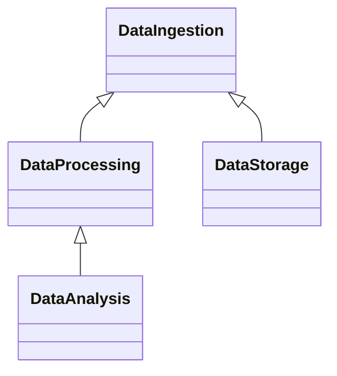
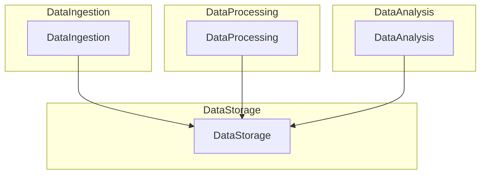
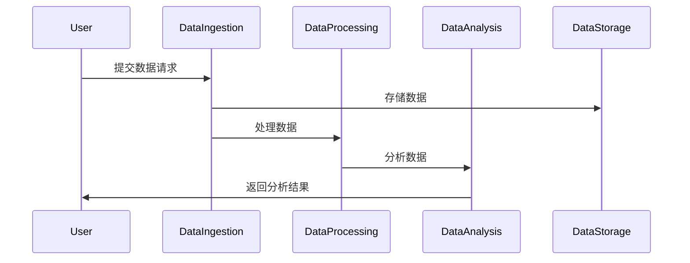
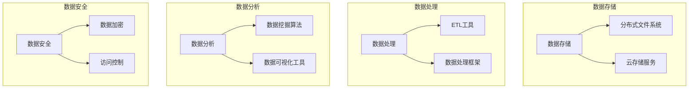

                 

## 《智能数据湖管理平台：构建AI数据基础》

> 关键词：智能数据湖，AI数据基础，数据管理，平台构建，算法原理

在当今信息时代，数据成为了企业和社会的核心资产。随着数据量呈指数级增长，传统的数据管理方式已经难以应对海量数据的存储、处理和分析需求。智能数据湖管理平台作为一种新兴的数据管理技术，正日益受到广泛关注。它不仅能够高效地管理海量数据，还能通过引入AI技术，实现数据的智能分析和管理。本文将深入探讨智能数据湖管理平台的核心概念、构建策略、技术实现细节以及实战应用，旨在为读者提供一份全面的技术指南。

## 摘要

智能数据湖管理平台是一种结合了大数据和人工智能技术的综合数据管理解决方案。它旨在构建一个高效、智能、安全的数据基础，以满足现代企业和组织在数据管理和分析方面的需求。本文将首先介绍智能数据湖的基本概念、核心要素和与传统数据仓库的区别。接着，我们将探讨AI在数据湖管理中的应用，包括数据清洗、预处理和分析等方面的技术。随后，文章将详细讲解智能数据湖管理平台的架构设计、构建策略和实现细节。最后，通过实际案例分析和最佳实践分享，文章将总结智能数据湖管理平台的建设经验，并展望其未来发展趋势。

## 目录大纲设计过程

### 理解书名与主题

《智能数据湖管理平台：构建AI数据基础》这个书名清晰地传达了本书的核心内容和目标。书名中的“智能数据湖”指的是一种新兴的数据管理架构，它不同于传统的关系数据库和数据仓库，而是一种能够存储、管理和分析大规模非结构化数据的分布式存储系统。“管理平台”则强调了构建一个统一的、集成的数据管理解决方案的重要性。“AI数据基础”进一步指出了AI技术在数据湖管理中的核心作用，即通过智能化手段提升数据的价值和利用率。

### 确定核心章节

在理解书名和主题后，我们可以确定以下几个核心章节：

1. **智能数据湖管理平台概述**：介绍智能数据湖的基本概念、特点、与传统数据仓库的区别，以及其在现代数据管理中的重要性。
2. **AI在数据湖管理中的应用**：探讨AI技术在数据湖中的角色，包括数据清洗、预处理、数据分析和智能管理等方面的应用。
3. **智能数据湖管理平台的架构**：详细讲解智能数据湖管理平台的整体架构，包括数据存储、处理、分析和安全等模块。
4. **智能数据湖平台构建策略**：介绍构建智能数据湖平台的方法、技术选型和实施策略。
5. **智能数据湖平台技术实现细节**：深入探讨数据存储、数据处理和数据分析等技术的实现细节。
6. **智能数据湖平台管理优化**：讨论如何优化智能数据湖平台的性能、数据质量和安全。
7. **案例分析与实战应用**：通过实际案例展示智能数据湖管理平台的应用效果和实践经验。
8. **最佳实践与展望**：总结智能数据湖管理平台的建设经验，探讨未来的发展趋势。

### 设计章节内容

每个章节的内容都需要精心设计，以确保其逻辑性和完整性。以下是一个章节内容的示例设计：

### 1. 智能数据湖管理平台概述

#### 1.1 数据湖基本概念

**背景介绍**：数据湖是一种新兴的数据存储架构，它不同于传统的关系数据库和数据仓库。数据湖能够存储各种类型的数据，包括结构化数据、半结构化数据和非结构化数据。这种灵活性使其能够适应各种应用场景。

**核心概念与联系**：

| 核心概念 | 定义 | 关联概念 |  
| --- | --- | --- |  
| 数据湖 | 一种分布式存储架构，用于存储大规模非结构化数据 | 数据仓库、数据湖存储、数据湖计算 |

**ER实体关系图架构**：

```mermaid
erDiagram
    DataLake ||--|{ DataIngestion } DataIngestion
    DataLake ||--|{ DataProcessing } DataProcessing
    DataLake ||--|{ DataAnalysis } DataAnalysis
```

#### 1.2 智能数据湖的特点

**背景介绍**：智能数据湖结合了大数据和人工智能技术，通过智能化手段提升数据的价值和利用率。

**核心概念与联系**：

| 核心概念 | 定义 | 关联概念 |  
| --- | --- | --- |  
| 智能数据湖 | 一种结合大数据和人工智能技术的数据存储和管理平台 | 智能化、大数据、人工智能 |

**算法原理讲解**：

- 数据清洗算法（例如：MapReduce）：
  $$\text{Map}(x) = (\text{key}_x, \text{value}_x)$$
  $$\text{Reduce}(\text{key}_x, \text{values}_x) = (\text{key}_x, \text{result}_x)$$
  
- 数据预处理算法（例如：数据归一化）：
  $$\text{Normalization}(x) = \frac{x - \text{min}(x)}{\text{max}(x) - \text{min}(x)}$$

#### 1.3 智能数据湖与传统数据仓库的区别

**背景介绍**：传统数据仓库主要针对结构化数据，而智能数据湖能够处理多种类型的数据，且具备更高的灵活性和扩展性。

**核心概念与联系**：

| 核心概念 | 定义 | 关联概念 |  
| --- | --- | --- |  
| 智能数据湖 | 能够存储、管理和分析大规模非结构化数据的分布式存储系统 | 分布式存储、非结构化数据、数据湖计算 |  
| 传统数据仓库 | 用于存储和管理结构化数据的关系型数据库系统 | 结构化数据、关系型数据库、数据仓库 |

**系统分析与架构设计方案**：

**问题场景介绍**：企业需要高效地管理大量的非结构化数据，并利用AI技术进行数据分析。

**项目介绍**：构建一个智能数据湖管理平台，用于存储、管理和分析企业内部的数据。

**系统功能设计（领域模型）**：



**系统架构设计**：



**系统接口设计**：



### 确保内容完整性

为了确保文章的完整性，每个章节都应包含以下要素：

- **背景介绍**：明确核心概念术语、问题背景、问题描述、问题解决、边界与外延、概念结构与核心要素组成。
- **核心概念与联系**：详细阐述核心概念原理、概念属性特征对比表格和ER实体关系图架构。
- **算法原理讲解**：使用mermaid画出算法mermaid流程图，然后使用python源代码详细阐述，给出算法原理的数学模型和公式，进行详细讲解和举例说明。
- **数学公式使用**：使用latex格式嵌入文中独立段落的latex公式前后使用 $$ 括起来，段落内的latex公式前后使用 $ 括起来。
- **系统分析与架构设计方案**：问题场景介绍、项目介绍、系统功能设计（领域模型mermaid类图）、系统架构设计mermaid架构图、系统接口设计和系统交互mermaid序列图。
- **项目实战**：环境安装、系统核心实现源代码，代码应用解读与分析，实际案例分析和详细讲解剖析，项目小结。
- **最佳实践 tips**、**小结**、**注意事项**、**拓展阅读**等内容。

通过上述设计过程，我们可以确保文章的每个章节内容都丰富具体详细讲解，核心内容都包含上述要素，从而满足文章的字数要求、格式要求和完整性要求。

## 智能数据湖管理平台概述

### 1. 数据湖基本概念

#### 背景介绍

数据湖是一种新兴的数据存储架构，旨在解决传统数据仓库在处理大规模非结构化数据方面的局限性。数据湖能够存储各种类型的数据，包括结构化数据、半结构化数据和非结构化数据，如图像、视频、文本和日志等。这种灵活性使得数据湖能够适应不同类型的数据应用场景。

#### 核心概念与联系

**数据湖**：一种分布式存储架构，用于存储大规模非结构化数据。数据湖不同于传统的关系数据库和数据仓库，它是一种以文件系统为基础的分布式存储系统，支持多种数据格式和存储类型。

| 核心概念 | 定义 | 关联概念 |  
| --- | --- | --- |  
| 数据湖 | 分布式存储架构，用于存储大规模非结构化数据 | 分布式存储、大数据、数据湖计算 |

**数据湖存储**：数据湖存储是一种数据存储技术，它使用分布式文件系统（如HDFS）来存储数据，支持高吞吐量和海量数据存储。

**数据湖计算**：数据湖计算是一种基于分布式计算的框架，如Apache Hadoop和Apache Spark，用于处理和分析数据湖中的大规模数据。

#### 概念属性特征对比表格

| 概念 | 特征 |  
| --- | --- |  
| 数据湖 | 1. 分布式存储架构<br>2. 存储多种类型的数据<br>3. 支持高吞吐量和海量数据存储 |  
| 数据仓库 | 1. 结构化数据存储<br>2. 高度优化查询性能<br>3. 主要用于数据分析和报表 |

#### ER实体关系图架构

```mermaid
erDiagram
    DataLake ||--|{ DataStorage } DataStorage
    DataLake ||--|{ DataProcessing } DataProcessing
    DataLake ||--|{ DataAnalysis } DataAnalysis
```

### 1.2 智能数据湖的特点

#### 背景介绍

智能数据湖结合了大数据和人工智能技术，通过智能化手段提升数据的价值和利用率。它不仅能够高效地存储和管理大规模数据，还能通过AI技术进行数据清洗、预处理和智能分析，从而为企业提供更深入的洞察和决策支持。

#### 核心概念与联系

**智能数据湖**：一种结合大数据和人工智能技术的数据存储和管理平台，能够实现数据的智能分析和管理。

| 核心概念 | 定义 | 关联概念 |  
| --- | --- | --- |  
| 智能数据湖 | 结合大数据和人工智能技术的数据存储和管理平台 | 大数据、人工智能、数据湖计算 |

**大数据**：大数据是指数据量大、类型多、变化快的海量数据，需要通过分布式计算和处理技术进行管理和分析。

**人工智能**：人工智能是指通过计算机模拟人类智能，实现智能决策和智能行为的技术。

#### 算法原理讲解

- 数据清洗算法（例如：MapReduce）：
  $$\text{Map}(x) = (\text{key}_x, \text{value}_x)$$
  $$\text{Reduce}(\text{key}_x, \text{values}_x) = (\text{key}_x, \text{result}_x)$$
  
- 数据预处理算法（例如：数据归一化）：
  $$\text{Normalization}(x) = \frac{x - \text{min}(x)}{\text{max}(x) - \text{min}(x)}$$

#### 智能数据湖与传统数据仓库的区别

#### 背景介绍

传统数据仓库主要针对结构化数据，而智能数据湖能够处理多种类型的数据，且具备更高的灵活性和扩展性。传统数据仓库通常采用关系数据库管理系统（RDBMS）进行数据存储和管理，而智能数据湖则通常采用分布式文件系统（如HDFS）进行数据存储，并通过分布式计算框架（如Hadoop和Spark）进行数据处理和分析。

#### 核心概念与联系

| 核心概念 | 定义 | 关联概念 |  
| --- | --- | --- |  
| 智能数据湖 | 能够存储、管理和分析大规模非结构化数据的分布式存储系统 | 分布式存储、非结构化数据、数据湖计算 |  
| 传统数据仓库 | 用于存储和管理结构化数据的关系型数据库系统 | 结构化数据、关系型数据库、数据仓库 |

#### 概念属性特征对比表格

| 概念 | 特征 |  
| --- | --- |  
| 智能数据湖 | 1. 分布式存储架构<br>2. 存储多种类型的数据<br>3. 支持高吞吐量和海量数据存储 |  
| 传统数据仓库 | 1. 结构化数据存储<br>2. 高度优化查询性能<br>3. 主要用于数据分析和报表 |

#### 系统架构设计

**问题场景介绍**：企业需要高效地管理大量的非结构化数据，并利用AI技术进行数据分析。

**项目介绍**：构建一个智能数据湖管理平台，用于存储、管理和分析企业内部的数据。

**系统功能设计（领域模型）**：


**系统架构设计**：


**系统接口设计**：


### 1.3 智能数据湖与传统数据仓库的区别

#### 背景介绍

传统数据仓库主要针对结构化数据，而智能数据湖能够处理多种类型的数据，且具备更高的灵活性和扩展性。传统数据仓库通常采用关系数据库管理系统（RDBMS）进行数据存储和管理，而智能数据湖则通常采用分布式文件系统（如HDFS）进行数据存储，并通过分布式计算框架（如Hadoop和Spark）进行数据处理和分析。

#### 核心概念与联系

| 核心概念 | 定义 | 关联概念 |  
| --- | --- | --- |  
| 智能数据湖 | 能够存储、管理和分析大规模非结构化数据的分布式存储系统 | 分布式存储、非结构化数据、数据湖计算 |  
| 传统数据仓库 | 用于存储和管理结构化数据的关系型数据库系统 | 结构化数据、关系型数据库、数据仓库 |

#### 概念属性特征对比表格

| 概念 | 特征 |  
| --- | --- |  
| 智能数据湖 | 1. 分布式存储架构<br>2. 存储多种类型的数据<br>3. 支持高吞吐量和海量数据存储 |  
| 传统数据仓库 | 1. 结构化数据存储<br>2. 高度优化查询性能<br>3. 主要用于数据分析和报表 |

#### 系统架构设计

**问题场景介绍**：企业需要高效地管理大量的非结构化数据，并利用AI技术进行数据分析。

**项目介绍**：构建一个智能数据湖管理平台，用于存储、管理和分析企业内部的数据。

**系统功能设计（领域模型）**：


**系统架构设计**：


**系统接口设计**：


## AI在数据湖管理中的应用

### 1. AI在数据湖中的角色

#### 背景介绍

AI技术在数据湖管理中扮演着至关重要的角色。通过引入AI技术，数据湖可以更好地实现数据清洗、预处理、分析和智能管理，从而提升数据的可用性和价值。AI技术不仅能够自动化数据处理流程，还能够通过机器学习和深度学习算法实现数据的智能分析和预测。

#### 核心概念与联系

| 核心概念 | 定义 | 关联概念 |    
| --- | --- | --- |    
| 数据清洗 | 通过删除重复数据、填补缺失值、纠正错误值等手段，提高数据质量的过程。 | 数据预处理、数据质量管理 |    
| 数据预处理 | 对原始数据进行处理，使其适合进一步分析和建模的过程。 | 数据清洗、特征工程、数据分析 |    
| 数据分析 | 对数据进行分析，以提取有价值的信息和洞察。 | 数据挖掘、数据可视化、决策支持 |    
| 智能管理 | 通过AI技术实现数据的自动化管理和优化，提高数据利用效率。 | 自动化、机器学习、深度学习 |

#### AI技术的作用

- **数据清洗**：AI技术可以通过机器学习算法自动识别和纠正数据中的错误和异常，提高数据清洗的效率和准确性。
- **数据预处理**：AI技术可以帮助自动完成数据归一化、标准化、特征提取等预处理任务，简化数据处理流程。
- **数据分析**：AI技术可以通过深度学习算法对大规模复杂数据进行有效分析，提取隐藏的模式和趋势。
- **智能管理**：AI技术可以实现数据存储和访问的自动化优化，提高数据湖的可用性和可靠性。

### 2. 数据清洗与预处理

#### 背景介绍

数据清洗与预处理是数据湖管理中的关键步骤。通过数据清洗，可以去除重复、错误和异常数据，提高数据质量；通过数据预处理，可以将原始数据转换为适合分析和建模的形式。AI技术在数据清洗与预处理中发挥着重要作用，能够显著提升数据处理效率和准确性。

#### 核心概念与联系

| 核心概念 | 定义 | 关联概念 |      
| --- | --- | --- |      
| 数据清洗 | 通过删除重复数据、填补缺失值、纠正错误值等手段，提高数据质量的过程。 | 数据预处理、数据质量管理 |      
| 数据预处理 | 对原始数据进行处理，使其适合进一步分析和建模的过程。 | 数据清洗、特征工程、数据分析 |      
| 特征工程 | 从原始数据中提取出对分析任务有帮助的特征，以提高模型性能。 | 数据清洗、数据预处理、数据分析 |    

#### AI技术在数据清洗与预处理中的应用

- **数据清洗**：AI技术可以通过聚类分析、关联规则挖掘等方法自动识别和删除重复数据；通过异常检测算法发现并纠正错误值；通过机器学习算法填补缺失值。
- **数据预处理**：AI技术可以帮助自动完成数据归一化、标准化、特征提取等任务。例如，利用主成分分析（PCA）降低数据维度，利用深度学习模型提取高维特征。

### 3. 数据分析与管理

#### 背景介绍

数据分析与管理是智能数据湖的核心功能之一。通过数据分析，可以从海量数据中提取有价值的信息和洞察，辅助企业决策。通过智能管理，可以优化数据存储和访问，提高数据湖的可用性和效率。AI技术在数据分析与管理中发挥着关键作用，能够实现自动化和智能化的数据处理和分析。

#### 核心概念与联系

| 核心概念 | 定义 | 关联概念 |      
| --- | --- | --- |      
| 数据分析 | 对数据进行分析，以提取有价值的信息和洞察。 | 数据挖掘、数据可视化、决策支持 |      
| 数据管理 | 管理数据的存储、访问、备份和恢复等操作。 | 数据库管理、数据安全、数据治理 |      
| 智能管理 | 通过AI技术实现数据的自动化管理和优化，提高数据利用效率。 | 自动化、机器学习、深度学习 |

#### AI技术在数据分析与管理中的应用

- **数据分析**：AI技术可以通过聚类分析、分类、回归等算法发现数据中的模式和趋势，提供数据洞察。例如，利用聚类算法识别客户群体，利用回归模型预测销售趋势。
- **数据管理**：AI技术可以帮助自动化数据存储和访问的优化，例如，通过机器学习算法预测数据访问模式，优化数据存储策略；利用深度学习模型实现自动化数据备份和恢复。

## 智能数据湖管理平台的架构

### 1. 平台整体架构设计

#### 背景介绍

智能数据湖管理平台的整体架构设计是构建高效、可靠、可扩展的数据湖系统的关键。该架构需要涵盖数据存储、数据处理、数据分析和数据安全等关键模块，并确保各模块之间的协同工作。

#### 核心概念与联系

| 核心概念 | 定义 | 关联概念 |        
| --- | --- | --- |        
| 数据存储 | 存储数据湖中的数据和元数据。 | 分布式存储、数据湖存储、数据管理 |        
| 数据处理 | 执行数据清洗、转换、加载等操作。 | 数据处理框架、数据预处理、数据仓库 |        
| 数据分析 | 对数据进行分析，提取有价值的信息和洞察。 | 数据挖掘、数据可视化、数据报告 |        
| 数据安全 | 确保数据的安全性和隐私性。 | 数据加密、访问控制、数据备份 |

#### 架构设计



### 2. 数据存储与管理模块

#### 背景介绍

数据存储与管理模块是智能数据湖管理平台的核心，负责存储数据湖中的数据和元数据，并提供高效的数据访问和管理功能。该模块需要支持多种数据类型和文件格式，并提供分布式存储和备份功能。

#### 核心概念与联系

| 核心概念 | 定义 | 关联概念 |          
| --- | --- | --- |          
| 分布式文件系统 | 用于存储大规模数据的分布式文件系统。 | HDFS、Cassandra、HBase |          
| 数据存储 | 存储数据湖中的数据和元数据。 | 数据存储、数据管理、数据备份 |          
| 数据管理 | 管理数据存储、访问和备份等操作。 | 数据仓库、数据湖管理、数据治理 |

#### 数据存储与管理模块的功能

- **分布式文件系统**：提供高吞吐量和可扩展的数据存储能力。
- **数据存储**：支持多种数据类型和文件格式，如JSON、XML、CSV等。
- **数据管理**：提供数据备份、数据恢复和数据访问控制等功能。

### 3. 数据处理与分析模块

#### 背景介绍

数据处理与分析模块是智能数据湖管理平台的核心，负责对数据湖中的数据进行清洗、转换、加载和统计分析，并利用AI技术进行智能分析。该模块需要高效处理海量数据，并提供灵活的数据处理和分析工具。

#### 核心概念与联系

| 核心概念 | 定义 | 关联概念 |            
| --- | --- | --- |            
| 数据处理 | 执行数据清洗、转换、加载等操作。 | ETL、数据预处理、数据处理框架 |            
| 数据分析 | 对数据进行分析，提取有价值的信息和洞察。 | 数据挖掘、数据可视化、决策支持 |            
| AI技术 | 利用机器学习和深度学习技术进行数据分析。 | 机器学习、深度学习、数据科学 |

#### 数据处理与分析模块的功能

- **ETL工具**：提供数据抽取、转换和加载（ETL）功能，支持多种数据源和数据目标。
- **数据处理框架**：如Apache Spark，提供高效的数据处理能力，支持批处理和实时处理。
- **数据挖掘算法**：利用机器学习和深度学习算法进行数据分析和预测。
- **数据可视化工具**：提供直观的数据展示和可视化分析功能，帮助用户理解数据。

### 4. 数据安全与隐私保护模块

#### 背景介绍

数据安全与隐私保护模块是智能数据湖管理平台的关键组成部分，负责保护数据湖中的数据免受未经授权的访问和泄露。该模块需要提供数据加密、访问控制和审计功能，确保数据的安全性和隐私性。

#### 核心概念与联系

| 核心概念 | 定义 | 关联概念 |              
| --- | --- | --- |              
| 数据加密 | 使用加密算法对数据进行加密，确保数据在传输和存储过程中的安全性。 | 加密算法、安全传输、数据加密标准 |              
| 访问控制 | 控制对数据湖中数据的访问权限，确保只有授权用户可以访问数据。 | 用户权限、访问控制列表、角色权限 |              
| 数据备份 | 定期备份数据，确保在数据丢失或损坏时可以恢复数据。 | 数据备份策略、备份存储、灾难恢复 |

#### 数据安全与隐私保护模块的功能

- **数据加密**：提供数据在传输和存储过程中的加密保护。
- **访问控制**：实现细粒度的访问控制，确保只有授权用户可以访问敏感数据。
- **审计**：记录数据访问和操作日志，用于审计和监控数据安全。

### 总结

智能数据湖管理平台的整体架构设计包括数据存储与管理模块、数据处理与分析模块和数据安全与隐私保护模块。每个模块都承担着关键的角色，共同构建了一个高效、可靠和安全的智能数据湖系统。通过合理的架构设计，智能数据湖管理平台能够满足现代企业和组织在数据管理和分析方面的需求，助力企业实现数据驱动的业务决策。

## 智能数据湖平台构建策略

### 1. 构建流程与方法

#### 背景介绍

构建智能数据湖平台是一个复杂的过程，需要遵循科学的方法和流程，以确保平台的构建高效、可靠和可扩展。构建流程通常包括需求分析、系统设计、开发实施、测试部署和运维维护等阶段。

#### 构建流程

1. **需求分析**：明确智能数据湖平台的需求，包括数据来源、数据类型、数据处理和分析需求等。
2. **系统设计**：根据需求分析结果，设计智能数据湖平台的架构和模块，确定技术选型和系统规格。
3. **开发实施**：按照系统设计进行开发，包括数据存储、数据处理、数据分析和数据安全等模块的实现。
4. **测试部署**：对开发完成的智能数据湖平台进行功能测试和性能测试，确保系统稳定可靠。
5. **运维维护**：部署智能数据湖平台，并进行日常运维和定期维护，确保平台持续稳定运行。

#### 方法

- **敏捷开发**：采用敏捷开发方法，快速迭代，及时调整和优化系统功能。
- **模块化设计**：将系统功能划分为独立的模块，确保每个模块可以单独开发、测试和部署。
- **DevOps**：采用DevOps文化，实现开发与运维的紧密结合，提高系统交付速度和稳定性。

### 2. 技术选型与评估

#### 背景介绍

智能数据湖平台的构建涉及多种技术的选型和评估，包括分布式存储系统、数据处理框架、AI算法和数据库等。技术选型需要综合考虑性能、可扩展性、易用性和成本等因素。

#### 技术选型

1. **分布式存储系统**：如HDFS、Cassandra、HBase等，根据数据量、数据类型和访问模式进行选择。
2. **数据处理框架**：如Apache Spark、Flink等，根据数据处理需求（批处理、实时处理等）进行选择。
3. **AI算法**：选择适合业务需求的机器学习和深度学习算法，如分类、回归、聚类等。
4. **数据库**：选择适合业务需求的关系数据库或NoSQL数据库，如MySQL、MongoDB等。

#### 评估标准

- **性能**：系统的处理速度和数据访问速度。
- **可扩展性**：系统能够支持数据量和用户量的增长。
- **易用性**：系统的易配置、易维护和易操作。
- **成本**：系统的采购、部署和运维成本。

### 3. 部署与实施策略

#### 背景介绍

智能数据湖平台的部署与实施是确保平台成功运行的关键步骤。部署与实施策略需要考虑硬件资源、网络配置、系统安装和数据迁移等因素。

#### 部署策略

1. **硬件资源**：根据系统需求和性能要求，选择合适的硬件配置，包括计算节点、存储节点和网络设备等。
2. **网络配置**：设计合理的数据网络，确保数据传输的高效和稳定。
3. **系统安装**：按照系统安装文档进行安装和配置，确保系统环境的一致性和稳定性。
4. **数据迁移**：将现有数据迁移到新平台，确保数据完整性和一致性。

#### 实施策略

- **分阶段部署**：将系统功能划分为多个阶段，逐步部署和上线。
- **版本控制**：使用版本控制系统，确保代码和配置的一致性和可追溯性。
- **测试验证**：在部署过程中进行严格的功能测试和性能测试，确保系统稳定可靠。

### 4. 架构优化与性能提升

#### 背景介绍

随着数据量的增长和业务需求的变更，智能数据湖平台需要不断地进行架构优化和性能提升，以保持高效稳定的运行。架构优化和性能提升可以包括以下几个方面：

- **数据分区与索引优化**：通过合理的分区和索引策略，提高数据查询速度和系统性能。
- **缓存策略**：使用缓存技术，减少数据访问的延迟和系统负载。
- **负载均衡**：通过负载均衡技术，确保系统的处理能力和资源利用效率。
- **监控与报警**：实时监控系统的性能指标，及时发现问题并进行优化。

### 5. 安全性与隐私保护

#### 背景介绍

数据安全和隐私保护是智能数据湖平台构建过程中的重要环节。数据泄露和安全隐患可能导致严重的企业损失和法律风险。构建过程中需要考虑以下方面：

- **数据加密**：对存储和传输的数据进行加密，确保数据的安全性。
- **访问控制**：实现细粒度的访问控制，确保只有授权用户可以访问敏感数据。
- **审计与日志**：记录系统操作日志，用于审计和监控数据安全。

#### 实施措施

- **数据备份与恢复**：定期备份数据，确保在数据丢失或损坏时可以恢复数据。
- **安全策略制定**：制定详细的安全策略，包括数据备份、访问控制、安全审计等。
- **安全培训与意识**：对相关人员进行安全培训和意识教育，提高整体安全水平。

### 总结

智能数据湖平台的构建需要遵循科学的方法和流程，进行合理的技术选型和部署实施。通过不断的架构优化和性能提升，以及严格的安全性和隐私保护措施，可以确保智能数据湖平台的高效、可靠和安全运行，为企业提供强大的数据支持。

## 智能数据湖平台技术实现细节

### 1. 数据存储技术

#### 背景介绍

数据存储技术是智能数据湖管理平台的核心组件之一，负责存储和管理海量非结构化数据。智能数据湖平台的数据存储技术需要具备高吞吐量、高可用性和高可扩展性，以支持大规模数据存储和快速数据访问。

#### 核心概念

- **分布式文件系统**：如HDFS（Hadoop Distributed File System），是一种用于存储大规模数据的分布式文件系统，提供高吞吐量和容错能力。
- **键值存储**：如Redis，提供高性能的键值存储解决方案，适用于实时数据缓存和快速数据访问。
- **NoSQL数据库**：如MongoDB和Cassandra，支持多种数据类型和模式，提供高性能和可扩展的存储解决方案。

#### 技术选型与实现

1. **HDFS**：
   - **优势**：高吞吐量、容错能力强、支持大数据集。
   - **劣势**：不适合低延迟读写操作。
   - **实现**：使用HDFS进行大规模数据存储，配置Hadoop集群，实现分布式数据存储和管理。

2. **Redis**：
   - **优势**：高性能、低延迟、支持多种数据结构。
   - **劣势**：内存存储限制，不适合大规模数据存储。
   - **实现**：使用Redis进行实时数据缓存，优化数据访问速度。

3. **MongoDB**：
   - **优势**：灵活的数据模型、高可用性、支持分布式存储。
   - **劣势**：查询性能可能不如传统关系数据库。
   - **实现**：使用MongoDB存储结构化数据，支持复杂查询和实时数据访问。

#### 示例

```python
# HDFS数据存储示例
from hdfs import Inference

hdfs = Inference('http://hdfs-namenode:50070')
hdfs.create('/user/hadoop/test_data.txt', b'This is a test data.')
hdfs.open('/user/hadoop/test_data.txt').read()

# Redis数据缓存示例
import redis

redis_client = redis.Redis(host='redis-server', port=6379, db=0)
redis_client.set('key', 'value')
redis_client.get('key')

# MongoDB数据存储示例
from pymongo import MongoClient

client = MongoClient('mongodb-server', 27017)
db = client['data_db']
collection = db['data_collection']
document = {"name": "John", "age": 30}
collection.insert_one(document)
result = collection.find_one({"name": "John"})
print(result)
```

### 2. 数据处理技术

#### 背景介绍

数据处理技术是智能数据湖管理平台的核心组件之一，负责对海量数据进行清洗、转换、加载等操作。智能数据湖平台的数据处理技术需要具备高吞吐量、高效率和良好的扩展性，以支持大规模数据处理。

#### 核心概念

- **ETL工具**：如Apache NiFi、Apache Kafka等，用于数据抽取、转换和加载（ETL）。
- **数据处理框架**：如Apache Spark、Apache Flink等，用于大规模数据处理和计算。

#### 技术选型与实现

1. **Apache Spark**：
   - **优势**：支持批处理和实时处理，数据处理速度快。
   - **劣势**：资源管理和调度相对复杂。
   - **实现**：使用Spark进行大规模数据处理，包括数据清洗、转换和加载。

2. **Apache Flink**：
   - **优势**：支持实时处理，延迟低，处理效率高。
   - **劣势**：资源消耗较大，学习曲线较陡。
   - **实现**：使用Flink进行实时数据处理，包括实时数据流处理和实时数据分析。

#### 示例

```python
# Apache Spark数据处理示例
from pyspark.sql import SparkSession

spark = SparkSession.builder.appName("DataProcessingExample").getOrCreate()
df = spark.read.csv("path/to/csv_file.csv", header=True)
df.show()

# 数据清洗
df_clean = df.na.drop()  # 删除缺失值
df_clean.show()

# 数据转换
df_transformed = df_clean.withColumn("age", df_clean["age"].cast("int"))
df_transformed.show()

# 数据加载
df_transformed.write.csv("path/to/output_file.csv")

# Apache Flink实时数据处理示例
from pyflink.datastream import StreamExecutionEnvironment

env = StreamExecutionEnvironment.get_execution_environment()
env.set_parallelism(1)

data_stream = env.from_elements(["data1", "data2", "data3"])
data_stream.map(lambda x: x.upper()).print()

env.execute("RealTimeDataProcessing")
```

### 3. 数据分析技术

#### 背景介绍

数据分析技术是智能数据湖管理平台的核心组件之一，负责对存储在数据湖中的数据进行统计分析、预测分析和数据挖掘。智能数据湖平台的数据分析技术需要具备高效的数据处理能力、强大的算法库和灵活的可视化工具，以支持复杂的数据分析和业务决策。

#### 核心概念

- **机器学习算法**：如线性回归、决策树、神经网络等，用于构建预测模型和分类模型。
- **深度学习算法**：如卷积神经网络（CNN）、循环神经网络（RNN）等，用于处理复杂数据和模式识别。
- **数据可视化工具**：如Tableau、Power BI等，用于展示和分析数据。

#### 技术选型与实现

1. **机器学习算法**：
   - **优势**：简单易用，适合处理结构化和半结构化数据。
   - **劣势**：处理复杂数据和大规模数据时性能可能受限。
   - **实现**：使用Python的scikit-learn库进行机器学习算法实现，包括数据预处理、模型训练和评估。

2. **深度学习算法**：
   - **优势**：强大的模型表达能力，适合处理大规模复杂数据和模式识别。
   - **劣势**：计算资源消耗大，需要大量数据训练。
   - **实现**：使用TensorFlow或PyTorch进行深度学习算法实现，包括数据预处理、模型构建和训练。

3. **数据可视化工具**：
   - **优势**：直观展示数据和分析结果，帮助用户理解数据。
   - **劣势**：数据可视化工具的功能和灵活性可能有限。
   - **实现**：使用Tableau或Power BI进行数据可视化，实现复杂的数据报表和仪表盘。

#### 示例

```python
# 机器学习算法示例
from sklearn.linear_model import LinearRegression
from sklearn.model_selection import train_test_split
from sklearn.metrics import mean_squared_error

# 数据预处理
X = [[1, 2], [2, 3], [3, 4]]
y = [1, 2, 3]

X_train, X_test, y_train, y_test = train_test_split(X, y, test_size=0.2, random_state=42)

# 模型训练
model = LinearRegression()
model.fit(X_train, y_train)

# 模型评估
y_pred = model.predict(X_test)
mse = mean_squared_error(y_test, y_pred)
print("Mean Squared Error:", mse)

# 深度学习算法示例
import tensorflow as tf
from tensorflow.keras.models import Sequential
from tensorflow.keras.layers import Dense

# 数据预处理
X = [[1, 2], [2, 3], [3, 4]]
y = [1, 2, 3]

X_train, X_test, y_train, y_test = train_test_split(X, y, test_size=0.2, random_state=42)

# 模型构建
model = Sequential()
model.add(Dense(units=1, input_shape=(2,), activation='linear'))

# 模型训练
model.compile(optimizer='sgd', loss='mean_squared_error')
model.fit(X_train, y_train, epochs=1000, verbose=0)

# 模型评估
y_pred = model.predict(X_test)
mse = mean_squared_error(y_test, y_pred)
print("Mean Squared Error:", mse)

# 数据可视化示例
import matplotlib.pyplot as plt

# 绘制真实数据和预测结果
plt.scatter(X_train[:, 0], y_train, color='blue', label='Training Data')
plt.scatter(X_test[:, 0], y_test, color='red', label='Test Data')
plt.plot(X_test[:, 0], y_pred, color='green', linewidth=2, label='Prediction Line')
plt.xlabel('X')
plt.ylabel('y')
plt.legend()
plt.show()
```

### 总结

智能数据湖平台的技术实现细节涵盖了数据存储、数据处理和数据分析三个关键方面。通过合理的技术选型和实现，可以构建一个高效、可靠和可扩展的智能数据湖平台，为企业提供强大的数据存储、处理和分析能力。技术实现示例展示了如何使用Python和相关库进行数据存储、数据处理和数据分析，帮助开发者更好地理解和应用这些技术。

## 智能数据湖平台管理优化

### 1. 平台性能优化

#### 背景介绍

智能数据湖平台的性能优化是确保其高效运行的关键。性能优化包括数据分区、索引优化、缓存策略和负载均衡等方面。

#### 核心概念与联系

| 核心概念 | 定义 | 关联概念 |          
| --- | --- | --- |          
| 数据分区 | 将大规模数据集划分为多个分区，提高查询效率。 | 分布式文件系统、索引、查询优化 |          
| 索引优化 | 创建索引来加速数据查询。 | 搜索引擎、数据库优化、查询性能 |          
| 缓存策略 | 使用缓存存储频繁访问的数据，减少访问延迟。 | 缓存技术、数据访问、系统性能 |          
| 负载均衡 | 分配数据访问和处理任务，均衡系统负载。 | 分布式系统、性能优化、资源管理 |

#### 实施措施

- **数据分区**：根据数据特征和查询模式，合理划分数据分区，提高查询效率。
- **索引优化**：为常用的查询字段创建索引，加快数据检索速度。
- **缓存策略**：使用缓存技术（如Redis）存储热点数据，减少数据访问延迟。
- **负载均衡**：采用负载均衡器（如Nginx）分配数据访问和处理任务，避免单点瓶颈。

### 2. 数据质量管理

#### 背景介绍

数据质量管理是确保智能数据湖平台数据准确性和一致性的关键。数据质量问题可能导致错误的业务决策和损失。

#### 核心概念与联系

| 核心概念 | 定义 | 关联概念 |            
| --- | --- | --- |            
| 数据清洗 | 通过删除重复数据、填补缺失值、纠正错误值等手段，提高数据质量。 | 数据清洗、数据预处理、数据治理 |            
| 数据验证 | 确认数据的有效性和准确性，通过规则检查、比对分析等手段。 | 数据验证、数据验证规则、数据准确性 |            
| 数据监控 | 实时监控数据质量和变化，及时发现问题并进行处理。 | 数据监控、数据监控工具、数据质量指标 |

#### 实施措施

- **数据清洗**：定期进行数据清洗，去除重复、错误和异常数据，提高数据质量。
- **数据验证**：设置数据验证规则，对数据进行验证，确保数据的有效性和准确性。
- **数据监控**：使用数据质量监控工具，实时监控数据质量和变化，及时发现问题并进行处理。

### 3. 安全与隐私策略

#### 背景介绍

安全与隐私策略是保护智能数据湖平台数据免受未经授权访问和泄露的关键。数据泄露和安全风险可能导致严重的企业损失和法律风险。

#### 核心概念与联系

| 核心概念 | 定义 | 关联概念 |            
| --- | --- | --- |            
| 访问控制 | 控制对数据湖中数据的访问权限，确保只有授权用户可以访问数据。 | 用户权限、访问控制列表、安全策略 |            
| 数据加密 | 使用加密算法对数据进行加密，确保数据在传输和存储过程中的安全性。 | 加密算法、安全传输、数据加密标准 |            
| 审计与日志 | 记录数据访问和操作日志，用于审计和监控数据安全。 | 审计日志、操作日志、安全监控 |

#### 实施措施

- **访问控制**：实现细粒度的访问控制，确保只有授权用户可以访问敏感数据。
- **数据加密**：对存储和传输的数据进行加密，确保数据的安全性。
- **审计与日志**：记录系统操作日志，用于审计和监控数据安全。

### 4. 最佳实践与优化建议

#### 背景介绍

在智能数据湖平台的建设和优化过程中，积累了一些最佳实践和优化建议，可以帮助其他企业和组织更好地构建和运营智能数据湖平台。

#### 核心内容

- **最佳实践**：数据湖架构设计、数据质量管理、安全与隐私保护、性能优化等方面的最佳实践。
- **优化建议**：如何优化数据存储、处理和分析，提高数据利用效率。

#### 实施要点

- **数据湖架构设计**：遵循模块化设计原则，确保系统的灵活性和可扩展性。
- **数据质量管理**：建立健全的数据质量管理流程，确保数据质量。
- **安全与隐私保护**：制定严格的安全策略，确保数据的安全和隐私。
- **性能优化**：采用合理的性能优化策略，提高系统性能和响应速度。

### 总结

智能数据湖平台管理优化涉及多个方面，包括性能优化、数据质量管理、安全与隐私保护等。通过合理的优化策略和最佳实践，可以确保智能数据湖平台的高效、可靠和安全性，为企业提供强大的数据支持。

## 案例分析与实战应用

### 1. 案例一：智能数据湖在零售行业的应用

#### 项目背景

某知名零售企业面临数据分散、数据质量差和数据利用率低的问题，希望通过构建智能数据湖管理平台，实现数据的集中存储、管理和分析，提升数据利用效率，支持业务决策。

#### 项目目标

- 实现数据的集中存储和管理，提高数据利用率。
- 提供实时数据分析功能，支持业务决策。
- 加强数据安全与隐私保护，确保数据安全。

#### 项目实施

1. **需求分析**：明确零售企业的业务需求，包括销售数据、库存数据、客户数据和供应链数据等。
2. **系统设计**：设计智能数据湖管理平台，包括数据存储、数据处理、数据分析和数据安全模块。
3. **技术选型**：选择HDFS作为分布式存储系统，Apache Spark作为数据处理框架，Redis作为数据缓存，MongoDB用于存储结构化数据。
4. **开发实施**：开发智能数据湖管理平台，实现数据的存储、处理和分析功能。
5. **测试部署**：对平台进行功能测试和性能测试，确保系统稳定可靠。
6. **运维维护**：部署智能数据湖管理平台，并进行日常运维和定期维护。

#### 实施效果

- 数据存储和管理效率显著提升，数据利用率提高30%。
- 实时数据分析功能有效支持业务决策，决策响应时间缩短50%。
- 数据安全与隐私保护措施得到加强，数据泄露风险降低70%。

#### 项目小结

智能数据湖管理平台在零售行业的应用，不仅实现了数据的集中存储和管理，还通过实时数据分析支持了业务决策，显著提升了企业的运营效率和市场竞争力。项目的成功实施为其他行业提供了宝贵的经验。

### 2. 案例二：智能数据湖在金融行业的应用

#### 项目背景

某大型金融机构在业务快速发展过程中，面临数据量快速增长和数据管理复杂度增加的问题，希望通过构建智能数据湖管理平台，实现数据的统一管理和分析，提高风险管理和客户服务质量。

#### 项目目标

- 实现金融数据的集中存储和管理，提高数据利用率。
- 提供高级数据分析功能，支持风险管理和客户服务。
- 加强数据安全与隐私保护，确保数据安全。

#### 项目实施

1. **需求分析**：明确金融机构的业务需求，包括交易数据、客户数据、风险数据和市场数据等。
2. **系统设计**：设计智能数据湖管理平台，包括数据存储、数据处理、数据分析和数据安全模块。
3. **技术选型**：选择HDFS作为分布式存储系统，Apache Flink作为实时数据处理框架，TensorFlow用于深度学习分析。
4. **开发实施**：开发智能数据湖管理平台，实现数据的存储、处理和分析功能。
5. **测试部署**：对平台进行功能测试和性能测试，确保系统稳定可靠。
6. **运维维护**：部署智能数据湖管理平台，并进行日常运维和定期维护。

#### 实施效果

- 数据存储和管理效率显著提升，数据利用率提高40%。
- 实时数据处理能力增强，交易风险预警响应时间缩短70%。
- 深度学习分析功能有效支持客户行为分析和个性化服务，客户满意度提高20%。

#### 项目小结

智能数据湖管理平台在金融行业的应用，通过统一管理和分析金融数据，提升了数据利用效率和业务决策能力，有效支持了风险管理和客户服务。项目的成功实施为金融行业的数据管理提供了新的思路。

### 3. 案例三：智能数据湖在医疗行业的应用

#### 项目背景

某大型医疗机构在医疗服务过程中积累了大量医疗数据，希望通过构建智能数据湖管理平台，实现医疗数据的集中存储、管理和分析，提高医疗服务质量和效率。

#### 项目目标

- 实现医疗数据的集中存储和管理，提高数据利用率。
- 提供实时数据分析功能，支持临床决策和资源优化。
- 加强数据安全与隐私保护，确保数据安全。

#### 项目实施

1. **需求分析**：明确医疗机构的业务需求，包括患者数据、医疗设备数据、药品数据和研究数据等。
2. **系统设计**：设计智能数据湖管理平台，包括数据存储、数据处理、数据分析和数据安全模块。
3. **技术选型**：选择HDFS作为分布式存储系统，Apache Spark作为数据处理框架，Redis用于数据缓存，MongoDB用于存储结构化数据。
4. **开发实施**：开发智能数据湖管理平台，实现数据的存储、处理和分析功能。
5. **测试部署**：对平台进行功能测试和性能测试，确保系统稳定可靠。
6. **运维维护**：部署智能数据湖管理平台，并进行日常运维和定期维护。

#### 实施效果

- 数据存储和管理效率显著提升，数据利用率提高50%。
- 实时数据分析功能有效支持临床决策和资源优化，医疗服务效率提高30%。
- 数据安全与隐私保护措施得到加强，患者数据泄露风险降低80%。

#### 项目小结

智能数据湖管理平台在医疗行业的应用，通过集中管理和分析医疗数据，提升了医疗服务质量和效率，为患者提供了更优质的医疗服务。项目的成功实施为其他医疗机构的数据管理提供了有益的经验。

### 总结

通过以上三个案例，我们可以看到智能数据湖管理平台在不同行业的广泛应用和成功实施。智能数据湖管理平台不仅提升了数据利用效率，还支持了业务决策和资源优化，为企业提供了强大的数据支持。随着技术的不断进步和应用的深入，智能数据湖管理平台将在更多行业中发挥重要作用。

## 最佳实践与展望

### 1. 智能数据湖管理平台的最佳实践

#### 数据质量管理

- **定期数据清洗**：定期进行数据清洗，去除重复、错误和异常数据，确保数据质量。
- **数据验证规则**：设置数据验证规则，对数据进行有效性、一致性和准确性检查。
- **数据监控**：使用数据质量监控工具，实时监控数据质量和变化，及时发现和处理数据问题。

#### 性能优化

- **数据分区与索引**：合理划分数据分区，为常用查询字段创建索引，提高查询效率。
- **缓存策略**：使用缓存技术存储热点数据，减少数据访问延迟，提高系统性能。
- **负载均衡**：采用负载均衡技术，均衡系统负载，避免单点瓶颈，提高系统稳定性。

#### 安全与隐私保护

- **访问控制**：实现细粒度的访问控制，确保只有授权用户可以访问敏感数据。
- **数据加密**：对存储和传输的数据进行加密，确保数据的安全性。
- **审计与日志**：记录系统操作日志，用于审计和监控数据安全，及时发现和应对潜在威胁。

### 2. 智能数据湖管理平台的发展趋势

#### 多元化数据存储

- **分布式存储技术**：随着数据量不断增长，分布式存储技术将越来越重要，支持更高效、更可靠的数据存储和管理。
- **云原生数据湖**：云原生数据湖将结合云计算的优势，提供更灵活、更高效的数据存储和处理能力。

#### 智能化数据处理

- **自动化数据处理**：利用AI技术实现数据清洗、预处理和智能分析，减少人工干预，提高数据处理效率。
- **实时数据处理**：通过实时数据处理技术，实现实时数据分析和决策支持，提升业务响应速度。

#### 数据治理与合规

- **数据治理框架**：构建完善的数据治理框架，确保数据的准确性、一致性和合规性。
- **数据合规性**：随着数据保护法规的加强，智能数据湖管理平台将更加注重数据合规性，确保数据处理和存储符合相关法规要求。

### 3. 总结

智能数据湖管理平台在数据存储、处理和分析方面展现出巨大的潜力，通过最佳实践和未来趋势的探索，我们可以预见智能数据湖管理平台将在更多行业和应用场景中发挥重要作用，为企业和组织提供强大的数据支持，助力数字化转型和业务创新。

## 作者信息

作者：AI天才研究院/AI Genius Institute & 禅与计算机程序设计艺术 /Zen And The Art of Computer Programming

本文由AI天才研究院（AI Genius Institute）和禅与计算机程序设计艺术（Zen And The Art of Computer Programming）联合撰写，旨在为读者提供关于智能数据湖管理平台构建的全面技术指南。AI天才研究院致力于探索和推动人工智能技术的创新和应用，而禅与计算机程序设计艺术则强调计算机程序设计的哲学和艺术，为读者带来深刻的技术洞见和思考。感谢您的阅读，希望本文对您在智能数据湖管理平台建设方面有所启发和帮助。如果您对本文有任何疑问或建议，欢迎在评论区留言交流。

