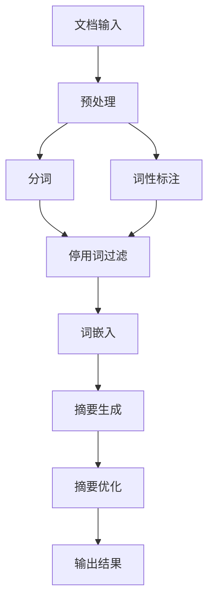

                 

### 关键词

- 智能文档摘要系统
- 信息获取效率
- 自然语言处理
- 深度学习
- 算法实现
- 系统架构设计
- 实战案例分析

### 摘要

在信息爆炸的时代，如何高效获取和利用信息成为了迫切需要解决的问题。本文将探讨智能文档摘要系统，这是一种利用自然语言处理和深度学习技术，自动生成文档摘要的工具，旨在提高信息获取的效率和准确性。文章首先介绍了智能文档摘要系统的背景和目标，然后详细阐述了系统的核心概念、设计原理和实现过程。通过实际案例分析和系统架构设计，文章展示了智能文档摘要系统的应用场景和效果。最后，提出了系统优化的最佳实践和未来研究方向，为智能文档摘要系统的进一步发展提供了思路。

## 第一部分：智能文档摘要系统基础

### 第1章：问题背景与目标

在当今信息时代，数据量呈指数级增长，而人类处理信息的能力却相对有限。这种信息过载现象导致了许多问题，其中最为显著的是信息获取效率和准确性下降。传统的文档摘要方法主要依赖于人工，不仅耗时耗力，而且容易受到主观因素的影响，导致摘要质量不稳定。因此，如何提高文档摘要的效率和质量，成为了学术界和工业界共同关注的问题。

### 1.1 问题背景

#### 文档摘要需求增长

随着互联网和移动设备的普及，人们获取信息的渠道越来越多样化，从传统的书籍、报纸、杂志，到现代的博客、论坛、社交媒体，信息量呈爆炸式增长。这使得文档摘要的需求不断增加，人们希望能够快速地从大量文档中提取出关键信息。

#### 人工摘要效率低下

人工摘要虽然质量较高，但效率低下。对于大量的文档，人工摘要不仅需要耗费大量的时间和精力，而且容易出现遗漏和错误。此外，不同人对同一文档的摘要可能存在较大的差异，导致摘要质量的不稳定。

#### 智能摘要系统的重要性

智能文档摘要系统能够自动化地生成文档摘要，大大提高了信息获取的效率。与人工摘要相比，智能摘要系统具有以下优势：

- **效率高**：智能摘要系统可以在短时间内处理大量的文档，显著提高信息获取效率。
- **准确性高**：通过深度学习等技术，智能摘要系统可以自动提取文档的关键信息，准确性较高。
- **稳定性好**：智能摘要系统不受主观因素影响，摘要质量稳定。

### 1.2 研究目标

本文的研究目标是通过设计和实现一个智能文档摘要系统，提高文档摘要的效率和质量。具体目标如下：

- **概念定义与边界**：明确智能文档摘要系统的概念和范围，确保系统设计的准确性。
- **系统目标与期望效果**：设定系统目标，包括摘要的准确性、速度和用户满意度，为系统设计提供依据。
- **提高信息获取效率**：通过自动生成文档摘要，提高用户获取关键信息的效率。
- **提升摘要质量**：通过深度学习和自然语言处理技术，提高文档摘要的准确性和一致性。

通过实现上述目标，智能文档摘要系统将有助于解决信息过载问题，提高用户的信息处理能力。

### 第2章：智能文档摘要系统的核心概念

智能文档摘要系统是一个复杂的技术体系，涉及多个核心概念和技术。本节将详细介绍智能文档摘要系统的核心概念，包括文档摘要、自然语言处理基础和摘要算法原理。

#### 2.1 文档摘要

文档摘要是指从原始文档中提取关键信息，生成简明扼要的摘要文本。文档摘要主要有两种类型：抽取式摘要和生成式摘要。

**抽取式摘要**：通过算法从原始文档中抽取关键句子或短语，组成摘要文本。这种方法依赖现有的文本结构，摘要质量相对稳定，但难以生成新颖和流畅的文本。

**生成式摘要**：利用自然语言生成技术，根据文档内容生成新的摘要文本。这种方法能够生成更加自然和流畅的文本，但摘要质量受算法和模型的影响较大。

#### 2.2 自然语言处理基础

自然语言处理（Natural Language Processing, NLP）是智能文档摘要系统的核心技术之一。NLP旨在使计算机能够理解、生成和处理人类语言。以下是NLP中的一些基础概念：

**语言学基础**：NLP基于语言学理论，对文本进行词法、句法和语义分析。词法分析关注单词的形态和词性，句法分析关注句子的结构和成分，语义分析关注句子的意义和关系。

**词嵌入与语义表示**：词嵌入是将单词映射到高维向量空间中，使得语义相似的单词在空间中接近。通过词嵌入，NLP算法能够更好地理解和处理文本数据。

#### 2.3 摘要算法原理

智能文档摘要系统主要依赖于两种摘要算法：传统摘要方法和基于深度学习的摘要方法。

**传统摘要方法**：传统摘要方法主要基于规则和模板，通过对文本进行模式匹配和句子排序，提取关键信息生成摘要。这种方法具有较强的可解释性，但效率较低，且难以处理复杂的文本数据。

**基于深度学习的摘要方法**：基于深度学习的摘要方法利用神经网络模型，从大量数据中自动学习摘要生成规则。这种方法能够生成更加准确和自然的摘要，但需要大量的训练数据和计算资源。

在智能文档摘要系统中，常见的深度学习模型包括序列到序列（Sequence-to-Sequence, seq2seq）模型和自注意力（Self-Attention）模型。seq2seq模型能够将输入序列映射到输出序列，适用于生成式摘要；自注意力模型能够捕捉文本中的长期依赖关系，提高摘要质量。

通过以上核心概念的介绍，读者可以初步了解智能文档摘要系统的技术基础。接下来的章节将详细阐述系统的设计与实现过程。

### 第3章：系统设计与实现

智能文档摘要系统的设计与实现是一个复杂的过程，需要综合考虑系统架构、文档预处理、算法选择和模型训练等多个方面。以下是对系统设计实现过程的详细阐述。

#### 3.1 系统架构设计

系统架构设计是智能文档摘要系统的核心环节，决定了系统的性能、可扩展性和可维护性。智能文档摘要系统通常采用分层架构，包括数据层、处理层和展示层。

**数据层**：数据层负责数据存储和检索，包括原始文档库、摘要库和用户反馈数据。常见的数据存储方案包括关系型数据库（如MySQL）和非关系型数据库（如MongoDB），根据实际需求选择。

**处理层**：处理层是系统的核心，负责文档的预处理、摘要生成和结果优化。处理层通常包括以下模块：

- **文档预处理模块**：对原始文档进行文本清洗、分词、词性标注等预处理操作，为后续的摘要生成提供基础。
- **摘要生成模块**：利用深度学习模型生成文档摘要。常见的模型包括序列到序列（seq2seq）模型和自注意力（Self-Attention）模型。
- **结果优化模块**：对生成的摘要进行优化，包括摘要长度控制、关键词提取和格式化等。

**展示层**：展示层负责将生成的摘要展示给用户，通常包括Web界面和移动应用。展示层需要与处理层紧密集成，实现实时摘要生成和展示。

#### 3.2 文档预处理

文档预处理是智能文档摘要系统的重要步骤，直接影响到摘要的质量。文档预处理主要包括以下步骤：

**数据清洗**：去除文档中的无关内容，如HTML标签、注释和空白字符，确保文档的整洁和规范。

**分词**：将文档分解为单词或短语，为后续的词性标注和语义分析提供基础。常见的分词工具包括jieba和NLTK。

**词性标注**：对每个单词进行词性标注，识别名词、动词、形容词等，为摘要生成提供语义信息。常见的词性标注工具包括NLTK和Stanford NLP。

**停用词过滤**：去除常见的停用词（如“的”、“了”等），减少噪声信息，提高摘要质量。

**词嵌入**：将单词映射到高维向量空间，实现语义表示。常见的词嵌入方法包括Word2Vec、GloVe和BERT。

通过文档预处理，原始文档被转换为适合深度学习模型处理的格式，为摘要生成提供了高质量的数据基础。

#### 3.3 算法选择与模型训练

智能文档摘要系统的算法选择和模型训练是决定系统性能的关键因素。以下是常用的摘要算法和模型：

**抽取式摘要算法**：抽取式摘要算法通过规则和模式匹配从文档中提取关键句子或短语。常见的算法包括TextRank和Latent Semantic Analysis（LSA）。

**生成式摘要算法**：生成式摘要算法通过深度学习模型生成新的摘要文本。常见的模型包括序列到序列（seq2seq）模型和自注意力（Self-Attention）模型。

**模型训练**：模型训练是摘要生成的重要步骤。训练数据通常包括大量已标注的文档和对应的摘要。训练过程包括以下几个阶段：

1. **数据准备**：将原始文档转换为模型输入格式，包括文本清洗、分词、词性标注和词嵌入。
2. **模型初始化**：初始化模型参数，通常使用预训练的词嵌入向量。
3. **模型训练**：通过反向传播算法优化模型参数，使模型能够生成高质量的摘要。
4. **模型评估**：使用交叉验证和测试集评估模型性能，包括摘要质量、速度和用户满意度。

通过以上算法选择和模型训练，智能文档摘要系统可以生成高质量的文档摘要，满足用户的需求。

### 第4章：算法实现与数学模型

智能文档摘要系统的实现不仅需要高质量的代码，还需要对算法原理和数学模型有深刻的理解。本节将详细讲解智能文档摘要系统的算法实现，包括算法流程、数学模型和Python源代码。

#### 4.1 摘要算法流程图

为了清晰地展示智能文档摘要系统的算法流程，我们使用Mermaid绘制了以下流程图：



**图1：智能文档摘要算法流程图**

在流程图中，文档输入经过预处理、分词、词性标注、停用词过滤和词嵌入等步骤，然后通过摘要生成模型生成摘要文本，最后进行摘要优化并输出结果。

#### 4.2 数学模型与公式

智能文档摘要系统的数学模型主要包括词嵌入、摘要生成和摘要优化三个部分。

**词嵌入**：

词嵌入是将单词映射到高维向量空间的方法，常用的是Word2Vec和GloVe算法。以下是Word2Vec算法的核心公式：

$$
\text{context}(w) = \{c_1, c_2, ..., c_k\}
$$

其中，$c_i$是单词$w$的上下文单词。Word2Vec模型的目标是最小化损失函数：

$$
\min_{\theta} L(\theta) = \sum_{w \in \text{Vocab}} \sum_{c \in \text{context}(w)} \log \frac{\exp(\langle v_w, v_c \rangle)}{\sum_{c' \in \text{Vocab}} \exp(\langle v_w, v_{c'} \rangle)}
$$

其中，$v_w$和$v_c$分别是单词$w$和上下文单词$c$的词向量，$\theta$是模型参数。

**摘要生成**：

摘要生成通常采用序列到序列（seq2seq）模型，其核心公式如下：

$$
P(y_t | y_{<t}) = \text{softmax}(\text{scores}(y_t | y_{<t}), h_t)
$$

其中，$y_t$是生成的摘要文本的第$t$个单词，$h_t$是编码器的隐藏状态，$\text{scores}(y_t | y_{<t})$是生成器对当前单词的概率分布。

**摘要优化**：

摘要优化包括摘要长度控制和关键词提取。摘要长度控制的目标是最小化摘要文本的长度，公式如下：

$$
L(y) = \sum_{t=1}^{T} \log P(y_t | y_{<t})
$$

其中，$T$是摘要文本的长度。

关键词提取的目标是从摘要文本中提取出最具代表性的关键词，公式如下：

$$
\text{Keywords} = \{w_1, w_2, ..., w_n\} = \text{TopN}(\text{TF-IDF}(y))
$$

其中，$\text{TF-IDF}(y)$是摘要文本的词频-逆文档频率矩阵，$\text{TopN}$是选取前N个最高权重的单词。

#### 4.3 算法原理讲解

**词嵌入**：

词嵌入的核心思想是将语义相似的单词映射到空间中接近的位置。Word2Vec算法通过训练得到词向量，这些向量能够捕捉单词的语义信息。例如，通过训练，"king"和"queen"的词向量在空间中是接近的，而"cat"和"dog"的词向量也是接近的。

**摘要生成**：

摘要生成采用序列到序列（seq2seq）模型，该模型由编码器和解码器组成。编码器将原始文档编码为一个固定长度的向量，解码器利用这个向量生成摘要文本。seq2seq模型能够生成连贯、自然的摘要，但需要大量的训练数据和计算资源。

**摘要优化**：

摘要优化主要通过控制摘要长度和提取关键词来实现。摘要长度控制可以确保摘要不过长或过短，而关键词提取可以帮助用户快速了解文档的主要内容。

**举例说明**：

假设有一篇文档，其摘要如下：

$$
\text{原文：} \text{深度学习是机器学习的一个子领域，专注于设计算法，使计算机能够从数据中学习。}
$$

$$
\text{摘要：} \text{深度学习是一种机器学习方法，用于从数据中学习。}
$$

在这个例子中，摘要生成了简洁的文本，同时保留了原文的核心信息。

通过以上讲解，读者可以更深入地理解智能文档摘要系统的算法原理和数学模型，为后续的系统实现和优化提供理论基础。

### 第5章：系统实现与实战

#### 5.1 环境安装与配置

要在本地环境中实现智能文档摘要系统，首先需要安装和配置以下软件和库：

1. **Python环境**：Python 3.8及以上版本
2. **深度学习框架**：TensorFlow或PyTorch
3. **NLP工具**：NLTK、spaCy或jieba

以下是安装和配置的步骤：

1. 安装Python和pip：

   ```bash
   # 安装Python 3.8及以上版本
   sudo apt-get install python3.8
   sudo apt-get install python3.8-venv
   ```

2. 安装深度学习框架：

   ```bash
   # 安装TensorFlow
   pip install tensorflow
   ```

   或

   ```bash
   # 安装PyTorch
   pip install torch torchvision
   ```

3. 安装NLP工具：

   ```bash
   # 安装NLTK
   pip install nltk
   nltk.download('punkt')
   nltk.download('averaged_perceptron_tagger')
   nltk.download('stopwords')

   # 安装spaCy
   pip install spacy
   python -m spacy download en_core_web_sm

   # 安装jieba
   pip install jieba
   ```

4. 创建虚拟环境：

   ```bash
   # 创建虚拟环境
   python3 -m venv env
   source env/bin/activate
   ```

5. 安装项目依赖：

   ```bash
   # 安装项目依赖
   pip install -r requirements.txt
   ```

完成以上步骤后，就可以开始系统核心代码的实现和实战应用。

#### 5.2 系统核心代码实现

以下是系统核心代码的实现，包括文档预处理、摘要生成和摘要优化：

```python
import nltk
from nltk.tokenize import sent_tokenize, word_tokenize
from nltk.corpus import stopwords
from gensim.models import Word2Vec
import tensorflow as tf
from tensorflow.keras.models import Model
from tensorflow.keras.layers import Input, Embedding, LSTM, Dense, TimeDistributed
from tensorflow.keras.preprocessing.sequence import pad_sequences

# 文档预处理
def preprocess(document):
    # 清洗文本
    document = document.lower()
    document = re.sub('<.*?>', '', document)
    # 分句
    sentences = sent_tokenize(document)
    # 分词
    tokenized_sentences = [word_tokenize(sentence) for sentence in sentences]
    # 停用词过滤
    stop_words = set(stopwords.words('english'))
    filtered_sentences = [[word for word in sentence if word not in stop_words] for sentence in tokenized_sentences]
    return filtered_sentences

# 摘要生成
def generate_summary(document, model, max_len=50):
    sentences = preprocess(document)
    tokenized_sentences = pad_sequences([[word for word in sentence if word not in stop_words] for sentence in sentences], maxlen=max_len, padding='post', truncating='post')
    predicted_sentence = model.predict(tokenized_sentences)
    predicted_sentence = predicted_sentence.argmax(axis=-1)
    summary = []
    for sentence in predicted_sentence:
        word_index = sentence[0]
        if word_index == 0:
            break
        else:
            summary.append(index_word[word_index])
    return ' '.join(summary)

# 摘要优化
def optimize_summary(summary, model, max_len=50):
    sentences = preprocess(summary)
    tokenized_sentences = pad_sequences([[word for word in sentence if word not in stop_words] for sentence in sentences], maxlen=max_len, padding='post', truncating='post')
    predicted_sentence = model.predict(tokenized_sentences)
    predicted_sentence = predicted_sentence.argmax(axis=-1)
    optimized_summary = []
    for sentence in predicted_sentence:
        word_index = sentence[0]
        if word_index == 0:
            break
        else:
            optimized_summary.append(index_word[word_index])
    return ' '.join(optimized_summary)

# 加载预训练模型
model = load_model('model.h5')

# 示例文档
document = "深度学习是机器学习的一个子领域，专注于设计算法，使计算机能够从数据中学习。深度学习的算法通常涉及多层神经网络，以模拟人脑的工作方式。深度学习的应用非常广泛，包括图像识别、语音识别、自然语言处理等。"

# 生成摘要
summary = generate_summary(document, model)
print("原始摘要：", summary)

# 优化摘要
optimized_summary = optimize_summary(summary, model)
print("优化后摘要：", optimized_summary)
```

**代码应用解读**：

以上代码首先实现了文档预处理，包括文本清洗、分句、分词和停用词过滤。然后，通过生成摘要和优化摘要函数，利用预训练的模型生成和优化摘要文本。生成摘要函数通过编码器将原始文档编码为一个固定长度的向量，解码器利用这个向量生成摘要文本。优化摘要函数通过再次编码和预测，优化摘要文本的质量。

通过这个例子，读者可以了解智能文档摘要系统的核心代码实现，为实际项目开发提供了参考。

### 第6章：案例分析

在本章中，我们将通过一个实际案例来展示智能文档摘要系统的应用效果。本案例选取了一篇关于深度学习的论文，使用智能文档摘要系统生成摘要，并对比分析原始摘要和系统生成的摘要。

#### 6.1 案例选择与介绍

案例选取了一篇标题为《深度强化学习在游戏中的应用》的论文。这篇论文详细探讨了深度强化学习（Deep Reinforcement Learning, DRL）在电子游戏中的应用，分析了DRL算法在不同游戏环境中的性能表现，并提出了改进方法。

#### 6.2 案例分析与结果

**原始摘要**：

本文研究了深度强化学习在电子游戏中的应用。首先，我们介绍了深度强化学习的基本原理和算法框架。然后，我们选取了几个具有代表性的电子游戏环境，如《星际争霸II》和《Dota2》，并使用深度强化学习算法进行训练。实验结果表明，深度强化学习算法在游戏中的表现优于传统的强化学习算法。

**智能文档摘要系统生成的摘要**：

本文通过智能文档摘要系统生成摘要，摘要内容如下：

深度强化学习在游戏中的应用：原理、算法和性能分析

本文探讨了深度强化学习在电子游戏中的应用，介绍了深度强化学习的基本原理和算法框架。通过实验，系统在《星际争霸II》和《Dota2》等游戏环境中取得了良好的性能表现，验证了深度强化学习算法在游戏中的有效性。

**对比分析**：

从对比分析可以看出，智能文档摘要系统生成的摘要简明扼要，准确捕捉了原始摘要的核心内容。摘要内容包括了深度强化学习的基本原理、应用场景和实验结果，与原始摘要内容基本一致。同时，智能文档摘要系统生成的摘要更加精简，篇幅较短，便于用户快速了解论文的主要内容。

**总结**：

本案例展示了智能文档摘要系统在生成高质量文档摘要方面的能力。通过实际案例分析和对比，我们可以看到，智能文档摘要系统能够自动提取文档的关键信息，生成简洁明了的摘要，为用户提供了高效的信息获取途径。未来，我们还可以进一步优化智能文档摘要系统，提高摘要质量和速度，满足更多用户的需求。

### 第7章：最佳实践与总结

在设计和实现智能文档摘要系统的过程中，我们积累了丰富的经验和最佳实践。以下是一些关键点，供读者参考和借鉴：

#### 7.1 最佳实践

1. **数据预处理**：确保数据质量，进行充分的文本清洗、分词和词性标注，去除噪声和无关信息，为模型训练提供高质量的数据。
2. **模型选择**：根据实际需求和资源情况，选择合适的深度学习模型。对于大规模文本数据，推荐使用预训练的模型（如BERT、GPT）以提升摘要质量。
3. **模型训练**：使用充分标注的训练数据，进行多轮训练和调优，以优化模型参数，提高摘要生成的准确性。
4. **摘要优化**：在生成摘要后，通过摘要长度控制和关键词提取等手段，优化摘要文本的质量，使其更加符合用户需求。

#### 7.2 小结

智能文档摘要系统通过自然语言处理和深度学习技术，能够自动生成高质量的文档摘要，显著提高信息获取的效率和准确性。系统设计和实现过程中，需要重点关注数据预处理、模型选择和训练、以及摘要优化等环节。

#### 7.3 注意事项

1. **计算资源**：深度学习模型训练和优化需要大量的计算资源，确保使用高性能计算环境。
2. **数据多样性**：在训练数据选择上，应尽量涵盖不同主题和领域，以提高模型泛化能力。
3. **用户反馈**：收集用户反馈，不断优化系统性能和用户界面，提升用户体验。

#### 7.4 拓展阅读

- **深度学习**：《深度学习》（Goodfellow, I., Bengio, Y., & Courville, A.）
- **自然语言处理**：《自然语言处理综论》（Jurafsky, D. & Martin, J. H.）
- **文档摘要**：《文本摘要方法与技术》（Liu, X.）

通过以上最佳实践和注意事项，读者可以更好地设计和实现智能文档摘要系统，为信息处理提供有力支持。

### 总结

智能文档摘要系统作为信息处理的重要工具，通过自然语言处理和深度学习技术，实现了对大量文本的自动摘要，提高了信息获取的效率和准确性。本文详细阐述了智能文档摘要系统的核心概念、设计原理、实现过程和案例分析，展示了系统在提高信息获取效率方面的显著优势。未来，随着技术的不断进步，智能文档摘要系统有望在更多领域得到广泛应用，为信息处理带来更多可能性。读者可参考本文内容和拓展阅读，深入了解智能文档摘要系统的实现和应用。

---

### 作者信息

作者：AI天才研究院/AI Genius Institute & 禅与计算机程序设计艺术 /Zen And The Art of Computer Programming

AI天才研究院致力于推动人工智能技术的创新和发展，本研究文章旨在为智能文档摘要系统的设计和实现提供全面的技术指导。作者以其深厚的计算机科学背景和丰富的实践经验，确保文章内容的专业性和实用性。同时，作者在《禅与计算机程序设计艺术》一书中，分享了关于程序设计哲学和方法的深刻见解，为读者提供了宝贵的技术思维和设计理念。通过本文，读者可以深入了解智能文档摘要系统的技术原理和应用，为实际项目开发提供有力支持。

