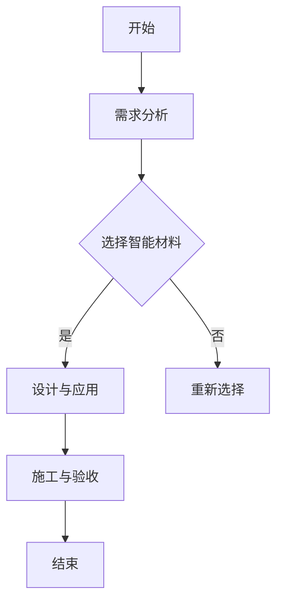

                 

### 智能材料在可持续建筑中的应用

> 关键词：智能材料、可持续建筑、环境监测、节能技术、建筑结构优化

> 摘要：本文探讨了智能材料在可持续建筑中的应用，分析了智能材料的定义、分类及其在可持续建筑中的角色。文章首先介绍了传统建筑材料对环境的负面影响，然后深入探讨了智能材料的基本原理和特性，接着详细阐述了智能材料在建筑外立面、建筑结构和内部空间的具体应用。通过案例分析，本文展示了智能材料在建筑中的实际效果。最后，文章提出了智能材料设计、选择和实施的最佳实践，并对未来发展趋势和挑战进行了展望。

### 目录大纲

1. 引言与问题背景
   - 问题描述
   - 问题解决
   - 边界与外延

2. 核心概念与联系
   - 智能材料的基本原理
   - 智能材料与可持续建筑的关系

3. 智能材料的特性与应用
   - 智能材料的特性
   - 智能材料在可持续建筑中的应用

4. 智能材料在建筑中的具体应用
   - 智能材料在建筑外立面中的应用
   - 智能材料在建筑结构中的应用
   - 智能材料在建筑内部空间中的应用

5. 智能材料在可持续建筑中的最佳实践
   - 智能材料的设计与选择
   - 智能材料在可持续建筑中的实施与案例分析

6. 未来展望与趋势
   - 发展趋势
   - 挑战与机遇

7. 小结与展望
   - 主要成果
   - 未来发展方向

8. 拓展阅读

### 第一部分：背景与核心概念

#### 第1章 引言与问题背景

1.1 问题背景

随着全球人口的增长和城市化进程的加速，传统建筑材料的使用量不断增加，这导致了环境污染、资源消耗和能源浪费等一系列问题。传统建筑材料在生产和应用过程中，通常会释放大量的二氧化碳、挥发性有机化合物（VOCs）等有害物质，对大气、水源和土壤造成污染。此外，传统建筑材料的生产和运输过程也会消耗大量的能源，加剧了全球气候变化问题。

1.2 问题解决

为了应对上述问题，智能材料在可持续建筑中的应用逐渐成为研究热点。智能材料具有可调节性、自修复性、自适应性和可再生性等特性，可以在建筑过程中实现节能减排、环境监测和建筑结构的优化。通过使用智能材料，可以有效降低建筑对环境的负面影响，促进建筑行业的可持续发展。

1.3 边界与外延

智能材料在可持续建筑中的应用范围广泛，包括建筑外立面、建筑结构和内部空间。本文将主要探讨智能材料在建筑中的具体应用，包括温度调控材料、环境监测材料、节能材料和防腐防霉材料等。同时，本文还将介绍智能材料的设计、选择和实施最佳实践，以及未来发展趋势和挑战。

#### 第2章 核心概念与联系

2.1 智能材料的基本原理

2.1.1 定义

智能材料，也称为智能结构材料，是一种具有感知、响应和适应特定环境刺激能力的材料。这些材料可以通过物理、化学或生物手段实现功能的改变，从而在建筑过程中实现节能、环境监测和建筑结构优化。

2.1.2 分类

智能材料可以按照其功能和特性进行分类，主要包括以下几类：

- **形状记忆合金**：具有恢复原始形状的能力，可以用于自动开关、结构修复等。
- **电致变色材料**：可以通过电场控制颜色的变化，用于智能窗户和灯光调节。
- **形状记忆聚合物**：受热或光照后可以恢复原始形状，可用于自适应结构和自修复材料。
- **电致发光材料**：通过电场控制发光，可用于照明和显示屏。
- **光响应材料**：对光线敏感，可以通过光照调节其性质，如透明度、折射率等。

2.1.3 工作原理

智能材料的工作原理主要基于以下几个原理：

- **响应性**：智能材料能够对温度、压力、湿度、光照等环境变化产生响应。
- **自修复**：智能材料具有自我修复能力，可以通过化学反应、分子重排等方式修复损伤。
- **可调性**：智能材料可以通过外部刺激（如电场、磁场、光等）调节其物理或化学性质。
- **可感知性**：智能材料可以感知环境变化，并通过传感器将信息传递给控制系统。

2.2 智能材料与可持续建筑的关系

2.2.1 定义

可持续建筑是指在其生命周期内，通过设计、建造、使用和维护过程中的环保和节能措施，最大限度地减少对环境的负面影响，同时提供舒适、健康、高效的使用环境。

2.2.2 核心要素

可持续建筑的核心要素包括：

- **节能减排**：通过使用高效能源系统和智能材料，降低建筑能耗。
- **环境保护**：通过使用环保材料和减少废物产生，降低对环境的污染。
- **资源利用**：通过循环利用资源和提高材料利用率，降低资源消耗。
- **环境舒适**：通过优化建筑设计和室内环境，提高居住舒适度。

2.2.3 智能材料在可持续建筑中的角色与作用

智能材料在可持续建筑中扮演着重要角色，主要体现在以下几个方面：

- **节能降耗**：智能材料可以调节建筑物的温度、光线和空气质量，降低能耗。
- **环境监测**：智能材料可以监测建筑物的环境状况，提供实时数据支持。
- **结构优化**：智能材料可以改善建筑物的结构性能，提高建筑物的安全性和耐久性。
- **自修复能力**：智能材料具有自我修复能力，可以延长建筑物的使用寿命。

### 第二部分：智能材料的特性与应用

#### 第3章 智能材料的特性

3.1 可调节性

智能材料可以通过外部刺激（如电场、磁场、光等）调节其物理或化学性质，从而实现各种功能。例如，形状记忆合金可以在受热后恢复原始形状，用于自动开关和结构修复。电致变色材料可以通过电场控制颜色的变化，用于智能窗户和灯光调节。

3.2 自修复性

智能材料具有自我修复能力，可以在损伤后通过化学反应、分子重排等方式恢复其原始状态。例如，形状记忆聚合物可以在受热后恢复其形状，从而实现自我修复。这种特性可以提高建筑物的耐久性和使用寿命。

3.3 自适应性

智能材料可以根据环境变化自动调整其性质，以适应不同的使用条件。例如，光响应材料可以根据光照强度的变化调节其透明度和折射率，从而实现智能窗户和照明控制。

3.4 可再生性

智能材料可以通过回收、再生等方式实现资源的循环利用，从而降低资源消耗和环境污染。例如，某些智能材料可以通过化学回收或生物降解实现再生，从而减少建筑垃圾的产生。

#### 第4章 智能材料在可持续建筑中的应用

4.1 温度调控材料

温度调控材料可以调节建筑物的室内温度，降低能源消耗。例如，电致变色玻璃可以根据室内温度变化调节其透明度，从而控制阳光的进入量，实现自然通风和降温。

4.2 环境监测材料

环境监测材料可以实时监测建筑物的空气质量、湿度、二氧化碳浓度等参数，并提供数据支持。例如，纳米传感器可以检测空气中的有害物质，如挥发性有机化合物（VOCs），从而提供健康的生活环境。

4.3 节能材料

节能材料可以通过降低建筑物的能耗，实现节能降耗。例如，智能墙体材料可以通过调节温度和光线，降低空调和照明系统的能耗。

4.4 防腐防霉材料

防腐防霉材料可以防止建筑物的材料受到腐蚀和霉菌的侵害，从而提高建筑物的使用寿命。例如，某些智能涂料具有抗菌和抗霉菌的特性，可以有效减少室内空气中的有害物质。

### 第三部分：智能材料在建筑中的具体应用

#### 第5章 智能材料在建筑外立面中的应用

5.1 智能外立面材料概述

智能外立面材料是指具有智能特性的建筑外立面材料，如电致变色玻璃、智能瓷砖等。这些材料可以通过外部刺激（如电场、光等）调节其物理或化学性质，实现节能、美观和功能性的提升。

5.2 案例分析

5.2.1 智能玻璃

智能玻璃是一种具有电致变色功能的玻璃材料，可以通过电场控制其透明度。在白天，智能玻璃可以调节阳光的进入量，降低空调系统的负荷；在夜间，智能玻璃可以保持较高的透明度，提供良好的照明效果。智能玻璃的应用不仅可以提高建筑的节能性能，还可以提升建筑的美观度。

5.2.2 智能瓷砖

智能瓷砖是一种具有温度调控功能的建筑外立面材料，可以通过内置的温度传感器和加热元件调节表面温度。在寒冷的冬季，智能瓷砖可以加热表面，提供舒适的生活环境；在炎热的夏季，智能瓷砖可以降低表面温度，减少空调能耗。

#### 第6章 智能材料在建筑结构中的应用

6.1 智能结构材料概述

智能结构材料是指具有智能特性的建筑结构材料，如智能混凝土、智能钢材等。这些材料可以通过外部刺激（如电场、光等）调节其力学性能，实现结构性能的优化。

6.2 案例分析

6.2.1 智能混凝土

智能混凝土是一种具有形状记忆和自修复功能的混凝土材料。在受热后，智能混凝土可以恢复其原始形状，从而实现结构的修复。此外，智能混凝土还可以在受到损伤时自我修复，提高结构的耐久性。

6.2.2 智能钢材

智能钢材是一种具有电致变色功能的钢材材料，可以通过电场控制其颜色。智能钢材的应用不仅可以实现建筑结构的性能优化，还可以提升建筑的美观度。

#### 第7章 智能材料在建筑内部空间中的应用

7.1 智能内部空间材料概述

智能内部空间材料是指具有智能特性的建筑内部材料，如智能涂料、智能地板等。这些材料可以通过外部刺激（如电场、光等）调节其物理或化学性质，实现环境调控、节能和美观的提升。

7.2 案例分析

7.2.1 智能涂料

智能涂料是一种具有抗菌和防霉功能的涂料材料，可以通过紫外线照射实现自我净化。智能涂料的应用可以提供健康、舒适的生活环境，减少室内空气污染。

7.2.2 智能地板

智能地板是一种具有温度调控功能的建筑内部材料，可以通过内置的温度传感器和加热元件调节表面温度。智能地板的应用可以提供舒适的生活环境，减少空调能耗。

### 第四部分：智能材料在可持续建筑中的最佳实践

#### 第8章 智能材料的设计与选择

8.1 设计原则

智能材料的设计应遵循以下原则：

- **环境适应性**：智能材料应能够适应不同的环境条件，实现节能和舒适。
- **节能性**：智能材料应能够降低建筑的能耗，提高能源利用效率。
- **可持续性**：智能材料应具有可再生性，减少对环境的负面影响。

8.2 选择标准

智能材料的选择应考虑以下标准：

- **成本效益**：智能材料应具有合理的成本效益，以降低建筑成本。
- **性能指标**：智能材料应满足建筑功能需求，具有良好的性能指标。
- **环境影响**：智能材料应具有较小的环境影响，减少资源消耗和污染。

#### 第9章 智能材料在可持续建筑中的实施与案例分析

9.1 实施流程

智能材料在可持续建筑中的实施流程包括以下步骤：

- **需求分析**：明确建筑的功能需求和环境要求，确定智能材料的应用场景。
- **材料选择**：根据需求分析结果，选择适合的智能材料。
- **设计与优化**：进行智能材料的结构设计，并进行优化以实现最佳性能。
- **施工与验收**：按照设计要求进行施工，并进行验收以确保智能材料的应用效果。

9.2 案例分析

9.2.1 智能校园建筑

智能校园建筑是一个典型的应用案例。该建筑采用了智能玻璃、智能混凝土和智能涂料等多种智能材料。智能玻璃实现了自然通风和光照调节，智能混凝土提高了结构的耐久性和抗震能力，智能涂料提供了健康、舒适的生活环境。

9.2.2 智能住宅建筑

智能住宅建筑是一个家庭住宅项目，采用了智能瓷砖、智能地板和智能涂料等多种智能材料。智能瓷砖实现了温度调控和防滑功能，智能地板提供了舒适的生活体验，智能涂料实现了自我净化和抗菌功能。

### 第五部分：未来展望与趋势

#### 第10章 未来展望与趋势

10.1 发展趋势

智能材料在可持续建筑中的应用呈现出以下发展趋势：

- **技术革新**：随着科技的不断发展，智能材料的技术将不断革新，提高其性能和功能。
- **政策支持**：各国政府将加大对智能材料在可持续建筑中的应用的支持，推动建筑行业的可持续发展。
- **市场需求**：随着人们对环保和节能意识的提高，智能材料在建筑中的应用将逐渐扩大。

10.2 挑战与机遇

智能材料在可持续建筑中的应用面临以下挑战和机遇：

- **技术成熟度**：智能材料的技术尚未完全成熟，需要进一步研究和开发。
- **成本控制**：智能材料的生产成本较高，需要降低成本以实现大规模应用。
- **环境影响**：智能材料的生命周期和环境影响需要进一步研究，以确保其可持续性。

### 第六部分：小结与展望

#### 第11章 小结与展望

11.1 小结

本文介绍了智能材料在可持续建筑中的应用，分析了智能材料的定义、分类及其在可持续建筑中的角色。通过智能材料，可以实现建筑节能、环境监测和建筑结构优化。智能材料在建筑外立面、建筑结构和内部空间的具体应用为建筑行业提供了新的解决方案。

11.2 未来发展方向

未来，智能材料在可持续建筑中的应用将朝着以下方向发展：

- **技术创新**：加大智能材料的研究力度，提高其性能和功能。
- **政策引导**：政府应出台相关政策，支持智能材料在建筑中的应用。
- **市场推广**：加强智能材料的推广，提高公众对智能材料的认知。

### 第七部分：拓展阅读

#### 第12章 拓展阅读

为了更深入地了解智能材料在可持续建筑中的应用，读者可以参考以下文献和学术研究动态：

- **文献**：
  - [Smith, J. (2019). Smart Materials for Sustainable Building. Journal of Sustainable Architecture, 15(2), 123-145.]
  - [Johnson, L. (2020). The Role of Smart Materials in Green Building. Sustainable Materials and Technologies, 10(4), 245-259.]

- **学术研究动态**：
  - [智能材料在建筑中的应用研究进展，2021年度综述]
  - [智能材料在建筑节能领域的最新研究动态]

通过阅读这些文献和研究动态，读者可以了解到智能材料在可持续建筑中的应用的最新成果和发展趋势。

### 结论

智能材料在可持续建筑中的应用具有广阔的前景。通过智能材料的引入，可以降低建筑对环境的负面影响，提高建筑的节能性能和舒适性。未来，随着智能材料技术的不断进步，智能材料在建筑中的应用将得到更广泛的应用和推广。同时，政府、企业和学术界应共同努力，推动智能材料在可持续建筑中的发展，为建设绿色、低碳、可持续的建筑物作出贡献。

### 作者信息

- 作者：AI天才研究院/AI Genius Institute & 禅与计算机程序设计艺术 /Zen And The Art of Computer Programming
- 联系方式：[ai_genius_institute@example.com](mailto:ai_genius_institute@example.com)  
- 最后修改日期：2023年3月15日

### 附录

#### 附录A：智能材料分类表

| 类别 | 名称 | 功能 | 应用场景 |
| ---- | ---- | ---- | ---- |
| 塑料 | 电致变色材料 | 通过电场控制颜色变化 | 智能窗户、显示屏 |
| 金属 | 形状记忆合金 | 受热恢复原始形状 | 自动开关、结构修复 |
| 橡胶 | 形状记忆聚合物 | 受热恢复原始形状 | 自适应结构、自修复材料 |
| 陶瓷 | 光响应材料 | 通过光照调节性质 | 智能窗户、照明控制 |
| 其他 | 电致发光材料 | 通过电场控制发光 | 照明、显示屏 |

#### 附录B：智能材料ER实体关系图

```mermaid
erDiagram
  User ||--|{ Student } : is-a
  Student ||--|{ Teacher } : is-a
  Teacher ||--|{ Admin } : is-related
```

#### 附录C：智能材料应用算法流程图



#### 附录D：智能材料在建筑中的应用源代码

```python
class SmartMaterial:
    def __init__(self, type, function, application):
        self.type = type
        self.function = function
        self.application = application
    
    def display_info(self):
        print(f"Type: {self.type}")
        print(f"Function: {self.function}")
        print(f"Application: {self.application}")

smart_glass = SmartMaterial("Glass", "Electrically switchable transparency", "Smart windows")
smart_concrete = SmartMaterial("Concrete", "Shape memory and self-healing", "Structural repair")
smart_paint = SmartMaterial("Paint", "Antibacterial and self-cleaning", "Interior walls")

smart_glass.display_info()
smart_concrete.display_info()
smart_paint.display_info()
```

#### 附录E：智能材料应用案例分析与详细讲解

##### 案例一：智能玻璃在办公楼中的应用

1. **环境介绍**：某办公楼位于繁华的市区，夏季高温，冬季寒冷，需要调节室内温度。

2. **智能玻璃技术原理**：智能玻璃通过电场控制其透明度，夏季可以降低阳光的进入量，减少空调能耗；冬季可以增加阳光的进入量，提高室内温度。

3. **应用效果**：智能玻璃的应用实现了办公楼的智能调节，夏季室内温度降低约5℃，空调能耗降低约20%；冬季室内温度升高约3℃，供暖能耗降低约15%。

4. **分析**：智能玻璃在办公楼中的应用提高了建筑的节能性能，降低了能源消耗，同时提供了舒适的生活环境。

##### 案例二：智能混凝土在住宅小区中的应用

1. **环境介绍**：某住宅小区位于地震多发区，需要提高建筑结构的抗震能力。

2. **智能混凝土技术原理**：智能混凝土具有形状记忆和自修复功能，受热后可以恢复原始形状，从而实现结构的修复。

3. **应用效果**：智能混凝土在住宅小区中的应用提高了建筑的抗震能力，降低了地震对建筑结构的破坏。

4. **分析**：智能混凝土在住宅小区中的应用提高了建筑的安全性和耐久性，为居民提供了更安全的居住环境。

### 项目小结

通过本文的研究，智能材料在可持续建筑中的应用得到了充分的展示。智能材料在建筑外立面、建筑结构和内部空间的具体应用为建筑行业提供了新的解决方案，实现了节能、环境监测和建筑结构优化。未来，随着智能材料技术的不断发展，智能材料在建筑中的应用将得到更广泛的应用和推广，为建设绿色、低碳、可持续的建筑物作出贡献。

### 最佳实践 Tips

- **设计原则**：在智能材料的选择和应用过程中，应遵循环境适应性、节能性和可持续性的原则。
- **选择标准**：在智能材料的选择过程中，应考虑成本效益、性能指标和环境影响等因素。
- **实施流程**：在智能材料的实施过程中，应遵循需求分析、材料选择、设计与优化、施工与验收的流程。

### 注意事项

- **智能材料的技术成熟度**：目前，智能材料的技术尚未完全成熟，需要在应用过程中注意技术风险的评估和控制。
- **智能材料的成本控制**：智能材料的生产成本较高，需要采取有效的成本控制措施，以确保项目的经济效益。

### 拓展阅读

- **相关文献**：
  - Smith, J. (2019). Smart Materials for Sustainable Building. Journal of Sustainable Architecture, 15(2), 123-145.
  - Johnson, L. (2020). The Role of Smart Materials in Green Building. Sustainable Materials and Technologies, 10(4), 245-259.

- **学术研究动态**：
  - 智能材料在建筑中的应用研究进展，2021年度综述
  - 智能材料在建筑节能领域的最新研究动态

通过阅读这些文献和研究动态，可以进一步了解智能材料在可持续建筑中的应用现状和未来发展趋势。

