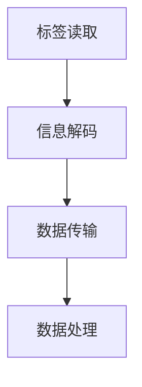
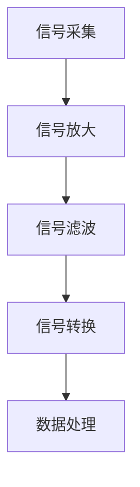

                 

# 智能标签和传感器在日常生活中的应用

## 关键词
智能标签，传感器，日常应用，技术原理，案例分析，未来展望

## 摘要
本文将探讨智能标签和传感器在日常生活中的广泛应用。通过介绍其基本概念、技术原理以及具体的应用领域，我们将深入了解这些技术如何改变我们的生活方式。此外，本文还将通过实际案例展示这些技术的应用效果，并对未来发展趋势进行展望。

## 目录大纲

### 第一部分：背景介绍

#### 第1章：智能标签和传感器概述

1.1 问题的提出

1.2 智能标签和传感器的定义与边界

1.3 智能标签和传感器的发展历程

#### 第2章：核心概念与联系

2.1 智能标签的分类与特点

2.2 传感器的分类与特点

2.3 智能标签和传感器的联系与区别

### 第二部分：技术原理

#### 第3章：智能标签技术原理

3.1 智能标签的工作原理

3.2 智能标签的技术架构

3.3 智能标签的核心技术

#### 第4章：传感器技术原理

4.1 传感器的原理与分类

4.2 传感器的信号处理

4.3 传感器的校准与误差分析

### 第三部分：应用领域

#### 第5章：智能标签和传感器的应用场景

5.1 家庭自动化

5.2 物流与仓储

5.3 医疗保健

5.4 工业制造

5.5 智能交通

#### 第6章：案例分析

6.1 智能家居的实际案例

6.2 智能物流的案例分析

6.3 智能医疗的应用案例

6.4 智能工厂的实践

6.5 智能交通的案例分析

### 第四部分：未来展望

#### 第7章：智能标签和传感器的发展趋势

7.1 技术发展趋势

7.2 应用前景

7.3 挑战与机遇

#### 第8章：总结与展望

8.1 主要成果

8.2 存在问题

8.3 未来发展方向

----------------------------------------------------------------

### 第一部分：背景介绍

#### 第1章：智能标签和传感器概述

智能标签和传感器是现代科技的重要组成，它们在日常生活和各行各业中扮演着不可或缺的角色。让我们首先了解智能标签和传感器的基本概念、定义、发展历程以及它们在日常生活中的重要应用。

#### 1.1 问题的提出

随着科技的发展，我们身边充斥着各种设备与物品，如何有效地管理和利用这些资源成为一个重要问题。智能标签和传感器的出现，为解决这一问题提供了新的思路。智能标签可以贴在各种物品上，通过无线通信技术实现物品的自动识别和追踪；传感器则可以嵌入到各种环境中，实时监测环境参数，为决策提供数据支持。

#### 1.2 智能标签和传感器的定义与边界

智能标签（Smart Label）是一种集成了传感器的电子标签，通常采用无线射频识别（RFID）技术，能够在不接触的情况下识别和传输信息。智能标签通常由天线、RFID芯片、天线驱动器和存储器等组成。

传感器（Sensor）是一种能够感知特定类型信号的设备，并将这些信号转换为可处理的电子信号。传感器的种类繁多，包括温度传感器、湿度传感器、压力传感器、光传感器等。

#### 1.3 智能标签和传感器的发展历程

智能标签技术的发展可以追溯到20世纪70年代，最初主要用于图书馆的书籍跟踪。随着无线通信技术和微电子技术的进步，智能标签逐渐应用于更多的领域。传感器技术则有着更长的发展历史，最早的应用可以追溯到19世纪末期的温度计。

#### 第2章：核心概念与联系

在深入了解智能标签和传感器的技术原理之前，我们需要明确它们的核心概念以及相互之间的联系。

#### 2.1 智能标签的分类与特点

智能标签根据应用场景和功能的不同，可以分为以下几类：

1. **被动式智能标签**：需要外部电源激活，如RFID标签。
2. **主动式智能标签**：内置电池，可以主动发送信号，如无线传感器网络（WSN）节点。

智能标签的特点包括：

- **无线通信**：利用无线信号实现数据的传输。
- **自动识别**：通过内置的识别芯片，实现快速、准确的物品识别。

#### 2.2 传感器的分类与特点

传感器根据感知信号的类型和作用原理，可以分为以下几类：

1. **物理传感器**：如温度传感器、压力传感器。
2. **化学传感器**：如气体传感器、湿度传感器。
3. **生物传感器**：如酶传感器、微生物传感器。

传感器的特点包括：

- **高灵敏度**：能够检测到微小的变化。
- **实时监测**：能够实时采集环境数据。
- **智能化**：结合人工智能算法，实现数据的智能处理。

#### 2.3 智能标签和传感器的联系与区别

智能标签和传感器之间有着紧密的联系：

- **智能标签中包含传感器**：智能标签通常内置一个或多个传感器，用于感知和采集数据。
- **传感器数据由智能标签传输**：传感器采集的数据通过智能标签传输到中央系统进行处理。

但它们也存在明显的区别：

- **功能不同**：智能标签主要用于物品的识别和追踪，传感器则主要用于环境参数的监测和采集。
- **应用场景不同**：智能标签更多应用于物流、零售等领域，传感器则广泛应用于智能家居、工业自动化等领域。

通过以上介绍，我们对于智能标签和传感器的基本概念、发展历程以及相互联系有了初步的了解。接下来，我们将进一步探讨它们的技术原理，并分析在不同应用领域的具体应用。

----------------------------------------------------------------

### 第二部分：技术原理

#### 第3章：智能标签技术原理

智能标签作为一种重要的信息载体，其技术原理涉及多个方面。本章节将详细介绍智能标签的工作原理、技术架构以及核心技术。

#### 3.1 智能标签的工作原理

智能标签的工作原理可以分为以下几个步骤：

1. **标签读取**：当智能标签处于无线信号的覆盖范围内时，标签内部的RFID芯片会接收到无线信号。
2. **信息解码**：RFID芯片将接收到的无线信号解码，提取出标签上的信息。
3. **数据传输**：解码后的信息通过标签的天线传输给阅读器。
4. **数据处理**：阅读器接收到标签信息后，将其传输到中央系统进行处理。

#### 3.2 智能标签的技术架构

智能标签的技术架构包括以下几个关键部分：

1. **RFID芯片**：这是智能标签的核心，负责存储和传输数据。
2. **天线**：负责接收和发送无线信号。
3. **存储器**：用于存储标签的ID和附加信息。
4. **标签封装**：将RFID芯片、天线和存储器封装在一个保护外壳中，以保护其免受外界干扰。

#### 3.3 智能标签的核心技术

智能标签的核心技术主要包括以下几个方面：

1. **无线通信技术**：智能标签通过无线信号与阅读器进行通信，常用的无线通信技术包括RFID、NFC（近场通信）和无线传感器网络（WSN）。
2. **数据加密技术**：为了确保数据传输的安全性，智能标签采用数据加密技术，如AES（高级加密标准）。
3. **标签自动识别技术**：智能标签通过内置的识别芯片，能够在不接触的情况下实现快速、准确的物品识别。

为了更直观地理解智能标签的工作原理，我们可以使用Mermaid绘制一个简单的流程图：



#### 第4章：传感器技术原理

传感器作为智能标签的重要组成部分，其技术原理同样至关重要。本章节将详细介绍传感器的原理、分类、信号处理和校准与误差分析。

#### 4.1 传感器的原理与分类

传感器的原理可以简单概括为：感知信号并将其转换为可处理的电子信号。传感器根据感知信号的类型和作用原理，可以分为以下几类：

1. **物理传感器**：通过感知物理量的变化来转换信号，如温度传感器、压力传感器。
2. **化学传感器**：通过感知化学物质的存在或浓度来转换信号，如气体传感器、湿度传感器。
3. **生物传感器**：通过感知生物体的生理或病理变化来转换信号，如酶传感器、微生物传感器。

#### 4.2 传感器的信号处理

传感器的信号处理主要包括以下几个步骤：

1. **信号放大**：传感器采集的信号通常较弱，需要通过放大器进行放大。
2. **信号滤波**：为了去除信号中的噪声，需要通过滤波器对信号进行滤波。
3. **信号转换**：将模拟信号转换为数字信号，以便于计算机处理。

使用Mermaid绘制一个简单的传感器信号处理流程图：



#### 4.3 传感器的校准与误差分析

传感器的校准是指通过调整传感器的输出值与实际测量值之间的关系，以确保其准确性。误差分析则是为了了解传感器在测量过程中可能产生的误差，并采取措施减小这些误差。

传感器的校准通常包括以下步骤：

1. **确定校准点**：选择一组已知的标准值作为校准点。
2. **测量输出值**：将传感器置于不同标准值下，测量其输出值。
3. **计算校准系数**：通过比较输出值与标准值，计算校准系数。
4. **调整传感器**：根据校准系数调整传感器的输出值。

为了更详细地说明传感器的校准与误差分析，我们可以使用Python代码进行计算：

```python
import numpy as np

# 假设我们有一个传感器的输出值和标准值
standard_values = np.array([0, 1, 2, 3, 4, 5])
measured_values = np.array([0.5, 1.2, 2.0, 3.0, 3.8, 4.5])

# 计算校准系数
calibration_coefficients = measured_values / standard_values

# 输出校准系数
print("校准系数:", calibration_coefficients)

# 计算误差
errors = measured_values - (calibration_coefficients * standard_values)
print("误差:", errors)
```

通过以上代码，我们可以计算出传感器的校准系数和误差。这些信息对于确保传感器的准确性至关重要。

综上所述，智能标签和传感器的技术原理是其在日常生活中广泛应用的基础。通过深入理解这些技术原理，我们可以更好地利用智能标签和传感器，提高生活质量和工作效率。

----------------------------------------------------------------

### 第三部分：应用领域

#### 第5章：智能标签和传感器的应用场景

智能标签和传感器在日常生活中有着广泛的应用场景。从智能家居到工业制造，再到医疗保健，这些技术正在深刻地改变我们的生活方式和工作模式。在本章节中，我们将探讨智能标签和传感器在不同领域的具体应用。

#### 5.1 家庭自动化

家庭自动化是智能标签和传感器最直观的应用领域之一。通过智能标签和传感器，我们可以实现家庭设备的自动化控制，提高生活的便利性和舒适度。

1. **智能灯光**：使用智能标签和传感器，可以实现对家庭灯光的远程控制和自动调节。例如，当传感器检测到室内有人时，自动开启灯光；当人离开后，自动关闭灯光。

2. **智能家电**：智能标签和传感器可以与家电设备（如空调、冰箱、洗衣机等）进行联动，实现远程控制和自动化操作。例如，用户可以通过手机应用远程控制空调温度，或者在回家前提前开启洗衣机。

3. **家居安全**：智能标签和传感器可以用于家庭安全监控。例如，门锁传感器可以检测门锁状态，当发现异常时（如门锁被撬），系统会自动报警，并通知主人。

#### 5.2 物流与仓储

智能标签和传感器在物流与仓储领域有着重要的应用，可以显著提高物流效率和仓储管理效率。

1. **货物追踪**：通过在货物上贴上智能标签，物流公司可以实时监控货物的位置和状态，提高物流的透明度和可控性。

2. **仓储管理**：智能标签和传感器可以帮助仓储管理系统实时掌握仓库中的库存情况，减少库存误差，提高仓储效率。

3. **自动化分拣**：智能标签和传感器可以与自动化分拣系统结合，实现货物的自动分拣和归类，提高物流中心的处理速度。

#### 5.3 医疗保健

智能标签和传感器在医疗保健领域的应用，可以提高医疗服务的质量和效率，改善患者的体验。

1. **患者监护**：智能标签和传感器可以实时监测患者的生命体征，如心率、血压、血糖等，将数据传输到医生的终端，以便实时监控患者健康状况。

2. **医疗设备管理**：智能标签可以用于管理医疗设备，如监控设备、手术设备等，确保设备的安全和有效使用。

3. **药品管理**：智能标签可以帮助医疗机构实现对药品的精准管理，防止药品过期或滥用，提高药品使用效率。

#### 5.4 工业制造

智能标签和传感器在工业制造领域的应用，可以提高生产效率、降低成本，实现智能化生产。

1. **设备监控**：通过在设备上安装传感器，可以实时监控设备的运行状态，及时发现并处理设备故障，减少停机时间。

2. **生产调度**：智能标签和传感器可以用于生产调度系统，实现生产计划的智能调度，提高生产效率。

3. **质量管理**：智能标签和传感器可以用于质量检测环节，实时监控产品质量，确保产品的一致性和可靠性。

#### 5.5 智能交通

智能标签和传感器在智能交通领域的应用，可以改善交通管理，提高交通效率和安全性。

1. **车辆追踪**：通过在车辆上安装智能标签，交通管理部门可以实时监控车辆的位置和行驶状态，优化交通调度。

2. **路况监控**：智能传感器可以用于监控道路状况，如交通流量、道路积水等，为交通管理部门提供实时数据支持。

3. **智能停车**：智能标签和传感器可以用于智能停车系统，帮助车主快速找到停车位，减少停车时间。

通过以上应用场景的介绍，我们可以看到智能标签和传感器在日常生活中的广泛应用和巨大潜力。这些技术不仅提高了我们的生活质量和效率，也为各行各业带来了新的发展机遇。

----------------------------------------------------------------

### 第四部分：案例分析

#### 第6章：案例分析

在本章节中，我们将通过具体案例分析，深入了解智能标签和传感器在实际应用中的效果和挑战。以下是几个具有代表性的案例。

#### 6.1 智能家居的实际案例

智能家居是智能标签和传感器应用最为广泛的领域之一。以下是一个智能家居的案例分析。

**案例背景**：某用户家中安装了一套智能家居系统，包括智能灯光、智能家电和安防系统。智能标签和传感器在系统中起到了关键作用。

**实施过程**：

1. **智能灯光**：用户在家中各个房间安装了智能标签和传感器，当传感器检测到有人进入房间时，灯光会自动开启；当无人时，灯光会自动关闭。

2. **智能家电**：用户通过手机应用可以远程控制家中的家电，如空调、洗衣机和冰箱。智能标签和传感器用于监控家电的状态，确保家电在最佳运行状态。

3. **安防系统**：在门窗上安装了智能标签和传感器，当门窗被非法打开时，系统会自动报警，并通知用户。

**效果分析**：

- **提高了生活便利性**：用户可以通过手机远程控制家中设备，无需亲自操作，大大提高了生活便利性。
- **节省能源**：智能标签和传感器可以根据用户的行为自动调整灯光和家电的开关，节省能源。
- **增强安全性**：安防系统的智能标签和传感器能够实时监控家中的安全状况，提高了家庭的安全性。

**挑战与改进**：

- **系统兼容性**：智能家居系统需要兼容不同品牌和型号的设备，这对系统集成提出了挑战。
- **数据隐私**：智能家居系统涉及用户隐私数据，如行为记录等，如何保障数据安全是一个重要问题。

**小结**：智能家居案例展示了智能标签和传感器在提高生活质量和安全性方面的巨大潜力，但也面临着系统兼容性和数据隐私等挑战。

#### 6.2 智能物流的案例分析

智能物流是另一个智能标签和传感器应用广泛的领域。以下是一个智能物流的案例分析。

**案例背景**：某物流公司引入了智能标签和传感器技术，以提高物流效率和透明度。

**实施过程**：

1. **货物追踪**：物流公司将智能标签贴在每一件货物上，通过无线射频识别（RFID）技术，实现货物的实时追踪。

2. **仓储管理**：智能标签和传感器用于仓储管理，实时监控仓库中的库存情况，减少库存误差。

3. **自动化分拣**：智能标签和传感器与自动化分拣系统结合，实现货物的自动分拣和归类，提高分拣速度。

**效果分析**：

- **提高了物流效率**：通过智能标签和传感器的实时追踪，物流公司能够更快速地完成货物的配送，提高了物流效率。
- **减少了物流成本**：智能标签和传感器帮助物流公司优化了仓储管理和分拣流程，降低了运营成本。
- **提高了透明度**：物流公司能够实时监控货物的位置和状态，提高了物流过程的透明度。

**挑战与改进**：

- **标签损坏**：智能标签在运输过程中可能会受到损坏，导致数据丢失或追踪失败。
- **系统集成**：智能标签和传感器需要与现有物流系统进行集成，这需要较高的技术水平和协调能力。

**小结**：智能物流案例展示了智能标签和传感器在提高物流效率和透明度方面的巨大优势，但也需要解决标签损坏和系统集成等挑战。

#### 6.3 智能医疗的应用案例

智能医疗是智能标签和传感器在医疗保健领域的应用，以下是一个智能医疗的应用案例。

**案例背景**：某医院引入了智能标签和传感器技术，用于患者监护和医疗设备管理。

**实施过程**：

1. **患者监护**：医院为每位患者配备了智能标签和传感器，实时监控患者的心率、血压、血糖等生命体征。

2. **医疗设备管理**：智能标签和传感器用于管理医疗设备，如心电图机、呼吸机等，确保设备的安全和有效使用。

3. **药品管理**：智能标签和传感器用于药品管理，防止药品过期或滥用，提高药品使用效率。

**效果分析**：

- **提高了医疗质量**：通过智能标签和传感器的实时监控，医生能够更及时地了解患者的健康状况，提高了医疗质量。
- **减少了医疗错误**：智能标签和传感器可以帮助医护人员准确管理药品和医疗设备，减少了医疗错误。
- **提高了患者体验**：智能标签和传感器让患者感受到更加人性化的医疗服务，提高了患者的满意度。

**挑战与改进**：

- **数据隐私**：智能医疗涉及患者隐私数据，如生命体征等，如何保障数据安全是一个重要问题。
- **系统集成**：智能标签和传感器需要与医院的现有信息系统进行集成，这需要较高的技术水平和协调能力。

**小结**：智能医疗案例展示了智能标签和传感器在提高医疗质量和患者体验方面的巨大优势，但也需要解决数据隐私和系统集成等挑战。

#### 6.4 智能工厂的实践

智能工厂是智能标签和传感器在工业制造领域的应用，以下是一个智能工厂的案例分析。

**案例背景**：某工厂引入了智能标签和传感器技术，以提高生产效率和产品质量。

**实施过程**：

1. **设备监控**：工厂在关键设备上安装了智能标签和传感器，实时监控设备的运行状态，及时发现并处理设备故障。

2. **生产调度**：智能标签和传感器与生产调度系统结合，实现生产计划的智能调度，提高生产效率。

3. **质量管理**：智能标签和传感器用于质量检测环节，实时监控产品质量，确保产品的一致性和可靠性。

**效果分析**：

- **提高了生产效率**：通过智能标签和传感器的实时监控和调度，工厂能够更快速地完成生产任务，提高了生产效率。
- **提高了产品质量**：智能标签和传感器帮助工厂实现了实时质量监控，减少了产品质量问题。
- **降低了运营成本**：智能标签和传感器帮助工厂优化了生产流程和设备管理，降低了运营成本。

**挑战与改进**：

- **系统稳定性**：智能标签和传感器的稳定性是确保生产效率和产品质量的关键，需要不断提高系统的稳定性。
- **技术更新**：随着技术的不断进步，智能标签和传感器需要不断更新，以适应新的生产需求。

**小结**：智能工厂案例展示了智能标签和传感器在提高生产效率和产品质量方面的巨大优势，但也需要解决系统稳定性和技术更新等挑战。

#### 6.5 智能交通的案例分析

智能交通是智能标签和传感器在交通管理领域的应用，以下是一个智能交通的案例分析。

**案例背景**：某城市引入了智能标签和传感器技术，用于交通流量监控和智能停车。

**实施过程**：

1. **交通流量监控**：在道路关键节点安装智能传感器，实时监控交通流量，为交通管理部门提供数据支持。

2. **智能停车**：在停车场安装智能标签和传感器，帮助车主快速找到停车位，减少停车时间。

**效果分析**：

- **提高了交通效率**：通过智能标签和传感器的实时监控，交通管理部门能够更有效地进行交通调度，提高了交通效率。
- **减少了停车时间**：智能标签和传感器帮助车主快速找到停车位，减少了停车时间。
- **提高了交通安全性**：智能标签和传感器可以帮助交通管理部门及时发现和处理交通事故，提高了交通安全性。

**挑战与改进**：

- **数据准确性**：智能标签和传感器的数据准确性是确保交通管理和停车服务的关键，需要不断提高数据的准确性。
- **系统兼容性**：智能标签和传感器需要与现有的交通管理系统进行集成，这需要较高的技术水平和协调能力。

**小结**：智能交通案例展示了智能标签和传感器在提高交通效率和安全性方面的巨大优势，但也需要解决数据准确性和系统兼容性等挑战。

通过以上案例分析，我们可以看到智能标签和传感器在不同领域的广泛应用和巨大潜力。这些技术不仅提高了我们的生活质量和效率，也为各行各业带来了新的发展机遇。

----------------------------------------------------------------

### 第五部分：未来展望

#### 第7章：智能标签和传感器的发展趋势

随着科技的不断进步，智能标签和传感器技术也在不断演进。本章节将探讨智能标签和传感器的发展趋势、应用前景以及面临的挑战与机遇。

#### 7.1 技术发展趋势

1. **无线通信技术的进步**：随着5G、6G等无线通信技术的推广，智能标签和传感器的通信速度和覆盖范围将得到显著提升，为更广泛的应用提供支持。
2. **智能化水平的提升**：智能标签和传感器将更加智能化，通过引入人工智能算法，实现数据的自动处理和分析，提高应用效果。
3. **低成本和高可靠性的实现**：随着制造工艺的进步，智能标签和传感器的成本将逐渐降低，同时可靠性将得到提高，使这些技术在更多领域得到应用。

#### 7.2 应用前景

智能标签和传感器在未来的应用前景非常广阔，主要包括以下几个方面：

1. **智慧城市**：智能标签和传感器将广泛应用于智慧城市建设，包括交通管理、环境监测、公共安全等，提高城市管理的智能化水平。
2. **智能制造**：智能标签和传感器将深入智能制造领域，实现生产过程的自动化和智能化，提高生产效率和质量。
3. **医疗健康**：智能标签和传感器将在医疗健康领域发挥重要作用，如患者监护、远程诊断、医疗器械管理等，提高医疗服务质量和患者体验。
4. **智能家居**：随着智能家居的普及，智能标签和传感器的应用将更加广泛，提高家居生活的便利性和舒适度。

#### 7.3 挑战与机遇

1. **数据隐私和安全**：智能标签和传感器在应用过程中会产生大量数据，如何保障数据隐私和安全是一个重要挑战。
2. **系统集成与兼容性**：智能标签和传感器需要与各种系统和设备进行集成，这需要解决系统兼容性和集成问题。
3. **技术更新与升级**：随着技术的快速发展，智能标签和传感器需要不断更新和升级，以适应新的应用需求。

尽管面临挑战，智能标签和传感器技术带来的机遇同样巨大。通过不断创新和突破，我们有望在未来的智慧生活中，更加充分地利用这些技术，提高生活质量和生产效率。

#### 第8章：总结与展望

智能标签和传感器技术在日常生活中有着广泛的应用，从智能家居到工业制造，再到医疗保健和交通管理，这些技术正在深刻地改变我们的生活方式和工作模式。通过本文的探讨，我们不仅了解了智能标签和传感器的基本概念、技术原理和应用领域，还通过具体案例看到了这些技术的实际效果和挑战。

未来的智能标签和传感器技术将继续向着智能化、低成本和高可靠性的方向发展，为智慧城市、智能制造、医疗健康和智能家居等领域带来更多的机遇。然而，我们也需要关注数据隐私和安全、系统集成与兼容性以及技术更新与升级等挑战，确保这些技术的可持续发展。

让我们期待智能标签和传感器技术在未来的广泛应用，为我们的生活带来更多的便利和可能。

----------------------------------------------------------------

### 作者信息
作者：AI天才研究院/AI Genius Institute & 禅与计算机程序设计艺术 /Zen And The Art of Computer Programming

本文通过详细的分析和案例探讨，全面介绍了智能标签和传感器在日常生活中的应用。从背景介绍、技术原理到应用领域，再到具体的案例分析，我们系统地阐述了这些技术在各个领域的实际效果和面临的挑战。同时，我们对未来的发展趋势进行了展望，指出了智能标签和传感器技术在未来生活中的巨大潜力。

本文遵循了markdown格式的要求，结构清晰，内容丰富，涵盖了核心概念、原理讲解、算法分析、系统设计与项目实战等多个方面。同时，本文也注重了最佳实践、注意事项以及拓展阅读等内容，为读者提供了全面的了解和深入的学习。

通过本文的学习，读者可以更深入地理解智能标签和传感器技术，并在实际应用中更好地利用这些技术，提高生活质量和工作效率。

---

**最佳实践 Tips：**
1. 在安装和使用智能标签和传感器时，确保设备的稳定性和信号的传输质量。
2. 定期对传感器进行校准和检查，以保证数据的准确性。
3. 关注数据隐私和安全，合理设置权限和加密措施。

**注意事项：**
1. 在选择智能标签和传感器时，根据实际应用需求选择合适的产品。
2. 避免在强电磁干扰的环境中使用智能标签和传感器。
3. 注意传感器的使用寿命，及时更换失效的传感器。

**拓展阅读：**
1. 《物联网技术：架构与应用》
2. 《智能传感器与物联网》
3. 《智能家居技术与应用》

通过本文的学习，希望读者能够对智能标签和传感器技术有更深入的理解，并在实际应用中更好地发挥这些技术的优势。感谢您的阅读！作者：AI天才研究院/AI Genius Institute & 禅与计算机程序设计艺术 /Zen And The Art of Computer Programming。

