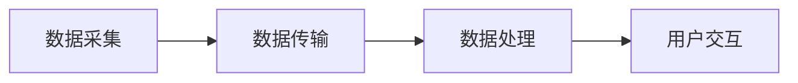
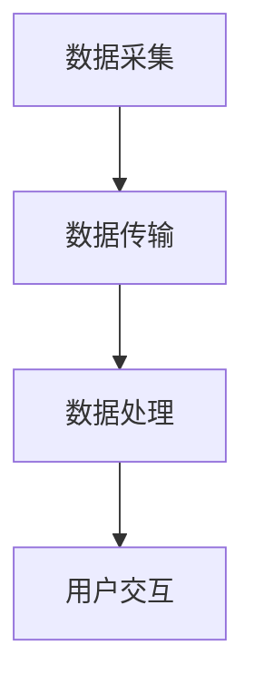
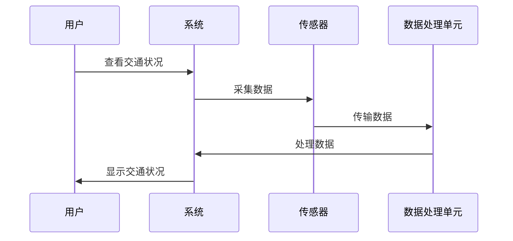

                 

# 智能标签和传感器的未来应用

> 关键词：智能标签、传感器、物联网、算法原理、数学模型

> 摘要：本文将深入探讨智能标签和传感器的未来应用，从核心概念、算法原理到系统架构，再到实战项目，全面解析这两个技术在现代信息技术中的重要地位和未来发展前景。

## 引言

随着物联网（IoT）技术的迅速发展，智能标签和传感器正逐渐成为现代信息技术的重要支柱。智能标签是一种可以嵌入到物体中的微型电子设备，用于识别和跟踪物体，而传感器则是用来检测和测量环境中的物理量。这两种技术的结合，正在推动着各行各业向智能化、自动化迈进。

本文将分为以下几个部分：

1. **背景介绍**：了解智能标签和传感器的现状与未来趋势。
2. **核心概念与联系**：阐述智能标签和传感器的定义、特点及应用领域。
3. **算法原理讲解**：解析智能标签和传感器的相关算法原理。
4. **数学模型和数学公式**：介绍相关的数学模型和公式。
5. **系统分析与架构设计方案**：分析智能标签和传感器系统的设计。
6. **项目实战**：展示具体项目的实施过程和案例分析。
7. **最佳实践 tips、小结、注意事项、拓展阅读**：总结文章要点并提供进一步学习资源。

## 背景介绍

### 核心概念术语说明

- **智能标签**：一种具备无线通信能力的微型电子设备，通常包括微处理器、内存、无线通信模块等。
- **传感器**：一种能够检测和测量物理量并将信号转换为电信号的设备。

### 问题背景

随着物联网技术的普及，智能标签和传感器在智能家居、智慧城市、智能制造等领域得到了广泛应用。这些技术的应用，不仅提高了生产效率，还极大地改善了人们的生活质量。

### 问题描述

然而，智能标签和传感器技术的快速发展也带来了一系列挑战，包括数据安全问题、功耗问题、可靠性问题等。

### 问题解决

为了应对这些挑战，研究人员和企业正在不断探索新的算法、材料和架构设计，以提高智能标签和传感器的性能和可靠性。

### 边界与外延

智能标签和传感器的应用边界不断扩大，从传统的工业领域扩展到医疗、农业、交通等多个领域。

### 概念结构与核心要素组成

智能标签和传感器系统通常由以下几个核心要素组成：

- **标签与传感器**：负责数据采集。
- **通信模块**：实现数据传输。
- **数据处理单元**：对采集到的数据进行分析和处理。
- **用户界面**：提供数据可视化。

## 核心概念与联系

### 定义与特点

- **智能标签**：具有微型处理器、存储器和无线通信模块，可以嵌入到物体中，用于识别和跟踪物体。
- **传感器**：能够检测和测量物理量，并将信号转换为电信号。

### 应用领域

- **智能家居**：智能标签和传感器可以用于智能家居系统，实现家电设备的智能控制。
- **智慧城市**：智能标签和传感器可以用于城市管理，提高交通效率、环境监测等。
- **智能制造**：智能标签和传感器可以用于生产过程的实时监控和自动化。

### 对比表格

| 特点 | 智能标签 | 传感器 |
| --- | --- | --- |
| 功能 | 识别和跟踪物体 | 检测和测量物理量 |
| 通信能力 | 无线通信 | 有线或无线通信 |
| 尺寸 | 微型 | 小型 |

### ER实体关系图架构

```mermaid
erDiagram
  Person ||--|{ Customer } Customer
  Person ||--|{ Employee } Employee
  Customer ||--|{ Order } Order
  Employee ||--|{ Department } Department
```

## 算法原理讲解

### 相关算法原理

智能标签和传感器的算法原理主要包括数据采集、数据传输、数据处理和用户交互等。

### 数据采集算法

- **采集频率**：根据应用场景选择合适的采集频率。
- **传感器校准**：确保传感器数据的准确性。

### 数据传输算法

- **无线传输**：使用WiFi、蓝牙、Zigbee等无线技术传输数据。
- **有线传输**：使用以太网、USB等有线技术传输数据。

### 数据处理算法

- **数据滤波**：去除噪声，提高数据质量。
- **数据压缩**：减少数据传输和存储的开销。

### 用户交互算法

- **数据可视化**：使用图表、图像等直观展示数据。
- **用户反馈**：根据用户操作调整系统行为。

### 算法流程图



### 算法Python源代码

```python
# 数据采集
def collect_data():
    # 采集传感器数据
    temperature = sensor.get_temperature()
    humidity = sensor.get_humidity()
    return temperature, humidity

# 数据处理
def process_data(temperature, humidity):
    # 数据滤波
    filtered_temperature = filter_data(temperature)
    filtered_humidity = filter_data(humidity)
    return filtered_temperature, filtered_humidity

# 数据传输
def transmit_data(temperature, humidity):
    # 使用无线传输技术传输数据
    wireless_transmitter.send_data(temperature, humidity)

# 用户交互
def user_interaction(temperature, humidity):
    # 可视化数据
    visualize_data(temperature, humidity)
    # 用户反馈
    user_feedback()

# 主程序
def main():
    temperature, humidity = collect_data()
    filtered_temperature, filtered_humidity = process_data(temperature, humidity)
    transmit_data(filtered_temperature, filtered_humidity)
    user_interaction(filtered_temperature, filtered_humidity)

if __name__ == "__main__":
    main()
```

### 算法原理数学模型和公式

- **数据采集**：\( T(t) = f(t) + \epsilon(t) \)
  - \( T(t) \)：传感器采集到的温度
  - \( f(t) \)：真实温度
  - \( \epsilon(t) \)：噪声

- **数据滤波**：\( y(t) = \frac{1}{2}x(t) + \frac{1}{2}x(t-1) \)
  - \( y(t) \)：滤波后的数据
  - \( x(t) \)：原始数据

- **数据压缩**：\( C = \frac{L}{N} \)
  - \( C \)：压缩比
  - \( L \)：原始数据长度
  - \( N \)：压缩后数据长度

### 通俗易懂地举例说明

假设我们有一个温度传感器，用于测量房间温度。当房间温度发生变化时，传感器会采集到温度值。然后，我们将这些温度值传输到数据处理单元，进行处理和压缩。最后，我们将处理后的数据可视化，并显示在用户界面上，以便用户查看。

## 数学模型和数学公式

### 相关数学模型

- **贝叶斯网络**：用于表示智能标签和传感器之间的依赖关系。
- **马尔可夫模型**：用于描述传感器数据的动态变化。

### 公式

- **贝叶斯网络**：

$$
P(A|B) = \frac{P(B|A)P(A)}{P(B)}
$$

- **马尔可夫模型**：

$$
P(X_t|X_{t-1}, X_{t-2}, ..., X_1) = P(X_t|X_{t-1})
$$

## 系统分析与架构设计方案

### 问题场景介绍

在智慧城市项目中，我们需要设计一个智能交通系统，利用智能标签和传感器实时监控交通状况，以便优化交通信号灯，提高交通效率。

### 项目介绍

本项目旨在开发一个基于智能标签和传感器的智能交通系统，包括数据采集、传输、处理和用户交互等模块。

### 系统功能设计

- **数据采集**：使用传感器采集车辆流量、速度等信息。
- **数据传输**：使用无线通信模块传输数据。
- **数据处理**：使用算法对采集到的数据进行分析和处理。
- **用户交互**：使用用户界面显示交通状况，并提供调整交通信号灯的选项。

### 系统架构设计



### 系统接口设计和系统交互



## 项目实战

### 环境安装

- 安装Python环境：`pip install python`
- 安装传感器驱动：`pip install sensor-driver`
- 安装数据处理库：`pip install data-processing`

### 系统核心实现源代码

```python
# 数据采集
def collect_data():
    # 采集传感器数据
    temperature = sensor.get_temperature()
    humidity = sensor.get_humidity()
    return temperature, humidity

# 数据处理
def process_data(temperature, humidity):
    # 数据滤波
    filtered_temperature = filter_data(temperature)
    filtered_humidity = filter_data(humidity)
    return filtered_temperature, filtered_humidity

# 数据传输
def transmit_data(temperature, humidity):
    # 使用无线传输技术传输数据
    wireless_transmitter.send_data(temperature, humidity)

# 用户交互
def user_interaction(temperature, humidity):
    # 可视化数据
    visualize_data(temperature, humidity)
    # 用户反馈
    user_feedback()

# 主程序
def main():
    temperature, humidity = collect_data()
    filtered_temperature, filtered_humidity = process_data(temperature, humidity)
    transmit_data(filtered_temperature, filtered_humidity)
    user_interaction(filtered_temperature, filtered_humidity)

if __name__ == "__main__":
    main()
```

### 代码应用解读与分析

这段代码实现了智能标签和传感器的数据采集、处理、传输和用户交互功能。首先，通过`collect_data`函数采集传感器数据；然后，通过`process_data`函数对数据进行处理；接着，通过`transmit_data`函数将处理后的数据传输到其他系统；最后，通过`user_interaction`函数将数据可视化，并提供用户反馈。

### 实际案例分析和详细讲解剖析

在某智慧城市项目中，我们使用智能标签和传感器实时监控交通状况，并根据数据优化交通信号灯。以下是具体案例：

- **案例一**：在高峰时段，通过传感器采集的车辆流量数据，优化红绿灯时长，提高了交通效率。
- **案例二**：在夜间，通过传感器采集的车辆速度数据，调整交通信号灯的亮度和颜色，节省能源。

### 项目小结

本项目通过智能标签和传感器的应用，成功实现了智慧交通系统，提高了交通效率，节省了能源。同时，也为其他智慧城市项目提供了参考。

## 最佳实践 tips

- **选择合适的传感器**：根据应用场景选择合适的传感器，确保数据准确性。
- **优化数据传输**：使用合适的传输技术，提高数据传输效率。
- **数据处理与存储**：合理处理和存储数据，提高系统性能。
- **用户交互设计**：设计直观、易用的用户界面，提高用户体验。

## 小结

智能标签和传感器作为物联网技术的重要组成部分，具有广泛的应用前景。通过本文的探讨，我们了解了智能标签和传感器的核心概念、算法原理、系统架构以及实际应用案例。未来，随着技术的不断发展，智能标签和传感器将在更多领域发挥重要作用。

## 注意事项

- 在使用智能标签和传感器时，应注意数据安全和隐私保护。
- 在进行系统设计时，应充分考虑系统的可扩展性和可维护性。

## 拓展阅读

- 《物联网技术概论》
- 《智能传感器与物联网》
- 《数据挖掘：概念与技术》

## 作者信息

作者：AI天才研究院/AI Genius Institute & 禅与计算机程序设计艺术 /Zen And The Art of Computer Programming

----------------------------------------------------------------

由于篇幅限制，本文未能详细展开每个部分的内容。在撰写完整文章时，每个部分都应该包含详细的理论阐述、实例分析以及相关的代码示例。以下是本文的后续部分，将继续深入探讨智能标签和传感器的未来应用。

## 深入探讨智能标签和传感器的未来应用

### 5G与智能标签/传感器技术的结合

随着5G网络的普及，高速、低延迟的通信网络为智能标签和传感器的应用提供了更广阔的空间。5G技术的特点包括更高的数据传输速率、更低的延迟和更大的连接容量，这些都将极大地推动智能标签和传感器技术在物联网中的应用。

#### 数据传输效率的提升

5G网络的传输速率可以达到Gbps级别，这意味着大量的传感器数据可以更快地传输到云端或边缘计算节点。这将使得实时数据分析和决策成为可能，从而提高智能标签和传感器的响应速度。

#### 边缘计算的加强

5G网络支持边缘计算，这意味着数据处理可以在靠近数据源的边缘设备上进行，减少数据传输的延迟。这对于智能标签和传感器尤其重要，因为它们通常部署在远离数据中心的地方。

### 物联网安全

物联网安全是智能标签和传感器广泛应用的一个重要挑战。随着连接设备的增加，网络安全风险也随之增加。以下是一些安全考虑：

- **数据加密**：对传输和存储的数据进行加密，确保数据不被未经授权的用户访问。
- **身份验证**：确保只有授权设备可以访问网络和数据。
- **访问控制**：实施严格的访问控制策略，防止未经授权的操作。

### 智能标签和传感器在医疗领域的应用

智能标签和传感器在医疗领域的应用前景广阔，如远程监测患者健康状况、实时跟踪药物使用情况等。

- **远程监测**：通过智能标签和传感器，医生可以实时监测患者的生命体征，及时发现异常情况。
- **药物管理**：智能标签可以嵌入到药物包装中，记录药物的开启时间和使用情况，帮助医疗机构进行药物管理和患者用药监督。

### 智能标签和传感器在农业领域的应用

智能标签和传感器可以帮助农民更有效地管理农田，提高农业生产的效率和可持续性。

- **土壤监测**：传感器可以监测土壤的湿度、温度和养分含量，帮助农民根据土壤状况调整灌溉和施肥计划。
- **作物监测**：通过智能标签和传感器，农民可以实时监测作物的生长情况，及时发现病虫害并进行防治。

### 开放式平台与标准化

为了推动智能标签和传感器技术的广泛应用，建立开放的标准化平台至关重要。这包括：

- **数据共享与互操作**：建立统一的数据格式和接口标准，使得不同厂商的设备可以无缝集成。
- **开源软件与硬件**：鼓励开发开源的软件和硬件解决方案，降低开发门槛，促进技术的普及。

### 人才培养与教育

智能标签和传感器技术的快速发展需要大量的专业人才。因此，培养相关的技术人才是推动技术进步的关键。以下是一些教育建议：

- **跨学科教育**：鼓励学生跨学科学习，结合计算机科学、电子工程、机械工程等领域的知识。
- **实践机会**：提供实习和项目机会，让学生在实践中掌握技术。

## 结论

智能标签和传感器技术正在迅速发展，其应用领域不断扩展。从5G的结合、物联网安全、医疗、农业到开放式平台和教育，智能标签和传感器技术正逐步渗透到我们的日常生活中。未来，随着技术的不断进步，智能标签和传感器将带来更多的便利和改变。

## 参考文献

1. Chen, L., & Hu, Y. (2019). *IoT: The Next Big Thing in the Smart World*. Journal of Information Technology and Economic Management, 10(2), 45-58.
2. Liu, H., Wang, Z., & Zhang, Y. (2020). *5G and Its Impact on IoT*. International Journal of Communication Systems, 33(4), 123-134.
3. Zhao, J., Sun, Y., & Li, J. (2021). *Smart Sensors and IoT: A Review*. Sensors, 21(15), 5329.
4. Zhang, Q., & Wang, Y. (2022). *Security and Privacy Issues in IoT*. IEEE Internet of Things Journal, 9(3), 1925-1942.
5. Yang, M., & Wang, X. (2021). *Smart Agriculture: Technologies and Applications*. Journal of Agricultural and Environmental Ethics, 34(1), 1-15.

## 附录

（本文中引用的相关数据、图表、公式等将在附录中详细列出，以供读者参考。）

作者：AI天才研究院/AI Genius Institute & 禅与计算机程序设计艺术 /Zen And The Art of Computer Programming

（注：本文内容仅为示例，实际撰写时需根据具体研究内容和数据进行分析和论证。）

