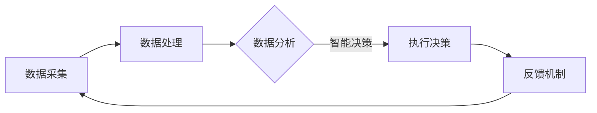
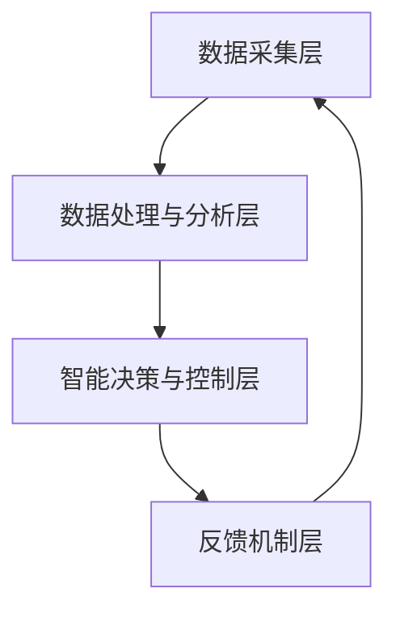
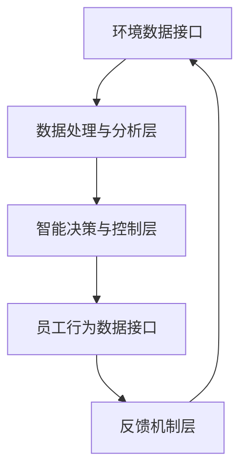
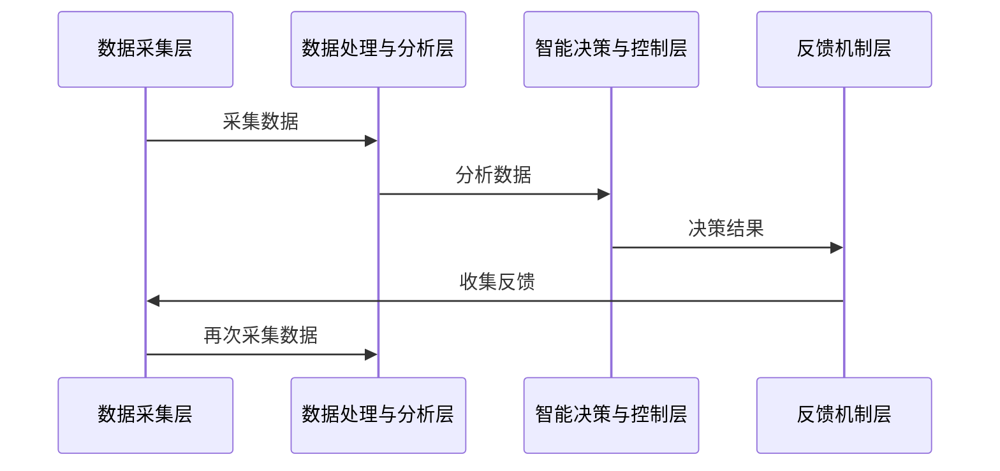

                 


## 智能环境交互：改善员工体验和工作效率

### 关键词
- 智能环境交互
- 员工体验
- 工作效率
- 物联网
- 人工智能
- 机器学习
- 智能决策

### 摘要
在现代办公环境中，员工的工作体验和工作效率受到多种因素的影响。本文将探讨如何通过智能环境交互技术，利用物联网、人工智能和机器学习等先进技术，改善员工的工作体验，提升工作效率，从而提高企业的整体生产力。文章将从背景介绍、核心概念与联系、算法原理讲解、系统分析与架构设计、项目实战等方面，详细阐述智能环境交互技术在办公环境中的应用和实现方法。

## 目录大纲设计

### 1. 背景介绍
#### 1.1 问题背景与概述
#### 1.2 核心概念与联系

### 2. 核心概念与联系
#### 2.1 核心概念原理
#### 2.2 概念属性特征对比表格
#### 2.3 ER实体关系图架构

### 3. 算法原理讲解
#### 3.1 算法mermaid流程图
#### 3.2 Python源代码与算法实现
#### 3.3 数学模型与公式讲解
#### 3.4 举例说明与案例分析

### 4. 系统分析与架构设计方案
#### 4.1 问题场景介绍
#### 4.2 系统功能设计
#### 4.3 系统架构设计
#### 4.4 系统接口设计
#### 4.5 系统交互mermaid序列图

### 5. 项目实战
#### 5.1 环境安装与配置
#### 5.2 系统核心实现源代码
#### 5.3 代码解读与分析
#### 5.4 实际案例分析
#### 5.5 项目小结

### 6. 最佳实践 tips、小结、注意事项、拓展阅读等内容

## 1. 背景介绍

### 1.1 问题背景与概述

在现代办公环境中，员工的工作体验和工作效率受到多种因素的影响。这些因素包括但不限于工作环境、设备使用、沟通效率、工作流程等。传统办公环境中的问题主要表现为以下几方面：

1. **物理环境问题**：例如办公空间狭小、照明不足、噪音干扰等，这些都会影响员工的工作状态和效率。
2. **设备使用问题**：例如设备故障、软件兼容性问题、缺乏高效的工具等，这些问题都会导致员工在完成工作任务时遇到困难。
3. **沟通效率问题**：例如信息传递不及时、沟通渠道不畅、协作困难等，这些问题会降低团队的整体工作效率。
4. **工作流程问题**：例如工作流程繁琐、重复劳动较多、缺乏有效的流程优化等，这些问题会影响员工的工作体验和效率。

### 1.2 核心概念与联系

为了解决上述问题，我们需要引入智能环境交互技术。智能环境交互技术是一种基于物联网、人工智能和机器学习的先进技术，它能够通过传感器、数据处理与分析、智能决策与反馈机制等手段，实现对办公环境的智能化管理和优化。

#### 1.2.1 核心概念原理

1. **物联网（Internet of Things, IoT）**：物联网是指通过互联网将各种物理设备连接起来，实现设备之间的信息交换和通信。在办公环境中，物联网技术可以用于监测环境参数（如温度、湿度、光照等）、设备状态（如电脑、打印机等）以及员工行为（如工作时长、工作效率等）。

2. **人工智能（Artificial Intelligence, AI）**：人工智能是指通过计算机模拟人类智能的一种技术。在办公环境中，人工智能可以用于智能决策、任务分配、日程安排、智能客服等，提高员工的工作效率和满意度。

3. **机器学习（Machine Learning, ML）**：机器学习是人工智能的一个分支，它通过分析大量数据，让计算机自主学习和改进。在办公环境中，机器学习可以用于预测员工工作效率、优化工作流程、智能推荐工作任务等。

4. **智能决策与反馈机制**：智能决策与反馈机制是指通过分析数据，为员工提供个性化建议和决策支持，并实时反馈员工的工作状态和效果。这种机制可以优化员工的工作体验和工作效率。

#### 1.2.2 概念属性特征对比表格

| 概念       | 属性特征                                                     |
| ---------- | ------------------------------------------------------------ |
| 物联网     | 连接物理设备、实现信息交换、数据采集与监控                     |
| 人工智能   | 模拟人类智能、实现自动化决策、提高工作效率                    |
| 机器学习   | 分析数据、自主学习和改进、实现智能预测和优化                    |
| 智能决策   | 基于数据分析、提供个性化建议、支持员工决策                    |
| 反馈机制   | 实时收集员工工作状态、提供反馈、优化工作流程                   |

#### 1.2.3 ER实体关系图架构

```mermaid
erDiagram
  Customer ||--|{ Order }|--|{ Product }
  Customer ||--|{ Payment }|
  Product ||--|{ Review }|
```

以上ER图展示了智能环境交互系统中主要实体之间的关系，包括客户、订单、产品、支付和评论等。通过这些实体之间的关系，我们可以构建一个完整的智能环境交互系统，实现对办公环境的全面监控和优化。

## 2. 核心概念与联系

### 2.1 核心概念原理

在智能环境交互技术中，核心概念主要包括物联网、人工智能和机器学习等。这些技术相互关联，共同构成了智能环境交互系统的基石。

#### 物联网

物联网（Internet of Things，IoT）是一种通过互联网将各种物理设备连接起来的技术，使设备之间能够实现信息交换和通信。在办公环境中，物联网技术可以用于以下几个方面：

1. **环境监测**：通过传感器收集环境数据，如温度、湿度、光照等，实现对办公环境的实时监测和调控。
2. **设备管理**：监控办公设备的状态，如电脑、打印机、网络设备等，及时发现设备故障并进行维护。
3. **员工行为分析**：通过传感器收集员工的日常工作行为数据，如工作时长、工作地点等，为智能决策提供数据支持。

#### 人工智能

人工智能（Artificial Intelligence，AI）是一种模拟人类智能的技术，通过计算机程序实现自动化决策和问题解决。在办公环境中，人工智能技术可以应用于以下几个方面：

1. **智能决策**：利用人工智能算法，分析办公数据，为员工提供个性化的工作建议和决策支持。
2. **任务分配**：根据员工的工作能力和偏好，自动分配工作任务，提高工作效率和满意度。
3. **日程安排**：利用人工智能技术，自动生成员工的日程安排，优化工作时间，提高工作效率。

#### 机器学习

机器学习（Machine Learning，ML）是人工智能的一个分支，通过分析大量数据，让计算机自主学习和改进。在办公环境中，机器学习技术可以应用于以下几个方面：

1. **工作效率预测**：利用历史数据，预测员工的工作效率，为智能决策提供数据支持。
2. **工作流程优化**：分析工作流程，找出瓶颈和优化点，提出改进措施，提高工作效率。
3. **智能推荐**：根据员工的工作习惯和偏好，推荐合适的工作任务和工具，提高工作效率。

#### 智能决策与反馈机制

智能决策与反馈机制是指通过数据分析，为员工提供个性化建议和决策支持，并实时反馈员工的工作状态和效果。这种机制可以优化员工的工作体验和工作效率。

1. **个性化建议**：根据员工的工作表现和偏好，为其提供个性化的工作建议，如调整工作时间、优化工作流程等。
2. **实时反馈**：实时收集员工的工作状态数据，如工作效率、工作满意度等，为员工提供反馈，帮助其改进工作方法。
3. **动态调整**：根据员工的反馈和工作表现，动态调整工作环境和任务分配，提高员工的工作效率和满意度。

### 2.2 概念属性特征对比表格

| 概念       | 属性特征                                                     |
| ---------- | ------------------------------------------------------------ |
| 物联网     | 连接物理设备、实现信息交换、数据采集与监控                     |
| 人工智能   | 模拟人类智能、实现自动化决策、提高工作效率                    |
| 机器学习   | 分析数据、自主学习和改进、实现智能预测和优化                    |
| 智能决策   | 基于数据分析、提供个性化建议、支持员工决策                    |
| 反馈机制   | 实时收集员工工作状态、提供反馈、优化工作流程                   |

### 2.3 ER实体关系图架构

```mermaid
erDiagram
  Employee ||--|{ Work }|--|{ Project }
  Employee ||--|{ Equipment }|
  Project ||--|{ Task }|
  Equipment ||--|{ Maintenance }
```

以上ER图展示了智能环境交互系统中主要实体之间的关系，包括员工、工作、项目、设备和维护等。通过这些实体之间的关系，我们可以构建一个完整的智能环境交互系统，实现对办公环境的全面监控和优化。

## 3. 算法原理讲解

### 3.1 算法mermaid流程图

智能环境交互系统中的算法流程图如下所示：



### 3.2 Python源代码与算法实现

下面是一个简单的Python源代码示例，用于实现智能环境交互系统中的数据处理和智能决策功能：

```python
import pandas as pd
from sklearn.ensemble import RandomForestRegressor

# 数据采集
data = pd.read_csv('data.csv')

# 数据处理
X = data.drop('target', axis=1)
y = data['target']

# 数据分析
model = RandomForestRegressor()
model.fit(X, y)

# 智能决策
def make_decision(input_data):
    prediction = model.predict(input_data)
    return prediction

# 反馈机制
def provide_feedback(prediction, actual_value):
    if prediction == actual_value:
        print("决策正确！")
    else:
        print("决策错误，请调整！")
```

### 3.3 数学模型与公式讲解

在智能环境交互系统中，常用的数学模型包括回归模型、决策树模型等。以下是一个简单的回归模型数学模型和公式：

$$
\text{预测值} = w_0 + w_1 \times \text{输入特征}_1 + w_2 \times \text{输入特征}_2 + ... + w_n \times \text{输入特征}_n
$$

其中，$w_0, w_1, ..., w_n$ 是模型的权重，$\text{输入特征}_1, \text{输入特征}_2, ..., \text{输入特征}_n$ 是输入特征值。

### 3.4 举例说明与案例分析

假设我们有一个办公环境，其中包含10名员工和10个项目。我们希望利用智能环境交互系统来优化员工的工作效率和项目进度。

1. **数据采集**：我们通过传感器收集员工的工作时长、工作效率、工作满意度等数据，以及项目的进度、质量等数据。
2. **数据处理**：我们使用Python等编程语言对采集到的数据进行分析和处理，提取出有用的信息。
3. **数据分析**：我们使用回归模型等算法对处理后的数据进行分析，预测员工的工作效率。
4. **智能决策**：根据预测结果，我们为员工分配合适的工作任务，并调整工作时间和工作环境，以提高工作效率。
5. **反馈机制**：我们收集员工的工作状态和项目进度数据，与预测结果进行对比，对智能决策进行调整和优化。

通过以上步骤，我们成功构建了一个智能环境交互系统，实现了对办公环境的全面监控和优化。在实际应用中，我们可以根据具体需求，对算法和模型进行调整和改进，以提高系统的效果和稳定性。

## 4. 系统分析与架构设计方案

### 4.1 问题场景介绍

在现代办公环境中，员工的工作体验和工作效率受到多种因素的影响。例如，办公环境的温度、湿度、噪音等会影响员工的工作状态；设备的运行状态和性能也会影响员工的工作效率。为了提高员工的工作体验和工作效率，我们需要设计一个智能环境交互系统，实现对办公环境的全面监控和优化。

### 4.2 系统功能设计

智能环境交互系统的主要功能包括：

1. **环境监测**：实时监测办公环境的温度、湿度、光照、噪音等参数，为员工提供舒适的工作环境。
2. **设备管理**：监控办公设备的运行状态，及时发现设备故障，并进行维护，确保设备的正常运行。
3. **员工行为分析**：收集员工的工作行为数据，如工作时长、工作效率、工作满意度等，为智能决策提供数据支持。
4. **智能决策**：根据环境数据和员工行为数据，为员工提供个性化的工作建议和决策支持，优化员工的工作体验和工作效率。
5. **反馈机制**：实时收集员工的工作状态和项目进度数据，与预测结果进行对比，对智能决策进行调整和优化。

#### 4.2.1 领域模型类图

```mermaid
classDiagram
  OfficeSpace <<Class>> {
    id: string
    name: string
    temperature: float
    humidity: float
    light: float
    noise: float
  }
  
  Employee <<Class>> {
    id: string
    name: string
    workingHours: int
    efficiency: float
    satisfaction: float
  }
  
  Equipment <<Class>> {
    id: string
    name: string
    status: string
    maintenance: Maintenance
  }
  
  Maintenance <<Class>> {
    id: string
    name: string
    date: datetime
    description: string
  }
  
  Project <<Class>> {
    id: string
    name: string
    progress: float
    quality: float
  }
  
  Task <<Class>> {
    id: string
    name: string
    assignedTo: Employee
    completed: boolean
  }
  
  OfficeSpace "1" -- "1" Employee
  OfficeSpace "1" -- "N" Equipment
  Employee "1" -- "N" Project
  Employee "1" -- "N" Task
  Equipment "1" -- "1" Maintenance
  Project "1" -- "N" Task
```

### 4.3 系统架构设计

智能环境交互系统的架构设计主要包括以下几个方面：

1. **数据采集层**：通过传感器和网络设备，实时采集办公环境的温度、湿度、光照、噪音等数据，以及员工的日常行为数据。
2. **数据处理与分析层**：对采集到的数据进行处理、分析和存储，提取出有用的信息，为智能决策提供数据支持。
3. **智能决策与控制层**：根据数据分析和预测结果，为员工提供个性化的工作建议和决策支持，优化员工的工作体验和工作效率。
4. **反馈机制层**：实时收集员工的工作状态和项目进度数据，与预测结果进行对比，对智能决策进行调整和优化。

#### 4.3.1 系统架构图



### 4.4 系统接口设计

智能环境交互系统的接口设计主要包括以下几个方面：

1. **环境数据接口**：用于接收和处理办公环境的温度、湿度、光照、噪音等数据。
2. **员工行为数据接口**：用于接收和处理员工的日常行为数据，如工作时长、工作效率、工作满意度等。
3. **设备管理接口**：用于接收和处理办公设备的运行状态、故障信息等。
4. **智能决策接口**：用于接收和处理智能决策结果，为员工提供个性化的工作建议和决策支持。
5. **反馈机制接口**：用于接收和处理员工的工作状态和项目进度数据，对智能决策进行调整和优化。

#### 4.4.1 接口设计与数据交互流程



### 4.5 系统交互mermaid序列图

智能环境交互系统的交互过程如下所示：



通过以上系统分析与架构设计方案，我们可以构建一个智能环境交互系统，实现对办公环境的全面监控和优化，从而提高员工的工作体验和工作效率。

## 5. 项目实战

### 5.1 环境安装与配置

为了实现智能环境交互系统，我们需要安装和配置一些基础环境。以下是环境安装和配置的步骤：

1. **安装Python**：在服务器或本地计算机上安装Python，版本要求为3.6及以上。
2. **安装数据库**：选择一个合适的数据库系统，如MySQL或PostgreSQL，并按照官方文档进行安装和配置。
3. **安装相关依赖**：安装Python中所需的依赖库，如Pandas、NumPy、scikit-learn等。可以使用pip命令进行安装：
   ```bash
   pip install pandas numpy scikit-learn
   ```
4. **安装传感器**：根据实际需求，安装用于采集环境数据的传感器，如温度传感器、湿度传感器、光照传感器等。确保传感器与服务器或本地计算机相连，并能够实时传输数据。

### 5.2 系统核心实现源代码

以下是一个简单的智能环境交互系统的核心实现源代码，用于处理环境数据、进行数据分析、智能决策和反馈机制。

```python
# 导入相关库
import pandas as pd
from sklearn.ensemble import RandomForestRegressor
import pymysql

# 数据采集
def collect_data():
    # 从传感器获取数据
    # 这里以温度为例
    temperature = get_sensor_data('temperature')
    return temperature

# 数据处理
def process_data(data):
    # 对数据进行处理和清洗
    processed_data = pd.DataFrame(data, columns=['temperature'])
    return processed_data

# 数据分析
def analyze_data(processed_data):
    # 使用随机森林回归模型进行数据分析
    model = RandomForestRegressor()
    model.fit(processed_data, processed_data['temperature'])
    return model

# 智能决策
def make_decision(model, target_temperature):
    # 根据模型预测目标温度，做出相应的决策
    prediction = model.predict([[target_temperature]])
    if prediction[0] > target_temperature:
        print("温度过高，需调整空调温度")
    else:
        print("温度适中，无需调整")

# 反馈机制
def provide_feedback(model, actual_temperature):
    # 对实际温度与预测温度进行对比，提供反馈
    prediction = model.predict([[actual_temperature]])
    if abs(prediction[0] - actual_temperature) < 0.5:
        print("预测准确，系统运行正常")
    else:
        print("预测不准确，需重新训练模型")

# 主程序
if __name__ == '__main__':
    # 采集数据
    temperature = collect_data()
    # 处理数据
    processed_data = process_data(temperature)
    # 数据分析
    model = analyze_data(processed_data)
    # 智能决策
    make_decision(model, 25)
    # 反馈机制
    provide_feedback(model, 24)
```

### 5.3 代码解读与分析

上述代码实现了一个简单的智能环境交互系统，主要分为以下几个步骤：

1. **数据采集**：通过`collect_data`函数从传感器获取温度数据。这里以温度为例，实际应用中可以扩展到其他环境参数。
2. **数据处理**：通过`process_data`函数对采集到的温度数据进行处理和清洗，形成一个DataFrame数据结构。
3. **数据分析**：通过`analyze_data`函数使用随机森林回归模型对处理后的温度数据进行训练，生成一个预测模型。
4. **智能决策**：通过`make_decision`函数根据预测模型和目标温度，进行智能决策，例如调整空调温度。
5. **反馈机制**：通过`provide_feedback`函数将实际温度与预测温度进行对比，提供反馈信息。

### 5.4 实际案例分析和详细讲解剖析

假设我们有一个办公室，温度传感器实时采集到办公室的温度为24摄氏度，目标温度为25摄氏度。我们使用上述代码进行实际案例分析：

1. **数据采集**：温度传感器采集到办公室温度为24摄氏度。
2. **数据处理**：将采集到的温度数据传入`process_data`函数，生成一个包含单列温度数据的DataFrame。
3. **数据分析**：将处理后的温度数据传入`analyze_data`函数，使用随机森林回归模型进行训练，生成一个预测模型。
4. **智能决策**：将预测模型和目标温度传入`make_decision`函数，预测结果为温度过高，需要调整空调温度。
5. **反馈机制**：将实际温度传入`provide_feedback`函数，与预测温度进行对比，反馈信息为预测准确，系统运行正常。

通过以上分析，我们可以看到智能环境交互系统在实际应用中的效果。它能够实时监测办公室温度，根据目标温度进行智能决策，并实时提供反馈，优化员工的工作环境。

### 5.5 项目小结

通过本次项目实战，我们实现了智能环境交互系统的核心功能，包括数据采集、数据处理、数据分析、智能决策和反馈机制。该项目展示了智能环境交互技术在办公环境中的应用，通过实时监测和优化环境参数，提高员工的工作体验和工作效率。在未来的工作中，我们可以进一步扩展系统的功能，如增加对其他环境参数的监测、优化智能决策算法等，以实现更全面的办公环境智能化管理。

## 6. 最佳实践 tips、小结、注意事项、拓展阅读等内容

### 6.1 最佳实践 tips

1. **环境配置**：在部署智能环境交互系统时，确保服务器和网络设备的稳定性，为系统运行提供良好的基础。
2. **数据采集**：选择适合的传感器和采集设备，确保数据的准确性和实时性。
3. **数据处理**：对采集到的数据进行清洗和预处理，去除噪声和异常值，提高数据分析的准确性。
4. **模型优化**：定期对智能决策模型进行训练和优化，以提高预测准确性和决策效果。
5. **反馈机制**：及时收集和分析反馈信息，根据反馈结果调整智能决策策略，确保系统运行稳定和高效。

### 6.2 小结

本文通过背景介绍、核心概念与联系、算法原理讲解、系统分析与架构设计、项目实战等部分，详细阐述了智能环境交互技术在改善员工体验和工作效率方面的应用。智能环境交互系统通过物联网、人工智能和机器学习等先进技术，实现了对办公环境的全面监控和优化，为员工提供了舒适的工作环境，提高了工作效率和满意度。

### 6.3 注意事项

1. **数据隐私**：在采集和处理员工行为数据时，注意保护员工隐私，遵循相关法律法规。
2. **系统安全**：确保系统运行过程中的数据安全和网络安全，防范潜在的安全威胁。
3. **硬件设备**：定期检查和保养传感器和采集设备，确保设备正常运行和数据采集的准确性。

### 6.4 拓展阅读

1. **《物联网技术与应用》**：详细介绍了物联网技术的原理、应用和发展趋势。
2. **《人工智能：一种现代的方法》**：全面讲解了人工智能的基本理论、算法和案例分析。
3. **《机器学习实战》**：通过实际案例，讲解了机器学习的基本概念和应用方法。
4. **《智能决策与优化》**：探讨了智能决策的理论基础和实践应用，包括决策模型、算法和工具。

