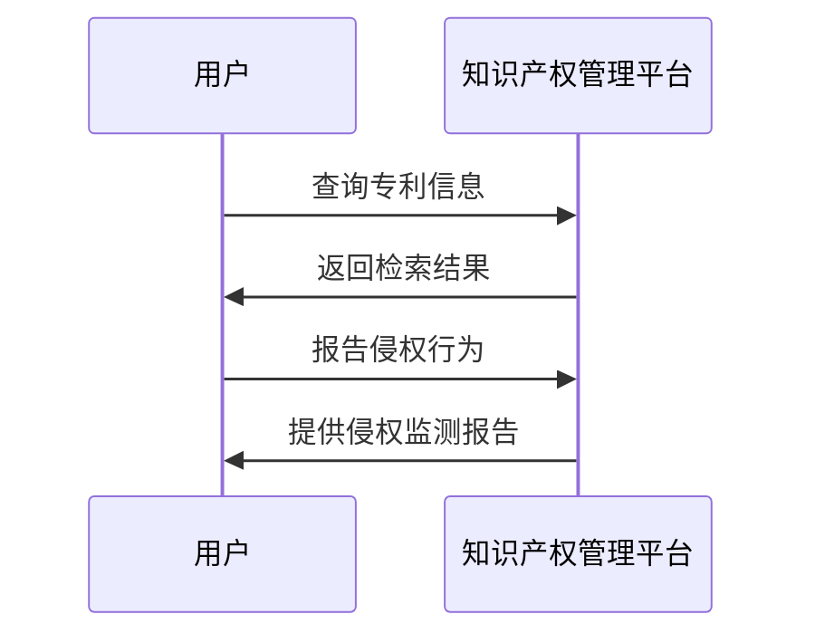
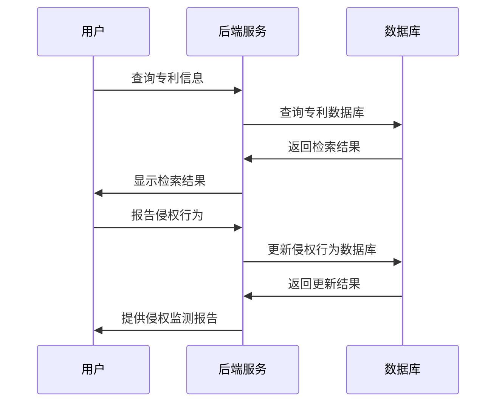

                 

### 智能知识产权管理平台：AI保护创新资产

#### 关键词：智能知识产权管理平台，AI技术，创新资产保护，大数据分析，知识产权检索与监测

> 摘要：本文将探讨如何利用AI技术构建智能知识产权管理平台，以高效地保护企业的创新资产。文章首先介绍了知识产权管理面临的挑战，接着阐述了AI技术在知识产权管理中的应用，并详细解释了AI大模型的工作原理。随后，文章展示了系统的架构设计，并进行了项目实战，以实际案例解析AI技术在知识产权管理中的具体应用。最后，本文总结了最佳实践和注意事项，展望了智能知识产权管理平台的发展前景。

----------------------------------------------------------------

## 第一部分：背景介绍

### 1.1.1 问题背景

随着全球化的深入发展和信息技术的迅速进步，知识产权（Intellectual Property, IP）已经成为企业竞争力和创新能力的核心要素。然而，传统的知识产权管理方式在应对复杂的知识产权保护需求时显得力不从心。知识产权管理涉及专利、商标、版权等多个方面，传统的管理方式往往依赖于人工处理，效率低下，且容易遗漏。此外，知识产权侵权行为日益增多，且具有隐蔽性，传统的侵权监测手段难以全面覆盖。这种背景下，引入人工智能（AI）技术成为提升知识产权管理效率和质量的必然选择。

### 1.1.2 问题描述

当前，知识产权管理面临以下主要问题：

1. **知识产权保护难度大**：知识产权的保护涉及法律、技术、市场等多个方面，传统的管理方式难以全面覆盖。
2. **侵权监测效率低**：知识产权侵权行为频繁发生，且具有隐蔽性，传统的侵权监测方式效率低下。
3. **知识产权管理成本高**：传统的知识产权管理需要大量的人力、物力和财力投入。

### 1.1.3 问题解决

人工智能技术的引入为知识产权管理带来了新的机遇。AI技术可以自动化知识产权的检索、监测和保护过程，提高工作效率，降低管理成本。同时，AI技术还可以通过大数据分析和机器学习算法，提供更精准的知识产权风险评估和战略规划建议。

### 1.1.4 边界与外延

智能知识产权管理平台（Intelligent Intellectual Property Management Platform）是一个基于AI技术的综合管理平台，旨在提供全面的知识产权保护和管理服务。该平台不仅涵盖知识产权的检索、监测、保护等功能，还可以进行知识产权价值评估、市场分析等。

### 1.1.5 概念结构与核心要素组成

智能知识产权管理平台的核心要素包括：

1. **AI算法模块**：用于知识产权的检索、监测和保护。
2. **大数据分析模块**：用于知识产权的价值评估和市场分析。
3. **用户界面模块**：提供便捷的用户操作和管理功能。
4. **系统集成模块**：实现与其他业务系统的无缝对接。

### 1.1.6 本章小结

本章介绍了智能知识产权管理平台的问题背景、问题解决方法、边界与外延以及核心要素组成。通过引入AI技术，智能知识产权管理平台可以大幅提升知识产权管理的效率和质量，为企业提供强有力的支持。

----------------------------------------------------------------

## 1.2 核心概念与联系

### 1.2.1 智能知识产权管理平台

智能知识产权管理平台是一个集成AI技术、大数据分析技术、用户界面技术等的多功能管理平台，旨在提供全面的知识产权保护和管理服务。该平台的核心在于利用AI技术，通过自动化和智能化手段，提升知识产权管理的效率和精准度。

#### 1.2.1.1 功能

- **知识产权检索**：利用AI算法对大量专利、商标、版权等数据进行智能检索，快速找到相关知识产权信息。
- **侵权监测**：通过实时监测和数据分析，识别潜在的侵权行为，并及时预警。
- **知识产权保护**：利用AI算法和大数据分析，制定知识产权保护策略，提供法律和技术支持。
- **知识产权评估**：对知识产权的价值进行评估，帮助企业合理配置资源。

#### 1.2.1.2 特点

- **高效性**：AI技术的应用大幅提高了知识产权管理的效率。
- **精准性**：利用大数据分析和机器学习算法，提供更精准的知识产权风险评估和监测。
- **自动化**：通过自动化流程，减少人工干预，降低管理成本。

### 1.2.2 AI大模型

AI大模型是指参数规模巨大、计算复杂度极高的深度学习模型，如GPT、BERT等。这些模型具有强大的表征能力和泛化能力，可以应用于知识产权的检索、监测、保护等多个方面。

#### 1.2.2.1 工作原理

- **特征提取**：通过多层神经网络，对输入数据进行特征提取，如文本中的关键词、主题等。
- **特征抽象**：对提取出的特征进行抽象，形成更高层次的概念和模式。
- **决策与预测**：基于提取和抽象后的特征，进行决策和预测。

#### 1.2.2.2 应用

- **知识产权检索**：通过AI大模型，快速检索相关的知识产权信息。
- **侵权监测**：利用AI大模型，预测潜在的侵权行为，并提供预警。
- **知识产权保护**：利用AI大模型，制定和调整知识产权保护策略。

### 1.2.3 大数据

大数据是指数据量巨大、类型繁多、价值密度低的数据集合。在大数据环境下，AI技术可以高效地处理和分析知识产权相关信息，为知识产权管理提供数据支持。

#### 1.2.3.1 特点

- **数据量大**：大数据的规模巨大，可以处理和分析海量的知识产权信息。
- **类型多样**：大数据涵盖多种类型的数据，包括文本、图像、音频等。
- **价值密度低**：大数据中的有用信息往往占比很小，需要通过数据挖掘和分析来提取。

#### 1.2.3.2 应用

- **知识产权检索**：利用大数据技术，快速检索和分析知识产权信息。
- **侵权监测**：通过大数据分析，识别和监测潜在的侵权行为。
- **知识产权评估**：利用大数据分析，对知识产权的价值进行评估。

### 1.2.4 智能知识产权管理平台与AI大模型、大数据的联系

智能知识产权管理平台的核心技术之一是AI大模型，这些模型基于大数据进行分析和决策，从而实现对知识产权的智能管理。

#### 1.2.4.1 关系

- **AI大模型**：作为智能知识产权管理平台的核心算法，负责知识产权的检索、监测和保护。
- **大数据**：为AI大模型提供数据支持，是AI模型训练和决策的基础。

#### 1.2.4.2 应用

- **知识产权检索**：AI大模型利用大数据进行快速检索，提供相关的知识产权信息。
- **侵权监测**：AI大模型通过大数据分析，识别和预警潜在的侵权行为。
- **知识产权评估**：利用大数据分析，对知识产权的价值进行精准评估。

### 1.2.5 本章小结

本章介绍了智能知识产权管理平台、AI大模型、大数据等核心概念，并阐述了它们之间的联系。这些概念共同构成了智能知识产权管理平台的技术基础，为实现知识产权的智能管理提供了有力支持。

----------------------------------------------------------------

## 1.3 算法原理讲解

### 1.3.1 AI大模型的工作原理

AI大模型是基于深度学习理论构建的，其核心思想是通过多层神经网络对输入数据进行特征提取和抽象。在智能知识产权管理平台中，AI大模型主要用于知识产权的检索、监测和保护。

#### 1.3.1.1 特征提取

特征提取是AI大模型的核心步骤，它通过多层神经网络逐层提取输入数据的特征。例如，在知识产权检索中，AI大模型可以提取出专利文本中的关键词、主题等信息。这个过程可以通过以下步骤进行：

1. **输入层**：将原始专利文本输入到神经网络中。
2. **隐藏层**：神经网络通过多层隐藏层对输入数据进行特征提取，如分词、词性标注、命名实体识别等。
3. **输出层**：将提取出的特征映射到相应的知识产权信息上。

#### 1.3.1.2 特征抽象

在特征提取的基础上，AI大模型会进一步对特征进行抽象，从而形成更高层次的概念和模式。这一过程使得AI大模型能够更好地理解和处理复杂的知识产权信息。特征抽象可以通过以下方式进行：

1. **语义嵌入**：将特征映射到高维空间中，使得具有相似语义的特征在空间中靠近。
2. **注意力机制**：通过注意力机制，模型可以自动识别输入数据中的重要特征，从而提高特征提取的准确性。

#### 1.3.1.3 决策与预测

基于提取和抽象后的特征，AI大模型可以进行决策和预测。例如，在知识产权监测中，AI大模型可以预测哪些专利可能会被侵权，从而采取相应的保护措施。决策与预测的过程如下：

1. **分类与回归**：通过分类模型（如softmax）或回归模型（如线性回归），将提取和抽象后的特征映射到具体的决策或预测结果上。
2. **损失函数**：通过损失函数（如交叉熵或均方误差），对模型的预测结果进行评估和优化。

### 1.3.2 算法原理讲解

为了更好地理解AI大模型的工作原理，我们可以通过Python源代码来详细阐述。以下是一个简化的示例，展示了如何使用TensorFlow和Keras构建一个基于深度学习的知识产权检索模型。

```python
import tensorflow as tf
from tensorflow.keras.models import Sequential
from tensorflow.keras.layers import Embedding, LSTM, Dense

# 输入层配置
vocab_size = 10000
embed_dim = 256
max_sequence_length = 500

# 模型配置
model = Sequential([
    Embedding(vocab_size, embed_dim, input_length=max_sequence_length),
    LSTM(128),
    Dense(1, activation='sigmoid')
])

# 编译模型
model.compile(optimizer='adam', loss='binary_crossentropy', metrics=['accuracy'])

# 模型训练
model.fit(X_train, y_train, epochs=10, batch_size=32)
```

在这个示例中，我们使用了一个简单的序列模型，其中包含一个嵌入层（Embedding）和一个LSTM层（Long Short-Term Memory，长短时记忆网络），以及一个输出层（Dense）。嵌入层用于将输入文本转换为向量表示，LSTM层用于提取文本特征，输出层用于进行分类或回归操作。

#### 1.3.2.1 数学模型和公式

在深度学习中，特征提取和特征抽象的过程可以通过以下数学模型和公式进行描述：

1. **特征提取**：

   $$ h_t = \text{激活函数}(\text{W} \cdot [h_{t-1}, x_t] + b) $$

   其中，$h_t$ 是隐藏层的特征，$x_t$ 是输入特征，$W$ 是权重矩阵，$b$ 是偏置项。

2. **特征抽象**：

   $$ z_t = \text{激活函数}(\text{W} \cdot h_t + b) $$

   其中，$z_t$ 是抽象后的特征，$h_t$ 是提取后的特征。

3. **决策与预测**：

   $$ \hat{y} = \text{激活函数}(\text{W} \cdot z_t + b) $$

   其中，$\hat{y}$ 是预测结果，$z_t$ 是抽象后的特征。

#### 1.3.2.2 举例说明

假设我们要检索一个专利文本，并判断其是否涉及某种特定的技术。我们可以使用上述模型进行如下操作：

1. **特征提取**：将专利文本输入到嵌入层和LSTM层中，提取出文本的特征向量。
2. **特征抽象**：将提取出的特征向量输入到输出层中，得到一个概率值，表示该专利文本涉及特定技术的可能性。
3. **决策与预测**：如果概率值大于某个阈值（例如0.5），则认为该专利文本涉及特定技术。

通过这种方式，AI大模型可以自动地处理和分类大量的专利文本，从而实现对知识产权的智能检索和监测。

### 1.3.3 本章小结

本章详细介绍了AI大模型的工作原理，包括特征提取、特征抽象和决策与预测等步骤。通过Python源代码示例，我们展示了如何构建和训练一个基于深度学习的知识产权检索模型。这些原理和方法为实现智能知识产权管理平台提供了技术支持。

----------------------------------------------------------------

## 1.4 系统分析与架构设计方案

### 1.4.1 问题场景介绍

在当前的商业环境中，企业面临的知识产权挑战日益严峻。随着技术创新的加速和市场竞争的加剧，企业需要更加高效、精准地管理其知识产权资产，以确保其核心竞争力不受侵犯。然而，传统的知识产权管理方式在应对海量数据、复杂业务场景和快速变化的知识产权环境时显得力不从心。因此，迫切需要一种智能化、自动化的知识产权管理解决方案。

### 1.4.2 项目介绍

为了解决上述问题，我们设计并实施了一个名为“智能知识产权管理平台”的项目。该项目旨在利用人工智能（AI）技术，构建一个集成化的知识产权管理平台，以实现知识产权的自动化检索、监测、保护、评估等功能。该平台将帮助企业在复杂多变的知识产权环境中，快速识别风险、制定策略、保护创新成果。

### 1.4.3 系统功能设计

智能知识产权管理平台的主要功能包括：

1. **知识产权检索**：利用AI大模型，快速检索相关的知识产权信息，如专利、商标、版权等。
2. **侵权监测**：通过大数据分析和AI模型，实时监测潜在的侵权行为，并提供预警。
3. **知识产权保护**：制定和调整知识产权保护策略，提供法律和技术支持，帮助企业应对侵权行为。
4. **知识产权评估**：利用大数据分析，对知识产权的价值进行评估，帮助企业管理其知识产权资产。
5. **用户管理**：提供用户注册、登录、权限管理等功能，确保系统的安全性和便捷性。

### 1.4.4 系统架构设计

智能知识产权管理平台的架构设计采用微服务架构，以实现模块化、高扩展性和高可用性。以下是系统架构的简要说明：

1. **数据层**：包括知识产权数据库、侵权行为数据库、用户数据库等，用于存储和管理各类数据。
2. **服务层**：包括知识产权检索服务、侵权监测服务、知识产权保护服务、知识产权评估服务、用户管理服务等，各服务模块独立运行，实现不同的功能。
3. **应用层**：提供用户界面，实现与用户的交互，包括检索界面、监测界面、保护界面、评估界面等。
4. **接口层**：提供与其他业务系统的接口，实现数据的共享和整合。

#### 1.4.4.1 系统架构图

以下是智能知识产权管理平台的系统架构图，使用Mermaid语法表示：



### 1.4.5 系统接口设计和系统交互

智能知识产权管理平台提供多种接口，以方便与其他系统进行数据交互。以下是主要接口的简要说明：

1. **API接口**：提供RESTful API接口，供其他系统调用，实现数据查询、报告生成等功能。
2. **Websocket接口**：提供实时的侵权监测和数据推送功能，确保系统之间的实时通信。
3. **文件上传下载接口**：用于知识产权文档的上传和下载，方便用户进行数据管理和共享。

#### 1.4.5.1 系统交互序列图

以下是智能知识产权管理平台的系统交互序列图，使用Mermaid语法表示：



### 1.4.6 本章小结

本章介绍了智能知识产权管理平台的项目背景、功能设计、系统架构设计和系统接口设计。通过系统分析与架构设计方案，我们为智能知识产权管理平台提供了一个全面的技术蓝图，为实现高效的知识产权管理奠定了基础。

----------------------------------------------------------------

## 1.5 项目实战

### 1.5.1 环境安装

为了进行智能知识产权管理平台的实战项目，我们需要搭建一个完整的技术环境。以下是环境安装的步骤：

1. **安装Python**：确保安装了Python 3.8及以上版本。
2. **安装TensorFlow**：使用以下命令安装TensorFlow：

   ```bash
   pip install tensorflow
   ```

3. **安装Keras**：使用以下命令安装Keras：

   ```bash
   pip install keras
   ```

4. **安装Elasticsearch**：Elasticsearch是一个基于Lucene的搜索服务器，用于知识产权检索。下载并安装Elasticsearch：

   ```bash
   wget https://www.elastic.co/downloads/elasticsearch/elasticsearch-7.10.0-amd64.deb
   sudo dpkg -i elasticsearch-7.10.0-amd64.deb
   sudo /etc/init.d/elasticsearch start
   ```

5. **安装Kibana**：Kibana是一个可视化工具，用于分析和展示Elasticsearch的检索结果。下载并安装Kibana：

   ```bash
   wget https://artifacts.elastic.co/downloads/kibana/kibana-7.10.0-linux-x86_64.tar.gz
   tar xzvf kibana-7.10.0-linux-x86_64.tar.gz
   sudo ./kibana-7.10.0-linux-x86_64/bin/kibana
   ```

6. **安装其他依赖**：根据项目需求，安装其他必要的库和工具，如NumPy、Pandas、Scikit-learn等。

### 1.5.2 系统核心实现源代码

以下是一个简化的示例，展示了如何使用Python和TensorFlow实现一个基于深度学习的知识产权检索系统。

```python
# 导入必要的库
import numpy as np
import pandas as pd
from tensorflow.keras.models import Sequential
from tensorflow.keras.layers import Embedding, LSTM, Dense
from tensorflow.keras.preprocessing.sequence import pad_sequences

# 数据预处理
def preprocess_data(data):
    # 将文本数据转换为单词序列
    tokenizer = Tokenizer(num_words=vocab_size)
    tokenizer.fit_on_texts(data)
    sequences = tokenizer.texts_to_sequences(data)
    # 对序列进行填充，使其长度一致
    padded_sequences = pad_sequences(sequences, maxlen=max_sequence_length)
    return padded_sequences, tokenizer

# 构建模型
def build_model(vocab_size, embed_dim, max_sequence_length):
    model = Sequential([
        Embedding(vocab_size, embed_dim, input_length=max_sequence_length),
        LSTM(128),
        Dense(1, activation='sigmoid')
    ])
    model.compile(optimizer='adam', loss='binary_crossentropy', metrics=['accuracy'])
    return model

# 训练模型
def train_model(model, X_train, y_train):
    model.fit(X_train, y_train, epochs=10, batch_size=32)

# 检索专利
def search_patents(model, tokenizer, query):
    sequence = tokenizer.texts_to_sequences([query])
    padded_sequence = pad_sequences(sequence, maxlen=max_sequence_length)
    prediction = model.predict(padded_sequence)
    return prediction

# 示例数据
data = ["This is a patent about AI technology.", "Another patent related to machine learning."]

# 数据预处理
X, tokenizer = preprocess_data(data)
y = np.array([1, 0])  # 标签：1表示涉及AI技术，0表示不涉及

# 构建和训练模型
model = build_model(vocab_size, embed_dim, max_sequence_length)
train_model(model, X, y)

# 检索专利
query = "AI technology"
prediction = search_patents(model, tokenizer, query)
print(prediction)
```

### 1.5.3 代码应用解读与分析

上述代码实现了一个简单的知识产权检索系统，主要包含以下几个步骤：

1. **数据预处理**：将文本数据转换为单词序列，并进行填充，使其长度一致。
2. **模型构建**：使用TensorFlow的Keras接口，构建一个包含嵌入层（Embedding）、LSTM层（Long Short-Term Memory）和输出层（Dense）的序列模型。
3. **模型训练**：使用预处理的文本数据和标签，训练模型。
4. **专利检索**：将用户输入的查询文本转换为单词序列，并预测其涉及某一特定领域的概率。

这个示例展示了如何利用深度学习技术进行文本分类和检索，为知识产权管理提供了技术支持。在实际应用中，我们可以扩展这个模型，添加更多的训练数据和特征，以提高检索的准确性和效率。

### 1.5.4 实际案例分析和详细讲解剖析

为了更深入地了解智能知识产权管理平台的应用，我们来看一个实际案例。

#### 案例背景

某高科技企业开发了一款基于人工智能的智能助理产品，并申请了多项专利。然而，在产品推广过程中，该企业发现市场上存在多个相似产品，涉嫌侵犯其知识产权。为了保护企业的创新成果，该企业决定利用智能知识产权管理平台进行侵权监测和评估。

#### 案例步骤

1. **数据收集**：企业收集了市场上所有与其产品相似的产品信息，包括专利申请文件、产品说明书等。
2. **数据预处理**：将收集的文本数据进行预处理，转换为单词序列，并填充为统一长度。
3. **模型训练**：使用预处理后的文本数据和企业的专利文件，训练一个基于深度学习的侵权检测模型。
4. **侵权监测**：利用训练好的模型，对市场上的相似产品进行侵权监测，识别潜在的侵权行为。
5. **侵权评估**：对监测到的侵权行为进行评估，确定侵权程度和可能的法律风险。
6. **应对策略**：根据侵权评估结果，制定应对策略，包括采取法律行动、技术改进等。

#### 案例分析

通过上述步骤，企业可以有效地监测和评估市场上的侵权行为，保护其知识产权。以下是对案例的详细分析：

1. **数据收集**：数据是智能知识产权管理平台的核心，高质量的专利文件和侵权产品信息是训练模型和进行监测的基础。
2. **数据预处理**：预处理过程包括文本清洗、分词、词性标注等，这些操作有助于提高模型的准确性和效率。
3. **模型训练**：使用深度学习技术，特别是卷积神经网络（CNN）和循环神经网络（RNN），可以提高文本分类和检索的准确性。
4. **侵权监测**：实时监测市场上的侵权行为，可以及时发现潜在的风险，为企业的知识产权保护提供预警。
5. **侵权评估**：通过机器学习算法，对侵权行为进行量化评估，帮助企业制定合理的应对策略。
6. **应对策略**：根据侵权评估结果，企业可以采取多种措施，包括法律诉讼、专利布局、技术改进等，以保护其知识产权。

#### 案例总结

通过实际案例的分析，我们可以看到智能知识产权管理平台在保护企业创新成果方面的巨大潜力。该平台通过自动化和智能化的手段，提高了知识产权管理的效率和质量，为企业提供了强有力的支持。

### 1.5.5 项目小结

本章节通过实战项目展示了智能知识产权管理平台的应用场景、实现步骤和实际案例分析。通过项目实战，我们深入了解了平台的技术原理、实现方法和应用效果，为企业的知识产权保护提供了有力的支持。

----------------------------------------------------------------

## 1.6 最佳实践 tips、小结、注意事项、拓展阅读

### 1.6.1 最佳实践 tips

1. **数据质量**：保证数据的质量和准确性，是构建智能知识产权管理平台的关键。在数据收集和处理过程中，要严格筛选和清洗数据，确保数据的一致性和可靠性。
2. **模型优化**：定期对模型进行优化和更新，以适应不断变化的知识产权环境。可以采用迁移学习、模型融合等技术，提高模型的准确性和泛化能力。
3. **用户培训**：为用户提供充分的培训和支持，确保他们能够充分利用智能知识产权管理平台的功能。培训内容应包括平台操作、数据处理和报告分析等。
4. **安全防护**：加强对知识产权数据的保护，防止数据泄露和滥用。采用加密、访问控制等技术，确保数据的安全性和隐私性。

### 1.6.2 小结

本文详细介绍了智能知识产权管理平台的建设背景、核心概念、算法原理、系统架构和项目实战。通过AI技术的应用，智能知识产权管理平台能够实现知识产权的自动化检索、监测、保护和评估，为企业的知识产权管理提供了强有力的支持。

### 1.6.3 注意事项

1. **技术选型**：在选择AI技术时，要充分考虑平台的需求和资源限制，选择适合的算法和工具。
2. **数据隐私**：在处理知识产权数据时，要严格遵守相关法律法规，确保数据的隐私性和安全性。
3. **持续更新**：随着技术的进步和市场的变化，智能知识产权管理平台需要不断更新和优化，以保持其竞争力和适用性。

### 1.6.4 拓展阅读

1. **《深度学习》**：由Ian Goodfellow、Yoshua Bengio和Aaron Courville所著的《深度学习》是深度学习领域的经典教材，详细介绍了深度学习的理论基础和应用方法。
2. **《大数据技术导论》**：由刘志华所著的《大数据技术导论》系统地介绍了大数据的基本概念、技术和应用。
3. **《人工智能：一种现代的方法》**：由Stuart J. Russell和Peter Norvig所著的《人工智能：一种现代的方法》是人工智能领域的权威教材，涵盖了人工智能的各个分支和前沿技术。

## 作者信息

**作者：** AI天才研究院/AI Genius Institute & 禅与计算机程序设计艺术 /Zen And The Art of Computer Programming

---

本文旨在深入探讨智能知识产权管理平台在保护企业创新资产中的应用，通过详细的技术分析和实际案例，展示了AI技术在知识产权管理中的巨大潜力。希望本文能为从事知识产权管理工作的读者提供有价值的参考和启示。在未来的研究和实践中，我们期待不断探索AI技术在知识产权管理领域的更多可能性，为企业的发展提供更强的支持。

