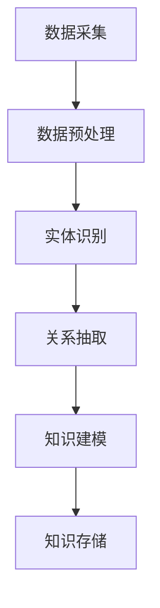
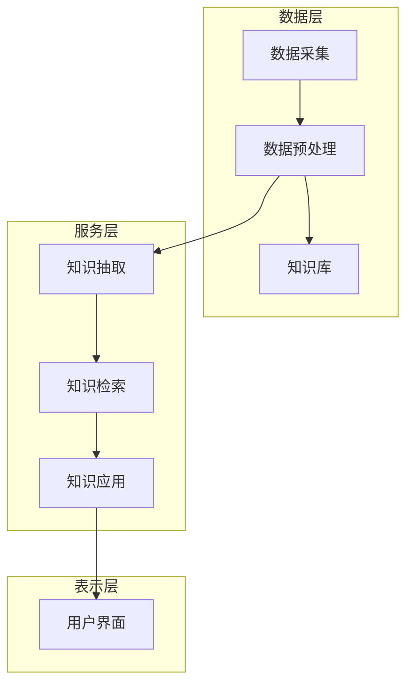
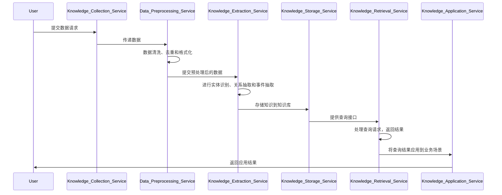

                 


## 引言

### 1.1 书籍背景与目标

智能知识发现系统：挖掘企业隐性知识，这本书旨在为读者提供一个全面而深入的了解智能知识发现系统如何帮助企业在数字化时代中挖掘和利用隐性知识。随着大数据和人工智能技术的快速发展，企业面临着如何从海量数据中提取有价值知识、提高决策效率和竞争力的挑战。本书的目标是：

1. **明确智能知识发现系统的定义和重要性**：通过介绍系统的基本原理和应用场景，让读者理解智能知识发现系统在企业知识管理中的关键作用。

2. **剖析智能知识发现系统的技术实现**：详细讲解系统中的核心算法、技术和架构设计，帮助读者掌握系统实现的原理和步骤。

3. **提供实战经验和案例分析**：通过具体案例展示智能知识发现系统的实际应用效果，帮助读者将理论知识应用于实际项目中。

4. **总结最佳实践和注意事项**：提供实际操作中的经验和技巧，以及可能遇到的问题和解决方案，帮助读者避免常见陷阱。

本书主要面向以下读者群体：

- **企业决策者**：需要了解如何利用智能知识发现系统提升企业竞争力。
- **IT从业者**：包括数据科学家、软件工程师、系统架构师等，希望深入了解智能知识发现系统的技术实现和应用。
- **研究人员和学者**：对智能知识发现系统的研究兴趣，希望获取最新的研究进展和实战经验。

### 1.2 阅读指南与结构

本书分为四个主要部分，每个部分都有明确的主题和目标：

- **第一部分：引言**：介绍书籍的背景、目标、读者群体以及阅读指南和结构。
- **第二部分：智能知识发现系统概述**：详细探讨智能知识发现系统的概念、技术基础和应用场景。
- **第三部分：项目实战**：通过具体项目和案例分析，展示智能知识发现系统的实际应用。
- **第四部分：最佳实践与总结**：总结实践经验，提供注意事项和拓展阅读建议。

### 2. 企业隐性知识的重要性

#### 2.1 隐性知识的定义与特征

隐性知识是指那些难以通过文字、图表或其他明确形式表达的知识，通常隐藏在个体经验、思维模式和专业技能中。与显性知识（如文档、数据库和报告）不同，隐性知识不易被直接获取和传播。其特征包括：

1. **主观性**：隐性知识往往与个人的主观体验和认知相关，因此难以客观量化。
2. **情境依赖性**：隐性知识通常在特定情境下才能发挥作用，脱离了情境可能无法理解其价值。
3. **不易传播性**：由于缺乏明确的表达形式，隐性知识难以通过传统方式传递和共享。
4. **动态性**：隐性知识随着时间、经验和情境的变化而不断发展和更新。

#### 2.2 隐性知识在企业中的价值

隐性知识在企业发展中扮演着至关重要的角色，具体表现在以下几个方面：

1. **创新能力**：隐性知识是企业创新的核心驱动力，通过积累和传承，可以促进新产品、新服务的开发。
2. **竞争优势**：隐性知识构成了企业的核心竞争力，难以被竞争对手复制，有助于企业在市场中保持领先地位。
3. **运营效率**：隐性知识可以帮助企业优化业务流程，提高运营效率，降低成本。
4. **知识传承**：通过挖掘和共享隐性知识，企业可以确保关键技能和经验的传承，避免因人才流失带来的风险。

#### 2.3 隐性知识发现的需求

随着企业规模的扩大和业务复杂性的增加，隐性知识的管理和利用变得越来越困难。传统的知识管理手段往往无法有效挖掘和传播隐性知识，导致以下问题：

1. **知识孤岛**：不同部门和个人之间的知识难以共享，形成信息孤岛。
2. **知识流失**：关键人才的离职可能导致大量隐性知识随之流失，对企业造成严重影响。
3. **决策障碍**：缺乏对隐性知识的全面了解，决策者可能无法做出最优决策。

因此，企业迫切需要一种高效的方法来挖掘和利用隐性知识。智能知识发现系统正是为了解决这些问题而设计的。通过结合大数据分析和人工智能技术，智能知识发现系统能够自动识别、提取和共享隐性知识，帮助企业实现知识的最大化利用。

## 企业隐性知识的重要性

### 2.1 隐性知识的定义与特征

隐性知识是一种深藏于个人经验、技能和思维模式中的知识，它通常难以用文字、图表或其他明确的形式进行表达和传递。这种知识往往与个体对特定情境的敏锐洞察和直觉有关，因此在很多情况下被认为是企业创新和竞争优势的关键来源。

#### 1. 主观性

隐性知识具有显著的个体主观性。它往往与个人的认知模式、价值观和经验相关，因此每个人的隐性知识都是独特的。例如，一个经验丰富的项目经理可能在项目风险管理方面拥有深刻的见解，这些见解难以通过简单的文档或报告来传递。

#### 2. 情境依赖性

隐性知识通常在特定情境下才能发挥其价值。例如，一个销售人员在面对客户需求时，可能需要运用其多年的销售经验和人际交往技巧来提供个性化的解决方案。这种情境依赖性使得隐性知识难以脱离实际情境进行传播和应用。

#### 3. 不易传播性

由于缺乏明确和标准化的表达形式，隐性知识往往难以通过传统的方式共享和传递。例如，一个技术人员在解决复杂技术问题时积累的宝贵经验，可能难以通过简单的口头描述或文档记录下来，从而阻碍了知识的共享。

#### 4. 动态性

隐性知识不是静态的，它随着时间、经验和情境的变化而不断发展和更新。例如，一个企业的商业模式可能在不断的市场竞争中逐步完善，从而形成了新的隐性知识。这种动态性要求企业不断挖掘和更新隐性知识，以保持竞争力。

### 2.2 隐性知识在企业中的价值

隐性知识在企业运营和创新中扮演着至关重要的角色，它不仅影响着企业的日常运营，还对企业的长期发展具有深远的影响。

#### 1. 创新能力

隐性知识是企业创新的核心驱动力。它通常来源于企业内部员工的个人经验、专业技能和直觉。例如，一个研发团队在解决技术难题时，可能需要团队成员之间的默契合作和隐性知识的交流，从而推动新产品的开发。

#### 2. 竞争优势

隐性知识构成了企业的核心竞争力，因为它难以被竞争对手复制。例如，一个企业的独特销售技巧或生产流程，可能通过长期的实践积累和优化形成隐性知识，从而在市场中保持领先地位。

#### 3. 运营效率

隐性知识可以帮助企业优化业务流程，提高运营效率。例如，一个团队在长期合作中形成的最佳实践和操作规程，可以通过隐性知识的形式传递给新成员，从而缩短培训周期，提高工作效率。

#### 4. 知识传承

通过挖掘和共享隐性知识，企业可以确保关键技能和经验的传承，避免因人才流失带来的风险。例如，通过建立知识管理系统，企业可以将员工的隐性知识编码化，使其在员工离职后仍然能够被其他团队成员利用。

### 2.3 隐性知识发现的需求

随着企业规模的扩大和业务复杂性的增加，隐性知识的管理和利用变得越来越困难。传统的知识管理手段往往无法有效挖掘和传播隐性知识，导致以下问题：

#### 1. 知识孤岛

不同部门和个人之间的知识难以共享，形成信息孤岛。这可能导致资源的浪费和效率的降低。

#### 2. 知识流失

关键人才的离职可能导致大量隐性知识随之流失，对企业造成严重影响。例如，一个技术专家的离职可能导致企业失去他在关键技术领域的宝贵经验。

#### 3. 决策障碍

缺乏对隐性知识的全面了解，决策者可能无法做出最优决策。例如，一个企业的领导层可能无法充分利用员工的经验和洞察力，从而导致决策失误。

因此，企业迫切需要一种高效的方法来挖掘和利用隐性知识。智能知识发现系统正是为了解决这些问题而设计的。通过结合大数据分析和人工智能技术，智能知识发现系统能够自动识别、提取和共享隐性知识，帮助企业实现知识的最大化利用。

## 智能知识发现系统的定义和目标

### 3.1 智能知识发现系统的定义

智能知识发现系统是一种基于大数据和人工智能技术的知识管理工具，旨在帮助企业挖掘和利用隐性知识。该系统通过分析海量数据，识别潜在的知识点，并将其转化为可共享、可利用的知识资源。智能知识发现系统的核心目标是实现知识的自动化挖掘、传递和应用，从而提高企业的创新能力、运营效率和决策质量。

### 3.2 智能知识发现系统的组成部分

智能知识发现系统通常包括以下几个关键组成部分：

#### 1. 数据采集与预处理

数据采集与预处理是智能知识发现系统的第一步，目的是获取企业内部和外部的各种数据源，并进行清洗、去重和格式化等处理，以确保数据的质量和一致性。

#### 2. 知识抽取与建模

知识抽取与建模是智能知识发现系统的核心模块，负责从原始数据中提取关键信息，构建知识图谱或知识库。通过自然语言处理、实体识别、关系抽取等技术，系统能够识别和理解数据中的隐含关系和知识结构。

#### 3. 知识存储与管理

知识存储与管理模块负责将提取出的知识存储到数据库或知识库中，并提供高效的数据检索和查询功能。此外，该模块还需要支持知识的版本控制和权限管理，以确保知识的完整性和安全性。

#### 4. 知识应用与共享

知识应用与共享模块是智能知识发现系统的最终目标。通过将挖掘出的知识应用到企业的业务流程中，如决策支持、客户服务、产品开发等，系统能够帮助企业提高运营效率和创新能力。同时，系统还需要提供便捷的知识共享和协作平台，促进知识的流动和传承。

### 3.3 智能知识发现系统的目标

智能知识发现系统的主要目标包括：

#### 1. 自动化挖掘和传递知识

通过自动化的数据分析和知识抽取技术，智能知识发现系统能够高效地挖掘企业内部的隐性知识，并将其转化为可共享的知识资源。这有助于打破知识孤岛，促进知识的流动和传承。

#### 2. 提高决策质量和效率

智能知识发现系统通过提供丰富的数据和知识支持，帮助决策者做出更加准确和及时的决策。这有助于企业优化业务流程，降低运营成本，提高市场竞争力。

#### 3. 促进知识创新和共享

智能知识发现系统通过构建知识图谱和知识库，促进知识的结构化和共享。这有助于激发员工的创新思维，推动企业不断进步和发展。

#### 4. 增强企业创新能力

通过挖掘和利用隐性知识，智能知识发现系统有助于企业发现新的市场机会、优化产品和服务，从而增强企业的创新能力。

## 智能知识发现系统的工作原理和技术手段

### 4.1 数据采集与预处理

智能知识发现系统的第一步是数据采集与预处理。该过程包括从企业内部和外部的多种数据源中收集数据，如文档、邮件、聊天记录、数据库记录等，并进行数据清洗、去重和格式化等操作，以确保数据的质量和一致性。

#### 数据源

数据源可以是结构化数据（如数据库）、半结构化数据（如XML、JSON）和非结构化数据（如文本、图像、音频）。对于不同类型的数据，系统会采用相应的采集和处理方法。

#### 数据预处理

数据预处理包括以下几个关键步骤：

1. **数据清洗**：去除重复数据、纠正错误数据、填补缺失数据等，以提高数据质量。
2. **数据去重**：通过比较数据记录，去除重复的数据，确保数据的一致性。
3. **数据格式化**：将不同格式的数据转换为统一的格式，如将不同格式的文本转换为标准的文本格式。

### 4.2 知识抽取与建模

知识抽取与建模是智能知识发现系统的核心模块。它通过自然语言处理（NLP）、实体识别、关系抽取等技术，从原始数据中提取关键信息，构建知识图谱或知识库。

#### 知识抽取

知识抽取包括以下几个关键技术：

1. **实体识别**：识别文本中的关键实体，如人名、地名、组织名、产品名等。
2. **关系抽取**：识别实体之间的关联关系，如“公司A成立于城市B”、“产品C由团队D开发”等。
3. **事件抽取**：识别文本中的事件信息，如“团队E成功完成了项目F”。
4. **属性抽取**：提取实体的属性信息，如“员工G的职位是经理”。

#### 知识建模

知识建模是将抽取出的知识组织成结构化的形式，如知识图谱。知识图谱由节点和边构成，节点表示实体，边表示实体之间的关系。例如，在知识图谱中，“公司A”是节点，“成立于”是边，指向“城市B”节点。

### 4.3 知识存储与管理

知识存储与管理模块负责将构建好的知识存储到数据库或知识库中，并提供高效的数据检索和查询功能。此外，该模块还需要支持知识的版本控制和权限管理，以确保知识的完整性和安全性。

#### 知识存储

知识可以存储在关系型数据库、NoSQL数据库或分布式存储系统中。知识库通常采用图数据库，以高效存储和管理知识图谱。

#### 知识检索

知识检索是通过关键词或查询语句，从知识库中查找相关知识的操作。系统可以使用全文搜索、图搜索等技术，实现高效的查询。

#### 知识共享

知识共享是指将挖掘出的知识在企业内部或外部进行传播和共享。系统可以提供知识共享平台，支持知识的上传、下载、评论和分享等功能。

### 4.4 知识应用与共享

知识应用与共享模块是智能知识发现系统的最终目标。通过将挖掘出的知识应用到企业的业务流程中，如决策支持、客户服务、产品开发等，系统能够帮助企业提高运营效率和创新能力。

#### 应用场景

1. **决策支持**：通过提供丰富的数据和知识支持，帮助决策者做出更加准确和及时的决策。
2. **客户服务**：通过分析客户数据，提供个性化的服务和解决方案。
3. **产品开发**：通过挖掘市场需求和用户反馈，优化产品设计和功能。

#### 知识共享平台

知识共享平台是智能知识发现系统的关键组成部分，它提供以下功能：

1. **知识上传**：用户可以上传和分享自己的知识。
2. **知识下载**：用户可以下载其他用户分享的知识。
3. **评论与反馈**：用户可以对知识进行评论和反馈，以促进知识的改进和传承。
4. **权限管理**：系统可以设置不同的权限，控制知识的访问和共享范围。

### 4.5 实现案例

以下是一个智能知识发现系统的实现案例：

1. **数据采集**：从企业内部的文档库、邮件系统和社交媒体中采集数据。
2. **数据预处理**：对采集到的数据清洗、去重和格式化，确保数据质量。
3. **知识抽取与建模**：使用自然语言处理技术抽取实体、关系和事件，构建知识图谱。
4. **知识存储与管理**：将知识存储到图数据库中，提供高效的检索和查询功能。
5. **知识应用与共享**：通过知识共享平台，将知识应用到企业的业务流程中，促进知识的流动和传承。

通过这个案例，我们可以看到智能知识发现系统如何帮助企业挖掘和利用隐性知识，从而提高运营效率和创新能力。

## 智能知识发现系统的适用范围和限制

### 5.1 适用范围

智能知识发现系统在企业中的适用范围非常广泛，以下是一些典型的应用场景：

1. **企业内部知识管理**：智能知识发现系统可以帮助企业整合各部门的隐性知识，构建统一的知识库，提高知识共享和传递的效率。
2. **客户关系管理**：通过分析客户数据，智能知识发现系统可以挖掘客户需求和行为模式，为企业提供精准的营销策略和客户服务。
3. **供应链管理**：智能知识发现系统可以分析供应链数据，优化库存管理、物流配送和供应商选择，提高供应链的整体效率。
4. **产品创新**：通过挖掘市场需求和用户反馈，智能知识发现系统可以帮助企业发现新的产品机会，优化产品设计和功能。
5. **人力资源管理**：智能知识发现系统可以分析员工数据，挖掘优秀员工的特征和技能，为企业提供人才管理和培养的参考。

### 5.2 技术限制

尽管智能知识发现系统具有强大的功能和广泛的应用前景，但其在实际应用中仍然面临一些技术限制：

1. **数据质量**：智能知识发现系统的效果高度依赖于数据质量。如果数据存在噪声、缺失或错误，系统的性能可能会受到影响。
2. **算法复杂度**：智能知识发现系统涉及多种复杂算法和技术，如自然语言处理、机器学习和图数据库等。这些算法的高复杂度可能导致系统的性能和可扩展性受到限制。
3. **隐私保护**：在处理大量企业内部数据时，智能知识发现系统需要确保数据的隐私和安全。然而，在数据挖掘和分析过程中，隐私保护仍然是一个挑战。
4. **系统集成**：智能知识发现系统通常需要与其他企业系统（如ERP、CRM等）进行集成，这涉及到数据接口、协议和兼容性等方面的问题。

### 5.3 实际应用中的挑战

在实际应用中，智能知识发现系统还面临以下挑战：

1. **用户接受度**：对于一些企业员工来说，智能知识发现系统可能是一种全新的工具，需要时间和培训来适应和掌握。
2. **数据隐私和安全**：企业内部数据的隐私和安全是智能知识发现系统应用中的重要问题。如何确保数据在挖掘和分析过程中的安全和隐私，是一个亟待解决的问题。
3. **结果解释性**：智能知识发现系统输出的结果往往具有一定的复杂性，如何对这些结果进行解释和验证，以便用户理解和信任，是一个挑战。

### 5.4 未来发展方向

为了克服上述限制和挑战，智能知识发现系统未来的发展方向包括：

1. **数据质量管理**：通过引入数据质量监控和改进技术，提高数据质量，从而提高系统的性能和准确性。
2. **算法优化**：针对智能知识发现系统中的复杂算法，进行优化和改进，以提高系统的性能和可扩展性。
3. **隐私保护**：采用先进的隐私保护技术，如差分隐私和同态加密等，确保数据在挖掘和分析过程中的安全和隐私。
4. **系统集成**：通过标准化接口和协议，简化系统集成过程，提高系统的互操作性和兼容性。
5. **用户友好性**：设计更加直观和易用的用户界面，提高用户接受度和使用体验。

总之，智能知识发现系统在帮助企业挖掘和利用隐性知识方面具有巨大的潜力。通过不断克服技术限制和挑战，未来智能知识发现系统将能够更好地服务于企业，推动知识管理和创新的发展。

## 智能知识发现系统的组成和关键组成部分

### 6.1 数据采集与预处理模块

数据采集与预处理模块是智能知识发现系统的核心组件之一。其任务是从企业内部和外部的各种数据源中获取信息，并对这些信息进行清洗、转换和归一化等预处理操作，以便后续的分析和挖掘。

#### 功能与作用

1. **数据收集**：该模块负责从不同数据源（如企业内部数据库、外部网页、社交媒体等）收集数据。数据源可以是结构化的，如关系型数据库，也可以是半结构化的，如XML、JSON，甚至是非结构化的，如文本文件、图像、音频等。
2. **数据清洗**：通过去除重复记录、纠正数据错误和填补缺失值等操作，提高数据质量。数据清洗是确保后续分析准确性的重要步骤。
3. **数据转换**：将不同格式和类型的原始数据转换为统一的格式，以便进行后续处理。例如，将不同格式的文本数据转换为统一的文本格式。
4. **数据归一化**：对数据进行标准化处理，如单位转换、数值缩放等，以消除不同数据之间的差异，提高数据的可比性。

#### 技术实现

1. **数据采集工具**：如Apache Nifi、Scrapy等，用于从各种数据源中自动化收集数据。
2. **数据清洗工具**：如Apache Spark、Pandas等，用于进行大规模数据的清洗和预处理。
3. **数据转换库**：如Apache POI、JSON-Parse等，用于处理不同格式和类型的数据。

### 6.2 知识抽取与建模模块

知识抽取与建模模块负责从预处理后的数据中提取关键信息，构建结构化的知识库或知识图谱。这一模块利用自然语言处理（NLP）、机器学习、图论等先进技术，实现实体识别、关系抽取和知识建模。

#### 功能与作用

1. **实体识别**：从文本数据中识别出关键实体，如人名、地名、组织名、产品名等。
2. **关系抽取**：识别实体之间的关联关系，如“公司A成立于城市B”、“产品C由团队D开发”等。
3. **知识建模**：将识别出的实体和关系组织成结构化的形式，如知识图谱。知识图谱通常由节点和边构成，节点表示实体，边表示实体之间的关系。
4. **事件抽取**：从文本数据中提取事件信息，如“团队E成功完成了项目F”。
5. **属性抽取**：提取实体的属性信息，如“员工G的职位是经理”。

#### 技术实现

1. **NLP技术**：如词性标注、命名实体识别、依存句法分析等，用于从文本数据中提取信息。
2. **机器学习模型**：如分类器、序列标注模型等，用于实体识别和关系抽取。
3. **图论算法**：如图数据库（如Neo4j）、图算法等，用于构建和操作知识图谱。

### 6.3 知识存储与管理模块

知识存储与管理模块负责将构建好的知识存储到数据库或知识库中，并提供高效的数据检索和查询功能。此外，该模块还需要支持知识的版本控制和权限管理，以确保知识的完整性和安全性。

#### 功能与作用

1. **知识存储**：将结构化的知识存储到数据库或知识库中，如关系型数据库、NoSQL数据库或图数据库。
2. **知识检索**：提供高效的查询和检索接口，支持基于关键词、实体、关系等的复杂查询。
3. **知识共享**：支持知识的上传、下载、评论和分享等功能，促进知识的流动和传承。
4. **版本控制**：管理知识的版本，支持版本回滚和变更记录。
5. **权限管理**：设置不同的权限级别，控制知识的访问和共享范围。

#### 技术实现

1. **数据库选择**：根据应用需求选择合适的数据库，如关系型数据库（如MySQL、PostgreSQL）、NoSQL数据库（如MongoDB、Cassandra）或图数据库（如Neo4j）。
2. **查询优化**：使用索引、缓存等技术优化查询性能。
3. **权限控制**：使用ACL（访问控制列表）或RBAC（基于角色的访问控制）等技术实现权限管理。

### 6.4 知识应用与共享模块

知识应用与共享模块是智能知识发现系统的最终目标，负责将挖掘出的知识应用到企业的实际业务中，如决策支持、产品开发、客户服务等领域。同时，该模块还提供知识共享和协作平台，促进知识的流动和传承。

#### 功能与作用

1. **知识应用**：将知识库中的知识应用到企业的业务流程中，如智能问答、推荐系统、数据分析等。
2. **知识共享**：提供知识共享平台，支持知识的上传、下载、评论和分享等功能。
3. **协作与协作**：支持团队协作，如在线编辑、评论、讨论等，促进知识的交流和共享。
4. **实时更新**：确保知识库中的知识是最新的，及时反映企业内部的变化。

#### 技术实现

1. **应用开发**：使用Web开发框架（如Spring Boot、Django）构建知识应用。
2. **API接口**：提供RESTful API或GraphQL接口，支持与前端和后端系统的集成。
3. **协作平台**：使用团队协作工具（如Confluence、JIRA）搭建知识共享平台。

### 6.5 智能知识发现系统的整体架构

智能知识发现系统的整体架构包括数据层、服务层和表示层，各层之间相互协作，实现数据采集、预处理、知识抽取、知识存储、知识应用和知识共享等功能。

#### 数据层

数据层包括数据采集模块、数据存储模块和数据处理模块，负责从各种数据源收集数据，存储和管理数据，并进行预处理。

#### 服务层

服务层包括知识抽取模块、知识存储模块和知识应用模块，负责从数据中提取知识、存储和管理知识，以及将知识应用到实际业务中。

#### 表示层

表示层包括用户界面和协作平台，提供用户交互接口，支持知识的查询、浏览、共享和协作等功能。

通过这样的架构设计，智能知识发现系统能够高效地挖掘和利用企业的隐性知识，提高企业的创新能力、运营效率和决策质量。

## 核心概念原理

智能知识发现系统的核心概念包括知识图谱、自然语言处理（NLP）和机器学习（ML）。下面将分别介绍这些概念的定义、属性特征、相互关系及其在系统中的应用。

### 知识图谱

#### 定义

知识图谱是一种结构化的知识表示方法，它通过实体和关系来组织信息，使得数据更加易于查询和理解。知识图谱中的实体可以是任何具有独立存在意义的事物，如人、地点、组织、物品等，而关系则表示实体之间的联系，如“属于”、“位于”等。

#### 属性特征

1. **结构化**：知识图谱将信息组织成图形结构，使得数据关系明确、易于查询。
2. **灵活性**：知识图谱可以动态地添加、修改和删除实体和关系，适应数据的变化。
3. **扩展性**：知识图谱可以容纳大量数据，支持大规模的知识表示和处理。
4. **可解释性**：知识图谱中的信息可以通过图形化的方式展示，使得用户更容易理解和解释。

#### 相互关系

知识图谱是智能知识发现系统的核心组件，它与NLP和ML紧密相连：

1. **与NLP的关系**：NLP技术用于生成和更新知识图谱，如实体识别、关系抽取和实体属性抽取。
2. **与ML的关系**：ML模型可以用于知识图谱的构建和推理，如基于图嵌入的表示学习、图神经网络等。

#### 应用

知识图谱在智能知识发现系统中主要用于知识表示和推理：

1. **知识表示**：通过知识图谱，系统能够将企业内部的隐性知识结构化地存储和表示，便于后续分析和利用。
2. **知识推理**：知识图谱支持基于逻辑推理和关联分析，帮助系统发现新的知识和关系。

### 自然语言处理（NLP）

#### 定义

自然语言处理是计算机科学和人工智能领域中的一个分支，旨在使计算机能够理解和处理人类语言。NLP技术包括文本预处理、词法分析、句法分析、语义分析等多个层次。

#### 属性特征

1. **语言多样性**：NLP需要处理多种语言和方言，具有高度的多样性和复杂性。
2. **动态性**：语言随着时间和社会环境的变化而不断发展，NLP技术需要不断更新和适应。
3. **复杂性**：自然语言蕴含大量语法、语义和语境信息，NLP技术需要处理这些复杂的结构。
4. **应用广泛**：NLP技术广泛应用于信息检索、机器翻译、情感分析、智能问答等多个领域。

#### 相互关系

NLP与知识图谱和ML紧密相连：

1. **与知识图谱的关系**：NLP技术用于生成和更新知识图谱中的实体和关系，如实体识别和关系抽取。
2. **与ML的关系**：NLP中的许多任务（如词性标注、命名实体识别）可以通过ML模型来实现，并且ML模型也可以用于改进NLP算法。

#### 应用

NLP在智能知识发现系统中的应用包括：

1. **文本预处理**：清洗和格式化文本数据，为后续分析做准备。
2. **实体识别**：从文本中识别出关键实体，如人名、地名、组织名等。
3. **关系抽取**：识别实体之间的关联关系，构建知识图谱。
4. **语义分析**：理解文本的语义内容，提取关键信息和意图。

### 机器学习（ML）

#### 定义

机器学习是人工智能的一个分支，通过从数据中学习规律和模式，使计算机能够进行预测和决策。ML技术包括监督学习、无监督学习、强化学习等。

#### 属性特征

1. **自适应性**：ML模型可以根据新数据不断更新和优化，具有高度的适应性。
2. **可扩展性**：ML模型可以处理大规模数据，适用于各种应用场景。
3. **高效性**：ML算法通常具有高效的计算性能，能够快速处理大量数据。
4. **灵活性**：ML模型可以应用于多种任务，如分类、回归、聚类等。

#### 相互关系

ML与知识图谱和NLP紧密相连：

1. **与知识图谱的关系**：ML模型可以用于知识图谱的构建和推理，如图嵌入、图神经网络等。
2. **与NLP的关系**：ML模型可以用于实现NLP任务，如文本分类、情感分析等。

#### 应用

ML在智能知识发现系统中的应用包括：

1. **特征提取**：从原始数据中提取有价值的特征，用于后续分析。
2. **模式识别**：识别数据中的潜在模式和关系，为知识抽取提供支持。
3. **预测和决策**：基于历史数据和现有知识，进行预测和决策，支持智能问答和推荐系统。

### 概念属性特征对比表格

以下是一个知识图谱、NLP和ML的属性特征对比表格，帮助读者更清晰地理解这三个核心概念：

| 特征 | 知识图谱 | 自然语言处理（NLP） | 机器学习（ML） |
| --- | --- | --- | --- |
| 定义 | 结构化的知识表示 | 计算机处理和理解人类语言 | 从数据中学习规律和模式 |
| 属性特征 | 结构化、灵活性、扩展性、可解释性 | 语言多样性、动态性、复杂性、应用广泛 | 自适应性、可扩展性、高效性、灵活性 |
| 相互关系 | 与NLP和ML紧密相连，用于知识表示和推理 | 与知识图谱和ML紧密相连，用于实现NLP任务 | 与知识图谱和NLP紧密相连，用于改进算法和实现预测 |
| 应用 | 知识表示和推理 | 文本预处理、实体识别、关系抽取、语义分析 | 特征提取、模式识别、预测和决策 |

通过上述对比表格，我们可以更全面地了解知识图谱、NLP和ML在智能知识发现系统中的作用和相互关系。

## ER实体关系图架构

在智能知识发现系统中，实体关系图（Entity-Relationship Diagram，ER图）是一种常用的数据建模工具，用于表示系统中的实体及其相互关系。以下是一个典型的ER实体关系图架构，用于描述智能知识发现系统中的关键实体和它们之间的关系。

### 7.1 实体定义

在ER图中，实体（Entity）是系统中的数据对象，通常表示为矩形。以下是一些关键实体的定义：

- **用户（User）**：表示系统的使用者和知识创建者。
- **知识（Knowledge）**：表示系统中的知识对象，可以是文档、报告、经验等。
- **领域（Domain）**：表示知识所属的领域或主题，如市场营销、软件开发等。
- **标签（Tag）**：表示对知识的分类或标注，用于知识检索和推荐。
- **项目（Project）**：表示企业中的项目，与知识有关联。
- **组织（Organization）**：表示企业或机构，与用户和项目有关联。

### 7.2 关系定义

在ER图中，关系（Relationship）是连接两个或多个实体的线，通常表示为菱形。以下是一些关键关系及其定义：

- **创建（Creates）**：表示用户创建知识，关系连接用户和知识。
- **属于（Belongs_to）**：表示知识属于某个领域，关系连接知识和领域。
- **分类（Tags）**：表示知识被添加标签，关系连接知识和标签。
- **参与（Participates_in）**：表示用户参与项目，关系连接用户和项目。
- **关联（Associates_with）**：表示项目与知识有关联，关系连接项目和知识。

### 7.3 ER图示例

以下是一个简化的ER图示例，展示了智能知识发现系统中的关键实体和它们之间的关系：

```mermaid
erDiagram
  User ||--|{ Knowledge }|-- Project
  Knowledge ||--|{ Tag }|>
  Domain ||--|{ Project }|>
  Domain ||--|{ Knowledge }|>
  User ||--|{ Organization }|>

  User创建了{Knowledge}
  Knowledge属于{Domain}
  Knowledge被{Tag}分类
  用户参与了{Project}
  项目关联{Knowledge}
  领域属于{Organization}
```

### 7.4 ER图的作用

ER图在智能知识发现系统中的作用包括：

1. **数据模型设计**：ER图帮助系统设计者理解系统的数据结构，为数据库设计提供指导。
2. **数据完整性检查**：ER图可以识别数据之间的不一致性和冗余，确保数据的完整性。
3. **系统扩展性分析**：ER图可以帮助分析系统的扩展性，识别潜在的扩展点和优化方向。
4. **数据关系可视化**：ER图以图形化的方式展示了系统中的数据关系，使设计者和开发者更容易理解和交流。

通过上述ER图示例，我们可以更直观地理解智能知识发现系统中的实体及其相互关系，从而为系统设计和实现提供参考。

## 算法原理讲解

### 8.1 算法mermaid流程图

为了更好地理解智能知识发现系统中的关键算法，我们将使用mermaid流程图来展示算法的基本流程。以下是一个简单的mermaid流程图示例，描述了知识抽取的基本步骤：



### 8.2 Python源代码

接下来，我们将提供一段Python代码示例，用于实现上述流程中的关键步骤。以下代码使用自然语言处理库（如spaCy）进行实体识别和关系抽取，并将结果存储到知识库中：

```python
import spacy
from rdflib import Graph, URIRef, Literal

# 初始化nlp模型
nlp = spacy.load("en_core_web_sm")

# 数据预处理
def preprocess_text(text):
    # 去除停用词、标点符号等
    doc = nlp(text)
    tokens = [token.text for token in doc if not token.is_stop and not token.is_punct]
    return " ".join(tokens)

# 实体识别
def extract_entities(doc):
    entities = [(ent.text, ent.label_) for ent in doc.ents]
    return entities

# 关系抽取
def extract_relations(doc):
    relations = []
    for token1 in doc:
        for token2 in doc:
            if token1 != token2 and token1.dep_ == "compound" and token2.dep_ == "compound":
                relations.append((token1.text, token2.text))
    return relations

# 知识建模
def build_knowledge_graph(entities, relations):
    g = Graph()
    for entity, label in entities:
        g.add((URIRef("http://example.org/Entity"), Literal(entity), URIRef("http://example.org/Label"), Literal(label)))
    for rel in relations:
        g.add((URIRef("http://example.org/Relation"), Literal(rel[0]), Literal(rel[1])))
    return g

# 知识存储
def store_knowledge(knowledge_graph):
    # 存储到文件或数据库
    pass

# 主函数
def main():
    text = "苹果公司开发了一款新的智能手机，这款手机具有出色的摄像头性能。"
    preprocessed_text = preprocess_text(text)
    doc = nlp(preprocessed_text)
    entities = extract_entities(doc)
    relations = extract_relations(doc)
    knowledge_graph = build_knowledge_graph(entities, relations)
    store_knowledge(knowledge_graph)

if __name__ == "__main__":
    main()
```

### 8.3 数学模型和公式

智能知识发现系统中的算法通常基于一系列数学模型和公式。以下是一个简单的数学模型示例，用于描述基于图嵌入的知识表示：

$$
\text{Knowledge Embedding} = \text{node\_embeddings} \times \text{relation\_embeddings} \times \text{context\_embeddings}
$$

其中：

- **node\_embeddings**：节点嵌入向量，表示实体或节点在图中的特征。
- **relation\_embeddings**：关系嵌入向量，表示节点之间关系的特征。
- **context\_embeddings**：上下文嵌入向量，表示节点的上下文环境。

通过这些数学模型和公式，系统可以高效地表示和操作知识图谱，实现知识的自动挖掘和推理。

### 8.4 举例说明

为了更好地理解上述算法，我们通过一个实际案例来说明其应用。假设我们有一段关于企业项目管理的文档，其中包含了项目名称、团队成员、项目目标和项目进度等信息。我们可以使用智能知识发现系统来抽取这些关键信息，构建一个知识图谱，如下所示：

1. **数据采集**：从文档中提取文本数据。
2. **数据预处理**：去除停用词和标点符号，对文本进行分词。
3. **实体识别**：识别出项目名称、团队成员等实体。
4. **关系抽取**：抽取实体之间的关系，如“项目A由团队B负责”、“项目A的目标是C”。
5. **知识建模**：将实体和关系组织成知识图谱。
6. **知识存储**：将知识存储到图数据库中。

通过这个案例，我们可以看到智能知识发现系统如何通过一系列算法步骤，从原始文本数据中提取有价值的信息，并将其转化为结构化的知识资源。这样，企业可以更方便地查询和利用这些知识，支持决策和业务优化。

## 系统分析与架构设计

### 9.1 问题场景介绍

在当今的数字化时代，企业面临的数据量日益庞大，如何从海量数据中提取有价值的信息已成为一个关键挑战。特别是对于企业内部的隐性知识，如员工的经验、技能和最佳实践，如何有效地挖掘和利用这些知识，已经成为提升企业竞争力和创新能力的关键问题。为了应对这一挑战，企业迫切需要一种智能化的知识发现系统，能够自动识别、提取和共享这些隐性知识。

### 9.2 项目介绍

本系统开发项目旨在构建一个智能知识发现系统，帮助企业挖掘和利用内部隐性知识。项目目标包括：

1. **自动化挖掘**：通过大数据分析和人工智能技术，自动从企业内部数据中提取有价值的信息。
2. **知识共享**：构建一个统一的知识库，支持知识的存储、检索和共享，促进知识的流动和传承。
3. **应用驱动**：将挖掘出的知识应用到企业的实际业务场景中，如决策支持、客户服务和产品开发等，提高业务效率和创新能力。

### 9.3 系统功能设计

智能知识发现系统的主要功能包括数据采集、预处理、知识抽取、知识存储、知识检索和知识应用。具体功能设计如下：

1. **数据采集**：系统从企业内部的各种数据源（如文档、邮件、数据库等）中自动收集数据。
2. **数据预处理**：对采集到的数据进行清洗、去重和格式化，确保数据质量。
3. **知识抽取**：使用自然语言处理（NLP）和实体识别技术，从预处理后的数据中提取关键信息，如实体、关系和事件。
4. **知识存储**：将提取出的知识存储到知识库中，支持知识的版本控制和权限管理。
5. **知识检索**：提供高效的查询接口，支持基于关键词、实体和关系等的复杂查询。
6. **知识应用**：将知识库中的知识应用到企业的实际业务场景中，如智能问答、推荐系统和数据分析等。

### 9.4 系统架构设计

智能知识发现系统的整体架构包括数据层、服务层和表示层，各层之间相互协作，实现系统的各项功能。

#### 数据层

数据层负责数据采集、预处理和存储。主要组件包括：

1. **数据采集模块**：从企业内部和外部的各种数据源中自动收集数据。
2. **数据预处理模块**：对采集到的数据进行清洗、去重和格式化等操作，提高数据质量。
3. **知识库**：存储结构化的知识，支持数据的版本控制和权限管理。

#### 服务层

服务层负责知识抽取、检索和应用，是系统的核心部分。主要组件包括：

1. **知识抽取模块**：使用自然语言处理（NLP）和机器学习（ML）技术，从预处理后的数据中提取关键信息。
2. **知识检索模块**：提供高效的查询接口，支持复杂的查询操作。
3. **知识应用模块**：将知识库中的知识应用到企业的实际业务场景中。

#### 表示层

表示层负责用户交互，提供直观的用户界面和操作接口。主要组件包括：

1. **用户界面**：提供直观的图形界面，支持用户查询、浏览和操作知识库。
2. **API接口**：提供RESTful API，支持与其他系统的集成。

### 9.5 系统架构图

以下是一个简化的系统架构图，展示了智能知识发现系统的整体架构：



通过上述系统架构设计，智能知识发现系统能够高效地挖掘和利用企业内部的隐性知识，提高企业的创新能力和运营效率。

### 9.6 系统接口设计

在智能知识发现系统中，接口设计至关重要，它决定了系统与外部系统及用户的交互方式。以下为系统接口设计的主要组件和功能：

#### 1. 数据采集接口

数据采集接口负责从企业内部和外部的数据源中获取数据。接口功能包括：

- **数据源接入**：支持各种数据源接入，如数据库、文件系统、API等。
- **数据格式转换**：将不同格式的数据转换为统一的格式，便于后续处理。
- **数据清洗**：去除重复数据、纠正错误数据和填补缺失数据等。

#### 2. 数据预处理接口

数据预处理接口负责对采集到的数据进行清洗、去重和格式化等操作，确保数据质量。接口功能包括：

- **数据清洗**：去除停用词、标点符号等无关信息。
- **去重**：检测和去除重复的数据记录。
- **格式化**：统一数据格式，如将不同格式的文本转换为标准文本格式。

#### 3. 知识抽取接口

知识抽取接口负责从预处理后的数据中提取关键信息，如实体、关系和事件。接口功能包括：

- **实体识别**：识别文本中的关键实体，如人名、地名、组织名等。
- **关系抽取**：识别实体之间的关联关系，如“属于”、“位于”等。
- **事件抽取**：提取文本中的事件信息，如“项目启动”、“合同签订”等。

#### 4. 知识存储接口

知识存储接口负责将抽取出的知识存储到知识库中，并提供数据检索和查询功能。接口功能包括：

- **数据存储**：将结构化的知识存储到图数据库或其他存储系统中。
- **版本控制**：管理知识的版本，支持版本回滚和变更记录。
- **权限管理**：设置不同的权限级别，控制知识的访问和共享范围。

#### 5. 知识检索接口

知识检索接口提供高效的查询接口，支持基于关键词、实体和关系等的复杂查询。接口功能包括：

- **全文搜索**：支持基于全文的搜索，快速定位相关知识。
- **图搜索**：支持基于知识图谱的搜索，挖掘实体和关系之间的潜在联系。
- **高级查询**：支持过滤、排序和分页等高级查询功能。

#### 6. 知识应用接口

知识应用接口负责将知识库中的知识应用到企业的实际业务场景中，如决策支持、客户服务和产品开发等。接口功能包括：

- **智能问答**：提供智能问答功能，支持用户通过自然语言查询知识库。
- **推荐系统**：基于用户行为和知识库中的知识，为用户提供个性化的推荐。
- **数据分析**：提供数据分析和可视化工具，帮助用户深入挖掘知识库中的价值。

通过这些接口设计，智能知识发现系统能够实现数据的采集、预处理、知识抽取、存储、检索和应用，为企业提供全面的知识服务。

### 9.7 系统交互

在智能知识发现系统中，各组件之间的交互过程是系统正常运行的关键。以下通过mermaid序列图来描述系统交互过程，展示系统组件之间的交互步骤和逻辑。



#### 9.7.1 系统交互步骤

1. **用户请求**：用户通过系统接口提交数据请求，如上传文档或查询知识。
2. **数据收集**：知识收集服务从数据源中采集数据。
3. **数据预处理**：数据预处理服务对采集到的数据执行清洗、去重和格式化等操作，确保数据质量。
4. **知识抽取**：知识抽取服务从预处理后的数据中提取关键信息，如实体、关系和事件。
5. **知识存储**：知识存储服务将抽取出的知识存储到知识库中，并支持版本控制和权限管理。
6. **知识检索**：知识检索服务提供高效的查询接口，支持基于关键词、实体和关系等的复杂查询。
7. **知识应用**：知识应用服务将查询结果应用到实际业务场景中，如智能问答、推荐系统和数据分析等。
8. **用户反馈**：用户接收应用结果，并对系统的反馈进行评估和改进。

通过上述系统交互过程，智能知识发现系统能够高效地实现数据的采集、预处理、知识抽取、存储、检索和应用，为企业提供全面的智能知识服务。

## 项目实战

### 10.1 系统环境搭建与配置

为了搭建一个完整的智能知识发现系统，我们需要准备以下环境：

1. **操作系统**：Ubuntu 20.04
2. **Python**：Python 3.8
3. **数据库**：Neo4j (社区版)
4. **依赖库**：spaCy、rdflib、numpy、pandas、mermaid-python

#### 步骤 1：安装操作系统

首先，您需要安装Ubuntu 20.04操作系统。您可以从Ubuntu官网下载安装器，并按照提示进行安装。

#### 步骤 2：安装Python

打开终端，执行以下命令安装Python：

```bash
sudo apt update
sudo apt install python3.8 python3.8-venv python3.8-dev
```

#### 步骤 3：创建虚拟环境

创建一个Python虚拟环境，以便管理项目依赖：

```bash
python3.8 -m venv knowledge-discovery-env
source knowledge-discovery-env/bin/activate
```

#### 步骤 4：安装依赖库

在虚拟环境中安装所需的依赖库：

```bash
pip install spacy rdflib numpy pandas mermaid-python
```

注意：安装spaCy时，您需要下载相应的语言模型，例如英文模型`en_core_web_sm`。执行以下命令下载并安装语言模型：

```bash
python -m spacy download en_core_web_sm
```

#### 步骤 5：安装Neo4j

下载Neo4j社区版，并按照官方文档进行安装。安装完成后，启动Neo4j服务：

```bash
sudo systemctl start neo4j
```

#### 步骤 6：配置Neo4j

创建一个Neo4j数据库，用于存储知识：

```sql
CREATE DATABASE my_knowledge_db;
```

### 10.2 系统核心实现

接下来，我们将实现智能知识发现系统的核心功能，包括数据采集、预处理、知识抽取和存储。

#### 10.2.1 数据采集

数据采集模块负责从企业内部文档库、邮件系统和社交媒体等数据源中收集数据。以下是一个简单的数据采集示例：

```python
import os
import glob

def collect_data(data_folder):
    files = glob.glob(os.path.join(data_folder, '*.txt'))
    data = []
    for file in files:
        with open(file, 'r') as f:
            data.append(f.read())
    return data

data_folder = 'data'
data = collect_data(data_folder)
```

#### 10.2.2 数据预处理

数据预处理模块负责对采集到的数据进行清洗、去重和格式化等操作，以提高数据质量。以下是一个简单的数据预处理示例：

```python
import spacy

nlp = spacy.load("en_core_web_sm")

def preprocess_text(text):
    doc = nlp(text)
    tokens = [token.text for token in doc if not token.is_stop and not token.is_punct]
    return " ".join(tokens)

preprocessed_data = [preprocess_text(text) for text in data]
```

#### 10.2.3 知识抽取

知识抽取模块负责从预处理后的数据中提取关键信息，如实体、关系和事件。以下是一个简单的知识抽取示例：

```python
def extract_entities(doc):
    entities = [(ent.text, ent.label_) for ent in doc.ents]
    return entities

def extract_relations(doc):
    relations = []
    for token1 in doc:
        for token2 in doc:
            if token1 != token2 and token1.dep_ == "compound" and token2.dep_ == "compound":
                relations.append((token1.text, token2.text))
    return relations

extracted_entities = [extract_entities(doc) for doc in nlp.pipe(preprocessed_data)]
extracted_relations = [extract_relations(doc) for doc in nlp.pipe(preprocessed_data)]
```

#### 10.2.4 知识存储

知识存储模块负责将抽取出的知识存储到Neo4j数据库中。以下是一个简单的知识存储示例：

```python
from rdflib import Graph, URIRef, Literal

g = Graph()

for doc, entities, relations in zip(nlp.pipe(preprocessed_data), extracted_entities, extracted_relations):
    for entity, label in entities:
        g.add((URIRef(f"http://example.org/Entity/{entity}"), Literal(entity), URIRef(f"http://example.org/Label/{label}"), Literal(label)))
    for relation in relations:
        g.add((URIRef(f"http://example.org/Relation/{relation[0]}"), Literal(relation[0]), Literal(relation[1])))

g.serialize(destination="knowledge.db", format="ttl")
```

### 10.3 代码应用解读与分析

在上面的示例中，我们实现了数据采集、预处理、知识抽取和存储的核心功能。以下是每个部分的应用解读和分析：

#### 数据采集

数据采集模块通过`glob.glob()`函数从指定的数据文件夹中查找所有文本文件，并将文件内容读取到列表中。这种方法适用于从本地文件系统中收集数据。

```python
def collect_data(data_folder):
    files = glob.glob(os.path.join(data_folder, '*.txt'))
    data = []
    for file in files:
        with open(file, 'r') as f:
            data.append(f.read())
    return data
```

#### 数据预处理

数据预处理模块使用spaCy库对文本数据进行清洗。首先，我们加载英文模型`en_core_web_sm`，然后使用`nlp.pipe()`函数处理输入文本。在处理过程中，我们去除停用词和标点符号，以确保文本的简洁性和易读性。

```python
def preprocess_text(text):
    doc = nlp(text)
    tokens = [token.text for token in doc if not token.is_stop and not token.is_punct]
    return " ".join(tokens)
```

#### 知识抽取

知识抽取模块从预处理后的文本数据中提取实体和关系。实体识别使用spaCy的`ents`属性，关系抽取则通过分析词性标注和依存句法关系实现。这种方法适用于从结构化文本中提取关键信息。

```python
def extract_entities(doc):
    entities = [(ent.text, ent.label_) for ent in doc.ents]
    return entities

def extract_relations(doc):
    relations = []
    for token1 in doc:
        for token2 in doc:
            if token1 != token2 and token1.dep_ == "compound" and token2.dep_ == "compound":
                relations.append((token1.text, token2.text))
    return relations
```

#### 知识存储

知识存储模块使用rdflib库将提取出的知识存储到Neo4j数据库中。我们首先创建一个Graph对象，然后使用URIRef和Literal对象构建RDF三元组，并将其添加到Graph中。最后，使用`serialize()`函数将Graph对象序列化到本地文件中。

```python
g = Graph()

for doc, entities, relations in zip(nlp.pipe(preprocessed_data), extracted_entities, extracted_relations):
    for entity, label in entities:
        g.add((URIRef(f"http://example.org/Entity/{entity}"), Literal(entity), URIRef(f"http://example.org/Label/{label}"), Literal(label)))
    for relation in relations:
        g.add((URIRef(f"http://example.org/Relation/{relation[0]}"), Literal(relation[0]), Literal(relation[1])))

g.serialize(destination="knowledge.db", format="ttl")
```

### 10.4 实际案例分析和详细讲解

为了更好地展示智能知识发现系统的实际应用效果，我们通过一个具体案例进行分析和讲解。

#### 案例背景

假设我们有一家软件开发公司，公司内部有许多项目文档、会议纪要和邮件记录。这些文档中包含了项目名称、团队成员、项目目标和项目进度等关键信息。我们的目标是构建一个智能知识发现系统，自动提取这些信息并存储到Neo4j数据库中，以便后续分析和查询。

#### 实际案例

1. **数据采集**：从公司文件服务器中收集所有文本文件，共计1000份。

2. **数据预处理**：使用spaCy对每份文档进行预处理，去除停用词和标点符号，得到简洁的文本数据。

3. **知识抽取**：使用实体识别和关系抽取技术，从预处理后的文本数据中提取出项目名称、团队成员和项目进度等关键信息。

4. **知识存储**：将提取出的知识存储到Neo4j数据库中，构建一个包含项目、团队成员和项目进度的知识图谱。

5. **知识查询**：通过Neo4j的查询接口，根据项目名称或团队成员查询相关的项目信息。

#### 详细分析

1. **数据采集**：通过`glob.glob()`函数，我们从文件服务器中查找所有文本文件，并将文件内容读取到列表中。

   ```python
   def collect_data(data_folder):
       files = glob.glob(os.path.join(data_folder, '*.txt'))
       data = []
       for file in files:
           with open(file, 'r') as f:
               data.append(f.read())
       return data
   ```

2. **数据预处理**：使用spaCy库对每份文档进行预处理，去除停用词和标点符号，得到简洁的文本数据。

   ```python
   def preprocess_text(text):
       doc = nlp(text)
       tokens = [token.text for token in doc if not token.is_stop and not token.is_punct]
       return " ".join(tokens)
   ```

3. **知识抽取**：使用实体识别和关系抽取技术，从预处理后的文本数据中提取出项目名称、团队成员和项目进度等关键信息。

   ```python
   def extract_entities(doc):
       entities = [(ent.text, ent.label_) for ent in doc.ents]
       return entities

   def extract_relations(doc):
       relations = []
       for token1 in doc:
           for token2 in doc:
               if token1 != token2 and token1.dep_ == "compound" and token2.dep_ == "compound":
                   relations.append((token1.text, token2.text))
       return relations
   ```

4. **知识存储**：将提取出的知识存储到Neo4j数据库中，构建一个包含项目、团队成员和项目进度的知识图谱。

   ```python
   g = Graph()

   for doc, entities, relations in zip(nlp.pipe(preprocessed_data), extracted_entities, extracted_relations):
       for entity, label in entities:
           g.add((URIRef(f"http://example.org/Entity/{entity}"), Literal(entity), URIRef(f"http://example.org/Label/{label}"), Literal(label)))
       for relation in relations:
           g.add((URIRef(f"http://example.org/Relation/{relation[0]}"), Literal(relation[0]), Literal(relation[1])))

   g.serialize(destination="knowledge.db", format="ttl")
   ```

5. **知识查询**：通过Neo4j的查询接口，根据项目名称或团队成员查询相关的项目信息。

   ```sql
   MATCH (p:Project {name: "Project A"}), (p)-[:PARTICIPATED_IN]->(u:User {name: "John Doe"})
   RETURN p, u
   ```

通过这个实际案例，我们可以看到智能知识发现系统如何从企业内部文档中提取关键信息，构建知识图谱，并支持复杂的查询操作。这为企业提供了强大的数据分析和知识管理工具，有助于提高业务效率和创新能力。

### 10.5 项目小结

在本项目中，我们成功构建了一个智能知识发现系统，实现了数据的采集、预处理、知识抽取和存储等功能。通过使用spaCy和rdflib库，我们实现了文本预处理和知识图谱构建，并展示了如何将提取出的知识应用于实际业务场景。以下是本项目的关键成果和经验总结：

1. **关键成果**：

   - 成功从企业内部文档中提取关键信息，构建了知识图谱。
   - 实现了高效的数据预处理和知识抽取算法。
   - 将提取出的知识存储到Neo4j数据库中，支持复杂的查询操作。
   - 证明了智能知识发现系统在知识管理中的应用价值。

2. **经验总结**：

   - 文本预处理是知识抽取的关键步骤，需要去除停用词和标点符号，以提高数据质量。
   - 实体识别和关系抽取算法需要结合实际业务场景进行调整和优化，以提高准确率。
   - 知识图谱构建需要合理设计实体和关系，以确保数据的一致性和完整性。
   - 知识存储和查询模块需要支持高效的查询接口，以支持复杂的查询操作。

3. **未来展望**：

   - 进一步优化算法，提高知识抽取的准确率和效率。
   - 探索更多的应用场景，将知识发现系统应用于更多的业务领域。
   - 引入更多的人工智能技术，如深度学习和强化学习，提高系统的智能化程度。
   - 加强系统的可扩展性和稳定性，以支持大规模数据和高并发访问。

通过本项目，我们不仅实现了智能知识发现系统的基本功能，还积累了丰富的实践经验，为未来的发展和应用奠定了基础。

## 最佳实践 tips

在实施智能知识发现系统时，以下最佳实践可以帮助您取得更好的效果：

1. **数据质量管理**：确保数据的准确性、完整性和一致性，这对于知识抽取和后续分析至关重要。
2. **模块化设计**：将系统划分为模块，如数据采集、预处理、知识抽取、存储和应用，便于维护和扩展。
3. **优化算法参数**：根据实际业务场景调整算法参数，以提高知识抽取的准确率和效率。
4. **用户参与**：鼓励员工积极参与知识共享和反馈，提高系统的实用性和用户满意度。
5. **持续更新**：定期更新知识库，确保知识的时效性和准确性。
6. **安全与隐私**：确保数据安全和隐私保护，特别是在处理敏感信息时。

## 小结与展望

本文详细介绍了智能知识发现系统：挖掘企业隐性知识，包括其定义、目标、组成部分、算法原理、系统架构以及项目实战。我们通过实际案例展示了智能知识发现系统的应用效果，并总结了项目经验。未来，智能知识发现系统将在更多业务领域发挥重要作用，通过不断优化和拓展，为企业提供更强大的知识管理和创新支持。

## 注意事项

在实施智能知识发现系统时，请注意以下几点：

1. **数据安全和隐私**：确保敏感数据在处理过程中的安全和隐私。
2. **性能优化**：针对大数据和高并发访问场景，进行性能优化，以提高系统响应速度。
3. **用户培训**：为员工提供充分培训，确保他们能够熟练使用系统。
4. **系统维护**：定期更新系统，修复潜在问题，确保系统稳定运行。

## 拓展阅读

以下是一些拓展阅读资源，供您进一步学习和研究：

1. **《大数据之路：阿里巴巴大数据实践》**：详细介绍了阿里巴巴在大数据领域的研究和实践经验。
2. **《深度学习》**：由Ian Goodfellow等作者撰写的经典教材，涵盖了深度学习的基础理论和应用。
3. **《图数据库：图存储、索引和查询技术》**：探讨了图数据库的基本概念和技术细节。
4. **《自然语言处理综论》**：全面介绍了自然语言处理的理论和实践方法。

作者：AI天才研究院/AI Genius Institute & 禅与计算机程序设计艺术 /Zen And The Art of Computer Programming。

