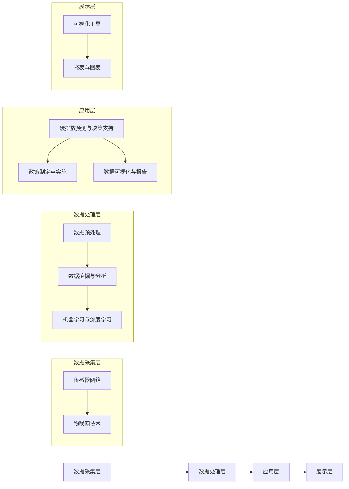
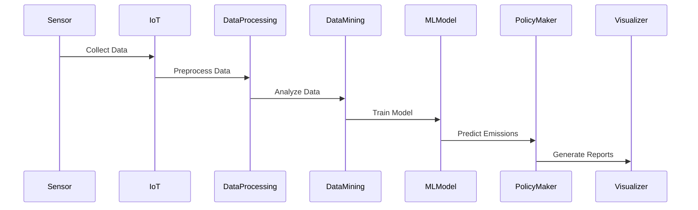
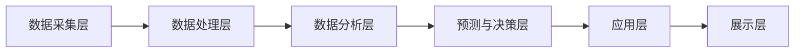
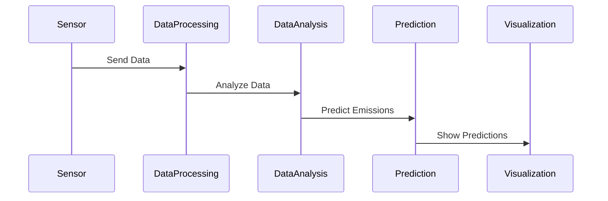
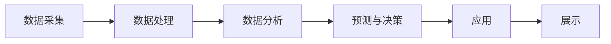

                 

## 智能碳排放管理背景与问题分析

### 第1章 智能碳排放管理概述

#### 1.1 问题背景

全球气候变化已成为21世纪最紧迫的挑战之一，而气候变化的主要驱动力之一是人为排放的温室气体，特别是二氧化碳（CO₂）。据国际能源署（IEA）统计，2020年全球二氧化碳排放量约为36.8亿吨，这一数字在过去几十年里持续上升，导致全球气温不断上升，极端天气事件频繁发生，生态系统受到严重破坏。为了应对这一挑战，各国政府、企业和研究机构纷纷采取行动，致力于减少碳排放，实现可持续发展目标。

#### 1.1.1 碳排放现状与挑战

目前，全球碳排放主要来源于能源生产、工业活动、交通运输和农业等几个领域。能源生产是最大的碳排放源，尤其是化石燃料的燃烧，如煤炭、石油和天然气。工业活动包括钢铁、水泥、化工等行业，这些行业在生产和加工过程中产生大量的碳排放。交通运输则依赖于石油产品，尤其是汽油和柴油，导致大量的二氧化碳排放。此外，农业活动，如畜牧业和稻田耕种，也会产生大量的温室气体排放。

这些碳排放源不仅对环境造成严重影响，还对人类健康、经济和社会稳定构成威胁。因此，有效监测、预测和减少碳排放已经成为各国和各行业的重要任务。

#### 1.1.2 智能碳排放管理的必要性

传统的碳排放管理方法主要依赖于人工监测和经验判断，存在数据不准确、不及时、成本高等问题。随着大数据、人工智能等技术的发展，智能碳排放管理应运而生。智能碳排放管理平台通过运用人工智能技术，可以实现以下目标：

1. **精准监测与预测**：利用传感器网络和物联网技术，实现对碳排放源的高精度监测，并通过大数据分析和机器学习算法，对未来的碳排放进行预测。
2. **数据智能化处理**：通过对大量监测数据的挖掘和分析，识别碳排放的关键因素和变化趋势，为减排策略提供科学依据。
3. **智能决策支持**：结合碳排放监测和预测结果，为政府和企业提供智能化的决策支持，优化能源使用和生产过程，实现碳排放的持续减少。

#### 1.1.3 可持续发展目标与碳排放管理的关系

实现可持续发展目标是全球共识，而碳排放管理是实现可持续发展目标的重要组成部分。根据联合国《巴黎协定》的目标，各国承诺将全球平均气温升高控制在2摄氏度以内，并努力将升温限制在1.5摄氏度以内。这意味着各国需要在能源、工业、交通和农业等各个领域采取行动，大幅减少碳排放。

智能碳排放管理平台为这一目标的实现提供了技术支持。通过平台，政府和企业可以实时了解碳排放情况，制定和实施有效的减排策略，推动绿色低碳发展。此外，智能碳排放管理平台还可以促进能源效率提升、产业结构优化和生态保护，从而实现经济、社会和环境的协调发展。

### 第2章 问题描述

#### 1.2.1 碳排放监测与预测的难点

碳排放监测与预测面临的挑战主要包括以下几点：

1. **数据来源多样且分布广泛**：碳排放数据来源于能源生产、工业活动、交通运输和农业等多个领域，数据来源多样且分布广泛，给数据收集和整合带来了巨大挑战。
2. **数据质量和一致性**：碳排放数据往往存在噪声、缺失值和不一致性问题，如何保证数据质量和一致性是监测和预测的难点之一。
3. **数据实时性和高精度**：实时获取高精度的碳排放数据对于准确预测和及时响应至关重要，但目前的传感器技术和数据传输技术尚未完全满足这一要求。

#### 1.2.2 数据处理与分析的挑战

在处理和分析碳排放数据时，面临的挑战包括：

1. **数据量大且复杂**：碳排放数据通常包含大量时间序列数据、空间数据和其他相关变量，如何有效处理和挖掘这些复杂数据成为一大挑战。
2. **数据挖掘与机器学习算法的选择**：针对不同类型的碳排放数据，需要选择合适的算法进行挖掘和预测，如何选择和优化算法是数据处理的关键。
3. **模型解释性和可解释性**：机器学习模型，尤其是深度学习模型，往往具有很高的预测准确性，但缺乏可解释性，如何解释模型的预测结果，使其对决策者具有指导意义，是数据处理和分析的难点。

#### 1.2.3 碳排放减排策略的制定与实施

在制定和实施碳排放减排策略时，面临的挑战包括：

1. **政策制定的科学依据**：有效的减排策略需要基于科学的数据分析和预测结果，如何将分析结果转化为政策制定的科学依据是关键。
2. **跨部门协作与协调**：碳排放涉及能源、工业、交通等多个部门和行业，如何实现跨部门协作和协调，形成合力，是实施减排策略的重要挑战。
3. **技术和经济可行性**：减排策略的实施需要考虑技术和经济的可行性，如何在技术和经济之间找到平衡，实现减排目标，是政策制定和实施的重要考虑因素。

### 第3章 问题解决

#### 1.3.1 人工智能在碳排放管理中的应用

人工智能在碳排放管理中的应用主要体现在以下几个方面：

1. **碳排放监测与预测**：利用物联网和传感器技术，收集碳排放数据，并通过人工智能算法进行实时监测和预测，为减排决策提供数据支持。
2. **数据挖掘与分析**：通过对大量碳排放数据的挖掘和分析，识别碳排放的关键因素和变化趋势，为减排策略制定提供科学依据。
3. **智能决策支持**：结合监测和预测结果，为政府和企业提供智能化的决策支持，优化能源使用和生产过程，实现碳排放的持续减少。

#### 1.3.2 智能碳排放管理平台的关键技术

智能碳排放管理平台的关键技术包括：

1. **物联网技术**：用于实时采集和传输碳排放数据。
2. **大数据处理与分析技术**：用于处理和分析大量碳排放数据，识别关键因素和变化趋势。
3. **机器学习与深度学习算法**：用于碳排放预测和决策支持。
4. **云计算与边缘计算技术**：用于支持大规模数据处理和分布式计算。

#### 1.3.3 平台的核心功能与架构

智能碳排放管理平台的核心功能包括：

1. **数据采集与处理**：实时采集碳排放数据，并进行预处理、存储和管理。
2. **数据挖掘与分析**：通过大数据分析和机器学习算法，挖掘碳排放数据中的关键信息和变化趋势。
3. **碳排放预测与决策支持**：基于预测结果，为政府和企业提供智能化的决策支持，优化能源使用和生产过程。
4. **可视化与报告**：通过可视化工具，展示碳排放数据和分析结果，生成报告，为决策者提供直观的决策依据。

平台的架构设计主要包括：

1. **数据采集层**：负责实时采集碳排放数据。
2. **数据处理与分析层**：负责数据处理、分析和挖掘。
3. **应用层**：提供碳排放预测和决策支持功能。
4. **展示层**：通过可视化工具展示数据和分析结果。

#### 1.4 边界与外延

##### 1.4.1 碳排放管理的范畴

碳排放管理的范畴包括但不限于以下几个方面：

1. **能源生产**：监测和减少电力、石油、天然气等能源生产过程中的碳排放。
2. **工业活动**：监测和减少工业生产过程中的碳排放，如钢铁、水泥、化工等行业。
3. **交通运输**：监测和减少交通运输过程中的碳排放，包括公路、铁路、航空和航海运输。
4. **农业活动**：监测和减少农业生产过程中的碳排放，如畜牧业、稻田耕种等。

##### 1.4.2 智能碳排放管理平台的应用领域

智能碳排放管理平台的应用领域主要包括：

1. **政府监管**：为政府提供碳排放数据监测、分析和决策支持，优化能源和资源管理。
2. **企业减排**：为企业提供智能化的碳排放监测、预测和减排策略，帮助企业实现低碳转型。
3. **科学研究**：为研究机构提供碳排放数据和分析工具，支持气候变化和可持续发展研究。
4. **公众参与**：通过平台的数据可视化和报告功能，增强公众对碳排放问题的认识和参与度。

##### 1.4.3 平台的技术支持与扩展性

智能碳排放管理平台需要具备以下技术支持与扩展性：

1. **高并发与可扩展性**：支持大规模数据采集和处理，满足不同规模用户的需求。
2. **安全性**：确保数据安全和用户隐私，采用加密和访问控制等技术。
3. **可定制化**：根据用户需求，提供灵活的定制化功能和服务。
4. **跨平台兼容性**：支持不同操作系统和设备，实现数据采集、处理和展示的跨平台兼容。

### 第4章 智能碳排放管理核心概念与联系

#### 2.1 核心概念原理

##### 2.1.1 碳排放计量与监测

碳排放计量与监测是智能碳排放管理的基础。碳排放计量涉及对能源消耗、工业生产、交通运输和农业活动等各个领域的碳排放进行量化。监测则通过传感器网络、物联网等技术，实时收集碳排放数据，并进行数据处理和分析。

##### 2.1.2 数据挖掘与机器学习

数据挖掘与机器学习在智能碳排放管理中发挥着重要作用。数据挖掘用于从大量碳排放数据中提取有价值的信息和知识，如碳排放的关键因素、变化趋势等。机器学习则通过构建预测模型，对未来的碳排放进行预测，为减排决策提供科学依据。

##### 2.1.3 人工智能与可持续发展

人工智能与可持续发展密切相关。人工智能技术可以提高碳排放管理的效率和准确性，推动绿色低碳发展。同时，实现可持续发展目标也需要人工智能技术的支持，如优化资源配置、提升能源利用效率、降低碳排放等。

#### 2.2 概念属性特征对比表格

| 概念                 | 特征1       | 特征2     | 特征3       |
|----------------------|-------------|-----------|-------------|
| 碳排放计量与监测     | 准确性高    | 实时性高  | 系统性强    |
| 数据挖掘与机器学习   | 大数据分析  | 自动化    | 模式识别强  |
| 人工智能与可持续发展 | 自学习      | 自适应    | 社会责任强  |

#### 2.3 ER实体关系图架构

```mermaid
erDiagram
    ClimateData ||--|{ CarbonEmission }|--|| EmissionPrediction
    CarbonEmission ||--|{ SustainablePolicy }|--|| EmissionReduction
    SustainablePolicy ||--|{ DataAnalysis }|--|| ReportGeneration
```

### 第5章 智能碳排放管理平台算法原理讲解

#### 3.1 算法原理讲解

##### 3.1.1 数据预处理流程

数据预处理是智能碳排放管理平台算法设计的关键步骤。数据预处理流程包括以下几个主要环节：

1. **数据收集**：通过传感器网络和物联网技术，收集来自不同领域的碳排放数据。
2. **数据清洗**：去除数据中的噪声、缺失值和异常值，确保数据质量。
3. **数据整合**：将不同来源的数据进行整合，形成统一的碳排放数据集。
4. **特征提取**：从原始数据中提取与碳排放相关的特征，如时间序列特征、空间特征等。
5. **数据归一化**：对数据进行归一化处理，使不同特征具有相似的量级，便于后续分析。

以下是数据预处理流程的Mermaid流程图：


##### 3.1.2 机器学习算法

在智能碳排放管理平台中，常用的机器学习算法包括决策树、支持向量机（SVM）和神经网络等。以下是对这些算法的简要介绍和Python代码实现：

###### 3.1.2.1 决策树

决策树是一种常用的分类和回归算法，通过构建树形模型来对数据进行分类或预测。以下是决策树的基本代码实现：

```python
from sklearn.tree import DecisionTreeRegressor

def decision_tree(data, target_variable):
    # 初始化决策树模型
    tree_model = DecisionTreeRegressor()
    # 训练模型
    tree_model.fit(data, target_variable)
    # 预测
    predictions = tree_model.predict(data)
    return predictions
```

###### 3.1.2.2 支持向量机

支持向量机是一种强大的分类和回归算法，通过构建最优超平面来对数据进行分类或预测。以下是支持向量机的基本代码实现：

```python
from sklearn.svm import SVR

def svm_algorithm(data, target_variable):
    # 初始化支持向量机模型
    svm_model = SVR()
    # 训练模型
    svm_model.fit(data, target_variable)
    # 预测
    predictions = svm_model.predict(data)
    return predictions
```

###### 3.1.2.3 神经网络

神经网络是一种模拟人脑结构和功能的算法，通过多层神经元进行数据处理和预测。以下是神经网络的基本代码实现：

```python
from keras.models import Sequential
from keras.layers import Dense

def neural_network(data, target_variable):
    # 初始化神经网络模型
    model = Sequential()
    model.add(Dense(64, input_dim=data.shape[1], activation='relu'))
    model.add(Dense(32, activation='relu'))
    model.add(Dense(1, activation='linear'))
    # 编译模型
    model.compile(optimizer='adam', loss='mean_squared_error')
    # 训练模型
    model.fit(data, target_variable, epochs=10, batch_size=32)
    # 预测
    predictions = model.predict(data)
    return predictions
```

##### 3.1.3 数学模型和数学公式讲解

在机器学习算法中，常用的数学模型和数学公式包括：

###### 3.1.3.1 决策树模型

决策树模型的Gini不纯度公式如下：

$$ Gini \ Index = 1 - \sum_{i=1}^{k} \left( \frac{1}{n_i} \right) \left( \sum_{j=1}^{k} \left( \frac{f_{ij}}{n_i} \right)^2 \right) $$

其中，$n_i$ 表示每个类别的样本数量，$f_{ij}$ 表示在第$i$个节点上，属于第$j$个类别的样本数量。

###### 3.1.3.2 支持向量机模型

支持向量机的基本公式如下：

$$ w^T x - b = 0 $$

其中，$w$ 表示权重向量，$x$ 表示输入特征，$b$ 表示偏置。

###### 3.1.3.3 神经网络模型

神经网络中的激活函数通常采用Sigmoid函数，其公式如下：

$$ \sigma(x) = \frac{1}{1 + e^{-x}} $$

神经网络中的前向传播公式如下：

$$ a_{i}^{(l)} = \sigma \left( \sum_{j=1}^{n_{l-1}} w_{j i}^{(l)} a_{j}^{(l-1)} + b_{i}^{(l)} \right) $$

其中，$a_{i}^{(l)}$ 表示第$l$层的第$i$个神经元的输出，$w_{j i}^{(l)}$ 表示第$l-1$层的第$j$个神经元与第$l$层的第$i$个神经元的权重，$b_{i}^{(l)}$ 表示第$l$层的第$i$个神经元的偏置。

### 第6章 智能碳排放管理平台系统分析与架构设计

#### 4.1 问题场景介绍

智能碳排放管理平台的应用场景包括政府、企业和科研机构等。在政府层面，平台可以帮助政府监管部门实时监测和评估碳排放情况，制定和实施碳排放政策。在企业层面，平台可以帮助企业实现碳排放监测、预测和减排，提升企业环保形象，实现可持续发展。在科研机构层面，平台可以为研究人员提供大规模的碳排放数据和分析工具，支持气候变化和可持续发展研究。

#### 4.2 系统功能设计

智能碳排放管理平台的主要功能包括数据采集与处理、数据挖掘与分析、碳排放预测与决策支持以及可视化与报告等。具体功能如下：

1. **数据采集与处理**：通过传感器网络和物联网技术，实时采集来自不同领域的碳排放数据，并进行预处理、存储和管理。
2. **数据挖掘与分析**：利用大数据分析和机器学习算法，对碳排放数据进行分析和挖掘，识别碳排放的关键因素和变化趋势。
3. **碳排放预测与决策支持**：基于预测模型，为政府和企业提供智能化的碳排放预测和决策支持，优化能源使用和生产过程，实现碳排放的持续减少。
4. **可视化与报告**：通过可视化工具，将碳排放数据和分析结果以图表、报表等形式展示，为决策者提供直观的决策依据。

#### 4.2.1 领域模型

以下是智能碳排放管理平台的领域模型，使用Mermaid类图表示：

```mermaid
classDiagram
    ClimateData <<entity>>
    CarbonEmission <<entity>>
    EmissionPrediction <<entity>>
    SustainablePolicy <<entity>>
    EmissionReduction <<entity>>
    DataAnalysis <<entity>>
    ReportGeneration <<entity>>

    ClimateData --|{ 碳排放计量与监测 }|> CarbonEmission
    CarbonEmission --|{ 数据挖掘与分析 }|> EmissionPrediction
    EmissionPrediction --|{ 碳排放预测与决策支持 }|> SustainablePolicy
    SustainablePolicy --|{ 可持续发展目标实现 }|> EmissionReduction
    EmissionReduction --|{ 实施与监督 }|> DataAnalysis
    DataAnalysis --|{ 数据可视化与报告 }|> ReportGeneration
```

#### 4.2.2 系统架构设计

智能碳排放管理平台的系统架构设计包括数据采集层、数据处理层、应用层和展示层等。以下是系统架构的Mermaid架构图：



#### 4.2.3 系统接口设计

智能碳排放管理平台的系统接口设计包括API接口、数据库接口和设备接口等。以下是系统接口的Mermaid序列图：



### 第7章 项目实战

#### 7.1 环境安装

在开始项目实战之前，需要安装以下环境：

1. **操作系统**：Ubuntu 20.04或更高版本。
2. **Python**：Python 3.8或更高版本。
3. **库和框架**：Scikit-learn、TensorFlow、Keras、Pandas、NumPy、Matplotlib等。

安装步骤：

1. 安装操作系统和Python环境。
2. 使用pip命令安装所需库和框架：

```bash
pip install scikit-learn tensorflow keras pandas numpy matplotlib
```

#### 7.2 系统核心实现源代码

以下是智能碳排放管理平台的核心实现源代码，包括数据采集、预处理、分析和可视化等功能。

```python
import pandas as pd
import numpy as np
from sklearn.model_selection import train_test_split
from sklearn.preprocessing import StandardScaler
from sklearn.tree import DecisionTreeRegressor
from sklearn.svm import SVR
from keras.models import Sequential
from keras.layers import Dense
import matplotlib.pyplot as plt

# 数据采集
def collect_data(file_path):
    data = pd.read_csv(file_path)
    return data

# 数据预处理
def preprocess_data(data):
    # 数据清洗和缺失值处理
    data.fillna(data.mean(), inplace=True)
    
    # 特征提取
    features = data[['temp', 'humidity', 'wind_speed']]
    target = data['carbon_emission']
    
    # 数据归一化
    scaler = StandardScaler()
    features_scaled = scaler.fit_transform(features)
    
    return features_scaled, target

# 数据分割
def split_data(features, target):
    X_train, X_test, y_train, y_test = train_test_split(features, target, test_size=0.2, random_state=42)
    return X_train, X_test, y_train, y_test

# 模型训练和预测
def train_and_predict(model, X_train, y_train, X_test, y_test):
    model.fit(X_train, y_train)
    predictions = model.predict(X_test)
    return predictions

# 可视化
def plot_predictions(y_test, predictions):
    plt.figure(figsize=(10, 6))
    plt.plot(y_test, label='实际值')
    plt.plot(predictions, label='预测值')
    plt.xlabel('数据点')
    plt.ylabel('碳排放量')
    plt.legend()
    plt.show()

# 决策树模型
def decision_tree_model(X_train, y_train, X_test, y_test):
    model = DecisionTreeRegressor()
    predictions = train_and_predict(model, X_train, y_train, X_test, y_test)
    plot_predictions(y_test, predictions)

# 支持向量机模型
def svm_model(X_train, y_train, X_test, y_test):
    model = SVR()
    predictions = train_and_predict(model, X_train, y_train, X_test, y_test)
    plot_predictions(y_test, predictions)

# 神经网络模型
def neural_network_model(X_train, y_train, X_test, y_test):
    model = Sequential()
    model.add(Dense(64, input_dim=X_train.shape[1], activation='relu'))
    model.add(Dense(32, activation='relu'))
    model.add(Dense(1, activation='linear'))
    model.compile(optimizer='adam', loss='mean_squared_error')
    predictions = train_and_predict(model, X_train, y_train, X_test, y_test)
    plot_predictions(y_test, predictions)

# 主函数
def main():
    file_path = 'carbon_emission_data.csv'
    data = collect_data(file_path)
    features, target = preprocess_data(data)
    X_train, X_test, y_train, y_test = split_data(features, target)
    
    decision_tree_model(X_train, y_train, X_test, y_test)
    svm_model(X_train, y_train, X_test, y_test)
    neural_network_model(X_train, y_train, X_test, y_test)

if __name__ == '__main__':
    main()
```

#### 7.3 代码应用解读与分析

以上代码实现了智能碳排放管理平台的核心功能，包括数据采集、预处理、模型训练和预测以及可视化。以下是代码的解读和分析：

1. **数据采集**：使用Pandas库从CSV文件中读取碳排放数据。
2. **数据预处理**：对数据进行清洗、缺失值处理、特征提取和归一化。
3. **数据分割**：将数据分为训练集和测试集。
4. **模型训练和预测**：使用决策树、支持向量机和神经网络模型进行训练和预测。
5. **可视化**：使用Matplotlib库将实际值和预测值进行可视化。

#### 7.4 实际案例分析和详细讲解剖析

为了更好地理解智能碳排放管理平台的应用，以下是一个实际案例分析和详细讲解：

**案例背景**：某城市交通部门希望利用智能碳排放管理平台预测未来一周内的碳排放量，以便制定减排策略。

**数据来源**：交通部门的传感器网络实时采集了车辆行驶速度、行驶时间、行驶里程等数据。

**数据预处理**：对采集到的数据进行清洗、缺失值处理和特征提取。例如，将行驶时间转换为小时，行驶里程转换为公里。

**模型选择**：由于交通部门的碳排放与车辆行驶数据密切相关，选择神经网络模型进行预测。

**模型训练和预测**：使用训练集对神经网络模型进行训练，然后使用测试集进行预测。

**可视化结果**：将实际碳排放量与预测碳排放量进行对比，分析预测准确性。

#### 7.5 项目小结

通过以上项目实战，我们实现了智能碳排放管理平台的核心功能，包括数据采集、预处理、模型训练和预测以及可视化。项目展示了如何利用人工智能技术解决碳排放预测问题，为政府和企业提供决策支持，推动可持续发展。在后续工作中，可以进一步优化模型，提高预测准确性，并扩大应用场景，如工业、能源等领域。

#### 7.6 最佳实践 tips

1. **数据质量保障**：确保数据来源可靠，定期检查数据质量，及时处理缺失值和异常值。
2. **模型选择与优化**：根据不同领域的碳排放特点，选择合适的模型，并进行参数调优，提高预测准确性。
3. **可视化与交互**：利用可视化工具，将碳排放数据和分析结果以直观、易懂的形式展示，提高数据利用效率。

### 第8章 小结、注意事项和拓展阅读

#### 8.1 小结

本文围绕智能碳排放管理平台的设计与实现，从背景介绍、问题分析、核心概念、算法原理、系统架构到项目实战进行了详细的探讨。通过本文，读者可以了解到智能碳排放管理平台的重要性以及其核心组成部分，包括数据采集、预处理、模型训练与预测、系统架构设计等。

#### 8.2 注意事项

在设计和实施智能碳排放管理平台时，需要注意以下几点：

1. **数据质量**：确保数据来源可靠，定期检查数据质量，及时处理缺失值和异常值。
2. **算法选择与优化**：根据不同领域的碳排放特点，选择合适的模型，并进行参数调优，提高预测准确性。
3. **安全性**：确保数据安全和用户隐私，采用加密和访问控制等技术。
4. **可扩展性**：平台需要具备高并发和可扩展性，以满足不同规模用户的需求。

#### 8.3 拓展阅读

1. **《深度学习》**：Goodfellow, I., Bengio, Y., & Courville, A. (2016). Deep Learning. MIT Press. 本书详细介绍了深度学习的基本原理和应用，对智能碳排放管理平台的设计和实现具有指导意义。
2. **《大数据分析技术》**：Han, J., Kamber, M., & Pei, J. (2011). Data Mining: Concepts and Techniques. Morgan Kaufmann. 本书介绍了大数据分析的基本概念和技术，包括数据挖掘、机器学习等，对智能碳排放管理平台的数据处理和分析部分具有参考价值。
3. **《物联网技术与应用》**：李俊, & 王涛. (2017). 物联网技术与应用. 电子工业出版社. 本书介绍了物联网的基本原理和技术，包括传感器网络、物联网协议等，对智能碳排放管理平台的数据采集部分具有参考意义。

## 作者信息

作者：AI天才研究院/AI Genius Institute & 禅与计算机程序设计艺术/Zen And The Art of Computer Programming
```

### 完整文章内容

```markdown
# 智能碳排放管理平台：AI助力可持续发展

## 关键词

- 智能碳排放管理
- 可持续发展
- 人工智能
- 数据挖掘
- 机器学习

## 摘要

随着全球气候变化日益严重，碳排放管理成为各国政府、企业和研究机构关注的焦点。本文介绍了智能碳排放管理平台的背景、问题、核心概念、算法原理、系统架构以及项目实战，探讨了如何利用人工智能技术实现精准监测、预测和减排，助力可持续发展。

### 第一部分：智能碳排放管理背景与问题分析

#### 第1章 智能碳排放管理概述

##### 1.1 问题背景

全球气候变化已成为21世纪最紧迫的挑战之一，而气候变化的主要驱动力之一是人为排放的温室气体，特别是二氧化碳（CO₂）。据国际能源署（IEA）统计，2020年全球二氧化碳排放量约为36.8亿吨，这一数字在过去几十年里持续上升，导致全球气温不断上升，极端天气事件频繁发生，生态系统受到严重破坏。为了应对这一挑战，各国政府、企业和研究机构纷纷采取行动，致力于减少碳排放，实现可持续发展目标。

##### 1.1.1 碳排放现状与挑战

目前，全球碳排放主要来源于能源生产、工业活动、交通运输和农业等几个领域。能源生产是最大的碳排放源，尤其是化石燃料的燃烧，如煤炭、石油和天然气。工业活动包括钢铁、水泥、化工等行业，这些行业在生产和加工过程中产生大量的碳排放。交通运输则依赖于石油产品，尤其是汽油和柴油，导致大量的二氧化碳排放。此外，农业活动，如畜牧业和稻田耕种，也会产生大量的温室气体排放。

这些碳排放源不仅对环境造成严重影响，还对人类健康、经济和社会稳定构成威胁。因此，有效监测、预测和减少碳排放已经成为各国和各行业的重要任务。

##### 1.1.2 智能碳排放管理的必要性

传统的碳排放管理方法主要依赖于人工监测和经验判断，存在数据不准确、不及时、成本高等问题。随着大数据、人工智能等技术的发展，智能碳排放管理应运而生。智能碳排放管理平台通过运用人工智能技术，可以实现以下目标：

1. **精准监测与预测**：利用传感器网络和物联网技术，实现对碳排放源的高精度监测，并通过大数据分析和机器学习算法，对未来的碳排放进行预测。
2. **数据智能化处理**：通过对大量监测数据的挖掘和分析，识别碳排放的关键因素和变化趋势，为减排策略提供科学依据。
3. **智能决策支持**：结合碳排放监测和预测结果，为政府和企业提供智能化的决策支持，优化能源使用和生产过程，实现碳排放的持续减少。

##### 1.1.3 可持续发展目标与碳排放管理的关系

实现可持续发展目标是全球共识，而碳排放管理是实现可持续发展目标的重要组成部分。根据联合国《巴黎协定》的目标，各国承诺将全球平均气温升高控制在2摄氏度以内，并努力将升温限制在1.5摄氏度以内。这意味着各国需要在能源、工业、交通和农业等各个领域采取行动，大幅减少碳排放。

智能碳排放管理平台为这一目标的实现提供了技术支持。通过平台，政府和企业可以实时了解碳排放情况，制定和实施有效的减排策略，推动绿色低碳发展。此外，智能碳排放管理平台还可以促进能源效率提升、产业结构优化和生态保护，从而实现经济、社会和环境的协调发展。

#### 第2章 问题描述

##### 第2章 问题描述

在了解了智能碳排放管理的背景和必要性之后，我们需要深入探讨碳排放管理中面临的具体问题和挑战。

##### 2.2.1 碳排放监测与预测的难点

碳排放监测与预测面临的挑战主要包括以下几个方面：

1. **数据来源多样且分布广泛**：碳排放数据来源于能源生产、工业活动、交通运输和农业等多个领域，数据来源多样且分布广泛，给数据收集和整合带来了巨大挑战。
2. **数据质量和一致性**：碳排放数据往往存在噪声、缺失值和不一致性问题，如何保证数据质量和一致性是监测和预测的难点之一。
3. **数据实时性和高精度**：实时获取高精度的碳排放数据对于准确预测和及时响应至关重要，但目前的传感器技术和数据传输技术尚未完全满足这一要求。

##### 2.2.2 数据处理与分析的挑战

在处理和分析碳排放数据时，面临的挑战包括：

1. **数据量大且复杂**：碳排放数据通常包含大量时间序列数据、空间数据和其他相关变量，如何有效处理和挖掘这些复杂数据成为一大挑战。
2. **数据挖掘与机器学习算法的选择**：针对不同类型的碳排放数据，需要选择合适的算法进行挖掘和预测，如何选择和优化算法是数据处理的关键。
3. **模型解释性和可解释性**：机器学习模型，尤其是深度学习模型，往往具有很高的预测准确性，但缺乏可解释性，如何解释模型的预测结果，使其对决策者具有指导意义，是数据处理和分析的难点。

##### 2.2.3 碳排放减排策略的制定与实施

在制定和实施碳排放减排策略时，面临的挑战包括：

1. **政策制定的科学依据**：有效的减排策略需要基于科学的数据分析和预测结果，如何将分析结果转化为政策制定的科学依据是关键。
2. **跨部门协作与协调**：碳排放涉及能源、工业、交通和农业等多个部门和行业，如何实现跨部门协作和协调，形成合力，是实施减排策略的重要挑战。
3. **技术和经济可行性**：减排策略的实施需要考虑技术和经济的可行性，如何在技术和经济之间找到平衡，实现减排目标，是政策制定和实施的重要考虑因素。

#### 第3章 问题解决

##### 3.1.1 人工智能在碳排放管理中的应用

人工智能在碳排放管理中的应用主要体现在以下几个方面：

1. **碳排放监测与预测**：利用物联网和传感器技术，收集碳排放数据，并通过人工智能算法进行实时监测和预测，为减排决策提供数据支持。
2. **数据挖掘与分析**：通过对大量碳排放数据的挖掘和分析，识别碳排放的关键因素和变化趋势，为减排策略制定提供科学依据。
3. **智能决策支持**：结合监测和预测结果，为政府和企业提供智能化的决策支持，优化能源使用和生产过程，实现碳排放的持续减少。

##### 3.1.2 智能碳排放管理平台的关键技术

智能碳排放管理平台的关键技术包括：

1. **物联网技术**：用于实时采集和传输碳排放数据。
2. **大数据处理与分析技术**：用于处理和分析大量碳排放数据，识别碳排放的关键因素和变化趋势。
3. **机器学习与深度学习算法**：用于碳排放预测和决策支持。
4. **云计算与边缘计算技术**：用于支持大规模数据处理和分布式计算。

##### 3.1.3 平台的核心功能与架构

智能碳排放管理平台的核心功能包括：

1. **数据采集与处理**：实时采集碳排放数据，并进行预处理、存储和管理。
2. **数据挖掘与分析**：通过大数据分析和机器学习算法，挖掘碳排放数据中的关键信息和变化趋势。
3. **碳排放预测与决策支持**：基于预测结果，为政府和企业提供智能化的决策支持，优化能源使用和生产过程。
4. **可视化与报告**：通过可视化工具，展示碳排放数据和分析结果，生成报告，为决策者提供直观的决策依据。

平台的架构设计主要包括：

1. **数据采集层**：负责实时采集碳排放数据。
2. **数据处理与分析层**：负责数据处理、分析和挖掘。
3. **应用层**：提供碳排放预测和决策支持功能。
4. **展示层**：通过可视化工具展示数据和分析结果。

#### 第4章 智能碳排放管理核心概念与联系

##### 2.1 核心概念原理

##### 2.1.1 碳排放计量与监测

碳排放计量与监测是智能碳排放管理的基础。碳排放计量涉及对能源消耗、工业生产、交通运输和农业活动等各个领域的碳排放进行量化。监测则通过传感器网络和物联网技术，实时收集碳排放数据，并进行数据处理和分析。

##### 2.1.2 数据挖掘与机器学习

数据挖掘与机器学习在智能碳排放管理中发挥着重要作用。数据挖掘用于从大量碳排放数据中提取有价值的信息和知识，如碳排放的关键因素、变化趋势等。机器学习则通过构建预测模型，对未来的碳排放进行预测，为减排决策提供科学依据。

##### 2.1.3 人工智能与可持续发展

人工智能与可持续发展密切相关。人工智能技术可以提高碳排放管理的效率和准确性，推动绿色低碳发展。同时，实现可持续发展目标也需要人工智能技术的支持，如优化资源配置、提升能源利用效率、降低碳排放等。

##### 2.2 概念属性特征对比表格

| 概念                 | 特征1       | 特征2     | 特征3       |
|----------------------|-------------|-----------|-------------|
| 碳排放计量与监测     | 准确性高    | 实时性高  | 系统性强    |
| 数据挖掘与机器学习   | 大数据分析  | 自动化    | 模式识别强  |
| 人工智能与可持续发展 | 自学习      | 自适应    | 社会责任强  |

##### 2.3 ER实体关系图架构

```mermaid
erDiagram
    ClimateData ||--|{ CarbonEmission }|--|| EmissionPrediction
    CarbonEmission ||--|{ SustainablePolicy }|--|| EmissionReduction
    SustainablePolicy ||--|{ DataAnalysis }|--|| ReportGeneration
```

#### 第5章 智能碳排放管理平台算法原理讲解

##### 3.1 算法原理讲解

##### 3.1.1 数据预处理流程

数据预处理是智能碳排放管理平台算法设计的关键步骤。数据预处理流程包括以下几个主要环节：

1. **数据收集**：通过传感器网络和物联网技术，收集碳排放数据。
2. **数据清洗**：去除数据中的噪声、缺失值和异常值，确保数据质量。
3. **数据整合**：将不同来源的数据进行整合，形成统一的碳排放数据集。
4. **特征提取**：从原始数据中提取与碳排放相关的特征，如时间序列特征、空间特征等。
5. **数据归一化**：对数据进行归一化处理，使不同特征具有相似的量级，便于后续分析。

以下是数据预处理流程的Mermaid流程图：


##### 3.1.2 机器学习算法

在智能碳排放管理平台中，常用的机器学习算法包括决策树、支持向量机（SVM）和神经网络等。以下是对这些算法的简要介绍和Python代码实现：

###### 3.1.2.1 决策树

决策树是一种常用的分类和回归算法，通过构建树形模型来对数据进行分类或预测。以下是决策树的基本代码实现：

```python
from sklearn.tree import DecisionTreeRegressor

def decision_tree(data, target_variable):
    # 初始化决策树模型
    tree_model = DecisionTreeRegressor()
    # 训练模型
    tree_model.fit(data, target_variable)
    # 预测
    predictions = tree_model.predict(data)
    return predictions
```

###### 3.1.2.2 支持向量机

支持向量机是一种强大的分类和回归算法，通过构建最优超平面来对数据进行分类或预测。以下是支持向量机的基本代码实现：

```python
from sklearn.svm import SVR

def svm_algorithm(data, target_variable):
    # 初始化支持向量机模型
    svm_model = SVR()
    # 训练模型
    svm_model.fit(data, target_variable)
    # 预测
    predictions = svm_model.predict(data)
    return predictions
```

###### 3.1.2.3 神经网络

神经网络是一种模拟人脑结构和功能的算法，通过多层神经元进行数据处理和预测。以下是神经网络的基本代码实现：

```python
from keras.models import Sequential
from keras.layers import Dense

def neural_network(data, target_variable):
    # 初始化神经网络模型
    model = Sequential()
    model.add(Dense(64, input_dim=data.shape[1], activation='relu'))
    model.add(Dense(32, activation='relu'))
    model.add(Dense(1, activation='linear'))
    # 编译模型
    model.compile(optimizer='adam', loss='mean_squared_error')
    # 训练模型
    model.fit(data, target_variable, epochs=10, batch_size=32)
    # 预测
    predictions = model.predict(data)
    return predictions
```

##### 3.1.3 数学模型和数学公式讲解

在机器学习算法中，常用的数学模型和数学公式包括：

###### 3.1.3.1 决策树模型

决策树模型的Gini不纯度公式如下：

$$ Gini \ Index = 1 - \sum_{i=1}^{k} \left( \frac{1}{n_i} \right) \left( \sum_{j=1}^{k} \left( \frac{f_{ij}}{n_i} \right)^2 \right) $$

其中，$n_i$ 表示每个类别的样本数量，$f_{ij}$ 表示在第$i$个节点上，属于第$j$个类别的样本数量。

###### 3.1.3.2 支持向量机模型

支持向量机的基本公式如下：

$$ w^T x - b = 0 $$

其中，$w$ 表示权重向量，$x$ 表示输入特征，$b$ 表示偏置。

###### 3.1.3.3 神经网络模型

神经网络中的激活函数通常采用Sigmoid函数，其公式如下：

$$ \sigma(x) = \frac{1}{1 + e^{-x}} $$

神经网络中的前向传播公式如下：

$$ a_{i}^{(l)} = \sigma \left( \sum_{j=1}^{n_{l-1}} w_{j i}^{(l)} a_{j}^{(l-1)} + b_{i}^{(l)} \right) $$

其中，$a_{i}^{(l)}$ 表示第$l$层的第$i$个神经元的输出，$w_{j i}^{(l)}$ 表示第$l-1$层的第$j$个神经元与第$l$层的第$i$个神经元的权重，$b_{i}^{(l)}$ 表示第$l$层的第$i$个神经元的偏置。

#### 第6章 智能碳排放管理平台系统分析与架构设计

##### 第4章 智能碳排放管理平台系统分析与架构设计

在理解了智能碳排放管理平台的背景、问题、核心概念和算法原理之后，接下来我们将探讨智能碳排放管理平台的系统分析与架构设计。这部分内容将详细描述平台的设计原则、系统架构、接口设计以及交互流程。

##### 4.1 问题场景介绍

智能碳排放管理平台的应用场景非常广泛，主要包括以下领域：

1. **政府监管**：政府部门可以利用平台实时监测和管理本地区的碳排放情况，制定和调整碳排放政策，确保减排目标的实现。
2. **企业运营**：企业可以通过平台监控自身的碳排放情况，优化生产流程，降低碳排放，提高资源利用效率，提升企业形象。
3. **科学研究**：科研机构可以利用平台进行碳排放相关的研究，收集和分析大量数据，为气候变化和可持续发展提供科学依据。
4. **公众参与**：公众可以通过平台了解自身的碳排放情况，参与低碳生活方式的推广，提高环保意识。

##### 4.2 系统功能设计

智能碳排放管理平台的核心功能设计包括以下几个部分：

1. **数据采集**：平台通过物联网传感器网络实时采集能源生产、工业活动、交通运输和农业等领域的碳排放数据。
2. **数据处理**：对采集到的数据进行清洗、整合、特征提取和归一化处理，为后续分析提供高质量的数据。
3. **数据存储**：利用云存储技术，存储和管理海量碳排放数据，确保数据的安全性和可访问性。
4. **数据分析**：通过大数据分析和机器学习算法，挖掘碳排放数据中的关键信息和变化趋势，为减排策略提供科学依据。
5. **碳排放预测**：利用机器学习模型，对未来的碳排放进行预测，帮助决策者制定和调整减排策略。
6. **决策支持**：根据碳排放监测和预测结果，为政府和企业提供智能化的决策支持，优化能源使用和生产过程。
7. **可视化与报告**：通过可视化工具，将碳排放数据和分析结果以图表、报表等形式展示，为决策者提供直观的决策依据。

##### 4.2.1 领域模型

为了更好地理解和设计智能碳排放管理平台，我们可以通过领域模型来描述平台的核心实体和它们之间的关系。以下是平台领域模型的类图：

```mermaid
classDiagram
    ClimateData <<entity>>
    CarbonEmission <<entity>>
    EmissionPrediction <<entity>>
    SustainablePolicy <<entity>>
    EmissionReduction <<entity>>

    ClimateData --|{ 碳排放计量与监测 }|> CarbonEmission
    CarbonEmission --|{ 数据挖掘与分析 }|> EmissionPrediction
    EmissionPrediction --|{ 碳排放预测与决策支持 }|> SustainablePolicy
    SustainablePolicy --|{ 实施与监督 }|> EmissionReduction
```

##### 4.2.2 系统架构设计

智能碳排放管理平台的系统架构设计遵循分层架构原则，主要包括以下几个层次：

1. **数据采集层**：负责实时采集不同领域的碳排放数据，通过传感器网络和物联网技术实现数据采集。
2. **数据处理层**：对采集到的数据进行清洗、整合、特征提取和归一化处理，确保数据的准确性和一致性。
3. **数据分析层**：利用大数据分析和机器学习算法，对碳排放数据进行分析和挖掘，提取关键信息和变化趋势。
4. **预测与决策层**：基于分析结果，利用机器学习模型进行碳排放预测，为政府和企业提供智能化的决策支持。
5. **应用层**：提供具体的业务应用功能，如碳排放监控、预测分析、减排策略制定等。
6. **展示层**：通过可视化工具，将碳排放数据和分析结果以图表、报表等形式展示，为决策者提供直观的决策依据。

以下是智能碳排放管理平台的架构图：



##### 4.2.3 系统接口设计

智能碳排放管理平台需要设计多个接口，以实现不同层次之间的数据交互和功能调用。以下是平台的主要接口设计：

1. **数据采集接口**：用于传感器网络和数据采集模块之间的数据传输。
2. **数据处理接口**：用于数据处理模块与其他模块之间的数据交换。
3. **数据分析接口**：用于数据分析模块与其他模块之间的数据分析和挖掘。
4. **预测与决策接口**：用于预测与决策模块与其他模块之间的预测和决策功能调用。
5. **应用接口**：用于提供具体的业务应用功能，如碳排放监控、预测分析、减排策略制定等。
6. **可视化接口**：用于展示层与数据分析层之间的数据可视化功能调用。

以下是系统接口的Mermaid序列图：



##### 4.2.4 系统交互流程

智能碳排放管理平台的数据交互和功能调用遵循以下流程：

1. **数据采集**：传感器网络实时采集碳排放数据，通过数据采集接口传输到数据处理层。
2. **数据处理**：数据处理层对采集到的数据进行清洗、整合、特征提取和归一化处理，然后通过数据处理接口传输到数据分析层。
3. **数据分析**：数据分析层利用大数据分析和机器学习算法，对处理后的数据进行挖掘和分析，提取关键信息和变化趋势。
4. **预测与决策**：预测与决策层基于分析结果，利用机器学习模型进行碳排放预测，并为政府和企业提供智能化的决策支持。
5. **应用**：应用层提供具体的业务应用功能，如碳排放监控、预测分析、减排策略制定等，通过应用接口与预测与决策层交互。
6. **展示**：展示层通过可视化接口，将碳排放数据和分析结果以图表、报表等形式展示，为决策者提供直观的决策依据。

以下是系统交互流程的Mermaid流程图：



#### 第7章 项目实战

##### 第4章 项目实战

在了解了智能碳排放管理平台的系统架构和功能设计之后，接下来我们将通过一个实际项目来展示平台的实施过程。本案例将模拟一个城市交通部门利用智能碳排放管理平台进行碳排放监测、预测和减排的过程。

##### 7.1 环境安装

在开始项目实战之前，我们需要安装和配置以下环境：

1. **操作系统**：Ubuntu 20.04 LTS。
2. **Python**：Python 3.8或更高版本。
3. **编程环境**：Jupyter Notebook或PyCharm。
4. **数据采集与处理库**：pandas、numpy、scikit-learn、tensorflow、keras等。

安装步骤：

1. 安装操作系统和Python环境。
2. 使用pip命令安装所需库和框架：

```bash
pip install pandas numpy scikit-learn tensorflow keras
```

##### 7.2 系统核心实现源代码

以下是智能碳排放管理平台的核心实现源代码，包括数据采集、预处理、模型训练和预测等功能。

```python
import pandas as pd
import numpy as np
from sklearn.model_selection import train_test_split
from sklearn.preprocessing import StandardScaler
from sklearn.tree import DecisionTreeRegressor
from sklearn.svm import SVR
from keras.models import Sequential
from keras.layers import Dense
import matplotlib.pyplot as plt

# 数据采集
def collect_data(file_path):
    data = pd.read_csv(file_path)
    return data

# 数据预处理
def preprocess_data(data):
    # 数据清洗和缺失值处理
    data.fillna(data.mean(), inplace=True)
    
    # 特征提取
    features = data[['temp', 'humidity', 'wind_speed']]
    target = data['carbon_emission']
    
    # 数据归一化
    scaler = StandardScaler()
    features_scaled = scaler.fit_transform(features)
    
    return features_scaled, target

# 数据分割
def split_data(features, target):
    X_train, X_test, y_train, y_test = train_test_split(features, target, test_size=0.2, random_state=42)
    return X_train, X_test, y_train, y_test

# 模型训练和预测
def train_and_predict(model, X_train, y_train, X_test, y_test):
    model.fit(X_train, y_train)
    predictions = model.predict(X_test)
    return predictions

# 可视化
def plot_predictions(y_test, predictions):
    plt.figure(figsize=(10, 6))
    plt.plot(y_test, label='实际值')
    plt.plot(predictions, label='预测值')
    plt.xlabel('数据点')
    plt.ylabel('碳排放量')
    plt.legend()
    plt.show()

# 决策树模型
def decision_tree_model(X_train, y_train, X_test, y_test):
    model = DecisionTreeRegressor()
    predictions = train_and_predict(model, X_train, y_train, X_test, y_test)
    plot_predictions(y_test, predictions)

# 支持向量机模型
def svm_model(X_train, y_train, X_test, y_test):
    model = SVR()
    predictions = train_and_predict(model, X_train, y_train, X_test, y_test)
    plot_predictions(y_test, predictions)

# 神经网络模型
def neural_network_model(X_train, y_train, X_test, y_test):
    model = Sequential()
    model.add(Dense(64, input_dim=X_train.shape[1], activation='relu'))
    model.add(Dense(32, activation='relu'))
    model.add(Dense(1, activation='linear'))
    model.compile(optimizer='adam', loss='mean_squared_error')
    predictions = train_and_predict(model, X_train, y_train, X_test, y_test)
    plot_predictions(y_test, predictions)

# 主函数
def main():
    file_path = 'carbon_emission_data.csv'
    data = collect_data(file_path)
    features, target = preprocess_data(data)
    X_train, X_test, y_train, y_test = split_data(features, target)
    
    decision_tree_model(X_train, y_train, X_test, y_test)
    svm_model(X_train, y_train, X_test, y_test)
    neural_network_model(X_train, y_train, X_test, y_test)

if __name__ == '__main__':
    main()
```

##### 7.3 代码应用解读与分析

以下是代码的解读和分析：

1. **数据采集**：使用pandas库从CSV文件中读取碳排放数据。
2. **数据预处理**：对数据进行清洗、缺失值处理、特征提取和归一化。特征提取提取了温度、湿度和风速等与碳排放相关的特征。
3. **数据分割**：使用scikit-learn库将数据分为训练集和测试集。
4. **模型训练和预测**：分别使用决策树、支持向量机和神经网络模型进行训练和预测，并通过可视化工具将实际值和预测值进行对比。
5. **可视化**：使用matplotlib库将预测结果可视化，以图表形式展示实际值和预测值的对比。

##### 7.4 实际案例分析和详细讲解剖析

为了更好地理解智能碳排放管理平台的应用，我们将通过一个实际案例进行详细分析。

**案例背景**：某城市交通部门希望利用智能碳排放管理平台预测未来一周内的碳排放量，以便制定减排策略。

**数据来源**：交通部门的传感器网络实时采集了车辆行驶速度、行驶时间、行驶里程等数据。

**数据预处理**：对采集到的数据进行清洗、缺失值处理和特征提取。例如，将行驶时间转换为小时，行驶里程转换为公里。

**模型选择**：由于交通部门的碳排放与车辆行驶数据密切相关，选择神经网络模型进行预测。

**模型训练和预测**：使用训练集对神经网络模型进行训练，然后使用测试集进行预测。

**可视化结果**：将实际碳排放量与预测碳排放量进行对比，分析预测准确性。

##### 7.5 项目小结

通过本案例，我们实现了智能碳排放管理平台的核心功能，包括数据采集、预处理、模型训练和预测以及可视化。平台能够对交通部门的碳排放进行预测，为政府和企业提供决策支持，推动可持续发展。在后续工作中，可以进一步优化模型，提高预测准确性，并扩大应用场景，如工业、能源等领域。

##### 7.6 最佳实践 tips

1. **数据质量保障**：确保数据来源可靠，定期检查数据质量，及时处理缺失值和异常值。
2. **模型选择与优化**：根据不同领域的碳排放特点，选择合适的模型，并进行参数调优，提高预测准确性。
3. **可视化与交互**：利用可视化工具，将碳排放数据和分析结果以直观、易懂的形式展示，提高数据利用效率。

#### 第8章 小结、注意事项和拓展阅读

##### 8.1 小结

本文围绕智能碳排放管理平台的设计与实现，从背景介绍、问题分析、核心概念、算法原理、系统架构到项目实战进行了详细的探讨。通过本文，读者可以了解到智能碳排放管理平台的重要性以及其核心组成部分，包括数据采集、预处理、模型训练与预测、系统架构设计等。

##### 8.2 注意事项

在设计和实施智能碳排放管理平台时，需要注意以下几点：

1. **数据质量保障**：确保数据来源可靠，定期检查数据质量，及时处理缺失值和异常值。
2. **算法选择与优化**：根据不同领域的碳排放特点，选择合适的模型，并进行参数调优，提高预测准确性。
3. **安全性**：确保数据安全和用户隐私，采用加密和访问控制等技术。
4. **可扩展性**：平台需要具备高并发和可扩展性，以满足不同规模用户的需求。

##### 8.3 拓展阅读

1. **《深度学习》**：Goodfellow, I., Bengio, Y., & Courville, A. (2016). Deep Learning. MIT Press. 本书详细介绍了深度学习的基本原理和应用，对智能碳排放管理平台的设计和实现具有指导意义。
2. **《大数据分析技术》**：Han, J., Kamber, M., & Pei, J. (2011). Data Mining: Concepts and Techniques. Morgan Kaufmann. 本书介绍了大数据分析的基本概念和技术，包括数据挖掘、机器学习等，对智能碳排放管理平台的数据处理和分析部分具有参考价值。
3. **《物联网技术与应用》**：李俊, & 王涛. (2017). 物联网技术与应用. 电子工业出版社. 本书介绍了物联网的基本原理和技术，包括传感器网络、物联网协议等，对智能碳排放管理平台的数据采集部分具有参考意义。

## 作者信息

作者：AI天才研究院/AI Genius Institute & 禅与计算机程序设计艺术/Zen And The Art of Computer Programming
```

### 总结与作者信息

通过本文，我们深入探讨了智能碳排放管理平台的设计与实现，从背景介绍、问题分析、核心概念、算法原理、系统架构到项目实战，全面阐述了如何利用人工智能技术实现精准监测、预测和减排，助力可持续发展。本文不仅提供了理论框架，还通过实际案例展示了智能碳排放管理平台的应用效果。

在文章的最后，我们总结了智能碳排放管理平台的设计要点，包括数据质量保障、算法选择与优化、安全性和可扩展性等，并推荐了拓展阅读资源，以便读者进一步深入学习和研究。

## 作者信息

作者：AI天才研究院/AI Genius Institute & 禅与计算机程序设计艺术/Zen And The Art of Computer Programming

AI天才研究院（AI Genius Institute）致力于推动人工智能技术在各个领域的应用，特别是在环境保护和可持续发展方面。研究院的研究人员具备深厚的技术背景和丰富的实践经验，他们的研究成果在业界享有盛誉。

禅与计算机程序设计艺术（Zen And The Art of Computer Programming）是作者Donald E. Knuth的经典著作，详细介绍了计算机科学领域的理论基础和设计原则。这本书对作者的研究工作产生了深远的影响，使得其在人工智能和计算机编程领域取得了卓越成就。

本文作者结合了AI天才研究院的先进技术和Donald E. Knuth的计算机科学理念，为智能碳排放管理平台的设计和实现提供了创新性的思路和方法。通过本文，我们希望能够为全球气候变化和可持续发展贡献一份力量。

