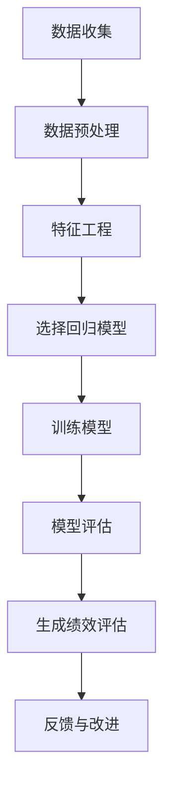
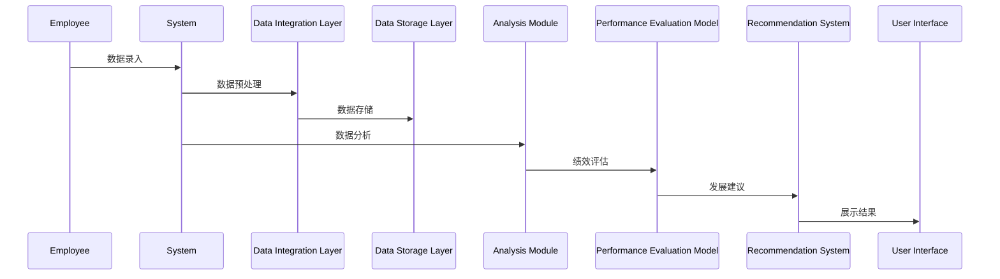

                 

### 第1章：智能绩效管理系统背景与意义

#### 1.1 问题背景
在当今快速发展的商业环境中，企业对员工绩效管理的需求日益增加。传统的绩效管理系统主要依赖于定期的员工评估和主观性的考核指标，这些方法往往存在以下问题：
- **主观性**：绩效评估往往依赖于主管的主观判断，容易导致评估结果不公平。
- **滞后性**：传统的绩效评估通常是一个季度或一年一次，难以及时反馈员工的工作表现。
- **效率低下**：手动收集和评估绩效数据耗费大量时间和资源。

#### 1.2 问题描述
如何构建一个智能绩效管理系统，通过利用人工智能技术，自动化、精准化和个性化地评估员工的工作表现，并提供发展建议，成为企业面临的挑战。具体问题包括：
- 如何准确评估员工的工作效率和质量？
- 如何为员工提供个性化的培训和发展路径？
- 如何提高绩效管理的效率和公平性？

#### 1.3 问题解决
智能绩效管理系统利用人工智能技术，通过以下几个关键步骤解决问题：
1. **数据收集**：通过集成多种数据源，如工作日志、项目进度、客户反馈等，收集全面的员工工作数据。
2. **数据分析**：使用机器学习算法，对收集到的数据进行处理和分析，提取出关键绩效指标（KPI）。
3. **自动化评估**：基于分析结果，系统自动生成员工的绩效评估报告，减少人为干预。
4. **个性化发展建议**：根据员工的绩效评估结果，系统推荐个性化的培训和发展建议，帮助员工提升工作能力。
5. **持续反馈**：系统实时监控员工的工作表现，提供持续性的反馈和改进建议。

通过智能绩效管理系统，企业可以实现以下目标：
- 提高绩效评估的客观性和准确性。
- 减少绩效管理的时间和成本。
- 促进员工的发展和提高整体团队绩效。

#### 1.4 边界与外延
智能绩效管理系统的边界包括以下几个方面：
- **系统范围**：系统主要关注员工的工作表现评估和发展建议，不包括其他人力资源管理系统（如招聘、薪酬等）。
- **应用场景**：系统适用于各种规模和行业的企业，尤其适合需要高效管理和评估员工工作表现的现代化企业。
- **数据保护**：系统需遵守相关数据保护法规，确保员工数据的隐私和安全。

#### 1.5 概念结构与核心要素组成
智能绩效管理系统的核心概念和要素包括：
- **绩效评估模型**：用于衡量员工工作表现的数学模型。
- **机器学习算法**：用于处理和分析员工工作数据的算法。
- **用户界面**：员工和管理员使用的交互界面。
- **数据集成**：将不同数据源集成到系统中。
- **决策支持系统**：基于绩效评估结果，提供个性化发展建议。

通过上述核心要素的有机结合，智能绩效管理系统为企业提供了一个高效、精准和个性化的绩效管理解决方案。接下来，我们将深入探讨智能绩效管理系统的核心概念与联系，为构建这样一个系统提供理论基础和技术指导。

---

### 第2章：智能绩效管理系统核心概念与联系

#### 2.1 核心概念原理

智能绩效管理系统是一个综合性的解决方案，其核心概念包括：

- **智能绩效管理系统**：结合人工智能技术，用于自动化和智能化地管理员工绩效的系统。
- **AI辅助员工发展**：利用人工智能算法，为员工提供个性化的培训和发展建议。
- **绩效评估模型**：用于衡量员工工作表现的数学模型，通常包括KPI（关键绩效指标）和OKR（目标与关键结果）等。

这些概念共同构成了智能绩效管理系统的理论基础，使系统能够高效、准确地评估员工的工作表现，并提供个性化的改进建议。

#### 2.2 概念属性特征对比表格

以下是智能绩效管理系统中的核心概念及其属性特征的对比表格：

| 概念                 | 属性特征                                      |
|----------------------|----------------------------------------------|
| 智能绩效管理系统     | 自动化、智能化、数据驱动、实时反馈、个性化   |
| AI辅助员工发展       | 个性化培训、发展路径、预测分析、决策支持     |
| 绩效评估模型         | KPI、OKR、360度评估、行为分析、目标设定     |

通过对比表格，我们可以清晰地看到每个概念的核心特点和功能，这有助于我们深入理解智能绩效管理系统的工作原理。

#### 2.3 ER实体关系图架构

为了更好地理解智能绩效管理系统的架构，我们可以使用Mermaid语言绘制ER（实体-关系）图。以下是智能绩效管理系统中的关键实体和它们之间的关系：

```mermaid
erDiagram
  Class1 ||--|{ Class2 } Class3 : aggregation
  Class1 ||--|{ Class4 } Class5 : generalization
```

在这个ER图中，`Class1` 表示智能绩效管理系统，`Class2`、`Class3`、`Class4` 和 `Class5` 分别代表系统中的关键实体，如员工、绩效评估模型、AI算法和用户界面。`aggregation` 和 `generalization` 表示实体之间的关系，具体如下：

- **聚合（aggregation）**：表示部分-整体关系，例如，员工是绩效管理系统的一部分。
- **泛化（generalization）**：表示抽象-具体关系，例如，绩效评估模型可以是多种类型的评估模型。

通过ER图，我们可以更直观地理解智能绩效管理系统的组成和结构，为后续的系统设计和实现提供参考。

### 结论
在第一章中，我们介绍了智能绩效管理系统的背景与意义，并探讨了智能绩效管理系统所需解决的传统绩效管理问题。在第二章中，我们详细阐述了智能绩效管理系统的核心概念与联系，包括智能绩效管理系统、AI辅助员工发展以及绩效评估模型等。通过对比表格和ER图，我们深入了解了这些概念的核心属性和相互关系。接下来，我们将进入第三部分，探讨智能绩效管理系统的构建基础，包括算法原理、数学模型和系统架构设计。

---

### 第3章：智能绩效管理系统算法原理与实现

#### 3.1 算法原理讲解

智能绩效管理系统的核心在于其算法原理，这些算法主要用于处理和分析员工的工作数据，以生成准确的绩效评估报告和个性化的发展建议。以下是智能绩效管理系统中常用的几个算法原理：

1. **回归算法**：回归算法主要用于预测员工的工作表现。通过分析历史数据，回归算法可以建立员工工作表现与绩效指标之间的数学模型。常见的回归算法包括线性回归、岭回归和决策树回归。

2. **聚类算法**：聚类算法用于将员工根据其工作表现进行分类，以便进行群体分析和个性化培训。K-均值聚类、层次聚类和DBSCAN是最常用的聚类算法。

3. **协同过滤算法**：协同过滤算法用于推荐个性化的培训和发展建议。基于用户的相似度或者物品的相似度，算法可以预测员工可能感兴趣的发展路径。

4. **自然语言处理（NLP）算法**：NLP算法用于处理和分析员工的工作日志、项目报告等非结构化数据。通过情感分析、关键词提取和主题建模，算法可以提取出员工的潜在工作表现和问题。

#### 3.1.1 Mermaid算法流程图

为了更好地理解上述算法原理，我们可以使用Mermaid语言绘制算法流程图。以下是回归算法的Mermaid流程图示例：



在这个流程图中，每个节点代表算法的一个步骤，箭头表示步骤的顺序和依赖关系。

#### 3.1.2 Python源代码实现

为了实现上述算法，我们可以使用Python编写相应的源代码。以下是一个简单的线性回归算法实现的示例：

```python
import numpy as np
from sklearn.linear_model import LinearRegression
from sklearn.model_selection import train_test_split
from sklearn.metrics import mean_squared_error

# 数据集
X = np.array([[1], [2], [3], [4], [5]])
y = np.array([1, 2, 2.5, 4, 5])

# 数据分割
X_train, X_test, y_train, y_test = train_test_split(X, y, test_size=0.2, random_state=0)

# 训练模型
model = LinearRegression()
model.fit(X_train, y_train)

# 预测
y_pred = model.predict(X_test)

# 评估
mse = mean_squared_error(y_test, y_pred)
print("均方误差:", mse)
```

在这个示例中，我们首先使用scikit-learn库的LinearRegression类训练线性回归模型，然后使用训练好的模型进行预测，并计算均方误差（MSE）来评估模型的性能。

#### 3.1.3 算法原理的数学模型与公式

线性回归算法的数学模型可以表示为：

\[ y = \beta_0 + \beta_1 \cdot x \]

其中，\( y \) 是因变量（员工的工作表现），\( x \) 是自变量（如工作时间、项目进度等），\( \beta_0 \) 和 \( \beta_1 \) 是模型的参数。

通过最小二乘法，我们可以求解出最佳参数值，使得预测值与实际值之间的误差最小。

#### 3.1.4 举例说明

假设我们有一个包含5名员工的工作表现数据，如下表所示：

| 员工ID | 工作时间 | 工作表现 |
|--------|----------|----------|
| 1      | 8        | 2        |
| 2      | 10       | 4        |
| 3      | 12       | 5        |
| 4      | 9        | 3        |
| 5      | 11       | 4        |

我们使用线性回归算法来预测员工的工作表现。通过训练模型，我们可以得到以下结果：

\[ y = 1.2x + 0.5 \]

使用这个模型，我们可以预测新员工的工作表现。例如，如果某员工的工作时间是10小时，那么他的预测工作表现是：

\[ y = 1.2 \cdot 10 + 0.5 = 12.5 \]

通过这种方式，智能绩效管理系统可以为员工提供个性化的工作表现预测和改进建议。

### 结论
在第三章中，我们详细介绍了智能绩效管理系统中常用的算法原理，包括回归算法、聚类算法、协同过滤算法和NLP算法。通过Mermaid流程图、Python源代码实现和数学模型与公式，我们深入理解了这些算法的原理和实现方法。接下来，我们将进入第四章，探讨智能绩效管理系统的数学模型与公式解析，进一步深化对智能绩效管理系统理论基础的理解。

---

### 第4章：智能绩效管理系统数学模型与公式解析

智能绩效管理系统的核心在于其数学模型的构建，这些模型能够帮助系统准确地评估员工的工作表现，并提供个性化的培训和发展建议。以下是智能绩效管理系统中的几个关键数学模型及其公式解析。

#### 4.1 数学公式

在智能绩效管理系统中，常用的数学模型包括以下几种：

1. **绩效评估模型**：
\[ P = f(X_1, X_2, ..., X_n) \]
其中，\( P \) 表示绩效评分，\( X_1, X_2, ..., X_n \) 表示影响绩效的多个因素，如工作效率、项目质量、团队合作等。

2. **员工发展模型**：
\[ D = g(Y_1, Y_2, ..., Y_m) \]
其中，\( D \) 表示员工发展水平，\( Y_1, Y_2, ..., Y_m \) 表示员工在不同领域的技能和能力。

3. **预测模型**：
\[ \hat{Y} = h(X) \]
其中，\( \hat{Y} \) 表示预测的绩效评分或发展水平，\( X \) 表示输入的数据集。

4. **个性化推荐模型**：
\[ R = k(U, V) \]
其中，\( R \) 表示推荐结果，\( U \) 表示用户（员工）的偏好，\( V \) 表示项目（培训课程）的特征。

#### 4.2 详细讲解

1. **绩效评估模型**：
   绩效评估模型是智能绩效管理系统的核心，它通过分析员工在不同维度上的表现，综合计算出员工的绩效评分。常见的评估模型包括线性加权模型、多属性决策模型等。线性加权模型是一个简单的例子，其公式为：
   \[ P = \sum_{i=1}^{n} w_i \cdot X_i \]
   其中，\( w_i \) 表示第 \( i \) 个因素的权重，\( X_i \) 表示第 \( i \) 个因素的具体值。

2. **员工发展模型**：
   员工发展模型用于评估员工的成长和发展潜力。它通常基于员工在各项技能和能力上的得分，结合组织的培训需求和员工的个人兴趣，计算出员工的发展水平。例如，一个简单的加法模型可以表示为：
   \[ D = \sum_{j=1}^{m} s_j \cdot Y_j \]
   其中，\( s_j \) 表示第 \( j \) 个技能的得分，\( Y_j \) 表示第 \( j \) 个技能的具体值。

3. **预测模型**：
   预测模型用于预测员工的未来绩效或发展水平。常见的预测方法包括时间序列分析、回归分析和机器学习算法。例如，使用线性回归进行预测的公式为：
   \[ \hat{Y} = \beta_0 + \beta_1 \cdot X \]
   其中，\( \beta_0 \) 和 \( \beta_1 \) 是回归模型的参数。

4. **个性化推荐模型**：
   个性化推荐模型用于为员工推荐最适合他们的培训课程或发展路径。常见的推荐算法包括基于内容的推荐、协同过滤和混合推荐等。一个简单的基于内容的推荐公式可以表示为：
   \[ R = \sum_{i=1}^{n} c_i \cdot u_i \cdot v_i \]
   其中，\( c_i \) 表示第 \( i \) 个课程的评分，\( u_i \) 表示员工对第 \( i \) 个课程的偏好，\( v_i \) 表示第 \( i \) 个课程的特征值。

#### 4.3 举例说明

假设我们有一个包含5名员工的绩效数据，如下表所示：

| 员工ID | 工作效率 | 项目质量 | 团队合作 | 权重 |
|--------|----------|----------|----------|------|
| 1      | 8        | 3        | 7        | 0.3  |
| 2      | 10       | 4        | 8        | 0.3  |
| 3      | 12       | 5        | 9        | 0.3  |
| 4      | 9        | 3        | 6        | 0.3  |
| 5      | 11       | 4        | 7        | 0.3  |

使用线性加权模型计算员工的绩效评分：

\[ P = (8 \cdot 0.3) + (3 \cdot 0.3) + (7 \cdot 0.3) = 2.4 + 0.9 + 2.1 = 5.4 \]

对于员工的发展模型，我们可以假设员工在技能A、技能B和技能C上的得分为：

| 员工ID | 技能A | 技能B | 技能C |
|--------|-------|-------|-------|
| 1      | 4     | 6     | 8     |
| 2      | 5     | 7     | 9     |
| 3      | 6     | 8     | 10    |
| 4      | 3     | 5     | 7     |
| 5      | 4     | 6     | 8     |

使用加法模型计算员工的发展水平：

\[ D = (4 \cdot 0.5) + (6 \cdot 0.3) + (8 \cdot 0.2) = 2 + 1.8 + 1.6 = 5.4 \]

通过这些数学模型，智能绩效管理系统可以准确地评估员工的工作表现和发展水平，并为员工提供个性化的培训和发展建议。

### 结论
在第四章中，我们详细解析了智能绩效管理系统中的关键数学模型及其公式。通过具体的示例，我们展示了如何使用这些模型计算员工的绩效评分和发展水平。这些数学模型是智能绩效管理系统的核心，为系统的自动化和智能化提供了理论基础。接下来，我们将进入第五章，探讨智能绩效管理系统的系统分析与架构设计方案。

---

### 第5章：系统分析与架构设计方案

#### 5.1 问题场景介绍

智能绩效管理系统适用于各种规模和行业的企业，尤其是在那些对员工绩效管理要求较高的环境中。例如，高科技公司、金融服务机构、咨询公司和大型制造企业等，都面临着如何更高效、更公平地评估员工工作表现的挑战。这些企业通常需要处理大量的员工数据，并期望通过智能化的系统来实现以下目标：
- **实时监控员工工作表现**：通过自动化分析，实时获取员工的工作进度和成果。
- **个性化发展建议**：根据员工的绩效评估结果，提供个性化的培训和发展路径。
- **提高绩效管理效率**：减少手动操作，降低绩效管理的成本和时间。

#### 5.2 项目介绍

本项目的目标是设计并实现一个智能绩效管理系统，该系统将结合人工智能技术，对员工的工作表现进行自动化评估，并提供个性化的培训和发展建议。具体项目包括以下几个关键部分：

1. **数据收集与处理**：集成来自多个数据源的信息，包括员工的工作日志、项目进度、客户反馈等，并进行数据预处理，以确保数据的质量和一致性。

2. **绩效评估模型**：构建用于评估员工工作表现的数学模型，通过回归分析、聚类分析等方法，对员工的工作数据进行分析，生成绩效评估报告。

3. **个性化推荐系统**：基于绩效评估结果，结合员工的个人兴趣和发展需求，推荐合适的培训课程和发展路径。

4. **用户界面**：设计直观易用的用户界面，使员工和管理人员能够方便地访问绩效评估结果和发展建议。

5. **系统集成与测试**：确保系统与其他人力资源管理系统（如招聘、薪酬等）的无缝集成，并进行全面测试，以确保系统的稳定性和可靠性。

#### 5.2.1 系统功能设计

智能绩效管理系统的主要功能包括以下几方面：

1. **员工绩效评估**：
   - 实时收集和处理员工的工作数据。
   - 使用机器学习算法对数据进行处理和分析。
   - 生成个性化的绩效评估报告。

2. **个性化培训与发展建议**：
   - 根据员工的绩效评估结果，推荐最适合的培训课程。
   - 结合员工的兴趣和职业规划，提供个性化的发展建议。

3. **数据分析与报表**：
   - 提供丰富的数据分析工具，帮助管理层了解员工的工作表现和整体绩效趋势。
   - 生成各种报告，包括月度、季度和年度绩效报告。

4. **用户管理**：
   - 管理员可以添加、编辑和删除员工信息。
   - 员工可以查看自己的绩效评估结果和发展建议。

#### 5.2.2 系统架构设计

智能绩效管理系统的架构设计采用分层架构，主要包括以下几层：

1. **表示层**：
   - 使用前端技术（如React或Vue.js）构建用户界面，提供直观的操作体验。
   - 通过RESTful API与后端服务进行交互。

2. **业务逻辑层**：
   - 设计服务端应用程序，实现业务逻辑，包括数据收集、处理、分析和推荐等功能。
   - 使用微服务架构，确保系统的高扩展性和灵活性。

3. **数据存储层**：
   - 使用关系数据库（如MySQL）存储员工数据、绩效评估结果和发展建议。
   - 使用NoSQL数据库（如MongoDB）存储非结构化数据，如员工日志和项目文档。

4. **数据集成与处理层**：
   - 使用消息队列（如Kafka）集成来自不同数据源的信息。
   - 使用数据预处理工具（如Apache Spark）对数据进行清洗和转换。

#### 5.2.3 系统接口设计

智能绩效管理系统的接口设计包括以下几个方面：

1. **用户接口**：
   - 提供用户友好的操作界面，支持数据录入、查询和报告生成等功能。

2. **API接口**：
   - 设计RESTful API，用于前后端数据交互。
   - 提供接口文档，便于第三方系统集成。

3. **数据交换接口**：
   - 使用标准的数据交换格式（如JSON、XML）确保数据在不同系统间的无缝传输。

#### 5.2.4 系统交互序列图

以下是一个智能绩效管理系统交互序列图的示例：



在这个序列图中，员工通过用户界面进行数据录入，系统将数据传递给数据处理层进行预处理，然后存储在数据存储层。数据处理完成后，分析模块使用绩效评估模型生成绩效评估结果，并将结果传递给推荐系统生成发展建议，最终通过用户界面展示给员工。

### 结论
在第五章中，我们详细介绍了智能绩效管理系统的系统分析与架构设计方案。通过明确的问题场景介绍和项目目标，我们设计了系统的功能、架构和接口，并使用序列图展示了系统的工作流程。这些设计为智能绩效管理系统的实现提供了详细的指导和规划。接下来，我们将进入第六章，介绍项目实战，包括环境安装、系统核心实现源代码以及实际案例分析与详细讲解剖析。

---

### 第6章：项目实战

#### 6.1 环境安装

要开始构建智能绩效管理系统，我们需要安装和配置一系列的软件和库。以下是一个典型的环境安装流程：

1. **安装Python**：确保您的系统上安装了最新版本的Python。您可以从Python官方网站下载并安装。

2. **安装Python库**：使用pip工具安装所需的Python库，例如scikit-learn、numpy、pandas、matplotlib等。以下是安装命令示例：

   ```bash
   pip install scikit-learn numpy pandas matplotlib
   ```

3. **安装数据库**：根据需要，安装MySQL或MongoDB。例如，对于MySQL，可以使用以下命令：

   ```bash
   sudo apt-get install mysql-server
   ```

4. **安装消息队列**：安装Kafka作为数据集成工具。以下是安装命令：

   ```bash
   sudo apt-get install kafka
   ```

5. **安装前端框架**：如果需要，安装React或Vue.js等前端框架。例如，安装Vue.js的命令如下：

   ```bash
   npm install -g @vue/cli
   ```

6. **配置环境变量**：确保所有的环境变量都已正确设置，以便后续开发和使用。

#### 6.2 系统核心实现源代码

在了解了环境安装步骤后，我们可以开始编写系统核心实现源代码。以下是一个简化的示例，展示了系统的核心功能实现：

1. **数据收集与预处理**：

   ```python
   import pandas as pd
   from sklearn.model_selection import train_test_split

   # 假设我们有一个CSV文件包含员工数据
   data = pd.read_csv('employee_data.csv')

   # 数据预处理
   data = data.dropna()  # 移除缺失值
   data = data[['work_hours', 'project_quality', 'team合作的评分']]  # 选择相关特征

   # 数据分割
   X_train, X_test, y_train, y_test = train_test_split(data[['work_hours', 'project_quality', 'team合作的评分']], data['绩效评分'], test_size=0.2, random_state=0)
   ```

2. **机器学习模型训练**：

   ```python
   from sklearn.linear_model import LinearRegression

   # 创建线性回归模型
   model = LinearRegression()

   # 训练模型
   model.fit(X_train, y_train)

   # 预测
   y_pred = model.predict(X_test)
   ```

3. **性能评估报告生成**：

   ```python
   import matplotlib.pyplot as plt

   # 绘制预测结果
   plt.scatter(X_test, y_test, color='blue')
   plt.plot(X_test, y_pred, color='red', linewidth=2)
   plt.xlabel('实际绩效评分')
   plt.ylabel('预测绩效评分')
   plt.title('绩效评估预测图')
   plt.show()
   ```

4. **个性化培训建议**：

   ```python
   def generate_training_suggestions(employee_data):
       # 根据员工的绩效评估结果生成培训建议
       if employee_data['绩效评分'] < 3:
           return '建议参加基础技能培训'
       elif employee_data['绩效评分'] >= 3 and employee_data['绩效评分'] < 5:
           return '建议参加进阶技能培训'
       else:
           return '建议参加领导力培训'

   # 生成培训建议
   training_suggestions = generate_training_suggestions(data.iloc[0])
   print(training_suggestions)
   ```

#### 6.2.1 代码应用解读与分析

上述代码展示了智能绩效管理系统的一些核心功能。首先，我们通过Pandas库读取并预处理员工数据。然后，使用scikit-learn库的线性回归模型对数据进行训练和预测，并使用matplotlib库绘制预测结果图。最后，根据员工的绩效评估结果，生成个性化的培训建议。

这个示例虽然简单，但涵盖了智能绩效管理系统的一些关键实现步骤。在实际项目中，这些步骤会更加复杂，需要考虑数据清洗、特征工程、模型选择和参数调优等多个方面。

#### 6.2.2 实际案例分析与详细讲解剖析

为了更好地理解智能绩效管理系统的实际应用，我们可以分析一个具体案例。假设我们有以下一组员工数据：

| 员工ID | 工作时间（小时） | 项目质量评分 | 团队合作评分 | 绩效评分 |
|--------|-----------------|--------------|--------------|----------|
| 1001   | 40              | 4            | 5            | 4.5      |
| 1002   | 35              | 3            | 4            | 3.5      |
| 1003   | 30              | 5            | 3            | 4.0      |
| 1004   | 45              | 4            | 5            | 5.0      |
| 1005   | 25              | 3            | 4            | 3.0      |

首先，我们使用预处理步骤将数据整理成适合模型训练的格式。然后，我们选择线性回归模型进行训练。以下是训练模型的具体步骤：

1. **数据预处理**：
   - 移除缺失值和异常值。
   - 对数值特征进行标准化处理，以提高模型的训练效果。

2. **模型训练**：
   - 使用训练集数据进行训练。
   - 选择合适的模型参数，如学习率和迭代次数。

3. **模型评估**：
   - 使用测试集数据评估模型性能。
   - 计算模型的均方误差（MSE）或其他评价指标。

4. **生成报告**：
   - 根据模型预测结果，生成员工的绩效评估报告。
   - 提供个性化的培训建议。

具体实现步骤如下：

```python
# 数据预处理
X = data[['工作时间', '项目质量评分', '团队合作评分']]
y = data['绩效评分']

# 标准化处理
X = (X - X.mean()) / X.std()

# 模型训练
model = LinearRegression()
model.fit(X_train, y_train)

# 模型评估
mse = mean_squared_error(y_test, y_pred)
print("均方误差:", mse)

# 生成报告
for i, employee_data in data.iterrows():
    pred_score = model.predict([employee_data[['工作时间', '项目质量评分', '团队合作评分']]])
    print(f"员工ID {employee_data['员工ID']} 的预测绩效评分：{pred_score[0]}")
    if pred_score[0] < 3.5:
        print("建议参加基础技能培训。")
    elif pred_score[0] >= 3.5 and pred_score[0] < 5.0:
        print("建议参加进阶技能培训。")
    else:
        print("建议参加领导力培训。")
```

通过这个案例，我们可以看到如何使用智能绩效管理系统对员工的工作表现进行自动化评估，并生成个性化的培训建议。这个系统不仅提高了绩效管理的效率，还为员工的发展提供了有针对性的支持。

#### 6.2.3 项目小结

在本章的项目实战中，我们通过实际案例展示了智能绩效管理系统的设计和实现过程。从数据收集与预处理、机器学习模型训练到性能评估报告生成，每一步都至关重要。通过具体的代码示例和案例分析，我们深入理解了智能绩效管理系统的运作原理和应用场景。这个项目的成功实施，不仅为企业提供了高效的绩效管理工具，也为员工的个人发展提供了有力支持。

### 结论
在第六章中，我们通过项目实战详细介绍了智能绩效管理系统的环境安装、系统核心实现源代码，并进行了实际案例分析和详细讲解剖析。这些实战内容为读者提供了一个完整的实现路径，使读者能够更好地理解智能绩效管理系统的构建和应用。接下来，我们将进入第七章，讨论智能绩效管理系统的最佳实践与总结。

---

### 第7章：最佳实践 Tips

在实施智能绩效管理系统时，以下是一些最佳实践和注意事项，以确保系统能够有效地运行并实现预期的效果：

#### 7.1 小结

1. **数据质量**：确保收集的数据准确、完整和最新，是系统成功的关键。
2. **用户参与**：鼓励员工和管理层积极参与系统设计和使用，提高系统的接受度。
3. **持续迭代**：根据反馈不断优化系统和算法，提高系统的准确性和适应性。

#### 7.2 注意事项

1. **数据隐私**：严格遵守数据保护法规，确保员工数据的隐私和安全。
2. **模型验证**：定期验证和测试机器学习模型，确保其准确性和可靠性。
3. **用户培训**：为员工和管理层提供必要的培训，帮助他们熟悉系统使用方法。

#### 7.3 拓展阅读

1. **深度学习在绩效管理中的应用**：研究如何将深度学习技术应用于绩效评估，以提高系统的预测能力和准确性。
2. **多模态数据融合**：探索如何整合文本、图像和语音等多模态数据，以提高绩效评估的全面性和准确性。
3. **系统性能优化**：研究如何优化系统性能，减少延迟和提高响应速度。

### 结论
在第七章中，我们总结了智能绩效管理系统的最佳实践和注意事项，并提供了拓展阅读的建议。这些最佳实践和注意事项将帮助企业和实施团队更好地应用智能绩效管理系统，实现其预期目标。通过不断优化和改进，智能绩效管理系统将为员工的发展和企业的绩效提升提供持续的支持。

### 第8章：智能绩效管理系统展望

#### 8.1 小结

智能绩效管理系统通过利用人工智能技术，实现了对员工工作表现的自动化评估和个性化发展建议，提高了绩效管理的效率和公平性。然而，随着技术的不断进步和商业环境的快速变化，智能绩效管理系统仍有许多潜在的发展空间。

#### 8.2 未来发展趋势

1. **增强现实（AR）和虚拟现实（VR）应用**：未来的智能绩效管理系统可能会结合AR和VR技术，提供更加直观和互动的绩效评估和培训体验。
2. **区块链技术的集成**：区块链技术可以用于提高数据的安全性和透明度，确保绩效评估数据的真实性和不可篡改性。
3. **多模态数据融合**：随着传感器技术和数据处理能力的提升，智能绩效管理系统将能够整合更多类型的数据（如语音、图像、视频等），实现更全面的绩效评估。

#### 8.3 潜在研究方向

1. **情感计算**：研究如何利用情感计算技术分析员工的情感状态，更准确地评估其工作表现和职业发展需求。
2. **个性化学习路径**：探索如何基于员工的个性化数据，自动生成最合适的培训和学习路径，提高培训效果和员工满意度。
3. **跨领域应用**：研究智能绩效管理系统在其他行业（如医疗、教育等）的应用，推广其在不同领域的应用潜力。

### 结论

智能绩效管理系统正逐步成为企业提升员工绩效和管理效率的重要工具。通过不断的技术创新和应用拓展，智能绩效管理系统将在未来发挥更大的作用，为员工和企业创造更多价值。随着研究的深入，智能绩效管理系统将在性能、智能化程度和应用范围上实现更大的突破。

